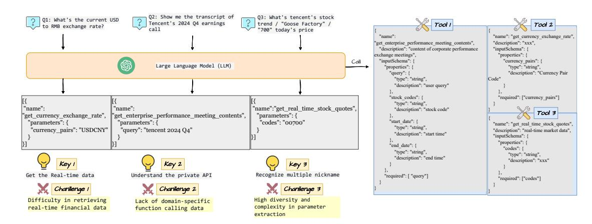
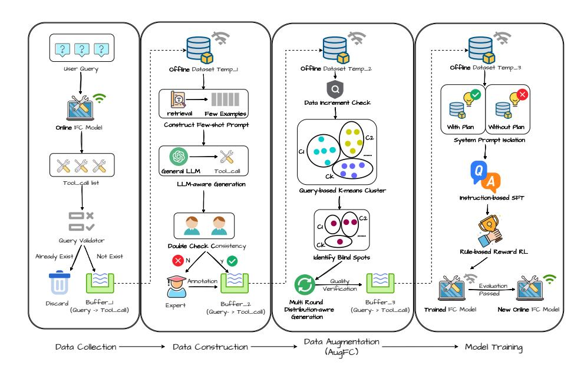
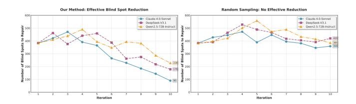
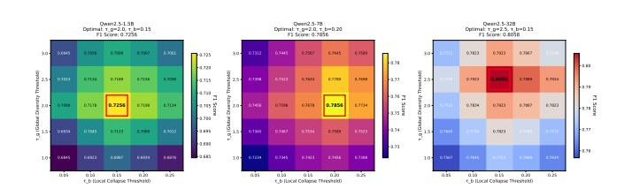
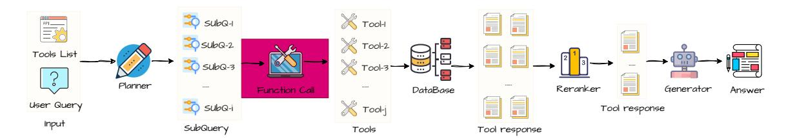
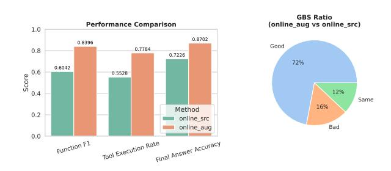

# Data-Driven Function Calling Improvements in Large Language Model for Online Financial QA

Xing Tang∗ Shenzhen Technology University Shenzhen, China

Hao Chen∗ FiT, Tencent Shenzhen, China

Shiwei Li Huazhong University of Science and Technology Wuhan, China

Fuyuan Lyu McGill University Montreal, Canada

Weijie Shi The Hong Kong University of Science and Technology Hong Kong SAR, China

Lingjie Li Shenzhen Technology University Shenzhen, China

Dugang Liu Shenzhen University Shenzhen, China

Weihong Luo† Xiku Du FiT, Tencent Shenzhen, China

Xiuqiang He† Shenzhen Technology University Shenzhen, China

## Abstract

Large language models (LLMs) have been incorporated into numerous industrial applications. Meanwhile, a vast array of API assets is scattered across various functions in the financial domain. An online financial question-answering system can leverage both LLMs and private APIs to provide timely financial analysis and information. The key is equipping the LLM model with function calling capability tailored to a financial scenario. However, a generic LLM requires customized financial APIs to call and struggles to adapt to the financial domain. Additionally, online user queries are diverse and contain out-of-distribution parameters compared with the required function input parameters, which makes it more difficult for a generic LLM to serve online users. In this paper, we propose a data-driven pipeline to enhance function calling in LLM for our online, deployed financial QA, comprising dataset construction, data augmentation, and model training. Specifically, we construct a dataset based on a previous study and update it periodically, incorporating queries and an augmentation method named AugFC. The addition of user query-related samples will exploit our financial toolset in a data-driven manner, and AugFC explores the possible parameter values to enhance the diversity of our updated dataset. Then, we train an LLM with a two-step method, which enables the use of our financial functions. Extensive experiments on existing offline datasets, as well as the deployment of an online scenario, illustrate the superiority of our pipeline. The related pipeline has been adopted in the financial QA of YuanBa[o](#page-0-0)1 , one of the largest chat platforms in China.

[This work is licensed under a Creative Commons Attribution-NonCommercial-](https://creativecommons.org/licenses/by-nc-nd/4.0)[NoDerivatives 4.0 International License.](https://creativecommons.org/licenses/by-nc-nd/4.0)

WWW '26, Dubai, United Arab Emirates © 2026 Copyright held by the owner/author(s). ACM ISBN 979-8-4007-2307-0/2026/04 <https://doi.org/10.1145/3774904.3792813>

### CCS Concepts

• Information systems → Question answering; Web mining.

## Keywords

Function Calling, Financial QA, Large language model

### ACM Reference Format:

Xing Tang, Hao Chen, Shiwei Li, Fuyuan Lyu, Weijie Shi, Lingjie Li, Dugang Liu, Weihong Luo, Xiku Du, and Xiuqiang He. 2026. Data-Driven Function Calling Improvements in Large Language Model for Online Financial QA. In Proceedings of the ACM Web Conference 2026 (WWW '26), April 13–17, 2026, Dubai, United Arab Emirates. ACM, New York, NY, USA, [12](#page-11-0) pages. <https://doi.org/10.1145/3774904.3792813>

## 1 Introduction

Recently, large language models (LLMs) have emerged as a powerful tool, demonstrating remarkable capabilities in understanding, generating, and reasoning with text [\[1,](#page-8-0) [3,](#page-8-1) [8\]](#page-8-2). These features enable LLMs to seamlessly integrate with various web applications, including online code copilots, online chatbots, and question-answering systems. In finance and economics, various financial documents are used to analyze and predict market trends [\[16\]](#page-8-3). Therefore, equipped with LLMs, online financial question-answering (QA) systems have shown promising progress in understanding and responding to complex queries related to these financial documents [\[17,](#page-8-4) [32\]](#page-8-5).

Building an online financial QA system powered by LLM is nontrivial and requires specific efforts. Typically, in the financial scenario, important financial information is often provided by external APIs or functions and must be updated promptly, which restricts the direct application of LLM in financial QA, as illustrated in the first key point of Figure. [1.](#page-1-0) To address this, the LLM can be trained to utilize timely external knowledge via function calling or tool calling [\[12,](#page-8-6) [13,](#page-8-7) [15,](#page-8-8) [29\]](#page-8-9), a technique that has been widely adopted in agents [\[31,](#page-8-10) [34\]](#page-8-11). The core components of function calling are, respectively, tool selection and parameter extraction based on the query and function documents. Provided private APIs and functions, LLM can retrieve the external up-to-date knowledge based

∗Both authors contributed equally to this research.

†Corresponding authors.

1https://yuanbao.tencent.com/chat/

Figure 1: The overview of the key points and corresponding challenges in the online financial QA system powered by LLM.

on the extracted parameters from the user query. Together with its internal capability, the empowered LLM can give a more accurate answer.

A simple approach is to introduce a commercial LLM equipped with general function calling capabilities, directly serving user queries [\[28\]](#page-8-12). While commercial LLMs generally perform well in function calling, these models often struggle to provide accurate and robust function calling capabilities for specialized scenarios due to the lack of private training data [\[36\]](#page-8-13). As the example in Figure. [1](#page-1-0) indicates, the function used to "get enterprise performance meeting contents" is usually unique to financial analysis, which is unavailable in the general function calling dataset. Hence, collecting function calling data to train a financial tool-specific LLM is essential. Moreover, the financial APIs are usually highly customized, while the queries are diverse. The third key point in Figure. [1](#page-1-0) illustrates this challenge. Invoking the function "get stock quotes" requires extracting the company name as a parameter from the user query. Some queries will directly specify the company name, while some will give a nickname. For example, both "700" and "Goose Factory" in queries refer to Tencent, where the code "700" is the stock symbol of Tencent, and "Goose Factory" is the mascot of this company. Therefore, the diversity of private datasets based on the user queries poses another challenge in improving the performance of function calling.

In this work, we design a data-driven pipeline to improve the function calling in LLM for our online financial QA. Starting with an annotated financial QA dataset following xLAM [\[37\]](#page-8-14), our dataset is periodically updated with both user queries and augmented datasets. Specifically, constructing user query-related samples exploits the existing toolset based on direct function call results in online interaction. This exploitation is responsible for improving coverage on the financial tool sets of our dataset. However, as previously stated, the diversity poses a challenge for both the query and the parameters. We thus propose an automated augmentation method named AugFC to explore the possible queries containing parameter values in our datasets. Based on the updated dataset, we further train a language model that includes a supervised fine-tuning (SFT) stage and a reinforcement learning stage, enabling the base model

to utilize financial tools aligned with our scenario. In summary, our main contributions are as follows:

- We first identify the core challenges in building our online financial QA system, providing practical lessons from industrial applications.
- We develop a data-driven automated function calling pipeline consisting of a dataset constructed, data augmentation, and model training to enhance the base LLM for our online financial QA system. The pipeline is effective in improving the performance of function calling in the LLM.
- Extensive experiments on both the offline dataset and the online scenario have been conducted to validate the superiority of our method.

### 2 Related work

In this section, we provide a brief review of two topics related to our work: financial QA and function calling.

## 2.1 Financial QA

Question-answering systems have already achieved remarkable progress with the introduction of LLM. Most financial QA systems focus on numerical reasoning to handle multi-step calculations and extract relevant information from various data sources [\[27,](#page-8-15) [32,](#page-8-5) [38\]](#page-8-16). ZS-FinPYT and ZS-FinDSL [\[18,](#page-8-17) [19\]](#page-8-18) introduce zero-shot techniques for LLMs to perform complex numerical reasoning over financial documents. A multi-agent framework is also adopted, incorporating a critic agent that reflects on the reasoning steps and final answers for each question [\[7\]](#page-8-19). Besides, some works are devoted to financial text QA [\[5\]](#page-8-20). WeaverBird [\[33\]](#page-8-21) is a dialogue system specifically for the finance sector. Leveraging finetuned LLM on extensive financial corpora, it provides informed responses to complex user queries. Our work first gives how to incorporate function calling in LLM to solve diverse online financial QA queries, which hopefully sheds light on building industry financial QA.

## 2.2 Function Calling

Function calling or tool calling has represented a pivotal advancement in empowering LLMs with dynamic interaction capabilities

### 4.1 Experimental settings

4.1.1 Datasets. Considering our single-hop financial QA, we introduce six benchmark datasets to evaluate our method. The API-Bank [\[12\]](#page-8-6) comprises two versions, which include 314 tool-use dialogues and 753 API calls, evaluating models' ability to invoke a known API(L-1) or retrieve and call APIs from a candidate list(L2). Tool-Alpaca [\[26\]](#page-8-22) contains 271 tool-use instances in 50 categories. Seal-Tools [\[30\]](#page-8-36) is one of the extensive and recent benchmarks, with 4,076 automatically generated APIs across various life domains. Nexus Raven Evaluation [\[24\]](#page-8-37) consists of 318 test examples across 65 distinct APIs. Lastly, we sample xLAM-small at a ratio of 0.1 from xLAM-60k [\[37\]](#page-8-14), which utilizes over 3,673 APIs across 21 categories from ToolBench [\[21\]](#page-8-24).

4.1.2 Metrics. The tool selection can be evaluated as a multi-class classification task, where each function tool category is treated as a class. Then, a confusion matrix is constructed, where the rows represent the actual tool categories and the columns represent the predicted categories. With the confusion matrix, we can adopt the F1 score to evaluate the model's capability to select tools.

4.1.3 Base models training. The language models we adopt in training are the Qwen2.5 series [\[3\]](#page-8-1), whose sizes range from 1.5B to 7B and 32B. We first sample 90% xLAM-60k as a seed dataset, and employ our AugFC to generate augmented data. The combined dataset is then used for training our model. For comparison with other existing function calling methods, we directly adopt the opensourced model with different model sizes, including the xLAM [\[37\]](#page-8-14) series and the Hammer [\[13\]](#page-8-7) series.

### 4.2 RQ1: Overall performance of data augmentation

To evaluate the data augmentation, we compared the performance of models trained on different datasets. Specifically, the vanilla represents the base model, relying on the base model's capability to invoke a function. The src-only denotes model training based on our sampled xLAM-60k, while the aug-only uses augmented data based on the src-only model with our AugFC. src+aug is our combined dataset, which is consistent with our pipeline. The overall performance is given in Table [1.](#page-6-0)

Based on the results, we make the following observations. First, the base model's function calling capability fails to meet the accuracy requirements. Notably, the small model can hardly achieve comparable performance with trained models, which justifies the need to investigate this problem. Second, the src-only data performs better than the aug-only data, indicating that the augmented data cannot achieve comparable performance in the absence of the original data and sometimes degrades its performance. Ultimately, our combined dataset, which encompasses both source and augmented data, yields the best performance on average. This further validates the effectiveness of our AugFC.

## 4.3 RQ2: The number of blind spots

The key concept in AugFC is the existence of blind spots. We introduce a powerful language model to generate related data and repair blind spots. Hence, we will answer whether the number of blind spots decreases with each iteration. We utilize three different LLMs

Figure 4: The number of blind spots to repair with different LLMs.

as generated LLMs, including both commercial and open-source models, as shown in Figure [4,](#page-5-0) including Claude-4 [4](#page-5-1) , Deepseek-v3.1 [5](#page-5-2) , and Qwen2.5-72B-instruct [6](#page-5-3) .

Meanwhile, we also use random sampling as a comparison, which draws data directly from users' online queries. It is evident that our method significantly reduces blind spots compared to random sampling across three main LLMs. Moreover, random sampling may introduce new blind spots due to its random nature.

### 4.4 RQ3: The effect of hyperparameters.

Figure 5: The heatmap illustrating how ���� and ���� affects the performance resepectively.

Referring to Definition [1,](#page-3-1) two key hyperparameters ���� and ���� determine the blind spot together. Therefore, we need to investigate how these two hyperparameters affect our pipeline. We do a grid search on two hyperparameters, where ���� ∈ {1.0, 1.5, 2.0, 2.5, 3.0} and ���� ∈ {0.05, 0.1, 0.15, 0.2, 0.25} for each size of base model. The heat maps are illustrated in Figure [5.](#page-5-4)

Notice that the ���� is not the largest one that leads to better performance. The reason is that the large one will filter out some queries that do not need to be augmented to conquer blind spots with data augmentation. Meanwhile, ���� is not the smallest one that leads to better performance, which indicates the difficulty in repairing blind spots when the parameter distribution collapses too much.

## 4.5 RQ4: The ablation study of AugFC

To verify the effectiveness of the components in AugFC, we conduct an ablation study of AugFC. The first one is w/o blind spots, which uses random sampling instead of blind spots detection. The second is w/o designed prompt, which uses a plain prompt without distribution information. Lastly,w/o multi-round indicates that we

4https://claude.ai/

5https://chat.deepseek.com/

6https://chat.qwen.ai/

| Model Size Training   | dataset API-Bank L1 | API-Bank L2 | Tool-Alpaca | Seal-Tools | Nexus Raven | xLAM-small | Avg    |
|-----------------------|---------------------|-------------|-------------|------------|-------------|------------|--------|
| vanilla               | 0.6525              | 0.4293      | 0.4290      | 0.7491     | 0.4988      | 0.5577     | 0.5527 |
| src-only Qwen2.5-1.5B | 0.7826              | 0.6533      | 0.6084      | 0.8865     | 0.5348      | 0.5934     | 0.6765 |
| aug-only              | 0.6973              | 0.4992      | 0.4242      | 0.8551     | 0.7500      | 0.6857     | 0.6519 |
| src+aug               | 0.7226              | 0.6648      | 0.6233      | 0.8898     | 0.7840      | 0.7288     | 0.7256 |
| vanilla               | 0.6985              | 0.6036      | 0.6158      | 0.8083     | 0.7283      | 0.5914     | 0.6743 |
| src-only Qwen2.5-7B   | 0.8295              | 0.6529      | 0.6745      | 0.9426     | 0.7892      | 0.7428     | 0.7719 |
| aug-only              | 0.7776              | 0.5824      | 0.5808      | 0.9116     | 0.6238      | 0.8038     | 0.7133 |
| src+aug               | 0.8002              | 0.6440      | 0.6667      | 0.9492     | 0.8901      | 0.8165     | 0.7856 |
| vanilla               | 0.7988              | 0.6304      | 0.6448      | 0.9339     | 0.8266      | 0.7135     | 0.7580 |
| src-only Qwen2.5-32B  | 0.8325              | 0.5433      | 0.6792      | 0.9485     | 0.8807      | 0.7736     | 0.7763 |
| aug-only              | 0.7771              | 0.5357      | 0.6308      | 0.9129     | 0.8624      | 0.8282     | 0.7579 |
| src+aug               | 0.8416              | 0.6501      | 0.6775      | 0.9494     | 0.8682      | 0.8479     | 0.8058 |

Table 1: The overall performance to validate our AugFC. The vanilla denotes the base model without any training, the src-only denotes we only use the seed data, aug-only means the augmented data is used, and src+aug represents the combined dataset. All results are measured using the F1 score. The best results are bold, and the second-best results are underlined.

only use a single round to generate the augmented data. The results averaged on the benchmark datasets are illustrated in Table [2.](#page-6-1)

From the results, we conclude that the designed prompt has the most significant impact on performance, with reductions of 7.4%, 6.1%, and 4.2% on the three-sized models. The designed prompt directly determines the quality of the generated samples. The component of blind spots also significantly affects performance, because it provides information on which parameters need to be augmented. The absence of multi-round also degrades the performance, indicating that multi-round is also necessary. The overall ablation further verifies the effectiveness of our AugFC.

| Model        | AugFC | w/o blind spots | w/o designed prompt | w/o multi-round |
|--------------|-------|-----------------|---------------------|-----------------|
| Qwen2.5-1.5B | 0.726 | 0.689           | 0.672               | 0.695           |
| Qwen2.5-7B   | 0.786 | 0.742           | 0.738               | 0.752           |
| Qwen2.5-32B  | 0.806 | 0.765           | 0.772               | 0.780           |

Table 2: The ablation study of AugFC. The results are the averages of the six benchmark datasets.

### 4.6 RQ5: The effectiveness of two-step method

Lastly, we conduct experiments to verify our proposed two-step method. We compare Hammer, xLAM, and Qwen2.5 with our model on six benchmark datasets. xLAM uses the SFT approach, further aligning model checkpoints with the DP method. Hammer only adopts the finetuning step. Notice that the maximum size of the hammer series is 7B. Both xLAM-1.3B, xLAM-7B, and the Hammer series are trained on the xLAM-60k dataset, while the Qwen2.5 models serve as the base models. The results are demonstrated in Table [3.](#page-7-0)

The base model performs the worst, which is in accordance with the conclusions based on Table [1.](#page-6-0) It is then clear that our training method outperforms the other two across all model sizes, indicating that the two-step method is superior to other finetuning methods.

### 5 Online experiments

Our data-driven pipeline is primarily centered on the online setting in FiT, Tencent. We also conduct various experiments on our online financial QA systems, which have been integrated into Yuanbao.

### 5.1 Online system

We first briefly present our online financial QA system in Figure [6.](#page-7-1) The system consists of four components: planner, function call, reranker, and generator. The planner will provide the subqueries based on the tool list and the user query. The function call is where our pipeline works. After our pipeline generates the tool response, the reranker will rerank the inputs according to relevance and other constraints. A generator will output the answer. Obviously, the function call component mainly determines the quality of the answer by involving tools.

## 5.2 Online results

In the online setting, we deploy two pipelines in the function call. One is our data-driven pipeline, and another one is without our pipeline. Specifically, we have an annotated dataset named online\_src at the beginning. After our pipeline, the augmented dataset online\_aug is then obtained. The base model only trains the model with online\_src using SFT, whereas our pipeline provides a model with online\_aug.

The online metrics encompass both automated and manual ones. The automated ones consist of F1 score and Tool Execution Rate. The F1 score is consistent with our offline experimental setting, indicating accuracy. The tool execution rate refers to the success rate of tool execution in a real-world environment, indicating the reliability of the pipeline. The manual ones include Final answer accuracy and GBS ratio. The final answer accuracy is checked by determining whether the final answer is aligned with the reference

| Model Size Model  | Type API-Bank L1 | API-Bank L2 | Tool-Alpaca | Seal-Tools | Nexus Raven | xLAM-small | Avg    |
|-------------------|------------------|-------------|-------------|------------|-------------|------------|--------|
| Qwen2.5-1.5B      | 0.6525           | 0.4293      | 0.4290      | 0.7491     | 0.4988      | 0.5577     | 0.5527 |
| xLAM-1.3B-fc 1.5B | 0.8370           | 0.6432      | 0.5058      | 0.8043     | 0.5480      | 0.5368     | 0.6459 |
| Hammer-1.5B       | 0.7230           | 0.5971      | 0.5348      | 0.8865     | 0.5688      | 0.5192     | 0.6382 |
| ours              | 0.7226           | 0.6048      | 0.6233      | 0.8898     | 0.7840      | 0.7288     | 0.7256 |
| Qwen2.5-7B        | 0.6985           | 0.6036      | 0.6158      | 0.8083     | 0.7283      | 0.5914     | 0.6743 |
| xLAM-7B-fc 7B     | 0.8069           | 0.6424      | 0.5896      | 0.7687     | 0.5409      | 0.6378     | 0.6644 |
| Hammer-7B         | 0.8311           | 0.6598      | 0.6250      | 0.8987     | 0.7464      | 0.6535     | 0.7358 |
| ours              | 0.8002           | 0.6440      | 0.6667      | 0.9492     | 0.8901      | 0.8165     | 0.7856 |
| Qwen2.5-32B       | 0.7988           | 0.6304      | 0.6448      | 0.9339     | 0.8266      | 0.7135     | 0.7580 |
| xLAM-2-32B-fc 32B | 0.8270           | 0.6000      | 0.6597      | 0.9049     | 0.8573      | 0.6985     | 0.7652 |
| ours              | 0.8416           | 0.6501      | 0.6775      | 0.9494     | 0.8682      | 0.8479     | 0.8058 |

Table 3: The comparison of our two-step training model with existing models. All results are measured using the F1 score. The best results are bold, and the second-best results are underlined.

Figure 6: The overview illustration of the online financial QA system. Our pipeline is marked as red in the whole system.

Figure 7: The online results measured by four metrics.

answer, ignoring the intermediate output. The GBS ratio is Good: Bad: Same ratio, which is an evaluation metric used to assess the impact of changes in complex systems manually.

A query will traverse the entire system, whether or not our pipeline is involved, and the online metrics will measure both results. We evaluate 350 end-to-end query-answer pairs, which involve nearly 2,000 pairs of query and tool-call list. The results are demonstrated in Figure [7.](#page-7-2) For the automated metrics, the F1 score improves by 39.1%, and the tool execution rate gains 40.7% improvements. For manual metrics, final answer accuracy gains 20.3% improvements, and the GBS ratio has 72% good results compared with 16% bad ones. It can be concluded that our pipeline is superior to the baseline and meets the requirements for full deployment on the system.

Moreover, we randomly sampled 500 instances (10% of the augmented dataset) and assigned them to two experts for independent review. 90% of the augmented data are directly usable, 6% contain minor issues that can be easily corrected, and only 4% exhibit severe errors requiring discarding.

## 6 Conclusion

In this paper, we present a data-driven pipeline to improve function calling in LLM for our online financial QA system. The pipeline collects online user queries to exploit the toolset and proposes a data augmentation method, AugFC, to explore potential queries, thereby addressing the blind spots in the query space. A two-step training method is then introduced to enhance the capability to call functions. We hope our work can provide practitioners with experience of deploying LLMs in real-world scenarios, and the data-driven approach will offer a new perspective on LLM applications. In the future, we will extend our pipeline to include multiple tool dependencies or cross-module call scenarios to further verify effectiveness.

## 7 Acknowledgement

We thank the support of the Shenzhen Technology University School-level (No.20251061020002), Scientific Research Capacity Enhancement Program for Key Construction Disciplines in Guangdong Province (No.2024ZDJS063), the National Natural Science Foundation of China(NSFC) (No. 62506238).

### References

[1] Josh Achiam, Steven Adler, Sandhini Agarwal, Lama Ahmad, Ilge Akkaya, Florencia Leoni Aleman, Diogo Almeida, Janko Altenschmidt, Sam Altman, Shyamal Anadkat, et al. 2023. Gpt-4 technical report. arXiv preprint arXiv:2303.08774 (2023). [2] Lada A Adamic and Bernardo A Huberman. 2000. Power-law distribution of the world wide web. science 287, 5461 (2000), 2115–2115. [3] Jinze Bai, Shuai Bai, Yunfei Chu, Zeyu Cui, Kai Dang, Xiaodong Deng, Yang Fan, Wenbin Ge, Yu Han, Fei Huang, et al. 2023. Qwen technical report. arXiv preprint arXiv:2309.16609 (2023). [4] Tom Brown, Benjamin Mann, Nick Ryder, Melanie Subbiah, Jared D Kaplan, Prafulla Dhariwal, Arvind Neelakantan, Pranav Shyam, Girish Sastry, Amanda Askell, et al. 2020. Language models are few-shot learners. Advances in neural information processing systems 33 (2020), 1877–1901. [5] Jian Chen, Peilin Zhou, Yining Hua, Loh Xin, Kehui Chen, Ziyuan Li, Bing Zhu, and Junwei Liang. 2024. FinTextQA: A Dataset for Long-form Financial Question Answering. In Proceedings of the 62nd Annual Meeting of the Association for Computational Linguistics (Volume 1: Long Papers). 6025–6047. [6] Guanting Dong, Yifei Chen, Xiaoxi Li, Jiajie Jin, Hongjin Qian, Yutao Zhu, Hangyu Mao, Guorui Zhou, Zhicheng Dou, and Ji-Rong Wen. 2025. Tool-Star: Empowering LLM-Brained Multi-Tool Reasoner via Reinforcement Learning. arXiv preprint arXiv:2505.16410 (2025). [7] Sorouralsadat Fatemi and Yuheng Hu. 2024. Enhancing Financial Question Answering with a Multi-Agent Reflection Framework. In Proceedings of the 5th ACM International Conference on AI in Finance (Brooklyn, NY, USA) (ICAIF '24). Association for Computing Machinery, 530–537. [8] Daya Guo, Dejian Yang, Haowei Zhang, Junxiao Song, Peiyi Wang, Qihao Zhu, Runxin Xu, Ruoyu Zhang, Shirong Ma, Xiao Bi, et al. 2025. DeepSeek-R1 incentivizes reasoning in LLMs through reinforcement learning. Nature 645, 8081 (2025), 633–638. [9] Bingguang Hao, Maolin Wang, Zengzhuang Xu, Yicheng Chen, Cunyin Peng, Jinjie Gu, and Chenyi Zhuang. 2025. Exploring Superior Function Calls via Reinforcement Learning. CoRR abs/2508.05118 (2025). [https://doi.org/10.48550/](https://doi.org/10.48550/arXiv.2508.05118) [arXiv.2508.05118](https://doi.org/10.48550/arXiv.2508.05118) [10] Bingguang Hao, Maolin Wang, Zengzhuang Xu, Cunyin Peng, Yicheng Chen, Xiangyu Zhao, Jinjie Gu, and Chenyi Zhuang. 2025. FunReason: Enhancing Large Language Models' Function Calling via Self-Refinement Multiscale Loss and Automated Data Refinement. arXiv preprint arXiv:2505.20192 (2025). [11] Edward J Hu, Yelong Shen, Phillip Wallis, Zeyuan Allen-Zhu, Yuanzhi Li, Shean Wang, Lu Wang, Weizhu Chen, et al. 2022. Lora: Low-rank adaptation of large language models. ICLR 1, 2 (2022), 3. [12] Minghao Li, Yingxiu Zhao, Bowen Yu, Feifan Song, Hangyu Li, Haiyang Yu, Zhoujun Li, Fei Huang, and Yongbin Li. 2023. API-Bank: A Comprehensive Benchmark for Tool-Augmented LLMs. In Proceedings of the 2023 Conference on Empirical Methods in Natural Language Processing. Association for Computational Linguistics, Singapore, 3102–3116. [13] Qiqiang Lin, Muning Wen, Qiuying Peng, Guanyu Nie, Junwei Liao, Jun Wang, Xiaoyun Mo, Jiamu Zhou, Cheng Cheng, Yin Zhao, Jun Wang, and Weinan Zhang. 2025. Robust Function-Calling for On-Device Language Model via Function Masking. In The Thirteenth International Conference on Learning Representations, ICLR 2025, Singapore, April 24-28, 2025. OpenReview.net. [14] Weiwen Liu, Xu Huang, Xingshan Zeng, Shuai Yu, Dexun Li, Shuai Wang, Weinan Gan, Zhengying Liu, Yuanqing Yu, Zezhong WANG, et al. [n. d.]. ToolACE: Winning the Points of LLM Function Calling. In The Thirteenth International Conference on Learning Representations. [15] Zuxin Liu, Thai Hoang, Jianguo Zhang, Ming Zhu, Tian Lan, Shirley Kokane, Juntao Tan, Weiran Yao, Zhiwei Liu, Yihao Feng, Rithesh Murthy, Liangwei Yang, Silvio Savarese, Juan Carlos Niebles, Huan Wang, Shelby Heinecke, and Caiming Xiong. 2024. APIGen: Automated PIpeline for Generating Verifiable and Diverse Function-Calling Datasets. In Advances in Neural Information Processing Systems, Vol. 37. 54463–54482. [16] Zhuang Liu, Degen Huang, Kaiyu Huang, Zhuang Li, and Jun Zhao. 2020. Fin-BERT: A Pre-trained Financial Language Representation Model for Financial Text Mining. In Proceedings of the Twenty-Ninth International Joint Conference on Artificial Intelligence, IJCAI 2020. ijcai.org, 4513–4519. [17] Yuqi Nie, Yaxuan Kong, Xiaowen Dong, John M Mulvey, H Vincent Poor, Qingsong Wen, and Stefan Zohren. 2024. A survey of large language models for financial applications: Progress, prospects and challenges. arXiv preprint arXiv:2406.11903 (2024). [18] Karmvir Singh Phogat, Chetan Harsha, Sridhar Dasaratha, Shashishekar Ramakrishna, and Sai Akhil Puranam. 2023. Zero-Shot Question Answering over Financial Documents using Large Language Models. CoRR abs/2311.14722 (2023). <https://doi.org/10.48550/arXiv.2311.14722> [19] Karmvir Singh Phogat, Sai Akhil Puranam, Sridhar Dasaratha, Chetan Harsha, and Shashishekar Ramakrishna. 2024. Fine-tuning Smaller Language Models for Question Answering over Financial Documents. In Findings of the Association for Computational Linguistics: EMNLP 2024, Miami, Florida, USA, November 12-16, 2024. Association for Computational Linguistics, 10528–10548. [20] Cheng Qian, Emre Can Acikgoz, Qi He, Hongru Wang, Xiusi Chen, Dilek Hakkani-Tür, Gokhan Tur, and Heng Ji. 2025. Toolrl: Reward is all tool learning needs. arXiv preprint arXiv:2504.13958 (2025). [21] Yujia Qin, Shihao Liang, Yining Ye, Kunlun Zhu, Lan Yan, Yaxi Lu, Yankai Lin, Xin Cong, Xiangru Tang, Bill Qian, et al. [n. d.]. ToolLLM: Facilitating Large Language Models to Master 16000+ Real-world APIs. In ICLR 2024. [22] Timo Schick, Jane Dwivedi-Yu, Roberto Dessì, Roberta Raileanu, Maria Lomeli, Eric Hambro, Luke Zettlemoyer, Nicola Cancedda, and Thomas Scialom. 2023. Toolformer: Language models can teach themselves to use tools. Advances in Neural Information Processing Systems 36 (2023), 68539–68551. [23] Zhengliang Shi, Shen Gao, Lingyong Yan, Yue Feng, Xiuyi Chen, Zhumin Chen, Dawei Yin, Suzan Verberne, and Zhaochun Ren. 2025. Tool learning in the wild: Empowering language models as automatic tool agents. In Proceedings of the ACM on Web Conference 2025. 2222–2237. [24] Venkat Krishna Srinivasan, Zhen Dong, Banghua Zhu, Brian Yu, Damon Mosk-Aoyama, Kurt Keutzer, Jiantao Jiao, and Jian Zhang. 2023. Nexusraven: a commercially-permissive language model for function calling. In NeurIPS 2023 Foundation Models for Decision Making Workshop. [25] Yang Sui, Yu-Neng Chuang, Guanchu Wang, Jiamu Zhang, Tianyi Zhang, Jiayi Yuan, Hongyi Liu, Andrew Wen, Shaochen Zhong, Na Zou, et al. 2025. Stop overthinking: A survey on efficient reasoning for large language models. arXiv preprint arXiv:2503.16419 (2025). [26] Qiaoyu Tang, Ziliang Deng, Hongyu Lin, Xianpei Han, Qiao Liang, Boxi Cao, and Le Sun. 2023. Toolalpaca: Generalized tool learning for language models with 3000 simulated cases. arXiv preprint arXiv:2306.05301 (2023). [27] Zichen Tang, Haihong E, Ziyan Ma, Haoyang He, Jiacheng Liu, Zhongjun Yang, Zihua Rong, Rongjin Li, Kun Ji, Qing Huang, Xinyang Hu, Yang Liu, and Qianhe Zheng. 2025. FinanceReasoning: Benchmarking Financial Numerical Reasoning More Credible, Comprehensive and Challenging. In Proceedings of the 63rd Annual Meeting of the Association for Computational Linguistics ACL 2025,. Association for Computational Linguistics, 15721–15749. [28] Kimi Team, Yifan Bai, Yiping Bao, Guanduo Chen, Jiahao Chen, Ningxin Chen, Ruijue Chen, Yanru Chen, Yuankun Chen, Yutian Chen, et al. 2025. Kimi k2: Open agentic intelligence. arXiv preprint arXiv:2507.20534 (2025). [29] Maolin Wang, Yingyi Zhang, Cunyin Peng, Yicheng Chen, Wei Zhou, Jinjie Gu, Chenyi Zhuang, Ruocheng Guo, Bowen Yu, Wanyu Wang, et al. 2025. Function Calling in Large Language Models: Industrial Practices, Challenges, and Future Directions. (2025). [30] Mengsong Wu, Tong Zhu, Han Han, Chuanyuan Tan, Xiang Zhang, and Wenliang Chen. 2024. Seal-Tools: Self-instruct Tool Learning Dataset for Agent Tuning and Detailed Benchmark. Springer-Verlag, Berlin, Heidelberg, 372–384. [31] Zhiheng Xi, Wenxiang Chen, Xin Guo, Wei He, Yiwen Ding, Boyang Hong, Ming Zhang, Junzhe Wang, Senjie Jin, Enyu Zhou, et al. 2025. The rise and potential of large language model based agents: A survey. Science China Information Sciences 68, 2 (2025), 121101. [32] Qianqian Xie, Weiguang Han, Zhengyu Chen, Ruoyu Xiang, Xiao Zhang, Yueru He, Mengxi Xiao, Dong Li, Yongfu Dai, Duanyu Feng, et al. 2024. Finben: A holistic financial benchmark for large language models. Advances in Neural Information Processing Systems 37 (2024), 95716–95743. [33] Siqiao Xue, Fan Zhou, Yi Xu, Ming Jin, Qingsong Wen, Hongyan Hao, Qingyang Dai, Caigao Jiang, Hongyu Zhao, Shuo Xie, et al. 2023. Weaverbird: Empowering financial decision-making with large language model, knowledge base, and search engine. arXiv preprint arXiv:2308.05361 (2023). [34] Shunyu Yao, Jeffrey Zhao, Dian Yu, Nan Du, Izhak Shafran, Karthik Narasimhan, and Yuan Cao. 2023. React: Synergizing reasoning and acting in language models. In International Conference on Learning Representations (ICLR). [35] Junjie Ye, Zhengyin Du, Xuesong Yao, Weijian Lin, Yufei Xu, Zehui Chen, Zaiyuan Wang, Sining Zhu, Zhiheng Xi, Siyu Yuan, Tao Gui, Qi Zhang, Xuanjing Huang, and Jiecao Chen. 2025. ToolHop: A Query-Driven Benchmark for Evaluating Large Language Models in Multi-Hop Tool Use. In Proceedings of the 63rd Annual Meeting of the Association for Computational Linguistics (Volume 1: Long Papers), ACL. Association for Computational Linguistics, 2995–3021. [36] Guancheng Zeng, Wentao Ding, Beining Xu, Chi Zhang, Wenqiang Han, Gang Li, Jingjing Mo, Pengxu Qiu, Xinran Tao, Wang Tao, and Haowen Hu. 2024. Adaptable and Precise: Enterprise-Scenario LLM Function-Calling Capability Training Pipeline. CoRR abs/2412.15660 (2024). [https://doi.org/10.48550/arXiv.](https://doi.org/10.48550/arXiv.2412.15660) [2412.15660](https://doi.org/10.48550/arXiv.2412.15660) [37] Jianguo Zhang, Tian Lan, Ming Zhu, Zuxin Liu, Thai Hoang, Shirley Kokane, Weiran Yao, Juntao Tan, Akshara Prabhakar, Haolin Chen, Zhiwei Liu, Yihao Feng, Tulika Manoj Awalgaonkar, Rithesh R. N., Zeyuan Chen, Ran Xu, Juan Carlos Niebles, Shelby Heinecke, Huan Wang, Silvio Savarese, and Caiming Xiong. 2025. xLAM: A Family of Large Action Models to Empower AI Agent Systems. In NAACL 2025. Association for Computational Linguistics, 11583–11597. [38] Fengbin Zhu, Wenqiang Lei, Youcheng Huang, Chao Wang, Shuo Zhang, Jiancheng Lv, Fuli Feng, and Tat-Seng Chua. 2021. TAT-QA: A Question Answering Benchmark on a Hybrid of Tabular and Textual Content in Finance. In ACL. Association for Computational Linguistics.

## A Prompt list used in pipeline

## Prompt: Tool Call Consistency Checker

**## Role:** You are a Tool Call Consistency Checker.

#### **## You will receive:**

- Generated user query: {{query}} - Tool definition: {{tools}} - Generated tool\_call JSON: {{tool\_call}}

#### **## Your task:**

- 1. Carefully read the generated user query and understand the **intended action**.
- 2. Review the tool definition to understand each parameter's **meaning and constraints**.
- 3. Check the parameter values in tool\_call:
  - Do they match the intent and details in the user query?
  - Are they internally consistent (no contradictions between parameters)?
  - Do they comply with the tool definition (value types, required fields, allowed ranges)?
- 4. Decide if the tool\_call is logically correct:
  - If all parameters reflect the query correctly and satisfy the tool's definition, return **"Consistent"**.
  - If there is any mismatch or logical conflict, return **"Inconsistent"**.

### **## Output format requirements:**

- Return a (**JSON list**) containing exactly one object:

[{ "analysis": "...your reasoning here...", "result": "Consistent" or "Inconsistent" }]

#### **## Rules:**

- Do not output anything outside the JSON list.
- Be strict even small inconsistencies should be marked **"Inconsistent"**.

### Prompt: Few-Shot Tool Call JSON Generator

#### **## Role:**

You are an expert assistant capable of accurately selecting and calling functions (tools) to answer questions.

#### **## Input:**

- 1. A set of FIVE few-shot examples, each containing:
  - A user query
  - A toolset with tool names, descriptions, and parameters
  - The correct tool calls for that query in strict JSON list format
- 2. The CURRENT user query we need to process
- 3. The CURRENT toolset specification

#### **## Your task:**

- Carefully study the five examples to understand how queries are mapped to tool calls.
- For the CURRENT query, use ONLY the tools provided in the CURRENT toolset, along with their descriptions, to determine the exact functions to call and the correct values of their parameters.
  - Parameter values MUST be derived accurately from the query context or the tool definitions.
  - If no tool is required, output an empty list: [].

#### **## Output requirements:**

- You MUST follow the exact JSON list format below.
- DO NOT include any extra explanations, comments, or text outside the JSON.
- Ensure parameter types are correct (string, integer, float, etc.).

### **## Expected JSON format:**

[{ "name": "func\_name1", "arguments": {"argument1": "value1", "argument2": "value2"}}, ... (more tool calls as required) }]

**### Few-shot Examples:**

{{FEW\_SHOT\_EXAMPLES}}

**### Current Query:**

{{CURRENT\_QUERY}}

**### Current Toolset:**

{{CURRENT\_TOOLSET}}

**Please output the JSON list strictly according to the specifications above.**

| Prompt:      | Multi-Round       |                                   | Distribution-Aware                    | Counterfactual Generation                                                       |
|--------------|-------------------|-----------------------------------|---------------------------------------|---------------------------------------------------------------------------------|
| # Role:      |                   |                                   |                                       |                                                                                 |
| A specialist | in                | mitigating data                   | bias through                          | multi-round distribution-aware counterfactual generation.                       |
| #            | Multi-Round       | Generation Context                | (Step {step}):                        |                                                                                 |
| We are       | in a multi-round  | generation                        | process to                            | mitigate distribution collapse in parameter "tool_param".                       |
| ## Initial   | State             | (Before Generation):              |                                       |                                                                                 |
|              | Global Entropy:   |                                   | {initial_state[’global_entropy’]:.4f} |                                                                                 |
|              | Local Entropy:    |                                   | {initial_state[’local_entropy’]:.4f}  |                                                                                 |
|              | Entropy Ratio:    |                                   | {initial_state[’entropy_ratio’]:.4f}  |                                                                                 |
| ## Current   | State             | (After {step-1}                   | rounds):                              |                                                                                 |
|              | Global            | Entropy:                          |                                       | {current_state[’global_entropy’]:.4f} (change: {current_state[’global_entropy’] |
|              | Local             | Entropy:                          |                                       | {current_state[’local_entropy’]:.4f} (change: {current_state[’local_entropy’]   |
|              | Entropy           | Ratio:                            |                                       | {current_state[’entropy_ratio’]:.4f} (change: current_state[’entropy_ratio’]    |
|              | Target: Increase  | entropy                           | ratio to ⩾                            | blind_entropy_ration_threshold                                                  |
|              | History:          | {history_desc}                    |                                       |                                                                                 |
| # Parameter  | Value             | Distributions:                    |                                       |                                                                                 |
| ## Initial   | Distributions:    |                                   |                                       |                                                                                 |
| GLobal:      |                   | {initial_global_dist_desc},       | Local:                                | {initial_local_dist_desc}                                                       |
| ## Current   | Distributions:    |                                   |                                       |                                                                                 |
| Glocal:      |                   | {current_global_dist_desc},       | Local:                                | {current_local_dist_desc}                                                       |
| #            | Instructions      |                                   |                                       |                                                                                 |
| *            | Contains an       | instruction for                   | tool usage:                           | """{instruction}"""                                                             |
| # History    |                   |                                   |                                       |                                                                                 |
| *            | Contains the      | user’s historical                 | conversation                          | information: """{input_text}"""                                                 |
| # Original   | Example:          |                                   |                                       |                                                                                 |
|              | Query:            | "{user_query}", Tool              | Call:                                 | {tool_call}                                                                     |
| # Stable     | Parameter         | Context:                          |                                       |                                                                                 |
| To prevent   | creating          | new distribution                  | collapses,                            | the values for the following parameters in the ‘new_tool_call‘ MUST remain      |
| consistent   | with their        | existing                          | distributions.                        |                                                                                 |
| Your         | primary goal      | is to fix                         | ‘tool_param‘, but                     | a CRITICAL secondary goal is to NOT disrupt these other parameters.             |
| # Task       | for Round         | {step}:                           |                                       |                                                                                 |
| Based on     | the multi-round   | generation                        | progress,                             | generate NEW data points to further increase local parameter diversity:         |
| 1. **Learn   | from              | previous rounds**:                | Analyze                               | what values were generated and their impact.                                    |
| 2. **Focus   | on current        | gaps**:                           | Target parameter                      | values that are still underrepresented in local distribution.                   |
| 3. **Avoid   | redundancy**:     | Don’t                             | generate values                       | that were already created in previous rounds.                                   |
| 4.           | **Strategic       | selection**: Choose               | values that                           | will maximally increase the entropy ratio.                                      |
| 5.           | **Maintain        | coherence**: Ensure               | semantic                              | consistency within the cluster context.                                         |
| 6.           | **Diversify query | expressions**:                    | Generate                              | queries with varied linguistic forms but similar semantics, avoiding mere       |
| entity       | substitution.     |                                   |                                       |                                                                                 |
| 7.           | **Preserve        | tool_call logical                 | coherence**:                          | All parameter values in the generated tool_call must maintain logical           |
| # JSON       | Output Format:    |                                   |                                       |                                                                                 |
|              | "new_query":      | "...",                            |                                       |                                                                                 |
|              |                   | "new_value_for_{tool_param.split( | '. ')[-1]}":                          | "...",                                                                          |
|              | "new_tool_call":  | "...",                            |                                       |                                                                                 |
|              | "step_rationale": | "Strategic                        | explanation                           | for Round {step}"                                                               |