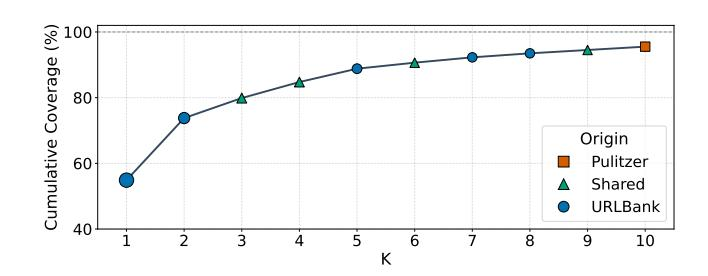
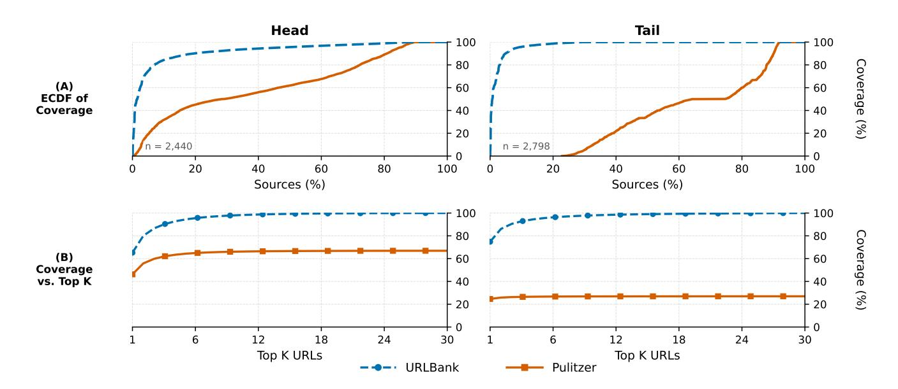
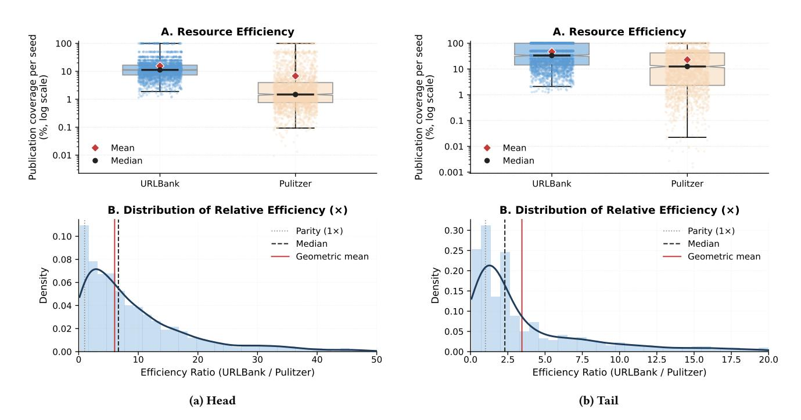
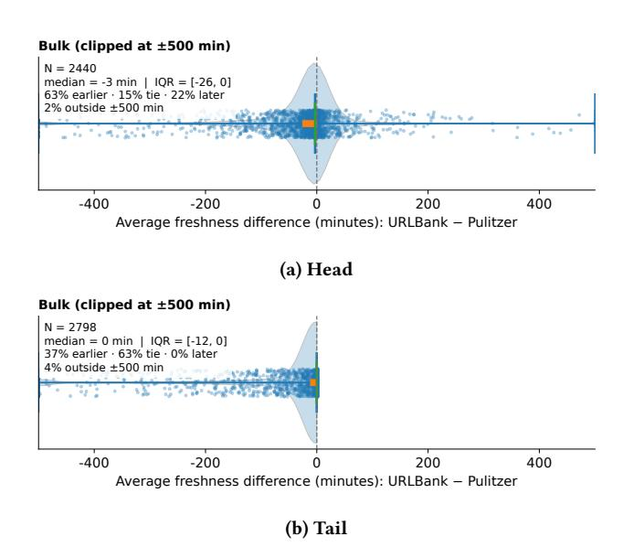
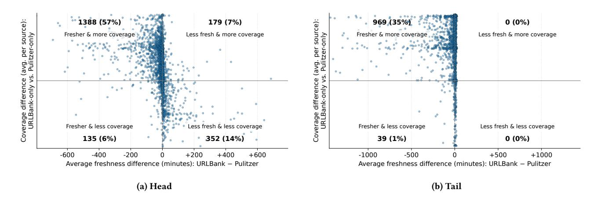

# URLBank: Data-Driven URL Discovery via Temporal Link Graphs

Felipe Marineli Roma Tre University Rome, Italy Meltwater Deutschland GmbH Berlin, Germany felipe.marineli@uniroma3.it

Valerio Cetorelli Meltwater (UK) Ltd London, United Kingdom valerio.cetorelli@meltwater.com

Valter Crescenzi Roma Tre University Rome, Italy valter.crescenzi@uniroma3.it

Tim Furche Meltwater (UK) Ltd London, United Kingdom tim.furche@meltwater.com

Xiaonan Guo Meltwater (UK) Ltd London, United Kingdom xiaonan.guo@meltwater.com

### Abstract

Web-scale editorial crawling must balance coverage and freshness within tight politeness and request budgets. Nonetheless, in production systems, manual seed management remains common despite being inefficient—oversampling redundant seeds while missing high-yield ones. URLBank replaces manual curation with a labelfree controller that infers optimal seed selection directly from temporal crawl telemetry. It identifies candidate entry points, estimates stability—the persistence of links across crawler revolutions—and productivity—the rate of first-seen publications—and ranks them through greedy marginal gain on a shared-credit coverage objective. In a shadow A/B evaluation spanning 5,238 sites, URLBank consistently achieves higher coverage, greater efficiency, and earlier discovery under identical conditions. Gains remain stable across Top-K budgets, approaching near-complete coverage with far fewer seeds. Deployed alongside Meltwater's production crawler Pulitzer, URL-Bank operates with versioned policies, ranked prefixes for crawl budgets, and integrated health diagnostics, making allocation transparent, auditable, and reversible. Together, these results demonstrate that temporal signals, through an interpretable greedy objective, yield large, measurable improvements in industrial-scale coverage, resource efficiency, and freshness.

# CCS Concepts

• Information systems → Novelty in information retrieval; Enterprise applications; Web crawling; Page and site ranking; Site wrapping; Retrieval models and ranking; Temporal data; • Mathematics of computing → Time series analysis; • Computing methodologies → Sequential decision making; • Applied computing → Enterprise architecture frameworks; Enterprise data management.

[This work is licensed under a Creative Commons Attribution-NonCommercial-](https://creativecommons.org/licenses/by-nc-nd/4.0)[NoDerivatives 4.0 International License.](https://creativecommons.org/licenses/by-nc-nd/4.0) WWW '26, Dubai, United Arab Emirates © 2026 Copyright held by the owner/author(s). ACM ISBN 979-8-4007-2307-0/2026/04 https://doi.org/10.1145/3774904.3792814

# Keywords

web crawling; seed URL selection; temporal link graphs; stability and productivity profiling; set optimization; coverage; resource efficiency; freshness

### ACM Reference Format:

Felipe Marineli, Valerio Cetorelli, Valter Crescenzi, Tim Furche, and Xiaonan Guo. 2026. URLBank: Data-Driven URL Discovery via Temporal Link Graphs. In Proceedings of the ACM Web Conference 2026 (WWW '26), April 13–17, 2026, Dubai, United Arab Emirates. ACM, New York, NY, USA, [9](#page-8-0) pages. https://doi.org/10.1145/3774904.3792814

### 1 Introduction

The volume and velocity of web publishing pose major challenges for large-scale editorial crawling. Meltwater [\[20\]](#page-8-1) ingests billions of documents daily from hundreds of thousands of sources, relying on both licensed feeds and web crawling to ensure breadth and freshness. Within this pipeline, Pulitzer—Meltwater's production crawler—uses source-dependent programs, i.e., wrappers [\[9,](#page-8-2) [19\]](#page-8-3). The seed set of a wrapper is a crucial asset that determines which URLs should be visited to discover and collect published articles. Currently, seed sets are created and maintained through a manual process that is brittle and error-prone: it often over-invests in redundant entry pages, fails to prioritize productive ones, and typically reacts to missing content only after external customer feedback.

We model seed management as a resource allocation problem over temporal signals, capturing the evolution of a site's link graph across consecutive crawls. Each revolution, i.e., a complete crawl cycle, operates under strict politeness budgets. From the analysis of revolutions, two site-agnostic signals emerge: (��) stability—how persistent a link is on a page, and (����) productivity—how many globally first-seen links a seed surfaces per visit. Seed selection becomes data-driven rather than intuition-based.

We present URLBank, an automatic, label-free controller that discovers, profiles, and selects seed URLs using only live crawl telemetry. URLBank operates in three phases: Expansion, Profiling, and Seed Selection. The resulting set of seed URLs is versioned and deployed back into Pulitzer with health diagnostics for transparent, reversible operation.

In a shadow A/B evaluation spanning 5,238 sites—2,440 head and 2,798 tail sources—run under identical politeness and request budget constraints, URLBank achieves substantially higher coverage, efficiency, and freshness than the legacy system, with improvements persisting across Top-�� budgets.

Our main contributions are: (��) a formulation of the seed selection problem and an approach to solve it using temporal signals; (����) a simple greedy algorithm to maximize coverage under budgets; and (������) extensive evaluations based on production data demonstrating large, robust gains in coverage, efficiency, and freshness.

This paper is organized as follows. Section [2](#page-1-0) formalizes the problem and modeling assumptions. Section [3](#page-1-1) presents the URLBank system—Expansion, Profiling, and Seed Selection. Section [4](#page-4-0) details the experimental setup and reports results on coverage, efficiency, and freshness. Section [5](#page-6-0) reviews related work. Section [6](#page-7-0) discusses implications, limitations, and future work.

# 2 Problem Definition

Given a website's changing link topology, the goal of URLBank is to identify seed URLs that minimize crawling costs while maximizing coverage and ensuring that new content is retrieved as soon as possible after publication.

Crawling cost can be modeled as linearly proportional to the number of seeds fetched in each revolution. To avoid overloading web servers, the crawler cannot issue parallel requests: during each revolution, seeds are downloaded serially, and a new revolution cannot begin until the previous one completes. For simplicity, we disregard the download order of pages within a single revolution, even though in production, a revolution may span several minutes. Freshness is thus determined by the number of revolution cycles required to detect a newly published link. Coverage, in turn, can be expressed in terms of newly discovered links relative to all links published. Notably, this means that new links can be detected without incurring the cost of fetching the target pages themselves.

We can therefore formalize the problem as follows:

Problem (Seed Coverage Problem). Given a website URL, find the set of seeds that maximizes the discovery of newly published links over time while minimizing both the number of seeds and the delay in detecting new links.

Inputs include the site URL and any seeds the production wrapper already maintains.

This problem is challenging for several reasons, detailed next; nonetheless, analyzing how a site publishes new links over time provides the signals needed to tackle it.

# 2.1 Challenges

Manual seed management at scale poses three systemic challenges:

- Over-crawling of redundant seeds. Experts often select many section pages as seeds (e.g., /sports, /sports/basketball) whose link sets largely overlap. Requests frequently focus on nearduplicates, inflating costs while adding little or no coverage.
- Under-sampling of productive seeds. Budgets wasted on redundant sections delay later revolutions. High-yield pages are thus not revisited often enough, creating gaps that miss publications. Manual curation also leaves seed sets incomplete and slow to adapt. When publishers restructure site

navigation or rename sections, productive hubs may drift without being promoted.

- Lack of coverage-awareness. Production wrappers lack perseed attribution and overlap accounting. Redundant seeds accumulate unnoticed, their marginal utility is not measured, and the crawling budgets might end up being allocated suboptimally. As a result, seed lists sprawl, revolutions overrun budget, and troubleshooting becomes opaque, with no diagnostics tracing missed publications back to specific seeds. This prevents proactive reallocation toward high-gain seeds and makes changes risky and slow.

# 2.2 Opportunities

Over time, the appearance patterns of links within a page provide site-agnostic evidence across a sequence of revolutions. Stable links are likely to belong to the navigational structure of a site, usually made of section or feed links, whereas short-lived links are much more likely to correspond to ephemeral items like editorial articles. By first expanding to candidate entry pages via stability and then ranking seeds by observed productivity, we can reduce redundancy, prioritize high-yield seeds, and keep revolutions within budget.

URLBank follows three principles that realize these opportunities: (1) Data-driven decisions: infer seeds from observed publishing behavior rather than assumptions and biased expectations inherent to manual curation; (2) Efficiency under constraints: maximize coverage within fixed request budgets; (3) Proactive coverage awareness: continuously track per-seed contributions to detect gaps.

# 3 URLBank System

URLBank is deployed as a companion to the Pulitzer crawler. It collects temporal signals, and produces ranked seed sets with versioned policies suitable for deployment and rollback. An internal API exposes health metrics and coverage diagnostics. The system supports fully automated operation, with optional expert sign-off for high-stakes sources, ensuring reliability in production.

URLBank operates in three phases: Expansion (Section [3.1\)](#page-2-0), which discovers and ranks candidate seeds by stability with lightweight filtering; Profiling (Section [3.2\)](#page-2-1), which estimates per-seed productivity; and Seed Selection (Section [3.3\)](#page-3-0), which greedily selects the final seed set via marginal gain over shared-credit coverage. These phases are periodically repeated, transforming legacy seed management from a static, one-off fully manual process into a continuous, versioned, evidence-based loop that integrates directly with the production Pulitzer system.

We begin with a few preliminary definitions useful for introducing the details of URLBank's algorithms.

Revolutions. A revolution is a single visit in which the crawler downloads a set of pages from a site. To avoid overloading remote web servers, a new revolution begins only after the previous one completes, creating a natural temporal order ⪯ over all revolutions of a site. Formally, this sequence of revolutions is denoted �� = {���� , �� = 1, . . . , ��}, or simply �� = ��1, . . . , ����, where ���� ⪯ ���� ⇔ �� ≤ �� defines the total order among elements in ��.

Pages and versioned pages. Each seed page �� is versioned and indexed by the revolution �� in which it was downloaded. We denote

| Rank | Path                         | ��   | Cumulative | Origin   |
|------|------------------------------|------|------------|----------|
| 1    | /feeds/all                   | 54.9 | 54.9%      | URLBank  |
| 2    | /associated-press            | 18.9 | 73.8%      | URLBank  |
| 3    | /                            | 6.1  | 79.9%      | Shared   |
| 4    | /community-calendar          | 4.9  | 84.8%      | Shared   |
| 5    | /categories/editorials       | 4.1  | 88.8%      | URLBank  |
| 6    | /local-regional-news         | 1.8  | 90.7%      | Shared   |
| 7    | /feeds/opinion               | 1.6  | 92.3%      | URLBank  |
| 8    | /categories/associated-press | 1.2  | 93.5%      | URLBank  |
| 9    | /food                        | 1.0  | 94.5%      | Shared   |
| 10   | /author?q=Scout+Edmondson    | 1.0  | 95.5%      | Pulitzer |

Table 1: Top-ranked URLs contributing to cumulative coverage for **durangoherald.com**.

This example illustrates how stability and productivity signals plus shared-credit marginal selection can reduce redundancy by concentrating the crawling budget on the most productive seeds.

### 4 Evaluation

We evaluate URLBank as a companion system to the production system Pulitzer under identical politeness and request budgets. For each source, the two arms run in parallel over the same wallclock period:

- Pulitzer (legacy): the production system, without a fixed cap on seeds.
- URLBank: Expansion throttled to 1/12 of Pulitzer's perhost cadence–an empirically sufficient rate to capture coarse stability signals without incurring prohibitive costs–followed by Profiling at the same cadence as Pulitzer for fine-grained productivity signals; the final seeds are selected via greedy marginal gain across systems (Section [3.3\)](#page-3-0).

We compute the following metrics over all revolutions throughout the whole evaluation period, considering the union of all publications surfaced by either arm as the reference target. This set serves as the maximum achievable coverage for the given period:

- Coverage: the proportion of target publications.
- Efficiency: the publication coverage per seed.
- Freshness: the temporal lead or lag of one arm relative to the other for each publication.

Publications surfaced by both arms within a revolution are labeled Shared and credited to both. Publications surfaced by only one arm are credited to the arm that retrieved them first, consistent with URLBank's bias toward timeliness. All metrics are computed on canonicalized URLs (scheme-less, host-normalized, path-normalized, query-sanitized, and following final redirects).

# 4.1 Editorial Dataset

The evaluation spans a large corpus of editorial web sources, where a source is a unique domain or subdomain configured for crawling.[4](#page-4-2)

Composition. The dataset is partitioned by business importance into two segments:

- Head sources (��=2,440): major, high-value websites central to editorial coverage and critical to customer workflows.
- Tail sources (��=2,798): lower-traffic or long-tail websites.

The head segment represents the operational core of the ecosystem, characterized by a larger budget for manual curation, whereas the tail segment more clearly highlights the potential of automation, as its scale and structural heterogeneity make sustained manual curation impractical.

Inclusion follows internal business requirements based on:

- (1) customer demand signals (active alerts and monitors),
- (2) language and regional coverage targets defined by product scope, and
- (3) operational readiness (existing wrappers or established ownership within the crawler estate).

# 4.2 Experimental Results

We report results stratified by head and tail segments for coverage, efficiency, and freshness.

4.2.1 Coverage on the union set. In both the head and tail (Figure [2\)](#page-5-0) segments, the empirical cumulative distribution functions (ECDFs) in Panel A show that URLBank reaches near-complete coverage for almost all sources, while Pulitzer exhibits a gradual slope. The steep rise of the URLBank curve indicates that most sources quickly achieve high coverage, clustering near the 100% ceiling, whereas Pulitzer's curve rises slowly, showing that a large fraction of sources remains only partially covered.

The difference is especially pronounced in the tail, where Pulitzer covers a modest portion of content, while URLBank achieves almost full coverage. This separation between curves demonstrates that the coverage improvement is not limited to a small subset of high-performing domains but extends broadly across the entire source population.

4.2.2 Robustness under budget (Top-�� seeds). Panel B in Figure [2](#page-5-0) compares cumulative coverage as a function of the number of topranked seeds (��) for both segments. Across all budgets �� ∈ (0, 30], URLBank consistently outperforms Pulitzer, maintaining a large and stable margin. In the head segment (Figure [2\)](#page-5-0), the coverage gap remains steady at approximately Δ ≈ 31–33 percentage points (pp) for ��=5, 10, 20, showing that URLBank achieves near-complete coverage with relatively few seeds. In the tail segment (Figure [2\)](#page-5-0), the difference is more pronounced, with gains exceeding Δ ≈ 70 pp at the same budgets.

In both cases, URLBank rapidly converges toward full coverage (∼ 100%) by��≈20–30, whereas Pulitzer plateaus early—around ∼ 67% for head sources and ∼ 26% for tail sources. These results highlight that URLBank's greedy marginal-gain selection produces robust, budget-efficient allocations that generalize across both highly curated and long-tail domains.

4.2.3 Resource efficiency. Figure [3](#page-6-1) summarizes coverage per seed. In both segments, Panel A shows that URLBank achieves higher perseed coverage, with mean and median above Pulitzer. The tighter interquartile range (IQR) for URLBank indicates more uniform efficiency across seeds, while Pulitzer exhibits wider variance and a heavier distribution of low-yield pages. Surprisingly, the gain is more pronounced among head sources, revealing accumulated

4The full list of domains is available at [https://github.com/felipemarineli/urlbank](https://github.com/felipemarineli/urlbank-domain-lists)[domain-lists.](https://github.com/felipemarineli/urlbank-domain-lists)

Figure 2: Coverage for head and tail sources. The panels show the ECDF of source coverage (A) and coverage versus top-�� (B).

Table 2: Publication-level freshness for head and tail sources; negative means URLBank was earlier.

redundancy in manually curated seed lists: URLBank de-duplicates overlapping entry points and reallocates budget to high-yield seeds.

Panel B compares the distribution of efficiency ratios. The xaxis limits differ across segments to reflect their empirical ranges: head sources (Figure [3a](#page-6-1)) display a broader spread in efficiency, occasionally exceeding 50×, whereas tail sources (Figure [3b](#page-6-1)) are tightly concentrated below 20×. This segment-specific scaling limits truncation for head sources and avoids unused range for tail sources. Both distributions are right-skewed, with most sources showing an efficiency ratio above parity, indicating that URLBank achieves consistently higher relative efficiency across segments.

4.2.4 Freshness and temporal alignment. We assess the temporal alignment between publications surfaced by both arms as

Δ�� := ��URLBank − ��Pulitzer,

where a negative value indicates that URLBank captured the publication earlier. The URLBank results reported reflect the exploratory contribution of the Expansion phase—before greedy selection—to isolate the system's intrinsic ability to discover timely content.

Table [2](#page-5-1) summarizes temporal alignment results for the head and tail segments. This analysis covers the intersection of outputs, which comprises ∼6.41M matched publications out of a total corpus of ∼21.89M. Across both segments, URLBank stays closely aligned with Pulitzer, yet, on average, captures publications earlier. For head sources, 92.59% of publications were discovered within the same revolution, 99.34% within one day, and the mean lead is −20 min. For tail sources, 96.06% of publications are found within the same revolution, 99.85% are within one day, and the mean lead is −65 min. Median lead is 0 seconds in both segments, reflecting tight synchronization; the negative means confirm that URLBank captures the early-retrieval margin.

Figure [4](#page-6-2) reports the per-source mean freshness differences. The ��-axis represents �� in minutes. Each blue dot in the scatter plot represents the average �� for one source. The shaded area shows the density of the data. The wider the plot, the more sources fall into the �� range.

In both segments, the distributions are tightly centered around 0 and skew negatively, indicating earlier discovery by URLBank. Among head sources, 63% show earlier average publication discovery by URLBank, 15% tie, and 22% are later; the median difference is −3 minutes with IQR of [−26, 0] minutes. In the tail segment, earlier discovery by Pulitzer is virtually absent: 63% tie and 37% favor URLBank, with IQR of [−12, 0] minutes. This pattern reflects the timeliness aspect of efficiency: high-yield seeds discovered through greedy coverage maximization produce fresher content.

In the comparison of coverage versus freshness across sources (Figure [5\)](#page-7-1), URLBank consistently occupies the top-left quadrant, corresponding to sources where it achieves both greater coverage and freshness than Pulitzer. In the head segment, 57% of sources fall into this region; in the tail, 35%. The opposing quadrants are sparsely populated, indicating that URLBank's exploratory Expansion phase systematically enhances both the breadth and timeliness of content acquisition.

Figure 3: Coverage per seed.

Figure 4: Per-source �� distributions.

# 5 Related Work

Web crawling has attracted varying levels of interest [\[29\]](#page-8-5) across different scientific communities [\[9,](#page-8-2) [24\]](#page-8-6). It has often been primarily of industrial interest [\[5,](#page-8-7) [20\]](#page-8-1) and has been used as a supporting tool for other research areas such as information retrieval [\[18\]](#page-8-8), data extraction [\[7,](#page-8-9) [13,](#page-8-10) [19\]](#page-8-3), and sentiment analysis [\[26\]](#page-8-11).

One early and popular research direction framed URL discovery as focused crawling [\[27\]](#page-8-12): learning to prioritize links that lead to topic-relevant content. Chakrabarti et al. [\[8\]](#page-8-13) combined a classifier with a distiller to guide path traversal. Indeed, unlike our approach, a few proposals put special emphasis on finding the best seeds for a topic [\[11,](#page-8-14) [30\]](#page-8-15), for covering a portion of the web [\[32\]](#page-8-16), or for querying through forms [\[4\]](#page-8-17) rather than focusing on single-site coverage.

Diligenti et al. [\[10\]](#page-8-18) introduced context graphs to estimate link distance from targets. Subsequent hybrids coupled link topology with content cues: Aggarwal et al. [\[1\]](#page-8-19) learned statistical patterns of the web graph during crawl-time, and Almpanidis et al. [\[2\]](#page-8-20) used latent semantic indexing to filter irrelevant pages. In parallel, PageRank [\[25\]](#page-8-21) showed that structural signals alone can produce robust, domain-agnostic importance measures that inform both ranking and frontier prioritization.

Adaptive allocation has been studied via reinforcement learning and multi-armed bandits. Rennie and McCallum [\[28\]](#page-8-22) posed link selection as sequential decision-making; later variants used function approximation and online strategies (e.g., InfoSpiders [\[21\]](#page-8-23), Grigoriadis and Paliouras [\[16\]](#page-8-24)). Bandit formulations provided principled exploration-exploitation trade-offs: Meusel et al. [\[22\]](#page-8-25) applied bandits at the host level, and Gouriten et al. [\[15\]](#page-8-26) treated the selection of scoring estimators itself as a bandit problem.

Specialized systems have been built for crawling user-generated content [\[3\]](#page-8-27), leveraging URL and page features or even exogenous signals: for instance, URL templates matched by learned regexps [\[17\]](#page-8-28), structural and content page features [\[6,](#page-8-29) [12,](#page-8-30) [31\]](#page-8-31), or social streams to surface event-related URLs [\[14\]](#page-8-32). They achieve high accuracy in their niches at the expense of generality and operational simplicity.

Figure 5: Coverage–freshness relationship.

Our contribution differs along three axes. First, instead of topical relevance, we optimize seed management for publication coverage under strict budgets, using temporal link-graph signals to estimate stability and productivity. Second, we avoid external signals or offline reward shaping: URLBank is label-free and learns directly from live crawl telemetry. Third, the final allocation is a transparent, submodular greedy selection over shared-credit coverage, yielding interpretable, versioned policies suitable for industrial deployment.

### 6 Conclusion and Future Work

The results indicate that temporal link-graph signals—stability and productivity—are sufficient to drive site-agnostic and transparent seed allocation under strict politeness and request budgets. Greedy selection over a shared-credit coverage objective systematically concentrates crawl budget on high-yield seed URLs, increases coverage and coverage-per-seed, and improves freshness. In practice, this re-frames seed management from heuristic curation to versioned, evidence-driven allocation that is auditable and reversible. The approach generalizes to other incremental-crawl verticals, including job postings and product listings.

Operationally, URLBank runs in production as a companion to the Pulitzer crawler, with versioned policies and continuous health diagnostics. The greedy ordering naturally produces a ranked prefix for any Top-�� budget, enabling incremental deployment, controlled roll-outs, and rapid rollback. Coverage diagnostics trace missed publications to individual seeds, making error analysis and remediation transparent, while versioning provides stable recovery points during site restructurings and supports safe experimentation.

Nonetheless, our approach has limitations: (i) Estimating stability and productivity requires multiple revolutions, so gains appear slowly for cold-start and low-frequency websites; extending the profiling window improves robustness but reduces responsiveness, while shorter windows introduce noise. (ii) Stability can over-rank deep archives or persistent non-editorial structures such as shopping and advertisement pages, diverting budget without contributing to coverage or freshness; lightweight editorial filters mitigate this effect but cannot fully eliminate it. (iii) Live pages whose content changes under static URLs fall outside the URL–document

equivalence model. (iv) Finally, a fixed profiling cadence can miss structural shifts on volatile sites or overspend on stable ones.

Several avenues follow directly from these observations. Making profiling cadence adaptive would allow each source to adjust its refresh rate based on observed change frequency and stability drift, reducing wasted effort on static sites and accelerating reaction to volatile ones. Increasing editorial precision with weakly supervised classifiers or improved lightweight heuristics can further downweight non-editorial or archival pages without manual intervention. Incorporating change-rate tracking into productivity estimation would extend coverage to live pages that evolve under static URLs, preserving freshness even when links remain unchanged. Finally, beyond single-site optimization, coupling selection across hosts under a shared politeness budget can yield globally efficient allocations while maintaining fairness and operational constraints.

In summary, URLBank re-frames seed management as a datadriven allocation problem grounded in temporal link-graph analysis, replacing manual heuristic processes with an interpretable and reproducible optimization framework. By integrating stability and productivity profiling with a transparent greedy selection mechanism, URLBank formalizes the intuition behind effective seed selection into a measurable and adaptive policy. Evaluated across thousands of heterogeneous sites and millions of publications, it consistently demonstrates substantial and stable gains in coverage, efficiency, and freshness under identical politeness and budget constraints. Beyond empirical performance, URLBank introduces operational features—versioned policies, ranked prefixes, and per-seed diagnostics—that enable principled auditing, controlled roll-outs, and safe recovery across large crawling estates. Together, these properties make URLBank a systematic redefinition of resource allocation in large-scale incremental crawling.

# Acknowledgments

This research was supported by Meltwater (UK) Ltd and Meltwater Deutschland GmbH. We gratefully acknowledge their resources and expertise, which contributed to the development of this work.

### References

[1] Charu C. Aggarwal, Fatima Al-Garawi, and Philip S. Yu. 2001. Intelligent crawling on the World Wide Web with arbitrary predicates. In Proceedings of the 10th International Conference on World Wide Web (Hong Kong, Hong Kong) (WWW '01). Association for Computing Machinery, New York, NY, USA, 96–105. [doi:10](https://doi.org/10.1145/371920.371955) [.1145/371920.371955](https://doi.org/10.1145/371920.371955) [2] G. Almpanidis, C. Kotropoulos, and I. Pitas. 2007. Combining text and link analysis for focused crawling—An application for vertical search engines. Information Systems 32, 6 (2007), 886–908. [doi:10.1016/j.is.2006.09.004](https://doi.org/10.1016/j.is.2006.09.004) [3] Luciano Barbosa. 2017. Harvesting Forum Pages from Seed Sites. In Web Engineering, Jordi Cabot, Roberto De Virgilio, and Riccardo Torlone (Eds.). Springer International Publishing, Cham, 457–468. [4] Luciano Barbosa and Juliana Freire. 2007. An adaptive crawler for locating hidden-Web entry points. In Proceedings of the 16th International Conference on World Wide Web (Banff, Alberta, Canada) (WWW '07). Association for Computing Machinery, New York, NY, USA, 441–450. [doi:10.1145/1242572.1242632](https://doi.org/10.1145/1242572.1242632) [5] Sergey Brin and Lawrence Page. 1998. The anatomy of a large-scale hypertextual web search engine. Computer networks and ISDN systems 30, 1-7 (1998), 107–117. [6] Rui Cai, Jiang-Ming Yang, Wei Lai, Yida Wang, and Lei Zhang. 2008. iRobot: an intelligent crawler for web forums. In Proceedings of the 17th International Conference on World Wide Web (Beijing, China) (WWW '08). Association for Computing Machinery, New York, NY, USA, 447–456. [doi:10.1145/1367497.1367](https://doi.org/10.1145/1367497.1367558) [558](https://doi.org/10.1145/1367497.1367558) [7] Valerio Cetorelli, Paolo Atzeni, Valter Crescenzi, and Franco Milicchio. 2021. The smallest extraction problem. Proc. VLDB Endow. 14, 11 (July 2021), 2445–2458. [doi:10.14778/3476249.3476293](https://doi.org/10.14778/3476249.3476293) [8] Soumen Chakrabarti, Martin van den Berg, and Byron Dom. 1999. Focused crawling: a new approach to topic-specific Web resource discovery. Computer Networks 31, 11 (1999), 1623–1640. [doi:10.1016/S1389-1286\(99\)00052-3](https://doi.org/10.1016/S1389-1286(99)00052-3) [9] Chia-Hui Chang, Mohammed Kayed, Moheb R Girgis, and Khaled F Shaalan. 2006. A survey of web information extraction systems. IEEE transactions on knowledge and data engineering 18, 10 (2006), 1411–1428. [10] Michelangelo Diligenti, Frans Coetzee, Steve Lawrence, C. Lee Giles, and Marco Gori. 2000. Focused Crawling Using Context Graphs. In Proceedings of the 26th International Conference on Very Large Data Bases (VLDB '00). Morgan Kaufmann Publishers Inc., San Francisco, CA, USA, 527–534. [11] YaJun Du, YuFeng Hai, ChunZhi Xie, and XiaoMing Wang. 2014. An approach for selecting seed URLs of focused crawler based on user-interest ontology. Applied Soft Computing 14 (2014), 663–676. [doi:10.1016/j.asoc.2013.09.007](https://doi.org/10.1016/j.asoc.2013.09.007) [12] Muhammad Faheem and Pierre Senellart. 2015. Adaptive Web Crawling Through Structure-Based Link Classification. In Proceedings of the 17th International Conference on Asia-Pacific Digital Libraries - Volume 9469. Springer-Verlag, Berlin, Heidelberg, 39–51. [doi:10.1007/978-3-319-27974-9\\_5](https://doi.org/10.1007/978-3-319-27974-9_5) [13] Tim Furche, Georg Gottlob, Giovanni Grasso, Xiaonan Guo, Giorgio Orsi, Christian Schallhart, and Cheng Wang. 2014. DIADEM: thousands of websites to a single database. Proc. VLDB Endow. 7, 14 (Oct. 2014), 1845–1856. [doi:10.14778/2733085.2733091](https://doi.org/10.14778/2733085.2733091) [14] Gerhard Gossen, Elena Demidova, and Thomas Risse. 2015. iCrawl: Improving the Freshness of Web Collections by Integrating Social Web and Focused Web Crawling. In Proceedings of the 15th ACM/IEEE-CS Joint Conference on Digital Libraries (Knoxville, Tennessee, USA) (JCDL '15). Association for Computing Machinery, New York, NY, USA, 75–84. [doi:10.1145/2756406.2756925](https://doi.org/10.1145/2756406.2756925) [15] Georges Gouriten, Silviu Maniu, and Pierre Senellart. 2014. Scalable, generic, and adaptive systems for focused crawling. In Proceedings of the 25th ACM Conference on Hypertext and Social Media (Santiago, Chile) (HT '14). Association for Computing Machinery, New York, NY, USA, 35–45. [doi:10.1145/2631775.2631795](https://doi.org/10.1145/2631775.2631795) [16] Alexandros Grigoriadis and Georgios Paliouras. 2004. Focused Crawling Using Temporal Difference-Learning. In Methods and Applications of Artificial Intelligence, George A. Vouros and Themistoklis Panayiotopoulos (Eds.). Springer Berlin Heidelberg, Berlin, Heidelberg, 142–153. [17] Jingtian Jiang, Xinying Song, Nenghai Yu, and Chin-Yew Lin. 2013. FoCUS: Learning to Crawl Web Forums. IEEE Transactions on Knowledge and Data Engineering 25, 6 (2013), 1293–1306. [doi:10.1109/TKDE.2012.56](https://doi.org/10.1109/TKDE.2012.56) [18] Manish Kumar, Rajesh Bhatia, and Dhavleesh Rattan. 2017. A survey of Web crawlers for information retrieval. Wiley Interdisciplinary Reviews: Data Mining and Knowledge Discovery 7, 6 (2017), e1218. [19] Alberto H. F. Laender, Berthier A. Ribeiro-Neto, Altigran S. da Silva, and Juliana S. Teixeira. 2002. A brief survey of web data extraction tools. SIGMOD Rec. 31, 2 (June 2002), 84–93. [doi:10.1145/565117.565137](https://doi.org/10.1145/565117.565137) [20] Meltwater. [n. d.]. Meltwater: Media, Social & Consumer Intelligence. https://www.meltwater.com/en. Accessed: 2025-09-27. [21] Filippo Menczer, Gautam Pant, and Padmini Srinivasan. 2004. Topical web crawlers: Evaluating adaptive algorithms. ACM Trans. Internet Technol. 4, 4 (Nov. 2004), 378–419. [doi:10.1145/1031114.1031117](https://doi.org/10.1145/1031114.1031117) [22] Robert Meusel, Peter Mika, and Roi Blanco. 2014. Focused Crawling for Structured Data. In Proceedings of the 23rd ACM International Conference on Conference on Information and Knowledge Management (Shanghai, China) (CIKM '14). Association for Computing Machinery, New York, NY, USA, 1039–1048. [doi:10.1145/2661829.2661902](https://doi.org/10.1145/2661829.2661902) [23] G. L. Nemhauser, L. A. Wolsey, and M. L. Fisher. 1978. An analysis of approximations for maximizing submodular set functions–I. Math. Program. 14, 1 (Dec. 1978), 265–294. [doi:10.1007/BF01588971](https://doi.org/10.1007/BF01588971) [24] Christopher Olston, Marc Najork, et al. 2010. Web crawling. Foundations and Trends® in Information Retrieval 4, 3 (2010), 175–246. [25] Lawrence Page, Sergey Brin, Rajeev Motwani, and Terry Winograd. 1999. The PageRank citation ranking: Bringing order to the web. Technical Report. Stanford infolab. [26] Bo Pang, Lillian Lee, et al. 2008. Opinion mining and sentiment analysis. Foundations and Trends® in information retrieval 2, 1–2 (2008), 1–135. [27] Kien Pham, Aecio Santos, and Juliana Freire. 2019. Bootstrapping Domain-Specific Content Discovery on the Web. In The World Wide Web Conference (San Francisco, CA, USA) (WWW '19). Association for Computing Machinery, New York, NY, USA, 1476–1486. [doi:10.1145/3308558.3313709](https://doi.org/10.1145/3308558.3313709) [28] Jason Rennie and Andrew McCallum. 1999. Using Reinforcement Learning to Spider the Web Efficiently. In Proceedings of the Sixteenth International Conference on Machine Learning (ICML '99). Morgan Kaufmann Publishers Inc., San Francisco, CA, USA, 335–343. [29] S. R. Sreeja and Sangita Chaudhari. 2014. Review of web crawlers. Int. J. Knowl. Web Intell. 5, 1 (Oct. 2014), 49–61. [doi:10.1504/IJKWI.2014.065035](https://doi.org/10.1504/IJKWI.2014.065035) [30] Karane Vieira, Luciano Barbosa, Altigran Silva, Juliana Freire, and Edleno Moura. 2015. Finding seeds to bootstrap focused crawlers. World Wide Web 19 (02 2015). [doi:10.1007/s11280-015-0331-7](https://doi.org/10.1007/s11280-015-0331-7) [31] Jiang-Ming Yang, Rui Cai, Yida Wang, Jun Zhu, Lei Zhang, and Wei-Ying Ma. 2009. Incorporating site-level knowledge to extract structured data from web forums. In Proceedings of the 18th International Conference on World Wide Web (Madrid, Spain) (WWW '09). Association for Computing Machinery, New York, NY, USA, 181–190. [doi:10.1145/1526709.1526735](https://doi.org/10.1145/1526709.1526735) [32] Shuyi Zheng, Pavel Dmitriev, and C. Lee Giles. 2009. Graph-based seed selection for web-scale crawlers. In Proceedings of the 18th ACM Conference on Information and Knowledge Management (Hong Kong, China) (CIKM '09). Association for Computing Machinery, New York, NY, USA, 1967–1970. [doi:10.1145/1645953.16](https://doi.org/10.1145/1645953.1646277) [46277](https://doi.org/10.1145/1645953.1646277)