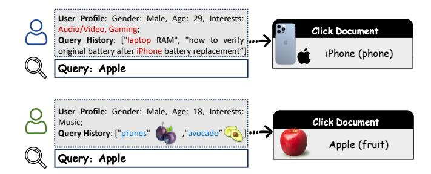
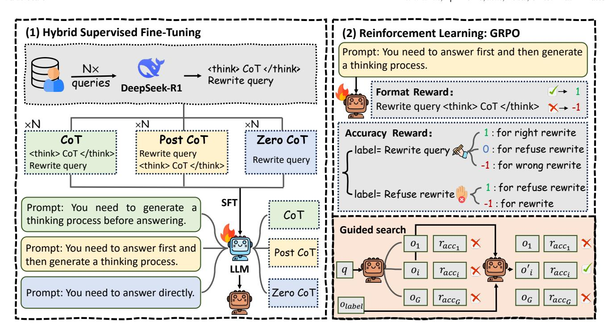
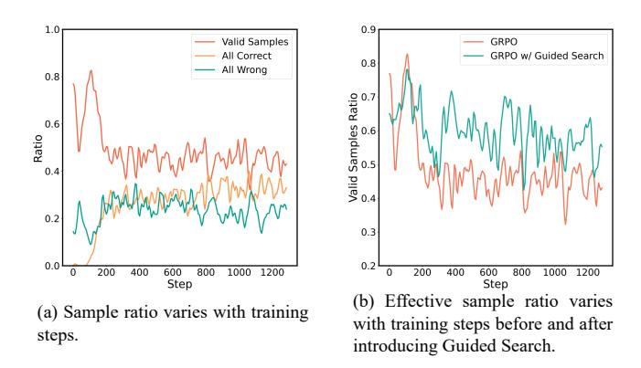

# Accurate and Efficient Personalized Query Rewriting in Baidu Search

Xu Chu∗ chuxu@stu.pku.edu.cn Peking University Beijing, China

Angela Li liangela@baidu.com Mobile Ecosystem Group, Baidu Inc. Beijing, China

Jiaming Zhang zhangjiaming04@baidu.com Mobile Ecosystem Group, Baidu Inc. Beijing, China

Wei Li liwei107@baidu.com Mobile Ecosystem Group, Baidu Inc. Beijing, China

Zhijie Tan besttangent@stu.pku.edu.cn Peking University Beijing, China

DaWei Yin yindawei@acm.org Mobile Ecosystem Group, Baidu Inc. Beijing, China

Shuaiqiang Wang† wangshuaiqiang@baidu.com Mobile Ecosystem Group, Baidu Inc. Beijing, China

Daiting Shi† shidaiting01@baidu.com Mobile Ecosystem Group, Baidu Inc. Beijing, China

# Abstract

Traditional search engines return uniform results for identical queries, overlooking users' personalized intents. While personalized search has been extensively studied, research on query rewriting for personalized intents has been constrained by traditional approaches like statistical co-occurrence and synonym expansion. Current work primarily addresses multi-turn dialogue scenarios in Conversational AI rather than exploring applications in large-scale search engines. This typically stems from the absence of real search scenario data and the difficulty of inferring users' intents through personalized reasoning. While Large Language Models (LLMs) combined with Chain-of-Thought (CoT) capabilities provide possibilities for personalized reasoning, CoT introduces additional reasoning overhead that is difficult to accept in online scenarios requiring low latency. To address this, this paper proposes PicQue (Personalized Efficient Query Rewrite), a personalized query rewriting model training pipeline aimed at achieving high accuracy with low latency. PicQue contains a two-stage training that first employs a novel Hybrid Supervised Fine-Tuning strategy to retain the model's reasoning capabilities while allowing the decoding process to skip CoT, thereby obtaining CoT's accuracy gains without increasing latency. Building on this foundation, PicQue conducts second-stage reinforcement learning using Group Relative Policy Optimization (GRPO) to further improve rewriting accuracy and reduce the risk of over-rewriting. We also propose a Guided Search strategy to optimize GRPO training, alleviating the reduction in training sample utilization when all sampling rollouts are wrong. Extensive offline

© 2026 Copyright held by the owner/author(s). ACM ISBN 979-8-4007-2307-0/2026/04 <https://doi.org/10.1145/3774904.3792815>

and online experiments demonstrate PicQue's effectiveness. In offline metrics, PicQue achieves over 7% improvement in rewriting accuracy compared to baseline methods and compresses up to 95% of decoding tokens. In online A/B tests, user satisfaction increases by 1.78% and query change rate decreases by 0.71%, achieving significant online gains.

## CCS Concepts

• Information systems → Query reformulation; • Computing methodologies → Natural language processing.

# Keywords

Query rewrite, Personalized search, Large language model, Reinforcement learning

### ACM Reference Format:

Xu Chu, Angela Li, Jiaming Zhang, Wei Li, Zhijie Tan, DaWei Yin, Shuaiqiang Wang, and Daiting Shi. 2026. Accurate and Efficient Personalized Query Rewriting in Baidu Search. In Proceedings of the ACM Web Conference 2026 (WWW '26), April 13–17, 2026, Dubai, United Arab Emirates. ACM, New York, NY, USA, [12](#page-11-0) pages.<https://doi.org/10.1145/3774904.3792815>

# 1 Introduction

Search engines have become essential tools for people to obtain information, explore knowledge, and satisfy daily needs [\[24,](#page-8-0) [27\]](#page-8-1). Search engine companies represented by Google, Baidu, and Bing serve billions of users globally and process trillions of queries annually [\[29\]](#page-8-2). To accurately and efficiently find the information users need from vast amounts of web pages, the industry has gradually formed a mature search paradigm [\[21\]](#page-8-3). Specifically, this paradigm typically includes three core stages: query understanding, retrieval, and ranking. Among these, query understanding, located at the forefront of the process, is responsible for parsing users' intents and rewriting or expanding original queries [\[3\]](#page-8-4), serving as the cornerstone of the entire search system's operation.

However, different users may search with different intents, as shown in Figure [1.](#page-1-0) Traditional search engines often return identical

∗This work was completed during an internship at Baidu Inc.

†Corresponding authors

[This work is licensed under a Creative Commons Attribution 4.0 International License.](https://creativecommons.org/licenses/by/4.0) WWW '26, Dubai, United Arab Emirates

Figure 1: Users with different personalized information may have different intents when searching. Users whose query history and user profiles contain electronic products like iPhone have the intent of searching for phones, while users whose query history contains fruits like avocado have the intent of searching for fruits.

results for the same query to all users, which overlooks the diverse intents and personalized preferences behind users [\[45\]](#page-9-0). To address this issue, personalized search has been proposed. Its goal is to customize search according to each user's user profile, query history, and other personalized information, generating many works that optimize the search process [\[11,](#page-8-5) [39,](#page-8-6) [44,](#page-8-7) [45\]](#page-9-0). However, to the best of our knowledge, research on personalized query rewrite techniques still remains limited to traditional techniques based on statistical co-occurrence or synonym expansion [\[1,](#page-8-8) [2,](#page-8-9) [5\]](#page-8-10), or focuses on multiturn dialogue scenarios of Conversational AI [\[6,](#page-8-11) [15,](#page-8-12) [19\]](#page-8-13). This occurs even though query understanding and rewriting represent the most direct way to distinguish personalized user search intents. The reasons for this research and application gap may be the lack of high-quality query rewriting samples obtained from large-scale search engines based on users' real search scenarios, as well as the difficulty of understanding and learning users' personalized preferences and complex intents based on these samples.

In recent years, the rise of Large Language Models (LLMs), particularly their exceptional capabilities demonstrated in complex reasoning tasks, brings revolutionary changes to the field of information retrieval [\[46\]](#page-9-1). Technologies represented by Chain-of-Thought (CoT) [\[35\]](#page-8-14) and reasoning models [\[12,](#page-8-15) [20\]](#page-8-16), by guiding models to generate a series of intermediate reasoning steps, can significantly improve their performance on mathematics [\[7\]](#page-8-17), code [\[4\]](#page-8-18), and even query rewriting tasks [\[14\]](#page-8-19). This is considered a potentially feasible solution for understanding users' personalized intents. However, the reasoning process introduces more decoding tokens, causing increased computational overhead and response time. In query rewriting modules, millisecond-level latency proves crucial, and such additional reasoning time becomes unacceptable in production environments. This raises a challenge: can we maintain the understanding capabilities and performance gains brought by reasoning by compressing or skipping the reasoning process, without increasing the latency of online services?

To address this challenge, this paper proposes PicQue (Personalized Efficient Query Rewrite), a novel personalized query rewriting training pipeline. PicQue first introduces a novel Hybrid Supervised Fine-Tuning (HSFT) strategy. HSFT merges three formats of training data in one training session: standard CoT, direct response

without reasoning (Zero CoT), and Post-CoT. PicQue controls the HSFT model to output in Post-CoT format with a prompt, which places the answer (i.e., the rewritten query) before the reasoning chain. This enables the model to learn reasoning logic during training, while during inference, the decoding process can immediately terminate after generating the answer, thus avoiding the latency issues brought by CoT. Building on the HSFT model foundation, PicQue introduces reinforcement learning to further improve model accuracy, especially reducing the risk of model over-rewriting. We use Group Relative Policy Optimization (GRPO) [\[26\]](#page-8-20), and designed a Guided Search strategy that guides the policy model to sample correctly through labels when all rollouts are incorrect, to address the problem of decreased sample utilization during GRPO training. At the data level, we collect a large amount of queries from the Baidu search engine, which contain numerous ambiguous queries that require intent disambiguation. We invoke DeepSeek-R1 [\[12\]](#page-8-15) to rewrite queries based on personalized information, and through manual verification, create 520k training samples with CoT. Results from extensive offline and online experiments show that PicQue achieves over 7% improvement in rewriting accuracy compared to baselines and compresses up to 95% of tokens. In online A/B tests, it improves user satisfaction by 1.78% and reduces query change rate by 0.71%. Our contributions are:

- To the best of our knowledge, we are the first to train LLMs to handle personalized query rewriting tasks for industrialscale search, thereby meeting the different search intents of different users.
- We propose PicQue, a training pipeline containing two stages of HSFT and GRPO, enabling models to achieve high-accuracy personalized query rewriting with low inference cost.
- To alleviate the problem of decreased sample utilization during GRPO training, we propose a Guided Search strategy.
- In extensive offline and online experiments, PicQue achieves higher accuracy and lower resource consumption compared to baselines, effectively improving user satisfaction.

# 2 Related Work

# 2.1 Query Rewriting

Query rewriting is an important component of query understanding [\[24,](#page-8-0) [27\]](#page-8-1), primarily focusing on improving query clarity through techniques such as query expansion, reformulation, and semantic enhancement [\[3,](#page-8-4) [21\]](#page-8-3).

Early query rewriting relies on statistical methods, such as the probabilistic query expansion technique using pseudo-relevance feedback proposed by Cui et al. [\[10\]](#page-8-21). Some research utilizes user historical behavior or collaborative tagging, rewriting queries based on statistical co-occurrence or synonym expansion [\[1,](#page-8-8) [2,](#page-8-9) [5\]](#page-8-10), representing the early form of personalized query rewriting. However, such methods lack the ability to understand complex user intent and semantic relationships. With the emergence of neural networks, especially transformer architectures, query rewriting achieves significant development [\[28,](#page-8-22) [47\]](#page-9-2). Furthermore, as LLMs achieve success in tasks across various domains [\[8,](#page-8-23) [9\]](#page-8-24), many works use LLMs to rewrite queries [\[14,](#page-8-19) [22,](#page-8-25) [33,](#page-8-26) [34\]](#page-8-27). Taobao's team proposes BEQUE [\[21\]](#page-8-3), training LLMs for query rewriting to bridge the semantic gap of long-tail queries. Google researchers also find that CoT

Figure 2: PicQue training pipeline.

can improve the accuracy of LLMs in query rewriting [\[14\]](#page-8-19). However, these query rewriting models only process queries or utilize general world knowledge for rewriting, while ignoring the personalized information behind queries. This makes it difficult to adapt to different users' intents. Although there are some recent works focusing on LLM-based personalized query rewriting [\[6,](#page-8-11) [15,](#page-8-12) [19\]](#page-8-13), these works focus on Conversational AI scenarios, typically aiming to provide conversational content or styles that users prefer. These methods are orthogonal to our work because they lack analysis and design of search engine users' queries and personalized intent, making them unable to be directly applied to industrial-scale search scenarios. A research worth distinguishing is Agent4Ranking proposed by Li et al. [\[17\]](#page-8-28), which utilizes LLMs as agents to simulate users with different demographic characteristics (such as age) to rewrite queries. The main purpose of it is to train downstream ranking models to enhance their robustness by generating diverse pseudo-labeled query samples, neither including real user personalization information nor intending to understand users' personalized intents. This is also orthogonal to our work.

# 2.2 Personalized Search

Personalized search customizes search results based on users' interests, historical behaviors, and other information to meet individual users' diverse information needs and preferences [\[11,](#page-8-5) [44\]](#page-8-7). Ge et al.[\[11\]](#page-8-5) utilize hierarchical recurrent neural networks and attention mechanisms to automatically generate user profiles by mining users' historical queries and dynamically adjust personalized weights. Zhou et al.[\[44\]](#page-8-7) approach from the perspective of

query ambiguity resolution, predicting user intent through contextaware representation learning and personalized language models. Yao et al.[\[39\]](#page-8-6) construct personalized word embeddings for users to address the personalized understanding of ambiguous vocabulary. Zhou et al.[\[45\]](#page-9-0) propose a cognitive personalized search model that combines large language models with human-like memory mechanisms, demonstrating excellent performance in zero-shot scenarios. However, existing personalized search methods in industrial-scale search engines do not explicitly rewrite user queries, even though precise rewriting or expansion could be highly beneficial for downstream recall and ranking. The reason for this gap may be the lack of high-quality query rewriting samples obtained from real largescale search engines based on users' actual search scenarios, as well as the difficulty in understanding and learning users' personalized intents based on these samples.

# 3 Method

# 3.1 Task Formulation

We first formally define the personalized query rewriting task. Given a user's original query �� and a set of related personalized information �� (a collection containing user profile features, search history, and other information. Details in Appendix [C\)](#page-9-3), the task can be defined as �� = �� (��, ��), which involves learning a policy �� that generates an output �� that best reflects the user's intent based on the input query �� and personalized information ��. �� contains the rewriting result and possibly existing CoT reasoning steps. The rewriting result has two possibilities:

- A rewritten query�� ′ . When the policy model �� determines that the original query �� does not fully or precisely express

the user's intent, it combines personalized information �� to generate a more specific query �� ′ that better meets the user's needs.

- Refuse rewrite. When the policy model �� considers that the original query �� is already sufficiently clear, or when the personalized information is insufficient to support an effective rewrite, it should output refuse rewrite, meaning to use the original query ��.

### 3.2 Framework Overview

To achieve more precise personalized query rewriting that aligns with user intent, we propose PicQue, whose two-stage training pipeline is shown in Figure [2.](#page-2-0) (1) Stage 1: Hybrid Supervised Fine-Tuning (HSFT). The purpose of this stage is to enable the model to skip the reasoning process when generating responses while preserving personalized rewriting reasoning capabilities. Rewriting results are constructed into three output formats, using three corresponding prompts to distinguish between output types and train them together. (2) Stage 2: Reinforcement Learning. The purpose of this stage is to further improve rewriting accuracy and suppress over-rewriting. We use GRPO [\[26\]](#page-8-20) to train the model warm-started with HSFT. We use prompts corresponding to Post CoT to ensure the warm-started model outputs in Post CoT format. We design 3-level rewards to suppress the model's over-rewriting behavior, especially setting refuse rewrite to a higher score (0 points) than incorrect rewriting (-1 points) to suppress the model's over-rewriting behavior. To address the problem of rapidly decreasing sample utilization in GRPO during the training process, we also propose Guided Search, which guides the policy model to produce correct rollouts through manually annotated labels. This avoids the occurrence of groups where all rollouts are incorrect during training, which would lead to zero gradients.

# 3.3 Hybrid Supervised Fine-Tuning

Industrial search engines have extremely stringent requirements for inference latency of online query rewriting models. Although Chain-of-Thought (CoT) has been proven to significantly improve models' logical reasoning capabilities by guiding models to generate intermediate reasoning steps, thereby enhancing the accuracy of downstream tasks including query rewriting [\[14,](#page-8-19) [35\]](#page-8-14). However, this explicit step-by-step "thinking" process generates additional tokens, thus increasing inference cost and latency. In query rewriting tasks, it introduces a key contradiction: how to preserve or enhance the model's reasoning capabilities and rewriting accuracy without increasing the latency of online query rewriting models.

To overcome this challenge, we design a novel Hybrid Supervised Fine-Tuning (HSFT) strategy. This strategy draws inspiration from two cutting-edge findings: First, recent research surprisingly points out that when distilling small-parameter student models with teacher model data, even placing the CoT reasoning process after the answer (rather than before) during training can effectively improve model performance, sometimes achieving gains comparable to placing CoT before the answer [\[32\]](#page-8-29). This means that during inference, there is no need to generate reasoning chains, thus avoiding decoding additional CoT tokens. Second, some staged training [\[37\]](#page-8-30) and hybrid training [\[38,](#page-8-31) [40\]](#page-8-32) research shows that mixed training

using data with different response methods (such as thinking or not thinking when answering) can reduce or even eliminate the reasoning process while preserving the reasoning model's capabilities and accuracy. Based on these insights, the HSFT strategy first constructs three types of data:

- CoT data: General CoT format, i.e., "<think>CoT</think> rewrite query".
- Post CoT data: Format where CoT is placed after the answer, i.e., "rewrite query<think>CoT</think>".
- Zero CoT data: Format that only retains the rewrite query.

Mixed Training. To enable the model to distinguish different output types, we construct 3 different prompts and add them to the contexts corresponding to different types of answers respectively. The prompt for CoT data is "You need to generate a thinking process before answering." The prompt for Post CoT data is "You need to give the answer first and then generate a thinking process." The prompt for Zero CoT data is "You need to answer directly."

Next, we merge the three types of data and supervise fine-tune the LLM together to warm-start the model. During inference, the corresponding output format can be activated by simply adding the corresponding prompt. We find that after HSFT, regardless of which output format the model uses, it achieves higher rewriting accuracy in offline testing compared to training with any single type of data alone. Detailed analysis is provided in section [4.2.1.](#page-5-0)

# 3.4 Reinforcement Learning

Although HSFT improves rewriting accuracy, it introduces the risk of over-thinking, which may lead to over-rewriting, where rewriting occurs regardless of whether the current query requires personalized rewriting, causing decreased generalizability (detailed analysis in section [4.2.1\)](#page-5-0).

To address the above issues, we introduce Group Relative Policy Optimization (GRPO) [\[26\]](#page-8-20). GRPO is based on a simple yet effective rule: directly comparing the relative advantages of multiple candidate answers for the same question. Specifically, for a given question ��, GRPO first uses the current policy ��old to generate G different responses {��1, ��2, . . . , ���� } and obtains corresponding rewards {��1, ��2, . . . , ���� }. GRPO calculates the relative advantage of each answer through intra-group normalization:

���� = ���� − mean({��1, . . . , ���� }) std({��1, . . . , ���� }) , (1)

where ���� represents the advantage of the i-th answer relative to other answers within the group. Based on these relative advantage values, GRPO's objective function can be expressed as:

L�������� (�� ) = 1 �� ∑︁�� ��=1 min ���� (���� |��) ��old (���� |��) ���� , clip ���� (���� |��) ��old (���� |��) , 1 − ��, 1 + �� ���� −��D���� (���� | |������ �� ) ,

(2)

D���� (���� | |������ �� ) = ������ �� (���� |��) ���� (���� |��) − log ������ �� (���� |��) ���� (���� |��) − 1, (3)

where �� and �� control the clipping range and the strength of KL divergence penalty, respectively. ������ �� is the reference policy used to prevent the optimized policy ���� from deviating too far and causing catastrophic forgetting.

### Reward Function. Includes accuracy reward and format reward:

- Accuracy reward: Evaluates whether the model's output rewritten query is consistent with the label. Since query rewriting may have semantically similar answers, simple regular matching strategies may not be accurate enough. Although similarity matching can be used, we find this easily leads to hacking, producing rewrites inconsistent with the target. Therefore, we choose to use a state-of-the-art LLM on general tasks (DeepSeek-V3 [\[18\]](#page-8-33)) as a reward model to score whether the rewritten query is consistent with the label. Specifically, to mitigate over-rewriting, we further divide the reward scores into 3 levels: a) 1 point: When the label is a certain rewritten query, the model's rewrite is consistent with the label. When the label is refuse rewrite, the model outputs refuse rewrite. b) -1 point: When the label is a certain rewritten query, the model outputs a rewrite but is inconsistent with the label. When the label is refuse rewrite, the model outputs a rewrite. c) 0 points: When the label is a certain rewritten query, the model outputs refuse rewrite. This is a special case to distinguish from incorrect rewrites that receive -1 points. The intent is to guide the model to prefer refusing to rewrite rather than outputting incorrect rewrite results when unable to rewrite correctly.
- Format reward: Forces the model to respond in Post CoT format, scoring 1 if format is compliant, otherwise -1. Post CoT is chosen because the model after HSFT can balance rewriting accuracy and hallucination rate when outputting in Post CoT format (detailed analysis in section [4.2.1\)](#page-5-0), and does not increase computational load during decoding.

Improving GRPO Sample Utilization. GRPO obtains advantages by calculating the relative magnitude of rewards within groups. However, when rewards within a group are identical, the relative advantage becomes 0, causing sample waste. Consistent with observations from [\[41,](#page-8-34) [43\]](#page-8-35), we find that GRPO's sample utilization rate rapidly decreases early in training, with nearly half of ineffective samples having all incorrect answers, as shown in Figure [3.](#page-7-0)

To address this sample inefficiency, we propose Guided Search. This mechanism is activated for groups where all responses yield identical total rewards and uniform, non-positive accuracy rewards (i.e., all 0 or all -1). For a subset of these responses, Guided Search uses the current policy model to generate a reasoning process (CoT) for the ground-truth answer ��label. This newly generated reasoning is then used to construct a corrected response �� ′ �� , which replaces the original one ���� . By introducing correct trajectories and thus non-zero advantages, this method ensures that the group can be effectively used in the training update. The procedure is detailed in Algorithm [1.](#page-4-0)

The guidance process F utilizes the current policy model to generate CoT reasoning for manually annotated correct answers. Detailed prompts are provided in Appendix [F.](#page-10-0)

We also explore the impact of different values of �� on training, with details in Appendix [F.](#page-10-0) In our experiments, we choose �� = 1 to improve learning efficiency and training stability.

# 4 Experiments

# 4.1 Experimental Setup

4.1.1 Datasets and metrics. For offline evaluation, we construct and use the Baidu Personalized Query Rewrites Dataset (BaiPerQ). We screen samples through search logs and utilize LLMs to obtain real online samples that may require personalized rewriting. Detailed data construction process is provided in Appendix [C.](#page-9-3) The personalized information of users in the search engine includes:

- User profile features: Gender, age, interest preference tags for images, text, and videos, and other information.
- User's previous search history: The most recent 5 queries searched before the current query.
- User's previous behavior: Web page content clicked or browsed before searching the current query.
- User's long-term search history: The 3 most relevant queries from the user's search history to the current query. We use Baidu Search's user long-term behavior extraction model to retrieve similar queries. This model is a representation model based on ERNIE Encoder [\[30\]](#page-8-36) trained on user long-term interest preference samples.
- Query historical information: The 5 queries that users most commonly switch to from the current query in Baidu's search system. Statistical data comes from users' real, spontaneous rewrites.

We use DeepSeek-R1 to infer personalized intent and rewrite queries from personalized information and original queries. The data is constructed in CoT format as "<think>CoT</think>answer" and undergoes manual verification. The total data comprises 520k samples, with 500k used for HSFT, 20k for reinforcement learning, and 2k for testing. To evaluate rewriting effectiveness on

the test set, we use DeepSeek-V3 to assess the consistency between model rewrites and manually annotated rewrite results, outputting binary classification scores (1 for correct and 0 for incorrect), and calculate the following metrics: (a) Rewrite Accuracy = correctly rewritten queries queries labeled as needing rewriting . (b) Refuse Rewrite Accuracy = queries correctly refused for rewriting queries labeled as should refuse rewriting . (c) Rewrite Hallucination Rate = queries with incorrect rewrite output from model queries with rewrite output from model .

The difference between Rewrite Hallucination Rate and Rewrite Accuracy is that Rewrite Accuracy focuses on whether the model correctly executes the rewriting task when it should rewrite, while Rewrite Hallucination Rate specifically reflects the proportion of errors in the model's actual rewrites, i.e., the bad case rate.

On the BaiPerQ dataset, we use accuracy metrics rather than recall or ranking metrics as model evaluation metrics because Baidu Search's candidate webpage set is too large, making it difficult to construct a document library comparable to online systems for testing recall and ranking effects. Evaluation of rewriting effectiveness based on limited collected user satisfaction documents and candidate sets would introduce bias.

Additionally, we evaluate retrieval effectiveness on the opensource dataset AOL4PS [\[13\]](#page-8-37). AOL4PS is a personalized search dataset containing personalized information composed of users' historical queries and current queries with titles of clicked web pages. We split the dataset in a 5:2:3 ratio as HSFT training set, GRPO training set, and test set respectively. To construct rewriting results and CoT, we also call DeepSeek-R1 to generate reasoning processes.

We use BM25 sparse retriever [\[23\]](#page-8-38) and T5-based dense retriever [\[42\]](#page-8-39) respectively, and evaluate multiple retrieval metrics including: MRR, Recall@5, Recall@10, nDCG@5, nDCG@10, MAP.

For online testing, we conduct A/B tests comparing PicQue with Baidu Search's previous generation personalized query rewriting model, and calculate Query Change Rate (QCR), User Satisfaction Rate (USR), and Satisfied Consumption Rate (SCR) metrics. QCR represents the proportion of users who change their query after a single search behavior, USR represents the proportion of queries with satisfactory clicks among total queries, and SCR represents the proportion of satisfactory clicked documents among total clicked documents in one search behavior.

4.1.2 Baselines. Offline evaluation mainly compares the effects of CoT, Post CoT, Zero CoT individual training and HSFT with different prompt output methods, all using Qwen-2.5-Instruct [\[31\]](#page-8-40) as the base model. Additionally, BART [\[16\]](#page-8-41) is a powerful pre-trained generative model based on encoder-decoder architecture. Since BART is mainly trained on English, to evaluate Chinese search tasks in BaiPerQ, we introduce Chinese BART [\[25\]](#page-8-42) as a replacement. Q2D [\[33\]](#page-8-26) uses LLMs to generate pseudo-documents for query expansion. Since this is inconsistent with our training objective of query rewriting as the result, we do not include this method in training but use few-shot prompting instead.

4.1.3 Implementation Details. We use Qwen-2.5-1.5B-Instruct as the base model to train PicQue. The experiments use 8 NVIDIA A800-SXM4 80G GPUs. All SFT employs full-parameter training for 5 epochs with a batch size of 8 and a learning rate of 2e-5. GRPO training runs for 1 epoch, sampling 8 rollouts per question, with

| Method        | tokens | Rw   | Rw acc ↑ | Rf acc ↑ | Hal ↓ |
|---------------|--------|------|----------|----------|-------|
| Q2D           | 352.9  | 65.9 | 46.3     | 48.2     | 52.0  |
| Chinese BART  | 108.3  | 71.2 | 41.3     | 35.2     | 60.2  |
| Zero CoT      | 10.6   | 61.2 | 64.9     | 61.8     | 35.2  |
| CoT           | 233.9  | 62.6 | 66.1     | 59.1     | 36.7  |
| PostCoT       | 8.6    | 59.2 | 65.3     | 64.0     | 34.9  |
| HSFT-Zero CoT | 10.7   | 65.0 | 70.4     | 61.9     | 32.5  |
| HSFT-CoT      | 249.8  | 68.8 | 70.0     | 55.4     | 35.9  |
| HSFT-Post CoT | 11.6   | 64.8 | 71.9     | 64.5     | 30.7  |
| GRPO          | 11.5   | 62.6 | 73.2     | 72.2     | 28.1  |
| PicQue        | 11.5   | 60.9 | 73.5     | 75.4     | 24.5  |

Table 1: Performance comparison on BaiPerQ. Tokens represents the number of decoded tokens, Rw represents Rewrite Rate, Rw acc represents Rewrite Accuracy, Rf acc represents Refuse Rewrite Accuracy, and Hal represents Rewrite Hallucination Rate. ↑ indicates higher values are better, ↓ indicates lower values are better.

�� = 0.05 and a learning rate of 1e-5. More details can be seen in Appendix [A.](#page-9-4)

# 4.2 Offline Experiments

4.2.1 Main Results. Results on BaiPerQ. We evaluate various training methods and our PicQue on all metrics on BaiPerQ, as shown in Table [1.](#page-5-1) Here, tokens represent the number of tokens that need to be decoded, and Rw (Rewrite Rate) is defined as the ratio of the number of questions for which the model's output is a rewritten query to the total number of questions.

Table [1](#page-5-1) shows that among the accuracy evaluation results of single data SFT (Zero CoT, CoT, Post CoT), CoT performs better than Zero CoT and Post CoT, consistent with observations from [\[14\]](#page-8-19), but the Refuse Rewrite Accuracy (Rf acc) and Rewrite Hallucination Rate (Hal) are relatively poor, indicating that using only CoT may introduce over-rewriting problems. Additionally, single data SFT falls behind HSFT models in almost all rewrite and refuse rewrite accuracy metrics, demonstrating the effectiveness of HSFT. This may be because during mixed training, the model is required to learn (a) reasoning from question to answer, corresponding to CoT, improving reasoning ability; (b) attribution from answer to question, corresponding to Post CoT, performing self-correction to improve confidence; and (c) direct mapping from question to answer, corresponding to Zero CoT, establishing model intuition. Compared to training with single data, HSFT enables the model to establish more comprehensive understanding and response capabilities for personalized query rewriting tasks. Particularly, Post CoT achieves the highest accuracy and weakest hallucination among the three types of outputs, and is therefore used in subsequent training steps.

However, due to constraints on online model inference latency, query rewriting models have smaller parameter counts, while personalized query rewriting tasks are quite difficult. It can be observed that models after HSFT all have increased rewrite rates, raising concerns about over-rewriting. After introducing GRPO on the basis of HSFT (Post CoT format), the rewrite rate decreases accordingly, and all metrics improve. This indicates that GRPO suppresses rewriting behavior when the model is uncertain about personalized needs

| Method        | Decode tokens | MRR   | Recall@5 | Recall@10 | nDCG@5 | nDCG@10 | MAP   |
|---------------|---------------|-------|----------|-----------|--------|---------|-------|
| Raw Query     |               | 18.44 | 24.22    | 29.81     | 19.00  | 18.23   | 16.06 |
| Q2D           | 223.9         | 18.11 | 23.52    | 27.46     | 18.15  | 19.74   | 17.42 |
| BART          | 76.7          | 20.18 | 26.64    | 32.11     | 23.83  | 23.02   | 20.95 |
| Zero CoT      | 15.3          | 22.34 | 30.02    | 35.91     | 25.89  | 27.43   | 24.45 |
| CoT           | 183.2         | 23.56 | 30.18    | 35.25     | 26.02  | 27.65   | 24.68 |
| PostCoT       | 15.8          | 23.02 | 29.87    | 34.94     | 25.87  | 27.54   | 24.33 |
| HSFT-Zero CoT | 15.5          | 25.99 | 33.01    | 38.42     | 27.56  | 28.35   | 25.41 |
| HSFT-CoT      | 187.6         | 25.77 | 33.18    | 38.29     | 27.46  | 28.28   | 25.36 |
| HSFT-Post CoT | 15.5          | 26.03 | 33.21    | 38.54     | 27.72  | 28.58   | 25.59 |
| GRPO          | 15.3          | 26.27 | 34.52    | 40.83     | 28.01  | 29.32   | 26.29 |
| PicQue        | 15.3          | 26.52 | 34.38    | 41.13     | 28.30  | 30.07   | 26.99 |

Table 2: Performance comparison on AOL4PS with BM25 sparse retriever.

| Method        | Decode tokens | MRR   | Recall@5 | Recall@10 | nDCG@5 | nDCG@10 | MAP   |
|---------------|---------------|-------|----------|-----------|--------|---------|-------|
| Raw Query     |               | 21.02 | 28.80    | 34.13     | 22.07  | 23.79   | 21.02 |
| Q2D           | 223.9         | 20.89 | 28.32    | 33.46     | 21.41  | 23.44   | 20.63 |
| BART          | 76.7          | 22.53 | 30.44    | 36.04     | 23.86  | 26.94   | 22.75 |
| Zero CoT      | 15.3          | 24.90 | 33.35    | 38.73     | 25.87  | 29.61   | 24.91 |
| CoT           | 183.2         | 25.63 | 34.69    | 39.07     | 26.55  | 30.23   | 24.18 |
| PostCoT       | 15.8          | 24.59 | 33.86    | 38.98     | 25.54  | 29.20   | 24.60 |
| HSFT-Zero CoT | 15.5          | 27.77 | 38.21    | 43.24     | 28.62  | 30.17   | 27.22 |
| HSFT-CoT      | 187.6         | 27.15 | 37.69    | 43.27     | 28.15  | 29.87   | 27.15 |
| HSFT-PostCoT  | 15.5          | 27.60 | 38.23    | 42.56     | 28.65  | 30.37   | 27.66 |
| GRPO          | 15.3          | 28.65 | 39.38    | 44.26     | 31.42  | 32.01   | 28.68 |
| PicQue        | 15.3          | 29.71 | 40.54    | 45.96     | 31.38  | 32.48   | 29.70 |

Table 3: Performance comparison on AOL4PS with T5-based dense retriever.

Table 4: Comparison of GRPO using different rewards.

through 3-level rewards, converting it to refuse rewrite, thereby alleviating over-rewriting. Finally, PicQue with Guided Search further improves metrics.

Results on AOL4PS. Tables [2](#page-6-0) and [3](#page-6-1) show the retrieval effectiveness of baseline models and PicQue-rewritten queries on the AOL4PS dataset using BM25 sparse retrieval and T5-based dense retrieval as retrievers, respectively. First, comparison with Raw Query demonstrates that personalized query rewriting can help retrievers improve various retrieval metrics. Additionally, similar to experimental observations on BaiPerQ, both HSFT and GRPO improve the rewriting effectiveness of the rewriting model, thereby enhancing retrieval metrics. Particularly, the complete PicQue achieves leading baseline performance with decode token counts almost identical to Zero CoT, indicating no additional inference overhead is introduced.

Table 5: Consistency comparison between LLM as Judge and human evaluation.

4.2.2 3-Level Accuracy Reward Enables GRPO to Optimize Over-Rewriting. We compare the performance of models trained with GRPO using only 2-level accuracy rewards (1 point for correct, -1 point for incorrect) versus our 3-level accuracy rewards. The special feature of 3-level accuracy rewards is that the reward for refusing to rewrite is set to 0, higher than the -1 point for incorrect rewrites. This directly sends a clear signal to the model that maintaining the original query is a better choice than incorrect rewriting when uncertain. Results shown in Table [4](#page-6-2) indicate that 3-level accuracy reduces the Rewrite Rate and achieves significant improvement in Refuse Rewrite Accuracy, while further reducing Rewrite Hallucination Rate. This demonstrates that it effectively penalizes the model's over-rewriting behavior.

Figure 3: Impact of Guided Search on sample utilization rate.

4.2.3 Guided Search Improves GRPO Sample Utilization. Figure [3\(](#page-7-0)a) shows the changes in valid sample ratio and the proportion of invalid samples due to all-correct and all-wrong rollouts during GRPO training on BaiPerQ across training steps. It can be observed that GRPO's valid samples ratio rapidly decays to around 40% early in training, with half of the invalid samples being due to all rollouts being wrong, indicating the model cannot sample correct answers. To alleviate this problem, we introduce Guided Search. As shown in Figure [3\(](#page-7-0)b), the improved GRPO has increased the valid sample ratio, enabling the model to continuously learn difficult samples that are hard to answer correctly during training.

4.2.4 LLM as Judge. In GRPO training, we use LLM (DeepSeek-V3) as judge to automate the training and evaluation process. This is because using similarity-based methods (e.g., BGE [\[36\]](#page-8-43)) to calculate consistency between model rewrite results and manually annotated labels leads to reward hacking in GRPO training. Specifically, we observe that when using the BGE model with similarity between rewrite results and labels as accuracy rewards, the model typically converges to two types of bad cases: (a) rewrite results become the original query, (b) rewrite results become the original query with added punctuation, such as periods. We analyze that this occurs because personalized query rewriting labels are typically modifications or extensions based on the original query, thus having high correlation with the original query. Similarity-based methods incorrectly capture this correlation for rewards. Therefore, we use LLM scoring as rewards for training and require the model in prompts to avoid treating the original query as a response consistent with the label. Detailed prompts are provided in the Appendix [D.](#page-10-1)

To use LLMs for scoring, we separately tried few-shot prompting using powerful general LLMs (DeepSeek-V3) and training Qwen-2.5-7B-Instruct as a binary classification scoring model. We use 5k scoring samples generated by DeepSeek-V3 to train Qwen-2.5-7B-Instruct. We further discuss the accuracy differences between powerful general LLMs (DeepSeek-V3) and specially trained Qwen-2.5- 7B-Instruct, particularly whether they align with human evaluation. We extracted 400 samples from the test set and had 2 annotators score PicQue's results. Questions where the 2 annotators disagreed underwent further discussion between annotators to reach consensus. In Table [5,](#page-6-3) using manual annotation as the correct answer, we

Table 6: PicQue improvements in A/B test.

calculated the accuracy and Cohen's Kappa coefficient of DeepSeek-V3 and Qwen evaluation results. Results show that DeepSeek-V3 has accuracy close to human evaluation on our task, while Qwen's accuracy and Cohen's Kappa coefficient both lag behind. Considering the need for more accurate results, we choose DeepSeek-V3 as the judge for automated training and evaluation processes.

### 4.3 Online Experiments

To evaluate PicQue's online performance, we deploy it in the mobile Baidu search system and conduct a 7-day A/B test. The A/B experiment runs from 0:00 on July 25, 2025 to 24:00 on July 31, with each model testing on 10% of total users compared to the previous generation model. As shown in Table [6,](#page-7-1) PicQue reduced the Query Change Rate (QCR) by 0.71% and improved User Satisfaction Rate (USR) and Satisfied Consumption Rate (SCR) by 1.78% and 2.43% respectively. The decrease in QCR indicates that PicQue can effectively identify user intent, reducing cases where users need to re-enter queries due to unsatisfactory search results. The increase in USR and SCR means users find rewritten queries more aligned with their needs and more relevant, resulting in higher satisfaction with search results. This improvement in user experience is crucial for maintaining long-term engagement and user retention. Additionally, PicQue achieves an online inference latency of only 35ms at the 80th percentile (P80). This low latency ensures that real-time query rewriting does not introduce noticeable delays.

# 5 Conclusion & Future Work

In this paper, we propose PicQue (Personalized Efficient Query Rewrite), which employs a two-stage training approach, i.e., HSFT and GRPO, to skip the CoT process during inference while achieving improvements in rewriting accuracy. Additionally, the proposed Guided Search strategy improves GRPO's sample utilization. Extensive offline and online experiments demonstrate that PicQue effectively improves the model's rewriting accuracy and user satisfaction.

In our work, both the supervision signal of GRPO and the rewriting effectiveness evaluation of the BaiPerQ dataset use consistency scoring between rewriting results and manually annotated labels. Although this is due to collection difficulties caused by the excessive number of document candidates in Baidu Search, this training approach may create difficulties in the future where scaling up training samples becomes dependent on human labor. In future work, we will construct document libraries and evaluation strategies that sufficiently reflect online user behavior, and introduce more posterior metrics as rewards to guide end-to-end training based on the current policy model that already possesses personalized rewriting capabilities, so that the rewriting model can better serve online user experience.

References [1] Marin Bertier, Rachid Guerraoui, Vincent Leroy, and Anne-Marie Kermarrec. 2009. Toward personalized query expansion. In Proceedings of the Second ACM EuroSys Workshop on Social Network Systems. 7–12. [2] Claudio Biancalana and Alessandro Micarelli. 2009. Social tagging in query expansion: A new way for personalized web search. In 2009 International Conference on Computational Science and Engineering, Vol. 4. IEEE, 1060–1065. [3] Yi Chang and Hongbo Deng. 2020. Query understanding for search engines. Springer. [4] Yongchao Chen, Yueying Liu, Junwei Zhou, Yilun Hao, Jingquan Wang, Yang Zhang, and Chuchu Fan. 2025. R1-Code-Interpreter: Training LLMs to Reason with Code via Supervised and Reinforcement Learning. arXiv preprint arXiv:2505.21668 (2025). [5] Paul-Alexandru Chirita, Claudiu S Firan, and Wolfgang Nejdl. 2007. Personalized query expansion for the web. In Proceedings of the 30th annual international ACM SIGIR conference on Research and development in information retrieval. 7–14. [6] Eunah Cho, Ziyan Jiang, Jie Hao, Zheng Chen, Saurabh Gupta, Xing Fan, and Chenlei Guo. 2021. Personalized search-based query rewrite system for conversational ai. In Proceedings of the 3rd Workshop on Natural Language Processing for Conversational AI. 179–188. [7] Xu Chu, Xinrong Chen, Guanyu Wang, Zhijie Tan, Kui Huang, Wenyu Lv, Tong Mo, and Weiping Li. 2025. Qwen Look Again: Guiding Vision-Language Reasoning Models to Re-attention Visual Information. arXiv preprint arXiv:2505.23558 (2025). [8] Xu Chu, Zhijie Tan, Hanlin Xue, Guanyu Wang, Tong Mo, and Weiping Li. 2025. Domain��1s: Guiding LLM Reasoning for Explainable Answers in High-Stakes Domains. In Findings of the Association for Computational Linguistics: ACL 2025, Wanxiang Che, Joyce Nabende, Ekaterina Shutova, and Mohammad Taher Pilehvar (Eds.). Association for Computational Linguistics, Vienna, Austria, 3275– 3293. [doi:10.18653/v1/2025.findings-acl.171](https://doi.org/10.18653/v1/2025.findings-acl.171) [9] Xu Chu, Hanlin Xue, Zhijie Tan, Bingce Wang, Tong Mo, and Weiping Li. 2025. GraphSOS: Graph Sampling and Order Selection to Help LLMs Understand Graphs Better. arXiv preprint arXiv:2501.14427 (2025). [10] Hang Cui, Ji-Rong Wen, Jian-Yun Nie, and Wei-Ying Ma. 2002. Probabilistic query expansion using query logs. In Proceedings of the 11th international conference on World Wide Web. 325–332. [11] Songwei Ge, Zhicheng Dou, Zhengbao Jiang, Jian-Yun Nie, and Ji-Rong Wen. 2018. Personalizing search results using hierarchical RNN with query-aware attention. In Proceedings of the 27th ACM international conference on information and knowledge management. 347–356. [12] Daya Guo, Dejian Yang, Haowei Zhang, Junxiao Song, Ruoyu Zhang, Runxin Xu, Qihao Zhu, Shirong Ma, Peiyi Wang, Xiao Bi, et al. 2025. Deepseek-r1: Incentivizing reasoning capability in llms via reinforcement learning. arXiv preprint arXiv:2501.12948 (2025). [13] Qian Guo, Wei Chen, and Huaiyu Wan. 2021. AOL4PS: A large-scale data set for personalized search. Data Intelligence 3, 4 (2021), 548–567. [14] Rolf Jagerman, Honglei Zhuang, Zhen Qin, Xuanhui Wang, and Michael Bendersky. 2023. Query expansion by prompting large language models. arXiv preprint arXiv:2305.03653 (2023). [15] Ivica Kostric and Krisztian Balog. 2024. A surprisingly simple yet effective multiquery rewriting method for conversational passage retrieval. In Proceedings of the 47th International ACM SIGIR Conference on Research and Development in Information Retrieval. 2271–2275. [16] Mike Lewis, Yinhan Liu, Naman Goyal, Marjan Ghazvininejad, Abdelrahman Mohamed, Omer Levy, Veselin Stoyanov, and Luke Zettlemoyer. 2020. BART: Denoising Sequence-to-Sequence Pre-training for Natural Language Generation, Translation, and Comprehension. In Proceedings of the 58th Annual Meeting of the Association for Computational Linguistics, Dan Jurafsky, Joyce Chai, Natalie Schluter, and Joel Tetreault (Eds.). Association for Computational Linguistics, Online, 7871–7880. [doi:10.18653/v1/2020.acl-main.703](https://doi.org/10.18653/v1/2020.acl-main.703) [17] Xiaopeng Li, Lixin Su, Pengyue Jia, Suqi Cheng, Junfeng Wang, Dawei Yin, and Xiangyu Zhao. 2025. Agent4Ranking: Semantic Robust Ranking via Personalized Query Rewriting Using Multi-Agent LLMs. ACM Transactions on Information Systems 43, 6 (2025), 1–33. [18] Aixin Liu, Bei Feng, Bing Xue, Bingxuan Wang, Bochao Wu, Chengda Lu, Chenggang Zhao, Chengqi Deng, Chenyu Zhang, Chong Ruan, et al. 2024. Deepseek-v3 technical report. arXiv preprint arXiv:2412.19437 (2024). [19] Fengran Mo, Yuchen Hui, Yuxing Tian, Zhaoxuan Tan, Chuan Meng, Zhan Su, Kaiyu Huang, and Jian-Yun Nie. 2025. Adaptive Personalized Conversational Information Retrieval. arXiv preprint arXiv:2508.08634 (2025). [20] OpenAI. 2024. Learning to Reason with LLMs. [https://openai.com/index/](https://openai.com/index/learning-to-reason-with-llms/) [learning-to-reason-with-llms/](https://openai.com/index/learning-to-reason-with-llms/) [Accessed 19-09-2024]. [21] Wenjun Peng, Guiyang Li, Yue Jiang, Zilong Wang, Dan Ou, Xiaoyi Zeng, Derong Xu, Tong Xu, and Enhong Chen. 2024. Large language model based long-tail query rewriting in taobao search. In Companion Proceedings of the ACM Web Conference 2024. 20–28. [22] Mandeep Rathee, Sean MacAvaney, and Avishek Anand. 2025. Quam: Adaptive retrieval through query affinity modelling. In Proceedings of the Eighteenth ACM International Conference on Web Search and Data Mining. 954–962. [23] Stephen E Robertson and Steve Walker. 1994. Some simple effective approximations to the 2-poisson model for probabilistic weighted retrieval. In SIGIR'94: Proceedings of the Seventeenth Annual International ACM-SIGIR Conference on Research and Development in Information Retrieval, organised by Dublin City University. Springer, 232–241. [24] Hinrich Schütze, Christopher D Manning, and Prabhakar Raghavan. 2008. Introduction to information retrieval. Vol. 39. Cambridge University Press Cambridge. [25] Yunfan Shao, Zhichao Geng, Yitao Liu, Junqi Dai, Hang Yan, Fei Yang, Zhe Li, Hujun Bao, and Xipeng Qiu. 2024. Cpt: A pre-trained unbalanced transformer for both chinese language understanding and generation. Science China Information Sciences 67, 5 (2024), 152102. [26] Zhihong Shao, Peiyi Wang, Qihao Zhu, Runxin Xu, Junxiao Song, Xiao Bi, Haowei Zhang, Mingchuan Zhang, YK Li, Yang Wu, et al. 2024. Deepseekmath: Pushing the limits of mathematical reasoning in open language models. arXiv preprint arXiv:2402.03300 (2024). [27] Amit Singhal et al. 2001. Modern information retrieval: A brief overview. IEEE Data Eng. Bull. 24, 4 (2001), 35–43. [28] Shuangyong Song, Chao Wang, Qianqian Xie, Xinxing Zu, Huan Chen, and Haiqing Chen. 2020. A Two-stage Conversational Query Rewriting Model with Multi-task Learning. In Companion Proceedings of the Web Conference 2020 (Taipei, Taiwan) (WWW '20). Association for Computing Machinery, New York, NY, USA, 6–7. [doi:10.1145/3366424.3382671](https://doi.org/10.1145/3366424.3382671) [29] Statista. 2024. Market share of leading desktop search engines worldwide from January 2015 to December 2023. [https://www.statista.com/statistics/216573/](https://www.statista.com/statistics/216573/worldwide-market-share-of-search-engines/) [worldwide-market-share-of-search-engines/](https://www.statista.com/statistics/216573/worldwide-market-share-of-search-engines/) Accessed: 2024-01-18. [30] Yu Sun, Shuohuan Wang, Yukun Li, Shikun Feng, Xuyi Chen, Han Zhang, Xin Tian, Danxiang Zhu, Hao Tian, and Hua Wu. 2019. Ernie: Enhanced representation through knowledge integration. arXiv preprint arXiv:1904.09223 (2019). [31] Qwen Team. 2024. Qwen2 technical report. arXiv preprint arXiv:2407.10671 2 (2024). [32] Somin Wadhwa, Silvio Amir, and Byron C Wallace. 2024. Investigating mysteries of cot-augmented distillation. arXiv preprint arXiv:2406.14511 (2024). [33] Liang Wang, Nan Yang, and Furu Wei. 2023. Query2doc: Query Expansion with Large Language Models. In Proceedings of the 2023 Conference on Empirical Methods in Natural Language Processing, Houda Bouamor, Juan Pino, and Kalika Bali (Eds.). Association for Computational Linguistics, Singapore, 9414–9423. [doi:10.18653/v1/2023.emnlp-main.585](https://doi.org/10.18653/v1/2023.emnlp-main.585) [34] Yujing Wang, Hainan Zhang, Liang Pang, Binghui Guo, Hongwei Zheng, and Zhiming Zheng. 2025. MaFeRw: Query rewriting with multi-aspect feedbacks for retrieval-augmented large language models. In Proceedings of the AAAI Conference on Artificial Intelligence, Vol. 39. 25434–25442. [35] Jason Wei, Xuezhi Wang, Dale Schuurmans, Maarten Bosma, Fei Xia, Ed Chi, Quoc V Le, Denny Zhou, et al. 2022. Chain-of-thought prompting elicits reasoning in large language models. Advances in neural information processing systems 35 (2022), 24824–24837. [36] Shitao Xiao, Zheng Liu, Peitian Zhang, Niklas Muennighoff, Defu Lian, and Jian-Yun Nie. 2024. C-pack: Packed resources for general chinese embeddings. In Proceedings of the 47th international ACM SIGIR conference on research and development in information retrieval. 641–649. [37] Jingxian Xu, Mengyu Zhou, Weichang Liu, Hanbing Liu, Shi Han, and Dongmei Zhang. 2025. TwT: Thinking without Tokens by Habitual Reasoning Distillation with Multi-Teachers' Guidance. arXiv preprint arXiv:2503.24198 (2025). [38] An Yang, Anfeng Li, Baosong Yang, Beichen Zhang, Binyuan Hui, Bo Zheng, Bowen Yu, Chang Gao, Chengen Huang, Chenxu Lv, et al. 2025. Qwen3 technical report. arXiv preprint arXiv:2505.09388 (2025). [39] Jing Yao, Zhicheng Dou, and Ji-Rong Wen. 2021. Clarifying ambiguous keywords with personal word embeddings for personalized search. ACM Transactions on Information Systems (TOIS) 40, 3 (2021), 1–29. [40] Bin Yu, Hang Yuan, Haotian Li, Xueyin Xu, Yuliang Wei, Bailing Wang, Weizhen Qi, and Kai Chen. 2025. Long-short chain-of-thought mixture supervised finetuning eliciting efficient reasoning in large language models. arXiv preprint arXiv:2505.03469 (2025). [41] Qiying Yu, Zheng Zhang, Ruofei Zhu, Yufeng Yuan, Xiaochen Zuo, Yu Yue, Weinan Dai, Tiantian Fan, Gaohong Liu, Lingjun Liu, et al. 2025. Dapo: An opensource llm reinforcement learning system at scale. arXiv preprint arXiv:2503.14476 (2025). [42] Shi Yu, Zhenghao Liu, Chenyan Xiong, Tao Feng, and Zhiyuan Liu. 2021. Fewshot conversational dense retrieval. In Proceedings of the 44th International ACM SIGIR Conference on research and development in information retrieval. 829–838. [43] Xiaojiang Zhang, Jinghui Wang, Zifei Cheng, Wenhao Zhuang, Zheng Lin, Minglei Zhang, Shaojie Wang, Yinghan Cui, Chao Wang, Junyi Peng, et al. 2025. Srpo: A cross-domain implementation of large-scale reinforcement learning on llm. arXiv preprint arXiv:2504.14286 (2025). [44] Yujia Zhou, Zhicheng Dou, and Ji-Rong Wen. 2020. Encoding history with context-aware representation learning for personalized search. In Proceedings

Candidate Query Identification. To collect queries that can benefit from personalized information from massive queries, we first identify suitable candidate queries from massive online search logs. We employ an entity triggering model from Baidu search engine. For each query, we collect users' personalized information from their search logs.

Personalized Context Aggregation. Each user corresponds to personalized information of the current query user when querying ��, denoted as ��. It consists of the following elements:

- User profile features: basic demographic information such as gender and age, as well as interest tags derived from user preferences for text, images, or videos.
- Short-term search history: the five most recent queries submitted by the user before the current query ��.
- Previous click/browsing behavior: web content that users click or browse before searching ��.
- Long-term search history: the three most relevant queries from the user's long-term search history to the current query ��. These queries are retrieved using a specialized retrieval model based on ERNIE encoder [\[30\]](#page-8-36), which has been trained on user long-term interest data.
- Historical query dynamics: the five most common reconstructions of query �� observed across Baidu search's entire user base. This data comes from real rewriting statistics spontaneously initiated by users.

Ground Truth Label Generation and Validation. Generating accurate labels ��label is the most critical and challenging step. We recognize that explicit user rewrites are very sparse, and many queries do not have modified queries in search logs. Therefore, we develop a hybrid strategy that combines automatic mining with LLM-based synthesis and rigorous manual validation.

- Automatic label mining: We analyze user search session logs to identify two key types of real behaviors.
  - Satisfactory behavior: If a user enters query �� and clicks on recalled documents, reading for more than 40 seconds, it is considered satisfactory. These queries are more likely to be refuse rewrite.
  - Unsatisfactory behavior: If users do not generate satisfactory clicks on documents, there is more likely a need for personalized rewriting. Specifically, if a user enters query ��1 and then enters a new query ��2 that is relatively similar to ��1 in the same session, we consider ��2 likely to be a user-initiated rewrite of ��1. We record this rewriting pair &lt; ��1, ��2 &gt;. A total of 3M candidate data from the above two categories are retained.
- LLM-based synthesis: To expand the dataset labels, we leverage the powerful LLM DeepSeek-R1 [\[12\]](#page-8-15). We provide the model with the original query �� and the user's personalized information ��, and provide the reference labels obtained from the automatic label mining stage to the model. The model is required to first generate a step-by-step reasoning process (CoT) to analyze personalized information, parse whether personalized needs exist, and then generate the final decision (rewritten query �� ′ or refuse rewrite). The complete output adopts CoT format: "<think>CoT</think>answer".

- Manual validation: All labels obtained through automatic label mining and LLM-based synthesis undergo rigorous review by trained annotators. They evaluate the accuracy, relevance, and logical reasonableness of each output, correcting errors in the reasoning process or final decisions. This ensures that every data point in our final dataset has high fidelity. Finally, 520k samples are retained, with the ratio of personalized rewrite queries to refuse rewrite queries being approximately 1:1.

# D Scoring Template

Prompt

Please analyze the similarity between the following two queries. If you think they are similar, answer 1; if you think they are not

similar, answer 0. Here are some examples:

query1: The efficacy and effects of sea dog pills. query2: The efficacy and effects of sea dog pills, the answer is similar, respond

1;

query1: Genius and Idiot Michael Hui Cantonese. query2: Genius

and Idiot movie, the answer is similar, respond 1;

query1: Volkswagen Golf. query2: Golf cart, the answer is similar,

respond 1;

query1: Yongzheng Dynasty TV series complete collection 56 episodes full version. query2: Yongzheng Dynasty free online

viewing, the answer is similar, respond 1;

query1: How much does Su cigarettes cost per pack. query2: Liaocheng Su cigarettes price, the answer is similar, respond 1; query1: Refuse to rewrite. query2: Shanghai He Jianqi, the answer

is not similar, respond 0;

query1: Wu Yingxuan team one or team two table tennis. query2: Jilin Wu Yingxuan, the answer is not similar, respond 0; query1: Tree pictures. query2: Tree novel, the answer is not similar,

respond 0;

query1: How much does Bai Xueshi landscape painting cost per square foot. query2: Painter Bai Xueshi biography, the answer is

not similar, respond 0;

query1: Why is golf a noble sport. query2: Golf sport, the answer is not similar, because query1 is too detailed and specific compared

to query2, respond 0.

The following are the queries that need similarity judgment: query1:{��response}. query2:{��label}. Please only answer 1 or 0:"

# E Contributions

We sincerely thank all contributors for their invaluable support and efforts, including the Baidu Search Relevance Query Analysis Team, the Peking University Team, and teams not explicitly listed in this article. Authors within each role are listed in reverse order by their first names.

### Contributors

Angela Li, Daiting Shi, Dawei Yin, Haojie Lei, Haoming Hu, HengYi Cai, Jiaming Zhang, Lingzhe Gao, Shihao Liu, Shuaiqiang Wang, Wei Li, Xu Chu, Yuanzhao Guo, Zhijie Tan

# F Case Study

### Example

|               | Example     |               |                |              |                  |          |             |                       |              |                |              |               |                |             |              |            |           |           |                |                  |
|---------------|-------------|---------------|----------------|--------------|------------------|----------|-------------|-----------------------|--------------|----------------|--------------|---------------|----------------|-------------|--------------|------------|-----------|-----------|----------------|------------------|
| Prompt        | :           | "You are      | a senior       | search       |                  | behavior | analysis    | expert.               | Now          | I give         | you          | a real        | search         | behavior.   | Please       |            | complete  |           | personalized   | user             |
| need          |             | understanding | by             | combining    |                  | user     | information | and                   | query        |                | information. |               |                |             |              |            |           |           |                |                  |
| To            | help        | you           | complete       | this task,   | you              | have     | received    | the                   | following    |                | two types    | of            | information:   |             |              |            |           |           |                |                  |
| 1.            | User’s      | personal      |                | information: | 1.               | User’s   | prior       | search                | history;     | 2.             | User’s       | prior         | click/browsing |             | behavior;    |            | 3. User   |           | profile        | features; 4.     |
| User’s        |             | long-term     | interests      |              |                  |          |             |                       |              |                |              |               |                |             |              |            |           |           |                |                  |
| 2.            | Query’s     | historical    |                | information: | The              | next     | query       | most                  |              | commonly       | searched     | by            | other          | users       | after        | searching  | this      |           | query.         |                  |
| Based         | on          | the           | above          | information, | please           |          | determine   | whether               | the          | current        |              | search        | behavior       | has         | personalized |            | need      |           | understanding. | If yes,          |
| please Input: |             | output the    | user’s         | personalized |                  |          | intent;     | otherwise,            | output       | refuse         |              | rewrite.      |                |             |              |            |           |           |                |                  |
| Query:        |             | apple         |                |              |                  |          |             |                       |              |                |              |               |                |             |              |            |           |           |                |                  |
| User’s        |             | Personal      |                | Information  |                  |          |             |                       |              |                |              |               |                |             |              |            |           |           |                |                  |
| 1)            | User’s      | prior         | search         | history:     | This             | user     | searched    | the                   | following    | 5              | queries      | before        | searching      |             | "apple":     | Latest     |           | Apple     | product        | releases         |
| How           | to          | choose        | Bluetooth      |              | headphones       |          | Baidu       | Premium               |              | Recommendation |              | Officer       | 002084         |             | name         | iPhone     | 15        | Pro       | price          |                  |
| 2)            | User’s      | prior         | click/browsing |              | behavior:        |          | This user   | browsed               | the          |                | following    | 5 contents    | before         |             | searching    |            | "apple":  |           | Philippine     | military         |
| breaks        |             | through       | maritime       | blockade,    |                  | follows  | China       | to land               | on           | Iron           | Line Reef    | Never         | expected,      |             | Pakistan     |            | suddenly  |           | changed        | its stance!      |
| US            | refuses     | visa,         | Chinese        |              | representative   |          | cannot      | enter,                | Geng         | Shuang         |              | speaks out    | Never          |             | expected,    | Pakistan   |           | suddenly  |                | changed its      |
| stance        |             | US media      | reports:       | China        | now,             |          | whether     | government            |              | officials      | or           | ordinary      | people         |             |              |            |           |           |                |                  |
| 3)            | User        | profile       | features:      | This user    | is               | male,    | aged        | 55-64,                | education    | level          | is high      | school        | or             | below,      | interested   | in         | home      |           | appliances,    | residing         |
| in            | Harbin,     |               | Heilongjiang.  |              |                  |          |             |                       |              |                |              |               |                |             |              |            |           |           |                |                  |
| 4)            | User’s      | long-term     |                | behavior:    | In this          |          | user’s      | search                | history,     | the            | following    | 1 query       | is             | most        | relevant     | to the     |           | current   | query:         | Apple            |
| official      |             | website       |                |              |                  |          |             |                       |              |                |              |               |                |             |              |            |           |           |                |                  |
| 5) Cebu.      | User’s      | preference    | for            | text         | and              | images:  | This        | user is               | interested   | in             | the          | following     | 5              | categories: | NATO,        |            | Taiwan,   | US        |                | military, Tesla, |
| 6)            | User’s      | preference    | for            | videos:      | This             | user     | is          | interested in         | the          | following      | 5            | categories:   | sitcoms,       |             | military,    | brilliant  |           | life,     | beauty         | showcase,        |
| global        |             | military.     |                |              |                  |          |             |                       |              |                |              |               |                |             |              |            |           |           |                |                  |
|               | Query’s     | Historical    |                | Information  |                  |          |             |                       |              |                |              |               |                |             |              |            |           |           |                |                  |
| 1)            | Query       | most          | commonly       |              | replaced         | in the   | retrieval   |                       | system:      | "apple"        | is often     | replaced      | with           | the         | following    |            | 5         | queries   | in the         | retrieval        |
|               | system:     | apple         | official       | website      | latest           |          | Apple       | phone                 | models       | Apple          | company      | stock         | price          | apple       | store        |            | apple     | fruit     | nutritional    | value            |
| You           | need        | to give       | the            | answer       | first,           | then     | generate    | the                   | thinking     | process."      |              |               |                |             |              |            |           |           |                |                  |
|               | Response :  | "Apple        | official       |              | website<think>1. |          | The         | user’s                | prior        | search         | history      | shows a       | clear          | interest    | in           | Apple      | products, |           | including      | ‘Apple           |
| official      |             | website       | latest         | product      | releases’        | and      | ‘iPhone     | 15                    | Pro price’,  |                | indicating   | the user      | focuses        | on          | Apple        | company    |           |           | product        | information.     |
| 2.            | The         | user’s        | content        | consumption  |                  | behavior |             | mainly                | concentrates |                | on           | international | politics       | and         | military     |            | news,     | which     | has            | no direct        |
|               | correlation | with          | the            | current      | query.           | 3. The   | user        | profile               | shows        | he is          | a            | middle-aged   | to             | elderly     | male,        | interested |           | in        | home           | appliances,      |
|               | residing    | in Harbin.    | His            | interest     | in               | home     | appliances  | may                   | extend       | to             | electronic   | products      | like           | Apple       |              | devices.   | 4. In     | the       | user’s         | long-term        |
|               | behavior,   | there         | is one         | query        | directly         | related  | to          | Apple:                | ‘Apple       | official       | website’,    |               | strongly       | indicating  | he           | has a      | habit     | of        | visiting       | Apple’s          |
| official      |             | website.      | 5. The         | query’s      | historical       |          | information |                       | shows        | other          | users        | commonly      | turn           | to          | official     | websites,  |           | product   |                | information, or  |
| stock         | prices      | after         | searching      |              | ‘apple’.         |          | Combining   | the user’s            | prior        | search         | focus        | on            | Apple’s        | official    | website      | and        |           | products, | as             | well as the      |
|               | long-term   | behavior      |                | record of    | accessing        |          | Apple’s     | official              | website,     | we             | can          | infer that    | the            | user’s      | intent       | in         | searching |           | ‘apple’        | is to visit      |
|               | Apple’s     | official      | website        | to check     |                  | product  |             | information.</think>" |              |                |              |               |                |             |              |            |           |           |                |                  |