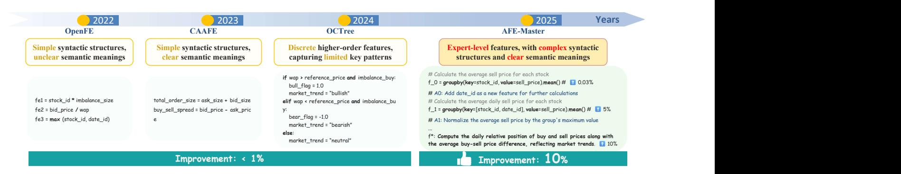
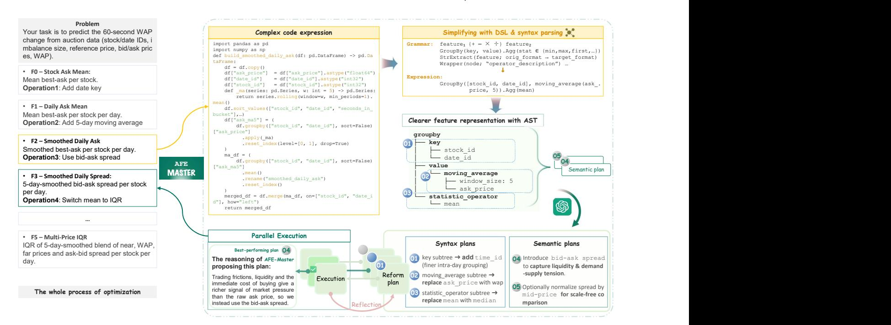
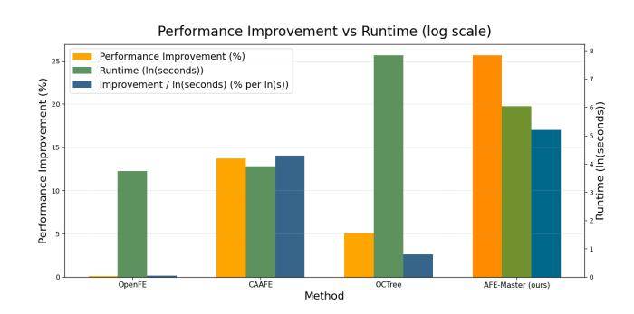

# AFE-Master: Enhancing LLM-Driven Autonomous Feature Engineering with Domain-Specific Language Parsing and Guided Local Search

Hebin Liang lianghebin@tju.edu.cn Tianjin University Tianjin, China

Jianye Hao∗ jianye.hao@tju.edu.cn Tianjin University Tianjin, China

Jinyi Liu jyliu@tju.edu.cn Tianjin University Tianjin, China

Yi Ma mayi@sxu.edu.cn Shanxi University Taiyuan, China

Zilin Cao zilin24@tju.edu.cn Tianjin University Tianjin, China

Jing Liang liangjingxx@tju.edu.cn Tianjin University Tianjin, China

Kun Shao kun.shao@huawei.com Huawei Noah's Ark Lab Beijing, China

Zhaocheng Du zhaochengdu@huawei.com Huawei Noah's Ark Lab Shenzhen, China

Fei Ni f.ni@imperial.ac.uk Imperial College London London, United Kingdom

Yifu Yuan yuanyf@tju.edu.cn Tianjin University Tianjin, China

Yan Zheng∗ yanzheng@tju.edu.cn Tianjin University Tianjin, China

### Abstract

Autonomous Feature Engineering (AFE) is critical for improving predictive performance on tabular data by relieving humans from manual feature crafting. However, traditional AFE lacks the semantic guidance needed to fully exploit domain knowledge. Although large language models (LLMs) can, in principle, emulate experts, existing approaches typically operate in an open code space that directly generates and rewrites entire features; without a compositional structural representation and invariant constraints, edits are coarse and non-local, making it hard to distill interpretable features with high information content and rich hierarchical structure.

We propose AFE-Master, a novel LLM-driven AFE framework that shifts feature construction from black-box evolution to structural and semantically rigorous search. AFE-Master uses a domain-specific language (DSL) to explicitly represent feature transformations and parses them into abstract syntax trees (ASTs), enabling the LLM to understand and manipulate feature structures with clear semantics. On this interpretable representation, we employ guided local search (GLS) over syntactic and semantic neighborhoods, making small, checkable edits that efficiently and controllably discover information-dense, hierarchically structured features. Experiments spanning Kaggle and OpenML benchmarks as well as

∗Corresponding author.

[This work is licensed under a Creative Commons Attribution 4.0 International License.](https://creativecommons.org/licenses/by/4.0) WWW '26, Dubai, United Arab Emirates

© 2026 Copyright held by the owner/author(s). ACM ISBN 979-8-4007-2307-0/2026/04 <https://doi.org/10.1145/3774904.3792816>

multiple tabular models (XGBoost, MLP, and the frontier TabPFN) show significant gains.

At industrial scale, we further conduct a large online A/B test on the advertising recommendation service of a major mobile app store. Starting from a mature, large feature set—167 expert-crafted features refined over two years—we add 20 features automatically generated by AFE-Master. On 100M+ live samples, a wellengineered FiBiNET model achieves +15.11% CPM and +3.01% CTR, demonstrating practical value and transferability under both massive sample volume and a high-feature-count production setting. These results indicate that AFE-Master's semantically guided approach can discover expert-level features beyond the reach of prior methods, pointing to a new generation of interpretable, highperformance AFE techniques.

### CCS Concepts

- Computing methodologies → Natural language processing;
- Information systems → Decision support systems.

## Keywords

LLM, Autonomous Feature Engineering

#### ACM Reference Format:

Hebin Liang, Jianye Hao, Jinyi Liu, Yi Ma, Zilin Cao, Jing Liang, Kun Shao, Zhaocheng Du, Fei Ni, Yifu Yuan, and Yan Zheng. 2026. AFE-Master: Enhancing LLM-Driven Autonomous Feature Engineering with Domain-Specific Language Parsing and Guided Local Search. In Proceedings of the ACM Web Conference 2026 (WWW '26), April 13–17, 2026, Dubai, United Arab Emirates. ACM, New York, NY, USA, [12](#page-11-0) pages[. https://doi.org/10.1145/3774904.3792816](https://doi.org/10.1145/3774904.3792816)

#### Relevance

Our paper strongly aligns with the tracks of Applied Generative AI and Large Language Models in Web Services and Ad Targeting, Auction Systems, and Online Marketing Technologies. We leverage LLMs combined with DSL/AST representations to automate structured tabular feature engineering, addressing a key bottleneck in webcentric ML tasks (e.g., search, recommendations). The effectiveness of our approach is validated through benchmark improvements and real-world deployments in web services. Online A/B tests on the advertising recommendation service of a mobile app store demonstrate that our method is closely aligned with the objectives of both tracks.

#### 1 Introduction

Feature generation is the process of constructing new features from raw data to better capture underlying patterns and relationships. While effective, exceptional feature generation typically demands substantial domain expertise and human effort, making the process time-consuming and hard to scale [\[12\]](#page-8-0). Automated Feature Engineering (AFE) aims to streamline this by algorithmically constructing high-quality features with reduced reliance on manual intervention [\[37\]](#page-8-1).

Traditional AFE methods and their limitations. Classical AFE methods largely fall into two families. The expansion–selection paradigm enumerates operator compositions over raw features and then filters candidates with statistical/model-based criteria [\[21,](#page-8-2) [22,](#page-8-3) [24,](#page-8-4) [31,](#page-8-5) [37\]](#page-8-1). A pattern also seen in deep recommender systems where efficient selection of feature crosses/feature combinations is studied to cope with the massive interaction space [\[8,](#page-8-6) [26,](#page-8-7) [33\]](#page-8-8). The sequential-decision paradigm casts construction as a multi-step policy—often via reinforcement learning, which has been widely applied in embodied intelligence (e.g., robotic manipulation) [\[7\]](#page-8-9), intelligent transportation (e.g., traffic signal control) [\[35\]](#page-8-10), and software engineering (e.g., online game testing) [\[39\]](#page-8-11)—so that each step adds a transformation toward a near-optimal feature [\[3,](#page-8-12) [23,](#page-8-13) [25,](#page-8-14) [36,](#page-8-15) [40\]](#page-8-16).

However, given the vast and exponentially growing space of highorder features (i.e., features involving multiple operators), these methods still lack comprehensive and systematic search capabilities and cannot explicitly leverage domain knowledge. As a result, they may struggle to reliably identify expert-level features in such a sparse and high-dimensional feature space in the same way that human experts do.

To expose fundamental limitations of traditional AFE algorithms, in Figure [1](#page-2-0) we present a characteristic case study on the widely-used Optiver dataset, which originates from a large-scale and popular Kaggle quantitative trading competition. OpenFE, one of the stateof-the-art traditional AFE algorithms, primarily identified features with ambiguous semantics, such as multiplying stock IDs by imbalanced size, resulting in only marginal performance improvements. This highlights the inefficiency of traditional AFE methods in identifying expert-level features with rich semantics and hierarchical structures.

#### LLMs for AFE: promise and gaps.

In recent years, LLMs have been widely adopted in data science [\[4,](#page-8-17) [11,](#page-8-18) [14\]](#page-8-19). CAAFE [\[12\]](#page-8-0) iteratively proposes and selects features from task descriptions, and OCTree [\[29\]](#page-8-20) performs black-box

evolutionary prompting with decision-tree hints. LLM-FE [\[1\]](#page-8-21) incorporates more complex operators and adopts an evolutionary search approach with multi-feature refinement to discover features with higher complexity, while LFG [\[38\]](#page-8-22) leverages multi-agent collaboration to iteratively refine feature sets and employs Monte Carlo Tree Search (MCTS) to balance exploration and exploitation. However, these methods inherit the structural weaknesses diagnosed above: they generate and rewrite entire features in an open code space without a compositional representation or invariant constraints, so edits are coarse and non-local, hard to verify or control, and domain priors are hard to accumulate in features. This typically biases search toward simple hierarchical structure or limited semantic expressivity, rather than information-dense, hierarchically structured constructions.

As illustrated in Figure [1,](#page-2-0) the near end-to-end prompting in CAAFE often yields features with simple syntactic forms; OCTree's reliance on decision-tree path fragments confines the representation to partition-and-count operations, limiting expressive continuous or compositional transformations (e.g., group-aware aggregates, temporal windows, normalizations). These behaviors translate into only modest gains on representative datasets—underscoring that, without explicit structure and constraints, LLM-based AFE still falls short of expert-level feature generation.

Our approach. To tackle the above challenges, we propose AFE-Master, which turns a naive seed feature into an expert-level indicator through structural and semantically rigorous search. Each feature is first encoded in a lightweight domain-specific language (DSL) that distills Python code into its core operators and operands; syntax parsing then unfolds the DSL into an abstract syntax tree (AST), exposing a complete transformation hierarchy for precise LLM analysis. Guided Local Search (GLS) explores this AST with small syntactic or semantic edits: the LLM proposes a handful of candidate refinement plans across multiple subtrees, executes them in parallel, and selects the best-performing candidate at each iteration, thus discovering information-dense, hierarchically structured and informative features.

#### Our main contributions are threefold:

(1) Structural feature representation. We recast feature engineering as program synthesis: a compact DSL parsed into ASTs provides a compositional structure and fine-grained edit primitives, enabling LLMs to reason about and manipulate feature logic beyond ad-hoc code snippets.

(2) Constrained multi-site local search. We introduce Guided Local Search over syntactic/semantic neighborhoods, proposing candidate edits concurrently at multiple AST subtrees and evaluating them in parallel. These small, controllable steps reliably accumulate into information-dense, hierarchically structured, interpretable features—moving beyond black-box evolution.

#### (3) Breadth and real-world impact.

Our approach delivers gains on 13 Kaggle datasets evaluated with XGBoost [\[2\]](#page-8-23) and MLP [\[10\]](#page-8-24). For a 4-task small-scale datasets of these Kaggle datasets, we additionally test the frontier smallsample model TabPFN [\[13\]](#page-8-25). Beyond Kaggle, we further validate on 10 OpenML datasets using XGBoost. In a large-scale online A/B test on a major app-store advertising platform, adding just 20

Figure 1: This figure shows the evolution of AFE methods recently. Existing AFE methods struggle to capture key patterns and only result in limited performance improvements. AFE-Master, with expert-level features that combine complex syntactic structures and clear semantics, leads to the most advanced performance boost.

AFE-Master features to 167 expert-crafted ones improves FiBi-NET by +15.11% CPM and +3.01% CTR over 100M+ impressions, demonstrating practicality and transferability at production scale.

#### 2 Preliminaries

We briefly review Large Language Models (LLMs), automated feature engineering (AFE), domain-specific languages (DSLs), and syntax parsing, which together ground our integration of LLMs with syntax-based techniques for constructing expert-level features.

#### 2.1 Large Language Models

LLMs are deep neural networks trained on massive corpora to capture linguistic patterns, context, and world knowledge, e.g., GPT [\[30\]](#page-8-26) and BERT [\[6\]](#page-8-27). Recent advances extend their use from generation/dialogue to code and data-science workflows [\[11,](#page-8-18) [15,](#page-8-28) [16\]](#page-8-29). Trained on mixed text (including code and technical prose), LLMs develop useful competence in formal languages and symbolic reasoning, motivating their use for AFE.

# 2.2 Feature Generation

Feature generation (or construction) creates new variables from raw data to help models capture salient patterns. Traditionally done by experts using mathematical transforms, aggregations, and logical operations, it is time-consuming, error-prone, and hard to scale to large or complex datasets.

Automated Feature Engineering (AFE) methods have therefore been developed to mitigate these limitations. Early approaches such as the expansion-selection paradigm generate numerous candidate features by combining predefined operators and then prune them using statistical or model-based selection [\[21,](#page-8-2) [22,](#page-8-3) [24,](#page-8-4) [31,](#page-8-5) [37\]](#page-8-1). In deep recommender systems, feature selection has also been systematically benchmarked [\[20\]](#page-8-30) and studied under multi-task objectives [\[5,](#page-8-31) [34\]](#page-8-32). Reinforcement learning-based approaches model feature construction as a sequential decision process, learning policies that select effective transformations step by step [\[3,](#page-8-12) [23,](#page-8-13) [25\]](#page-8-14). However, these methods may still face challenges when the search space is large or when nuanced domain knowledge is crucial. The integration of LLMs offers a new avenue for generating more semantically

informed features, potentially bridging the gap between fully manual and purely algorithmic approaches [\[12,](#page-8-0) [29\]](#page-8-20), and has also been explored for feature selection in deep recommender systems [\[18,](#page-8-33) [19\]](#page-8-34).

#### 2.3 Domain-Specific Language

DSLs are small languages tailored to a domain [\[27\]](#page-8-35), yielding concise, less error-prone programs than general-purpose languages. For feature engineering, a DSL can elegantly encapsulate common transformations (e.g., arithmetic, logical, or statistical operations) while effectively shielding users (or automated systems) from unnecessary low-level details. By providing a structured yet highly flexible way to express feature logic, DSLs help LLMs more reliably understand, generate, and optimize valid feature expressions.

### 2.4 Syntax Parsing

Syntax parsing analyzes strings under a grammar to build Abstract Syntax Trees (AST) [\[32\]](#page-8-36). In our DSL, textual expressions become trees that capture operator precedence and operand relations (Figure [2\)](#page-4-0). Working at the AST level enables fine-grained subtree edits (insert/remove/replace) without disturbing unrelated parts. Finally, defining local edit operations on the AST naturally induces a neighborhood over candidate features, powering our guided local search to efficiently explore high-order variants. Together, these capabilities make feature construction both rigorously structured and easily interpretable by the LLM, which is particularly important in practical deployments where feature changes must be auditable and easy to review [\[9\]](#page-8-37).

### 3 Methods

### 3.1 Overview

AFE-Master follows the way human experts refine features: start simple, improve in small, targeted steps, and keep what works. The system first asks an LLM to propose a seed feature, then rewrites it into a compact DSL expression and parses it into an AST, which exposes operators, operands, and their hierarchy for precise analysis and edits.

Optimization proceeds as a guided local search (GLS). In each iteration, the LLM inspects the AST and the feature's semantics, diagnoses weaknesses, and proposes a small set of high-value edits

across different subtrees (spanning both syntactic and semantic neighborhoods). These plans are executed and evaluated in parallel; underperforming ones receive a brief reflection pass (revise and retry). The best candidate becomes the new feature state, and the loop repeats until the iteration budget is reached. This process keeps changes small and checkable, while allowing improvements to accumulate into information-dense, interpretable constructions.

Figure [2](#page-4-0) illustrates the workflow on Optiver. Within a few rounds, a naive average-price statistic (��0) evolves into an expert-level indicator that integrates spread information and time bucketing (��5). The left panel shows the full trajectory; the right panel zooms into one iteration: DSL simplification → AST representation → plan proposals across subtrees → parallel execution with light reflection → selection of the best refinement. We detail these components in the next subsections.

#### 3.2 Feature Representation via DSL and Syntax Parsing

Pure natural language is too vague to expose the internal structure of complex features, while raw Python mixes high-level intent with low-level boilerplate and can distract LLMs from core semantics [\[28\]](#page-8-38). To balance brevity and clarity, we build on common feature operators [\[37\]](#page-8-1) and introduce a lightweight DSL with a functional style that keeps only operators and dependent fields, omitting boilerplate. For example, the F2 expression in Figure [2](#page-4-0) (top right) fits on a single line yet captures the full group-by → sliding-window → aggregation pipeline, allowing the LLM to reason and rewrite directly at the expression level. The full grammar appears in the appendix.

A linear DSL string, however, still masks the internal hierarchy and reusable sub-expressions of a feature. We therefore parse the DSL into an AST. In the tree, each node represents an operator, parent nodes denote higher-order compositions, and subtrees correspond to local sub-expressions. This structure offers three benefits: (i) pluggable analysis—the LLM can inspect or replace any subtree without affecting the global logic and, by looking at different subtrees, propose improvements from multiple angles (e.g., keys, windows, aggregators, normalizations); (ii) similarity metrics—treeedit distance provides a natural measure of syntactic difference, which GLS uses to define neighborhoods; (iii) step-wise explanation—every refinement appears as a small set of node insertions or replacements, making the optimization path easy to trace and justify.

The boxes at the bottom right of Figure [2](#page-4-0) summarize two types of typical AST modification plans: 3 syntactic plans that add, swap, or remove specific nodes, and 2 semantic plans that adjust the feature's underlying meaning. By coupling the DSL's concise surface form with the AST's hierarchical view, AFE-Master retains semantic fidelity while giving the LLM a feature representation that is both highly operable and readily interpretable.

#### 3.3 Guided Local Search: From Initial Guess to Expert-Level Features

With the AST in place, AFE-Master refines a seed feature via GLS. At each round, the LLM proposes several small edits to different AST subtrees; candidates are evaluated in parallel, weak ones are

lightly revised, and the best variant is carried forward to the next iteration. Figure [2](#page-4-0) illustrates a typical path on Optiver: after five rounds, an initial moving-average ask price (F0) evolves into an indicator that combines bid–ask spread, time bucketing and an IQR summary (F5).

3.3.1 Neighborhoods of Change (What counts as a "small step"). We define two complementary neighborhoods of a feature �� . Intuitively, one captures edits to the formula, the other captures edits to the meaning that follow common expert patterns.

Syntactic neighborhood Nsyn (�� ). Single-step edits on the AST (��AST = 1). Examples:

- replace an operator (e.g., mean → median);
- swap an input field (ask\_price → wap);
- tweak a window size (win=10 → 20) or insert a simple wrapper (e.g., add a log).

Semantic neighborhood Nsem(�� ). Small, meaning-preserving (or closely related) moves that bundle coordinated changes to reach a semantically similar feature even when multiple AST edits would be required (��AST &gt; 1). Typical patterns include:

- switch the target quantity: price → bid–ask spread;
- normalize a grouped mean by a grouped max: gmean�� (��)→ gmean�� (��)/(gmax�� (��) + ��) (��AST &gt; 1);

These moves are constrained to stay "near" the current feature (e.g., reuse the same base columns/time horizon), may be viewed as a form of local neighborhood search in the semantic latent space, rather than arbitrary end-to-end rewrites.

3.3.2 LLM-Driven Reform Plans. To make GLS practical, we pair bounded neighborhoods with an LLM that serves as an automated feature engineer. It first analyzes the current feature—reasoning over the AST structure and domain priors learned in pretraining—to diagnose weaknesses and opportunities, and then proposes a small, reliable set of high-value plans targeting different subtrees. As illustrated in Figure [2,](#page-4-0) starting from F2: Smoothed Daily Ask, the LLM after this analysis proposed five plans: (i) add time\_id to the groupby key; (ii) swap the moving-average field from ask\_price to wap; (iii) replace the aggregator mean with median; (iv) switch the target from ask price to bid–ask spread to capture liquidity pressure; and (v) apply a normalization to remove scale effects. Each plan includes a brief rationale (e.g., plan (iv) argues that the bid–ask spread better reflects immediate execution cost than a single-side quote).

3.3.3 Parallel Plan Execution, Evaluation and Reflection. At GLS round ��, the LLM's plans P (��) = {��1, . . . , ���� } are instantiated on the current feature f (��) in parallel, producing candidates

C (��) = {f ′ 1 , . . . , f ′ }.

Each candidate is evaluated by the downstream model �� on dataset ��; the utility U (f ′ , ��, ��) records the validation gain after adding f ′ . Underperforming plans trigger a brief reflection step: the LLM diagnoses the failure and proposes a minor revision. For example, adding time\_id to the groupby key initially hurt validation due to overpartitioning; the LLM then suggested discretizing seconds\_in\_bucket and grouping by time buckets instead, which recovered a positive gain.

Figure 2: This diagram illustrates the process of feature optimization using AFE-Master. Features are first represented using a DSL and parsed into ASTs. GLS then utilizes LLMs to propose feature improvement plans from both syntactic and semantic perspectives, iteratively optimizing the features.

The next feature state is chosen as the best-performing candidate among C (��) , effectively consolidating proposals from different AST subtrees and selecting the strongest improvement:

f (��+1) = arg max f ′ ∈ C(�� ) U (f ′ , ��, ��).

where C (��) is the candidate set for round ��, and f (��+1) becomes the baseline for the next GLS iteration.

In this way, through accumulated subtree-level reasoning and controlled small-step edits, AFE-Master infuses rich domain priors into features and derives information-dense, hierarchically structured, interpretable features.

### 4 Experiments

## 4.1 Experimental Setup

Datasets. We evaluate AFE-Master on 13 representative benchmarks from Kaggle, covering a diverse range of scales and complexities: (1) three beginner-level Kaggle competitions and datasets; (2) eight playground-level monthly Kaggle competitions; and (3) two difficult industrial-grade competitions offering cash prizes. These benchmarks vary in sample size and feature count, representing applications in real-world domains such as finance, healthcare, agriculture, education, environmental protection, and disaster prediction. They include both classification and regression settings, spanning time-series and non-time-series tasks. All competition datasets are widely popular, with thousands of participating teams. Following the setting in CAAFE, we include textual (language-based) descriptions for each dataset. Detailed dataset characteristics are provided

in Appendix. Additionally, to offer a more comprehensive evaluation, we tested all methods on the 10 OpenML datasets used in CAAFE.

Baseline Models. To assess the effectiveness of AFE-Master, we use XGBoost [\[2\]](#page-8-23), MLP [\[10\]](#page-8-24), and the recent tabular ML model TabPFN [\[13\]](#page-8-25) as downstream predictive models. XGBoost is a competitive decision tree-based method, while MLP represents a classic neural network architecture. For comparison, we evaluate the features generated by the following AFE baselines: (1) OpenFE [\[37\]](#page-8-1): a state-of-the-art traditional AFE method that uses operator-based expansion and feature selection; (2) CAAFE [\[12\]](#page-8-0): an LLM-based approach that generates features end-to-end using task descriptions; and (3) OCTree [\[29\]](#page-8-20): another LLM-based method that leverages evolutionary search and decision-tree prompts for feature construction.

Experimental Configuration. For most non-temporal datasets, we adopt a 60%/20%/20% train/validation/test split. For evaluation metrics, we follow OCTree: MAE for regression and ACC for classification. To ensure robustness, we repeat each experiment with three different random seeds. For temporal datasets, we split the data chronologically, with the test set taking approximately 20% and the validation set approximately 16%. For a subset of small-scale datasets, to perform more reliable feature selection, we merge the training and validation sets and conduct cross-validation on the merged data.

In the Kaggle experiments, both XGBoost and MLP are tuned via hyperparameter optimization (the search space is provided in the appendix). To control computational cost, hyperparameter search is conducted under a single random seed, after which the selected

Table 1: Performance and relative improvement over w/o FE on Regression Tasks (MAE)

| Downstream Method |       | optiver |         |       |       | abalone  |         |         |       | bike      |         |       |       | crab     |         |         |       | google   |         |       |       | flood    | Avg      |
|-------------------|-------|---------|---------|-------|-------|----------|---------|---------|-------|-----------|---------|-------|-------|----------|---------|---------|-------|----------|---------|-------|-------|----------|----------|
| w/o FE            |       | 5.990   |         | 1.236 | ±     | 0.001    |         | 1.857   | ±     | 0.071     |         | 1.395 | ±     | 0.003    |         | 1.967   | ±     | 0.005    |         | 0.016 | ±     | 0.000    | —        |
| OpenFE XGBoost    | 5.980 | (0.16%) | 1.236   | ±     | 0.001 | (-0.02%) | 1.268   | ±       | 0.055 | (31.71%)  | 1.396   | ±     | 0.003 | (-0.04%) | 1.917   | ±       | 0.004 | (2.56%)  | 0.016   | ±     | 0.000 | (-0.64%) | 5.62%    |
| CAAFE             | 5.981 | (0.15%) | 1.236   | ±     | 0.001 | (0.02%)  | 1.840   | ±       | 0.074 | (0.92%)   | 1.396   | ±     | 0.003 | (-0.09%) | 1.340   | ±       | 0.436 | (31.89%) | 0.016   | ±     | 0.000 | (0.00%)  | 5.48%    |
| OCTree            | 5.957 | (0.55%) | 1.236   | ±     | 0.001 | (-0.02%) | 1.819   | ±       | 0.090 | (2.04%)   | 1.395   | ±     | 0.003 | (0.01%)  | 1.957   | ±       | 0.008 | (0.53%)  | 0.016   | ±     | 0.000 | (-0.64%) | 0.41%    |
| Ours              | 5.397 | ( 9.90% | ) 1.217 | ±     | 0.004 | ( 1.57%  | ) 1.090 | ± 0.020 |       | ( 41.28%  | ) 1.393 | ±     | 0.002 | ( 0.13%  | ) 0.904 | ± 0.022 |       | ( 54.08% | ) 0.015 | ±     | 0.000 | ( 7.01%  | ) 19.00% |
| w/o FE            |       | 6.063   |         | 1.207 | ±     | 0.004    |         | 0.443   | ±     | 0.071     |         | 1.362 | ±     | 0.006    |         | 2.087   | ±     | 0.013    |         | 0.014 | ±     | 0.000    | —        |
| OpenFE MLP        | 6.026 | (0.60%) | 1.203   | ±     | 0.009 | (0.35%)  | 0.569   | ± 0.015 |       | (-28.39%) | 1.368   | ±     | 0.004 | (-0.43%) | 2.075   | ±       | 0.012 | (0.58%)  | 0.014   | ±     | 0.000 | ( 0.71%  | ) -4.43% |
| CAAFE             | 5.937 | (2.07%) | 1.227   | ±     | 0.032 | (-1.68%) | 0.433   | ±       | 0.092 | (2.30%)   | 1.365   | ±     | 0.008 | (-0.23%) | 1.416   | ±       | 0.195 | (32.14%) | 0.014   | ±     | 0.000 | (0.00%)  | 5.77%    |
| OCTree            | 6.033 | (0.50%) | 1.211   | ±     | 0.008 | (-0.29%) | 0.455   | ±       | 0.081 | (-2.71%)  | 1.369   | ±     | 0.004 | (-0.49%) | 2.078   | ±       | 0.002 | (0.43%)  | 0.014   | ±     | 0.000 | (0.00%)  | -0.43%   |
| Ours              | 5.537 | ( 8.67% | ) 1.200 | ±     | 0.004 | ( 0.57%  | ) 0.353 | ± 0.060 |       | ( 20.30%  | ) 1.361 | ±     | 0.001 | ( 0.03%  | ) 0.966 | ± 0.015 |       | ( 53.72% | ) 0.014 | ±     | 0.000 | (0.00%)  | 13.88%   |

Table 2: Performance and relative improvement over w/o FE on Classification Tasks (ACC)

| Downstream Method |       |       |       | multi    |         |       |       | academic |         |         |       | disease  |         |       |       | kidney   |         |       |       | smoke    |         |       |       | soft     |         |       |       | spac    | Avg     |
|-------------------|-------|-------|-------|----------|---------|-------|-------|----------|---------|---------|-------|----------|---------|-------|-------|----------|---------|-------|-------|----------|---------|-------|-------|----------|---------|-------|-------|---------|---------|
| w/o FE            |       | 0.904 | ±     | 0.003    |         | 0.756 | ±     | 0.020    |         | 0.724   | ±     | 0.058    |         | 0.715 | ±     | 0.049    |         | 0.762 | ±     | 0.005    |         | 0.815 | ±     | 0.003    |         | 0.801 | ±     | 0.008   | —       |
| OpenFE XGBoost    | 0.904 | ±     | 0.003 | ( 0.31%  | ) 0.756 | ±     | 0.020 | (0.12%)  | 0.743   | ±       | 0.025 | (6.88%)  | 0.731   | ±     | 0.037 | (5.61%)  | 0.763   | ±     | 0.005 | (0.25%)  | 0.815   | ±     | 0.003 | ( 0.11%  | ) 0.802 | ±     | 0.005 | (0.70%) | 2.00%   |
| CAAFE             | 0.900 | ±     | 0.006 | (-4.06%) | 0.757   | ±     | 0.013 | (0.65%)  | 0.767   | ±       | 0.066 | (15.54%) | 0.739   | ±     | 0.039 | (8.45%)  | 0.761   | ±     | 0.004 | (-0.63%) | 0.815   | ±     | 0.003 | (0.05%)  | 0.802   | ±     | 0.010 | (0.85%) | 2.98%   |
| OCTree            | 0.904 | ±     | 0.002 | (0.21%)  | 0.756   | ±     | 0.020 | (0.12%)  | 0.733   | ±       | 0.046 | (3.44%)  | 0.711   | ±     | 0.055 | (-1.40%) | 0.762   | ±     | 0.005 | (0.00%)  | 0.815   | ±     | 0.003 | (0.00%)  | 0.801   | ±     | 0.008 | (0.00%) | 0.34%   |
| Ours              | 0.904 | ±     | 0.003 | ( 0.31%  | ) 0.762 | ±     | 0.017 | ( 2.74%  | ) 0.772 | ± 0.051 |       | ( 17.24% | ) 0.743 | ±     | 0.057 | ( 9.86%  | ) 0.763 | ±     | 0.006 | ( 0.46%  | ) 0.815 | ±     | 0.003 | (0.00%)  | 0.803   | ±     | 0.008 | ( 1.10% | ) 4.83% |
| w/o FE            |       | 0.869 | ±     | 0.003    |         | 0.730 | ±     | 0.027    |         | 0.695   | ±     | 0.066    |         | 0.651 | ±     | 0.042    |         | 0.755 | ±     | 0.005    |         | 0.810 | ±     | 0.004    |         | 0.760 | ±     | 0.010   | —       |
| OpenFE MLP        | 0.873 | ±     | 0.004 | (2.76%)  | 0.736   | ±     | 0.015 | (2.04%)  | 0.686   | ±       | 0.014 | (-3.12%) | 0.699   | ±     | 0.021 | ( 13.80% | ) 0.757 | ±     | 0.004 | (0.82%)  | 0.810   | ±     | 0.003 | (0.26%)  | 0.771   | ±     | 0.007 | (4.75%) | 3.04%   |
| CAAFE             | 0.876 | ±     | 0.003 | (4.98%)  | 0.729   | ±     | 0.010 | (-0.45%) | 0.714   | ±       | 0.043 | (6.27%)  | 0.639   | ±     | 0.053 | (-3.43%) | 0.756   | ±     | 0.005 | (0.37%)  | 0.808   | ±     | 0.003 | (-0.89%) | 0.774   | ±     | 0.012 | (5.96%) | 1.83%   |
| OCTree            | 0.871 | ±     | 0.004 | (1.07%)  | 0.729   | ±     | 0.019 | (-0.59%) | 0.710   | ±       | 0.068 | (4.69%)  | 0.655   | ±     | 0.018 | (1.14%)  | 0.756   | ±     | 0.004 | (0.37%)  | 0.810   | ±     | 0.002 | (0.26%)  | 0.763   | ±     | 0.007 | (1.08%) | 1.15%   |
| Ours              | 0.876 | ±     | 0.002 | ( 5.21%  | ) 0.738 | ±     | 0.020 | ( 2.63%  | ) 0.733 | ± 0.054 |       | ( 12.50% | ) 0.699 | ±     | 0.036 | ( 13.80% | ) 0.758 | ±     | 0.006 | ( 1.22%  | ) 0.810 | ±     | 0.001 | ( 0.32%  | ) 0.775 | ±     | 0.011 | ( 6.12% | ) 5.97% |

hyperparameters are fixed and we repeat training and evaluation with three random seeds. During the dialogue, our method uses GPT-4o-mini as the LLM. This model is lightweight, cost-effective, and fast to respond, and it effectively supports the feature engineering pipeline by producing valuable suggestions and identifying potential improvements.

# 4.2 Main Results

Tables [1](#page-5-0) and [2](#page-5-1) demonstrate the effectiveness of AFE-Master across 13 well-known Kaggle benchmarks with varying difficulty. We report the mean and standard deviation across different random seeds and evaluate each AFE method based on the relative error reduction compared to the baseline without feature engineering. Our analysis reveals that AFE-Master outperforms existing methods across datasets of different scales, complexities, types, and application domains, achieving significant performance improvements. Specifically, our approach yields an average improvement of 16.44% for regression tasks and 5.40% for classification tasks, demonstrating a significant gain over existing methods. These results highlight the strong feature construction capabilities of our method.

Our method performs well across datasets of varying difficulty levels and distributions by leveraging a concise DSL and a structured AST to effectively decompose and understand complex feature structures. Moreover, the integration of GLS further enables the progressive discovery of high-quality features through small, interpretable edits. In contrast, other LLM-based methods—such as

CAAFE and OCTree—can sometimes be constrained by the limited expressiveness of their feature representations or the relative inefficiency of their search algorithms. This comparison suggests that AFE-Master more fully harnesses the reasoning capabilities of LLMs, thereby yielding more meaningful and interpretable feature transformations.

Unlike other approaches that often exhibit performance fluctuations across different datasets, AFE-Master by contrast maintains stable and reliable gains. For instance, although CAAFE performs relatively well on the Google dataset and OpenFE tends to excel on the Bike dataset under an XGBoost model, their effectiveness varies quite significantly on other benchmarks. Similarly, OCTree's decision-tree-driven prompts tend to favor discrete feature constructions and may also struggle to capture more intricate transformations such as grouped time-series patterns or advanced aggregations.

By optimizing features both syntactically and semantically, AFE-Master ensures a gradual yet flexible refinement process that dynamically adjusts feature structures. This dual strategy allows our method to explore a broader spectrum of high-quality candidates, making it robust across diverse datasets and application domains.

## 4.3 Ablations and Analysis

Performance on Advanced Tabular ML Model. In order to further validate the applicability of our approach to cutting-edge tabular learners, we evaluated each AFE method on TabPFN [\[13\]](#page-8-25), a

Table 3: Performance and relative improvement over w/o FE with TabPFN

Table 4: Performance and relative improvement over w/o FE on 10 OpenML Benchmarks

transformer pretrained offline on millions of synthetic tasks and shown to be highly competitive on small tabular benchmarks (<10 k rows). Following the official protocol, we ran all methods on the four Kaggle datasets within this size range. As reported in Table [3,](#page-6-0) AFE-Master outperforms all baselines by a wide margin, achieving an average error reduction of +3.77%, thereby demonstrating its effectiveness even for state-of-the-art tabular foundation models.

Performance on OpenML Benchmarks. In order to further demonstrate the broad applicability of our approach, we evaluated AFE-Master on 10 well-known OpenML benchmarks. We use XG-Boost as the downstream learner and GPT-4o-mini for our feature construction, and assessed each dataset over three random splits. Table [4](#page-6-1) reports the performance and relative error reduction on each benchmark. AFE-Master achieves substantially greater performance gains than existing AFE techniques, markedly reducing the downstream model's prediction error. These results further underscore the robustness and generalization capabilities of AFE-Master across a wide range of tabular tasks.

Effectiveness of the AST component. To isolate the contribution of the AST-based representation, we removed the AST representation of the features from the prompt and asked the LLM to reason directly over the raw DSL string. Tested on all 13 Kaggle benchmarks used in the main experiments, results are shown in Table [5.](#page-6-2) This ablated variant suffered a marked drop in performance, confirming that tree-level structure is critical to AFE-Master's gains.

Table 5: Ablation (gain) with and without AST. Reg-Avg: 6 regression Kaggle datasets; Cls-Avg: 7 classification Kaggle datasets; All-Avg: overall mean.

Table 6: Average improvement of AFE-Master with different LLMs on 13 Kaggle datasets.

| Method                            | Avg    |
|-----------------------------------|--------|
| AFE-Master (Qwen-2.5-7B-Instruct) | 6.17%  |
| AFE-Master (GPT-4o-mini)          | 11.92% |

The details of performance for AFE-Master with and without AST are shown in the Appendix [D.](#page-9-0)

Portability across LLMs. To verify that our method remains effective across various LLMs, we evaluated AFE-Master using Qwen-2.5-7B-Instruct. As shown in Table [6,](#page-6-3) although the average improvement was lower than with GPT-4o-mini, it still delivers very competitive results relative to other LLM baselines and OpenFE. Full results can be found in Appendix [F.](#page-9-1)

Comparison with direct GPT-o1 reasoning. To isolate the effect of standalone reasoning, we evaluated a single-turn setting that asks GPT-o1-preview to directly generate features without the AFE-Master iterative loop. This direct-o1 approach slightly degraded average performance (–0.77% over the same 13 Kaggle datasets), whereas AFE-Master with GPT-4o-mini yields substantial gains. The takeaway is that single-turn reasoning cannot substitute for our iterative, semantics-guided pipeline—the gap here is paradigm, not merely model size. Full results appear in Appendix.

These trends corroborate that our iterative AST + GLS pipeline is essential to stable and effective feature discovery.

#### 4.4 Runtime and Cost

In Figure [3,](#page-7-0) we plot the trade-off between runtime and feature engineering quality for our method (AFE-Master) versus several baselines on the OpenML benchmark suite, using XGBoost as the downstream learner and GPT-4o-mini for feature generation. The results demonstrate that AFE-Master discovers features of markedly higher predictive power within only a few minutes, whereas other methods yield substantially lower improvements.

Crucially, in real-world industrial deployments (e.g., advertising and recommendation systems), discovered feature importance tends to remain stable for months once a high-value feature is identified. Therefore, an offline search lasting several minutes represents an entirely acceptable overhead. Moreover, the average cloud cost of a single AFE-Master run is only around \$0.2–\$1 in our experiments when using GPT-4o-mini; adopting a locally hosted, lightweight language model would further reduce both runtime and monetary expense.

#### 5 Online Testing Results

To evaluate the practical value of AFE-Master by deploying it in a large-scale online advertising scenario—one of the most profitable tabular data tasks in the IT industry. Specifically, we test on our industrial advertising platform, which serves billions of users through a mobile app store. The baseline (control group) uses a

Figure 3: Trade-off between feature performance gain (%) and runtime (ln s) for various methods on OpenML benchmarks, including a ratio (improvement / ln runtime) to capture gain–cost balance.

Table 7: Online A/B test result. The AFE-Master augments the baseline feature set with 20 automatically discovered descriptors, yielding consistent gains on many platform KPIs.

| Metric  | Definition |           | (simplified)     | Lift vs. Baseline |
|---------|------------|-----------|------------------|-------------------|
| RPM     | Revenue    | per       | mille            | +0.63%            |
| CPM     | Cost       | per mille |                  | +15.11%           |
| Revenue | Net        | revenue   | collected by the | platform +0.60%   |
| CTR     | Click      | through   | rate             | +3.01%            |

well-engineered FiBiNET model [\[17\]](#page-8-39) with 167 expert-crafted features refined over two years. In the experiment group, we add 20 features automatically generated by AFE-Master through offline searching, keeping all other model settings unchanged.

We initially allocate 5% of user traffic (millions of users) to each group and observe significant performance improvements in the experiment group over one week. Based on these results, we increase the traffic to 30% for further validation. After another week of observation, as summarized in Table [7,](#page-7-1) the experiment group demonstrates consistent gains in many key metrics like platform revenue, and Click Through Rate. These results confirm that AFE-Master delivers substantial economic benefits at industrial scale. As a result, the experiment group has now serving 100% of the traffic.

#### 6 Conclusion and Limitation

In this paper, we presented AFE-Master, a novel automated feature engineering framework that overcomes the limitations of existing LLM-based approaches in crafting semantically rich and syntactically intricate features. By integrating a concise DSL, hierarchical AST representations, and a Guided Local Search strategy, AFE-Master enables progressive, interpretable feature refinement. Empirical results on Kaggle and OpenML datasets and one large-scale deployed online A/B test demonstrate that our method outperforms both traditional AFE algorithms and recent LLM-driven techniques, uncovering expert-level features that boost performance across diverse ML models.

Despite these advances, several avenues remain for future work. On the syntactic side, leveraging AST edit paths more effectively could yield even more efficient transformations. On the semantic front, training specialized models for feature embeddings may support finer-grained, context-aware modifications. In future research, we plan to enrich our operator set, explore more diverse transformation patterns, and integrate deeper domain knowledge to further enhance the stability and interpretability of generated features.

# Acknowledgments

This work is supported by the National Natural Science Foundation of China (Grant Nos. 62422605, 62533021, 92370132), Xiaomi Young Talents Program of Xiaomi Foundation, and the Fundamental Research Program of Shanxi Province (Serial No. 202503021212091).

References [1] Nikhil Abhyankar, Parshin Shojaee, and Chandan K Reddy. 2025. LLM-FE: Automated Feature Engineering for Tabular Data with LLMs as Evolutionary Optimizers. arXiv preprint arXiv:2503.14434 (2025). [2] Tianqi Chen. 2016. XGBoost: A Scalable Tree Boosting System. Cornell University (2016). [3] Xiangning Chen, Qingwei Lin, Chuan Luo, Xudong Li, Hongyu Zhang, Yong Xu, Yingnong Dang, Kaixin Sui, Xu Zhang, Bo Qiao, et al. 2019. Neural feature search: A neural architecture for automated feature engineering. In 2019 IEEE International Conference on Data Mining (ICDM). IEEE, 71–80. [4] Yibin Chen, Yifu Yuan, Zeyu Zhang, Yan Zheng, Jinyi Liu, Fei Ni, Jianye Hao, Hangyu Mao, and Fuzheng Zhang. 2025. SheetAgent: towards a generalist agent for spreadsheet reasoning and manipulation via large language models. In Proceedings of the ACM on Web Conference 2025. 158–177. [5] Zhongde Chen, Ruize Wu, Cong Jiang, Honghui Li, Xin Dong, Can Long, Yong He, Lei Cheng, and Linjian Mo. 2022. CFS-MTL: a causal feature selection mechanism for multi-task learning via pseudo-intervention. In Proceedings of the 31st ACM International Conference on Information & Knowledge Management. 3883–3887. [6] Jacob Devlin, Ming-Wei Chang, Kenton Lee, and Kristina Toutanova. 2019. Bert: Pre-training of deep bidirectional transformers for language understanding. In Proceedings of the 2019 conference of the North American chapter of the association for computational linguistics: human language technologies, volume 1 (long and short papers). 4171–4186. [7] Kalashnikov Dmitry, Irpan Alex, Pastor Peter, Ibarz Julian, Herzog Alexander, Jang Eric, Quillen Deirdre, Holly Ethan, Kalakrishnan Mrinal, Vanhoucke Vincent, et al. 2018. Qt-opt. Scalable deep reinforcement learning for vision-based robotic manipulation. arXiv preprint (2018). [8] Zhaocheng Du, Junhao Chen, Qinglin Jia, Chuhan Wu, Jieming Zhu, Zhenhua Dong, and Ruiming Tang. 2024. LightCS: Selecting Quadratic Feature Crosses in Linear Complexity. In Companion Proceedings of the ACM Web Conference 2024. 38–46. [9] Zhaocheng Du, Chuhan Wu, Qinglin Jia, Jieming Zhu, and Xu Chen. 2024. A Tutorial on Feature Interpretation in Recommender Systems. In Proceedings of the 18th ACM Conference on Recommender Systems. 1281–1282. [10] Yury Gorishniy, Ivan Rubachev, Valentin Khrulkov, and Artem Babenko. 2021. Revisiting deep learning models for tabular data. Advances in Neural Information Processing Systems 34 (2021), 18932–18943. [11] Siyuan Guo, Cheng Deng, Ying Wen, Hechang Chen, Yi Chang, and Jun Wang. 2024. DS-Agent: Automated Data Science by Empowering Large Language Models with Case-Based Reasoning. arXiv preprint arXiv:2402.17453 (2024). [12] Noah Hollmann, Samuel Müller, and Frank Hutter. 2023. Large language models for automated data science: Introducing caafe for context-aware automated feature engineering. Advances in Neural Information Processing Systems 36 (2023), 44753–44775. [13] Noah Hollmann, Samuel Müller, Lennart Purucker, Arjun Krishnakumar, Max Körfer, Shi Bin Hoo, Robin Tibor Schirrmeister, and Frank Hutter. 2025. Accurate predictions on small data with a tabular foundation model. Nature 637, 8045 (2025), 319–326. [14] Sirui Hong, Yizhang Lin, Bang Liu, Bangbang Liu, Binhao Wu, Ceyao Zhang, Danyang Li, Jiaqi Chen, Jiayi Zhang, Jinlin Wang, et al. 2025. Data interpreter: An llm agent for data science. In Findings of the Association for Computational Linguistics: ACL 2025. 19796–19821. [15] Sirui Hong, Mingchen Zhuge, Jonathan Chen, Xiawu Zheng, Yuheng Cheng, Jinlin Wang, Ceyao Zhang, Zili Wang, Steven Ka Shing Yau, Zijuan Lin, et al. 2023. MetaGPT: Meta programming for a multi-agent collaborative framework. In The twelfth international conference on learning representations. [16] Dong Huang, Jie M Zhang, Michael Luck, Qingwen Bu, Yuhao Qing, and Heming Cui. 2023. Agentcoder: Multi-agent-based code generation with iterative testing and optimisation. arXiv preprint arXiv:2312.13010 (2023). [17] Tongwen Huang, Zhiqi Zhang, and Junlin Zhang. 2019. FiBiNET: combining feature importance and bilinear feature interaction for click-through rate prediction. In Proceedings of the 13th ACM conference on recommender systems. 169–177. [18] Pengyue Jia, Zhaocheng Du, Yichao Wang, Xiangyu Zhao, Xiaopeng Li, Yuhao Wang, Qidong Liu, Huifeng Guo, and Ruiming Tang. 2024. AltFS: Agency-light Feature Selection with Large Language Models in Deep Recommender Systems. arXiv preprint arXiv:2412.08516 (2024). [19] Pengyue Jia, Zhaocheng Du, Yichao Wang, Xiangyu Zhao, Xiaopeng Li, Yuhao Wang, Qidong Liu, Huifeng Guo, and Ruiming Tang. 2025. SELF: Surrogatelight Feature Selection with Large Language Models in Deep Recommender Systems. In Proceedings of the 34th ACM International Conference on Information and Knowledge Management. 1145–1155. [20] Pengyue Jia, Yejing Wang, Zhaocheng Du, Xiangyu Zhao, Yichao Wang, Bo Chen, Wanyu Wang, Huifeng Guo, and Ruiming Tang. 2024. Erase: Benchmarking feature selection methods for deep recommender systems. In Proceedings of the 30th ACM SIGKDD Conference on Knowledge Discovery and Data Mining. 5194– 5205. [21] James Max Kanter and Kalyan Veeramachaneni. 2015. Deep feature synthesis: Towards automating data science endeavors. In 2015 IEEE international conference on data science and advanced analytics (DSAA). IEEE, 1–10. [22] Gilad Katz, Eui Chul Richard Shin, and Dawn Song. 2016. Explorekit: Automatic feature generation and selection. In 2016 IEEE 16th International Conference on Data Mining (ICDM). IEEE, 979–984. [23] Udayan Khurana, Horst Samulowitz, and Deepak Turaga. 2018. Feature engineering for predictive modeling using reinforcement learning. In Proceedings of the AAAI Conference on Artificial Intelligence, Vol. 32. [24] Hoang Thanh Lam, Johann-Michael Thiebaut, Mathieu Sinn, Bei Chen, Tiep Mai, and Oznur Alkan. 2017. One button machine for automating feature engineering in relational databases. arXiv preprint arXiv:1706.00327 (2017). [25] Liyao Li, Haobo Wang, Liangyu Zha, Qingyi Huang, Sai Wu, Gang Chen, and Junbo Zhao. 2023. Learning a Data-Driven Policy Network for Pre-Training Automated Feature Engineering. In The Eleventh International Conference on Learning Representations. [26] Bin Liu, Chenxu Zhu, Guilin Li, Weinan Zhang, Jincai Lai, Ruiming Tang, Xiuqiang He, Zhenguo Li, and Yong Yu. 2020. Autofis: Automatic feature interaction selection in factorization models for click-through rate prediction. In proceedings of the 26th ACM SIGKDD international conference on knowledge discovery & data mining. 2636–2645. [27] Marjan Mernik, Jan Heering, and Anthony M Sloane. 2005. When and how to develop domain-specific languages. ACM computing surveys (CSUR) 37, 4 (2005), 316–344. [28] Iman Mirzadeh, Keivan Alizadeh, Hooman Shahrokhi, Oncel Tuzel, Samy Bengio, and Mehrdad Farajtabar. 2024. Gsm-symbolic: Understanding the limitations of mathematical reasoning in large language models. arXiv preprint arXiv:2410.05229 (2024). [29] Jaehyun Nam, Kyuyoung Kim, Seunghyuk Oh, Jihoon Tack, Jaehyung Kim, and Jinwoo Shin. 2024. Optimized feature generation for tabular data via llms with decision tree reasoning. Advances in Neural Information Processing Systems 37 (2024), 92352–92380. [30] Alec Radford, Karthik Narasimhan, Tim Salimans, Ilya Sutskever, et al. 2018. Improving language understanding by generative pre-training. (2018). [31] Qitao Shi, Ya-Lin Zhang, Longfei Li, Xinxing Yang, Meng Li, and Jun Zhou. 2020. Safe: Scalable automatic feature engineering framework for industrial tasks. In 2020 IEEE 36th International Conference on Data Engineering (ICDE). IEEE, 1645–1656. [32] Weisong Sun, Chunrong Fang, Yun Miao, Yudu You, Mengzhe Yuan, Yuchen Chen, Quanjun Zhang, An Guo, Xiang Chen, Yang Liu, et al. 2023. Abstract Syntax Tree for Programming Language Understanding and Representation: How Far Are We? arXiv preprint arXiv:2312.00413 (2023). [33] Xianquan Wang, Zhaocheng Du, Jieming Zhu, Chuhan Wu, Qinglin Jia, and Zhenhua Dong. 2025. TayFCS: Towards Light Feature Combination Selection for Deep Recommender Systems. In Proceedings of the 31st ACM SIGKDD Conference on Knowledge Discovery and Data Mining V. 2. 5007–5017. [34] Yejing Wang, Zhaocheng Du, Xiangyu Zhao, Bo Chen, Huifeng Guo, Ruiming Tang, and Zhenhua Dong. 2023. Single-shot feature selection for multi-task recommendations. In Proceedings of the 46th International ACM SIGIR Conference on Research and Development in Information Retrieval. 341–351. [35] Hua Wei, Chacha Chen, Guanjie Zheng, Kan Wu, Vikash Gayah, Kai Xu, and Zhenhui Li. 2019. Presslight: Learning max pressure control to coordinate traffic signals in arterial network. In Proceedings of the 25th ACM SIGKDD international conference on knowledge discovery & data mining. 1290–1298. [36] Yu Wu, Xin Xi, and Jieyue He. 2022. AFGSL: Automatic feature generation based on graph structure learning. Knowledge-Based Systems 238 (2022), 107835. [37] Tianping Zhang, Zheyu Aqa Zhang, Zhiyuan Fan, Haoyan Luo, Fengyuan Liu, Qian Liu, Wei Cao, and Li Jian. 2023. Openfe: Automated feature generation with expert-level performance. In International Conference on Machine Learning. PMLR, 41880–41901. [38] Xinhao Zhang, Jinghan Zhang, Banafsheh Rekabdar, Yuanchun Zhou, Pengfei Wang, and Kunpeng Liu. 2024. Dynamic and adaptive feature generation with llm. arXiv preprint arXiv:2406.03505 (2024). [39] Yan Zheng, Xiaofei Xie, Ting Su, Lei Ma, Jianye Hao, Zhaopeng Meng, Yang Liu, Ruimin Shen, Yingfeng Chen, and Changjie Fan. 2019. Wuji: Automatic online combat game testing using evolutionary deep reinforcement learning. In 2019 34th IEEE/ACM International Conference on Automated Software Engineering (ASE). IEEE, 772–784. [40] Guanghui Zhu, Zhuoer Xu, Chunfeng Yuan, and Yihua Huang. 2022. DIFER: differentiable automated feature engineering. In International Conference on Automated Machine Learning. PMLR, 17–1. A Experimental Settings

This section introduces our specific experimental setup. For the downstream XGBoost and MLP [\[10\]](#page-8-24) models in Kaggle benchmarks, we followed the approach of OCTree [\[29\]](#page-8-20), utilizing the Optuna library and the same parameter search space to find the optimal hyperparameters (details omitted due to space). For MLP, we trained for 300 epochs with early stopping; if the validation score did not improve within 40 epochs, early stopping was triggered. We used ReduceOnPlateau as the learning rate scheduler.

#### B Datasets

We evaluate on the following Kaggle benchmarks (links provided) : [academic,](https://www.kaggle.com/datasets/missionjee/students-dropout-and-academic-success-dataset) [disease,](https://www.kaggle.com/datasets/uom190346a/disease-symptoms-and-patient-profile-dataset) [spac,](https://www.kaggle.com/competitions/spaceship-titanic) [abalone,](https://www.kaggle.com/competitions/playground-series-s4e4) [bike,](https://www.kaggle.com/competitions/bike-sharing-demand) [crab,](https://www.kaggle.com/competitions/playground-series-s3e16) [flood,](https://www.kaggle.com/c/playground-series-s4e5) [multi,](https://www.kaggle.com/competitions/playground-series-s4e2) [kidney,](https://www.kaggle.com/competitions/playground-series-s3e12) [smoke,](https://www.kaggle.com/competitions/playground-series-s3e24) [soft,](https://www.kaggle.com/competitions/playground-series-s3e23) [optiver,](https://www.kaggle.com/c/optiver-realized-volatility-prediction) [google.](https://www.kaggle.com/competitions/ventilator-pressure-prediction) For several datasets, we apply lightweight preprocessing (e.g., simple parsing of certain string fields). All preprocessing is applied uniformly across methods.

## C DSL

The syntax of our feature-construction DSL is defined as follows:

- Discretization

Bin(feature, original\_margin, target\_set)

Split a continuous feature into specified bins.

#### • Arithmetic Expressions

feature\_a ◦ feature\_b, ◦ ∈ {+, −, ∗, /}.

Combine features using the usual operators.

- Grouping Operations

GroupBy(key, value). Agg(statistic\_operator)

where

Agg ∈ { min, max, mean, median,

std, rolling\_mean, first, . . . }

Compute statistics over grouped data.

#### • Time-Series Processing

TimeExtract(feature, 'timeseries\_desc')

Construct time-series features.

#### • String Processing

StrExtract(feature, original\_format\_desc, target\_format\_desc)

Extract features from string fields based on format descriptions.

#### • Generic Wrapper

Wrapper(node, 'function\_spec')

Annotate or encapsulate any AST node �� with a function specification.

#### • Multi-Feature Loop

for name in [feature1, feature2, . . . ]: <DSL expression using name>

Apply an operator across multiple features in a loop.

### D AST Component Ablation

To assess the AST component, we compare AFE-Master with and without AST parsing. Tables [9](#page-10-0) and [10](#page-10-1) show that the AST-enabled version outperforms the no-AST variant, confirming the importance of AST-based feature representation and optimization. For each of the tables below, Std (in %, i.e., percentage points) is computed as the standard deviation of seed-wise improvement percentages, where each seed's improvement is normalized by the mean baseline error rate.

# E Direct Reasoning with O1

In this section, we conduct single-turn feature construction with GPT-o1-preview on all 13 Kaggle datasets using tuned XGBoost. Tables [11](#page-10-2) and [12](#page-10-3) show a slight performance drop on average (–0.77% error reduction), suggesting that standalone reasoning cannot replace downstream feedback.

### F Generalizability Analysis

To assess generalizability, we replace the base model with Qwen-2.5-7B-Instruct. As shown in Tables [13](#page-10-4) and [14,](#page-11-1) AFE-Master remains effective, yielding 6.17% error reduction with Qwen-7B (vs. 11.92% with GPT-4o-mini). Although the average gain is smaller, it is still competitive against other LLM baselines and OpenFE.

## G Case Study

### Feature 0: **average\_ask\_price\_per\_stock** DSL expression:

GroupBy(stock\_id, ask\_price).Agg(mean)

Thought: Considering the data distribution, especially the potential issue of uneven grouping due to a small number of stocks, we can add a new grouping criterion, date\_id, to the existing feature average\_ask\_price\_per\_stock. This will allow for further refinement when calculating the average ask price for each stock, breaking it down by date to reduce the imbalance caused by having a small number of stocks in each group. Specifically, the implementation will involve using both stock\_id and date\_id as grouping criteria in the groupby operation.

Note. Each feature's "Thought" is an improvement suggestion made by the LLM after analyzing a corresponding subtree in the syntax tree. After all proposed improvements are implemented and evaluated, the one that performs best on the validation set is adopted.

Syntax Tree for Feature 0.

|--- groupby |--- keys | |--- stock\_id |--- value | |--- ask\_price |--- statistic\_operator |--- mean

Other Proposed Improvements.

value: To gain a complementary perspective on market dynamics, we propose replacing the feature ask\_price with

Table 8: Summary of datasets used in main experiments

| Dataset Name | Scenario            | Feature Count | Sample Count | Complexity |
|--------------|---------------------|---------------|--------------|------------|
| academic     | education           | 19            | 4,424        | beginner   |
| disease      | healthcare          | 9             | 349          | beginner   |
| spac         | disaster prediction | 13            | 8,693        | beginner   |
| abalone      | agriculture         | 9             | 90,615       | playground |
| bike         | transportation      | 13            | 10,886       | playground |
| crab         | agriculture         | 9             | 74,051       | playground |
| flood        | disaster prediction | 21            | 1,117,957    | playground |
| multi        | healthcare          | 17            | 20,758       | playground |
| kidney       | healthcare          | 7             | 414          | playground |
| smoke        | healthcare          | 22            | 38,984       | playground |
| soft         | finance             | 22            | 101,763      | playground |
| optiver      | finance             | 14            | 5,237,892    | industrial |
| google       | healthcare          | 7             | 6,036,000    | industrial |

Table 9: Performance of AFE-Master with and without AST for Classification Tasks (ACC)

Table 10: Performance of AFE-Master with and without AST for Regression Tasks (MAE)

Table 11: Performance Improvement of o1-direct and AFE methods with GPT-4o-mini for Classification Tasks (ACC)

Table 12: Performance Improvement of o1-direct and AFE methods with GPT-4o-mini for Regression Tasks (MAE)

Table 13: Performance Improvement of AFE-Master with Qwen-7b for Classification Tasks (ACC)

bid\_price in the value field of the groupby operation. This change enables the analysis to focus on buyer-side pricing behavior, which can be particularly insightful in assessing demand-side pressure and liquidity conditions.

Table 14: Performance Improvement of AFE-Master with Qwen-7b for Regression Tasks (MAE)

statistic\_operator: Instead of using the mean, which can be sensitive to outliers, we suggest using the median as the statistical operator. The median provides a more robust measure of central tendency, especially in the presence of skewed distributions or extreme price values, thereby improving the reliability of summary statistics in volatile trading environments.

groupby: To improve comparability across different groups and mitigate scale differences in price levels, we suggest incorporating a normalization step within or after the groupby operation. This can involve min-max scaling or z-score standardization applied to the aggregated values.

Semantic Rewrite: For the subtree computing the bid-ask spread, rewrite it as

Spread(feature) := ask\_price - bid\_price

then feed Spread(feature) into downstream operators. This makes the computation's intent explicit and reusable.

Feature Momentum: Introduce a "momentum" operator on the spread, e.g.

Momentum(feature, lag=1) :=

Spread(feature) - Spread(feature).lag(1)

to capture short-term directional changes.

Global Normalization: After all aggregations, apply an overall z-score normalization across stocks and dates:

Normalize(��) := �� − ��all ��all

to ensure features are on a common scale for the downstream model.

#### Feature 1:

# **average\_ask\_price\_per\_stock\_per\_date**

DSL expression: GroupBy([stock\_id, date\_id],

ask\_price).Agg(mean)

Thought: We can further reduce the noise in the results by introducing a moving average to smooth the ask price. When calculating average\_ask\_price\_per\_stock\_per\_date, we will first apply a moving average to the ask\_price and then compute the mean of that.

## Feature 2:

#### **average\_ask\_price\_per\_stock\_per\_date\_ smoothed**

DSL expression: GroupBy([stock\_id, date\_id], moving\_average(ask\_price,

window\_size=5)).Agg(mean)

Thought: Given that the current feature average\_ask\_price \_per\_stock is calculated based on the mean of the ask price, we could attempt to introduce a combination of price-related features to enhance the diversity and robustness of the feature. Based on the data distribution, it is recommended to replace ask\_price with a combination of bid\_price and ask\_price, calculating their difference. This would provide a more comprehensive reflection of market price dynamics.

#### Feature 3:

# **average\_ask\_bid\_price\_per\_stock\_per\_**

#### **date\_smoothed**

DSL expression:

GroupBy([stock\_id, date\_id],

moving\_average(ask\_price - bid\_price,

window\_size=5)).Agg(mean)

Thought: Since the calculation of the bid-ask spread may not be significantly affected by extreme values, we can introduce additional statistical measures to more comprehensively reflect the characteristics of the spread. Specifically, when calculating the bid-ask spread, in addition to using the mean, we can also introduce quartiles (Q1 and Q3) to capture the distribution characteristics of the spread. We can calculate the quartiles (Q1 and Q3) of the ask\_price and bid\_price for each stock on each date and use Q3–Q1 to represent the range of changes in the spread.

#### Feature 4: **iqr\_ask\_bid\_price\_per\_stock\_per\_date\_ smoothed**

#### DSL expression:

GroupBy([stock\_id, date\_id],

moving\_average(ask\_price - bid\_price,

window\_size=5)).Agg(IQR)

Thought: In order to capture more distribution patterns, we can attempt additional price-related feature combinations such as near\_price, wap, far\_price, etc.

#### Feature 5:

### **iqr\_prices\_per\_stock\_per\_date\_smoothed** DSL expression:

for price in [near\_price, wap, far\_price]: GroupBy([stock\_id, date\_id], moving\_average(price, window\_size)). Agg(IQR)