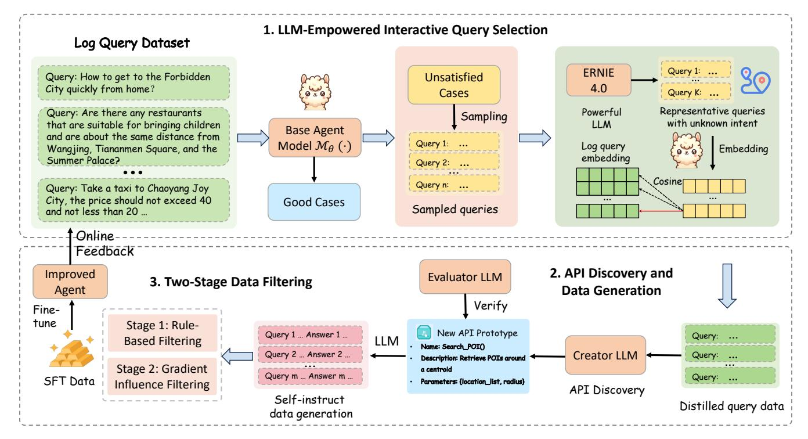
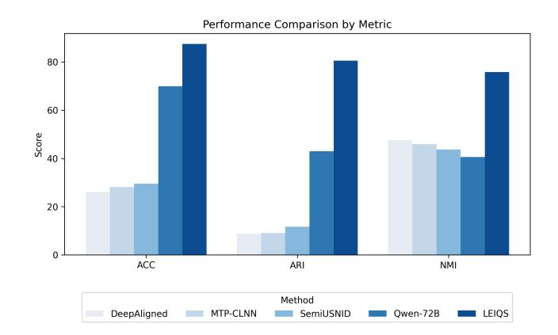
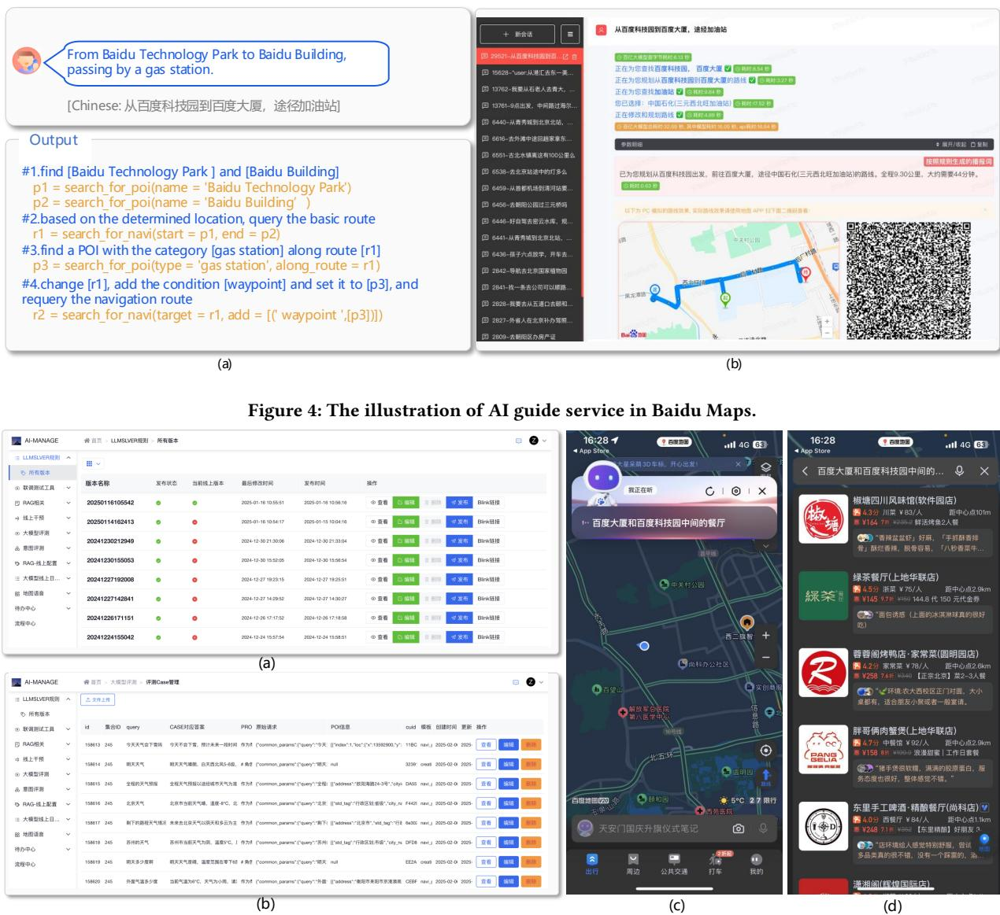

# ARADD: An Automatic Real-World API Discovery and Deployment Framework for AI Guide Service in Baidu Map

Fuling Wang Hong Kong University of Science and Technology (Guangzhou), China Baidu Inc. Beijing, China fwang205@connect.hkust-gz.edu.cn

Le Zhang∗ Jingbo Zhou∗ Baidu Inc. Beijing, China zhangle0202@gmail.com zhoujingbo@outlook.com

Jindong Han Shandong University, Jinan, China jindong.han@sdu.edu.cn

Ying Sun Hong Kong University of Science and Technology (Guangzhou), China yings@hkust-gz.edu.cn

Chuan Qin Hengshu Zhu Computer Network Information Center, Chinese Academy of Sciences, Beijing, China {chuanqin0426,zhuhenshu}@gmail.com

[Hui Xiong](https://orcid.org/0000-0001-6016-6465)∗ Hong Kong University of Science and Technology (Guangzhou), China Hong Kong University of Science and Technology Hong Kong SAR, China xionghui@ust.hk

# Abstract

The rapid development of large language models (LLMs) has significantly enhanced the capabilities of AI-native applications, offering substantial improvements in user experience across various sectors. In particular, the integration of LLMs with external APIs has become critical for services such as Baidu Maps, which leverages ERNIE Bot to provide real-time, intelligent responses through its AI Guide service. However, as user queries diversify, the ability to dynamically discover, design, and integrate new APIs has become increasingly essential. This paper addresses the challenges of automating the real-world API discovery, design, and integration process, focusing on mitigating human labor costs and biases while ensuring the creation of high-quality training data. To this end, we propose an Automatic Real-world API Discovery and Deployment (ARADD) framework to efficiently discover new real-world APIs suitable for query solving and automatically master them with minimal labor cost. Specifically, we firstly propose a Multi-Stage LLM-empowered Iterative Intent Extraction method, which integrates a closed-source LLM with our lightweight agent to capture each new intent accurately and efficiently. Secondly, we propose a Contextual-Aware API Design and Self-Instruct Data Generation module to discover APIs suitable for the captured new intent and generate training data pairs of this intent. Finally, a Two-Stage Data Filtering module is introduced to distill the most influential data point for fine-tuning the agent model. Extensive experiments on a real-world log dataset and the online service side validate the effectiveness of our proposed framework.

# CCS Concepts

### • Computing methodologies → Intelligent agents.

∗Le Zhang, Jingbo Zhou and Hui Xiong are Corresponding Authors.

[This work is licensed under a Creative Commons Attribution 4.0 International License.](https://creativecommons.org/licenses/by/4.0) WWW '26, Dubai, United Arab Emirates. © 2026 Copyright held by the owner/author(s). ACM ISBN 979-8-4007-2307-0/2026/04 <https://doi.org/10.1145/3774904.3792817>

# Keywords

Real-World API Discovery and Auto Deployment, AI Guide Agent, Large Language Models, Process Automation

### ACM Reference Format:

Fuling Wang, Le Zhang, Jingbo Zhou, Jindong Han, Ying Sun, Chuan Qin, Hengshu Zhu, and Hui Xiong. 2026. ARADD: An Automatic Real-World API Discovery and Deployment Framework for AI Guide Service in Baidu Map. In Proceedings of the ACM Web Conference 2026 (WWW '26), April 13–17, 2026, Dubai, United Arab Emirates. ACM, New York, NY, USA, [12](#page-11-0) pages. <https://doi.org/10.1145/3774904.3792817>

### 1 Introduction

In recent years, the rapid advancement of Large Language Models (LLMs) has sparked significant interest in LLM-powered applications across various industries, with the potential to greatly enhance user experiences. As one of the largest map service providers, Baidu Maps has introduced the AI Guide service[1](#page-0-0) by integrating its proprietary LLM, ERNIE Bot[2](#page-0-1) , with extensive map APIs. By leveraging the exceptional natural language understanding and real-time API invocation capabilities of LLMs, the AI Guide service enables conversational interfaces that streamline user interactions, offering unparalleled flexibility, efficiency, and convenience. This paradigm shift substantially improves the overall performance of Baidu Maps, underscoring that the ability of online service models to effectively integrate and manage vast external APIs is not only crucial for optimizing user experience but also essential for the competitiveness and success of map service providers.

Given the indispensable role of external API-augmented LLMs in such domains, researchers have increasingly focused on how LLMs can discover, integrate, and invoke external APIs. To name a few, In the general field, Gorilla [\[20\]](#page-8-0) introduces a model finetuned on a comprehensive API dataset, and evaluated using AST sub-tree matching technique, in order to master massive APIs. API-bank [\[11\]](#page-8-1) attempts to build a comprehensive benchmark for

1https://lbsyun.baidu.com/products/aimapwizard

2ERNIE Bot, https://yiyan.baidu.com/.

evaluating tool-augmented LLMs with the aid of ChatGPT. Moreover, GPT4Tools [\[33\]](#page-8-2) prompts an advanced teacher model to generate instruction-following dataset in order to teach LLMs to use tools. However, these existing works often need massive human labors (i.e., annotator's participation), or neglect to conduct rigorous scrutiny on data generation (e.g., just some simple check for responses, too long or too short, similarity match). In Map service, LAMP [\[1\]](#page-8-3) fine-tunes a pre-trained model on city-specific data to promote the recommendation ability. UrbanLLM [\[7\]](#page-8-4) decomposes user queries to different sub-tasks and selects suitable AI models to solve them. However, these methods remain limited to some fixed dataset, not the real-time interaction with external APIs. In real map business scenarios, online agent often needs to rigorously analyze user intents, invoke corresponding APIs and interact with external platforms in real time to deliver satisfactory responses. However, as user requests increase daily, service providers must continuously design new APIs to accommodate the vast array of emerging user intents. At the same time, they need to build a large body of high-quality training data to enable the online model to master these newly introduced APIs. It is worth noting that these two processes are not only cost-prohibitive but also subject to human biases. Therefore, this paper focuses on automatic real-world API discovery, design and deployment to greatly mitigate human subjectivity and reduce labor costs during the whole process.

However, this issue is nontrivial as it confronts the following pivotal challenges. (1) Diverse user intents with blurred boundaries. Users' new intent extraction is critical for new API discovery and design, which in turn influences the subsequent response generation process. Although existing methods make efforts on extracting the intent semantic information to recognize different intents, the blurred boundaries between different intents remain a barrier. One intuitive way is selecting the center point for each intent and then clustering based on these centroids, but how to infer the number of unknown intents and obtain the representative centroids remains unsolved. (2) Real-world API design and data generation. In Real-world scenarios, a practical API typically involves real-time interactions with multiple external interfaces, coupled with a logically well-structured chain of execution. For example, in search for center point case, the function need firstly find out all the vertices, and then compute the location of the center, finally search for some points of interest (POIs) based on the center. How to automatically and correctly figure out the inner logic of different APIs becomes a challenging problem. Besides, The lack of training data is a subsequent problem. A popular way for generating training data is self-instruction [\[31\]](#page-8-5). However, the generated queries' quality is hard to guarantee through some intuitive threshold, which will further influence the generated response. (3) Qualified data selection. Integrating various external APIs necessitates fine-tuning the model with high-quality data, thereby highlighting the crucial role of data selection. A low-quality data point, once introduced into training, can not only adversely affect its own subtask but also interfere with others, ultimately incurring substantial computational overhead and time costs. However, existing works filter the generated data only through some basic rules (e.g., abnormal length, repetition of input), which is far from sufficient for real-world data inner logic examination. Currently, a large volume of data still requires manual annotation in real-world, which typically entails high labor costs. Therefore, how to efficiently filtering vast amounts of generated data based on the complex logic of real-world scenarios remains a significant challenge in achieving an automated workflow.

To address the aforementioned challenges, we propose an automatic real-world API Discovery and Deployment framework (ARADD), comprising three modules responsible for three parts of the whole pipeline. Firstly, we introduce a Multi-Stage LLM-Empowered Interactive Query Selection (LEIQS) module, which is designed to extract queries sharing a common unknown intent from large-scale daily user logs in an interactive fashion. By leveraging the interaction between our agent model and powerful closedsource LLMs, this module automatically identifies the most representative data points for specific new intents. Secondly, we present a Contextual-Aware Auto API Design module that leverages advanced LLMs to discern the underlying logical structure embedded within the intent-specific query data distilled by LEIQS. Moreover, we extract real queries from large-scale historical log data from Baidu Map, which provide quality guarantee at the input side for data generation. Thirdly, we propose a Two-Stage Data Filtering module to systematically filter the generated data using both inner logicbased and gradient influence-based methodologies. It is noteworthy that our framework not only automates the discovery and design of real-world APIs and the generation of high-quality training data pairs but also employs automated selection methods at both the logical and influence levels to accurately and efficiently select training samples. This approach significantly reduces both labor and computational costs throughout the entire process.

To summarize, our main contributions are as follows: (1) To the best of our knowledge, this is the first attempt to investigate automatic API discovery, design and deployment pipeline for real-world AI Guide service scenarios. (2) We propose ARADD, an automatic closed-loop solution to discovery and design real-world APIs and generating qualified data for deployment. (3) Extensive experiments on the real-world AI Guide dataset and online service side validate the effectiveness of our proposed framework.

# 2 RELATED WORK

# 2.1 New Intent Discovery

New Intent Discovery (NID) aims to identify previously unseen intent categories from user utterances, thereby expanding the range of supported intent classes. Due to its significance in various conversation systems, e.g., banking dialogues [\[4\]](#page-8-6), web navigation [\[10\]](#page-8-7), customer service [\[9\]](#page-8-8)), the landscape of NID has been extensively explored in recent years. Early intent discovery systems primarily focus on unsupervised clustering methods. The seminal work [\[6\]](#page-8-9) clusters user utterances based on semantic parses of the unlabeled data. Later research [\[26\]](#page-8-10) utilizes an auto-encoder to assemble features and implement a hierarchical clustering technique for labeling intents and slots. However, these methods do not fully exploit the prior knowledge. To address this, subsequent works introduce semisupervised learning to extract prior knowledge for representation learning and clustering. For instance, Lin et al. [\[12\]](#page-8-11) and Zhang et al. [\[34\]](#page-8-12) perform supervised training on known intents as prior knowledge and then incorporate aligned pseudo-labels to guide the clustering process. Recently, MTP-CLNN [\[36\]](#page-8-13) first employs a multi-task pre-training strategy that leverages both external and

internal data for representation learning, followed by contrastive learning with nearest neighbors to utilize self-supervised signals. However, MTP-CLNN can only assign cluster labels to unlabeled utterances, rather than valid intent names. With the rapid advancement of LLMs, Song et al. [\[27\]](#page-8-14) explored the potential of ChatGPT in NID tasks and found that although LLMs can simultaneously perform text clustering and induce the intent of each cluster, their performance remains unsatisfactory. Unlike previous studies, we combine LLMs with traditional clustering approaches to leverage their complementary strengths, further enhancing the robustness of NID in complex real-world scenarios.

# 2.2 Tool/API-Augmented LLMs

In recent years, tool/API-augmented LLMs have emerged as a promising paradigm for enhancing the ability of LLMs to solve highly complex tasks. Research in this field can be broadly categorized into two classes: tool usage and tool generation.

Tool usage aims to equip LLMs with powerful external tools, which can significantly broaden the model's functionality [\[24\]](#page-8-15). ToolLLM [\[25\]](#page-8-16) proposes a comprehensive tool utilization framework for open-source LLMs, integrating data construction, model training, and evaluation. Subsequently, GPT4Tools [\[33\]](#page-8-2) enables tool learning with open-source models to address a wide array of visual tasks. Moreover, ToolNet [\[15\]](#page-8-17) considers the intrinsic dependencies among tools and constructs a directed graph to help LLMs manage a vast array of tools. However, these approaches primarily focus on the utilization of pre-existing tools, which is insufficient to meet the continuously emerging demands of real-world tasks.

On the other hand, several studies have explored tool generation using LLMs. Creator [\[23\]](#page-8-18) introduces an innovative framework that enables LLMs to generate abstract tools through documentation and code implementation. LATM [\[2\]](#page-8-19) empowers LLMs to create their own reusable tools and establishes a closed-loop framework. However, existing works are limited to abstract tool creation and verification. In real-world scenarios, since APIs typically span various platforms or service providers, human involvement remains essential in the development process. Unlike abstract API generation, we introduce a framework for the automatic discovery, design, and parameter structure generation of novel, real-world APIs, significantly reducing labor costs and minimizing human subjectivity.

### 2.3 Instruction Tuning

The goal of instruction tuning is to fine-tune LLMs to adeptly follow human instructions by utilizing pre-defined instruction-response pairs. This process allows non-experts to interact with LLMs in a more user-friendly and controllable manner, while also improving the model's generalization across a wide range of tasks.

Early studies on instruction tuning focus on enhancing zeroshot generalization, such as FLAN [\[17\]](#page-8-20) and Self-Instruct [\[31\]](#page-8-5). In contrast, InstructGPT [\[19\]](#page-8-21) leverages instruction tuning for alignment. Following the release of open-source LLMs (e.g., LLaMA [\[29\]](#page-8-22), DeepSeek [\[13,](#page-8-23) [14,](#page-8-24) [18\]](#page-8-25)), the research community has witnessed the emergence of several notable derivatives and evaluation benchmarks. Alpaca [\[28\]](#page-8-26) and Vicuna [\[5\]](#page-8-27) augment LLaMA's capabilities by employing refined training techniques and leveraging more

diverse datasets. Concurrently, by fine-tuning LLaMA on a combination of existing instruction datasets, Tulu [\[30\]](#page-8-28) achieves the best average performance across benchmarks. Among them, LIMA [\[38\]](#page-8-29) introduces the "superficial alignment hypothesis", emphasizing the critical role of data quality in effective model alignment. Motivated by LIMA, a series of works focus on data quality. LESS [\[32\]](#page-8-30) initially builds a highly reusable and transferable gradient datastore with low-dimensional gradient features, then selects examples by evaluating their similarity to few-shot instances that demonstrate specific capabilities. Additionally, TIVE [\[16\]](#page-8-31) reduces data redundancy by considering not only the instance influence score but also task difficulty score. However, these approaches overlook the diversity of instances within each task, potentially leading to performance degradation. In this paper, we propose a simple yet effective approach that simultaneously takes into account both the diversity and influence of instances within each task.

## 3 PRELIMINARIES

### 3.1 The AI Guide Service in Baidu Maps

The AI Guide service in Baidu Maps aims to address the limitations of traditional map services in supporting natural language interactions for travel and search scenarios. Conventional map applications primarily rely on simple query-based searches and single-turn interactions, which are insufficient for handling complex user requests and multi-turn dialogues essential for comprehensive travel planning. To overcome these challenges, Baidu AI Guide leverages AI-native approaches and LLMs to develop an autonomous intelligent agent tailored for travel scenarios.

In this AI guide system, users can interact with the application through natural language queries, such as "What are some recommended coffee shops nearby?" or "What are the opening hours of this museum?". To enable intelligent responses, we integrate LLMs with API-based functionalities, such as "search\_for\_poi" for retrieving POI and "qa\_for\_poi" for querying detailed POI information. The LLM analyzes user intent and, through fine-tuning, learns to autonomously call and combine these APIs to fulfill complex user requests. For instance, when a user asks, "Are there any familyfriendly restaurants nearby?", the system can first retrieve relevant POIs using "search\_for\_poi" and then obtain detailed information via "qa\_for\_poi", delivering refined, personalized recommendations.

By reconstructing interaction logic and automating API discovery and orchestration, Baidu AI Guide significantly enhances user experience, reduces both labor and computational costs, and provides a seamless, intelligent solution for one-stop travel services. This framework enables advanced query handling, supports multiturn interactive sessions, and integrates cross-product recommendations across navigation, general search, and informational inquiries, creating a unified and efficient AI-driven travel assistant.

# 3.2 Problem Statement

In real-world applications, user queries related to map services exhibit significant diversity, making it challenging to design a comprehensive system that meets all potential demands. While our initial API design provides fundamental mapping functionalities—such as POI search and route planning—these predefined capabilities may not suffice to address the full range of user requests. To enhance

adaptability, we aim to automate API discovery using LLMs and develop an efficient data generation strategy for fine-tuning. This approach equips the LLM with the necessary skills to dynamically integrate new APIs and improve response accuracy.

Formally, let M denote an LLM with parameters ��. We are provided with an initial set of APIs A = {��1, ��2, . . . , ���� }, where each API ���� ∈ A performs specific functions. Given a user query �� ∈ Q, where Q represents the set of all possible queries, the model M can invoke and combine the available APIs in A to generate a response. Let D������ = {(���� , ����)} denote the original fine-tuning dataset, where each pair (���� , ����) consists of a query ���� ∈ Q and its corresponding response ���� , which is obtained via the available APIs in A. The model M is fine-tuned on D������ to improve its ability to generate accurate responses by leveraging these APIs.

However, for more complex queries, there exist queries �� ∗ ∈ Q that cannot be fully addressed by the current set of APIs A. In such cases, the objective is to identify the missing API �� ∗ ∈ A∗ that would enable the model to correctly respond to �� ∗ , where A∗ represents the set of potential new APIs that bridge the existing capability gap. Once the missing API �� ∗ is identified, we construct a new dataset D������ = {(�� ∗ , ��∗ )}, where �� ∗ is the response generated by utilizing �� ∗ in conjunction with existing APIs. The model is then fine-tuned on D������, thereby enhancing its ability to handle previously unanswerable complex queries.

The goal of our approach is to systematically identify and integrate necessary new APIs, thereby expanding the model's capabilities and enabling it to address a broader range of user queries.

### 4 METHODOLOGY

### 4.1 Framework Overview

Figure [1](#page-4-0) depicts the overall framework of ARADD, which consists of three major tasks: (1) extracting intent-specific queries from hundreds of millions of real-world log entries, (2) discovering and designing new real-world APIs, followed by generating paired data, and (3) fine-tuning a lightweight model with high-quality data to master new APIs. Specifically, for the first task, we propose an LLM-Empowered Interactive Query Selection (LEIQS) module to extract queries with the same unknown intent from daily user logs, thereby enabling the model to identify each unknown intent for new API discovery. For the second task, we propose a Context-Aware Auto API Design and Data Generation (CADG) module to discover qualified new APIs and generate the corresponding API call command data. For the third task, we propose a Two-Stage Data Filtering (TSDF) module to evaluate and select high-value data points for expanding task set, which greatly accelerates the fine-tuning procedure and simultaneously enhances our agent's performance. In this work, we deploy ARADD, based on the current AI Guide service in Baidu Maps, as described in Section [3.1.](#page-2-0)

### 4.2 Multi-Stage LLM-Empowered Interactive Query Selection

In this subsection, we introduce LEIQS module, designed to extract queries exhibiting the same unknown intent from large-scale daily user logs. Conventional approaches [\[12,](#page-8-11) [37\]](#page-8-32) often assume well-separated clusters with clear boundaries and primarily rely on token-level or semantic-level features, followed by clustering

based on embedding similarity. However, these methods frequently struggle to address complex out-of-distribution (OOD) scenarios encountered in real-world applications, largely due to the vast volume of user queries and the ambiguous boundaries between distinct intents. Consequently, accurately identifying queries sharing the same unknown intent remains a significant challenge. Motivated by recent advances in LLMs, we propose a multi-stage interactive framework that integrates an agent model with robust LLM capabilities, thereby enabling the precise and efficient extraction of queries with homogeneous unknown intents.

Specifically, we randomly sample a portion of user intent queries Q�� from the query dataset Q. Then we prompt the powerful LLM (e.g., ERNIE 4.0) to output the most popular intent I�� and the top-K representative queries ���� ∈ Q�� , �� = 1, 2...��. as the guidance signal. Such a process provides our agent model with a good starting point, helping to avoid retrieval based on edge data points within a certain intent category that could hinder intent discovery, for the subsequent extraction stage. Next we take advantage of our agent model's intent semantic embedding ability to retrieve a set of relevant data points. We feed the K queries into our agent model and derive both low-level and high-level representations for each input query [\[8\]](#page-8-33). To this end, we extract first and second-to-last hidden layer token embeddings together and apply mean-pooling to acquire the averaged query feature representation:

e = 1 �� ∑︂ �� ��=1 (︂ H (0) �� + H (��−1) �� )︂ , (1)

where H (��) �� ∈ R �� is the hidden vector of the ��-th token at the ��-th layer, �� is the sequence length and �� is the hidden dimensionality.

This hybrid representation, combining early lexical information with deep contextual semantics, yields a robust sentence embedding for intent retrieval across the entire dataset. After obtaining the feature representation e�� for each query in the dataset Q, we measure pairwise similarity using the cosine similarity, defined as

cosine(︁ e��, e�� )︁ = e�� · e�� ∥e�� ∥ ∥e�� ∥ , (2)

where e�� denotes the embedding of ��-th sample in Q, e�� · e�� is their dot product, and ∥ · ∥ denotes the Euclidean norm. We then rank all samples in Q according to [\(2\)](#page-3-0) in descending order and select the Top-10 most similar queries for each of the �� queries. Lastly, the gathered queries are feed into a powerful LLM for final verification, which takes advantage of Big LLM's intricate logical ability.

In a word, the ingenuity of LEIQS is two fold. On one hand, by leveraging the strong interpretive capacity of a closed-source LLM, our method rigorously supervises both the initial filtering stage and the final data-verification phase, which ensures precise handling of diverse and complex inputs. On the other hand, our lightweight agent model is employed to systematically traverse all data samples in the middle, thereby ensuring data confidentiality and efficiency.

### 4.3 Contextual-Aware API Discovery and Data Generation

In real-world scenarios, due to the human subjectiveness and inductive finiteness, accurately design and decide what API function to tackle user queries is challenging. Furthermore, since the user

Figure 1: An overview of the Automatic Real-World API Discovery and Deployment Framework for AI Guide Service in Baidu Maps. This iterative pipeline consists of several key components: discovering new real-world APIs from the logs of the deployed agent and generating qualified data to equip the agent, enabling it to handle a wider range of user queries.

queries are unsolved, the data for fine-tuning agent model is scarce. To tackle the above issues, we utilize closed-source LLM to generate real-world API design based on the distilled query data in the former module and then propose an enhanced self-instruct method to generate training data for next step.

Although there are several initial attempts on utilizing closesource LLMs to create tools [\[3,](#page-8-34) [23\]](#page-8-18), these method aims to prompt LLMs to generate code (e.g. python utility functions), which are limited to virtual and simple scenarios. In AI Guide service, API functions need to interact with real-world scenarios, such as navigation or ride hailing, both of them need to access multiple external interfaces to acquire real-time information in real world. To this end, we employ powerful LLMs (creator), such as ERNIE 4.0, to understand the sophisticated logic first and then discover what API function should be created here, including the descriptions, required and optional parameters, inner logic pipeline. Then we enable another close-sourced LLM (evaluator), such as GPT 4.5, to do cross-model verification for evaluating the effectiveness and reasonableness of the API function designed by creator LLM.

Regarding the lack of training data pairs, an intuitive and popular way is generating prompt-answer samples from a LLM and then filtering the low-quality samples before the fine-tuning stage [\[31\]](#page-8-5). However, in AI Map Guide scenario, we can acquire a lot of user queries without intent labels, which transfers the challenge into query intent selection. Following similar steps in Section [4.2,](#page-3-1) we extract queries of the same intent and then prompt powerful LLM to generate qualified answers by giving several standard examples.

# 4.4 Two-Stage Data Filtering

Despite we obtain enough data samples for fine-tuning the original agent model, how to filter the unqualified data samples is still challenging, especially in the AI Guide service, where the answer includes several API calls and the hallucinations and amnesia may occur at any stage. Furthermore, due to inherent data redundancy, utilizing the complete dataset is not a cost effective strategy. To this end, we propose Two-Stage Data Filtering method to tackle this sophisticated problem, including rule-based filtering stage and gradient influence-based filtering stage.

In rule-based filtering stage, our algorithm filters the self-instruct data according to the Chain-of-API Call (COA),which reveals the inner logic of each response, not just the output length(too long or too short) [\[31\]](#page-8-5) or GPT4-assigned score [\[21\]](#page-8-35).In detail, we extract the Chain-of-API Call (COA) for each generated response of the same intent and then compare it with our API Call paradigm obtained in the API Design phase. After this, we only feed the self-instruct data with the same Chain-of-API Call (COA) into next stage.

In gradient influence-based filtering stage, inspired by the recent works [\[16,](#page-8-31) [32\]](#page-8-30), they propose data selection methods according to the data point influence regarding the model weight and individual task difficulty. However, in real-world AI mapping service, the essential instances within each intent often exhibit a high degree of homogeneity. This phenomenon undermines the effectiveness of methods that rely solely on ranking and sampling by instance influential value. For example, in the ride-hailing scenario of AI

for handling the "query\_weather" and "make\_phone\_call" intents reached 95%. These results demonstrate the effectiveness of the training data generated by the ARADD framework.

Additionally, we analyze the overall results after each iteration. Specifically, we randomly sample logs from the entire dataset, have annotators label the results, and calculate the accuracy of the outcomes. As depicted in Table [2,](#page-6-2) the performance consistently rises when compared to iteration-0 (the pre-iteration model). This sustained improvement provides strong evidence of the efficacy of ARADD, as it continually enhances the model's understanding of new intents, thus meeting an increasing number of user demands. Furthermore, it is evident that the improvement is more significant in the earlier iterations. This can be attributed to our intent discovery strategy, which targets the most frequent failure cases in the model's logs, thereby improving iteration efficiency.

Lastly, from a cost perspective, our approach significantly reduces labor costs. By discovering new intents through bad case analysis, our method efficiently processes vast amounts of log data, cutting human effort by over 70%. Moreover, the automated generation of training data, combined with efficient data filtering strategies, reduces human effort by over 80%.

Table 1: Newly discovered functions in different iteration steps and their corresponding accuracy.

| Iteration | Newly discovered    | functions Accuracy |
|-----------|---------------------|--------------------|
| 1         | query_mass_transit  | 89.1%              |
| 2         | search_center_point | 83.3%              |
| 3         | query_time          | 90.3%              |
| 4         | query_weather       | 95.2%              |
| 5         | ride_hailing        | 90.7%              |
| 6         | make_phone_call     | 95.5%              |

Table 2: Overall performance evaluated by response accuracy on real-world log of AI Guide service in Baidu Maps.

### 5.3 Validation of New Intent Discovery

To evaluate the effectiveness of new intent discovery, we label the training samples from four initial functions (mentioned in subsection 5.1.1) as known intent samples. For the remaining six functions to be discovered, we sample additional data and treat them as unknown intent. Given the known intent samples, our objective is to classify the unknown intent samples into their respective intent categories. Without loss of generality, we use three commonly used metrics to evaluate performance, Accuracy (ACC), Adjusted Rand Index (ARI), and Normalized Mutual Information (NMI). Besides, we also selected 3 recent methods in new intent discovery field as baselines: (1) DeepAligned [\[34\]](#page-8-12), which transfers the prior knowledge from known intents to new intents with limited labeled data. (2)MTP-CLNN [\[37\]](#page-8-32), which incorporates K-nearest neighbors relationship into contrastive learning loss. (3)SemiUS-NID [\[35\]](#page-8-37), which proposes a centroid-guided clustering mechanism

Figure 2: The performance of different NID methods.

and optimizes both cluster and instance level objectives to learn high-level semantics. Besides, we tested the Qwen2.5-72B model's performance on the same dataset for new intent discovery (NID).

As shown in Figure [2,](#page-6-3) our LEIQS module consistently and substantially outperforms DeepAligned, MTP-CLNN, and SemiUSNID on all evaluation metrics, underscoring the robustness and superiority of our framework. On our diverse, real-world test set, LEIQS delivers at least a 57.9% gain in ACC, 68.9% in ARI, and 28.3% in NMI. These results highlight the inherent complexity of intent discovery: traditional neural-network–based methods struggle to grasp the subtle nuances in user queries. While the Qwen-72B model surpasses the three baselines in ACC and ARI, it still trails LEIQS by 17.5% in ACC, 37.6% in ARI, and 35.2% in NMI. Moreover, using such a large model for per-sample inference is increasingly inefficient and susceptible to hallucinations as the dataset scales—an impractical solution for the complex, real-world scenarios we address. In contrast, our method not only leverages the powerful semantic understanding of large language models but also maintains high efficiency, which is crucial for reliable and scalable intent discovery.

### 5.4 Validation of Data Filtering Strategies

In this part, we aim to demonstrate the effectiveness of our filtering strategies, namely Dig-InS. Specifically, after the data generation mentioned in subsection 4.3, we can accumulate thousands of samples for each intent. We select some samples from these data for fine-tuning and verify the effect of LLM on different intents. Here we choose several baselines: (1) Random Sampling, which randomly samples fixed ratio samples for each intent. (2) TIVE [\[16\]](#page-8-31), which is the latest data filtering strategy based on gradient influence. For fairness, the size of training data for different methods is set the same, about 5% of the full data. Additionally, we also present the performance of the full-data fine-tuning.

As shown in Table [3,](#page-7-0) we obtain the following findings. Firstly, when comparing our approach to sampling-based methods, our method achieves the best performance, outperforming other data selection techniques in most intent categories. Specifically, compared to the random sampling method, we observe an overall 7% improvement in several intent categories. This highlights the effectiveness of our two-stage data filtering strategy, which enables better results with the same amount of data. In comparison to the

Table 3: Comparision of the effectiveness of different data filtering strategies.

| Method          | query_mass_transit | search_center_point | Response Accuracy query_time | of different intents query_weather | ride_hailing | make_phone_call |
|-----------------|--------------------|---------------------|------------------------------|------------------------------------|--------------|-----------------|
| Random(5%)      | 92.1%              | 76.7%               | 89.7%                        | 94.6%                              | 71.7%        | 80.2%           |
| TIVE(5%)        | 80.3%              | 79.9%               | 30.1%                        | 43.3%                              | 44.0%        | 65.1%           |
| Full data(100%) | 98.1%              | 93.3%               | 95.2%                        | 97.6%                              | 98.7%        | 98.1%           |
| Dig-InS(5%)     | 89.1%              | 83.3%               | 90.3%                        | 95.2%                              | 90.7%        | 95.5%           |

TIVE method, our approach demonstrates an overall improvement of 58%. Despite TIVE using gradient influence to select data, it focuses only on the most influential instances. This causes the model to become trapped in a local minimum, failing to select a sufficiently diverse set of samples that represent the same intent in our large-scale scenarios. This shows that our strategy, which considers diversity, effectively avoids the issues that arise from relying solely on gradient influence. Secondly, when comparing to full-data finetuning methods, we achieve comparable performance using only 5% of the data. Although our model performs slightly worse on single intent data, we significantly reduce the size of the training dataset, improving training efficiency by several times. Moreover, considering that these samples are specifically intended to enhance the LLM's ability to handle long-tail intents, using an excessive amount of data could potentially degrade the model's performance on more mainstream intents. Thus, our data filtering strategy is crucial for maintaining both efficiency and model performance.

Find a hot pot restaurant with seafood between Wudaokou,

Rongzejiayuan, and Changan Jiuli

Find a hotel near the subway that is close to the Summer Palace,

Beihai Park, and Prince Gong's Mansion

Are there any restaurants that are suitable for bringing children and are about the same distance from Wangjing, Tiananmen

Square, and the Summer Palace?

Please help me find a western restaurant with a good environment suitable for gatherings with girlfriends among the three communities of Lanqiying, Tuanjieyuan and Fengzejiayuan.

**Queries with New Intents**

**New API Design Specification**

Function search\_for\_center\_point() finds optimal POIs (restaurants, cafes, etc.) between multiple locations based on

user preferences. ## Parameters

- locations: List of starting points

- poi\_type: Type of venue ('restaurant', 'cafe', etc.)

- preferences: Features ('family-friendly', 'good ambiance', etc.) - max\_distance: Maximum radius from center point - transport\_mode: Travel method ('driving', 'transit', etc.) - sort\_by: Sorting criteria ('distance', 'rating', etc.) Returns POIs with name, location, distance, and rating

information.

Figure 3: Case Study of ARADD's Auto API Discovery.

# 5.5 Case Study

We show a case study of ARADD to elaborate how it extracts representative queries belongs to same new intent from a large variety of log data and leverages powerful LLMs to discover the specific

new intent and design corresponding real-world API function to satisfy user queries of that intent.

Specifically, we sample 500 failed queries from the online service and prompt a closed-source LLM to identify the most frequent new intent and generate representative queries. As shown in the upper part of Figure [3,](#page-7-1) these queries focus on locating POIs that satisfy specific constraints around a central point defined by multiple locations. The diversity of additional requirements among these queries highlights the variations within the same intent and facilitates fine-grained extraction of parameters and logic for real-world API design. We then prompt the LLM to automatically design the corresponding API function, as illustrated in the bottom part of Figure [3.](#page-7-1) The generated API consolidates multi-dimensional constraints into structured parameters and provides accurate function descriptions and detailed return specifications that align well with user requirements. Overall, this case study demonstrates that our framework can effectively identify new intents from real-world queries and automatically design high-quality APIs with minimal human intervention.

# 6 CONCLUSION

In conclusion, this paper successfully addressed the challenges associated with automating the discovery, design, and integration of real-world APIs in AI applications. By introducing the ARADD framework, which combines innovative techniques such as Multi-Stage LLM-Empowered Iterative Query Selection, Contextual-Aware API Design, and Two-Stage Data Filtering, we demonstrated the potential to enhance query-solving capabilities while minimizing labor costs and human biases. Our experiments, conducted on realworld datasets and online services, confirmed the effectiveness of our approach in efficiently discovering relevant APIs and generating high-quality training data. These results offer valuable insights into improving the scalability and flexibility of AI-driven services, ultimately contributing to the advancement of intelligent, adaptive systems in dynamic real-world environments.

# Acknowledgments

This work was supported in part by the National Key RD Program of ChinaGrant No.2023YFF0725001,in part by the National Natural Science Foundation of ChinaGrant No.92370204,in part by the Guangdong Basic and Applied Basic Research FoundationGrant No.2023B1515120057,in part by the Key-Area Special Project of Guangdong Provincial Ordinary Universities(2024ZDZX1007).

References [1] Pasquale Balsebre, Weiming Huang, and Gao Cong. 2024. LAMP: A Language Model on the Map. arXiv preprint arXiv:2403.09059 (2024). [2] Tianle Cai, Xuezhi Wang, Tengyu Ma, Xinyun Chen, and Denny Zhou. 2023. Large language models as tool makers. arXiv preprint arXiv:2305.17126 (2023). [3] Tianle Cai, Xuezhi Wang, Tengyu Ma, Xinyun Chen, and Denny Zhou. 2023. Large language models as tool makers. arXiv preprint arXiv:2305.17126 (2023). [4] Iñigo Casanueva, Tadas Temčinas, Daniela Gerz, Matthew Henderson, and Ivan Vulić. 2020. Efficient intent detection with dual sentence encoders. arXiv preprint arXiv:2003.04807 (2020). [5] Wei-Lin Chiang, Zhuohan Li, Zi Lin, Ying Sheng, Zhanghao Wu, Hao Zhang, Lianmin Zheng, Siyuan Zhuang, Yonghao Zhuang, Joseph E. Gonzalez, Ion Stoica, and Eric P. Xing. 2023. Vicuna: An Open-Source Chatbot Impressing GPT-4 with 90%\* ChatGPT Quality.<https://lmsys.org/blog/2023-03-30-vicuna/> [6] Dilek Hakkani-Tür, Yun-Cheng Ju, Geoffrey Zweig, and Gökhan Tür. 2015. Clustering novel intents in a conversational interaction system with semantic parsing.. In INTERSPEECH. 1854–1858. [7] Yue Jiang, Qin Chao, Yile Chen, Xiucheng Li, Shuai Liu, and Gao Cong. 2024. UrbanLLM: Autonomous Urban Activity Planning and Management with Large Language Models. arXiv preprint arXiv:2406.12360 (2024). [8] Mingyu Jin, Qinkai Yu, Jingyuan Huang, Qingcheng Zeng, Zhenting Wang, Wenyue Hua, Haiyan Zhao, Kai Mei, Yanda Meng, Kaize Ding, et al. 2024. Exploring Concept Depth: How Large Language Models Acquire Knowledge and Concept at Different Layers? arXiv preprint arXiv:2404.07066 (2024). [9] Liu Junhua, Tan Yong Keat, and Fu Bin. 2024. LARA: Linguistic-Adaptive Retrieval-Augmented LLMs for Multi-Turn Intent Classification. arXiv preprint arXiv:2403.16504 (2024). [10] Jaekyeom Kim, Dong-Ki Kim, Lajanugen Logeswaran, Sungryull Sohn, and Honglak Lee. 2024. Auto-Intent: Automated Intent Discovery and Self-Exploration for Large Language Model Web Agents. arXiv preprint arXiv:2410.22552 (2024). [11] Minghao Li, Yingxiu Zhao, Bowen Yu, Feifan Song, Hangyu Li, Haiyang Yu, Zhoujun Li, Fei Huang, and Yongbin Li. 2023. Api-bank: A comprehensive benchmark for tool-augmented llms. arXiv preprint arXiv:2304.08244 (2023). [12] Ting-En Lin, Hua Xu, and Hanlei Zhang. 2020. Discovering new intents via constrained deep adaptive clustering with cluster refinement. In Proceedings of the AAAI Conference on Artificial Intelligence, Vol. 34. 8360–8367. [13] Aixin Liu, Bei Feng, Bin Wang, Bingxuan Wang, Bo Liu, Chenggang Zhao, Chengqi Dengr, Chong Ruan, Damai Dai, Daya Guo, et al. 2024. Deepseekv2: A strong, economical, and efficient mixture-of-experts language model. arXiv preprint arXiv:2405.04434 (2024). [14] Aixin Liu, Bei Feng, Bing Xue, Bingxuan Wang, Bochao Wu, Chengda Lu, Chenggang Zhao, Chengqi Deng, Chenyu Zhang, Chong Ruan, et al. 2024. Deepseek-v3 technical report. arXiv preprint arXiv:2412.19437 (2024). [15] Xukun Liu, Zhiyuan Peng, Xiaoyuan Yi, Xing Xie, Lirong Xiang, Yuchen Liu, and Dongkuan Xu. 2024. ToolNet: Connecting large language models with massive tools via tool graph. arXiv preprint arXiv:2403.00839 (2024). [16] Zikang Liu, Kun Zhou, Wayne Xin Zhao, Dawei Gao, Yaliang Li, and Ji-Rong Wen. 2024. Less is More: Data Value Estimation for Visual Instruction Tuning. arXiv preprint arXiv:2403.09559 (2024). [17] Shayne Longpre, Le Hou, Tu Vu, Albert Webson, Hyung Won Chung, Yi Tay, Denny Zhou, Quoc V Le, Barret Zoph, Jason Wei, et al. 2023. The flan collection: Designing data and methods for effective instruction tuning. In International Conference on Machine Learning. PMLR, 22631–22648. [18] Haoyu Lu, Wen Liu, Bo Zhang, Bingxuan Wang, Kai Dong, Bo Liu, Jingxiang Sun, Tongzheng Ren, Zhuoshu Li, Hao Yang, et al. 2024. Deepseek-vl: towards realworld vision-language understanding. arXiv preprint arXiv:2403.05525 (2024). [19] Long Ouyang, Jeffrey Wu, Xu Jiang, Diogo Almeida, Carroll Wainwright, Pamela Mishkin, Chong Zhang, Sandhini Agarwal, Katarina Slama, Alex Ray, et al. 2022. Training language models to follow instructions with human feedback. Advances in neural information processing systems 35 (2022), 27730–27744. [20] Shishir G Patil, Tianjun Zhang, Xin Wang, and Joseph E Gonzalez. 2023. Gorilla: Large language model connected with massive apis. arXiv preprint arXiv:2305.15334 (2023). [21] Baolin Peng, Chunyuan Li, Pengcheng He, Michel Galley, and Jianfeng Gao. 2023. Instruction tuning with gpt-4. arXiv preprint arXiv:2304.03277 (2023). [22] Garima Pruthi, Frederick Liu, Satyen Kale, and Mukund Sundararajan. 2020. Estimating training data influence by tracing gradient descent. Advances in Neural Information Processing Systems 33 (2020), 19920–19930. [23] Cheng Qian, Chi Han, Yi R Fung, Yujia Qin, Zhiyuan Liu, and Heng Ji. 2023. Creator: Tool creation for disentangling abstract and concrete reasoning of large language models. arXiv preprint arXiv:2305.14318 (2023). [24] Yujia Qin, Shengding Hu, Yankai Lin, Weize Chen, Ning Ding, Ganqu Cui, Zheni Zeng, Xuanhe Zhou, Yufei Huang, Chaojun Xiao, et al. 2024. Tool learning with foundation models. Comput. Surveys 57, 4 (2024), 1–40. [25] Yujia Qin, Shihao Liang, Yining Ye, Kunlun Zhu, Lan Yan, Yaxi Lu, Yankai Lin, Xin Cong, Xiangru Tang, Bill Qian, et al. 2023. Toolllm: Facilitating large language models to master 16000+ real-world apis. arXiv preprint arXiv:2307.16789 (2023). [26] Chen Shi, Qi Chen, Lei Sha, Sujian Li, Xu Sun, Houfeng Wang, and Lintao Zhang. 2018. Auto-dialabel: Labeling dialogue data with unsupervised learning. In Proceedings of the 2018 conference on empirical methods in natural language processing. 684–689. [27] Xiaoshuai Song, Keqing He, Pei Wang, Guanting Dong, Yutao Mou, Jingang Wang, Yunsen Xian, Xunliang Cai, and Weiran Xu. 2023. Large Language Models Meet Open-World Intent Discovery and Recognition: An Evaluation of ChatGPT. arXiv preprint arXiv:2310.10176 (2023). [28] Rohan Taori, Ishaan Gulrajani, Tianyi Zhang, Yann Dubois, Xuechen Li, Carlos Guestrin, Percy Liang, and Tatsunori B Hashimoto. 2023. Alpaca: A strong, replicable instruction-following model. Stanford Center for Research on Foundation Models. https://crfm. stanford. edu/2023/03/13/alpaca. html 3, 6 (2023), 7. [29] Hugo Touvron, Thibaut Lavril, Gautier Izacard, Xavier Martinet, Marie-Anne Lachaux, Timothée Lacroix, Baptiste Rozière, Naman Goyal, Eric Hambro, Faisal Azhar, et al. 2023. Llama: Open and efficient foundation language models. arXiv preprint arXiv:2302.13971 (2023). [30] Yizhong Wang, Hamish Ivison, Pradeep Dasigi, Jack Hessel, Tushar Khot, Khyathi Chandu, David Wadden, Kelsey MacMillan, Noah A Smith, Iz Beltagy, et al. 2023. How far can camels go? exploring the state of instruction tuning on open resources. Advances in Neural Information Processing Systems 36 (2023), 74764–74786. [31] Yizhong Wang, Yeganeh Kordi, Swaroop Mishra, Alisa Liu, Noah A Smith, Daniel Khashabi, and Hannaneh Hajishirzi. 2022. Self-instruct: Aligning language models with self-generated instructions. arXiv preprint arXiv:2212.10560 (2022). [32] Mengzhou Xia, Sadhika Malladi, Suchin Gururangan, Sanjeev Arora, and Danqi Chen. 2024. Less: Selecting influential data for targeted instruction tuning. arXiv preprint arXiv:2402.04333 (2024). [33] Rui Yang, Lin Song, Yanwei Li, Sijie Zhao, Yixiao Ge, Xiu Li, and Ying Shan. 2024. Gpt4tools: Teaching large language model to use tools via self-instruction. Advances in Neural Information Processing Systems 36 (2024). [34] Hanlei Zhang, Hua Xu, Ting-En Lin, and Rui Lyu. 2021. Discovering new intents with deep aligned clustering. In Proceedings of the AAAI Conference on Artificial Intelligence, Vol. 35. 14365–14373. [35] Hanlei Zhang, Hua Xu, Xin Wang, Fei Long, and Kai Gao. 2023. USNID: A framework for unsupervised and semi-supervised new intent discovery. CoRR, abs/2304.07699 (2023). [36] Yuwei Zhang, Haode Zhang, Li-Ming Zhan, Xiao-Ming Wu, and Albert Lam. 2022. New intent discovery with pre-training and contrastive learning. arXiv preprint arXiv:2205.12914 (2022). [37] Yuwei Zhang, Haode Zhang, Li-Ming Zhan, Xiao-Ming Wu, and Albert Lam. 2022. New intent discovery with pre-training and contrastive learning. arXiv preprint arXiv:2205.12914 (2022). [38] Chunting Zhou, Pengfei Liu, Puxin Xu, Srinivasan Iyer, Jiao Sun, Yuning Mao, Xuezhe Ma, Avia Efrat, Ping Yu, Lili Yu, et al. 2024. Lima: Less is more for alignment. Advances in Neural Information Processing Systems 36 (2024). A The deployed AI guide service in Baidu maps In this subsection, we introduce the AI guide service deployed within Baidu Maps. As illustrated in Figure [4\(](#page-9-0)a), the LLM takes a user query as input, interprets the user's intent, and then generates a chain of API calls. Figure [4\(](#page-9-0)b) presents a screenshot of our backend system executing those calls in sequence and returning the results to the user. For instance, when a user searches for a route from "Baidu Technology Park" to "Baidu Building" via a "gas station," the LLM first locates both POIs ("Baidu Technology Park" and "Baidu Building"), retrieves the basic route between them, searches for POIs categorized as "gas station" along the way, and then modifies the route to incorporate the station before returning the final path to the user. In this process, the LLM's output is a combination of function calls, and the backend system sequentially executes these function calls to generate the final result. Our ARADE framework is implicitly integrated into this service to continuously improve the AI guide LLM's ability to handle long-tail intentions. To streamline this iterative process, we have developed a management system that oversees LLM testing, version control, evaluation, log analysis, and more. Figures [5\(](#page-9-1)a)–(b) show

partial screenshots of this system: Figure [5\(](#page-9-1)a) displays the interface

Figure 5: Screenshots of service management systems and app.

for managing different LLM iterations, while Figure [5\(](#page-9-1)b) shows how samples are evaluated, allowing annotators to label and assess various cases efficiently.

Figures [5\(](#page-9-1)c)–(d) provide a view of the app's interface. By applying ARADE, we equip the online LLM with the "search\_center\_point" skill, which enables the LLM to identify locations relative to the centers of multiple POI. As shown in Figure [5\(](#page-9-1)c), a user searches for "restaurants between Baidu Technology Park and Baidu Building". In Figure [5\(](#page-9-1)d), our system accurately returns restaurants located between these two POIs. This capability underscores the effectiveness of our method in addressing complex user requests.

# B Prompt Introduction

In this paper, we leverage the powerful semantic understanding and generation capabilities of close-sourced LLMs. To effectively activate the model's potential, constructing appropriate prompts is essential. We present several key prompts used in our experiments. Specifically, Figure [6](#page-10-0) illustrates the prompt for query clustering, where we select a subset of unsolved queries from the online agent and ask the LLM to return three main categories along with representative queries for each. Figure [7](#page-10-1) showcases the prompt for query consistency checking, which enables the LLM to determine whether a query belongs to a specific intent. Figure [8](#page-11-1) displays the prompt for API discovery, where the LLM generates appropriate API descriptions—including functionality and parameters—based on the selected representative queries. Lastly, Figure [9](#page-11-2) shows the

| Prompt1:          | Query             | clustering                                                                                                             |
|-------------------|-------------------|------------------------------------------------------------------------------------------------------------------------|
| I am an           | engineer and      | researcher in a high-tech company’s AI map division. Our model can determine user intent based on queries and          |
| invoke the        | appropriate       | APIs (functions) to help users solve problems. Currently, we have four functions that fulfill POI (point of interest)  |
| searching         | and route         | searching needs:                                                                                                       |
|                   | search_for_poi()  | and qa_for_poi()                                                                                                       |
|                   | search_for_navi() | and qa_for_navi()                                                                                                      |
| search_for_poi()  |                   | can search for a location based on a given name to check whether it exists, enabling subsequent queries or distance    |
| calculations      | related to        | that location.                                                                                                         |
| qa_for_poi()      | is an             | API function used to query POI information, including location name, category, features, etc.                          |
| search_for_navi() |                   | is used to query route navigation, which may include parameters such as origin, destination, waypoints, mode of        |
| transportation,   | departure         | time, arrival time, preferences, and so on.                                                                            |
| qa_for_navi()     | is used           | to ask about route information.                                                                                        |
| However,          | as the number     | of query types continues to grow, if a new set of similar queries comes in, I might need to create new APIs            |
| (functions)       | to more           | specifically solve these new user requirements. On top of the existing functions, I may need to construct new func    |
| tions to obtain   | new               | information and address the new requirements—defining what inputs they need and what outputs they should provide.      |
| In order to       | better            | discover these new functions, I need to cluster any currently unsolvable queries. Please help me cluster the following |
| queries in        | as fine-grained   | a way as possible. Then, return the three main categories and the three most representative queries for                |
| each category.    | This              | will help me discover different functions as needed.                                                                   |
| The queries       | are as            | follows:                                                                                                               |
| [Queries          | provided here]    |                                                                                                                        |

### Figure 6: The prompt we use for clustering queries.

| Prompt2: Query consistency | check            |                                                                                                           |
|----------------------------|------------------|-----------------------------------------------------------------------------------------------------------|
| I am an engineer           | and researcher   | in a high-tech company’s AI map division. Our model can determine user intent based on queries and        |
| invoke the appropriate     | APIs (functions) | to help users solve problems. Currently, we have four functions that fulfill POI (point of interest)      |
| searching and route        | searching        | needs:                                                                                                    |
| search_for_poi()           | and              | qa_for_poi()                                                                                              |
| search_for_navi()          | and              | qa_for_navi()                                                                                             |
| search_for_poi()           | can check        | if a location exists based on the provided name, enabling subsequent queries or distance calculations     |
| related to that location.  |                  |                                                                                                           |
| qa_for_poi() is            | an API function  | for querying POI information, including location name, category, distinctive features, etc.               |
| search_for_navi()          | is used for      | route navigation queries, which may include parameters such as starting point, destination, waypoints,    |
| mode of transportation,    | departure        | time, arrival time, preferences, etc.                                                                     |
| qa_for_navi() is           | used to inquire  | about route information.                                                                                  |
| However, as the number     | of query         | types grows, when a new set of similar queries comes in, I may need new APIs (functions) to more          |
| precisely meet user        | needs. Building  | upon the existing functions, I might need to construct new ones to gather new information, address        |
| new requirements,          | and define       | what input data is required and what output should be returned.                                           |
| To better facilitate       | the discovery    | of new functions, I need to generate intent determination for a particular group of queries. Below are    |
| some cases I have          | preliminarily    | clustered. Please help me check if there are a few outlier queries (i.e., those that don’t share the same |
| intent as the majority).   | If so, please    | list them all, keep only the queries that share the same intent, and remove duplicate cases.              |
| The queries are            | as follows:      |                                                                                                           |
| [Queries provided          | here]            |                                                                                                           |

Figure 7: The prompt we use to check query consistency.

data generation prompt, where the LLM references given samples

to generate answers for different queries.

Figure 8: The prompt we use for API discovery.

| Prompt4:  | Data generation boxsep                                                                                                              |
|-----------|-------------------------------------------------------------------------------------------------------------------------------------|
| You       | are a top-tier map app developer. You need to respond to user queries based on functions already available in your model. We        |
| currently | have four functions for POI and route-related tasks:                                                                                |
| (1)       | search_for_poi() – Searches by name to check if a location exists, enabling subsequent queries or distance calculations.            |
| (2)       | qa_for_poi() – Retrieves POI information (e.g., name, category, features).                                                          |
| (3)       | search_for_navi() – Queries route navigation (origin, destination, waypoints, mode of transport, departure/arrival time,            |
|           | preferences, etc.).                                                                                                                 |
| (4)       | qa_for_navi() – Inquires about route details.                                                                                       |
| For       | each [user prompt], I will provide detailed [API] information. Please study the functions in depth and produce answers in the       |
| standard  | example format. Keep in mind the relationship with the existing functions in your library. (If necessary, you can use both          |
| existing  | and new functions together.)                                                                                                        |
| [API]     | Detailed Introduction                                                                                                               |
|           | search_for_center_point() finds POIs (e.g., restaurants, cafés, attractions, hotels) meeting specific conditions around multiple    |
| specified | locations. It helps users compute a central or optimal gathering point among several starting locations and, based on user         |
| specified | POI type and preferences, searches for matching POIs near that center point. It returns POIs that meet the criteria, including      |
| name,     | address, distance, rating, etc.                                                                                                     |
| Possible  | Parameters                                                                                                                          |
|           | locations (list): Names or coordinates for multiple starting points.                                                                |
|           | poi_type (string, optional): Type of POI, e.g., “restaurant,” “café,” “attraction,” “hotel.”                                        |
|           | preferences (string or list, optional): User preferences, e.g., “great for girlfriends’ night,” “nice ambiance,” “family-friendly,” |
|           | “seafood hot pot,” “romantic Western restaurant,” etc.                                                                              |
|           | max_distance (number, optional): Max distance limit; returned POIs must be within this range.                                       |
|           | transport_mode (string, optional): Mode of transport, e.g., “driving,” “walking,” “public transit,” used for distance/time          |
|           | sort_by (string, optional): How to sort results, e.g., by “distance,” “rating,” or “popularity.”                                    |
| Below     | is the standard example:                                                                                                            |
| [few      | shots]                                                                                                                              |

Figure 9: The prompt we use for data generation.