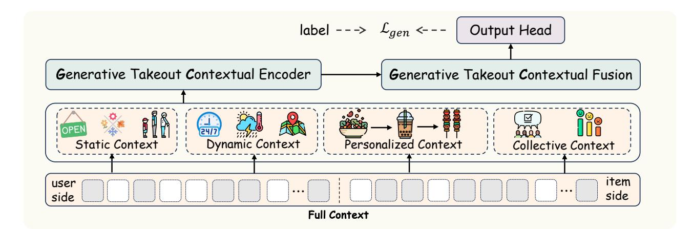
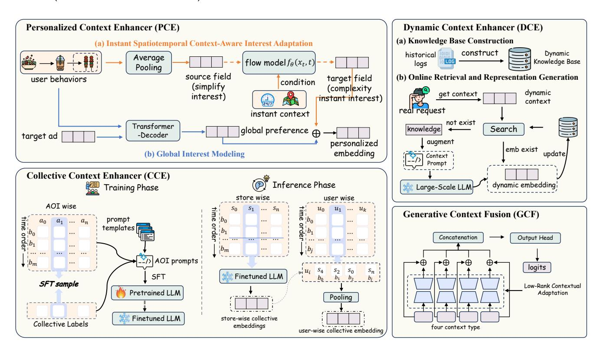
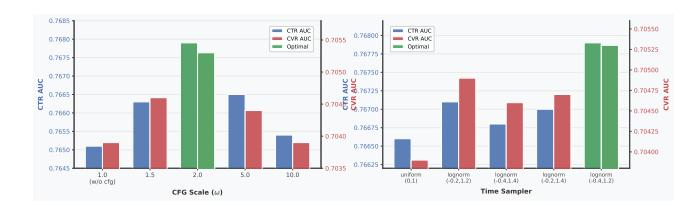
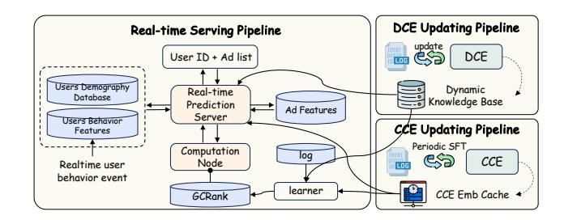

# A Generative Contextual Comprehension Paradigm for Takeout Ranking Model

Ziheng Ni\* ,Congcong Liu\*† , Cai Shang, Yiming Sun, Junjie Li, Zhiwei Fang, Guangpeng Chen, Li Jian, Zehua Zhang, Changping Peng, Zhangang Lin, Ching Law, Jingping Shao JD.com Beijing, China

# Abstract

The ranking stage serves as the central optimization and allocation hub in advertising systems, governing economic value distribution through eCPM and orchestrating the user-centric blending of organic and advertising content. Prevailing ranking models often rely on fragmented modules and hand-crafted features, limiting their ability to interpret complex user intent. This challenge is further amplified in location-based services such as food delivery, where user decisions are shaped by dynamic spatial, temporal, and individual contexts. To address these limitations, we propose a novel generative framework that reframes ranking as a context comprehension task, modeling heterogeneous signals in a unified architecture. Our architecture consists of two core components: the Generative Contextual Encoder (GCE) and the Generative Contextual Fusion (GCF). The GCE comprises three specialized modules: a Personalized Context Enhancer (PCE) for user-specific modeling, a Collective Context Enhancer (CCE) for group-level patterns, and a Dynamic Context Enhancer (DCE) for real-time situational adaptation. The GCF module then seamlessly integrates these contextual representations through low-rank adaptation. Extensive experiments confirm that our method achieves significant gains in critical business metrics, including click-through rate and platform revenue. We have successfully deployed our method on a large-scale food delivery advertising platform, demonstrating its substantial practical impact. This work pioneers a new perspective on generative recommendation and highlights its practical potential in industrial advertising systems.

# CCS Concepts

• Information systems → Computational advertising.

# Keywords

Contextual modeling, Generative Ranking, Advertising Systems

### ACM Reference Format:

Ziheng Ni\* ,Congcong Liu\*† , Cai Shang, Yiming Sun, Junjie Li, Zhiwei Fang, Guangpeng Chen, Li Jian, Zehua Zhang, Changping Peng, Zhangang Lin, Ching Law, Jingping Shao . 2018. A Generative Contextual Comprehension

Permission to make digital or hard copies of all or part of this work for personal or classroom use is granted without fee provided that copies are not made or distributed for profit or commercial advantage and that copies bear this notice and the full citation on the first page. Copyrights for components of this work owned by others than the author(s) must be honored. Abstracting with credit is permitted. To copy otherwise, or republish, to post on servers or to redistribute to lists, requires prior specific permission and/or a fee. Request permissions from permissions@acm.org.

Conference'XX, Woodstock, NY

Paradigm for Takeout Ranking Model. In Proceedings of xx (Conference'XX). ACM, New York, NY, USA, [9](#page-8-0) pages.<https://doi.org/XX.XXX>

# 1 Introduction

In the context of takeout advertising, ranking plays an essential role in determining ad exposure and allocation. The ranking scores generated during this stage, such as predicted Click-Through Rate (pCTR) and predicted Conversion Rate (pCVR), are integral components in the expected Cost Per Mille (eCPM) calculation. Within the eCPM framework, these predicted values are combined with the advertiser's bid price and other strategic factors reflecting both advertiser requirements and user experience considerations. Together, these elements jointly determine the final ranking and allocation of advertisements. In addition, modern advertising platforms frequently interleave ads with organic content to enhance user experience. In food delivery scenarios, for instance, advertisements are seamlessly blended with organic search results or recommendation lists, necessitating a mixed ranking process. This demands a unified metric to evaluate the relative utility of each item, whether advertised or organic. Traditional fixed-position strategies prove inadequate in such settings, as they fail to adapt to the dynamic interplay between ad relevance, user intent, and business objectives. Consequently, industrial mixed-ranking systems require sophisticated modeling techniques capable of jointly optimizing for both advertiser value and user satisfaction.

As a typical Location-Based Service (LBS) scenario, takeout advertising must account for numerous unique spatiotemporal factors that significantly influence user experience and operational efficiency. These include strict spatiotemporal constraints (e.g., delivery distance and preparation time), user preferences for specific Points of Interest (POI) like offices or residential compounds, and broader Area of Interest (AOI) characteristics such as commercial districts or university towns. For instance, a user in a business district during lunchtime may prioritize restaurants with fast preparation and short delivery times, while the same user in a residential area during dinner might value variety over speed. Currently, generative approaches for LBS scenarios remain relatively under-explored. While OneLoc [\[23\]](#page-8-1) proposes an end-to-end item generation framework focusing on geographical context constraints for group-buying scenarios in local services, its primary emphasis on spatial proximity is insufficient for the more complex demands of takeout advertising. Beyond geographical constraints, the takeout scenario requires integrated consideration of multifaceted contextual signals particularly temporal factors (e.g., time-of-day, peak hours, real-time delivery capacity), which are crucial for accurate ranking and allocation.

© 2018 Copyright held by the owner/author(s). Publication rights licensed to ACM. ACM ISBN 978-1-4503-XXXX-X/2018/06

\*Equal contribution

†Corresponding author

However, a systematic solution that comprehensively integrates these diverse contextual dimensions into a generative framework for takeout advertising remains an open challenge.

To address this gap, we propose GCRank (Generative Contextual Rank), a novel generative paradigm specifically designed for contextual comprehension in takeout advertising ranking. Our framework systematically decomposes the complex contextual environment into four distinct yet complementary dimensions: static context ( including restaurant attributes and fixed user profiles), dynamic context (encompassing real-time factors such as delivery capacity, weather conditions, and time-sensitive demands), personalized context (leveraging individual user preferences and behavioral history), and collective context (capturing group-level patterns and regional trends through AOI-aware modeling). At the core of GCRank lies the Generative Takeout Context Encoder (GCE), a unified architecture that employs advanced generative techniques to holistically model both the individual characteristics and, more importantly, the complex interrelationships among these contextual dimensions. The GCE comprises three specialized modules: a Personalized Context Enhancer (PCE) for user-specific preference modeling, a Collective Context Enhancer (CCE) for mining group-level semantic patterns, and a Dynamic Context Enhancer (DCE) for real-time situational reasoning. Through these modules, GCRank learns to generate unified context representations that effectively capture intricate dependencies between spatial constraints, temporal dynamics, personal preferences, and collective behaviors. For instance, our model can precisely characterize how a user's food preference (personalized context) interacts with current delivery capacity (dynamic context) during rainy weather (dynamic context) in a specific business district (static and collective context). This holistic contextual understanding, further refined through our Generative Context Fusion (GCF) module, enables GCRank to produce more accurate and context-aware ranking scores, specifically tailored to the unique challenges of takeout advertising scenarios.

The main contributions of this work are summarized as follows:

- Novel Generative Paradigm: We propose the first generative context understanding paradigm specifically designed for takeout advertising ranking, systematically addressing the unique challenges of LBS-aware advertising through a unified contextual comprehension framework.
- Specialized Context Modeling Architecture: We design a comprehensive architecture with three core modules for specialized context processing: a Collective Context Enhancer (CCE) for mining group-level patterns and regional trends, a Dynamic Context Enhancer (DCE) for modeling real-time contextual factors, and a Personalized Context Enhancer (PCE) for capturing individual user preferences with spatiotemporal adaptation.
- Advanced Context Fusion Methodology: We introduce a novel Generative Context Fusion (GCF) method that effectively addresses the alignment and integration challenges of heterogeneous contextual information through low-rank adaptation and cross-attention mechanisms.
- Comprehensive Experimental Validation: We conduct extensive experiments on industrial datasets, demonstrating significant improvements over traditional methods and

recent generative solutions. Ablation studies further validate the contribution of each proposed component, while comparative experiments on public datasets confirm the generalizability of our approach.

- Industrial Impact and Resource Contribution: Our method has been successfully deployed on a large-scale takeout advertising platform, achieving remarkable improvements. Recognizing the limitations of existing public datasets for generative research, we will release an anonymized industrial dataset to facilitate future work in this domain.

### 2 Related Work

### 2.1 Classical Ranking Models

Traditional ranking models in advertising, particularly the Deep Learning Recommendation Model (DLRM) architecture, typically process multiple input features including contextual information (e.g., time, location), user profiles (e.g., gender, age), user behavior sequences, and various cross-features of target items. Two particularly important modules in ranking models are behavior sequence processing and feature interaction learning. Behavior sequence modules [\[1,](#page-7-0) [2,](#page-7-1) [7,](#page-8-2) [19,](#page-8-3) [20,](#page-8-4) [30,](#page-8-5) [31\]](#page-8-6) commonly employ target attention mechanisms to capture similarities between users' historical behaviors and candidate items. These approaches effectively model users' dynamic preferences by attending to relevant historical interactions. Meanwhile, feature interaction modules [\[8,](#page-8-7) [13,](#page-8-8) [17,](#page-8-9) [21,](#page-8-10) [22\]](#page-8-11) aim to capture complex interactions among different features, including user and item characteristics, to generate final predictions. These methods typically utilize various interaction operations such as inner products, cross networks, or self-attention mechanisms to model feature correlations.

# 2.2 Generative Recommendation

Recently, generative recommendation [\[3–](#page-7-2)[5,](#page-8-12) [9,](#page-8-13) [10,](#page-8-14) [14,](#page-8-15) [15,](#page-8-16) [23,](#page-8-1) [24,](#page-8-17) [26–](#page-8-18) [29\]](#page-8-19) has attracted significant attention from both academia and industry. Methods such as EGA-V2 [\[27\]](#page-8-20), OneRec [\[10,](#page-8-14) [28,](#page-8-21) [29\]](#page-8-19), One-Sug [\[14\]](#page-8-15), OneSearch [\[3\]](#page-7-2), UniSearch [\[5\]](#page-8-12), and OneLoc [\[23\]](#page-8-1) focus on end-to-end reconstruction to improve both effectiveness and efficiency, while incorporating reward designs to introduce additional signals such as ranking scores and geographical rewards for user preference learning. Other approaches like MTGR [\[15\]](#page-8-16) and HSTU [\[26\]](#page-8-18) transform traditional DLRM by serializing all features in temporal order. However, these implementations remain essentially discriminative in nature for ranking tasks. More importantly, existing generative methods lack systematic modeling of contextual information in ranking scenarios and fail to consider the distinct semantic meanings of different contextual dimensions. Furthermore, the generative paradigm for contextual understanding in takeout advertising remains largely unexplored, particularly in handling the complex interplay between spatial, temporal, personal, and collective contextual factors that are unique to LBS-based food delivery scenarios.

# 3 Preliminary

In this section, we formalize the ads ranking problem in food delivery platforms. We consider the complete environmental information available at the time of a user request as the contextual basis for

The target attention mechanism enables the model to adaptively focus on historical behaviors that are most relevant to the current candidate item, enhancing the relevance of the generated representations. This global user embedding e global ��,�� captures stable preference patterns across different contexts and serves as the foundation for personalized ranking.

4.3.2 Instant Spatiotemporal Context-Aware Interest Adaptation. To address the sparsity issue under fine-grained spatiotemporal context partitioning, we reformulate instant interest modeling as a distribution transformation process rather than knowledge cooccurrence mining. Specifically, we leverage the flow matching paradigm to reshape the interest distribution according to immediate contextual signals. Let e avg ��,�� denote the user's average interest representation derived from their historical behaviors excluding the last interaction, serving as the source distribution. For a given instant context ��ins (including precise time and location information), we construct a guidance signal gins that encodes the finegrained spatiotemporal characteristics. To optimize the quality of flow matching generation, we employ the embedding of the user's last historical interaction elast as the ground truth target distribution, while using the corresponding instant context of that last interaction as the guidance signal during training. This ensures that the generated interest representations accurately reflect the user's preferences under specific contextual conditions. The transformation from source to target distribution is governed by a velocity field ���� parameterized by a neural network:

��e��,�� (��) ���� = ���� (e��,�� (��), gins, ��) (9)

where e��,�� (0) = e avg ��,�� and e��,�� (1) represents the final context-aware user interest. To enhance inference efficiency, we adopt the Mean-Flow [\[12\]](#page-8-23) optimization strategy, which approximates the continuous transformation through direct integration of the velocity field.

4.3.3 Personalized Interest Fusion. The final personalized user representation combines both global and instant context-aware interests through direct concatenation:

e �� = [e global ��,�� ; e instant ��,�� ] (10)

# 4.4 Generative Contextual Fusion

We transform each contextual representation into a shared semantic space through parameter-efficient low-rank adapters. For each context type �� ∈ {��, ��, ��, ��}, we apply a LoRA-style transformation:

e ′ �� = e�� + B��A��e�� (11)

where A�� ∈ R ��×���� and B�� ∈ R ��×�� are low-rank matrices with rank �� ≪ ���� . We employ adaptive rank configuration based on context complexity: dynamic and personalized contexts utilize large �� for fine-grained adaptation, while static and collective contexts employ small �� due to their more stable patterns. This design achieves parameter efficiency scaling as O (�� × (���� + ��)) per context type while maintaining representational capacity through residual connections.

The aligned representations are then concatenated and processed through a multi-layer perceptron to generate the final fused representation:

efusion = MLP( [e ′ ; e ′ �� ; e ′ �� ; e ′ �� ]) (12)

This streamlined fusion approach effectively integrates the complementary information from different contextual dimensions while maintaining computational efficiency for real-time ranking.

### 5 Experiment

### 5.1 Experiment Settings

5.1.1 Datasets. While publicly available datasets for recommendation and advertising tasks especially in takeout scenario predominantly utilize numerical features, they often lack the rich textual semantic information that is crucial for our generative contextual comprehension paradigm. Plain-text data provides more nuanced and expressive signals compared to numerical features, serving as the fundamental input for our method. To address the scarcity of semantic information in existing public datasets, we construct a comprehensive training dataset based on logs from a real-world industrial takeout advertising platform [1](#page-5-0) . It contains about 2 billions of samples, covering a large user base and several millions of ads.

5.1.2 Baselines. We compare GCRank against several state-of-theart methods spanning different paradigms: DNN as the fundamental deep learning baseline; DIN [\[31\]](#page-8-6) with adaptive interest modeling; SIM [\[18\]](#page-8-24) for long sequence modeling; HSTU [\[26\]](#page-8-18) representing a leading proposal for generative ranking reformulation; and One-Loc [\[23\]](#page-8-1) as the recent generative approach for LBS scenarios. Additionally, we include our production-level DLRM model as a strong industrial baseline, which has undergone multiple rounds of optimization and represents the current state-of-the-art in our realworld advertising system. For OneLoc, while it is designed as an end-to-end solution, we adapt its geographical context utilization methodology for fair comparison in our offline experiments, focusing on its core innovations for LBS scenarios. This comprehensive set of baselines ensures rigorous evaluation across different architectural paradigms and practical industrial requirements.

5.1.3 Evaluation Metrics. In our offline evaluation, we focus on two key tasks: CTR (Click-Through Rate) and CVR (Conversion Rate) prediction. We employ AUC (Area Under the ROC Curve) as our primary evaluation metric, where an improvement of 0.0001 is considered statistically significant in industrial advertising scenarios. Additionally, we introduce the RelaImpr metric to quantify relative improvements over baseline models following [\[16,](#page-8-25) [25,](#page-8-26) [31\]](#page-8-6). RelaImpr is defined as:

RelaImpr = ( AUC(model) − 0.5 AUC(base model) − 0.5 − 1) × 100% (13)

5.1.4 Implement Details. Our model is trained on NVIDIA A100 GPUs using the Adam optimizer with a learning rate of 0.00002 and batch size of 512. We utilize user behavior sequences from the past 60 days, truncated to a maximum length of 300 interactions. For the

1To safeguard proprietary business information, we applied carefully designed transformations to the reported results. These transformations preserve the essential statistical properties while ensuring that no sensitive business-related data can be reverseengineered from the published outcomes.

CCE Component, we initialize with Qwen1.5-0.5B as the pretrained LLM backbone, while the DCE utilizes the larger DeepSeek-R1 model for contextual reasoning. In the PCE module, we configure the CFG scale �� = 2.0 and employ a lognormal sampler with �� = −0.4 and �� = 1.2 for the flow matching process.

### 5.2 Overall Performance Comparison

We evaluate the performance of GCRank against all baseline methods using the industrial dataset described in Section [5.1.1.](#page-5-1) All results are the average of five repeated experiments. The comprehensive results are presented in Table [1.](#page-6-0) Following established practices in industrial recommendation systems, an AUC improvement of 0.001 is considered practically significant. Our experimental results demonstrate that GCRank achieves state-of-the-art performance on both CTR and CVR prediction tasks, significantly outperforming all baseline methods.

Among the comparative methods, HSTU shows competitive performance by incorporating contextual information as side features to enrich behavior representations, achieving better results than traditional sequential models. However, its improvement over the strongest sequential baselines remains limited, suggesting constraints in handling the complex contextual interactions characteristic of takeout advertising.

Interestingly, OneLoc, which focuses primarily on geographical context modeling, demonstrates limited effectiveness in our scenario. We hypothesize that this is because takeout advertising requires the integration of multiple contextual dimensions beyond just geographical information, including temporal dynamics, personalized preferences, and collective patterns. The singledimensional enhancement provided by OneLoc proves insufficient to capture the rich contextual dependencies essential for optimal performance in this domain. Notably, GCRank also significantly outperforms our production-level DLRM model, which has undergone extensive optimization and represents a strong industrial benchmark. This demonstrates the practical value of our generative contextual comprehension paradigm in real-world advertising systems.

These findings validate our key insight that a comprehensive generative approach that systematically integrates multiple contextual dimensions is crucial for achieving superior performance in complex LBS advertising scenarios like takeout platforms.

# 5.3 Ablation Study

To validate the effectiveness of each component in GCRank, we conduct comprehensive ablation studies on four core modules: Dynamic Context Enhancer (DCE), Collective Context Enhancer (CCE), Personalized Context Enhancer (PCE), and Generative Contextual Fusion (GCF).

For the ablation experiments on DCE, CCE, and PCE, we remove the corresponding generative modules while incorporating the contextual information through standard feature integration approaches. Specifically, the contextual signals that would have been processed by these modules are instead introduced as conventional input features to maintain comparable information availability. For the GCF ablation, we remove the fusion module entirely and replace

Table 1: Overall performance comparison. Best results are in bold, second best results are underlined. All results run over five times with std ≈ 1e-3.

| Method          | AUC    | CTR RelaImpr | AUC    | CVR RelaImpr |
|-----------------|--------|--------------|--------|--------------|
| AvgPooling-DNN  | 0.7403 | 0.00%        | 0.6503 | 0.00%        |
| DIN             | 0.7462 | +2.45%       | 0.6562 | +3.93%       |
| SIM             | 0.7481 | +3.25%       | 0.6588 | +5.66%       |
| HSTU            | 0.7545 | +5.91%       | 0.6659 | +10.38%      |
| OneLoc          | 0.7516 | +4.70%       | 0.6620 | +7.78%       |
| Production DLRM | 0.7513 | +4.58%       | 0.6619 | +7.72%       |
| GCRank (Ours)   | 0.7679 | +11.49%      | 0.7053 | +36.59%      |

it with standard concatenation of context representations. The ablation results presented in Table [2](#page-6-1) demonstrate that removing any of these modules leads to significant performance degradation in both CTR and CVR tasks. This consistent performance decline across all ablated configurations confirms the essential role of our specialized generative modules in effectively modeling different contextual dimensions.

We further investigate the constituent sub-modules within CCE and PCE to understand their individual contributions. For CCE, we systematically ablate both the store-wise and user-wise embedding components. The detailed results reveal substantial performance drops in both prediction tasks, indicating that both embedding types play crucial and complementary roles in collective context understanding. Similarly, for PCE, we examine the Global Interest Modeling branch and the Instant Context-Aware Interest Adaptation branch separately. The observed performance decline underscores the complementary nature of these components: global preferences establish stable user profiling while dynamic adaptation captures immediate contextual influences, with both being indispensable for comprehensive personalization.

These comprehensive ablation studies systematically verify the contribution of each proposed module and sub-module, providing valuable insights into the architectural design rationale of GCRank and affirming the necessity of our holistic generative approach to contextual modeling.

Table 2: Ablation studies of GCRank. All results run over five times with std ≈ 1e-3.

|        | Method | AUC    | CTR RelaImpr | AUC    | CVR RelaImpr |
|--------|--------|--------|--------------|--------|--------------|
| GCRank |        | 0.7679 | 0.00%        | 0.7053 | 0.00%        |
| w/o    | DCE    | 0.7626 | -1.98%       | 0.6898 | -7.55%       |
| w/o    | CCE    | 0.7621 | -2.16%       | 0.6920 | -6.48%       |
| w/o    | PCE    | 0.7652 | -1.01%       | 0.6971 | -3.99%       |
| w/o    | GCF    | 0.7643 | -1.34%       | 0.6967 | -4.19%       |

Figure 3: Hyperparameter studies of GCRank showing CTR AUC (left) and CVR AUC (right) performance across different configurations. Optimal configurations are highlighted in green.

### 5.4 Hyperparameter Experiments

We conduct extensive hyperparameter experiments to thoroughly understand the sensitivity of our GCRank framework. Given that the PCE module introduces the most complex generative components specifically the conditional flow matching paradigm with multiple critical parameters, we focus our analysis primarily on its hyperparameters, including the CFG scale coefficient, and timestep sampling strategies. The comprehensive results are visualized in Figure [3.](#page-7-3) We investigate the Classifier-Free Guidance (CFG) scale coefficient �� in the PCE module. Our experiments reveal a relationship between �� and model performance, with optimal results achieved at �� = 2.0.

Meanwhile, building upon established findings [\[11,](#page-8-27) [12\]](#page-8-23) that the distribution for sampling �� significantly influences generation quality, we systematically evaluate different sampling strategies for (��, ��) pairs in our PCE module. Our experimental setup employs independent sampling of (��, ��) followed by post-processing steps that enforce temporal ordering (�� &gt; ��) through swapping operations and constrain the proportion of �� = �� cases within specified bounds. Consistent with observations in Flow Matching [\[11,](#page-8-27) [12\]](#page-8-23), our comparative analysis reveals that the logit-normal sampler achieves superior performance compared to uniform sampling and linear scheduling alternatives.

These findings validate our parameter selections for the generative components in GCRank.

### 5.5 Online A/B Test and Online Deployment of GCRank

To further validate the practical effectiveness of GCRank in production environments, we deployed our framework on a large-scale takeout advertising platform and conducted a 7-day online A/B test with a 20% traffic allocation, ensuring statistical significance through millions of daily impressions. The control group utilized our highly optimized production DLRM model that has undergone extensive refinement.

Our online deployment architecture comprises three specialized pipelines: one existing real-time serving pipeline inherited from the production DLRM system for handling online requests and streaming training, plus two newly introduced generative pipelines dedicated to updating and serving the DCE and CCE modules respectively. During serving and training, the real-time pipeline queries the DCE knowledge base and CCE embedding cache while receiving necessary updates, as detailed in Section [4.](#page-2-2)

Figure 4: The online deployment architecture of GCRank, featuring three specialized pipelines for real-time serving and generative context modeling.

Remarkably, this sophisticated architecture incurs only a minimal latency overhead, with TP99 increasing by approximately 2 ms, a modest cost that remains highly acceptable for industrial-grade advertising systems. This efficiency stems from our deliberate optimization efforts throughout the framework implementation.

GCRank achieves significant improvements across all key business metrics: CTR increased by 5.07%, CVR improved by 4.71%, and RPM grew by 6.42%. All improvements are statistically significant (��-value &lt; 0.0001), confirming both the reliability of our findings and the substantial value of GCRank in enhancing takeout contextual understanding. These results collectively demonstrate that our method delivers meaningful gains in both advertising revenue and user experience.

# 6 Conclusion

In this paper, we proposed GCRank, a novel generative contextual comprehension paradigm for taekout ranking model. Our key contribution lies in systematically decomposing the contextual environment into four dimensions, static, dynamic, personalized, and collective, and developing specialized modules within the Generative Takeout Context Encoder (GCE) to model each aspect. The Generative Context Fusion (GCF) module then effectively aligns and integrates these heterogeneous representations. Extensive experiments demonstrate GCRank's state-of-the-art performance, with ablation studies confirming each component's critical contribution. Most importantly, online A/B testing on a major platform validates substantial business value through significant lifts in CTR, CVR, and RPM. This work establishes the power of generative context-aware paradigms for complex LBS-based takeout advertising scenarios.

### References

[1] Yue Cao, Xiaojiang Zhou, Jiaqi Feng, Peihao Huang, Yao Xiao, Dayao Chen, and Sheng Chen. 2022. Sampling is all you need on modeling long-term user behaviors for CTR prediction. In Proceedings of the 31st ACM International Conference on Information & Knowledge Management. 2974–2983. [2] Jianxin Chang, Chenbin Zhang, Zhiyi Fu, Xiaoxue Zang, Lin Guan, Jing Lu, Yiqun Hui, Dewei Leng, Yanan Niu, Yang Song, et al. 2023. TWIN: TWo-stage interest network for lifelong user behavior modeling in CTR prediction at kuaishou. In Proceedings of the 29th ACM SIGKDD Conference on Knowledge Discovery and Data Mining. 3785–3794. [3] Ben Chen, Xian Guo, Siyuan Wang, Zihan Liang, Yue Lv, Yufei Ma, Xinlong Xiao, Bowen Xue, Xuxin Zhang, Ying Yang, et al. 2025. Onesearch: A preliminary exploration of the unified end-to-end generative framework for e-commerce search. arXiv preprint arXiv:2509.03236 (2025). [4] Junyi Chen, Lu Chi, Bingyue Peng, and Zehuan Yuan. 2024. Hllm: Enhancing sequential recommendations via hierarchical large language models for item and

- user modeling. arXiv preprint arXiv:2409.12740 (2024). [5] Jiahui Chen, Xiaoze Jiang, Zhibo Wang, Quanzhi Zhu, Junyao Zhao, Feng Hu, Kang Pan, Ao Xie, Maohua Pei, Zhiheng Qin, et al. 2025. UniSearch: Rethinking Search System with a Unified Generative Architecture. arXiv preprint arXiv:2509.06887 (2025). [6] Jianlv Chen, Shitao Xiao, Peitian Zhang, Kun Luo, Defu Lian, and Zheng Liu. 2024. BGE M3-Embedding: Multi-Lingual, Multi-Functionality, Multi-Granularity Text Embeddings Through Self-Knowledge Distillation. CoRR abs/2402.03216 (2024). arXiv[:2402.03216](https://arxiv.org/abs/2402.03216) [doi:10.48550/ARXIV.2402.03216](https://doi.org/10.48550/ARXIV.2402.03216) [7] Qiwei Chen, Changhua Pei, Shanshan Lv, Chao Li, Junfeng Ge, and Wenwu Ou. 2021. End-to-end user behavior retrieval in click-through rateprediction model. arXiv preprint arXiv:2108.04468 (2021). [8] Heng-Tze Cheng, Levent Koc, Jeremiah Harmsen, Tal Shaked, Tushar Chandra, Hrishi Aradhye, Glen Anderson, Greg Corrado, Wei Chai, Mustafa Ispir, et al. 2016. Wide & deep learning for recommender systems. In Proceedings of the 1st workshop on deep learning for recommender systems. 7–10. [9] Sunhao Dai, Jiakai Tang, Jiahua Wu, Kun Wang, Yuxuan Zhu, Bingjun Chen, Bangyang Hong, Yu Zhao, Cong Fu, Kangle Wu, et al. 2025. OnePiece: Bringing Context Engineering and Reasoning to Industrial Cascade Ranking System. arXiv preprint arXiv:2509.18091 (2025). [10] Jiaxin Deng, Shiyao Wang, Kuo Cai, Lejian Ren, Qigen Hu, Weifeng Ding, Qiang Luo, and Guorui Zhou. 2025. Onerec: Unifying retrieve and rank with generative recommender and iterative preference alignment. arXiv preprint arXiv:2502.18965 (2025). [11] Patrick Esser, Sumith Kulal, Andreas Blattmann, Rahim Entezari, Jonas Müller, Harry Saini, Yam Levi, Dominik Lorenz, Axel Sauer, Frederic Boesel, et al. 2024. Scaling rectified flow transformers for high-resolution image synthesis. In Fortyfirst international conference on machine learning. [12] Zhengyang Geng, Mingyang Deng, Xingjian Bai, J Zico Kolter, and Kaiming He. 2025. Mean flows for one-step generative modeling. arXiv preprint arXiv:2505.13447 (2025). [13] Huifeng Guo, Ruiming Tang, Yunming Ye, Zhenguo Li, and Xiuqiang He. 2017. DeepFM: a factorization-machine based neural network for CTR prediction. arXiv preprint arXiv:1703.04247 (2017). [14] Xian Guo, Ben Chen, Siyuan Wang, Ying Yang, Chenyi Lei, Yuqing Ding, and Han
- Li. 2025. OneSug: The Unified End-to-End Generative Framework for E-commerce Query Suggestion. arXiv preprint arXiv:2506.06913 (2025). [15] Ruidong Han, Bin Yin, Shangyu Chen, He Jiang, Fei Jiang, Xiang Li, Chi Ma, Mincong Huang, Xiaoguang Li, Chunzhen Jing, et al. 2025. MTGR: Industrial-Scale Generative Recommendation Framework in Meituan. arXiv preprint arXiv:2505.18654 (2025). [16] Weijiang Lai, Beihong Jin, Yapeng Zhang, Yiyuan Zheng, Rui Zhao, Jian Dong, Jun Lei, and Xingxing Wang. 2025. Modeling Long-term User Behaviors with Diffusion-driven Multi-interest Network for CTR Prediction. In Proceedings of the Nineteenth ACM Conference on Recommender Systems. 289–298. [17] Jianxun Lian, Xiaohuan Zhou, Fuzheng Zhang, Zhongxia Chen, Xing Xie, and Guangzhong Sun. 2018. xdeepfm: Combining explicit and implicit feature interactions for recommender systems. In Proceedings of the 24th ACM SIGKDD international conference on knowledge discovery & data mining. 1754–1763. [18] Weijian Luo, Zemin Huang, Zhengyang Geng, J Zico Kolter, and Guo-Jun Qi. 2024. One-Step Diffusion Distillation through Score Implicit Matching. In NeurIPS. [19] Qi Pi, Guorui Zhou, Yujing Zhang, Zhe Wang, Lejian Ren, Ying Fan, Xiaoqiang Zhu, and Kun Gai. 2020. Search-based user interest modeling with lifelong sequential behavior data for click-through rate prediction. In Proceedings of the 29th ACM International Conference on Information & Knowledge Management. 2685–2692. [20] Zihua Si, Lin Guan, ZhongXiang Sun, Xiaoxue Zang, Jing Lu, Yiqun Hui, Xingchao Cao, Zeyu Yang, Yichen Zheng, Dewei Leng, et al. 2024. Twin v2: Scaling ultralong user behavior sequence modeling for enhanced ctr prediction at kuaishou. In Proceedings of the 33rd ACM International Conference on Information and Knowledge Management. 4890–4897. [21] Ruoxi Wang, Bin Fu, Gang Fu, and Mingliang Wang. 2017. Deep & cross network for ad click predictions. In Proceedings of the ADKDD'17. 1–7. [22] Ruoxi Wang, Rakesh Shivanna, Derek Cheng, Sagar Jain, Dong Lin, Lichan Hong, and Ed Chi. 2021. Dcn v2: Improved deep & cross network and practical lessons for web-scale learning to rank systems. In Proceedings of the web conference 2021. 1785–1797. [23] Zhipeng Wei, Kuo Cai, Junda She, Jie Chen, Minghao Chen, Yang Zeng, Qiang Luo, Wencong Zeng, Ruiming Tang, Kun Gai, et al. 2025. OneLoc: Geo-Aware Generative Recommender Systems for Local Life Service. arXiv preprint arXiv:2508.14646 (2025). [24] Bencheng Yan, Shilei Liu, Zhiyuan Zeng, Zihao Wang, Yizhen Zhang, Yujin Yuan, Langming Liu, Jiaqi Liu, Di Wang, Wenbo Su, et al. 2025. Unlocking Scaling Law in Industrial Recommendation Systems with a Three-step Paradigm based Large User Model. arXiv preprint arXiv:2502.08309 (2025). [25] Ling Yan, Wu-Jun Li, Gui-Rong Xue, and Dingyi Han. 2014. Coupled group lasso for web-scale ctr prediction in display advertising. In International conference on machine learning. PMLR, 802–810. [26] Jiaqi Zhai, Lucy Liao, Xing Liu, Yueming Wang, Rui Li, Xuan Cao, Leon Gao, Zhaojie Gong, Fangda Gu, Jiayuan He, et al. 2024. Actions Speak Louder than Words: Trillion-Parameter Sequential Transducers for Generative Recommendations. In International Conference on Machine Learning. PMLR, 58484–58509. [27] Zuowu Zheng, Ze Wang, Fan Yang, Jiangke Fan, Teng Zhang, and Xingxing Wang. 2025. EGA: A Unified End-to-End Generative Framework for Industrial Advertising Systems. arXiv preprint arXiv:2505.17549 (2025). [28] Guorui Zhou, Jiaxin Deng, Jinghao Zhang, Kuo Cai, Lejian Ren, Qiang Luo, Qianqian Wang, Qigen Hu, Rui Huang, Shiyao Wang, et al. 2025. OneRec Technical Report. arXiv preprint arXiv:2506.13695 (2025). [29] Guorui Zhou, Hengrui Hu, Hongtao Cheng, Huanjie Wang, Jiaxin Deng, Jinghao Zhang, Kuo Cai, Lejian Ren, Lu Ren, Liao Yu, et al. 2025. OneRec-V2 Technical Report. arXiv preprint arXiv:2508.20900 (2025). [30] Guorui Zhou, Na Mou, Ying Fan, Qi Pi, Weijie Bian, Chang Zhou, Xiaoqiang Zhu, and Kun Gai. 2019. Deep interest evolution network for click-through rate prediction. In Proceedings of the AAAI conference on artificial intelligence, Vol. 33. 5941–5948. [31] Guorui Zhou, Xiaoqiang Zhu, Chenru Song, Ying Fan, Han Zhu, Xiao Ma, Yanghui Yan, Junqi Jin, Han Li, and Kun Gai. 2018. Deep interest network for click-through rate prediction. In Proceedings of the 24th ACM SIGKDD international conference on knowledge discovery & data mining. 1059–1068.