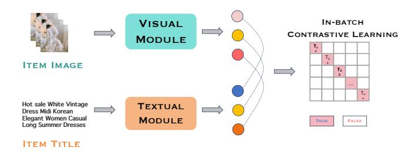
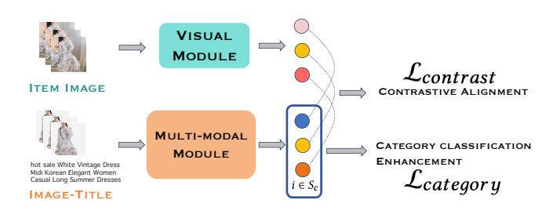
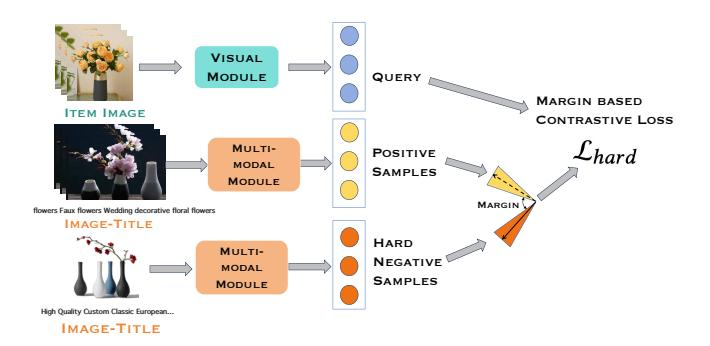
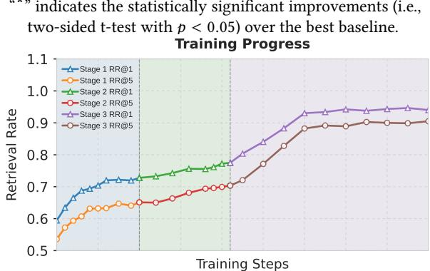
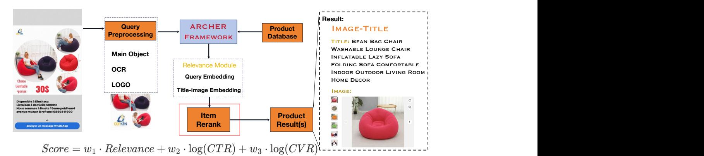

# ARCHER: Shooting Straight in Multimodal E-Commerce Search at Alibaba with Progressive Alignment

Maolin Wang morin.wang@my.cityu.edu.hk City University of Hong Kong Hong Kong SAR, China

Lang Fu∗ fulang.fl@alibaba-inc.com Alibaba International Digital Commerce Group Hangzhou, China

Jun Chu∗ chujun.chu@alibaba-inc.com Alibaba International Digital Commerce Group Hangzhou, China

Kai Guo xunge.gk@alibaba-inc.com Alibaba International Digital Commerce Group Hangzhou, China

Chenjie Qin qinchenjie.miracle@gmail.com Alibaba International Digital Commerce Group Hangzhou, China

Xinxin Wang rooney.wxx@alibaba-inc.com Alibaba International Digital Commerce Group Hangzhou, China

Siyu Wu wusiyu.wsy@alibaba-inc.com Alibaba International Digital Commerce Group Hangzhou, China

Wen Jiang wen.jiangw@alibaba-inc.com Alibaba International Digital Commerce Group Hangzhou, China

Xiangyu Zhao∗ xianzhao@cityu.edu.hk City University of Hong Kong Hong Kong SAR, China

# Abstract

In the rapidly evolving landscape of e-commerce, visual search has become a cornerstone of user experience, enabling customers to find products using images rather than traditional text queries. However, a comprehensive analysis reveals a persistent challenge: nearly half of retrieval failures stem from systems that prioritize superficial visual similarity over semantic relevance, resulting in frustrating user experiences where searches return visually similar but functionally different products. This limitation becomes particularly acute in Business-to-Business environments, where incorrect product recommendations can have significant operational and safety implications. In this paper, we propose a novel solution, Adaptive Retrieval with Category- aware Hierarchical sEmantic Refinement (ARCHER), which presents a novel multimodal retrieval framework that addresses these challenges through progressive semantic alignment. Unlike existing approaches that treat all visual similarities equally, ARCHER employs a sophisticated three-stage learning strategy that systematically builds from coarse-grained category understanding to fine-grained product discrimination. The framework begins with Proto-Align Enhancement to establish foundational visual-textual correspondences, progresses through Cross-View Learning to develop robust viewpoint-invariant representations, and culminates with Margin-based Representation Enhancement that learns to distinguish between visually similar but functionally distinct products. Most significantly, the framework has been

∗Corresponding authors.

[This work is licensed under a Creative Commons Attribution-NonCommercial-](https://creativecommons.org/licenses/by-nc-nd/4.0)[NoDerivatives 4.0 International License.](https://creativecommons.org/licenses/by-nc-nd/4.0) WWW '26, Dubai, United Arab Emirates © 2026 Copyright held by the owner/author(s). ACM ISBN 979-8-4007-2307-0/2026/04 <https://doi.org/10.1145/3774904.3792819>

successfully deployed on Alibaba.com's B2B platform since December 2024, where it serves millions of daily queries and has achieved a measurable 2.1% improvement in click-through rates.

# CCS Concepts

• Information systems → Information retrieval; Data mining.

# Keywords

Multimodal retrieval, visual search, industrial applications, B2B search, representation learning

### ACM Reference Format:

Maolin Wang, Lang Fu, Jun Chu, Kai Guo, Chenjie Qin, Xinxin Wang, Siyu Wu, Wen Jiang, and Xiangyu Zhao. 2026. ARCHER: Shooting Straight in Multimodal E-Commerce Search at Alibaba with Progressive Alignment. In Proceedings of the ACM Web Conference 2026 (WWW '26), April 13–17, 2026, Dubai, United Arab Emirates. ACM, New York, NY, USA, [12](#page-11-0) pages. <https://doi.org/10.1145/3774904.3792819>

# 1 Introduction

Cross-modal retrieval for e-commerce represents a significant and long-standing challenge in the field of information retrieval [\[40](#page-8-0)? , [41\]](#page-8-1). In this prevalent scenario, users often express a complex purchase intent by submitting a query image, seeking relevant products from vast and heterogeneous digital catalogs. The products themselves are inherently multimodal entities, defined by a rich combination of visual imagery, unstructured textual descriptions, and structured technical specifications [\[9\]](#page-8-2). Consequently, a system's ability to effectively bridge the semantic gap between a user's visual query and the corresponding multimodal product representations is paramount for ensuring retrieval quality and user satisfaction [\[14\]](#page-8-3). Traditional visual search methods that depend solely on matching visual features often fail to capture the user's underlying intent, as they neglect critical product attributes conveyed through text [\[14,](#page-8-3)

Figure 1: An example of "Similar Look, Wrong Category" confusion. A query for a handbag retrieves visually similar clothing items due to shared floral patterns and design elements, despite the fundamental difference in their product categories and intended use.

[42\]](#page-8-4). This deficiency is particularly acute in domains such as fashion and home decor, where attributes like style, material, and function must be jointly considered with visual appearance [\[22,](#page-8-5) [32\]](#page-8-6).

A large-scale empirical analysis of retrieval errors on a production e-commerce system reveals two dominant failure modes. First, 42.5% of retrieval quality degradation is attributed to what we term visual-semantic asymmetry. This occurs when retrieved items are visually similar to the query but belong to entirely different product categories. As illustrated in Figure [1,](#page-1-0) a handbag featuring a floral pattern may be incorrectly matched with clothing items that share similar visual motifs, despite their distinct functionalities. Second, 39.8% of errors result from insufficient cross-category generalization, where the retrieval model fails to preserve semantic consistency when matching visual features across disparate product domains. These findings highlight a critical technical gap: the inability of existing static alignment mechanisms to integrate nuanced domain knowledge and the limited fine-grained discriminative capability of current representation learning frameworks.

To address these issues, the dominant paradigm has shifted from basic image-to-image (I2I) matching, as seen in early systems like Taobao Image Search and Google Lens, towards sophisticated dualtower architectures powered by large-scale Vision-Language Models (VLMs) like CLIP [\[23\]](#page-8-7) and ALIGN [\[12\]](#page-8-8). These models learn a shared embedding space by contrasting paired images and texts. However, their standard learning objectives often prove insufficient for the complexities of e-commerce retrieval. Even advanced frameworks such as VISTA [\[42\]](#page-8-4), which enhance text models with visual token understanding, still lack explicit category-aware mechanisms. Their reliance on global feature alignment can cause models to overindex on low-level visual cues (e.g., color, pattern) at the expense of high-level categorical and functional semantics, leading directly to the cross-category confusion previously identified. This points to a clear research gap for a retrieval framework capable of fine-grained, category-aware semantic matching.

To fill this gap, we propose Adaptive Retrieval with Categoryaware Hierarchical sEmantic Refinement (ARCHER), a novel framework that learns to perform multimodal alignment through progressive refinement. ARCHER's architecture is composed of three distinct stages. (1) Proto-Align Enhancement (PAE) first establishes a robust, foundational visual-textual embedding space using large-scale contrastive learning. (2) Cross-View Learning

(CVL) then introduces a specialized objective to explicitly align query image representations with unified multimodal product representations, which encompass both image and text. (3) Finally, Margin-based Representation Enhancement (MRE) fine-tunes the model's discriminative power by mining informative hard negative samples, selected via foundation models, and enforcing a margin-based contrastive loss to better separate visually similar yet semantically distinct items. While many systems retrieve items that are composed of images and text [\[7,](#page-8-9) [21,](#page-8-10) [30\]](#page-8-11), our work is among the first to formally model and optimize for the direct image-to-imagetext (I2IT) retrieval task, where the image-text pair is treated as a single, cohesive unit for relevance matching.

Our primary contributions are threefold:

- We propose a novel three-stage progressive multimodal retrieval framework, ARCHER, that effectively mitigates category-crossing noise by integrating image-text alignment, cross-view contrastive learning, and targeted hard negative mining, all while maintaining production-level efficiency.
- We conduct comprehensive experiments on both public e-commerce benchmarks and large-scale industrial datasets. Our results demonstrate that ARCHER consistently outperforms state-of-the-art methods across diverse product categories, while maintaining efficient inference.
- We have successfully deployed ARCHER on a major e-commerce platform, where it has been serving millions of daily searches since December 2024. Online A/B testing confirms its impact, showing a 2.1% improvement in click-through rate.

# 2 Methodology

This section provides a comprehensive formalization of these unique challenges and introduces our ARCHER framework, which addresses them through a novel progressive alignment strategy.

# 2.1 Problem Formulation and Challenges

2.1.1 Mathematical Formulation. Given a query image ���� captured in real-world industrial settings and a comprehensive product catalog D = {(���� ,����)}�� ��=1 where each item consists of a product image ���� and textual description ���� , our goal is to learn a robust multimodal embedding function �� (·) that maps both queries and catalog items into a unified semantic space:

R (��) = ������������(��,�� ) ∈Dsim(�� (����), �� (��,�� )) (1)

The embedding function �� (·) must simultaneously capture multiple levels of semantic relationships, from high-level category distinctions to specification differences within the same family.

2.1.2 Industrial Deployment Constraints. Real-world industrial deployment imposes stringent performance requirements. The embedding function must satisfy dual objectives of effectiveness and efficiency:

T (�� ) ≤ �������������� s.t. P@�� ≥ ��, R@�� ≥ �� (2)

where T (�� ) represents the end-to-end inference latency, which must remain below �������������� (typically 200ms in production) while maintaining minimum precision and recall thresholds.

Table 1: Comparison of Different Methods on Our Industrial Image Search Benchmark

"\*" indicates the statistically significant improvements (i.e., two-sided t-test with �� &lt; 0.05) over the best baseline.

Table 2: Detailed Category (RR@1) Performance of Different Methods

|           | Clothing | Jewelry | Baby | Consumer | Shoes | Consumer Bags | Beauty | Products Entertainment | Gifts | Care Personal | Supplies Pet | Avg Consumer | Garden | Furniture | Parts Auto | Packaging | Equipment | Appliances Home | Industrial Building | Lighting | Products Hardware | Machinery | Electronic | Accessories | Electricity | Avg Industrial |
|-----------|----------|---------|------|----------|-------|---------------|--------|------------------------|-------|---------------|--------------|--------------|--------|-----------|------------|-----------|-----------|-----------------|---------------------|----------|-------------------|-----------|------------|-------------|-------------|----------------|
| BGE-I2I   | .568     | .583    | .568 | .568     | .589  | .568          | .550   | .568                   | .495  | .465          | .472         | .643         | .550   | .568      | .537       | .459      | .550      | .562            | .507                | .574     | .562              | .507      | .388       | .507        | .513        | .493           |
| BGE-I2IT  | .592     | .607    | .592 | .592     | .613  | .592          | .574   | .592                   | .516  | .485          | .492         | .672         | .574   | .592      | .560       | .479      | .574      | .586            | .529                | .598     | .586              | .529      | .405       | .529        | .536        | .512           |
| CLIP-I2I  | .682     | .698    | .682 | .682     | .705  | .682          | .662   | .682                   | .595  | .559          | .567         | .752         | .662   | .682      | .645       | .552      | .662      | .675            | .610                | .689     | .675              | .610      | .467       | .610        | .617        | .612           |
| CLIP-I2IT | .694     | .710    | .694 | .694     | .717  | .694          | .674   | .694                   | .606  | .569          | .577         | .764         | .674   | .694      | .657       | .562      | .674      | .687            | .621                | .701     | .687              | .621      | .475       | .621        | .628        | .624           |
| PLT       | .915     | .935    | .915 | .915     | .945  | .915          | .885   | .915                   | .798  | .750          | .760         | .912         | .885   | .915      | .865       | .740      | .885      | .905            | .817                | .923     | .905              | .817      | .625       | .817        | .827        | .872           |
| ARCHER    | .942     | .963    | .942 | .942     | .973  | .942          | .912   | .942                   | .822  | .773          | .783         | .942         | .912   | .942      | .891       | .762      | .912      | .932            | .842                | .951     | .932              | .842      | .644       | .842        | .852        | .892           |

The varying performance across categories carries important business implications for industrial image search systems. Categories with high query volumes exhibit more stable performance across models, indicating the benefit of abundant training data for model optimization. These findings suggest that a successful industrial image search requires a nuanced approach: a visual-first strategy for fashion and decorative products, and a hybrid visualspecification approach for technical and industrial products. This analysis demonstrates that effective industrial image search systems must carefully consider category-specific characteristics, with future improvements focusing on better integration of visual and technical specification matching to address the diverse requirements across different product domains.

# 3.3 Detailed Category-Specific Analysis

As summarized in Table [2](#page-5-1) across internally-defined categories, our comprehensive analysis of category-specific performance reveals distinctive patterns in industrial image search behavior. In consumer product categories, high-value segments like Shoes, Jewelry & Watches demonstrate superior performance across all models, primarily attributed to their standardized product photography and distinctive visual features. Fashion-related categories, including Clothing, Bags, and Shoes, consistently outperform other consumer segments, highlighting the effectiveness of visual feature extraction in structured product presentations. However, categories like Personal Care and Pet Supplies show relatively lower performance, indicating persistent challenges in distinguishing products with similar packaging but different specifications.

In the industrial product domain, we observe a clear performance stratification among technical categories. While visually distinctive segments such as lighting and furniture achieve accuracy comparable to consumer products, specification-heavy categories such as electronic components and packaging demonstrate significantly lower accuracy. This performance gap between consumer and industrial products reflects a fundamental difference in search requirements: consumer products rely more heavily on visual similarity, while industrial products often demand precise technical specification matching. The ARCHER model shows consistent improvements over baselines across all categories, with the most significant gains observed in challenging technical categories, suggesting that advanced architectures better handle complex technical product characteristics. The varying performance across categories carries important business implications. Categories with high query volumes exhibit more stable performance across models, indicating the benefit of abundant training data. These findings suggest that a successful industrial image search requires a nuanced approach: a visual-first strategy for fashion and decorative products and a hybrid visual-specification approach for technical and industrial products. This analysis demonstrates that effective industrial image search systems must carefully consider category-specific characteristics, with future improvements focusing on better integration of visual and technical specification matching.

# 3.4 Overall Performance on Public Dataset

Due to the lack of public datasets specifically designed for image-to-image-text pair retrieval, we modified two widely used public image-text pair queries to image retrieval datasets (CIRR and FashionIQ) to comprehensively evaluate ARCHER against state-ofthe-art baselines in a modified image-to-image-text pair retrieval

Table 3: Results on Modified Pair Public Datasets (R@5)

| Model         | CIRR    | FashionIQ |
|---------------|---------|-----------|
| BGE-Visualize | 8.25    | 1.50      |
| CLIP ViT-B/16 | 9.12    | 1.46      |
| ARCHER (ours) | 10.82 ∗ | 1.58 ∗    |

"\*" indicates the statistically significant improvements (i.e.,

Figure 5: The training progress of ARCHER across three stages, showing distinct learning patterns that align with our progressive multi-modal alignment strategy. Both RR@1 and RR@5 metrics demonstrate consistent improvement throughout the training process.

setting. As shown in Table [3,](#page-6-0) ARCHER consistently outperforms existing methods across both benchmark datasets. Compared to powerful baselines like CLIP ViT-B/16 and BGE-Visualize, our method achieves substantial and consistent improvements on both CIRR and FashionIQ datasets. Notably, despite the significant domain gap between our industrial e-commerce training scenarios and these public datasets, which primarily focus on general natural image-text descriptions and fashion compositions, ARCHER still achieves superior performance, demonstrating its strong generalization ability and robustness across different domains and complex scenarios.

### 3.5 Training Dynamics

The training process of ARCHER demonstrates three distinct stages with different convergence characteristics, as shown in Figure [5.](#page-6-1) During Stage 1, the model exhibits rapid performance gains with steep learning curves, indicating the effectiveness of Proto-Align Enhancement in quickly establishing fundamental visual-semantic alignments. This fast initial convergence suggests that the prototypical learning mechanism successfully guides the model to capture essential cross-modal correspondences. In Stage 2, we observe more moderate growth with occasional fluctuations in both RR@1 and RR@5 metrics. This behavior aligns with the Cross-View Learning phase, where the model refines its understanding of view-invariant features and category relationships. The measured pace of improvement reflects the complexity of learning robust cross-view representations while maintaining category awareness. The final stage demonstrates steady and consistent performance gains, validating the effectiveness of our Margin-based Representation Enhancement approach. The gradual convergence to optimal performance indicates successful fine-grained discrimination learning, particularly in handling challenging cases with subtle differences. This training

dynamic validates our progressive alignment strategy, showing how each stage builds upon previous foundations to achieve robust multi-modal representations. Due to space constraints, hyperparameter analysis is provided in Appendix Sec. [F](#page-10-2), and case studies are presented in Appendix Sec. [G](#page-10-3).

### 4 Online Deployment

This section describes the deployment and evaluation of our visual search system at Alibaba.com, covering system architecture, efficiency optimization, and comprehensive evaluation results.

### 4.1 System Architecture.

At Alibaba.com B2B platform, we deploy our framework to serve thousands of visual search queries per second. As shown in Figure [6,](#page-7-0) the system comprises three main components: The online query processing component handles user images through realtime multimodal analysis, including product detection, category prediction, OCR, logo detection, and scene understanding. Our core matching module uses BGE-base-1.5 for text encoding and EVA-CLIP-B/16 for visual features to generate unified query embeddings that capture both visual and semantic information. The real-time retrieval component performs similarity search across millions of products using FAISS-GPU indexing infrastructure. Final ranking combines embedding-based relevance with behavioral signals through: Score = ��1 ·Relevance+��2 ·log(CTR) +��3 ·log(CVR), where relevance measures cosine similarity between query and product embeddings, while CTR/CVR capture historical user preferences and commercial viability. The offline component manages extensive preprocessing for product data, including feature extraction, attribute parsing, and semantic understanding. Product embeddings are pre-computed and refreshed daily, ensuring sub-200ms query response times in production through robust pipeline architecture.

## 4.2 Efficiency Optimization.

We address computational constraints through business-aware distillation leveraging asymmetric resources across system components. On the database side, where computational flexibility exists, we employ large model distillation techniques to enhance productside representations, utilizing high-capacity models that would be prohibitive in online settings. For query processing, we implement sophisticated distillation algorithms that transfer capabilities from large teacher models to efficient student models, maintaining representation quality while achieving &lt;100ms retrieval latency and &lt;200ms overall system latency in billion-scale deployment. This asymmetric optimization strategy enables real-time performance.

### 4.3 Manual Assessment and Automatic Metrics.

Professional evaluators with domain expertise assessed 17,000 diverse samples representative of typical B2B search scenarios, achieving 88.88% overall accuracy. Top-1 relevance rates reach 94.98% for consumer goods and 89.50% for industrial goods, improving to 91.29% and 84.98% for top-5 results, indicating consistent highquality ranking. Industry-specific performance reveals substantial variation: consumer electronics achieves highest relevance at 95% due to standardized appearances, beauty/cosmetics and industrial

Figure 6: System architecture of ARCHER deployment at Alibaba.com B2B e-commerce platform. The pipeline consists of online query processing, real-time retrieval, and offline feature computation components.

equipment both reach 92%, machinery achieves 85%, while packaging/printing presents challenges at 77% due to abstract visual features. These variations reflect inherent complexity differences in visual product identification across domains.

# 4.4 Online A/B Testing and Business Impact.

Large-scale A/B testing on the live platform demonstrates 2.1% CTR improvement in Alibaba.com's entire image search traffic. Merchant engagement metrics show substantial improvements: 15% increase in daily active users indicating enhanced user acquisition, 25% longer average session duration suggesting deeper engagement, and 18% improved 30-day retention rate demonstrating sustained business value. The system has successfully served global merchants on Alibaba.com since December 2024, processing diverse B2B visual searches across multiple geographic regions and industry verticals while consistently maintaining high accuracy standards and meeting strict latency requirements essential for commercial e-commerce applications.

# 5 Related Works

Vision Language Models. Recent advances in Vision-Language Models (VLMs) [\[1,](#page-8-12) [8,](#page-8-13) [27,](#page-8-14) [29,](#page-8-15) [33,](#page-8-16) [34,](#page-8-17) [38,](#page-8-18) [39,](#page-8-19) [44\]](#page-8-20) have revolutionized cross-modal understanding by learning shared representations between visual and textual modalities. Traditional VLMs like CLIP [\[23\]](#page-8-7) and EVA-CLIP [\[26\]](#page-8-21) establish strong foundations through contrastive learning on billions of image-text pairs, demonstrating remarkable zero-shot capabilities. Recent models like BGE-Visualize [\[35\]](#page-8-22) enhance cross-modal alignment through multi-lingual support and sophisticated attention mechanisms. While approaches like ALIGN [\[12\]](#page-8-8) scale training data and BLIP [\[15\]](#page-8-23) introduces bootstrapping techniques, these general-purpose models struggle with e-commerce scenarios requiring fine-grained product distinctions and technical specifications that may not be visually prominent. Our work addresses these limitations through a three-stage framework leveraging large-scale product data and category-aware learning for reliable e-commerce retrieval.

Multi-modal Retrieval Models. Multimodal retrieval has evolved significantly with deep learning [\[4,](#page-8-24) [5,](#page-8-25) [13,](#page-8-26) [16](#page-8-27)[–18,](#page-8-28) [28,](#page-8-29) [36\]](#page-8-30). While traditional models like CLIP [\[23\]](#page-8-7) process modalities independently, recent approaches including UniVL-DR [\[20\]](#page-8-31), Clip4Cir [\[3\]](#page-8-32), and

UniIR [\[30\]](#page-8-11) utilize pre-trained encoders with various fusion strategies. Current industrial solutions employ dual-tower architectures for image-to-image [\[2,](#page-8-33) [5,](#page-8-25) [37\]](#page-8-34), text-to-image [\[4,](#page-8-24) [10,](#page-8-35) [11,](#page-8-36) [20,](#page-8-31) [25,](#page-8-37) [43\]](#page-8-38), or image-text pair-to-image search [\[6,](#page-8-39) [24,](#page-8-40) [42\]](#page-8-4). However, these methods inadequately address industrial B2B e-commerce where pure image queries retrieve multimodal product items. Our ARCHER framework employs a three-stage progressive alignment strategy: Proto-Align Enhancement for semantic alignment, Cross-View Learning for viewpoint-invariant matching, and Margin-based Representation Enhancement for fine-grained discrimination, enabling precise image-to-product retrieval critical for industrial applications.

# 6 Conclusion

This paper presents ARCHER, a three-stage progressive multimodal retrieval framework for industrial e-commerce search. Through analysis of production data, we identified critical challenges, including visual-semantic asymmetry and cross-category generalization failures. ARCHER addresses these through: (1) Proto-Align Enhancement for establishing foundational semantic correspondences, (2) Cross-View Learning for learning viewpoint-invariant category-aware representations, and (3) Margin-based Representation Enhancement for discriminating visually similar but functionally distinct products. Extensive experiments demonstrate consistent improvements over state-of-the-art methods on both public benchmarks and industrial datasets. ARCHER's deployment on Alibaba.com's B2B platform since December 2024 has served millions of daily queries, achieving a 2.1% click-through rate improvement that validates its real-world effectiveness. The production success suggests progressive learning approaches offer promising directions for developing more effective e-commerce search systems. Limitations and future work are discussed in Appendix Sec. [H.](#page-11-1)

# Acknowledgments

This research was partially supported by Alibaba International Digital Commerce Group, National Natural Science Foundation of China (No.62502404), Hong Kong Research Grants Council (Research Impact Fund No.R1015-23, Collaborative Research Fund No.C1043- 24GF, General Research Fund No.11218325), and Institute of Digital Medicine of City University of Hong Kong (No.9229503).

References [1] Dosovitskiy Alexey. 2020. An image is worth 16x16 words: Transformers for image recognition at scale. arXiv preprint arXiv: 2010.11929 (2020). [2] Matteo Attimonelli, Claudio Pomo, Dietmar Jannach, and Tommaso Di Noia. 2024. Fashion Image-to-Image Translation for Complementary Item Retrieval. arXiv preprint arXiv:2408.09847 (2024). [3] Alberto Baldrati, Marco Bertini, Tiberio Uricchio, and Alberto Del Bimbo. 2023. Composed image retrieval using contrastive learning and task-oriented clipbased features. ACM Transactions on Multimedia Computing, Communications and Applications 20, 3 (2023), 1–24. [4] Tim Brooks, Aleksander Holynski, and Alexei A Efros. 2023. Instructpix2pix: Learning to follow image editing instructions. In Proceedings of the IEEE/CVF Conference on Computer Vision and Pattern Recognition. 18392–18402. [5] Danyang Cao, Hongbo Zhou, and Huifang Yang. 2024. Survey of Semantic-Based Image-to-Image Retrieval. In 2024 5th International Conference on Artificial Intelligence and Computer Engineering (ICAICE). IEEE, 51–54. [6] Min Cao, Shiping Li, Juntao Li, Liqiang Nie, and Min Zhang. 2022. Imagetext retrieval: A survey on recent research and development. arXiv preprint arXiv:2203.14713 (2022). [7] Soravit Changpinyo, Jordi Pont-Tuset, Vittorio Ferrari, and Radu Soricut. 2021. Telling the what while pointing to the where: Multimodal queries for image retrieval. In Proceedings of the IEEE/CVF international conference on computer vision. 12136–12146. [8] Fei-Long Chen, Du-Zhen Zhang, Ming-Lun Han, Xiu-Yi Chen, Jing Shi, Shuang Xu, and Bo Xu. 2023. Vlp: A survey on vision-language pre-training. Machine Intelligence Research 20, 1 (2023), 38–56. [9] Kang Chen, Qingheng Zhang, Chengbao Lian, Yixin Ji, Xuwei Liu, Shuguang Han, Guoqiang Wu, Fei Huang, and Jufeng Chen. 2024. IPL: Leveraging multimodal large language models for intelligent product listing. arXiv preprint arXiv:2410.16977 (2024). [10] Wenhu Chen, Hexiang Hu, Xi Chen, Pat Verga, and William W Cohen. 2022. Murag: Multimodal retrieval-augmented generator for open question answering over images and text. arXiv preprint arXiv:2210.02928 (2022). [11] Yen-Chun Chen, Linjie Li, Licheng Yu, Ahmed El Kholy, Faisal Ahmed, Zhe Gan, Yu Cheng, and Jingjing Liu. 2020. Uniter: Universal image-text representation learning. In European conference on computer vision. Springer, 104–120. [12] Chao Jia, Yinfei Yang, Ye Xia, Yi-Ting Chen, Zarana Parekh, Hieu Pham, Quoc Le, Yun-Hsuan Sung, Zhen Li, and Tom Duerig. 2021. Scaling up visual and visionlanguage representation learning with noisy text supervision. In International conference on machine learning. PMLR, 4904–4916. [13] Pengyue Jia, Derong Xu, Xiaopeng Li, Zhaocheng Du, Xiangyang Li, Yichao Wang, Yuhao Wang, Qidong Liu, Maolin Wang, Huifeng Guo, et al. 2025. Bridging relevance and reasoning: Rationale distillation in retrieval-augmented generation. In Findings of the Association for Computational Linguistics: ACL 2025. 4242–4256. [14] Afshan Latif, Aqsa Rasheed, Umer Sajid, Jameel Ahmed, Nouman Ali, Naeem Iqbal Ratyal, Bushra Zafar, Saadat Hanif Dar, Muhammad Sajid, and Tehmina Khalil. 2019. Content-Based Image Retrieval and Feature Extraction: A Comprehensive Review. Mathematical problems in engineering 2019, 1 (2019), 9658350. [15] Junnan Li, Dongxu Li, Caiming Xiong, and Steven Hoi. 2022. Blip: Bootstrapping language-image pre-training for unified vision-language understanding and generation. In International conference on machine learning. PMLR, 12888–12900. [16] Suyan Li, Fuxiang Huang, and Lei Zhang. 2024. A Survey of Multimodal Composite Editing and Retrieval. arXiv preprint arXiv:2409.05405 (2024). [17] Jiahao Liang, Xiangyu Zhao, Muyang Li, Zijian Zhang, Wanyu Wang, Haochen Liu, and Zitao Liu. 2023. Mmmlp: Multi-modal multilayer perceptron for sequential recommendations. In Proceedings of the ACM Web Conference 2023. 1109–1117. [18] Qidong Liu, Jiaxi Hu, Yutian Xiao, Xiangyu Zhao, Jingtong Gao, Wanyu Wang, Qing Li, and Jiliang Tang. 2024. Multimodal recommender systems: A survey. Comput. Surveys 57, 2 (2024), 1–17. [19] Zheyuan Liu, Cristian Rodriguez-Opazo, Damien Teney, and Stephen Gould. 2021. Image retrieval on real-life images with pre-trained vision-and-language models. In Proceedings of the IEEE/CVF International Conference on Computer Vision. 2125–2134. [20] Zhenghao Liu, Chenyan Xiong, Yuanhuiyi Lv, Zhiyuan Liu, and Ge Yu. 2022. Universal vision-language dense retrieval: Learning a unified representation space for multi-modal retrieval. arXiv preprint arXiv:2209.00179 (2022). [21] Man Luo, Zhiyuan Fang, Tejas Gokhale, Yezhou Yang, and Chitta Baral. 2023. End-to-end knowledge retrieval with multi-modal queries. arXiv preprint arXiv:2306.00424 (2023). [22] Xueguang Ma, Sheng-Chieh Lin, Minghan Li, Wenhu Chen, and Jimmy Lin. 2024. Unifying multimodal retrieval via document screenshot embedding. arXiv preprint arXiv:2406.11251 (2024). [23] Alec Radford, Jong Wook Kim, Chris Hallacy, Aditya Ramesh, Gabriel Goh, Sandhini Agarwal, Girish Sastry, Amanda Askell, Pamela Mishkin, Jack Clark, et al. 2021. Learning transferable visual models from natural language supervision. In International conference on machine learning. PMLR, 8748–8763. [24] Bharadwaj Ravur. 2023. Sorting Clothes using Image Segmentation and Object Detection. Ph. D. Dissertation. Dublin, National College of Ireland. [25] Arijit Ray, Filip Radenovic, Abhimanyu Dubey, Bryan Plummer, Ranjay Krishna, and Kate Saenko. 2024. Cola: A benchmark for compositional text-to-image retrieval. Advances in Neural Information Processing Systems 36 (2024). [26] Quan Sun, Yuxin Fang, Ledell Wu, Xinlong Wang, and Yue Cao. 2023. Eva-clip: Improved training techniques for clip at scale. arXiv preprint arXiv:2303.15389 (2023). [27] Maolin Wang, Jun Chu, Sicong Xie, Xiaoling Zang, Yao Zhao, Wenliang Zhong, and Xiangyu Zhao. 2025. Put Teacher in Student's Shoes: Cross-Distillation for Ultra-compact Model Compression Framework. In Proceedings of the 31st ACM SIGKDD Conference on Knowledge Discovery and Data Mining V. 2. 4975–4985. [28] Maolin Wang, Yutian Xiao, Binhao Wang, Sheng Zhang, Shanshan Ye, Wanyu Wang, Hongzhi Yin, Ruocheng Guo, and Zenglin Xu. 2025. FindRec: Stein-Guided Entropic Flow for Multi-Modal Sequential Recommendation. In Proceedings of the 31st ACM SIGKDD Conference on Knowledge Discovery and Data Mining V. 2. 3008–3018. [29] Maolin Wang, Yao Zhao, Jiajia Liu, Jingdong Chen, Chenyi Zhuang, Jinjie Gu, Ruocheng Guo, and Xiangyu Zhao. 2023. Large multimodal model compression via efficient pruning and distillation at AntGroup. arXiv preprint arXiv:2312.05795 (2023). [30] Cong Wei, Yang Chen, Haonan Chen, Hexiang Hu, Ge Zhang, Jie Fu, Alan Ritter, and Wenhu Chen. 2024. Uniir: Training and benchmarking universal multimodal information retrievers. In European Conference on Computer Vision. Springer, 387–404. [31] Hui Wu, Yupeng Gao, Xiaoxiao Guo, Ziad Al-Halah, Steven Rennie, Kristen Grauman, and Rogerio Feris. 2021. Fashion iq: A new dataset towards retrieving images by natural language feedback. In Proceedings of the IEEE/CVF Conference on computer vision and pattern recognition. 11307–11317. [32] Lee Xiong, Chenyan Xiong, Ye Li, Kwok-Fung Tang, Jialin Liu, Paul N Bennett, Junaid Ahmed, and Arnold Overwijk. [n. d.]. Approximate Nearest Neighbor Negative Contrastive Learning for Dense Text Retrieval. In International Conference on Learning Representations. [33] Lu Yuan, Dongdong Chen, Yi-Ling Chen, Noel Codella, Xiyang Dai, Jianfeng Gao, Houdong Hu, Xuedong Huang, Boxin Li, Chunyuan Li, et al. 2021. Florence: A new foundation model for computer vision. arXiv preprint arXiv:2111.11432 (2021). [34] Li Yuan, Qibin Hou, Zihang Jiang, Jiashi Feng, and Shuicheng Yan. 2022. Volo: Vision outlooker for visual recognition. IEEE transactions on pattern analysis and machine intelligence 45, 5 (2022), 6575–6586. [35] Shitao Yuan, Jingrong Liu, and Fangzhou Zheng. 2023. BGE-ViT: A Visual Tokenizer for Cross-modal Fine-tuning. [https://huggingface.co/BAAI/bge](https://huggingface.co/BAAI/bge-visualized)[visualized.](https://huggingface.co/BAAI/bge-visualized) [36] Chao Zhang, Haoxin Zhang, Shiwei Wu, Di Wu, Tong Xu, Xiangyu Zhao, Yan Gao, Yao Hu, and Enhong Chen. 2024. Notellm-2: Multimodal large representation models for recommendation. arXiv preprint arXiv:2405.16789 (2024). [37] Feifei Zhang, Mingliang Xu, and Changsheng Xu. 2022. Tell, imagine, and search: End-to-end learning for composing text and image to image retrieval. ACM Transactions on Multimedia Computing, Communications, and Applications (TOMM) 18, 2 (2022), 1–23. [38] Jingyi Zhang, Jiaxing Huang, Sheng Jin, and Shijian Lu. 2024. Vision-language models for vision tasks: A survey. IEEE Transactions on Pattern Analysis and Machine Intelligence (2024). [39] Pengchuan Zhang, Xiujun Li, Xiaowei Hu, Jianwei Yang, Lei Zhang, Lijuan Wang, Yejin Choi, and Jianfeng Gao. 2021. Vinvl: Revisiting visual representations in vision-language models. In Proceedings of the IEEE/CVF conference on computer vision and pattern recognition. 5579–5588. [40] Yanhao Zhang, Pan Pan, Yun Zheng, Kang Zhao, Yingya Zhang, Xiaofeng Ren, and Rong Jin. 2018. Visual search at alibaba. In Proceedings of the 24th ACM SIGKDD international conference on knowledge discovery & data mining. 993–1001. [41] Xiangyu Zhao, Long Xia, Jiliang Tang, and Dawei Yin. 2019. Deep reinforcement learning for search, recommendation, and online advertising: a survey. ACM sigweb newsletter 2019, Spring (2019), 1–15. [42] Junjie Zhou, Zheng Liu, Shitao Xiao, Bo Zhao, and Yongping Xiong. 2024. VISTA: Visualized Text Embedding For Universal Multi-Modal Retrieval. arXiv preprint arXiv:2406.04292 (2024). [43] Tianshuo Zhou, Sen Mei, Xinze Li, Zhenghao Liu, Chenyan Xiong, Zhiyuan Liu, Yu Gu, and Ge Yu. 2023. Unlock Multi-Modal Capability of Dense Retrieval via Visual Module Plugin. arXiv preprint arXiv:2310.14037 (2023). [44] Hongyi Zhu, Jia-Hong Huang, Stevan Rudinac, and Evangelos Kanoulas. 2024. Enhancing Interactive Image Retrieval With Query Rewriting Using Large Language Models and Vision Language Models. In Proceedings of the 2024 International Conference on Multimedia Retrieval. 978–987.

# A Computational Complexity Analysis

Our ARCHER framework maintains computational efficiency while providing enhanced retrieval capabilities. The training complexity varies across the three stages: PAE requires ��(�� · �� 2 + |C| · ��) operations per iteration for cross-modal attention and prototype updates, CVL demands ��(�� · �� 2 + |C|2 · ��) operations per iteration due to category-aware contrastive learning and hierarchical prototype computation, and MRE involves ��(��ℎ������ · �� 2 + �� · log��ℎ������ ) operations per iteration for hard negative processing and memory bank maintenance, where ��ℎ������ represents the number of hard negatives. During inference, the system achieves efficient query processing with ��(�� 2 ) complexity for query encoding and ��(�� ·��) for similarity search across the catalog of size ��. The memory requirements are modest, scaling as ��(|C| · �� + ������������ �� · ��) to store category prototypes and the hard negative memory bank. Despite the sophisticated multi-stage architecture, our progressive training strategy adds only 15% computational overhead compared to standard contrastive learning approaches, while delivering significantly superior performance on challenging industrial retrieval tasks.

# B More Implementation Details

Our framework builds upon two foundation models: BGE-base-1.5 for text encoding and EVA-CLIP-B/16 for visual encoding. The BGE text encoder employs 12 transformer layers with 768 hidden dimensions, while the EVA-CLIP visual encoder adopts the ViT-B/16 architecture containing 86M parameters. During training, we freeze the text encoder to maintain its language understanding capability and only update the visual encoder parameters. For optimization, we use AdamW optimizer with weight decay �� = 0.01 and gradient clipping at ∥ · ∥2 = 1.0 across all stages. The entire training pipeline runs on 16 NVIDIA A100 GPUs, with a total computational requirement of approximately 248 GPU hours. All evaluation results are averaged over 10 runs with different random seeds to ensure statistical significance. The implementation is based on PyTorch 2.0[1](#page-9-3) with PyTorch Lightning[2](#page-9-4) for distributed training coordination. We employ mixed precision (FP16) training and Distributed Data-Parallel (DDP) for gradient synchronization across devices. Our training process consists of three stages. In Stage 1, we conduct CLIP-style contrastive pre-training on 210M image-text pairs using a global batch size of 12,288 distributed across 16 NVIDIA GPUs (768 per device). The learning rate follows a linear decay schedule starting from 2e-5, with a contrastive temperature parameter �� = 0.02. Stage 2 focuses on image-to-product alignment training using 50 million product images paired with textual descriptions. This phase utilizes a reduced batch size of 6,400 (400 per GPU across 16 devices) while maintaining the initial learning rate schedule. Hard negatives are sampled through uniform in-batch negative sampling. In Stage 3, we perform refinement training combining 370K positive pairs with 200K hard negative pairs, employing a margin loss (�� = 0.3) with batch size 1440 (90 per GPU) and maintaining a negative queue of 65,536 entries for enhanced sample diversity.

For embedding retrieval during inference, we utilize FAISS-GPU with IndexFlatIP to search for the exact inner product. Both visual and textual inputs produce L2-normalized 768-dimensional embeddings, enabling efficient similarity computation through vector quantization techniques.

# C Datasets

Training Data. Our training data consists of three complementary sets for different stages. The primary training set contains 210M product items collected from our e-commerce platform, with each product containing 3-5 high-quality images from different views paired with standardized descriptions curated by domain experts. For the second stage, we utilize a cross-view enhancement set of 50M carefully selected image pairs showing diverse view variations of the same products. The third stage employs a challenging set of 200K hard negative pairs, focusing on visually similar products with critical specification differences.

Industrial Evaluation Set. We construct our evaluation benchmark from the search logs on our platform, comprising 34K queryproduct pairs. The benchmark maintains a realistic category distribution with 61.3% samples from consumer goods (including apparel, jewelry, electronics, and beauty products) and 38.7% from industrial categories (such as machinery and commercial equipment). For each query image in our dataset, exactly the same products may exist, and acceptable similar products may be manually annotated or both. This naturalistic annotation setting reflects the diverse search scenarios in B2B e-commerce, where some queries have identical product matches while others may only have reasonably similar alternatives. Each major category contains diverse sub-categories to ensure comprehensive coverage of the B2B product landscape.

Public Evaluation Set. We also use multiple widely adopted multi-modal retrieval datasets. These include CIRR (36K queries) [\[19\]](#page-8-41) and FashionIQ (30K queries) [\[31\]](#page-8-42) following their standard evaluation protocols. However, as these benchmarks were originally designed for text-image pair-to-image retrieval tasks, we adapt them for our image-to-product retrieval scenario by retaining only the image queries and enriching the item descriptions using GPT-4o to generate detailed product specifications, as we found no existing public benchmarks specifically designed for industrial product image search evaluation.

### Hard Negative Sample Construction Procedure

To enhance model discrimination capabilities, we developed a systematic approach for constructing high-quality hard negative samples. Our procedure began with collecting queries balanced between consumer and non-consumer categories, focusing particularly on key industries. Each selected query was required to have at least 20 product-query pairs to ensure sufficient context. The filtering process employed a two-stage verification system. We first used the InterVL2-8B model for coarse-grained annotation, followed by GPT-4 for fine-grained verification. This dual-verification approach helped classify samples into three distinct categories: Same Style (0), Similar Models (1), and Dissimilar Models (2). Through this process, we generated 136W positive samples representing Same Style pairs and 75W hard negative samples through model-based filtering. To further enrich our dataset, we supplemented these samples with manually curated negative pairs from our product database, maintaining a query-to-product ratio of 1:3. We carefully controlled the similarity score range (0.5-0.9) to avoid trivial negatives while ensuring the samples remained challenging yet meaningful. The final dataset comprises approximately 2M sample pairs, providing

1https://pytorch.org

2https://lightning.ai

a robust foundation for training. This comprehensive approach to hard negative sample construction has significantly improved our model's ability to distinguish between subtle product variations while maintaining high accuracy in similar product identification.

# D Baselines

For a comprehensive evaluation, we compare against both industrial and academic baselines. PLT serves as our primary industrial baseline, representing our current image search system—a categoryhead classification model trained via metric learning on 5 billion images partitioned into 380 million clusters. This category-dependent retrieval system has been deployed at scale in our production environment. From academia, we adopt CLIP ViT-B/16 [\[23\]](#page-8-7), specifically the DataComp-XL-s13B-b90K variant trained on 13B high-quality image-text pairs and BGE-Visualize [\[35\]](#page-8-22), a state-of-the-art multilingual vision-language model using 768-dimensional embeddings. For a fair comparison, we evaluate CLIP and BGE-Visualize in two retrieval modes: Image-to-Image (I2I) using only image embeddings and Image-to-ImageText (I2IT) leveraging both image and text information from product listings.

# E Evaluation Metrics

Our evaluation employs metrics tailored to e-commerce scenarios. For our industrial evaluation dataset, we report Same-product Recall@K (SPR@K) and Relevancy Recall@K (RR@K) at K=1,5, where SPR@K measures the proportion of exact product matches. RR@K evaluates retrieval of human-annotated acceptable products, considering that one query image may correspond to multiple relevant items. Specifically, RR@K is calculated as: ����@�� = |��∩������-��| �� where R represents the set of relevant products for a query image and denotes the number of relevant products found in the top-K retrieved results. This metric reflects the model's ability to retrieve diverse but acceptable alternatives. On public benchmarks, we report standard Recall@K metrics. We further differentiate between consumer goods and industrial products given their distinct characteristics—consumer products often emphasize visual similarity, while industrial ones require precise technical matching. These category-specific metrics help assess our model's ability to handle the diverse B2B product landscape.

# F Hyperpramter Analysis

To determine the optimal margin value for our margin-based representation enhancement strategy, we conducted systematic experiments with different margin settings across consistent training steps (500, 800, and 1200), as shown in Table [5.](#page-11-2) The results demonstrate a clear pattern where moderate margin values achieve superior performance compared to either extreme. With a moderate margin of 0.3, the model showed strong and balanced performance across both consumer and industrial categories, maintaining stable metrics throughout different training stages. When increasing the margin to 0.5, we observed consistent performance degradation across all training steps, suggesting that an overly large margin forces excessive separation in the embedding space, potentially disrupting the natural clustering of similar products. Conversely, using a smaller margin of 0.15 resulted in more stable but suboptimal performance, as the reduced margin provided insufficient separation between positive and negative pairs, particularly affecting the model's ability to distinguish subtle differences in industrial categories. This systematic analysis reveals that a moderate margin value provides the optimal balance between discriminative power and training stability while maintaining robust performance across different product categories and training durations. Due to space limitations, detailed analysis can be found in Appendix Sec [G,](#page-10-3) respectively.

### G Case Analysis

Through comprehensive analysis of representative cases (Table [4\)](#page-11-3) and experimental results, we identify three distinct types of retrieval challenges in industrial e-commerce scenarios and demonstrate how our approach effectively addresses them.

Category Misalignment Problem. As shown in the first row of Table [4,](#page-11-3) we observe the category misalignment problem where wedding decoration cones were confused with infant swaddle wraps despite their distinct purposes. This represents a common challenge in e-commerce retrieval, where products may share visual elements but serve entirely different functions. The baseline PLT system retrieves "Wholesale Customized Infant Gift Wrap Swaddle Sash" for a query about "Paper Cones Wedding Favors", demonstrating how traditional visual similarity approaches fail to capture functional semantics. Our approach successfully maintains semantic consistency while performing visual matching through the Proto-Align Enhancement (PAE) stage, which establishes category-aware prototypes and significantly reduces such category confusion errors.

Visual-Semantic Asymmetry. The second case in Table [4](#page-11-3) demonstrates visual-semantic asymmetry through sprayer component retrieval, where products appear visually similar but differ in critical specifications such as size (20mm vs. 13mm/18mm), material composition (aluminum vs. plastic), and nozzle type (crimp pump vs. screw crimp neck). This challenge is particularly prevalent in industrial products, where technical parameters are crucial for product functionality. ARCHER's Cross-View Learning mechanism effectively bridges this gap between visual similarity and technical specifications, showing marked improvement in handling such cases where precise parameter matching is essential.

Subject Specification Ambiguity. The third row of Table [4](#page-11-3) highlights the challenge of unclear subject specification, illustrated by the confusion between portable solar backpacks and street lamps. While both products incorporate solar technology, they serve fundamentally different applications with distinct power specifications and use cases. The baseline PLT system incorrectly retrieves street lighting products for a portable solar panel query, missing the fundamental difference in application context. Through our Margin-based Representation Enhancement stage, ARCHER demonstrates superior capability in distinguishing such nuanced differences while maintaining technical accuracy.

Our experimental results show consistent improvements across both consumer and industrial scenarios, with particularly strong performance in challenging cross-category retrievals. The hierarchical semantic refinement approach proves especially effective in maintaining a balance between visual similarity matching and technical specification alignment. These improvements, combined with efficient inference time, make ARCHER particularly well-suited

Table 4: Examples of retrieval results comparing our method with baseline (PLT). Cases demonstrate how our approach better handles different types of cross-category retrieval challenges.

| Query PLT Result Our Result | PLT        | Title Our Title Category |
|-----------------------------|------------|--------------------------|
| Paper                       | Cones      | Wed                     |
| ding                        | Favors     | Flower                   |
| Bow                         | Candy      | Box Ice                  |
| Cream                       |            | Wedding Ta              |
| ble                         | Decoration | DIY                      |
| Party                       | Gift       | Boxes                    |
|                             |            | Wholesale Cus           |
|                             |            | tomized Infant Gift      |
|                             |            | Wrap Swaddle Sash        |
|                             |            | Newborn Baby             |
|                             |            | Seersucker Bow           |
|                             |            | Consumer Scenarios       |
| 20mm                        | gold       | color                    |
| long                        | mouth      | nozzle                   |
|                             | aluminum   | mate                    |
| rial                        | crimp      | pump                     |
|                             |            | 13mm 18mm 20mm           |
|                             |            | screw crimp neck         |
|                             |            | plastic aluminum         |
|                             |            | perfume sprayer          |
|                             |            | Industrial Scenarios     |
| Solar                       | Backpack   | 8W                       |
| 40W                         | 100W       | Portable                 |
| Solar                       | Panel      | 5V 15V                   |
| 18V                         | Foldable   | Solar                    |
| Panel                       | Kit        | with DC                  |
|                             | Output     | Waterproof               |
| IP65                        | Solar      | Charger                  |
|                             |            | Solar Street Lamp        |
|                             |            | Integrated Outdoor       |
|                             |            | Luminaria Road           |
|                             |            | Led Garden Solar         |
|                             |            | Street Lights High       |
|                             |            | Lumen Induction          |
|                             |            | Motion Sensor            |
|                             |            | Industrial Scenarios     |

Table 5: Performance Analysis with Different Margin Values on Industrial Image Search

for large-scale industrial deployment, addressing the complex challenges of modern e-commerce retrieval systems while maintaining high accuracy across diverse product categories.

# H Limitations and Future Study

While ARCHER demonstrates significant improvements in industrial e-commerce retrieval, several limitations and opportunities for future research remain. First, our current framework relies heavily on pre-trained foundation models for hard negative mining, which introduces computational overhead during training. Future work

could explore more efficient negative sampling strategies that maintain effectiveness while reducing dependency on large language models. A second limitation lies in the static nature of our margin parameter in the MRE stage. Although effective, this fixed margin approach may not optimally adapt to the varying degrees of visualsemantic relationships across different product categories. Dynamic or category-adaptive margin mechanisms could potentially further improve model discrimination capabilities, especially for categories with subtle but critical differences. Additionally, while our threestage training strategy has proven effective, it requires separate training phases that could potentially be unified for more efficient model updates. Future research could investigate end-to-end training approaches that maintain the benefits of progressive refinement while reducing training complexity. There is also room for exploring more sophisticated cross-modal attention mechanisms that could better capture the hierarchical relationships between product categories while maintaining computational efficiency. Looking forward, we see promising directions in incorporating real-time user feedback signals to continuously refine the embedding space, particularly for emerging product categories or evolving user preferences. Integration with explainable AI techniques could also enhance transparency, helping users understand why certain products are retrieved and potentially improving trust in the system.