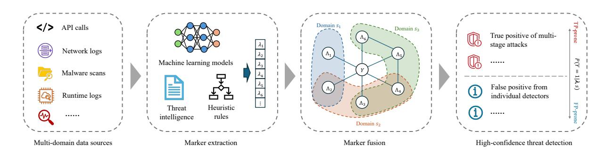
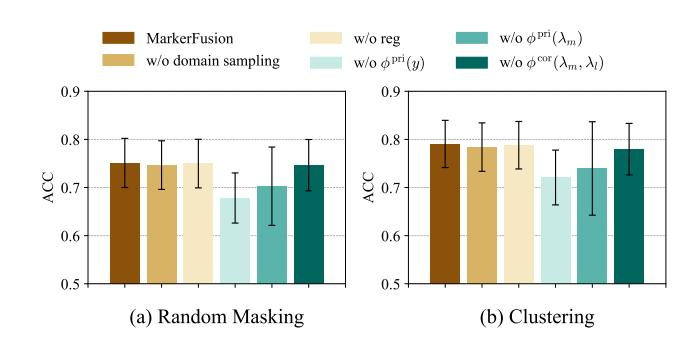
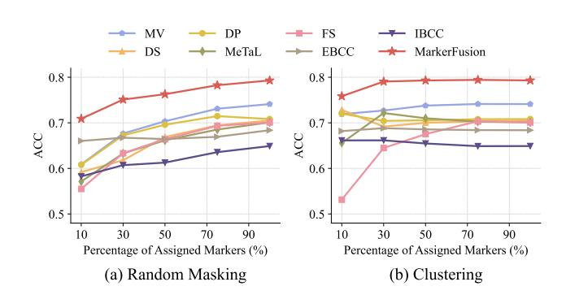
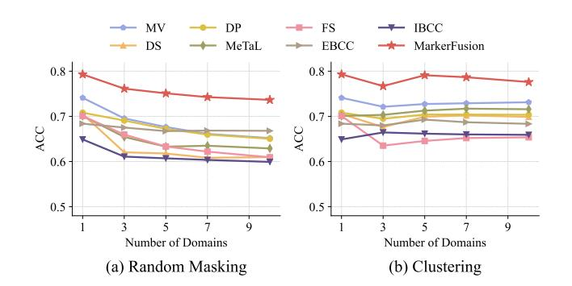
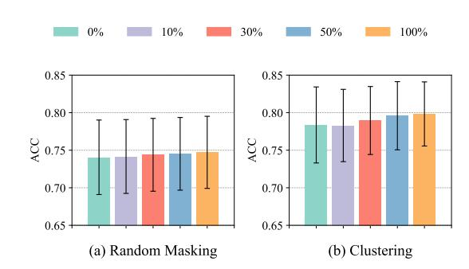
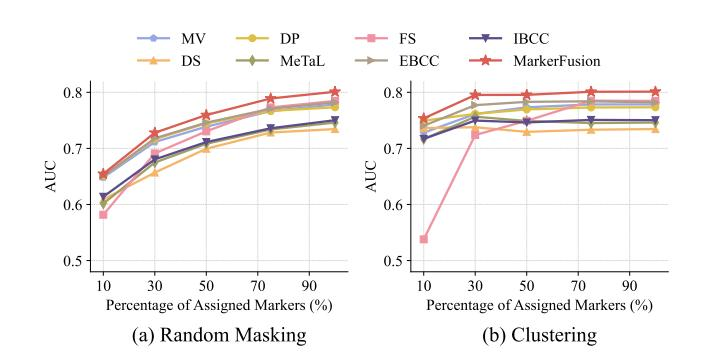
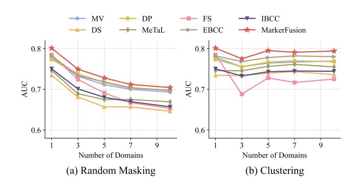

# Multi-Domain Marker Aggregation for Threat Detection in Cloud Environments

[Junshen Xu](https://orcid.org/0000-0002-0853-9866) Amazon Web Services Boston, Massachusetts, USA jsxu@amazon.com

[Jiayun Zhang](https://orcid.org/0000-0002-3562-5794) Amazon Web Services New York, New York, USA jiayunz@amazon.com

[Yi Fan](https://orcid.org/0009-0008-4132-1472) Amazon Web Services New York, New York, USA fnyi@amazon.com

### Abstract

Cloud computing environments present complex security challenges, generating vast volumes of heterogeneous telemetry data across interconnected services. Current threat detection systems typically operate in isolation for specific data domains, failing to capture the holistic view necessary for identifying sophisticated attacks that traverse different cloud resources. This paper addresses a fundamental challenge: how to effectively combine predictions from different threat detection methods applied to various data domains to provide comprehensive security assessments. We propose a novel framework, MarkerFusion, that conceptualizes individual detection components as markers with varying applicability across domains. Our approach models the conditional distribution of markers and latent labels using a Gibbs distribution and develops a learning algorithm that systematically combines information from multiple markers while enabling knowledge transfer across contexts. The framework naturally accommodates both unsupervised and semi-supervised settings, allowing domain experts to contribute partial labels when available. Extensive experiments on 15 public datasets and Amazon proprietary data demonstrate that our method outperforms seven established approaches, improving accuracy by 9.95% compared to the second-best baselines. The framework has been successfully deployed at global scale as part of Amazon GuardDuty, processing billions of security alerts monthly and generating high-confidence attack findings.

# CCS Concepts

• Security and privacy; • Applied computing; • Computing methodologies → Ensemble methods;

# Keywords

Threat detection; Cybersecurity; Machine Learning; Ensemble Learning; Marker Aggregation

### ACM Reference Format:

Junshen Xu, Jiayun Zhang, and Yi Fan. 2026. Multi-Domain Marker Aggregation for Threat Detection in Cloud Environments. In Proceedings of the ACM Web Conference 2026 (WWW '26), April 13–17, 2026, Dubai, United Arab Emirates. ACM, New York, NY, USA, [12](#page-11-0) pages. [https://doi.org/10.1145/](https://doi.org/10.1145/3774904.3792820) [3774904.3792820](https://doi.org/10.1145/3774904.3792820)

[This work is licensed under a Creative Commons Attribution-NonCommercial-](https://creativecommons.org/licenses/by-nc-nd/4.0)[NoDerivatives 4.0 International License.](https://creativecommons.org/licenses/by-nc-nd/4.0) WWW '26, Dubai, United Arab Emirates © 2026 Copyright held by the owner/author(s). ACM ISBN 979-8-4007-2307-0/2026/04 <https://doi.org/10.1145/3774904.3792820>

### 1 Introduction

The widespread adoption of cloud computing has fundamentally transformed the modern IT landscape, offering unprecedented scalability, flexibility, and cost-effectiveness [\[57\]](#page-9-0). However, this paradigm shift also introduced complex security challenges that traditional threat detection methods struggle to address effectively [\[41,](#page-8-0) [53\]](#page-9-1). As organizations increasingly migrate their critical infrastructure and sensitive data to cloud environments, the need for robust and intelligent threat detection systems has become paramount.

Cloud environments present distinct security considerations due to their inherently distributed and dynamic nature. Unlike traditional on-premises infrastructures, cloud platforms integrate multiple interconnected services and resources that generate rich, comprehensive telemetry data including API calls [\[8\]](#page-8-1), network traffic logs [\[20\]](#page-8-2), endpoint activities [\[23\]](#page-8-3), and application-specific metrics [\[2\]](#page-8-4). This multi-domain data landscape creates unique opportunities for holistic security monitoring, while requiring sophisticated approaches to address modern cyber threats with lateral movement techniques across resources [\[21\]](#page-8-5). The complexity of these attack chains makes it difficult to collect reliable ground truth labels for supervised learning approaches [\[10\]](#page-8-6), as the attack patterns may span multiple services and extend over prolonged time periods.

Current threat detection methods span a spectrum of techniques. Rule-based and expert systems leverage threat intelligence [\[9,](#page-8-7) [52\]](#page-9-2) to identify known attack patterns but struggle with novel threats. Machine learning models have been developed for specific security tasks, such as network traffic anomaly detection [\[65\]](#page-9-3), malware identification [\[35\]](#page-8-8), and runtime behavior analysis [\[25\]](#page-8-9). More recently, Large Language Models (LLMs) have been employed to review and interpret security events [\[3,](#page-8-10) [63\]](#page-9-4). Despite these advancements, a significant limitation persists: these specialized detection systems typically operate in isolation for specific data sources, failing to capture the holistic view necessary for detecting sophisticated multi-stage attacks that traverse different cloud resources and services, leading to false positives and alert fatigue. An emerging question is: when different threat detectors are applied to data from various domains, how can we effectively combine these predictions to provide a more comprehensive assessment of the security incident? This challenge is not unique to threat detection in cybersecurity. Similar problems arise in fields such as crowd-sourcing [\[62\]](#page-9-5), weak supervision [\[64\]](#page-9-6), and ensemble learning [\[31\]](#page-8-11), where information from multiple, noisy sources must be aggregated to form more accurate predictions.

To address this challenge, we propose a novel framework MarkerFusion, which conceptualizes individual threat detection components as markers, specialized indicators that provide security insights within their respective domains of applicability [\[51\]](#page-8-12). While

Figure 1: Threat detection in multi-domain data using MarkerFusion. A) Heterogeneous security telemetry and signals are collected from multiple data sources. B) Different detectors (e.g., model-based and rule-based) generate (potentially noisy) predictions, which are conceptualized as markers that provide security insight for different domains. C) MarkerFusion learns a probabilistic model to aggregate markers and infer the latent label. D) High-confidence threat detections are generated by leveraging collective intelligence from multiple markers.

each marker may exhibit inherent biases or limitations when operating independently, their collective intelligence can be leveraged to make more informed and accurate threat detection decisions. Our approach divides data into different domains, with markers being applicable to one or more domains, and adopts a probabilistic model to infer the underlying ground-truth label from the observed markers. Different markers operating within the same domain are systematically combined to provide enhanced predictions, while markers applicable to multiple domains allow the model to learn domain knowledge shared across contexts. The proposed framework is intentionally generic, enabling its application in diverse scenarios beyond threat detection in cloud environments. Figure [1](#page-1-0) illustrates a threat detection framework with MarkerFusion. The primary contributions of this work include:

- A novel probabilistic framework that conceptualizes individual threat detectors as markers with varying applicability across domains, enabling systematic combination of predictions from different detectors while respecting domain-specific constraints.
- A learning algorithm that models the distribution of markers and latent labels using a Gibbs distribution, allowing knowledge transfer across domains while naturally accommodating both unsupervised and semi-supervised settings.
- Comprehensive evaluation on 15 public datasets and Amazon proprietary data demonstrating significant improvements over established approaches, and successful deployment at global scale as part of Amazon GuardDuty.

### 2 Related Work

Learning from disagreement. Learning a consensus from datasets containing multiple judgments that potentially disagree is a fundamental challenge in machine learning with applications across numerous domains. Unsupervised ensemble learning focuses on combining predictions from multiple machine learning models to improve overall performance without access to ground truth labels [\[19,](#page-8-13) [31\]](#page-8-11). Similarly, crowdsourcing aims at integrating annotations from multiple, potentially unreliable human annotators to

approximate true labels [\[56,](#page-9-7) [62\]](#page-9-5). Extending these concepts, programmatic weak supervision (PWS) [\[64,](#page-9-6) [66\]](#page-9-8) generalizes the crowdsourcing paradigm by leveraging limited or imprecise sources as supervision signals to label large training datasets efficiently.

The Dawid-Skene model [\[17,](#page-8-14) [50\]](#page-8-15), one of the earliest approaches in crowdsourcing, introduced a generative framework using confusion matrices to model worker labels conditioned on the item's true annotation. This work has been extended in various directions, incorporating factors such as annotator reliability [\[46\]](#page-8-16), task difficulty [\[59\]](#page-9-9), and annotator-specific biases [\[29\]](#page-8-17). Further advancing these ideas, Bayesian model combination (BCC) [\[33\]](#page-8-18) was proposed, which uses Dirichlet priors with inference performed via Gibbs sampling. Jaffe et al. [\[31\]](#page-8-11) generalized the graphical model and incorporated a layer of hidden variables to model the dependencies of different classifiers. The enhanced Bayesian classifier combination (EBCC) [\[36\]](#page-8-19) captures worker correlation by modeling true classes as mixtures of subtypes and employing mean-field variational inference for estimation. In PWS, Snorkel [\[43,](#page-8-20) [45\]](#page-8-21) pioneered the use of labeling functions, imperfect heuristics that provide noisy labels, and modeled their dependencies to generate probabilistic training labels. Subsequent work has extended this approach with structure learning [\[7,](#page-8-22) [11,](#page-8-23) [58\]](#page-9-10) and multi-task settings [\[44\]](#page-8-24). Flyingsquid [\[22\]](#page-8-25) offers efficient solutions under certain assumptions of label function. Other works extend the framework to handle more generic label functions that are continuous [\[14\]](#page-8-26) or output partial labels [\[61\]](#page-9-11). Aggregation for threat detection. In cybersecurity, various approaches have been developed for aggregating predictions from multiple detection systems to produce more reliable assessments.

One fundamental approach involves extracting indicators of compromise from diverse threat intelligence sources and classifying an entity (e.g., file, webpage, or IP address) as malicious when it exceeds a predefined threshold �� of indicator matches [\[13,](#page-8-27) [55\]](#page-9-12). Building upon this concept, SIRAJ [\[54\]](#page-9-13) aggregates outputs from diverse scanners across multiple time points to generate comprehensive entity embeddings, which can then be leveraged in various downstream security tasks. Probabilistic methods offer another powerful approach to detector aggregation. In malware detection, Joyce et al. [\[32\]](#page-8-28) employ a variational Bayesian framework (IBCC)

and ���� (��) takes value in {0, 1}, which is used to select the potential functions/markers that are applicable to domain ��.

With this formulation, the data domain �� is completely described by the markers applicable to the domain. We map each domain �� ∈ S to an ��−dimensional binary vector��(��) with each element indicating if the corresponding marker is applicable to domain ��, i.e., ��(��) = [��1 (��), . . . , ���� (��)] ∈ {0, 1} �� . A potential function is applicable to domain �� if all markers it depends on are applicable to ��. Therefore, we define ���� (��) = Î ��∈M�� ���� (��), where M�� is the set of markers that the ��−th potential function depends on. Handling missing values. Even if a marker is applicable to a specific domain, it may not have a non-abstained value for every sample from that domain. For example, the marker value of a sample is not recorded. To handle potentially abstained markers, we set the output of potential function ���� = NA if any of the markers that it depends on is NA. The NA values are ignored when computing the average in line [10](#page-2-4) in Algorithm [1.](#page-2-3)

### 3.5 Inference

After training the model, given a sample with observed markers �� and domain ��, the predicted label that aggregates information from various markers can be inferred by��ˆ = arg max��∈Y ���� |Λ,�� (��|��, ��; ˆ�� ), i.e., the model acts as an ensemble classifier. In threat detection with �� being binary, we are also interested in giving a rank to each sample. For example, let �� be a latent variable indicating whether a real attack exists and we want to evaluate the risk of the event based on the weak labels. In particular, we can rank the samples by their posterior ���� |Λ,�� (1|��, ��; ˆ��). If only the rank of sample is needed, we could compute a score ��(��, ��; ˆ�� ) = ˆ�� T (�� (��, 1, ��) −�� (��, −1, ��)) which produces the same ranking as the posterior (Appendix [C\)](#page-10-0).

# 4 Experiments on Public Datasets

# 4.1 Experiment Setup

Public datasets. We use binary classification datasets from the WRENCH benchmark [\[66\]](#page-9-8) for evaluation. This benchmark provides both original data and markers generated by various methods including keyword matching, regular expressions, heuristic rules, pretrained models, etc. Table [1](#page-4-0) summarizes the datasets and their statistics. These datasets cover diverse domains and exhibit varying characteristics in terms of class imbalance and marker availability. They represent heterogeneous application scenarios in the real world, which enable us to evaluate our method's ability to handle security-specific tasks and its generalizability across applications. Simulation of multi-domain scenarios. The original datasets do not specify domain information for each sample. We employ two different ways to assign samples into |S| domains.

- Clustering: The marker occurrence patterns (i.e., whether a marker exists or abstains) capture inherent data characteristics. For example, some markers (e.g., suspicious SSL certificate configuration) are applicable only to specific protocols (HTTPS or Web traffic), so data from other protocols (e.g., FTP, DNS, SSH) will all abstain for this marker. We employ K-Modes clustering [\[28\]](#page-8-36) to group samples into |S| domains based on marker occurrence. For each domain, we select the top ��% markers with the highest coverage (non-abstain rate) and mask the remaining markers

Table 1: Dataset information after creating multi-domains through random masking and clustering.

| Dataset     |            | Task Classification | Ratio Class Positive | Markers Total | via Markers Domain Active Per | Random Coverage Domains Marker Across | Masking Coverage Domain Marker Within | via Markers Domain Active Per | Clustering Coverage Domains Marker Across | Coverage Domain Marker Within |
|-------------|------------|---------------------|----------------------|---------------|-------------------------------|---------------------------------------|---------------------------------------|-------------------------------|-------------------------------------------|-------------------------------|
| YouTube     | [4]        | spam                | 0.52                 | 10            | 4                             | 0.069                                 | 0.18                                  | 3                             | 0.12                                      | 0.49                          |
| Census      | [34]       | income              | 0.24                 | 83            | 40                            | 0.027                                 | 0.06                                  | 25                            | 0.05                                      | 0.19                          |
| SMS         | [5]        | spam                | 0.13                 | 73            | 25                            | 0.003                                 | 0.01                                  | 10                            | 0.01                                      | 0.47                          |
| IMDb        | [38]       | sentiment           | 0.50                 | 5             | 2                             | 0.049                                 | 0.07                                  | 2                             | 0.23                                      | 0.69                          |
| Yelp        | [47]       | sentiment           | 0.50                 | 8             | 3.6                           | 0.094                                 | 0.21                                  | 3                             | 0.16                                      | 0.50                          |
| Spouse      | [15]       | relation            | 0.01                 | 9             | 3.8                           | 0.017                                 | 0.04                                  | 3                             | 0.04                                      | 0.39                          |
| CDR         | [16]       | bio relation        | 0.36                 | 33            | 15.2                          | 0.024                                 | 0.05                                  | 10                            | 0.06                                      | 0.26                          |
| Commercial  | [22]       | image               | 0.29                 | 4             | 1.8                           | 0.197                                 | 0.46                                  | 2                             | 0.49                                      | 0.88                          |
| Tennis      | Rally [22] | image               | 0.40                 | 6             | 2.2                           | 0.274                                 | 0.70                                  | 2                             | 0.33                                      | 1.00                          |
| Basketball  | [26]       | image               | 0.11                 | 4             | 1.8                           | 0.292                                 | 0.62                                  | 1.8                           | 0.49                                      | 1.00                          |
| Bank        | Marketing  | [40] sales success  | 0.12                 | 20            | 8.4                           | 0.035                                 | 0.09                                  | 5.6                           | 0.08                                      | 0.42                          |
| Bioresponse | [24]       | bio response        | 0.54                 | 20            | 8.8                           | 0.067                                 | 0.15                                  | 6                             | 0.14                                      | 0.49                          |
| Mushroom    | [1]        | toxicity            | 0.49                 | 20            | 9.0                           | 0.090                                 | 0.20                                  | 6                             | 0.19                                      | 0.64                          |
| PhiUSIIL    | [42]       | phishing            | 0.56                 | 15            | 7.0                           | 0.086                                 | 0.18                                  | 5                             | 0.16                                      | 0.47                          |
| Spambase    | [27]       | spam                | 0.39                 | 15            | 6.4                           | 0.058                                 | 0.14                                  | 5                             | 0.14                                      | 0.43                          |

to abstain value. This creates domain-specific but overlapping marker sets.

- Random masking: We randomly assign samples to |S| domains, select ��% markers for each domain and mask the others as abstained. To ensure each marker is assigned to at least one domain, we first assign each marker to a primary domain. Then, for each domain, we select additional markers until reaching the target number of markers per domain. Finally, we randomly distribute all samples across the domains and mask markers that are not assigned to each sample's domain with the abstain value.

We set |S| = 5 and ��% = 30% in main experiments and examine the impact of different domain sizes and marker percentage in Section [4.4.](#page-6-0) As shown in Table [1,](#page-4-0) through clustering, the marker coverage within domains is much higher than the marker coverage across domains, which indicates that the clustering effectively groups samples with similar marker occurrence patterns. Through random masking, the marker coverage is generally lower than that through clustering, presenting more challenging tasks.

Baseline methods. We compare our approach against 7 established methods from crowdsourcing and programmatic weak supervision:

- Majority Voting (MV): A simple method that predicts labels based on the most frequent judgment among markers.
- Dawid-Skene (DS) [\[17\]](#page-8-14): A probabilistic model that assumes a naive Bayes structure over markers, using EM to estimate labels and the confusion matrix of each marker.
- Data Programming (DP) [\[43,](#page-8-20) [45\]](#page-8-21): A generative model that uses a factor graph to estimate marker accuracies and correlations by maximizing likelihood with Gibbs sampling, then aggregates markers to infer labels via posterior inference.
- MeTaL [\[44\]](#page-8-24): A generative model that extends DP by capturing dependencies among multiple related tasks and markers using a Markov network. It estimates parameters via matrix completion.
- FlyingSquid (FS) [\[22\]](#page-8-25): A binary Ising model that represents each marker with two variables for agreement and disagreement

Table 2: Experiment results on public datasets with multi-domain scenarios via clustering (top) and random masking (bottom). Experiments are conducted 5 times with a fixed set of seeds and results are averaged over 5 runs. MarkerFusion achieves the highest average accuracy, AUC, and the best mean ranking on both metrics.

| Dataset         | ACC   | MV AUC | ACC   | DS AUC | ACC   | DP AUC | ACC   | MeTaL AUC | ACC   | FS AUC | ACC   | EBCC AUC | ACC   | IBCC AUC | ACC          | MarkerFusion AUC |
|-----------------|-------|--------|-------|--------|-------|--------|-------|-----------|-------|--------|-------|----------|-------|----------|--------------|------------------|
| YouTube         | 0.768 | 0.791  | 0.748 | 0.862  | 0.760 | 0.800  | 0.708 | 0.796     | 0.760 | 0.784  | 0.572 | 0.831    | 0.528 | 0.786    | 0.748        | 0.869            |
| Census          | 0.791 | 0.700  | 0.424 | 0.672  | 0.773 | 0.753  | 0.706 | 0.737     | 0.774 | 0.797  | 0.764 | 0.795    | 0.764 | 0.770    | 0.805        | 0.844            |
| SMS             | 0.630 | 0.511  | 0.838 | 0.506  | 0.630 | 0.513  | 0.616 | 0.514     | 0.500 | 0.507  | 0.844 | 0.514    | 0.866 | 0.519    | 0.844        | 0.521            |
| IMDb            | 0.707 | 0.751  | 0.566 | 0.727  | 0.710 | 0.762  | 0.702 | 0.740     | 0.709 | 0.760  | 0.712 | 0.764    | 0.712 | 0.763    | 0.706        | 0.765            |
| Yelp Clustering | 0.688 | 0.746  | 0.676 | 0.725  | 0.679 | 0.763  | 0.548 | 0.695     | 0.688 | 0.767  | 0.652 | 0.781    | 0.620 | 0.769    | 0.659        | 0.785            |
| Spouse          | 0.524 | 0.767  | 0.184 | 0.474  | 0.534 | 0.761  | 0.542 | 0.744     | 0.514 | 0.781  | 0.187 | 0.781    | 0.127 | 0.785    | 0.887        | 0.772            |
| CDR             | 0.692 | 0.794  | 0.420 | 0.726  | 0.642 | 0.619  | 0.639 | 0.628     | 0.699 | 0.780  | 0.688 | 0.712    | 0.676 | 0.534    | 0.768        | 0.792            |
| Commercial      | 0.873 | 0.953  | 0.916 | 0.916  | 0.821 | 0.954  | 0.908 | 0.958     | 0.505 | 0.623  | 0.821 | 0.954    | 0.824 | 0.954    | 0.916        | 0.960            |
| Tennis Rally    | 0.807 | 0.869  | 0.864 | 0.871  | 0.832 | 0.867  | 0.864 | 0.871     | 0.487 | 0.500  | 0.864 | 0.867    | 0.864 | 0.871    | 0.864        | 0.867            |
| Basketball      | 0.698 | 0.529  | 0.857 | 0.529  | 0.549 | 0.527  | 0.899 | 0.529     | 0.468 | 0.471  | 0.859 | 0.527    | 0.886 | 0.527    | 0.860        | 0.530            |
| Bank Marketing  | 0.728 | 0.814  | 0.848 | 0.805  | 0.826 | 0.825  | 0.809 | 0.827     | 0.685 | 0.780  | 0.895 | 0.834    | 0.889 | 0.833    | 0.817        | 0.842            |
| Bioresponse     | 0.620 | 0.667  | 0.641 | 0.714  | 0.529 | 0.670  | 0.540 | 0.699     | 0.540 | 0.685  | 0.521 | 0.695    | 0.521 | 0.674    | 0.617        | 0.709            |
| Mushroom        | 0.864 | 0.964  | 0.860 | 0.871  | 0.862 | 0.949  | 0.871 | 0.934     | 0.860 | 0.928  | 0.770 | 0.926    | 0.471 | 0.895    | 0.870        | 0.928            |
| PhiUSIIL        | 0.767 | 0.837  | 0.779 | 0.773  | 0.704 | 0.817  | 0.759 | 0.786     | 0.748 | 0.824  | 0.570 | 0.803    | 0.570 | 0.693    | 0.794        | 0.846            |
| Spambase        | 0.748 | 0.728  | 0.755 | 0.896  | 0.712 | 0.842  | 0.712 | 0.891     | 0.735 | 0.873  | 0.605 | 0.874    | 0.605 | 0.871    | 0.703        | 0.900            |
| Average         | 0.727 | 0.761  | 0.692 | 0.738  | 0.704 | 0.762  | 0.721 | 0.756     | 0.645 | 0.724  | 0.688 | 0.777    | 0.662 | 0.750    | 0.791        | 0.795            |
| Mean Rank       | 3.7   | 5.1    | 4.1   | 5.3    | 4.6   | 4.9    | 4.5   | 4.5       | 5.0   | 5.5    | 4.7   | 3.6      | 4.9   | 4.5      | 2.8          | 1.8              |
| Dataset         |       | MV     |       | DS     |       | DP     | MeTaL |           |       | FS     | EBCC  |          | IBCC  |          | MarkerFusion |                  |
|                 | ACC   | AUC    | ACC   | AUC    | ACC   | AUC    | ACC   | AUC       | ACC   | AUC    | ACC   | AUC      | ACC   | AUC      | ACC          | AUC              |
| YouTube         | 0.711 | 0.773  | 0.676 | 0.749  | 0.679 | 0.753  | 0.613 | 0.646     | 0.618 | 0.693  | 0.655 | 0.782    | 0.517 | 0.753    | 0.705        | 0.784            |
| Census          | 0.777 | 0.703  | 0.570 | 0.720  | 0.773 | 0.756  | 0.670 | 0.692     | 0.773 | 0.759  | 0.764 | 0.779    | 0.764 | 0.738    | 0.791        | 0.806            |
| SMS             | 0.584 | 0.515  | 0.851 | 0.509  | 0.584 | 0.516  | 0.570 | 0.503     | 0.495 | 0.499  | 0.855 | 0.515    | 0.866 | 0.517    | 0.855        | 0.516            |
| IMDb Masking    | 0.610 | 0.663  | 0.507 | 0.540  | 0.610 | 0.665  | 0.608 | 0.660     | 0.583 | 0.646  | 0.608 | 0.667    | 0.550 | 0.656    | 0.609        | 0.666            |
| Yelp            | 0.633 | 0.692  | 0.563 | 0.601  | 0.633 | 0.694  | 0.614 | 0.678     | 0.637 | 0.702  | 0.616 | 0.709    | 0.561 | 0.694    | 0.643        | 0.698            |
| Spouse          | 0.496 | 0.646  | 0.586 | 0.624  | 0.496 | 0.648  | 0.493 | 0.599     | 0.491 | 0.635  | 0.277 | 0.646    | 0.081 | 0.645    | 0.897        | 0.643            |
| CDR Random      | 0.624 | 0.682  | 0.502 | 0.639  | 0.622 | 0.689  | 0.523 | 0.585     | 0.623 | 0.685  | 0.642 | 0.661    | 0.676 | 0.527    | 0.680        | 0.699            |
| Commercial      | 0.798 | 0.870  | 0.591 | 0.674  | 0.791 | 0.873  | 0.723 | 0.822     | 0.662 | 0.703  | 0.781 | 0.872    | 0.776 | 0.868    | 0.829        | 0.883            |
| Tennis Rally    | 0.808 | 0.842  | 0.707 | 0.714  | 0.807 | 0.851  | 0.759 | 0.820     | 0.741 | 0.787  | 0.827 | 0.852    | 0.816 | 0.852    | 0.829        | 0.856            |
| Basketball      | 0.643 | 0.515  | 0.643 | 0.503  | 0.632 | 0.511  | 0.649 | 0.506     | 0.468 | 0.500  | 0.746 | 0.513    | 0.788 | 0.519    | 0.782        | 0.513            |
| Bank Marketing  | 0.641 | 0.758  | 0.385 | 0.732  | 0.659 | 0.761  | 0.653 | 0.732     | 0.630 | 0.756  | 0.862 | 0.770    | 0.578 | 0.706    | 0.813        | 0.772            |
| Bioresponse     | 0.586 | 0.618  | 0.568 | 0.599  | 0.564 | 0.616  | 0.535 | 0.576     | 0.563 | 0.616  | 0.520 | 0.606    | 0.521 | 0.575    | 0.604        | 0.646            |
| Mushroom        | 0.811 | 0.894  | 0.797 | 0.855  | 0.810 | 0.890  | 0.766 | 0.859     | 0.811 | 0.889  | 0.660 | 0.873    | 0.494 | 0.786    | 0.807        | 0.897            |
| PhiUSIIL        | 0.721 | 0.776  | 0.681 | 0.685  | 0.721 | 0.784  | 0.632 | 0.709     | 0.712 | 0.773  | 0.587 | 0.753    | 0.514 | 0.665    | 0.731        | 0.780            |
| Spambase        | 0.702 | 0.726  | 0.643 | 0.709  | 0.707 | 0.741  | 0.687 | 0.735     | 0.692 | 0.723  | 0.609 | 0.773    | 0.605 | 0.705    | 0.690        | 0.761            |
| Average         | 0.676 | 0.711  | 0.618 | 0.657  | 0.672 | 0.717  | 0.633 | 0.675     | 0.633 | 0.691  | 0.667 | 0.718    | 0.607 | 0.680    | 0.751        | 0.728            |
| Mean Rank       | 2.8   | 3.9    | 6.0   | 6.9    | 3.7   | 2.9    | 5.8   | 6.5       | 5.3   | 5.4    | 4.7   | 2.9      | 5.7   | 5.5      | 1.8          | 1.9              |

with true label. It estimates parameters using the Triplet Method, and infers labels through posterior inference.

- IBCC [\[33,](#page-8-18) [49\]](#page-8-50): A Bayesian generative model that builds on DS by placing priors over each marker's confusion matrix, assuming conditional independence given the label. It uses Bayesian inference to jointly estimate label posteriors and marker reliabilities.
- EBCC [\[36\]](#page-8-19): An extension of IBCC that captures marker correlation by partitioning a class into latent subtypes to share reliability patterns across markers.

Hyperparameter configuration. The learning rate �� is set to 0.001. The number of iterations �� is 500 and the number of samples in Gibbs sampling �� is 104 . L1 regularization is applied to the potential function �� cor(����, ���� ) and its coefficient �� is 0.01. Evaluation metrics. Due to data imbalance, we adopt two standard classification metrics, Area Under the Curve (AUC) and accuracy, to evaluate performance. AUC provides a threshold-independent measure of classification performance, while accuracy offers an intuitive measure of overall correctness.

# 4.2 Experiment Results

Table [2](#page-5-0) presents the experiment results. MarkerFusion achieves the highest average accuracy and AUC, with the best mean ranking on both metrics. Specifically, it improves upon the second-best methods by 11.1% in accuracy and 1.4% in AUC with domains created by random masking, and by 8.8% in accuracy and 2.3% in AUC with clustering-based domains. Random masking-based multiple domains present more challenging tasks compared to clusteringbased multi-domains, with all methods showing overall lower accuracies and AUC. This is expected, as clustering-based approaches account for the inherent marker occurrence patterns and yield

Figure 2: Ablation studies of key components. Scores are averaged across datasets with 95% confidence interval.

Figure 3: Accuracies w.r.t. percentage of assigned markers.

higher marker coverage rates after simulation. For completeness, we present the results for single-domain scenarios in Table [7](#page-11-1) (Appendix [D\)](#page-10-1). MarkerFusion maintains its superior performance.

We note that it is a common phenomenon in established benchmarks [\[36,](#page-8-19) [66\]](#page-9-8) that no single method can consistently outperform all others on every individual dataset, as different datasets underlie distinct distributions of data and latent variables. The compared methods, being unsupervised, make specific distributional assumptions that may align better with some datasets than others, leading to performance variations.

## 4.3 Ablation Study

To analyze the contribution of each component in our method, we conduct ablation experiments with five variants of MarkerFusion: (1) without domain sampling (denoted as w/o domain sampling), (2) without L1 regularization (denoted as w/o reg), (3) without the potential function for latent variable prior (denoted as w/o �� pri(��)), (4) without the potential function for marker prior (denoted as w/o �� pri(����)), and (5) without the potential function for marker correlation (denoted as w/o �� cor(����, ���� )).

Figure [2](#page-6-1) demonstrates that removing any component leads to performance degradation. This validates the effectiveness of our design choices. The removal of potential functions results in particularly significant accuracy drops. Besides the essential potential function �� (����, ��) that models marker accuracy, the learned priors for both the latent variable and markers show noticeable impact.

Figure 4: Accuracies w.r.t. number of domains.

### 4.4 Sensitivity Analyses

Percentage of assigned markers. We examine the effect of varying the percentage of markers per domain from {10%, 30%, 50%, 100%} while keeping the number of domains fixed at 5. Figure [3](#page-6-2) shows the average accuracies across datasets. MarkerFusion always performs the best among all compared methods under different configurations. As expected, increasing the percentage of assigned markers per domain enhances prediction performance due to more comprehensive judgments from diverse sources. The AUC results in Figure [6](#page-10-2) (Appendix [D\)](#page-10-1) show a consistent trend.

Number of domains. We change the number of domains from {1, 3, 5, 10} while maintaining the percentage of markers per domain at 30%. Figure [4](#page-6-3) shows the average accuracies across datasets. MarkerFusion achieves the best performance under all configurations. For random masking, performance decreases with more domains since each domain contains fewer samples. For clustering-based domains, there is no clear trend due to the mixed effects of increasing domains: (1) more fine-grained clusters yield higher intra-domain marker coherence, potentially improving domain-specific modeling; (2) smaller sample size per domain and reduced correlated markers across domains limit cross-domain knowledge sharing. The AUC results in Figure [7](#page-11-2) (Appendix [D\)](#page-10-1) show similar patterns.

# 4.5 Performance with Semi-Supervision

We evaluate MarkerFusion under different levels of supervision by varying the ratio of labeled samples from 0% (fully unsupervised) to 100% (fully supervised). We exclude the Spouse dataset from this analysis as it does not provide training labels. Figure [5](#page-7-0) presents the accuracy across different supervision levels. Giving more labeled samples during training leads to improved accuracy and reduced variance (tighter 95% confidence intervals). The performance gains are moderate, suggesting that MarkerFusion can achieve robust performance even with little or no supervision.

# 5 Deployment and Impact

# 5.1 Deployment

MarkerFusion has been successfully deployed at global scale as a new detection capability of Amazon GuardDuty since December 2024. The deployment architecture consists of two primary components: a training pipeline and an inference pipeline, both designed

Figure 5: MarkerFusion with different ratios of labels.

Table 3: Summary of production datasets in four regions (AP: Asia Pacific, EU: Europe, US: United States).

| Region  | Collection | Period        | # Train   | # Test  |
|---------|------------|---------------|-----------|---------|
| AP      | Jul. 11    | Aug. 12, 2025 | 2,338,092 | 240,557 |
| EU      | Jun. 30    | Aug. 1, 2025  | 1,722,882 | 191,082 |
| US West | Jun. 28    | Jul. 30, 2025 | 3,664,544 | 437,600 |
| US East | Apr. 10    | May 12, 2025  | 1,268,358 | 80,904  |

for scalability, reliability, and continuous operation in cloud environments. The training pipeline leverages Amazon SageMaker to orchestrate model training and validation jobs. We implemented the data processing and model inference components as streaming applications using Apache Spark, deployed on Amazon Elastic MapReduce (EMR) clusters. This architecture enables near realtime threat detection while efficiently handling heterogeneous and high-volume data in the cloud environment. The system processes billions of alerts monthly from various AWS data sources and generates accurate attack findings that detect complex multi-stage attacks, which is a new extended capability of the detection system.

### 5.2 Performance on Production Data

Data collection. We assess model performance using data collected from four regions across continental zones, Asia Pacific (AP), Europe (EU), United States West and East. The statistics of the four datasets are listed in Table [3.](#page-7-1) The dataset consists of 4 domains. Each dataset spans approximately one month of collection with chronological training and testing splits to preserve temporal order. Evaluation metrics. To evaluate whether the model aligns with insights from security experts, we utilize high-confidence attack patterns defined by internal security researchers as labels. Although these predefined patterns may introduce some noise into the evaluation process, they provide a scalable and reliable proxy for assessing model performance. Using these patterns as labels, we measure the AUC of pattern detection rates across two distinct datasets: external accounts experiencing real-world conditions, and internal accounts specifically configured for penetration testing that contain known attack behaviors. This allows us to assess the model's effectiveness in both production environments and controlled attack scenarios. Experiment results. Table [4](#page-7-2) presents the experiment results on our production data. MarkerFusion outperforms all compared

Table 4: AUC scores on collected production data.

| Region  | Scope    | MV    | DS    | DP    | MeTaL | FS    | EBCC  | IBCC  | MarkerFusion |
|---------|----------|-------|-------|-------|-------|-------|-------|-------|--------------|
| AP      | Internal | 0.895 | 0.503 | 0.908 | 0.504 | 0.874 | 0.610 | 0.901 | 0.917        |
|         | All      | 0.990 | 0.925 | 0.981 | 0.953 | 0.091 | 0.988 | 0.128 | 0.998        |
| EU      | Internal | 0.895 | 0.502 | 0.890 | 0.504 | 0.865 | 0.719 | 0.847 | 0.901        |
|         | All      | 0.972 | 0.868 | 0.954 | 0.893 | 0.207 | 0.982 | 0.105 | 0.985        |
| US East |          |       |       |       |       |       |       |       |              |
|         | Internal | 0.919 | 0.541 | 0.933 | 0.541 | 0.817 | 0.759 | 0.806 | 0.935        |
|         | All      | 0.987 | 0.944 | 0.979 | 0.958 | 0.070 | 0.975 | 0.150 | 0.997        |
| US West |          |       |       |       |       |       |       |       |              |
|         | Internal | 0.859 | 0.996 | 0.723 | 0.997 | 0.858 | 0.722 | 0.858 | 0.997        |
|         | All      | 0.745 | 0.775 | 0.757 | 0.776 | 0.666 | 0.666 | 0.706 | 0.922        |

Table 5: Attack pattern hit rate of MarkerFusion with different number of labels in two data domains (US East).

| Domain | 0     | 20    | 60    | 100   | 200   |
|--------|-------|-------|-------|-------|-------|
| A      | 0.788 | 0.788 | 0.804 | 0.804 | 0.946 |
| B      | 0.998 | 0.998 | 0.998 | 0.998 | 0.998 |

methods across the four regions. It shows superior AUC on internal accounts and all accounts. Notably, MarkerFusion maintains robust performance across regions, while some baselines (e.g., FS, IBCC) show significant degradation in certain regions. The results above are purely unsupervised. Table [5](#page-7-3) shows semi-supervised performance with MarkerFusion on two different data domains with the most data samples in the US East region, which provides sufficient labeled samples for training and evaluation. Domain A shows significant improvement from 0.788 to 0.946 with 200 labeled samples, demonstrating the effectiveness of incorporating supervision. Domain B maintains consistently high performance at 0.998, indicating that the unsupervised version already captures the underlying threat patterns effectively for this domain.

### 6 Conclusions

We present a novel probabilistic framework for aggregating predictions from multiple threat detectors across different cloud data domains. By conceptualizing individual detectors as markers with varying domain applicability, our approach effectively combines knowledge across different contexts. The framework naturally handles both unsupervised and semi-supervised settings through a principled Gibbs distribution model, allowing domain experts to contribute partial labels when available. Extensive experiments on multiple public datasets demonstrate that our method significantly outperforms established approaches in both multi-domain and single-domain scenarios. The framework's effectiveness is further validated through successful deployment at global scale as part of Amazon GuardDuty, where it processes billions of alerts monthly and identifies high-confidence attacks that would otherwise remain hidden. Our results demonstrate substantial improvements in detection accuracy for multi-stage attacks in cloud environments.

# Acknowledgments

We thank the support of many people from Amazon GuardDuty team, in particular Aldrin Dsouza, Lucas Winkelmann, Jeffery Bickford, and Baris Coskun.

### References

[1] 1981. Mushroom. UCI Machine Learning Repository. DOI: https://doi.org/10.24432/C5959T. [2] Bikash Agrawal, Tomasz Wiktorski, and Chunming Rong. 2017. Adaptive realtime anomaly detection in cloud infrastructures. Concurrency and Computation: Practice and Experience 29, 24 (2017), e4193. [3] Siraaj Akhtar, Saad Khan, and Simon Parkinson. 2025. LLM-based event log analysis techniques: A survey. arXiv preprint arXiv:2502.00677 (2025). [4] Túlio C Alberto, Johannes V Lochter, and Tiago A Almeida. 2015. Tubespam: Comment spam filtering on youtube. In 2015 IEEE 14th international conference on machine learning and applications (ICMLA). IEEE, 138–143. [5] Tiago A Almeida, José María G Hidalgo, and Akebo Yamakami. 2011. Contributions to the study of SMS spam filtering: new collection and results. In Proceedings of the 11th ACM symposium on Document engineering. 259–262. [6] K Arivarasan and Mohammad S Obaidat. 2022. Intrusion Detection System using Aggregation of Machine Learning Algorithms. In 2022 International Conference on Computer, Information and Telecommunication Systems (CITS). IEEE, 1–8. [7] Stephen H Bach, Bryan He, Alexander Ratner, and Christopher Ré. 2017. Learning the structure of generative models without labeled data. In International Conference on Machine Learning. PMLR, 273–282. [8] Jay Barach. 2025. AI-Driven Causal Inference for Cross-Cloud Threat Detection Using Anonymized CloudTrail Logs. In 2025 Conference on Artificial Intelligence x Multimedia (AIxMM). IEEE, 45–50. [9] Sean Barnum. 2012. Standardizing cyber threat intelligence information with the structured threat information expression (stix). Mitre Corporation 11, 2012 (2012), 1–22. [10] Tobias Braun, Irdin Pekaric, and Giovanni Apruzzese. 2024. Understanding the process of data labeling in cybersecurity. In Proceedings of the 39th ACM/SIGAPP Symposium on Applied Computing. 1596–1605. [11] Salva Rühling Cachay, Benedikt Boecking, and Artur Dubrawski. 2021. Dependency structure misspecification in multi-source weak supervision models. arXiv preprint arXiv:2106.10302 (2021). [12] George Casella and Edward I George. 1992. Explaining the Gibbs sampler. The American Statistician 46, 3 (1992), 167–174. [13] Onur Catakoglu, Marco Balduzzi, and Davide Balzarotti. 2016. Automatic extraction of indicators of compromise for web applications. In Proceedings of the 25th international conference on world wide web. 333–343. [14] Oishik Chatterjee, Ganesh Ramakrishnan, and Sunita Sarawagi. 2020. Robust data programming with precision-guided labeling functions. In Proceedings of the AAAI Conference on Artificial Intelligence, Vol. 34. 3397–3404. [15] David PA Corney, Dyaa Albakour, Miguel Martinez-Alvarez, and Samir Moussa. 2016. What do a million news articles look like?. In NewsIR@ ECIR. 42–47. [16] Allan Peter Davis, Cynthia J Grondin, Robin J Johnson, Daniela Sciaky, Benjamin L King, Roy McMorran, Jolene Wiegers, Thomas C Wiegers, and Carolyn J Mattingly. 2017. The comparative toxicogenomics database: update 2017. Nucleic acids research 45, D1 (2017), D972–D978. [17] Alexander Philip Dawid and Allan M Skene. 1979. Maximum likelihood estimation of observer error-rates using the EM algorithm. Journal of the Royal Statistical Society: Series C (Applied Statistics) 28, 1 (1979), 20–28. [18] Arthur P Dempster, Nan M Laird, and Donald B Rubin. 1977. Maximum likelihood from incomplete data via the EM algorithm. Journal of the royal statistical society: series B (methodological) 39, 1 (1977), 1–22. [19] Thomas G Dietterich. 2000. Ensemble methods in machine learning. In International workshop on multiple classifier systems. Springer, 1–15. [20] Marius Dragoi, Elena Burceanu, Emanuela Haller, Andrei Manolache, and Florin Brad. 2022. Anoshift: A distribution shift benchmark for unsupervised anomaly detection. Advances in Neural Information Processing Systems 35 (2022), 32854– 32867. [21] Daniel Fraunholz, Daniel Schneider, Janis Zemitis, and Hans Dieter Schotten. 2018. Hack my company: An empirical assessment of post-exploitation behavior and lateral movement in cloud environments. In Proceedings of the central European cybersecurity conference 2018. 1–6. [22] Daniel Fu, Mayee Chen, Frederic Sala, Sarah Hooper, Kayvon Fatahalian, and Christopher Ré. 2020. Fast and three-rious: Speeding up weak supervision with triplet methods. In International conference on machine learning. PMLR, 3280– 3291. [23] Dr A SHAJI GEORGE, AS Hovan George, Thangaraj Baskar, and Digvijay Pandey. 2021. XDR: the evolution of endpoint security solutions-superior extensibility and analytics to satisfy the organizational needs of the future. International Journal of Advanced Research in Science, Communication and Technology (IJARSCT) 8, 1 (2021), 493–501. [24] Ben Hamner, David C Thompson, and Joerg Bentzien. 2012. Predicting a biological response. Kaggle competition. [https://www.kaggle.com/competitions/](https://www.kaggle.com/competitions/bioresponse) [bioresponse](https://www.kaggle.com/competitions/bioresponse) [25] Xueyuan Han, Thomas Pasquier, Adam Bates, James Mickens, and Margo Seltzer. 2020. Unicorn: Runtime provenance-based detector for advanced persistent threats. arXiv preprint arXiv:2001.01525 (2020). [26] FC Heilbron, V Escorcia, B Ghanem, and J Niebles. 2019. A largescale video benchmark for human activity understanding. In Proceedings of the IEEE Conference on Computer Vision and Pattern Recognition, Boston, 2015. 961, Vol. 970. [27] Mark Hopkins, Erik Reeber, George Forman, and Jaap Suermondt. 1999. Spambase. UCI Machine Learning Repository. DOI: https://doi.org/10.24432/C53G6X. [28] Zhexue Huang et al. 1997. Clustering large data sets with mixed numeric and categorical values. In Proceedings of the 1st pacific-asia conference on knowledge discovery and data mining,(PAKDD). Citeseer, 21–34. [29] Panagiotis G Ipeirotis, Foster Provost, and Jing Wang. 2010. Quality management on amazon mechanical turk. In Proceedings of the ACM SIGKDD workshop on human computation. 64–67. [30] Hanan Ghali Jabbar. 2024. Advanced threat detection using soft and hard voting techniques in ensemble learning. Journal of Robotics and Control (JRC) 5, 4 (2024), 1104–1116. [31] Ariel Jaffe, Ethan Fetaya, Boaz Nadler, Tingting Jiang, and Yuval Kluger. 2016. Unsupervised ensemble learning with dependent classifiers. In Artificial Intelligence and Statistics. PMLR, 351–360. [32] Robert J Joyce, Derek Everett, Maya Fuchs, Edward Raff, and James Holt. 2025. Claravy: A tool for scalable and accurate malware family labeling. In Companion Proceedings of the ACM on Web Conference 2025. 277–286. [33] Hyun-Chul Kim and Zoubin Ghahramani. 2012. Bayesian classifier combination. In Artificial Intelligence and Statistics. PMLR, 619–627. [34] Ron Kohavi et al. 1996. Scaling up the accuracy of naive-bayes classifiers: A decision-tree hybrid.. In Kdd, Vol. 96. 202–207. [35] Heng Li, Shiyao Zhou, Wei Yuan, Xiapu Luo, Cuiying Gao, and Shuiyan Chen. 2021. Robust android malware detection against adversarial example attacks. In Proceedings of the Web Conference 2021. 3603–3612. [36] Yuan Li, Benjamin Rubinstein, and Trevor Cohn. 2019. Exploiting worker correlation for label aggregation in crowdsourcing. In International conference on machine learning. PMLR, 3886–3895. [37] Po-Ling Loh and Martin J Wainwright. 2012. Structure estimation for discrete graphical models: Generalized covariance matrices and their inverses. Advances in Neural Information Processing Systems 25 (2012). [38] Andrew Maas, Raymond E Daly, Peter T Pham, Dan Huang, Andrew Y Ng, and Christopher Potts. 2011. Learning word vectors for sentiment analysis. In Proceedings of the 49th annual meeting of the association for computational linguistics: Human language technologies. 142–150. [39] Simon Miller, Christian Wagner, Uwe Aickelin, and Jonathan M Garibaldi. 2016. Modelling cyber-security experts' decision making processes using aggregation operators. computers & security 62 (2016), 229–245. [40] Sérgio Moro, Paulo Cortez, and Paulo Rita. 2014. A data-driven approach to predict the success of bank telemarketing. Decision Support Systems 62 (2014), 22–31. [41] Ali Bou Nassif, Manar Abu Talib, Qassim Nasir, Halah Albadani, and Fatima Mohamad Dakalbab. 2021. Machine learning for cloud security: a systematic review. IEEE Access 9 (2021), 20717–20735. [42] Arvind Prasad and Shalini Chandra. 2024. PhiUSIIL: A diverse security profile empowered phishing URL detection framework based on similarity index and incremental learning. Computers & Security 136 (2024), 103545. [43] Alexander Ratner, Stephen H Bach, Henry Ehrenberg, Jason Fries, Sen Wu, and Christopher Ré. 2017. Snorkel: Rapid training data creation with weak supervision. In Proceedings of the VLDB endowment. International conference on very large data bases, Vol. 11. 269. [44] Alexander Ratner, Braden Hancock, Jared Dunnmon, Frederic Sala, Shreyash Pandey, and Christopher Ré. 2019. Training complex models with multi-task weak supervision. In Proceedings of the AAAI conference on artificial intelligence, Vol. 33. 4763–4771. [45] Alexander J Ratner, Christopher M De Sa, Sen Wu, Daniel Selsam, and Christopher Ré. 2016. Data programming: Creating large training sets, quickly. Advances in neural information processing systems 29 (2016). [46] Vikas C Raykar, Shipeng Yu, Linda H Zhao, Gerardo Hermosillo Valadez, Charles Florin, Luca Bogoni, and Linda Moy. 2010. Learning from crowds. Journal of machine learning research 11, 4 (2010). [47] Wendi Ren, Yinghao Li, Hanting Su, David Kartchner, Cassie Mitchell, and Chao Zhang. 2020. Denoising multi-source weak supervision for neural text classification. arXiv preprint arXiv:2010.04582 (2020). [48] Mir Shahnawaz Ahmad and Shahid Mehraj Shah. 2022. Unsupervised ensemble based deep learning approach for attack detection in IoT network. Concurrency and Computation: Practice and Experience 34, 27 (2022), e7338. [49] Edwin Simpson, Stephen Roberts, Ioannis Psorakis, and Arfon Smith. 2013. Dynamic bayesian combination of multiple imperfect classifiers. In Decision making and imperfection. Springer, 1–35. [50] Padhraic Smyth, Usama Fayyad, Michael Burl, Pietro Perona, and Pierre Baldi. 1994. Inferring ground truth from subjective labelling of venus images. Advances in neural information processing systems 7 (1994). [51] Bhavna Soman, Ali Torkamani, Michael J Morais, Jeffrey Bickford, and Baris Coskun. 2022. Firenze: Model evaluation using weak signals. arXiv preprint arXiv:2207.00827 (2022).

Table 7: Experiment results on public datasets with single-domain scenarios

| Dataset        | ACC   | MV AUC | ACC   | DS AUC | ACC   | DP AUC | ACC   | MeTaL AUC | ACC   | FS AUC | ACC   | EBCC AUC | ACC   | IBCC AUC | ACC   | MarkerFusion AUC |
|----------------|-------|--------|-------|--------|-------|--------|-------|-----------|-------|--------|-------|----------|-------|----------|-------|------------------|
| YouTube        | 0.840 | 0.905  | 0.848 | 0.892  | 0.776 | 0.884  | 0.544 | 0.668     | 0.788 | 0.866  | 0.528 | 0.836    | 0.528 | 0.766    | 0.816 | 0.927            |
| Census         | 0.799 | 0.734  | 0.480 | 0.692  | 0.776 | 0.775  | 0.696 | 0.737     | 0.779 | 0.822  | 0.764 | 0.835    | 0.764 | 0.793    | 0.814 | 0.863            |
| SMS            | 0.632 | 0.521  | 0.836 | 0.500  | 0.630 | 0.520  | 0.612 | 0.508     | 0.500 | 0.507  | 0.844 | 0.524    | 0.864 | 0.519    | 0.844 | 0.519            |
| IMDb           | 0.710 | 0.752  | 0.712 | 0.764  | 0.710 | 0.763  | 0.704 | 0.736     | 0.703 | 0.758  | 0.714 | 0.765    | 0.548 | 0.763    | 0.709 | 0.766            |
| Yelp           | 0.702 | 0.766  | 0.715 | 0.794  | 0.694 | 0.780  | 0.553 | 0.720     | 0.715 | 0.807  | 0.653 | 0.804    | 0.634 | 0.791    | 0.715 | 0.800            |
| Spouse         | 0.521 | 0.767  | 0.187 | 0.281  | 0.529 | 0.763  | 0.521 | 0.752     | 0.518 | 0.779  | 0.186 | 0.775    | 0.081 | 0.786    | 0.884 | 0.754            |
| CDR            | 0.694 | 0.787  | 0.396 | 0.665  | 0.644 | 0.611  | 0.641 | 0.640     | 0.708 | 0.778  | 0.682 | 0.690    | 0.676 | 0.539    | 0.643 | 0.798            |
| Commercial     | 0.902 | 0.963  | 0.892 | 0.968  | 0.821 | 0.968  | 0.906 | 0.966     | 0.869 | 0.966  | 0.821 | 0.967    | 0.824 | 0.967    | 0.925 | 0.974            |
| Tennis Rally   | 0.862 | 0.882  | 0.857 | 0.876  | 0.881 | 0.884  | 0.859 | 0.886     | 0.853 | 0.885  | 0.875 | 0.884    | 0.874 | 0.884    | 0.861 | 0.885            |
| Basketball     | 0.698 | 0.529  | 0.857 | 0.529  | 0.549 | 0.527  | 0.899 | 0.529     | 0.468 | 0.500  | 0.859 | 0.527    | 0.886 | 0.527    | 0.860 | 0.530            |
| Bank Marketing | 0.723 | 0.820  | 0.770 | 0.838  | 0.807 | 0.843  | 0.808 | 0.828     | 0.674 | 0.815  | 0.889 | 0.832    | 0.889 | 0.825    | 0.823 | 0.840            |
| Bioresponse    | 0.617 | 0.673  | 0.668 | 0.696  | 0.519 | 0.663  | 0.535 | 0.692     | 0.551 | 0.685  | 0.521 | 0.683    | 0.521 | 0.670    | 0.630 | 0.701            |
| Mushroom       | 0.870 | 0.965  | 0.862 | 0.873  | 0.865 | 0.946  | 0.871 | 0.927     | 0.881 | 0.936  | 0.738 | 0.901    | 0.471 | 0.872    | 0.871 | 0.932            |
| PhiUSIIL       | 0.772 | 0.861  | 0.732 | 0.741  | 0.709 | 0.773  | 0.680 | 0.699     | 0.769 | 0.845  | 0.570 | 0.821    | 0.570 | 0.683    | 0.779 | 0.835            |
| Spambase       | 0.774 | 0.751  | 0.768 | 0.911  | 0.712 | 0.854  | 0.705 | 0.879     | 0.740 | 0.852  | 0.605 | 0.892    | 0.605 | 0.871    | 0.720 | 0.894            |
| Average        | 0.741 | 0.778  | 0.705 | 0.735  | 0.708 | 0.770  | 0.702 | 0.744     | 0.701 | 0.787  | 0.683 | 0.782    | 0.649 | 0.750    | 0.793 | 0.801            |
| Mean Rank      | 3.4   | 4.9    | 4.4   | 4.7    | 4.9   | 4.5    | 5.1   | 5.6       | 4.7   | 4.5    | 4.8   | 3.7      | 5.3   | 5.5      | 2.7   | 2.3              |

Figure 7: AUC scores w.r.t. number of domains.

presented earlier in Section [4.4.](#page-6-0) It shows the same tendency as

the accuracies—the AUC scores increase as the percentage of assigned markers per domain grows, while increasing the number of domains leads to slightly degraded performance with random masking-based multi-domains due to reduced sample sizes. This consistent pattern reinforces our previous findings.

Table [7](#page-11-1) presents results for single-domain scenarios. While performance gaps between methods are smaller than in multi-domain scenarios, MarkerFusion still achieves the highest average accuracy and AUC among all compared methods.

# E Efficiency in Training and Inference

We evaluate the computational efficiency of MarkerFusion in terms of both training time and inference latency. Training the MarkerFusion model on the dataset described in Section [5.2](#page-7-4) requires approximately 17 minutes using an instance equipped with 96 vCPUs. At inference time, the model processes each event in 5.3 ms per core, enabling real-time detection in streaming applications.