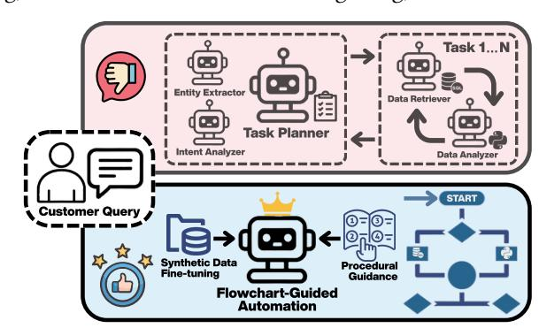
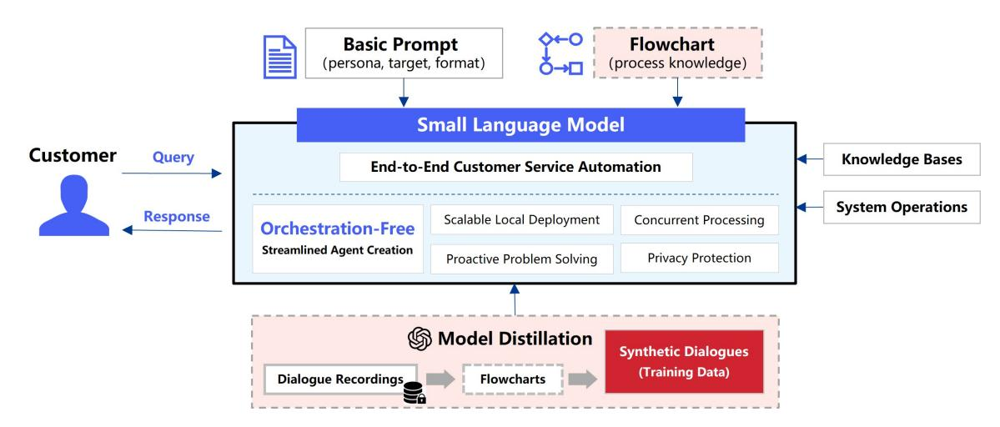
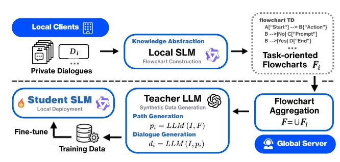
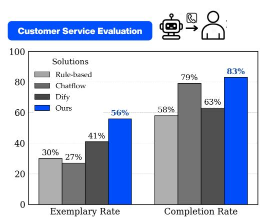
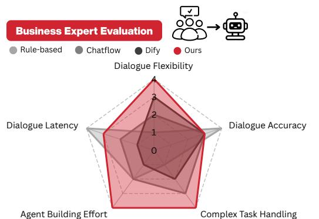
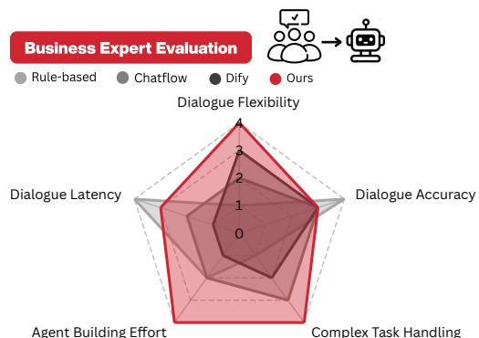
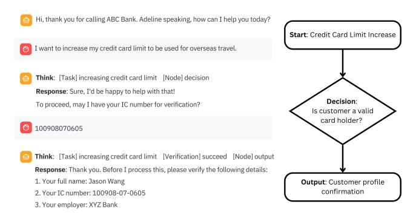
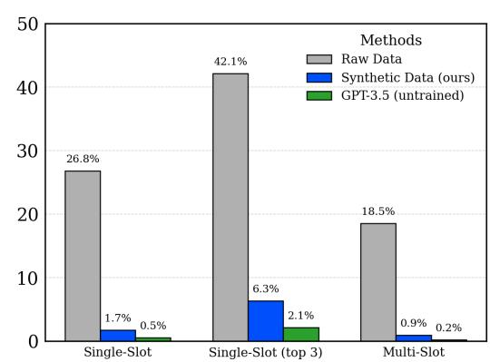
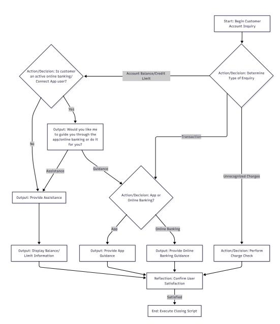

# Orchestration-Free Customer Service Automation: A Privacy-Preserving and Flowchart-Guided Framework

Mengze Hong Hong Kong Polytechnic University Hong Kong, China

Chen Jason Zhang Hong Kong Polytechnic University Hong Kong, China

Zichang Guo Hong Kong Polytechnic University Hong Kong, China

Hanlin Gu AI Group, WeBank Shenzhen, China

Di Jiang∗ Hong Kong Polytechnic University Hong Kong, China

Qing Li Hong Kong Polytechnic University Hong Kong, China

# Abstract

Customer service automation has seen growing demand within digital transformation. Existing approaches either rely on modular system designs with extensive agent orchestration or employ oversimplified instruction schemas, providing limited guidance and poor generalizability. This paper introduces an orchestration-free framework using Task-Oriented Flowcharts (TOFs) to enable endto-end automation without manual intervention. We first define the components and evaluation metrics for TOFs, then formalize a costefficient flowchart construction algorithm to abstract procedural knowledge from service dialogues. We emphasize local deployment of small language models and propose decentralized distillation with flowcharts to mitigate data scarcity and privacy issues in model training. Extensive experiments validate the effectiveness in various service tasks, with superior quantitative and application performance compared to strong baselines and market products. By releasing a web-based system demonstration with case studies, we aim to promote streamlined creation of future service automation.

# CCS Concepts

• Computing methodologies → Artificial intelligence.

# Keywords

Online customer service, task-oriented flowchart, data privacy

### ACM Reference Format:

Mengze Hong, Chen Jason Zhang, Zichang Guo, Hanlin Gu, Di Jiang, and Qing Li. 2026. Orchestration-Free Customer Service Automation: A Privacy-Preserving and Flowchart-Guided Framework. In Proceedings of the ACM Web Conference 2026 (WWW '26), April 13–17, 2026, Dubai, United Arab Emirates. ACM, New York, NY, USA, [12](#page-11-0) pages. [https://doi.org/10.1145/](https://doi.org/10.1145/3774904.3792822) [3774904.3792822](https://doi.org/10.1145/3774904.3792822)

# 1 Introduction

Customer service plays a central role in building trust and sustaining growth in modern enterprise [\[23,](#page-8-0) [35\]](#page-8-1). Online platforms, such as e-commerce websites, social media, messaging applications (e.g.,

∗Corresponding Author

© 2026 Copyright held by the owner/author(s). ACM ISBN 979-8-4007-2307-0/2026/04 <https://doi.org/10.1145/3774904.3792822>

Figure 1: Comparison of agent orchestration-based (top) and flowchart-guided (bottom) system for service automation.

WhatsApp), and in-app service chatbots, have emerged as the primary channels for customers to submit inquiries and for businesses to manage client relationships, progressively replacing traditional telephone and email interactions [\[46,](#page-9-0) [47,](#page-9-1) [53\]](#page-9-2). This intensifies challenges for human-based service operations, which face higher labor costs, significant staff turnover due to increased workload pressures, and greater training demands, necessitating efficient and scalable AI-driven automation solutions [\[12,](#page-8-2) [40\]](#page-9-3).

Unlike socially engaging chit-chat dialogue systems [\[7\]](#page-8-3), customer service automation faces rigorous expectations. Inbound service queries demand precise problem resolution, while outbound communication aims to promote successful sales and gather customer information [\[27\]](#page-8-4). This is amplified in web-based applications concerning daily activities (e.g., online shopping, banking, food delivery), where the high accessibility and expectation for instant solutions drives the transformation of service automation from front-desk receptionist roles, often leading to the frustrating "Transfer to human" option, to highly proficient and proactive problem-solvers that prioritize autonomous task completion [\[52\]](#page-9-4). This shift draws considerable attention from the web service and smart enterprise communities [\[25,](#page-8-5) [29,](#page-8-6) [42,](#page-9-5) [59\]](#page-9-6) that advocate tailored solutions to improve service quality while reducing the operational costs associated with system creation and maintenance.

Recent advancements in large language models (LLMs) have enabled task-oriented dialogue (TOD) systems with end-to-end dialogue management [\[36\]](#page-8-7). However, these systems either rely on overly simplified task schemas [\[54\]](#page-9-7), resulting in insufficient taskoriented guidance, or require manual agent creation with heavy agent orchestration to combine modular components (see Figure [1\)](#page-0-0)

[This work is licensed under a Creative Commons Attribution 4.0 International License.](https://creativecommons.org/licenses/by/4.0) WWW '26, Dubai, United Arab Emirates.

[\[15\]](#page-8-8), leading to limited generalizability. Moreover, existing research emphasizes empirical performance over practical applications, resulting in significant challenges for industrial deployment. Large proprietary models (e.g., GPT) excel at dialogue tasks, but sensitive user data restricts external API access and requires local deployment [\[30\]](#page-8-9). Small language models (SLMs), on the other hand, support lightweight deployment but require targeted fine-tuning for service applications, which is often constrained by scarce and private dialogue training data [\[17\]](#page-8-10) and risks of model memorization for sensitive information [\[4,](#page-8-11) [33\]](#page-8-12).

To address these challenges, we propose a novel flowchartguided customer service automation framework. The task-oriented flowchart structure is introduced to streamline complex dialogue interactions [\[41,](#page-9-8) [60\]](#page-9-9), enabling orchestration-free zero-shot task coordination and synthetic dialogue data generation for training small language models. The contributions of this paper include:

- (1) Procedural Knowledge Representation: We propose the task-oriented flowchart (TOF) structure to augment service automation with systematic procedural guidance, presenting rigorous component definitions and evaluation metrics to assess the comprehensiveness of task coverage.
- (2) Dialogue-to-Flowchart Optimization: We propose a twostep approach to construct TOFs from service dialogue: selecting representative samples and creating flowcharts via an iterative algorithm, emphasizing cost efficiency.
- (3) Flowchart-Guided Service Automation: With the constructed TOFs, we introduce a flowchart-guided framework for orchestration-free service automation, featuring a prompting strategy and a decentralized distillation approach for training SLMs without direct data exposure.
- (4) System Validation: Through rigorous experiments, we validate the effectiveness of flowcharts in enhancing service success, supported by empirical evidence from benchmark evaluations and qualitative assessments with human experts in practical system deployments. A web-based chatbot demonstration with case studies is released, serving as a foundation for future studies to build upon this work[1](#page-1-0)

# 2 Related Work

# 2.1 Customer Service Automation

The evolution of digital services has transformed the way customers interact with businesses, with platforms such as e-commerce and e-banking increasingly embedding support features directly into their websites and mobile applications [\[3\]](#page-8-13). Early customer service automation was dominated by rule-based systems such as Interactive Voice Response (IVR), which guided customers through fixed menus to answer common questions, or route calls to human agents [\[10\]](#page-8-14). These systems struggled with non-trivial queries, required frequent human intervention, and faced criticism for poor accessibility and limited adaptability. Later, machine learning-based dialogue models introduced intent recognition and slot-filling capabilities [\[18,](#page-8-15) [49\]](#page-9-10), enabling more dynamic and goal-oriented interactions. However, these systems relied on carefully engineered datasets and rigid ontologies for model training, offering limited scalability.

The emergence of large language models (LLMs) has transformed service automation with advanced natural language understanding and generation capabilities [\[1,](#page-8-16) [32\]](#page-8-17), demonstrating successful applications in domains such as healthcare [\[45,](#page-9-11) [48\]](#page-9-12) and e-commerce [\[57\]](#page-9-13). Unlike LLM-driven QA chatbots that rely on retrieval-based mechanisms to generate simple responses [\[20,](#page-8-18) [23\]](#page-8-0), task-oriented dialogue (TOD) systems help resolve problems and are crucial for realizing true service automation. ProTOD [\[15\]](#page-8-8) employs a pipeline architecture with three LLM-powered modular components (State Tracker, Knowledge Retriever, and Proactive Policy Planner) to enhance goal completion and proactivity. In contrast, SimpleTOD [\[24\]](#page-8-19) demonstrates that a single language model excels in dialogue tasks through transfer learning, while AutoTOD [\[54\]](#page-9-7) validates the effectiveness of an LLM's instruction-following capability with semi-structured task schemas to autonomously determine system actions, enabling seamless multi-domain task completion through end-to-end dialogue management. Additionally, retrieval-augmented generation (RAG) improves response generation with external knowledge [\[55\]](#page-9-14), while model fine-tuning enhances dialogue consistency [\[22\]](#page-8-20).

Despite recent advancements in system designs, modular architectures frequently suffer from high latency, unstable performance, and significant operational costs due to agent creation and orchestration [\[9,](#page-8-21) [61\]](#page-9-15). End-to-end systems, while reducing design overhead, lack interpretability and struggle with complex task coordinations [\[54\]](#page-9-7). These limitations underscore the need for a cost-efficient solution capable of reliably navigating complex service scenarios.

# 2.2 Flowchart Understanding and Application

Flowcharts, represented as directed graphs of sequential or conditional processes, effectively clarify complex workflows and decision paths [\[41\]](#page-9-8) and are especially valuable for capturing and representing business logic [\[19\]](#page-8-22). Traditionally, business processes are documented as Standard Operating Procedures (SOPs) that define a sequence of actions and best practices, while business requirements specify the expectations or performance targets to be met [\[16\]](#page-8-23). A flowchart integrates these two forms of knowledge into a cohesive workflow [\[13\]](#page-8-24), ensuring that adherence to the process ultimately leads to the fulfillment of the defined business requirements.

Recent studies have investigated the capabilities of LLMs and multimodal LLMs (MLLMs) in flowchart comprehension, demonstrating strong proficiency in interpreting workflow processes [\[34,](#page-8-25) [43\]](#page-9-16). However, the application of flowcharts remains limited to decision-making and simple Q&A-based systems [\[37,](#page-8-26) [56\]](#page-9-17), overlooking their potential in procedural knowledge abstraction and system design as a framework for guiding service automation. Notably, unlike open-domain chatbot applications, customer service operates in a closed domain, mostly addressing company-related queries, where pre-defined procedural knowledge can be effectively leveraged to guide dialogue flow and improve task completion.

Highlights. Unlike prior studies, this paper presents an end-to-end, orchestration-free customer service automation using novel taskoriented flowcharts. It delivers procedural guidance for task coordination in comparison to unstructured task schemas and supports the training of lightweight SLMs for local deployment, achieving streamlined system development with strong performance.

1[https://github.com/Flowchart-Guided-Service-Automation](https://github.com/mengze-hong/Flowchart-Guided-Service-Automation)

Figure 2: System overview: orchestration-free and privacy-preserving customer service automation driven by 1) flowchartaugmented task coordination and 2) flowchart-guided synthetic data generation for model distillation.

### 3 Task-Oriented Flowchart

In customer service, conversations typically focus on a single domain and often involve multiple interconnected goals, such as booking a restaurant, arranging nearby accommodation, or modifying prior details with additional constraints. These interactions can be conceptualized as structured workflows driven by customer intentions, with each goal corresponding to a specific task executed by the service agent through a coherent sequence of dialogue actions, closely aligning with the design of task-oriented systems. The key to guiding customer service automation lies in delivering clear procedural knowledge of these intents and actions [\[5\]](#page-8-27). To address this, we propose a novel Task-Oriented Flowchart (TOF) structure that models dialogues as procedural sequences to guide task completion.

### 3.1 Definition and Composition

A flowchart is a directed graph �� = (�� , ��), where �� denotes nodes representing process states or actions, and �� ⊆ �� × �� represents transitions. Unlike traditional acyclic flowcharts with rigid sequential flows, the proposed TOF permits loops for error handling and re-prompting. We propose five TOD-specific node types tailored for systematic flowchart design for the customer service application:

- Start Node: Initiates the dialogue by embedding the scenario and defining the agent's role (e.g., "Begin account inquiry"), aligning the service agent with the customer's intention.
- Action / Decision Node: Executes system-level operations and manages conditional logic, such as input validation (e.g., "Is account number valid?") and database queries.
- Output Node: Provides responses, including information display (e.g., "Display balance") and confirmations.
- Reflection Node: Evaluates the dialogue state to adapt strategies and recover from errors.
- End Node: Finalizes the task (e.g., "Complete inquiry") and marks goal completion based on user feedback.

Edges, labeled with conditions (e.g., "valid input", "user confirmed"), connect nodes. The non-acyclic design enables loops from output or reflection nodes to action nodes and from reflection or end nodes

to the start node, facilitating iterative refinement of requirements or initiation of new task queries. The flowchart is represented in Mermaid Markdown[2](#page-2-0) for seamless textual input and flexible diagram conversion (see examples in Appendix [A](#page-10-0)). This intent-driven structure marks a pioneering advance, systematically mapping dialogue intents and actions to procedural abstraction.

### 3.2 Flowchart Evaluation

With the goal of guiding service automation, it is essential to assess the TOF's ability to capture diverse customer intentions and agent actions. Inspired by the coverage metrics widely employed in formal verification [\[6\]](#page-8-28) and requirement-based testing [\[50\]](#page-9-18), we formulate two complementary metrics: Utterance Matching Ratio and Complete Path Coverage, evaluating the flowchart's effectiveness in modeling dialogue trajectories and capturing utterance-level semantics.

Utterance Matching Ratio (UMR). Given a flowchart �� = (�� , ��), we formulate utterance-node mapping as a classification problem �� (����) ∈ �� ∪ {∅}, where each utterance ���� from a dialogue �� = {��1, . . . , ���� } is assigned to exactly one node in �� or to ∅, representing the "no-match" case. The Utterance Matching Ratio for a single dialogue �� is then given by:

UMR(��, �� ) = |{���� ∈ �� | �� (����) ≠ ∅}| ,

where �� is the utterance count in ��. The dataset-level evaluation is reported as:

UMRavg (��, D) = 1 |D| ∑︁ ���� ∈D UMR(���� , �� ).

This captures the proportion of utterances successfully matched to flowchart nodes, reflecting semantic coverage and granularity.

Complete Path Coverage (CPC). We define a complete path �� = (��1, ��2, . . . , ����) from flowchart �� as an ordered sequence of nodes such that (���� , ����+1) ∈ �� for all �� ∈ {1, . . . ,�� − 1}, with ��1 denoting

2https://mermaid.live/edit

Table 1: Coverage evaluation of flowchart construction methods on the MultiWoZ 2.0 dataset.

| Method                 | CPC  | Attraction UMR | CPC  | Hotel UMR | CPC  | Restaurant UMR | CPC  | Taxi UMR | CPC  | Train UMR |
|------------------------|------|----------------|------|-----------|------|----------------|------|----------|------|-----------|
| Human-Annotated        | 0.86 | 0.8176         | 0.76 | 0.7966    | 0.80 | 0.8071         | 0.92 | 0.6728   | 0.84 | 0.7183    |
| Abstraction-Based      | 0.80 | 0.7958         | 0.64 | 0.8103    | 0.74 | 0.8044         | 0.90 | 0.6843   | 0.74 | 0.7987    |
| Iterative Construction | 0.92 | 0.9436         | 0.80 | 0.8209    | 0.90 | 0.9087         | 0.88 | 0.8221   | 0.88 | 0.8277    |

Table 2: Comparison of dialogue selection optimizations. The best performing method (i.e., lowest cost) is marked in blue.

| Method      | # Dialog | MultiWOZ # Utterances Unweighted | # Dialog DIC | SGD # Utterances |
|-------------|----------|----------------------------------|--------------|------------------|
| Greedy      | 57       | 1012                             | 23           | 318              |
| LP-Rounding | 67       | 1140                             | 37           | 596              |
| ILP         | 43       | 766                              | 21           | 344              |
|             |          | Weighted                         | DIC          |                  |
| Greedy      | 74       | 756                              | 32           | 330              |
| LP-Rounding | 68       | 828                              | 42           | 580              |
| ILP         | 51       | 620                              | 21           | 260              |

### 5 Experiments

We first evaluate the dialogue selection and flowchart construction methods, followed by quantitative benchmarks against various TOD baselines in task completion performance. Given the limited coverage of outbound service scenarios, we conduct a qualitative study by deploying the system in a real service setting and comparing it with market products for outbound communication. Finally, we present a web-based chatbot demonstration with case studies to illustrate how flowcharts enhance customer interactions.

# 5.1 Dialogue-to-Flowchart Evaluation

We evaluate the proposed flowchart construction methods on two dialogue datasets: MultiWOZ 2.0 [\[2\]](#page-8-33), containing 9,906 dialogues with 264 intents spanning five domains, and SGD [\[38\]](#page-9-22), covering 768 dialogues with 256 intents.

5.1.1 Dialogue Selection. The statistics of the selected dialogue subsets in Table [2](#page-5-0) show that all proposed approaches achieve complete intent coverage with compact subsets. The ILP method outperforms the greedy algorithm, consistently minimizing both dialogue and utterance counts, reducing the sample size from 9,906 to 43 dialogues for the MultiWoZ dataset. The weighted DIC, using utterance count as the selection cost, outperforms the unweighted variant. Specifically, ILP selects 21 dialogues comprising 260 utterances, compared to 21 dialogues with 344 utterances in unweighted DIC, demonstrating enhanced efficiency through finer cost granularity. Although LP-Rounding yields suboptimal subsets, it runs 41.3% faster than ILP and 66.2% faster than the greedy algorithm, making it a suitable alternative for large-scale industrial deployment.

5.1.2 Flowchart Construction. We construct flowcharts from ILPselected dialogues using the proposed iterative construction approach, and compare them against a human-annotated reference

Table 3: Goal completion evaluation on MultiWoz 2.0 and SGD. The best performing method is marked in blue.

|                  | Method Training-based | Inform Approaches | MultiWOZ Success | Book | Inform | SGD Success |
|------------------|-----------------------|-------------------|------------------|------|--------|-------------|
| SimpleTOD        |                       | 84.4              | 70.1             |      | 12.7   | 9.8         |
| UBAR             |                       | 83.4              | 70.3             |      |        |             |
| GALAXY           |                       | 85.4              | 75.7             |      |        |             |
| Mars             |                       | 88.9              | 78.0             |      |        |             |
| Prompting-based  |                       | Approaches        |                  |      |        |             |
| SGP-TOD          | (GPT3.5)              | 83.9              | 69.9             |      |        |             |
| AutoTOD          | (GPT-4)               | 87.2              | 82.8             | 81.4 | 45.1   | 23.0        |
| ProTOD           | (GPT-3.5)             | 91.7              | 83.3             | 87.0 | 50.4   | 24.9        |
| Flowchart-Guided |                       | Approaches        |                  |      |        |             |
| Ours             | (GPT-3.5)             | 88.3              | 84.6             | 91.4 | 46.3   | 26.8        |
| Ours             | (LLaMA-8B)            | 84.7              | 85.9             | 90.7 | 42.5   | 25.4        |

and an abstraction-based method, which first summarizes dialogues into task requirement documents, then applies few-shot prompting to mimic human annotation[3](#page-5-1) . We evaluate these flowcharts on 50 randomly sampled dialogues per domain from the Multi-WoZ dataset and report results using the CPC and UMR metrics, as defined in Section [3.2,](#page-2-1) with CPC relaxed to require at least one

complete path to accommodate dialogues spanning multiple tasks. As shown in Table [1,](#page-5-2) all methods achieve satisfactory coverage of intents and dialogue paths. Interestingly, the iterative construction approach outperforms human annotation, which can be attributed to its incremental refinement in capturing fine-grained business logics through the step-by-step construction process. This demonstrates that comprehensive TOFs can be automatically constructed from service dialogues, highlighting the potential for fully data-driven agent creation and digital transformation.

# 5.2 Task Completion Evaluation

With the constructed flowcharts, we compare our methods against two categories of baselines: (i) training-based TOD models, and (ii) prompting-based approaches. Evaluations are conducted on the MultiWoZ 2.0 and SGD datasets, following the setup in [\[54\]](#page-9-7), where Inform measures correct entity provision, Success indicates whether all requested attributes are satisfied, and Book represents the success rate of bookings or reservations. We apply the flowchart-augmented prompt to the GPT-3.5 model. The distillation strategy is implemented by generating 500 dialogue samples per domain using GPT-4, followed by fine-tuning a LLaMA-3-8B-Instruct model, which is subsequently evaluated using the same prompting strategy.

Implementation details and annotator profiles are provided in Appendix [C.](#page-11-1)

Figure 4: Comparison of Exemplary Rate and Completion Rate for four customer service outbound automations.

As shown in Table [3,](#page-5-3) our flowchart-guided approaches achieved strong overall performance with notable improvements over baseline approaches. On MultiWOZ 2.0, our prompt-based approach with GPT-3.5 achieves a Success rate with relative gains of approximately 2.17% over AutoTOD and 1.56% over ProTOD. This improvement is achieved despite AutoTOD utilising GPT-4, highlighting that the integration of flowcharts can compensate for differences in model scale through embedded business logic. Furthermore, the fine-tuned LLaMA SLM confirmed that flowchart-guided distillation enables even smaller open-source models to match or surpass larger proprietary models in task completion. This can be attributed to the nature of customer service, where agents are mostly responsible for domain-specific queries and often prefer to ignore the out-of-domain requests, which benefit the most from model fine-tuning with domain-specific data. Similar results are observed in the SGD dataset, with both proposed methods achieving higher success rates than various baselines.

The Inform metric highlights a limitation of our method: it underperforms compared to ProTOD, which employs a modular orchestration-based design integrating a dialogue state tracker, exploratory knowledge retriever, and policy planner. This approach provides more detailed guidance in defining information flow. In contrast, our method prioritizes high-level business logic abstractions that emphasize overall goal completion rather than finegrained entity matching, leading to the slightly lower Inform score. However, considering that flowcharts are easier to construct from dialogues, while agent orchestration incurs higher computational costs and limited scalability, we argue that the compromise in the Inform metric does not diminish the overall practical value of our system. The superior end-to-end task completion and multistep objective handling capabilities demonstrated by the proposed system position procedural knowledge augmentation through TOFs as a compelling candidate for real-world system deployment.

# 5.3 Outbound Evaluation

Existing evaluations offer limited coverage of outbound service scenarios, which feature more complex dialogue management and business requirements. To address this gap, we conducted a threemonth field experiment deploying multiple service automation

Figure 5: Human evaluation of proactive outbound systems across five technical aspects (0 = worst, 4 = best).

systems to perform real outbound interactions. The task focuses on collecting information on customers' debt-repayment capacity, a realistic banking scenario that is traditionally labor-intensive and presents an urgent need for AI-driven automation.

5.3.1 Implementations. Building on the system architecture in Figure [2,](#page-2-2) we develop a proactive outbound service agent distilled from over 30,000 high-quality, complete human–human dialogues across four local banks in China. Both training and deployment are conducted in Mandarin, thereby complementing insights derived from English benchmarks. To protect data privacy, we adopt the proposed distributed distillation framework that generates service flowcharts on local servers before aggregating them for synthetic data generation and model fine-tuning. This yields 12 unique TOFs and 1,800 synthetic dialogues generated by GPT-4, used to fine-tune a smaller Qwen-3-8B model. We compare our system against three commercial baselines: a rule-based system driven by decision trees, a chatflow system, and an orchestrated agentic system built with Dify. Each system conducts 125 outbound communications for repayment prompting and multi-field data collection. Human experts assess the goal completion following [\[44\]](#page-9-23), with the Exemplary Rate representing complete, high-quality interactions and the Complete Rate indicating minimal goal completion.

5.3.2 Results and Discussions. The results in Figure [4](#page-6-0) demonstrate that our proposed system outperforms existing commercial products, achieving the highest scores in Exemplary Rate and Completion Rate. We further evaluated their technical strengths and weaknesses through expert consensus. As shown in Figure [5,](#page-6-1) results confirm our system's top performance in dialogue flexibility (4), agent-building effort (4), and complex task handling (4), driven by its fully automated flowchart augmentation. In contrast, traditional systems driven by static workflow excel only in dialogue latency and accuracy, relying heavily on rule-based mechanisms with extensive human-defined knowledge.

Dify's agent workflow provides moderate flexibility and accuracy but is limited by high latency, significant setup effort, and constrained complex task coverage. While such LLM operations (LLMOps) employ a drag-and-drop design to ease the development [\[14\]](#page-8-34), it becomes messy and hard to manage when business logic spans multiple scenarios, making it more suitable for early prototyping than robust, long-term solutions. It also requires manual

Figure 6: Comparison of sensitive data memorization measured by user preference leakage (lower is better).

configuration of node intents and transition strategies, increasing system setup and maintenance costs. In contrast, our flowchart approach delivers automated guidance that prioritizes clear expression of business logic over micromanaging system execution, demonstrating practical benefits in system development.

### 5.4 Ablation Study

We compare fine-tuning a LLaMA-3-8B-Instruct model on raw dialogue data versus a flowchart distillation approach to assess the memorization issue that leads to sensitive user preference leakage [\[39\]](#page-9-24). From MultiWOZ 2.0, we select 1,000 dialogues (200 per domain) and extract preference lists (e.g., price range, location, food preferences) from each dialogue as sensitive data. For our method, we generate 200 synthetic dialogues per domain following Section [4.2.2.](#page-4-1) Both models are trained under the same hyperparameters. Memorization of preference data is evaluated through extended slot prediction tasks [\[26\]](#page-8-35), using slot masking for multiclass classification with provided candidate options. Results are reported across three metrics, compared to an untrained GPT-3.5 baseline: (i) Slot Prediction Accuracy; (ii) Top-3 Accuracy (exact match among top-3 predictions); and (iii) Multi-Slot Prediction Accuracy (exact sequence match for two masked slots).

Figure [6](#page-7-0) reveals that fine-tuning on raw dialogue data results in significant memorization with frequent reproduction of sensitive preference information. In contrast, our approach substantially reduces these risks and closely aligns with the untrained baseline. This reduction arises because TOFs abstract only business logic, excluding fine-grained user details. By prioritizing procedural structure over specific user data, our method ensures robust privacy preservation without compromising task performance, offering a scalable solution for secure dialogue model training.

# 5.5 Case Study and System Demonstration

We validate the practical utility of the proposed approach through a web-based chatbot demonstration for online banking services. The system is driven entirely by service flowcharts for task coordination, eliminating the need for manual orchestration. Built on the GPT-3.5 model via the OpenAI API, it ensures broad accessibility with minimal computational requirements. The system supports response generation, operational management, and proactive product

Table 4: Case scenarios for system demonstration.

|              | Tasks        | Description |                |             |                  |             |           |          |
|--------------|--------------|-------------|----------------|-------------|------------------|-------------|-----------|----------|
| Verification |              | Validates   | correct,       | incorrect,  |                  | or          | missing   | inputs   |
|              |              | with robust | error          | handling.   |                  |             |           |          |
| Credit       | Limit        | Guides      | users          | through     | credit           | limit       | increases | via      |
|              |              | online      | banking        | or          | mobile           | apps.       |           |          |
| Account      | Inquiry      | Manages     | balance        | inquiries   |                  | and         | unknown   | trans   |
|              |              | action      | investigations |             | with             | accurate    |           | data re |
|              |              | trieval     | and issue      | resolution. |                  |             |           |          |
| Travel       | Notification | Facilitates | the            | setup       | of overseas      |             | travel    | alerts   |
|              |              | with app    | guidance       |             | or direct        | assistance. |           |          |
| Open         | Questions    | Addresses   | queries        | on          | wallet           | deposits,   | age       | limits,  |
|              |              | loan rates, | and            | product     | recommendations. |             |           |          |

Figure 7: System demonstration: flowchart-guided customer service automation for banking applications.

promotion before the dialogue ends. It features five distinct tasks, as detailed in Table [4,](#page-7-1) each covering multiple scenarios to illustrate the system's adaptability in managing varied user interactions and information validity. Figure [7](#page-7-2) presents an example service dialogue and its correspondence to the underlying flowchart.

### 6 Conclusion

This paper presents an innovative orchestration-free customer service automation framework utilizing Task-Oriented Flowcharts (TOFs) to deliver structured procedural guidance. By enhancing task coordination and enabling privacy-preserving model training, our approach outperforms baseline methods and commercial products in benchmark evaluations and demonstrates robust adaptability in real-world system deployments. Its scalable, interpretable design makes it ideal for integration into web platforms and enterprise systems, significantly improving operational efficiency while addressing the practical concerns of data privacy. Future research is encouraged to explore the potential of TOFs in multilingual and low-resource settings to further mitigate data scarcity and privacy challenges, alongside continued development of production systems based on the released demo project, advancing toward fully automated, streamlined web service automations.

# Acknowledgments

The work was partially supported by the PolyU Start-up Fund (P0059983); the NSFC/RGC Joint Research Scheme (N\_PolyU5179/25); the Research Grants Council (HK) (PolyU25600624); and the Innovation Technology Fund (ITS/052/23MX and PRP/009/22FX).

### References

[1] Ruichuan An, Sihan Yang, Renrui Zhang, Zijun Shen, Ming Lu, Gaole Dai, Hao Liang, Ziyu Guo, Shilin Yan, Yulin Luo, Bocheng Zou, Chaoqun Yang, and Wentao Zhang. 2025. UniCTokens: Boosting Personalized Understanding and Generation via Unified Concept Tokens. In The Thirty-ninth Annual Conference on Neural Information Processing Systems.<https://openreview.net/forum?id=gNwJTjxmBe> [2] Paweł Budzianowski, Tsung-Hsien Wen, Bo-Hsiang Tseng, Iñigo Casanueva, Stefan Ultes, Osman Ramadan, and Milica Gašić. 2018. MultiWOZ - A Large-Scale Multi-Domain Wizard-of-Oz Dataset for Task-Oriented Dialogue Modelling. In Proceedings of the 2018 Conference on Empirical Methods in Natural Language Processing. Association for Computational Linguistics, Brussels, Belgium, 5016– 5026. [doi:10.18653/v1/D18-1547](https://doi.org/10.18653/v1/D18-1547) [3] Yingxia Cao, Haya Ajjan, and Paul Hong. 2018. Post-purchase shipping and customer service experiences in online shopping and their impact on customer satisfaction: An empirical study with comparison. Asia Pacific Journal of Marketing and Logistics 30, 2 (2018), 400–416. [4] Nicholas Carlini, Daphne Ippolito, Matthew Jagielski, Katherine Lee, Florian Tramer, and Chiyuan Zhang. 2023. Quantifying Memorization Across Neural Language Models. In The Eleventh International Conference on Learning Representations. [https://openreview.net/forum?id=TatRHT\\_1cK](https://openreview.net/forum?id=TatRHT_1cK) [5] W.L. Chen, S.Q. (Shane) Xie, F.F. Zeng, and B.M. Li. 2011. A new process knowledge representation approach using parameter flow chart. Computers in Industry 62, 1 (2011), 9–22. [doi:10.1016/j.compind.2010.05.016](https://doi.org/10.1016/j.compind.2010.05.016) [6] Hana Chockler, Orna Kupferman, and Moshe Y Vardi. 2003. Coverage metrics for formal verification. In Advanced Research Working Conference on Correct Hardware Design and Verification Methods. Springer, 111–125. [7] Ritvik Choudhary and Daisuke Kawahara. 2022. Grounding in social media: An approach to building a chit-chat dialogue model. In Proceedings of the 2022 Conference of the North American Chapter of the Association for Computational Linguistics: Human Language Technologies: Student Research Workshop. Association for Computational Linguistics, Hybrid: Seattle, Washington + Online, 9–15. [doi:10.18653/v1/2022.naacl-srw.2](https://doi.org/10.18653/v1/2022.naacl-srw.2) [8] Vasek Chvatal. 1979. A greedy heuristic for the set-covering problem. Mathematics of operations research 4, 3 (1979), 233–235. [9] Christopher Clarke, Joseph Peper, Karthik Krishnamurthy, Walter Talamonti, Kevin Leach, Walter Lasecki, Yiping Kang, Lingjia Tang, and Jason Mars. 2022. One Agent To Rule Them All: Towards Multi-agent Conversational AI. In Findings of the Association for Computational Linguistics: ACL 2022. Association for Computational Linguistics, Dublin, Ireland, 3258–3267. [doi:10.18653/v1/2022.findings](https://doi.org/10.18653/v1/2022.findings-acl.257)[acl.257](https://doi.org/10.18653/v1/2022.findings-acl.257) [10] Ross Corkrey and Lynne Parkinson. 2002. Interactive voice response: review of studies 1989–2000. Behavior Research Methods, Instruments, & Computers 34, 3 (2002), 342–353. [11] Thomas H Cormen, Charles E Leiserson, Ronald L Rivest, and Clifford Stein. 2022. Introduction to algorithms. MIT press. [12] Lei Cui, Shaohan Huang, Furu Wei, Chuanqi Tan, Chaoqun Duan, and Ming Zhou. 2017. Superagent: A customer service chatbot for e-commerce websites. In Proceedings of ACL 2017, system demonstrations. 97–102. [13] Nadja Damij. 2007. Business process modelling using diagrammatic and tabular techniques. Business process management journal 13, 1 (2007), 70–90. [14] Josu Diaz-De-Arcaya, Juan López-De-Armentia, Raúl Miñón, Iker Lasa Ojanguren, and Ana I Torre-Bastida. 2024. Large language model operations (LLMOps): Definition, challenges, and lifecycle management. In 2024 9th International Conference on Smart and Sustainable Technologies (SpliTech). IEEE, 1–4. [15] Wenjie Dong, Sirong Chen, and Yan Yang. 2025. ProTOD: Proactive Task-oriented Dialogue System Based on Large Language Model. In Proceedings of the 31st International Conference on Computational Linguistics. Association for Computational Linguistics, Abu Dhabi, UAE, 9147–9164. [https://aclanthology.org/2025.coling](https://aclanthology.org/2025.coling-main.614/)[main.614/](https://aclanthology.org/2025.coling-main.614/) [16] Marlon Dumas, L Marcello Rosa, Jan Mendling, and A Hajo Reijers. 2018. Fundamentals of business process management. Springer. [17] Tao Fan, Guoqiang Ma, Yan Kang, Hanlin Gu, Yuanfeng Song, Lixin Fan, Kai Chen, and Qiang Yang. 2025. FedMKT: Federated Mutual Knowledge Transfer for Large and Small Language Models. In Proceedings of the 31st International Conference on Computational Linguistics. 243–255. [18] Milica Gašić, Catherine Breslin, Matthew Henderson, Dongho Kim, Martin Szummer, Blaise Thomson, Pirros Tsiakoulis, and Steve Young. 2013. POMDP-based dialogue manager adaptation to extended domains. In Proceedings of the SIG-DIAL 2013 Conference. Association for Computational Linguistics, Metz, France, 214–222.<https://aclanthology.org/W13-4035/> [19] Christian Grönroos and Annika Ravald. 2011. Service as business logic: implications for value creation and marketing. Journal of service management 22, 1 (2011), 5–22. [20] Mengze Hong, Di Jiang, Jiangtao Wen, Zhiyang Su, Yawen Li, Yanjie Sun, Guan Wang, and Chen Jason Zhang. 2026. RAL2M: Retrieval Augmented Learning-To-Match Against Hallucination in Compliance-Guaranteed Service Systems. arXiv[:2601.02917](https://arxiv.org/abs/2601.02917) [cs.CL]<https://arxiv.org/abs/2601.02917> [21] Mengze Hong, Wailing Ng, Chen Jason Zhang, Yuanfeng Song, and Di Jiang. 2025. Dial-In LLM: Human-Aligned LLM-in-the-loop Intent Clustering for Customer Service Dialogues. In Proceedings of the 2025 Conference on Empirical Methods in Natural Language Processing. Association for Computational Linguistics, Suzhou, China, 5885–5900. [doi:10.18653/v1/2025.emnlp-main.300](https://doi.org/10.18653/v1/2025.emnlp-main.300) [22] Mengze Hong, Chen Jason Zhang, Chaotao Chen, Rongzhong Lian, and Di Jiang. 2025. Dialogue Language Model with Large-Scale Persona Data Engineering. In Proceedings of the 2025 Conference of the Nations of the Americas Chapter of the Association for Computational Linguistics: Human Language Technologies (Volume 3: Industry Track). Association for Computational Linguistics, Albuquerque, New Mexico, 961–970. [doi:10.18653/v1/2025.naacl-industry.71](https://doi.org/10.18653/v1/2025.naacl-industry.71) [23] Mengze Hong, Chen Jason Zhang, Di Jiang, and Yuanqin He. 2025. Augmenting Compliance-Guaranteed Customer Service Chatbots: Context-Aware Knowledge Expansion with Large Language Models. In Proceedings of the 2025 Conference on Empirical Methods in Natural Language Processing: Industry Track. Association for Computational Linguistics, Suzhou (China), 753–765. [doi:10.18653/v1/2025.](https://doi.org/10.18653/v1/2025.emnlp-industry.51) [emnlp-industry.51](https://doi.org/10.18653/v1/2025.emnlp-industry.51) [24] Ehsan Hosseini-Asl, Bryan McCann, Chien-Sheng Wu, Semih Yavuz, and Richard Socher. 2020. A Simple Language Model for Task-Oriented Dialogue. In Advances in Neural Information Processing Systems, Vol. 33. Curran Associates, Inc., 20179–20191. [https://proceedings.neurips.cc/paper\\_files/paper/2020/file/](https://proceedings.neurips.cc/paper_files/paper/2020/file/e946209592563be0f01c844ab2170f0c-Paper.pdf) [e946209592563be0f01c844ab2170f0c-Paper.pdf](https://proceedings.neurips.cc/paper_files/paper/2020/file/e946209592563be0f01c844ab2170f0c-Paper.pdf) [25] Jiantao Huang, Yi-Ru Liou, and Hsin-Hsi Chen. 2021. Enhancing Intent Detection in Customer Service with Social Media Data. In Companion Proceedings of the Web Conference 2021 (Ljubljana, Slovenia) (WWW '21). Association for Computing Machinery, New York, NY, USA, 274–275. [doi:10.1145/3442442.3451377](https://doi.org/10.1145/3442442.3451377) [26] Shotaro Ishihara. 2023. Training Data Extraction From Pre-trained Language Models: A Survey. In Proceedings of the 3rd Workshop on Trustworthy Natural Language Processing (TrustNLP 2023). Association for Computational Linguistics, Toronto, Canada, 260–275. [doi:10.18653/v1/2023.trustnlp-1.23](https://doi.org/10.18653/v1/2023.trustnlp-1.23) [27] Yingjie Kuang, Tianchen Zhang, Zhen-Wei Huang, Zhongjie Zeng, Zhe-Yuan Li, Ling Huang, and Yuefang Gao. 2025. CATS: Clustering-Aggregated and Time Series for Business Customer Purchase Intention Prediction. In Companion Proceedings of the ACM on Web Conference 2025 (Sydney NSW, Australia) (WWW '25). Association for Computing Machinery, New York, NY, USA, 2269–2277. [doi:10.1145/3701716.3717545](https://doi.org/10.1145/3701716.3717545) [28] Jean B Lasserre. 2005. Polynomial programming: LP-relaxations also converge. SIAM Journal on Optimization 15, 2 (2005), 383–393. [29] Junwen Liu, Haikuan Huang, Gang Huang, Shuang Ge, and Jinlian Hu. 2025. Multimodal Intent Recognition in E-Commerce: Challenges, Innovations, and Lightweight Solutions. In Companion Proceedings of the ACM on Web Conference 2025. 3008–3011. [30] Yang Liu, Bingjie Yan, Tianyuan Zou, Jianqing Zhang, Zixuan Gu, Jianbing Ding, Xidong Wang, Jingyi Li, Xiaozhou Ye, Ye Ouyang, et al. 2025. Towards Harnessing the Collaborative Power of Large and Small Models for Domain Tasks. arXiv preprint arXiv:2504.17421 (2025). [31] Wenlong Meng, Guo Zhenyuan, Lenan Wu, Chen Gong, Wenyan Liu, Weixian Li, Chengkun Wei, and Wenzhi Chen. 2025. R.R.: Unveiling LLM Training Privacy through Recollection and Ranking. In Findings of the Association for Computational Linguistics: ACL 2025. Association for Computational Linguistics, Vienna, Austria, 17383–17397. [doi:10.18653/v1/2025.findings-acl.894](https://doi.org/10.18653/v1/2025.findings-acl.894) [32] Humza Naveed, Asad Ullah Khan, Shi Qiu, Muhammad Saqib, Saeed Anwar, Muhammad Usman, Naveed Akhtar, Nick Barnes, and Ajmal Mian. 2025. A comprehensive overview of large language models. ACM Transactions on Intelligent Systems and Technology 16, 5 (2025), 1–72. [33] Mustafa Ozdayi, Charith Peris, Jack FitzGerald, Christophe Dupuy, Jimit Majmudar, Haidar Khan, Rahil Parikh, and Rahul Gupta. 2023. Controlling the Extraction of Memorized Data from Large Language Models via Prompt-Tuning. In Proceedings of the 61st Annual Meeting of the Association for Computational Linguistics (Volume 2: Short Papers). Association for Computational Linguistics, Toronto, Canada, 1512–1521. [doi:10.18653/v1/2023.acl-short.129](https://doi.org/10.18653/v1/2023.acl-short.129) [34] Huitong Pan, Qi Zhang, Cornelia Caragea, Eduard Dragut, and Longin Jan Latecki. 2024. Flowlearn: Evaluating large vision-language models on flowchart understanding. In ECAI 2024. IOS Press, 73–80. [35] Sravani Pati, Vamsi Krishna Pasam, and Carlos Toxtli Hernandez. 2025. Customer Journey Mapping with Multimodal Large Language Models. In Companion Proceedings of the ACM on Web Conference 2025 (Sydney NSW, Australia) (WWW '25). Association for Computing Machinery, New York, NY, USA, 2744–2748. [doi:10.1145/3701716.3717863](https://doi.org/10.1145/3701716.3717863) [36] Libo Qin, Wenbo Pan, Qiguang Chen, Lizi Liao, Zhou Yu, Yue Zhang, Wanxiang Che, and Min Li. 2023. End-to-end Task-oriented Dialogue: A Survey of Tasks, Methods, and Future Directions. In Proceedings of the 2023 Conference on Empirical Methods in Natural Language Processing. Association for Computational Linguistics, Singapore, 5925–5941. [doi:10.18653/v1/2023.emnlp-main.363](https://doi.org/10.18653/v1/2023.emnlp-main.363) [37] Dinesh Raghu, Shantanu Agarwal, Sachindra Joshi, and Mausam. 2021. Endto-End Learning of Flowchart Grounded Task-Oriented Dialogs. In Proceedings of the 2021 Conference on Empirical Methods in Natural Language Processing. Association for Computational Linguistics, Online and Punta Cana, Dominican Republic, 4348–4366. [doi:10.18653/v1/2021.emnlp-main.357](https://doi.org/10.18653/v1/2021.emnlp-main.357)

[38] Abhinav Rastogi, Xiaoxue Zang, Srinivas Sunkara, Raghav Gupta, and Pranav Khaitan. 2020. Towards scalable multi-domain conversational agents: The schemaguided dialogue dataset. In Proceedings of the AAAI conference on artificial intelligence, Vol. 34. 8689–8696. [39] Avi Schwarzschild, Zhili Feng, Pratyush Maini, Zachary Lipton, and J Zico Kolter. 2024. Rethinking llm memorization through the lens of adversarial compression. Advances in Neural Information Processing Systems 37 (2024), 56244–56267. [40] Jie Shen and Chunyong Tang. 2018. How does training improve customer service quality? The roles of transfer of training and job satisfaction. European management journal 36, 6 (2018), 708–716. [41] Mirko Soković, Jelena Jovanović, Zdravko Krivokapić, and Aleksandar Vujović. 2009. Basic quality tools in continuous improvement process. Journal of Mechanical Engineering 55, 5 (2009), 1–9. [42] Shuangyong Song, Chao Wang, Haiqing Chen, and Huan Chen. 2020. A Model for Quality Control of Customer Service. In Companion Proceedings of the Web Conference 2020 (Taipei, Taiwan) (WWW '20). Association for Computing Machinery, New York, NY, USA, 15–16. [doi:10.1145/3366424.3382675](https://doi.org/10.1145/3366424.3382675) [43] Manan Suri, Puneet Mathur, Nedim Lipka, Franck Dernoncourt, Ryan A. Rossi, Vivek Gupta, and Dinesh Manocha. 2025. Follow the Flow: Fine-grained Flowchart Attribution with Neurosymbolic Agents. In Proceedings of the 2025 Conference on Empirical Methods in Natural Language Processing. Association for Computational Linguistics, Suzhou, China, 22485–22508. [doi:10.18653/v1/2025.emnlp-main.1144](https://doi.org/10.18653/v1/2025.emnlp-main.1144) [44] Craig Thomson, Ehud Reiter, and Anya Belz. 2024. Common flaws in running human evaluation experiments in NLP. Computational Linguistics 50, 2 (2024), 795–805. [45] Mina Valizadeh and Natalie Parde. 2022. The AI doctor is in: A survey of taskoriented dialogue systems for healthcare applications. In Proceedings of the 60th Annual Meeting of the Association for Computational Linguistics (Volume 1: Long Papers). 6638–6660. [46] John Walsh and Sue Godfrey. 2000. The Internet: a new era in customer service. European Management Journal 18, 1 (2000), 85–92. [47] Victor Junqiu Wei, Weicheng Wang, Di Jiang, Yuanfeng Song, and Lu Wang. 2025. Asr-ec benchmark: Evaluating large language models on chinese asr error correction. In Proceedings of the 2025 Conference on Empirical Methods in Natural Language Processing: Industry Track. 1567–1575. [48] Zhongyu Wei, Qianlong Liu, Baolin Peng, Huaixiao Tou, Ting Chen, Xuanjing Huang, Kam-fai Wong, and Xiangying Dai. 2018. Task-oriented Dialogue System for Automatic Diagnosis. In Proceedings of the 56th Annual Meeting of the Association for Computational Linguistics (Volume 2: Short Papers). Association for Computational Linguistics, Melbourne, Australia, 201–207. [doi:10.18653/v1/P18-2033](https://doi.org/10.18653/v1/P18-2033) [49] Tsung-Hsien Wen, David Vandyke, Nikola Mrkšić, Milica Gašić, Lina M. Rojas-Barahona, Pei-Hao Su, Stefan Ultes, and Steve Young. 2017. A Network-based End-to-End Trainable Task-oriented Dialogue System. In Proceedings of the 15th Conference of the European Chapter of the Association for Computational Linguistics: Volume 1, Long Papers. Association for Computational Linguistics, Valencia, Spain, 438–449.<https://aclanthology.org/E17-1042/> [50] Michael W Whalen, Ajitha Rajan, Mats PE Heimdahl, and Steven P Miller. 2006. Coverage metrics for requirements-based testing. In Proceedings of the 2006 international symposium on Software testing and analysis. 25–36. [51] Laurence A Wolsey. 1982. An analysis of the greedy algorithm for the submodular set covering problem. Combinatorica 2, 4 (1982), 385–393. [52] Lei Xia, Sh Baghaie, and S Mohammad Sajadi. 2024. The digital economy: Challenges and opportunities in the new era of technology and electronic communications. Ain Shams Engineering Journal 15, 2 (2024), 102411. [53] Anbang Xu, Zhe Liu, Yufan Guo, Vibha Sinha, and Rama Akkiraju. 2017. A new chatbot for customer service on social media. In Proceedings of the 2017 CHI conference on human factors in computing systems. 3506–3510. [54] Heng-Da Xu, Xian-Ling Mao, Puhai Yang, Fanshu Sun, and Heyan Huang. 2024. Rethinking Task-Oriented Dialogue Systems: From Complex Modularity to Zero-Shot Autonomous Agent. In Proceedings of the 62nd Annual Meeting of the Association for Computational Linguistics (Volume 1: Long Papers). Association for Computational Linguistics, Bangkok, Thailand, 2748–2763. [doi:10.18653/v1/2024.acl-long.152](https://doi.org/10.18653/v1/2024.acl-long.152) [55] Zhentao Xu, Mark Jerome Cruz, Matthew Guevara, Tie Wang, Manasi Deshpande, Xiaofeng Wang, and Zheng Li. 2024. Retrieval-augmented generation with knowledge graphs for customer service question answering. In Proceedings of the 47th international ACM SIGIR conference on research and development in information retrieval. 2905–2909. [56] Yuuki Yamanaka, Hiroshi Takahashi, and Tomoya Yamashita. 2025. Flowchart-Based Decision Making with Large Language Models. In Findings of the Association for Computational Linguistics: ACL 2025. Association for Computational Linguistics, Vienna, Austria, 14836–14842. [doi:10.18653/v1/2025.findings-acl.766](https://doi.org/10.18653/v1/2025.findings-acl.766) [57] Zhao Yan, Nan Duan, Peng Chen, Ming Zhou, Jianshe Zhou, and Zhoujun Li. 2017. Building task-oriented dialogue systems for online shopping. In Proceedings of the AAAI conference on artificial intelligence, Vol. 31. [58] Qiang Yang, Yang Liu, Tianjian Chen, and Yongxin Tong. 2019. Federated Machine Learning: Concept and Applications. ACM Trans. Intell. Syst. Technol. 10, 2, Article 12 (Jan. 2019), 19 pages. [doi:10.1145/3298981](https://doi.org/10.1145/3298981) [59] Galit B Yom-Tov, Shelly Ashtar, Daniel Altman, Michael Natapov, Neta Barkay, Monika Westphal, and Anat Rafaeli. 2018. Customer sentiment in web-based service interactions: Automated analyses and new insights. In Companion Proceedings of the The Web Conference 2018. 1689–1697. [60] Enming Zhang, Ruobing Yao, Huanyong Liu, Junhui Yu, and Jiale Wang. 2024. First Multi-Dimensional Evaluation of Flowchart Comprehension for Multimodal Large Language Models. arXiv[:2406.10057](https://arxiv.org/abs/2406.10057) [cs.CV] [https://arxiv.org/abs/2406.](https://arxiv.org/abs/2406.10057) [10057](https://arxiv.org/abs/2406.10057) [61] Qianqian Zhang, Jiajia Liao, Heting Ying, Yibo Ma, Haozhan Shen, Jingcheng Li, Peng Liu, Lu Zhang, Chunxin Fang, Kyusong Lee, Ruochen Xu, and Tiancheng Zhao. 2025. Unifying Language Agent Algorithms with Graph-based Orchestration Engine for Reproducible Agent Research. In Proceedings of the 63rd Annual Meeting of the Association for Computational Linguistics (Volume 3: System Demonstrations). Association for Computational Linguistics, Vienna, Austria, 107–117. [doi:10.18653/v1/2025.acl-demo.11](https://doi.org/10.18653/v1/2025.acl-demo.11) [62] Yazhou Zhang, Mengyao Wang, Qiuchi Li, Prayag Tiwari, and Jing Qin. 2025. Pushing the limit of LLM capacity for text classification. In Companion Proceedings of the ACM on Web Conference 2025. 1524–1528. [63] Ying Zhao and Jinjun Chen. 2022. A survey on differential privacy for unstructured data content. ACM Computing Surveys (CSUR) 54, 10s (2022), 1–28.

# C Implementation Details

This section provides the implementation details of the experiments to ensure reproducibility. All components are developed in Python 3.10, with PuLP employed for solving the Integer Linear Program in dialogue selection and scikit-learn used for clustering in flowchart aggregation.

### C.1 Model Access and Deployment

Proprietary LLMs, including GPT-3.5 and GPT-4, are accessed via the OpenAI API for synthetic data generation and benchmark evaluation. Locally deployed small language models, such as [Qwen3-8B-](https://huggingface.co/Qwen/Qwen3-8B-AWQ)[AWQ](https://huggingface.co/Qwen/Qwen3-8B-AWQ) and [Meta-Llama-3-8B-Instruct,](https://huggingface.co/meta-llama/Meta-Llama-3-8B-Instruct) are hosted using the Hugging Face Transformers library on a single Nvidia V100 GPU with 32GB of memory. We have also evaluated on a single Nvidia RTX 4090 GPU using 8-bit quantization, which offers similar stability and improved memory efficiency.

# C.2 Inference Configuration

All LLMs are evaluated with a temperature of 0 and a maximum generation length of 512 tokens, without the use of sampling mechanisms. For the proposed method, prompts consist of a base persona specification, the target task, and output format requirements, augmented with Task-Oriented Flowcharts represented in Mermaid Markdown. Baseline methods follow simple text instructions in accordance with the approach described by [\[54\]](#page-9-7).

# C.3 Fine-tuning Settings

Small language models are fine-tuned using supervised fine-tuning (SFT) with Low-Rank Adaptation (LoRA) under consistent hyperparameter settings. The learning rate is fixed at 1 × 10−5 , with a batch size of 8 and an effective batch size of 32 achieved through four gradient accumulation steps. Training proceeds for three epochs, employing a cosine warmup schedule with a warmup ratio of 0.1. The LoRA configuration uses a rank of 8 and an alpha value of 32. Weight decay is set to 0.01, and optimization is performed using the AdamW algorithm with FP16 mixed-precision training.

### C.4 Human Annotation and Expert Evaluation Protocols

To ensure the robustness and reliability of our experimental results, particularly in flowchart construction and system evaluation, we employed qualified human annotators and domain experts following established protocols for inter-annotator agreement [\[44\]](#page-9-23).

C.4.1 Flowchart Construction Annotation. For constructing humanannotated reference flowcharts (used as a baseline in Section 4.2), we recruited five professional annotators with expertise in NLP and business intelligence. Annotators were screened via a pilot task converting sample dialogues into TOFs, demonstrating high consistency in node-type assignments. Training comprised a 2-hour session on TOF components, Mermaid Markdown, and metrics (UMR and CPC, Section 3.2), focusing on intent-driven node assignment and domain adaptations. They independently annotated 200 dialogues (40 per MultiWOZ domain), resolving discrepancies

via pairwise adjudication and majority vote. Inter-annotator agreement, measured by Cohen's kappa on node-type assignments, was 0.82, indicating substantial consistency and mitigating bias for a reliable human baseline.

C.4.2 Deployed System Evaluation. For the outbound evaluation (Section 4.3), we engaged ten banking domain experts to assess goal completion in 500 realistic outbound calls (125 per system). Collectively, they offer over 40 years of experience in customer service management, AI ethics, data privacy, and digital product development, with two holding certifications in CRM and financial auditing. A 1.5-hour training session covered system overviews, business requirements, and evaluation rubrics. Independent assessments were calibrated through discussion rounds, yielding Fleiss' kappa of 0.79 for Completion Rate. This diverse panel ensures comprehensive, real-world validation, underscoring the practical robustness of our flowchart-guided system against commercial benchmarks.

# C.5 Prompt Templates

The prompts utilized for flowchart construction are provided for illustrative purposes. Each incorporates a few-shot example consisting of five input-output pairs to ensure consistent output formatting and to enhance comprehension of the tasks involved.

Domain Detection - Given customer utterance: "{customer}" and agent utterance: "{agent}", identify the primary domain (restaurant, hotel, attraction, train, taxi, or multi). Output only the domain name(s) comma-separated.

Intent Identification - Given customer utterance: "{customer}" and agent utterance: "{agent}" in current domain domain, identify the abstract intent (e.g., "Inquire price requirement of restaurant"). Output only the intent description, concise and starting with a capitalized verb.

Node Type Selection - Given intent: "intent" in current domain domain, select a node type from the Task-Oriented Flowchart: start (initiates), prompt (requests input), decision (conditional, e.g., valid?), action (system query, e.g., retrieve), output (delivers info), reflection (evaluates state, e.g., goals met?), end (concludes). Output only the type (lowercase).

Additionally, the prompt associated with a LLM-based implementation of the utterance-to-node matching utility employed in flowchart evaluation is presented below:

Utterance-to-Node Matching - Given the following utterance and flowchart node descriptions, identify which node the utterance corresponds to based on the semantics. Output only the Node ID or 'None'.

Utterance: utterance

Nodes: {node list}