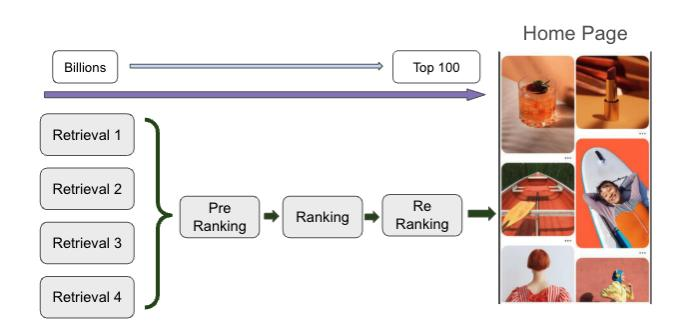
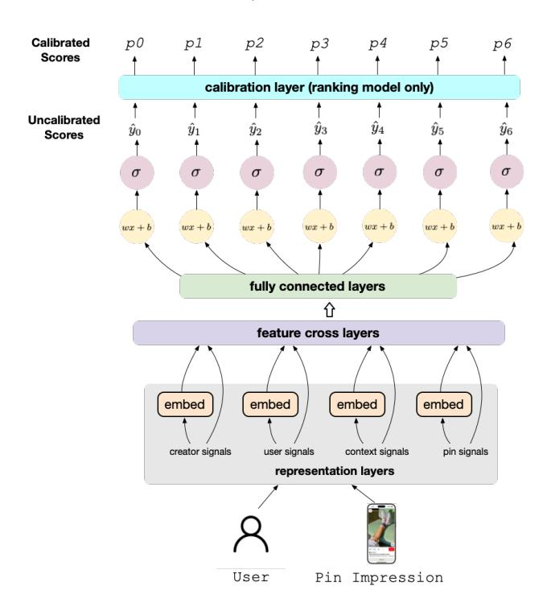
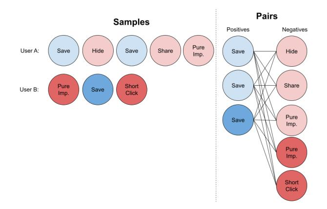
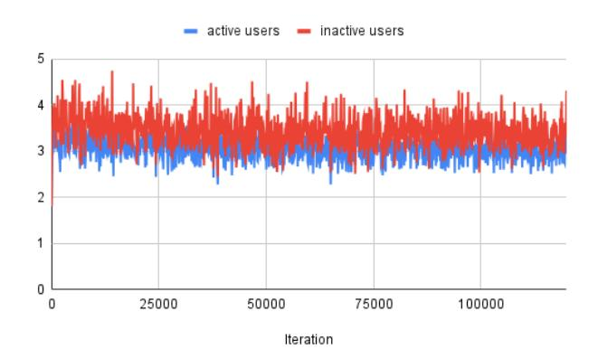
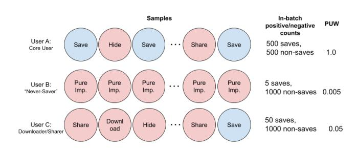

# Improving Multi Task Recommendations via Cross User Learning with a Hybrid Pointwise and Pairwise Ranking Loss

Abhinav Naikawadi Hedi Xia Dafang He Yichu Zhou anaikawadi@pinterest.com hxia@pinterest.com dhe@pinterest.com yichuzhou@pinterest.com Pinterest Inc. San Francisco, California, USA

Xue Xia Piyush Maheshwari Bella Huang xxia@pinterest.com pmaheshwari@pinterest.com shuang@pinterest.com Pinterest Inc. San Francisco, California, USA

Bowen Deng James Li Dhruvil Deven Badani Yijie Dylan Wang bdeng@pinterest.com jamesli@pinterest.com dbadani@pinterest.com dylanwang@pinterest.com Pinterest Inc. San Francisco, California, USA

#### Abstract

Modern recommendation systems widely adopt multi-task learning (MTL) to optimize multiple engagement objectives (e.g. like, click, save). A common formulation models each objective as a binary task and trains with a task-weighted Binary Cross-Entropy (BCE) loss, which promotes positive transfer and helps mitigate label sparsity by enabling low-volume tasks to learn from richer ones. Building upon the effectiveness of the BCE loss for cross-task sharing, we show that augmenting the objective with an additional pairwise ranking loss yields further gains by enabling cross-user learning. Our approach introduces three practical components that make the hybrid loss effective at scale: (i) a cross-user pair construction strategy that forms informative positive–negative pairs across users, (ii) a dynamic per-user weighting scheme that rescales cross-user contributions based on user activity patterns, and (iii) a batch normalization technique that enables adoption for ranking models without calibration. The hybrid loss design is robust in MTL settings and scales to production. We validate the method with extensive offline evaluations and online A/B testing on high-traffic Pinterest surfaces. The approach is now deployed to production across multiple surfaces and stages of the ranking funnel, where it delivers consistent improvements in key engagement and top-line metrics.

## CCS Concepts

- Information systems → Learning to rank.

## Keywords

Recommendation System, Learning to Rank, Pairwise Loss, Cross User Learning, Multi-task Learning

#### ACM Reference Format:

Abhinav Naikawadi, Hedi Xia, Dafang He, Yichu Zhou, Xue Xia, Piyush Maheshwari, Bella Huang, Bowen Deng, James Li, Dhruvil Deven Badani, and Yijie Dylan Wang. 2026. Improving Multi Task Recommendations via

[This work is licensed under a Creative Commons Attribution 4.0 International License.](https://creativecommons.org/licenses/by/4.0) WWW '26, Dubai, United Arab Emirates.

© 2026 Copyright held by the owner/author(s). ACM ISBN 979-8-4007-2307-0/2026/04 <https://doi.org/10.1145/3774904.3792823>

Cross User Learning with a Hybrid Pointwise and Pairwise Ranking Loss. In Proceedings of the ACM Web Conference 2026 (WWW '26), April 13–17, 2026, Dubai, United Arab Emirates. ACM, New York, NY, USA, [9](#page-8-0) pages. <https://doi.org/10.1145/3774904.3792823>

### 1 Introduction

The scale of available Internet media has dramatically increased over time, making it imperative for online platforms to recommend relevant content to users. This is critical to Pinterest, a platform with millions of MAU who come for inspirational ideas.

The commonly adopted approach by modern recommendation systems is to reduce the scope of possible content from billions to dozens by employing a cascaded funnel consisting of multiple stages: Retrieval, Pre-ranking, Ranking, and Re-ranking. In each of these stages, it is important to optimize for several onsite actions to best model user engagement. For example, at Pinterest, we optimize for high-intent onsite actions such as saves, closeups, clicks, hides, etc. given users' past online feedback in training logs. As a result, it is natural for most ranking and pre-ranking models to primarily rely on predicting action probability with multi-task BCE objectives. When combined with a calibration layer, it enables scale-calibrated prediction so the latter stages of the funnel can directly consume the output from earlier stages. This is a common paradigm in modern recommendation system design.

We augment the standard BCE objective with an additional pairwise ranking loss to promote cross-user learning and improve generalization. The approach is model-agnostic and can be applied to common MTL settings. In typical recommendation training pipelines, mini-batches contain examples from many users [\[24\]](#page-8-1). This structure enables us to form cross-user positive–negative pairs within each batch. We therefore combine task-weighted binary cross-entropy loss with a cross-user pairwise loss computed over these pairs. Across multiple offline evaluations and online A/B tests, this hybrid objective consistently improves performance over a BCE loss baseline.

Our major contributions can be summarized into three areas:

- Cross User Learning: We studied a novel perspective of the hybrid pointwise and pairwise loss in terms of its potential for leveraging cross-user learning. To the best of our knowledge, this is the first work that specifically addresses

Figure 1: End-to-end cascaded recommendation funnel design. It consists of retrieval (typically multiple different retrieval strategies), pre-ranking layer (a light ranking model that scores ∼10K candidates), the ranking stage which scores ∼1-2k candidates, followed by a final reranking stage or policy layer that determines the final order presented to the users.

cross-user learning with pairwise loss and demonstrates its value empirically.

- Multi Task Learning Application: While previous pairwise loss methods focused on single-task prediction regimes (such as CTR prediction), our work applies to the broader setting of multi-task learning (MTL) [\[4,](#page-8-2) [6,](#page-8-3) [25\]](#page-8-4) in recommendation systems. We explore how cross-user pairwise learning can be effectively applied to MTL problems, and propose novel solutions such as a per-user weighting scheme and logit batch normalization technique to address MTL-specific challenges.
- Extensive Empirical Studies: We demonstrate the superiority of the designed algorithms by substantial experimentation on multiple real world offline evaluation datasets containing engagement records of millions of users. Additionally, we conduct thorough online experimentation with significant traffic percentages where we apply our algorithm for multiple surfaces and across various stages of key high-traffic Pinterest production recommendation system pipelines, including Home Feed Pre-ranking, Home Feed Ranking, and Notification Ranking. Our results demonstrate that the approach effectively supports cross-user learning in a MTL setting across these domains and models, validating the efficacy of our proposed method. Finally, all changes for the reported surfaces and models have been successfully deployed into production and continue to consistently drive Pinterest user engagement and retention over the course of several months.

### 2 Related Works

## 2.1 Multi-Objective Recommendation with Binary Cross Entropy

Modern recommendation systems follow a standard multi-objective approach that tries to learn scale-calibrated probability [\[22\]](#page-8-5). With the advance of deep neural networks in recent years [\[5\]](#page-8-6), industrylevel recommendations deploy deep models with billions of parameters to predict multiple objectives [\[13\]](#page-8-7) using rich feature input sets and complicated feature crossing [\[18,](#page-8-8) [19,](#page-8-9) [23\]](#page-8-10). The major motivation of applying MTL is to leverage shared representation learning for different tasks, which thereby enables better transfer learning. Ma et al. proposed leveraging mixture of experts [\[10\]](#page-8-11) to address the MTL challenge of potentially conflicting objectives. Tang et al. [\[17\]](#page-8-12) proposed to adopt a progressive routing mechanism to extract meaning representation for MTL to prevent negative transfer.

In recommendation systems, the major task is often binary crossentropy (BCE). The model predicts probabilities for each action, followed by a small calibration layer to achieve scale calibration. This setup makes sure that our model prediction is stable during retraining and helps us consistently achieve various business objectives in later stages. Various modern recommendation systems leverage this framing in their CTR (click-through rate) prediction [\[7,](#page-8-13) [11\]](#page-8-14).

## 2.2 Ranking Loss in Modern Recommendation

In traditional learning to rank problems [\[3\]](#page-8-15), researchers have long studied two fundamental formulations: pairwise and listwise. The pairwise approach tries to ensure that positive sample logits are always greater than those of negative samples. There are many works exploring this objective such as RankNet [\[2\]](#page-8-16) and PRM [\[12\]](#page-8-17). Hinge loss is incorporated in the pairwise paradigm and improves the performance further [\[16\]](#page-8-18). The listwise approach, on the other hand, tries to encourage positive samples to achieve a higher ranking within the list of all samples. For example, ListNet [\[3\]](#page-8-15) tries to minimize the difference between the predicted ranking list and a ground truth ranking list.

ListMLE [\[20\]](#page-8-19) and PiRank [\[15\]](#page-8-20) are some other popular ranking algorithms which also achieved strong improvements over predecessors. Although the ranking loss has proven to be powerful in optimizing ranking problems, the output scores are not scalecalibrated and this intrinsically limits its usage in modern recommendation systems, which are scale-sensitive. To address this, in various literature [\[1,](#page-8-21) [8,](#page-8-22) [9\]](#page-8-23), researchers propose combining a ranking loss with the BCE loss and claim to have achieved substantial improvements. In some works, the BCE loss itself is shown to have shortcomings in recommendation system settings. For example, in [\[9\]](#page-8-23), they demonstrate the gradient vanishing problem for negative samples in cases of sparse user feedback by deriving this gradient for their CTR prediction setting. In [\[1\]](#page-8-21), the author claims that pointwise prediction and list-wise optimization are not fully aligned, and they propose a listwise loss that is theoretically aligned with point-wise prediction. Other related industry efforts include [\[8\]](#page-8-22), in which the authors started to explore a combined loss for the Twitter feed. In another work [\[1,](#page-8-21) [22\]](#page-8-5), the authors started to look at intrinsic problems when combining these two losses at Google,

1We are publishing code at<https://github.com/pinterest/hf-research>

and in [\[14\]](#page-8-24), the authors study the triplet ranking loss in the online advertising area.

In this paper, we study a different problem in the recommendation systems domain on how we could utilize a cross-user pairwise ranking loss to enhance cross-user learning in conjunction with the traditional BCE loss. We capitalize on the fact that users have diverse activity patterns and we leverage the common real world production setup where during training, we typically form minibatches of training data with a diverse user cohort. This enables us to do cross-user learning within each individual batch. Additionally, we propose novel techniques in per-user weighting and logit batch normalization to practically apply the hybrid loss to a MTL setting, which is not a focus of prior work.

## 3 Methodology

## 3.1 Dataset and Sampling

Before discussing the hybrid pointwise and pairwise loss approach, we include a brief discussion of the training data and sampling mechanism used, as it is highly relevant to the design of the loss function. The home feed training data is constructed as an impression-level dataset. Each row corresponds to a user and an impressed pin, with several labels for different onsite actions such as saves, closeups, clicks, hides, etc. The presence of a particular action, whether it is a positive or negative action, constitutes a positive label, and the absence is a negative label.

An important characteristic of the training data is the sampling strategy we utilize. We retain 100% of the positives for most actions, except for a few particularly high frequency actions, for which we employ a fixed percentage sampling rate. In contrast, for negatives (i.e. pure impressions with no actions), we employ fixed downsampling strategies. As a result, this sampling methodology with 100% upsampling of positives and negative downsampling leads to a significant skew in the dataset towards users with a higher action rate. We define the following 2 main cohorts of users, differentiated by frequency of high-intent actions.

- Active users: Users that use Pinterest frequently and regularly perform high intent engagement actions (i.e. saves)
- Inactive users: Users that use Pinterest frequently, butrarely perform high intent engagement actions (i.e. saves)

In other words, the inactive user save rate, si , is significantly less than sa, the active user save rate. Due to the lesser number of inactive user positives and the 100% positive sampling strategy, inactive users make up a significantly smaller portion of the training dataset. This poses a significant challenge for how to learn better feature representation for this cohort, and is the primary motivation behind our approach. This is a common pattern in many industrial recommendation systems where the training data mostly focuses on a majority cohort of active users, while the minority group of inactive or passive users is underrepresented. As a result, it becomes particularly imperative that we enhance the model's ability to learn inactive user behavior.

### 3.2 Pointwise BCE Loss

The home feed ranking and retrieval models at Pinterest today already leverage a pointwise BCE loss to model for several different

Figure 2: Model Architecture. For the ranking model the loss function is L = L������ + L���� . For the pre-ranker, the loss function is L = L������ + L�������� ������ + L���� where L�������� ������ is a distillation loss between pre-ranker and ranker scores. One major architecture difference between the pre-ranker and ranker architecture is that the pre-ranker outputs are not calibrated. For further information on our ranking model architecture, refer to [\[21\]](#page-8-25)

onsite engagement actions, with the most important being saves and closeups. As seen in Figure [2,](#page-2-0) the final layer of the model has N heads that each output a scale calibrated head score, with N corresponding to the number of different onsite engagement actions that we model (1 head per action). The relative importance of actions is enforced via the head-level weights for different terms in the BCE loss, and is tuned for the best aggregate performance on key top-line metrics. To demonstrate where the BCE loss falls short for the inactive user cohort, consider the following derivation.

Let U�� and U�� represent the "active" and "inactive" user cohorts respectively, with |UA | &gt; |U�� |. Let us denote a single sample of training data with inactive user ��, pin ��, label ��, and the corresponding model output score y: ˆ

S = {(��, ��, ��,��ˆ)} with �� ∈ UI

The pointwise BCE loss is formally defined as:

L������ = 1 �� ∑︁ ��=1 -−���� log��ˆ�� − (1 − ����) log(1 − ��ˆ��)

The model output probability score can be expressed as the sigmoid of the raw output logits:

��ˆ�� = �� �� (��, ��) = 1/(1 + �� −�� )

The gradient of the BCE loss for an inactive user's negative sample w.r.t. the logits can then be computed as follows:

��L������ �� �� = 1 ��(1 − ��ˆ) ����ˆ �� �� = 1 ��(1 − ��ˆ) ��ˆ(1 − ��ˆ) = ��ˆ ��

We see that the gradient for the negative example corresponds to the output score, y. A similar derivation is also shown in [ ˆ [9\]](#page-8-23), and we come to the same conclusion that this gradient thus corresponds to the empirical inactive user positive rate, si , due to the globally optimizing nature of the BCE loss. Given that si is very small (si « 1), the gradient corresponding to inactive users' negatives is also very small. It is worth noting that the gradient corresponding to active users' negatives could be derived almost identically and would also be relatively small as sa/si > 1, but still sa < 0.5.

## 3.3 Pairwise Ranking Loss

The pairwise ranking loss portion of the hybrid objective is largely inspired by the original RankNet pairwise ranking loss, as is also the case in [\[9\]](#page-8-23). We retain the standard log-sigmoid difference of the positive and negative example logits. However, the key distinction comes from our exact method of pair construction and the associated definition of "positives" and "negatives" in each pair.

### 3.4 Pair Construction

Differing from the original RankNet formulation, where the pairs are constructed from within the same user, we construct the pairs using a cartesian product between all positive and negative examples per head (i.e. per action) within one mini-batch of training data. As seen in Figure [3,](#page-3-0) this means for a particular head, say the save head, all non-saves in the mini-batch of training data become negatives to be paired with all the save positives in the mini-batch, regardless of the user corresponding to the action. This cross-user pair construction can be formalized as below, with P and N denoting all positives and negatives respectively in the batch, regardless of user.

��pw = − |�� ||�� | ∑︁ �� ∈�� ∑︁ ��∈�� log ��(�� (��) − �� (��)), (1)

The justification for this method of pair construction is due to the benefits of cross-user learning enabled by the pairwise ranking loss, but absent in the BCE loss. In low positive action rate scenarios, the BCE loss helps to learn primarily from positive examples, as demonstrated by the earlier derivation of the negative example gradient. This effect is particularly debilitating for the inactive user cohort, which has an especially low positive action rate, and furthermore, is underrepresented in the dataset due to having such few positives. By adding cross-user pair construction, we can significantly increase the effective number of examples, mostly from active users, that the model can leverage for better inactive user learning.

Figure 3: Cross User Pair Construction

We support this claim with offline studies on the Home Feed Core Ranking Model to evaluate the importance of the cross user pair construction for inactive user learning. Specifically we compare the relative improvements in Hits@3 metrics, the main offline evaluation metric we rely on, for key engagement actions: Saves, Clicks, and Closeups.

Table 1: Same-User vs. Cross-User Pairs: Hits@3 Lifts (%)

| Method           | Click | Closeup | Save  |
|------------------|-------|---------|-------|
| Same-User Pairs  | -0.32 | +0.02   | +0.17 |
| Cross User Pairs | +3.33 | +1.02   | +1.15 |

From Table [1,](#page-3-1) we see that the offline hits@3 engagement metrics lifts are significantly better for cross-user pair construction as compared to the same-user pair construction in the traditional pairwise ranking loss. We suggest that while same user pairs are less noisy, they do not allow for any cross-user learning, limiting their benefit.

Table 2: Cross-User Pair Comparison: Hits@3 Lifts (%)

| Method |          |      |       | Click | Closeup | Save  |
|--------|----------|------|-------|-------|---------|-------|
| Only   | Inactive | User | Pairs | +3.28 | -0.80   | -2.55 |
| Only   | Active   | User | Pairs | +1.91 | +0.07   | +0.27 |
| Full   | Cross    | User | Pairs | +4.99 | +0.59   | +0.93 |

The ablation in Table [2](#page-3-2) serves to understand the additional value of the cross-user learning specifically between users from differing cohorts (i.e. inactive x active pairs). We observe that inactive-useronly pair construction is ineffective (i.e. huge regressions in saves and closeups, the 2 most important metrics), likely because inactive users have insufficient positive examples to learn from each other. For active-user-only pairs, there is some gain across all engagement metrics. This is aligned with the cross-user learning hypothesis because active users have more positives and better dataset representation, leading to more cross-user pairs. Finally, we see that the full-cross user pair construction has the largest offline engagement lifts, demonstrating that our cross-user pair construction is critical to our utilization of the pairwise loss.

Figure 4: Gradient study of the last-layer gradient norm ratio between the hybrid pairwise + BCE loss vs. sole BCE loss

in section [3.7.](#page-5-1) In summary, pairwise loss negatives for a particular head could be pairwise loss positives for one or more other heads. When we only include a small number of heads in the pairwise loss that are largely aligned in their positives and negatives, this is not an issue. But when we include several heads for actions that are more disjoint in the training data, it may result in misaligned cross-user signals for these heads.

Table 3: Head Subset Study: Hits@3 Lifts (%)

We analyzed the head subset performance extensively offline with several head combinations and weights. In Table [3,](#page-5-2) we present a few groups from our Home Feed core ranking model to show the underlying trend. We see that as we add more heads, beyond the most important save and closeup heads, performance regresses for the most important heads, despite meticulous weight tuning. It is worth mentioning that we find adding another action that is not conflicting in cross-user signal to saves and closeups, such as clicks, can avoid significant regressions, but also without notable lifts as we see in section [4.1.](#page-6-0) Finally, we also note that we could successfully apply the pairwise loss to all heads in the Home Feed Pre-ranking model once we introduced our novel batch normalization method discussed in Section [3.8](#page-6-1) to rescale logits prior to loss computation. However, this method is unique to the Pre-ranking setting where we do not have a calibration layer.

## 3.7 Per-User Weighting

We now describe a key innovation we adopt to effectively leverage the cross-user learning for inactive users from the pairwise loss: a per-user weighting scheme for negatives in the pairwise loss. In particular, we note three key observations during initial online A/B testing with the Home Feed Core Ranking model that demonstrate the need for a practical modification to our pairwise

loss formulation to avoid significant cross-user noise originating from misleading negative examples.

- User Cohort Discrepancy: Inactive users saw very strong save volume lift, while active users' save volume lift was much subtler.
- Metric Tradeoffs for Other Onsite Actions: Lifts in the primary engagement metric, saves, were strong, but other actions like clicks, shares, downloads, screenshots saw regressions.
- Declining User Propensity: Despite very strong lifts in engagement volume initially, we saw a very consistent trend across experiment groups in user propensity decay (actions per user) over several days into the experiment, that ultimately led to volume regression.

The combination of these factors led to the negative pattern of decaying metrics over time and significant metric tradeoffs. Specifically, we present the online experiment results for the online pairwise loss group after running the experiment for an extended period of 3.5 weeks, with 1.5% global traffic for each group.

Table 4: Non-Per-User-Weighting Online Study: Relative regressions (%) on Successful Sessions (SS) and Engagement.

We hypothesized that these longer-term online behaviors were due to user action preference discrepancies. Specifically we consider two key types of action preference discrepancies that act as sources of noise in the pairwise loss under the cross-user pair construction:

- Alternative Positive Action Preference: We often observe that higher-intent onsite actions tend to be more disjoint. This is simply due to the diversity of high-intent action options on Pinterest. To engage with pins, users may prefer to save, download, share, like, etc. This leads to actions such as downloads that are considered non-saves and thus considered negatives in the save pairwise loss term, despite still being a positive high-intent action.
- High Volume Non-Action Preference: Users that never save or engage in any other positive high-intent action contribute almost entirely negatives to the pairwise loss, but these are likely not meaningful as the users do not save regardless of the relevance or quality of the content.

To resolve these issues, we introduce per-user weighting to the pairwise loss negatives. As illustrated in Figure [5,](#page-6-2) we weight the pairwise loss at a per-user-per-head level based on users' in-batch positive-to-negative action rates for a given head. The idea is to dynamically denoise the cross-user pairwise loss by mitigating the contribution from users with significant volume of non-meaningful negatives (mostly inactive users, hence the user cohort discrepancy) due to their action preference discrepancies. We are able to leverage in-batch user positive-to-negative action rates because our training data is sorted by user-ID, a pre-existing dataset property for cost-effective storage. As a result, the in-batch positive-to-negative action rates are a reasonable proxy to user action preferences. After incorporating the per-user weighting scheme for pairwise loss

- Save-Closeup: Apply pairwise loss to the save and closeup heads, the two most important heads
- Closeup-Only: Apply pairwise loss only to the closeup head, which suffers less from user action preference discrepancies
- Save-Closeup-Click: Apply pairwise loss to the save, closeup, and click heads, to test including alternative positive actions

Table 5: Core Ranking Online Study: All Users Relative lifts (%) on Successful Sessions (SS) and Engagement.

| Method             |          | SS    | Click | Closeup | Save  |
|--------------------|----------|-------|-------|---------|-------|
| Save-Closeup       | Pairwise | +0.03 | +0.49 | +0.06   | +0.62 |
| Save-Closeup-Click | Pairwise | +0.04 | +0.19 | -0.04   | +0.51 |
| Closeup-Only       | Pairwise | +0.07 | +0.71 | +0.29   | -0.02 |

We see the strongest save lifts in the Save-Closeup pairwise group, in line with expectations. We also note that with the peruser weighting included in all of these variants, we no longer see regressions, and actually even see lifts, for alternative positive actions such as clicks, including groups that do not include clicks in the pairwise loss terms. We also do not observe any online propensity decay, meaning all online issues observed in Table [4](#page-5-3) are resolved. Along with this MTL transfer, we also validate the cross-user learning value via the inactive user metrics.

Table 6: Core Ranking Inactive Users Online Study: Relative lifts (%) on Successful Sessions (SS) and Engagement.

| Method             |          | SS    | Click | Closeup | Save  |
|--------------------|----------|-------|-------|---------|-------|
| Save-Closeup       | Pairwise | +0.18 | +1.12 | +0.33   | +1.34 |
| Save-Closeup-Click | Pairwise | +0.10 | +0.85 | +0.28   | +1.11 |
| Closeup            | Pairwise | +0.19 | +0.84 | +0.47   | +0.85 |

We see more significant lifts for inactive users across engagement and successful sessions. This validates the previous theoretical derivations and offline cross-user learning results and empirically demonstrates the value of the pairwise loss for cross-user learning.

### 4.2 Experiment on Home Feed Pre-ranking Model

We also report the online experiment results for the Pre-ranking model. Notably, we ablate the effect of batch normalization and per-user weighting on the pairwise loss:

- All Heads Pairwise (No BatchNorm): Pairwise loss applied to all heads, no normalization
- Tuning Head Weights: Pairwise loss with extensive grid search for optimal head weighting (best successful sessions of 8 configurations shown)
- Subsetting Heads: Pairwise loss applied to a subset of heads
- Pairwise + BatchNorm: Batch normalization applied to logits before pairwise loss.
- BatchNorm + Per-User Weighted Pairwise: Incorporates per-user negative weighting (see Section [3.7\)](#page-5-1)

Without batch normalization, applying pairwise loss to all heads fails to improve, or even negatively impacts, session and engagement metrics. Tuning head weights or using subsets also does not

Table 7: Pre-ranking Online Study: All Users Relative Lifts (%) on Successful Sessions (SS) and Engagement.

| Method                      | SS    | Impr. | Closeup | Save  |
|-----------------------------|-------|-------|---------|-------|
| All Heads Pairwise          | -0.03 | +0.06 | -0.19   | -0.27 |
| Pairwise + Head Weights     | -0.02 | -0.15 | -0.24   | -0.70 |
| Pairwise + Subsetting Heads | -0.02 | +0.30 | -0.60   | +0.26 |
| Pairwise + BatchNorm        | +0.09 | +0.16 | +0.58   | -0.26 |
| Pairwise + BN & User Wt.    | +0.12 | +0.43 | +0.48   | +0.39 |

yield consistent improvement. In contrast, the batch-normalized pairwise loss variants achieve the only robust and consistent lift in successful sessions (+0.09%), alongside gains in impression and closeup. The per-user weighted variant (see Section [3.7\)](#page-5-1) additionally yields notable improvement in saves, supporting the value of user-specific negative denoising.

## 4.3 Experiment on Notifications Ranking Model

We also report results from adoption of the hybrid pointwisepairwise loss approach to the core Notifications ranking model at Pinterest, demonstrating the robustness of this approach across domains.

Table 8: Notifications Ranking Online Study: All Users Relative Lifts (%) on WAU and Engagement.

| Method        |          | Email Click | Save  | WAU   |
|---------------|----------|-------------|-------|-------|
| Email-Closeup | Pairwise | +0.30       | +0.30 | +0.07 |
| Closeup       | Pairwise | -0.06       | +0.11 | +0.00 |

We again find that applying the pairwise loss to the most important actions in the notifications domain, email clicks and closeups, leads to significant gains in engagement metrics, and more importantly, a large relative WAU increase for the treatment group, a key topline metric movement.

### 5 Conclusion

The multi-task learning problem is a widely adopted paradigm in recommendation systems, that conventionally relies on a sole BCE loss. We find that previous work shows the value of a pairwise loss to improve ranking model performance. We build upon this literature by demonstrating the value of our cross-user pair construction to encourage cross-user learning. We then propose novel methods, a per-user weighting scheme and batch normalization technique, to effectively apply this hybrid loss formulation to a multi-task learning setting. Finally, we demonstrate significant lifts in offline and online engagement and top-line metrics, with replicated success across surfaces and models for different ranking stages at Pinterest.

## 6 Acknowledgments

We would like to thank Jaewon Yang, Jinfeng Rao, David Woo, Jiajing Xu, Matthew Lawhon, XianXing Zhang, Dimitra Tsiaousi, and Tingting Zhu for their technical feedback and help in adopting the methodology across Pinterest.

#### References

[1] Aijun Bai, Rolf Jagerman, Zhen Qin, Le Yan, Pratyush Kar, Bing-Rong Lin, Xuanhui Wang, Michael Bendersky, and Marc Najork. 2023. Regression compatible listwise objectives for calibrated ranking with binary relevance. In Proceedings of the 32nd ACM International Conference on Information and Knowledge Management. 4502–4508. [2] Chris Burges, Tal Shaked, Erin Renshaw, Ari Lazier, Matt Deeds, Nicole Hamilton, and Greg Hullender. 2005. Learning to rank using gradient descent. In Proceedings of the 22nd international conference on Machine learning. 89–96. [3] Zhe Cao, Tao Qin, Tie-Yan Liu, Ming-Feng Tsai, and Hang Li. 2007. Learning to rank: from pairwise approach to listwise approach. In Proceedings of the 24th international conference on Machine learning. 129–136. [4] Rich Caruana. 1997. Multitask learning. Machine learning 28, 1 (1997), 41–75. [5] Paul Covington, Jay Adams, and Emre Sargin. 2016. Deep neural networks for youtube recommendations. In Proceedings of the 10th ACM conference on recommender systems. 191–198. [6] Michael Crawshaw. 2020. Multi-task learning with deep neural networks: A survey. arXiv preprint arXiv:2009.09796 (2020). [7] Xinran He, Junfeng Pan, Ou Jin, Tianbing Xu, Bo Liu, Tao Xu, Yanxin Shi, Antoine Atallah, Ralf Herbrich, Stuart Bowers, et al. 2014. Practical lessons from predicting clicks on ads at facebook. In Proceedings of the eighth international workshop on data mining for online advertising. 1–9. [8] Cheng Li, Yue Lu, Qiaozhu Mei, Dong Wang, and Sandeep Pandey. 2015. Clickthrough prediction for advertising in twitter timeline. In Proceedings of the 21th ACM SIGKDD International Conference on Knowledge Discovery and Data Mining. 1959–1968. [9] Zhutian Lin, Junwei Pan, Shangyu Zhang, Ximei Wang, Xi Xiao, Shudong Huang, Lei Xiao, and Jie Jiang. 2024. Understanding the ranking loss for recommendation with sparse user feedback. In Proceedings of the 30th ACM SIGKDD Conference on Knowledge Discovery and Data Mining. 5409–5418. [10] Jiaqi Ma, Zhe Zhao, Xinyang Yi, Jilin Chen, Lichan Hong, and Ed H Chi. 2018. Modeling task relationships in multi-task learning with multi-gate mixture-ofexperts. In Proceedings of the 24th ACM SIGKDD international conference on knowledge discovery & data mining. 1930–1939. [11] H Brendan McMahan, Gary Holt, David Sculley, Michael Young, Dietmar Ebner, Julian Grady, Lan Nie, Todd Phillips, Eugene Davydov, Daniel Golovin, et al. 2013. Ad click prediction: a view from the trenches. In Proceedings of the 19th ACM SIGKDD international conference on Knowledge discovery and data mining. 1222–1230. [12] Changhua Pei, Yi Zhang, Yongfeng Zhang, Fei Sun, Xiao Lin, Hanxiao Sun, Jian Wu, Peng Jiang, Junfeng Ge, Wenwu Ou, et al. 2019. Personalized re-ranking for recommendation. In Proceedings of the 13th ACM conference on recommender systems. 3–11. [13] Ozan Sener and Vladlen Koltun. 2018. Multi-task learning as multi-objective optimization. Advances in neural information processing systems 31 (2018). [14] Lili Shan, Lei Lin, and Chengjie Sun. 2018. Combined regression and tripletwise learning for conversion rate prediction in real-time bidding advertising. In The 41st international ACM SIGIR conference on research & development in information retrieval. 115–123. [15] Robin Swezey, Aditya Grover, Bruno Charron, and Stefano Ermon. 2021. Pirank: Scalable learning to rank via differentiable sorting. Advances in Neural Information Processing Systems 34 (2021), 21644–21654. [16] Yukihiro Tagami, Shingo Ono, Koji Yamamoto, Koji Tsukamoto, and Akira Tajima. 2013. Ctr prediction for contextual advertising: Learning-to-rank approach. In Proceedings of the Seventh International Workshop on Data Mining for Online Advertising. 1–8. [17] Hongyan Tang, Junning Liu, Ming Zhao, and Xudong Gong. 2020. Progressive layered extraction (ple): A novel multi-task learning (mtl) model for personalized recommendations. In Proceedings of the 14th ACM conference on recommender systems. 269–278. [18] Ruoxi Wang, Rakesh Shivanna, Derek Cheng, Sagar Jain, Dong Lin, Lichan Hong, and Ed Chi. 2021. Dcn v2: Improved deep & cross network and practical lessons for web-scale learning to rank systems. In Proceedings of the web conference 2021. 1785–1797. [19] Zhiqiang Wang, Qingyun She, and Junlin Zhang. 2021. Masknet: Introducing feature-wise multiplication to CTR ranking models by instance-guided mask. arXiv preprint arXiv:2102.07619 (2021). [20] Fen Xia, Tie-Yan Liu, Jue Wang, Wensheng Zhang, and Hang Li. 2008. Listwise approach to learning to rank: theory and algorithm. In Proceedings of the 25th international conference on Machine learning. 1192–1199. [21] Xue Xia, Pong Eksombatchai, Nikil Pancha, Dhruvil Deven Badani, Po-Wei Wang, Neng Gu, Saurabh Vishwas Joshi, Nazanin Farahpour, Zhiyuan Zhang, and Andrew Zhai. 2023. Transact: Transformer-based realtime user action model for recommendation at pinterest. In Proceedings of the 29th ACM SIGKDD Conference on Knowledge Discovery and Data Mining. 5249–5259. [22] Le Yan, Zhen Qin, Xuanhui Wang, Michael Bendersky, and Marc Najork. 2022. Scale calibration of deep ranking models. In Proceedings of the 28th ACM SIGKDD Conference on Knowledge Discovery and Data Mining. 4300–4309. [23] Buyun Zhang, Liang Luo, Xi Liu, Jay Li, Zeliang Chen, Weilin Zhang, Xiaohan Wei, Yuchen Hao, Michael Tsang, Wenjun Wang, et al. 2022. DHEN: A deep and hierarchical ensemble network for large-scale click-through rate prediction. arXiv preprint arXiv:2203.11014 (2022). [24] Shunyu Zhang, Hu Liu, Wentian Bao, Enyun Yu, and Yang Song. 2024. A Selfboosted Framework for Calibrated Ranking. In Proceedings of the 30th ACM SIGKDD Conference on Knowledge Discovery and Data Mining. 6226–6235. [25] Yu Zhang and Qiang Yang. 2021. A survey on multi-task learning. IEEE transactions on knowledge and data engineering 34, 12 (2021), 5586–5609.