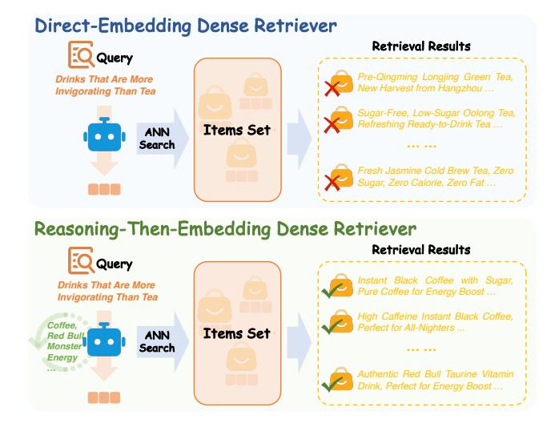
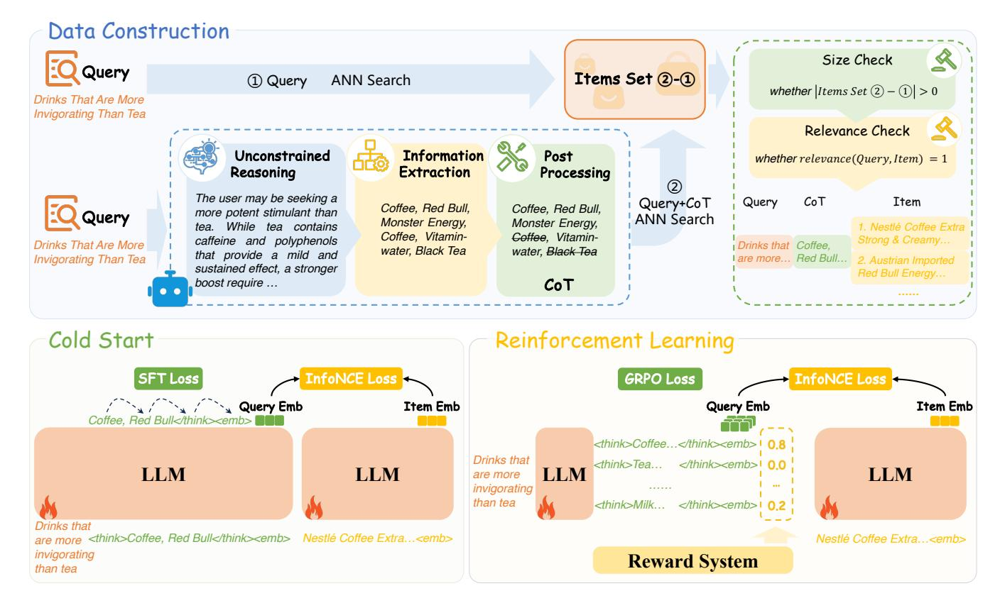
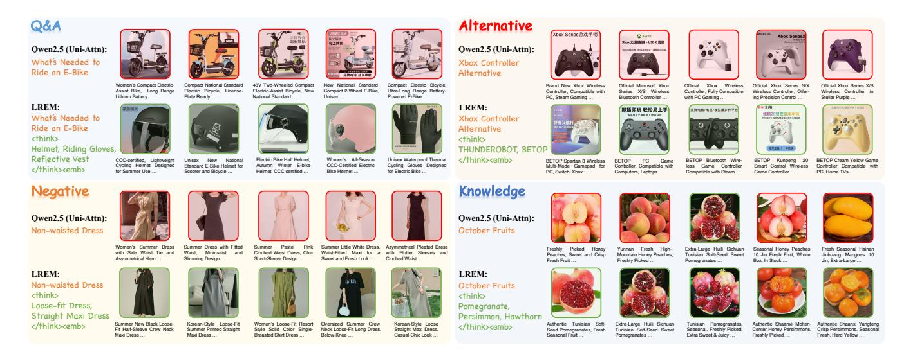
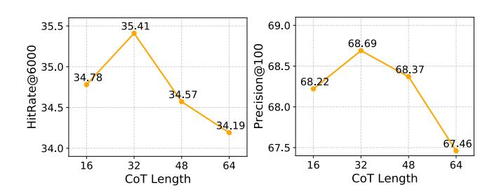
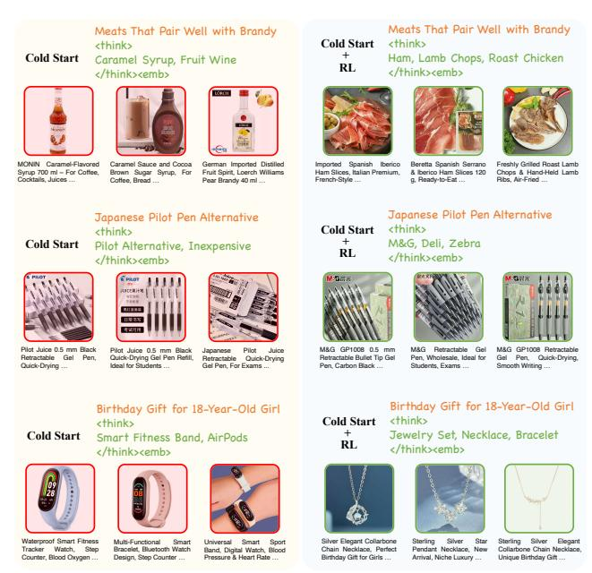

# Large Reasoning Embedding Models: Towards Next-Generation Dense Retrieval Paradigm

Jianting Tang Researcher Hefei, Anhui, China jiantingtang@mail.ustc.edu.cn

Dongshuai Li Taobao & Tmall Group of Alibaba Zhejiang, Hangzhou, China lidongshuai.lds@taobao.com

Tao Wen Taobao & Tmall Group of Alibaba Zhejiang, Hangzhou, China wentao.wen@alibaba-inc.com

Fuyu Lv Taobao & Tmall Group of Alibaba Zhejiang, Hangzhou, China fuyu.lfy@taobao.com

Dan Ou Taobao & Tmall Group of Alibaba Zhejiang, Hangzhou, China oudan.od@taobao.com

Linli Xu Researcher Hefei, Anhui, China linlixu@ustc.edu.cn

# Abstract

In modern e-commerce search systems, dense retrieval has become an indispensable component. By computing similarities between query and item (product) embeddings, it efficiently selects candidate products from large-scale repositories. With the breakthroughs in large language models (LLMs), mainstream embedding models have gradually shifted from BERT to LLMs for more accurate text modeling. However, these models still adopt direct-embedding methods, and the semantic accuracy of embeddings remains inadequate. Therefore, contrastive learning is heavily employed to achieve tight semantic alignment between positive pairs. Consequently, such models tend to capture statistical co-occurrence patterns in the training data, biasing them toward shallow lexical and semantic matches. For difficult queries exhibiting notable lexical disparity from target items, the performance degrades significantly. In this work, we propose the Large Reasoning Embedding Model (LREM), which novelly integrates reasoning processes into representation learning. For difficult queries, LREM first conducts reasoning to achieve a deep understanding of the original query, and then produces a reasoning-augmented query embedding for retrieval. This reasoning process effectively bridges the semantic gap between original queries and target items, significantly improving retrieval accuracy. Specifically, we adopt a two-stage training process: the first stage optimizes the LLM on carefully curated Query-CoT-Item triplets with SFT and InfoNCE losses to establish preliminary reasoning and embedding capabilities, and the second stage further refines the reasoning trajectories via reinforcement learning (RL). Extensive offline and online experiments validate the effectiveness of LREM, leading to its deployment on China's largest e-commerce platform since August 2025.

# CCS Concepts

## • Information systems → Language models.

Permission to make digital or hard copies of all or part of this work for personal or classroom use is granted without fee provided that copies are not made or distributed for profit or commercial advantage and that copies bear this notice and the full citation on the first page. Copyrights for components of this work owned by others than the author(s) must be honored. Abstracting with credit is permitted. To copy otherwise, or republish, to post on servers or to redistribute to lists, requires prior specific permission and/or a fee. Request permissions from permissions@acm.org.

Conference acronym 'XX, Woodstock, NY © 2018 Copyright held by the owner/author(s). Publication rights licensed to ACM. ACM ISBN 978-1-4503-XXXX-X/2018/06

<https://doi.org/XXXXXXX.XXXXXXX>

# Keywords

Dense Retrieval, Large Language Models, Reasoning, Embedding

#### ACM Reference Format:

Jianting Tang, Dongshuai Li, Tao Wen, Fuyu Lv, Dan Ou, and Linli Xu. 2018. Large Reasoning Embedding Models: Towards Next-Generation Dense Retrieval Paradigm. In Proceedings of Make sure to enter the correct conference title from your rights confirmation email (Conference acronym 'XX). ACM, New York, NY, USA, [12](#page-11-0) pages.<https://doi.org/XXXXXXX.XXXXXXX>

# 1 Introduction

With the advancement of deep learning, dense retrieval [\[12,](#page-8-0) [13,](#page-8-1) [39\]](#page-8-2) has become an indispensable component of modern e-commerce search systems. By leveraging text embedding models pre-trained on large-scale corpora, dense retrieval is effective at capturing semantic relationships between query texts and item texts. During retrieval, it compares the query embedding against all pre-stored item embeddings to return the most relevant candidates.

The semantic accuracy of embeddings is critical to dense retrieval performance. In the past, BERT [\[8\]](#page-8-3), RoBERTa [\[32\]](#page-8-4), and T5 [\[45\]](#page-8-5) were widely adopted as text embedding models. Recently, LLMs such as LLaMA4 [\[38\]](#page-8-6), Gemma3 [\[51\]](#page-9-0), and Qwen3 [\[59\]](#page-9-1) have achieved significant breakthroughs in text understanding and generation. Motivated by these advances, recent work has explored adapting LLMs into embedding models to leverage their extensive world knowledge and powerful language modeling capabilities. For example, RepLLaMA [\[36\]](#page-8-7) directly uses the last-token hidden state of LLaMA2 [\[53\]](#page-9-2) as the text embedding. NV-Embed [\[23\]](#page-8-8) modifies the LLM architecture by introducing bidirectional attention and a novel latent attention layer to produce more accurate embeddings.

Despite leveraging more powerful LLMs, current dense retrievers still adopt direct-embedding methods [\[23,](#page-8-8) [25,](#page-8-9) [36\]](#page-8-7) that generate embeddings in a single forward pass, in which the semantic accuracy of embeddings remains significantly constrained. To compensate, these models rely heavily on contrastive learning [\[21\]](#page-8-10) to forcibly align human-annotated positive query-item pairs in the embedding space, while pushing negative pairs apart. Consequently, this paradigm encourages the model to exploit superficial co-occurrence patterns in the training data and to engage in shallow lexical or semantic matching [\[7,](#page-8-11) [48,](#page-9-3) [50\]](#page-9-4). When handling difficult queries that exhibit notable lexical disparity from the target items, performance degrades significantly. As illustrated in Figure [1,](#page-1-0) for the

Figure 1: Comparison between traditional direct-embedding and the proposed reasoning-then-embedding dense retriever (LREM). LREM leverages reasoning to enable deep query understanding and accurate embeddings, overcoming the superficiality of direct-embedding methods.

query "Drinks That Are More Invigorating Than Tea", the directembedding dense retriever produces an inaccurate embedding, returning a large proportion of tea-based drinks rather than intended targets like Coffee or Red Bull.

As inherently generative models, LLMs excel at achieving precise semantic understanding of texts through explicit chain-of-thought (CoT) reasoning [\[3,](#page-8-12) [49,](#page-9-5) [56,](#page-9-6) [60\]](#page-9-7). However, harnessing this distinctive capability for dense retrieval remains largely underexplored in the current literature. Therefore, to unlock the full potential of LLMs, we propose the Large Reasoning Embedding Model (LREM), an entirely new paradigm that integrates reasoning into representation learning. For difficult queries, where directly generating the embedding in a single forward pass results in poor semantic accuracy, LREM performs an explicit reasoning process through CoT generation. Consequently, the CoT serves as a semantic bridge, effectively linking original difficult queries with target items and ultimately enhancing retrieval performance. This reasoning-then-embedding paradigm advances the development of a more intelligent generation of dense retrievers.

To equip LREM with both powerful reasoning and embedding capabilities, we develop a sophisticated data construction pipeline, as illustrated in Figure [2.](#page-3-0) First, we collect queries from online logs—specifically those exhibiting poor performance under traditional direct-embedding dense retrievers. Then, we employ the advanced Qwen3-30B-A3B-Instruct [\[59\]](#page-9-1) LLM to generate a CoT for each query. To maximize information density and emphasize critical contents, each CoT is finally structured as a compact list of keywords. Then, we feed the query with CoT into a traditional dense retriever to obtain candidate items and filter the results with a relevance model. Consequently, this pipeline yields approximately 75.06 million Query-CoT-Item triples. We adopt a two-stage training process. In the first stage, LREM is jointly optimized via supervised

fine-tuning (SFT) and InfoNCE losses, thereby acquiring preliminary reasoning and embedding capabilities. In the second stage, to further refine the reasoning trajectories and enhance CoT quality, we apply a GRPO-based [\[49\]](#page-9-5) RL algorithm while retaining the InfoNCE loss to maintain embedding alignment.

In summary, the contributions of this work are as follows:

- We propose LREM, a next-generation dense retriever based on a novel reasoning-then-embedding paradigm, effectively overcoming the shallow semantic matching limitations of direct-embedding approaches.
- We introduce an effective data construction pipeline and a two-stage training process that fully exploit the LLM's reasoning and embedding capabilities.
- Extensive offline and online experiments demonstrate the effectiveness of our proposed LREM, establishing a solid foundation for future research in dense retrieval.

# 2 Related Work

# 2.1 Dense Retrieval

In dense retrieval [\[4,](#page-8-13) [22,](#page-8-14) [63\]](#page-9-8), queries and items are encoded into a shared semantic space, and relevant items are returned based on embedding similarity using approximate nearest neighbor (ANN) [\[2,](#page-8-15) [19,](#page-8-16) [31\]](#page-8-17) search algorithms. Traditional dense retrieval methods primarily rely on fine-tuning pre-trained encoders such as BERT [\[8\]](#page-8-3), RoBERTa [\[32\]](#page-8-4), or T5 [\[45\]](#page-8-5) via contrastive learning to align text embeddings. Recently, increasing studies have adopted LLMs as backbones [\[24,](#page-8-18) [30,](#page-8-19) [37,](#page-8-20) [55\]](#page-9-9) for dense retrieval, leveraging their superior semantic understanding capability and extensive world knowledge. Among them, RepLLaMA [\[36\]](#page-8-7) is the first to demonstrate the effectiveness of directly fine-tuning an open-source LLM for dense retrieval, establishing a strong baseline. Llama2Vec [\[25\]](#page-8-9) applies unsupervised post-pretraining with novel embedding-oriented objectives (EBAE and EBAR) to further improve embedding quality. NV-Embed [\[23\]](#page-8-8) reconfigures the decoder-only architecture with bidirectional attention and an additional latent attention layer, enhancing embedding discriminability. ICL-Embedder [\[26\]](#page-8-21) further enhances generalization by explicitly training the model to leverage incontext examples during embedding generation, resulting in robust few-shot retrieval capabilities. Currently, LLM-based embedding models have achieved SOTA performance across various text retrieval benchmarks, including the MTEB [\[41\]](#page-8-22). However, these models still follow the direct-embedding method and perform poorly on difficult queries that requiring reasoning.

# 2.2 LLM Reasoning

Early methods—like Chain-of-Thought (CoT) [\[56\]](#page-9-6), Tree-of-Thought (ToT) [\[60\]](#page-9-7), and Graph-of-Thought (GoT) [\[3\]](#page-8-12)—relied on humancrafted prompting strategies to guide LLMs in producing reasoning steps or exploring branching trajectories [\[18,](#page-8-23) [54,](#page-9-10) [66,](#page-9-11) [70\]](#page-9-12). However, within these frameworks, LLMs are unable to learn from prior explorations and to develop inherent reasoning capabilities. This limitation has driven the development of RL–based methods [\[6,](#page-8-24) [17,](#page-8-25) [28,](#page-8-26) [65\]](#page-9-13) for eliciting LLM reasoning. Proximal Policy Optimization (PPO) [\[15,](#page-8-27) [43,](#page-8-28) [46,](#page-8-29) [47\]](#page-8-30) serves as the foundational criticbased baseline, leveraging a learned value model to provide tokenlevel advantage estimates but incurring substantial computational

overhead. In verifiable reasoning settings, where reliable sequencelevel rewards are available, research has increasingly favored criticfree variants that dispense with the value model entirely. Group Relative Policy Optimization (GRPO) [\[49\]](#page-9-5) exemplifies this shift by replacing critic-based advantages with group-normalized returns across multiple rollouts of the same prompt, reducing variance and stabilizing updates. Building on GRPO, Dynamic sAmpling Policy Optimization (DAPO) [\[62\]](#page-9-14) incorporates dynamic sampling and "clip-higher" objectives to mitigate entropy collapse and concentrate computation on medium-difficulty prompts, thereby enhancing exploration efficiency. Currently, RL [\[33,](#page-8-31) [58,](#page-9-15) [61,](#page-9-16) [67,](#page-9-17) [68\]](#page-9-18) has offered a promising approach to training LLMs for sophisticated reasoning.

# 2.3 Reasoning-Intensive Retrieval

Reasoning-intensive retrieval [\[27,](#page-8-32) [34,](#page-8-33) [35,](#page-8-34) [42,](#page-8-35) [50,](#page-9-4) [69\]](#page-9-19) targets documents that cannot be found through simple lexical matching and require reasoning to bridge the semantic gap. Some studies adopt a data-centric approach, directly constructing datasets of reasoning query–item pairs to train embedding models. RaDeR [\[7\]](#page-8-11) collects LLM reasoning trajectories in mathematical problem-solving, employing self-reflective relevance evaluation to generate diverse queries and challenging hard negatives, while ReasonIR [\[48\]](#page-9-3) synthesizes varied-length reasoning queries and negatives from seed documents through ReasonIR-Synthesizer, leading to SOTA performance on the BRIGHT [\[50\]](#page-9-4) benchmark. Others focus on training specialized query rewriting models to refine queries prior to retrieval. TongSearch-QR [\[44\]](#page-8-36) trains small-scale query reasoning models via GRPO with a semi-rule-based reward, while DeepRetrieval [\[20\]](#page-8-37) optimizes query rewriting for retrieval via PPO using retrieval metrics as rewards. Some work integrates reasoning and retrieval in an iterative manner [\[11,](#page-8-38) [40,](#page-8-39) [64\]](#page-9-20). R3-RAG [\[29\]](#page-8-40) trains LLMs with both process and outcome rewards to adaptively perform multi-step reasoning and document retrieval, outperforming fixed human-designed workflows. Compared with these complex query preprocessing and multi-stage pipelines, we propose LREM, an entirely new dense retriever that seamlessly integrates reasoning and embedding into a unified process.

### 3 Methodology

In this section, we first formalize the operational process of traditional direct-embedding dense retrievers and our proposed LREM (§3.1). We then describe the construction pipeline for the training data (§3.2), followed by the presentation of LREM's two-stage training process (§3.3 and §3.4).

## 3.1 Preliminary

Let ���� denote a query and D = {��1, . . . , ���� } denote the collection of candidate items. A dense retriever ���� aims to project both the query and all candidate items into a shared semantic embedding space, where the set of relevant items for ���� , represented as �� + ���� = {�� + ���� ,1 , . . . , ��+ ���� ,�� } with �� ≪ ��, can be retrieved according to a similarity measure ��(���� , ����) ∈ R.

For traditional dense retrievers, the query embedding is directly computed as ���� = ���� (����). In contrast, LREM performs reasoning to deeply understand the query before deriving the embedding,

���� = �� gen (����) = (��1, ��2, . . . , ������ ), ���� ∈ V, (1)

���� = �� emb ( [���� ;����]), (2)

where ���� is the number of tokens in the generated CoT ���� , and V denotes the vocabulary of the LLM. The ���� is concatenated with the original ���� to form the reasoning-augmented query [���� ;����] and then encoded into the final query embedding ���� .

With item embeddings pre-computed directly as ���� = ���� (����), retrieval proceeds by ranking candidates in D according to the similarity measure and selecting the top-K results,

D���� = TopK���� ∈D ��(���� , ����). (3)

### 3.2 Data Construction

Given an input query, LREM first engages in reasoning to ensure a deep understanding of its semantics before generating the corresponding query embedding, thereby mitigating inaccuracies arising from the direct-embedding approach. Therefore, LREM needs to possess both reasoning and embedding capabilities. We adopt a two-stage training paradigm: Stage 1 uses carefully constructed Query-CoT-Item triplets for a cold-start training to establish preliminary reasoning and embedding capabilities; Stage 2 applies reinforcement learning to further optimize the reasoning trajectory. This section elaborates on the construction pipeline for the Query-CoT-Item triplet dataset.

3.2.1 CoT Generation. We employ a large-parameter 30B Mixtureof-Experts (MoE) LLM [\[59\]](#page-9-1) to generate high-quality CoT for queries collected from online logs, thereby enabling this powerful model to teach LREM how to reason. Since LREM generates CoT sequentially during online retrieval, general CoTs—formatted as fluent, natural language sentences—can be verbose and introduce significant latency, potentially leading to request timeouts. To mitigate this, we structure each CoT training sample as a compact list of keywords. Figure [2](#page-3-0) illustrates the dedicated prompt framework for the CoT construction process, with more details provided in the Appendix. First, we prompt the LLM to perform unconstrained reasoning on the given query, without imposing any restrictions on output format or style, in order to preserve the model's maximum reasoning capacity. We then feed both the original query and the unconstrained reasoning output back into the LLM, prompting it to perform information extraction to identify relevant keywords. Finally, we apply rule-based post-processing to the extracted results to remove duplicate keywords, keywords overlapping with the query, and any prohibited keywords. To this point, we derive a compact CoT for each query that effectively captures its semantics.

3.2.2 Item Filtering. For difficult queries, such as "Drinks That Are More Invigorating Than Tea", collecting correctly matched items to form the training data is non-trivial. If a traditional dense retriever directly encodes the original query into an embedding and retrieves the top-�� items based on embedding similarity, most of the returned items are irrelevant. We denote this retrieved results as set ①. Therefore, we combine the original query with the previously constructed CoT to jointly obtain the query embedding through the same retriever, and denote the retrieved top-�� items as set

Figure 2: (1) Data Construction: An LLM generates keyword-based CoTs for each query. By comparing the retrieval results of a traditional dense retriever with and without the CoT, we discard queries where the CoT provides no gains, and filter truly relevant items via an advanced relevance model for the remaining queries. (2) Cold Start: LREM is trained on Query-CoT-Item triplets, where the SFT loss optimizes LREM's reasoning process and the InfoNCE loss aligns the reasoning-augmented query embedding with the item embedding. (3) Reinforcement Learning: LREM is trained on Query-Item pairs, where the GRPO loss encourages exploration of superior reasoning trajectories under the guidance of a reward system, and the InfoNCE loss concurrently aligns the embeddings. Note that the same LREM is applied to both the query-side and the item-side embedding.

②. By leveraging additional CoT information, set ② contains a substantially higher proportion of relevant items. Subsequently, we further process the two sets. We obtain the difference set ②-①, in which all items are retrieved due to the incorporation of CoT information, indicating that the CoT is closely related to the textual content of these items. First, we examine the size of the difference set. If it is 0, indicating that incorporating CoT for the query has no effect on retrieval results and yields no performance gain, this query is directly discarded. Otherwise, we employ our internal advanced relevance model TaoSR1 [\[9\]](#page-8-41)—a 42B MoE LLM trained via multi-stage RL and equipped with thinking capabilities—to assess the relevance between the original query and each item in set ②-①, retaining only items that are judged as relevant. Therefore, in the final constructed Query-CoT-Item triplets, the CoT plays a pivotal role in accurately retrieving the target items. Such data are randomly split into two subsets: one for the cold-start stage using full Query-CoT-Item triplets, and one for the RL stage using only Query-Item pairs.

# 3.3 Cold Start

To enable LREM to reason in the desired keyword-based format and to generate effective embeddings for dense retrieval, we conduct cold-start training on the constructed Query-CoT-Item triplets. Meanwhile, each CoT sample is truncated to a maximum length of ��, training LREM to efficiently reason over key information within the length limit and avoid request timeouts during online retrieval. Specifically, we introduce three special tokens—<think>, </think>, and <emb>—into LREM's vocabulary, and employ SFT loss to train the model to reason in the format "<think> Specific CoT </think><emb>". As the CoTs in the training data are produced by an advanced 30B MoE LLM, this process effectively distills the teacher model's superior reasoning capabilities into LREM. Formally, the training loss for this process is defined as a standard next-token prediction objective:

LSFT = − 1 �� ∑︁�� ��=1 ∑︁�� ��=1 log �� (���� | ���� , ��<��), (4)

Table 1: Comparison of offline evaluation results across four challenging query categories. Overall results on all queries are in gray columns. The best results across all models are in bold, and the best baseline results are underlined.

|         | Methods       |           | Q&A   | Alternative | HitRate@6000 Negative | Knowledge | Overall | Q&A   | Alternative | Precision@100 Negative | Knowledge | Overall |
|---------|---------------|-----------|-------|-------------|-----------------------|-----------|---------|-------|-------------|------------------------|-----------|---------|
| BERT    |               |           | 11.73 | 30.38       | 34.40                 | 23.30     | 24.96   | 69.60 | 26.86       | 57.40                  | 50.49     | 51.09   |
|         | Query-Rewrite |           | 14.70 | 42.02       | 24.81                 | 31.42     | 28.24   | 84.52 | 36.39       | 49.90                  | 62.65     | 58.37   |
| Qwen2.5 | (Uni-Attn.    | Last)     | 14.61 | 42.20       | 39.54                 | 36.24     | 32.52   | 86.20 | 36.17       | 64.05                  | 68.44     | 65.38   |
| Qwen2.5 | (Uni-Attn.    | Mean)     | 14.47 | 42.05       | 39.33                 | 36.18     | 32.38   | 86.14 | 36.02       | 63.90                  | 68.23     | 65.24   |
| Qwen2.5 | (Uni-Attn.    | Latent)   | 14.76 | 42.43       | 39.65                 | 36.44     | 32.69   | 86.06 | 35.91       | 63.84                  | 68.09     | 65.14   |
| Qwen2.5 | (Uni-Attn.    | Ly4)      | 14.70 | 42.32       | 39.58                 | 36.32     | 32.60   | 86.29 | 36.53       | 64.08                  | 68.57     | 65.52   |
| Qwen2.5 | (Bi-Attn.     | Last)     | 14.95 | 42.54       | 39.94                 | 36.61     | 32.89   | 86.35 | 36.86       | 64.16                  | 68.72     | 65.66   |
| LREM    | (Cold         | Start)    | 14.92 | 41.79       | 39.30                 | 36.20     | 32.45   | 85.73 | 35.47       | 63.11                  | 68.34     | 64.83   |
| LREM    | (Cold         | Start+RL) | 17.82 | 45.01       | 41.55                 | 37.29     | 34.78   | 89.97 | 40.18       | 66.34                  | 69.94     | 68.22   |

for the RL stage, and use the remaining data for the cold-start stage. To rigorously assess LREM's performance, the test set predominantly includes four extremely challenging query categories: question-answering (Q&A), affordable alternative, negative, and knowledge-intensive queries. In total, the test set contains 7209 queries, with a candidate product pool of 76.63 million items. More details are provided in the Appendix.

4.1.2 Metrics. In offline experiments, the performance is evaluated based on Hit Rate [\[16\]](#page-8-42) and Precision [\[5\]](#page-8-43) metrics, and in online experiments, the GSB (Good/Same/Bad) [\[14\]](#page-8-44) metric is adopted.

- HitRate@6000: It measures the ratio of ground-truth items that appear within the top 6000 retrieved items, relative to the total number of ground-truth items.
- Precision@100: It evaluates the proportion of the top 100 retrieved items that are judged as relevant by TaoSR1.
- GSB: It evaluates the superiority of a test bucket against the base bucket in A/B experiments by having human assessors compare the test model's retrieval results with the base model's for the same queries side-by-side. GSB +��% indicates that the test bucket outperforms the base bucket on ��% of queries.

4.1.3 Implementation Details. We adopt Qwen2.5-3B-Instruct [\[1\]](#page-8-45) and conduct training on 128 GPUs. During the cold start stage, CoT training samples are truncated to a maximum length of �� = 16. The loss coefficients are set to ��1 = 0.1 and ��2 = 1, with a per-GPU batch size of 128, a learning rate of 1e-5, and a cosine scheduler with a warmup ratio of 0.03. The model is trained for 1 epoch with all parameters optimized. In the reinforcement learning stage, �� = 8 CoTs are sampled for each query. In the length reward, the threshold is set to �� = 16, and reward coefficients are configured as ��1 = 0.5, ��2 = 0.2 and ��3 = 1. The loss coefficients are set to ��1 = 1 and ��2 = 0.1, with a per-GPU batch size of 256, a learning rate of 1e-6, and a cosine scheduler with a warmup ratio of 0.03. The model is trained for 1 epoch with all parameters updated.

4.1.4 Baselines. We adopt Qwen2.5-3B-Instruct as the base model and reproduce a range of mainstream methods and configurations to serve as baselines. All baselines are trained for one epoch on the full 75.06 million Query-Item pairs.

- BERT [\[57\]](#page-9-21): A 12-layer 110M BERT trained via the Retro-MAE [\[57\]](#page-9-21) method and contrastive learning.
- Query-Rewrite [\[10\]](#page-8-46): Query rewriting via CSA-QR [\[10\]](#page-8-46), followed by retrieval via inverted index.
- Qwen2.5 (Uni-Attn. Last) [\[36\]](#page-8-7): Unidirect-attention; embedding from last token's final-layer hidden state.
- Qwen2.5 (Uni-Attn. Mean) [\[24\]](#page-8-18): Unidirect-attention; embedding from mean of all final-layer token hidden states.
- Qwen2.5 (Uni-Attn. Latent) [\[23\]](#page-8-8): Unidirect-attention; embedding from NV-Embed's latent attention layer.
- Qwen2.5 (Uni-Attn. Ly4) [\[52\]](#page-9-22): Unidirect-attention; embedding from mean of last token's final 4 layer hidden states.
- Qwen2.5 (Bi-Attn. Last) [\[30\]](#page-8-19): Bidirect-attention; embedding from last token's final-layer hidden state.

# 4.2 Offline Experiments

4.2.1 Main Results. Offline evaluations are conducted based on the HitRate@6000 and Precision@100 metrics. As shown in Table [1,](#page-5-0) LREM trained with both cold-start and reinforcement learning stages achieves the best performance, outperforming the strongest baseline, Qwen2.5 (Bi-Attn. Last), by 5.75% on HitRate@6000 and by 3.90% on Precision@100 over all queries. Notably, the Q&A and Alternative categories achieve the most substantial improvements, with gains of 19.20% and 5.81% on HitRate@6000, and 4.19% and 9.01% on Precision@100, respectively. This improvement clearly highlights the superiority of LREM's reasoning-then-embedding paradigm. Qwen2.5 (Uni-Attn. Last) outperforms BERT, primarily due to its larger parameter scale and extensive next-tokenprediction pre-training on broad corpora. However, its unidirectional attention mechanism prevents earlier tokens from incorporating information from subsequent ones, which to some extent constrains the accuracy of semantic embeddings. Therefore, Qwen2.5 (Bi-Attn. Last) achieves slightly better performance. Since LREM requires both reasoning and embedding capabilities, it retains a unidirectional attention architecture. Despite this constraint, it achieves the best performance, demonstrating that explicit reasoning effectively overcomes the fundamental flaw of superficial semantic understanding in direct-embedding methods. Compared with the Query-Rewrite method, query rewriting inevitably incurs

Figure 3: Representative examples from the four query categories. Compared with the direct-embedding method Qwen2.5 (Uni-Attn. Last), which performs only superficial lexical matching, LREM adopts a novel reasoning-then-embedding paradigm, enabling accurate query semantic understanding and target item retrieval.

information loss from the original query, and the accumulation of errors across multiple stages further limits the final retrieval performance. In contrast, as a unified model, LREM fosters deeper semantic understanding by incorporating reasoning before generating the final embedding, effectively bridging the semantic gap between original queries and target items.

4.2.2 Case Studies. As illustrated in Figure [3,](#page-6-0) we present several representative examples to illustrate the effectiveness of LREM. For queries "What's Needed to Ride an E-Bike", "Xbox Controller Alternative", and "Non-waisted Dress", the direct-embedding method Qwen2.5 (Uni-Attn. Last) fails to capture the underlying intent of the original query and merely performs superficial lexical matching. Consequently, it incorrectly retrieves items whose textual titles contain keywords like "E-Bike", "Xbox Controller", and "Waisted Dress". In contrast, LREM conducts explicit reasoning on the query before generating embeddings, thoroughly uncovering the underlying product-search intent behind the queries. Specifically, it infers the first query likely requires items such as "Helmet, Riding Gloves, Reflective Vest"; the second suggests suitable substitutes like "THUNDEROBOT, BETOP"; and the third refers to "Loose-fit Dress, Straight Maxi Dress". Through this reasoning process, LREM ultimately generates accurate embeddings and successfully retrieves the correct items. For the query "October Fruits", Qwen2.5 (Uni-Attn. Last) naively retrieves various fruits, many of which are not typically harvested in October, indicating its limited understanding of temporal semantics. In contrast, LREM accurately captures the seasonal context expressed in the original query.

# 4.3 Ablation Experiments

4.3.1 Effect of Reinforcement Learning. In the cold start stage, LREM develops preliminary reasoning and embedding capacities. In this section, we assess the effect of RL. As shown in Table [1,](#page-5-0) RL contributes critically to the final performance gains, substantially

Table 2: Retrieval performance under different manual modifications of LREM's CoT content.

|      | Methods      | HitRate@6000 | Precision@100 |
|------|--------------|--------------|---------------|
| LREM |              | 34.78        | 68.22         |
| LREM | (Empty-CoT)  | 31.59        | 64.25         |
| LREM | (Random-CoT) | 30.16        | 62.32         |
| LREM | (Query-CoT)  | 32.54        | 65.63         |

improves retrieval effectiveness across various types of queries, with an overall gain of 7.18% in HitRate@6000 and 5.23% in Precision@100. Representative examples are presented in Figure [4.](#page-7-0) For the query "Meats That Pair Well with Brandy", the cold-start model exhibits incorrect reasoning, which misguides embedding generation and retrieves entirely irrelevant items. After RL, LREM performs more accurate reasoning, enabling correct item retrieval. For "Japanese Pilot Pen Alternative", the cold-start model performs ineffective reasoning—"Pilot Alternative, Inexpensive"—which fails to delve into the original query and reason out additional valuable information, leading to persistent retrieval errors. In contrast, the RL-enhanced LREM effectively follows the reasoning trajectory involving "M&G, Deli, Zebra", returning intended items. For "Birthday Gift for 18-Year-Old Girl", the cold-start model conducts suboptimal reasoning, suggesting plausible but generic items such as "Smart Fitness Band, AirPods". RL enables LREM to conduct more targeted reasoning—"Jewelry Set, Necklace, Bracelet"—better aligning with the intended gifting context. In the cold-start stage, LREM primarily relies on imitation learning and is constrained by the quality of the constructed CoT data. RL effectively unlocks LREM's inherent capacity for deeper query reasoning and facilitates the exploration of superior reasoning trajectories.

Figure 4: Comparison of generated CoT and retrieval results between LREM (Cold Start) and LREM (Cold Start + RL).

4.3.2 Effect of CoT Content. The CoT generates by LREM offers a transparent view into the model's internal process of query understanding. To quantitatively assess the impact of CoT content on both embedding accuracy and retrieval performance, We deliberately prevent LREM from generating the CoT on its own. Instead, we manually construct three CoT variants: (1)Empty-CoT, without any reasoning content (i.e., Query<think></think><emb>); (2) Random-CoT, containing a sequence of random tokens (i.e., Query<think>Random Tokens</think><emb>); and (3) Query-CoT, which simply repeats the original query within the reasoning field (i.e., Query<think>Query</think><emb>). As shown in Table [2,](#page-6-1) LREM (Empty-CoT) exhibits a substantial performance drop compared to LREM—HR@6000 decreases by 9.17% and Precision@100 decreases by 5.82%—because it essentially degenerates into traditional direct-embedding methods, preventing the model from developing a deep understanding of the query before generating its embedding. LREM (Random-CoT) exhibits the worst performance, as it introduces substantial noise unrelated to the original query. Although LREM (Query-CoT) does not contribute to achieving a deeper level of semantic understanding, the simple repetition of the original query, to some extent, alleviates the limitations of unidirectional attention—where earlier tokens cannot attend to later ones—thereby yielding marginally better performance compared to LREM (Empty-CoT), with +0.95 points in HR@6000 and +1.38 points in Precision@100.

4.3.3 Effect of CoT Length. To investigate the influence of CoT length on retrieval performance, we train LREM variants with different reasoning lengths by adjusting ��. As shown in Figure [5,](#page-7-1) extending the CoT length in LREM from 16 to 32 tokens yields a noticeable improvement in retrieval performance, as overly restrictive length constraints can hinder the model's reasoning process, leading to an incomplete understanding of the query. However, further increasing the CoT length to 48 or 64 tokens leads to a decline

Figure 5: Retrieval performance across varying CoT lengths generated by LREM.

in performance. This is attributed to the fact that, LREM conducts reasoning in a keyword-centric manner, excessively long and divergent keyword sequences may diminish semantic precision and distract the model's focus, thereby introducing difficulties for the final embedding. In our final models, �� is set to 16 to achieve a balance between retrieval performance and computational efficiency.

#### 4.4 Online Experiments

Table 3: Online A/B testing results.

We conduct an online A/B test via side-by-side human evaluations on 2000 live queries (four categories), comparing the experimental bucket (LREM) against the base bucket (the current best online model). Results show consistent improvements: +7.39% on Q&A, +7.27% on Alternative, +15.7% on Negative, and +4.94% on Knowledge queries. Due to the additional reasoning process incorporated by LREM during online retrieval, it incurs extra latency, with the average retrieval time rising from 15ms to 50ms relative to the base bucket. Within the maximum allowable latency, LREM trades longer processing time for more accurate retrieval. In e-commerce search scenarios, where queries often involve subtle preferences or implicit needs, LREM's reasoning-then-embedding approach effectively links user queries with intended products, leading to more precise and meaningful retrieval.

### 5 Conclusion

This paper proposes LREM, a novel reasoning-then-embedding dense retriever. In contrast to traditional direct-embedding models, LREM first performs reasoning over the original query to ensure a deep semantic understanding, and then produces the corresponding embeddings. By introducing the explicit reasoning process, LREM goes beyond superficial lexical matching and achieves superior retrieval performance on highly difficult queries—such as Q&A, alternative, negative, and knowledge types. Extensive offline and online experiments demonstrate LREM's impressive performance, positioning LREM as an important step toward the development of next-generation, more intelligent embedding models.

#### References

[1] Beichen Zhang Binyuan Hui Bo Zheng Bowen Yu Chengyuan Li Dayiheng Liu Fei Huang Haoran Wei Huan Lin An Yang, Baosong Yang et al. 2024. Qwen2.5 Technical Report. arXiv preprint arXiv:2412.15115 (2024). [2] Sunil Arya, David M Mount, Nathan S Netanyahu, Ruth Silverman, and Angela Y Wu. 1998. An optimal algorithm for approximate nearest neighbor searching fixed dimensions. Journal of the ACM (JACM) 45, 6 (1998), 891–923. [3] Maciej Besta, Nils Blach, Ales Kubicek, Robert Gerstenberger, Michal Podstawski, Lukas Gianinazzi, Joanna Gajda, Tomasz Lehmann, Hubert Niewiadomski, Piotr Nyczyk, et al. 2024. Graph of thoughts: Solving elaborate problems with large language models. In Proceedings of the AAAI conference on artificial intelligence, Vol. 38. 17682–17690. [4] Tong Chen, Hongwei Wang, Sihao Chen, Wenhao Yu, Kaixin Ma, Xinran Zhao, Hongming Zhang, and Dong Yu. 2024. Dense x retrieval: What retrieval granularity should we use?. In Proceedings of the 2024 Conference on Empirical Methods in Natural Language Processing. 15159–15177. [5] Cyril Cleverdon, Jack Mills, and Michael Keen. 1966. FACTORS DETERMINING THE PERFORMANCE OF INDEXING SYSTEMS VOLUME 1. DESIGN. Vol. 1. Parts. [6] Ganqu Cui, Lifan Yuan, Zefan Wang, Hanbin Wang, Wendi Li, Bingxiang He, Yuchen Fan, Tianyu Yu, Qixin Xu, Weize Chen, et al. 2025. Process reinforcement through implicit rewards. arXiv preprint arXiv:2502.01456 (2025). [7] Debrup Das, Sam O' Nuallain, and Razieh Rahimi. 2025. RaDeR: Reasoning-aware Dense Retrieval Models. arXiv preprint arXiv:2505.18405 (2025). [8] Jacob Devlin, Ming-Wei Chang, Kenton Lee, and Kristina Toutanova. 2019. Bert: Pre-training of deep bidirectional transformers for language understanding. In Proceedings of the 2019 conference of the North American chapter of the association for computational linguistics: human language technologies, volume 1 (long and short papers). 4171–4186. [9] Chenhe Dong, Shaowei Yao, Pengkun Jiao, Jianhui Yang, Yiming Jin, Zerui Huang, Xiaojiang Zhou, Dan Ou, and Haihong Tang. 2025. TaoSR1: The Thinking Model for E-commerce Relevance Search. arXiv preprint arXiv:2508.12365 (2025). [10] Yunling Feng, Gui Ling, Yue Jiang, Jianfeng Huang, Dan Ou, Qingwen Liu, Fuyu Lv, and Yajing Xu. 2025. Complicated Semantic Alignment for Long-Tail Query Rewriting in Taobao Search Based on Large Language Model. In Proceedings of the 31st ACM SIGKDD Conference on Knowledge Discovery and Data Mining V. 2. 4435–4446. [11] Yunfan Gao, Yun Xiong, Yijie Zhong, Yuxi Bi, Ming Xue, and Haofen Wang. 2025. Synergizing rag and reasoning: A systematic review. arXiv preprint arXiv:2504.15909 (2025). [12] Jiafeng Guo, Yixing Fan, Qingyao Ai, and W Bruce Croft. 2016. A deep relevance matching model for ad-hoc retrieval. In Proceedings of the 25th ACM international on conference on information and knowledge management. 55–64. [13] Jiafeng Guo, Yixing Fan, Liang Pang, Liu Yang, Qingyao Ai, Hamed Zamani, Chen Wu, W Bruce Croft, and Xueqi Cheng. 2020. A deep look into neural ranking models for information retrieval. Information Processing & Management 57, 6 (2020), 102067. [14] David Hawking, Nick Craswell, Peter Bailey, and Kathleen Griffihs. 2001. Measuring search engine quality. Information retrieval 4, 1 (2001), 33–59. [15] Nicolas Heess, Dhruva TB, Srinivasan Sriram, J Lemmon, J Merel, G Wayne, Y Tassa, T Erez, Z Wang, S Eslami, et al. 2017. Emergence of locomotion behaviours in rich environments. arXiv 2017. arXiv preprint arXiv:1707.02286 (2017). [16] Jonathan L Herlocker, Joseph A Konstan, Loren G Terveen, and John T Riedl. 2004. Evaluating collaborative filtering recommender systems. ACM Transactions on Information Systems (TOIS) 22, 1 (2004), 5–53. [17] Chenghua Huang, Lu Wang, Fangkai Yang, Pu Zhao, Zhixu Li, Qingwei Lin, Dongmei Zhang, Saravan Rajmohan, and Qi Zhang. 2025. Lean and mean: Decoupled value policy optimization with global value guidance. arXiv preprint arXiv:2502.16944 (2025). [18] Shima Imani, Liang Du, and Harsh Shrivastava. 2023. Mathprompter: Mathematical reasoning using large language models. arXiv preprint arXiv:2303.05398 (2023). [19] Piotr Indyk and Rajeev Motwani. 1998. Approximate nearest neighbors: towards removing the curse of dimensionality. In Proceedings of the thirtieth annual ACM symposium on Theory of computing. 604–613. [20] Pengcheng Jiang, Jiacheng Lin, Lang Cao, Runchu Tian, SeongKu Kang, Zifeng Wang, Jimeng Sun, and Jiawei Han. 2025. Deepretrieval: Hacking real search engines and retrievers with large language models via reinforcement learning. arXiv preprint arXiv:2503.00223 (2025). [21] Prannay Khosla, Piotr Teterwak, Chen Wang, Aaron Sarna, Yonglong Tian, Phillip Isola, Aaron Maschinot, Ce Liu, and Dilip Krishnan. 2020. Supervised contrastive learning. Advances in neural information processing systems 33 (2020), 18661– 18673. [22] Weize Kong, Swaraj Khadanga, Cheng Li, Shaleen Kumar Gupta, Mingyang Zhang, Wensong Xu, and Michael Bendersky. 2022. Multi-aspect dense retrieval. In Proceedings of the 28th ACM SIGKDD Conference on Knowledge Discovery and Data Mining. 3178–3186. [23] Chankyu Lee, Rajarshi Roy, Mengyao Xu, Jonathan Raiman, Mohammad Shoeybi, Bryan Catanzaro, and Wei Ping. 2024. Nv-embed: Improved techniques for training llms as generalist embedding models. arXiv preprint arXiv:2405.17428 (2024). [24] Jinhyuk Lee, Feiyang Chen, Sahil Dua, Daniel Cer, Madhuri Shanbhogue, Iftekhar Naim, Gustavo Hernández Ábrego, Zhe Li, Kaifeng Chen, Henrique Schechter Vera, et al. 2025. Gemini embedding: Generalizable embeddings from gemini. arXiv preprint arXiv:2503.07891 (2025). [25] Chaofan Li, Zheng Liu, Shitao Xiao, Yingxia Shao, and Defu Lian. 2024. Llama2vec: Unsupervised adaptation of large language models for dense retrieval. In Proceedings of the 62nd Annual Meeting of the Association for Computational Linguistics (Volume 1: Long Papers). 3490–3500. [26] Chaofan Li, MingHao Qin, Shitao Xiao, Jianlyu Chen, Kun Luo, Yingxia Shao, Defu Lian, and Zheng Liu. 2024. Making text embedders few-shot learners. arXiv preprint arXiv:2409.15700 (2024). [27] Xingxuan Li, Weiwen Xu, Ruochen Zhao, Fangkai Jiao, Shafiq Joty, and Lidong Bing. 2024. Can we further elicit reasoning in llms? critic-guided planning with retrieval-augmentation for solving challenging tasks. arXiv preprint arXiv:2410.01428 (2024). [28] Xuefeng Li, Haoyang Zou, and Pengfei Liu. 2025. Limr: Less is more for rl scaling. arXiv preprint arXiv:2502.11886 (2025). [29] Yuan Li, Qi Luo, Xiaonan Li, Bufan Li, Qinyuan Cheng, Bo Wang, Yining Zheng, Yuxin Wang, Zhangyue Yin, and Xipeng Qiu. 2025. R3-RAG: Learning Stepby-Step Reasoning and Retrieval for LLMs via Reinforcement Learning. arXiv preprint arXiv:2505.23794 (2025). [30] Zehan Li, Xin Zhang, Yanzhao Zhang, Dingkun Long, Pengjun Xie, and Meishan Zhang. 2023. Towards general text embeddings with multi-stage contrastive learning. arXiv preprint arXiv:2308.03281 (2023). [31] Ting Liu, Andrew Moore, Ke Yang, and Alexander Gray. 2004. An investigation of practical approximate nearest neighbor algorithms. Advances in neural information processing systems 17 (2004). [32] Yinhan Liu, Myle Ott, Naman Goyal, Jingfei Du, Mandar Joshi, Danqi Chen, Omer Levy, Mike Lewis, Luke Zettlemoyer, and Veselin Stoyanov. 2019. Roberta: A robustly optimized bert pretraining approach. arXiv preprint arXiv:1907.11692 (2019). [33] Zichen Liu, Changyu Chen, Wenjun Li, Penghui Qi, Tianyu Pang, Chao Du, Wee Sun Lee, and Min Lin. [n. d.]. Understanding r1-zero-like training: A critical perspective, 2025. URL https://arxiv. org/abs/2503.20783 ([n. d.]). [34] Meixiu Long, Duolin Sun, Dan Yang, Junjie Wang, Yue Shen, Jian Wang, Peng Wei, Jinjie Gu, and Jiahai Wang. 2025. DIVER: A Multi-Stage Approach for Reasoningintensive Information Retrieval. arXiv preprint arXiv:2508.07995 (2025). [35] Xinxi Lyu, Michael Duan, Rulin Shao, Pang Wei Koh, and Sewon Min. 2025. Frustratingly Simple Retrieval Improves Challenging, Reasoning-Intensive Benchmarks. arXiv preprint arXiv:2507.01297 (2025). [36] Xueguang Ma, Liang Wang, Nan Yang, Furu Wei, and Jimmy Lin. 2024. Finetuning llama for multi-stage text retrieval. In Proceedings of the 47th International ACM SIGIR Conference on Research and Development in Information Retrieval. 2421–2425. [37] Rui Meng, Ye Liu, Shafiq Rayhan Joty, Caiming Xiong, Yingbo Zhou, and Semih Yavuz. 2024. Sfrembedding-mistral: enhance text retrieval with transfer learning. Salesforce AI Research Blog 3 (2024), 6. [38] AI Meta. 2025. The llama 4 herd: The beginning of a new era of natively multimodal ai innovation. https://ai. meta. com/blog/llama-4-multimodal-intelligence/, checked on 4, 7 (2025), 2025. [39] Bhaskar Mitra and Nick Craswell. 2017. Neural models for information retrieval. arXiv preprint arXiv:1705.01509 (2017). [40] Niklas Muennighoff, SU Hongjin, Liang Wang, Nan Yang, Furu Wei, Tao Yu, Amanpreet Singh, and Douwe Kiela. 2024. Generative representational instruction tuning. In The Thirteenth International Conference on Learning Representations. [41] Niklas Muennighoff, Nouamane Tazi, Loïc Magne, and Nils Reimers. 2022. Mteb: Massive text embedding benchmark. arXiv preprint arXiv:2210.07316 (2022). [42] Tong Niu, Shafiq Joty, Ye Liu, Caiming Xiong, Yingbo Zhou, and Semih Yavuz. 2024. Judgerank: Leveraging large language models for reasoning-intensive reranking. arXiv preprint arXiv:2411.00142 (2024). [43] Long Ouyang, Jeffrey Wu, Xu Jiang, Diogo Almeida, Carroll Wainwright, Pamela Mishkin, Chong Zhang, Sandhini Agarwal, Katarina Slama, Alex Ray, et al. 2022. Training language models to follow instructions with human feedback. Advances in neural information processing systems 35 (2022), 27730–27744. [44] Xubo Qin, Jun Bai, Jiaqi Li, Zixia Jia, and Zilong Zheng. 2025. TongSearch-QR: Reinforced Query Reasoning for Retrieval. arXiv preprint arXiv:2506.11603 (2025). [45] Colin Raffel, Noam Shazeer, Adam Roberts, Katherine Lee, Sharan Narang, Michael Matena, Yanqi Zhou, Wei Li, and Peter J Liu. 2020. Exploring the limits of transfer learning with a unified text-to-text transformer. Journal of machine learning research 21, 140 (2020), 1–67. [46] John Schulman, Philipp Moritz, Sergey Levine, Michael Jordan, and Pieter Abbeel. 2015. High-dimensional continuous control using generalized advantage estimation. arXiv preprint arXiv:1506.02438 (2015). [47] John Schulman, Filip Wolski, Prafulla Dhariwal, Alec Radford, and Oleg Klimov. 2017. Proximal policy optimization algorithms. arXiv preprint arXiv:1707.06347 (2017).

[48] Rulin Shao, Rui Qiao, Varsha Kishore, Niklas Muennighoff, Xi Victoria Lin, Daniela Rus, Bryan Kian Hsiang Low, Sewon Min, Wen-tau Yih, Pang Wei Koh, et al. 2025. ReasonIR: Training Retrievers for Reasoning Tasks. arXiv preprint arXiv:2504.20595 (2025). [49] Zhihong Shao, Peiyi Wang, Qihao Zhu, Runxin Xu, Junxiao Song, Xiao Bi, Haowei Zhang, Mingchuan Zhang, YK Li, Yang Wu, et al. 2024. Deepseekmath: Pushing the limits of mathematical reasoning in open language models. arXiv preprint arXiv:2402.03300 (2024). [50] Hongjin Su, Howard Yen, Mengzhou Xia, Weijia Shi, Niklas Muennighoff, Han-yu Wang, Haisu Liu, Quan Shi, Zachary S Siegel, Michael Tang, et al. 2024. Bright: A realistic and challenging benchmark for reasoning-intensive retrieval. arXiv preprint arXiv:2407.12883 (2024). [51] Gemma Team, Aishwarya Kamath, Johan Ferret, Shreya Pathak, Nino Vieillard, Ramona Merhej, Sarah Perrin, Tatiana Matejovicova, Alexandre Ramé, Morgane Rivière, et al. 2025. Gemma 3 technical report. arXiv preprint arXiv:2503.19786 (2025). [52] Ian Tenney, Dipanjan Das, and Ellie Pavlick. 2019. BERT rediscovers the classical NLP pipeline. arXiv preprint arXiv:1905.05950 (2019). [53] Hugo Touvron, Louis Martin, Kevin Stone, Peter Albert, Amjad Almahairi, Yasmine Babaei, Nikolay Bashlykov, Soumya Batra, Prajjwal Bhargava, Shruti Bhosale, et al. 2023. Llama 2: Open foundation and fine-tuned chat models. arXiv preprint arXiv:2307.09288 (2023). [54] Evan Wang, Federico Cassano, Catherine Wu, Yunfeng Bai, Will Song, Vaskar Nath, Ziwen Han, Sean Hendryx, Summer Yue, and Hugh Zhang. 2024. Planning in natural language improves llm search for code generation. arXiv preprint arXiv:2409.03733 (2024). [55] Liang Wang, Nan Yang, Xiaolong Huang, Linjun Yang, Rangan Majumder, and Furu Wei. 2024. Multilingual e5 text embeddings: A technical report. arXiv preprint arXiv:2402.05672 (2024). [56] Jason Wei, Xuezhi Wang, Dale Schuurmans, Maarten Bosma, Fei Xia, Ed Chi, Quoc V Le, Denny Zhou, et al. 2022. Chain-of-thought prompting elicits reasoning in large language models. Advances in neural information processing systems 35 (2022), 24824–24837. [57] Shitao Xiao, Zheng Liu, Yingxia Shao, and Zhao Cao. 2022. RetroMAE: Pretraining retrieval-oriented language models via masked auto-encoder. arXiv preprint arXiv:2205.12035 (2022). [58] LLM Xiaomi, Bingquan Xia, Bowen Shen, Dawei Zhu, Di Zhang, Gang Wang, Hailin Zhang, Huaqiu Liu, Jiebao Xiao, Jinhao Dong, et al. 2025. MiMo: Unlocking the Reasoning Potential of Language Model–From Pretraining to Posttraining. arXiv preprint arXiv:2505.07608 (2025). [59] An Yang, Anfeng Li, Baosong Yang, Beichen Zhang, Binyuan Hui, Bo Zheng, Bowen Yu, Chang Gao, Chengen Huang, Chenxu Lv, et al. 2025. Qwen3 technical report. arXiv preprint arXiv:2505.09388 (2025). [60] Shunyu Yao, Dian Yu, Jeffrey Zhao, Izhak Shafran, Tom Griffiths, Yuan Cao, and Karthik Narasimhan. 2023. Tree of thoughts: Deliberate problem solving with large language models. Advances in neural information processing systems 36 (2023), 11809–11822. [61] Jingyang Yi, Jiazheng Wang, and Sida Li. 2025. Shorterbetter: Guiding reasoning models to find optimal inference length for efficient reasoning. arXiv preprint arXiv:2504.21370 (2025). [62] Qiying Yu, Zheng Zhang, Ruofei Zhu, Yufeng Yuan, Xiaochen Zuo, Yu Yue, Tiantian Fan, Gaohong Liu, Lingjun Liu, Xin Liu, et al. 2025. Dapo: An opensource llm reinforcement learning system at scale, 2025. URL https://arxiv. org/abs/2503.14476 (2025). [63] Jingtao Zhan, Jiaxin Mao, Yiqun Liu, Jiafeng Guo, Min Zhang, and Shaoping Ma. 2021. Optimizing dense retrieval model training with hard negatives. In Proceedings of the 44th international ACM SIGIR conference on research and development in information retrieval. 1503–1512. [64] Jintian Zhang, Cheng Peng, Mengshu Sun, Xiang Chen, Lei Liang, Zhiqiang Zhang, Jun Zhou, Huajun Chen, and Ningyu Zhang. 2024. Onegen: Efficient one-pass unified generation and retrieval for llms. arXiv preprint arXiv:2409.05152 (2024). [65] Xuan Zhang, Chao Du, Tianyu Pang, Qian Liu, Wei Gao, and Min Lin. 2024. Chain of preference optimization: Improving chain-of-thought reasoning in llms. Advances in Neural Information Processing Systems 37 (2024), 333–356. [66] Yongheng Zhang, Qiguang Chen, Min Li, Wanxiang Che, and Libo Qin. 2024. AutoCAP: Towards automatic cross-lingual alignment planning for zero-shot chain-of-thought. arXiv preprint arXiv:2406.13940 (2024). [67] Yuzhong Zhao, Yue Liu, Junpeng Liu, Jingye Chen, Xun Wu, Yaru Hao, Tengchao Lv, Shaohan Huang, Lei Cui, Qixiang Ye, et al. 2025. Geometric-mean policy optimization. arXiv preprint arXiv:2507.20673 (2025). [68] Chujie Zheng, Shixuan Liu, Mingze Li, Xiong-Hui Chen, Bowen Yu, Chang Gao, Kai Dang, Yuqiong Liu, Rui Men, An Yang, et al. 2025. Group sequence policy optimization. arXiv preprint arXiv:2507.18071 (2025). [69] Yunfei Zhong, Jun Yang, Yixing Fan, Jiafeng Guo, Lixin Su, Maarten de Rijke, Ruqing Zhang, Dawei Yin, and Xueqi Cheng. 2025. Reasoning-enhanced Query Understanding through Decomposition and Interpretation. arXiv preprint arXiv:2509.06544 (2025). [70] Fan Zhou, Haoyu Dong, Qian Liu, Zhoujun Cheng, Shi Han, and Dongmei Zhang. 2022. Reflection of thought: Inversely eliciting numerical reasoning in language models via solving linear systems. arXiv preprint arXiv:2210.05075 (2022). Received 20 February 2007; revised 12 March 2009; accepted 5 June 2009

#### Table 4: Detailed prompts for instructing Qwen3-30B-A3B-Instruct in unconstrained reasoning.

#### System Prompt

You are a query assistant for a Chinese e-commerce search platform, highly adept at understanding various user queries.

#### User Prompt

The following are examples illustrating the interpretation of several common query types:

- 1. Substitute-seeking queries: For instance, when a user inputs "ysl100 dupe", the intent should be understood as seeking a more affordable alternative lipstick with the same shade as YSL 100.
- 2. Lookalike-seeking queries: For example, the query "lululemon lookalike yoga pants" indicates the user's desire to find yoga pants from other brands that resemble Lululemon in style and fit.
- 3. Question-answering queries: When a user enters "what size for a 1.5-year-old boy", the intent is to purchase clothing or footwear for a 1.5-year-old boy, requiring a recommendation based on appropriate age-specific sizing.
- 4. General queries: For example, a query like "dresses" represents a standard product search, which can be processed using general retrieval and understanding methods.

Based on the above examples, please analyze the following query: "La Mer dupe"

#### Response

The query "La Mer dupe" refers to products that deliver similar repair, hydration, and anti-aging benefits as La Mer, but at a lower price. La Mer is known for high-performance formulations, with flagship products like The Moisturizing Cream and The Concentrate positioned in the luxury segment. While its proprietary Miracle Broth™ remains unique, alternatives using peptides, ceramides, hyaluronic acid, centella asiatica, and niacinamide can offer comparable functional benefits. Below are recommended alternatives, categorized by product function. 1. Alternatives to The Moisturizing Cream (Focus: Repair + Anti-Aging)

Winona Barrier Repair Cream

→ Ideal for sensitive skin; strengthens the skin barrier with mild, effective ingredients. High value for daily repair.

Proya Red Carpet Peptide Cream

→ Combines peptides and niacinamide for anti-aging. Rich yet non-greasy, priced at 1/5 of La Mer.

The Ordinary 10% Niacinamide + 1% Zinc (paired with moisturizer)

→ Budget-friendly option for oil control, brightening, and repair when layered.

2. Alternatives to The Concentrate (Focus: Repair + Brightening)

SkinCeuticals CE Ferulic Serum → Premium alternative with strong antioxidant and anti-photodamage effects; more affordable than La Mer.

Runbaiyan Hyaluronic Acid Repair Serum

→ Simple, effective formula with hyaluronic acid and ceramides; suitable for daily barrier support.

HBN Hyaluronic Acid Repair Serum → Contains hyaluronic acid and centella asiatica; targets overnight recovery and soothing, ideal for younger skin.

#### Key Considerations

La Mer's Miracle Broth™ has no direct equivalent.

Functional similarity can be achieved through targeted ingredient combinations. Selection should be based on skin type (dry/oily/sensitive) and individual needs, not trends.

## Table 5: Detailed prompts for instructing Qwen3-30B-A3B-Instruct in information extraction.

#### System Prompt

You are a data processing assistant specialized in the Chinese e-commerce domain, proficient in extracting keyword phrases from the reasoning outputs of LLMs that are closely relevant to users' search queries.

#### User Prompt

- Please return the extraction results according to the following requirements:
- 1. Output keyword phrases only—eliminate duplicates, avoid redundant prefixes, and exclude any terms unrelated to products or brands.
- 2. If the user query explicitly targets a specific brand, do not include other brand names.
- 3. For question-answering or dupe-seeking queries, extract the product/brand name or specific product attributes.
- 4. If multiple keywords are extracted, separate them with ",".

Now, given the following input, please extract the relevant keywords accordingly:

#### Query: "La Mer dupe"

Reasoning: "LLMs reasoning output from the previous unconstrained reasoning phase"

#### Response

Winona, Proya, The Ordinary, SkinCeuticals, Runbaiyan, Winona, HBN

#### Table 6: Complete query-side and item-side inputs for the direct-embedding dense retrieval model in constructing items set ②-①.

Complete Query-Side Input for Constructing Items Set ① <|im\_start|>system\n You are a helpful, respectful and honest assistant.<|im\_end|> <|im\_start|>user\n La Mer dupe <|im\_end|> <|im\_start|>assistant\n <|im\_end|>

Complete Query-Side Input for Constructing Items Set ② <|im\_start|>system\n You are a helpful, respectful and honest assistant.<|im\_end|> <|im\_start|>user\n La Mer dupe (Winona, Proya, The Ordinary, SkinCeuticals, Runbaiyan, HBN) <|im\_end|> <|im\_start|>assistant\n <|im\_end|>

### Complete Item-Side Input

<|im\_start|>system\n You are a helpful, respectful and honest assistant.<|im\_end|> <|im\_start|>user\n Winona Soothing & Hydrating Special Care Cream 5g + Repair Essence, Lightweight Sunscreen for Sensitive Skin <|im\_end|><|im\_start|>assistant\n <|im\_end|>

### Table 7: The relevance assessment process in TaoSR1.

#### Input

Human: <cot> Query: La Mer dupe

Item: La Mer essence lotion set with firming, moisturizing, soothing,

and anti-wrinkle skincare

#### Output

1. Query Intent Analysis

Category Information: No explicit category indicated. Attributes: Brand ("La Mer"), Special Attribute ("dupe"/affordable alternative).

2. Item Information Analysis Regarding the brand intent ("La Mer"), the item is explicitly described as "La Mer."

Regarding the "dupe" (affordable alternative) intent, the item description does not convey any indication of being a substitute or lower-cost alternative. Instead, it directly uses the original brand name, which contradicts the "dupe" intent.

3. Category Matching The query expresses no explicit category intent. Therefore, category comparison is not applicable. (No comparison performed)

4. Attribute Matching Brand: The query specifies "La Mer" and the item is labeled as "La Mer" → Fully Matched

Special Attribute (Dupe): The query seeks an affordable alternative, but the item does not indicate cost-effectiveness or substitution. Moreover, the use of the official brand name in the title suggests it is an original product, which directly conflicts with the "dupe" requirement. → Complete Mismatch

5. Final Relevance Assessment Rationale: Although the brand attribute is fully matched, the item fails to satisfy the "dupe" intent and explicitly promotes the original brand, which fundamentally contradicts the user's request for an affordable alternative. According to the relevance tier mapping rules, when category matching is "not applicable" and attribute matching contains a "complete mismatch" the overall relevance level is classified as – Partial Mismatch.

# Table 8: Examples of constructed Query-CoT-Item triplets.

Query La Mer dupe CoT

Winona, Proya, The Ordinary, SkinCeuticals, Runbaiyan, HBN

Items

1. Winona Soothing & Hydrating Special Care Cream 5g + Repair

Essence, Lightweight Sunscreen for Sensitive Skin

2. Winona Barrier Repair Cream 5g – Hydrating, Redness Relief 3. Proya Ruby Peptide Cream 3.0 – Anti-Wrinkle, Firming, Hydrating

& Plumping Skincare

4. HBN Recovery Essence 2.0 – Pre-Serum with Yeast, Hyaluronic Acid & Ceramides for Soothing, Hydration & Skin Barrier Repair

#### Table 9: Complete query-side and item-side inputs for LREM in the cold-start stage.

#### Complete Query-Side Input for LREM

<|im\_start|>system You are a query assistant for a Chinese e-commerce search platform, and you are adept at understanding various user queries.<|im\_end|>

<|im\_start|>user Please think and reason about the given query to fully understand the product search intent behind it. Consider and reason from multiple angles about various potential related phrases to the query. Do not include the query itself in the potential phrases you infer. Please output in the format: <think> Various Potential Related Phrases Associated with the Query <\think><emb>.

Query: La Mer dupe<|im\_end|>

<|im\_start|>assistant <think> Winona, Proya, The Ordinary, SkinCeuticals, Runbaiyan, HBN <\think><emb><|im\_end|>

# Complete Item-Side Input for LREM

<|im\_start|>system

You are a query assistant for a Chinese e-commerce search platform, and you are adept at understanding various products.<|im\_end|>

<|im\_start|>user

Item: Winona Soothing & Hydrating Special Care Cream 5g + Repair Essence, Lightweight Sunscreen for Sensitive Skin<|im\_end|>

<|im\_start|>assistant <emb><|im\_end|>

### Table 10: Examples of CoTs sampled from LREM during RL.

Query

Eliminate Climbing Ivy

- Sampled CoTs
- 1. <think>Specialized Herbicide, Plant Inhibitor<\think><emb>
- 2. <think>Plant Growth Inhibitor, Weed Remover<\think><emb>
- 3. <think>Plant Pruning Shears, Eco-friendly Remover <\think><emb>
- 4. <think>Eco-friendly Vine Pruner, Herbicide<\think><emb>
- 5. <think>Weed Remover, Plant Restoration Activated Carbon<\think><emb>
- 6. <think>Herbicide, Biopesticide<\think><emb>
- 7. <think>Hexazinone, Hexazinone Powder, Plant Inhibitor <\think><emb>
- 8. <think>Weed Remover, Plant Repellent<\think><emb>