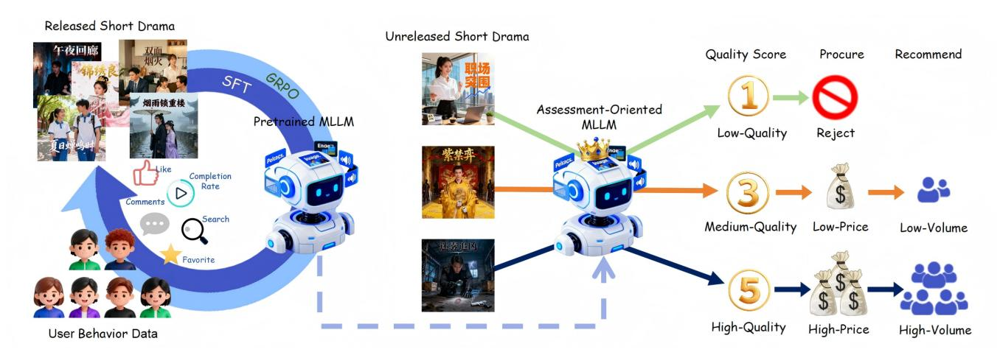
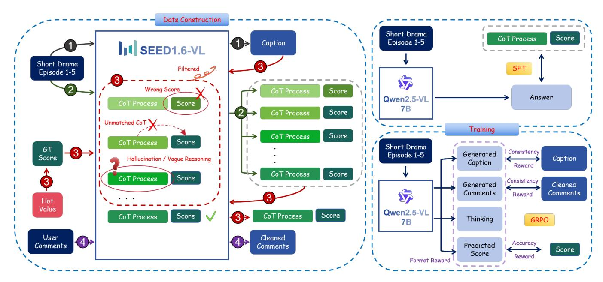
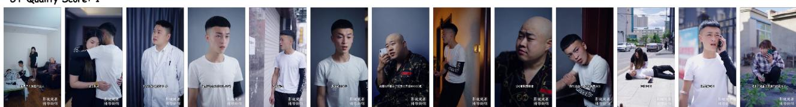
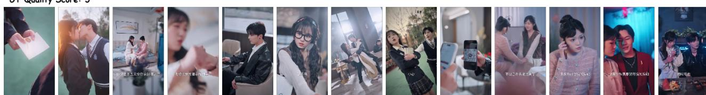

# Bridging Visual Dynamics and Narrative Reasoning: Multimodal Large Language Models for Short Drama Quality Assessment

Qingyang Liu Shanghai Jiao Tong University Shanghai, China narumimaria@sjtu.edu.cn

Jiangtong Li∗ Tongji University Shanghai, China jiangtongli@tongji.edu.cn

Zelin Peng Shanghai Jiao Tong University Shanghai, China zelin.peng@sjtu.edu.cn

Shaobo Wang Shanghai Jiao Tong University Shanghai, China shaobowang1009@sjtu.edu.cn

Zhaohe Liao Shanghai Jiao Tong University Shanghai, China zhaoheliao@sjtu.edu.cn

Shuochen Chang Shanghai Jiao Tong University Shanghai, China csc1332741686@sjtu.edu.cn

Bingjie Gao Shanghai Jiao Tong University Shanghai, China whynothaha@sjtu.edu.cn

Haonan Zhao Shanghai Jiao Tong University Shanghai, China 2zz-n-24@sjtu.edu.cn

Mu Liu ByteDance Beijing, China liumu.lm@bytedance.com

Jidong Jiang ByteDance Beijing, China jiangjidong@bytedance.com

Li Niu∗ Shanghai Jiao Tong University Shanghai, China ustcnewly@sjtu.edu.cn

# Abstract

Short drama quality assessment is crucial for industrial applications, including procurement decision support and addressing the coldstart problem in recommendation systems. However, existing video quality assessment approaches primarily focus on visual fidelity and often neglect higher-level narrative structure and reasoning logic. Likewise, other video understanding techniques tend to be eventcentric, failing to adequately connect narrative elements with visual content. To bridge this gap between visual dynamics and narrative reasoning, we propose a user-centric quality indicator alongside an automated pipeline for constructing a Chain-of-Thought (CoT) dataset. To ensure data quality, this pipeline incorporates a hierarchical filtering mechanism that refines assessment accuracy, logical consistency, and the relevance of the reasoning, thereby steering the Multimodal Large Language Model (MLLM) toward humanaligned short drama assessment. We also develop the first MLLM for this task using a two-stage training framework: a Supervised Fine-Tuning (SFT) stage adapts the model to the assessment task, while a Group Relative Policy Optimization (GRPO) stage, using a customized reward function, further aligns its outputs with human preferences. Experimental results demonstrate that our model shows strong alignment with human preferences in short drama quality assessment and generates coherent explanations. Furthermore, online tests confirm our model boosts the cold-start performance of

∗Corresponding Authors.

[This work is licensed under a Creative Commons Attribution 4.0 International License.](https://creativecommons.org/licenses/by/4.0) WWW '26, Dubai, United Arab Emirates

© 2026 Copyright held by the owner/author(s). ACM ISBN 979-8-4007-2307-0/2026/04 <https://doi.org/10.1145/3774904.3792827>

recommendation systems by improving multiple user engagement metrics. We release our evaluation set at [https://github.com/HG](https://github.com/HG-support/Short-Drama-Quality-Assessment)[support/Short-Drama-Quality-Assessment.](https://github.com/HG-support/Short-Drama-Quality-Assessment)

# CCS Concepts

• Computing methodologies → Temporal reasoning; • Information systems → Multimedia information systems.

# Keywords

Multimodal Large Language Models, Short Drama Quality Assessment, Reasoning Model in Quality Evaluation

### ACM Reference Format:

Qingyang Liu, Jiangtong Li, Zelin Peng, Shaobo Wang, Zhaohe Liao, Shuochen Chang, Bingjie Gao, Haonan Zhao, Mu Liu, Jidong Jiang, and Li Niu. 2026. Bridging Visual Dynamics and Narrative Reasoning: Multimodal Large Language Models for Short Drama Quality Assessment. In Proceedings of the ACM Web Conference 2026 (WWW '26), April 13–17, 2026, Dubai, United Arab Emirates. ACM, New York, NY, USA, [13](#page--1-0) pages. [https://doi.org/10.1145/](https://doi.org/10.1145/3774904.3792827) [3774904.3792827](https://doi.org/10.1145/3774904.3792827)

# 1 Introduction

The proliferation of mobile internet and short-video platforms has led to a surge in short dramas, which are characterized by low production costs and fast-paced narratives suited to fragmented viewing habits. This trend motivates the need for automated quality assessment for two key applications: for upstream, identifying highpotential works during content procurement and reducing costs; and for downstream, providing signals that mitigate the cold-start problem for new series in recommender systems. However, this task is challenging, as it requires moving beyond surface-level visual attributes (e.g., cinematography, pacing, acting) to assess

Figure 1: Our quality assessment task utilizes multi-dimensional user behavior data (e.g., likes, completion rates) and a two-stage training framework (SFT and GRPO). This process is used to fine-tune an MLLM specifically for evaluating both visual fidelity and narrative reasoning. For unreleased short dramas, the model generates quality scores that inform procurement and recommendation strategies, thereby providing human-aligned evaluations for decision support.

if the narrative is logically coherent and compelling enough to retain audience engagement, placing high demands on multimodal reasoning capabilities. Furthermore, user preferences are subjective and diverse, making the transformation of implicit feedback into robust supervisory signals a key challenge in model training.

Existing video quality assessment methods primarily focus on the technical fidelity [\[13,](#page-8-0) [15,](#page-8-1) [61\]](#page-9-0) or semantic alignment [\[21,](#page-8-2) [27,](#page-8-3) [37\]](#page-8-4) of generative videos and largely overlook crucial creative elements such as acting performance, cinematographic language, narrative tension, and aesthetic style. Current video understanding methods are largely event-centric [\[4,](#page-8-5) [32,](#page-8-6) [40\]](#page-8-7), with tasks like captioning [\[12,](#page-8-8) [45,](#page-9-1) [56\]](#page-9-2), question answering [\[3,](#page-8-9) [33,](#page-8-10) [42\]](#page-9-3), and retrieval [\[5,](#page-8-11) [28\]](#page-8-12). Therefore, they lack explicit metrics for acting credibility, cinematography, narrative pacing, or the overall coherence and appeal of the storyline. Moreover, existing benchmarks for video quality and understanding [\[5,](#page-8-11) [12,](#page-8-8) [45,](#page-9-1) [56\]](#page-9-2) generally do not include audiencelevel preference data, limiting their utility for evaluating quality based on user engagement.

To align our quality metric with user preferences, we define a composite indicator, termed "hot value", derived from post-exposure user signals to quantify the quality of a short drama. For training purposes, we discretize this continuous hot value into a 1–5 quality score. Recent Reinforcement Learning (RL) based methods have demonstrated that MLLMs possess strong reasoning capabilities for video understanding [\[1,](#page-8-13) [14,](#page-8-14) [43\]](#page-9-4). However, directly applying RL to our task presents two challenges: first, a mismatch between the reasoning process and the final score in some samples, and second, reasoning processes that are often overly brief or semantically shallow. Rewarding the model solely for correctly predicting the score in such cases can prevent it from learning the underlying assessment logic. Therefore, a high-quality dataset with CoT annotations is essential to initially structure the reasoning process and output format of MLLMs. Since conditioning the MLLM on a target score to generate a reasoning process is highly likely to induce hallucinations [\[17,](#page-8-15) [17,](#page-8-15) [34\]](#page-8-16), we design a sample-and-filter

pipeline to construct our dataset. In the sampling stage, we provide the short drama video as input to SEED1.6-VL and prompt it to generate a quality score accompanied by a plot-aware reasoning process. In the filtering stage, we again use SEED1.6-VL to discard erroneous or low-quality samples, retaining only instances with the correct score, an accurate analysis, and strong narrative relevance. This pipeline enables the automated construction of a short drama quality assessment dataset featuring high-quality CoT annotations.

During training, we employ a two-stage post-training strategy to train the short drama quality assessment MLLM. First, an SFT stage uses our CoT dataset to adapt the MLLM to the desired reasoning structure and output format. Next, to better align the assessments of MLLM with user perspectives on narrative and visual elements and to improve its generalization, we apply GRPO using a custom suite of reward functions. In addition to conventional rewards for answer accuracy and format, we introduce two novel rewards. A caption consistency reward compels the MLLM to ground its quality assessment in the narrative context. A user comment consistency reward encourages the MLLM to evaluate dramas in a unified manner that reflects human integration of visual and narrative aspects. Extensive experiments on our short drama quality assessment dataset and online A/B tests for recommendation cold-start demonstrate that our model effectively evaluates short dramas in line with human preferences, leading to improved downstream performance. Our contributions can be summarized as follows:

- We define a user-centric quality indicator (hot value) and propose an automated pipeline to construct a high-quality CoT dataset, mitigating hallucination in the quality reasoning generation process.
- We design novel reward functions with narrative context and user comments, to guide the MLLM toward human-like assessment that integrates visual dynamics and narrative reasoning.

- We develop the first interpretable MLLM for short drama quality assessment, which is trained on our novel dataset via a two-stage framework to align with user preferences.
- Extensive experiments on our short drama quality assessment dataset and online A/B tests for recommendation cold-start demonstrate that our model effectively evaluates short dramas in line with human preferences.

### 2 Related work

### 2.1 Video Quality Assessment

Existing video quality assessment (VQA) methods primarily focus on evaluating the technical perceptual fidelity such as spatial distortion and temporal coherence [\[9,](#page-8-17) [29\]](#page-8-18) for streaming media videos or semantic alignment [\[21,](#page-8-2) [37,](#page-8-4) [58\]](#page-9-5) for AI-generated content (AIGC) videos. For perceptual fidelity assessment, traditional full-reference models, such as SSIM [\[46\]](#page-9-6), VIF [\[35\]](#page-8-19), and VMAF [\[25\]](#page-8-20), estimate perceptual fidelity by comparing pristine and distorted signals, while recent no-reference and deep learning-based models leverage spatio-temporal features [\[20,](#page-8-21) [49\]](#page-9-7) or transformer architectures [\[9,](#page-8-17) [29\]](#page-8-18) to capture complex distortions. For semantic alignment, [\[37\]](#page-8-4) proposes multi-granularity text–temporal fusion for fine-grained prompt–video consistency, while [\[27,](#page-8-3) [58\]](#page-9-5) design holistic AIGC-VQA frameworks with dedicated alignment branches. However, these approaches remain largely limited to low-level fidelity or semantic correctness, showing little sensitivity to audience high-level quality perceptions such as acting performance, cinematographic language, narrative tension, and aesthetic style.

Some video recommendation methods [\[8,](#page-8-22) [10\]](#page-8-23) model the user–content correlations from a matching perspective with limited interpretability, failing to present explicit rationale or content-level explanations for the video quality. Some studies [\[54,](#page-9-8) [59\]](#page-9-9) infer video quality from user behavior data to enhance recommendation systems. [\[52\]](#page-9-10) reweights user clicks by their dwell time to better reflect true engagement and improve recommendation accuracy. [\[54\]](#page-9-8) enhances recommender systems by weighting clicks with dwell time to distinguish casual from engaged user interactions. [\[60\]](#page-9-11) extracts video quality signals from watch time by removing biases from duration and exposure, yielding recommendations that better reflect true user interest. Nevertheless, these approaches depend on postexposure indicators and are unable to directly analyze video quality based on visual content alone, limiting their applicability to videos without or with sparse user engagement.

# 2.2 Multimodal Large Language Models for Video Reasoning

Multimodal large language models (MLLMs) have achieved remarkable progress in video understanding tasks [\[4,](#page-8-5) [6,](#page-8-24) [40,](#page-8-7) [47\]](#page-9-12), demonstrating strong capabilities in spatiotemporal reasoning [\[19,](#page-8-25) [31\]](#page-8-26), cross-modal alignment [\[24,](#page-8-27) [48\]](#page-9-13), and semantic comprehension [\[22,](#page-8-28) [33,](#page-8-10) [42\]](#page-9-3). Recently, Qwen2.5-VL [\[1\]](#page-8-13) extends MLLMs into a unified vision–language model which supports adaptive perception and strong spatiotemporal reasoning capabilities. InternVL3.5 [\[43\]](#page-9-4) focuses on reasoning enhancement and efficiency optimization achieving excellent trade-offs between accuracy and latency. DeepSeek-VL2 [\[51\]](#page-9-14) pays particular attention to robustness under diverse domains and high-resolution document comprehension, making it

suitable for OCR-heavy, layout-rich, and chart reasoning tasks. VideoLLaMA2 [\[7\]](#page-8-29) augments spatio-temporal convolutions with an audio branch to integrate richer multimodal evidence. LongVA [\[55\]](#page-9-15) extends the language backbone's context window to process substantially longer sequences without specialized video training. VISA [\[53\]](#page-9-16) couples world knowledge with object tracking to enable knowledgedriven video object segmentation within an MLLM. Recently, reinforcement learning has been widely applied in MLLM based video reasoning methods. VideoChat-R1 [\[23\]](#page-8-30) uses reinforcement fine-tuning with GRPO to markedly boost spatio-temporal perception and reasoning in video MLLMs. Video-R1 [\[11\]](#page-8-31) introduces a temporal-aware GRPO variant and mixed image-video reasoning data to achieve strong video reasoning performance. DeepVideo-R1 [\[33\]](#page-8-10) improves video reasoning by reformulating GRPO into a regression objective and adding difficulty-aware augmentation to stabilize RFT. However, most video understanding approaches and benchmarks have primarily focused on video perception tasks such as identifying relevant objects [\[30,](#page-8-32) [62\]](#page-9-17), event detection [\[16,](#page-8-33) [41\]](#page-9-18), localizing temporal segments [\[5,](#page-8-11) [28\]](#page-8-12) and summarizing the events [\[12,](#page-8-8) [45\]](#page-9-1). Despite these advances in compression, long-context modeling, and knowledge-aware segmentation, hey remain oriented toward perception and event understanding and the development of MLLMs with user perspective video quality reasoning capabilities remains largely unexplored.

### 3 Method

### 3.1 Data Construction

To address the need for high-quality training data, we constructed a short drama quality assessment dataset comprising 23,472 dramas with significant user engagement from the [Hongguo platform,](https://novelquickapp.com/) spanning 26 major genres. This dataset serves a dual purpose: (1) it provides an objective quality metric, the "hot value", which reflects user-perceived popularity; (2) it offers supervisory signals to guide model optimization toward human-aligned evaluation criteria. All prompts used during data construction are formulated in English.

3.1.1 Hot Value. To align our quality metric with user preferences, we define a "hot value" derived from post-exposure user signals to measure the performance of a short drama. This value quantifies overall popularity by combining nine indicators from four categories: consumption, completion, interaction, and search. For the eight non-ratio indicators (i.e., daily average watch time, daily average UV, favorites, likes, six-month cumulative watch time, sixmonth cumulative UV, comments, and search), we apply a piecewise function to normalize the raw value of each indicator, ���� , to a score, ���� , in the range [5,100+), as defined below:

���� = 5 + 15 ���� − �� ������ �� �� ��30 − �� �� ������ , ���� < �� �� ��30, 20 + 50 ���� − �� �� ��30 �� ��93 − �� �� ��30 , ���� ��30 ≤ ���� &lt; �� ��93, 70 + 30 ���� − �� ��93 �� �� 10 − �� �� ��93 , ���� ≥ �� �� ��93. (1)

Here, ���� , �� ������, �� ��30, �� ��93, and �� 10 denote the raw value, minimum value, 30th percentile, 93rd percentile, and 10th-ranked value of the

Figure 2: Our framework comprises two stages: data construction and model training. For data construction (left), we utilize SEED1.6-VL to generate high-quality supervisory signals. The data pipeline begins by ① generating a storyline caption for each video, followed by ② multi-round sampling to produce candidate quality scores and reasoning. These candidates are then ③ filtered using three rules based on ground-truth scores derived from our "hot value" metric. In parallel, ④ associated user comments are cleaned for subsequent training. In the training stage (right), we first conduct SFT on the CoT data to adapt the Qwen2.5-VL-7B model to our task's specific output structure. We then apply GRPO with four customized reward functions to encourage assessments that are structured, faithful, and aligned with user preferences.

indicator, respectively. For the ratio indicator completion rate ��9, we apply a capped piecewise normalization to obtain its score ��9:

��9 = 100, ��9 &gt; 0.7, 3 + 12 ��9 0.3 , 0 ≤ ��9 &lt; 0.3 or ��9 is null, 15 + 85 ��9 − 0.3 0.7 − 0.3 , 0.3 ≤ ��9 ≤ 0.7. (2)

Here, ��9 is the normalized score for the completion rate ��9 with a range of [3,100]. The score is capped at 100 for rates exceeding 70%, as this is deemed a sufficient indicator of high quality. The hot value �� is obtained by a weighted sum of the nine indicator scores, where {���� } 9 ��=1 are their corresponding weights:

�� = ∑︁9 ��=1 ���� ���� , where ∑︁9 ��=1 ���� = 1. (3)

During the normalization of each non-ratio indicator, the 10thranked value serves as a reference baseline, which allows the scores of top-performing items to exceed 100. This unbounded design ensures that the hot value can scale with exceptionally high composite scores, accurately reflecting the popularity of viral dramas without an artificial ceiling. Results from online A/B tests within our recommendation service confirm that the hot value metric is strongly correlated with user preferences and works effectively in real-world scenarios.

3.1.2 Data Construction Pipeline. Based on empirical observations, the popularity of most short dramas peaks within two months of release. We therefore only consider dramas older than two months and use their maximum hot value as a metric for overall quality. Since the distribution of this hot value has multiple modes, we use the K-means clustering method to map each short drama to a quality score from 1 to 5. Our analysis also reveals that while viewer completion rates increase significantly after the first few episodes, the total audience size tends to decline. This highlights the critical importance of a strong start. Therefore, we only use the first five episodes of each drama during dataset construction. Step ①: Video Caption Preparation. The primary inputs for each data entry are the videos of the first five episodes and their quality score. To create a textual summary for each entry, we input the videos of these five episodes into the SEED1.6-VL model and prompt it to generate a concise plot summary, which serves as the official video caption for the data filtering and quality assessment. Step ②: CoT Data Sampling. With the video inputs prepared, we generate the core reasoning data using a sample-and-filter method. In the sampling stage, the first five episodes of each drama are provided to SEED1.6-VL. The model is prompted to predict a quality score and provide a detailed reasoning process. This prompt guides the model to evaluate the drama based on several human-centric viewing criteria: thematic novelty, emotional climaxes and twists, audience resonance, cinematography, acting performance, and suspense design in the ending. To capture a wide range of evaluations, we perform multiple sampling rounds for each drama, generating diverse score assignments and reasoning processes.

Step ③: High-Quality CoT Filtering. To ensure the reliability of our training data, the generated CoT samples then move to a filtering stage. In this step, we again use SEED1.6-VL to evaluate and filter out erroneous or low-quality samples, using the ground truth (GT) score and the previously generated video caption as references. We discard any low-quality samples that:

- Predict an incorrect quality score compared to the GT.
- Exhibit inconsistency between the predicted quality score and the reasoning process.
- Generate hallucinated or vacuous reasoning that is not grounded in the actual plot.

This rigorous filtering step produces high-quality CoT annotations that provide reliable supervision for the training.

Step ④: User Comment Curation. To incorporate audience perspectives, we pair each data entry with high-quality user comments. For each short drama, we extract the most-liked comments. In detail, we first collect up to 20 most-liked comments from the first five episodes, and then process them by SEED1.6-VL to remove comments unrelated to the storyline. This step yields a curated set of high-quality user comments that reflect the user-perceived quality of the short drama.

### 3.2 Training Strategy

We employ Qwen2.5-VL-7B-Instruct [\[1\]](#page-8-13) as our base MLLM. The training pipeline consists of two sequential stages: a Supervised Fine-Tuning (SFT) stage for cold start, followed by Group Relative Policy Optimization (GRPO) stage for performance enhancement.

3.2.1 Supervised Fine-Tuning Stage. To stabilize the reasoning process and standardize the output format of MLLM, we first introduce a Supervised Fine-Tuning (SFT) stage. Leveraging the short drama CoT dataset we constructed, we use prompts identical to those used for CoT generation. Since SEED1.6-VL is much larger than Qwen2.5- VL-7B, it serves as a teacher model, generating high-quality reasoning traces that embody a fine-grained semantic understanding. By supervising the student model with these cleaned, high-quality CoT annotations, we effectively distill the reasoning ability and format consistency from the large MLLM into a lighter, more efficient model. This CoT-based distillation enables the smaller model to internalize the structured thinking process, yielding a solid foundation for the subsequent reinforcement learning stage to achieve significant performance gains.

3.2.2 Group Relative Policy Optimization Stage. To further bridge the gap between visual dynamics and narrative reasoning from the user perspective and to strengthen the generalization of MLLM across diverse genres, we apply an RL stage using GRPO. While GRPO is effective, it requires explicit reward signals to effectively guide the MLLM in assessing short drama quality. To address this, we define a customized combination of four rewards, which assess key aspects, including narrative consistency, user-centric alignment, scoring accuracy, and structural formatting.

Caption Consistency Reward. To mitigate narrative drift, we prompt the MLLM to generate a plot summary and reward its consistency with the caption generated by a much larger model in the dataset. The caption consistency reward is calculated as the average of ROUGE-1, ROUGE-2, and ROUGE-L scores between the generated plot summary (��) and the ground-truth caption (��):

��caption = ROUGE(��,��) = 1 3 ROUGE-1(��,��) + ROUGE-2(��,��) + ROUGE-L(��,��) . (4)

User Comments Consistency Reward. To encourage user-centric quality evaluation, we further prompt the MLLM to generate 10 plausible user comments for each short drama. The user comments consistency reward is calculated as the average of ROUGE-1, ROUGE-2, and ROUGE-L [\[26\]](#page-8-34) scores between the generated user comments and the real user comments in the dataset. To ensure one-to-one alignment between generated and real user comments, we compute a pairwise ROUGE similarity matrix and apply the Hungarian algorithm [\[18\]](#page-8-35) to obtain the maximum weight matching. Let {���� } �� ��=1 be the generated comments and {���� } ��=1 be the real user comments. We first calculate the ROUGE similarity matrix:

������ = ROUGE(���� , ����), �� = 1, . . . , ��, �� = 1, . . . , ��. (5)

We apply the Hungarian algorithm to find the optimal matching:

M = Hungarian(��) , (6)

Finally, the user comment consistency reward is computed as:

��comments = 1 |M | ∑︁ (��,��) ∈M ������ . (7)

Accuracy Reward. To measure the correctness of the quality assessment, we apply an accuracy reward. The model is prompted to generate the final quality score (an integer from 1 to 5) within a box, which we extract via regular expressions and verify against the ground truth. The reward is defined as:

��accuracy = ( 1, if quality score = ground truth , 0, otherwise . (8)

Format Reward. To ensure the designed parts are present and correctly ordered, we apply a format reward. We instruct the model to enclose its generated caption, user comments, thinking process, and final score within <caption>···</caption>, <comments>··· </comments>, <think>···</think>, and <answer>···</answer> tags, respectively. The reward is defined as:

��format = ( 1, if the output format is correct , 0, otherwise . (9)

Optimization Process. Given an input ��, the algorithm samples �� candidate outputs �� = {��1, ��2, . . . , ���� } from the old policy ����old . Each candidate �� �� is assigned a composite reward ���� , computed as a weighted sum of the aforementioned rewards:

�� = ��1��caption + ��2��comments + ��3��accuracy + ��4��format, (10)

To assess the relative quality, GRPO normalizes rewards using the mean ���� and standard deviation ���� across outputs:

��˜ �� = ���� − ���� ���� . (11)

Table 1: Comparison of model performance on our short drama quality assessment benchmark in Accuracy, MSE, and PCC. Our model achieves the best results across all metrics against open-source and closed-source baselines.

| Method Base Model       |        | Accuracy | ↑ MSE | ↓ PCC ↑ |
|-------------------------|--------|----------|-------|---------|
| Qwen2.5-VL-7B-Instruct  | [1]    | 0.254    | 3.529 | 0.126   |
| Open-source             | Models |          |       |         |
| LLaVA-NeXT-Video-7B-hf  | [57]   | 0.208    | 3.852 | 0.038   |
| Keye-VL-1.5-8B          | [38]   | 0.248    | 3.681 | 0.075   |
| VideoLLaMA3-7B          | [2]    | 0.237    | 3.732 | 0.059   |
| InternVideo2.5-Chat-8B  | [44]   | 0.223    | 3.694 | 0.047   |
| VideoChat-R1-7B-caption | [23]   | 0.216    | 3.829 | 0.021   |
| LongVU-Qwen2-7B         | [36]   | 0.239    | 3.693 | 0.068   |
| Video-R1-7B             | [11]   | 0.230    | 3.799 | 0.049   |
| GLM-4.5V                | [39]   | 0.331    | 2.934 | 0.213   |
| Closed-source           | Models |          |       |         |
| GPT-4o                  |        | 0.326    | 3.353 | 0.156   |
| Gemini-2.5-Pro          |        | 0.384    | 2.701 | 0.342   |
| SEED1.6-VL              |        | 0.385    | 2.611 | 0.335   |
| Ours                    |        | 0.438    | 1.962 | 0.502   |

The policy is updated by maximizing a KL-regularized objective that balances performance improvement and training stability:

max ���� E��∼����old (· |�� ) "∑︁�� ��=1 ���� (�� ��) ����old (�� ��) · ��˜ �� − �� DKL (���� ∥ ��ref) , (12)

where �� is a regularization coefficient, and ��ref denotes the reference policy. This formulation enables GRPO to integrate diverse reward signals while maintaining stable optimization.

In contrast to conventional policy optimization methods, GRPO employs a clipping mechanism to mitigate extreme policy deviations and a KL regularization term to preserve alignment with the reference model. Such a design facilitates stable integration of multi-dimensional rewards in the context of short-form drama quality evaluation.

# 4 Experiment

### 4.1 Experimental Setup

4.1.1 Implementation Details. We conduct our main experiments using the Qwen2.5-VL-7B-Instruct model [\[1\]](#page-8-13). We divide our dataset into a training set of 22,472 samples and an evaluation set of 1,000 samples. We first perform LoRA-based fine-tuning on 10,000 short drama samples using 8 NVIDIA H20 GPUs in the SFT stage. Subsequently, in the GRPO training stage, we train for one epoch on the remaining 12,472 samples using 32 NVIDIA H20 GPUs. For each query, we generate 16 candidate responses to compute grouprelative rewards. We preprocess videos from both datasets by first sampling them at 1 FPS and then constraining the frame count and resolution based on video duration. We incorporate the Number

Table 2: Ablation study of the training strategy, showing that while both SFT and GRPO individually improve performance, the combined SFT→GRPO approach yields the best results.

| SFT Variant GRPO | Accuracy ↑ | MSE ↓ | PCC ↑ |
|------------------|------------|-------|-------|
|                  | 0.254      | 3.529 | 0.126 |
| +                | 0.369      | 2.967 | 0.267 |
| +                | 0.273      | 3.431 | 0.146 |
| + +              | 0.438      | 1.962 | 0.502 |

Prompt strategy [\[50\]](#page-9-21) during training and evaluation to overlay absolute timestamps on video frames, which provides precise temporal grounding and improves the MLLM's temporal perception. In the GRPO training stage, we set the reward combination coefficients to ��1 = 0.2, ��2 = 0.2, ��3 = 0.5, and ��4 = 0.1.

4.1.2 Evaluation Metrics. We formulate the short drama quality assessment task as a five-class classification problem. Accordingly, we first report Accuracy as the primary evaluation metric to measure the proportion of exact matches between predicted and ground-truth quality scores. However, Accuracy only measures exact matches and does not reflect the degree of deviation when predictions are close but not identical. To address this limitation, we incorporate Mean Squared Error (MSE) to quantify the difference between predicted and ground-truth scores, which offers a more fine-grained measure of prediction errors. We also report the Pearson Correlation Coefficient (PCC) to evaluate the linear correlation between predicted and ground-truth scores, which measures if the model's scoring trend aligns with human judgment.

# 4.2 Main Results

Table [1](#page-5-0) presents the quantitative results on our short drama quality assessment benchmark. Our model achieves new state-of-the-art performance with an Accuracy of 0.438, a Mean Squared Error (MSE) of 1.962, and a Pearson Correlation Coefficient (PCC) of 0.502. This performance surpasses all baselines, including strong closed-source models such as SEED1.6-VL (0.385 Acc, 2.611 MSE, 0.335 PCC) and all open-source competitors.

Notably, our method achieves a 24.8% reduction in MSE and a 49.8% improvement in PCC compared to the next-best model. The large decrease in MSE indicates that our model produces more numerically precise quality predictions, while the high PCC score of 0.502 shows a strong positive correlation with human scoring trends, reflecting a better alignment with human judgment. These improvements across discrete (Accuracy) and continuous (MSE, PCC) metrics suggest that our integration of narrative reasoning, visual understanding, and user-centric supervision enables the MLLM to assess short dramas that align with human evaluation.

# 4.3 Ablation Study

4.3.1 Training Strategy. We compare four variants of our training process: the untrained base model (Qwen2.5-VL-7B-Instruct), an SFT-only model trained on the full dataset, a GRPO-only model

Table 3: Ablation study of GRPO reward components. With other rewards fixed, each new component (caption and comments consistency) individually improves performance, while combining them yields the greatest benefit.

| Format Accuracy | Reward Caption Comments | Acc. ↑ | MSE ↓ | PCC ↑ |
|-----------------|-------------------------|--------|-------|-------|
| + +             |                         | 0.403  | 2.645 | 0.327 |
| + +             | +                       | 0.423  | 2.322 | 0.406 |
| + +             | +                       | 0.414  | 2.465 | 0.390 |
| + +             | + +                     | 0.438  | 1.962 | 0.502 |

Table 4: Results of online A/B test on Hongguo platform.

| Online     | Metrics       | Relative | Improvement |
|------------|---------------|----------|-------------|
| Staytime   |               |          | +0.101%     |
| Video      | Consumption   | Time     | +0.094%     |
| Completion | Rate          |          | +0.286%     |
| PV         | Click-through | Rate     | +0.732%     |

trained on the full dataset, and the full SFT→GRPO model. As summarized in Table [2,](#page-5-1) both SFT and GRPO improve performance over the base model. From a principled perspective, SFT distills structured reasoning traces and output conventions from the teacher, thereby constraining the output space to a canonical format and mitigating exposure bias before reinforcement learning, while also providing a more stable initialization for subsequent optimization. In contrast, applying GRPO directly to an untrained policy requires exploring a much larger hypothesis space with sparse and delayed reward signals, which often leads to unstable optimization and limited gains, and can make it difficult for the policy to discover high-quality behaviors reliably. Accordingly, the GRPO-only variant yields only a modest improvement, while the SFT→GRPO approach achieves the best performance. This pattern suggests that SFT provides a crucial warm start and a structured reasoning scaffold, enabling GRPO to refine decision-making more effectively after the policy and output structure have been stabilized.

4.3.2 Reward Design. To isolate the contribution of each new reward component, we conduct an ablation study, fixing the accuracy and format rewards to establish a baseline performance (Accuracy: 0.403, MSE: 2.645, PCC: 0.327). Under this controlled setting with a fixed total reward budget (Í �� ���� = 1), Table [3](#page-6-0) shows that individually adding either reward component improves performance. Introducing caption consistency provides a substantial boost, increasing PCC to 0.406, while adding comments consistency also elevates PCC to 0.390. However, combining both yields the largest, synergistic gains, achieving our final superior scores of 0.438 in Accuracy, 1.962 in MSE, and 0.502 in PCC. Mechanistically, the notable jump in correlation from caption consistency anchors reasoning to plot-grounded semantics and reduces narrative drift, while comments consistency effectively injects user-centric priors, and their combination allows the model to align with both narrative structure and audience perception.

### 4.4 Online A/B Testing

To further validate the effectiveness for cold-start recommendation, we selected 500 newly released short dramas and ran a two-week online A/B test on Hongguo platform. We integrated our method into the existing recommendation workflow for a controlled comparison under identical conditions. Specifically, the treatment group's multi-objective ranker included our model's predicted quality score as a calibrated feature, while the control group used the production ranker without this feature; all other configurations were held constant. We evaluated four online metrics: (1) Stay time: the average per-user time spent within the short-drama context; (2) Video Consumption Time: the average per-user video watching time; (3) Completion Rate: the proportion of videos that users watch to the end; (4) PV Click-through Rate: the ratio of clicks to page views on drama entry points. Across the two-week window, the treatment group showed consistent improvements on all four metrics. This indicates that incorporating our model's quality score into the recommender improves early-stage matching and increases user engagement for newly released short dramas.

## 4.5 Case Study

To further illustrate our model's effectiveness, we present case studies for a low-quality and a high-quality drama in Figure [3.](#page-7-0) We compare the responses of the base model, the strongest baseline SEED1.6-VL, and our model. The untrained base model tends to produce generic and superficial descriptions, failing to connect visual or narrative cues to the overall quality of the short drama. In contrast, SEED1.6-VL, while capable of offering more detailed analyses and basic quality judgments, often fails to identify key narrative signals or the specific aspects that engage users. By comparison, our model demonstrates a more accurate capability in short-drama quality assessment. In contrast, our model provides a more nuanced assessment. For the low-quality drama, it identifies significant logical flaws that undermine the viewer experience (highlighted in yellow) and a forced plot development where villagers unquestioningly trust the antagonist (highlighted in green). For the high-quality drama, our model recognizes that the mutual admiration theme is a user-preferred narrative (highlighted in yellow) and identifies the male lead's appearance as a key factor in sustaining viewer engagement (highlighted in green). These findings, which align closely with real user preferences, show that our model evaluates short dramas from a user-centric perspective. This enhanced video understanding allows our model to assign both high and low scores with greater confidence and justification than the baseline models.

### 5 Conclusion

In this paper, we propose the first interpretable Multimodal Large Language Model (MLLM) for short drama quality assessment, which holistically bridges visual dynamics and narrative reasoning with user preference alignment. Our introduction of a user-centric hot value and a high-quality Chain-of-Thought (CoT) dataset, built via a rigorous sample-and-filter pipeline, provides the model with a robust foundation of explicit reasoning paths, which directly mitigates the tendency for hallucination and supports more transparent, evidence-grounded evaluations. Furthermore, our two-stage posttraining strategy is crucial: Supervised Fine-Tuning (SFT) initially

### Figure 3: Case study on one low-quality and one high-quality short drama.

aligns the model with the structure of quality assessment, after which Group Reward Policy Optimization (GRPO) with our designed rewards fine-tunes its judgment to capture the nuanced signals of a human-centered perspective. This staged optimization enables the model to internalize standardized assessment behaviors before being further aligned with user-centric criteria. As validated by extensive experiments and online A/B tests, this comprehensive

approach ensures our model delivers evaluations that are not only accurate but also interpretable and aligned with user preferences.

# Acknowledgments

The work was supported by the National Natural Science Foundation of China (Grant No. 62471287, 62402341). We thank all engineers and annotation staff at Fanqie and Hongguo for their technical support and contributions to data annotation.

### References

[1] Shuai Bai, Keqin Chen, Xuejing Liu, Jialin Wang, Wenbin Ge, Sibo Song, Kai Dang, Peng Wang, Shijie Wang, Jun Tang, et al. 2025. Qwen2. 5-vl technical report. arXiv preprint arXiv:2502.13923 (2025). [2] Zesen Cheng Zhiqiang Hu Yuqian Yuan Guanzheng Chen Sicong Leng Yuming Jiang Hang Zhang Xin Li Peng Jin Wenqi Zhang Fan Wang Lidong Bing Deli Zhao Boqiang Zhang, Kehan Li. 2025. VideoLLaMA 3: Frontier Multimodal Foundation Models for Image and Video Understanding. arXiv preprint arXiv:2501.13106 (2025).<https://arxiv.org/abs/2501.13106> [3] Xinlong Chen, Yuanxing Zhang, Yushuo Guan, Bohan Zeng, Yang Shi, Sihan Yang, Pengfei Wan, Qiang Liu, Liang Wang, and Tieniu Tan. 2025. VersaVid-R1: A Versatile Video Understanding and Reasoning Model from Question Answering to Captioning Tasks. arXiv preprint arXiv:2506.09079 (2025). [4] Yi Chen, Yuying Ge, Rui Wang, Yixiao Ge, Junhao Cheng, Ying Shan, and Xihui Liu. 2025. GRPO-CARE: Consistency-Aware Reinforcement Learning for Multimodal Reasoning. arXiv preprint arXiv:2506.16141 (2025). [5] Yi Chen, Yuying Ge, Rui Wang, Yixiao Ge, Lu Qiu, Ying Shan, and Xihui Liu. 2025. Exploring the effect of reinforcement learning on video understanding: Insights from seed-bench-r1. arXiv preprint arXiv:2503.24376 (2025). [6] Yukang Chen, Wei Huang, Baifeng Shi, Qinghao Hu, Hanrong Ye, Ligeng Zhu, Zhijian Liu, Pavlo Molchanov, Jan Kautz, Xiaojuan Qi, et al. 2025. Scaling rl to long videos. arXiv preprint arXiv:2507.07966 (2025). [7] Zesen Cheng, Sicong Leng, Hang Zhang, Yifei Xin, Xin Li, Guanzheng Chen, Yongxin Zhu, Wenqi Zhang, Ziyang Luo, Deli Zhao, et al. 2024. Videollama 2: Advancing spatial-temporal modeling and audio understanding in video-llms. arXiv preprint arXiv:2406.07476 (2024). [8] Lulu Dong, Guoxiu He, and Aixin Sun. 2024. Not All Videos Become Outdated: Short-Video Recommendation by Learning to Deconfound Release Interval Bias. In Proceedings of the 18th ACM Conference on Recommender Systems. 179–188. [9] Huiyu Duan, Qiang Hu, Jiarui Wang, Liu Yang, Zitong Xu, Lu Liu, Xiongkuo Min, Chunlei Cai, Tianxiao Ye, Xiaoyun Zhang, et al. 2025. Finevq: Fine-grained user generated content video quality assessment. In Proceedings of the Computer Vision and Pattern Recognition Conference. 3206–3217. [10] Andrii Dzhoha, Katya Mirylenka, Egor Malykh, Marco-Andrea Buchmann, and Francesca Catino. 2025. Short-Form Video Recommendations with Multimodal Embeddings: Addressing Cold-Start and Bias Challenges. arXiv preprint arXiv:2507.19346 (2025). [11] Kaituo Feng, Kaixiong Gong, Bohao Li, Zonghao Guo, Yibing Wang, Tianshuo Peng, Junfei Wu, Xiaoying Zhang, Benyou Wang, and Xiangyu Yue. [n. d.]. Video-r1: Reinforcing video reasoning in mllms, 2025. URL https://arxiv. org/abs/2503.21776 ([n. d.]). [12] Kaituo Feng, Kaixiong Gong, Bohao Li, Zonghao Guo, Yibing Wang, Tianshuo Peng, Junfei Wu, Xiaoying Zhang, Benyou Wang, and Xiangyu Yue. 2025. Videor1: Reinforcing video reasoning in mllms. arXiv preprint arXiv:2503.21776 (2025). [13] Qihang Ge, Wei Sun, Yu Zhang, Yunhao Li, Zhongpeng Ji, Fengyu Sun, Shangling Jui, Xiongkuo Min, and Guangtao Zhai. 2025. LMM-VQA: Advancing video quality assessment with large multimodal models. IEEE Transactions on Circuits and Systems for Video Technology (2025). [14] Dong Guo, Faming Wu, Feida Zhu, Fuxing Leng, Guang Shi, Haobin Chen, Haoqi Fan, Jian Wang, Jianyu Jiang, Jiawei Wang, et al. 2025. Seed1. 5-vl technical report. arXiv preprint arXiv:2505.07062 (2025). [15] Chenlong He, Qi Zheng, Ruoxi Zhu, Xiaoyang Zeng, Yibo Fan, and Zhengzhong Tu. 2024. COVER: A Comprehensive Video Quality Evaluator. In Proceedings of the IEEE/CVF Conference on Computer Vision and Pattern Recognition (CVPR) Workshops. 5799–5809. [16] Rongpei Hong, Jian Lang, Jin Xu, Zhangtao Cheng, Ting Zhong, and Fan Zhou. 2025. Following clues, approaching the truth: Explainable micro-video rumor detection via chain-of-thought reasoning. In Proceedings of the ACM on Web Conference 2025. 4684–4698. [17] Zhangqi Jiang, Junkai Chen, Beier Zhu, Tingjin Luo, Yankun Shen, and Xu Yang. 2025. Devils in middle layers of large vision-language models: Interpreting, detecting and mitigating object hallucinations via attention lens. In Proceedings of the Computer Vision and Pattern Recognition Conference. 25004–25014. [18] Harold W Kuhn. 1955. The Hungarian method for the assignment problem. Naval research logistics quarterly 2, 1-2 (1955), 83–97. [19] Hosu Lee, Junho Kim, Hyunjun Kim, and Yong Man Ro. 2025. ReFoCUS: Reinforcement-guided Frame Optimization for Contextual Understanding. arXiv preprint arXiv:2506.01274 (2025). [20] Dingquan Li, Tingting Jiang, and Ming Jiang. 2019. Quality assessment of in-thewild videos. In Proceedings of the 27th ACM international conference on multimedia. 2351–2359. [21] Jiaze Li, Haoran Xu, Shiding Zhu, Junwei He, and Haozhao Wang. 2025. Multilevel semantic-aware model for ai-generated video quality assessment. In ICASSP 2025- 2025 IEEE International Conference on Acoustics, Speech and Signal Processing (ICASSP). IEEE, 1–5. [22] Xinhao Li, Ziang Yan, Desen Meng, Lu Dong, Xiangyu Zeng, Yinan He, Yali Wang, Yu Qiao, Yi Wang, and Limin Wang. 2025. Videochat-r1: Enhancing spatio-temporal perception via reinforcement fine-tuning. arXiv preprint arXiv:2504.06958 (2025). [23] Xinhao Li, Ziang Yan, Desen Meng, Lu Dong, Xiangyu Zeng, Yinan He, Yali Wang, Yu Qiao, Yi Wang, and Limin Wang. 2025. VideoChat-R1: Enhancing Spatio-Temporal Perception via Reinforcement Fine-Tuning. arXiv preprint arXiv:2504.06958 (2025). [24] Yunxin Li, Xinyu Chen, Zitao Li, Zhenyu Liu, Longyue Wang, Wenhan Luo, Baotian Hu, and Min Zhang. 2025. VerIPO: Cultivating Long Reasoning in Video-LLMs via Verifier-Gudied Iterative Policy Optimization. arXiv preprint arXiv:2505.19000 (2025). [25] Zhi Li, Anne Aaron, Ioannis Katsavounidis, Anush Krishna Moorthy, and Megha Manohara. 2016. Toward a Practical Perceptual Video Quality Metric. Netflix Tech Blog. Available at [https://netflixtechblog.com/toward-a-practical-perceptual](https://netflixtechblog.com/toward-a-practical-perceptual-video-quality-metric-653f208b9652)[video-quality-metric-653f208b9652.](https://netflixtechblog.com/toward-a-practical-perceptual-video-quality-metric-653f208b9652) [26] Chin-Yew Lin. 2004. Rouge: A package for automatic evaluation of summaries. In Text summarization branches out. 74–81. [27] Yiting Lu, Xin Li, Bingchen Li, Zihao Yu, Fengbin Guan, Xinrui Wang, Ruling Liao, Yan Ye, and Zhibo Chen. 2024. Aigc-vqa: A holistic perception metric for aigc video quality assessment. In Proceedings of the IEEE/CVF Conference on Computer Vision and Pattern Recognition. 6384–6394. [28] Fuwen Luo, Shengfeng Lou, Chi Chen, Ziyue Wang, Chenliang Li, Weizhou Shen, Jiyue Guo, Peng Li, Ming Yan, Ji Zhang, et al. 2025. MUSEG: Reinforcing Video Temporal Understanding via Timestamp-Aware Multi-Segment Grounding. arXiv preprint arXiv:2505.20715 (2025). [29] Yachun Mi, Yu Li, Weicheng Meng, Chaofeng Chen, Chen Hui, and Shaohui Liu. 2025. MVQA: Mamba with Unified Sampling for Efficient Video Quality Assessment. arXiv preprint arXiv:2504.16003 (2025). [30] Kun Ouyang. 2025. Spatial-r1: Enhancing mllms in video spatial reasoning. arXiv e-prints (2025), arXiv–2504. [31] Kun Ouyang, Yuanxin Liu, Haoning Wu, Yi Liu, Hao Zhou, Jie Zhou, Fandong Meng, and Xu Sun. 2025. SpaceR: Reinforcing MLLMs in Video Spatial Reasoning. arXiv preprint arXiv:2504.01805 (2025). [32] Runqi Ouyang, Haoyun Li, Zhenyuan Zhang, Xiaofeng Wang, Zheng Zhu, Guan Huang, and Xingang Wang. 2025. Motion-R1: Chain-of-Thought Reasoning and Reinforcement Learning for Human Motion Generation. arXiv preprint arXiv:2506.10353 (2025). [33] Jinyoung Park, Jeehye Na, Jinyoung Kim, and Hyunwoo J Kim. 2025. DeepVideo-R1: Video Reinforcement Fine-Tuning via Difficulty-aware Regressive GRPO. arXiv preprint arXiv:2506.07464 (2025). [34] Ashish Seth, Dinesh Manocha, and Chirag Agarwal. 2024. Towards a Systematic Evaluation of Hallucinations in Large-Vision Language Models. arXiv preprint arXiv:2412.20622 (2024). [35] Hamid R Sheikh and Alan C Bovik. 2006. Image information and visual quality. IEEE Transactions on image processing 15, 2 (2006), 430–444. [36] Xiaoqian Shen, Yunyang Xiong, Changsheng Zhao, Lemeng Wu, Jun Chen, Chenchen Zhu, Zechun Liu, Fanyi Xiao, Balakrishnan Varadarajan, Florian Bordes, Zhuang Liu, Hu Xu, Hyunwoo J. Kim, Bilge Soran, Raghuraman Krishnamoorthi, Mohamed Elhoseiny, and Vikas Chandra. 2024. LongVU: Spatiotemporal Adaptive Compression for Long Video-Language Understanding. arXiv:2410.17434 (2024). [37] Shangkun Sun, Xiaoyu Liang, Bowen Qu, and Wei Gao. 2025. Content-rich aigc video quality assessment via intricate text alignment and motion-aware consistency. arXiv preprint arXiv:2502.04076 (2025). [38] Kwai Keye Team. 2025. Kwai Keye-VL Technical Report. arXiv[:2507.01949](https://arxiv.org/abs/2507.01949) [cs.CV] <https://arxiv.org/abs/2507.01949> [39] V Team, Wenyi Hong, Wenmeng Yu, Xiaotao Gu, Guo Wang, Guobing Gan, Haomiao Tang, Jiale Cheng, Ji Qi, Junhui Ji, Lihang Pan, Shuaiqi Duan, Weihan Wang, Yan Wang, Yean Cheng, Zehai He, Zhe Su, Zhen Yang, Ziyang Pan, Aohan Zeng, Baoxu Wang, Bin Chen, Boyan Shi, Changyu Pang, Chenhui Zhang, Da Yin, Fan Yang, Guoqing Chen, Jiazheng Xu, Jiale Zhu, Jiali Chen, Jing Chen, Jinhao Chen, Jinghao Lin, Jinjiang Wang, Junjie Chen, Leqi Lei, Letian Gong, Leyi Pan, Mingdao Liu, Mingde Xu, Mingzhi Zhang, Qinkai Zheng, Sheng Yang, Shi Zhong, Shiyu Huang, Shuyuan Zhao, Siyan Xue, Shangqin Tu, Shengbiao Meng, Tianshu Zhang, Tianwei Luo, Tianxiang Hao, Tianyu Tong, Wenkai Li, Wei Jia, Xiao Liu, Xiaohan Zhang, Xin Lyu, Xinyue Fan, Xuancheng Huang, Yanling Wang, Yadong Xue, Yanfeng Wang, Yanzi Wang, Yifan An, Yifan Du, Yiming Shi, Yiheng Huang, Yilin Niu, Yuan Wang, Yuanchang Yue, Yuchen Li, Yutao Zhang, Yuting Wang, Yu Wang, Yuxuan Zhang, Zhao Xue, Zhenyu Hou, Zhengxiao Du, Zihan Wang, Peng Zhang, Debing Liu, Bin Xu, Juanzi Li, Minlie Huang, Yuxiao Dong, and Jie Tang. 2025. GLM-4.5V and GLM-4.1V-Thinking: Towards Versatile Multimodal Reasoning with Scalable Reinforcement Learning. arXiv[:2507.01006](https://arxiv.org/abs/2507.01006) [cs.CV]<https://arxiv.org/abs/2507.01006> [40] Shulin Tian, Ruiqi Wang, Hongming Guo, Penghao Wu, Yuhao Dong, Xiuying Wang, Jingkang Yang, Hao Zhang, Hongyuan Zhu, and Ziwei Liu. 2025. Ego-R1: Chain-of-Tool-Thought for Ultra-Long Egocentric Video Reasoning. arXiv preprint arXiv:2506.13654 (2025).

[41] Khoa-Dang Tran. 2025. Explainable Manipulated Videos Detection Using Multimodal Large Language Models. In Companion Proceedings of the ACM on Web Conference 2025. 725–728. [42] Ashwin Vinod, Shrey Pandit, Aditya Vavre, and Linshen Liu. 2025. EgoVLM: Policy Optimization for Egocentric Video Understanding. arXiv preprint arXiv:2506.03097 (2025). [43] Weiyun Wang, Zhangwei Gao, Lixin Gu, Hengjun Pu, Long Cui, Xingguang Wei, Zhaoyang Liu, Linglin Jing, Shenglong Ye, Jie Shao, et al. 2025. Internvl3. 5: Advancing open-source multimodal models in versatility, reasoning, and efficiency. arXiv preprint arXiv:2508.18265 (2025). [44] Yi Wang, Xinhao Li, Ziang Yan, Yinan He, Jiashuo Yu, Xiangyu Zeng, Chenting Wang, Changlian Ma, Haian Huang, Jianfei Gao, Min Dou, Kai Chen, Wenhai Wang, Yu Qiao, Yali Wang, and Limin Wang. 2025. InternVideo2.5: Empowering Video MLLMs with Long and Rich Context Modeling. arXiv preprint arXiv:2501.12386 (2025). [45] Ye Wang, Boshen Xu, Zihao Yue, Zihan Xiao, Ziheng Wang, Liang Zhang, Dingyi Yang, Wenxuan Wang, and Qin Jin. 2025. Timezero: Temporal video grounding with reasoning-guided lvlm. arXiv e-prints (2025), arXiv–2503. [46] Zhou Wang, Alan C Bovik, Hamid R Sheikh, and Eero P Simoncelli. 2004. Image quality assessment: from error visibility to structural similarity. IEEE transactions on image processing 13, 4 (2004), 600–612. [47] Ziyang Wang, Jaehong Yoon, Shoubin Yu, Md Mohaiminul Islam, Gedas Bertasius, and Mohit Bansal. 2025. Video-RTS: Rethinking Reinforcement Learning and Test-Time Scaling for Efficient and Enhanced Video Reasoning. arXiv preprint arXiv:2507.06485 (2025). [48] Diankun Wu, Fangfu Liu, Yi-Hsin Hung, and Yueqi Duan. 2025. Spatial-mllm: Boosting mllm capabilities in visual-based spatial intelligence. arXiv preprint arXiv:2505.23747 (2025). [49] Haoning Wu, Erli Zhang, Liang Liao, Chaofeng Chen, Jingwen Hou, Annan Wang, Wenxiu Sun, Qiong Yan, and Weisi Lin. 2023. Exploring video quality assessment on user generated contents from aesthetic and technical perspectives. In Proceedings of the IEEE/CVF International Conference on Computer Vision. 20144– 20154. [50] Yongliang Wu, Xinting Hu, Yuyang Sun, Yizhou Zhou, Wenbo Zhu, Fengyun Rao, Bernt Schiele, and Xu Yang. 2025. Number it: Temporal grounding videos like flipping manga. In Proceedings of the Computer Vision and Pattern Recognition Conference. 13754–13765. [51] Zhiyu Wu, Xiaokang Chen, Zizheng Pan, Xingchao Liu, Wen Liu, Damai Dai, Huazuo Gao, Yiyang Ma, Chengyue Wu, Bingxuan Wang, et al. 2024. Deepseekvl2: Mixture-of-experts vision-language models for advanced multimodal understanding. arXiv preprint arXiv:2412.10302 (2024). [52] Ruobing Xie, Lin Ma, Shaoliang Zhang, Feng Xia, and Leyu Lin. 2023. Reweighting clicks with dwell time in recommendation. In Companion Proceedings of the ACM Web Conference 2023. 341–345. [53] Cilin Yan, Haochen Wang, Shilin Yan, Xiaolong Jiang, Yao Hu, Guoliang Kang, Weidi Xie, and Efstratios Gavves. 2024. Visa: Reasoning video object segmentation via large language models. In European Conference on Computer Vision. Springer, 98–115. [54] Changshuo Zhang, Zihan Lin, Shukai Liu, Yongqi Liu, and Han Li. 2025. Comment Staytime Prediction with LLM-enhanced Comment Understanding. In Companion Proceedings of the ACM on Web Conference 2025. 586–595. [55] Peiyuan Zhang, Kaichen Zhang, Bo Li, Guangtao Zeng, Jingkang Yang, Yuanhan Zhang, Ziyue Wang, Haoran Tan, Chunyuan Li, and Ziwei Liu. 2024. Long context transfer from language to vision. arXiv preprint arXiv:2406.16852 (2024). [56] Xingjian Zhang, Siwei Wen, Wenjun Wu, and Lei Huang. 2025. Tinyllava-videor1: Towards smaller lmms for video reasoning. arXiv preprint arXiv:2504.09641 (2025). [57] Yuanhan Zhang, Bo Li, haotian Liu, Yong jae Lee, Liangke Gui, Di Fu, Jiashi Feng, Ziwei Liu, and Chunyuan Li. 2024. LLaVA-NeXT: A Strong Zero-shot Video Understanding Model. [https://llava-vl.github.io/blog/2024-04-30-llava-next](https://llava-vl.github.io/blog/2024-04-30-llava-next-video/)[video/](https://llava-vl.github.io/blog/2024-04-30-llava-next-video/) [58] Zhichao Zhang, Wei Sun, Li Xinyue, Jun Jia, Xiongkuo Min, Zicheng Zhang, Chunyi Li, Zijian Chen, Wang Puyi, Sun Fengyu, et al. 2025. Benchmarking Multidimensional AIGC Video Quality Assessment: A Dataset and Unified Model. ACM Transactions on Multimedia Computing, Communications and Applications 21, 9 (2025), 1–24. [59] Haiyuan Zhao, Guohao Cai, Jieming Zhu, Zhenhua Dong, Jun Xu, and Ji-Rong Wen. 2024. Counteracting duration bias in video recommendation via counterfactual watch time. In Proceedings of the 30th ACM SIGKDD Conference on Knowledge Discovery and Data Mining. 4455–4466. [60] Haiyuan Zhao, Lei Zhang, Jun Xu, Guohao Cai, Zhenhua Dong, and Ji-Rong Wen. 2023. Uncovering user interest from biased and noised watch time in video recommendation. In Proceedings of the 17th ACM Conference on Recommender Systems. 528–539. [61] Qi Zheng, Li-Heng Chen, Chenlong He, Neil Berkbeck, Yilin Wang, Balu Adsumilli, Alan C Bovik, Yibo Fan, and Zhengzhong Tu. 2025. Subjective and Objective Quality Assessment of Banding Artifacts on Compressed Videos. arXiv preprint arXiv:2508.08700 (2025). arXiv:2505.23504 (2025). A Prompt Template Our data construction pipeline includes a caption generation process, a CoT data sampling process, a CoT data filtering process, and a user comments filtering process. The prompts used in each stage are illustrated in Figures [4,](#page-9-22) Figures [6,](#page-10-0) Figures [5,](#page-9-23) and Figures [7,](#page-10-1) respectively. In addition, the prompt shown in Figures [6](#page-10-0) is also used in the SFT stage of training and in the inference stage of all methods. In the GRPO training stage, we build on the prompt used in the SFT training stage, revising the output format and specifying requirements for the caption and comment outputs, as shown in Figure [8.](#page-11-0) Figure 4: Prompt template for caption generation process. Figure 5: Prompt template for CoT data filtering process.

[62] Liyun Zhu, Qixiang Chen, Xi Shen, and Xiaodong Cun. 2025. VAU-R1: Advancing Video Anomaly Understanding via Reinforcement Fine-Tuning. arXiv preprint

Figure 6: Prompt template for CoT data sampling process, SFT training stage and inference stage.

Figure 7: Prompt template for user comments filtering process.

Figure 8: Prompt template for GRPO training stage.