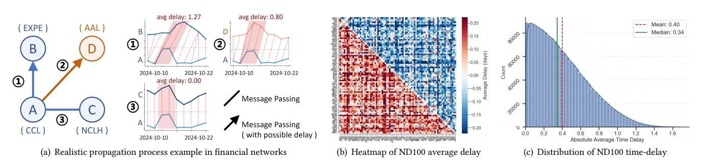
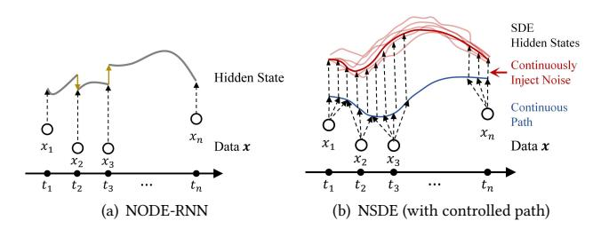
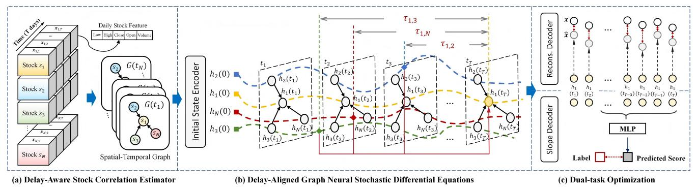
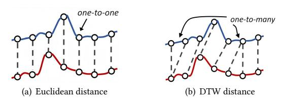
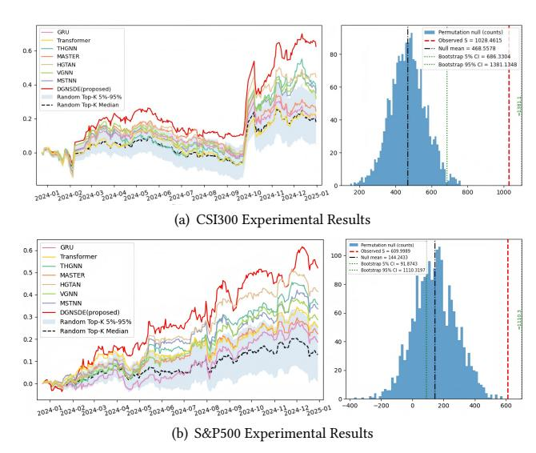
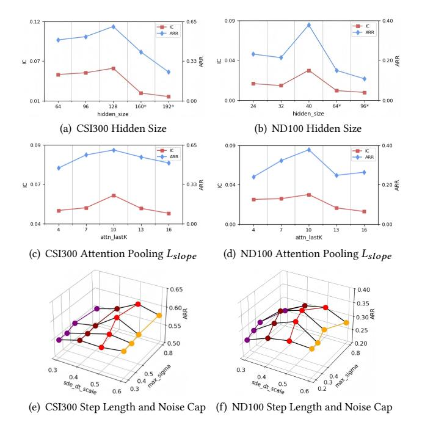
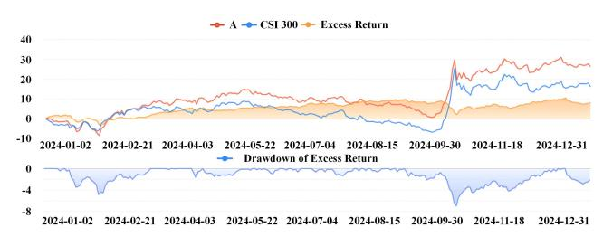
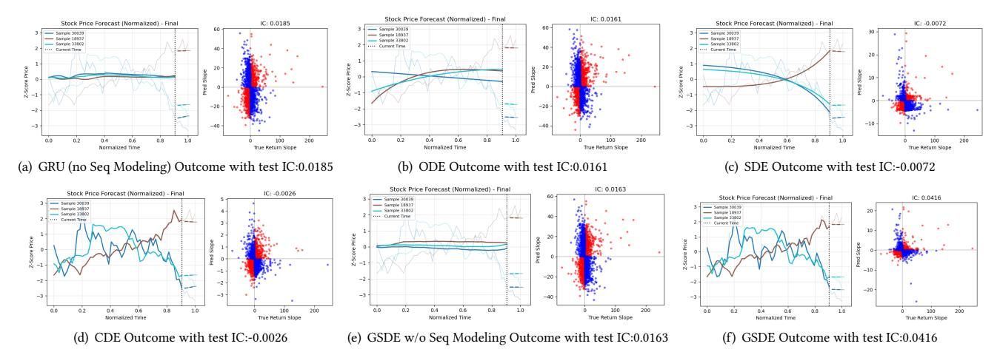
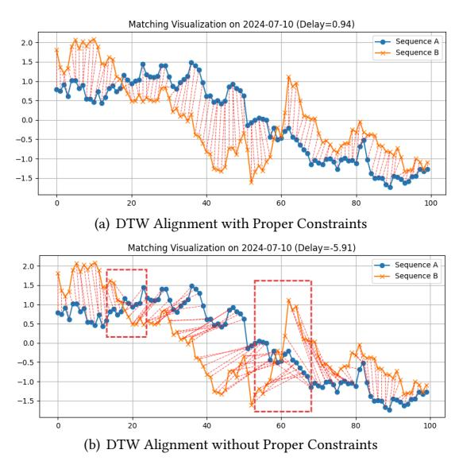

# Delay-Aware Graph Neural Stochastic Differential Equations for Financial Time Series Modeling and Forecasting

Mingjie You Tongji University Shanghai, China mj\_you@tongji.edu.cn

Dawei Cheng Tongji University Shanghai, China dcheng@tongji.edu.cn

Meilin Zhang Tongji University Shanghai, China 2454212@tongji.edu.cn

Peng Zhu∗ Tongji University Shanghai, China pengzhu@tongji.edu.cn

Yuqi Liang Seek Data Group, Emoney Inc. Shanghai, China roly.liang@seek-data.com

# Abstract

Financial time series forecasting remains a notoriously difficult task due to the natures of nonlinear dynamics, low signal-to-noise ratios, and evolving inter-stock dependencies. Traditional models often treat stocks as independent sequences, ignoring both temporal patterns and relational market structures. While recent GNN-based methods attempt to simplify higher-order relationships between stocks in the form of pairs, they still face three crucial limitations: 1) the inability to explicitly model the endogenous stochasticity inherent in financial time series, 2) the neglect of inter-stock dependencies that are not aligned on the time axis but exhibit systematic delays, i.e., lead–lag effects between stocks, and 3) a reliance on discrete-time updates, which restricts their capacity to represent the continuous-time evolution of financial markets. To overcome these challenges, we propose a novel Delay-Aware Graph Neural Stochastic Differential Equations (DGNSDE)-based framework that adopts a two-stage strategy consisting of trajectory reconstruction followed by slope prediction, while tightly integrating continuous-time neural stochastic differential equations with delayaware graph construction. Extensive experiments conducted on multiple real-world stock market datasets, including CSI300, CSI500, NASDAQ100, and S&P500, consistently demonstrate that DGNSDE outperforms state-of-the-art baselines across both ranking-based and investment-oriented evaluation metrics, highlighting its strong generalization ability. Furthermore, deployment in a real operational trading system shows that DGNSDE significantly improves robustness under market regime shifts and delivers superior riskadjusted returns, thereby underscoring its practical effectiveness and scalability for large-scale quantitative investment.

# CCS Concepts

### • Information systems → Data mining; • Applied computing → Economics.

∗Corresponding author.

[This work is licensed under a Creative Commons Attribution 4.0 International License.](https://creativecommons.org/licenses/by/4.0)

WWW '26, Dubai, United Arab Emirates. © 2026 Copyright held by the owner/author(s). ACM ISBN 979-8-4007-2307-0/2026/04 <https://doi.org/10.1145/3774904.3792829>

# Keywords

Financial Time Series, Stock Trend Prediction, Neural Differential Equations, Graph Neural Networks

### ACM Reference Format:

Mingjie You, Dawei Cheng, Meilin Zhang, Peng Zhu, and Yuqi Liang. 2026. Delay-Aware Graph Neural Stochastic Differential Equations for Financial Time Series Modeling and Forecasting. In Proceedings of the ACM Web Conference 2026 (WWW '26), April 13–17, 2026, Dubai, United Arab Emirates. ACM, New York, NY, USA, [12](#page-11-0) pages[. https://doi.org/10.1145/3774904.3792829](https://doi.org/10.1145/3774904.3792829)

# 1 Introduction

Stock market forecasting has long stood as one of the most important and mainstream investment strategies for both individual and institutional investors, given that equities remain the primary vehicle for global wealth management and capital allocation. The task of predicting future stock price movements based on historical data has remained a central focus in the financial industry, yet it continues to represent a formidable challenge for academic research. This difficulty arises from three fundamental characteristics inherent to financial time series data. First, stock markets exhibit highly nonlinear dynamics, where even minor perturbations in historical patterns can lead to significant variations in future trajectories, due to complex feedback mechanisms, heterogeneous agent behaviors, and abrupt external shocks that defy linear modeling assumptions [\[18\]](#page-8-0). Second, the signal-to-noise ratio in financial data is extremely low, as meaningful predictive signals are often obscured by substantial randomness, transient volatility, and microstructureinduced noise. This challenge is further reinforced by the Efficient Market Hypothesis (EMH) [\[7,](#page-8-1) [42\]](#page-8-2), which posits that all available information is already reflected in stock prices, rendering price movements effectively random and inherently unpredictable. Third, dependencies among stocks are both intricate and constantly evolving, shaped by factors such as sectoral ties, supply chain structures, and macroeconomic conditions, which give rise to a shifting web of correlations and causal interactions. These interdependencies are frequently asymmetric in nature, as reflected in lead–lag relationships [\[36\]](#page-8-3) where the behavior of one asset may systematically anticipate and influence that of another.

Traditional approaches have relied on statistical models like ARIMA [\[50\]](#page-9-0) and GARCH [\[17\]](#page-8-4), machine learning methods such as support vector regression (SVR) [\[16,](#page-8-5) [21\]](#page-8-6) and random forests [\[31\]](#page-8-7), as well as deep learning models like recurrent neural networks

Figure 1: (a) shows realistic financial networks propagation cases: nodes A, B, C (same industry) can show both synchronous and potential delay, while D and A (different industries) may also show similar trends but with potential delay; (b) and (c) present ND100 average heatmap and delay distribution histogram (2018–2024) computed via below-mentioned DTW method.

(RNNs) [\[2,](#page-8-8) [13,](#page-8-9) [43\]](#page-8-10). While these techniques improve modeling of temporal dynamics and nonlinearities, they typically treat each stock as an independent and identically distributed (i.i.d.) sequence [\[37\]](#page-8-11), neglecting cross-sectional dependencies crucial for capturing contagion and spillover effects. To address this, recent research has adopted graph neural networks (GNNs) to model inter-stock relations. Most GNN-based methods rely on predefined structures such as sector classifications [\[32,](#page-8-12) [48,](#page-8-13) [56,](#page-9-1) [60\]](#page-9-2), but these static graphs struggle to capture the evolving nature of stock relations and are often based on coarse or outdated information. Newer approaches infer dynamic graphs from periodic coefficients [\[57\]](#page-9-3) or price observations [\[23,](#page-8-14) [47\]](#page-8-15), enabling relationships to evolve over time. However, three major issues remain: (1) most models overlook the inherent stochasticity in financial series, approximating dynamics as deterministic; (2) they assume synchronous relationships, ignoring lead–lag effects where one stock can precede another in response to market signals, As illustrated in Figure [1,](#page-1-0) both intra- and inter-sector stocks exhibit co-movement behaviors with measurable, systematic delays. (3) they are limited to discrete-time updates, which restrict their ability to model the continuous evolution of financial markets.

To address these challenges, we propose a novel Delay-Aware Graph Neural Stochastic Differential Equations (DGNSDE)-based framework that integrates temporal dynamics, cross-sectional dependencies, and stochasticity within a unified continuous-time formulation. Specifically, we first preprocess raw equity time series into standardized sliding windows to construct sample sequences, followed by the computation of pairwise dynamic time warping similarity and delay matrices to capture both synchronous and lead–lag relations among stocks. These matrices are then used to construct adaptive lag-aware graphs for each date, using delayaware edges to encode asymmetric predictive relationships. On this basis, we employ a controlled stochastic differential equation driven by cubic spline interpolations of historical features, enabling the model to capture fine-grained temporal dynamics and inherent randomness in financial markets. Graph neural operators are further integrated into both the drift and diffusion components of the SDE to propagate synchronous and delay-aware messages across the constructed graphs, thereby modeling evolving interactions among assets in continuous time. Finally, the framework generates forecasts of future returns by cross-sectional ranking objectives

that emphasize relative performance prediction instead of absolute prices. We evaluate our method on real-world stock market datasets including CSI300[1](#page-1-1) , CSI500[2](#page-1-2) , NASDAQ100[3](#page-1-3) , and S&P500[4](#page-1-4) , the results show that our model outperforms state-of-the-art baselines, with additional ablation studies and backtests on real trading systems further validating the effectiveness of each module in our framework. Our main contributions are as follows:

- Delay-Aware Relation Extraction: We propose a mechanism to capture lead–lag correlations and delay values between stocks. Leveraging DTW/DDTW-based matrices, we construct adaptive graphs that encode asymmetric, timeshifted relations, enabling more coherent modeling of evolving market dependencies.
- Unified Continuous-Time Stochastic Framework: To the best of our knowledge, we are the first work to adopt a continuous-time approach that jointly models the stochasticity of stock time series. Our DGNSDE model integrates cubic-spline–based controlled differential equations with graph neural operators in both drift and diffusion terms, allowing continuous-time modeling of temporal dynamics, randomness, and cross-sectional dependencies.
- Comprehensive Experimental & Industrial Validation: We validate the effectiveness of our framework through extensive experiments on multiple real-world stock market benchmarks, with ablation studies and additional backtests on real trading systems further validate its practical effectiveness and great potential for industrial application.

### 2 Preliminaries

# 2.1 Stock Trend Prediction

We define the set of all stocks as �� = {��1, ��2, · · · , ���� }, where ���� represents the ��-th stock among a total of �� stocks in the market. For any given stock ���� in the set, we define its data on trading day �� as x��,�� = {�� (��������) ��,�� , �� (���������� ) ��,�� , �� (ℎ����ℎ) ��,�� , �� (������) ��,�� , �� (������������ ) ��,�� , �� (����������������) ��,�� } ⊤ ∈ �� , representing the opening price, closing price, highest price, lowest price, trading volume and trading amount (if given) of the stock, namely its �� -dimensional data. Subsequently, The data of all

1https://cn.investing.com/indices/csi300

2https://cn.investing.com/Index/china-securities-500-historical-data

3https://hk.finance.yahoo.com/quote/%5EIXIC/history

4https://hk.finance.yahoo.com/quote/%5EGSPC/history/

Table 1: Experimental results of all models. We deploy and evaluate all models using two categories of metrics: 1) ranking-based metrics including IC and ICIR to measure the consistency between predicted scores and actual returns; and 2) portfolio-based metrics including ARR, AVol, MDD, and IR, which evaluate return and risk concerned performances of the resulting strategies.

| Models      | IC    | ↑ ICIR | ↑ ARR | CSI 300 ↑ AVol | ↓ MDD  | ↓ IR   | ↑ IC  | ↑ ICIR | ↑ ARR | CSI 500 ↑ AVol | ↓ MDD  | ↓ IR  | ↑ IC  | ↑ ICIR | ↑ ARR | NASDAQ ↑ AVol | 100 ↓ MDD | ↓ IR   | ↑ IC   | ↑ ICIR | ↑ ARR | S&P 500 ↑ AVol | ↓ MDD  | ↓ IR ↑ |
|-------------|-------|--------|-------|----------------|--------|--------|-------|--------|-------|----------------|--------|-------|-------|--------|-------|---------------|-----------|--------|--------|--------|-------|----------------|--------|--------|
| GRU         | 0.016 | 0.193  | 0.202 | 0.223          | -0.142 | 0.141  | 0.020 | 0.233  | 0.272 | 0.275          | -0.186 | 1.123 | 0.002 | 0.017  | 0.103 | 0.192         | -0.150    | 0.103  | 0.008  | 0.081  | 0.176 | 0.154          | -0.095 | 0.274  |
| LSTM        | 0.012 | 0.090  | 0.237 | 0.238          | -0.172 | 0.459  | 0.014 | 0.173  | 0.263 | 0.274          | -0.182 | 1.094 | 0.011 | 0.072  | 0.122 | 0.220         | -0.178    | 0.264  | 0.006  | 0.085  | 0.123 | 0.152          | -0.092 | -0.182 |
| ALSTM       | 0.009 | 0.126  | 0.132 | 0.248          | -0.194 | -0.556 | 0.010 | 0.099  | 0.208 | 0.257          | -0.190 | 0.512 | 0.009 | 0.068  | 0.118 | 0.198         | -0.157    | 0.247  | 0.002  | 0.038  | 0.224 | 0.163          | -0.103 | 0.565  |
| Transformer | 0.015 | 0.110  | 0.215 | 0.253          | -0.183 | 0.304  | 0.029 | 0.266  | 0.316 | 0.277          | -0.204 | 1.553 | 0.017 | 0.102  | 0.173 | 0.251         | -0.191    | 0.565  | 0.012  | 0.148  | 0.238 | 0.146          | -0.083 | 0.861  |
| LSTM_GCN    | 0.006 | 0.030  | 0.183 | 0.357          | -0.203 | 0.141  | 0.013 | 0.084  | 0.253 | 0.290          | -0.211 | 0.582 | 0.005 | 0.021  | 0.068 | 0.272         | -0.173    | -0.040 | -0.001 | -0.014 | 0.077 | 0.181          | -0.104 | -0.664 |
| TGC         | 0.014 | 0.075  | 0.296 | 0.269          | -0.178 | 0.840  | 0.016 | 0.195  | 0.284 | 0.273          | -0.174 | 1.174 | 0.011 | 0.075  | 0.131 | 0.236         | -0.170    | 0.368  | 0.009  | 0.110  | 0.203 | 0.141          | -0.086 | 0.530  |
| STHGCN      | 0.020 | 0.118  | 0.299 | 0.254          | -0.145 | 0.924  | 0.025 | 0.290  | 0.379 | 0.271          | -0.172 | 2.112 | 0.015 | 0.092  | 0.220 | 0.246         | -0.182    | 0.853  | 0.010  | 0.087  | 0.250 | 0.170          | -0.085 | 0.575  |
| THGNN       | 0.027 | 0.155  | 0.375 | 0.297          | -0.190 | 1.362  | 0.031 | 0.198  | 0.431 | 0.292          | -0.206 | 2.351 | 0.024 | 0.136  | 0.204 | 0.224         | -0.141    | 0.798  | 0.016  | 0.121  | 0.349 | 0.155          | -0.080 | 1.181  |
| RTGCN       | 0.028 | 0.135  | 0.256 | 0.261          | -0.167 | 0.528  | 0.026 | 0.164  | 0.366 | 0.295          | -0.219 | 1.658 | 0.019 | 0.108  | 0.166 | 0.206         | -0.145    | 0.618  | 0.010  | 0.124  | 0.233 | 0.165          | -0.088 | 0.547  |
| LSR_IGRU    | 0.034 | 0.188  | 0.314 | 0.282          | -0.146 | 1.037  | 0.032 | 0.267  | 0.352 | 0.299          | -0.216 | 1.694 | 0.020 | 0.104  | 0.279 | 0.223         | -0.146    | 1.263  | 0.014  | 0.107  | 0.333 | 0.161          | -0.076 | 1.086  |
| MASTER      | 0.016 | 0.082  | 0.238 | 0.283          | -0.192 | 0.421  | 0.023 | 0.198  | 0.251 | 0.286          | -0.228 | 1.029 | 0.007 | 0.033  | 0.141 | 0.243         | -0.145    | 0.351  | 0.004  | 0.053  | 0.210 | 0.161          | -0.100 | 0.013  |
| HGTAN       | 0.041 | 0.207  | 0.455 | 0.300          | -0.170 | 1.760  | 0.031 | 0.201  | 0.431 | 0.292          | -0.206 | 2.351 | 0.025 | 0.140  | 0.317 | 0.218         | -0.166    | 1.522  | 0.020  | 0.162  | 0.406 | 0.166          | -0.081 | 1.418  |
| VGNN        | 0.036 | 0.221  | 0.325 | 0.277          | -0.163 | 1.772  | 0.027 | 0.314  | 0.379 | 0.272          | -0.174 | 2.264 | 0.020 | 0.113  | 0.271 | 0.214         | -0.132    | 1.327  | 0.010  | 0.146  | 0.268 | 0.151          | -0.088 | 1.027  |
| MSTNN       | 0.040 | 0.232  | 0.359 | 0.293          | -0.168 | 1.293  | 0.027 | 0.396  | 0.399 | 0.272          | -0.171 | 2.270 | 0.021 | 0.117  | 0.309 | 0.207         | -0.133    | 1.589  | 0.020  | 0.158  | 0.329 | 0.163          | -0.087 | 1.024  |
| DGNSDE      | 0.058 | 0.553  | 0.609 | 0.278          | -0.141 | 2.921  | 0.047 | 0.339  | 0.518 | 0.313          | -0.191 | 2.826 | 0.033 | 0.186  | 0.378 | 0.235         | -0.161    | 1.767  | 0.024  | 0.247  | 0.522 | 0.209          | -0.112 | 1.663  |

### 4 Experiments

## 4.1 Experimental Settings

4.1.1 Datasets. We conduct extensive experiments on real-world datasets from both Chinese and US stock markets, covering multiple scales and index types, including CSI300, CSI500, NASDAQ100, and S&P500. Each dataset contains historical daily-level stock information, including opening price, closing price, highest price, lowest price, and trading volume for US market entities, and additionally the turnover indicator for Chinese market stocks. All datasets are chronologically split into a training set (2018–2023) and a testing set (2024). For detailed dataset statistics and preprocessing steps, please refer to Appendix [A.1.](#page-9-6)

4.1.2 Evaluating Metrics. Since the goal of this study is to recommend the most profitable stocks, we place greater emphasis on evaluating the slope prediction task. Traditional error-based metrics such as MAE and RMSE are not suitable for this objective [\[19\]](#page-8-33). Instead, we adopt six widely used evaluation metrics in financial forecasting and quantitative investment [\[20\]](#page-8-34), including: Information Coefficient (IC), Information Coefficient Information Ratio (ICIR), Annualized Rate of Return (ARR), and Information Ratio (IR), where higher values indicate better performance; as well as Annualized Volatility (AVol) and Maximum Drawdown (MDD), where lower absolute values indicate lower investment risk. For detailed metric definitions and analysis, please refer to Appendix [A.2.](#page-9-7)

As few existing methods adopt a two-stage training process involving trajectory reconstruction, we analyze and discuss the irreplaceable and unique role of the SDE-based sequence modeling design in section [4.4](#page-6-0) of ablation studies and Appendix [B.4.](#page-11-1)

4.1.3 Compared Baselines. We compare our model with the following state-of-art baseline models, including 1) Non-graph methods of GRU[\[13\]](#page-8-9), LSTM[\[49\]](#page-9-8), ALSTM[\[54\]](#page-9-9), Transformer[\[52\]](#page-9-10), and 2) Graph-based models, with LSTM\_GCN[\[3\]](#page-8-35), TGC[\[10\]](#page-8-36), STHGCN[\[48\]](#page-8-13), THGNN[\[57\]](#page-9-3), RTGCN[\[60\]](#page-9-2), LSR\_IGRU[\[61\]](#page-9-11), MASTER[\[34\]](#page-8-37), HGTAN[\[5\]](#page-8-38), VGNN[\[59\]](#page-9-12) and MSTNN[\[51\]](#page-9-13).

4.1.4 Parameter Settings. We set DTW-related window lengths to ��delay = 120 and ��sim = 40 days for delay estimation and similarity measurement, respectively. Each forecasting sample spans 40 days, with the first �� = 35 used as the look-back window (day 35 as the prediction point) and the final �� = 5 as the label segment. For slope prediction, we set the attention pooling length to ��slope = 10, use the Euler–Maruyama scheme with ������\_����\_���������� = 0.5, and cap the diffusion strength at ������\_���������� = 0.5. Graphs are rownormalized with top-10 neighbors retained. Hidden dimensions vary by dataset from 40 to 160. All models are implemented in PyTorch [\[45\]](#page-8-39) and trained using the AdamW optimizer [\[41\]](#page-8-40) with an initial learning rate of 0.0005, adaptively decayed. Experiments are run on a single NVIDIA GeForce RTX 3090 (24GB). During test set inference, we perform 10 independent forward passes per sample and take the arithmetic mean as the final prediction.

4.1.5 Trading Protocols. Building on [\[20\]](#page-8-34), we evaluate slopebased stock prediction under a Top-K-Drop strategy, which holds �� assets and dynamically replaces the lowest-ranked ones. During the test period (January–December 2024), portfolios are rebalanced daily based on model forecasts.

- (1) At the close of trading day ��, the model computes prediction scores for all stocks, generating a daily ranking of expected returns. Current holdings are matched against this ranking to determine candidates for dropping and replacement.
- (2) From the existing portfolio, the �� lowest-scoring stocks are sold, and the same number of top-scoring stocks not held are purchased. Additional high-ranked stocks will be bought to fill the portfolio back to �� holdings.
- (3) For stocks retained across consecutive days, positions are held and marked-to-market until sold. We compute realized daily returns of the evolving Top-K portfolio as reference for cumulative performance and other metrics, ignoring transaction costs in this experiment.

For each dataset, we set �� to 5% of total stocks with �� = ��/��label, ensuring one full portfolio rotation within ��label days in line with label design.

Table 2: Performance of ablated or modified models on CSI300 and NASDAQ100. Removing modules or relation types leads to drops in key metrics, highlighting each component's importance.

|     |           | Models  | IC    | ↑ ICIR | CSI 300 ↑ ARR | ↑ IR  | ↑ IC  | ↑ ICIR | ND 100 ↑ ARR | ↑ IR ↑ |
|-----|-----------|---------|-------|--------|---------------|-------|-------|--------|--------------|--------|
| w/o | corr.     | estm.   | 0.027 | 0.183  | 0.400         | 1.445 | 0.016 | 0.092  | 0.206        | 0.696  |
| w/o | stochast. |         | 0.038 | 0.284  | 0.525         | 2.793 | 0.030 | 0.165  | 0.343        | 1.327  |
| w/o | graph     | msg.    | 0.029 | 0.234  | 0.344         | 1.470 | 0.019 | 0.125  | 0.270        | 1.102  |
| w/o | graph     | & stoc. | 0.024 | 0.193  | 0.335         | 1.810 | 0.018 | 0.121  | 0.210        | 0.781  |
| w/o | seq.      | recon.  | 0.020 | 0.199  | 0.258         | 0.863 | 0.022 | 0.160  | 0.226        | 0.994  |
|     | DGNSDE    |         | 0.058 | 0.553  | 0.609         | 2.921 | 0.033 | 0.186  | 0.378        | 1.767  |

Figure 7: The performance of proposed strategy backtest on real-life trading system with CSI300 stock pool.

- w/o graph & stoc.: Disables both graph message passing and stochasticity, retaining only deterministic node evolution.
- w/o seq. recon.: Removes sequence reconstruction task from the dual-task objective, using only the slope prediction loss.

Results show that all components positively impact model performance. In particular, the sequence reconstruction task and the graph message aggregation module yield notable gains in both ranking and return metrics. Other components, such as the delay-aware correlation estimator and stochastic modeling, also contribute to improved robustness and risk-adjusted returns, underscoring the importance of the overall architectural design.

# 4.5 Applied Industrial Deployment

We further deployed the proposed DGNSDE model in a real-world trading system operated by Seek Data Group. The model is retrained monthly using the latest market data and generates daily predictions at the end of each trading session. Based on these predictions, trading strategies are executed during the first half hour of the next trading day. Figure [7](#page-7-1) illustrates the impact of different strategies on actual trading performance.

The results on the CSI300 stock pool have been promising. As shown in the figure, the red curve and blue curve represent the cumulative return of our strategy and the CSI300 index, with the yellow curve shows the excess return relative to the market. Over more than a year of live trading, our model has consistently outperformed the index while maintaining a considerably lower drawdown. It is worth noting that real-world deployment imposes stricter challenges than on virtual datasets, as it must account for market frictions, execution latency, and unexpected regime shifts, further validating the robustness and practical value of our approach.

### 5 Related Work

### 5.1 Stock Trend Prediction

Stock trend prediction has long been a core problem in finance due to the influence a diversity of unpredictable market factors[\[9\]](#page-8-41). Traditional statistical models such as AR[\[33\]](#page-8-42), ARIMA[\[50\]](#page-9-0), and GARCH[\[17\]](#page-8-4) have been widely used but struggle to model the nonlinear dynamics of stock movements. With the rise of machine learning, approaches like SVM[\[16,](#page-8-5) [21\]](#page-8-6) and Random Forest[\[31\]](#page-8-7) offer improved pattern recognition. More recently, deep learning methods, including GRU [\[13\]](#page-8-9) and LSTM[\[2,](#page-8-8) [43\]](#page-8-10), have shown effectiveness in capturing temporal dependencies. However, these models are often unstable under market fluctuations[\[8,](#page-8-43) [15\]](#page-8-44), and most treat stocks as independent sequences, ignoring inter-stock relations such as industry or supply-chain linkages that may drive co-movement.

# 5.2 Graph Neural Networks

GNNs have been increasingly applied in financial forecasting by modeling stocks as nodes in a graph, enabling the integration of both individual attributes and neighbor information. Early methods adopt GCN[\[29\]](#page-8-45) and GAT[\[53\]](#page-9-14) on static graphs constructed from sector labels or domain priors[\[4,](#page-8-46) [10\]](#page-8-36), but fixed edges fail to reflect dynamic market conditions and may conflate opposing influences. To address this, recent models such as THGNN[\[57\]](#page-9-3), LSR-IGRU[\[61\]](#page-9-11), and MGGAL[\[62\]](#page-9-15) construct time-varying graphs based on statistical correlations or motifs. However, even these models overlook several key characteristics of financial time series in real-world industrial settings. Specifically: 1) they fail to model the well-known inherent stochasticity of financial dynamics [\[46\]](#page-8-47), which neural stochastic differential equation frameworks [\[38,](#page-8-21) [44\]](#page-8-25) are designed to address; 2) they ignore the fact that inter-stock relationships are not strictly time-aligned but often exhibit lead–lag effects [\[36\]](#page-8-3), a common phenomenon in real-world systems that has been increasingly explored by delay-aware GNNs in other domains [\[40\]](#page-8-27); and 3) they rely solely on discrete-time modeling, which is ill-suited for capturing the continuously evolving nature of financial markets, which is a gap that continuous-time neural models such as ODE-based frameworks [\[22,](#page-8-18) [26,](#page-8-17) [28,](#page-8-19) [39\]](#page-8-29) are better equipped to fill.

### 6 Conclusion

In this work, we propose DGNSDE, a novel framework for financial time series modeling and forecasting that unifies delay-aware graph modeling with geometric stochastic differential equations. By modeling temporal misalignment and inherent stochasticity in financial time series, our method captures realistic market dynamics. Experiments on real-world datasets demonstrate that DGNSDE consistently outperforms baselines in ranking and return metrics. Beyond backtesting, our model has been integrated into a realworld algorithmic trading platform, where it demonstrates stable, high-return strategies under live market conditions. These findings highlight the potential of combining temporal graph reasoning and stochastic modeling for industrial-scale financial applications.

# Acknowledgments

The work is supported by the National Natural Science Foundation of China (Grant No. 62522213).

### References

[1] Louis KC Chan, Josef Lakonishok, and Bhaskaran Swaminathan. 2007. Industry classifications and return comovement. Financial Analysts Journal 63, 6 (2007), 56–70. [2] Kai Chen, Yi Zhou, and Fangyan Dai. 2015. A LSTM-based method for stock returns prediction: A case study of China stock market. In 2015 IEEE international conference on big data (big data). IEEE, 2823–2824. [3] Yingmei Chen, Zhongyu Wei, and Xuanjing Huang. 2018. Incorporating corporation relationship via graph convolutional neural networks for stock price prediction. In Proceedings of the 27th ACM international conference on information and knowledge management. 1655–1658. [4] Yingmei Chen, Zhongyu Wei, and Xuanjing Huang. 2018. Incorporating corporation relationship via graph convolutional neural networks for stock price prediction. In Proceedings of the 27th ACM international conference on information and knowledge management. 1655–1658. [5] Chaoran Cui, Xiaojie Li, Chunyun Zhang, Weili Guan, and Meng Wang. 2023. Temporal-relational hypergraph tri-attention networks for stock trend prediction. Pattern recognition 143 (2023), 109759. [6] Edward De Brouwer, Jaak Simm, Adam Arany, and Yves Moreau. 2019. GRU-ODE-Bayes: Continuous modeling of sporadically-observed time series. Advances in neural information processing systems 32 (2019). [7] Eugene F Fama. 1965. The behavior of stock-market prices. The journal of Business 38, 1 (1965), 34–105. [8] Roger EA Farmer. 2012. The stock market crash of 2008 caused the Great Recession: Theory and evidence. Journal of Economic Dynamics and Control 36, 5 (2012), 693–707. [9] Fuli Feng, Huimin Chen, Xiangnan He, Ji Ding, Maosong Sun, and Tat-Seng Chua. 2019. Enhancing Stock Movement Prediction with Adversarial Training. IJCAI (2019). [10] Fuli Feng, Xiangnan He, Xiang Wang, Cheng Luo, Yiqun Liu, and Tat-Seng Chua. 2019. Temporal relational ranking for stock prediction. ACM Transactions on Information Systems (TOIS) 37, 2 (2019), 1–30. [11] Xing Feng, Hongru Li, and Yinghua Yang. 2025. Time-lagged relation graph neural network for multivariate time series forecasting. Engineering Applications of Artificial Intelligence 139 (2025), 109530. [12] Zoltan Geler, Vladimir Kurbalija, Miloš Radovanović, and Mirjana Ivanović. 2014. Impact of the Sakoe-Chiba band on the DTW time series distance measure for k NN classification. In International Conference on Knowledge Science, Engineering and Management. Springer, 105–114. [13] Umang Gupta, Vandana Bhattacharjee, and Partha Sarathi Bishnu. 2022. Stock-Net—GRU based stock index prediction. Expert Systems with Applications 207 (2022), 117986. [14] Kaiming He, Xiangyu Zhang, Shaoqing Ren, and Jian Sun. 2016. Deep residual learning for image recognition. In Proceedings of the IEEE conference on computer vision and pattern recognition. 770–778. [15] Qing He, Junyi Liu, Sizhu Wang, and Jishuang Yu. 2020. The impact of COVID-19 on stock markets. Economic and Political Studies 8, 3 (2020), 275–288. [16] Bruno Miranda Henrique, Vinicius Amorim Sobreiro, and Herbert Kimura. 2018. Stock price prediction using support vector regression on daily and up to the minute prices. The Journal of finance and data science 4, 3 (2018), 183–201. [17] Helmut Herwartz. 2017. Stock return prediction under GARCH—An empirical assessment. International Journal of Forecasting 33, 3 (2017), 569–580. [18] David A Hsieh. 1991. Chaos and nonlinear dynamics: application to financial markets. The journal of finance 46, 5 (1991), 1839–1877. [19] Yi-Ling Hsu, Yu-Che Tsai, and Cheng-Te Li. 2021. Fingat: Financial graph attention networks for recommending top-�� k profitable stocks. IEEE transactions on knowledge and data engineering 35, 1 (2021), 469–481. [20] Yifan Hu, Yuante Li, Peiyuan Liu, Yuxia Zhu, Naiqi Li, Tao Dai, Shu-tao Xia, Dawei Cheng, and Changjun Jiang. 2025. Fintsb: A comprehensive and practical benchmark for financial time series forecasting. arXiv preprint arXiv:2502.18834 (2025). [21] Wei Huang, Yoshiteru Nakamori, and Shou-Yang Wang. 2005. Forecasting stock market movement direction with support vector machine. Computers & operations research 32, 10 (2005), 2513–2522. [22] Kazuki Irie, Francesco Faccio, and Jürgen Schmidhuber. 2022. Neural differential equations for learning to program neural nets through continuous learning rules. Advances in Neural Information Processing Systems 35 (2022), 38614–38628. [23] Renjun Jia, Kaiming Yang, Dawei Cheng, Li Han, and Yuqi Liang. 2025. Graph-Driven Insights: Enhancing Stock Market Prediction with Relational Temporal Dynamics. In ICASSP 2025 - 2025 IEEE International Conference on Acoustics, Speech and Signal Processing (ICASSP). 1–5. [doi:10.1109/ICASSP49660.2025.10889271](https://doi.org/10.1109/ICASSP49660.2025.10889271) [24] Alex Kendall, Yarin Gal, and Roberto Cipolla. 2018. Multi-task learning using uncertainty to weigh losses for scene geometry and semantics. In Proceedings of the IEEE conference on computer vision and pattern recognition. 7482–7491. [25] Eamonn J. Keogh and Michael J. Pazzani. 2001. Derivative Dynamic Time Warping. In Proceedings of the 2001 SIAM International Conference on Data Mining (SDM). 1–11. [26] P Kidger. 2021. On neural differential equations. Ph. D. Dissertation. University of Oxford. [27] Patrick Kidger, James Foster, Xuechen Li, Harald Oberhauser, and Terry Lyons. 2021. Neural SDEs as Infinite-Dimensional GANs. International Conference on Machine Learning (2021). [28] Patrick Kidger, James Morrill, James Foster, and Terry Lyons. 2020. Neural controlled differential equations for irregular time series. Advances in neural information processing systems 33 (2020), 6696–6707. [29] Thomas N. Kipf and Max Welling. 2017. Semi-Supervised Classification with Graph Convolutional Networks. In 5th International Conference on Learning Representations, ICLR 2017, Toulon, France, April 24-26, 2017, Conference Track Proceedings. [30] Lingkai Kong, Jimeng Sun, and Chao Zhang. 2020. SDE-Net: Equipping Deep Neural Networks with Uncertainty Estimates. In International Conference on Machine Learning. PMLR, 5405–5415. [31] Manish Kumar and M Thenmozhi. 2006. Forecasting stock index movement: A comparison of support vector machines and random forest. In Indian institute of capital markets 9th capital markets conference paper. [32] Chang Li, Dongjin Song, and Dacheng Tao. 2019. Multi-task recurrent neural networks and higher-order Markov random fields for stock price movement prediction: Multi-task RNN and higer-order MRFs for stock price classification. In Proceedings of the 25th ACM SIGKDD international conference on knowledge discovery & data mining. 1141–1151. [33] Lili Li, Shan Leng, Jun Yang, and Mei Yu. 2016. Stock market autoregressive dynamics: a multinational comparative study with quantile regression. Mathematical Problems in Engineering 2016, 1 (2016), 1285768. [34] Tong Li, Zhaoyang Liu, Yanyan Shen, Xue Wang, Haokun Chen, and Sen Huang. 2024. MASTER: Market-Guided Stock Transformer for Stock Price Forecasting. In Proceedings of the AAAI Conference on Artificial Intelligence, Vol. 38. 162–170. [35] Xuechen Li, Ting-Kam Leonard Wong, Ricky T. Q. Chen, and David Duvenaud. 2020. Scalable gradients for stochastic differential equations. International Conference on Artificial Intelligence and Statistics (2020). [36] Yongli Li, Tianchen Wang, Baiqing Sun, and Chao Liu. 2022. Detecting the lead–lag effect in stock markets: definition, patterns, and investment strategies. Financial Innovation 8, 1 (2022), 51. [37] Zhige Li, Derek Yang, Li Zhao, Jiang Bian, Tao Qin, and Tie-Yan Liu. 2019. Individualized indicator for all: Stock-wise technical indicator optimization with stock embedding. In Proceedings of the 25th ACM SIGKDD International Conference on Knowledge Discovery & Data Mining. 894–902. [38] Xuanqing Liu, Tesi Xiao, Si Si, Qin Cao, Sanjiv Kumar, and Cho-Jui Hsieh. 2019. Neural sde: Stabilizing neural ode networks with stochastic noise. arXiv preprint arXiv:1906.02355 (2019). [39] Zewen Liu, Xiaoda Wang, Bohan Wang, Zijie Huang, Carl Yang, and Wei Jin. 2025. Graph odes and beyond: A comprehensive survey on integrating differential equations with graph neural networks. In Proceedings of the 31st ACM SIGKDD Conference on Knowledge Discovery and Data Mining V. 2. 6118–6128. [40] Qingqing Long, Zheng Fang, Chen Fang, Chong Chen, Pengfei Wang, and Yuanchun Zhou. 2024. Unveiling delay effects in traffic forecasting: a perspective from spatial-temporal delay differential equations. In Proceedings of the ACM Web Conference 2024. 1035–1044. [41] Ilya Loshchilov and Frank Hutter. 2019. Decoupled Weight Decay Regularization. In International Conference on Learning Representations (ICLR). [42] Simone Merello, Andrea Picasso Ratto, Luca Oneto, and Erik Cambria. 2019. Ensemble application of transfer learning and sample weighting for stock market prediction. In 2019 International Joint Conference on Neural Networks (IJCNN). IEEE, 1–8. [43] David MQ Nelson, Adriano CM Pereira, and Renato A De Oliveira. 2017. Stock market's price movement prediction with LSTM neural networks. In 2017 International joint conference on neural networks (IJCNN). Ieee, 1419–1426. [44] YongKyung Oh, Dongyoung Lim, and Sungil Kim. 2024. Stable Neural Stochastic Differential Equations in Analyzing Irregular Time Series Data. In The Twelfth International Conference on Learning Representations, ICLR 2024, Vienna, Austria, May 7-11, 2024. OpenReview.net. [45] Adam Paszke, Sam Gross, Francisco Massa, Adam Lerer, James Bradbury, Gregory Chanan, Trevor Killeen, Zeming Lin, Natalia Gimelshein, Luca Antiga, et al. 2019. Pytorch: An imperative style, high-performance deep learning library. Advances in neural information processing systems 32 (2019). [46] Steve Pincus and Rudolf E. Kalman. 2004. Irregularity, volatility, risk, and financial market time series. Proceedings of the National Academy of Sciences 101, 38 (2004), 13709–13714. [doi:10.1073/pnas.0405168101](https://doi.org/10.1073/pnas.0405168101) [47] Hao Qian, Hongting Zhou, Qian Zhao, Hao Chen, Hongxiang Yao, Jingwei Wang, Ziqi Liu, Fei Yu, Zhiqiang Zhang, and Jun Zhou. 2024. MDGNN: Multi-Relational Dynamic Graph Neural Network for Comprehensive and Dynamic Stock Investment Prediction. In Proceedings of the AAAI Conference on Artificial Intelligence, Vol. 38. 14642–14650. [48] Ramit Sawhney, Shivam Agarwal, Arnav Wadhwa, and Rajiv Ratn Shah. 2020. Spatiotemporal hypergraph convolution network for stock movement forecasting. In 2020 IEEE International Conference on Data Mining (ICDM). IEEE, 482–491.

[49] Jürgen Schmidhuber, Sepp Hochreiter, et al. 1997. Long short-term memory. Neural Comput 9, 8 (1997), 1735–1780. [50] Robert H Shumway, David S Stoffer, Robert H Shumway, and David S Stoffer. 2017. ARIMA models. Time series analysis and its applications: with R examples (2017), 75–163. [51] Lingyun Song, Haodong Li, Siyu Chen, Xinbiao Gan, Binze Shi, Jie Ma, Yudai Pan, Xiaoqi Wang, and Xuequn Shang. 2025. Multi-Scale Temporal Neural Network for Stock Trend Prediction Enhanced by Temporal Hyepredge Learning. Proceedings of the IJCAI, Montreal, QC, Canada (2025), 16–22. [52] Ashish Vaswani, Noam Shazeer, Niki Parmar, Jakob Uszkoreit, Llion Jones, Aidan N Gomez, Łukasz Kaiser, and Illia Polosukhin. 2017. Attention is all you need. Advances in neural information processing systems 30 (2017). [53] Petar Velickovic, Guillem Cucurull, Arantxa Casanova, Adriana Romero, Pietro Liò, and Yoshua Bengio. 2018. Graph Attention Networks. In 6th International Conference on Learning Representations, ICLR 2018, Vancouver, BC, Canada, April 30 - May 3, 2018, Conference Track Proceedings. [54] Qi Wang and Yongsheng Hao. 2020. ALSTM: An attention-based long short-term memory framework for knowledge base reasoning. Neurocomputing 399 (2020), 342–351. [55] Danyan Wen, Chaoqun Ma, Gang-Jin Wang, and Senzhang Wang. 2018. Investigating the features of pairs trading strategy: A network perspective on the Chinese stock market. Physica A: Statistical Mechanics and its Applications 505 (2018), 903–918. [56] Hongjie Xia, Huijie Ao, Long Li, Yu Liu, Sen Liu, Guangnan Ye, and Hongfeng Chai. 2024. CI-STHPAN: Pre-trained Attention Network for Stock Selection with Channel-Independent Spatio-Temporal Hypergraph. In Proceedings of the AAAI Conference on Artificial Intelligence, Vol. 38. 9187–9195. [57] Sheng Xiang, Dawei Cheng, Chencheng Shang, Ying Zhang, and Yuqi Liang. 2022. Temporal and heterogeneous graph neural network for financial time series prediction. In Proceedings of the 31st ACM international conference on information & knowledge management. 3584–3593. [58] Sheng Xiang, Dong Wen, Dawei Cheng, Ying Zhang, Lu Qin, Zhengping Qian, and Xuemin Lin. 2022. General graph generators: experiments, analyses, and improvements. The VLDB Journal (2022), 1–29. [59] Rong Xing, Rui Cheng, Jiwen Huang, Qing Li, and Jingmei Zhao. 2023. Learning to understand the vague graph for stock prediction with momentum spillovers. IEEE Transactions on Knowledge and Data Engineering 36, 4 (2023), 1698–1712. [60] Zetao Zheng, Jie Shao, Jia Zhu, and Heng Tao Shen. 2023. Relational temporal graph convolutional networks for ranking-based stock prediction. In 2023 IEEE 39th International Conference on Data Engineering (ICDE). IEEE, 123–136. [61] Peng Zhu, Yuante Li, Yifan Hu, Qinyuan Liu, Dawei Cheng, and Yuqi Liang. 2024. LSR-IGRU: Stock Trend Prediction Based on Long Short-Term Relationships and Improved GRU. In Proceedings of the 33rd ACM International Conference on Information and Knowledge Management. 5135–5142. [62] Peng Zhu, Yuante Li, Qinyuan Liu, Dawei Cheng, and Changjun Jiang. 2025. Financial Time Series Prediction With Multi-Granularity Graph Augmented Learning. IEEE Transactions on Knowledge and Data Engineering 37, 11 (2025), 6436–6449. [doi:10.1109/TKDE.2025.3607005](https://doi.org/10.1109/TKDE.2025.3607005)

# A Experiment Details

# A.1 Datasets Details

We evaluate our framework on four representative stock indices across different markets and scales: CSI300 and CSI500 from the Chinese market, with NASDAQ100 and S&P500 from the US market. For all datasets, the training period is set from 01/02/2018 to 12/29/2023, while the testing period spans from 01/02/2024 to 12/31/2024. Detailed statistics, including the number of stocks and data durations, are summarized in Table [3](#page-9-16)[5](#page-9-17) . We collect the historical price data of stocks by using a publicly available yfinance API[6](#page-9-18) , and process the sequence data through the following steps.

We designed a data preprocessing pipeline specifically for the proposed research method. First, we define a sliding window based on the specified observation length and forecasting horizon to construct sample time ranges. Within each sample, we apply distinct normalization strategies based on feature types: for price features

(e.g., close, open), we utilize stock-level causal z-score normalization, computing statistics solely on the observation segment and applying them to the forecasting part; for volume and turnover features, we employ a log1p transformation followed by a global z-score normalization. Additionally, we compute and retain the logarithm of the original closing price, log(close), as an unnormalized yet scale-consistent reference feature for downstream modeling.

Table 3: Statistics of the datasets used in this study. Multiple datasets from Chinese and US markets are included ensure comprehensive experimental representativeness.

# A.2 Evaluating Metrics Details

To comprehensively evaluate the effectiveness of slope-based stock recommendation, we adopt two categories of metrics: rankingbased and portfolio-based.

Ranking-based Metrics. These metrics assess how well the predicted scores correlate with actual stock returns:

- Information Coefficient (IC): Defined as the Spearman rank correlation between predicted scores ��ˆ�� and realized returns ���� at each time step ��. IC = SpearmanCorr(��ˆ�� , ���� ). Higher IC indicates better consistency in relative ranking.
- Information Coefficient Information Ratio (ICIR): Measures the temporal stability of IC. It is computed as ICIR = mean(IC�� )/std(IC�� ) over the evaluation period.

Portfolio-based Metrics. These metrics evaluate investment performance when portfolios are constructed based on the predicted slopes. Specifically, we include:

- Annual Return Ratio (ARR): Measures the annualized return of a portfolio. ARR = (1 + Í�� ��=1 ���� ) �� − 1, where ���� is the daily return and �� is the number of trading days.
- Annual Volatility (AVol): Represents the annualized standard deviation of daily returns. AVol = std(���� ) × √
  - 252.
- Maximum Drawdown (MDD): Captures the maximum observed loss from a historical peak to a trough. MDD = max�� ∈ [1,�� ] h max�� ∈ [1,�� ] (���� −���� ) max�� ∈ [1,�� ] ���� , where ���� is the cumulative return up to day ��.
- Information Ratio (IR): Measures excess return over a benchmark adjusted for volatility. IR = mean(�� −���� )/std(�� − ���� ), where ���� denotes daily benchmark returns.

These metrics jointly reflect both the model's ranking capability and practical profitability[7](#page-9-19) , providing a comprehensive view of real-world investment performance.

5Constituents are not restricted to the latest index composition; instead, we select historical constituents with complete coverage over the evaluation period while controlling the number of stocks to reflect corresponding index scale.

6https://github.com/ranaroussi/yfinance

In practice, it is a common phenomenon that strategies pursuing higher returns are often accompanied by greater volatility, leading to higher AVol and MDD values. The goal is to maximize risk-adjusted returns while keeping risk under effective control.

Figure 8: Sample examples of three closing price time series along with the overall output distribution of the full simplified test set. GSDE with reconstruction accurately captures temporal structure and achieves the best test set IC score.

Figure 9: DTW alignment of ALGN and IDXX over 100 days. (a) Constrained DTW yields smooth, realistic alignment; (b) Unconstrained DTW misaligns segments due to local shifts.

DTW: derivative DTW (DDTW) with estimated delay as a prior and a stricter constraint �� =1.

Why DTW for delay, DDTW for similarity? DTW aligns raw price series by allowing nonlinear warping, capturing shape similarity. It is sensitive to magnitude differences, even post normalization, but constrained DTW (via diagonal bias and step limits) can still yield reliable delay alignment. For similarity, however, DTW distance is easily distorted by abrupt scale changes. DDTW, applied to derivative sequences, focuses on slope and trend patterns, making it more robust to amplitude noise.

Why not use DDTW for delay? DDTW compares derivative shapes, not original trajectories. Two series with opposite directions (e.g.,

one rising, one falling) but similar derivative magnitudes can be misaligned as "similar," leading to misleading delay estimates. Hence, DDTW is unsuitable when temporal ordering matters.

Why apply constraints? Figure [9](#page-11-2) shows the DTW path between ALGN and IDXX (NASDAQ stocks) over 100 trading days before July 10, 2024. Although the overall trends align, a short-term structural shift causes unconstrained DTW to misalign segments. A tighter Sakoe–Chiba band yields a more diagonal and consistent path, preserving realistic time structure. Thus, constrained DTW improves both robustness and interpretability in financial settings.

### B.4 The Necessity of Sequence Modeling Task and Geometric SDE

To further verify the necessity of Geometric Stochastic Differential Equations (GSDE) and assess the effectiveness of integrating a sequence reconstruction objective, we conduct a simple visual validation experiment using a simplified subset of the CSI300 index dataset. Specifically, we designate the period from 2022 to 2023 as the training window and reserve 2024 for testing. The modeling task focuses on predicting the directional trend of the closing price five days into the future, using only historical closing price sequences as input.

As shown in Figure [8,](#page-11-3) models lacking explicit sequence modeling capabilities such as vanilla GRU (which does not include sequence reconstruction by default) and standard ODE/SDE formulations struggle to capture temporal structures, showing suboptimal IC results for the test set. In contrast, path-controlled models like CDE and GSDE (with GRU-driven drift terms) demonstrate stronger abilities to follow time-dependent patterns, with GSDE achieving the highest structural fidelity.

While GSDE alone can model dynamics to a reasonable extent, training it with an auxiliary sequence reconstruction objective allows for more accurate recovery of the underlying generative process, thereby enhancing inference quality. These results highlight the importance of learning fine-grained temporal evolution, rather than merely optimizing for final prediction accuracy.