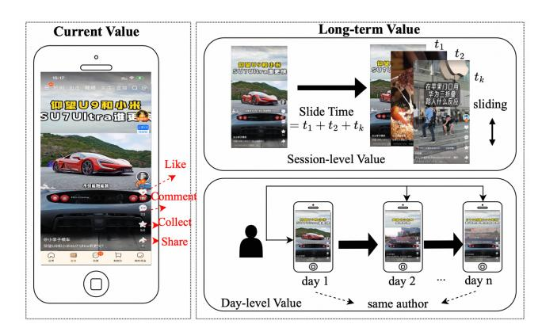
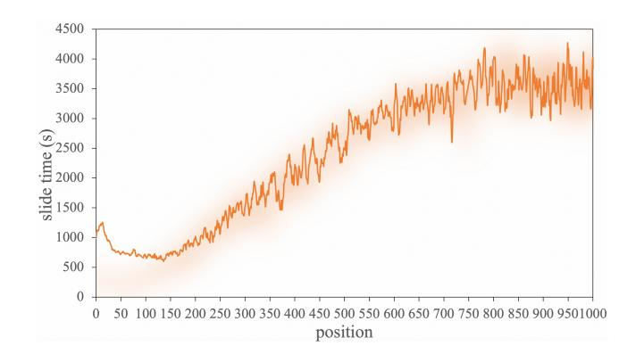
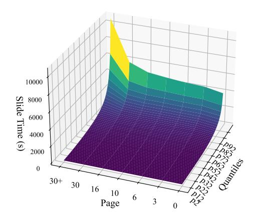
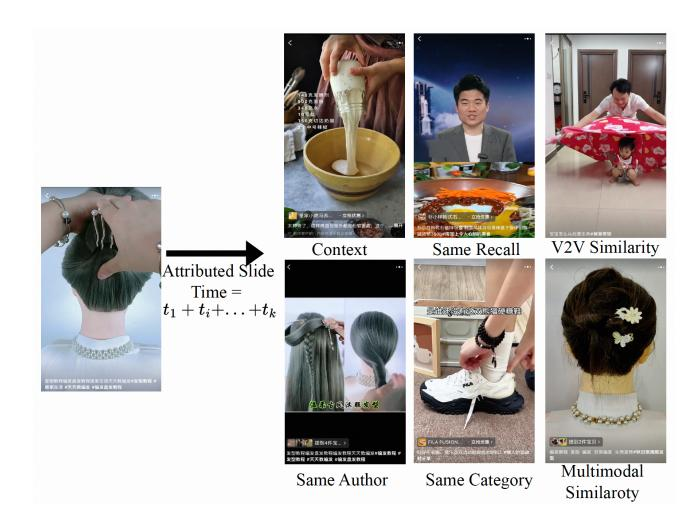
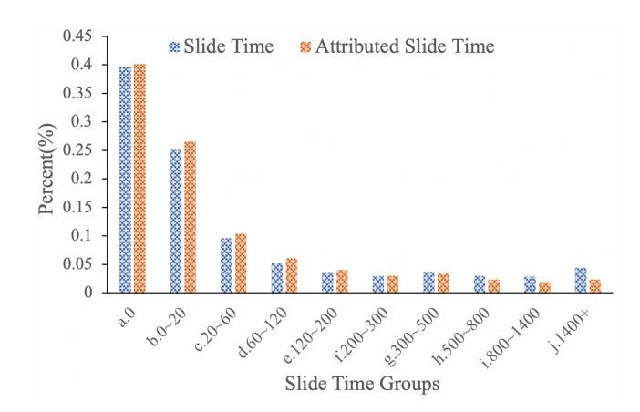
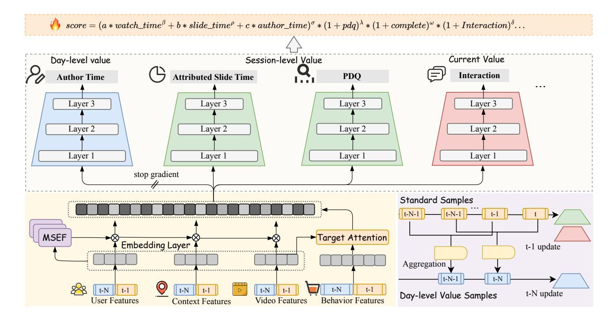
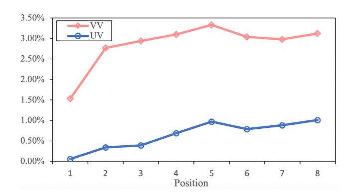
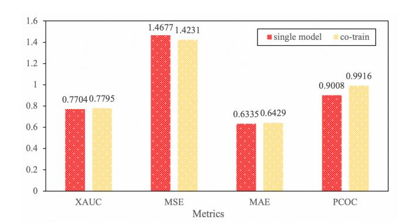

# A Long-term Value Prediction Framework In Video Ranking

Huabin Chen Alibaba Group Hangzhou, China chenhuabin.chb@alibaba-inc.com

Xinao Wang Alibaba Group Hangzhou, China wangxinao.wxa@alibaba-inc.com

Huiping Chu Alibaba Group Hangzhou, China yueqi.chp@alibaba-inc.com

Keqin Xu Alibaba Group Hangzhou, China xukeqin.xkq@alibaba-inc.com

Chenhao Zhai Tsinghua University Shenzhen, China dch23@mails.tsinghua.edu.cn

Chenyi Wang Alibaba Group Hangzhou, China wangchenyi.wcy@alibaba-inc.com

Kai Meng Alibaba Group Hangzhou, China mengkai.meng@alibaba-inc.com

Yuning Jiang∗ Alibaba Group Hangzhou, China mengzhu.jyn@alibaba-inc.com

### Abstract

Accurately modeling long-term value (LTV) at the ranking stage of short-video recommendation systems remains a practical challenge. Though production systems and recent research have begun exploring delayed feedback and extended user engagement, modeling LTV with fine-grained attribution and robust positional normalization for billion-scale platforms is underdeveloped. In this work, we present a practical ranking-stage LTV framework that systematically addresses three core challenges: position bias, attribution ambiguity, and temporal limitations.

First, to address position bias in sequential video feeds, we introduce a Position-aware Debias Quantile (PDQ) module that normalizes engagement signals using quantile-based distributions, enabling position-robust LTV estimation without requiring architectural changes. Second, we propose a multi-dimensional attribution module that learns continuous strengths across contextual, behavioral, and content-related signals, moving beyond static rule sets to capture nuanced influences among videos. Explicit noise filtering is incorporated via a customized hybrid loss, improving causal clarity in LTV attribution. Third, our cross-temporal author modeling module constructs censoring-aware, day-level long-term value targets, capturing creator-driven re-engagement over extended time windows. While our framework currently focuses on the author dimension, it is readily extensible to further aspects such as topics or styles.

Extensive offline experiments and online A/B tests demonstrate statistically significant gains in LTV-related metrics and stable trade-offs with short-term objectives. The framework is realized as task augmentation within an existing ranking model, facilitates billion-scale deployment on Taobao's production system with efficient training and serving, achieving sustained user engagement

∗Corresponding author

© 2026 Copyright held by the owner/author(s). ACM ISBN 979-8-4007-2307-0/2026/04 <https://doi.org/10.1145/3774904.3792830>

improvements while remaining compatible with industrial constraints.

# CCS Concepts

• Information systems → Retrieval models and ranking; Novelty in information retrieval.

# Keywords

Video Recommendation, Long-term Value Prediction, LTV, Position Debias

### ACM Reference Format:

Huabin Chen, Xinao Wang, Huiping Chu, Keqin Xu, Chenhao Zhai, Chenyi Wang, Kai Meng, and Yuning Jiang. 2026. A Long-term Value Prediction Framework In Video Ranking. In Proceedings of the ACM Web Conference 2026 (WWW '26), April 13–17, 2026, Dubai, United Arab Emirates. ACM, New York, NY, USA, [9](#page-8-0) pages.<https://doi.org/10.1145/3774904.3792830>

# 1 Introduction

The rapid proliferation of short-video platforms (e.g., TikTok, Instagram Reels) has intensified the industry focus on advanced video recommendation technologies[\[14,](#page-8-1) [21\]](#page-8-2). The accurate prediction of long-term value (LTV) for videos has emerged as a critical technological challenge in this domain. Contemporary approaches typically model multiple objectives individually and then integrate the predictions to estimate overall value metrics, including watch time and completion rate. While many approaches emphasize immediate value, long-term effects remain underexplored at the ranking stage, motivating robust LTV modeling[\[17,](#page-8-3) [21,](#page-8-2) [31\]](#page-8-4). In reality, videos often exhibit extended influence cycles, and a substantial portion of value materializes beyond the immediate session.

Page-level value assessment has emerged as a key research direction in multi-stage recommender systems (MRS)[\[14,](#page-8-1) [19,](#page-8-5) [33\]](#page-8-6). During the re-ranking phase, researchers define sequence-level value through cumulative reward aggregation across constituent videos, calculated using sliding probability metrics. This approach incorporates contextual positionality by considering how a video's value correlates with the positional characteristics of preceding content. The list-wise frameworks refine this through iterative

[This work is licensed under a Creative Commons Attribution 4.0 International License.](https://creativecommons.org/licenses/by/4.0/legalcode) WWW '26, April 13–17, 2026, Dubai, United Arab Emirates.

Figure 1: The framework of LTV prediction.

generator-evaluator architectures[\[23\]](#page-8-7). Despite theoretical promise, RL frameworks struggle with computational complexity and training instability in industrial deployments[\[4,](#page-8-8) [5,](#page-8-9) [8,](#page-8-10) [22,](#page-8-11) [34\]](#page-8-12).

Despite progress, ranking-stage LTV remains challenging. We tackle position bias, attribution ambiguity, and limited temporal scope via PDQ (quantile debiasing), multi-dimensional attribution, and cross-temporal author modeling. Position Bias: Direct modeling of raw positional playtime metrics introduces systemic bias, as identical content can exhibit dramatically different slide times depending on the position of exposure. Attribution Ambiguity: Naive aggregation of subsequent video playtimes fails to establish causal relationships, resulting in noisy value estimates contaminated by irrelevant content. Temporal Scope Limitation: Intra-session accumulation overlooks cross-temporal influence (e.g., creator-driven re-engagement) that sustains user value.

To address these limitations, we developed a comprehensive LTV framework for the ranking stage featuring three modeling innovations. As shown in Figure [1,](#page-1-0) engagement metrics, including follow-up actions, comments, and collections, serve as proxyes for immediate video value assessment. We conceptualize session-level value through cumulative watch time while defining day-level value as cross-temporal engagement patterns manifested in repeated author content consumption. Our framework systematically addresses each identified challenge through the following methods.

Position Debias Quantile-Based Framework (PDQ): Inspired by recent advances in debiasing techniques for watch-time prediction [\[31\]](#page-8-4), we propose PDQ to address position-related biases in slide time estimation. Our framework employs quantile regression across multipage video interactions to systematically capture the distributional characteristics of user engagement patterns. PDQ quantifies position-dependent temporal dynamics through page-wise quantile analysis, enabling optimal slide time determination within homogeneous page contexts. Unlike existing bias mitigation approaches requiring architectural modifications [\[10,](#page-8-13) [17\]](#page-8-3), our method achieves position bias correction through distributional modeling without altering the underlying model structure.

Multi-dimensional Value Attribution: To mitigate attribution inaccuracies, we implement fine-grained, multi-dimensional attribution with continuous (learnable) strengths across contextual relevance, behavioral affinity, and content similarity. We further

Figure 2: The correlation between slide time and average exposure position over 7 days.

refine attribution through author identity, categorical alignment, multimodal similarity, co-occurrence, and contextual signals, while explicitly filtering unrelated content. This hierarchical attribution mechanism enables precise value apportionment through a customized hybrid loss function that mitigates target underestimation.

Cross-temporal Author Value Modeling: Adopting a creator-centric perspective (extensible to topics/styles/memes), we extend session-level signals with cross-temporal author modeling, enhancing both dissemination efficiency for high-quality creators and long-term engagement. Our framework achieves these enhancements through task augmentation within an existing ranking model, eliminating the need for separate re-ranking infrastructure. This streamlined implementation facilitates deployment across billion-scale applications while maintaining computational efficiency.

Our contributions are threefold:

- Position-aware quantile debiasing (PDQ): a quantile-based methodology for mitigating position bias in ranking-stage LTV prediction without architectural changes, establishing position-specific normalization baselines.
- Multi-dimensional attribution: a hierarchical mechanism that decomposes LTV into contextual, behavioral, and content dimensions with continuous strengths, while filtering irrelevant influences via a hybrid loss.
- Cross-temporal Value Modeling: a ranking-stage LTV framework that jointly models session-level and day-level engagement, validated through comprehensive experiments and deployed at billion-scale industrial applications.

### 2 Related Works

This study departs from most previous research by addressing long-term value (LTV) modeling directly within the ranking stage, whereas many existing approaches focus on the re-ranking stage, which operates on a much smaller candidate set after initial ranking.

# 2.1 Immediate Response Prediction

Immediate response prediction has been the dominant paradigm in industrial recommender systems, leveraging deep learning architectures to optimize short-term metrics. Common tasks include click-through rate (CTR) prediction [\[13,](#page-8-14) [16\]](#page-8-15), post-click conversion

rate (CVR) prediction [\[15,](#page-8-16) [28\]](#page-8-17), and watch time prediction [\[7,](#page-8-18) [21,](#page-8-2) [31\]](#page-8-4), all of which emphasize immediate engagement signals. Watch time prediction estimates the temporal engagement of the user: Covington et al. [\[7\]](#page-8-18) transform direct regression of watch time into inferred probabilities of video clicks, though duration bias can significantly affect this approach. Sun et al. [\[21\]](#page-8-2) introduce a classification–restoration framework to capture ordinal watch-time information, improving the handling of long-tail samples. Zhan et al. [\[31\]](#page-8-4) apply equal-frequency binning by video duration to mitigate duration bias. Other works have addressed position and selection biases, including regression-based EM algorithms for sparse clicks [\[26\]](#page-8-19), Heckman's two-stage correction [\[17\]](#page-8-3), debiasing for transformerbased reranking [\[10\]](#page-8-13), and propensity estimation without manual judgments [\[1\]](#page-8-20). These works are not very effective in addressing position bias for ranking models and we designed a more effective framework.

### 2.2 Long-term Value Prediction

Most prior work on long-term value (LTV) prediction concentrates on the re-ranking stage, where listwise context can be explicitly modeled[\[12,](#page-8-21) [14,](#page-8-1) [29\]](#page-8-22). Neural re-ranking typically learns a multivariate listwise scorer to capture cross-item interactions and positional dependencies, while generator–evaluator paradigms optimize page-level value under listwise context[\[19,](#page-8-5) [23\]](#page-8-7). Reinforcement learning(RL) including value-based, policy-based, and model-based variants has been explored for end-to-end list optimization and display arrangement[\[2,](#page-8-23) [4,](#page-8-8) [5,](#page-8-9) [22,](#page-8-11) [32–](#page-8-24)[34\]](#page-8-12), yet production deployments often face computational overhead and stability issues; moreover, page-level horizons remain relatively short, limiting sensitivity to longer-horizon effects. Exploration-oriented LTV frameworks introduce new metrics and protocols but are orthogonal to efficiency-centric ranking objectives[\[20\]](#page-8-25). In contrast, ranking-stage LTV must operate over far larger candidate pools under strict latency constraints. This setting favors lightweight, stable techniques that can be integrated without major infrastructure changes.

A related literature on delayed feedback—primarily in CVR prediction—addresses label bias when outcomes arrive late: Defer ingests real negatives with importance weighting to align observed and true distributions[\[9\]](#page-8-26); ES-DFM leverages elapsed-time sampling with instance-wise importance weights[\[30\]](#page-8-27); ULC performs unbiased label correction via auxiliary models with theoretical guarantees[\[27\]](#page-8-28). While these works target CVR rather than video LTV, the underlying challenges (freshness vs label certainty, distribution shift) are analogous. Motivated by these insights, we adopt censoring-aware day-level targets and combine them with position-aware debiasing (PDQ) and multi-dimensional attribution at the ranking stage, providing a practical path to robust LTV learning without re-ranking infrastructure.

### 3 Methods

In this section, we formalize the LTV optimization problem of the rank stage and describe our methods to predict it. The slide time of a card at position �� is defined as: ���������� �������� = ��1 + ��2 + ... + ���� , where ���� represents the video watch time at position ��+��. Considering the upper limit �� for the influence of the current card on subsequent cards, the final ���� = ������(��1 + ��2 + ... + ����, ��).

Figure 3: The distribution of slide time corresponding to different quantiles under different page groups.

### 3.1 Position Debias Quantile-based Framework

The original slide-time prediction method is susceptible to inherent position bias, arising from systematic differences in user engagement across exposure positions in recommendation systems. As illustrated in Figure [2,](#page-1-1) the video slide time demonstrates a strong correlation with its exposure position. A sharp increase in slide time is observed when the average exposure position surpasses a critical threshold. This phenomenon arises because videos positioned later in the sequence are strategically placed to engage active users who tend to consume more content.

Figure [3](#page-2-0) presents the 3D quantile distributions of slide time across pages. Each page returns 4 videos. The visualization reveals systematic shifts in quantile patterns across increasing page numbers, with higher page numbers exhibiting elevated slide time values for equivalent quantiles. Color intensity encodes the relative magnitude of slide time, providing visual evidence of position bias.

This motivates our PDQ framework, which models slide-time rankings within page groups via quantile regression. Our framework enables the identification of videos demonstrating superior performance relative to peers within identical exposure contexts while preserving positionally informative behavioral patterns. The complete training pipeline is outlined in Algorithm 1. The core mechanism partitions the data into �� page groups by isofrequency division, enabling group-specific slide time estimation through quantile analysis. For each group ��, isofrequency quantiles {���� �� } �� ��=1 are calculated based on slide time distributions. For each page group ��, we define �� -quantile thresholds {����,�� } �� ��=1 such that:

����,�� = �� −1 �� �� �� (1)

where �� −1 �� (·) is the inverse cumulative distribution function (CDF) of slide times in group ��. Each sample's quantile label������ is determined through this analysis. Model training proceeds via minimization of mean squared error (MSE) loss ��(��). �� represents model parameters, ���� and ���� denote user and video features respectively.

Figure 6: The Architecture of LTV ranking model. The section in blue is updated using daily-level value samples, while the remaining parts are updated using standard samples. In the online formula, we fused the watch time, attributed slide time, and author time weighted, and then multiplied by the scores and orders of the other targets as the final score.

### 4 Model Framework

Figure [6](#page-5-0) summarizes our LTV-oriented ranking framework. The model is trained with two complementary sample streams: standard samples and day-level value samples. We adopt an alternating update schedule— the blue subgraph in Figure [6](#page-5-0) is optimized with day-level value samples (t–N update), while the remaining parts are optimized with standard samples (t–1 update). Aggregation modules connect the two sample streams, and the stop gradient is applied where indicated to prevent information leakage and stabilize optimization. Inputs comprise different types of features. User features include profile signals such as user ID, predicted age, and gender. Video features cover video ID, category, and historical statistics. Context features describe environment factors such as location and device model. Behavior features encode historical interactions (e.g., watched, clicked, carted items) organized as sequences. At the bottom of the architecture, a Multi-Scale Embedding Fusion (MSEF) layer personalizes the embedding space. MSEF combines a multi-scale feature pyramid (SENet) [\[11\]](#page-8-33) that fuses multi-resolution representations to capture semantics at different granularities to emphasize informative dimensions. This yields a shared, targetagnostic representation enriched by cross-dimensional feature interactions. To capture users' global interests, we employ a Target Attention module that attends from the target query to the fused multi-source features. On top of the shared representation, we build multiple task-specific towers to model heterogeneous objectives: day-level value (e.g., Author Time), session-level value (e.g., Attributed Slide Time, PDQ), and current value (e.g., Interaction, Watch

Time and Video Completion Rate). To alleviate optimization conflicts among tasks, we also adopt a PPNet-style multi-objective design [\[3\]](#page-8-34). The day-level branches are further isolated with stopgradient, ensuring stable training of long-horizon signals. At serving, we fuse targets consistent with the formula atop Figure [6:](#page-5-0) a weighted sum of Watch Time, Attributed Slide Time, and Author Time is multiplicatively calibrated with other heads (PDQ, Completion, Interaction). Weights are tuned offline and verified online to balance short-term engagement and long-term value. Training uses batch size 512 and AdagradDecay. As the framework is realized as task augmentation on an existing ranker, both warm-up and online deployment require minimal engineering changes and remain compatible with production latency.

# 5 Experiments

We conduct comprehensive offline and online evaluations on an industrial-scale video recommendation platform with 23 million users and 22 million videos to validate the LTV framework.

# 5.1 Experimental Setup

Dataset. We use 15 consecutive days of traffic logs from a video recommender system for offline experiments. The first 14 days serve as training data and the final day as test data. Table [2](#page-6-0) summarizes key statistics:

Metric. We evaluate both session-level (slide time) and day-level (author time) objectives.

Table 2: Overview of the Experimental Dataset

| Dataset  | #Users | #Videos | #Instances |
|----------|--------|---------|------------|
| Training | 23M    | 22M     | 7G         |
| Testing  | 23M    | 5M      | 523M       |

Offline. We report Mean Squared Error (MSE) and Mean Absolute Error (MAE) for point-wise accuracy, XAUC for order consistency, and Predict Click Over Click (PCOC) for calibration. MSE and MAE quantify the discrepancy between predictions and labels. XAUC [\[31\]](#page-8-4)(Eq. [12\)](#page-6-1) measures how well the ranking induced by predictions agrees with the ranking induced by ground truth; values closer to 1 indicate stronger agreement. PCOC computes, within calibration buckets, the ratio between the aggregated predicted click propensity and the observed click rate; values closer to 1 indicate better calibration.

XAUC = P ��,�� ��(��ˆ�� &gt; ��ˆ�� )��(���� &gt; ���� ) P ��,�� ��(���� &gt; ���� ) (12)

(2) Online Metric. We adopt two primary engagement metrics for real-time evaluation: WatchTime (total user viewing duration) and Video Views (VV, total view counts). These metrics reflect immediate user engagement with recommended content. For longterm evaluation, we introduce the N-day return visit metric ������ , which quantifies sustained user interest:

������ = P�� ��=1 P ��∈�� ��(��) |�� | (13)

�� represents the set of users, and |�� | reflects the total number of users in this group. The function ��(��) outputs 1 if user �� revisits within �� days, otherwise it outputs 0. Immediate and long-term metrics help to reflect user interest and long-term engagement.

### 5.2 Offline Evaluation

We individually assessed three proposed methods. In Table [3,](#page-6-2) the baseline refers to the original slide time MSE method.

5.2.1 PDQ Method. The PDQ method achieves an XAUC score of 0.6378, marking an improvement of 0.0126 over the baseline score of 0.6252. This suggests that PDQ enhances the predictive accuracy for slide time order. Furthermore, PDQ demonstrates superior calibration performance, reducing MSE from 4.9847 to 0.0946. This quantile-based formulation (0-1 normalized labels) inherently improves prediction stability compared to the original regression targets. The XAUC-2 is calculated based on grouped quantiles of slide time, and while this metric is unavailable for the baseline, PDQ achieves a score of 0.6894, surpassing its own XAUC score. Overall, the PDQ method demonstrates enhanced performance compared to the baseline across most metrics.

We conducted an in-depth analysis of the PDQ offline metrics in Table [5.](#page-7-0) Since the slide time of the video in the top position of the same session will be higher than that of the video in the bottom position during the calculation of XAUC, we limit the comparison under the same page group to ensure the fairness of the metrics. Pair count represents the number of pairs of samples in each page group.

Table 3: Offiline Evaluation Results of PDQ. Overall Performance between PDQ and Baseline Slide Time.

Figure 7: UV and VV improvement at different positions.

The evaluation is performed by grouping data according to pages. Except for requests on page 0, there is generally an improvement in the XAUC for other page requests. This demonstrates that the task can effectively neutralize position bias and enhance the accuracy of slide time estimates. The anomaly on page 0 is attributed to external factors such as external distributions, where some content is promoted through external channels.

5.2.2 Attributed Method. In our experiments, we performed a series of ablation studies to assess the effectiveness of our method on both the original and attributed slide time, as detailed in Table [4.](#page-7-1) The parameters�� and �� denote the weight of the Tweedie loss in Eq. [10](#page-4-2) and its parameter in Eq[.9,](#page-4-3) respectively. For the model using only attribute labe+mse, we observed an improvement in XAUC from 0.6253 to 0.6371, an increase of 0.0118, while the MSE decreased significantly by 0.8755. By integrating the Tweedie loss optimization, performance is further enhanced, with the MSE decreasing from 4.1092 to 3.7971. This adjustment effectively mitigated the underestimation issue, resulting in a more precise score.

5.2.3 Author Time Method. We evaluate two training strategies for the Author Time task aligned with our cross-temporal design. (1) Single model: start a dedicated branch warm-started from the production ranker, updated only on t–N day-level samples to prevent interference with other tasks. (2) Co-training: train Author Time together with session/current-value heads in the unified ranker under the alternating t–1/t–N schedule, sharing the backbone and Target Attention. Figure [8](#page-7-2) reveals that the co-training method offers additional improvements over using a single model on PCOC, potentially benefiting from the supportive role of other tasks. These results suggest that the co-training method provides complementary contextual/behavioral/content signals that regularize the shared representation, and the stop-gradient plus alternating updates stabilize learning under delayed labels.

Table 4: Performance Metrics Comparison of Attributed Slide Time.

| Method     |      | Loss        | ��  | ��  | MSE             | MAE             | XAUC            | PCOC            |
|------------|------|-------------|-----|-----|-----------------|-----------------|-----------------|-----------------|
| Slide      | Time | MSE         |     |     | 4.9847          | 1.7434          | 0.6253          | 0.8485          |
| Attributed | ST   | MSE         |     |     | 4.1092(-0.8755) | 1.5340(-0.2094) | 0.6371(+0.0118) | 0.8809(+0.0324) |
| Attributed | ST   | Tweedie     | 1.0 | 1.5 | 3.7971(-1.1876) | 1.4527(-0.2907) | 0.6355(+0.0102) | 0.9184(+0.0699) |
| Attributed | ST   | Tweedie+MSE | 0.1 | 1.5 | 4.0867(-0.8980) | 1.5323(-0.2111) | 0.6368(+0.0115) | 0.8819(+0.0334) |
| Attributed | ST   | Tweedie+MSE | 0.1 | 1.4 | 4.3176(-0.6671) | 1.5941(-0.1493) | 0.6360(+0.0107) | 0.8580(+0.0095) |
| Attributed | ST   | Tweedie+MSE | 0.1 | 1.3 | 4.0953(-0.8894) | 1.5334(-0.2100) | 0.6377(+0.0124) | 0.8816(+0.0331) |

Table 5: PDQ Offline Results During Different Page Groups.

| Page    | Groups Pair |   |      | Count Base XAUC PDQ XAUC |
|---------|-------------|---|------|--------------------------|
| a.0     | 6           | 5 | × 10 | 8                        |
|         |             |   |      | 0.4917 0.3936            |
| b.1-2   | 6           | 4 | × 10 | 8                        |
|         |             |   |      | 0.7230 0.7581 (+0.0351)  |
| c.3-5   | 9           | 2 | × 10 | 8                        |
|         |             |   |      | 0.8037 0.8378 (+0.1341)  |
| d.6-9   | 1           | 1 | × 10 | 9                        |
|         |             |   |      | 0.8012 0.8010            |
| e.10-15 | 1           | 4 | × 10 | 9                        |
|         |             |   |      | 0.7748 0.8425 (+0.0677)  |
| f.16-29 | 2           | 3 | × 10 | 9                        |
|         |             |   |      | 0.7175 0.8855 (+0.1680)  |
| m.30+   | 8           | 3 | × 10 | 9                        |
|         |             |   |      | 0.6502 0.6887 (+0.0385)  |

Table 6: Online Results of Proposed Methods.

Figure 8: Metrics of author time with different training methods.

# 5.3 Online Experiments

We integrate the LTV modules into the Taobao App's production ranker via a unified multi-objective framework. We integrate the LTV modules into the Taobao App's production ranker via a unified multi-objective framework that preserves both raw scores and the score-induced order. We report relative lifts versus the baseline; all changes with underline are statistically significant at conventional levels over the multi-day horizon.

Table [6](#page-7-3) presents the performance results of the methods evaluated with online testing over several days on the Taobao App. We use the MSE method for the initial slide time as our baseline, which has already gained an improvement of 4% VV. The results show the great success of our proposed long-term framework. Among them, PDQ achieves a larger improvement of 2.49% for VV. Figure [7](#page-6-3) shows the improvement in the slide rate of different positions of the PDQ target, and the increase of UV and VV can demonstrate the increase in the slide rate of users. QA VV and QA watch time refer to the VV and time spent on high-quality authors, who are vital contributors to the content ecosystem. Author LTV achieves statistically significant gains in long-term retention (����3 : +0.21%) and quality author engagement (QA VV: +4.03%). The attribute slide time task exhibits a gain of 1.23% on watch time at the expense of 1.92% VV, representing a cost-effective approach. The three targets each played a distinct role. PDQ mitigates position bias; Attributed Slide Time improves intra-session attribution; Author Time strengthens cross-day signals for high-quality creators. In all tests, system guardrails (latency, error rates) remained within production thresholds, and the unified fusion preserved ranking stability during traffic ramps.

# 6 Conclusion

We propose a practical ranking-stage framework for long-term value (LTV) that bridges the gap between immediate engagement optimization and long-term value maximization in short-video recommendation. The design addresses three challenges—position bias (via PDQ quantile normalization without architectural changes), attribution ambiguity (via learnable multi-dimensional attribution across contextual, behavioral, and content signals with explicit noise filtering through a customized hybrid loss), and limited temporal scope (via cross-temporal author modeling with day-level targets)—and fuses long- and short-term signals in a unified ranker. The framework integrates as a lightweight task augmentation, preserving training/serving efficiency and enabling billion-scale deployment; offline and online results show significant LTV gains with stable trade-offs against short-term objectives. Limitations point to clear extensions: broadening cross-temporal modeling beyond authors to topics/styles and incorporating additional negative signals. We leave these directions, alongside further learnable attribution, to future work.

References [1] Aman Agarwal, Ivan Zaitsev, Xuanhui Wang, Cheng Li, Marc Najork, and Thorsten Joachims. 2019. Estimating position bias without intrusive interventions. In Proceedings of the twelfth ACM international conference on web search and data mining. 474–482. [2] Xueying Bai, Jian Guan, and Hongning Wang. 2019. A model-based reinforcement learning with adversarial training for online recommendation. Advances in Neural Information Processing Systems 32 (2019). [3] Jianxin Chang, Chenbin Zhang, Yiqun Hui, Dewei Leng, Yanan Niu, Yang Song, and Kun Gai. 2023. Pepnet: Parameter and embedding personalized network for infusing with personalized prior information. In Proceedings of the 29th ACM SIGKDD Conference on Knowledge Discovery and Data Mining. 3795–3804. [4] Minmin Chen, Alex Beutel, Paul Covington, Sagar Jain, Francois Belletti, and Ed H Chi. 2019. Top-k off-policy correction for a REINFORCE recommender system. In Proceedings of the Twelfth ACM International Conference on Web Search and Data Mining. 456–464. [5] Shi-Yong Chen, Yang Yu, Qing Da, Jun Tan, Hai-Kuan Huang, and Hai-Hong Tang. 2018. Stabilizing reinforcement learning in dynamic environment with application to online recommendation. In Proceedings of the 24th ACM SIGKDD International Conference on Knowledge Discovery & Data Mining. 1187–1196. [6] Feng Cheng, Xizi Wang, Jie Lei, David Crandall, Mohit Bansal, and Gedas Bertasius. 2023. Vindlu: A recipe for effective video-and-language pretraining. In Proceedings of the IEEE/CVF Conference on Computer Vision and Pattern Recognition. 10739–10750. [7] Paul Covington, Jay Adams, and Emre Sargin. 2016. Deep neural networks for youtube recommendations. In Proceedings of the 10th ACM conference on recommender systems. 191–198. [8] Yu Gong, Yu Zhu, Lu Duan, Qingwen Liu, Ziyu Guan, Fei Sun, Wenwu Ou, and Kenny Q Zhu. 2019. Exact-k recommendation via maximal clique optimization. In Proceedings of the 25th ACM SIGKDD international conference on knowledge discovery & data mining. 617–626. [9] Siyu Gu, Xiang-Rong Sheng, Ying Fan, Guorui Zhou, and Xiaoqiang Zhu. 2021. Real negatives matter: Continuous training with real negatives for delayed feedback modeling. In Proceedings of the 27th ACM SIGKDD Conference on Knowledge Discovery & Data Mining. 2890–2898. [10] Sebastian Hofstätter, Aldo Lipani, Sophia Althammer, Markus Zlabinger, and Allan Hanbury. 2021. Mitigating the position bias of transformer models in passage re-ranking. In Advances in Information Retrieval: 43rd European Conference on IR Research, ECIR 2021, Virtual Event, March 28–April 1, 2021, Proceedings, Part I 43. Springer, 238–253. [11] Jie Hu, Li Shen, and Gang Sun. 2018. Squeeze-and-excitation networks. In Proceedings of the IEEE conference on computer vision and pattern recognition. 7132–7141. [12] Luo Ji, Qi Qin, Bingqing Han, and Hongxia Yang. 2021. Reinforcement learning to optimize lifetime value in cold-start recommendation. In Proceedings of the 30th ACM International Conference on Information & Knowledge Management. 782–791. [13] Jianghao Lin, Yanru Qu, Wei Guo, Xinyi Dai, Ruiming Tang, Yong Yu, and Weinan Zhang. 2023. Map: A model-agnostic pretraining framework for click-through rate prediction. In Proceedings of the 29th ACM SIGKDD Conference on Knowledge Discovery and Data Mining. 1384–1395. [14] Weiwen Liu, Yunjia Xi, Jiarui Qin, Fei Sun, Bo Chen, Weinan Zhang, Rui Zhang, and Ruiming Tang. 2022. Neural re-ranking in multi-stage recommender systems: A review. arXiv preprint arXiv:2202.06602 (2022). [15] Xiao Ma, Liqin Zhao, Guan Huang, Zhi Wang, Zelin Hu, Xiaoqiang Zhu, and Kun Gai. 2018. Entire space multi-task model: An effective approach for estimating post-click conversion rate. In The 41st International ACM SIGIR Conference on Research & Development in Information Retrieval. 1137–1140. [16] Kelong Mao, Jieming Zhu, Liangcai Su, Guohao Cai, Yuru Li, and Zhenhua Dong. 2023. FinalMLP: an enhanced two-stream MLP model for CTR prediction. In Proceedings of the AAAI Conference on Artificial Intelligence, Vol. 37. 4552–4560. [17] Zohreh Ovaisi, Ragib Ahsan, Yifan Zhang, Kathryn Vasilaky, and Elena Zheleva. 2020. Correcting for selection bias in learning-to-rank systems. In Proceedings of The Web Conference 2020. 1863–1873. [18] Alec Radford, Jong Wook Kim, Chris Hallacy, Aditya Ramesh, Gabriel Goh, Sandhini Agarwal, Girish Sastry, Amanda Askell, Pamela Mishkin, Jack Clark, et al. 2021. Learning transferable visual models from natural language supervision. In International conference on machine learning. PMLR, 8748–8763. [19] Yuxin Ren, Qiya Yang, Yichun Wu, Wei Xu, Yalong Wang, and Zhiqiang Zhang. 2024. Non-autoregressive generative models for reranking recommendation. In Proceedings of the 30th ACM SIGKDD Conference on Knowledge Discovery and Data Mining. 5625–5634. [20] Yi Su, Xiangyu Wang, Elaine Ya Le, Liang Liu, Yuening Li, Haokai Lu, Benjamin Lipshitz, Sriraj Badam, Lukasz Heldt, Shuchao Bi, et al. 2024. Long-Term Value of Exploration: Measurements, Findings and Algorithms. In Proceedings of the 17th ACM International Conference on Web Search and Data Mining. 636–644. [21] Jie Sun, Zhaoying Ding, Xiaoshuang Chen, Qi Chen, Yincheng Wang, Kaiqiao Zhan, and Ben Wang. 2024. CREAD: A Classification-Restoration Framework with Error Adaptive Discretization for Watch Time Prediction in Video Recommender Systems. In Proceedings of the AAAI Conference on Artificial Intelligence, Vol. 38. 9027–9034. [22] Nima Taghipour and Ahmad Kardan. 2008. A hybrid web recommender system based on q-learning. In Proceedings of the 2008 ACM symposium on Applied computing. 1164–1168. [23] Georgios Theocharous, Philip S Thomas, and Mohammad Ghavamzadeh. 2015. Ad recommendation systems for life-time value optimization. In Proceedings of the 24th international conference on world wide web. 1305–1310. [24] M. C. K. Tweedie. 1984. An index which distinguishes between some important exponential families. In Statistics: Applications and New Directions. 579–604. [25] Wenhui Wang, Hangbo Bao, Li Dong, Johan Bjorck, Zhiliang Peng, Qiang Liu, Kriti Aggarwal, Owais Khan Mohammed, Saksham Singhal, Subhojit Som, et al. 2023. Image as a foreign language: Beit pretraining for vision and vision-language tasks. In Proceedings of the IEEE/CVF Conference on Computer Vision and Pattern Recognition. 19175–19186. [26] Xuanhui Wang, Nadav Golbandi, Michael Bendersky, Donald Metzler, and Marc Najork. 2018. Position bias estimation for unbiased learning to rank in personal search. In Proceedings of the eleventh ACM international conference on web search and data mining. 610–618. [27] Yifan Wang, Peijie Sun, Min Zhang, Qinglin Jia, Jingjie Li, and Shaoping Ma. 2023. Unbiased delayed feedback label correction for conversion rate prediction. In Proceedings of the 29th ACM SIGKDD Conference on Knowledge Discovery and Data Mining. 2456–2466. [28] Hong Wen, Jing Zhang, Yuan Wang, Fuyu Lv, Wentian Bao, Quan Lin, and Keping Yang. 2020. Entire space multi-task modeling via post-click behavior decomposition for conversion rate prediction. In Proceedings of the 43rd International ACM SIGIR conference on research and development in Information Retrieval. 2377–2386. [29] Yikun Xian, Zuohui Fu, Shan Muthukrishnan, Gerard De Melo, and Yongfeng Zhang. 2019. Reinforcement knowledge graph reasoning for explainable recommendation. In Proceedings of the 42nd international ACM SIGIR conference on research and development in information retrieval. 285–294. [30] Jia-Qi Yang, Xiang Li, Shuguang Han, Tao Zhuang, De-Chuan Zhan, Xiaoyi Zeng, and Bin Tong. 2021. Capturing delayed feedback in conversion rate prediction via elapsed-time sampling. In Proceedings of the AAAI Conference on Artificial Intelligence, Vol. 35. 4582–4589. [31] Ruohan Zhan, Changhua Pei, Qiang Su, Jianfeng Wen, Xueliang Wang, Guanyu Mu, Dong Zheng, Peng Jiang, and Kun Gai. 2022. Deconfounding duration bias in watch-time prediction for video recommendation. In Proceedings of the 28th ACM SIGKDD Conference on Knowledge Discovery and Data Mining. 4472–4481. [32] Xiangyu Zhao, Long Xia, Liang Zhang, Zhuoye Ding, Dawei Yin, and Jiliang Tang. 2018. Deep reinforcement learning for page-wise recommendations. In Proceedings of the 12th ACM conference on recommender systems. 95–103. [33] Xiangyu Zhao, Liang Zhang, Long Xia, Zhuoye Ding, Dawei Yin, and Jiliang Tang. 2019. Deep Reinforcement Learning for List-wise Recommendations. In 1st Workshop on Deep Reinforcement Learning for Knowledge Discovery (DRL4KDD 2019). [34] Guanjie Zheng, Fuzheng Zhang, Zihan Zheng, Yang Xiang, Nicholas Jing Yuan, Xing Xie, and Zhenhui Li. 2018. DRN: A deep reinforcement learning framework for news recommendation. In Proceedings of the 2018 world wide web conference. 167–176.