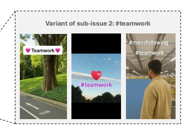
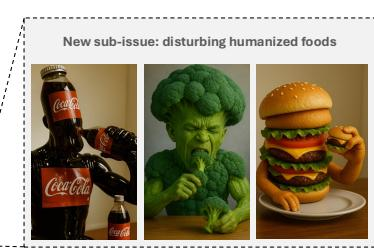
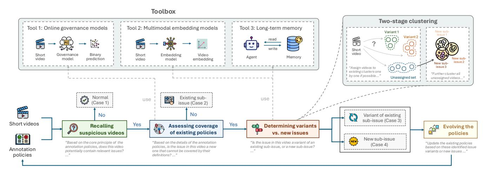
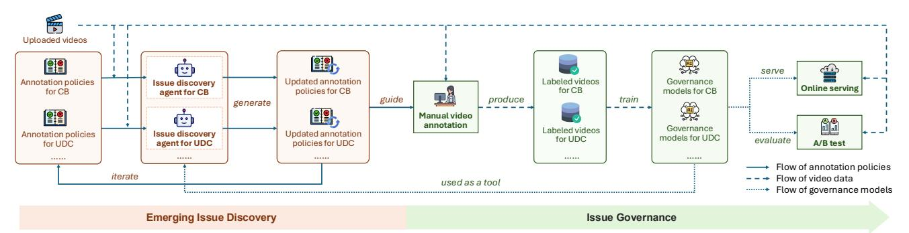
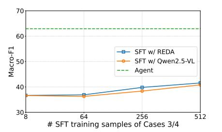
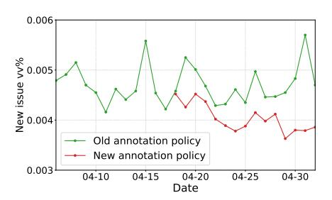
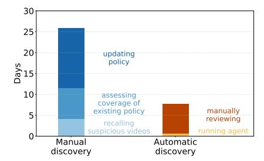
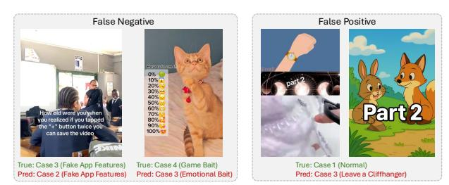
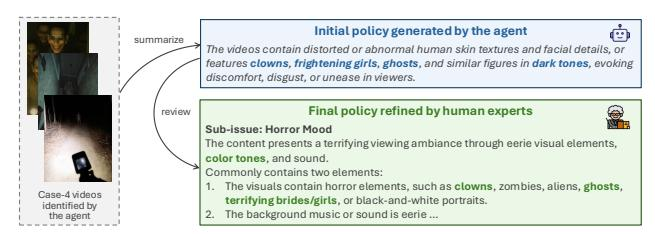
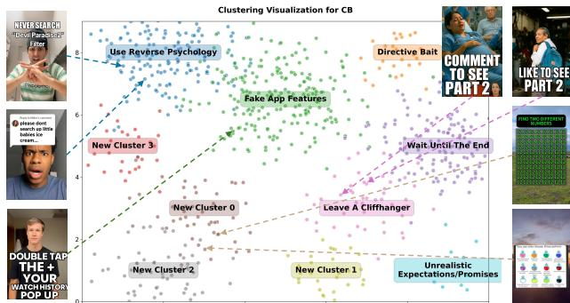

# When Rules Fall Short: Agent-Driven Discovery of Emerging Content Issues in Short Video Platforms

Chenghui Yu∗ TikTok Inc. San Jose, CA, USA yuchenghui@tiktok.com

Hongwei Wang∗ TikTok Inc. San Jose, CA, USA hongwei.w@tiktok.com

Junwen Chen TikTok Inc. San Jose, CA, USA chenjunwen.javen@tiktok.com

Zixuan Wang TikTok Inc. San Jose, CA, USA zixuan.wang1@tiktok.com

Bingfeng Deng TikTok Inc. Singapore dengbingfeng@tiktok.com

Zhuolin Hao TikTok Inc. San Jose, CA, USA haozhuolin@tiktok.com

Hongyu Xiong TikTok Inc. San Jose, CA, USA hongyu.xiong@tiktok.com

Yang Song TikTok Inc. San Jose, CA, USA ys@sonyis.me

# Abstract

Trends on short-video platforms evolve at a rapid pace, with new content issues emerging every day that fall outside the coverage of existing annotation policies. However, traditional human-driven discovery of emerging issues is too slow, which leads to delayed updates of annotation policies and poses a major challenge for effective content governance. In this work, we propose an automatic issue discovery method based on multimodal LLM agents. Our approach automatically recalls short videos containing potential new issues and applies a two-stage clustering strategy to group them, with each cluster corresponding to a newly discovered issue. The agent then generates updated annotation policies from these clusters, thereby extending coverage to these emerging issues. Our agent has been deployed in the real system. Both offline and online experiments demonstrate that this agent-based method significantly improves the effectiveness of emerging-issue discovery (with an F1 score improvement of over 20%) and enhances the performance of subsequent issue governance (reducing the view count of problematic videos by approximately 15%). More importantly, compared to manual issue discovery, it greatly reduces time costs and substantially accelerates the iteration of annotation policies.

# Keywords

Short Videos, Content Governance, Knowledge Discovery, Multimodal Large Language Models, Agentic AI

# 1 Introduction

Short videos uploaded by users on TikTok may contain various content issues, such as sexually suggestive content, non-original content, clickbait, or unpleasant & disturbing content. These problematic videos may negatively impact the users' FYF(For You feed) experience and the sustainable development of the community[\[15\]](#page-8-0). To address this, our platform employs governance models to detect whether videos include such issues. Typically, the platform first establishes detailed annotation policies for identifying each specific

**Annotation Policy for Clickbait**

❑ Sub-issue 2: False Promises of Interaction Content where the creator encourages

> in exchange *back"*

❑ Sub-issue 1: Engage for Good

Luck

(a) A variant of an existing sub-issue in Clickbait

**Annotation Policy for Unpleasant & Disturbing Content** ❑ Sub-issue 1: Human/Animal Organs

……

❑ Sub-issue 2: Trypophobia

?

❑ Sub-issue 3: Jump Scare

(b) A new sub-issue in Unpleasant & Disturbing Content Figure 1: Examples of emerging content issues in short videos uploaded by users. See Section [1](#page-0-0) for more details.

issue. These annotation policies are then used to train human annotators who label a set of videos accordingly. Finally, the labeled dataset is used to train governance models, which can automatically identify problematic videos at scale.

From the perspective of content governance, the relationship between the platform and users resembles a "cat-and-mouse" dynamic. The platform strives to design broader and more detailed policies to cover more issues, while users, whether intentionally or unintentionally, upload videos that contain variants of existing issues or entirely new ones, thereby evading the scope of the policies. Figure [1](#page-0-1) illustrates two examples: (1) As shown in Figure [1a,](#page-0-1) within the Clickbait issue and specifically the False Promises of Interaction sub-issue, we observe a new emerging variant: using stickers with "#teamwork" to induce likes or follows. However, the keyword "teamwork" is not included in the definition of this

∗Equal contribution.

Figure 2: Illustration of the issue discovery agent. Given a short video and the annotation policies for a specific issue, the agent follows a four-phase process to categorize videos into four cases (Cases 1 – 4), and finally produces an updated version of the annotation policies. The agent can autonomously choose to invoke certain tools. See Section [4](#page-2-0) for more details.

sub-issue. (2) As shown in Figure [1b,](#page-0-1) under the issue of Unpleasant & Disturbing Content, we identify a new sub-issue: AI-generated content that morphs food into human-like forms, often paired with eating sound effects and scenes of consuming the same items. Such visuals can be disturbing, but they do not fit into the definition of any existing sub-issue.

Trends on TikTok evolve at an extremely rapid pace. A new video may appear today, and within just a few days, the platform can be flooded with countless imitations. Therefore, promptly identifying emerging content issues and establishing new annotation policies is a critical task for the platform. At present, the process is entirely manual: First, based on user reports and proactive screening by moderators, a set of candidate videos suspected of containing emerging issues is collected. Next, the content governance team assesses whether these videos have sufficient impact and potential harm. If so, new annotation policies are created for the new issue, or existing policies are updated to cover the identified variant. However, this manual workflow is highly time-consuming, often taking several months to complete, which leaves the platform reacting very slowly to new issues. Moreover, relying solely on human judgment introduces strong subjectivity with inconsistent criteria, resulting in suboptimal annotation policies.

To overcome the limitations of the fully manual process, one promising approach is to introduce machine learning models for automatic discovery of new issues. However, a clear challenge arises: since the target is previously undefined issues, we typically have few or no labeled samples available, making supervised learning methods inapplicable. This means the models must rely largely on analyzing the content of the videos themselves and understanding annotation policies to make decisions. These constraints lead us to explore MLLM-based agents as a potential solution. MLLMs bring extensive world knowledge, and the agent framework allows them to leverage planning and reasoning capabilities for complex tasks. This paper introduces our progress in applying the agent approach to emerging issue discovery.

As shown in Figure [2,](#page-1-0) the workflow of our agent can be divided into four phases:

- Recalling suspicious videos. Given a short video and the annotation policies for a specific issue, the agent first determines whether the video is likely to contain that issue by any chance. If the answer is no, the video is classified as normal and filtered out.
- Assessing the coverage of existing policies. The agent then checks whether the issue present in the video is already covered by the existing annotation policies. If it is, the video is categorized as an instance of an existing sub-issue and filtered out. At this stage, the agent may also use governance models as auxiliary tools to assist in the judgment.
- Determining variants vs. new issues. Here, the agent decides whether the video represents a variant of an existing subissue or introduces an entirely new sub-issue. To achieve this, the agent applies a two-stage clustering method to a batch of input videos, which assigns each video either to an existing cluster or to a newly created cluster. In addition, the agent may employ two tools: an embedding tool and a memory tool, to support its decision.
- Evolving the policies. Once the clusters for variants and new sub-issues are formed, the agent summarizes them and generates updated policies. These updated policies are used to guide human annotators to label new data for training governance models. They can also be iteratively refined by the issue discovery agent in real-world deployment environments.

We conduct offline experiments on two content issues. The results demonstrate that, compared with supervised fine-tuning based approaches, our agent-based method achieves significant improvements in the issue discovery task. Specifically, the best-performing agent achieves absolute improvements in macro-F1 of 26.3% and 22.1%, respectively, on the two content issues, compared with the best-performing SFT model. Online A/B testing further shows that the annotation policies generated by the agent achieve substantial

gains in issue governance, reducing 14.9% views of videos containing new issues. More importantly, compared with manual issue discovery, our approach dramatically reduces time costs, making the entire process more efficient.

### 2 Related Work

Video Content Governance. With the exponential growth of user-generated video content, video content governance has become critical for ensuring safe digital ecosystems and meeting regulatory requirements. Early rule-based solutions rely on predefined criteria such as keyword matching, OCR for on-screen text, and heuristic visual filters [\[8,](#page-8-1) [37\]](#page-8-2). Subsequently, machine learning based models are introduced [\[11,](#page-8-3) [17\]](#page-8-4). Hybrid approaches have also emerged, which integrate rule-based checks with learning models to balance efficiency and nuance [\[4\]](#page-7-0). Recent work also focuses on the model efficiency [\[13\]](#page-8-5), multimodal refinement [\[3\]](#page-7-1), LLM-driven governance [\[5,](#page-7-2) [30\]](#page-8-6), and industrial solutions [\[22,](#page-8-7) [38,](#page-8-8) [39\]](#page-8-9).

Knowledge Discovery. Knowledge discovery is the process of extracting actionable insights, patterns, and structured knowledge from unstructured or semi-structured data [\[10,](#page-8-10) [16\]](#page-8-11). Early approaches [\[1,](#page-7-3) [12\]](#page-8-12) relied on traditional data mining techniques, which are effective for structured data but struggled to capture the semantic nuances of unstructured or multi-modal data. More recent work has focused on multi-modal information integration [\[28\]](#page-8-13) and its combination with LLMs [\[25,](#page-8-14) [41\]](#page-8-15). Despite these advances, several critical challenges remain, for example, modality bias [\[28\]](#page-8-13) and the need for validation to address LLM hallucinations [\[41\]](#page-8-15).

LLM-Based Agents. The rise of LLMs has fueled the development of LLM-based agents, which surpass traditional rule-driven or command-based systems (e.g., early assistants like Siri) by leveraging LLMs' advanced language understanding and generation capabilities [\[33\]](#page-8-16). Recent research on LLM-based agents centers on three directions: (1) Reasoning enhancement. Techniques such as Chainof-Thought [\[32\]](#page-8-17) or Tree-of-Thoughts [\[35\]](#page-8-18) prompts guide LLMs to break down complex problems into sequential or multi-sequential steps. (2) Tool integration. Frameworks like ReAct [\[36\]](#page-8-19), Toolformer [\[26\]](#page-8-20), WebGPT [\[21\]](#page-8-21), and HuggingGPT [\[27\]](#page-8-22) demonstrate how agents can interact with external tools (APIs, databases) through action generation, bridging abstract reasoning and real-world execution. (3) Optimization frameworks. Parameter-driven methods (e.g., supervised fine-tuning, reinforcement learning) refine model weights to better align agent behavior with task goals, while parameterindependent approaches (e.g., external knowledge retrieval, tools calling) improve performance without retraining, offering efficiency benefits for large-scale deployment [\[40\]](#page-8-23).

### 3 Problem Formulation

Suppose we are interested in a particular content issue �� (multi-issue scenarios will be discussed in Section [5\)](#page-4-0). Issue �� has an associated annotation policy ���� , which provides a detailed definition of ��. �� consists of �� sub-issues: �� = {1, 2, · · · , ��}. Correspondingly, the policy ���� is also divided into ���� = {��1, ��2, · · · , ���� }, where each ���� contains the textual definition of sub-issue ��.

Given a batch of short videos V, we want to determine for each video �� ∈ �� which of the following cases it falls into:

- Negative (Case 1): �� is normal and does not contain any content related to issue ��.
- Positive, existing sub-issue (Case 2): �� belongs to one of the existing sub-issue �� ∈ ��. In this case, the specific violation of �� is explicitly defined in ���� .
- Positive, variant of existing sub-issue (Case 3): �� still belongs to a sub-issue �� ∈ ��, but its specific violation is not explicitly covered in ���� . Instead, it represents a new variant.
- Positive, new sub-issue (Case 4): �� does not belong to any existing sub-issue of �� and represents a new sub-issue. For the entire batch V, the number of newly discovered subissues may range from 0 (no video involves a new sub-issue) to |V | (every video corresponds to a distinct new sub-issue).

For the videos identified as Case 3 or 4, we further need to perform sub-issue-level identification. This allows us to summarize their underlying patterns and subsequently refine or update the existing annotation policy.

### 4 Approaches

### 4.1 Recalling Suspicious Videos

Given a short video ��, the agent's first step is to determine whether the content of �� contains issue ��. In other words, this phase is essentially a binary classification task: Case 1 vs. Cases 2/3/4. Although the annotation policy ���� provides a detailed definition of issue �� that the agent can leverage, this phase is still nontrivial. The reason is that its purpose is to recall videos for issue discovery, which means that the agent must not only recall videos already covered by ���� , but also those that contain variants of existing sub-issues or new sub-issues of ��.

To achieve this, the key strategy is not to rely heavily on the literal policy descriptions, but instead to capture the essential decision logic of the issue. For example, in Clickbait, the essential logic consists of three principles: (1) Engagement authenticity: engagement must come from genuine user interest, not manipulation or deception. (2) Creator fairness: artificially inflated engagement undermines fairness for other creators. (3) User experience: misleading tactics make the content diverge from user expectations, eroding trust and harming user experience. Thus, when making judgments, the agent must evaluate along these dimensions: "Does user engagement with the video reflect genuine interest? Does the video unfairly disadvantage other creators? Does the video degrade user experience?" If none of these essential logics apply, the video is classified as normal. Otherwise, it is considered problematic and proceeds to the next phase in the agent's workflow.

# 4.2 Assessing Coverage of Existing Policies

Through the previous phase, the agent filtered out normal videos (Case 1) and retained those containing issue ��. The task in this phase is to further exclude the videos that are already covered by the annotation policy ���� , leaving only those that involve variants of existing sub-issues or new sub-issues. In other words, this is a binary classification task distinguishing Case 2 from Cases 3/4.

To achieve this, the agent carefully consults the textual definition ���� for each sub-issue �� ∈ ��, in order to make precise judgments. A typical prompt may look like: "Based on the following annotation policy, determine whether the input video falls into any of the

|    |       | Issue      |             | Methods discovery agent | Precision | Recall | CB Weighted-F1 | Macro-F1 | Precision | Recall | UDC Weighted-F1 | Macro-F1 |
|----|-------|------------|-------------|-------------------------|-----------|--------|----------------|----------|-----------|--------|-----------------|----------|
| No | tools |            |             |                         | 39.85     | 47.70  | 88.96          | 36.83    | 50.41     | 45.90  | 89.77           | 45.75    |
| +  | Tool  | 1          | (governance | models)                 | 51.95     | 59.98  | 92.33          | 54.64    | 51.02     | 49.17  | 90.31           | 47.09    |
| +  | Tool  | 2          | (embedding  | models)                 | 46.52     | 47.95  | 89.06          | 37.38    | 49.65     | 52.25  | 89.27           | 48.56    |
| +  | Tool  | 3          | (long-term  | memory)                 | 41.52     | 47.95  | 89.04          | 37.26    | 49.46     | 51.85  | 89.23           | 48.30    |
| +  | Tools | 1          | & 2         |                         | 59.08     | 70.49  | 92.85          | 62.91    | 67.40     | 57.92  | 90.89           | 58.83    |
| +  | Tools | 1          | & 3         |                         | 55.20     | 62.03  | 92.58          | 57.80    | 52.00     | 46.75  | 89.77           | 47.36    |
|    |       | Supervised |             | fine-tuning             |           |        |                |          |           |        |                 |          |
| w/ | REDA  | as         | base        | model                   | 32.99     | 45.15  | 89.83          | 36.88    | 45.87     | 33.71  | 90.73           | 36.71    |
| w/ |       | Qwen2.5-VL | as          | base model              | 32.95     | 45.14  | 89.80          | 36.26    | 40.23     | 32.13  | 90.24           | 34.19    |

Table 1: Result of agent and SFT on the four-class classification task. The evaluation metrics are Precision, Recall, Weighted-F1, and Macro-F1 score (in %). The highest value in each column is shown in bold, and the second-highest is underlined.

6.1.2 Datasets. Each video contains both textual and visual information. Textual information includes the title, stickers, OCR results, and ASR transcripts. Visual information consists of 8 uniformly sampled video frames, each with a resolution of 336 × 336.

For the CB issue, the evaluation set contains 24,670 samples, of which 5.3% belong to Cases 3/4. For the UDC issue, the evaluation set contains 21,890 samples, of which 4.1% belong to Cases 3/4. Samples in Cases 3/4 include 6 sub-issues.

6.1.3 Hyper-Parameter Settings. We used our pretrained model REDA [\[31\]](#page-8-30) as the base model for the agent, with a size of 7B. For Tool 1, governance models are SFT models built on top of VLMo [\[7\]](#page-8-31) for CB and LLaVA [\[18\]](#page-8-32) for UDC. For Tool 2, the embedding model is based on OpenCLIP ViT-L-14 [\[9\]](#page-8-33); the assignment threshold �� is set to 0.4; the number of clusters in offline clustering is set to 4. These optimal values are determined through a search process.

6.1.4 Baseline Methods. We perform supervised fine-tuning (SFT) on the MLLM and take this as our baseline method. The base models for SFT are our pretrained model REDA 7B [\[31\]](#page-8-30) and native Qwen2.5- VL 7B [\[6\]](#page-8-34). We apply LoRA-based [\[14\]](#page-8-35) fine-tuning by adding rank-168 trainable matrices into the transformation matrices of the feedforward modules at every layer of both the visual encoder and the LLM. In addition, we add a classification head on top of the final layer, implemented as an MLP with one hidden layer. In total, the number of trainable parameters is 441M.

The size of the SFT training sets is as follows. CB issue: 10k Case-1 samples, 4k Case-2 samples, and between 8 to 512 samples for Cases 3/4. UDC issue: 10k Case-1 samples, 2k Case-2 samples, and between 8 to 150 samples for Cases 3/4. The default number of Case-3/4 samples is set to 64, which simulates the real scenario where we have only a very small amount of human-annotated videos for new issues. In this setting, SFT can be fairly compared against agent (but note that SFT still has an advantage as the agent does not use any training data). When the number of Case-3/4 samples exceeds 64, the goal is instead to explore the upper bound of SFT performance.

# 6.2 Main Results

6.2.1 Offline Comparison with Baseline Methods. The results of our agent as well as baseline methods on the four-class classification task are presented in Table [1.](#page-5-1) We have several observations:

- Despite not using any training data, the agent consistently outperforms the SFT models. Specifically, for CB and UDC, the best-performing agent achieves absolute improvements in macro-F1 of 26.26% and 22.12%, respectively, compared with the best-performing SFT model.
- Comparing No tools setting with the Tool 1 setting (or Tool 2 vs. Tools 1&2, or Tool 3 vs. Tools 1&3), we observe that Tool 1 provides a significant performance boost for the agent.
- Comparing Tool 2 with Tool 3 (or Tools 1&2 with Tools 1&3), Tool 2 achieves better performance than Tool 3. However, note that Tool 2 relies on an embedding model, which introduces additional computation and storage costs.
- We also examine how the number of training samples for Cases 3/4 affects the SFT model's performance. In the CB issue, we gradually increase the number of training samples for Cases 3/4 from 8 to 512 and report the results in Figure
  - [4.](#page-6-1) As the number of training samples increases, the SFT's performance improves accordingly. Nevertheless, even with 512 training samples (which is nearly impossible in realworld settings due to the scarcity of labeled data containing new issues), the SFT still performs far below the agent.

6.2.2 Online A/B Test. As described in Section [5,](#page-4-0) we design an online A/B experiment to evaluate the performance changes of governance models. Our evaluation metric is the ratio of views on videos with new issues to the views of all sampled videos (denoted as new issue vv%). A lower ratio indicates that the governance model is more effective in detecting problematic videos and suppressing their distribution within the recommendation system.

Specifically, for CB issue, we apply both the old and new versions of the annotation policy to label the same training dataset and then train two separate governance models. We then allocate identical traffic to both models for online testing. The old governance model is deployed starting April 6, 2025, while the new model is deployed on April 18, 2025. From these, we sample a subset of videos, manually annotate those with new issues, and calculate new issue vv%. The experimental results, shown in Figure [5,](#page-6-1) demonstrate that compared with the old policy, the governance model trained under the new policy significantly reduced new issue vv%, from an average of 0.0047% to around 0.0040%, a decrease of 14.9%.

Figure 4: Impact of # SFT training samples of Cases 3/4 on SFT performance.

Figure 5: A/B test on old and new versions of annotation policies.

Figure 6: Time cost comparison between manual and automatic issue discovery.

6.2.3 Efficiency Improvements. For the traditional manual discovery process, we analyze several past cases where the annotation policy was updated and calculate the average time spent at each phase. First, the issue discovery team identifies a suspicious video, which may be a variant of an existing issue or a completely new issue. On average, this step takes 4.1 days. Next, they need to contact the team responsible for defining and maintaining the annotation policy and hold a joint meeting to determine whether the case can be covered by the existing policy. This step takes an average of 7.4 days. Finally, updating existing sub-issues within the policy or adding new ones requires about 14.3 days on average.

In contrast, for the agent-based process, the discovery step typically takes less than a day, with an average of 0.7 days. The generated annotations then undergo human review, which averages 7.0 days. This is shorter than the 14.3 days required for manual policy updates, since the policy has already been generated automatically. The result of the comparison is shown in Figure [6.](#page-6-1) Compared with manual discovery that takes an average of 25.8 days, the automated process only requires 7.7 days, reducing the time cost by 70.2%.

6.2.4 Computational Resource Cost. We compare the computational resource costs of agent and SFT during deployment. On average, we process about 30k videos per day. The SFT model achieves a QPS of 5 on H100 GPUs, which means it requires approximately 1.7 H100 GPU-hours per day. The agent, on the other hand, generates around five times more queries per video, and each query contains about 1.5 times more tokens. As a result, the agent requires about 12.5 H100 GPU-hours per day. Although the agent demands more computational resources, the additional 12.5 GPU-hours per day do not impose any noticeable strain on our deployment.

### 6.3 Phase-Wise Results

We present the experimental results for each phase. The input for each phase is clean (that is, the input for Phase 2 includes only data from Cases 2/3/4, while Phase 3 includes only data from Cases 3/4) to ensure that the results accurately reflect the performance of each phase, without being affected by error propagation from previous phases. The results are summarized in Table [2.](#page-6-2)

6.3.1 Results of Phase 1: Recalling Suspicious Videos. By comparing agent and SFT in Phase 1, we find that the agent performs better overall. However, the improvement is less significant than in later phases. This may be due to two reasons: (1) The differences between normal videos and issue-containing videos are relatively distinct, making the Phase 1 task easier, and thus, the SFT model

| Phases & Methods Phase 1 | P     | CB R  | M-F1  | ARI  | P     | UDC R | M-F1  | ARI  |
|--------------------------|-------|-------|-------|------|-------|-------|-------|------|
| w/ agent                 | 79.50 | 89.03 | 83.34 |      | 78.97 | 81.22 | 80.03 |      |
| w/ SFT                   | 82.76 | 78.71 | 80.57 |      | 92.74 | 59.81 | 64.49 |      |
| Phase 2                  |       |       |       |      |       |       |       |      |
| w/ agent                 | 63.45 | 51.79 | 33.58 |      | 70.83 | 61.45 | 65.81 |      |
| + Tool 1                 | 87.10 | 63.78 | 73.64 |      | 71.64 | 71.57 | 71.60 |      |
| w/ SFT                   | 34.37 | 47.09 | 36.97 |      | 30.08 | 50.10 | 37.56 |      |
| Phase 3                  |       |       |       |      |       |       |       |      |
| w/ agent                 | 40.87 | 49.52 | 44.78 |      | 37.95 | 50.00 | 43.15 |      |
| + Tool 2                 | 51.35 | 73.08 | 60.32 | 0.39 | 93.27 | 73.08 | 77.97 | 0.47 |
| + Tool 3                 | 57.61 | 54.85 | 55.18 | 0.31 | 80.05 | 74.33 | 76.47 | 0.40 |
| w/ SFT                   | 39.92 | 50.00 | 44.40 |      | 36.79 | 50.00 | 42.39 |      |

Table 2: Phase-wise result of agent and SFT. The highest value in each column of each block is shown in bold. P: Precision; R: Recall; M-F1: Macro-F1; ARI: Adjusted Rand Index.

can also perform quite well; (2) The SFT training data contains a large number of samples from Cases 1 and 2, making it relatively easier for the model to distinguish Case 1 from Cases 2/3/4.

6.3.2 Results of Phase 2: Assessing Coverage of Existing Policies. From the Phase 2 results, we can see that the agent significantly outperforms SFT, and the performance gain brought by Tool 1 is particularly significant. This indicates that the agent is capable of autonomously invoking governance models to enhance its decision accuracy effectively.

6.3.3 Results of Phase 3: Determining Variants vs. New Issues. In Phase 3, when the agent operates without any tools and relies solely on its own judgment, its performance is relatively poor, comparable to that of the SFT model. Moreover, without tools, the agent can only perform Case 3 vs. Case 4 classification, but cannot conduct sub-issue-level clustering.

After incorporating tools, the agent's performance improves substantially. As discussed in Section [6.2.1,](#page-5-2) Tool 2 performs better than Tool 3. This advantage is reflected not only in Case 3 vs. Case 4 classification accuracy, but also in clustering performance. We evaluate clustering quality using the Adjusted Rand Index (ARI), a metric that measures the consistency between clustering results and ground-truth labels. The ARI ranges from (-1, 1], where a value

Figure 7: Visualized clustering result in CB.

Figure 8: Examples of failure cases in CB.

of 1 indicates perfect agreement with the true labels, 0 denotes completely random clustering, and -1 indicates complete disagreement. The ARI results for Tool 2 and Tool 3 further confirm that Tool 2 achieves better clustering performance.

# 6.4 Success & Failure Case Analysis

6.4.1 Video Clustering. We visualize the clustering results in the CB using t-SNE [\[19\]](#page-8-36). As shown in Figure [7,](#page-7-5) the agent successfully identifies many existing videos that contain variants of existing sub-issues, such as Use reverse psychology, Fake app features, and Leave a cliffhanger. Moreover, within the clusters of Case-4 videos, we discovered that New Cluster 0 represents a typical new subissue, Game bait, where content is presented in the form of games or interactive choices to engage users.

Figure [8](#page-7-6) presents several failure cases from the agent's predictions. In the first example, the agent incorrectly classifies the video as being covered by existing policies, possibly because the phrase "save the video" appears in that policy. The second example is misclassified due to its similarity to Emotional bait (which appeals to morality, gratitude, or sympathy in a coercive way to pressure viewers into engaging). The last two examples are actually normal videos, but the agent mistakenly identifies them as Leave a cliffhanger due to the presence of "Part 2" in the content (see related examples in Figure [7\)](#page-7-5). Overall, these are challenging borderline cases where the agent tends to make more mistakes, and we plan to include more user-interaction-related features to assist the agent in making judgments, such as ratings, shares, and comments.

6.4.2 Generated Annotation Policies. We illustrate the policy generated by the agent for a new sub-issue in UDC. As shown in Figure [9,](#page-7-7) the agent identifies a group of Case-4 videos characterized by horror elements set in dark scenes. It then summarizes the cluster and

Figure 9: Examples of policy generation in UDC.

proposes the following sub-issue definition: "... or features clowns, frightening girls, ghosts, and similar figures in dark tones." This new issue definition is subsequently reviewed by human experts, and the final revised annotation policy is: "The content presents a terrifying viewing ambiance through eerie visual elements and color tones ... such as clowns, ..., ghosts, terrifying brides/girls." As we can see, much of the content generated by the agent is eventually adopted in the final policy (the highlighted parts in Figure [9\)](#page-7-7). This significantly improves efficiency compared to the traditional fully manual process of creating and updating policies.

# 7 Conclusion and Future Work

The paper introduces our progress in using agent-based LLMs for emerging issue discovery on short-video platforms. The agent operates through four phases, which first progressively filters out short videos containing new issues, then applies a streaming clustering method to further group them into variants of existing sub-issues or new sub-issues. Finally, the agent generates an updated annotation policy. Compared with manual discovery of new issues, our method significantly improves efficiency and reduces time costs.

We plan to integrate more advanced tools into this agent framework. For example, intelligent video frame sampling: currently, video frames are uniformly sampled, which often leads to redundant frames while missing fleeting but important details. By adopting smarter sampling, the agent can extract frames most likely to contain issues and filter out irrelevant ones. Another direction is external search: by accessing the Internet, the agent can incorporate up-to-date information on current events and trends, allowing it to make more accurate judgments about emerging issues.

Looking back at the overall deployment scheme in Figure [3,](#page-4-1) it is clear that video annotation still relies entirely on manual labor, which remains highly time-consuming and costly. Exploring ways to bring more automation into the annotation process is, therefore, another important direction for our future research.

## References

[1] Rakesh Agrawal and Ramakrishnan Srikant. 1994. Fast Algorithms for Mining Association Rules in Large Databases. Proc. 20th Int. Conf. Very Large Data Bases (VLDB) (1994), 487–499. [2] Mohiuddin Ahmed, Raihan Seraj, and Syed Mohammed Shamsul Islam. 2020. The k-means algorithm: A comprehensive survey and performance evaluation. Electronics 9, 8 (2020), 1295. [3] S. H. Ahmed, M. J. Khan, and G. Sukthankar. 2024. Enhanced Multimodal Content Moderation of Children's Videos using Audiovisual Fusion. arXiv[:2405.06128](https://arxiv.org/abs/2405.06128) [cs.CV] [4] Facebook AI. 2022. Advancing AI for Content Safety: Updates and Insights. [https://ai.facebook.com/research/advancing-ai-for-content-safety/.](https://ai.facebook.com/research/advancing-ai-for-content-safety/) [5] N. Al Dahoul, M. J. Toledo Tan, et al. 2024. Advancing Content Moderation: Evaluating Large Language Models for Detecting Sensitive Content Across Text, Images, and Videos. arXiv[:2411.17123](https://arxiv.org/abs/2411.17123)

[6] Shuai Bai, Keqin Chen, Xuejing Liu, Jialin Wang, Wenbin Ge, Sibo Song, Kai Dang, Peng Wang, Shijie Wang, Jun Tang, et al. 2025. Qwen2. 5-vl technical report. arXiv preprint arXiv:2502.13923 (2025). [7] Hangbo Bao, Wenhui Wang, Li Dong, Qiang Liu, Owais Khan Mohammed, Kriti Aggarwal, Subhojit Som, Songhao Piao, and Furu Wei. 2022. Vlmo: Unified vision-language pre-training with mixture-of-modality-experts. Advances in neural information processing systems 35 (2022), 32897–32912. [8] A. Bhagoji, B. Schaffner, et al. 2024. 'Community Guidelines Make This the Best Party on the Internet': An In-Depth Study of Online Platforms' Content Moderation Policies. In Proceedings of the 2024 CHI Conference on Human Factors in Computing Systems. ACM, New York, NY, USA, 1–15. [doi:10.1145/3613904.](https://doi.org/10.1145/3613904.3642345) [3642345](https://doi.org/10.1145/3613904.3642345) [9] Mehdi Cherti, Romain Beaumont, Ross Wightman, Mitchell Wortsman, Gabriel Ilharco, Cade Gordon, Christoph Schuhmann, Ludwig Schmidt, and Jenia Jitsev. 2023. Reproducible scaling laws for contrastive language-image learning. In Proceedings of the IEEE/CVF conference on computer vision and pattern recognition. 2818–2829. [10] Edward Choi, Sungmin Kim, and Hwanhee Shin. 2024. Knowledge Discovery from EHRs for Personalized Treatment Recommendation. NPJ Digit. Med. 7, 1 (2024), 45. [doi:10.1038/s41746-024-01189-x](https://doi.org/10.1038/s41746-024-01189-x) [11] A. Dosovitskiy, L. Beyer, et al. 2021. An Image is Worth 16x16 Words: Transformers for Image Recognition at Scale. In Proceedings of the International Conference on Learning Representations (ICLR). [https://openreview.net/forum?id=](https://openreview.net/forum?id=YicbFdNTTy) [YicbFdNTTy](https://openreview.net/forum?id=YicbFdNTTy) [12] Jiawei Han and Micheline Kamber. 2023. Advances and Limitations of Traditional Data Mining for Knowledge Discovery. In Proc. 2023 IEEE Int. Conf. Data Mining (ICDM). 1–8. [doi:10.1109/ICDM54844.2023.00002](https://doi.org/10.1109/ICDM54844.2023.00002) [13] M. A. Hosseini and M. Hasan. 2023. Faster, Lighter, More Accurate: A Deep Learning Ensemble for Content Moderation. arXiv[:2309.05150](https://arxiv.org/abs/2309.05150) [14] Edward J Hu, Yelong Shen, Phillip Wallis, Zeyuan Allen-Zhu, Yuanzhi Li, Shean Wang, Lu Wang, Weizhu Chen, et al. 2022. Lora: Low-rank adaptation of large language models. ICLR 1, 2 (2022), 3. [15] TikTok Inc. 2025. TikTok Community Guidelines. [https://www.tiktok.com/](https://www.tiktok.com/community-guidelines/en) [community-guidelines/en.](https://www.tiktok.com/community-guidelines/en) [16] Tao Jiang, Han Yu, and Wei Zhang. 2023. Knowledge Discovery in Financial Market Data for Algorithmic Trading Risk Assessment. In Proc. 2023 Int. Conf. Financ. Cryptogr. Data Secur. (FC). 345–362. [doi:10.1007/978-3-031-37993-3\\_18](https://doi.org/10.1007/978-3-031-37993-3_18) [17] X. Li, Y. Wang, et al. 2020. Multi-Scale Context Aggregation for Video Violence Detection. IEEE Transactions on Multimedia 22, 5 (May 2020), 1234–1247. [doi:10.](https://doi.org/10.1109/TMM.2019.2940099) [1109/TMM.2019.2940099](https://doi.org/10.1109/TMM.2019.2940099) [18] Haotian Liu, Chunyuan Li, Qingyang Wu, and Yong Jae Lee. 2023. Visual instruction tuning. Advances in neural information processing systems 36 (2023), 34892–34916. [19] Laurens van der Maaten and Geoffrey Hinton. 2008. Visualizing data using t-SNE. Journal of machine learning research 9, Nov (2008), 2579–2605. [20] Fionn Murtagh and Pedro Contreras. 2012. Algorithms for hierarchical clustering: an overview. Wiley interdisciplinary reviews: data mining and knowledge discovery 2, 1 (2012), 86–97. [21] Reiichiro Nakano, Jacob Hilton, Suchir Balaji, Jeff Wu, Long Ouyang, Christina Kim, Christopher Hesse, Shantanu Jain, Vineet Kosaraju, William Saunders, et al. 2021. Webgpt: Browser-assisted question-answering with human feedback. arXiv preprint arXiv:2112.09332 (2021). [22] R. Oak, M. Haroon, et al. 2025. Re-ranking Using Large Language Models for Mitigating Exposure to Harmful Content on Social Media Platforms. arXiv[:2501.13977](https://arxiv.org/abs/2501.13977) [23] Liadan O'callaghan, Nina Mishra, Adam Meyerson, Sudipto Guha, and Rajeev Motwani. 2002. Streaming-data algorithms for high-quality clustering. In Proceedings 18th international conference on data engineering. IEEE, 685–694. [24] Alec Radford, Jong Wook Kim, Chris Hallacy, Aditya Ramesh, Gabriel Goh, Sandhini Agarwal, Girish Sastry, Amanda Askell, Pamela Mishkin, Jack Clark, et al. 2021. Learning transferable visual models from natural language supervision. In International conference on machine learning. PmLR, 8748–8763. [25] Ram Rajagopal, Balaji Srinivasan, and Kawin Ethayarajh. 2023. LLM-Driven Knowledge Graph Construction from Scientific Literature. In Proc. 2023 ACM SIGKDD Conf. Knowl. Discovery Data Mining (KDD). 2045–2055. [doi:10.1145/](https://doi.org/10.1145/3580305.3599256) [3580305.3599256](https://doi.org/10.1145/3580305.3599256) [26] Dale Schuurmans, Maarten Bosma, Brian Ichter, Fei Xia, Denny Zhou, William Fedus, Elvis Xu, Yikang Kordi, Shantanu Mishra, Athul Yu, et al. 2023. Toolformer: Language Models Can Teach Themselves to Use Tools. Advances in Neural Information Processing Systems 36 (2023), 21480–21494. [27] Yongliang Shen, Kaitao Song, Xu Tan, Dongsheng Li, Weiming Lu, and Yueting Zhuang. 2023. Hugginggpt: Solving ai tasks with chatgpt and its friends in hugging face. Advances in Neural Information Processing Systems 36 (2023), 38154–38180. [28] Hao Wang, Jiong Li, and Xi Chen. 2023. Cross-Modal Attention for Multi-Modal Knowledge Discovery in Medical Imaging. In Proc. 2023 IEEE Conf. Comput. Vis. Pattern Recognit. (CVPR). 14567–14576. [doi:10.1109/CVPR52729.2023.01402](https://doi.org/10.1109/CVPR52729.2023.01402) [29] Weizhi Wang, Li Dong, Hao Cheng, Xiaodong Liu, Xifeng Yan, Jianfeng Gao, and Furu Wei. 2023. Augmenting language models with long-term memory. Advances in Neural Information Processing Systems 36 (2023), 74530–74543. [30] Zixuan Wang, Jinghao Shi, Hanzhong Liang, Xiang Shen, Vera Wen, Zhiqian Chen, Yifan Wu, Zhixin Zhang, and Hongyu Xiong. [n. d.]. Filter-And-Refine: A MLLM Based Cascade System for Industrial-Scale Video Content Moderation. Association for Computational Linguistics. [https://aclanthology.org/2025.acl](https://aclanthology.org/2025.acl-industry.62/)[industry.62/](https://aclanthology.org/2025.acl-industry.62/) [31] Zixuan Wang, Yu Sun, Hongwei Wang, Baoyu Jing, Xiang Shen, Xin Dong, Zhuolin Hao, Hongyu Xiong, and Yang Song. 2025. Reasoning-Enhanced Domain-Adaptive Pretraining of Multimodal Large Language Models for Short Video Content Governance. arXiv preprint arXiv:2509.21486 (2025). [32] Jason Wei, Xuezhi Wang, Dale Schuurmans, Maarten Bosma, Brian Ichter, Fei Xia, Denny Zhou, Quoc V Le, and William Fedus. 2022. Chain-of-Thought Prompting Elicits Reasoning in Large Language Models. Advances in Neural Information Processing Systems 35 (2022), 24824–24837. [33] Michael Wooldridge. 2022. Foundations of Intelligent Agents. Annual Review of Control, Robotics, and Autonomous Systems 5 (2022), 1–25. [doi:10.1146/annurev](https://doi.org/10.1146/annurev-control-042921-020815)[control-042921-020815](https://doi.org/10.1146/annurev-control-042921-020815) [34] Di Wu, Hongwei Wang, Wenhao Yu, Yuwei Zhang, Kai-Wei Chang, and Dong Yu. [n. d.]. LongMemEval: Benchmarking Chat Assistants on Long-Term Interactive Memory. In The Thirteenth International Conference on Learning Representations. [35] Shunyu Yao, Dian Yu, Jeffrey Zhao, Izhak Shafran, Thomas L Griffiths, Yuan Cao, and Karthik Narasimhan. 2023. Tree-of-Thoughts: Deliberate Problem Solving with Large Language Models. In Proceedings of the 37th Conference on Neural Information Processing Systems. 1–14. [36] Shunyu Yao and Jeffrey Zhao. 2022. ReAct: Synergizing Reasoning and Acting in Language Models. In Proceedings of the 36th Conference on Neural Information Processing Systems. 1–12. [37] YouTube. 2023. YouTube Community Guidelines Enforcement Report. [https:](https://transparencyreport.google.com/youtube-policy/overview) [//transparencyreport.google.com/youtube-policy/overview.](https://transparencyreport.google.com/youtube-policy/overview) [38] Chenghui Yu, Peiyi Li, Haoze Wu, Yiri Wen, Bingfeng Deng, and Hongyu Xiong. 2024. USM: Unbiased Survey Modeling for Limiting Negative User Experiences in Recommendation Systems. arXiv preprint arXiv:2412.10674 (2024). [39] Chenghui Yu, Haoze Wu, Jian Ding, Bingfeng Deng, and Hongyu Xiong. 2025. Unified Survey Modeling to Limit Negative User Experiences in Recommendation Systems. In Proceedings of the Nineteenth ACM Conference on Recommender Systems. 1104–1107. [40] Han Zhang, Zhen Li, Jianmin Wang, and Jie Tang. 2024. A Survey on Optimization Methods for LLM-Based Agents. IEEE Transactions on Knowledge and Data Engineering 36, 8 (2024), 3845–3862. [doi:10.1109/TKDE.2024.3387645](https://doi.org/10.1109/TKDE.2024.3387645) [41] Lijun Zhang, Wei Chen, and Zhiyuan Liu. 2024. Prompt-Tuned LLMs for Low-Resource Domain Knowledge Discovery. IEEE Trans. Knowl. Data Eng. 36, 5 (2024), 2189–2203. [doi:10.1109/TKDE.2023.3326457](https://doi.org/10.1109/TKDE.2023.3326457) [42] Alaettin Zubaroğlu and Volkan Atalay. 2021. Data stream clustering: a review. Artificial Intelligence Review 54, 2 (2021), 1201–1236.