# FRiskGPT: A Generative Foundation Model for Financial Risk Detection

Zhongjian Zhang∗† zhangzj@bupt.edu.cn Beijing University of Posts and Telecommunications China Telecom Bestpay Beijing, China

Mengmei Zhang∗ zhangmengmei@bestpay.com.cn China Telecom Bestpay Beijing, China

Dehua Xu xudehua@bestpay.com.cn China Telecom Bestpay Shanghai, China

Rongjun Shi shirongjun@bestpay.com.cn China Telecom Bestpay Shanghai, China

Jianfeng Liu liujianfeng@bestpay.com.cn China Telecom Bestpay Shanghai, China

Fuli Meng mengfuli@bestpay.com.cn China Telecom Bestpay Shanghai, China

Huajian Xu xuhuajian@bestpay.com.cn China Telecom Bestpay Shanghai, China

Xiao Wang xiao\_wang@buaa.edu.cn Beihang University Beijing, China

Ruijia Wang wangrj12@chinatelecom.cn China Telecom Cloud Computing Research Institute Beijing, China

Junze Chen chenjunze@bestpay.com.cn China Telecom Bestpay Beijing, China

Minwei Tang‡ tangminwei@bestpay.com.cn China Telecom Bestpay Shanghai, China

Chuan Shi‡ shichuan@bupt.edu.cn Beijing University of Posts and Telecommunications Beijing, China

# Abstract

The rapid growth of online payment services has intensified financial risks, while existing models typically detect each instance of risk in isolation, which neglects inter-risk and intra-risk dependencies across the entire user lifecycle, leading to suboptimal risk detection and fragmented intelligence. To overcome this limitation, we rethink financial risk modeling from a unification perspective, then propose FRiskGPT, the first financial risk-oriented generative foundation model that redefines user data and label data as a General Behavior Language, and unifies diverse tasks into nextbehavior prediction. Specifically, FRiskGPT decomposes user features and labels into behaviors of users and systems, reactivating their temporal nature. Then FRiskGPT is trained by general behavior auto-regressive modeling, i.e., predicting the next behavior conditioned on all previous ones. Finally, for each downstream risk detection task, FRiskGPT can directly predict the presence of risks within the task-constrained behavior space, without fine-tuning. Extensive evaluations demonstrate FRiskGPT's superiority with

∗Both authors contributed equally to this research.

†Work done during an internship at China Telecom Bestpay.

[This work is licensed under a Creative Commons Attribution 4.0 International License.](https://creativecommons.org/licenses/by/4.0) WWW '26, Dubai, United Arab Emirates © 2026 Copyright held by the owner/author(s). ACM ISBN 979-8-4007-2307-0/2026/04 <https://doi.org/10.1145/3774904.3792832>

average performance improvements of 12.8% across 6 real-world risk tasks compared to state-of-the-art baselines, with promising scaling potential.

## CCS Concepts

- Applied computing → Enterprise information systems; Computing methodologies → Neural networks.

#### Keywords

Financial Risk Detection; Generative Foundation Model

#### ACM Reference Format:

Zhongjian Zhang, Mengmei Zhang, Dehua Xu, Rongjun Shi, Jianfeng Liu, Fuli Meng, Huajian Xu, Xiao Wang, Ruijia Wang, Junze Chen, Minwei Tang, and Chuan Shi. 2026. FRiskGPT: A Generative Foundation Model for Financial Risk Detection. In Proceedings of the ACM Web Conference 2026 (WWW '26), April 13–17, 2026, Dubai, United Arab Emirates. ACM, New York, NY, USA, [12](#page-11-0) pages.<https://doi.org/10.1145/3774904.3792832>

### 1 Introduction

Nowadays, online financial services have transformed the economic landscape by offering significant convenience in transactions, but it also makes them susceptible to financial crimes, such as money laundering [\[10,](#page-8-0) [24,](#page-8-1) [25\]](#page-8-2), cash-out fraud [\[15,](#page-8-3) [45\]](#page-8-4), and user default [\[39,](#page-8-5) [40,](#page-8-6) [47\]](#page-8-7), posing substantial risks to the overall economic system and threatening societal well-being. To combat these risks, as illustrated in Figure [1](#page-1-0) (a), a financial company typically detects each risk in isolation, through a tailored model on intensive manual features.

‡Corresponding authors.

**(a) Traditional Discriminative Paradigm.**

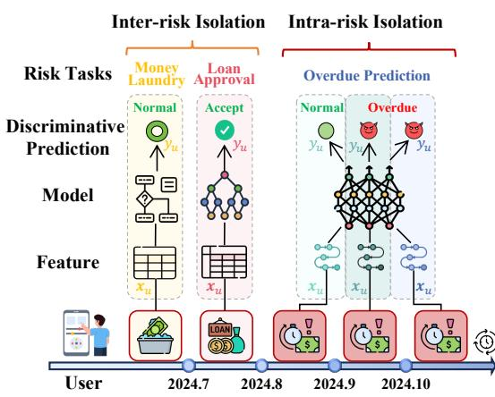

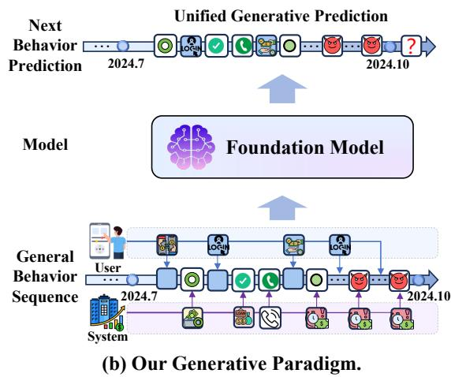

Figure 1: Traditional discriminative paradigm vs. our generative paradigm in financial risk detection.

Despite widespread application, these discriminative methods fail to capture risks across the entire user lifecycle, neglecting interrisk dependencies and intra-risk dependencies: As shown in Figure [1\(](#page-1-0)a), tasks such as loan approval and loan overdue prediction (i.e., predicting a user's likelihood of on-time repayment) are highly related, yet are handled by different classifiers due to diverse label spaces. Moreover, the overdue risks of a user are predicted independently each month, meaning that the October prediction fails to perceive the September. Overlooking these dependencies will cause a blind point of risks, leading to suboptimal performance.

Recently, foundation models, achieving remarkable success as a new paradigm, refer to models trained on broad and diverse data that can seamlessly adapt to a wide range of downstream tasks [\[31\]](#page-8-8). It reveals that greater intelligence emerges from integrating diverse data and tasks, surpassing the constraints of single-task approaches. Especially, large language models (LLMs) [\[20,](#page-8-9) [49\]](#page-8-10) show signs of advanced intelligence by unifying diverse natural language tasks within an auto-regressive generative framework. For example, rather than classifying the emotion of a social media post like "I missed the bus today" as 0 (Negative) or 1 (Positive), LLMs can fill the blank: "I missed the bus today, I feel so " with an emotionbearing word such as {happy, sad}. Obviously, predicting the next token needs understanding the underlying reality behind its occurrence. Empowered by extensive data, such a simple yet profound approach can lead to intelligence on an unprecedented scale, which is also validated in vision [\[35\]](#page-8-11) and recommendation [\[19\]](#page-8-12) domains.

Inspired by it, we revisit fundamental design choices in financial risk. In practice, directly applying LLMs is infeasible, since online payment systems generate massive amounts of non-textual operational and transaction data that cannot be effectively represented in natural language. This raises a critical question: Can we build a foundation model for financial risk domain data and tasks? There is an urgent need for a unified model that can comprehensively manage operational and transaction data across all risks. However, this question is challenging due to the diverse data and discriminative tasks: unlike text, financial risk data spans a wide space, including user attributes, behaviors, and labels, making unification difficult. Additionally, most risk tasks are discriminative, with varied label spaces and decision boundaries, obstructing the tasks' unification.

To this end, we revisit real financial risk scenarios and redefine user data and label data as a new General Behavior Language (GBL). The key observations are: from the perspective of the user lifecycle, traditional high-dimensional user features are mainly manually crafted from behavior sequences, while task labels are obtained from system feedback induced by user behaviors. As shown in Figure [1\(](#page-1-0)b), the interactions between the user and system construct a dynamically evolving ecosystem, where each behavior can influence subsequent behaviors, making it essential to jointly model both system and user behaviors as general behavior.

In this paper, we propose FRiskGPT, a generative framework designed to simulate the financial risk ecosystem. Specifically, FRiskGPT decomposes user features and labels into a general behavior space, reactivating their temporal nature. The transformer-based FRiskGPT then predicts the next behavior token conditioned on all previous ones, selecting the most probable token from the entire behavior vocabulary. Finally, for specific downstream risk detection tasks, FRiskGPT can directly predict the presence of risks within the task-constrained token space, without the need for fine-tuning. FRiskGPT demonstrates its superiority with an average performance improvement of 12.8% across 6 real-world risk tasks, requiring only a single training process. Further experiments highlight its potential in scaling law and robustness. From a broader perspective, FRiskGPT has the following main unique features:

- Exploring generative paradigm for financial risk: FRiskGPT reformulates diverse discriminative financial risk tasks within a unified generative framework. During training, it does not rely on explicit supervision: when the next behavior is from users, the prediction is unsupervised; when it is from systems, it is supervised.
- Exploiting the temporal property of label: By redefining risk labels as system behaviors, we reactivate their temporal properties, allowing us to model the relationships among risks throughout the user lifecycle, capturing inter-risk and intra-risk dependencies.
- Targeting vast non-textual data in online payment systems: Non-textual data is a key but under-explored resource, much of its latent intelligence remains underutilized by existing foundation models. We are the first to explore unifying such data into a shared semantic space by introducing the novel concept of GBL.

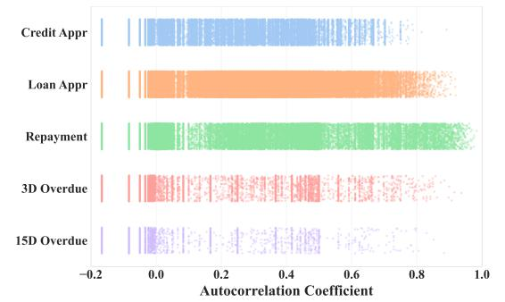

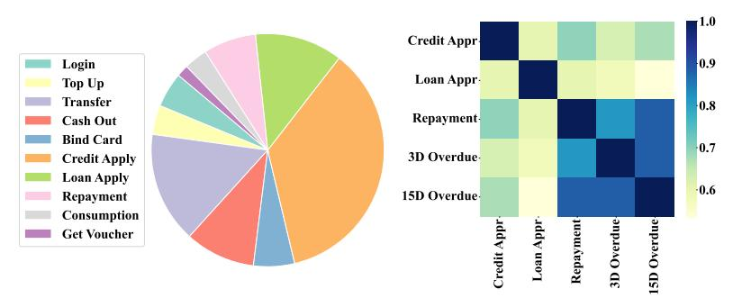

Figure 2: Features analysis for 5 financial risk tasks. Left: Behavior source distribution of manually engineered features across tasks. Right: Feature correlation among tasks.

Figure 3: The autocorrelation coefficient distribution of labels for each financial risk task.

#### 2 Motivation Analysis

#### 2.1 Dilemma of Traditional Financial Risk Detection

To address various financial risks, a company typically designs tree-based models or deep neural networks for each risk detection task �� ∈ T, where T = {��1, . . . ,���� } is the task set. As shown in Figure [1\(](#page-1-0)a), given a task ���� , independent and identically distributed (IID) training instances with features X�� and label Y�� are collected to train a classifier ���� : X�� → Y�� . For a user�� with features x�� ∈ X�� and label ���� ∈ Y�� , the ���� (x��) outputs a probability ranging from 0 to 1, indicating the likelihood of risk ���� , where binary label ���� = 1 or ���� = 0 indicates risky or normal. Despite being widely deployed, with the assumption of IID, they have several inherent dilemmas: • Inter-task Isolation: For different tasks ���� , input and output spaces are distinct (x ∈ X�� , �� ∈ Y�� ), requiring the independent training of separate models ���� , which neglects the interdependencies among tasks. For example, loan approval and overdue prediction are inherently related, yet they are modeled independently. • Intra-task Isolation: Even for the same task ���� , predictions at different time points are treated as independent events, ignoring temporal continuity. For instance, overdue risk predictions in October and September are treated as "rolling the dice twice in independent trials," despite their strong temporal correlation.

#### 2.2 Rethinking from Financial Risk Data: Towards a Unified Perspective

To overcome the above dilemmas, we first revisit the original financial risk data from a unified perspective. Through a detailed analysis of the entire user lifecycle data, we observe the following: • Observation 1: While features X�� of different tasks reside in distinct spaces, they exhibit shared behavioral foundations, suggesting potential for unified modeling across tasks. Figure [2\(](#page-2-0)left) shows that the most important 40 features of each task are derived from the same 10 behaviors, e.g., login, which produces features like 3/7/15-day login counts. Furthermore, as shown in Figure [2\(](#page-2-0)right), we quantify feature correlation by computing the feature overlap between tasks, and observe substantial intersections among feature sets. These results suggest the feasibility of modeling all risk tasks within a unified semantic space.

• Observation 2: The label of financial risk is not static and

Table 1: Average prediction count per user for each risk task.

independent, but carries temporal attributes, enabling modeling intra-risk dependence throughout the entire lifecycle. Table [1](#page-2-1) reports the average prediction count per user for each risk task during 2024, and we find that each user typically receives multiple predictions throughout their lifecycle. Figure [3](#page-2-0) presents the distribution of label autocorrelation coefficients per user, where each value reflects the temporal correlation among labels. The results reveal that current risk predictions are generally influenced by prior risk states. These suggest that labels reflect system behaviors with a temporal nature, which is overlooked in existing methods.

In summary, user-system interactions constitute a dynamically evolving ecosystem, where user behaviors (e.g., making a transfer) and system behaviors (e.g., blocking a transfer) are mutually dependent and evolve. Each behavior can influence subsequent behaviors, forming a feedback loop. These insights motivate a shift from isolated predictions toward a unified modeling that captures the intertwined dynamics between users and systems.

#### 3 Methodology

In this section, we propose FRiskGPT, a generative framework designed to unify diverse tasks and datasets from the financial risk domain. As shown in Figure [4,](#page-3-0) we first introduce a novel language sequence, General Behavior Language (GBL), which transforms raw user and system data into a unified token semantic space. Then, FRiskGPT models both inter- and intra-risk dependencies throughout the user lifecycle via next-behavior prediction. During inference, FRiskGPT generatively predicts the risk status within a risk-constrained behavior space, without fine-tuning.

#### 3.1 Redefining Financial Risk Data and Task

To simulate the ecosystem of user and system interactions, we first define a novel language sequence:

Definition 3.1 (General Behavior Language (GBL)). GBL is a language for representing and modeling the user-system interactions in financial risk ecosystems. It formalizes user behaviors and risk labels into a shared semantic space with behavior vocabulary V��, where each behavior corresponds to a fundamental interaction unit. GBL possesses the following inherent characteristics:

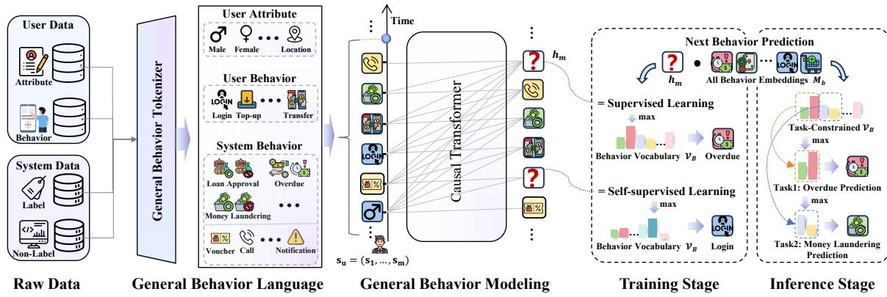

Figure 4: The overview of FRiskGPT.

- Non-textual: GBL is based on non-textual behavior signals, reflecting the user's risk pattern from the system's perspective.
- Temporal: GBL sequences in chronological order, preserving the dynamic temporal attribute of risk labels and user behaviors.
- Unified: GBL integrates user and system behaviors into a shared semantic space, encoding inter- and intra-task dependencies.

Then, we can construct a GBL s�� = (��1, . . . , ����) for each user ��, where each behavior �� ∈ V�� has a timestamp for chronological ordering. The distribution of s�� can be modeled under an autoregressive framework, where the likelihood of observing the next behavior ���� depends only on its preceding sequence (��1, . . . , ����−1). The formal definition of the sequence likelihood is as follows:

���� (��1, ��2, . . . , ����) = Ö�� ��=1 ���� (���� | ��1, ��2, . . . , ����−1), (1)

where �� represents the model parameters. In this way, we transform discriminative modeling ���� : X�� → Y�� for each task ���� into a generative modeling �� : V�� → V��, where V�� is designed to unify {X1, · · · , X�� } and {Y1, · · · , Y�� }, enabling �� to simultaneously learn from diverse task data.

#### 3.2 General Behavior Language Tokenization

In this subsection, we detail the process of constructing the GBL sequence s�� = {��1, . . . , ����} from the user's entire lifecycle. As shown in Figure [4,](#page-3-0) the behaviors in GBL can be categorized as user behaviors, user attributes, and system behaviors (including non-label behavior and label behaviors).

User behaviors are operations actively initiated by users in financial systems, associated with a timestamp, e.g., login and transfer. By sorting these behaviors in chronological order, the temporal and contextual patterns are implicitly preserved within the sequence, such as the number of logins in the past 3/7/15/30 days.

User attributes are the basic information that users provide when registering an account, e.g., age, income, and education, which is crucial for identifying potential risks. Unlike user behaviors, attributes change slowly over time and the values may be continuous (e.g., income) [\[19\]](#page-8-12). To exploit user attributes, we discretize continuous values to behavior tokens, e.g., "Income: \$0-1K", and set their timestamp as the occurrence time of the first user behavior.

System behaviors typically are the system responses to user activities, where they are further categorized into non-label and label types. Non-label behaviors mainly enhance user risk management and promote user consumption in the system, e.g., calling alerts and offering vouchers. While the label behaviors represent a user's risk state (e.g., rejecting credit and blocking transfer indicate the user is risky). According to the stage of risk detection, label behaviors are further categorized into 3 types: pre-risk, on-risk, and post-risk. First, pre-risk assesses whether a risk will occur in advance. For example, if a user submits a credit application and the system evaluates him as a risk, the system responds with rejection behavior. Second, on-risk involves monitoring and intercepting user risks. For instance, once the system assesses the transfer launched by users as money laundering, the transfer will be blocked. Last, post-risk refers to the system's remedial behavior for risks already occurred, e.g., predicting the likelihood of repayment within 15 days after overdue. Given limited space, we provide a detailed description to unify 6 risk tasks across 4 scenarios in Appendix [B.1.](#page-9-0)

Given the user attributes, behaviors, and system behaviors, we construct a chronological GBL sequence s�� = {��1, . . . , ����} to capture the user-system interactions throughout the entire lifecycle, where each �� is a token from the behavior vocabulary V��. We provide a specific GBL case in Appendix [C.](#page-10-0)

#### 3.3 Auto-regressive Modeling for GBL

Analogous to natural language modeling, framed as unsupervised distribution estimation from natural language sequences [\[20,](#page-8-9) [37\]](#page-8-13). As shown in Figure [4,](#page-3-0) we model the distribution of GBL sequences by

the standard auto-regressive generative paradigm akin to GPT [\[29\]](#page-8-14). Firstly, we transform the GBL into a fixed-length sequence s�� = {��1, . . . , ����}, where�� is the maximum length. If the sequence length exceeds ��, we select the most recent �� behaviors; otherwise, we pad on the left until it reaches ��. For behavior vocabulary V��, we create a token embedding matrix M ∈ R |V�� |×�� , where �� is the hidden size, and retrieve the token embeddings E�� = {e1, . . . , e��} for each sequence s��. To capture the position semantics among behaviors, a learnable position embedding matrix P ∈ R ��×�� is added to E��, yielding Eˆ �� = E�� + P.

Next, the backbone of FRiskGPT is designed as a multi-layer transformer decoder, a component that has been widely adopted in foundation models for both language [\[20,](#page-8-9) [34,](#page-8-15) [37\]](#page-8-13) and vision tasks [\[11,](#page-8-16) [26,](#page-8-17) [35\]](#page-8-11). A key property of the transformer decoder is its causality, which ensures that when computing the output at step �� +1, only the preceding �� behavior tokens are considered. Within each layer of FRiskGPT, a multi-head self-attention operation is applied to the input tokens, enabling comprehensive interactions between system and user behaviors. Formally, this process can be expressed as H �� = Transformer\_block(H ��−1 ), where H 0 = Eˆ �� and �� denotes the number of stacked transformer blocks.

Training: Next Behavior Prediction. We train FRiskGPT by maximizing the likelihood of the entire GBL sequence, and omit the prediction of user attributes due to most of them being static. Specifically, for each behavior hidden state h ∈ H �� , we predict the next behavior ��ˆ = argmax(softmax(M�� · h)), where M�� denotes the token embedding of all behavior. The cross-entropy loss is then employed to optimize model parameters: L = − Í��−1 ��=��+1 ���� log ��ˆ�� , where �� is the number of user attributes. In this way, the model is encouraged to correctly predict the complete GBL sequence, including user and system behaviors, to capture the intra-task and inter-task dependencies. Moreover, using next behavior prediction essentially bridges the gap between self-supervised and supervised learning. Specifically, predicting a label behavior like overdue represents supervised learning, while predicting a user behavior like login represents unsupervised learning.

Inference: Task Constrained Behavior Prediction. Existing methods typically train a task-specific classifier to project user features into the label space for targeted risk prediction. In contrast, FRiskGPT has unified the user behavior and labels into a shared space in the training phase, enabling direct inference within the task-constrained behavior space, without additional tuning. Specifically, the user's GBL sequence is fed into FRiskGPT to obtain the last behavior hidden state h��. Taking money laundering as an example, the behavior space can be constrained to {Non-Money Laundering (NML), Money Laundering (ML)} from V��, retrieving the corresponding embeddings mNML and mML. The prediction probability ��ˆ ∈ [0, 1] is computed: ��ˆ = sigmoid(h�� · (mML − mNML)).

Through redefining data with GBL and utilizing auto-regressive modeling, FRiskGPT reframes the paradigm of financial risks from isolated discriminative to unified generative, facilitating more efficient and intelligent risk management for financial companies. Given the limited space, we comprehensively compare FRiskGPT with existing methods in Appendix [A.](#page-9-1)

#### 4 Experiment

#### 4.1 Experiment Setup

4.1.1 Datasets. We conduct experiments on two real-world online financial services systems, including Payment [1](#page-4-0) and Ethereum[2](#page-4-1) [\[16\]](#page-8-18). In the financial risk domain, each dataset typically corresponds to a risk detection task. Payment includes 6 datasets from 4 scenarios: Credit Application (Credit Appr) from pre-loan, Loan Application (Loan Appr) and Repayment from mid-loan, 3 Days Overdue Repayment (3D Overdue) and 15 Days Overdue Repayment (15D Overdue) from post-loan, and Anti Money Laundering (AML). For each dataset, we use data from 10/01/2022 to 12/31/2023 for training, and

from 01/2024 and 02/2024 for validation and testing, respectively. Ethereum includes 3 datasets: Kraken-Bittrex, Kraken-Binance, and Bittrex-Binance, which aim to predict whether a user's transaction is related to an institution, e.g., Bittrex-Binance predicts that the institution of a transaction is Bittrex or Binance. For each dataset, the number of users in the train, valid, and test sets is 78,135, 2,303, and 2,176, respectively. More dataset details are in the Appendix [B.1.](#page-9-0)

4.1.2 Evaluation Metrics. We employ four widely used metrics: Kolmogorov Smirnov (KS), AUC, Precision (Prec.), and F1. Specifically, KS evaluates the maximum difference between the cumulative distribution of positive and negative classes, reflecting the model's discriminatory power. AUC reflects the model's overall classification performance. Precision indicates the model's accuracy of positive classes, while F1 balances accuracy and completeness. We report the mean and standard deviation over 5 seeds for each result. Best results are bolded, and runner-up results are underlined.

4.1.3 Baselines. Existing methods for financial risk detection mainly include supervised learning and pretrain-finetune. Supervised learning typically requires manual feature engineering by a domain expert and tailored model design for each task, where we select classic tree models, including LightGBM [\[21\]](#page-8-19), XGBoost [\[7\]](#page-8-20) and CatBoost [\[28\]](#page-8-21), as well as deep model TabTransformer (Tab-Trans.) [\[17\]](#page-8-22) and BST [\[6\]](#page-8-23). Pretrain-finetune first pretrains a general user representation over behavior sequence data, and then learns a separate classifier for each risk task, where we select representative methods, including MSDP [\[12\]](#page-8-24), PTUM [\[41\]](#page-8-25), BERT4Rec [\[33\]](#page-8-26), SSE-PT [\[43\]](#page-8-27), and UserBert [\[42\]](#page-8-28), as baselines. Unlike these discriminative methods, FRiskGPT is a one-for-all model that learns a unified generative model for all tasks and enables task-specific inference without fine-tuning. More detailed baseline introduction and implementation are in the Appendix [B.2.](#page-9-2)

### 4.2 Main Results

4.2.1 Experiment on Payment System. Table [2](#page-5-0) presents the model performance comparison across 6 risk datasets. We find: (1) FRiskGPT consistently outperforms all baselines, achieving the SOTA performance. Specifically, FRiskGPT achieves average relative improvements of 6.2% in AUC and 19.3% in KS over runner-up results, highlighting the advantages of FRiskGPT in capturing intraand inter-task dependencies. (2) Compared with supervised baselines that typically require tailored feature engineering for each task, FRiskGPT achieves superior performance without any feature engineering, outperforming LightGBM, XGBoost, CatBoost, BST, and TabTransformer in KS by an average of 38.1%, 52.2%, 36.2%, 39.7%, and 70.8%, respectively. The next behavior prediction enables FRiskGPT to automatically capture the complex dependencies between the user and the risk label. (3) Compared to pretrainfinetune baselines that require extra classifier training for each task, FRiskGPT achieves average improvements of 51.7%, 40.2%, 48.4%, 39.7%, and 30.9% in KS over UserBERT, BERT4Rec, SSE-PT, PTUM, and MSDP, without any fine-tuning. With GBL, FRiskGPT can not only capture semantic relationships across different tasks, but also the relationships between risks throughout the user lifecycle. (4) To deeply understand the effectiveness of different models, we visualize KS distributions for the repayment task in Figure [5.](#page-5-1) Obviously,

1 Including 138,869,597 interaction behaviors of 737,560 users from a payment system. Including 5,448,051 transaction behaviors of 82,614 users from the Ethereum system.

Table 2: Performance (% ± ��) on 6 risk detection datasets from the Payment system.

| Task Metric     |          |       |         |       | Supervised |       |       |       |           |       |          |       |          | Pretrain-Finetune |        |       |       |       |       |       | One      | for All |
|-----------------|----------|-------|---------|-------|------------|-------|-------|-------|-----------|-------|----------|-------|----------|-------------------|--------|-------|-------|-------|-------|-------|----------|---------|
|                 | LightGBM |       | XGBoost |       | CatBoost   |       | BST   |       | TabTrans. |       | UserBert |       | BERT4Rec |                   | SSE-PT |       | PTUM  |       | MSDP  |       | FRiskGPT |         |
| Credit Appr AUC | 78.49    | ±0.15 | 78.15   | ±0.16 | 78.41      | ±0.10 | 83.20 | ±0.35 | 73.42     | ±1.13 | 82.46    | ±0.37 | 83.55    | ±0.13             | 82.14  | ±0.53 | 81.51 | ±0.90 | 82.12 | ±0.46 | 86.17    | ±0.36   |
| KS              | 42.00    | ±0.44 | 41.56   | ±0.33 | 41.89      | ±0.24 | 54.05 | ±0.62 | 34.67     | ±1.82 | 51.76    | ±0.52 | 54.56    | ±0.31             | 53.36  | ±0.53 | 50.25 | ±1.38 | 51.93 | ±0.75 | 58.68    | ±0.70   |
| Loan Appr AUC   | 78.38    | ±0.05 | 76.92   | ±0.05 | 78.96      | ±0.03 | 68.46 | ±1.32 | 75.37     | ±0.13 | 69.13    | ±0.30 | 67.86    | ±0.41             | 65.90  | ±0.18 | 70.15 | ±0.22 | 70.25 | ±0.07 | 79.12    | ±0.18   |
| KS              | 42.79    | ±0.13 | 40.84   | ±0.13 | 42.76      | ±0.07 | 25.53 | ±1.30 | 37.94     | ±0.37 | 27.00    | ±0.53 | 24.77    | ±0.60             | 21.62  | ±0.35 | 28.69 | ±0.53 | 28.69 | ±0.24 | 42.87    | ±0.12   |
| Repayment AUC   | 87.08    | ±0.05 | 83.25   | ±0.07 | 87.10      | ±0.07 | 81.93 | ±0.15 | 83.35     | ±0.07 | 80.52    | ±0.53 | 79.90    | ±0.23             | 78.82  | ±0.20 | 83.72 | ±0.27 | 84.80 | ±0.17 | 94.58    | ±0.12   |
| KS              | 56.86    | ±0.06 | 51.24   | ±0.25 | 58.57      | ±0.12 | 47.40 | ±0.22 | 50.43     | ±0.26 | 44.72    | ±0.85 | 44.11    | ±0.57             | 42.68  | ±0.30 | 50.97 | ±0.47 | 53.76 | ±0.37 | 74.70    | ±0.30   |
| 3D Overdue AUC  | 84.20    | ±0.02 | 81.07   | ±0.05 | 84.66      | ±0.09 | 84.83 | ±1.78 | 79.77     | ±0.05 | 81.12    | ±0.29 | 86.02    | ±0.19             | 84.67  | ±0.31 | 83.87 | ±0.66 | 86.72 | ±0.29 | 96.95    | ±0.14   |
| KS              | 53.58    | ±0.21 | 46.42   | ±0.11 | 56.10      | ±0.26 | 57.11 | ±2.60 | 47.82     | ±0.31 | 47.48    | ±0.61 | 57.25    | ±0.36             | 54.91  | ±0.97 | 53.37 | ±1.37 | 59.42 | ±0.79 | 82.22    | ±0.45   |
| 15D Overdue AUC | 79.00    | ±0.18 | 76.68   | ±0.08 | 78.55      | ±0.24 | 85.40 | ±1.76 | 69.09     | ±0.44 | 79.00    | ±0.90 | 86.25    | ±0.39             | 84.58  | ±0.64 | 82.04 | ±0.78 | 86.67 | ±0.48 | 97.16    | ±0.10   |
| KS              | 44.35    | ±0.30 | 39.03   | ±0.39 | 43.70      | ±0.76 | 57.93 | ±3.08 | 29.68     | ±1.21 | 43.30    | ±1.95 | 59.02    | ±0.59             | 55.39  | ±1.66 | 49.76 | ±1.61 | 60.14 | ±1.43 | 83.36    | ±0.22   |
| AML AUC         | 91.40    | ±0.15 | 88.25   | ±0.12 | 93.01      | ±0.13 | 91.90 | ±0.77 | 85.99     | ±0.44 | 94.82    | ±0.31 | 94.86    | ±0.42             | 94.50  | ±0.42 | 95.51 | ±0.35 | 94.91 | ±0.39 | 96.84    | ±0.32   |
| KS              | 70.85    | ±0.47 | 62.54   | ±0.71 | 72.98      | ±0.72 | 70.26 | ±2.52 | 57.66     | ±2.14 | 77.50    | ±1.62 | 76.51    | ±1.37             | 76.34  | ±1.47 | 78.88 | ±1.59 | 76.08 | ±1.33 | 81.72    | ±1.01   |

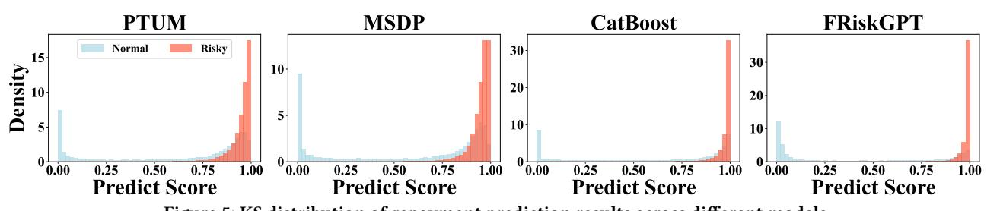

Figure 5: KS distribution of repayment prediction results across different models.

FRiskGPT exhibits a smaller overlap between normal and risk users, demonstrating its superior detection ability. More metrics results are provided in Appendix [D.1.](#page-11-1)

Table 3: Performance (%±��) on 3 risk detection datasets from the Ethereum system.

| Task Metric | Supervised |            |            | Pretrain-Finetune |            |            | One for All |
|-------------|------------|------------|------------|-------------------|------------|------------|-------------|
|             | BST        | UserBert   | BERT4Rec   | SSE-PT            | PTUM       | MSDP       | FRiskGPT    |
| Prec.       | 57.65±3.07 | 63.94±3.51 | 63.55±5.61 | 60.52±0.55        | 64.18±1.39 | 64.07±3.40 | 91.20±1.06  |
| F1          | 70.73±2.88 | 64.54±8.35 | 64.52±5.84 | 70.81±2.44        | 68.16±2.68 | 72.72±1.07 | 93.45±0.33  |
| Prec.       | 81.43±0.40 | 82.07±0.09 | 81.95±0.34 | 81.55±0.20        | 81.68±0.40 | 81.96±0.11 | 95.93±0.23  |
| F1          | 86.26±4.51 | 89.59±0.23 | 89.69±0.27 | 89.78±0.10        | 88.96±1.15 | 89.71±0.16 | 97.17±0.04  |
| Prec.       | 77.06±0.03 | 77.03±0.13 | 76.75±0.04 | 77.14±0.06        | 76.85±0.08 | 77.06±0.48 | 91.14±0.36  |
| F1          | 87.04±0.08 | 85.67±0.60 | 85.90±0.16 | 86.93±0.12        | 85.53±0.55 | 83.09±1.06 | 93.86±0.10  |

4.2.2 Experiment on Ethereum System. We evaluate 3 Ethereum transaction datasets, aiming to classify transaction types based on their institution. Due to the lack of manual features, we only report BST in supervised baselines. Table [3](#page-5-2) shows that FRiskGPT consistently outperforms all baselines, achieving relative improvement ranging from 16.89% to 42.10% over the runner-up, demonstrating the model's generalization in different systems. FRiskGPT unifies all transaction types into the same space, facilitating the capture of relationships between specific transactions and others.

#### 4.3 Model Analysis

4.3.1 Ablation Study. To analyze how much benefit comes from the GBL, Figure [6](#page-5-3) shows the KS performance of FRiskGPT under different GBL settings, where "Vanilla" indicates removing both

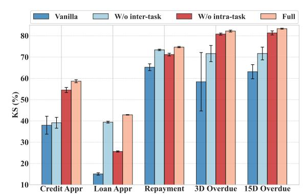

Figure 6: The KS of FRiskGPT under different GBL settings. inter-risk and intra-risk dependencies. "W/o inter-task" indicates removing the inter-task dependency, while "W/o intra-task" removes the intra-task dependency. "Full" is our complete method, which captures both inter-risk and intra-risk dependencies simultaneously. The results consistently demonstrate that capturing intra-task and inter-task dependencies significantly improves FRiskGPT performance, especially when both are considered simultaneously.

4.3.2 Scaling Laws for FRiskGPT. We randomly sample 10% of the training set as the test set, and assess FRiskGPT's scalability on the test set by varying the remaining training data scales and the amount of computing used for training. As illustrated in Figure [8,](#page-6-0) the performance of FRiskGPT steadily enhances with the increase in data size and computational resources, aligning with

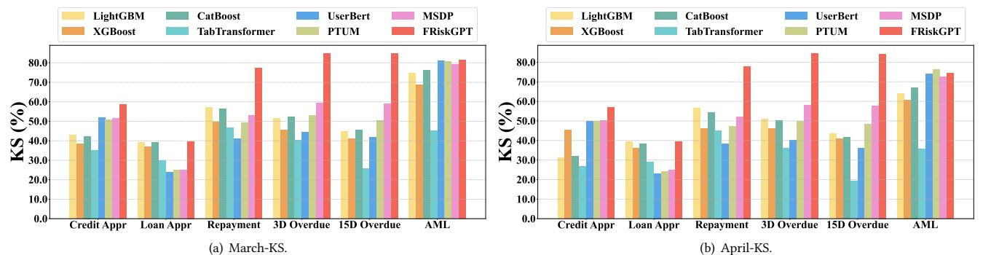

Figure 7: Robustness of different models to temporal shifts. A higher KS indicates stronger robustness.

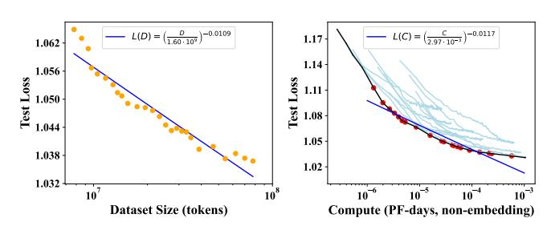

Figure 8: Scaling curves of FRiskGPT across varying data and compute scales. Left: The loss under different amounts of training tokens. Right: The loss under different amounts of floating-point operations performed on training tokens.

the scaling principles commonly seen in other foundational models. This suggests that FRiskGPT's potential can be further unlocked by leveraging larger datasets and increased computational resources. Notably, the current experiments utilize only a small fraction of the payment system's actual data and tasks. With the system generating billions of user behavior trajectories, device fingerprint interaction logs, and transactional metadata daily, there is ample material to drive future iterations and enhancements of the model.

4.3.3 Robustness. In financial service systems, user behavior patterns evolve. For example, users may adopt different spending habits during holiday seasons compared to regular months. Firstly, we test FRiskGPT's performance on March and April 2024 data to assess its robustness to temporal shifts. As depicted in Figure [7,](#page-6-1) FRiskGPT consistently outperforms baselines and maintains stable performance as temporal shifts, demonstrating its ability to adapt effectively to evolving user behavior patterns. Moreover, user behavior often exhibits randomness and noise [\[12,](#page-8-24) [46,](#page-8-29) [48\]](#page-8-30). For instance, login may be triggered by accidental actions rather than intentional behavioral signals. Here, we assess the robustness of FRiskGPT to such noise. Specifically, we apply random drop (removing user behaviors) and replace (replacing user behaviors with others) perturbations with varying ratios to the recent 300 behaviors. As shown in Figure [9,](#page-6-2) FRiskGPT shows remarkable resistance to noise. Even at perturbation ratios as high as 20%, the model performance remains stable and surpasses baselines. Lastly, considering that users' historical risk labels may be noisy, we also evaluate the robustness of FRiskGPT under perturbed risk labels. Due to limited space, please refer to Appendix [D.2](#page-11-2) for detailed experimental results and analysis.

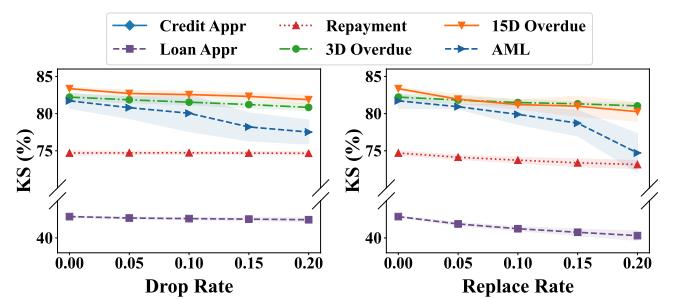

Figure 9: The KS performance of FRiskGPT under different levels of random drop and replace perturbations.

Table 4: KS scores of different methods across 6 financial risk tasks, where MTL denotes joint fine-tuning across all tasks.

| Method     | Credit Appr | Loan Appr | Repayment | 3D Overdue | 15D Overdue | AML   |
|------------|-------------|-----------|-----------|------------|-------------|-------|
| PTUM       | 50.25       | 28.69     | 50.97     | 53.37      | 49.76       | 78.88 |
| PTUM (MTL) | 50.71       | 27.08     | 45.14     | 50.25      | 49.41       | 76.85 |
| MSDP       | 51.93       | 28.69     | 53.76     | 59.42      | 60.14       | 76.08 |
| MSDP (MTL) | 51.16       | 25.33     | 51.98     | 57.93      | 54.71       | 78.68 |
| FRiskGPT   | 58.68       | 42.87     | 74.70     | 82.22      | 83.36       | 81.72 |

4.3.4 Compare with multi-task learning baselines. FRiskGPT serves as a one-for-all model that learns a unified generative model for all tasks and datasets. To further validate the advantages brought by this unified modeling paradigm, we compare FRiskGPT with multiple multi-task discriminative baselines. Since there are no existing multi-task discriminative models in financial risk detection, we implement multi-task fine-tuning for MSDP [\[12\]](#page-8-24) and PTUM [\[41\]](#page-8-25) using hard parameter sharing [\[32\]](#page-8-31), where a shared sequence encoder is jointly optimized across all tasks, while task-specific classifiers are trained independently. As shown in Table [4,](#page-6-3) the reported KS scores indicate that introducing multi-task learning into discriminative models generally does not bring performance gains. This is because each risk prediction shares partial parameters but still remains independent, highlighting the advantages of the proposed unified generative modeling paradigm.

4.3.5 Efficiency Analysis. Theoretically, FRiskGPT has low computational complexity. Specifically, retrieving token embeddings corresponds to a lookup operation on the learnable embedding matrix M, which requires ��(1) time. The similarity computation has a complexity of ��(����), where �� denotes the number of tokens in M (approximately 103 ) and �� is the hidden dimension. Moreover, different GBL sequences can be processed in parallel, further

Table 5: The training and fine-tuning time (hour) of baselines, as well as the training time of FRiskGPT.

| Method   | Training | Credit Appr | Loan Appr | Repayment | 3D Overdue | 15D Overdue | AML      | Total |
|----------|----------|-------------|-----------|-----------|------------|-------------|----------|-------|
| UserBert | 30.5     | 0.34        | 1.12      | 2.53      | 0.12       | 0.03        | 0.18     | 34.82 |
| PTUM     | 4.62     | 0.23        | 0.84      | 2.74      | 0.11       | 0.02        | 0.16     | 8.72  |
| MSDP     | 5.63     | 0.26        | 0.71      | 2.49      | 0.10       | 0.02        | 0.15     | 9.36  |
| FRiskGPT | 11.05    | (w/o ft)    | (w/o ft)  | (w/o ft)  | (w/o ft)   | (w/o ft)    | (w/o ft) | 11.05 |

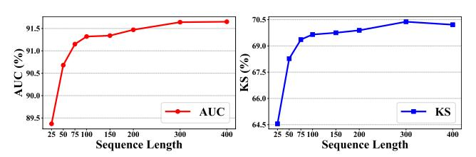

Figure 10: Impact of sequence length on FRiskGPT's performance. The average KS and AUC across 6 tasks are reported.

improving efficiency. Experimentally, the training time cost of different methods is reported in Table [5.](#page-7-0) The results indicate that FRiskGPT achieves state-of-the-art performance across multiple tasks with relatively low training time, even without fine-tuning (w/o ft). In addition, Table [6](#page-7-1) presents the total inference time of different methods on six risk prediction tasks in the payment system. The results demonstrate the inference efficiency of FRiskGPT, highlighting its suitability for industrial-scale applications.

4.3.6 Hyper-parameter Analysis. In Figure [10,](#page-7-2) we show the influence of sequence length on FRiskGPT's performance by reporting the average KS and AUC across 6 datasets on Payment. We find that a sequence length of 300 achieves the best performance, with AUC and KS reaching 91.6% and 70.4%, respectively. A possible explanation is that although a longer sequence length can capture the user's risk state more comprehensively, it also introduces some outdated behavioral noise. To further address this issue, a promising approach is to design behavior selection mechanisms that assign adaptive weights to historical behaviors, thereby reducing the influence of outdated or noisy behavioral signals.

### 5 Related Work

### 5.1 Financial Risk Detection

The rise of online payment services has revolutionized financial transactions, but also heightened exposure to financial crimes. To combat risks, early rule-based models [\[4,](#page-8-32) [9,](#page-8-33) [14,](#page-8-34) [27,](#page-8-35) [38\]](#page-8-36) use expertdefined rules, such as frequent large transactions (over \$100,000) at midnight, to flag suspects. While simple to deploy, these models fail to adapt to complex, evolving patterns. Thus, machine learning models are widely applied to learn patterns from data for classification [\[22,](#page-8-37) [45\]](#page-8-4). For example, decision-tree models [\[3\]](#page-8-38) predicting based on hundreds of features, which is time-consuming and laborintensive. With the surge in user behavior data, deep learning models have been introduced to encode user representation from behavior sequences [\[8,](#page-8-39) [13,](#page-8-40) [44\]](#page-8-41), then learn a classifier for individual task. For example, MSDP [\[12\]](#page-8-24) uses behavior distribution prediction as a self-supervision signal and generalizes to overdue tasks across various time scopes with multi-task prompts. However, despite these advancements, existing methods independently predict each

Table 6: The total inference time (minutes) of baselines and FRiskGPT across 6 risk tasks on the Payment System.

risk instance and neglect the inter- and intra-risk dependencies across entire user lifecycle, leading to suboptimal risk detection and fragmented intelligence.

#### 5.2 Foundation Model

Foundation models refer to models trained on broad and diverse data that can seamlessly adapt to a wide range of downstream tasks [\[31\]](#page-8-8). Represented by the GPT series [\[20,](#page-8-9) [30,](#page-8-42) [36\]](#page-8-43), the story begins with a challenge that collecting task-specific datasets for training will lead to limited generalization. Thus, GPT motivates building as large and diverse a dataset as possible in order to collect natural language demonstrations of tasks in as varied of domains and contexts as possible. Guided by scaling laws, LLMs focus on the simple next-token prediction on massive texts, uncovering unprecedented intelligence. Scaling laws, describing a power-law relationship between training compute (or model/dataset size) and test loss, provide a clear roadmap for unlocking intelligence within extensive texts. Such success of LLMs [\[18,](#page-8-44) [34,](#page-8-15) [37,](#page-8-13) [49\]](#page-8-10) has inspired works to build foundation models in other fields, like vision [\[2,](#page-8-45) [35\]](#page-8-11) recommendation [\[5,](#page-8-46) [19\]](#page-8-12) and market [\[23\]](#page-8-47). However, there is no foundation model for the online payment system that fully addresses the vast non-textual transaction data for financial risks.

#### 6 Conclusion

In this paper, we propose FRiskGPT, a generative foundation model for comprehensive financial risk detection by redefining behaviors and risk labels into GBL. Through auto-regressive generative prediction, FRiskGPT naturally captures inter-task and intra-task dependencies across the entire user lifecycle. Extensive experiments show FRiskGPT outperforms the state-of-the-art baselines in performance, with promising scaling potential and superior robustness, demonstrating its scalability and potential to unify financial risk intelligence. Currently, FRiskGPT achieves unified modeling of company-level data and tasks in the financial risk domain. Given that data from various companies are inherently private, we aim to explore a more general and privacy-compliant framework for collaborative development of data in the future.

#### Acknowledgments

This work is supported in part by the National Natural Science Foundation of China (No. 62550138, 62192784, 62572064, 62472329, 62322203, 62172052), and the BUPT Excellent Ph.D. Students Foundation (No. CX20251005).

References [1] Takuya Akiba, Shotaro Sano, Toshihiko Yanase, et al. 2019. Optuna: A nextgeneration hyperparameter optimization framework. In Proceedings of the 25th ACM SIGKDD international conference on knowledge discovery & data mining. 2623–2631. [2] Alexander Kolesnikov Alexey Dosovitskiy, Lucas Beyer et al. 2020. An Image is Worth 16x16 Words: Transformers for Image Recognition at Scale. ArXiv abs/2010.11929 (2020). [3] Bart Baesens, Tony Van Gestel, Stijn Viaene, et al. 2003. Benchmarking stateof-the-art classification algorithms for credit scoring. Journal of the Operational Research Society 54 (2003), 627–635. [4] Lluís Bermúdez, J. M. Pérez, Mercedes Ayuso, et al. 2008. A Bayesian dichotomous model with asymmetric link for fraud in insurance. Insurance Mathematics & Economics 42 (2008), 779–786. [5] Junyi Chen, Lu Chi, Bingyue Peng, et al. 2024. HLLM: Enhancing Sequential Recommendations via Hierarchical Large Language Models for Item and User Modeling. ArXiv abs/2409.12740 (2024). [6] Qiwei Chen, Huan Zhao, Wei Li, et al. 2019. Behavior sequence transformer for e-commerce recommendation in alibaba. In Proceedings of the 1st international workshop on deep learning practice for high-dimensional sparse data. 1–4. [7] Tianqi Chen and Carlos Guestrin. 2016. Xgboost: A scalable tree boosting system. In Proceedings of the 22nd acm sigkdd international conference on knowledge discovery and data mining. 785–794. [8] Dawei Cheng, Sheng Xiang, Chencheng Shang, et al. 2020. Spatio-Temporal Attention-Based Neural Network for Credit Card Fraud Detection. In AAAI Conference on Artificial Intelligence. [9] Augustinos I. Dimitras, Stelios H. Zanakis, and Constantin Zopounidis. 1996. A survey of business failures with an emphasis on prediction methods and industrial applications. European Journal of Operational Research 90 (1996), 487–513. [10] Rafał Dreżewski, Jan Sepielak, and Wojciech Filipkowski. 2015. The application of social network analysis algorithms in a system supporting money laundering detection. Inf. Sci. 295 (2015). [11] Alaaeldin El-Nouby, Michal Klein, Shuangfei Zhai, et al. 2024. Scalable pretraining of large autoregressive image models. arXiv preprint arXiv:2401.08541 (2024). [12] Chilin Fu, Weichang Wu, Xiaolu Zhang, et al. 2023. Robust User Behavioral Sequence Representation via Multi-scale Stochastic Distribution Prediction. Proceedings of the 32nd ACM International Conference on Information and Knowledge Management (2023). [13] Jia Guo, Guannan Liu, Yuan Zuo, et al. 2018. Learning Sequential Behavior Representations for Fraud Detection. 2018 IEEE International Conference on Data Mining (ICDM) (2018), 127–136. [14] David J. Hand and W Henley. 1997. Statistical Classification Methods in Consumer Credit Scoring: a Review. Journal of the Royal Statistical Society: Series A (Statistics in Society) 160 (1997). [15] Binbin Hu, Zhiqiang Zhang, Chuan Shi, et al. 2019. Cash-Out User Detection Based on Attributed Heterogeneous Information Network with a Hierarchical Attention Mechanism. In AAAI Conference on Artificial Intelligence. [16] Sihao Hu, Zhen Zhang, Bingqiao Luo, et al. 2023. Bert4eth: A pre-trained transformer for ethereum fraud detection. In Proceedings of the ACM Web Conference 2023. 2189–2197. [17] Xin Huang, Ashish Khetan, Milan Cvitkovic, et al. 2020. Tabtransformer: Tabular data modeling using contextual embeddings. arXiv preprint arXiv:2012.06678 (2020). [18] Kevin R. Stone Hugo Touvron, Louis Martin et al. 2023. Llama 2: Open Foundation and Fine-Tuned Chat Models. ArXiv abs/2307.09288 (2023). [19] Xing Liu Jiaqi Zhai, Lucy Liao et al. 2024. Actions Speak Louder than Words: Trillion-Parameter Sequential Transducers for Generative Recommendations. ArXiv abs/2402.17152 (2024). [20] Sandhini Agarwal Josh Achiam, Steven Adler et al. 2023. GPT-4 Technical Report. [21] Guolin Ke, Qi Meng, Thomas Finley, et al. 2017. Lightgbm: A highly efficient gradient boosting decision tree. Advances in neural information processing systems 30 (2017). [22] Nevine Makram Labib, Mohammed Abo Rizka, and Amr Ehab Muhammed Shokry. 2020. Survey of Machine Learning Approaches of Anti-money Laundering Techniques to Counter Terrorism Finance. [23] Junjie Li, Yang Liu, Weiqing Liu, et al. 2024. MarS: a Financial Market Simulation Engine Powered by Generative Foundation Model. ArXiv abs/2409.07486 (2024). [24] Xujia Li, Yuan Li, Xueying Mo, et al. 2023. Diga: Guided Diffusion Model for Graph Recovery in Anti-Money Laundering. Proceedings of the 29th ACM SIGKDD Conference on Knowledge Discovery and Data Mining (2023). [25] Xiangfeng Li, Shenghua Liu, Zifeng Li, et al. 2020. FlowScope: Spotting Money Laundering Based on Graphs. In AAAI Conference on Artificial Intelligence. [26] Haotian Liu, Chunyuan Li, Qingyang Wu, et al. 2023. Visual Instruction Tuning. In NeurIPS. [27] Marvin Oeben, Jeroen Goudsmit, and Elena Marchiori. 2019. Prerequisites and AI challenges for model-based Anti-Money Laundering. In International Joint Conference on Artificial Intelligence. [28] Liudmila Prokhorenkova, Gleb Gusev, Aleksandr Vorobev, et al. 2018. CatBoost: unbiased boosting with categorical features. Advances in neural information processing systems 31 (2018). [29] Alec Radford. 2018. Improving language understanding by generative pretraining. (2018). [30] Alec Radford, Jeff Wu, Rewon Child, et al. 2019. Language Models are Unsupervised Multitask Learners. [31] Ehsan Adeli Rishi Bommasani, Drew A. Hudson et al. 2021. On the Opportunities and Risks of Foundation Models. ArXiv abs/2108.07258 (2021). [32] Sebastian Ruder. 2017. An overview of multi-task learning in deep neural networks. arXiv preprint arXiv:1706.05098 (2017). [33] Fei Sun, Jun Liu, Jian Wu, et al. 2019. BERT4Rec: Sequential recommendation with bidirectional encoder representations from transformer. In Proceedings of the 28th ACM international conference on information and knowledge management. 1441–1450. [34] Gemini Team, Rohan Anil, Sebastian Borgeaud, et al. 2023. Gemini: a family of highly capable multimodal models. arXiv preprint arXiv:2312.11805 (2023). [35] Keyu Tian, Yi Jiang, Zehuan Yuan, et al. 2024. Visual Autoregressive Modeling: Scalable Image Generation via Next-Scale Prediction. ArXiv abs/2404.02905 (2024). [36] Nick Ryder Tom B. Brown, Benjamin Mann et al. 2020. Language Models are Few-Shot Learners. ArXiv abs/2005.14165 (2020). [37] Hugo Touvron, Thibaut Lavril, Gautier Izacard, et al. 2023. LLaMA: Open and Efficient Foundation Language Models. ArXiv abs/2302.13971 (2023). [38] Stijn Viaene, Mercedes Ayuso, Montserrat Guillén, et al. 2007. Strategies for detecting fraudulent claims in the automobile insurance industry. Eur. J. Oper. Res. 176 (2007), 565–583. [39] Daixin Wang, Yuan Qi, Jianbin Lin, et al. 2019. A Semi-Supervised Graph Attentive Network for Financial Fraud Detection. 2019 IEEE International Conference on Data Mining (ICDM) (2019), 598–607. [40] Daixin Wang, Zhiqiang Zhang, Yeyu Zhao, et al. 2023. Financial Default Prediction via Motif-preserving Graph Neural Network with Curriculum Learning. Proceedings of the 29th ACM SIGKDD Conference on Knowledge Discovery and Data Mining (2023). [41] Chuhan Wu, Fangzhao Wu, Tao Qi, et al. 2020. PTUM: Pre-training User Model from Unlabeled User Behaviors via Self-supervision. ArXiv abs/2010.01494 (2020). [42] Chuhan Wu, Fangzhao Wu, Tao Qi, et al. 2022. Userbert: Pre-training user model with contrastive self-supervision. In Proceedings of the 45th International ACM SIGIR Conference on Research and Development in Information Retrieval. 2087–2092. [43] Liwei Wu, Shuqing Li, Cho-Jui Hsieh, et al. 2020. SSE-PT: Sequential recommendation via personalized transformer. In Proceedings of the 14th ACM conference on recommender systems. 328–337. [44] Yu Xie, Guanjun Liu, Chungang Yan, et al. 2023. Time-Aware Attention-Based Gated Network for Credit Card Fraud Detection by Extracting Transactional Behaviors. IEEE Transactions on Computational Social Systems 10 (2023), 1004– 1016. [45] Ya-Lin Zhang, Jun Zhou, Wenhao Zheng, et al. 2018. Distributed Deep Forest and its Application to Automatic Detection of Cash-Out Fraud. ACM Transactions on Intelligent Systems and Technology (TIST) 10 (2018), 1–19. [46] Zhongjian Zhang, Xiao Wang, et al. 2025. Can large language models improve the adversarial robustness of graph neural networks?. In Proceedings of the 31st ACM SIGKDD Conference on Knowledge Discovery and Data Mining V. 1. [47] Zhongjian Zhang, Mengmei Zhang, et al. 2024. Endowing pre-trained graph models with provable fairness. In Proceedings of the ACM Web Conference 2024. [48] Zhongjian Zhang, Mengmei Zhang, Xiao Wang, et al. 2025. Rethinking Byzantine Robustness in Federated Recommendation from Sparse Aggregation Perspective. In Proceedings of the AAAI Conference on Artificial Intelligence. [49] Shixuan Liu Zihan Wang, Xinzhan Liu and others. 2024. TeleChat Technical Report. ArXiv abs/2401.03804 (2024).

#### A Comparison of FRiskGPT with Existing Methods

Table [7](#page-10-1) summarizes the key innovations of FRiskGPT in comparison with existing methods. For a certain risk detection task ���� , FRiskGPT considers both the user historical risk ���� (intra-task) and other risks ���� (inter-task), which baselines struggle with. Specifically, FRiskGPT reframes the paradigm of financial risks from isolated discriminative to unified generative through redefining data with GBL and utilizing auto-regressive modeling, facilitating more efficient and intelligent risk management for financial companies. Under this generative paradigm, we can easily unify diverse data and tasks from the financial risk domain, achieving a paradigm shift akin to Word2Vec-to-GPT in NLP.

# B Experiment Detail

# B.1 Datasets and Tasks

Payment is an online payment system, which contains 138,869,597 behavior records of 737,560 users on the system from 10/01/2022 to 04/30/2024. Following [\[12,](#page-8-24) [41\]](#page-8-25), we use user data from 10/01/2022 to 12/31/2023 as the training set, and data from 01/2024 and 02/2024 as the validation set and test set, respectively. The data from 03/2024 and 04/2024 are used to test the model's robustness to temporal shifts. In the financial risk domain, each dataset typically corresponds to a risk detection task. In the experiment, we select 6 popular risk detection datasets from pre-loan, on-loan, post-loan, and transaction scenarios. The number and proportion of each task in the Payment are reported in Table [8.](#page-10-2)

• Credit Application (Credit Appr) predicts whether a user's vided information and historical data. For any Credit Application by a user, the system constructs two behavioral responses: "Credit App-Success" and "Credit App-Failure," representing the normal

- credit application meets the eligibility criteria, based on their proand risky user, respectively.
- Loan Application (Loan Appr) predicts whether a user's loan application is likely to be approved by predicting their ability to meet loan requirements and repayment obligations. For any loan application by a user, the system constructs two behavior responses: "Loan App-Success" and "Loan App-Failure", representing the normal and risky user, respectively.
- Repayment predicts whether a user will repay their loan on time, helping to assess repayment behavior and reduce potential defaults. If a user fails to repay all loans by the due date, we will construct two system behaviors: "Repayment-Success", "Repayment-Failure", denoting the normal and risky user, respectively.
- 3 Days Overdue Repayment (3D Overdue) predicts whether users who fail to repay on time will clear their debt within the next 3 days. Assessing this risk facilitates the system in optimizing debt collection strategies to recover debt. Here, we construct two system behaviors: "3D Overdue-Success" and "3D Overdue-Failure", denoting the normal and risky user, respectively. The system behavior time is set to the 3rd day after the repayment date.
- 15 Days Overdue Repayment (15D Overdue) predict whether users who are overdue for 3 days will clear their debt within the next 12 days. "15D Overdue-Success" and "15D Overdue-Failure" are constructed as the system behaviors, denoting the normal and risky user, respectively. The behavior time is set to the 15th day

after the repayment date.

• Money Laundering Risk (AML) predicts the risk of money laundering by analyzing transaction patterns and user behavior to ensure compliance with anti-money laundering regulations. When a user performs a transfer, the system constructs two behavioral responses: "Non-Money Laundering" and "Money Laundering", corresponding to successful transfers (i.e., normal) and failed transfers (i.e., risky), respectively.

Ethereum contains 5,448,051 transaction behaviors of 82,614 users on Ethereum, where the number of users in train, valid, and test sets is 78,135, 2,303, and 2,176, respectively. According to the objective of a transaction, we construct Kraken-Bittrex, Kraken-Binance and Bittrex-Binance tasks.

- Kraken-Bittrex predicts the objective of a transaction is Kraken or Bittrex.
- Kraken-Binance predicts the objective of a transaction is Kraken or Binance.
- Bittrex-Binance predicts the objective of a transaction is Bittrex or Binance.

#### B.2 Implementation Detail and Baselines Introduction

B.2.1 FRiskGPT. The implementation of FRiskGPT utilized the PyG module. In our experiment, FRiskGPT consists of a 4-layer, 8-head transformer block, with a hidden size of 256. In the training stage, for the 6 datasets from Payment and the 3 datasets from Ethereum, we respectively utilize the concept of GBL to unify them into a token semantic space, and then train FRiskGPT with an autoregressive loss on the training data, where Adam is selected as the model optimizer and the learning rate is 0.001. The model training epoch is 50, and the batch size is 256.

B.2.2 Supervised learning. Based on user historical behavior data for each task, we assign domain experts to construct manual feature engineering, and the labeled system behaviors of each task as labels to train models. To facilitate fair comparisons, we use Optuna [\[1\]](#page-8-48) to tune the hyperparameters of baselines on each task. The baseline introductions are as follows:

• LightGBM: An open-source gradient boosting framework developed by Microsoft that uses a leaf-wise growth strategy for efficient

- training.
- XGBoost: An optimized gradient boosting library designed to be highly efficient, flexible, and portable, often used for supervised learning tasks.
- CatBoost: A gradient boosting method is particularly effective in handling categorical features and employs ordered boosting to prevent overfitting.
- BST: BST employs a multi-layer transformer to encode user behavior sequences, which are then concatenated with other user features to form the final representation for task prediction. In the experiment, we use their original code and the default hyperparameter settings in the authors' implementation.
- TabTransformer: A transformer-based model for tabular data that captures intricate relationships and dependencies among fea-

tures.

Notably, to ensure a fair and reflective standard practice in financial modeling, for tree-based baselines, the user features are

Table 7: Comparison between existing methods and FRiskGPT across key modeling dimensions.

| Dimension Existing Methods Our                                                 | FRiskGPT   |                    |                   |                |               |          |
|--------------------------------------------------------------------------------|------------|--------------------|-------------------|----------------|---------------|----------|
| Data Representation Only use user behavior sequences; risk labels              |            |                    |                   |                |               |          |
| and features remain separate.                                                  |            |                    |                   |                |               |          |
| General                                                                        |            | Behavior           | Language          |                | (GBL) : Unify | user     |
| attributes,                                                                    |            | user               | behaviors,        | system         | behaviors,    | and      |
| risk                                                                           | labels     | into               | a single          | GBL sequence.  |               |          |
| Task Modeling Isolated discriminative paradigm: Indepen                       |            |                    |                   |                |               |          |
| dently model the conditional distribution                                      |            |                    |                   |                |               |          |
| �� (Y ��                                                                       |            |                    |                   |                |               |          |
| X �� ) for the �� -th task �� ��                                               |            |                    |                   |                |               |          |
| Unified                                                                        |            | generative         |                   | paradigm       | : Uniformly   | model    |
| the                                                                            | joint      | distribution       | ��                | (X , Y) across | multiple      | tasks.   |
| Dependency Modeling Only capture user behavior–label dependency. Comprehensive |            |                    | dependency        |                | modeling      | : Simul |
| taneously                                                                      |            | capture            | dependencies      |                | among user    | behav   |
| iors,                                                                          | labels,    | and                | intra-/inter-risk |                | signals.      |          |
| Inference Requires dedicated models or fine-tuning for                         |            |                    |                   |                |               |          |
| each task.                                                                     |            |                    |                   |                |               |          |
| No                                                                             | additional |                    | training          | : Performs     | prediction    | di      |
| rectly                                                                         | in         | a task-constrained |                   | space          | without       | extra    |
| fine-tuning                                                                    |            | or                 | task-specific     | models,        | enabling      | scala   |
| bility                                                                         | and        | robustness.        |                   |                |               |          |

Table 8: Statistics of each risk detection dataset in the Payment system.

carefully crafted by our financial domain experts. These handcrafted features span the following representative categories: User profile features (e.g., age, region, income); Historical behavior statistics (e.g., count/frequency of transfers, repayments, or loan applications within the recent 7/30/90 days); Credit-related signals (e.g., loan approval history, overdue records); Temporal patterns (e.g., behavior distributions over time slots or weekdays)

B.2.3 Pretrain-finetune. Based on different self-supervised methods, we utilize the behavior sequence data to pretrain a model. With the well-trained models, we encode the historical behaviors to obtain general representations of each user. The labeled system behaviors of each risk task, i.e., labels, are used to train a specific task classifier. Unless otherwise specified, we adopt the default parameter setting in the author's implementation. In all baselines, the epoch of pretraining is set to 50, and the fine-tuning is 100, with an early stop of 30. The max sequence that the model can handle is set to 300 to facilitate fair comparisons with ours.

• UserBert: The method utilizes two contrastive self-supervision tasks, including a masked behavior prediction task and a behavior sequence matching task, to pre-train a transformer-based user model. The max sequence of the behavior prediction task is 300, while the behavior sequence matching task is 150.

• Bert4Rec: The method takes a masked behavior prediction task to learning a user representation based on the multi-layer transformer. The layer number and head of transformer are set to 2 and 2, respectively.

• SSE-PT: The method adopts a personalized transformer with stochastic shared embedding regularization and uses next behavior prediction to pre-train user representations. The layer number and head of transformer are set to 2 and 2, respectively.

• PTUM: The method utilizes a masking behavior prediction task and next K behaviors prediction task to pretrain an effective user model. The K is set to 2, and the coefficient �� is 1.0.

• MSDP: A state-of-the-art method for user modeling by multiscale stochastic distribution prediction task. Since the source code of the model is not publicly available, the reproduction is conducted based on the descriptions provided in the paper. Moreover, the maximum task period in this paper is 15 days, i.e., "15 Days Overdue Repayment". Therefore, the pretraining only considers a static scale of 15.

- The source code of baselines is listed as follows:
- BST: [https://github.com/huawei-noah/benchmark/tree/main/Fuxi](https://github.com/huawei-noah/benchmark/tree/main/FuxiCTR/model_zoo/BST)CTR/ [model\\_zoo/BST](https://github.com/huawei-noah/benchmark/tree/main/FuxiCTR/model_zoo/BST)
- TabTransformer: [https://github.com/lucidrains/tab-transformer](https://github.com/lucidrains/tab-transformer-pytorch)[pytorch](https://github.com/lucidrains/tab-transformer-pytorch)
- UserBert:<https://github.com/ilovemyminutes/UserBERT>
- Bert4Rec:<https://github.com/FeiSun/BERT4Rec>
- SSE-PT:<https://github.com/wuliwei9278/SSE-PT>
- PTUM:<https://github.com/wuch15/PTUM>

# B.3 Computing Environment

The environment where our code runs is shown as follows:

- Operating system: Ubuntu 20.04
- CPU information: AMD EPYC 7302 16-Core Processor
- GPU information: 5 \* GeForce RTX 4090

# C Case Study

We present a specific GBL example below, where each token contains a recorded timestamp and the GBL is sorted in chronological order. Notably, due to the proprietary nature of our data in the

Table 9: Performance (% ± ��) on 6 risk detection datasets from the Payment system.

| Task Metric       |          |       |         |       | Supervised |       |       |        |           |       |            |       |          | Pretrain-Finetune |        |       |       |       |       |       | One      | for All |
|-------------------|----------|-------|---------|-------|------------|-------|-------|--------|-----------|-------|------------|-------|----------|-------------------|--------|-------|-------|-------|-------|-------|----------|---------|
|                   | LightGBM |       | XGBoost |       | CatBoost   |       |       | BST    | TabTrans. |       | UserBert   |       | BERT4Rec |                   | SSE-PT |       | PTUM  |       | MSDP  |       | FRiskGPT |         |
| Credit Appr Prec. | 79.48    | ±0.26 | 80.23   | ±0.37 | 79.54      | ±0.15 | 81.52 | ±0.54  | 77.52     | ±0.98 | 82.15      | ±0.39 | 81.91    | ±0.19             | 82.12  | ±0.69 | 81.50 | ±1.22 | 83.55 | ±1.12 | 83.55    | ±0.85   |
| F1                | 65.41    | ±0.40 | 67.04   | ±0.38 | 65.15      | ±0.26 | 77.64 | ±0.42  | 56.52     | ±1.44 | 75.37      | ±0.20 | 77.76    | ±0.23             | 76.58  | ±0.53 | 73.99 | ±0.80 | 72.44 | ±1.86 | 79.87    | ±0.75   |
| Loan Appr Prec.   | 69.94    | ±0.08 | 67.63   | ±0.15 | 67.04      | ±0.09 | 52.91 | ±2.20  | 68.40     | ±1.46 | 59.17±0.27 |       | 55.73    | ±1.24             | 54.13  | ±1.25 | 62.68 | ±0.87 | 60.92 | ±1.03 | 67.75    | ±2.45   |
| F1                | 56.82    | ±0.06 | 58.19   | ±0.16 | 62.54      | ±0.09 | 55.81 | ±1.09  | 50.07     | ±2.65 | 49.91      | ±1.10 | 51.02    | ±1.46             | 48.71  | ±2.01 | 47.23 | ±1.23 | 49.28 | ±1.27 | 62.59    | ±2.38   |
| Repayment Prec.   | 93.28    | ±0.01 | 92.58   | ±0.01 | 93.79      | ±0.02 | 93.23 | ±0.04  | 93.05     | ±0.01 | 92.23      | ±0.08 | 92.62    | ±0.10             | 92.50  | ±0.09 | 93.28 | ±0.09 | 93.78 | ±0.18 | 95.87    | ±0.03   |
| F1                | 96.30    | ±0.00 | 95.97   | ±0.00 | 96.54      | ±0.01 | 96.32 | ±0.02  | 95.95     | ±0.03 | 95.84      | ±0.04 | 96.06    | ±0.03             | 95.98  | ±0.04 | 96.25 | ±0.08 | 96.55 | ±0.06 | 97.70    | ±0.01   |
| 3D Overdue Prec.  | 61.72    | ±0.11 | 56.48   | ±0.06 | 68.89      | ±0.20 | 66.71 | ±3.16  | 65.28     | ±0.18 | 60.73      | ±0.85 | 64.91    | ±0.67             | 63.96  | ±0.83 | 63.92 | ±0.64 | 67.85 | ±1.65 | 80.54    | ±1.25   |
| F1                | 73.21    | ±0.09 | 69.20   | ±0.04 | 72.83      | ±0.19 | 66.95 | ±14.47 | 68.69     | ±0.29 | 69.29      | ±0.45 | 74.42    | ±0.23             | 73.18  | ±0.63 | 72.16 | ±0.97 | 74.54 | ±0.60 | 87.50    | ±0.56   |
| 15D Overdue Prec. | 39.26    | ±0.90 | 42.30   | ±0.41 | 38.64      | ±0.72 | 34.14 | ±7.14  | 33.48     | ±0.49 | 41.03      | ±3.29 | 51.25    | ±0.32             | 50.87  | ±2.31 | 44.96 | ±1.99 | 50.14 | ±2.89 | 83.52    | ±2.20   |
| F1                | 33.52    | ±0.59 | 25.21   | ±0.20 | 29.45      | ±0.75 | 42.75 | ±3.94  | 29.89     | ±0.37 | 24.82      | ±3.12 | 24.09    | ±2.33             | 19.23  | ±1.56 | 22.70 | ±3.76 | 28.83 | ±3.70 | 81.18    | ±0.42   |
| AML Prec.         | 62.11    | ±2.63 | 66.40   | ±1.46 | 62.78      | ±2.65 | 53.14 | ±.7.02 | 48.49     | ±3.79 | 61.46      | ±3.33 | 64.56    | ±6.78             | 57.69  | ±6.29 | 67.48 | ±7.89 | 62.00 | ±8.17 | 81.04    | ±3.73   |
| F1                | 22.93    | ±0.86 | 21.26   | ±0.54 | 25.20      | ±1.68 | 25.29 | ±5.14  | 22.31     | ±4.65 | 29.37      | ±3.09 | 22.46    | ±4.10             | 21.31  | ±6.80 | 28.67 | ±6.29 | 34.19 | ±8.44 | 54.34    | ±1.76   |

Table 10: KS performance (%) of FRiskGPT on clean and perturbed data across different tasks.

company, we can only provide partial behavior token from the behavior vocabulary V��.

Gender–Male, ..., Education–Bachelor, Account Opened, Login, Credit Appr-Success, Login, Bind Card, Top Up, Loan Appr-Success, Offer Voucher, Get Voucher, Login, Transfer, Non Money Laundering, ..., Login, Repayment-Success, Cash Out, Repayment-Failure, Calling Alert, Login, 3D Overdue-Success, Unbind Card, Loan Appr-Success.

Here, {Gender–Male, Education–Bachelor} belong to user attributes; {Account Opened, Login, Bind Card, Top Up, Get Voucher, Transfer, Cash Out, Unbind Card} belong to user behaviors; {Credit Appr-Success, LoanAppr-Success,Non Money Laundering, Repayment-Success, Repayment-Failure, 3D Overdue-Success, LoanAppr-Success.} belong to labeled system behaviors; {Offer Voucher, Calling Alert} belong to Non-labeled system behaviors.

# D More Experiment Result

# D.1 More Experimental Metric on Payment

We present the model performance across 6 financial risk tasks from 4 scenarios in Table [9,](#page-11-3) where the metric is Prec. (Precision), and F1. Precision indicates the model's accuracy of positive predictions, while F1 reflects the balance between accuracy and completeness. The results show that FRiskGPT consistently outperforms all baselines across all metrics, achieving the SOTA performance, and highlighting the advantages of our generative foundation model.

# D.2 The Robustness of FRiskGPT to Noisy Label

In financial service systems, the user's historical risk label may be noisy. Here, we evaluate the label sensitivity of FRiskGPT by randomly flipping 5% past label tokens (at least one token flipped). Table [10](#page-11-4) reports the KS performance, and we find that the average performance drop of FRiskGPT across all tasks is 3.5, indicating that FRiskGPT is robust to the quality of historical labels.

### E Deployment

FRiskGPT is deployed as a scheduled batch task in our large-scale financial risk control workflow, running daily to scan six months of behavioral sequences for AML (anti–money laundering) risk. Unlike real-time rule-based and tree-based models used for online blocking, FRiskGPT operates purely in offline re-inspection, where all flagged users are further validated by human risk experts before any final decision. In offline comparative evaluation over 335,984 users, FRiskGPT identified 3,489 high-risk users, among which 3,021 overlapped with existing real-time detections. From the incremental AML cases—users captured only by FRiskGPT—we randomly sampled 270, and human experts confirmed 258 as money laundering users (precision 95.5%), demonstrating substantial recall gains beyond current models. In future, applying KV-cache retention for high-risk users is worth exploring to enable more efficient real-time inference.