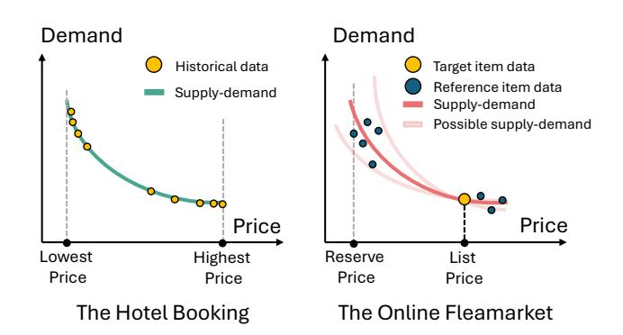
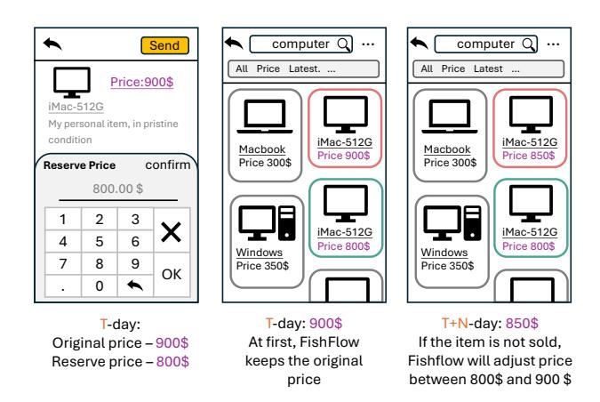
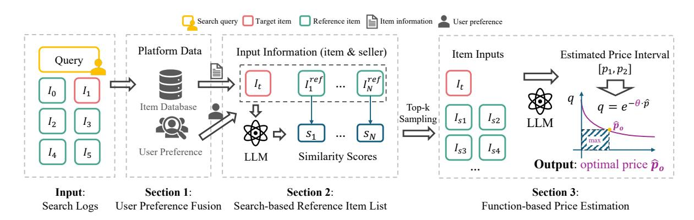
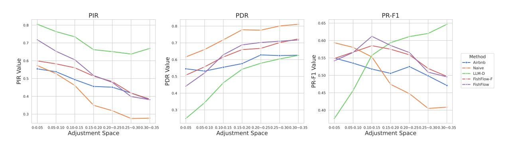
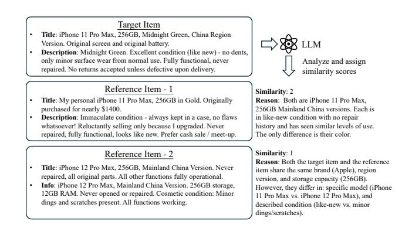
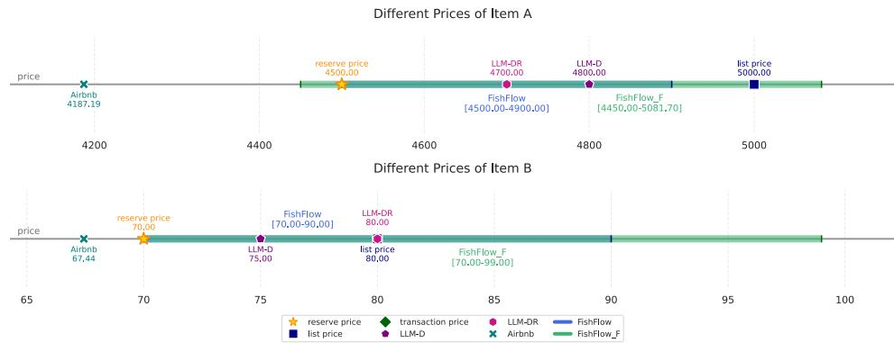

# FishFlow: A LLM-Empowered Dynamic Pricing Framework for Online Fleamarket Platform

Kakam Chong zhuangjx23@mails.tsinghua.edu.cn Tsinghua University Beijing, China

Xu Yan wuyong.yx@alibaba-inc.com Alibaba Group Hangzhou, China

Shuai Xiao∗ shuai.xsh@alibaba-inc.com Alibaba Group Hangzhou, China

Ming Chen xingke.cm@taobao.com Alibaba Group Hangzhou, China

Chen Ju juchen.ju@alibaba-inc.com Alibaba Group Hangzhou, China

Fei Huang huangfei.hf@alibaba-inc.com Alibaba Group Hangzhou, China

Yuantao Gu gyt@tsinghua.edu.cn Tsinghua University Beijing, China

Shuguang Han∗ shuguang.sh@alibaba-inc.com Alibaba Group Hangzhou, China

Jufeng Chen jufeng.cjf@alibaba-inc.com Alibaba Group Hangzhou, China

## Abstract

Unlike pricing on Business-to-Consumer (B2C) platforms like Amazon and Taobao, pricing on online fleamarket platform is primarily influenced by distinct platform dynamics, including user preferences, item conditions, and the supply-demand relationship. Most individual sellers on online fleamarket platform lack professional expertise and information to set optimal prices. Consequently, a dynamic pricing mechanism is significantly beneficial for both seller experience and platform revenue. On the online fleamarket platform, most items are single-stock, leading to little historical data for price estimation. The insufficient information provided by sellers also makes it challenging to collect appropriate reference information. These challenges lead to difficulties in directly applying existing dynamic pricing methods from other domains such as hotel bookings and airline tickets. In this paper, to address these challenges, we propose FishFlow, a novel dynamic pricing framework empowered by Large Language Models (LLMs) for the online fleamarket platform. Fishflow leverages LLMs to identify relevant items and sample a reference item list, facilitating price estimation. To better estimate the price, we propose a novel price estimation strategy based on reference items. The strategy combines the inference capabilities of LLMs with the explainability of function-based methods. Additionally, we leverage reinforcement learning to improve reference item inference and price estimating capabilities of LLMs under the guidance of real transaction prices. Both offline and online experiments validate the effectiveness of FishFlow.

[This work is licensed under a Creative Commons Attribution 4.0 International License.](https://creativecommons.org/licenses/by/4.0)

WWW '26, Dubai, United Arab Emirates © 2026 Copyright held by the owner/author(s). ACM ISBN 979-8-4007-2307-0/2026/04 <https://doi.org/10.1145/3774904.3792833>

## CCS Concepts

• Applied computing → E-commerce infrastructure; • Computing methodologies → Information extraction.

## Keywords

Online Flea Market, Dynamic Pricing, LLM, Reinforcement Learning

## ACM Reference Format:

Kakam Chong, Xu Yan, Shuai Xiao, Ming Chen, Chen Ju, Fei Huang, Yuantao Gu, Shuguang Han, and Jufeng Chen. 2026. FishFlow: A LLM-Empowered Dynamic Pricing Framework for Online Fleamarket Platform . In Proceedings of the ACM Web Conference 2026 (WWW '26), April 13–17, 2026, Dubai, United Arab Emirates. ACM, New York, NY, USA, [11](#page-10-0) pages. [https://doi.org/10.1145/](https://doi.org/10.1145/3774904.3792833) [3774904.3792833](https://doi.org/10.1145/3774904.3792833)

## 1 Introduction

As the global sharing economy has evolved, online fleamarket platforms such as Xianyu and eBay have grown rapidly [\[16\]](#page-8-0). In contrast to traditional B2C e-commerce markets, the pricing of second-hand items is predominantly determined by the quality of each item and the supply-demand dynamics inherent to the platform. Reasonable prices of second-hand items can significantly enhance seller experience and platform revenue, while unreasonable prices may lead to missed sales opportunities [\[5\]](#page-8-1). However, individual sellers often lack both the professional expertise and access to the necessary market information required to formulate optimal pricing strategies. Therefore, dynamic optimal pricing mechanisms can significantly enhance sellers' experience while improving the platform revenue, thereby facilitating the development of green and low-carbon economies.

The dynamic pricing system has been used broadly and successfully in travel platforms (e.g., Fliggy, Airbnb) [\[25,](#page-9-0) [27\]](#page-9-1) and ecommerce. However, differences between Business-to-Consumer markets and Consumer-to-Consumer markets lead to difficulties in directly applying the existing dynamic pricing system on the online fleamarket platform. As the Figure [1](#page-1-0) shown, for instance, the supply-demand dynamics of a room can be modeled from its

∗Corresponding author.

Figure 1: The difference of modeling supply-demand function between the hotel booking and the online fleamarket. In hotel booking, the supply-demand function is determined by historical data, while the supply-demand function on online fleamarket platform is predominantly determined by similar reference data.

historical data. However, most items on the online fleamarket platform are single-stock, the historical data of a target item is hard to collect. Another challenge comes from unstructured and rough descriptions of items provided by users, which complicates the process of analyzing listed items effectively. In addition, sparse data across diverse categories, combined with limited supervised data, makes it challenging to train price estimation models directly.

To address these challenges mentioned above, we propose Fish-Flow, a LLM-empowered dynamic pricing framework. FishFlow is designed to automatically collect relevant items as pricing references. The LLM is leveraged to analyze unstructured and rough text, estimate the underlying demand curve, and obtain the optimal price through the demand curve. Furthermore, we utilize the reinforcement learning (RL) to improve the price estimating capabilities under the guidance of real transaction prices.

Reference item information collection. For most users, it is intuitive to collect prices of similar items as a strong reference to estimating the price of the target item. Inspired by this insight, FishFlow is designed with a pipeline to collect a search-based reference item list. Since the item information provided by individual sellers is usually rough and insufficient, it is hard for traditional methods to extract the valuable reference information effectively. However, in recent years, Large Language Models (LLMs), which have a powerful capability of understanding unstructured and ambiguous information, have shown significant potential in complex natural language tasks [\[18\]](#page-8-2). Moreover, with their few-shot and zeroshot capabilities [\[4\]](#page-8-3), LLMs can serve as an intelligent estimator [\[13\]](#page-8-4). In FishFlow, we leverage the LLM to analyze items based on search logs and assign similarity scores. Subsequently, we conduct top-k sampling based on similarity scores to enhance the quality of the reference item list.

Price estimation based on reference items. In existing research works, some traditional pricing estimations are based on the demand function [\[11,](#page-8-5) [25\]](#page-9-0). With the rapid development of LLMs, there are some works applying the LLM to estimate prices [\[7,](#page-8-6) [17,](#page-8-7) [19\]](#page-8-8). Although LLMs have shown significant potential to set prices, LLMonly methods may fail because the LLM is not sensitive to numbers [\[1\]](#page-8-9). To overcome this challenge, we propose a novel method which combines both the capabilities of LLMs and the explainability of demand function methods.

Reinforcement learning in pricing. While general LLMs (GPT-4o, DeepSeek-R1, and Qwen) demonstrate strong performance in natural language tasks, they exhibit limitations in domain-specific applications such as pricing. There are some existing works [\[12\]](#page-8-10) that have demonstrated the significant potential of reinforcement learning (RL) for pricing. Building upon these insights, we further explore the RL based on the real world transaction price. Moreover, RL learning also helps LLMs to build the connection between the target item and reference items effectively. Specifically, reinforcement learning training can further enhance large language models' ability to analyze the similarity and quality between target items

and reference items, as well as their price reasoning capabilities. The offline evaluation demonstrates effective balance between competitive pricing and seller revenue. Online deployment increases unique visitor exposure and chat conversion rates, enhancing purchase probabilities. Overall, in this paper, our main contributions are as follows:

- we propose a novel LLM-empowered dynamic pricing framework named FishFlow for online fleamarket platforms. The offline evaluation demonstrates that FishFlow outperforms other baselines. Online deployment achieves increased exposure and improved potential purchase probability.
- The FishFlow is designed with a pipeline to collect the reference items of the target item based on search logs. Leveraging the capabilities of the LLM, FishFlow can identify relevant items inherent to fleamarket item descriptions.
- In price estimation, we propose a novel method which combines both the capabilities of LLMs and the explainability of demand function methods. Offline evaluation shows the method effectively balances price competitiveness and revenue well.
- Based on real world transaction price, we propose a RL approach to enhance the reference item inference capability and the price estimating capability of LLMs. The experimental results validate the effectiveness of our RL approach.

## 2 Related Works

## 2.1 Dynamic Pricing System

Dynamic pricing is used broadly in various domains, including the hotel bookings, transportation systems, and e-commerce platforms. Existing works on dynamic pricing mainly fall into two categories: model-driven approaches [\[2,](#page-8-11) [23,](#page-8-12) [25,](#page-9-0) [27,](#page-9-1) [28\]](#page-9-2) and data-driven approaches [\[6,](#page-8-13) [14,](#page-8-14) [20\]](#page-8-15).

The model-driven approach fundamentally relies on the predefined demand function that characterizes the relationship between consumer demand and price. Models within this approach are designed to estimate coefficients of the predefiend demand function. Once these coefficients are determined, the optimal price can be easily derived from the established demand function. For instance, Ferrer et al. [\[11\]](#page-8-5) propose a robust optimization approach for retail pricing that incorporates demand uncertainty and risk aversion by

Figure 2: The user sets the reserve price on day T, and then FishFlow dynamically adjusts the price in the following days. (The red item is the target item, while the green items are reference items selected by FishFlow.)

considering uncertainty in both the base demand coefficient and price sensitivity parameter of a linear demand function.

On the other hand, the data-driven approach applies machine learning or deep learning techniques to predict the optimal price directly. Compared to model-driven approaches, data-driven approaches can better capture changes in the market but lack explainability. Hua et al. [\[14\]](#page-8-14) propose a novel data-driven semi-parametric framework for markdown pricing in e-commerce fresh retail that combines counterfactual prediction using a semi-parametric structural model with multi-period dynamic pricing optimization via Markov decision processes. Shukla et al. [\[20\]](#page-8-15) propose a dynamic pricing framework for airline ancillary services that incorporates customer-specific features and monotonicity constraints to optimize personalized revenue.

## 2.2 LLM-driven Systems

With the rapid advancement of LLMs, more and more frameworks have emerged that utilize LLMs as agents or components to enhance their capabilities in various domains [\[3,](#page-8-16) [13,](#page-8-4) [21,](#page-8-17) [22,](#page-8-18) [26\]](#page-9-3). Yu et al. [\[26\]](#page-9-3) introduce the LLM into their system named FinCon, a multi-agent system that uses conceptual verbal reinforcement to improve financial decision-making. Wang et al. [\[21\]](#page-8-17) introduces QuantAgent, a self-improving large language model framework that autonomously develops domain-specific knowledge for quantitative trading. Babaei and Giudici [\[3\]](#page-8-16) demonstrate that GPT models can achieve binary classification performance comparable to traditional logistic regression in credit lending applications while requiring significantly fewer training samples. Dong et al. [\[10\]](#page-8-19) introduce verbal uncertainty estimation into LLM-as-a-Personalized-Judge systems to address persona sparsity issues. These works collectively highlight the versatility and effectiveness of LLM-based frameworks, which offer significant benefits such as reduced data requirements, self-improvement capabilities, and enhanced decision accuracy, demonstrating their broad applicability in solving complex real-world problems.

#### 3 Framework Design

The core goal of the FishFlow framework is to improve item price competitiveness while striving to maximize user revenue. To address this, we design FishFlow at the user and platform levels. At the user level (See Section [4.1\)](#page-2-0), FishFlow expects users to set reserve prices, which play a significant role in subsequent price estimation. At the platform level (See Section [4.2\)](#page-2-1), we propose a function-based price estimation strategy, which combines the LLM and the demand function [\[25,](#page-9-0) [27\]](#page-9-1).

## 4 The Pipeline of Price Adjustment in FishFlow

As the Figure [2](#page-2-2) shown, there are three mock-ups illustrating the pipeline of pricing in FishFlow Framework. The first mock-up shows the interface for a seller to set a reserve price. The second mock-up and the third mock-up display the search results under the same query on different days.

Initially, the user sets a reserve price, a crucial step for the subsequent price estimation. FishFlow then adjusts the item's price based on platform data. In this case, the target item (iMac-512G) has a list price of 900. The seller sets the reserve price to 900\$. The seller sets its reserve price to 800\$ on T-day, meaning the price on the platform will then fluctuate between 800\$ and 900\$.

## 4.1 The Reserve Price

FishFlow provides an interface for users to set reserve prices when they choose to use the dynamic pricing function. Consequently, each item has two associated prices: the original list price �� list and the reserve price �� res. Typically, it is recommended to assign the reserve price as 80% of the original list price.

## 4.2 FishFlow Architecture

The proposed FishFlow framework is illustrated in Figure [3.](#page-3-0) Fish-Flow comprises three sections: User Preference Fusion, Search-based Reference Item List and Function-based Price Estimation. Prompts are available in Appendix [A.](#page-9-4)

User Preference Fusion. Observations from online fleamarket platforms reveal diverse user price preferences. Specifically, some users prioritize quick transactions through price reductions, others tend to maintain their initial prices, and a few might even raise prices to maximize their potential profits. These preferences will affect the price directly. Therefore, it is necessary to consider not only item information but also user preferences in the FishFlow framework. Given an item ���� , FishFlow collects the textual information (e.g. title, description)������ and its price information ������ = {�� list ���� , ��res ���� }. In FishFlow framework, user's preference is categorized as three types: 0 refers to users who prefer to sell discounted prices, 1 refers to users who usually insist on maintaining original prices and 2 refers to users who will increase price to maximize profits. Based on user behavioral data, FishFlow analyzes and assigns the preference ������ ∈ {0, 1, 2}. In practice, preferences of new users are 1 by default. Finally, the fused data of item ���� is represented as:

������ = {������ , ������ ,������ },

Search-based Reference Item List. Since most items on the online fleamarket platform are single-stock, it is impractical to collect their historical data for pricing. Therefore, FishFlow collects data

| Item      | type  | Status      | #Counts    |
|-----------|-------|-------------|------------|
| target    | items | sold        | 2806       |
|           |       | unsold      | 2849       |
| reference | items | sold        | 17903      |
|           |       | unsold      | 53525      |
| total     | items | target item | 5655       |
|           |       | reference   | item 71428 |

Table 2: The number of samples. ���� refers to the estimated price. For sold items, �� refers to the final transaction price. For unsold items, �� refers to the final list price.

Price Decrease Recall (PDR): Among all unsold items, the percentage of predicted prices that are lower than final list prices. The PDR is defiend as: PDR = ��/(�� + ��). A higher value indicates a stronger price competitiveness in terms of predicted prices.

PR-F1: Since the PIR and the PDR consider the users' benefits and the item price competitiveness respectively. To comprehensively evaluate these two metrics, we also use the PR-F1 metric [\[27\]](#page-9-1). The PR-F1 is defined as:

PR-F1 = 2 PIR · PDR PIR + PDR ,

Baselines. To fully assess the performance, we conduct many baselines in our offline evaluation. Each baseline is described as follows:

- Airbnb. A function-based dynamic pricing method proposed by Airbnb [\[25\]](#page-9-0). Naive reduces list prices directly to sellers' prices. This approach is considered to observe the relationship between sellers' reserve price settings and the final transaction price.
- LLM-D. We utilize the LLM to estimate the price without and without reference items.
- LLM-DR. We utilize the LLM to estimated the price directly with reference items.
- FishFlow-F. As mentioned in Section [4.2,](#page-3-1) we utilize the LLM to estimate the reasonable price interval. However, an alternative approach is available since the reference item list contains both sold and unsold items. We can directly calculate the similarity-weighted average price in each subset (sold and unsold) to obtain the price interval [��1, ��2].

LLM-D and LLM-DR serve as a group to validate the effectiveness of introducing reference information, and the FishFlow-F serves as a function-based naive baseline, which is to validate if the LLM can output the reasonable price interval.

Experiment Setup. In the FishFlow framework, to protect the data security and users' privacy, we deploy Qwen3-8B model as the base model, which is a powerful LLM proposed by the Qwen team [\[24\]](#page-8-23), locally on our servers. In the offline experiments, we set the �� of top-k sampling to 10 and ���� is set to 0.1 based our platform data.

## 5.1 Main Results.

The overall results are shown in Table [3,](#page-5-2) which presents the overall performance of different methods. In addition, the adjustment space r�� = (�� list − �� res)/�� list influences the performance of the methods, especially the function-based methods due to price normalization (see Section [4.2\)](#page-3-1). Therefore, we investigate function-based methods in different adjustment spaces (see Figure [4\)](#page-6-0). Naive and LLM-D

serve as two baselines, which achieve the highest PDR and PIR respectively. Analysis of the primary experimental results reveals several key observations: (1) Reference items can significantly enhance the performance of LLMs in estimating prices. The reference items are sampled from similarity scores provided by LMMs. Compared to LLM-D, LLM-DR achieves a higher PR-F1, which means a better balance between PIR and PDR. This result validates the efficacy of similarity score provided by LLMs. (2) The LLM can be a competent price estimator with reference information. Compared to Naive and traditional method (Airbnb), LLM-D performs poorly in PR-F1. However, LLM-DR, which leverages LLMs and reference information to estimate prices, achieves a better PF-F1. This result demonstrates that LLMs have potentials to be competent price estimators with appropriate reference information. (3) The demand function can achieve more consistent performance across different adjustment spaces. An ideal strategy should maintain consistent performance across all price adjustment spaces. As the Figure [4](#page-6-0) shown, the function-based methods (Airbnb, FishFlow-F, and FishFlow) maintain more consistent performance than other methods (Naive, LLM-D), demonstrating that the demand function can enhance the performance consistence across different adjustment spaces. (4) Estimating a price interval is more effective than estimating an exact price for LLMs. LLMs are not adept at precise numerical estimation and typically output rounded numbers (see Figure [6\)](#page-7-0). Additionally, as the adjustment space increases, it becomes increasingly challenging for LLMs to estimate reasonable prices for target items. Instead of estimating exact prices, FishFlow estimates a price interval and then obtains the optimal price through the demand function. As shown in Table [3](#page-5-2) and Figure [4,](#page-6-0) FishFlow achieves outstanding performance.

| Method     | PIR%  | ↑ PDR% | ↑ PR-F1% ↑ |
|------------|-------|--------|------------|
| Airbnb     | 51.03 | 55.98  | 53.39      |
| Naive      | 45.37 | 71.50  | 55.51      |
| LLM-D      | 71.18 | 42.05  | 53.02      |
| LLM-DR     | 61.86 | 54.62  | 58.02      |
| FishFlow-F | 54.99 | 60.31  | 57.53      |
| FishFlow   | 59.94 | 58.84  | 59.39      |

Table 3: Main experimental results. Best and second-best results are in bold and underlined, respectively.

## 5.2 Effectiveness of RL Approach

In this section, we conduct experiments to validate the effectiveness of RL approach. The base model in experiments is Qwen3-8B and we consider two output format: (1)single-point and (2) price-interval to comprehensively evaluate the effectiveness of RL approach. The experiments are devided into two groups, noted as Base and RL. The purpose of RL is to enhance the LLM's price reasoning capability; therefore, we primarily focus on the relationship between output prices and final transaction prices, and here we use MAPE as the evaluation metric:

MAPE = |���� − ���� |/���� (16)

Figure 4: The performance of different methods in different adjustment sapce ranges.

The experimental results shown in Table [4](#page-6-1) reveals several key observations: (1) price-interval format can achieve better performance naturally. As the results shown, price-interval format achieves a better performance in MAPE than single-point naturally. (2) RL can significantly enhance the comprehensive price estimating capability. Compared with the single-point format, the price-interval format achieves reductions in MAPE of 0.5859 and 0.0358 respectively, showing that the effectiveness of RL in price estimation task.

Table 4: The MAPE results of two output format. Base refers to base model without training, and RL referes to the LLM after RL training.

## 5.3 Results Analysis

In this section, to better showcase FishFlow, we present several case studies illustrating its outputs, including similarity inference and price estimation.

Similarity Inference Analysis. There is a case study of the similarity score section shown in Figure [5.](#page-6-2) In this case, we provide information of the target item and some reference items, the output results of LLMs. Through the outpuut of LLM, we can find that LLM can effectively compare the target item with reference items by distinguishing the significant features, such as brand, region version and usage conditions.

Price Estimation Analysis. The pricing strategy on our online fleamarket platform has two principles:

- (1) Principle-1: Given that sellers set the reserve price, the online platform should not decrease the price lower than the reserve price. A price under the reserve price will undermine the trust and experience of sellers.
- (2) Principle-2: The estimated price can be higher than the list price. If prices of similar sold items are generally higher than the current list price, it may be more beneficial to increase current list price of target item.

Figure 5: A case study of the similarity score

As shown in Figure [6,](#page-7-0) we randomly select two items and visualize their estimated prices generated by different strategies. Airbnb usually estimates prices lower than the reserve price, which violates Principle-1. LLM-D and LLM-DR are both strategies that leverage LLMs. With the guidance of prompts, they can effectively follow Principle-1. However, these two methods generally estimate prices lower than the list prices, which may lead to potential revenue loss for sellers and result in a poor seller experience. FishFlow and FishFlow-F are both based on price intervals and demand functions. This design provides the platform with more flexible pricing references, potentially increasing revenue and enhancing the user experience. Specifically, FishFlow-F derives its intervals solely from statistical information. While this approach can estimate premium prices, it may not consistently adhere to Principle-1. In constrast, FishFlow, which utilize the LLM and transaction price based RL approach, can more effectively generate appropriate price intervals that satisfy both Principle-1 and Principle-2. Compared with other methods, FishFlow consistently outputs prices above the reserve price, with a more concentrated price range, which is beneficial for subsequent pricing applications.

## 5.4 Online Evaluation.

In the online price adjustment system, we only adjust prices for items where users have authorized pricing and provided a reserve price. Price updates are conducted daily, specifically, when a user sets a reserve price and authorizes price adjustment on day T, the

Figure 6: Different prices of item A and item B

target item is included in the list of items for price adjustment. FishFlow then collects online interaction data for the target item, and the price is updated on day T+1.

To evaluate the performance of LLM-based methods, we deploy LLM-based methods online and conduct A/B test in the online evrionment. In the online envrionment, there are about 80,000 items and 60,000 individual users in our platform. The performance of online methods are evaluated by two metrics:

- show-to-click: the conversion rate from item exposure to user clicks. This metric represents to the potential probability of an online item being sold. It is defined as:

��show2click = UVclick UVshow (17)

where UVshow and UVclick denote the numbers of unique visitors who viewed and clicked the item on each day, respectively.

- sales rate: the overall sales rate of items which are allowed to adjust prices. It is defiend as:

��sold = ��sold ��all (18)

where ��sold and ��all denote the number of sold items and the number of all items on each day, respectively.

The August experiment[1](#page-7-1) performance data revealed strong growth across all key metrics, with item volume increasing by 16.8% and user increasing by 16.4%. Compared to the baseline (no-adjustment), FishFlow delivered particularly impressive engagement improvement: show-to-click rates increased by 10% (from 7.41% to 8.55%). Most notably, we observed a substantial 35.8% boost in sales rates, climbing from 0.0243% to 0.0330%. The p-value and t-value of the show-to-click metric are 2.98e-12 and 11.42, revealing that the online result is statistically significant.

Overall, the online evaluation shows that FishFlow can effectively enhance the potential purchase probability of target items. The increasing sold rate also indicates that FishFlow not only improves user engagement through more attractive prices but also contributes to significant business growth.

### 6 Conclusion

In this paper, we propose the FishFlow, which is a LLM-based dynamic pricing framework. Addressing the challenge of unstructured information associated with second-hand items, FishFlow leverages LLMs to understand and analyze item characteristics, thereby collecting similarity reference items relative to target items. To determine reasonable pricing, we integrate the LLM with demand function modeling. Furthermore, we integrate the RL approach based on final transaction prices of target items to enhance the reference matching and price estimating capabilities of LLMs. Through data sampled from real online fleamarket and carefully designed reward functions, LLMs can achieve a better performance in price MAPE. Meanwhile, we also provide detailed case study analysis to better showcase FishFlow, including similarity inference and price estimation. Our offline evaluation demonstrates that the proposed methodology significantly outperforms existing baseline methods, while the online evaluation further validates the effectiveness and practical value of our approach.

## Limitations

There are some limitations in our works. Firstly, on C2C online fleamarket, textual details, such as usage conditions and purchase history, play a more critical role in determing product similarity and pricing. However, the data of each item is multimodal, inlcuding images, text, videos and so on. We believe that FishFlow can achieve a higher performance with appropriate usage of multimodal data.

Secondly, although we propose the final transaction price based RL approach to enhance the reference matching and the price estimating capabilities,

## Acknowledgments

The first author would like to thank Alibaba Group for providing real-world datasets, computing resources, and insightful discussions during the internship. Chong and Gu were supported by the National Key Research and Development Program of China (Grant No. 2025YFF0515601) and the National Natural Science Foundation of China (NSAF U2230201).

1We collect the online performance data from 2025.8.1 to 2025.8.31 in A/B test experiment.

## References

- [1] Mubashara Akhtar, Abhilash Shankarampeta, Vivek Gupta, Arpit Patil, Oana Cocarascu, and Elena Simperl. 2023. Exploring the Numerical Reasoning Capabilities of Language Models: A Comprehensive Analysis on Tabular Data. [doi:10.48550/arXiv.2311.02216](https://doi.org/10.48550/arXiv.2311.02216) arXiv:2311.02216 [cs] TLDR: A hierarchical taxonomy for numerical reasoning skills with more than ten reasoning types across four levels: representation, number sense, manipulation, and complex reasoning is proposed.. [2] Yossi Aviv and Amit Pazgal. 2006. Pricing of short life-cycle products through active learning. (01 2006). [3] Golnoosh Babaei and Paolo Giudici. 2024. GPT classifications, with application to credit lending. Machine Learning with Applications 16 (June 2024), 100534. [doi:10.1016/j.mlwa.2024.100534](https://doi.org/10.1016/j.mlwa.2024.100534) [4] Tom B. Brown, Benjamin Mann, Nick Ryder, Melanie Subbiah, Jared Kaplan, Prafulla Dhariwal, Arvind Neelakantan, Pranav Shyam, Girish Sastry, Amanda Askell, Sandhini Agarwal, Ariel Herbert-Voss, Gretchen Krueger, Tom Henighan, Rewon Child, Aditya Ramesh, Daniel M. Ziegler, Jeffrey Wu, Clemens Winter, Christopher Hesse, Mark Chen, Eric Sigler, Mateusz Litwin, Scott Gray, Benjamin Chess, Jack Clark, Christopher Berner, Sam McCandlish, Alec Radford, Ilya Sutskever, and Dario Amodei. 2020. Language Models are Few-Shot Learners. [doi:10.48550/arXiv.2005.14165](https://doi.org/10.48550/arXiv.2005.14165) arXiv:2005.14165 [cs]. [5] Kang Chen, Qingheng Zhang, Chengbao Lian, Yixin Ji, Xuwei Liu, Shuguang Han, Guoqiang Wu, Fei Huang, and Jufeng Chen. 2024. IPL: Leveraging Multimodal Large Language Models for Intelligent Product Listing. [doi:10.48550/arXiv.2410.](https://doi.org/10.48550/arXiv.2410.16977) [16977](https://doi.org/10.48550/arXiv.2410.16977) arXiv:2410.16977 [cs] TLDR: IPL, an Intelligent Product Listing tool tailored to generate descriptions using various product attributes such as category, brand, color, condition, etc, is developed and successfully deployed in the production system.. [6] Ningyuan Chen and Ming Hu. 2023. Frontiers in Service Science: Data-Driven Revenue Management: The Interplay of Data, Model, and Decisions. Serv. Sci. 15, 2 (2023), 79–91. [doi:10.1287/serv.2023.0322](https://doi.org/10.1287/serv.2023.0322) [7] Tingting Chen and Shijing Si. 2024. Predicting Rental Price of Lane Houses in Shanghai with Machine Learning Methods and Large Language Models. [https:](https://arxiv.org/abs/2405.17505v1) [//arxiv.org/abs/2405.17505v1](https://arxiv.org/abs/2405.17505v1) [8] DeepSeek-AI, Daya Guo, Dejian Yang, Haowei Zhang, Junxiao Song, Ruoyu Zhang, Runxin Xu, Qihao Zhu, Shirong Ma, Peiyi Wang, Xiao Bi, Xiaokang Zhang, Xingkai Yu, Yu Wu, Z. F. Wu, Zhibin Gou, Zhihong Shao, Zhuoshu Li, Ziyi Gao, Aixin Liu, Bing Xue, Bingxuan Wang, Bochao Wu, Bei Feng, Chengda Lu, Chenggang Zhao, Chengqi Deng, Chenyu Zhang, Chong Ruan, Damai Dai, Deli Chen, Dongjie Ji, Erhang Li, Fangyun Lin, Fucong Dai, Fuli Luo, Guangbo Hao, Guanting Chen, Guowei Li, H. Zhang, Han Bao, Hanwei Xu, Haocheng Wang, Honghui Ding, Huajian Xin, Huazuo Gao, Hui Qu, Hui Li, Jianzhong Guo, Jiashi Li, Jiawei Wang, Jingchang Chen, Jingyang Yuan, Junjie Qiu, Junlong Li,
- J. L. Cai, Jiaqi Ni, Jian Liang, Jin Chen, Kai Dong, Kai Hu, Kaige Gao, Kang Guan, Kexin Huang, Kuai Yu, Lean Wang, Lecong Zhang, Liang Zhao, Litong Wang, Liyue Zhang, Lei Xu, Leyi Xia, Mingchuan Zhang, Minghua Zhang, Minghui Tang, Meng Li, Miaojun Wang, Mingming Li, Ning Tian, Panpan Huang, Peng Zhang, Qiancheng Wang, Qinyu Chen, Qiushi Du, Ruiqi Ge, Ruisong Zhang, Ruizhe Pan, Runji Wang, R. J. Chen, R. L. Jin, Ruyi Chen, Shanghao Lu, Shangyan Zhou, Shanhuang Chen, Shengfeng Ye, Shiyu Wang, Shuiping Yu, Shunfeng Zhou, Shuting Pan, S. S. Li, Shuang Zhou, Shaoqing Wu, Shengfeng Ye, Tao Yun, Tian Pei, Tianyu Sun, T. Wang, Wangding Zeng, Wanjia Zhao, Wen Liu, Wenfeng Liang, Wenjun Gao, Wenqin Yu, Wentao Zhang, W. L. Xiao, Wei An, Xiaodong Liu, Xiaohan Wang, Xiaokang Chen, Xiaotao Nie, Xin Cheng, Xin Liu, Xin Xie, Xingchao Liu, Xinyu Yang, Xinyuan Li, Xuecheng Su, Xuheng Lin, X. Q. Li, Xiangyue Jin, Xiaojin Shen, Xiaosha Chen, Xiaowen Sun, Xiaoxiang Wang, Xinnan Song, Xinyi Zhou, Xianzu Wang, Xinxia Shan, Y. K. Li, Y. Q. Wang, Y. X. Wei, Yang Zhang, Yanhong Xu, Yao Li, Yao Zhao, Yaofeng Sun, Yaohui Wang, Yi Yu, Yichao Zhang, Yifan Shi, Yiliang Xiong, Ying He, Yishi Piao, Yisong Wang, Yixuan Tan, Yiyang Ma, Yiyuan Liu, Yongqiang Guo, Yuan Ou, Yuduan Wang, Yue Gong, Yuheng Zou, Yujia He, Yunfan Xiong, Yuxiang Luo, Yuxiang You, Yuxuan Liu, Yuyang Zhou, Y. X. Zhu, Yanhong Xu, Yanping Huang, Yaohui Li, Yi Zheng, Yuchen Zhu, Yunxian Ma, Ying Tang, Yukun Zha, Yuting Yan, Z. Z. Ren, Zehui Ren, Zhangli Sha, Zhe Fu, Zhean Xu, Zhenda Xie, Zhengyan Zhang, Zhewen Hao, Zhicheng Ma, Zhigang Yan, Zhiyu Wu, Zihui Gu, Zijia Zhu, Zijun Liu, Zilin Li, Ziwei Xie, Ziyang Song, Zizheng Pan, Zhen Huang, Zhipeng Xu, Zhongyu Zhang, and Zhen Zhang. 2025. DeepSeek-R1: Incentivizing Reasoning Capability in LLMs via Reinforcement Learning. [doi:10.48550/arXiv.2501.12948](https://doi.org/10.48550/arXiv.2501.12948) arXiv:2501.12948 [cs] TLDR: This work introduces first-generation reasoning models, DeepSeek-R1-Zero and DeepSeek-R1, which incorporates multi-stage training and cold-start data before RL and achieves performance comparable to OpenAI-o1-1217 on reasoning tasks.. [9] Yihong Dong, Yuchen Liu, Xue Jiang, Zhi Jin, and Ge Li. 2025. Rethinking Repetition Problems of LLMs in Code Generation. [doi:10.48550/arXiv.2505.10402](https://doi.org/10.48550/arXiv.2505.10402) arXiv:2505.10402 [cs] TLDR: This paper formally defines structural repetition and proposes an efficient decoding approach called RPG, which stands for Repetition Penalization based on Grammar, to alleviate the repetition problems in code generation for LLMs, effectively reducing repetitions and enhancing the quality of generated code.. [10] Yijiang River Dong, Tiancheng Hu, and Nigel Collier. 2024. Can LLM be a Personalized Judge? [doi:10.48550/arXiv.2406.11657](https://doi.org/10.48550/arXiv.2406.11657) arXiv:2406.11657 [cs] TLDR: The reliability of LLM-as-a-Personalized-Judge is investigated, asking LLMs to judge user preferences based on personas to show low and inconsistent agreement with human ground truth, and verbal uncertainty estimation is introduced into the model to express low confidence on uncertain judgments.. [11] Juan-Carlos Ferrer, Diego Oyarzún, and Jorge Vera. 2012. Risk averse retail pricing with robust demand forecasting. International Journal of Production Economics 136, 1 (March 2012), 151–160. [doi:10.1016/j.ijpe.2011.09.026](https://doi.org/10.1016/j.ijpe.2011.09.026) [12] Jingtong Gao, Yewen Li, Shuai Mao, Peng Jiang, Nan Jiang, Yejing Wang, Qingpeng Cai, Fei Pan, Peng Jiang, Kun Gai, Bo An, and Xiangyu Zhao. 2025. Generative Auto-Bidding with Value-Guided Explorations. [doi:10.48550/arXiv.2504.](https://doi.org/10.48550/arXiv.2504.14587) [14587](https://doi.org/10.48550/arXiv.2504.14587) arXiv:2504.14587 [cs]. [13] Jiawei Gu, Xuhui Jiang, Zhichao Shi, Hexiang Tan, Xuehao Zhai, Chengjin Xu, Wei Li, Yinghan Shen, Shengjie Ma, Honghao Liu, Saizhuo Wang, Kun Zhang, Yuanzhuo Wang, Wen Gao, Lionel Ni, and Jian Guo. 2025. A Survey on LLMas-a-Judge. [doi:10.48550/arXiv.2411.15594](https://doi.org/10.48550/arXiv.2411.15594) arXiv:2411.15594 [cs] TLDR: This paper provides a comprehensive survey of LLM-as-a-Judge, addressing the core question: How can reliable LLM-as-a-Judge systems be built?. [14] Junhao Hua, Ling Yan, Huan Xu, and Cheng Yang. 2021. Markdowns in E-Commerce Fresh Retail: A Counterfactual Prediction and Multi-Period Optimization Approach. In Proceedings of the 30th ACM SIGKDD Conference on Knowledge Discovery and Data Mining. Association for Computing Machinery, New York, NY, USA, 4641–4651. [doi:10.1145/3447548.3467083](https://doi.org/10.1145/3447548.3467083) TLDR: A novel demand function is introduced that incorporates popularity and competitiveness coefficients to comprehensively model the price elasticity of demand and develops a dynamic demand prediction network that focuses on learning these coefficients in the proposed demand function, enhancing the interpretability and accuracy of price suggestion.. [15] Renlong Jie, Xiaojun Meng, Lifeng Shang, Xin Jiang, and Qun Liu. 2023. Prompt-Based Length Controlled Generation with Reinforcement Learning. [doi:10.48550/](https://doi.org/10.48550/arXiv.2308.12030) [arXiv.2308.12030](https://doi.org/10.48550/arXiv.2308.12030) arXiv:2308.12030 [cs] TLDR: This work proposes a promptbased length control method that adopts reinforcement learning with the reward signal given by either trainable or rule-based reward models, which further enhances the length-control ability of LLMs by rewarding outputs that follows pre-defined control instruction.. [16] Dexin Kong, Xu Yan, Ming Chen, Shuguang Han, Jufeng Chen, and Fei Huang. 2025. FishBargain: An LLM-Empowered Bargaining Agent for Online Fleamarket Platform Sellers.<https://arxiv.org/abs/2502.10406v1> [17] Dat Mai. 2024. StockGPT: A GenAI Model for Stock Prediction and Trading. <https://arxiv.org/abs/2404.05101v3> [18] Humza Naveed, Asad Ullah Khan, Shi Qiu, Muhammad Saqib, Saeed Anwar, Muhammad Usman, Nick Barnes, and Ajmal S. Mian. 2023. A Comprehensive Overview of Large Language Models. ArXiv abs/2307.06435 (2023). [https:](https://api.semanticscholar.org/CorpusID:259847443) [//api.semanticscholar.org/CorpusID:259847443](https://api.semanticscholar.org/CorpusID:259847443) [19] Jerick Shi and Burton Hollifield. 2024. Predictive Power of LLMs in Financial Markets.<https://arxiv.org/abs/2411.16569v1> [20] Naman Shukla, Arinbjörn Kolbeinsson, Ken Otwell, Lavanya Marla, and Kartik Yellepeddi. 2019. Dynamic Pricing for Airline Ancillaries with Customer Context. [doi:10.48550/arXiv.1902.02236](https://doi.org/10.48550/arXiv.1902.02236) arXiv:1902.02236 [stat]. [21] Saizhuo Wang, Hang Yuan, Lionel M. Ni, and Jian Guo. 2024. QuantAgent: Seeking Holy Grail in Trading by Self-Improving Large Language Model. [doi:10.48550/](https://doi.org/10.48550/arXiv.2402.03755) [arXiv.2402.03755](https://doi.org/10.48550/arXiv.2402.03755) arXiv:2402.03755 [cs] TLDR: This paper introduces a principled framework to address the challenge of efficiently building and integrating a domain-specific knowledge base for an autonomous agent's learning process, comprising a two-layer loop.. [22] Xiaofeng Wang, Zhixin Zhang, Jinguang Zheng, Yiming Ai, and Rui Wang. 2025. Debt Collection Negotiations with Large Language Models: An Evaluation System and Optimizing Decision Making with Multi-Agent. arXiv[:2502.18228](https://arxiv.org/abs/2502.18228) [cs.CL] <https://arxiv.org/abs/2502.18228> [23] Yu Xiong, Gendao Li, and Kieran Fernandes. 2010. Dynamic pricing model and algorithm for perishable products with fuzzy demand. Applied Stochastic Models in Business and Industry 26 (11 2010), 758 – 774. [doi:10.1002/asmb.816](https://doi.org/10.1002/asmb.816) [24] An Yang, Anfeng Li, Baosong Yang, Beichen Zhang, Binyuan Hui, Bo Zheng, Bowen Yu, Chang Gao, Chengen Huang, Chenxu Lv, Chujie Zheng, Dayiheng Liu, Fan Zhou, Fei Huang, Feng Hu, Hao Ge, Haoran Wei, Huan Lin, Jialong Tang, Jian Yang, Jianhong Tu, Jianwei Zhang, Jianxin Yang, Jiaxi Yang, Jing Zhou, Jingren Zhou, Junyang Lin, Kai Dang, Keqin Bao, Kexin Yang, Le Yu, Lianghao Deng, Mei Li, Mingfeng Xue, Mingze Li, Pei Zhang, Peng Wang, Qin Zhu, Rui Men, Ruize Gao, Shixuan Liu, Shuang Luo, Tianhao Li, Tianyi Tang, Wenbiao Yin, Xingzhang Ren, Xinyu Wang, Xinyu Zhang, Xuancheng Ren, Yang Fan, Yang Su, Yichang Zhang, Yinger Zhang, Yu Wan, Yuqiong Liu, Zekun Wang, Zeyu Cui, Zhenru Zhang, Zhipeng Zhou, and Zihan Qiu. 2025. Qwen3 Technical Report. [doi:10.48550/arXiv.2505.09388](https://doi.org/10.48550/arXiv.2505.09388) arXiv:2505.09388 [cs] TLDR: Empirical evaluations demonstrate that Qwen3 achieves state-of-the-art results across diverse benchmarks, including tasks in code generation, mathematical reasoning,

agent tasks, etc., competitive against larger MoE models and proprietary models.. [25] Peng Ye, Julian Qian, Jieying Chen, Chen-hung Wu, Yitong Zhou, Spencer De Mars, Frank Yang, and Li Zhang. 2018. Customized Regression Model for Airbnb Dynamic Pricing. In Proceedings of the 24th ACM SIGKDD International Conference on Knowledge Discovery & Data Mining (London, United Kingdom) (KDD '18). Association for Computing Machinery, New York, NY, USA, 932–940. [doi:10.1145/3219819.3219830](https://doi.org/10.1145/3219819.3219830) [26] Yangyang Yu, Zhiyuan Yao, Haohang Li, Zhiyang Deng, Yupeng Cao, Zhi Chen, Jordan W. Suchow, Rong Liu, Zhenyu Cui, Zhaozhuo Xu, Denghui Zhang, Koduvayur Subbalakshmi, Guojun Xiong, Yueru He, Jimin Huang, Dong Li, and Qianqian Xie. 2024. FinCon: A Synthesized LLM Multi-Agent System with Conceptual Verbal Reinforcement for Enhanced Financial Decision Making. [doi:10.48550/arXiv.2407.06567](https://doi.org/10.48550/arXiv.2407.06567) arXiv:2407.06567 [cs] TLDR: Inspired by effective real-world investment firm organizational structures, FinCon utilizes a manageranalyst communication hierarchy that allows for synchronized cross-functional agent collaboration towards unified goals through natural language interactions and equips each agent with greater memory capacity than humans.. [27] Fanwei Zhu, Wendong Xiao, Yao Yu, Zemin Liu, Zulong Chen, and Weibin Cai. 2024. Dynamic Hotel Pricing at Online Travel Platforms: A Popularity and Competitiveness Aware Demand Learning Approach. In Proceedings of the 30th ACM SIGKDD Conference on Knowledge Discovery and Data Mining (KDD '24). Association for Computing Machinery, New York, NY, USA, 4641–4651. [doi:10.1145/3637528.3671921](https://doi.org/10.1145/3637528.3671921) TLDR: A novel demand function is introduced that incorporates popularity and competitiveness coefficients to comprehensively model the price elasticity of demand and develops a dynamic demand prediction network that focuses on learning these coefficients in the proposed demand function, enhancing the interpretability and accuracy of price suggestion.. [28] Fanwei Zhu, Wendong Xiao, Yao Yu, Ziyi Wang, Zulong Chen, Quan Lu, Zemin Liu, Minghui Wu, and Shenghua Ni. 2022. Modeling Price Elasticity for Occupancy Prediction in Hotel Dynamic Pricing. [doi:10.48550/arXiv.2208.03135](https://doi.org/10.48550/arXiv.2208.03135) arXiv:2208.03135 [econ].

## A Prompts

The prompts are available in this section:

- The prompt of similarity score task (See Prompt [1\)](#page-9-5)
- The prompt of LLM-D (See Prompt [2\)](#page-9-6)
- The prompt of LLM-DR (See Prompt [3\)](#page-9-7)
- The prompt of FishFlow (See Prompt [4\)](#page-10-1)

#### Prompt 1: The Prompt of Similarity Score Task

<|im\_start|>system You are Qwen, created by Alibaba Cloud. You are a helpful assistant.<|im\_end|>

You are the product manager for Xianyu, a second-hand trading platform. You will score the similarity of reference products based on the information I provide about the target product and reference products.

#### [Target Item]

- Item title: "{item\_title}"
- Item description: "{item\_desc}"
- Item information: "{item\_state}"

#### [Reference Items]

- Item title: "{ref\_item\_title}", Item description: "{ref\_item\_desc}", Item information: "{item\_state}"
- ...

#### [Similarity Level Scoring Criteria]

Based on the information provided above for the [Target Product] and [Reference Product], please output the similarity level according to how similar the reference product is to the target product. Before scoring, please think step by step. First, consider whether the products refer to the same item (including some brand and parameter characteristics), then consider the "degree of use" (if this part of information is provided), and finally comprehensively consider other factors.

- "similarity": Output the similarity level, levels are divided into [0, 1, 2]. 2: Very similar, reflected in consistent items and comparable usage; 1: Generally similar, reflected in relatively consistent items but different usage; 0: Not very similar, reflected in similar items
- "reason": Scoring reason, please briefly describe the basis for scoring, keep it to one or two sentences

#### [Output Requirements]

Please output the answer directly in JSON format, including the following key-value pairs "similarity", "reason", do not include any other content <|im\_end|> <|im\_start|>assistant

#### Prompt 2: The Prompt of FishFlow-D

<|im\_start|>system You are Qwen, created by Alibaba Cloud. You are a helpful assistant.<|im\_end|> You now need to set a price for a second-hand item.

#### [Target Item]

Item ID: {item\_id}, title of target item: {item\_title}, description of target item: {item\_desc}, information of target item: "{item\_state}", current list price: {item\_list\_price}, reserve price: {item\_reserve\_price}, please output a adjusted price.

#### [Price Estimation]

Predict a reasonable price, not lower than the minimum price, while ensuring the seller's profit as much as possible

- "price": The predicted reasonable price should not be lower than the minimum price
- "reason": Provide the reason for the price

#### [Output Requirement]

Please strictly output in JSON format, including the following keyvalue pairs "price", "reason", without any other content<|im\_end|> <|im\_start|>assistant

#### Prompt 3: The prompt of FishFlow-DR

<|im\_start|>system You are Qwen, created by Alibaba Cloud. You are a helpful assistant.<|im\_end|>

You now need to set a price for a second-hand item. Below is a list of similar product information on the platform, including both sold and unsold similar items. The products will be given a similarity score to help with identification.

#### [Reference Items]

Please first focus on the similarity of similar products. If the similarity is low, you can ignore the corresponding product (it has no reference value).

- {is\_sold}, the transaction price: {transaction\_price}, similarity: {similarity} (0:Not very similar, 1:Generally similar, 2: Very similar),the title of reference item: {ref\_item\_title}, the description of reference item: {ref\_item\_desc}, the information of reference item: {ref\_item\_state}.

#### • ... [User Preference] {user preference}

#### [Target Item]

current list price: {item\_list\_price}, the reserve price: {item\_reserve\_price}. Please output an adjusted price (do not go below the reserve price)

#### [Price Estimation]

Based on the product described above, please predict a reasonable price. While ensuring the seller's profit, try to maximize price competitiveness, and also consider the current list price

- "price": The predicted reasonable price should not be lower than the minimum price.
- "reason": Provide the reason for the price

#### [Output Requirements]

Please strictly output in JSON format, including the following keyvalue pairs "price", "reason", without any other content<|im\_end|> <|im\_start|>assistant

### Prompt 4: The prompt of FishFlow

<|im\_start|>system You are Qwen, created by Alibaba Cloud. You

are a helpful assistant.<|im\_end|>

You now need to set a price for a second-hand item. Below is a list of similar product information on the platform, including both sold and unsold similar items. The products will be given a

similarity score to help with identification.

[Reference Items] Please first focus on the similarity of similar products. If the similarity is low, you can ignore the corresponding

- product (it has no reference value).
  - {is\_sold}, the transaction price: {transaction\_price}, similarity: {similarity} (0:Not very similar, 1:Generally similar, 2: Very similar), the title of reference item: {ref\_item\_title}, the description of reference item: {ref\_item\_desc}, the information of reference item: {ref\_item\_state}

#### • ... [User Preference] {user\_preference}

[Target Item] current list price: {item\_list\_price}, the reserve price: {item\_reserve\_price}. Please output an adjusted price (do not go below the reserve price)

#### [Reasonable Price Rang]

Based on the information provided above, please predict a reasonable price range [p1, p2]. This range should ensure the seller's profit while aligning as closely as possible with the current market conditions. - "p1": The left boundary of the predicted reasonable price range. p1 should be greater than or equal to the minimum price of the target item. - "p2": The right boundary of the predicted reasonable price range - "reason": Provide the reason for the price [Output Requirement] Please strictly output in JSON format, including the following key-value pairs "p1", "p2", "reason", without any other content<|im\_end|> <|im\_start|>assistant