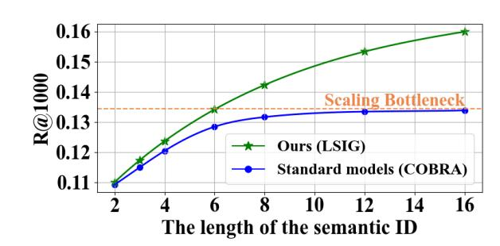
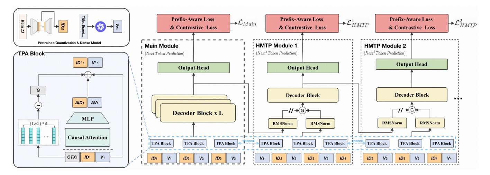
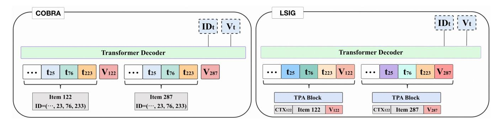
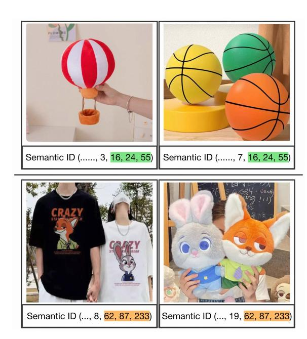
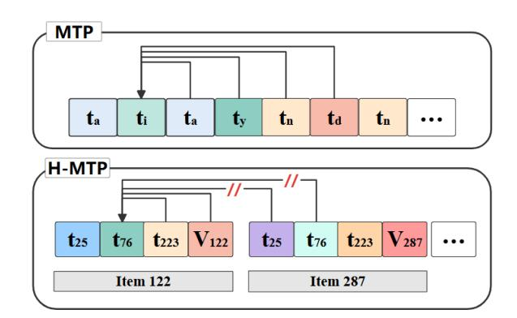
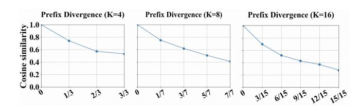
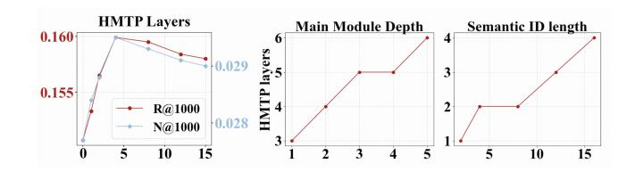

# LSIG: Long Semantic IDs for Generative Recommendation

Zhao Li∗ Zhejiang University Hangzhou, China Taotian Group Hangzhou, China 12307120@zju.edu.cn

FengYang Qi Taotian Group Hangzhou, China qifengyang.qfy@taobao.com

Chuanyu Xu Taotian Group Hangzhou, China tracy.xcy@taobao.com

Tao Zhang Taotian Group Hangzhou, China guyan.zt@taobao.com

Chengfu Huo Taotian Group Hangzhou, China chengfu.huocf@alibaba-inc.com

Peng Zhang† Zhejiang University Hangzhou, China pengz@zju.edu.cn

# Abstract

Semantic ID-based generative recommendation models tokenize each item into a small number of discrete tokens and directly predict item identifiers from user interaction sequences. This approach has gained increasing traction in industrial applications. However, current methods are typically limited to short semantic IDs (e.g., just 3-4 tokens), which imposes a bottleneck on hierarchical expressiveness and hinders the accuracy and diversity of sequential recommendations. To overcome this limitation, we propose LSIG, a hierarchy-aware model tailored for long semantic ID modeling. LSIG consists of three main modules including 1) Token Personalized Attention (TPA), which dynamically aggregates prefix information from all levels of the long semantic ID, effectively mitigating semantic ambiguity in deep-layer representations; 2) Hierarchical Multi-Token Prediction (HMTP), which explicitly captures the hierarchical dependencies among semantic tokens and avoids the local optima caused by traditional token-by-token prediction; and 3) Prefix-Aware Loss (PA Loss), which suppresses training noise arising from semantically incorrect paths, thereby accelerating model convergence and enhancing generalization. Extensive experiments on the Alibaba App demonstrate that our framework consistently outperforms strong baselines in both offline evaluation and online business metrics.

# CCS Concepts

### • Information systems → Recommender systems.

# Keywords

recommender system; Semantic ID; Generative Recall

### ACM Reference Format:

Zhao Li, FengYang Qi, Chuanyu Xu, Tao Zhang, Chengfu Huo, and Peng Zhang. 2026. LSIG: Long Semantic IDs for Generative Recommendation. In Proceedings of the ACM Web Conference 2026 (WWW '26), April 13–17,

∗Work done during internship at Taotian Group.

†Corresponding author.

[This work is licensed under a Creative Commons Attribution 4.0 International License.](https://creativecommons.org/licenses/by/4.0) WWW '26, Dubai, United Arab Emirates © 2026 Copyright held by the owner/author(s). ACM ISBN 979-8-4007-2307-0/2026/04 <https://doi.org/10.1145/3774904.3792834>

2026, Dubai, United Arab Emirates. ACM, New York, NY, USA, [10](#page-9-0) pages. <https://doi.org/10.1145/3774904.3792834>

# 1 Introduction

Recommendation systems are fundamental to e-commerce platforms, social networks, and content delivery services. Their primary goal is to infer users' potential interests and deliver personalized item suggestions by modeling user–item interactions [\[3,](#page-8-0) [7,](#page-8-1) [23\]](#page-8-2). In recent years, sequential recommendation methods have demonstrated substantial performance gains by leveraging the sequential nature of user interactions [\[2,](#page-8-3) [5,](#page-8-4) [29,](#page-8-5) [39\]](#page-8-6). Representative models such as SASRec [\[15\]](#page-8-7) and BERT4Rec [\[30\]](#page-8-8) have shown the effectiveness of sequence modeling in capturing user intent dynamics. More recently, generative models have pushed the boundaries of recommendation by treating item prediction as a sequence generation task [\[1,](#page-8-9) [36,](#page-8-10) [38\]](#page-8-11). However, conventional ID-based representations often struggle to capture the rich semantic attributes of items, especially in cold-start and long-tail scenarios. To address this limitation, recent studies have explored semantic ID-based recommendation, where each item is represented as a sequence of discrete tokens that encode semantic structure [\[10,](#page-8-12) [25,](#page-8-13) [27,](#page-8-14) [38,](#page-8-11) [44,](#page-8-15) [45\]](#page-9-1). These semantic IDs are typically obtained via discrete representation techniques such as product quantization (PQ) or vector quantization (VQ), enabling token-by-token generation of items in a generative framework. For instance, TIGER [\[25\]](#page-8-13) employs a residual quantization variational autoencoder (RQ-VAE) to encode item features into hierarchical semantic IDs, allowing semantically related items to share information. COBRA [\[37\]](#page-8-16) further enhances interpretability and generalization by generating coarse-to-fine hierarchical semantic IDs from dense embeddings.

Despite these advances, current semantic ID-based generative models often use short token sequences to represent items. For example, TIGER adopts only four tokens per item. This token budget may be insufficient for encoding rich item semantics, especially for complex or information-rich products [\[16\]](#page-8-17). Short semantic IDs limit the model's capacity to distinguish fine-grained item attributes, resulting in information loss and degraded performance in complex recommendation scenarios. While increasing the semantic ID length seems a natural remedy, we observe a diminishing return in efficiency. As shown in Figure [1,](#page-1-0) extending the token sequence

Figure 1: Merely increasing semantic ID length leads to a bottleneck in model efficiency. Our proposed LSIG significantly improves the scalability of semantic encoding.

length increases training cost (in FLOPs) without proportional performance gains, exposing a scaling bottleneck.

In this work, we analyze the underlying causes of the semantic ID scaling bottleneck and propose LSIG, a hierarchy-aware generative recommendation framework designed to more effectively leverage long semantic ID sequences. Developing such a model presents several key challenges:

(1) Semantic ambiguity caused by prefix-sensitive tokens. In long hierarchical semantic IDs, each token encodes part of the item's attributes in a coarse-to-fine manner. Since each token's semantics depend heavily on its preceding prefix, items with different prefixes but identical suffix tokens may exhibit inconsistent semantics. Feeding such discrete token sequences directly into the model can lead to ambiguity and degraded generation quality. Therefore, static token representations are insufficient to capture the contextual dependencies required for disambiguation. (2) Lack of explicit modeling of hierarchical dependencies. Most existing methods adopt a next-token prediction paradigm, which generates tokens greedily in a left-to-right manner. This stepwise strategy fails to capture the global dependencies across token layers. As a result, prediction errors in early tokens tend to propagate downward, leading to structurally invalid or incoherent semantic IDs. (3) Uneven semantic importance across token positions. In long semantic ID sequences, early tokens usually encode high-level category semantics that dominate the overall meaning, while later tokens carry fine-grained details. Uniformly optimizing all token positions may cause the model to overfit to less informative tail tokens, thus undermining its ability to learn the core semantic structure.

To address these challenges, we introduce LSIG, a framework with three key innovations:

- Token Personalized Attention (TPA). To dynamically refine each token's representation. By leveraging item category embeddings and prefix tokens, TPA mitigates semantic ambiguity caused by prefix variations.
- Hierarchical Multi-Token Prediction (HMTP). We propose an HMTP objective that synchronously predicts multiple subsequent tokens, combined with a Throttling Gate Unit to explicitly model the hierarchical dependencies within semantic IDs.

- Prefix-Aware Loss (PA Loss). To emphasize the semantic backbone of the ID, we introduce a prefix-aware loss function that dynamically truncates the loss computation to the longest correctly predicted prefix.

# 2 Related Work

# 2.1 Sequential Recommendation

In recent years, the generative paradigm has attracted significant research interest in recommendation systems. A representative approach models the recommendation task as a sequence generation problem, employing Transformer-based autoregressive architectures to generate personalized target item sequences from users' historical interactions, thereby enabling end-to-end modeling of recommendations [\[4,](#page-8-18) [8,](#page-8-19) [14,](#page-8-20) [32,](#page-8-21) [38\]](#page-8-11). SASRec [\[15\]](#page-8-7) performs autoregressive prediction using unidirectional self-attention mechanisms, whereas BERT4Rec [\[30\]](#page-8-8) employs bidirectional Transformers to enhance contextual modeling capabilities. The industrial deployment of GenRank [\[14\]](#page-8-20), MTGR [\[8\]](#page-8-19), and HSTU [\[38\]](#page-8-11) has also demonstrated the practical advancement of sequential recommendation techniques.

However, directly using spares, dynamically changing item IDs as model input tokens presents two major challenges: (1) IDs inherently exhibit sparsity and lack semantic clarity, hindering effective sequence pattern learning; (2) models demonstrate limited generalization capabilities for Cold-start items. To address these issues, researchers have explored encoding item modal features as discrete tokens (semantic IDs) [\[25\]](#page-8-13). This approach has driven the development of semantic ID-based sequential recommendation methods.

# 2.2 Semantic ID-based Recommendation

Semantic ID represents a sequence structure composed of discrete tokens that capture the semantic attributes of items. These tokens often possess hierarchical structures and are encoded through feature extraction from multiple modalities (e.g., text, images, interactions) [\[10,](#page-8-12) [17,](#page-8-22) [25,](#page-8-13) [28,](#page-8-23) [35,](#page-8-24) [41\]](#page-8-25). Construction methods include vector quantization [\[25,](#page-8-13) [34,](#page-8-26) [42,](#page-8-27) [43,](#page-8-28) [45,](#page-9-1) [47\]](#page-9-2), hierarchical clustering [\[13,](#page-8-29) [17,](#page-8-22) [26\]](#page-8-30), and joint training with recommendation models [\[19\]](#page-8-31). Compared to sparse item IDs, semantic IDs offer compact vocabularies, enhanced transferability and interpretability, and improved model scalability and inference efficiency [\[20,](#page-8-32) [24,](#page-8-33) [27,](#page-8-14) [38,](#page-8-11) [45\]](#page-9-1).

With the advancement of generative modeling, semantic IDs have increasingly been employed as token-level generation targets. Models generate each token sequentially to compose the semantic ID of candidate items. TIGER [\[25\]](#page-8-13) pioneered the complete implementation of semantic ID generation, utilizing RQ-VAE for hierarchical quantization of item content to enable token-level generative retrieval. COBRA [\[37\]](#page-8-16) introduced a two-stage generation framework, first generating semantic sparse IDs and subsequently refining them into semantic dense vectors to facilitate coarse-to-fine retrieval. Recent work such as OneRec [\[4\]](#page-8-18) has further utilized semantic IDs to unify retrieval, ranking, and generation tasks within a single architecture, enhancing model versatility and training efficiency. However, these approaches primarily focus on performance improvement through additional modalities or mechanisms, without thoroughly investigating the potential of models to exploit semantic encoding structures.

Figure 2: The overall framework of LSIG.

### 3 Preliminaries

In this section, we introduce the problem definition, the basic concepts, and the notations in this paper.

### 3.1 Problem Definition

We formulate this task as a sequential recommendation problem: Given a user's historical interaction sequence:

�� = {��1,��2, . . . ,����−1} (1)

where ���� denotes the user's interaction with an item at time step k, the objective is to predict the next potentially relevant item ���� :

ˆ���� = arg max ��∈I �� (�� | ��) (2)

where I denotes the set of all candidate items, and �� (�� | ��) represents the conditional probability distribution over items given the interaction history s. Unlike conventional approaches that rely on dense item IDs, this work introduces quantified semantic IDs as generation targets to explicitly model hierarchical semantic structures.

### 3.2 Quantified Semantic ID

Traditional item IDs are semantically meaningless discrete symbols, making it difficult to capture the structural relationships among items. To address this limitation, we adopt a discrete semantic representation mechanism that encodes each item as a semantic ID composed of multiple latent tokens. The construction of this representation involves the following steps:

- We apply a residual quantization variational autoencoder (RQ-VAE) to hierarchically quantize the high-dimensional feature vector of each item;
- At each quantization level, an index token is selected from a corresponding codebook, forming a hierarchical discrete token sequence, denoted as:

������ = {�� , �� (2) , . . . , �� (��) } (3)

where �� (��) ∈ Z(��) denotes the token selected at the ��-th layer, and Z(��) is the codebook associated with that layer. This hierarchical semantic ID not only preserves the semantic characteristics of items but also encodes their multi-level structural relationships, laying a solid foundation for downstream recommendation tasks.

### 3.3 Transformer Decoder

We employ a Transformer-based autoregressive decoder architecture. Each decoder block contains a multihead self-attention module, two add-and-norm modules, and a feed-forward network [\[33\]](#page-8-34). The decoding process is defined as:

ˆ������ = ��������������(����<�� ) (4)

where ˆ����(��) �� denotes the predicted semantic ID for the ��-th item. The model autoregressively generates the next item's semantic IDs in a token-by-token manner.

# 4 Methodology

This section presents our proposed LSIG framework, which enables efficient and coherent generation of semantic IDs by explicitly modeling and leveraging the hierarchical semantics embedded in long semantic identifiers. (1) We begin by introducing how Token Personalized Attention (TPA) transforms each item's sparse long semantic ID into a continuous representation to mitigate tokenlevel semantic ambiguity. (2) Next, we propose a Hierarchical Multi-Token Prediction (HMTP) mechanism that improves the model's ability to capture hierarchical dependencies within token sequences, thereby enhancing generation coherence. (3) We then design a Prefix-Aware Loss(PA Loss) that guides the model to optimize semantic ID generation in a coarse-to-fine manner, significantly boosting training efficiency and generalization capability. (4) Finally, we analyze the scalability of long semantic ID representations under different encoding depths (i.e., scaling laws), offering both theoretical insights and practical guidance for designing more expressive semantic encoding structures. The overall architecture of LSIG is illustrated in Figure [2.](#page-2-0)

Table 1: Performance comparison between baseline methods and LSIG. The best results are highlighted in bold, while the second-best results are underlined. LSIG statistically outperforms the best baselines at a significance level of �� &lt; 0.05 by paired t-test.

| Model    | R@5    | Sports N@5 | and Outdoors R@10 | N@10   | R@5      | N@5 Item | Beauty R@10 ID-based | N@10   | R@100  | N@100  | Ali_Rec R@1000 | N@1000 |
|----------|--------|------------|-------------------|--------|----------|----------|----------------------|--------|--------|--------|----------------|--------|
| Caser    | 0.0116 | 0.0072     | 0.0194            | 0.0097 | 0.0205   | 0.0131   | 0.0347               | 0.0176 | 0.0373 | 0.0097 | 0.0944         | 0.0160 |
| HGN      | 0.0189 | 0.0120     | 0.0313            | 0.0159 | 0.0325   | 0.0206   | 0.0512               | 0.0266 | 0.0419 | 0.0115 | 0.1027         | 0.0194 |
| GRU4Rec  | 0.0129 | 0.0086     | 0.0204            | 0.0110 | 0.0164   | 0.0099   | 0.0283               | 0.0137 | 0.0395 | 0.0109 | 0.0970         | 0.0163 |
| BERT4Rec | 0.0115 | 0.0075     | 0.0191            | 0.0099 | 0.0203   | 0.0124   | 0.0347               | 0.0170 | 0.0398 | 0.0111 | 0.0991         | 0.0181 |
| FDSA     | 0.0182 | 0.0122     | 0.0288            | 0.0156 | 0.0267   | 0.0163   | 0.0407               | 0.0208 | 0.0412 | 0.0114 | 0.1001         | 0.0185 |
| SASRec   | 0.0233 | 0.0154     | 0.0350            | 0.0192 | 0.0387   | 0.0249   | 0.0605               | 0.0318 | 0.0437 | 0.0119 | 0.1073         | 0.0196 |
| -Rec S   | 0.0251 | 0.0161     | 0.0385            | 0.0204 | 0.0387   | 0.0244   | 0.0647               | 0.0327 | 0.0445 | 0.0120 | 0.1089         | 0.0199 |
|          |        |            |                   |        | Semantic | ID-based |                      |        |        |        |                |        |
| VQ-Rec   | 0.0213 | 0.0147     | 0.0305            | 0.0177 | 0.0467   | 0.0321   | 0.0679               | 0.0393 | 0.0477 | 0.0129 | 0.1149         | 0.0212 |
| TIGER    | 0.0267 | 0.0186     | 0.0406            | 0.0229 | 0.0462   | 0.0327   | 0.0661               | 0.0391 | 0.0498 | 0.0135 | 0.1201         | 0.0221 |
| COBRA    | 0.0310 | 0.0218     | 0.0438            | 0.0261 | 0.0543   | 0.0404   | 0.0739               | 0.0466 | 0.0535 | 0.0153 | 0.1349         | 0.0255 |
| LSIG     | 0.0346 | 0.0243     | 0.0495            | 0.0295 | 0.0581   | 0.0435   | 0.0810               | 0.0508 | 0.0630 | 0.0176 | 0.1599         | 0.0295 |

4.3.2 Prefix-Aware Loss Function. To emphasize the hierarchical importance of token positions, we introduce a Prefix-Aware Loss that dynamically identifies the longest correctly predicted prefix of a semantic ID and only computes loss up to and including the first incorrect token. This approach guides the model to prioritize learning coarse-level token prediction before attending to finergrained layers. Formally, for each item, let the ground-truth semantic ID be: �� = [��1, ��2, . . . , ����] and the predicted semantic ID be: ��ˆ = -��ˆ 1,��ˆ 2, . . . ,��ˆ�� . We define the longest correctly predicted prefix as:

ℓ = max �� ∈ [0, ��] | ∀�� ≤ ��,��ˆ �� = ���� (12)

The Prefix-Aware Loss is then computed as the cumulative crossentropy over the first ℓ + 1 positions:

LPA = ∑︁ℓ+1 ��=1 CrossEntropy ��ˆ ℓ+1, ��ℓ+1 (13)

By dynamically adjusting the optimization scope during training, this loss avoids unnecessary updates to deep-layer tokens when upper-layer predictions are incorrect. It effectively suppresses gradient noise from semantically invalid paths, accelerates convergence, and ensures that the model first captures the high-level semantic structure before learning finer details.

4.3.3 Prefix-Aware Training in HMTP and Inference Decoupling. In LSIG, we apply the Prefix-Aware Loss to supervise each layer of the Hierarchical Multi-Token Prediction (HMTP) module. Specifically, for the ��-��ℎ layer of HMTP and the ��-��ℎ item in the user behavior sequence, we compute the corresponding prefix-aware loss L (��,��) PA . The overall HMTP loss is defined as:

LMTP = �� �� ∑︁�� ��=1 ∑︁�� ��=1 L (��,��) PA (14)

where H denotes the number of HMTP layers, T is the number of items in the user sequence, and �� is a scaling hyperparameter for balancing the loss. This objective enforces semantic coherence across token levels during training. During inference, we decouple HMTP from the main decoder and rely solely on the base model for token generation, thus ensuring efficient deployment without sacrificing training benefits.

### 5 Experiments

In this section, we empirically demonstrate the effectiveness and efficiency of the proposed LSIG method.

# 5.1 Experiment Setup

5.1.1 Datasets and Evaluation Metrics. We conduct experiments using two categories from the Amazon Reviews dataset [\[22\]](#page-8-38): "Sports and Outdoors" (Sports) and "Beauty" (Beauty), which are commonly used for benchmarking semantic ID-based generative recommendation methods [\[12,](#page-8-37) [25,](#page-8-13) [37\]](#page-8-16). To further evaluate scalability in realworld settings, we additionally use Ali\_Rec, a large-scale industrial dataset from the Alibaba e-commerce platform containing over 168 million recommendation sessions. We adopt a dual-perspective evaluation to assess both ranking accuracy and real-world recommendation impact:1) Offline Evaluation: Following the setup in Rajput et al. [\[25\]](#page-8-13), we evaluate performance on Recall@K and NDCG@K with �� ∈ {5, 10, 100, 1000}, using the best-performing checkpoint on the validation set. 2) Online Metrics: The primary evaluation metrics include conversion rate and Gross Merchandise Volume (GMV), which directly reflect user engagement and economic impact.

5.1.2 Baselines. We compare LSIG with a variety of representative baselines, including both item ID-based and semantic ID-based methods:

- Caser [\[31\]](#page-8-39): Employs convolutional filters to capture local patterns in item ID sequences.
- HGN [\[21\]](#page-8-40): Integrates gating mechanisms within an RNNbased model.
- GRU4Rec [\[9\]](#page-8-41): A GRU-based model tailored for session-based recommendation.
- BERT4Rec [\[30\]](#page-8-8): Utilizes a bidirectional Transformer encoder trained with a Cloze-style objective.
- FDSA [\[40\]](#page-8-42): Processes item ID and feature sequences independently via self-attention blocks.
- SASRec [\[15\]](#page-8-7): Leverages a Transformer decoder with binary cross-entropy loss to model item ID sequences.
- S3-Rec [\[46\]](#page-9-3): First pre-trains with self-supervised tasks to align item IDs and features, then fine-tunes on the next-item prediction task.
- VQ\_Rec [\[11\]](#page-8-43): VQ\_Rec employs product quantization to tokenize items into semantic IDs, which are then aggregated through embedding pooling to form the final item representations.
- TIGER [\[25\]](#page-8-13): Employs RQ-VAE for item quantization and generates semantic IDs autoregressively using beam search.
- COBRA [\[37\]](#page-8-16): A cascaded generation process is employed to alternately produce sparse semantic identifiers and dense representations, with inference facilitated by BeamFusion search.

5.1.3 Implementation Details. LSIG is trained using the Adam optimizer with an initial learning rate of 0.0016 and a batch size of 256. All experiments are conducted on NVIDIA H20 GPUs with 80GB of memory. We perform grid search for hyperparameter tuning and report the most optimal hyperparameter settings. Specifically, the model consists of �� = 2 decoder blocks, and �� = 4 HMTP layers. The semantic ID space is constructed using a codebook depth of �� = 16, with each layer containing �� = 256 codewords. We use the most recent �� = 50 historical behaviors as user context during training and inference. For generation, beam search is employed with a width of ���� = 10 sequences per inference.

# 5.2 Experimental Results and Discussion

5.2.1 Offline Evaluation. We benchmark LSIG on the Ali\_Rec dataset against both item ID-based and semantic ID-based baselines. Results are summarized in Table [1.](#page-5-0) Semantic ID-based methods consistently outperform traditional item ID-based baselines, highlighting the benefit of leveraging hierarchical semantics. Among all baselines, LSIG achieves the overall best performance, surpassing the strongest competitor by +18.53% in Recall@1000 and +15.69% in NDCG@1000 on average. As illustrated in Figure [1,](#page-1-0) LSIG also substantially improves the scalability of semantic encoding. To ensure a fair comparison, all semantic ID-based methods are evaluated with a fixed semantic ID length of 16 tokens.

5.2.2 Ablation Study. To disentangle component contributions, we conduct ablation studies, summarized in Table [2,](#page-6-0) and draw three key observations: 1) Effectiveness of TPA: Removing TPA results in significant performance drops, validating the hypothesis that sparse semantic encoding introduces ambiguity in token semantics. 2) HMTP for Inference Consistency: Disabling HMTP impairs

Table 2: Ablation analysis of LSIG.

| Variants Full Model | R@100 0.0630 | Δ (%)  | N@100 0.0176 | Δ (%)  |
|---------------------|--------------|--------|--------------|--------|
| Ours w/o TPA        | 0.0574       | -8.89% | 0.0164       | -6.82% |
| Ours w/o HMTP       | 0.0596       | -5.40% | 0.0165       | -6.25% |
| Ours w/o PA Loss    | 0.0603       | -4.29% | 0.0171       | -2.84% |

structural coherence during decoding and reduces the generation quality of semantic IDs. 3) Necessity of Prefix-Aware Loss: Eliminating Prefix-Aware Loss decreases the accuracy of coarse-grained token prediction and hinders generalization.

5.2.3 Online A/B Testing. To validate the real-world efficacy of LSIG, we deploy it on the Alibaba mobile app, serving over 12 million Daily Active Users (DAUs). In the domain targeted by our proposed strategy, LSIG achieves a 0.15% improvement in conversion and a 4.15% increase in GMV. These results indicate that LSIG not only enhances recommendation quality in offline evaluations but also delivers measurable business gains in real-world production environments.

### 6 Further Analysis

### 6.1 Prefix Sensitivity of TPA-Finetuned ID Embeddings

To assess the effectiveness of prefix-aware modeling in our Token Personalized Attention (TPA) framework, we analyze how the token embeddings evolve after finetuning. In particular, we examine the similarity of token embeddings at the same position across different items and investigate its relationship with prefix divergence. We define prefix divergence between two items as:

Prefix Divergence = 1 − Length of common prefix Total prefix length (15)

In conventional semantic ID models without TPA, token embeddings are position-dependent but context-independent. For instance, a token k at position 8 always yields the same embedding, regardless of the preceding tokens. In contrast, enabling TPA renders the token prefix-sensitive, as its embedding is dynamically modulated by the preceding sequence, even with the token and position held constant. To quantify this effect, we compute the cosine similarity of token embeddings at positions �� ∈ 4, 8, 16 under varying levels of prefix divergence. As shown in Figure [6,](#page-7-0) token similarity consistently decreases as prefix divergence increases, indicating that TPA successfully modulates token representations according to prefix information.

These findings confirm our core design intuition: prefix information plays a pivotal role in modeling the semantics of hierarchical token sequences. By incorporating a prefix-aware transformation mechanism, TPA generates more fine-grained and distinguishable token embeddings—an essential capability for accurately modeling items in recommendation systems.

Figure 6: Cosine similarity of token embeddings across different levels of prefix divergence after TPA finetuning.

Table 3: Computational ablation of the TPA module. The best scores are highlighted in bold, and the second-best are underlined.LSIG is configured with two Decoder layers and one TPA module (Decoder ×2 + TPA ×1).

| Variants  | R@100  | R@1000 | N@100  | N@1000 |
|-----------|--------|--------|--------|--------|
| decoder*2 | 0.0574 | 0.1461 | 0.0164 | 0.0274 |
| decoder*3 | 0.0591 | 0.1509 | 0.0169 | 0.0282 |
| LSIG      | 0.0630 | 0.1599 | 0.0176 | 0.0295 |

### 6.2 Computation Efficiency Ablation of TPA

To assess the computational cost introduced by the TPA module, we analyze its theoretical complexity and compare its runtime efficiency against standard decoder configurations. Unlike standard self-attention layers that operate over the entire user behavior sequence, TPA restricts attention computation to tokens within a single item. This results in a significantly reduced computational complexity. Formally, standard self-attention scales as ��(�� 2��), while the total complexity of all TPA amounts to ��(������), where �� is the sequence length, �� is the number of semantic ID tokens per item, and �� is the hidden size. Since �� ≪ ��, TPA imposes substantially lower computational overhead than a full-sequence decoder. To further quantify the efficiency-performance trade-off, we conduct an ablation study comparing three architectural variants: (1) COBRA (decoder × 2), (2) COBRA (decoder × 3), and (3) LSIG (decoder × 2 + TPA × 1).

As shown in Table [3,](#page-7-1) the results indicate that even when one decoder layer is replaced with a computationally efficient TPA block, the model consistently achieves superior performance across all metrics. This demonstrates that TPA not only maintains a low computational footprint but also enhances the model's expressiveness, making it a practical and effective component for real-world deployment.

### 6.3 Scalability Analysis of HMTP Depth

To evaluate how the depth of the Hierarchical Multi-Token Prediction (HMTP) module influences performance, we increase the prediction depth ���������� from 1 to 15 and evaluate Recall@1000 and NDCG@1000. The results are shown in Figure [7](#page-7-2) (Left). A clear scalability pattern is observed: as the HMTP depth increases, performance improves significantly up to depth 4, beyond which further gains diminish or slightly reverse. We attribute this to two main factors: 1. Semantic Relevance Decay: As the prediction horizon

Figure 7: (Left): Performance trend of HMTP with increasing prediction depth (ID length = 16; Main module depth = 2). (Middle, Right): Optimal HMTP layer configurations under varying semantic ID lengths and main module depths.

extends (e.g., �������� 15), the semantic correlation between long-range tokens weakens, reducing modeling benefit. 2. Model Capacity Limitation: The backbone network used in our experiments has only two decoder blocks, which may be insufficient to capture and propagate long-range dependencies introduced by deeper HMTP layers.

As shown in Figure [7](#page-7-2) (Middle and Right), to further validate the above analysis, we conduct extended experiments across different combinations of semantic ID lengths 2, 4, 8, 16 and backbone network depths 1, 2, 3, 4, 5, aiming to identify the optimal number of HMTP layers. Results indicate that longer semantic ID sequences benefit from deeper HMTP structures. Moreover, increasing the capacity of the backbone network effectively alleviates the bottleneck caused by limited HMTP depth. These findings validate the scalability and effectiveness of HMTP when appropriately aligned with model capacity and semantic ID length.

### 7 Conclusion

In this work, we propose LSIG, a generative recommendation framework leveraging long semantic IDs to represent items as sequences of hierarchical semantic tokens, thereby significantly enhancing the expressive capacity of recommendation models. We introduce the Token Personalized Attention (TPA) mechanism to effectively mitigate prediction confusion arising from semantic token ambiguity. During training, we design the Hierarchical Multi-Token Prediction (HMTP) module to explicitly model hierarchical semantic dependencies among tokens, incorporating a throttling gate mechanism to ensure consistency between training and inference phases. Additionally, we propose a Prefix-Aware Loss that dynamically emphasizes crucial prefix positions within semantic IDs, guiding the model to prioritize learning coarse-grained semantic structures, which leads to faster convergence and improved generalization. Extensive experiments demonstrate that LSIG achieves superior performance across various offline metrics and online scenarios. By effectively leveraging the hierarchical semantics of long semantic IDs, LSIG offers a robust and scalable solution for large-scale recommendation tasks.

### 8 Acknowledgments

This work was supported in part by the National Key Research and Development Program of China (Grant No. 2024YFC2511003) and Natural Science Foundation of Zhejiang Province (Project No. LDT23E05015A01).

### References

[1] Junyi Chen, Lu Chi, Bingyue Peng, and Zehuan Yuan. 2024. Hllm: Enhancing sequential recommendations via hierarchical large language models for item and user modeling. arXiv preprint arXiv:2409.12740 (2024). [2] Qiwei Chen, Huan Zhao, Wei Li, Pipei Huang, and Wenwu Ou. 2019. Behavior sequence transformer for e-commerce recommendation in alibaba. In Proceedings of the 1st international workshop on deep learning practice for high-dimensional sparse data. 1–4. [3] Heng-Tze Cheng, Levent Koc, Jeremiah Harmsen, Tal Shaked, Tushar Chandra, Hrishi Aradhye, Glen Anderson, Greg Corrado, Wei Chai, Mustafa Ispir, et al. 2016. Wide & deep learning for recommender systems. In Proceedings of the 1st workshop on deep learning for recommender systems. 7–10. [4] Jiaxin Deng, Shiyao Wang, Kuo Cai, Lejian Ren, Qigen Hu, Weifeng Ding, Qiang Luo, and Guorui Zhou. 2025. Onerec: Unifying retrieve and rank with generative recommender and iterative preference alignment. arXiv preprint arXiv:2502.18965 (2025). [5] Hao Fan, Mengyi Zhu, Yanrong Hu, Hailin Feng, Zhijie He, Hongjiu Liu, and Qingyang Liu. 2024. TiM4Rec: An Efficient Sequential Recommendation Model Based on Time-Aware Structured State Space Duality Model. arXiv preprint arXiv:2409.16182 (2024). [6] Fabian Gloeckle, Badr Youbi Idrissi, Baptiste Rozière, David Lopez-Paz, and Gabriel Synnaeve. [n. d.]. Better & faster large language models via multi-token prediction, 2024. URL https://arxiv. org/abs/2404.19737 ([n. d.]). [7] Huifeng Guo, Ruiming Tang, Yunming Ye, Zhenguo Li, and Xiuqiang He. 2017. DeepFM: a factorization-machine based neural network for CTR prediction. arXiv preprint arXiv:1703.04247 (2017). [8] Ruidong Han, Bin Yin, Shangyu Chen, He Jiang, Fei Jiang, Xiang Li, Chi Ma, Mincong Huang, Xiaoguang Li, Chunzhen Jing, et al. 2025. MTGR: Industrial-Scale Generative Recommendation Framework in Meituan. arXiv preprint arXiv:2505.18654 (2025). [9] Balázs Hidasi, Alexandros Karatzoglou, Linas Baltrunas, and Domonkos Tikk. 2015. Session-based recommendations with recurrent neural networks. arXiv preprint arXiv:1511.06939 (2015). [10] Yupeng Hou, Zhankui He, Julian McAuley, and Wayne Xin Zhao. 2023. Learning vector-quantized item representation for transferable sequential recommenders. In Proceedings of the ACM Web Conference 2023. 1162–1171. [11] Yupeng Hou, Zhankui He, Julian McAuley, and Wayne Xin Zhao. 2023. Learning vector-quantized item representation for transferable sequential recommenders. In Proceedings of the ACM Web Conference 2023. 1162–1171. [12] Yupeng Hou, Jiacheng Li, Ashley Shin, Jinsung Jeon, Abhishek Santhanam, Wei Shao, Kaveh Hassani, Ning Yao, and Julian McAuley. 2025. Generating Long Semantic IDs in Parallel for Recommendation. arXiv preprint arXiv:2506.05781 (2025). [13] Wenyue Hua, Shuyuan Xu, Yingqiang Ge, and Yongfeng Zhang. 2023. How to index item ids for recommendation foundation models. In Proceedings of the Annual International ACM SIGIR Conference on Research and Development in Information Retrieval in the Asia Pacific Region. 195–204. [14] Yanhua Huang, Yuqi Chen, Xiong Cao, Rui Yang, Mingliang Qi, Yinghao Zhu, Qingchang Han, Yaowei Liu, Zhaoyu Liu, Xuefeng Yao, et al. 2025. Towards Large-scale Generative Ranking. arXiv preprint arXiv:2505.04180 (2025). [15] Wang-Cheng Kang and Julian McAuley. 2018. Self-attentive sequential recommendation. In 2018 IEEE international conference on data mining (ICDM). IEEE, 197–206. [16] Doyup Lee, Chiheon Kim, Saehoon Kim, Minsu Cho, and Wook-Shin Han. 2022. Autoregressive image generation using residual quantization. In Proceedings of the IEEE/CVF Conference on Computer Vision and Pattern Recognition. 11523–11532. [17] Guanyu Lin, Zhigang Hua, Tao Feng, Shuang Yang, Bo Long, and Jiaxuan You. 2025. Unified semantic and ID representation learning for deep recommenders. arXiv preprint arXiv:2502.16474 (2025). [18] Aixin Liu, Bei Feng, Bing Xue, Bingxuan Wang, Bochao Wu, Chengda Lu, Chenggang Zhao, Chengqi Deng, Chenyu Zhang, Chong Ruan, et al. 2024. Deepseek-v3 technical report. arXiv preprint arXiv:2412.19437 (2024). [19] Enze Liu, Bowen Zheng, Cheng Ling, Lantao Hu, Han Li, and Wayne Xin Zhao. 2024. End-to-End Learnable Item Tokenization for Generative Recommendation. arXiv preprint arXiv:2409.05546 (2024). [20] Zihan Liu, Yupeng Hou, and Julian McAuley. 2024. Multi-behavior generative recommendation. In Proceedings of the 33rd ACM International Conference on Information and Knowledge Management. 1575–1585. [21] Chen Ma, Peng Kang, and Xue Liu. 2019. Hierarchical gating networks for sequential recommendation. In Proceedings of the 25th ACM SIGKDD international conference on knowledge discovery & data mining. 825–833. [22] Julian McAuley, Christopher Targett, Qinfeng Shi, and Anton Van Den Hengel. 2015. Image-based recommendations on styles and substitutes. In Proceedings of the 38th international ACM SIGIR conference on research and development in information retrieval. 43–52. [23] Gustavo Penha, Ali Vardasbi, Enrico Palumbo, Marco De Nadai, and Hugues Bouchard. 2024. Bridging Search and Recommendation in Generative Retrieval: Does One Task Help the Other?. In Proceedings of the 18th ACM Conference on Recommender Systems. 340–349. [24] Aleksandr V Petrov and Craig Macdonald. 2024. RecJPQ: training large-catalogue sequential recommenders. In Proceedings of the 17th ACM International Conference on Web Search and Data Mining. 538–547. [25] Shashank Rajput, Nikhil Mehta, Anima Singh, Raghunandan Hulikal Keshavan, Trung Vu, Lukasz Heldt, Lichan Hong, Yi Tay, Vinh Tran, Jonah Samost, et al. 2023. Recommender systems with generative retrieval. Advances in Neural Information Processing Systems 36 (2023), 10299–10315. [26] Zihua Si, Zhongxiang Sun, Jiale Chen, Guozhang Chen, Xiaoxue Zang, Kai Zheng, Yang Song, Xiao Zhang, Jun Xu, and Kun Gai. 2023. Generative retrieval with semantic tree-structured item identifiers via contrastive learning. arXiv preprint arXiv:2309.13375 (2023). [27] Anima Singh, Trung Vu, Nikhil Mehta, Raghunandan Keshavan, Maheswaran Sathiamoorthy, Yilin Zheng, Lichan Hong, Lukasz Heldt, Li Wei, Devansh Tandon, et al. 2024. Better generalization with semantic ids: A case study in ranking for recommendations. In Proceedings of the 18th ACM Conference on Recommender Systems. 1039–1044. [28] Anima Singh, Trung Vu, Nikhil Mehta, Raghunandan Keshavan, Maheswaran Sathiamoorthy, Yilin Zheng, Lichan Hong, Lukasz Heldt, Li Wei, Devansh Tandon, et al. 2024. Better generalization with semantic ids: A case study in ranking for recommendations. In Proceedings of the 18th ACM Conference on Recommender Systems. 1039–1044. [29] Weiping Song, Chence Shi, Zhiping Xiao, Zhijian Duan, Yewen Xu, Ming Zhang, and Jian Tang. 2019. Autoint: Automatic feature interaction learning via selfattentive neural networks. In Proceedings of the 28th ACM international conference on information and knowledge management. 1161–1170. [30] Fei Sun, Jun Liu, Jian Wu, Changhua Pei, Xiao Lin, Wenwu Ou, and Peng Jiang. 2019. BERT4Rec: Sequential recommendation with bidirectional encoder representations from transformer. In Proceedings of the 28th ACM international conference on information and knowledge management. 1441–1450. [31] Jiaxi Tang and Ke Wang. 2018. Personalized top-n sequential recommendation via convolutional sequence embedding. In Proceedings of the eleventh ACM international conference on web search and data mining. 565–573. [32] Yubao Tang, Ruqing Zhang, Jiafeng Guo, and Maarten de Rijke. 2023. Recent advances in generative information retrieval. In Proceedings of the Annual International ACM SIGIR Conference on Research and Development in Information Retrieval in the Asia Pacific Region. 294–297. [33] Ashish Vaswani, Noam Shazeer, Niki Parmar, Jakob Uszkoreit, Llion Jones, Aidan N Gomez, Łukasz Kaiser, and Illia Polosukhin. 2017. Attention is all you need. Advances in neural information processing systems 30 (2017). [34] Wenjie Wang, Honghui Bao, Xinyu Lin, Jizhi Zhang, Yongqi Li, Fuli Feng, See-Kiong Ng, and Tat-Seng Chua. 2024. Learnable tokenizer for llm-based generative recommendation. arXiv e-prints (2024), arXiv–2405. [35] Ye Wang, Jiahao Xun, Minjie Hong, Jieming Zhu, Tao Jin, Wang Lin, Haoyuan Li, Linjun Li, Yan Xia, Zhou Zhao, et al. 2024. EAGER: Two-Stream Generative Recommender with Behavior-Semantic Collaboration. In Proceedings of the 30th ACM SIGKDD Conference on Knowledge Discovery and Data Mining. 3245–3254. [36] Shuyuan Xu, Wenyue Hua, and Yongfeng Zhang. 2024. Openp5: An open-source platform for developing, training, and evaluating llm-based recommender systems. In Proceedings of the 47th International ACM SIGIR Conference on Research and Development in Information Retrieval. 386–394. [37] Yuhao Yang, Zhi Ji, Zhaopeng Li, Yi Li, Zhonglin Mo, Yue Ding, Kai Chen, Zijian Zhang, Jie Li, Shuanglong Li, et al. 2025. Sparse meets dense: Unified generative recommendations with cascaded sparse-dense representations. arXiv preprint arXiv:2503.02453 (2025). [38] Jiaqi Zhai, Lucy Liao, Xing Liu, Yueming Wang, Rui Li, Xuan Cao, Leon Gao, Zhaojie Gong, Fangda Gu, Michael He, et al. 2024. Actions speak louder than words: Trillion-parameter sequential transducers for generative recommendations. arXiv preprint arXiv:2402.17152 (2024). [39] Gaowei Zhang, Yupeng Hou, Hongyu Lu, Yu Chen, Wayne Xin Zhao, and Ji-Rong Wen. 2024. Scaling law of large sequential recommendation models. In Proceedings of the 18th ACM Conference on Recommender Systems. 444–453. [40] Tingting Zhang, Pengpeng Zhao, Yanchi Liu, Victor S Sheng, Jiajie Xu, Deqing Wang, Guanfeng Liu, Xiaofang Zhou, et al. 2019. Feature-level deeper selfattention network for sequential recommendation.. In IJCAI. 4320–4326. [41] Bowen Zheng, Yupeng Hou, Hongyu Lu, Yu Chen, Wayne Xin Zhao, Ming Chen, and Ji-Rong Wen. 2024. Adapting large language models by integrating collaborative semantics for recommendation. In 2024 IEEE 40th International Conference on Data Engineering (ICDE). IEEE, 1435–1448. [42] Bowen Zheng, Enze Liu, Zhongfu Chen, Zhongrui Ma, Yue Wang, Wayne Xin Zhao, and Ji-Rong Wen. 2025. Pre-training Generative Recommender with Multi-Identifier Item Tokenization. arXiv preprint arXiv:2504.04400 (2025). [43] Bowen Zheng, Hongyu Lu, Yu Chen, Wayne Xin Zhao, and Ji-Rong Wen. 2025. Universal Item Tokenization for Transferable Generative Recommendation. arXiv preprint arXiv:2504.04405 (2025). [44] Bowen Zheng, Junjie Zhang, Hongyu Lu, Yu Chen, Ming Chen, Wayne Xin Zhao, and Ji-Rong Wen. 2024. Enhancing Graph Contrastive Learning with Reliable and Informative Augmentation for Recommendation. arXiv preprint arXiv:2409.05633

(2024). [45] Carolina Zheng, Minhui Huang, Dmitrii Pedchenko, Kaushik Rangadurai, Siyu Wang, Gaby Nahum, Jie Lei, Yang Yang, Tao Liu, Zutian Luo, et al. 2025. Enhancing Embedding Representation Stability in Recommendation Systems with Semantic ID. arXiv preprint arXiv:2504.02137 (2025). [46] Kun Zhou, Hui Wang, Wayne Xin Zhao, Yutao Zhu, Sirui Wang, Fuzheng Zhang, Zhongyuan Wang, and Ji-Rong Wen. 2020. S3-rec: Self-supervised learning for sequential recommendation with mutual information maximization. In Proceedings of the 29th ACM international conference on information & knowledge management. 1893–1902. [47] Jieming Zhu, Mengqun Jin, Qijiong Liu, Zexuan Qiu, Zhenhua Dong, and Xiu Li. 2024. CoST: Contrastive Quantization based Semantic Tokenization for Generative Recommendation. In Proceedings of the 18th ACM Conference on Recommender Systems. 969–974.