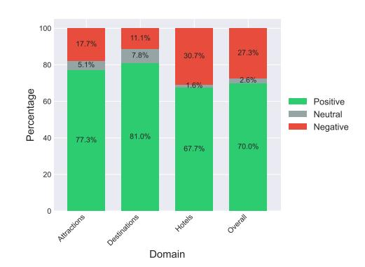
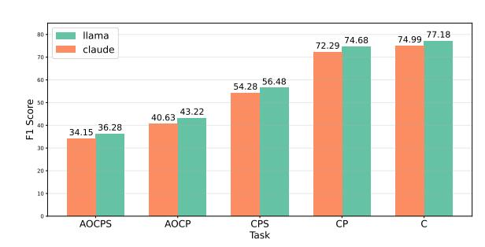
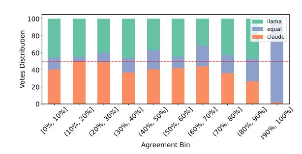
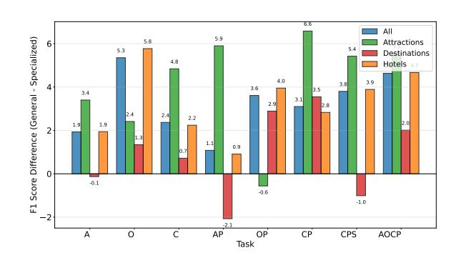
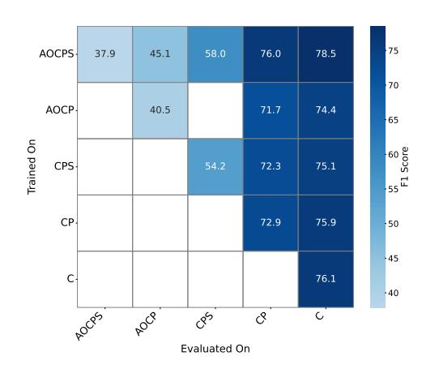
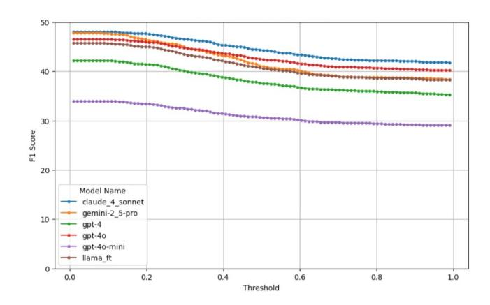
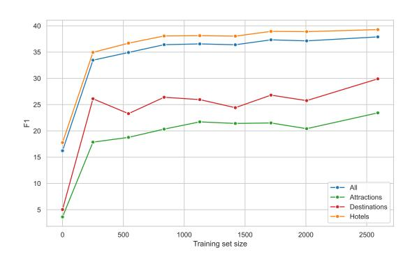

# TRABL: A Unified Framework for Travel Domain Aspect-Based Sentiment Analysis Applications of Large Language Models

[Omer Madmon](https://orcid.org/0009-0001-4009-0368)∗ Technion - Israel Institute of Technology Haifa, Israel Booking.com Tel Aviv, Israel omermadmon@campus.technion.ac.il

[Shiran Golan](https://orcid.org/0009-0009-9092-9828) Booking.com Tel Aviv, Israel shiran.golan@booking.com

[Eran Fainman](https://orcid.org/0009-0004-3898-2086) Booking.com Tel Aviv, Israel eran.fainman@booking.com

[Ofri Kleinfeld](https://orcid.org/0009-0007-0453-2230) Booking.com Tel Aviv, Israel ofri.kleinfeld@booking.com

[Moran Beladev](https://orcid.org/0009-0005-4779-9272) Booking.com Tel Aviv, Israel moran.beladev@booking.com

## Abstract

Large Language Models (LLMs) are increasingly being integrated into online travel platforms, where they enable applications such as recommendation, property type detection, review summarization, and content generation. Although these applications differ in scope, they share a common need to extract structured information from user reviews. We introduce TRABL, a unified framework for travel-domain aspect-based sentiment analysis (ABSA) applications, which extends the standard quad prediction ABSA task by additionally requiring the extraction of supporting text snippets that serve as evidence for the extracted tuples. To support this framework, we collect and annotate a dataset of user reviews spanning hotels, attractions, and destinations. We benchmark state-of-theart commercial LLMs on this dataset and show that our in-house lightweight model, fine-tuned on travel-domain data, achieves performance on par with significantly larger commercial models across ABSA tasks. We then show that a single unified model, trained to predict all ABSA fields jointly, consistently outperforms models specialized for individual subtasks. Beyond quantitative results, we also share insights from task design, annotation, evaluation, and deployment, highlighting the practical considerations involved in productizing LLMs within online travel platforms.

## CCS Concepts

• Computing methodologies → Information extraction; Natural language generation.

## Keywords

Aspect-Based Sentiment Analysis, Large Language Models, Fine-Tuning, Online Travel Platforms, User Reviews.

∗This project was conducted during the author's PhD internship at Booking.com.

[This work is licensed under a Creative Commons Attribution 4.0 International License.](https://creativecommons.org/licenses/by/4.0) WWW '26, Dubai, United Arab Emirates. © 2026 Copyright held by the owner/author(s). ACM ISBN 979-8-4007-2307-0/2026/04 <https://doi.org/10.1145/3774904.3792835>

#### ACM Reference Format:

Omer Madmon, Shiran Golan, Eran Fainman, Ofri Kleinfeld, and Moran Beladev. 2026. TRABL: A Unified Framework for Travel Domain Aspect-Based Sentiment Analysis Applications of Large Language Models. In Proceedings of the ACM Web Conference 2026 (WWW '26), April 13–17, 2026, Dubai, United Arab Emirates. ACM, New York, NY, USA, [12](#page-11-0) pages. [https:](https://doi.org/10.1145/3774904.3792835) [//doi.org/10.1145/3774904.3792835](https://doi.org/10.1145/3774904.3792835)

"The room was spacious but the bathroom was dirty."

Aspect term: "room" Aspect category: hotel facilities Opinion span: "spacious" Sentiment polarity: Positive Snippet: "The room was spacious"

Aspect term: "bathroom" Aspect category: hotel facilities Opinion span: "dirty" Sentiment polarity: Negative Snippet: "the bathroom was dirty"

Figure 1: Illustration of quad prediction with snippet extraction: given an input review, the system outputs aspect–category–opinion–sentiment tuples with a supporting evidence snippet. Different downstream applications (property recommendation, type detection, review summarization) consume different subsets of extracted fields.

## 1 Introduction

Large Language Models (LLMs) are increasingly being integrated into Online Travel Platforms (OTPs), where they enable a wide range of applications that rely on user-generated reviews, such as topic modeling, conversational AI trip planning, accommodation description generation, and more [\[4,](#page-8-0) [29,](#page-8-1) [36\]](#page-9-0). A central challenge in many travel industry applications is to distill fine-grained insights from vast amounts of unstructured textual data. In particular, platforms often require extracting structured information on specific aspects mentioned in reviews, together with the associated sentiments or classified categories.

These tasks fall under the umbrella of aspect-based sentiment analysis (ABSA), a family of tasks that focus on extracting structured sentiment information from text [\[5,](#page-8-2) [19,](#page-8-3) [24\]](#page-8-4). In its most general form, famously known as aspect sentiment quad prediction (ASQP) [\[38\]](#page-9-1), the goal is to identify the aspect terms of an entity (e.g., a hotel's location, staff, or cleanliness), classify them into broader aspect categories (e.g., service or facilities), extract the opinions expressed toward them, and determine the corresponding sentiment polarity. As such, the ABSA framework provides a natural formulation for many use cases in OTPs, where structured insights about destinations, attractions, and accommodations are critical for downstream applications such as recommendation, summarization, and personalization.

Recent research in ABSA has shifted from pipeline architectures [\[22,](#page-8-5) [23\]](#page-8-6) to unified frameworks that jointly address multiple subtasks [\[27\]](#page-8-7). Generative approaches have become especially prominent, casting ABSA as a text generation problem to mitigate error propagation and capture richer semantics [\[11,](#page-8-8) [21,](#page-8-9) [32,](#page-8-10) [35,](#page-9-2) [39](#page-9-3)[–41\]](#page-9-4), along with subsequent refinements via ordering strategies [\[12,](#page-8-11) [14\]](#page-8-12) and contrastive learning [\[34\]](#page-8-13). In parallel, tagging-based methods frame ABSA as span-labeling, offering greater efficiency and reduced decoding ambiguity [\[26\]](#page-8-14).

While these specialized approaches have advanced ABSA considerably, the emergence of large language models (LLMs) introduces a broader paradigm shift. [\[8,](#page-8-15) [17,](#page-8-16) [25,](#page-8-17) [31,](#page-8-18) [33,](#page-8-19) [37\]](#page-9-5). Unlike traditional generative or tagging-based models, which are typically trained for narrowly defined subtasks, the broad pretraining of LLMs endows them with strong contextual understanding, domain-agnostic world knowledge, and the ability to adapt flexibly through prompting or light fine-tuning. This enables LLMs to handle the noisy and diverse language of user-generated reviews, generalize across different domains, and transfer between related tasks [\[20\]](#page-8-20). Moreover, their compositional reasoning abilities make them especially well-suited for complex ABSA that goes beyond the traditional ones, such as extracting supporting snippets from the original text to justify the extracted aspect-sentiment tuples.

Unifying multiple real-world travel applications into an ABSA framework offers several key practical benefits. First, it enables solving diverse problems—such as topic classification, sentiment extraction, and snippet identification—within a single modeling paradigm, reducing the need to maintain separate solutions for each task. Second, as demonstrated by our analysis, training models jointly on multiple ABSA subtasks consistently improves performance: extracting auxiliary fields (e.g., aspect terms or snippets) steers the model toward more accurate predictions, even when these fields are not directly consumed downstream. Finally, a unified view facilitates more systematic evaluation and comparison across models, making it easier to assess trade-offs between generalization, domain adaptation, and task specialization. In light of

these advantages, we investigate how LLMs can be applied to OTPs within a unified ABSA framework. Our contributions are:

- We introduce TRABL: A unified framework for Travel-domain ABSA applications of LLMs. Our framework extends the quad prediction task by requiring the extraction of text snippets that provide evidence for the correctness and relevance of the extracted tuples.
- We collect and annotate a dataset of 3783 user reviews covering hotels, attractions, and destinations. The dataset is publicly available for the benefit of the research community.[1](#page-1-0)
- We benchmark state-of-the-art LLMs on this dataset, evaluating their performance across multiple tasks and metrics, and compare them to an in-house, lightweight model that was fine-tuned on travel-domain data.
- We compare the performance of generalized models trained on ABSA supertasks to that of specialized models designed for individual subtasks, showing that a unified model consistently outperforms task-specific ones.
- We share insights and decisions made throughout the process—from task definition to data creation, model evaluation, and eventual deployment—highlighting the practical considerations of productizing LLMs in OTPs.

## 2 Real-World Applications

Extracting structured information from user reviews is particularly important for the travel domain, where reviews are not only abundant but also highly influential in shaping user decisions and platform outcomes. We highlight three representative real-world use cases within OTPs where ABSA subtasks, as formalized in the TRABL framework, are directly employed for downstream applications such as recommendation, summarization, and personalization. For each of the applications, a different set of ABSA fields is needed.

Property Recommendation. Customer reviews are a rich source of structured signals reflecting traveler preferences and experiences. By applying ABSA to reviews, platforms can aggregate category–sentiment predictions at the property level to derive meaningful attributes such as a property's relevance for themes like beach, spa/wellness, or family-friendly. These derived attributes enhance recommendation engines by (i) improving coverage (e.g., increasing the number of properties surfaced for "beach" queries, including those near a beach but not tagged as such in metadata), and (ii) enabling novel categories that are otherwise difficult to construct (e.g., "castle-style hotels" or "romantic getaways"). Because the attributes are linked back to the originating reviews, this approach also provides a natural mechanism for explainable recommendations: recommendations can be justified by snippets that explicitly mention relevant categories.

Property Type Detection. The metadata provided by the property owners is often incomplete or inconsistent. ABSA enables platforms to infer hidden property categorizations by analyzing review-level mentions of property type (e.g., guest house, farm stay, resort,chalet). For instance, an apartment described by multiple guests as a "guest house" can be surfaced in search results for that category. At scale,

1<https://huggingface.co/datasets/Booking-com/absa-dataset>

this approach unlocks substantial additional supply, with hundreds of thousands of properties recategorized into relevant types (e.g., apartments, villas, chalets), improving both recall and relevance in search and filtering.

Property Description Generation and Review Summarization. Instead of relying on template-based or manually written property descriptions, ABSA enables highlighting of the most salient aspects of a property (e.g., excellent location, cleanliness, breakfast quality), with snippets grounding these claims in authentic guest feedback. ABSA also supports review summarization by aggregating evidence across all reviews into a concise, aspect-aware overview of guest experiences. Whereas property descriptions emphasize the most important selling points, review summaries offer a balanced and comprehensive synthesis of opinions, helping users quickly grasp overall satisfaction and the trade-offs across aspects.

For each of these applications, a different combination of ABSA fields is required. For example, recommendation relies primarily on categories aggregated with sentiment, type detection requires categories that capture property type mentions, properties generation and summarization depend on extracting category, sentiment and supporting snippets. This illustrates the flexibility of ABSA as a unified framework, where the same underlying tasks can be recomposed to support diverse downstream needs.

## 3 The **TRABL** Framework

To unify the use cases described in Section [2,](#page-1-1) TRABL formalizes a general Aspect-Based Sentiment Analysis (ABSA) task, with the individual cases instantiated as specific subtasks. In particular, we extend the standard aspect sentiment quad prediction (ASQP) task by introducing quad prediction with snippet extraction (QPSE), in which the system is required not only to identify the four interconnected sentiment elements–aspect term, aspect category, opinion term, and sentiment polarity–but also to extract a text snippet from the input that provides evidence for the predicted quad.

Formally, given an input text �� , the task is to output a set of tuples {(a, c, o, p,s)}, where a is the aspect term (explicit mention of the target, e.g., "room"); c ∈ C is its semantic category (e.g., "hotel facilities") taken from a predefined category set C; o is the evaluative expression, i.e., opinion (e.g., "spacious"); p ∈ {positive, negative, neutral} is the sentiment polarity; and s is a contiguous span from �� serving as evidence for the specific (a, c, o, p).

Tuples must be consistent: each evidence snippet should clearly support the corresponding aspect, category, opinion, and sentiment. This formulation enriches the traditional aspect-based sentiment analysis (ABSA) task by explicitly grounding predictions in textual evidence, enabling more interpretable and verifiable sentiment analysis models. Figure [1](#page-0-0) provides a simple example.[3](#page-2-1)

Snippet Ambiguity. Rationalization of information extracted from text is known to be a highly ambiguous task [\[6\]](#page-8-21). Even in simple cases such as the example in Figure [1,](#page-0-0) the appropriate form of the extracted snippet is not always clear. The outputs shown there represent the minimal spans sufficient to justify the associated aspect, opinion, and sentiment labels. Yet, one could equally take the entire review sentence as the snippet, which would still provide valid evidence. This inherent ambiguity contrasts with the other extracted fields—aspect, category, opinion, and sentiment—whose definitions and boundaries are typically more precise. Consequently, snippet extraction adds complexity to both data annotation and model evaluation. To mitigate this, we adopt the guideline that snippets must (i) justify the other fields and (ii) be coherent stand-alone text that could plausibly be shown to end users. Within these constraints, annotators and models are instructed to select the shortest possible coherent snippet.

Evaluation. Following prior work in ABSA [\[11,](#page-8-8) [21,](#page-8-9) [32,](#page-8-10) [35,](#page-9-2) [39–](#page-9-3)[41\]](#page-9-4), we report precision, recall, and F1 as our primary evaluation metrics, computed over predicted and gold tuples. A prediction is considered correct if all evaluated fields match exactly. When s is evaluated, correctness additionally requires that the predicted snippet longest common substring (LCS) Jaccard overlap [\[13\]](#page-8-22) with the gold snippet exceeds a threshold �� (see Appendix [A](#page-9-6) for details).[4](#page-2-2)

Tasks. The most general task in our framework is (a, o, c, p,s), which requires jointly predicting all five fields. To connect with prior work, we also report results on (a, o, c, p), the standard quad prediction task without snippets [\[38\]](#page-9-1). Beyond these, we evaluate on (c), (c, p), and (c, p,s), which capture coarser granularities motivated by downstream applications (see Section [2\)](#page-1-1). Specifically, (c) evaluates only semantic categories, (c, p) considers both category and sentiment, and (c, p,s) adds snippet evidence. This family of subtasks enables us to assess model performance not only on the full structured prediction problem but also on partial components that can function as standalone models for specific tasks.

Importantly, separate subtasks do not require training separate models. Given predictions for the general task (a, o, c, p,s), we can obtain results for any subtask by simply ignoring the fields that are not part of the subtask when computing matches. This unified view reduces maintenance and deployment costs by allowing a single model to support multiple downstream applications, and more broadly it encourages models that generalize beyond any single application, making them easier to integrate into new use cases. The benefits of utilizing a single model for different subtasks are discussed in Section [6.3.](#page-5-0)

## 4 Data Collection and Annotation

Categories. Our internal review corpus is stored alongside category labels generated by the Text2Topic model [\[29\]](#page-8-1), using a predefined taxonomy of 239 categories. These categories are hierarchical, with a nested structure that can introduce substantial ambiguity for the ABSA task.[5](#page-2-3) In addition, large category inventories pose practical challenges for both human and LLM-based annotators, who are subject to attention limits and may struggle to maintain

2A single (a, o, p,s) tuple may correspond to multiple categories, in which case it is duplicated so that all are credited. Some fields may also be absent: e.g., "amazing!" lacks aspect or opinion terms, or if no category in the closed list applies, the category field remains empty.

3While the example contains a single-sentence review for simplicity, in practice, reviews vary widely in length, style, and structure, which adds to the task complexity.

4Unless otherwise specified, we set �� = 0.9, calibrated via manual inspection to capture the level of evidence alignment necessary for downstream applications. See Appendix [B](#page-9-7) for threshold ablation.

For example, the categories food and food value for money have a hierarchical relationship, which often makes it difficult for annotators to decide between them.

| Split | Attractions | Destinations | Hotels | Total |
|-------|-------------|--------------|--------|-------|
| Train | 409         | 418          | 2057   | 2884  |
| Val   | 50          | 42           | 357    | 449   |
| Test  | 40          | 28           | 382    | 450   |
| Total | 499         | 488          | 2796   | 3783  |

Table 1: Number of reviews for each domain and split.

| Fields     | Agreement (%) |
|------------|---------------|
| Aspect     | 85.68         |
| Category   | 88.34         |
| Opinion    | 82.06         |
| Sentiment  | 96.21         |
| Snippet    | 92.70         |
| Sent.-Cat. | 86.40         |
| Sent.-Asp. | 83.66         |
| Quad       | 68.71         |
| All        | 67.32         |

Table 2: Annotator agreement with respect to different subsets of extracted fields.

consistent fine-grained distinctions. To overcome this, we first removed rare categories appearing in fewer than 1% of the reviews. We then manually merged semantically similar categories that are indistinguishable for the intended applications of this project. This process resulted in a final list of 112 categories.

Reviews. Using the refined category list, we sampled English reviews covering hotels, destinations, and attractions. These domains differ not only in style and topics but also in structure: hotel reviews are divided into a title and separate positive/negative sections, whereas attraction and destination reviews consist of plain text only. Since the raw distribution is heavily skewed toward hotels, we oversampled non-hotel reviews to achieve a more balanced dataset.[6](#page-3-0) We also used the Text2Topic to guide a slight oversampling of underrepresented categories.[7](#page-3-1) The resulting dataset contains 3,783 reviews, partitioned into train, validation, and test splits.[8](#page-3-2) Table [1](#page-3-3) summarizes the reviews distribution across domains and splits. Throughout this pipeline, reviews were preprocessed under our company guidelines, making sure PII policies are fully met.

Annotation. ABSA annotation is both inherently subjective and tedious, making it particularly challenging. We used SuperAnnotate

| Domain       | Annotator | 1 Annotator | 2 Overall |
|--------------|-----------|-------------|-----------|
| Attractions  | 5.07      | 4.80        | 4.93      |
| Destinations | 5.78      | 5.32        | 5.55      |
| Hotels       | 7.20      | 7.10        | 7.15      |
| Overall      | 6.74      | 6.57        | 6.65      |

Table 3: Average number of blocks by domain and annotator.

Figure 2: Sentiment distribution by review domain.

[\[28\]](#page-8-24) for the annotation process, and developed a pipeline that ensures continuous supervision and iterative improvement of the guidelines, in order to produce a reliable dataset.

Stage I: We manually tagged a sample of 100 reviews and tested gpt-4o as an automatic tagger by comparing its outputs against our ground-truth annotations. This stage involved preliminary prompt engineering, through which we developed a prompt that yielded reasonable results.

Stage II: We conducted a proof-of-concept (POC) annotation experiment with another sample of 60 reviews.[9](#page-3-4) We used gpt-4o to generate initial taggings and prepared annotation guidelines instructing annotators to correct the initial tags by adding missing tuples, editing existing ones, or removing redundant ones.[10](#page-3-5) Each review was independently annotated by two annotators. We manually reviewed these annotations to refine both the annotator guidelines and the LLM prompts.

Stage III: We employed a mixture of commercial LLMs with our refined prompt to generate taggings for all reviews, which also served as our baseline methods. For annotation, we randomly split the reviews into groups, each tagged initially by a different LLM.[11](#page-3-6) Annotators then corrected these initial tags according to the same procedure as in the POC stage. Again, each review was annotated by two annotators. We then applied several normalization procedures to the two annotations (detailed in Appendix [C\)](#page-9-8).

Agreement. Annotators' agreement was measured using the F1 score, treating one annotator's output as prediction and the other's

6We did not enforce a fully balanced distribution across domains. Sampling strictly according to the true distribution would yield too few non-hotel reviews, but making the dataset completely balanced would distort the corpus statistics. Our compromise was to oversample non-hotel reviews so that each domain is sufficiently represented (at least 450 samples), while keeping the aggregate distribution close to the original. 7We first sampled 5,000 reviews, and then greedily removed reviews in random order to balance the category distribution. Specifically, we removed reviews that contained only frequent categories (those with relative frequency in the top 95% percentile) and no rare categories (those in the bottom 5% percentile), until we reached the target number of reviews. This balancing was applied separately within each domain. 8 Importantly, our test set size aligns with prior ABSA benchmarks, such as OATS [\[7\]](#page-8-23).

9This sample was sufficient to identify common pitfalls and inconsistencies in tagging, sparing us the need for an additional small batch before the entire dataset annotation. 10The guidelines also included the full list of categories with explanations.

11This practice mitigates bias towards a specific model when comparing commercial models' performance.

|              | Recall | ( c , p , s Precision | ) F1  | Recall | ( c , p ) Precision | F1    | Recall | ( c ) Precision | F1    |
|--------------|--------|-----------------------|-------|--------|---------------------|-------|--------|-----------------|-------|
| claude-4     | 54.60  | 66.61                 | 60.01 | 69.12  | 83.96               | 75.82 | 71.50  | 86.35           | 78.23 |
| gemini-2.5   | 61.66  | 50.93                 | 55.78 | 80.94  | 72.16               | 76.30 | 82.96  | 74.56           | 78.54 |
| gpt-4        | 50.39  | 57.77                 | 53.83 | 67.32  | 75.46               | 71.16 | 70.00  | 78.36           | 73.94 |
| gpt-4o       | 51.58  | 66.70                 | 58.17 | 65.33  | 82.90               | 73.07 | 67.88  | 85.75           | 75.78 |
| gpt-4o-mini  | 41.02  | 57.21                 | 47.78 | 53.87  | 75.71               | 62.95 | 56.09  | 78.77           | 65.52 |
| llama-3.1-ft | 54.94  | 61.45                 | 58.01 | 71.97  | 80.47               | 75.98 | 74.31  | 83.20           | 78.51 |

Table 4: LLM performance in application-driven ABSA subtasks (c, p,s), (c, p), and (c). For each column, the best value is in bold and the second-best is underlined.

|              | Recall | ( a , o , c , Precision | p , s ) F1 | Recall | ( a , o , c , Precision | p ) F1 |
|--------------|--------|-------------------------|------------|--------|-------------------------|--------|
| claude-4     | 38.30  | 46.51                   | 42.00      | 43.73  | 53.14                   | 47.98  |
| gemini-2.5   | 43.11  | 34.00                   | 38.01      | 53.25  | 42.11                   | 47.03  |
| gpt-4        | 32.72  | 37.96                   | 35.15      | 38.75  | 44.94                   | 41.61  |
| gpt-4o       | 35.11  | 45.82                   | 39.76      | 40.53  | 52.91                   | 45.90  |
| gpt-4o-mini  | 24.85  | 35.07                   | 29.09      | 28.95  | 40.81                   | 33.87  |
| llama-3.1-ft | 35.82  | 40.22                   | 37.89      | 42.66  | 47.86                   | 45.11  |

Table 5: LLM performance in quad prediction with snippet extraction (a, o, c, p,s) and standard quad prediction (a, o, c, p). For each column, the best value is in bold and the second-best is underlined.

as ground truth. Table [2](#page-3-7) reports the agreement between annotators across all measures. Each measure corresponds to a variant of the F1 score, computed over a specific subset of fields. Notably, the annotators reached an overall agreement of 67.32%. When computed with respect to partial fields only (i.e., F1 based on fields subsets of size 1-2), agreement always exceeded 80%. These levels are consistent with those reported in the construction of similar ABSA datasets [\[7\]](#page-8-23). All metrics are computed using each annotator as ground truth separately and report their average.[12](#page-4-0)

Statistics. Table [3](#page-3-8) reports the average number of extracted tuples by review domain and annotator, showing that the two annotators exhibit consistent patterns across domains. Notably, hotel reviews yield the largest number of extracted tuples on average, reflecting their typically richer detail compared to attractions and destinations. Figure [2](#page-3-9) presents the sentiment distribution by review domain. As expected in the context of OTPs, the majority of reviews are positive, while neutral reviews constitute only a small fraction: Travelers are more inclined to share either highly positive or highly negative experiences, with the latter still less frequent.

## 5 Models

Commercial LLMs. While traditional ABSA models have typically relied on sequence-to-sequence architectures [\[14,](#page-8-12) [39,](#page-9-3) [40\]](#page-9-9), we focus on LLMs and employ five commercial models as baselines for

our tasks: claude-4-sonnet [\[3\]](#page-8-25), gemini-2.5-pro [\[9\]](#page-8-26), gpt-4 [\[1\]](#page-8-27), gpt-4o [\[15\]](#page-8-28), and gpt-4o-mini [\[15\]](#page-8-28). This choice is motivated by the strong off-the-shelf performance and accessibility of commercial LLMs, as well as their ability to generalize across domains and utilize contextual reasoning, particularly in ABSA [\[20\]](#page-8-20). All models were evaluated under a uniform prompting setup, where each received five few-shot examples in their prompts, which typically suffices for ABSA tasks [\[31\]](#page-8-18). Appendix [D](#page-9-10) shows that state-of-theart LLMs indeed outperform prior approaches on external quad prediction benchmarks in multiple domains.

Fine-Tuning. We fine-tune an in-house, lightweight model to solve ABSA tasks more efficiently and cost-effectively. For this purpose, we fine-tune llama-3.1-8b-instruct [\[2\]](#page-8-29) using supervised fine-tuning (SFT). We use Q-LoRA for parameter-efficient adaptation [\[10\]](#page-8-30), which enables efficient training while preserving most of the model's capacity. Specifically, we adopt 4-bit quantization with double quantization. Training is performed using the Adam optimizer [\[18\]](#page-8-31), combined with a learning rate scheduler with cosine decay. We conducted hyperparameter tuning using Bayesian search over learning rate, weight decay, and LoRA dropout (see Appendix [E](#page-10-0) for the full list of hyperparameter values). We observed that performance saturates as the number of training examples increases, suggesting that the model is able to learn the task effectively with relatively modest amounts of data, and that the collected dataset is likely sufficient to utilize the model's capacity (see Appendix [F\)](#page-10-1).

### 6 Results

## 6.1 LLM Performance in Travel Domain ABSA

Tables [4-](#page-4-1)[5](#page-4-2) report models' performance across ABSA subtasks, measured by recall, precision, and F1.[13](#page-4-3) As expected, the task becomes increasingly difficult as more fields are added to the evaluation tuple. Notably, the inclusion of snippet extraction reduces performance compared to standard quad prediction, reflecting the additional challenge of grounding predictions in textual evidence. Appendix [G](#page-10-2) provides examples for typical mistakes made by LLMs.

In terms of precision, gpt-4o and claude-4 consistently achieve the highest scores across tasks, while gemini-2.5 emerges as the

12Across all reported metrics, the choice of annotator as ground truth has only a negligible effect on the absolute values, and in all cases the relative ordering between models is preserved.

13To rule out hallucinations, we conducted validity checks on all model outputs at the tuple level. Specifically, we verified that (i) extracted snippets appear verbatim in the review text, (ii) aspect and opinion terms are included in the snippet, and (iii) categories are drawn from the predefined list. Across all models, over 95% of the extracted tuples passed each of these checks, indicating that hallucinations are rare and have only a negligible effect on the results.

strongest model in terms of recall. This divergence suggests that different models may be better suited to different business applications: for example, maximizing recall is preferable in exploratory analyses where comprehensive coverage of opinions is critical, while maximizing precision is more important in production pipelines where minimizing false positives is essential.[14](#page-5-1) When considering F1, claude-4 stands out as the best-performing model across all tasks. By contrast, gpt-4o-mini consistently lags behind its larger counterparts. Notably, our in-house model achieves strong and stable performance, consistently outperforming gpt-4, and, in several cases, reaches levels comparable to the best commercial models.

Notably, the relative gaps between llama-3.1-ft and the best commercial model (claude-4) diminish as the task becomes more specific and fewer fields are required for extraction. In topic modeling subtasks such as (c), and (c, p), the differences between llama-3.1-ft, and the leading models are negligible. Given that our in-house model is 2.5× more cost-efficient than claude-4, it provides a satisfying alternative to commercial models.

Table [6](#page-5-2) reports model performance in quad prediction with snippet extraction, broken down by review domain. Across all models, performance on hotel reviews is noticeably stronger than on destination and attraction reviews.[15](#page-5-3) The exception is gemini-2.5, which exhibits relatively consistent results across domains, suggesting that its performance is less sensitive to the type of review compared to other models.

| Model        | Hotels | Destination | Attractions | All   |
|--------------|--------|-------------|-------------|-------|
| claude-4     | 43.83  | 29.28       | 26.06       | 42.00 |
| gemini-2.5   | 38.55  | 32.07       | 35.60       | 38.01 |
| gpt-4        | 37.04  | 20.03       | 20.69       | 35.15 |
| gpt-4o       | 41.35  | 32.12       | 23.59       | 39.76 |
| gpt-4o-mini  | 30.44  | 24.38       | 14.32       | 29.09 |
| llama-3.1-ft | 39.29  | 29.91       | 23.43       | 37.89 |

Table 6: F1 in quad prediction with snippet extraction (a, o, c, p,s), by domain and model. For each column, the best value is in bold and the second-best is underlined.

## 6.2 In-depth Model Comparison

While the earlier analysis suggests that claude-4 consistently outperforms llama-3.1-ft, it is important to account for potential annotation bias. As described in Section [4,](#page-2-4) the initial annotations provided to human annotators were partially generated by commercial models, including claude-4, which may favor their performance. To mitigate this bias, we evaluate the models on a reduced test set that excludes examples for which claude-4 was used as the initial annotator. Figure [3](#page-5-4) reports the F1 scores of both models across all five ABSA tasks. After this adjustment, the models perform on

par and achieve nearly identical results, with llama-3.1-ft, even exhibiting slightly stronger performance across tasks.

Figure 3: Model performance on **claude-4** and **llama-3.1-ft** in various ABSA tasks, evaluated on the test set without examples for which **claude-4** was used as an initial annotator.

To complement the quantitative evaluation, we conducted a follow-up study based on human preference judgments. Annotators were shown the original review alongside the outputs of both models for quad prediction with snippet extraction, displayed side by side as "option A" and "option B." They were then asked to select the better output or indicate that the two were of equal quality. The results indicate indistinguishable performance: claude-4 received 37.6% of the votes, llama-3.1-ft 37.4%, and 24.9% indicated "equal quality."[16](#page-5-5) We further measured the agreement between the models' outputs for each review using per-review F1 scores, and grouped reviews into ten agreement bins. Figure [4](#page-5-6) shows the vote distribution across these bins, showing that the conclusion of comparable quality holds robustly, even when the two models' outputs diverge. These findings strengthen the conclusion that our fine-tuned model demonstrates capabilities and quality on par with the best commercial alternative, while providing a cost-efficient solution.

Figure 4: Vote distribution for the '**llama-3.1-ft**', '**claude-4**' and 'equal quality' options, per agreement bin.

## 6.3 The Benefits of the **TRABL** Framework: Generalized vs. Specialized Training

A central property of the TRABL framework is its hierarchical task structure, where more complex tasks extend simpler ones. For example, the standard quad prediction task (a, o, c, p) involves extracting

14For instance, in Property Type Detection, recall is more important since missing a relevant mention can leave the platform unaware of key property attributes, while occasional false positives can be filtered downstream. In contrast, in Property Recommendation, precision is crucial: suggesting an irrelevant property due to a false positive risks directly harming user trust and satisfaction.

15One possible explanation is that hotel reviews include a title and separate positive/negative sections, providing clearer cues that make information extraction easier than in plain-text destination or attraction reviews.

16A two-sided test on the difference in proportions between votes favoring each model confirms that the gap is not significant (�� − ������ ≈ 0.973, 95% CI = [−0.113, 0.117]).

an aspect term, an aspect category, an opinion term, and a sentiment label. The quad prediction with snippet extraction task (a, o, c, p,s) extends this by additionally requiring a supporting text snippet. Similarly, in travel-domain applications, category extraction (c) is a subtask of category–sentiment extraction (c, p), which itself is a subtask of category–sentiment with snippet extraction (c, p,s).

This hierarchy raises a natural research question with direct applicative impact: Does training on additional fields that are not consumed downstream actually improve performance on the fields that matter? From a practical perspective, the answer has clear implications. On the one hand, a generalized model trained on a complex "supertask" (e.g., (a, o, c, p,s)) could replace multiple task-specific models, simplifying deployment pipelines and reducing maintenance costs. On the other hand, specialized models offer advantages of their own: since simpler tasks involve fewer input and output fields, they require fewer tokens, making both training and inference more efficient. While in terms of cost-effectiveness both generalized and specialized models offer advantages and drawbacks, the key question is their relative performance in terms of task quality. In particular, it remains to be seen whether a generalized ABSA model, trained with broader supervision, justifies its higher token cost by delivering superior results on the fields that are actually consumed downstream.

The effect of training on more complex tasks is not obvious, as it could work in opposing directions. On the one hand, introducing additional fields that are not required for the evaluation subtask may introduce noise, diverting the model's attention away from the relevant components and ultimately harming performance. On the other hand, training on richer supervision can improve performance by encouraging the model to develop a deeper understanding of aspects, categories, and sentiments in the text. Snippet extraction, for example, can be viewed as a form of chain-of-thought reasoning [\[30\]](#page-8-32), providing intermediate evidence that supports more accurate predictions. Likewise, when extracting sentiment, requiring the model to also identify the corresponding opinion terms (e.g., "spacious" or "dirty") helps anchor sentiment labels in concrete text spans. Similarly, when extracting categories, asking the model to also extract concrete aspect terms (e.g., "room" or "breakfast") can surface category mentions that might otherwise be missed.

To address this question, we examine several groups of ABSA subtasks of increasing complexity. Singleton tasks involve extracting a single field — aspect (a), opinion (o), or category (c). Sentiment-pair tasks require extracting a term together with its sentiment — aspect–sentiment (a, p), opinion–sentiment (o, p), and category–sentiment (c, p). Category–sentiment–snippet extraction (c, p,s), which is also central to our travel-domain applications, extends this further. Finally, Quad prediction (a, o, c, p) is the standard task of extracting aspect, category, opinion, and sentiment. For each of these subtasks, we fine-tune llama-3.1-8b-instruct specifically for that task, denoting the resulting model as the specialized model. We then compare its performance to that of the generalized model, which is trained once on the more comprehensive (a, o, c, p,s) task, and evaluate both on the given subtask.

The results are summarized in Figure [5.](#page-6-0) Each subtask is shown on the x-axis in increasing complexity; Each bar represents the difference between the F1 score of the generalized model and that of the specialized model; Bar colors denote the review domain.

Figure 5: Model performance difference between specialized and general models, for each domain and ABSA subtask.

Apositive difference indicates that the generalized model achieves higher performance than the task-specific model. This suggests that training on additional fields provides useful inductive bias, improving extraction quality. While generalized models incur higher token costs, they offer the advantage of unifying multiple subtasks within a single model, which may ultimately lead to a more streamlined and efficient pipeline. Conversely, a negative difference indicates that the specialized model outperforms the generalized one. In these cases, specialization improves both output quality and efficiency, since simpler tasks require fewer input and output tokens. The main drawback of this approach is the overhead of maintaining and deploying separate models for each subtask.

The results reveal a clear pattern: the generalized model consistently outperforms the specialized models, even on the simpler tasks that require only one or two fields. This shows that the additional supervision provided by the ABSA framework is not wasted — asking the model to extract extra fields guides it toward more accurate predictions on the fields that matter downstream. For example, quad prediction is improved when the model is also trained to extract snippets, which ground predictions in the input text. Likewise, category–sentiment prediction benefits when the model also learns to extract aspect and opinion terms, echoing the intuition that intermediate steps, much like chain-of-thought reasoning, help the model reason more effectively about the task.

The magnitude of this effect, however, varies across domains. The largest improvements appear in the attractions domain, with gains of up to 7 F1 points when using generalized training (except for the (o, p) task, in which generalized and specialized models perform nearly on par). In contrast, the destinations domain shows smaller benefits, and in a few cases the effect is even reversed (e.g., in the aspect-sentiment task (a, p)). These findings suggest that while generalized models are broadly preferable, the strength of the ABSA framework's benefits depends on domain characteristics.

Model Selection. Figure [6](#page-7-0) reports the performance of models finetuned on different ABSA tasks (rows) and evaluated on related subtasks (columns). The results highlight that across all combinations, the most general ABSA model trained on (a, o, c, p,s) consistently achieves the best performance on every target task. This suggests that, from a practical perspective, the optimal strategy is to maintain "one model to rule them all" rather than a collection

Figure 6: Performance of **llama-3.1-ft** trained and evaluated on different ABSA tasks.

of task-specific ones. The results further reveal that performance gains do not accumulate smoothly as more fields are added. For instance, when evaluating on category prediction (c), training on incrementally richer tasks ((c), (c, p), (c, p,s)) leads to similar or even slightly lower performance. The major improvement occurs only when all five fields are combined in (a, o, c, p,s), which yields a clear jump in accuracy. A similar pattern is observed for the (c, p) subtask. This indicates that the true strength of the ABSA framework lies not in marginally expanding supervision, but in training on the full joint structure of opinion tuples.

### 7 Deployment and Serving

Our model is deployed on Amazon SageMaker g5.2xlarge instances using the TGI 2.2.0 container for optimized inference [\[16\]](#page-8-33). To ensure scalability, we employ an auto-scaling mechanism that dynamically adjusts the number of instances based on request volume. This approach improves system robustness by efficiently handling peak loads while reducing costs during off-peak periods. Model-serving performance metrics (e.g., throughput, inference time) are monitored through in-house dashboards and Amazon CloudWatch to maintain reliability and optimize resource utilization.

The model is integrated into our Content Intelligence Platform (CIP), a stream-processing platform built on Apache Flink, which consumes metadata and review events from Kafka topics and triggers predictions asynchronously. As described in Section [2,](#page-1-1) the primary applications—such as property description generation and property type detection—do not require real-time inference. Instead, they rely on periodic back-filling to ensure that predictions remain aligned with the evolving corpus of reviews and property metadata.

To manage these workloads efficiently, inference is performed in event-driven batch mode. The system automatically scales model endpoints to handle peak processing demand, while optimizing cost during steady-state operation. Batch inference results are stored in a dedicated downstream pipeline before being integrated into frontend applications, enabling controlled updates and ensuring outputs remain fresh as new reviews and metadata become available.

This deployment strategy provides a reliable and cost-effective mechanism for serving ABSA predictions at scale, while aligning with the update cadence required by real-world travel applications.

#### 8 Discussion

Conclusion. We introduced the TRABL framework that unifies multiple real-world travel domain applications of LLMs, and frames them as ABSA tasks. At the heart of the framework, a lightweight model is trained to extract aspect terms and opinion spans, classify sentiments and categories, and extract a contiguous snippet from the original review text to provide supporting evidence for the extracted information. We described the collection and annotation of a dataset used for training and evaluating our model, and utilized it to benchmark state-of-the-art LLMs and compare them to our in-house model. We also demonstrated the benefits of training the model to extract information that goes beyond the specific fields consumed by downstream applications by comparing the performance of the general model to that of models trained on narrower tasks, showing that the framing of the supertask results in a consistent and significant gain.

Practical Insights. Throughout the development of this project, we collected several insights with practical implications. First, the ABSA formulation highlights the value of designing tasks that extract not only the fields directly required by downstream applications, but also auxiliary fields that provide additional structure (e.g., aspect or opinion terms, or supporting snippets). Even when these fields are not explicitly consumed, they steer the model toward more accurate and consistent predictions. Second, we find that a lightweight, carefully trained model can achieve performance on par with state-of-the-art LLMs, while offering substantial advantages in terms of efficiency and deployment cost. Finally, our results show that model performance varies across domains (e.g., hotels, attractions, and destinations) and that different models trade off recall and precision in distinct ways. This suggests that model choice should take into account the specific characteristics of the target domain and the priorities of the application, rather than relying on a one-size-fits-all solution. We hope that these insights will prove valuable for both practitioners and researchers working on the deployment of LLMs in real-world industry settings.

Future Work. While our study provides a careful evaluation of LLM capabilities and fine-tuning strategies within the ABSA framework, there remain several promising directions for improvement. One avenue is enriching prompts with entity-specific context (e.g., metadata about hotels, destinations, or attractions from external databases), which could help models generate more grounded and accurate outputs. Another direction is to design agentic workflows that incorporate self-critique or reflection mechanisms, allowing models to iteratively refine their predictions. Finally, a natural extension is to relax the fixed-category assumption by developing models that can dynamically infer or expand categories, enabling more flexible adaptation to new domains and unseen concepts. Together, these directions open opportunities for building more robust and adaptable ABSA systems in real-world applications.

References [1] Josh Achiam, Steven Adler, Sandhini Agarwal, Lama Ahmad, Ilge Akkaya, Florencia Leoni Aleman, Diogo Almeida, Janko Altenschmidt, Sam Altman, Shyamal Anadkat, et al. 2023. Gpt-4 technical report. arXiv preprint arXiv:2303.08774 (2023). [2] Meta AI. 2024. Llama 3.1 - 8B Instruct. [https://huggingface.co/meta-llama/Llama-](https://huggingface.co/meta-llama/Llama-3.1-8B-Instruct)[3.1-8B-Instruct.](https://huggingface.co/meta-llama/Llama-3.1-8B-Instruct) Accessed: 2025-09-12. [3] Anthropic. 2025. Claude 4 Announcement. [https://www.anthropic.com/news/](https://www.anthropic.com/news/claude-4) [claude-4.](https://www.anthropic.com/news/claude-4) Accessed: 2025-09-10. [4] Arian Askari, Emmanouil Stergiadis, Ilya Gusev, and Moran Beladev. 2025. HotelMatch-LLM: Joint Multi-Task Training of Small and Large Language Models for Efficient Multimodal Hotel Retrieval. In Proceedings of the 63rd Annual Meeting of the Association for Computational Linguistics (Volume 1: Long Papers), Wanxiang Che, Joyce Nabende, Ekaterina Shutova, and Mohammad Taher Pilehvar (Eds.). Association for Computational Linguistics, Vienna, Austria, 607–619. [doi:10.18653/v1/2025.acl-long.30](https://doi.org/10.18653/v1/2025.acl-long.30) [5] Hongjie Cai, Yaofeng Tu, Xiangsheng Zhou, Jianfei Yu, and Rui Xia. 2020. Aspect-Category based Sentiment Analysis with Hierarchical Graph Convolutional Network. In Proceedings of the 28th International Conference on Computational Linguistics, Donia Scott, Nuria Bel, and Chengqing Zong (Eds.). International Committee on Computational Linguistics, Barcelona, Spain (Online), 833–843. [doi:10.18653/v1/2020.coling-main.72](https://doi.org/10.18653/v1/2020.coling-main.72) [6] Samuel Carton, Anirudh Rathore, and Chenhao Tan. 2020. Evaluating and Characterizing Human Rationales. In Proceedings of the 2020 Conference on Empirical Methods in Natural Language Processing (EMNLP), Bonnie Webber, Trevor Cohn, Yulan He, and Yang Liu (Eds.). Association for Computational Linguistics, Online, 9294–9307. [doi:10.18653/v1/2020.emnlp-main.747](https://doi.org/10.18653/v1/2020.emnlp-main.747) [7] Siva Uday Sampreeth Chebolu, Franck Dernoncourt, Nedim Lipka, and Thamar Solorio. 2024. OATS: A Challenge Dataset for Opinion Aspect Target Sentiment Joint Detection for Aspect-Based Sentiment Analysis. In Proceedings of the 2024 Joint International Conference on Computational Linguistics, Language Resources and Evaluation (LREC-COLING 2024), Nicoletta Calzolari, Min-Yen Kan, Veronique Hoste, Alessandro Lenci, Sakriani Sakti, and Nianwen Xue (Eds.). ELRA and ICCL, Torino, Italia, 12336–12347.<https://aclanthology.org/2024.lrec-main.1080/> [8] Stanislav Chumakov, Anton Kovantsev, and Anatoliy Surikov. 2023. Generative approach to aspect based sentiment analysis with GPT language models. Procedia Computer Science 229 (2023), 284–293. [9] Gheorghe Comanici, Eric Bieber, Mike Schaekermann, Ice Pasupat, Noveen Sachdeva, Inderjit Dhillon, Marcel Blistein, Ori Ram, Dan Zhang, Evan Rosen, et al. 2025. Gemini 2.5: Pushing the frontier with advanced reasoning, multimodality, long context, and next generation agentic capabilities. arXiv preprint arXiv:2507.06261 (2025). [10] Tim Dettmers, Artidoro Pagnoni, Ari Holtzman, and Luke Zettlemoyer. 2023. Qlora: Efficient finetuning of quantized llms. Advances in neural information processing systems 36 (2023), 10088–10115. [11] Tianhao Gao, Jun Fang, Hanyu Liu, Zhiyuan Liu, Chao Liu, Pengzhang Liu, Yongjun Bao, and Weipeng Yan. 2022. LEGO-ABSA: A Prompt-based Task Assemblable Unified Generative Framework for Multi-task Aspect-based Sentiment Analysis. In Proceedings of the 29th International Conference on Computational Linguistics, Nicoletta Calzolari, Chu-Ren Huang, Hansaem Kim, James Pustejovsky, Leo Wanner, Key-Sun Choi, Pum-Mo Ryu, Hsin-Hsi Chen, Lucia Donatelli, Heng Ji, Sadao Kurohashi, Patrizia Paggio, Nianwen Xue, Seokhwan Kim, Younggyun Hahm, Zhong He, Tony Kyungil Lee, Enrico Santus, Francis Bond, and Seung-Hoon Na (Eds.). International Committee on Computational Linguistics, Gyeongju, Republic of Korea, 7002–7012. [https://aclanthology.org/2022.coling-](https://aclanthology.org/2022.coling-1.610/)[1.610/](https://aclanthology.org/2022.coling-1.610/) [12] Zhibin Gou, Qingyan Guo, and Yujiu Yang. 2023. MvP: Multi-view Prompting Improves Aspect Sentiment Tuple Prediction. In Proceedings of the 61st Annual Meeting of the Association for Computational Linguistics (Volume 1: Long Papers), Anna Rogers, Jordan Boyd-Graber, and Naoaki Okazaki (Eds.). Association for Computational Linguistics, Toronto, Canada, 4380–4397. [doi:10.18653/v1/2023.](https://doi.org/10.18653/v1/2023.acl-long.240) [acl-long.240](https://doi.org/10.18653/v1/2023.acl-long.240) [13] Dan Gusfield. 1997. Algorithms on stings, trees, and sequences: Computer science and computational biology. Acm Sigact News 28, 4 (1997), 41–60. [14] Mengting Hu, Yike Wu, Hang Gao, Yinhao Bai, and Shiwan Zhao. 2022. Improving Aspect Sentiment Quad Prediction via Template-Order Data Augmentation. In Proceedings of the 2022 Conference on Empirical Methods in Natural Language Processing, Yoav Goldberg, Zornitsa Kozareva, and Yue Zhang (Eds.). Association for Computational Linguistics, Abu Dhabi, United Arab Emirates, 7889–7900. [doi:10.18653/v1/2022.emnlp-main.538](https://doi.org/10.18653/v1/2022.emnlp-main.538) [15] Aaron Hurst, Adam Lerer, Adam P Goucher, Adam Perelman, Aditya Ramesh, Aidan Clark, AJ Ostrow, Akila Welihinda, Alan Hayes, Alec Radford, et al. 2024. Gpt-4o system card. arXiv preprint arXiv:2410.21276 (2024). [16] Hassan Ifs, Philip Schmid, and Nicolas Patry. 2023. Text Generation Inference. <https://github.com/huggingface/text-generation-inference> [17] Baoxing Jiang, Yujie Wan, and Shenggen Ju. 2024. Heuristic-enhanced Candidates Selection strategy for GPTs tackle Few-Shot Aspect-Based Sentiment Analysis. arXiv preprint arXiv:2404.06063 (2024). [18] Diederik P Kingma and Jimmy Ba. 2014. Adam: A method for stochastic optimization. arXiv preprint arXiv:1412.6980 (2014). [19] Zeyang Lei, Yujiu Yang, Min Yang, Wei Zhao, Jun Guo, and Yi Liu. 2019. A Human-Like Semantic Cognition Network for Aspect-Level Sentiment Classification. In The Thirty-Third AAAI Conference on Artificial Intelligence, AAAI 2019, The Thirty-First Innovative Applications of Artificial Intelligence Conference, IAAI 2019, The Ninth AAAI Symposium on Educational Advances in Artificial Intelligence, EAAI 2019, Honolulu, Hawaii, USA, January 27 - February 1, 2019. AAAI Press, 6650– 6657. [doi:10.1609/aaai.v33i01.33016650](https://doi.org/10.1609/aaai.v33i01.33016650) [20] Nimra Mughal, Ghulam Mujtaba, Sarang Shaikh, Aveenash Kumar, and Sher Muhammad Daudpota. 2024. Comparative analysis of deep natural networks and large language models for aspect-based sentiment analysis. IEEE Access 12 (2024), 60943–60959. [21] Giovanni Paolini, Ben Athiwaratkun, Jason Krone, Jie Ma, Alessandro Achille, Rishita Anubhai, Cícero Nogueira dos Santos, Bing Xiang, and Stefano Soatto. 2021. Structured Prediction as Translation between Augmented Natural Languages. In 9th International Conference on Learning Representations, ICLR 2021, Virtual Event, Austria, May 3-7, 2021. OpenReview.net. [https://openreview.net/](https://openreview.net/forum?id=US-TP-xnXI) [forum?id=US-TP-xnXI](https://openreview.net/forum?id=US-TP-xnXI) [22] Haiyun Peng, Lu Xu, Lidong Bing, Fei Huang, Wei Lu, and Luo Si. 2020. Knowing What, How and Why: A Near Complete Solution for Aspect-Based Sentiment Analysis. In The Thirty-Fourth AAAI Conference on Artificial Intelligence, AAAI 2020, The Thirty-Second Innovative Applications of Artificial Intelligence Conference, IAAI 2020, The Tenth AAAI Symposium on Educational Advances in Artificial Intelligence, EAAI 2020, New York, NY, USA, February 7-12, 2020. AAAI Press, 8600–8607.<https://ojs.aaai.org/index.php/AAAI/article/view/6383> [23] Minh Hieu Phan and Philip O. Ogunbona. 2020. Modelling Context and Syntactical Features for Aspect-based Sentiment Analysis. In Proceedings of the 58th Annual Meeting of the Association for Computational Linguistics, Dan Jurafsky, Joyce Chai, Natalie Schluter, and Joel Tetreault (Eds.). Association for Computational Linguistics, Online, 3211–3220. [doi:10.18653/v1/2020.acl-main.293](https://doi.org/10.18653/v1/2020.acl-main.293) [24] Guang Qiu, Bing Liu, Jiajun Bu, and Chun Chen. 2011. Opinion Word Expansion and Target Extraction through Double Propagation. Computational Linguistics 37, 1 (March 2011), 9–27. [doi:10.1162/coli\\_a\\_00034](https://doi.org/10.1162/coli_a_00034) [25] Oleg Silcenco, Marcos R Machad, Wallace C Ugulino, and Daniel Braun. 2025. A Retail-Corpus for Aspect-Based Sentiment Analysis with Large Language Models. arXiv preprint arXiv:2508.17994 (2025). [26] Qiao Sun, Liujia Yang, Minghao Ma, Nanyang Ye, and Qinying Gu. 2024. MiniCon-GTS: A Near Ultimate Minimalist Contrastive Grid Tagging Scheme for Aspect Sentiment Triplet Extraction. In Proceedings of the 2024 Conference on Empirical Methods in Natural Language Processing, Yaser Al-Onaizan, Mohit Bansal, and Yun-Nung Chen (Eds.). Association for Computational Linguistics, Miami, Florida, USA, 2817–2834. [doi:10.18653/v1/2024.emnlp-main.165](https://doi.org/10.18653/v1/2024.emnlp-main.165) [27] Tianxiang Sun, Xiangyang Liu, Xipeng Qiu, and Xuan-Jing Huang. 2022. Paradigm Shift in Natural Language Processing. Int. J. Autom. Comput. 19, 3 (2022), 169–183. [doi:10.1007/s11633-022-1331-6](https://doi.org/10.1007/s11633-022-1331-6) [28] SuperAnnotate. 2025. SuperAnnotate. [https://www.superannotate.com/.](https://www.superannotate.com/) Accessed: 2025-09-28. [29] Fengjun Wang, Moran Beladev, Ofri Kleinfeld, Elina Frayerman, Tal Shachar, Eran Fainman, Karen Lastmann Assaraf, Sarai Mizrachi, and Benjamin Wang. 2023. Text2Topic: Multi-Label Text Classification System for Efficient Topic Detection in User Generated Content with Zero-Shot Capabilities. In Proceedings of the 2023 Conference on Empirical Methods in Natural Language Processing: Industry Track, Mingxuan Wang and Imed Zitouni (Eds.). Association for Computational Linguistics, Singapore, 93–103. [doi:10.18653/v1/2023.emnlp-industry.10](https://doi.org/10.18653/v1/2023.emnlp-industry.10) [30] Jason Wei, Xuezhi Wang, Dale Schuurmans, Maarten Bosma, Fei Xia, Ed Chi, Quoc V Le, Denny Zhou, et al. 2022. Chain-of-thought prompting elicits reasoning in large language models. Advances in neural information processing systems 35 (2022), 24824–24837. [31] Chengyan Wu, Bolei Ma, Zheyu Zhang, Ningyuan Deng, Yanqing He, and Yun Xue. 2025. Evaluating zero-shot multilingual aspect-based sentiment analysis with large language models. International Journal of Machine Learning and Cybernetics (2025), 1–23. [32] Lu Xu, Hao Li, Wei Lu, and Lidong Bing. 2020. Position-Aware Tagging for Aspect Sentiment Triplet Extraction. In Proceedings of the 2020 Conference on Empirical Methods in Natural Language Processing (EMNLP), Bonnie Webber, Trevor Cohn, Yulan He, and Yang Liu (Eds.). Association for Computational Linguistics, Online, 2339–2349. [doi:10.18653/v1/2020.emnlp-main.183](https://doi.org/10.18653/v1/2020.emnlp-main.183) [33] Lingling Xu, Haoran Xie, S Joe Qin, Fu Lee Wang, and Xiaohui Tao. 2025. Exploring ChatGPT-based augmentation strategies for contrastive aspect-based sentiment analysis. IEEE Intelligent Systems 40, 1 (2025), 69–76. [34] Kun Yang, Liansong Zong, Mingwei Tang, Jie Hu, Yanxi Zheng, Yujun Chen, and Mingfeng Zhao. 2025. MPGM: Multi-Prompt Generation Model with Self-Supervised Contrastive Learning for Aspect Sentiment Triplet Extraction. Neural Networks (2025), 107894.

[35] Chengze Yu, Taiqiang Wu, Jiayi Li, Xingyu Bai, and Yujiu Yang. 2023. Syngen: A Syntactic Plug-And-Play Module for Generative Aspect-Based Sentiment Analysis. In ICASSP 2023-2023 IEEE International Conference on Acoustics, Speech and Signal Processing (ICASSP). IEEE, 1–5. [36] Daniel Zagyva, Emmanouil Stergiadis, Laurens Van Der Maas, Aleksandra Dokic, Eran Fainman, Ilya Gusev, and Moran Beladev. 2025. Speed Without Sacrifice: Fine-Tuning Language Models with Medusa and Knowledge Distillation in Travel Applications. In Proceedings of the 63rd Annual Meeting of the Association for Computational Linguistics (Volume 6: Industry Track), Georg Rehm and Yunyao Li (Eds.). Association for Computational Linguistics, Vienna, Austria, 684–692. [doi:10.18653/v1/2025.acl-industry.48](https://doi.org/10.18653/v1/2025.acl-industry.48) [37] Hao Zhang, Yu-N Cheah, Osamah Mohammed Alyasiri, and Jieyu An. 2024. Exploring aspect-based sentiment quadruple extraction with implicit aspects, opinions, and ChatGPT: a comprehensive survey. Artificial Intelligence Review 57, 2 (2024), 17. [38] Wenxuan Zhang, Yang Deng, Xin Li, Lidong Bing, and Wai Lam. 2021. Aspectbased Sentiment Analysis in Question Answering Forums. In Findings of the Association for Computational Linguistics: EMNLP 2021, Marie-Francine Moens, Xuanjing Huang, Lucia Specia, and Scott Wen-tau Yih (Eds.). Association for Computational Linguistics, Punta Cana, Dominican Republic, 4582–4591. [doi:10.](https://doi.org/10.18653/v1/2021.findings-emnlp.390) [18653/v1/2021.findings-emnlp.390](https://doi.org/10.18653/v1/2021.findings-emnlp.390) [39] Wenxuan Zhang, Yang Deng, Xin Li, Yifei Yuan, Lidong Bing, and Wai Lam. 2021. Aspect Sentiment Quad Prediction as Paraphrase Generation. In Proceedings of the 2021 Conference on Empirical Methods in Natural Language Processing, Marie-Francine Moens, Xuanjing Huang, Lucia Specia, and Scott Wen-tau Yih (Eds.). Association for Computational Linguistics, Online and Punta Cana, Dominican Republic, 9209–9219. [doi:10.18653/v1/2021.emnlp-main.726](https://doi.org/10.18653/v1/2021.emnlp-main.726) [40] Wenxuan Zhang, Xin Li, Yang Deng, Lidong Bing, and Wai Lam. 2021. Towards Generative Aspect-Based Sentiment Analysis. In Proceedings of the 59th Annual Meeting of the Association for Computational Linguistics and the 11th International Joint Conference on Natural Language Processing (Volume 2: Short Papers), Chengqing Zong, Fei Xia, Wenjie Li, and Roberto Navigli (Eds.). Association for Computational Linguistics, Online, 504–510. [doi:10.18653/v1/2021.acl-short.64](https://doi.org/10.18653/v1/2021.acl-short.64) [41] Wenxuan Zhang, Xin Li, Yang Deng, Lidong Bing, and Wai Lam. 2022. A Survey on Aspect-Based Sentiment Analysis: Tasks, Methods, and Challenges. CoRR abs/2203.01054 (2022). arXiv[:2203.01054](https://arxiv.org/abs/2203.01054) [doi:10.48550/arXiv.2203.01054](https://doi.org/10.48550/arXiv.2203.01054)

### A Evaluation Details

We compute micro-averaged precision, recall, and F1 over the corpus. For each review ��, let ���� be the gold set and ���� the predicted set of tuples. A predicted tuple �� ∈ ���� matches a gold tuple �� ∈ ���� if:

- (1) (a��, c��, o��, p�� ) and (a��, c��, o��, p��) match exactly; and
- (2) the snippet overlap similarity satisfies Sim(s��,s��) ≥ ��, where

Sim(��1, ��2) = |LCS(��1, ��2)| |��1 | + |��2 | − |LCS(��1, ��2)|

with | · | denoting the length of a string (in characters), and LCS(��1, ��2) denoting the longest common contiguous substring of two given strings ��1 and ��2.

We then count:

��tp = ∑︁ �� { �� ∈ ���� : ∃�� ∈ ���� s.t. �� matches �� } , ��pred = ∑︁ �� |���� |, ��gold = ∑︁ �� |���� |.

Precision, recall, and F1 are given by:

Prec = ��tp ��pred , Rec = ��tp ��gold , F1 = 2 · Prec · Rec Prec + Rec ,

with scores set to 0 when a denominator is 0. This fuzzy criterion tolerates small boundary shifts that do not affect the snippet's utility as user-facing evidence.

#### B Threshold Ablation

We set �� = 0.9 as a product-driven design choice, consistent with the requirements of our downstream applications. To assess the robustness of our analysis to this choice, Figure [7](#page-9-11) reports the F1 scores on the (a, o, c, p,s) task for all models in the paper across a range of �� values. The results show that, for every model, the F1 score is only minimally affected by the threshold, and, in particular, the relative ordering between models holds for nearly the entire range, aside from negligible fluctuations. This indicates that our conclusions are stable and robust to the specific choice of ��.

Figure 7: F1 in the (a, o, c, p,s) task for all commercial models and our in-house model, for varying threshold ��.

### C Annotation Normalization Details

For textual fields such as aspect, opinion, and snippet, we standardized annotations across annotators using the following rule: if the overlap similarity between two values exceeds a predefined threshold ��, and one value is a substring of the other (e.g., "the service" and "service"), we adopt the longer (containing) value for both annotators. The thresholds for the different fields, ��a, ��o, ��s , were manually tuned to capture the degree to which two values can be considered equally valid. Selecting the longer substring encourages models to extract more informative signals from the text.

For categories, the following rule was applied: for each tuple of fields excluding category (i.e., a, o, p, and s) that appeared in both annotations, the associated category sets C1, C2 ⊂ C were collected. If one set was a strict subset of the other, the larger set was assigned to both annotations. This decision was motivated by a manual inspection of the data, which revealed frequent inconsistencies in category selection due to their hierarchical nature. For example, one annotator might select the general category "food," while another adds the more specific "food value for money" category. To standardize such inconsistencies, the larger set was adopted, since it can later be refined in downstream applications according to the use case, while encouraging models to predict richer category sets.

## D External Data Benchmarking

To evaluate the performance of state-of-the-art commercial LLMs compared to traditional ABSA techniques, we benchmarked on external datasets beyond our in-house reviews dataset. In particular, we consider the OATS dataset [\[7\]](#page-8-23), which provides quad-level annotations (a, c, o, p) across distinct domains of user reviews: Amazon Fine Foods, Coursera courses, and TripAdvisor hotels.

We compare the performance of both commercial models and a fine-tuned lightweight model with several baselines introduced in prior work and evaluated in the OATS benchmark. These are generative sequence-to-sequence models that reformulate ABSA subtasks as text generation problems. GAS [\[40\]](#page-9-9) treats ABSA as a text generation task, outputting all relevant combinations of opinion elements. Paraphrase [\[39\]](#page-9-3) follows a similar design but converts opinion elements into paraphrases, producing more natural sentences. Template-ILO [\[14\]](#page-8-12) extends this line by dynamically selecting the best permutation of ABSA elements at the instance level and combining multiple templates as data augmentation, rather than relying on a fixed template order. Template-DLO [\[14\]](#page-8-12) further refines this idea with improved template selection and ordering mechanisms. Together, these methods represent strong pre-LLM baselines for quad prediction and provide a meaningful point of comparison for our evaluation. In Table [7,](#page-10-3) we report the best among Template-ILO and Template-DLO, under the name Template.

The results in Table [7](#page-10-3) demonstrate that state-of-the-art LLMs consistently outperform the sequence-to-sequence baselines across domains. In each domain, at least one LLM surpasses all non-LLM methods, and in several cases, multiple LLMs achieve superior performance. This highlights both the robustness and cross-domain generalization ability of modern LLMs and justifies our choice to restrict the experiments presented in the main paper to LLMs.

| Model        | Fine Foods |       | Coursera |       | TripAdvisor |
|--------------|------------|-------|----------|-------|-------------|
| Paraphrase   | 20 84      | 19    | 78       | 34.51 |             |
| GAS          | 19 62      | 22.23 |          | 26    | 33          |
| Template     | 21.01      | 21    | 96       | 26    | 59          |
| llama-3.1-ft | 21.09      | 11    | 00       | 33    | 26          |
| gpt-4o       | 31.39      | 43.17 |          | 42.73 |             |
| claude-4     | 32.28      | 26.12 |          | 23    | 00          |
| gemini-2.5   | 29.33      | 19    | 35       | 15    | 36          |

Table 7: F1 in quad prediction (a, o, c, p) on OATS datasets [\[7\]](#page-8-23). The best non-LLM model is underlined, and LLMs that outperform it are shown in bold.

#### E Fine-Tuning Details

In all fine-tuning runs, no system prompt was used. The model was conditioned solely on a concise user prompt, since it learns task structure and output format directly from the provided examples rather than from explicit instructions. Each training instance included the same fixed list of all possible categories, ensuring that the model consistently operated over a stable output space across all domains. We used hyperparameters from prior travel-related JSON-extraction task [\[36\]](#page-9-0) as a starting point, and further optimized key hyperparameters via Bayesian search. Below we provide the full list of hyperparameter values used for the final version of our in-house ABSA model.

1 { " train\_batch\_size ": 2, " eval\_batch\_size ": 2, " gradient\_accumulation\_steps ": 8, " learning\_rate ": 0.0 0 0 4, " weight\_decay ": 0.0 3, " lr\_scheduler\_type ": " cosine ", " optim ": " adamw\_torch ", " num\_train\_epochs ": 2, " max\_grad\_norm ": 1 0.0, " lora\_hyperparams ": { " r ": 1 6, " alpha ": 1 6, " dropout ": 0.0, 15 }, 16 }

### F The Effect of Training Set Size on Fine-Tuning Performance

Figure [8](#page-10-4) shows F1 as a function of training set size for the finetuned model llama-3.1-ft, on the (a, o, c, p,s), task. The curve converges, indicating that the model saturates and that adding more training data would likely not yield further improvements. This suggests that the current dataset already exploits the model's capabilities.

Figure 8: F1 in quad prediction with snippet extraction (a, o, c, p,s) of **llama-3.1-ft**, as a function of the overall training set size (i.e., including reviews of all three domains).

### G Error Examples

To better illustrate the challenges posed by the full (a, o, c, p,s) task, this appendix presents representative failure cases made by commercial LLMs on our dataset. These examples highlight common error types, including incorrect category assignment, misaligned snippet selection, and extraction of overly broad snippets. For each review below, we show one erroneous tuple extracted by the LLM and provide a brief explanation for why the extraction is incorrect.

## G.1 Incorrect Category Assignment

#### Review text:

Title: Loved the hotel. Loved the location. Room very satisfactory. Disappointed with the breakfast and the price of drinks in

Positive: Fabulous location, beautiful var and restaurant area. Obviously had a recent refit

Negative: Breakfast very poor. Quality of product not good. Long waiting times for food to be prepared and replenished. Both mornings we had to stand and wait for food to be brought out from the kitchen

#### LLM prediction (**claude-4**):

1 { " snippet ": " Loved the location ", " aspect term ": " location ", " aspect category ": " central location ", " opinion span ": " Loved ", " sentiment ": " Positive " 7 }

Issue: The category central location is incorrect: the fact that the user loved the location does not necessarily mean that the location is central.

## G.2 Misaligned Snippet Extraction

#### Review text:

Title: peaceful, private, beautiful stay - wish we stayed longer! Positive: such a lovely host who was proactive with clear instructions on how to get to the location. she even made sure we had a loaf of warm bread, granola, jam and honey for our breakfast the next day (all handmade!). the place was very clean, with beautiful art and all the amenities we needed. heating lamps in the bathroom were much appreciated. we travelled with our dog and cat and they must have loved it too because they settled in so quickly.

#### LLM prediction (**gemini-2.5**):

1 { " snippet ": " peaceful , private , beautiful stay wish we stayed longer ", " aspect term ": " stay ", " aspect category ": " decor ", " opinion span ": " beautiful ", " sentiment ": " Positive " 7 }

Issue: The category decor is correct, but is supported by the wrong snippet: a better justification for this category would be, for instance: "the place was very clean, with beautiful art".

## G.3 Overly Broad Snippet Extraction

#### Review text:

Title: An amazing hostel type hotel in a great location. Super friendly staff, superb location, artistic expression, super clea Positive: Artistic design, friendly staff, super clean, confy beds, location

#### LLM prediction (**gemini-2.5**):

1 { " snippet ": " Artistic design , friendly staff , super clean , confy beds , location ", " aspect term ": " beds ", " aspect category ": " bed comfort ", " opinion span ": " confy ", " sentiment ": " Positive " 7 }

Issue: The extracted snippet is too broad (the entire positive section of the review. A better snippet would be, for instance: "confy beds" (note that the typo from the original review must be preserved).