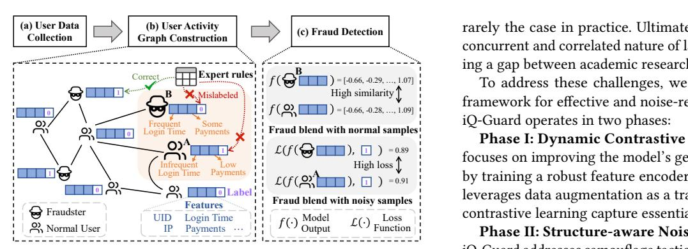
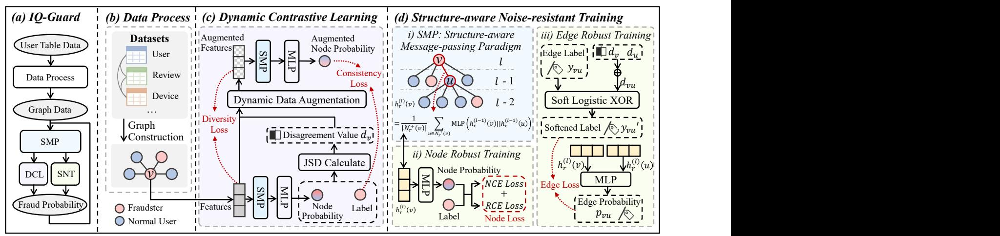
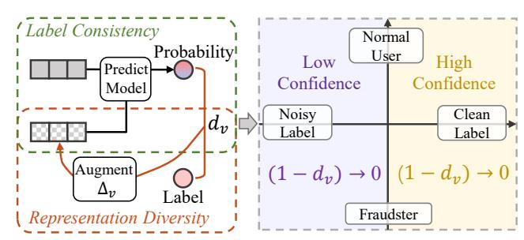
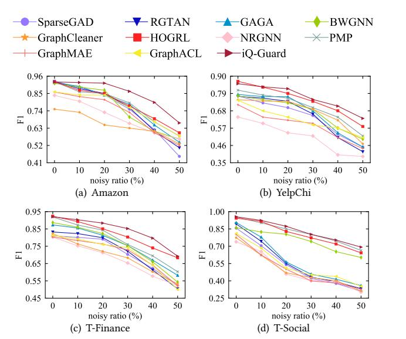
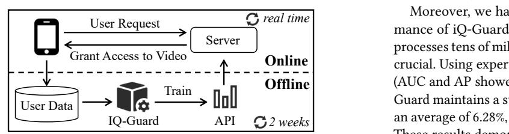
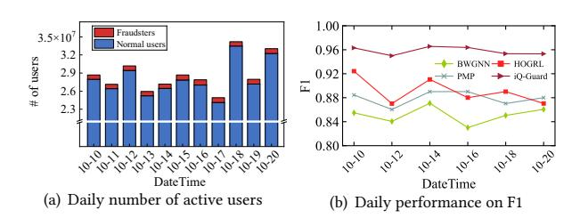
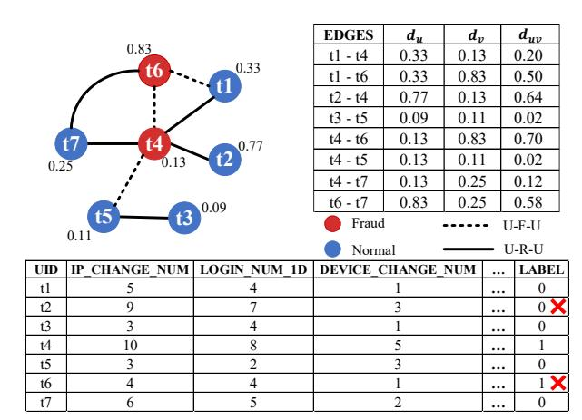
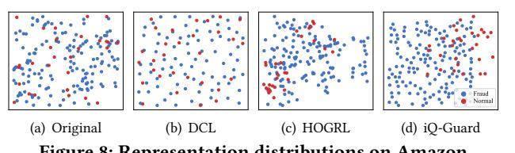
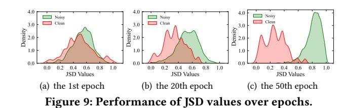
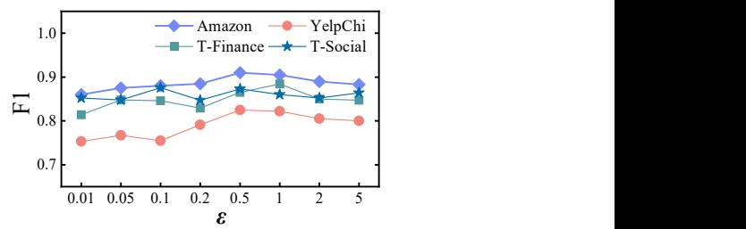

# iQ-Guard: An Effective and Noise-Resistant Framework for Graph Fraud Detection on iQIYI Platform

Yuting Huang School of Software, Zhejiang University Ningbo, China huangyuting@zju.edu.cn

Ziquan Fang School of Software, Zhejiang University Ningbo, China zqfang@zju.edu.cn

Zhengjie Zhou Ant Group Hangzhou, China zhouzhengjie.zzj@antgroup.com

Tinghui Luo School of Software, Zhejiang University Ningbo, China luotinghui@zju.edu.cn

Lu Chen College of computer Science and Technology, Zhejiang University Hangzhou, China luchen@zju.edu.cn

Surun Ji iQIYI Inc Shanghai, China jisurun@qiyi.com

Huimei Zheng iQIYI Inc Shanghai, China zhenghuimei@qiyi.com

Mingfan Lu iQIYI Inc Shanghai, China lumingfan@qiyi.com

Fangshu Chen Shanghai Polytechnic University Shanghai, China fschen@sspu.edu.cn

Yunjun Gao College of computer Science and Technology, Zhejiang University Hangzhou, China gaoyj@zju.edu.cn

# Abstract

Fraud detection is a critical challenge for large-scale online platforms, where even a small fraction of fraudulent users can cause millions of dollars in financial losses. In practice, graph structures are commonly adopted to model interactions, such as transactions and user behaviors. However, fraudsters deliberately camouflage their behaviors to mimic legitimate users, introducing both label noise and structural noise into the graph-based models. To this end, we develop iQ-Guard, an effective and noise-resistant framework for graph fraud detection that has been fully deployed on iQIYI, one of China's largest online video and social platforms.

iQ-Guard proposes two novel components: (i) Dynamic Contrastive Learning, which adaptively augments data for each sample, enabling the model to resist noisy labels while preserving meaningful representation information gradually, and (ii) Structure-aware Noise-resistant Training, which leverages edge relations and robust loss functions to mitigate both label and structural noise. Extensive experiments on five datasets, including large-scale industrial data, show that iQ-Guard outperforms 14 state-of-the-art methods. Since its deployment, iQ-Guard has detected an average of 36 fraud cases per day, preventing over \$1.12 million in financial losses.

# CCS Concepts

• Computing methodologies → Neural networks; • Security and privacy → Web application security.

[This work is licensed under a Creative Commons Attribution 4.0 International License.](https://creativecommons.org/licenses/by/4.0) WWW '26, Dubai, United Arab Emirates

© 2026 Copyright held by the owner/author(s). ACM ISBN 979-8-4007-2307-0/2026/04 <https://doi.org/10.1145/3774904.3792837>

# Keywords

Fraud Detection; Robust Learning; Data Augmentation

### ACM Reference Format:

Yuting Huang, Ziquan Fang, Zhengjie Zhou, Tinghui Luo, Lu Chen, Surun Ji, Huimei Zheng, Mingfan Lu, Fangshu Chen, and Yunjun Gao. 2026. iQ-Guard: An Effective and Noise-Resistant Framework for Graph Fraud Detection on iQIYI Platform. In Proceedings of the ACM Web Conference 2026 (WWW '26), April 13–17, 2026, Dubai, United Arab Emirates. ACM, New York, NY, USA, [12](#page-11-0) pages.<https://doi.org/10.1145/3774904.3792837>

# 1 Introduction

Detecting sophisticated fraud within large-scale relational data is a critical challenge for online platforms. For example, iQIYI, one of China's largest video platforms, serves over 30 million daily active users, among which approximately 0.28% of accounts exhibit abnormal or fraudulent behaviors. Although this ratio seems small, it corresponds to tens of thousands of suspicious accounts each day, posing significant risks of financial loss and reduced user trust. In production environments, rule-based strategies relying on predefined heuristics typically miss more than 20% of fraudulent cases while producing numerous false alarms. Such misjudgments not only increase manual review costs but also result in annual financial losses of millions of dollars.

Graph Fraud Detection (GFD) aims to identify fraudulent nodes in networks by analyzing hidden relationships and patterns indicative of fraud [\[32,](#page-8-0) [48,](#page-8-1) [53\]](#page-8-2). It has broad applications in finance [\[51\]](#page-8-3), telecommunications [\[64\]](#page-9-0), and social networks [\[32\]](#page-8-0). Existing GFD approaches are generally divided into two categories: (i) spatial-based methods, which focus on message passing and feature propagation across graphs [\[21,](#page-8-4) [34,](#page-8-5) [40,](#page-8-6) [56,](#page-9-1) [63,](#page-9-2) [67\]](#page-9-3), and (ii)

… Phase II: Structure-aware Noise-resistant Training (SNT). iQ-Guard addresses camouflage tactics by reframing fraud detection as an edge classification problem, capturing structural relations between edges. Besides, we introduce a robust loss function optimized with soft logical XOR, forming a structure-aware noise-resistant training mechanism to mitigate both structural and label noises.

Fraud blend with noisy samples Loss High loss ℒ(�� , ) 1 = 0.89 ℒ(�� , ) 1 = 0.91 A Phase I: Dynamic Contrastive Learning (DCL). This phase focuses on improving the model's generalization and performance by training a robust feature encoder with DCL. The core strategy leverages data augmentation as a training mechanism to help the contrastive learning capture essential, noise-invariant features.

= [-0.66, -0.29, …, 1.07] = [-0.66, -0.28, …, 1.09] To address these challenges, we propose iQ-Guard, a novel framework for effective and noise-resistant graph fraud detection. iQ-Guard operates in two phases:

Figure 1: Misjudgments in expert rules lead to the misclassification of both normal user A and fraudster B.

spectral-based methods, which employ spectral filters to distinguish fraudsters from legitimate users [\[3,](#page-8-7) [19,](#page-8-8) [45,](#page-8-9) [54,](#page-9-4) [61\]](#page-9-5).

However, GFD in industrial settings is often limited by the entanglement of label noise and structural noise. Here, we give a concrete example that arises in iQIYI's incentive system, where users receive rewards (e.g., coupons) for engagement.

As shown in Fig. [1,](#page-1-0) the platform employs a three-stage fraud detection pipeline: (a) User Data Collection. The platform collects user activity logs, including viewing, purchasing, and engagement behaviors. (b) User Activity Graph Construction. Each user is represented as a node in a graph, with edges encoding behavioral or relational connections (e.g., shared devices, friendships). Features are derived from users' historical activities, while labels are generated by expert rules (e.g., anomalous payments or usage thresholds). This process inevitably introduces mislabeling—e.g., a legitimate user A may be incorrectly flagged as fraudulent due to low activity, while a fraudster B mimicking normal behavior may be mislabeled as benign. (c) Fraud Detection. A graph-based model is then trained on this noisy graph. Fraudsters such as B deliberately mimic benign embeddings, leading to high similarity between fraudulent and normal nodes. At the same time, mislabeled users such as A, when mixed with true fraudsters, produce high losses, further confusing the model. These confounding effects severely hinder the ability to distinguish genuine fraud from noise, especially under low supervision or high-noise conditions.

The above scenario reveals two unaddressed challenges:

- Label Noise. Mislabeled benign users and truly fraudulent cases often incur similarly high training losses. This undermines the small-loss principle by making it difficult to discern whether a high loss comes from a mislabeled benign user or a genuinely complex fraudulent case, thereby hindering noise correction and degrading detection performance.
- Structural Noise. Fraudsters deliberately introduce heterophilic connections by linking with benign users, generating structural noise [\[21\]](#page-8-4). Through message passing in GNNs, these connections propagate benign features to fraudulent nodes, camouflaging them and weakening the model's discriminative ability.

Existing approaches to label-noise robustness often rely on feature dissimilarity, an assumption that breaks down when fraudsters deliberately camouflage their behaviors. Conversely, structuralnoise mitigation methods usually assume clean labels, which is

rarely the case in practice. Ultimately, prior work overlooks the concurrent and correlated nature of label and structural noise, leaving a gap between academic research and industrial needs.

Through these two phases, iQ-Guard increases the representational distance between normal users and fraudsters, reduces misleading similarities, and isolates noisy samples, ensuring that high-loss instances do not compromise model performance. Overall, the key contributions of this paper are summarized as follows:

- We propose iQ-Guard, an effective and noise-resilient framework for graph fraud detection that addresses the challenges of label and structural noise in real-world settings.
- To address label noise, iQ-Guard uses Dynamic Contrastive Learning, where augmentation strength adapts to label confidence, guiding the encoder to learn noise-invariant representations and enhancing generalization.
- To address structural noise, iQ-Guard develops structure-aware, noise-resistant training. By transforming the structural relations of edges and optimizing from the perspective of soft logical XOR, we further enhance the model's ability to detect structural noise and mitigate label noise.
- Extensive experiments on five real-world datasets demonstrate that iQ-Guard not only outperforms 14 state-of-the-art graph fraud detection methods but also maintains robustness under label noise. Furthermore, ablation studies with alternative general designs confirm that the two key modules—Dynamic Contrastive Learning and Structure-aware Noise-resistant Training—are essential to iQ-Guard's superior performance.
- iQ-Guard has been deployed on iQIYI, one of the largest online video-sharing and social media platforms in China, for daily fraud detection, supporting the monitoring of 30 million users. It captures an average of 36 fraud cases per day, preventing a cumulative financial loss of \$1.12 million.

# 2 Preliminary

We proceed to present the concept of a multi-relational graph, followed by an introduction to the general task of graph fraud detection, and then formulate our task.

# 2.1 Multi-relational Graph

The entities and relationships are modeled as a multi-relational graph G = (V, E, X, Y), composed of (i) a set of N nodes V = {��1, ��2, . . . , ���� }(�� = |V |), (ii) adjacency matrices of corresponding relations E = {��1, ��2, . . . , ����} (�� = |E |), (iii) a set of node

Figure 2: The framework of iQ-Guard.

feature vectors X = {��1, ��2, . . . , ���� }, and (iv) a node label set Y = {��1, ��2, . . . , ���� }. Nodes �� and �� are connected under relation �� ∈ {1, 2, . . . , ��} if ���� [��, ��] = 1. Each node �� ∈ V has a ��-dimensional feature vector ���� ∈ R and a label ���� ∈ {0, 1}, where 1 represents fraud nodes and 0 represents normal nodes.

In Fig. [1,](#page-1-0) the nodes V represent users, the adjacency matrices E capture various user interactions, the node features X encode users' historical behaviors, and the node labels Y constitute a pseudo-label set generated by expert rules.

# 2.2 Graph Fraud Detection

Given a graph G and considering a semi-supervised scenario where only a small proportion of nodes V have been labeled and the node label set Y contains noise, graph fraud detection is to identify whether the remaining unlabeled nodes are fraudulent.

### 3 Methodology

The framework of iQ-Guard is illustrated in Fig. [2.](#page-2-0) It mitigates the adverse effects of both structural and label noise through two key modules: (i) Dynamic Contrastive Learning (DCL) and (ii) Structureaware Noise-resistant Training (SNT).

In the data process phase, raw user activity data is transformed into a graph representation, which then serves as the input for these modules. In DCL module, the Jensen–Shannon Divergence (JSD) of each sample is computed from the model's previous predictions, and the augmentation strength is dynamically adjusted in each iteration. High-confidence samples receive stronger perturbations, guiding the model to capture invariant features and thus improving robustness. In SNT module, a composite objective is introduced. For nodes, a robust classification loss combining Normalized and Reverse Cross-Entropy reduces sensitivity to noisy labels. For edges, uncertainty-aware labels are generated based on JSD scores of connected nodes, refining structural learning. The overall model is trained by jointly optimizing the node loss, the edge loss, and an auxiliary consistency term.

### 3.1 Dynamic Contrastive Learning

Design Motivation. Contrastive learning (CL) has been shown to enhance robustness against label noise [\[10,](#page-8-10) [55,](#page-9-6) [62\]](#page-9-7). However, most existing CL methods treat all labeled samples uniformly [\[29,](#page-8-11) [35\]](#page-8-12), overlooking the fact that not all labels are noisy. This indiscriminate treatment often leads to either over-processing clean labels or under-processing corrupted ones, thereby weakening supervision. To address this challenge, we propose a Dynamic Contrastive Learning (DCL) framework that is inherently designed for large-scale noisy datasets. This design not only improves robustness to label noise but also ensures scalability and efficiency in real-world industrial settings, where adaptive handling of data quality is critical for reliable deployment.

3.1.1 Label Confidence Computation. Given a training graph G = (V, E, X, Y), we first input it into a graph neural network (GNN) �� with structure-aware message-passing paradigm to estimate label confidences, which allows us to distinguish reliable samples from potentially corrupted ones. Specifically, the model produces a probability prediction ���� for each node �� ∈ V. The disagreement between prediction ���� and ground-truth label ���� is quantified using Jensen–Shannon divergence (JSD):

���� = 1 2 KL ���� ∥ ���� + ���� 2 + 1 2 KL ���� ∥ ���� + ���� 2 , (1)

where ���� ∈ [0, 1] measures the degree of label disagreement and KL(·) represents the Kullback-Leibler divergence [\[9\]](#page-8-13).

While prior works often utilize cross-entropy loss values to fit a Gaussian Mixture Model (GMM) for partitioning samples [\[22,](#page-8-14) [33\]](#page-8-15), we adopt JSD due to its symmetric nature and inherent boundedness, which provides a stable and normalized metric for disagreement. This computation yields a set of disagreement scores D = {��1, ��2, . . . , ���� }(�� = |V |), where a lower ���� implies greater confidence in label correctness, while higher ���� indicates potential mislabeling. This step explicitly distinguishes trustworthy from noisy labels, providing a principled confidence signal to guide subsequent augmentation and loss design.

3.1.2 Dynamic Data Augmentation. For data augmentation, we employ a noise injection strategy, a technique proven effective for graph-structured data [\[7,](#page-8-16) [57\]](#page-9-8). Specifically, we perturb the embedding ���� of each node �� by adding a dynamically scaled noise vector:

�� ′ �� = ���� + Δ��, (2)

Table 1: The overall performance. The highest and second-highest scores are highlighted in bold and underlined, respectively.

| Methods      | AUC    | Amazon AP | F1     | AUC    | YelpChi AP | F1     | AUC    | T-Finance AP | F1     | AUC    | T-Social AP | F1     | AUC    | iQIYI AP | F1     |
|--------------|--------|-----------|--------|--------|------------|--------|--------|--------------|--------|--------|-------------|--------|--------|----------|--------|
| GCN          | 0.7396 | 0.4101    | 0.6147 | 0.5213 | 0.1920     | 0.4463 | 0.6164 | 0.4725       | 0.5948 | 0.6389 | 0.5064      | 0.4337 | 0.6402 | 0.3003   | 0.5214 |
| GAT          | 0.7286 | 0.2774    | 0.6013 | 0.5416 | 0.2526     | 0.4396 | 0.7132 | 0.6148       | 0.5023 | 0.5878 | 0.6229      | 0.4582 | 0.6557 | 0.2984   | 0.5336 |
| GraphSAGE    | 0.8438 | 0.7607    | 0.7007 | 0.6485 | 0.2997     | 0.5521 | 0.6017 | 0.5553       | 0.4929 | 0.6163 | 0.4524      | 0.5036 | 0.6431 | 0.3125   | 0.5264 |
| NRGNN        | 0.8159 | 0.5045    | 0.7380 | 0.6903 | 0.3367     | 0.5405 | 0.8023 | 0.5639       | 0.7128 | 0.7336 | 0.5201      | 0.4594 | 0.6608 | 0.3217   | 0.5182 |
| GraphCleaner | 0.7815 | 0.5001    | 0.6505 | 0.6814 | 0.4909     | 0.7391 | 0.8114 | 0.5726       | 0.7205 | 0.7475 | 0.5387      | 0.4698 | 0.6515 | 0.3109   | 0.5289 |
| GraphMAE     | 0.8516 | 0.7057    | 0.8194 | 0.7324 | 0.4210     | 0.6185 | 0.8376 | 0.5994       | 0.7628 | 0.7583 | 0.5292      | 0.5019 | 0.6802 | 0.4334   | 0.6698 |
| GraphACL     | 0.8735 | 0.7398    | 0.8402 | 0.7693 | 0.4569     | 0.6467 | 0.8403 | 0.6058       | 0.7602 | 0.7694 | 0.5524      | 0.5098 | 0.6923 | 0.4172   | 0.6308 |
| BWGNN        | 0.9220 | 0.7182    | 0.8748 | 0.8600 | 0.3926     | 0.7245 | 0.9024 | 0.7162       | 0.8231 | 0.8967 | 0.7274      | 0.8042 | 0.8386 | 0.7083   | 0.7865 |
| SparseGAD    | 0.8934 | 0.8060    | 0.8423 | 0.8156 | 0.6045     | 0.7051 | 0.8435 | 0.6642       | 0.7906 | 0.7881 | 0.6021      | 0.5398 | 0.8004 | 0.7305   | 0.7613 |
| GAGA         | 0.8950 | 0.8185    | 0.8494 | 0.8764 | 0.7445     | 0.7740 | 0.8663 | 0.6912       | 0.8134 | 0.8142 | 0.6293      | 0.5639 | 0.8246 | 0.7546   | 0.7225 |
| ConsisGAD    | 0.8242 | 0.7514    | 0.8010 | 0.8198 | 0.6798     | 0.7046 | 0.8293 | 0.6552       | 0.7702 | 0.7771 | 0.5994      | 0.5202 | 0.8124 | 0.7401   | 0.7743 |
| PMP          | 0.9010 | 0.8221    | 0.8546 | 0.8710 | 0.7342     | 0.7612 | 0.9102 | 0.7581       | 0.8432 | 0.9273 | 0.8305      | 0.8506 | 0.8531 | 0.7734   | 0.7902 |
| HOGRL        | 0.9051 | 0.8270    | 0.8543 | 0.8832 | 0.7460     | 0.7972 | 0.8989 | 0.7367       | 0.8510 | 0.8874 | 0.8096      | 0.8282 | 0.8858 | 0.7962   | 0.8221 |
| RGTAN        | 0.8898 | 0.8229    | 0.8561 | 0.8571 | 0.6972     | 0.7420 | 0.8542 | 0.6761       | 0.7991 | 0.8006 | 0.6179      | 0.5521 | 0.7879 | 0.7831   | 0.7858 |
| iQ-Guard     | 0.9469 | 0.8557    | 0.9250 | 0.9126 | 0.7847     | 0.8203 | 0.9380 | 0.8063       | 0.8836 | 0.9400 | 0.8701      | 0.8729 | 0.9648 | 0.8101   | 0.8755 |
| Improvement  | 2.70%  | 3.47%     | 5.74%  | 3.33%  | 5.19%      | 2.90%  | 3.05%  | 6.36%        | 3.83%  | 1.37%  | 4.77%       | 2.62%  | 8.92%  | 1.75%    | 6.50%  |

Performance Metrics. In this paper, we formulate our task as a binary classification task and use three widely-used metrics: AUC, AP, and F1, which are detailed in Appendix [C.3](#page-10-2).

Implementation Details. The setup and implementation of all baselines and iQ-Guard are detailed in Appendix [C.4](#page-11-1).

## 4.2 Overall Performance Study (RQ1)

Table [1](#page-5-0) presents the overall performance comparison on four public datasets and the iQIYI dataset.

i) iQ-Guard on public datasets. We begin with a performance comparison across four public datasets. iQ-Guard consistently outperforms all baselines by capturing fraudulent patterns while mitigating structural and label noise. Notably, contrastive learning and noise-resistant techniques—such as GraphCleaner and GraphACL—outperform traditional GNN models, achieving an average F1 score improvement of 15.71%. However, their performance remains substantially lower than models specifically designed for graph fraud detection methods, such as PMP and HOGRL, with F1 score deficits ranging from 10.27% to 15.08%. This suggests that existing contrastive learning and noise-resistant approaches are not fully optimized for the unique challenges of fraud detection.

ii) iQ-Guard on iQIYI dataset. As a real industrial dataset, it is characterized by large-scale data, complex relations, and inherent label noise. Nevertheless, iQ-Guard achieves state-of-theart performance, surpassing all baselines across all metrics. Specifically, iQ-Guard attains an AUC of 0.9648, AP of 0.8101, and F1 score of 0.8755, representing an average improvement of 6.65%. These results highlight iQ-Guard's strong ability to handle both structural and label noise in real-world scenarios.

# 4.3 Noise-Resistant Study (RQ2)

We evaluate iQ-Guard's robustness against label noise by varying noise ratios from 0% to 50%. To ensure precise control, we introduce artificial noise into public datasets rather than relying on the naturally noisy iQIYI dataset. As shown in Fig. [4,](#page-5-1) iQ-Guard consistently outperforms all baselines, demonstrating superior resistance to noise. Specifically, its F1 score decreases by only 19.47%, significantly lower than the 34.93% drop in baselines. While some models,

Figure 4: Performance on F1 under varying noisy ratios.

such as GraphCleaner and GraphACL, show a more gradual decline (22.43% on average), their overall performance remains lower. These results confirm that iQ-Guard effectively mitigates label noise, enhancing fraud detection reliability in real-world scenarios.

# 4.4 Ablation Study (RQ3)

We evaluate iQ-Guard's core components by modifying or removing key modules. Due to space limitations, the results on T-Finance and T-Social are provided in Appendix [C.5](#page-11-2).

(i) iQ-Guard vs. iQ-Guard w/o DCL. The variant iQ-Guard w/o DCL removes the Dynamic Contrastive Learning, retaining only structure-aware noise-resistant training. We further replace DCL with commonly used data augmentation techniques—Node Dropout (ND) [\[15\]](#page-8-30), Edge Dropout (ED) [\[43\]](#page-8-31), and Random Walk (RW) [\[65\]](#page-9-15)—denoted as w/o DCL (ND/ED/RW). The results show that iQ-Guard consistently outperforms all alternatives, achieving an average improvement of 5.82% in F1. Among the alternatives,

Table 2: AUC and F1 of iQ-Guard in ablation.

| Methods  |     |     |         | AUC    | Amazon F1 | AUC    | YelpChi F1 | AUC    | iQIYI F1 |
|----------|-----|-----|---------|--------|-----------|--------|------------|--------|----------|
| iQ-Guard |     |     |         | 0.9469 | 0.9250    | 0.9126 | 0.8203     | 0.9648 | 0.8755   |
| iQ-Guard | w/o | DCL |         | 0.8607 | 0.8325    | 0.8123 | 0.7501     | 0.9012 | 0.8253   |
| iQ-Guard | w/o | DCL | (ND)    | 0.8663 | 0.8469    | 0.8201 | 0.7656     | 0.9087 | 0.8380   |
| iQ-Guard | w/o | DCL | (ED)    | 0.9089 | 0.8793    | 0.8467 | 0.7884     | 0.9279 | 0.8605   |
| iQ-Guard | w/o | DCL | (RW)    | 0.9075 | 0.8782    | 0.8435 | 0.7869     | 0.9262 | 0.8583   |
| iQ-Guard | w/o | SMP | (GCN)   | 0.8723 | 0.8501    | 0.7012 | 0.6567     | 0.8743 | 0.8124   |
| iQ-Guard | w/o | SMP | (PMP)   | 0.9185 | 0.8556    | 0.8874 | 0.7603     | 0.9391 | 0.8510   |
| iQ-Guard | w/o | SMP | (HOGRL) | 0.9276 | 0.8659    | 0.9025 | 0.8004     | 0.9463 | 0.8621   |
| iQ-Guard | w/o | RLF |         | 0.9005 | 0.8136    | 0.8911 | 0.8037     | 0.9228 | 0.8498   |

w/o DCL (ED) performs second best, likely because Edge Dropout preserves structural information more effectively. In contrast, our dynamic data augmentation introduces perturbations without altering the graph structure, thereby enhancing contrastive learning and validating the effectiveness of DCL.

(ii) iQ-Guard vs. iQ-Guard w/o SMP. The variant iQ-Guard w/o SMP removes the Structural-aware Message-passing Paradigm, replacing it with GCN, PMP, or HOGRL, denoted as w/o SMP (GCN/PMP/HOGRL). iQ-Guard surpasses all variants, achieving an average improvement of 3.61% in F1 compared with the best substitute (HOGRL). By explicitly modeling structural information during message passing, SMP significantly improves robustness to label noise and contributes substantially to overall performance.

(iii) iQ-Guard vs. iQ-Guard w/o RLF. The variant iQ-Guard w/o RLF removes the Robust Loss Function, instead using standard cross-entropy (CE) loss. This substitution leads to average decreases of 3.87% in AUC and 5.67% in F1. The performance degradation arises because CE lacks inherent noise resilience, limiting its effectiveness in noisy environments.

### 4.5 Empirical Study of iQ-Guard (RQ4)

We further conduct an empirical study of iQ-Guard to better understand how it addresses structural noise and label noise. Specifically, we visualize the learned representation distributions and analyze the evolution of label confidence during training. These experiments are designed to provide deeper insights into the underlying mechanisms of iQ-Guard and to explain why it achieves strong robustness in noisy environments. Detailed analyses and visualizations are presented in Appendix [C.6](#page-11-3).

# 4.6 Deployment and Application (RQ5)

iQ-Guard has been deployed on the iQIYI platform for five months, supporting daily fraud detection with weekly model updates trained on the previous two weeks of user data. After each update, the model is deployed via an API to perform daily inference and predict

> Online Offline real time Moreover, we have evaluated the daily fraud detection performance of iQ-Guard on iQIYI. As shown in Fig. [6\(a\),](#page-6-2) the platform processes tens of millions of visits per day, making reliable detection crucial. Using expert-labeled daily samples, we compared F1 scores (AUC and AP showed similar trends) across methods (Fig. [6\(b\)\)](#page-6-3). iQ-Guard maintains a stable daily F1 of 0.96 and outperforms others by an average of 6.28%, while competing models fluctuate considerably. These results demonstrate both the robustness and consistency of iQ-Guard in a real-world production environment.

Figure 5: Architecture of IQ-Guard online deployment.

Table 3: Results on industrial effectiveness and efficiency.

| Methods      | T+6 ↑  | SUR ↑  | CR ↓   | Training (min) ↓ | Inference (s) ↓ |
|--------------|--------|--------|--------|------------------|-----------------|
| Expert rules | 0.0341 | 0.1028 | 1.9349 |                  |                 |
| BWGNN        | 0.0728 | 0.1527 | 1.7651 | 179              | 724             |
| PMP          | 0.0773 | 0.1957 | 1.2648 | 243              | 1137            |
| HOGRL        | 0.0847 | 0.1922 | 0.9920 | 228              | 1008            |
| iQ-Guard     | 0.1043 | 0.2593 | 0.6847 | 211              | 983             |

Figure 6: Performance on iQIYI's daily fraud detection.

fraudulent users in real time (Fig. [5\)](#page-6-0). On average, it detects 36 fraud cases per day, preventing an estimated \$1.12 million in financial losses. Feedback from iQIYI has been highly positive, highlighting both the system's accuracy and its operational value.

4.6.1 Quantitative evaluation. To evaluate the business impact and efficiency of iQ-Guard, we conducted a comprehensive quantitative study incorporating both industrial effectiveness metrics and computational efficiency. Specifically, we report performance on three widely adopted business indicators, T+6, SUR, and CR, as well as training and inference time.

- T+6: The proportion of advertisement-targeted users who make a payment on iQIYI within the next six days.
- SUR (Start-Up Ratio): The proportion of advertisement-targeted users who log into iQIYI the following day.
- CR (Cost Ratio): The ratio of iQIYI's advertising expenditure to the revenue generated from advertisements. Unlike the other two metrics, a lower CR is preferable.
- Training and Inference Time: Computational efficiency measured by the total training time (minutes) on the full dataset and the inference time (seconds) on 500,000 samples.

We evaluate iQ-Guard against iQIYI's expert rules and state-ofthe-art GFD baselines, as shown in Table [3.](#page-6-1) iQ-Guard consistently achieves the best performance across all evaluation dimensions, surpassing expert rules by 205.95%, 152.28%, and 64.60% on T+6, SUR, and CR, respectively. While baseline GFD models outperform expert rules, they remain far behind iQ-Guard, highlighting its practical advantage. In addition, iQ-Guard demonstrates superior efficiency: its training time is 13.2% faster than PMP and 7.5% faster than HOGRL, with lower inference latency as well.

Figure 7: Explanation examples from iQIYI dataset.

4.6.2 Qualitative evaluation. We also analyze representative cases from the iQIYI dataset to illustrate how iQ-Guard improves fraud detection. Fig. [7](#page-7-0) presents a multi-relational user graph (��1–��7) with features and labels. Fraudsters often exhibit behaviors such as frequent IP changes and multi-account logins. However, due to the limitations of expert rules, ��2 and ��6 were mislabeled.

iQ-Guard computes both label confidence (���� ) and structural confidence (������ ) for each node. As shown in the top-right table, ��2 and ��6 have the highest JSD values and elevated ������ scores, revealing inconsistencies that point to label noise. This confirms that iQ-Guard's confidence-based correction mechanism effectively mitigates label errors during training.

# 4.7 Model Robust Study (RQ6)

We further assess the robustness of iQ-Guard under varying parameter configurations. This evaluation aims to provide a comprehensive understanding of how these factors influence the model's performance. The detailed results can be found in Appendix [C.7](#page-11-4).

# 5 Related Work

### A. Graph Fraud Detection

Research on graph fraud detection follows two main strategies: (i) Spatial-based Methods. GNN-based approaches enhance robustness against camouflage and data limitations. A key challenge is the mix of homophily and heterophily caused by fraudsters connecting to legitimate users. Models such as H2-FDetector [\[44\]](#page-8-32) and SparseGAD [\[21\]](#page-8-4) design tailored aggregation for such structures, while others mitigate structural and feature noise via reinforcement learning neighbor selection [\[70\]](#page-9-16) or graph augmentation [\[63\]](#page-9-2).

Under limited labeled data, earlier work addressed class imbalance [\[27,](#page-8-33) [37\]](#page-8-34), while recent methods use unlabeled data in barelysupervised [\[67\]](#page-9-3) or fully unsupervised settings [\[40\]](#page-8-6). Richer contexts are leveraged through temporal modeling [\[58,](#page-9-14) [59,](#page-9-17) [68,](#page-9-18) [71\]](#page-9-19), multirelational information [\[17,](#page-8-35) [23\]](#page-8-36), and architectural innovations like graph transformers [\[34\]](#page-8-5) or dynamic grouping aggregation [\[14\]](#page-8-37). Adversarial robustness is also pursued via attack-resistant architectures [\[56\]](#page-9-1) and simulators like MonTi [\[8\]](#page-8-38).

(ii) Spectral-based Methods. These approaches apply graph Fourier transforms to detect fraud via frequency-specific analysis. AM-Net [\[3\]](#page-8-7) adapts multi-frequency filters to balance smoothing and

anomaly detection, while BWGNN [\[45\]](#page-8-9) addresses spectral rightshift with localized band-pass filters. SplitGNN [\[54\]](#page-9-4) reduces heterophily noise by decomposing graphs into homophilic/heterophilic subgraphs with separate filters. Recent works integrate hybrid filtering and invariant learning, e.g., GHRN [\[19\]](#page-8-8) captures highfrequency inter-class edges via Laplacian operators, SEC-GFD [\[61\]](#page-9-5) combines mixed-frequency bands with label-guided constraints, and HGIF [\[42\]](#page-8-39) enhances robustness through edge-aware augmentation, dual-channel contrastive learning, and test-time training. B. Label Noise Learning

Learning with noisy labels is a critical challenge, especially for graph-based models where the message-passing mechanism can propagate the influence of incorrect labels across the graph. Existing label noise learning can be classified into two categories: (i) Robust Regularization, which prevents overfitting to noisy labels by adding regularization terms [\[11,](#page-8-27) [24,](#page-8-40) [41,](#page-8-41) [52,](#page-8-42) [74\]](#page-9-20); (ii) Sample Separation, which identifies and separates noisy samples from clean ones, typically using confidence-based filtering techniques [\[18,](#page-8-43) [26,](#page-8-44) [33,](#page-8-15) [69,](#page-9-11) [75\]](#page-9-21). Stateof-the-art methods commonly employ the small-loss principle [\[33\]](#page-8-15), which identifies noisy samples based on their output loss values.

### C. Structure Noise Learning

The performance of GNNs is highly dependent on the quality of the graph structure. In fraud detection, this structure is often compromised by noise introduced by fraudsters to evade detection. Existing structural noise learning methods can be broadly categorized into two types: (i) Graph Rewiring, which jointly optimizes the graph structure and model parameters to mitigate noisy edges [\[1,](#page-8-45) [16,](#page-8-46) [28,](#page-8-47) [39,](#page-8-48) [66,](#page-9-22) [73\]](#page-9-23); (ii) Denoised Graph Construction, which builds cleaner graphs via link prediction or edge filtering under noisy and sparse settings [\[12\]](#page-8-49). The Edge Signal-to-Noise Ratio [\[13\]](#page-8-50), based on random matrix theory, has been proposed to quantify structural noise and shows strong correlation with GNN performance degradation. A benchmark [\[72\]](#page-9-24) reveals that rewiring methods vary in robustness across different noise patterns and structural noise further impacts GNN interpretability [\[30\]](#page-8-51).

# 6 Conclusion

We propose iQ-Guard, a novel, effective, and noise-resistant framework for graph fraud detection on the iQIYI platform. iQ-Guard simultaneously addresses structural and label noise by integrating two key innovations. First, Dynamic Contrastive Learning tailors data augmentation per sample, maximizing feature utilization while adapting to noisy environments. Second, Structure-Aware Noise-Resistant Training leverages both structural relations and a soft logical perspective to enhance robustness against noise. Extensive experiments on four public datasets confirm its effectiveness, while real-world deployment on iQIYI has led to the detection of 36 fraud cases daily, preventing \$1.12 million in financial losses. Future work will explore handling class imbalance in noisy graph fraud detection to further unveil camouflaged fraudsters.

# Acknowledgments

This work was supported in part by the Zhejiang Provincial Natural Science Foundation of China under Grant No. LZ25F020001, NSFC under Grants No. (62402422, 62025206, U23A20296, and 62472377), Yongjiang Talent Introduction Programme (2024A-162-G). Ziquan Fang is the corresponding author.

### References

[1] Adrián Arnaiz-Rodríguez, Ahmed Begga, Francisco Escolano, and Nuria M Oliver. 2022. DiffWire: Inductive Graph Rewiring via the Lovász Bound. In The First Learning on Graphs Conference. [2] Stephen H. Bach, Matthias Broecheler, Bert Huang, and Lise Getoor. 2017. Hinge-Loss Markov Random Fields and Probabilistic Soft Logic. J. Mach. Learn. Res. 18 (2017), 109:1–109:67. [3] Ziwei Chai, Siqi You, Yang Yang, Shiliang Pu, Jiarong Xu, Haoyang Cai, and Weihao Jiang. 2022. Can Abnormality be Detected by Graph Neural Networks?. In IJCAI. 1945–1951. [4] Nontawat Charoenphakdee, Jongyeong Lee, and Masashi Sugiyama. 2019. On Symmetric Losses for Learning from Corrupted Labels. In ICML (Proceedings of Machine Learning Research, Vol. 97). 961–970. [5] Junyang Chen, Zhiguo Gong, Wei Wang, Cong Wang, Zhenghua Xu, Jianming Lv, Xueliang Li, Kaishun Wu, and Weiwen Liu. 2022. Adversarial Caching Training: Unsupervised Inductive Network Representation Learning on Large-Scale Graphs. IEEE Trans. Neural Networks Learn. Syst. 33, 12 (2022), 7079–7090. [6] Nan Chen, Zemin Liu, Bryan Hooi, Bingsheng He, Rizal Fathony, Jun Hu, and Jia Chen. 2024. Consistency Training with Learnable Data Augmentation for Graph Anomaly Detection with Limited Supervision. In ICLR. [7] Ting Chen, Simon Kornblith, Mohammad Norouzi, and Geoffrey E. Hinton. 2020. A Simple Framework for Contrastive Learning of Visual Representations. In ICML (Proceedings of Machine Learning Research, Vol. 119). 1597–1607. [8] Jinhyeok Choi, Heehyeon Kim, and Joyce Jiyoung Whang. 2025. Unveiling the Threat of Fraud Gangs to Graph Neural Networks: Multi-Target Graph Injection Attacks Against GNN-Based Fraud Detectors. In AAAI. 16028–16036. [9] Imre Csiszár. 1975. I-divergence geometry of probability distributions and minimization problems. The annals of probability (1975), 146–158. [10] Jingyi Cui, Weiran Huang, Yifei Wang, and Yisen Wang. 2023. Rethinking Weak Supervision in Helping Contrastive Learning. In ICML (Proceedings of Machine Learning Research, Vol. 202). 6448–6467. [11] Enyan Dai, Charu Aggarwal, and Suhang Wang. 2021. NRGNN: Learning a Label Noise Resistant Graph Neural Network on Sparsely and Noisily Labeled Graphs. In SIGKDD. 227–236. [12] Enyan Dai, Wei Jin, Hui Liu, and Suhang Wang. 2022. Towards Robust Graph Neural Networks for Noisy Graphs with Sparse Labels. In WSDM. 181–191. [13] Mingze Dong and Yuval Kluger. 2023. Towards Understanding and Reducing Graph Structural Noise for GNNs. In ICML (Proceedings of Machine Learning Research, Vol. 202). 8202–8226. [14] Mingjiang Duan, Tongya Zheng, Yang Gao, Gang Wang, Zunlei Feng, and Xinyu Wang. 2024. DGA-GNN: Dynamic Grouping Aggregation GNN for Fraud Detection. In AAAI. 11820–11828. [15] Wenzheng Feng, Jie Zhang, Yuxiao Dong, Yu Han, Huanbo Luan, Qian Xu, Qiang Yang, Evgeny Kharlamov, and Jie Tang. 2020. Graph Random Neural Networks for Semi-Supervised Learning on Graphs. In NeurIPS. [16] Luca Franceschi, Mathias Niepert, Massimiliano Pontil, and Xiao He. 2019. Learning Discrete Structures for Graph Neural Networks. In ICML (Proceedings of Machine Learning Research, Vol. 97). 1972–1982. [17] Chao Fu, Guannan Liu, Kun Yuan, and Junjie Wu. 2025. Nowhere to H2 IDE: Fraud Detection From Multi-Relation Graphs via Disentangled Homophily and Heterophily Identification. IEEE Trans. Knowl. Data Eng. 37, 3 (2025), 1380–1393. [18] Yunjun Gao, Yuntao Du, Yujia Hu, Lu Chen, Xinjun Zhu, Ziquan Fang, and Baihua Zheng. 2022. Self-Guided Learning to Denoise for Robust Recommendation. In SIGIR. 1412–1422. [19] Yuan Gao, Xiang Wang, Xiangnan He, Zhenguang Liu, Huamin Feng, and Yongdong Zhang. 2023. Addressing Heterophily in Graph Anomaly Detection: A Perspective of Graph Spectrum. In WWW. 1528–1538. [20] Aritra Ghosh, Himanshu Kumar, and P. S. Sastry. 2017. Robust Loss Functions under Label Noise for Deep Neural Networks. In AAAI. 1919–1925. [21] Zheng Gong, Guifeng Wang, Ying Sun, Qi Liu, Yuting Ning, Hui Xiong, and Jingyu Peng. 2023. Beyond Homophily: Robust Graph Anomaly Detection via Neural Sparsification. In IJCAI. 2104–2113. [22] Bo Han, Quanming Yao, Xingrui Yu, Gang Niu, Miao Xu, Weihua Hu, Ivor W. Tsang, and Masashi Sugiyama. 2018. Co-teaching: Robust training of deep neural networks with extremely noisy labels. (2018), 8536–8546. [23] Li Han, Longxun Wang, Ziyang Cheng, Bo Wang, Guang Yang, Dawei Cheng, and Xuemin Lin. 2025. Mitigating the Tail Effect in Fraud Detection by Community Enhanced Multi-Relation Graph Neural Networks. IEEE Trans. Knowl. Data Eng. 37, 4 (2025), 2029–2041. [24] Dan Hendrycks, Mantas Mazeika, Saurav Kadavath, and Dawn Song. 2019. Using Self-Supervised Learning Can Improve Model Robustness and Uncertainty. In NeurIPS. 15637–15648. [25] Zhenyu Hou, Xiao Liu, Yukuo Cen, Yuxiao Dong, Hongxia Yang, Chunjie Wang, and Jie Tang. 2022. GraphMAE: Self-Supervised Masked Graph Autoencoders. In SIGKDD. 594–604. [26] Zhihui Hu, Yao Fu, Hong Zhao, Xiaoyu Cai, Weihao Jiang, and Shiliang Pu. 2023. Liberate Pseudo Labels from Over-Dependence: Label Information Migration on Sparsely Labeled Graphs. In CIKM. 833–842. [27] Mengda Huang, Yang Liu, Xiang Ao, Kuan Li, Jianfeng Chi, Jinghua Feng, Hao Yang, and Qing He. 2022. AUC-oriented Graph Neural Network for Fraud Detection. In WWW. 1311–1321. [28] Wei Jin, Yao Ma, Xiaorui Liu, Xianfeng Tang, Suhang Wang, and Jiliang Tang. 2020. Graph Structure Learning for Robust Graph Neural Networks. In SIGKDD. 66–74. [29] Nazmul Karim, Mamshad Nayeem Rizve, Nazanin Rahnavard, Ajmal Mian, and Mubarak Shah. 2022. UNICON: Combating Label Noise Through Uniform Selection and Contrastive Learning. In CVPR. 9666–9676. [30] Anees Kazi, Luca Cosmo, Seyed-Ahmad Ahmadi, Nassir Navab, and Michael M. Bronstein. 2023. Differentiable Graph Module (DGM) for Graph Convolutional Networks. IEEE Trans. Pattern Anal. Mach. Intell. 45, 2 (2023), 1606–1617. [31] Thomas N Kipf and Max Welling. 2016. Semi-supervised classification with graph convolutional networks. arXiv preprint arXiv:1609.02907 (2016). [32] Ao Li, Zhou Qin, Runshi Liu, Yiqun Yang, and Dong Li. 2019. Spam Review Detection with Graph Convolutional Networks. In CIKM. 2703–2711. [33] Junnan Li, Richard Socher, and Steven C. H. Hoi. 2020. DivideMix: Learning with Noisy Labels as Semi-supervised Learning. (2020). [34] Kaidi Li, Tianmeng Yang, Min Zhou, Jiahao Meng, Shendi Wang, Yihui Wu, Boshuai Tan, Hu Song, Lujia Pan, Fan Yu, Zhenli Sheng, and Yunhai Tong. 2024. SEFraud: Graph-based Self-Explainable Fraud Detection via Interpretative Mask Learning. In SIGKDD. 5329–5338. [35] Shikun Li, Xiaobo Xia, Shiming Ge, and Tongliang Liu. 2022. Selective-Supervised Contrastive Learning with Noisy Labels. In CVPR. 316–325. [36] Yuwen Li, Miao Xiong, and Bryan Hooi. 2023. GraphCleaner: Detecting Mislabelled Samples in Popular Graph Learning Benchmarks. In ICML (Proceedings of Machine Learning Research, Vol. 202). 20195–20209. [37] Yang Liu, Xiang Ao, Zidi Qin, Jianfeng Chi, Jinghua Feng, Hao Yang, and Qing He. 2021. Pick and Choose: A GNN-based Imbalanced Learning Approach for Fraud Detection. In WWW. 3168–3177. [38] Yujing Liu, Zongqian Wu, Zhengyu Lu, Guoqiu Wen, Junbo Ma, Guangquan Lu, and Xiaofeng Zhu. 2023. Multi-teacher Self-training for Semi-supervised Node Classification with Noisy Labels. In MM. 2946–2954. [39] Dongsheng Luo, Wei Cheng, Wenchao Yu, Bo Zong, Jingchao Ni, Haifeng Chen, and Xiang Zhang. 2021. Learning to Drop: Robust Graph Neural Network via Topological Denoising. In WSDM. 779–787. [40] Junjun Pan, Yixin Liu, Xin Zheng, Yizhen Zheng, Alan Wee-Chung Liew, Fuyi Li, and Shirui Pan. 2025. A Label-free Heterophily-guided Approach for Unsupervised Graph Fraud Detection. In AAAI. 12443–12451. [41] Giorgio Patrini, Alessandro Rozza, Aditya Krishna Menon, Richard Nock, and Lizhen Qu. 2017. Making Deep Neural Networks Robust to Label Noise: A Loss Correction Approach. In CVPR. 2233–2241. [42] Lingfei Ren, Ruimin Hu, Zheng Wang, Yilin Xiao, Dengshi Li, Junhang Wu, Yilong Zang, Jinzhang Hu, and Zijun Huang. 2024. Heterophilic Graph Invariant Learning for Out-of-Distribution of Fraud Detection. In MM. 11032–11040. [43] Yu Rong, Wenbing Huang, Tingyang Xu, and Junzhou Huang. 2020. DropEdge: Towards Deep Graph Convolutional Networks on Node Classification. In ICLR. [44] Fengzhao Shi, Yanan Cao, Yanmin Shang, Yuchen Zhou, Chuan Zhou, and Jia Wu. 2022. H2-FDetector: A GNN-based Fraud Detector with Homophilic and Heterophilic Connections. In WWW. 1486–1494. [45] Jianheng Tang, Jiajin Li, Ziqi Gao, and Jia Li. 2022. Rethinking Graph Neural Networks for Anomaly Detection. In ICML (Proceedings of Machine Learning Research, Vol. 162). 21076–21089. [46] Laurens Van der Maaten and Geoffrey Hinton. 2008. Visualizing data using t-SNE. Journal of machine learning research 9, 11 (2008). [47] Petar Velickovic, Guillem Cucurull, Arantxa Casanova, Adriana Romero, Pietro Lio, Yoshua Bengio, et al. 2017. Graph attention networks. stat 1050, 20 (2017), 10–48550. [48] Jianyu Wang, Rui Wen, Chunming Wu, Yu Huang, and Jian Xiong. 2019. FdGars: Fraudster Detection via Graph Convolutional Networks in Online App Review System. In WWW. 310–316. [49] Yisen Wang, Xingjun Ma, Zaiyi Chen, Yuan Luo, Jinfeng Yi, and James Bailey. 2019. Symmetric Cross Entropy for Robust Learning With Noisy Labels. In ICCV. 322–330. [50] Yuchen Wang, Jinghui Zhang, Zhengjie Huang, Weibin Li, Shikun Feng, Ziheng Ma, Yu Sun, Dianhai Yu, Fang Dong, Jiahui Jin, Beilun Wang, and Junzhou Luo. 2023. Label Information Enhanced Fraud Detection against Low Homophily in Graphs. In WWW. 406–416. [51] Mark Weber, Giacomo Domeniconi, Jie Chen, Daniel Karl I Weidele, Claudio Bellei, Tom Robinson, and Charles E Leiserson. 2019. Anti-money laundering in bitcoin: Experimenting with graph convolutional networks for financial forensics. arXiv preprint arXiv:1908.02591 (2019). [52] Hongxin Wei, Lue Tao, Renchunzi Xie, and Bo An. 2021. Open-set Label Noise Can Improve Robustness Against Inherent Label Noise. In NeurIPS. 7978–7992. [53] Rui Wen, Jianyu Wang, Chunming Wu, and Jian Xiong. 2020. ASA: Adversary Situation Awareness via Heterogeneous Graph Convolutional Networks. In Companion of The 2020 Web Conference. 674–678.

| Dataset   | #Nodes (Fraud%) | Relation | #Edges     | �� ��  | #Features |
|-----------|-----------------|----------|------------|--------|-----------|
| Amazon    | 11,944          |          |            |        |           |
|           |                 | U-P-U    | 175,608    | 0.1673 |           |
|           |                 | U-S-U    | 3,566,479  | 0.0558 | 25        |
|           |                 | U-V-U    | 1,036,737  | 0.0532 |           |
| YelpChi   | 45,954          |          |            |        |           |
|           |                 | R-U-R    | 49,315     | 0.9089 |           |
|           |                 | R-S-R    | 3,402,743  | 0.1857 | 32        |
|           |                 | R-T-R    | 573,616    | 0.1764 |           |
| T-Finance | 39,357          |          |            |        |           |
|           | (4.5%)          | U-T-U    | 21,222,543 | 0.4363 | 10        |
| T-Social  | 5,781,065       |          |            |        |           |
|           | (3.0%)          | U-F-U    | 73,105,508 | 0.1003 | 10        |
| iQIYI     | 248,214         |          |            |        |           |
|           |                 | U-I-U    | 7,539,112  | 0.2136 |           |
|           |                 | U-R-U    | 4,049,302  | 0.3349 |           |
|           |                 | U-F-U    | 3,318,471  | 0.6131 |           |
|           |                 | U-M-U    | 950,327    | 0.5847 |           |

Table 6: AUC and F1 of iQ-Guard and its variants without key modules. The highest scores are highlighted in bold.

| Methods  |     |     |         | AUC    | T-Finance F1 | AUC    | T-Social F1 |
|----------|-----|-----|---------|--------|--------------|--------|-------------|
| iQ-Guard |     |     |         | 0.9380 | 0.8836       | 0.9400 | 0.8729      |
| iQ-Guard | w/o | DCL |         | 0.7826 | 0.8015       | 0.8341 | 0.7449      |
| iQ-Guard | w/o | DCL | (ND)    | 0.8011 | 0.7927       | 0.8412 | 0.7633      |
| iQ-Guard | w/o | DCL | (ED)    | 0.8048 | 0.8112       | 0.8537 | 0.7820      |
| iQ-Guard | w/o | DCL | (RW)    | 0.7977 | 0.7936       | 0.8444 | 0.7729      |
| iQ-Guard | w/o | SMP | (GCN)   | 0.6884 | 0.6916       | 0.7622 | 0.7394      |
| iQ-Guard | w/o | SMP | (PMP)   | 0.8957 | 0.8115       | 0.8947 | 0.8441      |
| iQ-Guard | w/o | SMP | (HOGRL) | 0.9187 | 0.8584       | 0.9118 | 0.8563      |
| iQ-Guard | w/o | RLF |         | 0.8217 | 0.7930       | 0.8031 | 0.7705      |

- AUC: The area under the ROC curve, reflecting the model's ability to distinguish between positive and negative samples.

AUC = ∫ 1 0 TPR(�� ) dFPR(�� ). (19)

- AP: The area under the Precision–Recall curve, emphasizing the ranking of positive samples.

AP = ∫ 1 0 Precision(��) d��, (20)

where Precision(��) is the precision at rank ��.

- F1: The average F1 score across all classes, balancing precision ���� and recall ���� .

F1 = 1 �� ∑︁ ��=1 2�������� ���� + ���� . (21)

Since datasets may exhibit highly skewed label distributions, AUC alone can be overly optimistic. To obtain a more comprehensive evaluation, we also report AP and F1. All metrics range from 0 to 1, with higher values indicating better performance.

# C.4 Implementation Details

All experiments of iQ-Guard are conducted using PyTorch in Python 3.8 and run on an NVIDIA A40 GPU. The dataset is split into training/validation/testing with a ratio of 0.4/0.1/0.5. We set the radius �� = 0.75 for all experiments. Baseline hyperparameters follow the settings in the original papers.

# C.5 Ablation Study

Table [6](#page-11-5) performs a full ablation study on T-Finance and T-Social. The observations align with the discussion presented in the main paper. The results confirm that each key module plays a crucial role in the performance of iQ-Guard.

Figure 8: Representation distributions on Amazon.

### C.6 Empirical Study

We visualize the learned representation distributions and track the evolution of label confidence throughout training to gain a deeper understanding of iQ-Guard's underlying mechanisms and its robustness in noisy environments.

i) Representation Distribution. We apply DCL, HOGRL, and iQ-Guard to the Amazon dataset with a 20% noisy ratio and visualize the final output using t-SNE [\[46\]](#page-8-52). As illustrated in Fig. [8,](#page-11-6) the original distribution is irregular, making it difficult to distinguish between fraudsters and normal users. After applying DCL, the distribution aligns with expectations, as contrastive learning aims to evenly distribute the entire representation space [\[7\]](#page-8-16). Next, we present the results of the most competitive methods. After applying HOGRL, the Amazon data exhibits some clustering of fraudsters and normal users, but many normal users are still incorrectly clustered near fraudsters. Finally, the data processed by iQ-Guard demonstrates better clustering, with a clear distinction between fraudsters and normal users.

ii) Label Confidence Distribution. We present the distribution of Jensen-Shannon Divergence (JSD) values at different stages of iQ-Guard to illustrate the changes in label confidence. As shown in Fig. [9,](#page-11-7) the four distributions from the Amazon dataset are visualized using Gaussian Kernel Density Estimation. As observed, as training progresses, the distinction between the JSD distributions of noisy and clean samples becomes increasingly apparent. The JSD values of noisy samples shift to the right, while those of clean labels shift to the left. This indicates that iQ-Guard achieves noise resistance, remaining unaffected by noisy during training.

Figure 10: Performance on F1 under different radius ��

## C.7 Parameter Study

We investigate the impact of �� in iQ-Guard. Only F1 is shown here, AUC and AP have the same change trend. We think a larger �� leads to a more uniform distribution that can help debias. However, when it is too large, fraud detection will be hindered because the high similarity between connected nodes cannot be reflected by an overuniform distribution. As shown in Fig. [10,](#page-11-8) the shapes of the curves are as expected. On all the datasets, when �� is near 0.75, iQ-Guard achieves the best performance.