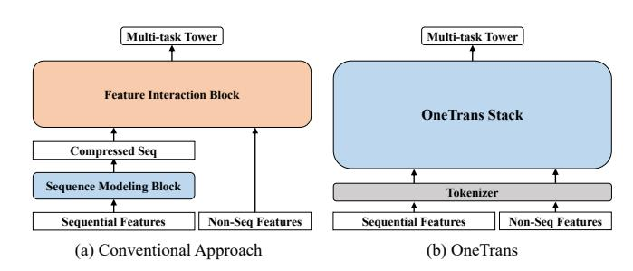
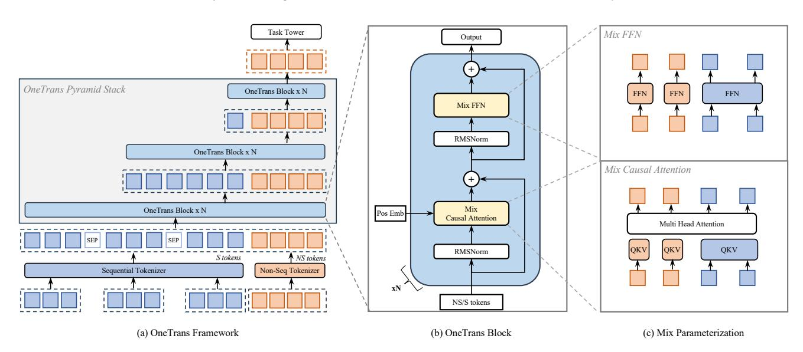
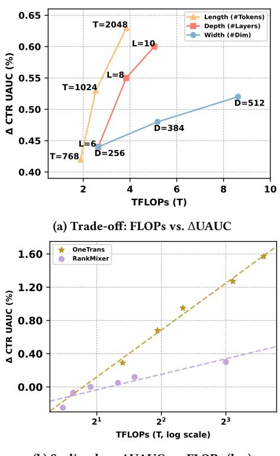

# OneTrans: Unified Feature Interaction and Sequence Modeling with One Transformer in Industrial Recommender

Zhaoqi Zhang∗ Nanyang Technological University ByteDance Singapore, Singapore zhaoqi.zhang@bytedance.com

Haolei Pei∗ ByteDance Singapore, Singapore haolei.pei@bytedance.com

Jun Guo∗ ByteDance Singapore, Singapore jun.guo@bytedance.com

Tianyu Wang ByteDance Singapore, Singapore tianyu.wang01@bytedance.com

Yufei Feng ByteDance Hangzhou, China fengyihui@bytedance.com

Hui Sun ByteDance Hangzhou, China sunhui.sunh@bytedance.com

Shaowei Liu† ByteDance Singapore, Singapore liushaowei.nphard@bytedance.com

Aixin Sun† Nanyang Technological University Singapore, Singapore axsun@ntu.edu.sg

#### Abstract

In recommendation systems, scaling up feature-interaction modules (e.g., Wukong, RankMixer) or user-behavior sequence modules (e.g., LONGER) has achieved notable success. However, these efforts typically proceed on separate tracks, which not only hinders bidirectional information exchange but also prevents unified optimization and scaling. In this paper, we propose OneTrans, a unified Transformer backbone that simultaneously performs userbehavior sequence modeling and feature interaction. OneTrans employs a unified tokenizer to convert both sequential and nonsequential attributes into a single token sequence. The stacked OneTrans blocks share parameters across similar sequential tokens while assigning token-specific parameters to non-sequential tokens. Through causal attention and cross-request KV caching, OneTrans enables precomputation and caching of intermediate representations, significantly reducing computational costs during both training and inference. Experimental results on industrialscale datasets demonstrate that OneTrans scales efficiently with increasing parameters, consistently outperforms strong baselines, and yields a 5.68% lift in per-user GMV in online A/B tests.

# CCS Concepts

•Information systems→Information retrieval; Recommender systems;

# Keywords

Recommender System, Ranking Model, Scaling Laws

∗These authors contributed equally.

†Corresponding author.

© 2025 Copyright held by the owner/author(s). ACM ISBN 978-1-4503-XXXX-X/18/06

#### ACM Reference Format:

Zhaoqi Zhang, Haolei Pei, Jun Guo, Tianyu Wang, Yufei Feng, Hui Sun, Shaowei Liu, and Aixin Sun. 2025. OneTrans: Unified Feature Interaction and Sequence Modeling with One Transformer in Industrial Recommender. In Proceedings of Make sure to enter the correct conference title from your rights confirmation email (Conference acronym 'XX). ACM, New York, NY, USA, [9](#page-8-0) pages.

## 1 Introduction

Recommendation systems (RecSys) play a fundamental role in various information services, such as e-commerce [\[9,](#page-8-1) [35\]](#page-8-2), streaming media [\[2,](#page-8-3) [20,](#page-8-4) [28\]](#page-8-5) and social networks [\[31,](#page-8-6) [32\]](#page-8-7). Industrial RecSys generally adopt a cascaded ranking architecture [\[6,](#page-8-8) [16,](#page-8-9) [22\]](#page-8-10). First, a recall stage selects hundreds of candidates from billion-scale corpora [\[13,](#page-8-11) [36\]](#page-8-12). Then, a ranking stage scores each candidate and returns the top-�� items [\[11,](#page-8-13) [27,](#page-8-14) [28,](#page-8-5) [32,](#page-8-7) [37\]](#page-8-15). Deep Learning Recommendation Models (DLRMs) [\[19\]](#page-8-16) are widely adopted in the ranking stage of industrial recommenders.

We focus on the ranking stage in this paper, following the DLRMstyle ranking paradigm. For ranking, mainstream approaches iterate on two separate modules: (a) sequence modeling, which encodes user multi-behavior sequences into candidate-aware representations using local attention or Transformer encoders [\[1,](#page-8-17) [14,](#page-8-18) [25,](#page-8-19) [35\]](#page-8-2), and (b) feature interaction, which learns high-order crosses among non-sequential features (e.g., user profile, item profile, and context) via factorization, explicit cross networks, or attention over feature groups [\[11,](#page-8-13) [12,](#page-8-20) [27,](#page-8-14) [37\]](#page-8-15). As shown in Fig. [1\(](#page-1-0)a), these approaches typically encode user behaviors into a compressed sequence representation, then concatenate it with non-sequential features and apply a feature-interaction module to learn higher-order interaction; we refer to this design as the encode-then-interaction pipeline.

The success of large language models (LLMs) demonstrates that scaling model size (e.g., parameter size, training data) yields predictable gains in performance [\[15\]](#page-8-21), inspiring similar investigations

[This work is licensed under a Creative Commons Attribution 4.0 International License.](https://creativecommons.org/licenses/by/4.0) Conference acronym 'XX, Woodstock, NY

Accepted at The Web Conference 2026 (WWW 2026). Camera-ready version forthcoming.

Figure 1: Architectural comparison. (a) Conventional encodethen-interaction pipeline encodes sequential features and merges non-sequential features before a post-hoc feature interaction block. (b) OneTrans performs joint modeling of both sequential and non-sequential features within a single OneTrans (Transformer-style) stack.

within RecSys [\[1,](#page-8-17) [32,](#page-8-7) [37\]](#page-8-15). For feature interaction, Wukong [\[32\]](#page-8-7) stacks Factorization Machine blocks with linear compression to capture high-order feature interactions and establishes scaling laws, while RankMixer [\[37\]](#page-8-15) achieves favorable scaling through hardwarefriendly token-mixing with token-specific feed-forward networks (FFNs). For sequence modeling, LONGER[\[1\]](#page-8-17) applies causal Transformers to long user histories and shows that scaling depth and width yields monotonic improvements. Although effective in practice, separating sequence modeling and feature interaction as independent modules introduces two major limitations. First, the encode-then-interaction pipeline restricts bidirectional information flow, limiting how static/context features shape sequence representations [\[30\]](#page-8-22). Second, module separation fragments execution and increases latency, whereas a single Transformer-style backbone can reuse LLM optimizations e.g., KV caching, memory-efficient attention, and mixed precision, for more effective scaling [\[11\]](#page-8-13).

In this paper, we propose OneTrans, an innovative architectural paradigm with a unified Transformer backbone that jointly performs user-behavior sequence modeling and feature interaction. As shown in Fig. [1\(](#page-1-0)b), OneTrans enables bidirectional information exchange within the unified backbone. It employs a unified tokenizer that converts both sequential features (diverse behavior sequences) and non-sequential features (static user/item and contextual features) into a single token sequence, which is then processed by a pyramid of stacked OneTrans blocks, a Transformer variant tailored for industrial RecSys. To accommodate the diverse token sources in RecSys, unlike the text-only tokens in LLMs, each OneTrans block adopts a mixed parameterization similar to Hi-Former [\[11\]](#page-8-13). Specifically, all sequential tokens (from sequential features) share a single set of Q/K/V and FFN weights, while each non-sequential token (from non-sequential features) receives tokenspecific parameters to preserve its distinct semantics.

Unlike conventional encode-then-interaction frameworks, One-Trans eliminates the architectural barrier between sequential and non-sequential features through a unified causal Transformer backbone. This formulation brings RecSys scaling in line with LLM practices: the entire model can be scaled by adjusting backbone depth and width, while seamlessly inheriting mature LLM optimizations, such as FlashAttention [\[7\]](#page-8-23), and mixed precision training [\[17\]](#page-8-24). Particularly, cross-candidate and cross-request KV caching [\[1\]](#page-8-17) reduces the time complexity from ��(��) to ��(1) for sessions with �� candidates, making large-scale OneTrans deployment feasible.

In summary, our main contributions are fourfold: (1) Unified framework. We present OneTrans, a single Transformer backbone for ranking, equipped with a unified tokenizer that encodes sequential and non-sequential features into one token sequence, and a unified Transformer block that jointly performs sequence modeling and feature interaction. (2) Customization for recommenders. To bridge the gap between LLMs and RecSys tasks, OneTrans introduces a mixed parameterization that allocates token-specific parameters to diverse non-sequential tokens while sharing parameters for all sequential tokens. (3) Efficient training and serving. We improve efficiency with a pyramid strategy that progressively prunes sequential tokens and a cross-request KV Caching that reuses user-side computations across candidates. In addition, we adopt LLM optimizations such as FlashAttention, mixed-precision training, and half-precision inference to further reduce memory and compute. (4) Scaling and deployment. OneTrans demonstrates near log-linear performance gains with increased model size, providing evidence of a scaling law in real production data. When deployed online, it achieves statistically significant lifts on business KPIs while maintaining production-grade latency.

#### 2 Related Work

Early RecSys like DIN [\[35\]](#page-8-2) and its session-aware variants (DSIN) [\[9\]](#page-8-1) use local attention to learn candidate-conditioned summaries of user histories, but compress behaviors into fixed-length vectors per candidate, limiting long-range dependency modeling [\[34\]](#page-8-25). Selfattentive methods like SASRec [\[14\]](#page-8-18), BERT4Rec [\[25\]](#page-8-19), and BST [\[4\]](#page-8-26) eliminate this bottleneck by letting each position attend over the full history and improve sample efficiency with bidirectional masking. Recently, as scaling laws [\[15\]](#page-8-21) in RecSys are increasingly explored, LONGER [\[1\]](#page-8-17) pushes sequence modeling toward industrial scales by targeting ultra-long behavioral histories with efficient attention and serving-friendly designs. However, in mainstream pipelines these sequence encoders typically remain separate from the feature-interaction stack, leading to late fusion rather than joint optimization with static contextual features [\[30\]](#page-8-22).

On the feature-interaction side, early RecSys rely on manually engineered cross-features or automatic multiplicative interaction layers. Classical models such as Wide&Deep [\[5\]](#page-8-27), FM/DeepFM [\[3,](#page-8-28) [12\]](#page-8-20), and DCN/DCNv2 [\[26,](#page-8-29) [27\]](#page-8-14) provide efficient low-order or boundeddegree interactions. However, as recent scaling studies observe [\[32\]](#page-8-7), once the model stacks enough cross layers, adding more stops helping: model quality plateaus instead of continuing to improve. To overcome the rigidity of preset cross forms, attention-based approaches automatically learn high-order interactions. AutoInt [\[24\]](#page-8-30) learns arbitrary-order relations, and HiFormer [\[11\]](#page-8-13) introduces groupspecific projections to better capture heterogeneous, asymmetric interactions. With scaling up increasingly applied to featureinteraction modules, large-scale systems such as Wukong [\[32\]](#page-8-7) demonstrate predictable gains by stacking FM-style interaction blocks with linear compression, while RankMixer [\[37\]](#page-8-15) achieves favorable scaling via parallel token mixing and sparse MoE under strict latency budgets. However, these interaction modules typically adhere to the

Figure 2: System Architecture. (a) OneTrans overview. Sequential (S, blue) and non-sequential (NS, orange) features are tokenized separately. After inserting **[SEP]** between user behavior sequences, the unified token sequence is fed into stacked OneTrans Pyramid Blocks that progressively shrink the token length until it matches the number of NS tokens. (b) OneTrans Block: a causal pre-norm Transformer Block with RMSNorm, Mixed Causal Attention and Mixed FFN. (c) "Mixed" = mixed parameterization: S tokens share one set of QKV/FFN weights, while each NS token receives its own token-specific QKV/FFN.

interaction paradigm, which pushes interactions to a separate stage and blocks unified optimization with user sequence modeling [\[30\]](#page-8-22).

To date, progress in RecSys has largely advanced along two independent tracks: sequence modeling and feature interaction. InterFormer [\[30\]](#page-8-22) attempts to bridge this gap through a summarybased bidirectional cross architecture that enables mutual signal exchange between the two components. However, it still maintains them as separate modules, and the cross architecture introduces both architectural complexity and fragmented execution. Without a unified backbone for joint modeling and optimization, scaling the system as an integrated whole remains challenging.

Recent work on Generative Recommenders (GRs) frames recommendation as sequential transduction and proposes efficient long-context backbones such as HSTU [\[31\]](#page-8-6). This line is complementary to DLRMs that rely on rich non-sequential (NS) features.

# 3 Methodology

Before detailing our method, we briefly describe the task setting. In a cascaded industrial RecSys, each time the recall stage returns a candidate set (typically hundreds of candidate items) for a user ��. The ranking model then predicts a score to each candidate item ��:

��ˆ��,�� = �� ��  NS, S; Θ (1)

where NS is a set of non-sequential features derived from the user, the candidate item, and the context; S is a set of historical behavior sequences from the user; and Θ are trainable parameters. Common task predictions include the click-through rate (CTR) and the post-click conversion rate (CVR).

CTR��,�� = �� click = 1  NS, S; Θ , CVR��,�� = �� conv = 1  click = 1, NS, S; Θ . (2)

#### 3.1 OneTrans Framework Overview

As illustrated in Fig. [2\(](#page-2-0)a), OneTrans employs a unified tokenizer that maps sequential features S to S-tokens, and non-sequential features NS to NS-tokens. A pyramid-stacked Transformer then consumes the unified token sequence jointly within a single computation graph. We denote the initial token sequence as

X (0) = -S-tokens; NS-tokens ∈ R (��S+��NS )×�� . (3)

This token sequence is constructed by concatenating ��S number of S-tokens and ��NS number of NS-tokens, with all tokens having dimensionality ��. Note that, the S-tokens contain learnable [SEP] tokens inserted to delimit boundaries between different kind of user-behavior sequences. As shown in Fig. [2\(](#page-2-0)b), each OneTrans block progressively refines the token states through:

Z (��) = MixedMHA Norm X (��−1) + X (��−1) , (4)

X (��) = MixedFFN Norm Z (��) + Z (��) . (5)

Here, MixedMHA (Mixed Multi-Head Attention) and MixedFFN (Mixed Feed-Forward Network) adopt a mixed parameterization strategy (see Fig. [2\(](#page-2-0)c)) sharing weights across sequential tokens, while assigning separate parameters to non-sequential tokens in both the attention and feed-forward layers.

A unified causal mask enforces autoregressive constraints, restricting each position to attend only to preceding tokens. Specifically, NS-tokens are permitted to attend over the entire history of S-tokens, thereby enabling comprehensive cross-token interaction. By stacking such blocks with pyramid-style tail truncation applied to S-tokens, the model progressively distills compact high-order

information into the NS-tokens. The final token states are then passed to task-specific heads for prediction.

By unifying non-sequential and sequential features into a unified token sequence and modeling them with a causal Transformer, OneTrans departs from the conventional encode-then-interaction pipeline. This unified design naturally enables (i) intra-sequence interactions within each behavior sequence, (ii) cross-sequence interactions across multiple sequences, (iii) multi-source feature interactions among item, user, and contextual features, and (iv) sequencefeature interactions, all within a single Transformer stack.

The unified formulation enables us to seamlessly inherit mature LLM engineering optimizations, including KV caching and memoryefficient attention, thereby substantially reducing inference latency. We argue this unified formulation is well suited to tackling multisequence and cross-domain recommendation challenges in a single, and scalable architecture. Next, we detail the design.

#### 3.2 Features and Tokenization

To construct the initial token sequence X (0) , OneTrans first applies a feature preprocessing pipeline that maps all raw feature inputs into embedding vectors. These embeddings are then partitioned into (i) a multi-behavior sequential subset and (ii) a non-sequential subset representing user, item, or context features. Separate tokenizers are applied to each subset.

3.2.1 Non-Sequential Tokenization. Non-sequential features NS include both numerical inputs (e.g., price, CTR) and categorical inputs (e.g., user ID, item category). All features are either bucketized or one-hot encoded and then embedded. Since industrial systems typically involve hundreds of features with varying importance, there are two options for controlling the number of non-sequential tokens, denoted by ���� �� :

Group-wise Tokenizer (aligned with RankMixer [\[37\]](#page-8-15)). Features are manually partitioned into semantic groups {g1, . . . , g���� �� }. Each group is concatenated and passed through a group-specific MLP:

NS-tokens = -MLP1 (concat(g1)), . . . , MLP���� �� (concat(g���� �� )) . (6)

Auto-Split Tokenizer. Alternatively, all features are concatenated and projected once by a single MLP, then split:

NS-tokens = split MLP(concat(NS)), ���� �� . (7)

Auto-Split Tokenizer reduces kernel launch overhead compared with Group-wise approach, by using a single dense projection. We will evaluate both choices through experiments.

Ultimately, non-sequential tokenization yields ���� �� number of non-sequential tokens, each of dimensionality ��.

3.2.2 Sequential Tokenization. OneTrans accepts multi-behavior sequences as

S = {S1, . . . , S�� }, S�� = e��1, . . . , e������ . (8)

Each sequence S�� consists of ���� number of event embeddings e, which is constructed by concatenating the item ID with its corresponding side information like item category and price.

Multi-behavior sequences can vary in their raw dimensionality. Hence, for each sequence S�� , we use one shared projection MLP�� to

convert its all event e���� as a common dimensionality ��:

S˜ �� = -MLP��(e��1), . . . , MLP��(e������ ) ∈ R ���� ×�� . (9)

Aligned sequences S˜ �� are merged into a single token sequence by one of two rules: 1) Timestamp-aware: interleave all events by time, with sequence-type indicators; 2) Timestamp-agnostic: concatenate sequences by event impact, e.g., purchase → add-to-cart → click, inserting learnable [SEP] tokens between sequences. In the latter, behaviors with higher user intent are placed earlier in the sequence. Ablation results indicate that, when timestamps are available, the timestamp-aware rule outperforms the impact-ordered alternative. Formally, we have:

S-Tokens = Merge S˜ 1, . . . , S˜ ∈ R ���� ×�� , ���� = ∑︁�� ��=1 ���� +��SEP. (10)

#### 3.3 OneTrans Block

As shown in Fig. [2\(](#page-2-0)b), each OneTrans block is a pre-norm causal Transformer applied to a normalized token sequence: ���� sequential S-tokens, followed by ���� �� non-sequential NS-tokens. Inspired by the findings on heterogeneous feature groups [\[11\]](#page-8-13), we make a lightweight modification to Transformer to allow a mixed parameter scheme, see Fig. [2\(](#page-2-0)c). Specifically, homogeneous S-tokens share one set of parameters. The NS-tokens, being heterogeneous across sources/semantics, receive token-specific parameters.

Unlike LLM inputs, the token sequence in RecSys combines sequential S-tokens with diverse NS-tokens whose value ranges and statistics differ substantially. Post-norm setups can cause attention collapse and training instability due to these discrepancies. To prevent this, we apply RMSNorm [\[33\]](#page-8-31) as pre-norm to all tokens, aligning scales across token types and stabilizing optimization.

3.3.1 Mixed (shared/token-specific) Causal Attention. OneTrans adopts a standard multi-head attention (MHA) with a causal attention mask; the only change is how Q/K/V are parameterized. Let x�� ∈ R �� be the ��-th token. To compute Q/K/V, we use a shared projection for S-tokens (�� ≤ ���� ) and ���� �� token-specific projections for NS-tokens (�� &gt; ���� ):

 q�� , k�� , v�� = W �� �� x�� , W�� �� x�� , W�� �� x�� , (11)

where WΨ (Ψ ∈ {��, ��,�� }) follows a mixed parameterization scheme:

WΨ �� = WΨ S , �� ≤ ���� (shared for S-tokens), WΨ NS,��, �� &gt; ���� (token-specific for NS-tokens). (12)

 Attention uses a standard causal mask, with NS-tokens placed after S-tokens. This induces: (1) S-side. Each S-token attends only to earlier �� positions. For timestamp-aware sequences, every event conditions on its history; for timestamp-agnostic sequences (ordered by intent, e.g., purchase → add-to-cart → click/impression), causal masking lets high-intent signals inform and filter later lowintent behaviors. (2) NS-side. Every NS-token attends to the entire �� history, effectively a target-attention aggregation of sequence evidence, and to preceding NS-tokens, increasing token-level interaction diversity. (3) Pyramid support. On both S and NS sides, causal masking progressively concentrates information toward later positions, naturally supporting the pyramid schedule that prunes tokens layer by layer, to be detailed shortly.

3.3.2 Mixed (shared/token-specific) FFN. Similarly, the feed-forward network follows the same parameterization strategy: token-specific FFNs for NS-tokens, and a shared FFN for S-tokens,

MixedFFN(x��) = W2 �� �� (W1 x��). (13)

Here W1 and W2 follow the mixed parameterization of Eqn. [\(12\)](#page-3-0), i.e., shared for �� ≤ ���� and token-specific for �� &gt; ���� .

In summary, relative to a standard causal Transformer, One-Trans changes only the parameterization: NS-tokens use tokenspecific QKV and FFN; S-tokens share a single set of parameters. A single causal mask ties the sequence together, allowing NS-tokens to aggregate the entire behavior history while preserving efficient, Transformer-style computation.

### 3.4 Pyramid Stack

As noted in Section [3.3,](#page-3-1) causal masking concentrates information toward later positions. Exploiting this recency structure, we adopt a pyramid schedule: at each OneTrans block layer, only a subset of the most recent S-tokens issue queries, while keys/values are still computed over the full sequence; the query set shrinks with depth.

Let X = {x�� } �� ��=1 be the input token list and Q = {��−�� ′+1, . . . , ��} denote a tail index set with �� ′ ≤ ��. Following Eqn. [12,](#page-3-0) we modify queries as �� ∈ Q:

q�� = W �� x�� , �� ∈ Q, (14)

while keys and values are computed as usual over the full sequence {1, . . . , ��}. After attention, only outputs for �� ∈ Q are retained, reducing the token length to �� ′ and forming a pyramidal hierarchy across layers.

This design yields two benefits: (i) Progressive distillation: long behavioral histories are funneled into a small tail of queries, focusing capacity on the most informative events and consolidating information into the NS-tokens; and (ii) Compute efficiency: attention cost becomes �� ����′�� and FFN scales linearly with �� ′ . Shrinking the query set directly reduces FLOPs and activation memory.

# 3.5 Training and Deployment Optimization

3.5.1 Cross Request KV Caching. In industrial RecSys, samples from the same request are processed contiguously both during training and serving: their S-tokens remain identical across candidates, while NS-tokens vary per candidate item. Leveraging this structure, we integrate the widely adopted KV Caching [\[1\]](#page-8-17) into OneTrans, yielding a unified two-stage paradigm.

Stage I (S-side, once per request). Process all S-tokens with causal masking and cache their key/value pairs and attention outputs. This stage executes once per request.

Stage II (NS-side, per candidate). For each candidate, compute its NS-tokens and perform cross-attention against the cached Sside keys/values, followed by token-specific FFN layers. Specially, candidate-specific sequences (e.g., SIM [\[21\]](#page-8-32)) are pre-aggregated into NS-tokens via pooling, as they cannot reuse the shared S-side cache.

The KV Caching amortizes S-side computation across candidates, keeping per-candidate work lightweight and eliminating redundant computations for substantial throughput gains.

Table 1: Dataset overview for OneTrans experiments.

| Metric |             |                      | Value               |
|--------|-------------|----------------------|---------------------|
| #      | Impressions | (samples)            | 29.1B               |
| #      | Users       | (unique)             | 27.9M               |
| #      | Items       | (unique)             | 10.2M               |
| Daily  |             | impressions (mean ±  | std) 118.2M ± 14.3M |
| Daily  |             | active users (mean ± | std) 2.3M ± 0.3M    |

Since user behavioral sequences are append-only, we extend KV Caching across requests: each new request reuses the previous cache and computes only the incremental keys/values for newly added behaviors. This reduces per-request sequence computation from ��(��) to ��(��), where �� is the number of new behaviors since the last request.

3.5.2 Unified LLM Optimizations. We employ FlashAttention-2 [\[8\]](#page-8-33) to reduce attention I/O and the quadratic activation footprint of vanilla attention via tiling and kernel fusion, yielding lower memory usage and higher throughput in both training and inference. To further ease memory pressure, we use mixed-precision training (BF16/FP16) [\[18\]](#page-8-34) together with activation recomputation [\[10\]](#page-8-35), which discards selected forward activations and recomputes them during backpropagation. This combination trades modest extra compute for substantial memory savings, enabling larger batches and deeper models without architectural changes.

### 4 Experiments

Through both offline evaluations and online tests, we aim to answer the following Research Questions (RQs): RQ1: Unified stack vs. encode–then–interaction. Does the single Transformer stack yield consistent performance gains under the comparable compute? RQ2: Which design choices matter? We conduct ablations on the input layer (e.g., tokenizer, sequence fusion) and the OneTrans block (e.g., parameter sharing, attention type, pyramid stacking) to evaluate the importance of different design choices for performance and efficiency. RQ3: Systems efficiency. Do pyramid stacking, cross-request KV Caching, FlashAttention-2, and mixed precision with recomputation reduce FLOPs/memory and latency under the same OneTrans graph? RQ4: Scaling law. As we scale length (token sequence length), width (��model), depth (number of layers), do loss/performance exhibit the expected log-linear trend? RQ5: Online A/B Tests. Does deploying OneTrans online yield statistically significant lifts in key business metrics (e.g., order/u, GMV/u) under production latency constraints?

# 4.1 Experimental Setup

4.1.1 Dataset. For offline evaluation, we evaluate OneTrans in a large-scale industrial ranking scenario using production logs under strict privacy compliance (all personally identifiable information is anonymized and hashed). Data are split chronologically, with all features snapshotted at impression time to prevent temporal leakage and ensure online-offline consistency. Labels (e.g., clicks and orders) are aggregated within fixed windows aligned with production settings. Table [1](#page-4-0) summarizes the dataset statistics.

Table 2: Offline effectiveness (CTR/CVR) and efficiency; higher AUC/UAUC is better. \* indicates models deployed in our production in chronological order: DCNv2+DIN → RankMixer+DIN → RankMixer+Transformer → OneTransS → OneTransL

| Type Model                     |       |              |         | CTR     | CVR     | (order)  | Efficiency |        |
|--------------------------------|-------|--------------|---------|---------|---------|----------|------------|--------|
|                                |       |              | AUC     | ↑ UAUC  | ↑ AUC   | ↑ UAUC ↑ | Params (M) | TFLOPs |
| (1) Base model DCNv2           | + DIN | (base)*      | 0.79623 | 0.71927 | 0.90361 | 0.71955  | 10         | 0.06   |
| (2) Feature-interaction        |       |              |         |         |         |          |            |        |
| Wukong                         | +     | DIN          | +0.08%  | +0.11%  | +0.14%  | +0.11%   | 28         | 0.54   |
| HiFormer                       | +     | DIN          | +0.11%  | +0.18%  | +0.23%  | -0.20%   | 108        | 1.35   |
| RankMixer                      | +     | DIN*         | +0.27%  | +0.36%  | +0.43%  | +0.19%   | 107        | 1.31   |
| (3) Sequence-modeling          |       |              |         |         |         |          |            |        |
| RankMixer                      | +     | StackDIN     | +0.40%  | +0.37%  | +0.63%  | -1.28%   | 108        | 1.43   |
| RankMixer                      | +     | LONGER       | +0.49%  | +0.59%  | +0.47%  | +0.44%   | 109        | 1.87   |
| RankMixer                      | +     | Transformer* | +0.57%  | +0.90%  | +0.52%  | +0.75%   | 109        | 2.51   |
| (4) Unified framework OneTrans | S *   |              | +1.13%  | +1.77%  | +0.90%  | +1.66%   | 91         | 2.64   |
| OneTrans                       | L     | (default)*   | +1.53%  | +2.79%  | +1.14%  | +3.23%   | 330        | 8.62   |

4.1.2 Tasks and Metrics. We evaluate two binary ranking tasks as defined in Eqn. [\(2\)](#page-2-1): CTR and CVR. Performance is measured by AUC and UAUC (impression-weighted user-level AUC).

Next-batch evaluation. Data are processed chronologically. For each mini-batch, we (i) log predictions in eval mode, then (ii) train on the same batch. AUC and UAUC are computed daily from each day's predictions and finally macro-averaged across days.

Efficiency metrics. We report Params (model parameters excluding sparse embeddings) and TFLOPs (training compute in TFLOPs at batch size 2048).

4.1.3 Baselines. We construct industry-standard model combinations as baselines using the same features and matched compute budgets. Under the encode-then-interaction paradigm, we start from the widely-used production baseline DCNv2+DIN [\[27,](#page-8-14) [35\]](#page-8-2) and progressively strengthen the feature-interaction module: DCNv2 → Wukong [\[32\]](#page-8-7) → HiFormer [\[11\]](#page-8-13) → RankMixer [\[37\]](#page-8-15). With RankMixer fixed, we then vary the sequence-modeling module: StackDIN → Transformer [\[4\]](#page-8-26) → LONGER [\[1\]](#page-8-17).

4.1.4 Hyperparameter Settings. We report two settings: OneTransS uses 6 stacked OneTrans blocks width ��=256, and ��=4 heads, targeting ≈ 100M parameters. OneTransL scales to 8 layers with width ��=384.

Inputs are processed through a unified tokenizer (timestampaware fusion for multi-behavior sequences; Auto-Split for nonsequential features) and a heuristic pyramid schedule that, at each layer, linearly shrinks the number of sequential query tokens from 1190 to 12 (OneTransS) / from 1500 to 16 (OneTransL). Concretely, we linearly reduce the number of sequential query tokens across layers, rounding the token count at each layer to the nearest multiple of 32, and set the top layer to match the number of non-sequential tokens.

Optimization and infrastructure. We use a dual-optimizer strategy without weight decay: sparse embeddings are optimized with Adagrad (��1=0.1, ��2=1.0), and dense parameters with RM-SProp (lr=0.005, alpha=0.99999,momentum=0). We apply stabilization techniques commonly used in large-scale Transformer training, including Pre-Norm [\[29\]](#page-8-36), and global grad-norm clipping [\[23\]](#page-8-37). The per-GPU batch size is set to 2048 during training, with gradient

clipping thresholds of 90 for dense layers and 120 for sparse layers. For online inference, we adopt a smaller batch size of 100 per GPU to balance throughput and latency. Training uses data-parallel all-reduce on 16 H100 GPUs.

# 4.2 RQ1: Performance Evaluation

We anchor our comparison on DCNv2+DIN, the pre-scaling production baseline in our scenario (Table [2\)](#page-5-0). Under the encode-theninteraction paradigm, scaling either component independently is beneficial: upgrading the feature interaction module (DCNv2 → Wukong → HiFormer → RankMixer) or the sequence modeling module (StackDIN → Transformer → LONGER) yields consistent gains in CTR AUC/UAUC and CVR AUC. In our system, improvements above +0.1% in these metrics are considered meaningful, while gains above +0.3% typically correspond to statistically significant effects in online A/B tests. However, CVR UAUC is treated cautiously due to smaller per-user sample sizes and higher volatility.

Moving to a unified design, OneTransS surpasses the baseline by +1.13%/+1.77% (CTR AUC/UAUC) and +0.90%/+1.66% (CVR AUC/UAUC). At a comparable parameter scale, it also outperforms RankMixer+Transformer with similar training FLOPs (2.64T vs. 2.51T), demonstrating the benefits of unified modeling. Scaling further, OneTransL delivers the best overall improvement of +1.53% /+2.79% (CTR AUC/UAUC) and +1.14%/+3.23% (CVR AUC/UAUC), showing a predictable quality performance as model capacity grows.

In summary, unifying sequence modeling and feature interaction in a single Transformer yields more reliable and compute-efficient improvements than scaling either component independently.

# 4.3 RQ2: Design Choices via Ablation Study

We perform an ablation study of the proposed OneTrans model to quantify the contribution of key design choices. The complete results are summarized in Table [3.](#page-6-0) We evaluate the following variants: Input variants: i) Replacing the Auto-Split Tokenizer with a Group-wise Tokenizer (Row 1); ii) Using a timestamp-agnostic fusion strategy instead of the timestamp-aware sequence fusion (Row 2); iii) Removing [SEP] tokens in the timestamp-aware sequence fusion (Row 3); OneTrans block variants: i) Sharing a single set of

Table 3: Impact of the choices of input design and OneTrans block design, using the OneTransS model as the reference.

| Type Variant             |            | AUC               | CTR ↑ UAUC | CVR ↑ AUC | (order) ↑ UAUC ↑ | Efficiency Params (M) | TFLOPs |
|--------------------------|------------|-------------------|------------|-----------|------------------|-----------------------|--------|
| Group-wise               | Tokenzier  | -0.10%            | -0.30%     | -0.12%    | -0.10%           | 78                    | 2.35   |
| Timestamp-agnostic Input | Fusion     | -0.09%            | -0.22%     | -0.20%    | -0.21%           | 91                    | 2.64   |
| Timestamp-agnostic       | Fusion w/o | Sep Tokens -0.13% | -0.32%     | -0.29%    | -0.33%           | 91                    | 2.62   |
| OneTrans Block           |            |                   |            |           |                  |                       |        |
| Shared                   | parameters | -0.15%            | -0.29%     | -0.14%    | -0.29%           | 24                    | 2.64   |
| Full attention           |            | +0.00%            | +0.01%     | -0.03%    | +0.06%           | 91                    | 2.64   |
| w/o pyramid              | stack      | -0.05%            | +0.06%     | -0.04%    | -0.42%           | 92                    | 8.08   |

(b) Scaling law: ΔUAUC vs. FLOPs (log)

Figure 3: Comparison of trade-off and scaling law.

Q/K/V and FFN parameters across all tokens, instead of assigning separate parameters to NS-tokens (Row 4); ii) Replacing causal attention with full attention (Row 5); iii) Disabling the pyramid stack by keeping the full token sequence at all layers (Row 6).

In summary, the ablations show that 1) Auto-Split Tokenizer provides a clear advantage over manually grouping non-sequential features into tokens, indicating that allowing the model to automatically build non-sequential tokens is more effective than relying on human-defined feature grouping; 2) Timestamp-aware fusion beats intent-based ordering when timestamps exist, suggesting that temporal ordering should be prioritized over event impact; 3) Under timestamp-agnostic fusion, learnable **[SEP]** tokens help the model separate sequences; 4) Token-specific parameters for NS-tokens

outperform a shared projection, enabling better feature discrimination; 5) Causal and full attention perform similarly, but full attention disables standard optimizations such as KV caching; 6) Keeping full-length tokens at all layers provides no benefit: One-Trans effectively summarizes information into a small tail, so the pyramid design can safely prune queries to save computation. Moreover, under a fixed TFLOPs budget, the pyramid design supports close to 1.75× longer sequences than a full-length design, better exploiting gains from length extension.

# 4.4 RQ3: Systems Efficiency

To quantify the optimizations in Section [3.5,](#page-4-1) we ablate them on an unoptimized OneTransS baseline and report training/inference metrics in Table [4.](#page-7-0)

As shown in the table, (i) Pyramid stack reduces both training cost (runtime/memory) and serving overhead (p99 latency/memory) by pruning sequential query tokens; (ii) cross-request KV caching removes redundant sequence computation, consistently improving runtime/latency and memory in both training and serving; (iii) FlashAttention yields substantial training gains with modest serving improvements; and (iv) mixed precision with recomputation provides the largest serving gains (p99 latency and inference memory), while also improving training efficiency.

These results demonstrate the effectiveness of LLM optimizations for large-scale recommendation. Building on these results, we scale to OneTransL and show it maintains online efficiency comparable to the much smaller DCNv2+DIN baseline (Table [5\)](#page-7-1), highlighting that a unified Transformer backbone enables direct adoption of LLM optimizations.

# 4.5 RQ4: Scaling-Law Validation

We probe scaling laws for OneTrans along three axes: (1) length input token sequence length, (2) depth - number of stacked blocks, and (3) width - hidden-state dimensionality.

As shown in Fig. [3\(](#page-6-1)a), increasing length yields the largest gains by introducing more behavioral evidence. Between depth and width, we observe a clear trade-off: increasing depth generally delivers larger performance improvements than simply widening width, as deeper stacks extract higher-order interactions and richer abstractions. However, deeper models also increase serial computation, whereas widening is more amenable to parallelism. Thus, choosing between depth and width should balance performance benefits against system efficiency under the target hardware budget.

Table 4: Impact of variants against the unoptimized OneTransS. Memory is peak GPU usage.

| Variant                              | Training Runtime (ms) | Memory (GB) | Inference Latency (p99; ms) | Memory (GB) |
|--------------------------------------|-----------------------|-------------|-----------------------------|-------------|
| Unoptimized OneTrans S               | 407                   | 53.13       | 54.00                       | 1.70        |
| + Pyramid stack                      | − 28 7%               | − 42 6%     | − 8 4%                      | − 6 9%      |
| + Cross-Request KV Caching           | − 30 2%               | − 58 4%     | − 29 6%                     | − 52 9%     |
| + FlashAttention                     | − 50 1%               | − 58 9%     | − 12 3%                     | − 11 6%     |
| + Mixed Precision with Recomputation | − 32 9%               | − 49 0%     | − 69 1%                     | − 30 0%     |

Table 5: Key efficiency comparison between OneTransL and the DCNv2+DIN baseline.

| Metric                      | DCNv2+DIN | OneTrans L |
|-----------------------------|-----------|------------|
| TFLOPs                      | 0.06      | 8.62       |
| Params (M)                  | 10        | 330        |
| MFU                         | 13.4      | 30.8       |
| Inference Latency (p99, ms) | 13.6      | 13.2       |
| Training Memory (GB)        | 20        | 32         |
| Inference Memory (GB)       | 1.8       | 0.8        |

We further analyze scaling-law behavior by jointly widening and deepening OneTrans, and — for comparison — by scaling the RankMixer+Transformer baseline on the RankMixer side till 1B; we then plot ΔUAUC versus training FLOPs on a log scale. As shown in Fig. [3\(](#page-6-1)b), OneTrans and RankMixer both exhibit clear log-linear trends, but OneTrans shows a steeper slope, likely because RankMixer-centric scaling lacks a unified backbone and its MoE-based expansion predominantly widens the FFN hidden dimension. Together, these results suggest that OneTrans is more parameter- and compute-efficient, offering favorable performance– compute trade-offs for industrial deployment.

While we can deploy OneTransL under strict online p99 latency constraints, scaling substantially beyond this regime remains constrained by online efficiency, and we leave further system–model co-optimizations to future work.

# 4.6 RQ5: Online A/B Tests

We assess the business impact of OneTrans in two large-scale industrial scenarios: (i) Feeds (home feeds), and (ii) Mall (the overall setting that includes Feeds and other sub-scenarios). Traffic is split at the user/account level with hashing and user-level randomization. Both the control and treatment models are trained and deployed with the past 1.5 years of production data to ensure a fair comparison.

Our prior production baseline, RankMixer+Transformer, serves as the control (≈ 100M neural-network parameters) and does not use sequence KV caching. The treatment deploys OneTransL with the serving optimizations described in Section [3.5.](#page-4-1)

We report user-level click/u, order/u, and gmv/u as relative deltas (Δ%) versus the RankMixer+Transformer control with twosided 95% CIs (user-level stratified bootstrap), and end-to-end latency, measured as the relative change in p99 per-impression

Table 6: Online A/B results: OneTransL (treatment) vs. RankMixer+Transformer (control). Click/u, Order/u, GMV/u, are relative deltas (%). Latency is the relative end-to-end perimpression change Δ% (lower is better). \* denotes �� &lt; 0.05, and \*\* for �� &lt; 0.01

| Scenario | click/u    | order/u    | gmv/u     | Latency ( �� 99 ) ↓ |
|----------|------------|------------|-----------|---------------------|
| Feeds    | + 7 737%** | + 4 351%*  | + 5 685%* | − 3 91%             |
| Mall     | + 5 143%** | + 2 577%** | + 3 670%* | − 3 26%             |

time from request arrival to response emission (Δ%; lower is better). As shown in Table [6,](#page-7-2) OneTransL delivers consistent gains. In Feeds, it achieves +7.737% click/u, +4.3510% order/u, +5.6848% gmv/u, and −3.91% latency. In Mall, it achieves +5.143% click/u, +2.5772% order/u, +3.6696% gmv/u, and −3.26% latency. These results indicate that the unified modeling framework improves business metrics while reducing serving time relative to a strong non-unified baseline.

We further observe a +0.7478% increase in user Active Days and a significant improvement of +13.59% in cold-start product order/u, highlighting the strong generalization capability of the proposed model.

#### 5 Conclusion

We present OneTrans, a unified Transformer backbone for personalized ranking to replace the conventional encode–then–interaction. A unified tokenizer converts both sequential and non-sequential attributes into one token sequence, and a unified Transformer block jointly performs sequence modeling and feature interaction via shared parameters for homogeneous (sequential) tokens and tokenspecific parameters for heterogeneous (non-sequential) tokens. To make the unified stack efficient at scale, we adopt a pyramid schedule that progressively prunes sequential tokens and a cross-request KV Caching that reuses user-side computation; the design further benefits from LLM-style systems optimizations (e.g., FlashAttention, mixed precision). Across large-scale evaluations, OneTrans exhibits near log-linear performance gains as width/depth increase, and delivers statistically significant business lifts while maintaining production-grade latency. We believe this unified design offers a practical way to scale recommender systems while reusing the system optimizations that have powered recent LLM advances.

#### References

[1] Zheng Chai, Qin Ren, Xijun Xiao, Huizhi Yang, Bo Han, Sijun Zhang, Di Chen, Hui Lu, Wenlin Zhao, Lele Yu, et al. 2025. LONGER: Scaling Up Long Sequence Modeling in Industrial Recommenders. arXiv preprint arXiv:2505.04421 (2025). [2] Jianxin Chang, Chenbin Zhang, Yiqun Hui, Dewei Leng, Yanan Niu, Yang Song, and Kun Gai. 2023. Pepnet: Parameter and embedding personalized network for infusing with personalized prior information. In Proceedings of the 29th ACM SIGKDD Conference on Knowledge Discovery and Data Mining. 3795–3804. [3] Yin-Wen Chang, Cho-Jui Hsieh, Kai-Wei Chang, Chih-Jen Lin, et al. 2010. Training and testing low-degree polynomial data mappings via linear svm. Journal of Machine Learning Research 11, 4 (2010). [4] Qiwei Chen, Huan Zhao, Wei Li, Pipei Huang, and Wenwu Ou. 2019. Behavior Sequence Transformer for E-commerce Recommendation in Alibaba. arXiv[:1905.06874](https://arxiv.org/abs/1905.06874) [cs.IR]<https://arxiv.org/abs/1905.06874> [5] Heng-Tze Cheng, Levent Koc, Jeremiah Harmsen, Tal Shaked, Tushar Chandra, Hrishi Aradhye, Glen Anderson, Greg Corrado, Wei Chai, Mustafa Ispir, Rohan Anil, Zakaria Haque, Lichan Hong, Vihan Jain, Xiaobing Liu, and Hemal Shah. 2016. Wide & Deep Learning for Recommender Systems. arXiv[:1606.07792 \cs.LG] <https://arxiv.org/abs/1606.07792> [6] Paul Covington, Jay Adams, and Emre Sargin. 2016. Deep neural networks for youtube recommendations. In Proceedings of the 10th ACM conference on recommender systems. 191–198. [7] Tri Dao, Dan Fu, Stefano Ermon, Atri Rudra, and Christopher Ré. 2022. Flashattention: Fast and memory-efficient exact attention with io-awareness. Advances in neural information processing systems 35 (2022), 16344–16359. [8] Tri Dao, Aleksander Thomas, Anima Anandkumar, Matei Zaharia, and Christopher Re. 2023. FlashAttention-2: Faster Attention with Better Parallelism and Work Partitioning. arXiv preprint arXiv:2307.08691 (2023). [9] Yufei Feng, Fuyu Lv, Weichen Shen, Menghan Wang, Fei Sun, Yu Zhu, and Keping Yang. 2019. Deep Session Interest Network for Click-Through Rate Prediction. arXiv[:1905.06482](https://arxiv.org/abs/1905.06482) [cs.IR]<https://arxiv.org/abs/1905.06482> [10] Audrunas Gruslys, Remi Munos, Ivo Daniel, Oriol Vinyals, and Koray Kavukcuoglu. 2016. Memory-Efficient Backpropagation through Time. In Advances in Neural Information Processing Systems (NeurIPS). [11] Huan Gui, Ruoxi Wang, Ke Yin, Long Jin, Maciej Kula, Taibai Xu, Lichan Hong, and Ed H. Chi. 2023. Hiformer: Heterogeneous Feature Interactions Learning with Transformers for Recommender Systems. arXiv[:2311.05884](https://arxiv.org/abs/2311.05884) [cs.IR] [https:](https://arxiv.org/abs/2311.05884) [//arxiv.org/abs/2311.05884](https://arxiv.org/abs/2311.05884) [12] Huifeng Guo, Ruiming Tang, Yunming Ye, Zhenguo Li, Xiuqiang He, and Zhenhua Dong. 2018. DeepFM: An End-to-End Wide & Deep Learning Framework for CTR Prediction. arXiv[:1804.04950](https://arxiv.org/abs/1804.04950) [cs.IR]<https://arxiv.org/abs/1804.04950> [13] Junjie Huang, Jizheng Chen, Jianghao Lin, Jiarui Qin, Ziming Feng, Weinan Zhang, and Yong Yu. 2024. A comprehensive survey on retrieval methods in recommender systems. arXiv preprint arXiv:2407.21022 (2024). [14] Wang-Cheng Kang and Julian McAuley. 2018. Self-Attentive Sequential Recommendation. arXiv[:1808.09781](https://arxiv.org/abs/1808.09781) [cs.IR]<https://arxiv.org/abs/1808.09781> [15] Jared Kaplan, Sam McCandlish, Tom Henighan, Tom B Brown, Benjamin Chess, Rewon Child, Scott Gray, Alec Radford, Jeffrey Wu, and Dario Amodei. 2020. Scaling laws for neural language models. arXiv preprint arXiv:2001.08361 (2020). [16] Shichen Liu, Fei Xiao, Wenwu Ou, and Luo Si. 2017. Cascade ranking for operational e-commerce search. In Proceedings of the 23rd ACM SIGKDD International Conference on Knowledge Discovery and Data Mining. 1557–1565. [17] Paulius Micikevicius, Sharan Narang, Jonah Alben, Gregory Diamos, Erich Elsen, David Garcia, Boris Ginsburg, Michael Houston, Oleksii Kuchaiev, Ganesh Venkatesh, et al. 2017. Mixed precision training. arXiv preprint arXiv:1710.03740 (2017). [18] Paulius Micikevicius, Sharan Narang, Jonah Alben, Greg Diamos, Erich Elsen, David Garcia, Boris Ginsburg, Michael Houston, Oleksii Kuchaiev, Ganesh Venkatesh, and Hao Wu. 2018. Mixed Precision Training. In International Conference on Learning Representations (ICLR). [19] Maxim Naumov, Dheevatsa Mudigere, Hao-Jun Michael Shi, Jianyu Huang, Narayanan Sundaraman, Jongsoo Park, Xiaodong Wang, Udit Gupta, Carole-Jean Wu, Alisson G Azzolini, et al. 2019. Deep learning recommendation model for personalization and recommendation systems. arXiv preprint arXiv:1906.00091 (2019). [20] Nikil Pancha, Andrew Zhai, Jure Leskovec, and Charles Rosenberg. 2022. Pinnerformer: Sequence modeling for user representation at pinterest. In Proceedings of the 28th ACM SIGKDD conference on knowledge discovery and data mining. 3702–3712. [21] Qi Pi, Guorui Zhou, Yujing Zhang, Zhe Wang, Lejian Ren, Ying Fan, Xiaoqiang Zhu, and Kun Gai. 2020. Search-based user interest modeling with lifelong sequential behavior data for click-through rate prediction. In Proceedings of the 29th ACM International Conference on Information & Knowledge Management. 2685–2692. [22] Jiarui Qin, Jiachen Zhu, Bo Chen, Zhirong Liu, Weiwen Liu, Ruiming Tang, Rui Zhang, Yong Yu, and Weinan Zhang. 2022. Rankflow: Joint optimization of multistage cascade ranking systems as flows. In Proceedings of the 45th International ACM SIGIR Conference on Research and Development in Information Retrieval. 814–824. [23] Mohammad Shoeybi, Mostofa Patwary, Raul Puri, Patrick LeGresley, Jared Casper, and Bryan Catanzaro. 2019. Megatron-lm: Training multi-billion parameter language models using model parallelism. arXiv preprint arXiv:1909.08053 (2019). [24] Weiping Song, Chence Shi, Zhiping Xiao, Zhijian Duan, Yewen Xu, Ming Zhang, and Jian Tang. 2019. AutoInt: Automatic Feature Interaction Learning via Self-Attentive Neural Networks. In Proceedings of the 28th ACM International Conference on Information and Knowledge Management (CIKM '19). ACM, 1161–1170. [doi:10.1145/3357384.3357925](https://doi.org/10.1145/3357384.3357925) [25] Fei Sun, Jun Liu, Jian Wu, Changhua Pei, Xiao Lin, Wenwu Ou, and Peng Jiang. 2019. BERT4Rec: Sequential Recommendation with Bidirectional Encoder Representations from Transformer. arXiv[:1904.06690](https://arxiv.org/abs/1904.06690) [cs.IR] [https://arxiv.org/abs/](https://arxiv.org/abs/1904.06690) [1904.06690](https://arxiv.org/abs/1904.06690) [26] Ruoxi Wang, Bin Fu, Gang Fu, and Mingliang Wang. 2017. Deep & Cross Network for Ad Click Predictions. arXiv[:1708.05123](https://arxiv.org/abs/1708.05123) [cs.LG] [https://arxiv.org/abs/1708.](https://arxiv.org/abs/1708.05123) [05123](https://arxiv.org/abs/1708.05123) [27] Ruoxi Wang, Rakesh Shivanna, Derek Cheng, Sagar Jain, Dong Lin, Lichan Hong, and Ed Chi. 2021. DCN V2: Improved Deep & Cross Network and Practical Lessons for Web-scale Learning to Rank Systems. In Proceedings of the Web Conference 2021 (WWW '21). ACM, 1785–1797. [doi:10.1145/3442381.3450078](https://doi.org/10.1145/3442381.3450078) [28] Xue Xia, Pong Eksombatchai, Nikil Pancha, Dhruvil Deven Badani, Po-Wei Wang, Neng Gu, Saurabh Vishwas Joshi, Nazanin Farahpour, Zhiyuan Zhang, and Andrew Zhai. 2023. Transact: Transformer-based realtime user action model for recommendation at pinterest. In Proceedings of the 29th ACM SIGKDD Conference on Knowledge Discovery and Data Mining. 5249–5259. [29] Ruibin Xiong, Yunchang Yang, Di He, Kai Zheng, Shuxin Zheng, Chen Xing, Huishuai Zhang, Yanyan Lan, Liwei Wang, and Tieyan Liu. 2020. On layer normalization in the transformer architecture. In International conference on machine learning. PMLR, 10524–10533. [30] Zhichen Zeng, Xiaolong Liu, Mengyue Hang, Xiaoyi Liu, Qinghai Zhou, Chaofei Yang, Yiqun Liu, Yichen Ruan, Laming Chen, Yuxin Chen, et al. 2024. Interformer: Towards effective heterogeneous interaction learning for click-through rate prediction. arXiv preprint arXiv:2411.09852 (2024). [31] Jiaqi Zhai, Lucy Liao, Xing Liu, Yueming Wang, Rui Li, Xuan Cao, Leon Gao, Zhaojie Gong, Fangda Gu, Michael He, et al. 2024. Actions speak louder than words: Trillion-parameter sequential transducers for generative recommendations. arXiv preprint arXiv:2402.17152 (2024). [32] Buyun Zhang, Liang Luo, Yuxin Chen, Jade Nie, Xi Liu, Daifeng Guo, Yanli Zhao, Shen Li, Yuchen Hao, Yantao Yao, et al. 2024. Wukong: Towards a scaling law for large-scale recommendation. arXiv preprint arXiv:2403.02545 (2024). [33] Biao Zhang and Rico Sennrich. 2019. Root mean square layer normalization. Advances in neural information processing systems 32 (2019). [34] Guorui Zhou, Na Mou, Ying Fan, Qi Pi, Weijie Bian, Chang Zhou, Xiaoqiang Zhu, and Kun Gai. 2018. Deep Interest Evolution Network for Click-Through Rate Prediction. arXiv[:1809.03672](https://arxiv.org/abs/1809.03672) [stat.ML]<https://arxiv.org/abs/1809.03672> [35] Guorui Zhou, Chengru Song, Xiaoqiang Zhu, Ying Fan, Han Zhu, Xiao Ma, Yanghui Yan, Junqi Jin, Han Li, and Kun Gai. 2018. Deep Interest Network for Click-Through Rate Prediction. arXiv[:1706.06978](https://arxiv.org/abs/1706.06978) [stat.ML] [https://arxiv.org/abs/](https://arxiv.org/abs/1706.06978) [1706.06978](https://arxiv.org/abs/1706.06978) [36] Han Zhu, Xiang Li, Pengye Zhang, Guozheng Li, Jie He, Han Li, and Kun Gai. 2018. Learning tree-based deep model for recommender systems. In Proceedings of the 24th ACM SIGKDD international conference on knowledge discovery & data mining. 1079–1088. [37] Jie Zhu, Zhifang Fan, Xiaoxie Zhu, Yuchen Jiang, Hangyu Wang, Xintian Han, Haoran Ding, Xinmin Wang, Wenlin Zhao, Zhen Gong, Huizhi Yang, Zheng Chai, Zhe Chen, Yuchao Zheng, Qiwei Chen, Feng Zhang, Xun Zhou, Peng Xu, Xiao Yang, Di Wu, and Zuotao Liu. 2025. RankMixer: Scaling Up Ranking Models in Industrial Recommenders. arXiv[:2507.15551](https://arxiv.org/abs/2507.15551) [cs.IR] [https://arxiv.org/abs/2507.](https://arxiv.org/abs/2507.15551) [15551](https://arxiv.org/abs/2507.15551)