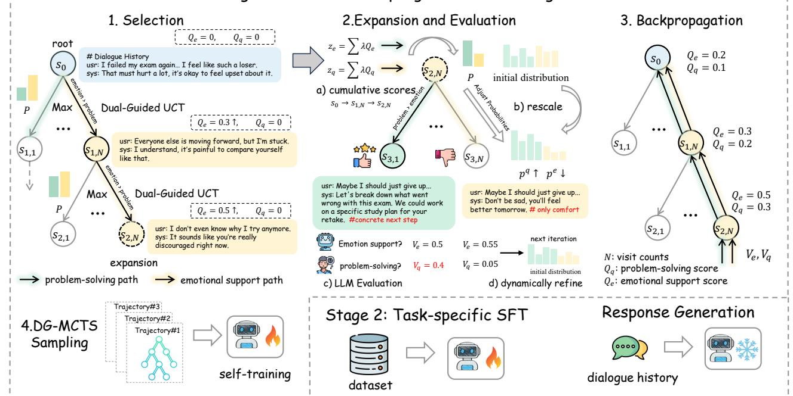
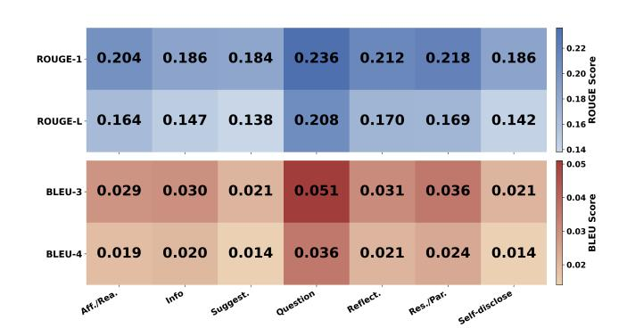
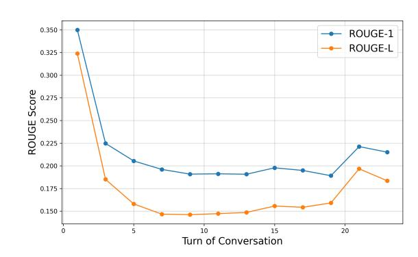
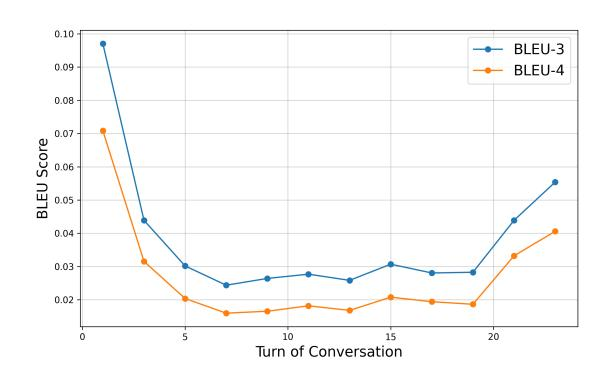

# DG-MCTS: Dual-Guidance Monte Carlo Tree Search for Adaptive Emotional Support Dialogue Planning

Benshuo Lin∗ South China Normal University Foshan, China lin\_benshuo@m.scnu.edu.cn

Jiayu Ding∗ South China Normal University Foshan, China dingjiayu@m.scnu.edu.cn

Yuelei Li Chongqing Samin Consumer Finance Co., Ltd. Beijing, China yuelei.li@msxf.com

Peng Wu Chongqing Samin Consumer Finance Co., Ltd. Beijing, China peng.wu@msxf.com

Yun Xue South China Normal University Foshan, China xueyun@m.scnu.edu.cn

Yiping Song† National University of Defense Technology Changsha, China songyiping@nudt.edu.cn

# Abstract

With the increasing popularity of online platforms, the Web has become a primary venue for support and emotional expression, prompting conversational agents to provide both factual and emotional assistance. Emotional Support Conversation (ESC) systems aim to alleviate users' emotional distress while simultaneously helping them identify and overcome the underlying problems. Existing approaches focus largely on modeling emotions and producing empathetic responses, frequently overlooking problem-solving. Moreover, LLMs exhibit inherent biases, often favoring certain strategies—such as prioritizing emotional support over problemsolving—which hinder balanced pursuit of dialogue objectives. Consequently, existing approaches without long-term planning struggle to coordinate dual objectives across multiple turns, limiting their ability to provide comprehensive support. To address these challenges, we propose Dual-Guidance Monte Carlo Tree Search (DG-MCTS) for enhancing ESC systems. By modeling dialogue generation as a tree search guided by emotional support and problemsolving signals, DG-MCTS achieves explicit decoupling and dynamic balancing of these dual objectives. To maintain strategic coherence across multiple turns while remaining responsive to evolving user states, we employ a hierarchical strategy mechanism, where coarse-grained orientation selection guides the overall dialogue toward emotional support or problem-solving, and finegrained strategy adaptation addresses immediate conversational needs within the chosen orientation. Furthermore, the cumulative scoring continuously tracks historical attention to both objectives along dialogue paths, dynamically shifting focus toward insufficiently explored goals. This ensures balanced pursuit of emotional support and problem-solving while enhancing the effectiveness of strategy execution. We evaluate DG-MCTS on widely used ESC

[This work is licensed under a Creative Commons Attribution 4.0 International License.](https://creativecommons.org/licenses/by/4.0) WWW '26, Dubai, United Arab Emirates.

© 2026 Copyright held by the owner/author(s). ACM ISBN 979-8-4007-2307-0/2026/04 <https://doi.org/10.1145/3774904.3792840>

datasets and in online deployment, and experimental results demonstrate that our method achieves state-of-the-art performance.

## CCS Concepts

• Computing methodologies → Discourse, dialogue and pragmatics.

# Keywords

Emotional Support Conversation, Dialogue Systems, Monte Carlo Tree Search

### ACM Reference Format:

Benshuo Lin, Jiayu Ding, Yuelei Li, Peng Wu, Yun Xue, and Yiping Song. 2026. DG-MCTS: Dual-Guidance Monte Carlo Tree Search for Adaptive Emotional Support Dialogue Planning. In Proceedings of the ACM Web Conference 2026 (WWW '26), April 13–17, 2026, Dubai, United Arab Emirates. ACM, New York, NY, USA, [12](#page-11-0) pages.<https://doi.org/10.1145/3774904.3792840>

### 1 Introduction

With the rapid development of online platforms and social networks, the Web has become a central medium for people to seek information, share experiences, and express emotions. Consequently, conversational agents are increasingly expected not only to provide factual assistance but also to offer emotional support, giving rise to the task of Emotional Support Conversation (ESC), which has attracted growing attention in the research community [\[21\]](#page-8-0). An ESC system is designed to reduce users' emotional distress and help them identify and overcome problems through conversations. Integrating such emotional support capabilities into dialogue systems renders them highly beneficial in a wide range of application scenarios and significantly enhances user experience [\[6,](#page-8-1) [11,](#page-8-2) [17\]](#page-8-3).

Existing methods primarily adopt emotion-centered approaches, which focus on explicitly modeling emotions and generating empathetic responses to address users' needs. Some methods infer users' emotions by incorporating external knowledge [\[12,](#page-8-4) [15,](#page-8-5) [28,](#page-8-6) [32\]](#page-9-0). MISC [\[28\]](#page-8-6) innovatively integrates COMET[\[2\]](#page-8-7), harnessing external commonsense knowledge to enhance the model's adeptness in reasoning about emotions. Hao and Kong [\[15\]](#page-8-5) propose dynamic knowledge filtering to select contextually relevant commonsense to improve emotion reasoning. Other methods design specific modules

∗Both authors contributed equally to this research.

†Corresponding authors.

for emotion detection [\[8,](#page-8-8) [36\]](#page-9-1). Cheng et al. [\[8\]](#page-8-8) employ a specialized detector to obtain the cause of the emotion. Zhao et al. [\[36\]](#page-9-1) explore state transitions between each conversation turn. Despite their success in generating empathetic responses, existing emotioncentered approaches primarily focus on emotional modeling rather than problem-solving. To truly address users' emotional needs, it is crucial to identify and resolve the underlying problems that cause these emotions, rather than solely providing empathetic responses based on emotional states.

Recent efforts have begun to leverage LLMs to address both emotion support and problem-solving simultaneously[\[6,](#page-8-1) [9,](#page-8-9) [31\]](#page-9-2). Chen et al. [\[6\]](#page-8-1) use prompting to control LLM generation for mixedinitiative dialogue that combines emotional support with goaldirected conversation management. COOPER[\[9\]](#page-8-9) coordinates multiple specialized agents to jointly address different aspects of complex dialogue goals. However, LLMs' preference biases and strong predisposition towards certain strategies often cause them to struggle with balancing multiple objectives, undermining overall dialogue outcomes[\[1,](#page-8-10) [18\]](#page-8-11). These limitations necessitate introducing longterm planning capabilities to LLMs. ESC requires resolving both emotional distress and underlying problems by conversation's end, demanding strategic planning to coordinate dual objectives across dialogue trajectories rather than responding reactively to isolated turns.

Monte Carlo Tree Search (MCTS) presents a compelling solution to these planning challenges by naturally incorporating long-term outcome evaluation into the decision-making [\[3,](#page-8-12) [26,](#page-8-13) [27\]](#page-8-14). MCTS excels at planning by systematically exploring possible future trajectories through iterative tree expansion and evaluation, allowing systems to look ahead multiple steps and select optimal actions for long-term goals. This capability has been successfully applied to various multi-step reasoning tasks, such as mathematical reasoning [\[5,](#page-8-15) [35\]](#page-9-3) and game playing [\[13\]](#page-8-16), demonstrating its potential for dialogue systems where current decisions should consider their impact on future conversational trajectories. Consequently, some studies combine MCTS with LLMs to enhance their lookahead planning capabilities in dialogue tasks. However, these existing works typically model dialogue planning as a single-objective optimization problem, such as focusing on persuasion [\[16,](#page-8-17) [33\]](#page-9-4) or recommendation [\[10\]](#page-8-18), which suits their respective tasks. In contrast, ESC tasks inherently require addressing both users' immediate emotional distress and the underlying problems causing these emotions, creating a fundamental challenge of strategically balancing dual objectives throughout the dialogue trajectory.

To enable LLMs to perform long-term dialogue planning while dynamically balancing emotional support and problem-solving, we propose a dual-guidance Monte Carlo Tree Search (DG-MCTS) framework for ESC tasks. Our approach models the dialogue generation process as a tree search guided by dual value signals: emotional support value and problem-solving value. DG-MCTS explicitly decouples these dual objectives to enable proactive trajectory planning. This allows the system to dynamically balance dual objectives rather than reacting passively to recent turns. To maintain strategic coherence across multiple turns while remaining responsive to evolving user states, we employ a hierarchical strategy mechanism that operates at two levels. Coarse-grained orientation selection guides the overall dialogue direction toward either

emotional support or problem-solving, while fine-grained strategy adaptation responds to immediate conversational needs within the chosen orientation. To achieve dynamic objective balancing, we introduce a cumulative scoring system that tracks historical attention to both objectives along dialogue paths. The framework automatically shifts focus toward underexplored objectives, preventing over-concentration on single goals. The dual-value propagation mechanism maintains independent ��-values for emotional support and problem-solving, enabling separate optimization of both objectives without mutual interference. This design allows the system to simultaneously pursue both goals while ensuring they remain aligned rather than conflicting. Furthermore, to continuously improve strategy effectiveness, the system employs a feedback mechanism that refines strategy selection based on evaluation outcomes. Experiments on widely used ESC datasets, as well as in online deployment, show that our method surpasses strong baselines. Our main contributions are as follows:

- We propose a novel dual-guidance Monte Carlo Tree Search framework that explicitly models and balances emotional support and problem-solving objectives in ESC, enabling proactive and adaptive dialogue planning rather than purely reactive responses.
- We design a dual-value hierarchical planning mechanism that integrates coarse-grained orientation selection with fine-grained sub-strategy adjustment, coupled with independent value estimation and backpropagation for each objective, thus ensuring balanced and context-aware strategy transitions.
- We achieve state-of-the-art performance on widely used ESC datasets and in online deployment, demonstrating the effectiveness of our approach.

# 2 Related Work

### 2.1 Emotional Support Conversation

Emotional Support Conversation is a task that aims to help users alleviate emotional distress and address their problems through dialogue [\[21\]](#page-8-0). Existing methods primarily rely on recent dialogue context, especially the current turn, augmenting responses with auxiliary information and specialized components. Some methods [\[12,](#page-8-4) [20,](#page-8-19) [28,](#page-8-6) [31,](#page-9-2) [32\]](#page-9-0) leverage external commonsense knowledge to infer the user's immediate mental state from the current dialogue context, often relying on COMET [\[2\]](#page-8-7), a pre-trained generative model for commonsense reasoning. Additionally, other methods integrate personalized character information to strengthen role modeling, ensuring that responses are empathetically tailored and consistent with the user's background [\[7,](#page-8-20) [15\]](#page-8-5). Another set of methods designs dedicated emotion recognition modules, ensuring that the system can accurately detect and interpret shifts in the user's emotional state during the conversation [\[8,](#page-8-8) [29,](#page-8-21) [36\]](#page-9-1). However, these methods are essentially reactive, focusing on the current turn without longterm dialogue planning, making it difficult to dynamically adjust strategies and balance emotional support with problem-solving over multiple turns.

| Model Class          | Model                   | ROUGE-L | BLEU-3 | BLEU-4 | Dist-1 | MET.  | Ext.  | CIDEr |
|----------------------|-------------------------|---------|--------|--------|--------|-------|-------|-------|
| Prompt-based Methods |                         |         |        |        |        |       |       |       |
|                      | llama3.1-8b(2024)       | 13.52   | 2.38   | 1.56   | 7.32   | 10.59 | 44.70 | 4.11  |
|                      | qwen2.5-7b(2025)        | 14.91   | 2.71   | 1.80   | 7.54   | 10.02 | 44.94 | 7.24  |
|                      | qwen2.5-72b(2025)       | 14.30   | 2.50   | 1.62   | 4.37   | 11.02 | 43.98 | 4.37  |
|                      | gpt4.0(2024)            | 14.86   | 2.01   | 0.93   | 6.43   | 8.50  | 41.90 | 4.22  |
|                      | +comet(2019)            | 14.87   | 1.99   | 0.91   | 5.98   | 9.44  | 42.98 | 4.14  |
|                      | +DOCTOR(2023)           | 13.98   | 1.72   | 0.79   | 6.36   | 8.73  | 40.93 | 3.39  |
|                      | +DIALeCT(2022)          | 14.97   | 1.82   | 0.81   | 6.42   | 9.10  | 42.56 | 4.15  |
|                      | +M-cue CoT(2023)        | 14.79   | 1.89   | 0.92   | 6.32   | 9.27  | 41.73 | 3.98  |
|                      | +Sibyl(2025)            | 15.20   | 2.21   | 1.10   | 6.52   | 9.65  | 41.90 | 4.95  |
| SFT-based Methods    |                         |         |        |        |        |       |       |       |
|                      | llama3.1-8b(2024)       | 15.62   | 2.92   | 1.41   | 6.24   | 9.12  | 44.71 | 8.76  |
|                      | +comet(2019)            | 15.58   | 2.78   | 1.35   | 6.22   | 9.04  | 45.00 | 9.34  |
|                      | +DOCTOR(2023)           | 15.78   | 2.83   | 1.42   | 6.68   | 8.24  | 45.14 | 9.84  |
|                      | +DIALeCT(2022)          | 16.02   | 2.79   | 1.29   | 6.35   | 8.22  | 44.86 | 10.44 |
|                      | +GDP-MCTS(2023)         | 17.15   | 3.13   | 2.20   | 7.55   | 7.10  | 49.16 | 13.66 |
|                      | +ECOT(2024)             | 14.47   | 2.71   | 1.81   | 4.88   | 7.89  | 47.85 | 6.49  |
|                      | +EmoStage(2025)         | 17.46   | 3.61   | 2.48   | 6.99   | 8.40  | 49.50 | 13.80 |
|                      | +Strategy Planner(2024) | 16.87   | 3.37   | 2.36   | 7.50   | 8.13  | 49.74 | 14.08 |
|                      | +Sibyl(2025)            | 16.23   | 3.04   | 1.52   | 6.84   | 8.53  | 45.86 | 10.92 |
|                      | DG-MCTS+qwen2.5(Ours)   | 18.10   | 3.82   | 2.66   | 7.60   | 9.23  | 50.04 | 15.76 |
|                      | DG-MCTS+llama3.1(Ours)  | 19.23   | 4.20   | 3.03   | 8.10   | 8.73  | 50.41 | 18.89 |

Table 1: Automatic Evaluation results on ESConv dataset. The best results of each metric are bolded, and the second best are underlined.

| Model Class          | Model                  | ROUGE-L | BLEU-3 | BLEU-4 | Dist-1 | MET.  | Ext.  | CIDEr |
|----------------------|------------------------|---------|--------|--------|--------|-------|-------|-------|
| Prompt-based Methods |                        |         |        |        |        |       |       |       |
|                      | llama3.1-8b(2024)      | 11.08   | 1.80   | 1.20   | 5.86   | 8.97  | 44.31 | 1.91  |
|                      | qwen2.5-7b(2025)       | 11.95   | 2.06   | 1.39   | 6.05   | 8.23  | 45.89 | 5.02  |
|                      | qwen2.5-72b(2025)      | 12.11   | 2.04   | 1.37   | 5.98   | 8.78  | 44.03 | 3.98  |
|                      | gpt4.0(2024)           | 14.01   | 2.28   | 1.21   | 9.14   | 10.66 | 46.66 | 7.90  |
|                      | +M-cue CoT(2023)       | 12.64   | 1.67   | 0.79   | 9.30   | 9.29  | 44.66 | 5.72  |
|                      | +COMET(2019)           | 14.89   | 2.43   | 1.34   | 9.36   | 9.13  | 45.69 | 7.54  |
|                      | +DOCTOR(2023)          | 15.65   | 2.66   | 1.49   | 9.68   | 9.30  | 46.24 | 8.43  |
|                      | +DIALeCT(2022)         | 16.23   | 2.64   | 1.39   | 8.98   | 9.46  | 47.47 | 10.48 |
|                      | +Sibyl(2025)           | 17.62   | 3.21   | 1.83   | 9.70   | 10.09 | 48.13 | 14.14 |
| SFT-based Methods    |                        |         |        |        |        |       |       |       |
|                      | llama3.1-8b(2024)      | 15.16   | 2.70   | 1.45   | 5.63   | 7.60  | 48.08 | 13.73 |
|                      | +COMET(2019)           | 15.31   | 2.89   | 1.59   | 5.61   | 7.74  | 48.45 | 14.47 |
|                      | +DOCTOR(2023)          | 15.16   | 2.85   | 1.58   | 5.62   | 9.15  | 48.25 | 13.60 |
|                      | +DIALeCT(2022)         | 17.37   | 4.14   | 2.42   | 5.53   | 8.61  | 49.81 | 22.21 |
|                      | +GDP-MCTS(2023)        | 18.08   | 3.93   | 2.74   | 5.85   | 10.12 | 50.29 | 16.61 |
|                      | +ECOT(2024)            | 18.98   | 4.05   | 2.90   | 6.48   | 9.45  | 50.10 | 20.41 |
|                      | +EmoStage(2025)        | 13.57   | 2.47   | 1.71   | 4.28   | 7.26  | 47.61 | 7.19  |
|                      | +Sibyl(2025)           | 19.08   | 5.01   | 2.95   | 5.65   | 9.61  | 50.90 | 26.93 |
|                      | DG-MCTS+qwen2.5(Ours)  | 19.15   | 3.94   | 2.82   | 5.74   | 9.40  | 51.49 | 20.14 |
|                      | DG-MCTS+llama3.1(Ours) | 20.21   | 4.69   | 3.39   | 6.65   | 10.21 | 51.66 | 24.85 |

Table 2: Automatic Evaluation results on the ED dataset. The best results of each metric are bolded, and the second best are underlined.

matches; Distinct-1 captures response diversity; CIDEr quantifies consensus with multiple references; METEOR considers both lexical matching and semantic similarity; and Extrema similarity (Ext.) measures semantic similarity based on embeddings.

Table [1](#page-5-0) shows the results on the Emotional Support Conversation (ESC) task. Integrating DG-MCTS with the backbone models consistently outperforms all baseline methods, demonstrating the effectiveness of our approach in emotional support dialogue generation. Specifically, DG-MCTS achieves higher similarity scores (ROUGE-L, BLEU, Ext., CIDEr) and diversity scores (Distinct) compared to all baselines. Performance on METEOR remains comparable to the best-performing baselines. Compared to GDP-MCTS, which applies MCTS-based planning for dialogue modeling, DG-MCTS achieves stronger results by jointly optimizing emotional feedback and problem-solving. Notably, some baselines, such as COMET and Sibyl, leverage external knowledge sources or closed-source LLMs to acquire commonsense knowledge for predicting dialogue trajectories. In contrast, DG-MCTS achieves superior performance

without incorporating any external knowledge, relying solely on dual-objective optimization. This further underscores the critical role of the dual-objective framework in guiding response generation. Moreover, applying DG-MCTS to mainstream LLMs such as LLaMA3 and Qwen2.5 further enhances performance, highlighting the generalizability of our method.

On the ED dataset, we compared DG-MCTS against relevant baselines to evaluate empathetic response generation. As shown in Table [2,](#page-5-1) DG-MCTS improves the backbone model's performance across key metrics for empathetic responses. When compared with supervised fine-tuning baselines, DG-MCTS consistently achieves the highest ROUGE and Extrema scores, and competitive BLEU and CIDEr scores, demonstrating its ability to generate high-quality responses. Against prompt-based baselines, although diversity and METEOR scores are slightly lower due to model scale limitations, DG-MCTS outperforms on other evaluation metrics, emphasizing the distinctive effectiveness of our proposed paradigm in generating empathetic responses. Nevertheless, the overall improvements are

less pronounced on the ED dataset, as the dialogues are generally shorter and the response patterns more constrained, limiting DG-MCTS's ability to fully leverage its long-term planning and multiobjective optimization capabilities.

|               | Nat   | ED Emp | Coh   | Nat   | ESConv Sup | Coh   |
|---------------|-------|--------|-------|-------|------------|-------|
| llama3.1-SFT  | 2.512 | 1.849  | 2.635 | 2.332 | 1.376      | 2.214 |
| COMET         | 2.464 | 1.747  | 2.646 | 2.368 | 1.944      | 2.465 |
| DOCTOR        | 2.503 | 2.088  | 2.653 | 2.349 | 1.408      | 2.496 |
| DIALeCT       | 2.441 | 1.115  | 2.644 | 2.381 | 1.867      | 2.526 |
| Sibyl         | 2.568 | 2.396  | 2.774 | 2.387 | 1.958      | 2.599 |
| GDP-MCTS      | 2.957 | 2.424  | 2.945 | 2.872 | 2.264      | 2.743 |
| DG-MCTS(Ours) | 2.977 | 2.465  | 2.954 | 2.901 | 2.45       | 2.861 |

Table 3: LLMs based Evaluation results on ED and ESConv dataset under Supervised Finetuning. The best results of each metric are bolded.

## 4.4 LLM-based Evaluation

Following [\[31\]](#page-9-2), we employed G-Eval to assess the naturalness (Nat.) and coherence (Coh.) of responses generated by different baseline methods. For task-specific requirements, we further measured empathy (Emp.) on the ED dataset and supportiveness (Sup.) on the ESConv dataset. We compared DG-MCTS against the following baselines: COMET and Sibyl use external knowledge to generate contextually relevant responses, DOCTOR and DIALeCT perform internal reasoning to consolidate conversational information, and GDP-MCTS plans via MCTS with LLM-based components.

For evaluation, we randomly sampled 200 data from both ED and ESConv datasets. Weighted average scores were computed over the sampled data. The comparison results, reported in Table [3,](#page-6-0) indicate that DG-MCTS consistently outperforms other baselines across all metrics, highlighting the effectiveness of the dual-objective optimization framework in generating empathetic and supportive responses.

Figure 2: Human A/B test of ESConv.

# 4.5 Human Evaluation

Following [\[31\]](#page-9-2), we conducted human evaluations to assess the quality of generated responses on both the EmpatheticDialogues (ED) and ESConv datasets. More details are provided in Appendix [B.](#page-9-8)

As illustrated in Figure [2](#page-6-1) and Figure [3,](#page-6-2) DG-MCTS consistently outperforms Sibyl, the current state-of-the-art (SOTA) model, across all evaluation dimensions. Notably, whereas Sibyl relies on GPT-4o to extract external commonsense knowledge to enhance response

Figure 3: Human A/B test of EMPATHETICDIALOGUES.

generation, DG-MCTS achieves superior human-judged performance solely through dual-objective optimization, further demonstrating the effectiveness of our approach in generating empathetic and supportive dialogue responses.

### 4.6 Ablation Study

To investigate the contribution of different components within DG-MCTS, we conducted a systematic ablation study on both ED and ESConv datasets. Specifically, we considered the following two ablation variants:

1)w/o dual-grained distribution: Removing the hierarchical strategy adjustment component in the MCTS expansion stage.

2)w/o dual-guided value: Eliminating the dual value at each MCTS node, relying solely on a single general value.

3)w/ tree search: Replacing the Monte Carlo Tree Search with tree search, to evaluate the contribution of the MCTS-based mechanism.

The ablation results, shown in Tables [4](#page-7-0) and [5,](#page-7-1) indicate that removing any component leads to a clear decline in response quality. Although certain variants may outperform the DG-MCTS model on specific metrics, their overall performance is substantially lower, highlighting the necessity of each component. Removing the dualguided value or replacing MCTS with tree search results in a marked performance decline, confirming that dual-value-based node selection and backpropagation are essential for jointly optimizing emotional support and problem-solving objectives in dialogue generation.

### 4.7 Case Study

Table [7](#page-11-1) presents two illustrative examples demonstrating that DG-MCTS generates responses that are more supportive and empathetic than those generated by LLaMA-3.1-SFT and Sibyl.

In the first case, DG-MCTS not only acknowledges the speaker's desire for social acceptance but also subtly highlights the importance of being treated with respect, striking a balance between empathy and practical guidance. In the second case, while all models recommend face-to-face communication with parents, DG-MCTS further clarifies how in-person interactions can enhance emotional expression and mutual understanding, yielding a more engaging and contextually appropriate response. These examples underscore that DG-MCTS consistently generates responses that are supportive, empathetic, and attuned to the emotional context, highlighting its ability to deliver nuanced, context-aware guidance in dialogue.

| Model                         | ROUGE-1 | ROUGE-2 | ROUGE-L | BLEU-3 | BLEU-4 | Dist-1 | MET. | Ext.  | CIDEr |
|-------------------------------|---------|---------|---------|--------|--------|--------|------|-------|-------|
| DG-MCTS                       | 22.70   | 6.26    | 19.23   | 4.20   | 3.03   | 8.10   | 8.73 | 50.41 | 18.89 |
| w/o dual-grained distribution | 22.21   | 5.94    | 18.74   | 4.00   | 2.84   | 8.66   | 8.27 | 50.14 | 17.21 |
| w/o dual-guided value         | 22.38   | 6.19    | 18.94   | 4.16   | 2.91   | 8.19   | 8.62 | 50.32 | 17.51 |
| w/ tree search                | 22.31   | 6.06    | 18.86   | 4.08   | 2.87   | 8.17   | 8.46 | 50.18 | 17.25 |

Table 4: Ablation study on the ESConv dataset. The best results of each metric are bolded.

| Model                         | ROUGE-1 | ROUGE-2 | ROUGE-L | BLEU-3 | BLEU-4 | Dist-1 | MET.  | Ext.  | CIDEr |
|-------------------------------|---------|---------|---------|--------|--------|--------|-------|-------|-------|
| DG-MCTS                       | 22.23   | 7.00    | 20.21   | 4.69   | 3.39   | 6.65   | 10.21 | 51.66 | 24.85 |
| w/o dual-grained distribution | 21.90   | 6.64    | 19.88   | 4.56   | 3.27   | 7.00   | 10.15 | 51.24 | 23.63 |
| w/o dual-guided value         | 21.95   | 6.83    | 19.88   | 4.61   | 3.30   | 7.12   | 10.26 | 51.25 | 24.16 |
| w/ tree search                | 21.83   | 6.57    | 19.77   | 4.67   | 3.35   | 6.85   | 10.15 | 51.16 | 24.33 |

Table 5: Ablation study on the ED dataset. The best results of each metric are bolded.

Figure 4: Performance of DG-MCTS across individual dialogue strategies.

Figure 5: Categorized performance of DG-MCTS in problemsolving and emotional Strategies.

### 4.8 Strategy-Level Performance Analysis

Figure [4](#page-7-2) reports model performance across dialogue strategies, and Figure [5](#page-7-3) further groups them into problem-solving and emotional categories. DG-MCTS shows balanced performance across strategies, without a clear bias toward either category. Higher scores on problem-solving strategies reflect its ability to generate informative and practical responses, while consistently strong results on emotional strategies demonstrate effective empathetic support.

| Day 1  | Day 2 | Day 3 | Day 4 |         |
|--------|-------|-------|-------|---------|
| +3.85% |       |       |       | Average |
| Day 5  | Day 6 | Day 7 | Day 8 | +3.58 % |
|        |       |       |       | -2.89 % |

Table 6: Online results of an eight-day online A/B testing. Each cell shows daily percentage change (FCR on the first line, ERH on the second).

### 4.9 Online A/B Test

We conducted the online experiment on a well-known financial platform. The proposed DG-MCTS was applied to the platform's customer service chatbot, which requires both effective problemsolving and empathetic responses. By leveraging dual-objective optimization, DG-MCTS enhanced the chatbot's ability to meet these requirements, improving the overall service experience. We conducted a comprehensive 8-day online A/B test. During the online test, Group A used the baseline dialogue system without DG-MCTS enhancements, while Group B received responses generated by the DG-MCTS-enhanced system leveraging dual-guided long-term planning. The results, shown in Table [6,](#page-7-4) provide strong evidence of the effectiveness of DG-MCTS.

As shown in the Table [6,](#page-7-4) our method consistently outperforms the baseline across all metrics, with daily improvements in two key indicators: first-contact resolution (FCR) and escalation-to-human rate (EHR), which serve as the primary measures for assessing user satisfaction on the online platform. On average, the method achieved a 3.58% increase in FCR and a 2.89% reduction in EHR compared to the online baseline. Overall, the findings demonstrate that DG-MCTS effectively leverages its dual-guided planning mechanism to improve dialogue quality and better satisfy user needs in real-world conversational settings.

### 5 Conclusion

In this paper, we propose Dual-Guidance Monte Carlo Tree Search (DG-MCTS) to enhance Emotional Support Conversation systems. DG-MCTS models dialogue generation as a tree search guided by dual value signals—emotional support and problem-solving. Furthermore, DG-MCTS employs a dual-value hierarchical planning mechanism that integrates coarse-grained orientation selection with fine-grained strategy adaptation, combined with independent value estimation and backpropagation for each objective, ensuring balanced and context-aware strategy transitions. Experiments on two benchmark ESC datasets show that DG-MCTS achieves stateof-the-art performance, effectively integrating emotional support and problem-solving in multi-turn dialogues.

# Acknowledgments

This paper is supported by National Natural Science Foundation of China (NSFC Grant No. 62576353).

References [1] Alafate Abulimiti, Chloé Clavel, and Justine Cassell. 2023. How About Kind of Generating Hedges using End-to-End Neural Models?. In Proceedings of the 61st Annual Meeting of the Association for Computational Linguistics (Volume 1: Long Papers), Anna Rogers, Jordan Boyd-Graber, and Naoaki Okazaki (Eds.). Association for Computational Linguistics, Toronto, Canada, 877–892. [doi:10.](https://doi.org/10.18653/v1/2023.acl-long.50) [18653/v1/2023.acl-long.50](https://doi.org/10.18653/v1/2023.acl-long.50) [2] Antoine Bosselut, Hannah Rashkin, Maarten Sap, Chaitanya Malaviya, Asli Celikyilmaz, and Yejin Choi. 2019. COMET: Commonsense Transformers for Automatic Knowledge Graph Construction. In Proceedings of the 57th Annual Meeting of the Association for Computational Linguistics, Anna Korhonen, David Traum, and Lluís Màrquez (Eds.). Association for Computational Linguistics, Florence, Italy, 4762–4779. [doi:10.18653/v1/P19-1470](https://doi.org/10.18653/v1/P19-1470) [3] Cameron B. Browne, Edward Powley, Daniel Whitehouse, Simon M. Lucas, Peter I. Cowling, Philipp Rohlfshagen, Stephen Tavener, Diego Perez, Spyridon Samothrakis, and Simon Colton. 2012. A Survey of Monte Carlo Tree Search Methods. IEEE Transactions on Computational Intelligence and AI in Games 4, 1 (2012), 1–43. [doi:10.1109/TCIAIG.2012.2186810](https://doi.org/10.1109/TCIAIG.2012.2186810) [4] Hyungjoo Chae, Yongho Song, Kai Ong, Taeyoon Kwon, Minjin Kim, Youngjae Yu, Dongha Lee, Dongyeop Kang, and Jinyoung Yeo. 2023. Dialogue Chain-of-Thought Distillation for Commonsense-aware Conversational Agents. In Proceedings of the 2023 Conference on Empirical Methods in Natural Language Processing, Houda Bouamor, Juan Pino, and Kalika Bali (Eds.). Association for Computational Linguistics, Singapore, 5606–5632. [doi:10.18653/v1/2023.emnlp-main.342](https://doi.org/10.18653/v1/2023.emnlp-main.342) [5] Guoxin Chen, Minpeng Liao, Chengxi Li, and Kai Fan. 2024. Step-level Value Preference Optimization for Mathematical Reasoning. In Findings of the Association for Computational Linguistics: EMNLP 2024, Yaser Al-Onaizan, Mohit Bansal, and Yun-Nung Chen (Eds.). Association for Computational Linguistics, Miami, Florida, USA, 7889–7903. [doi:10.18653/v1/2024.findings-emnlp.463](https://doi.org/10.18653/v1/2024.findings-emnlp.463) [6] Maximillian Chen, Xiao Yu, Weiyan Shi, Urvi Awasthi, and Zhou Yu. 2023. Controllable Mixed-Initiative Dialogue Generation through Prompting. In Proceedings of the 61st Annual Meeting of the Association for Computational Linguistics (Volume 2: Short Papers), Anna Rogers, Jordan Boyd-Graber, and Naoaki Okazaki (Eds.). Association for Computational Linguistics, Toronto, Canada, 951–966. [doi:10.18653/v1/2023.acl-short.82](https://doi.org/10.18653/v1/2023.acl-short.82) [7] Jiale Cheng, Sahand Sabour, Hao Sun, Zhuang Chen, and Minlie Huang. 2023. PAL: Persona-Augmented Emotional Support Conversation Generation. In Findings of the Association for Computational Linguistics: ACL 2023, Anna Rogers, Jordan Boyd-Graber, and Naoaki Okazaki (Eds.). Association for Computational Linguistics, Toronto, Canada, 535–554. [doi:10.18653/v1/2023.findings-acl.34](https://doi.org/10.18653/v1/2023.findings-acl.34) [8] Yi Cheng, Wenge Liu, Wenjie Li, Jiashuo Wang, Ruihui Zhao, Bang Liu, Xiaodan Liang, and Yefeng Zheng. 2022. Improving Multi-turn Emotional Support Dialogue Generation with Lookahead Strategy Planning. In Proceedings of the 2022 Conference on Empirical Methods in Natural Language Processing, Yoav Goldberg, Zornitsa Kozareva, and Yue Zhang (Eds.). Association for Computational Linguistics, Abu Dhabi, United Arab Emirates, 3014–3026. [doi:10.18653/v1/2022.emnlp](https://doi.org/10.18653/v1/2022.emnlp-main.195)[main.195](https://doi.org/10.18653/v1/2022.emnlp-main.195) [9] Yi Cheng, Wenge Liu, Jian Wang, Chak Tou Leong, Yi Ouyang, Wenjie Li, Xian Wu, and Yefeng Zheng. 2024. COOPER: coordinating specialized agents towards a complex dialogue goal. In Proceedings of the Thirty-Eighth AAAI Conference on Artificial Intelligence and Thirty-Sixth Conference on Innovative Applications of Artificial Intelligence and Fourteenth Symposium on Educational Advances in Artificial Intelligence (AAAI'24/IAAI'24/EAAI'24). AAAI Press, Article 1991, 9 pages. [doi:10.1609/aaai.v38i16.29739](https://doi.org/10.1609/aaai.v38i16.29739) [10] Huy Quang Dao, Yang Deng, Khanh-Huyen Bui, Dung D. Le, and Lizi Liao. 2024. Experience as Source for Anticipation and Planning: Experiential Policy Learning for Target-driven Recommendation Dialogues. In Findings of the Association for Computational Linguistics: EMNLP 2024, Yaser Al-Onaizan, Mohit Bansal, and Yun-Nung Chen (Eds.). Association for Computational Linguistics, Miami, Florida, USA, 14179–14198. [doi:10.18653/v1/2024.findings-emnlp.829](https://doi.org/10.18653/v1/2024.findings-emnlp.829) [11] Kerstin Denecke, Sayan Vaaheesan, and Aaganya Arulnathan. 2021. A Mental Health Chatbot for Regulating Emotions (SERMO) - Concept and Usability Test. IEEE Transactions on Emerging Topics in Computing 9, 3 (2021), 1170–1182. [doi:10.](https://doi.org/10.1109/TETC.2020.2974478) [1109/TETC.2020.2974478](https://doi.org/10.1109/TETC.2020.2974478) [12] Yang Deng, Wenxuan Zhang, Yifei Yuan, and Wai Lam. 2023. Knowledgeenhanced Mixed-initiative Dialogue System for Emotional Support Conversations. In Proceedings of the 61st Annual Meeting of the Association for Computational Linguistics (Volume 1: Long Papers), Anna Rogers, Jordan Boyd-Graber, and Naoaki Okazaki (Eds.). Association for Computational Linguistics, Toronto, Canada, 4079–4095. [doi:10.18653/v1/2023.acl-long.225](https://doi.org/10.18653/v1/2023.acl-long.225) [13] Ruomeng Ding, Chaoyun Zhang, Lu Wang, Yong Xu, Minghua Ma, Wei Zhang, Si Qin, Saravan Rajmohan, Qingwei Lin, and Dongmei Zhang. 2024. Everything of Thoughts: Defying the Law of Penrose Triangle for Thought Generation. In Findings of the Association for Computational Linguistics: ACL 2024, Lun-Wei Ku, Andre Martins, and Vivek Srikumar (Eds.). Association for Computational Linguistics, Bangkok, Thailand, 1638–1662. [doi:10.18653/v1/2024.findings-acl.95](https://doi.org/10.18653/v1/2024.findings-acl.95) [14] Aaron Grattafiori, Abhimanyu Dubey, Abhinav Jauhri, and et al. 2024. The Llama 3 Herd of Models. arXiv[:2407.21783](https://arxiv.org/abs/2407.21783) [cs.AI]<https://arxiv.org/abs/2407.21783> [15] Jiawang Hao and Fang Kong. 2025. Enhancing Emotional Support Conversations: A Framework for Dynamic Knowledge Filtering and Persona Extraction. In Proceedings of the 31st International Conference on Computational Linguistics, Owen Rambow, Leo Wanner, Marianna Apidianaki, Hend Al-Khalifa, Barbara Di Eugenio, and Steven Schockaert (Eds.). Association for Computational Linguistics, Abu Dhabi, UAE, 3193–3202.<https://aclanthology.org/2025.coling-main.214/> [16] Tao He, Lizi Liao, Yixin Cao, Yuanxing Liu, Ming Liu, Zerui Chen, and Bing Qin. 2024. Planning Like Human: A Dual-process Framework for Dialogue Planning. In Proceedings of the 62nd Annual Meeting of the Association for Computational Linguistics (Volume 1: Long Papers), Lun-Wei Ku, Andre Martins, and Vivek Srikumar (Eds.). Association for Computational Linguistics, Bangkok, Thailand, 4768–4791. [doi:10.18653/v1/2024.acl-long.262](https://doi.org/10.18653/v1/2024.acl-long.262) [17] Eunkyung Jo, Daniel A. Epstein, Hyunhoon Jung, and Young-Ho Kim. 2023. Understanding the Benefits and Challenges of Deploying Conversational AI Leveraging Large Language Models for Public Health Intervention. In Proceedings of the 2023 CHI Conference on Human Factors in Computing Systems (Hamburg, Germany) (CHI '23). Association for Computing Machinery, New York, NY, USA, Article 18, 16 pages. [doi:10.1145/3544548.3581503](https://doi.org/10.1145/3544548.3581503) [18] Dongjin Kang, Sunghwan Kim, Taeyoon Kwon, Seungjun Moon, Hyunsouk Cho, Youngjae Yu, Dongha Lee, and Jinyoung Yeo. 2024. Can Large Language Models be Good Emotional Supporter? Mitigating Preference Bias on Emotional Support Conversation. In Proceedings of the 62nd Annual Meeting of the Association for Computational Linguistics (Volume 1: Long Papers), Lun-Wei Ku, Andre Martins, and Vivek Srikumar (Eds.). Association for Computational Linguistics, Bangkok, Thailand, 15232–15261. [doi:10.18653/v1/2024.acl-long.813](https://doi.org/10.18653/v1/2024.acl-long.813) [19] Zaijing Li, Gongwei Chen, Rui Shao, Yuquan Xie, Dongmei Jiang, and Liqiang Nie. 2024. Enhancing emotional generation capability of large language models via emotional chain-of-thought. arXiv preprint arXiv:2401.06836 (2024). [20] Li Liu and Paul Fieguth. 2012. Texture Classification from Random Features. IEEE Transactions on Pattern Analysis and Machine Intelligence 34, 3 (2012), 574–586. [21] Siyang Liu, Chujie Zheng, Orianna Demasi, Sahand Sabour, Yu Li, Zhou Yu, Yong Jiang, and Minlie Huang. 2021. Towards Emotional Support Dialog Systems. In Proceedings of the 59th Annual Meeting of the Association for Computational Linguistics and the 11th International Joint Conference on Natural Language Processing (Volume 1: Long Papers), Chengqing Zong, Fei Xia, Wenjie Li, and Roberto Navigli (Eds.). Association for Computational Linguistics, Online, 3469–3483. [doi:10.18653/v1/2021.acl-long.269](https://doi.org/10.18653/v1/2021.acl-long.269) [22] Zhiyang Qi, Keiko Takamizo, Mariko Ukiyo, and Michimasa Inaba. 2025. EmoStage: A Framework for Accurate Empathetic Response Generation via Perspective-Taking and Phase Recognition. arXiv preprint arXiv:2506.19279 (2025). [23] Qwen, :, An Yang, Baosong Yang, Beichen Zhang, Binyuan Hui, Bo Zheng, Bowen Yu, Chengyuan Li, Dayiheng Liu, Fei Huang, Haoran Wei, Huan Lin, Jian Yang, Jianhong Tu, Jianwei Zhang, Jianxin Yang, Jiaxi Yang, Jingren Zhou, Junyang Lin, Kai Dang, Keming Lu, Keqin Bao, Kexin Yang, Le Yu, Mei Li, Mingfeng Xue, Pei Zhang, Qin Zhu, Rui Men, Runji Lin, Tianhao Li, Tianyi Tang, Tingyu Xia, Xingzhang Ren, Xuancheng Ren, Yang Fan, Yang Su, Yichang Zhang, Yu Wan, Yuqiong Liu, Zeyu Cui, Zhenru Zhang, and Zihan Qiu. 2025. Qwen2.5 Technical Report. arXiv[:2412.15115](https://arxiv.org/abs/2412.15115) [cs.CL]<https://arxiv.org/abs/2412.15115> [24] Hannah Rashkin, Eric Michael Smith, Margaret Li, and Y-Lan Boureau. 2019. Towards Empathetic Open-domain Conversation Models: A New Benchmark and Dataset. In Proceedings of the 57th Annual Meeting of the Association for Computational Linguistics, Anna Korhonen, David Traum, and Lluís Màrquez (Eds.). Association for Computational Linguistics, Florence, Italy, 5370–5381. [doi:10.18653/v1/P19-1534](https://doi.org/10.18653/v1/P19-1534) [25] Siqi Shen, Deepanway Ghosal, Navonil Majumder, Henry Lim, Rada Mihalcea, and Soujanya Poria. 2022. Multiview Contextual Commonsense Inference: A New Dataset and Task. arXiv[:2210.02890](https://arxiv.org/abs/2210.02890) [cs.CL]<https://arxiv.org/abs/2210.02890> [26] David Silver, Aja Huang, Chris J Maddison, Arthur Guez, Laurent Sifre, George Van Den Driessche, Julian Schrittwieser, Ioannis Antonoglou, Veda Panneershelvam, Marc Lanctot, et al. 2016. Mastering the game of Go with deep neural networks and tree search. nature 529, 7587 (2016), 484–489. [27] Maciej Świechowski, Konrad Godlewski, Bartosz Sawicki, and Jacek Mańdziuk. 2023. Monte Carlo tree search: A review of recent modifications and applications. Artificial Intelligence Review 56, 3 (2023), 2497–2562. [28] Quan Tu, Yanran Li, Jianwei Cui, Bin Wang, Ji-Rong Wen, and Rui Yan. 2022. MISC: A Mixed Strategy-Aware Model integrating COMET for Emotional Support Conversation. In Proceedings of the 60th Annual Meeting of the Association for Computational Linguistics (Volume 1: Long Papers), Smaranda Muresan, Preslav Nakov, and Aline Villavicencio (Eds.). Association for Computational Linguistics, Dublin, Ireland, 308–319. [doi:10.18653/v1/2022.acl-long.25](https://doi.org/10.18653/v1/2022.acl-long.25) [29] Chenwei Wan, Matthieu Labeau, and Chloé Clavel. 2025. EmoDynamiX: Emotional Support Dialogue Strategy Prediction by Modelling MiXed Emotions and Discourse Dynamics. In Proceedings of the 2025 Conference of the Nations of the Americas Chapter of the Association for Computational Linguistics: Human Language Technologies (Volume 1: Long Papers), Luis Chiruzzo, Alan Ritter, and Lu Wang (Eds.). Association for Computational Linguistics, Albuquerque, New Mexico, 1678–1695. [doi:10.18653/v1/2025.naacl-long.81](https://doi.org/10.18653/v1/2025.naacl-long.81)

[30] Hongru Wang, Rui Wang, Fei Mi, Yang Deng, Zezhong Wang, Bin Liang, Ruifeng Xu, and Kam-Fai Wong. 2023. Cue-CoT: Chain-of-thought Prompting for Responding to In-depth Dialogue Questions with LLMs. In Findings of the Association for Computational Linguistics: EMNLP 2023, Houda Bouamor, Juan Pino, and Kalika Bali (Eds.). Association for Computational Linguistics, Singapore, 12047–12064. [doi:10.18653/v1/2023.findings-emnlp.806](https://doi.org/10.18653/v1/2023.findings-emnlp.806) [31] Lanrui Wang, Jiangnan Li, Chenxu Yang, Zheng Lin, Hongyin Tang, Huan Liu, Yanan Cao, Jingang Wang, and Weiping Wang. 2025. Sibyl: Empowering Empathetic Dialogue Generation in Large Language Models via Sensible and Visionary Commonsense Inference. In Proceedings of the 31st International Conference on Computational Linguistics, Owen Rambow, Leo Wanner, Marianna Apidianaki, Hend Al-Khalifa, Barbara Di Eugenio, and Steven Schockaert (Eds.). Association for Computational Linguistics, Abu Dhabi, UAE, 123–140. <https://aclanthology.org/2025.coling-main.10/> [32] Zhe Xu, Daoyuan Chen, Jiayi Kuang, Zihao Yi, Yaliang Li, and Ying Shen. 2024. Dynamic Demonstration Retrieval and Cognitive Understanding for Emotional Support Conversation. In Proceedings of the 47th International ACM SIGIR Conference on Research and Development in Information Retrieval (Washington DC, USA) (SIGIR '24). Association for Computing Machinery, New York, NY, USA, 774–784. [doi:10.1145/3626772.3657695](https://doi.org/10.1145/3626772.3657695) [33] Xiao Yu, Maximillian Chen, and Zhou Yu. 2023. Prompt-Based Monte-Carlo Tree Search for Goal-oriented Dialogue Policy Planning. In Proceedings of the 2023 Conference on Empirical Methods in Natural Language Processing, Houda Bouamor, Juan Pino, and Kalika Bali (Eds.). Association for Computational Linguistics, Singapore, 7101–7125. [doi:10.18653/v1/2023.emnlp-main.439](https://doi.org/10.18653/v1/2023.emnlp-main.439) [34] Di Zhang, Jianbo Wu, Jingdi Lei, Tong Che, Jiatong Li, Tong Xie, Xiaoshui Huang, Shufei Zhang, Marco Pavone, Yuqiang Li, Wanli Ouyang, and Dongzhan Zhou. 2025. LLaMA-Berry: Pairwise Optimization for Olympiad-level Mathematical Reasoning via O1-like Monte Carlo Tree Search. In Proceedings of the 2025 Conference of the Nations of the Americas Chapter of the Association for Computational Linguistics: Human Language Technologies (Volume 1: Long Papers), Luis Chiruzzo, Alan Ritter, and Lu Wang (Eds.). Association for Computational Linguistics, Albuquerque, New Mexico, 7315–7337. [doi:10.18653/v1/2025.naacl-long.375](https://doi.org/10.18653/v1/2025.naacl-long.375) [35] Dan Zhang, Sining Zhoubian, Ziniu Hu, Yisong Yue, Yuxiao Dong, and Jie Tang. 2024. ReST-MCTS\*: LLM Self-Training via Process Reward Guided Tree Search. In The Thirty-eighth Annual Conference on Neural Information Processing Systems. <https://openreview.net/forum?id=8rcFOqEud5> [36] Weixiang Zhao, Yanyan Zhao, Shilong Wang, and Bing Qin. 2023. TransESC: Smoothing Emotional Support Conversation via Turn-Level State Transition. In Findings of the Association for Computational Linguistics: ACL 2023, Anna Rogers, Jordan Boyd-Graber, and Naoaki Okazaki (Eds.). Association for Computational Linguistics, Toronto, Canada, 6725–6739. [doi:10.18653/v1/2023.findings-acl.420](https://doi.org/10.18653/v1/2023.findings-acl.420)

# A Details of Baseline Methods

In this Section, we present the details of the baseline methods we compared with our proposed paradigm DG-MCTS.

M-Cue CoT [\[30\]](#page-9-6): A multi-stage prompting mechanism that tracks and models user states through iterative reasoning and planning, enabling more accurate dialogue generation.

COMET [\[2\]](#page-8-7): A knowledge-augmented model leveraging ATOMIC to perform causal reasoning based on the last utterance in the dialogue, providing contextually relevant inferences.

DOCTOR [\[4\]](#page-8-23): A chain-of-thought (CoT) dialogue reasoner that consolidates implicit information from the conversation to support inference generation.

DIALeCT [\[25\]](#page-8-24): A Transformer model pre-trained on multiple dialogue tasks, focusing on commonsense reasoning to efficiently capture and utilize structured dialogue information for LLM response generation.

GDP-MCTS [\[33\]](#page-9-4): A dialogue planning method that leverages LLM reasoning with MCTS to simulate future interactions for goaloriented tasks.

ECoT [\[19\]](#page-8-25): A plug-and-play method that guides LLMs through ordered emotional reasoning steps, improving alignment with human affective preferences.

Strategy Planner [\[18\]](#page-8-11): A classification model fine-tuned on LLaMA 3.1-8B-instruct that predicts suitable dialogue strategies from the context; the final response is generated by a supporter LLM under these predicted strategy constraints.

EmoStage [\[22\]](#page-8-26): A multi-stage counseling framework that leverages LLM reasoning through perspective-taking, phase recognition, and response generation, enabling empathetic responses aligned with the counseling process.

Sibyl [\[31\]](#page-9-2): A knowledge-enhanced dialogue modeling method that extracts diverse commonsense knowledge from dialogue history and human responses using GPT-4o.

LLaMA3.1 [\[14\]](#page-8-27): An open-source backbone model generating responses solely based on dialogue context, serving as a reference for raw model capabilities.

Qwen2.5 [\[23\]](#page-8-28): Instruction-tuned models with 7B and 72B parameters, generating responses purely from context, used to evaluate the effect of model scale on dialogue generation.

# B Details of Human evaluation

For ESConv, which targets emotional support conversations, we considered five evaluation dimensions: (1) Fluency (Flu.), judging the smoothness of generated responses; (2) Comfort (Com.), assessing the degree of emotional support provided; (3) Supportiveness (Sup.), evaluating how helpful or supportive a response is; (4) Suggestiveness (Sug.), measuring the relevance and usefulness of advice given; and (5) Overall Effectiveness (All.), reflecting the general quality and impact of emotional support.

For ED, which focuses on empathetic dialogue, we evaluated responses along four key dimensions: (1) Coherence (Coh.), measuring how contextually relevant and logically consistent a response is; (2) Empathy (Emp.), assessing the appropriateness of emotional reactions such as warmth, compassion, and concern; (3) Informativeness (Inf.), reflecting the amount of contextually relevant information provided; and (4) Engagement (Eng.), indicating the likelihood of encouraging further conversation.

For each dataset, we randomly sampled 100 dialogues and conducted A/B testing, directly comparing responses generated by our proposed DG-MCTS paradigm with those from the state-of-the-art model Sibyl. Annotators were asked to select the preferred response for each evaluation dimension, or choose "Tie" if the responses were indistinguishable.

Figure 6: Rouge results as a function of conversation turns. Results are collected from ESconv.

Figure 7: Bleu results as a function of conversation turns. Results are collected from ESconv.

# C Analyses on conversation turns

To evaluate the model's long-term planning capability in dialogue, we conducted experiments comparing its performance across different turns. As shown in Figure [6](#page-9-9) and Figure [7,](#page-10-6) the curves of ROUGE and BLEU scores for responses generated by the model remain stable as the dialogue progresses. DG-MCTS maintains consistent performance without significant degradation over multiple turns, demonstrating effective long-term planning capability in multi-turn dialogue.

Figure 8: Prompt template for therapist response generation.

Figure 9: Prompt template for patient response generation.

Figure 10: Prompt template for problem-solving evaluation.

Figure 11: Prompt template for emotional evaluation.

Figure 12: Prompt template for Response Generation.

# D Fine-tuning Implementation Details

To balance efficiency and effectiveness in parameter tuning, we adopted parameter-efficient fine-tuning (PEFT) via LoRA, inserting low-rank adapters after the self-attention layers. Training was carried out in BF16 precision on a single NVIDIA H20 GPU with 96GB memory. In the self-training stage, the learning rate is set to 5e-5, the training batch size to 8, and the model is trained for 2 epochs, with the LoRA rank set to 8. In the task-specific SFT stage, the learning rate is set to 1e-4, the training batch size to 8, and the 8260 model is trained for 1 epoch, with the LoRA rank also set to 8.

| Dialogue Context      |             |         |           |         |         |            |                |            |             |             |          |           |            |
|-----------------------|-------------|---------|-----------|---------|---------|------------|----------------|------------|-------------|-------------|----------|-----------|------------|
| Speaker:              | Well        | ,       | we are    | in      | a       | small town | and            | he         | was         | popular     | and the  |           | cutest guy |
| in our                | town        | I       | liked     | being   |         | with       | someone        | so         | popular     | He          | wasn ’ t | always    | nice       |
| to me                 | and is      | why     | I         | wanted  | to      | be with    |                | someone    | else        | for a       | short    | time      | He used    |
| to                    | leave me    | at      | parties   | and     | go      | off with   | his            | friends    |             | sometimes.  |          |           |            |
| Listener:             | was         | it      | a         | common  |         | thing that | he             | didn       | ’ t give    | you         | the      | attention | you        |
| Speaker:              | My          |         | friends   | always  |         | said       | that I         | could      | do          | better and  | that     | he        | didn ’ t   |
| deserve               | me          | He      | gave      | me      |         | statis in  | our            | town       | and         | everyone    | wanted   | to        | be his     |
| girlfriend            | so          | I       | think     | I liked | the     | attention, |                | yes.       |             |             |          |           |            |
|                       | Response:   | were    | you       |         | happy   | with       | him or         | were       | you         | happy       | that you | were      | with       |
| the                   | popular     | guy?    |           |         |         |            |                |            |             |             |          |           |            |
| Llama-3.1-SFT I think | you         | are a   | great     |         | person  | and you    |                | deserve    | to be       | with        | someone  | who       | is nice    |
| to you.               |             |         |           |         |         |            |                |            |             |             |          |           |            |
| it                    | sounds like | you     |           | were    | drawn   | to the     | idea           | of         | being       | popular     | and      | having    | a lot of   |
| attention,            | but         | it      | seems     | like    | that    | may        | have           | been       | a           | superficial | reason   | for       | wanting    |
| to be                 | with        | him.    |           |         |         |            |                |            |             |             |          |           |            |
| DG-MCTS(Ours) it      | sounds like |         | you are   |         | someone | who        | likes          | to         | be popular, | and         | that’s   |           | okay, but  |
| it’s                  | not okay    | to      | settle    | for     |         | someone    | who            | doesn’t    | treat       | you         | right.   |           |            |
| Dialogue Context      |             |         |           |         |         |            |                |            |             |             |          |           |            |
| Speaker:              | nope        |         | not at    | all.    | hmm     | well       | she does       | ask        | to use      | my          | credit   | card      | alot. my   |
| parents               | foot        | the     | bill..    |         |         |            |                |            |             |             |          |           |            |
| Listener:             |             | Perhaps | you       |         | should  | try to     | talk to        | your       | parents     |             | around   | this      | fact. For  |
| example,              | if          | money   | is        | the     | problem | for        | your           | parents,   | you         | can set     | some     | rules.    | LIke       |
| you                   | can set     | an      | allowance |         | for     | how        | much           | money      | you         | can use     | each     | week.     |            |
| Speaker:              | Ok,         | i       | will talk | to      | them    | this       | weekend.       |            | what’ s     | better      | on the   | phone     | or in      |
|                       | Response:   | If you  | want      | a       | better  |            | communication, |            | I believe   | in          | person   | will      | be best.   |
| Llama-3.1-SFT I think | it          | would   | be        | better  | to      | talk to    | them           | in         | person.     |             |          |           |            |
| Sibyl I would         | say         | in      | person.   |         |         |            |                |            |             |             |          |           |            |
| DG-MCTS(Ours) I think | it          | would   | be        | better  | to      | talk to    | them           | in         | person. It  | will be     | easier   | for       | you to     |
| express               | your        |         | feelings  | and     | for     | them       | to             | understand | you.        |             |          |           |            |

Table 7: Two examples involving responses from different versions of LLaMA models, which are enhanced with different methods. The red contents show the effect of improvement methods.

# E Evaluator Reliability and Stability

We provide additional evidence to demonstrate the reliability and stability of the evaluator used in the evaluation phase of MCTS. Specifically, we assess the evaluator by measuring its consistency with human judgments and the variance of its scores across repeated evaluations on two dimensions: emotion and problem resolution.

As shown in Table [8,](#page-11-2) the evaluator achieves high agreement with human judgments and exhibits low variance across both dimensions. All results fall within the expected ranges, indicating that the evaluator provides reliable and stable assessments for guiding

| MCTS search. Metric | Consistency ( ↑ ) | Variance ( ↓ ) |
|---------------------|-------------------|----------------|
| Emotion             | 92%               | 0.0048         |
| Problem             | 95%               | 0.0079         |
| Expected Range      | ≥ 90%             | ≤ 0.01         |

Table 8: Consistency and variance analysis of the evaluator.

### F Sensitivity Analysis of the Exploration Coefficient ��

We analyze the impact of the exploration coefficient�� on the search tree shape. Table [9](#page-11-3) shows the average depth and width of the search tree under different �� values.

As shown in Table [9,](#page-11-3) larger values of �� lead to shallower but wider trees, while smaller values of �� produce deeper but narrower trees. The tree shape affects DG-MCTS performance: deeper trees are generally more suitable for complex tasks, whereas wider trees facilitate broader exploration.

Table 9: Sensitivity analysis of the exploration coefficient �� on search tree depth and width.