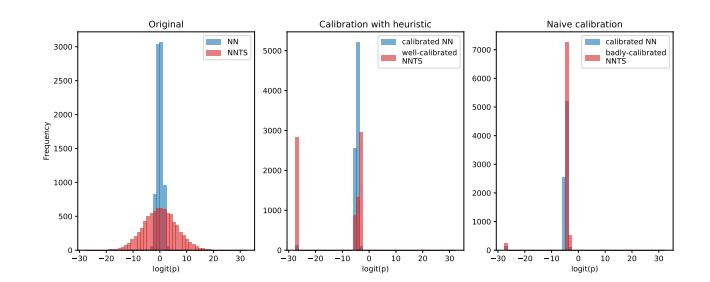
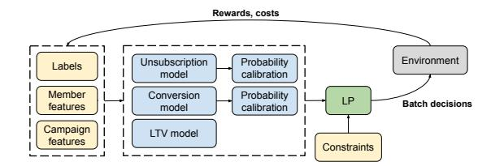
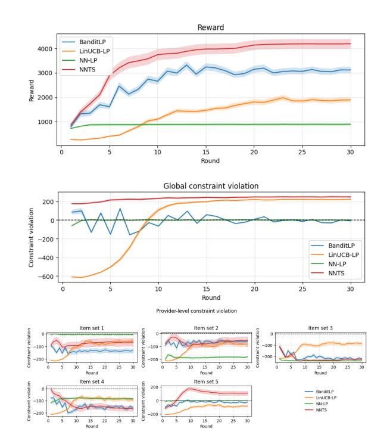
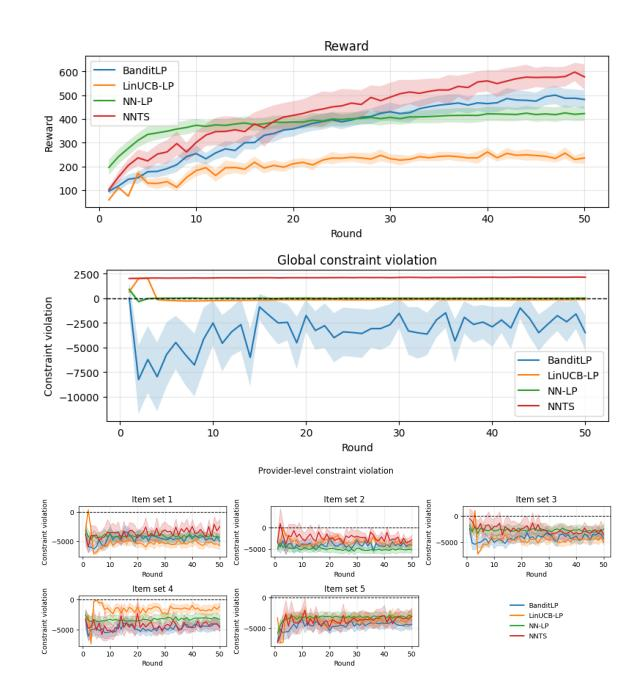
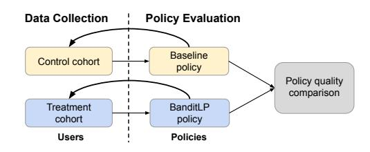
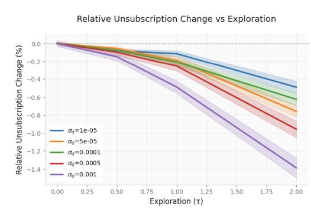
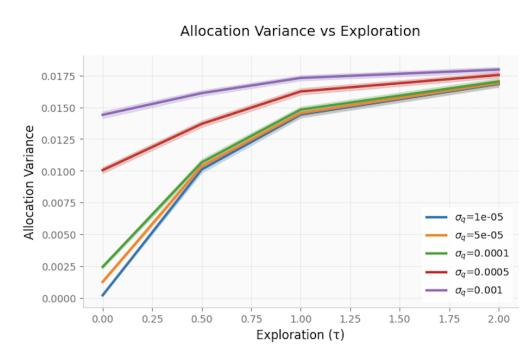

# BanditLP: Large-Scale Stochastic Optimization for Personalized Recommendations

Phuc Nguyen LinkedIn San Francisco, USA honnguyen@linkedin.com

Benjamin Zelditch LinkedIn New York, USA bzelditch@linkedin.com

Joyce Chen LinkedIn Sunnyvale, USA joychen@linkedin.com

Rohit Patra LinkedIn New York, USA ropatra@linkedin.com

Changshuai Wei∗ LinkedIn Seattle, USA chawei@linkedin.com

## Abstract

We present BanditLP, a scalable multi-stakeholder contextual bandit framework that unifies neural Thompson Sampling (TS) for learning objective-specific outcomes with a large-scale linear program (LP) for constrained action selection at serving time. The methodology is application-agnostic, compatible with arbitrary neural architectures, and deployable at web scale—with an LP solver capable of handling billions of variables. Experiments on public benchmarks and synthetic data show consistent gains over strong baselines. We apply this approach in LinkedIn's email marketing system and demonstrate business win, illustrating the value of integrated exploration and constrained optimization in production.

# CCS Concepts

• Mathematics of computing → Probability and statistics; • Computing methodologies → Machine learning; • Information systems → Information retrieval; Web searching and information discovery; Online advertising; • Applied computing → Marketing.

# Keywords

Contextual Bandit, Linear Program, Stochastic Optimization, Multistakeholder Recommendation, Marketing

# 1 INTRODUCTION

Most contextual-bandit (CB) based recommender systems (RS) focus on optimizing a single objective, typically the utility of end users, such as clicks or engagement metrics. However, in real-world platform ecosystems, multiple stakeholders are involved. For example, buyers and sellers on Amazon, artists and listeners on Spotify, viewers and content creators on YouTube or TikTok, and users, drivers, and restaurants on UberEats or DoorDash all form distinct stakeholder groups. Within an organization, there may also be multiple stakeholders. We see within LinkedIn email marketing system that the stakeholders include LinkedIn users, business lines within

LinkedIn (e.g. B2C vs. B2B), and the platform itself may have different objectives and constraints. From the user-perspective, there are conflicting objectives: maximizing conversions while maintaining a low unsubscribe rate to preserve long-term reach. From the business lines perspective, we need fair representation—for example, to prevent the algorithm from over-promoting B2C products (which often generate quicker, higher-volume conversions) at the expense of B2B offerings. At the platform level, constraints such as maximum the number of emails sent to each member per week or the total volume of emails must be enforced.

These systems require careful balancing utilities of all these stakeholders, and call for multi-stakeholder contextual bandits that balances exploration and exploitation while jointly managing potentially conflicting objectives across these groups. We can frame this multi-stakeholder problem as maximizing a primary cumulative reward subject to multi-level constraints that safeguard stakeholders' interests in every round. This formulation is broadly applicable in real-world systems that involves batch recommendations, where operational constraints such as budget, capacity limits, and latency targets coexist with fairness, minimum exposure, or safety requirements. For instance, in e-commerce platforms like Amazon, recommendation policies must balance user engagement against seller exposure and inventory or delivery capacity limits. In content platforms such as TikTok or YouTube, models must allocate impressions fairly across creators while optimizing viewer satisfaction and respecting latency or throughput constraints [\[10,](#page-7-0) [33\]](#page-8-0). In LinkedIn's email marketing system, recommendation policies must satisfy user-level frequency caps, business-line-level representation requirements, and platform-level performance guardrails and volume limits simultaneously. These settings all share a common structure: optimizing a primary objective while satisfying constraints across multiple stakeholders and system levels.

While prior research has advanced contextual bandits under constraints or multiple objectives, none provides a solution suited to large-scale applications with complex, multi-level stakeholder constraints. Existing approaches based on linear or multi-armed bandits [\[2,](#page-7-1) [17,](#page-8-1) [30\]](#page-8-2) cannot capture complex, high-dimensional relationships between users, items, and contexts. Methods developed for constrained or safe bandits typically handle only specific types of constraints or a single constraint level [\[8,](#page-7-2) [12\]](#page-7-3), making them difficult to apply in multi-level constraints settings. On the other hand, large-scale recommender systems [\[21,](#page-8-3) [34\]](#page-8-4) that combine predictive

∗Corresponding author

[This work is licensed under a Creative Commons Attribution-NonCommercial-](https://creativecommons.org/licenses/by-nc-nd/4.0)[NoDerivatives 4.0 International License.](https://creativecommons.org/licenses/by-nc-nd/4.0)

models with LP solvers lack exploration, which amplifies selection bias and leads to suboptimal long-term outcomes. To our knowledge, no existing method jointly achieves i) the expressiveness to model complex, high-dimensional relationships, ii) the flexibility to satisfy interdependent multi-level stakeholder constraints, and iii) the scalability required for web-scale deployment.

Our work addresses this gap by proposing BanditLP, an algorithm which combines neural Thompson sampling (TS) for exploration–exploitation and expressive modeling with a large-scale linear program (LP) to balance multi-stakeholder objectives under constraints. In our approach, rewards and costs are first estimated and sampled via neural TS; then, at each decision round, an LP sub-routine selects actions that satisfy multi-level constraints corresponding to different stakeholders.

In summary, the primary contributions of this paper are:

- Novel methodology: An algorithm, BanditLP, that couples neural TS with large-scale LP for multi-stakeholder systems. The method is highly generalizable: it applies across applications, is compatible with arbitrary deep learning architectures for modeling objectives, supports a rich set of constraints, and scales to billions of recommendations. We validate BanditLP on public benchmarks and synthetic datasets, showing gains over established baselines.
- Large-scale application with real-world impacts: We deploy BanditLP in LinkedIn's large-scale email marketing system. Online experiments show significant improvements across multiple business objectives, leading to production deployment. To our knowledge, this is the first large-scale email marketing RS that combines contextual bandits with constrained optimization and demonstrates business impact via online A/B testing.
- Insights from deployment and A/B test: We describe several modifications for large-scale deployment, including speeding up and scaling neural TS, tuning and monitoring the degree of exploration, calibrating Thompson-sampled probabilities, and configuring the LP. We also detail an online experiment design that avoids effect dilution and data leakage, enabling a fair comparison between recommenders with and without exploration.

# 2 RELATED WORK

Contextual bandit algorithms have emerged as a powerful framework for personalized recommendation systems, with applications spanning healthcare, finance, and information retrieval. This demonstrates the versatility of bandit-based approaches in solving real-world recommendation challenges [\[6,](#page-7-4) [19,](#page-8-5) [24,](#page-8-6) [41\]](#page-8-7). Recent advances [\[1,](#page-7-5) [4,](#page-7-6) [42,](#page-8-8) [43\]](#page-8-9) leverage the representational power of neural networks, with some algorithms achieving provable regret guarantees [\[4,](#page-7-6) [42\]](#page-8-8) and others showing strong empirical success [\[43\]](#page-8-9). However, traditional CB formulations optimize a single scalar reward, which limits their applicability in multi-objective or multistakeholder recommendation environments.

A rich body of work has studied constrained multi-armed bandits, where costs are introduced alongside rewards, and the learner aims to maximize cumulative reward while satisfying constraints. One line of research focuses on knapsack-style constraints, where

interactions terminate once a constraint is violated [\[3,](#page-7-7) [20\]](#page-8-10), or where cumulative constraints must be respected across all rounds [\[14\]](#page-8-11). These differ from our setting, where constraints should be satisfied in every round. Another branch closely related to our problem considers per-round constraints, often requiring the construction of safe decision sets [\[2,](#page-7-1) [17\]](#page-8-1), which can become computationally expensive when constraints are complex. In [\[30\]](#page-8-2), a global constraint imposes a minimal level of performance in each round, and a linear bandit is combined with an LP sub-routine to select actions. Our work shares similarities with [\[30\]](#page-8-2) in combining a contextual bandit method with linear programming (LP) to select arms that balance constraints at each round. However, we extend this idea to a richer contextual bandit setting with more complex reward and cost functions and a larger set of constraints. Moreover, prior work in constrained multi-arm or linear bandits primarily focuses on regret analysis under simplified settings and on offline experiments. In contrast, we aim to show how contextual bandits can handle complex relationships between context and rewards, as well as large-scale operational constraints in web applications.

The literature on contextual bandits for multi-objective and multi-stakeholder settings is comparatively limited. Some approaches convert multiple objectives into a single scalar objective through scalarization [\[7,](#page-7-8) [22,](#page-8-12) [36\]](#page-8-13), but this is unsuitable when certain objectives (e.g., minimum selection or spend budgets) must be treated as hard constraints. Other methods only accommodate specific types of constraints. For instance, [\[8\]](#page-7-2) constrains total performance relative to a baseline level, while [\[12\]](#page-7-3) solves the combinatorial bandits for budget allocation in advertising using Bayesian hierarchical models. These formulations are not directly applicable to our problem, which involves potentially complex and multi-level constraints. In [\[15\]](#page-8-14), an algorithm combines general-purpose learning models with discrete constrained optimization to generate a pool of safe solutions and employs inverse gap weighting to sample actions. However, in large-scale ecosystems with billions of user–item combinations, maintaining such a pool becomes computationally prohibitive.

Our method is motivated by recent trends in recommender systems that increasingly integrate predictive models with scalable LP solvers to enforce multi-objective trade-offs and operational constraints at decision time. For example, [\[34\]](#page-8-4) uses base recommender scores as LP inputs to balance buyer- and provider-side objectives, and [\[21\]](#page-8-3) addresses platform-level business constraints. Other applications employ LP to satisfy a variety of constraints, including optimizing email volume [\[5\]](#page-7-9), ensuring fairness in ranking [\[13\]](#page-8-15), promoting diversity in network growth [\[27\]](#page-8-16), and managing marketplace budget allocations [\[27\]](#page-8-16). However, these approaches rely solely on supervised models trained for predictive accuracy on logged data, without any mechanism for exploration. This lack of exploration often reinforces feedback loops—models repeatedly recommend items similar to those already popular, leading to "rich get richer" dynamics—and ultimately results in suboptimal long-term performance [\[19,](#page-8-5) [33,](#page-8-0) [35\]](#page-8-17). Furthermore, unlike bandit-based recommenders, such systems are prone to the cold-start problem [\[37\]](#page-8-18). A key distinction of our approach is the use of neural Thompson sampling, which naturally balances exploration and exploitation to mitigate selection bias, handle uncertainty, and adapt to new information for improved long-term outcomes.

the combines a contextual bandit with an LP sub-routine for multistakeholders setting:

- NNTS: a contextual bandit with strong predictive power using neural Thompson sampling but does not enforce constraints.
- LinUCB-LP: an extension of LinUCB, a classical contextual bandit, by enforcing constraints during action selection by solving the LP in [\(3\)](#page-3-2), thereby satisfying constraints in each round. However, LinUCB is limited in modeling complex (nonlinear) reward and cost functions.
- NN-LP: a supervised baseline that uses neural networks for deterministic predictions and solves the LP in [\(3\)](#page-3-2) during action selection (no exploration).

4.1.2 Datasets. We evaluate BanditLP on both a public benchmark and a synthetic dataset. The synthetic dataset allows us to select the number of constraints affecting the LP, the number of providers, and other characteristics of the recommendation problem. We generate random user and item features, assign items to mutually exclusive sets (providers), and define reward and costs as functions of user and item features. Appendix [A.1](#page-8-29) details the data-generation process.

For the public benchmark, we use the Open Bandit Dataset (OBD) [\[29\]](#page-8-30), a real-world logged bandit dataset. We utilize the random-policy subset, where 34 products were randomly recommended to &gt; 400K users with binary click feedback. While OBD natively supports off-policy evaluation via the replay method, to enable efficient optimization of the LP sub-routine we construct an imputed reward matrix. Specifically, we randomly sample 10K users and fill unobserved user–item rewards using ��-Nearest Neighbors (��=10): for each unseen item, we identify the 10 most similar users who interacted with it, compute their average CTR, and draw a Bernoulli sample accordingly. The resulting dense reward matrix serves as a controlled proxy for simulation studies and makes the LP tractable. We use the imputed clicks as the reward. We define synthetic costs similarly to the synthetic dataset. We also assign products evenly to disjoint sets (providers).

4.1.3 Evaluation setup. All models are initialized using training data collected by a biased logging policy that selects items from a restricted region of the feature space. This reflects selection bias common in real-world RS (e.g., "rich-get-richer") and cold-start effects for new items. Details for the synthetic setup appear in Appendix [A.1.](#page-8-29) For the OBD benchmark, the biased logging policy only recommends the top 30% items uniformly at random.

To set constraints, we run a random policy and record its global and per-set costs, then set constraint targets as multipliers of these baselines. Intuitively, global costs may be targeted below a random policy (e.g., 70%), while per-set costs (e.g., fairness exposure) may be bounded relative to a perfectly balanced random policy (e.g., within 20%). For �� rounds, each model interacts with the environment by selecting actions for a set of users and items, observing rewards and costs, and updating via incremental training on its own feedback. We repeat the simulation for �� runs and report mean global reward, global-constraint violation, and per-set constraint violation with 95% confidence intervals over all rounds. For the synthetic dataset, we set��=30, ��=50, and for the OBD benchmark, we set��=50, ��=20.

Figure 3: Synthetic experiments. Top: cumulative reward over rounds. Middle: global constraint violation (no violation if ≤ 0). Bottom: provider-level constraint violations across item sets (no violation if ≤ 0). Shaded regions show 95% CIs over 50 runs.

4.1.4 Results. BanditLP method combines predictive accuracy with exploration and constraint satisfaction. Across both datasets, it achieves the best reward–feasibility trade-off, maintaining violations near or below zero while delivering high reward (see Figure [3](#page-5-0) and Figure [4\)](#page-6-0). When the logged data to initialize the reward and costs models have selection bias, NNLP policy plateaus early as deterministic exploitation cannot escape selection-bias traps, yielding lower reward in the long-run. As expected, NNTS policy, which does not have an LP sub-routine, attains the highest reward but consistently violates global and per-set constraints. LinUCB-LP policy underperforms in reward while at the same time shows global constraint violation. Because the LP is solved using estimated rewards and costs, LinUCB's limited expressiveness to model non-linear cost functions leads to constraint misspecification and violations.

### 4.2 Online experiment

4.2.1 Design. We design an online A/B test to compare the performance of the BanditLP email marketing RS described in Section [3.4](#page-3-3) against a fully exploitative baseline. The control is a RS that only utilizes the same supervised learning models for �� conv, �� unsub, �� LTV but without Thompson sampling, and an LP to optimize for business constraints. The experiment therefore isolates BanditLP's ability to induce exploration in the LP solutions by injecting uncertainty into the estimated rewards and costs that enter the LP.

Figure 4: Open Bandit Dataset (imputed matrix) experiments. Top: cumulative reward over rounds. Middle: global constraint violation (no violation if ≤ 0). Bottom: provider-level constraint violations across item sets (no violation if ≤ 0). Shaded regions show 95% CIs over 20 runs.

Because the email marketing system only covers a small percentage of all LinkedIn users, we carefully define the experiment population to reduce effect dilution. Rather than include all members, we restrict the population to the union of users who are eligible for weekly email recommendations during the test period. Concretely, we first assign all users to treatment or control, with assignments fixed for the duration of the experiment. Each week, when the set of eligible users is produced, those users are routed to their preassigned policy. For analysis, we include only users who were actually served by either the control or BanditLP RS during the experiment window.

Additionally, to avoid data leakage when A/B-testing a RS without exploration against one with exploration, we use a data-diverted experiment setup similar to [\[33\]](#page-8-0). Specifically, users random treatment assignments are enforced in both training and serving. Before launching the experiment, we train both RSs only on preexperiment logs. During the experiment period, each RS may update using only data collected from its own cohort. This ensures there is no cross-learning and leaking the benefit of exploration from the treatment to the control policy. Figure [5](#page-6-1) illustrates the data-diverted experiment setup. We run the experiment for seven weeks, during which both the control and BanditLP RSs update on a weekly cadence with new interactions and feedback from the environment. This ensures the experiment can measure the effect of exploration on model learning.

Figure 5: Data-diverted experiment setup to measure benefits of exploration.

We track revenue as the long-term, true north business metric, conversion rate as a short-term signal for reward, and unsubscription rate as our guardrail metric. In terms of statistical analysis, it is worth noting that the long-term revenue metric has zero inflation and heavy tail [\[39\]](#page-8-20). Thus, we use the two-sample ��-tests (Welch's) as well as consider nonparametric zero-truncated tests [\[38\]](#page-8-31) to robustly detect changes in this metric.

Table 1: Result of Online A/B Test

| Metric              | Relative improvement (95% CI) |
|---------------------|-------------------------------|
| Revenue             | + 3 08% (+ 0 17% , + 5 99% )  |
| Conversion rate     | − 0 01% (− 0 26% , + 0 23% )  |
| Unsubscription rate | − 1 51% (− 2 25% , − 0 72% )  |

4.2.2 Results. The A/B test results using two-sample ��-tests (Table [1\)](#page-6-2) show BanditLP produces statistically significant positive lift in long-term revenue metric (+3.08%), and statistically significant reduction in unsubscription rate (−1.51%). The short-term reward metric, conversion rate, shows a very small and not statistically significant change (−0.01%). This is interesting because it suggests a trade-off between short-term and long-term gains: exploration may not immediately increase conversions, but it leads to higher sustained revenue over time. Additionally, the results show, by adding exploration to the estimates of rewards and costs using neural TS, BanditLP can effectively induce exploration in the LP solutions

### 4.3 Ablation analysis

Beyond demonstrating BanditLP's effectiveness in production via an online A/B test, we conduct ablation studies to measure its sensitivity to the quality of the rewards and costs estimators and levels of exploration. We seek to address the broad question: How will the LP behave given different estimators quality? In these analyses, we use our email marketing formulation for illustration.

We simulate BanditLP in a single round across varying levels of exploration �� and prediction model quality ��. We generate realistic ground truth data and then model the data using varying degrees of model quality and exploration levels. For each pair (��, ��) of model quality and exploration level, we solve the LP, obtaining an allocation decision and associated downstream quantities. Precise details of the simulation setup are provided in Appendix [B.](#page-8-32) We seek to answer the following research questions:

RQ1: What risks are introduced to constraints satisfaction due to exploration and model quality?

RQ2: How does exploration affect the stability of the LP's allocation decision?

Figure 6: Relative unsubscription change under increasing degrees of exploration.

RQ1 (Constraint Satisfaction). Figure [6](#page-7-12) shows relative unsubscription change RUC(��, ��) = U¯ (��,�� )−U¯ (��,0) U¯ (��,0) · 100%. Unsubscriptions remain stable (within ±2% of baseline) across all configurations, indicating the constraint remains effectively binding despite exploration noise.

Figure 7: Total allocation variance change under increasing degrees of exploration.

RQ2 (Allocation Stability). Figure [7](#page-7-13) shows allocation variance AV(��, ��) = 1 |U | | I | Í ��,�� Var ����,�� . Variance increases with exploration, with high-quality models showing greater sensitivity. This occurs because low-quality models already contain substantial baseline instability, making exploration's marginal contribution relatively small.

# 5 CONCLUSION AND FUTURE WORK

This work introduces a general algorithm for multi-stakeholder contextual bandits that combines neural Thompson Sampling with a large-scale linear program to maximizing a primary reward subject to constraints that safeguard stakeholders' interests in every round. All objectives are first estimated and sampled via neural TS, and

the final recommendations are chosen by a decoupled LP that enforces stakeholders' constraints at scale. The system is applicationagnostic, compatible with arbitrary deep learning architecture to estimate rewards and costs, supports a rich set of constraints, and scales to billions of recommendations. We validate the approach on public benchmarks and synthetic data against established baselines. In production, we demonstrate BanditLP's strengths in an application to LinkedIn email marketing system, balancing users, business lines, and platform goals under real constraints. The application delivers business impact through online A/B test. We describe deployment lessons such as probability calibration, tuning and scaling neural TS, improving LP convergence, and setting up bandit experiment to avoid data leakage.

The current formulation assumes no interaction effects across marketing units, and performance relies on accurately calibrated predictions feeding the LP. Moreover, end-to-end behavior depends on solver throughput and feasibility under tight constraints. Future work includes real-time inference and online learning to close the loop continuously in production, further automation of calibration and diagnostics for stability at scale, and extending the method to broader recommender settings and constraint families while preserving the separation between learning and optimization.

## Acknowledgments

We thank Licurgo Benemann De Almeida, Kenneth Tay, John Bencina, Shruti Sharma, Rajni Sharma, Sumukh Sagar Manjunath, Curtis Seaton, Shawn Bianchi, and Alyssa Falk for their support and collaboration on the email application and A/B test.

### References

[1] Robin Allesiardo, Raphaël Féraud, and Djallel Bouneffouf. 2014. A neural networks committee for the contextual bandit problem. In International Conference on Neural Information Processing. Springer, 374–381. [2] Sanae Amani, Mahnoosh Alizadeh, and Christos Thrampoulidis. 2019. Linear stochastic bandits under safety constraints. Advances in Neural Information Processing Systems 32 (2019). [3] Ashwinkumar Badanidiyuru, Robert Kleinberg, and Aleksandrs Slivkins. 2018. Bandits with knapsacks. Journal of the ACM (JACM) 65, 3 (2018), 1–55. [4] Yikun Ban, Yuchen Yan, Arindam Banerjee, and Jingrui He. 2022. Ee-net: Exploitation-exploration neural networks in contextual bandits. 10th International Conference on Learning Representations (2022). [5] Kinjal Basu, Amol Ghoting, Rahul Mazumder, and Yao Pan. 2020. ECLIPSE: An extreme-scale linear program solver for web-applications. In International Conference on Machine Learning. PMLR, 704–714. [6] Djallel Bouneffouf, Irina Rish, and Charu Aggarwal. 2020. Survey on applications of multi-armed and contextual bandits. In 2020 IEEE congress on evolutionary computation (CEC). IEEE, 1–8. [7] Róbert Busa-Fekete, Balázs Szörényi, Paul Weng, and Shie Mannor. 2017. Multiobjective bandits: Optimizing the generalized gini index. In International Conference on Machine Learning. PMLR, 625–634. [8] Samuel Daulton, Shaun Singh, Vashist Avadhanula, Drew Dimmery, and Eytan Bakshy. 2019. Thompson sampling for contextual bandit problems with auxiliary safety constraints. arXiv preprint arXiv:1911.00638 (2019). [9] Erik Daxberger, Agustinus Kristiadi, Alexander Immer, Runa Eschenhagen, Matthias Bauer, and Philipp Hennig. 2021. Laplace redux-effortless bayesian deep learning. Advances in neural information processing systems 34 (2021), 20089–20103. [10] Yulong Dong, Kun Jin, Xinghai Hu, and Yang Liu. 2024. Measuring fairness in large-scale recommendation systems with missing labels. arXiv preprint arXiv:2406.05247 (2024). [11] Andrew YK Foong, Yingzhen Li, José Miguel Hernández-Lobato, and Richard E Turner. 2019. 'In-Between'Uncertainty in Bayesian Neural Networks. arXiv preprint arXiv:1906.11537 (2019). [12] Lin Ge, Yang Xu, Jianing Chu, David Cramer, Fuhong Li, Kelly Paulson, and Rui Song. 2025. Multi-task combinatorial bandits for budget allocation. In Proceedings

- of the 31st ACM SIGKDD Conference on Knowledge Discovery and Data Mining V.
- 1. 2247–2258. [13] Sahin Cem Geyik, Stuart Ambler, and Krishnaram Kenthapadi. 2019. Fairnessaware ranking in search & recommendation systems with application to linkedin talent search. In Proceedings of the 25th acm sigkdd international conference on knowledge discovery & data mining. 2221–2231. [14] Hengquan Guo, Lingkai Zu, and Xin Liu. 2025. Triple-Optimistic Learning for Stochastic Contextual Bandits with General Constraints. In Forty-second International Conference on Machine Learning. [15] Pavithra Harsha, Chitra Subramanian, Naoki Abe, Shivaram Subramanian, Amadou Ba, Kevin Arturo Fernández Román, Mauricio Longinos Garrido, and Chandrasekhar Narayanaswami. 2025. Practical Contextual Bandits for Large-Scale Structured Discrete Constrained Optimization Problems. In Proceedings of the 31st ACM SIGKDD Conference on Knowledge Discovery and Data Mining V. 2. 850–859. [16] Thorsten Joachims, Adith Swaminathan, and Maarten De Rijke. 2018. Deep learning with logged bandit feedback. In International Conference on Learning Representations. [17] Kia Khezeli and Eilyan Bitar. 2020. Safe linear stochastic bandits. In Proceedings of the AAAI Conference on Artificial Intelligence, Vol. 34. 10202–10209. [18] Fengjiao Li, Jia Liu, and Bo Ji. 2019. Combinatorial sleeping bandits with fairness constraints. IEEE Transactions on Network Science and Engineering 7, 3 (2019), 1799–1813. [19] Lihong Li, Wei Chu, John Langford, and Robert E Schapire. 2010. A contextualbandit approach to personalized news article recommendation. In Proceedings of the 19th international conference on World wide web. 661–670. [20] Shang Liu, Jiashuo Jiang, and Xiaocheng Li. 2022. Non-stationary bandits with knapsacks. Advances in Neural Information Processing Systems 35 (2022), 16522– 16532. [21] Haihao Lu, Duncan Simester, and Yuting Zhu. 2025. Optimizing scalable targeted marketing policies with constraints. Marketing Science (2025). [22] Rishabh Mehrotra, Niannan Xue, and Mounia Lalmas. 2020. Bandit based optimization of multiple objectives on a music streaming platform. In Proceedings of the 26th ACM SIGKDD international conference on knowledge discovery & data mining. 3224–3233. [23] Geir K Nilsen, Antonella Z Munthe-Kaas, Hans J Skaug, and Morten Brun. 2022. Epistemic uncertainty quantification in deep learning classification by the Delta method. Neural networks 145 (2022), 164–176. [24] Lijing Qin, Shouyuan Chen, and Xiaoyan Zhu. 2014. Contextual combinatorial bandit and its application on diversified online recommendation. In Proceedings of the 2014 SIAM International Conference on Data Mining. SIAM, 461–469. [25] Swarnali Raha, Kshitij Khare, and Rohit K Patra. [n. d.]. Computationally Efficient Laplace Approximations for Neural Networks. In NeurIPS 2024 Workshop on Bayesian Decision-making and Uncertainty. [26] Rohan Ramanath, Sathiya S Keerthi, Kinjal Basu, Konstantin Salomatin, Pan Yao, Amol Ghoting, and Miao Cheng. 2022. DuaLip: Dual Decomposition based Linear Program Solver, version 2.0.0.<https://github.com/linkedin/dualip> [27] Rohan Ramanath, S Sathiya Keerthi, Yao Pan, Konstantin Salomatin, and Kinjal Basu. 2022. Efficient vertex-oriented polytopic projection for web-scale applications. In Proceedings of the AAAI Conference on Artificial Intelligence, Vol. 36. 3821–3829. [28] Carlos Riquelme, George Tucker, and Jasper Snoek. 2018. Deep bayesian bandits showdown. In International conference on learning representations, Vol. 9. [29] Yuta Saito, Shunsuke Aihara, Megumi Matsutani, and Yusuke Narita. 2020. Open bandit dataset and pipeline: Towards realistic and reproducible off-policy evaluation. arXiv preprint arXiv:2008.07146 (2020). [30] Vidit Saxena, Joakim Jalden, and Joseph Gonzalez. 2020. Thompson sampling for linearly constrained bandits. In International Conference on Artificial Intelligence and Statistics. PMLR, 1999–2009. [31] Akruti Sinha, Devika Sapra, Deepak Sinwar, Vijander Singh, and Ghanshyam Raghuwanshi. 2024. Assessing and mitigating bias in artificial intelligence: a review. Recent Advances in Computer Science and Communications (Formerly: Recent Patents on Computer Science) 17, 1 (2024), 1–10. [32] Jasper Snoek, Oren Rippel, Kevin Swersky, Ryan Kiros, Nadathur Satish, Narayanan Sundaram, Mostofa Patwary, Mr Prabhat, and Ryan Adams. 2015. Scalable bayesian optimization using deep neural networks. In International conference on machine learning. PMLR, 2171–2180. [33] Yi Su, Xiangyu Wang, Elaine Ya Le, Liang Liu, Yuening Li, Haokai Lu, Benjamin Lipshitz, Sriraj Badam, Lukasz Heldt, Shuchao Bi, et al. 2024. Long-term value of exploration: measurements, findings and algorithms. In Proceedings of the 17th ACM International Conference on Web Search and Data Mining. 636–644. [34] Özge Sürer, Robin Burke, and Edward C Malthouse. 2018. Multistakeholder recommendation with provider constraints. In Proceedings of the 12th ACM Conference on Recommender Systems. 54–62. [35] Adith Swaminathan and Thorsten Joachims. 2015. Batch learning from logged bandit feedback through counterfactual risk minimization. The Journal of Machine Learning Research 16, 1 (2015), 1731–1755. [36] Cem Tekin and Eralp Turğay. 2018. Multi-objective contextual multi-armed bandit with a dominant objective. IEEE Transactions on Signal Processing 66, 14 (2018), 3799–3813. [37] Lu Wang, Chengyu Wang, Keqiang Wang, and Xiaofeng He. 2017. Biucb: A contextual bandit algorithm for cold-start and diversified recommendation. In 2017 IEEE international conference on big knowledge (ICBK). IEEE, 248–253. [38] Changshuai Wei, Phuc Nguyen, Benjamin Zelditch, and Joyce Chen. 2025. Beyond Basic A/B testing: Improving Statistical Efficiency for Business Growth. arXiv preprint arXiv:2505.08128 (2025). [39] Changshuai Wei, Benjamin Zelditch, Joyce Chen, Andre Assuncao Silva T Ribeiro, Jingyi Kenneth Tay, Borja Ocejo Elizondo, Sathiya Keerthi Selvaraj, Aman Gupta, and Licurgo Benemann De Almeida. 2024. Neural optimization with adaptive heuristics for intelligent marketing system. In Proceedings of the 30th ACM SIGKDD Conference on Knowledge Discovery and Data Mining. 5938–5949. [40] Weitong Zhang, Dongruo Zhou, Lihong Li, and Quanquan Gu. 2020. Neural thompson sampling. arXiv preprint arXiv:2010.00827 (2020). [41] Xiaoying Zhang, Hong Xie, Hang Li, and John CS Lui. 2020. Conversational contextual bandit: Algorithm and application. In Proceedings of the web conference 2020. 662–672. [42] Dongruo Zhou, Lihong Li, and Quanquan Gu. 2020. Neural contextual bandits with ucb-based exploration. In International conference on machine learning. PMLR, 11492–11502. [43] Zheqing Zhu and Benjamin Van Roy. 2023. Scalable neural contextual bandit for recommender systems. In Proceedings of the 32nd ACM International Conference on Information and Knowledge Management. 3636–3646. A Offline experiment A.1 Synthetic experiment setup Here we describe in detail the synthetic data generation setup for offline experiments in Section [4.1.](#page-4-3) We set number of user each round to �� = 500, and number of items (fixed) to �� = 100, with items assigned to �� = 5 disjoint sets of items. To generate a multi-stakeholder contextual bandit problem, at each round, we sample user features ���� ∼ �� (0, ��), ���� ∈ R ���� and item features ���� ∼ �� (0, ��), ���� ∈ R ���� , with ���� = ���� = 10. The true dominant reward and cost functions are: ����,�� ∼ �� (���� (�� ⊤ ���� + �� ⊤ �� ����), ��2 ), ��
  - (1) ��,�� ∼ �� (���� (�� ⊤ ��
  - (1) �� + �� ⊤ �� �� �� ), ��2 �� ), ��
  - (2) ��,�� ∼ �� (���� (�� ⊤ ��
  - (2) �� + �� ⊤ �� �� ), ��2 �� ) where the reward is centered around a sum of sigmoids of linear transformations of the features ���� (��) := ��(−4�� + 5) + 5��(5�� +
  - 5) + 0.1 sin(2��),, and the costs are centered around ���� (��) := 1 + 0.1 tanh(��/2). We set �� 2 �� = �� 2 �� = 0.1, and sample linear weights ����, ���� , �� (1) �� , �� (2) �� , �� (1) , �� (2) ∼ �� (0, 0.6 2 ). We implement the biased logging initial policy as selecting actions with �� ⊤ ���� + �� ⊤ ���� &lt; 0 uniformly at random. We set user-level constraint to be 2. We simulate the global and per-set constraints by first running a random policy that selects up to two item for 5000 users, producing a set ��������������. We then calculate the global constraint as ��1 = 0.8 Í5000 ��=1 Í ��
  - (1) ��,�� 1��,��∈�������������� and per-set constraints as ��2�� = 1.5 Í5000 ��=1 Í ��
  - (2) �� 1��,��∈�������������� . B Ablation and sensitivity analysis Here we describe in detail the ablation simulation and analysis. We first simulate how different levels of exploration affect LP allocation decisions in a single period, across varying levels of prediction

model quality ��. We generate synthetic data under the following