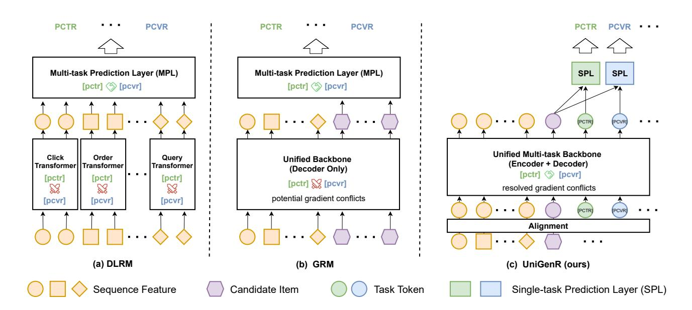
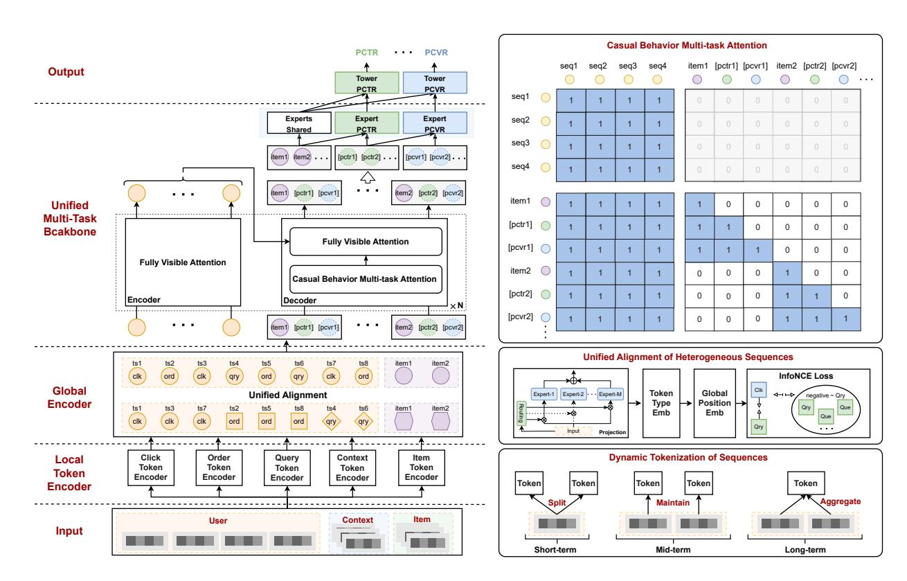

# From Modularity to Unity: Towards Industrial-Scale Generative Recommendation

Xiaofeng Liu∗ JD.com Beijing, China liuxiaofeng112@jd.com

Wenliang Li∗ JD.com Beijing, China liwenliang22@jd.com

Tao Yu JD.com Beijing, China yutao73@jd.com

Guanliang Song JD.com Beijing, China songguanliang1@jd.com

Zhen Chen JD.com Beijing, China chenzhen48@jd.com

Jing Zhou JD.com Beijing, China zhoujing162@jd.com

Dongyue Wang† JD.com Beijing, China wangdongyue@jd.com

Xiwei Zhao JD.com Beijing, China zhaoxiwei@jd.com

Sulong Xu JD.com Beijing, China xusulong@jd.com

## Abstract

Traditional deep learning recommendation models (DLRMs) rely on modular architectures composed of specialized, hand-designed sub-networks to process heterogeneous data. While effective, such designs introduce strong inductive biases that limit performance and scalability. Generative recommendation represents a promising path from modularity to unity by consolidating these architectures within a single framework, yet still faces critical challenges: an incompatibility between generative architectures and discriminative tasks, gradient interference across objectives in a shared backbone, and misaligned heterogeneous sequences.

To address these challenges, we present UniGenR, a unified ranking framework that fundamentally rethinks generative recommendation models (GRM) design. First, to better integrate discriminative tasks from DLRMs into generative modeling, UniGenR employs an encoder-decoder architecture named Unified Multi-Task Backbone, alongside a novel Causal Behavior Multi-task Attention mechanism that mitigates potential conflicts across different objectives. Second, for effective unified sequence modeling in the generative framework, UniGenR adopts a dual-encoder structure comprising a global token encoder for heterogeneous sequence alignment and local token encoders for dynamic tokenization and sequence adaptation. Comprehensive offline experiments and online A/B testing validate that UniGenR achieves state-of-the-art performance while establishing a new paradigm for scalable and conflict-friendly generative recommendation.

© 2026 Copyright held by the owner/author(s). ACM ISBN 979-8-4007-2307-0/2026/04 <https://doi.org/10.1145/3774904.3792842>

#### CCS Concepts

• Information systems → Information systems applications.

# Keywords

Recommendation systems; Generative Recommendation; Scaling Law.

#### ACM Reference Format:

Xiaofeng Liu, Wenliang Li, Tao Yu, Guanliang Song, Zhen Chen, Jing Zhou, Dongyue Wang, Xiwei Zhao, and Sulong Xu. 2026. From Modularity to Unity: Towards Industrial-Scale Generative Recommendation. In Proceedings of the ACM Web Conference 2026 (WWW '26), April 13–17, 2026, Dubai, United Arab Emirates. ACM, New York, NY, USA, [8](#page-7-0) pages. [https://doi.org/10.1145/](https://doi.org/10.1145/3774904.3792842) [3774904.3792842](https://doi.org/10.1145/3774904.3792842)

## 1 Introduction

Recommendation systems serve as the foundation of modern information filtering and personalized services [\[1,](#page-7-1) [2,](#page-7-2) [11,](#page-7-3) [16,](#page-7-4) [34\]](#page-7-5), enabling the simultaneous prediction of multiple user-response objectives such as click-through rate (CTR) and conversion rate (CVR). Conventional designs typically feed engineered features into a modular backbone network to capture feature interactions, with task-specific output layers built atop. As illustrated in Figure [1\(](#page-1-0)a), classical deep learning recommendation models (DLRMs) instantiate this approach by employing multiple handcrafted subnetworks within the backbone, each tailored for distinct types of sequential inputs [\[18,](#page-7-6) [22,](#page-7-7) [25,](#page-7-8) [26\]](#page-7-9). Although such modular designs have proven effective, they heavily rely on manual inductive biases and ad hoc architectures, which ultimately constrain their model performance and scalability as system complexity grows.

This scalability bottleneck contrasts sharply with the predictable scaling laws observed in natural language processing and computer vision [\[3,](#page-7-10) [10,](#page-7-11) [15,](#page-7-12) [20,](#page-7-13) [27\]](#page-7-14). Unlike these domains, where performance predictably improves with model size, the inherent architectural fragmentation of DLRMs with separate subnetworks for different sequence types prevents the coherent parameter growth necessary for power-law scaling. Consequently, the empirical study of scaling

∗Both authors contributed equally to this research.

†Corresponding author.

[This work is licensed under a Creative Commons Attribution 4.0 International License.](https://creativecommons.org/licenses/by/4.0) WWW '26, Dubai, United Arab Emirates.

Figure 1: Comparison of recommendation architecture paradigms. (a) DLRM: Employs a modular backbone network with specialized components for different feature sequences, introducing strong inductive biases. (b) GRM: Utilizes a decoder-only unified backbone to process all features, requiring full attention over the combined sequence of user behaviors and candidate items (computational complexity O ( (�� + ��) 2 )), while suffering from gradient conflicts and inadequate sequence alignment. (c) UniGenR: Employs an encoder-decoder architecture that separates user sequence encoding from item-task decoding, reducing attention computation by processing sequences independently (complexity O (�� 2 +�� 2 )). Introduces multi-task tokens to mitigate gradient conflicts and a global encoder for heterogeneous sequence alignment.

behaviors in recommendation systems remains underexplored. In response, recent efforts have turned to unified architectures, exemplified by Generative Recommendation Models (GRMs), which employ a single, unified backbone to process diverse sequential features and have demonstrated promising scalability and representational capacity in large-parameter regimes [\[8,](#page-7-15) [12,](#page-7-16) [19,](#page-7-17) [21,](#page-7-18) [29,](#page-7-19) [32\]](#page-7-20).

Despite these advantages, GRMs still face fundamental challenges that hinder their full potential. (1) Optimization conflicts within the shared backbone network, where the majority of parameters reside, remain largely unaddressed, degrading shared representations and intensifying with increasing task complexity. (2) Heterogeneous user sequences exhibit significant divergence in semantic space, interaction density, and temporal characteristics, creating substantial obstacles for effective representation alignment. (3) The prevalent decoder-only architecture in existing GRMs creates a fundamental mismatch between upstream sequence learning and downstream multi-task prediction objectives, as recommendation requires discriminative learning rather than next-token generation. These issues are interconnected: the architectural mismatch exacerbates the difficulties of achieving robust multi-task optimization, while misaligned sequence representations further amplify gradient conflicts. As illustrated in Figure [1\(](#page-1-0)b), although unified backbones offer architectural simplicity and parameter efficiency, their benefits are substantially offset by this combination of persistent gradient interference, inadequate sequence alignment, and architectural incompatibility.

To overcome these intertwined limitations, we propose Uni-GenR, a generative multi-task recommendation framework. The core of our approach is an encoder-decoder architecture specifically designed to bridge the gap between sequence encoding and multi-task prediction. As depicted in Figure [1](#page-1-0) (c), the framework employs task-specific tokens to decouple gradient conflicts at the representation level and a global encoder to achieve unified alignment of heterogeneous sequences. By co-designing the architecture and the optimization mechanism, UniGenR effectively addresses the aforementioned challenges while preserving the scalability advantages of unified backbones. The main contributions of this work are summarized as follows:

- Unified Multi-Task Backbone: We introduce a unified multi-task backbone that effectively mitigates gradient conflicts in multi-objective optimization through task tokens and casual behavior attention mechanisms. While employing an encoder-decoder structure, the key innovation lies in its ability to decouple competing gradients across tasks, enabling stable and efficient training while maintaining information integrity across various prediction objectives.
- Heterogeneous Sequence Alignment: We develop a cohesive alignment procedure that unifies heterogeneous behavioral sequences in both spatial and temporal dimensions. Through token type embeddings, global position encoding,

and contrastive learning, our approach effectively harmonizes diverse token representations from different domains into a unified feature space.

- Dynamic Tokenization Strategy: We propose a dynamic tokenization method that adaptively adjusts token granularity based on feature importance and temporal relevance. This approach enhances representation capacity for critical information while reducing computational complexity for less important features, effectively balancing detail and efficiency in large-scale recommendation scenarios.
- Scaling Law Validation and Industrial Application: We establish predictable power-law scaling relationships for UniGenR from 40M to 1B parameters. Offline experiments on a billion-scale industrial dataset, and online A/B tests on key business scenarios at JD.com are conducted to validate its performance. The framework will be deployed in production environments, serving real-world traffic on the platform.

The rest of the paper is organized as follows. Section [2](#page-2-0) reviews related work. Section [3](#page-2-1) introduces the UniGenR framework and its key components. Section [4](#page-5-0) describes the system deployment in industrial settings. Section [5](#page-5-1) presents offline and online experimental results. Finally, Section [6](#page-6-0) concludes the paper and discusses future directions.

# 2 Related Work

# 2.1 From Specialized DLRMs to Unified GRMs

Recommendation systems have evolved from specialized deep learning recommendation models (DLRMs) toward unified generative architectures. Traditional DLRMs rely on handcrafted subnetworks for distinct feature types and sequential patterns [\[18,](#page-7-6) [22,](#page-7-7) [26\]](#page-7-9). While effective in capturing feature interactions, these modular designs introduce strong inductive biases and hinder parameter scalability [\[7,](#page-7-21) [28,](#page-7-22) [33\]](#page-7-23).

To overcome fragmentation, Generative Recommendation Models (GRMs) unify heterogeneous features within a single backbone [\[19,](#page-7-17) [21,](#page-7-18) [32\]](#page-7-20). Models such as HSTU [\[32\]](#page-7-20) and MTGR [\[12\]](#page-7-16) exhibit encouraging scaling behavior. However, the dominant decoder-only architecture in GRMs often misaligns generative sequence modeling with discriminative prediction objectives, leaving a gap that motivates our encoder–decoder redesign in UniGenR.

# 2.2 Multi-task Optimization Challenges

Unified architectures inevitably intensify gradient conflicts among competing objectives such as CTR and CVR. While traditional DL-RMs alleviate this through task-specific subnetworks, they do so at the cost of parameter efficiency. In contrast, GRMs share a majority of parameters, amplifying interference across objectives and often resulting in unstable optimization [\[31\]](#page-7-24).

Prior work has explored mitigation through gradient surgery [\[31\]](#page-7-24) and adaptive loss-balancing methods [\[5\]](#page-7-25). However, these approaches merely adjust training dynamics rather than addressing the architectural origin of conflicts. This motivates our design of a conflictaware attention mechanism within an encoder–decoder backbone to inherently support harmonious multi-task learning.

## 2.3 Heterogeneous Sequence Alignment

Modeling diverse user behaviors—spanning clicks, searches, and orders—remains a long-standing challenge due to variations in semantics, density, and temporal patterns. Early methods relied on separate embedding spaces or domain-specific encoders [\[6\]](#page-7-26), limiting cross-domain understanding. Although pre-trained language models offer universal encoding [\[14\]](#page-7-27), their computational cost is prohibitive for real-time recommendation.

Recent advances in Sparse Mixture-of-Experts (MoE) architectures [\[17,](#page-7-28) [24\]](#page-7-29) improve scalability through conditional routing, but their application to multi-behavior alignment is still underexplored. Similarly, tokenization techniques from NLP [\[23,](#page-7-30) [30\]](#page-7-31) fail to capture the multi-modal, sparse, and temporally heterogeneous characteristics of behavioral data.

These limitations motivate our global–local encoder design, which jointly performs temporal alignment and adaptive tokenization for efficient heterogeneous sequence modeling.

# 2.4 Scaling Laws in Recommendation

Scaling laws, well established in language and vision domains [\[13,](#page-7-32) [15\]](#page-7-12), remain relatively underexplored in recommendation systems. Recent studies have reported scaling phenomena through architectural refinements such as HSTU [\[32\]](#page-7-20) and preference optimization approaches like OneRec [\[9\]](#page-7-33). However, existing GRMs still encounter architectural bottlenecks, particularly optimization conflicts and heterogeneous sequence misalignment, that hinder predictable and efficient parameter scaling. The prevalent decoder-only design further exacerbates these limitations by mismatching generative modeling with discriminative recommendation objectives, motivating UniGenR's integrated, conflict-aware architecture for stable and scalable generative recommendation.

# 2.5 Research Gap Synthesis

Current GRMs face three interconnected limitations: (i) architectural misalignment between generative modeling and discriminative tasks, (ii) intensified gradient conflicts in unified backbones, and (iii) ineffective alignment of heterogeneous sequences. Uni-GenR addresses these through an encoder–decoder architecture with conflict-aware attention and dual-encoder sequence modeling, enabling scalable and conflict-free generative recommendation.

# 3 METHODS

In this section, we describe the architecture of our proposed model as depicted in Figure [2.](#page-3-0) The whole framework consists of three fundamental components: Local Token Encoder, Global Encoder, and Unified Multi-Task Backbone.

## 3.1 Local Token Encoder

In e-commerce scenarios, user-side features include demographic attributes (e.g., gender, age) and a comprehensive set of behavioral characteristics. These behavioral attributes encompass various user interaction records within a defined time window, including clicks, orders, and queries, collectively forming a rich signal of user interests and intents. To effectively represent these diverse features, each feature category is transformed into corresponding tokens using specialized local token encoders.

Figure 2: Overall architecture of the UniGenR framework.

We propose a dynamic tokenization strategy that adjusts token granularity according to feature importance and time scale:

Short-Term Components: For sequence components with high short-term importance, we decompose each element into multiple tokens. For example, a single SKU is represented by distinct tokens for different modalities:

EmbSKU�� → Tokenimg�� Tokentext�� · · · . (1)

This decomposition allows the model to independently process various aspects of the SKU, such as visual embeddings and textual descriptions.

Medium-Term Components: For sequence components of moderate importance in the medium term, each SKU is encoded into a single token. This approach balances the granularity of representation with computational efficiency:

EmbSKU�� → TokenSKU�� . (2)

Long-Term Components: For sequence components with lower importance over the long term, multiple SKUs are aggregated into a grouped SKU token. This aggregation reduces the complexity of long-term dependencies while retaining essential information:

 EmbSKU�� EmbSKU��+1 · · · → TokenSKU�� . (3)

In our work, the first 150 actions constitute short-term features, actions 151 to 1000 form medium-term features, and actions beyond 1000 are considered long-term features.

This dynamic tokenization method offers several advantages, significantly enhancing the scalability, representation capacity, and efficiency of the recommendation system. By adjusting token granularity according to feature importance and temporal relevance, the approach effectively manages computational resources while preserving critical information. Decomposing high-importance features into multiple tokens enables the model to capture diverse aspects of each feature, enriching the overall representation. Conversely, aggregating lower-importance features reduces input complexity without substantial information loss, facilitating faster processing and improved scalability. Collectively, the proposed categorization and dynamic tokenization strategy allow the UniGenR framework to balance detail and efficiency effectively, thereby strengthening its capability to model complex user-item interactions and enhancing both recommendation accuracy and system performance. By decomposing short-term signals and aggregating long-term ones, the encoder captures diverse interaction patterns while maintaining scalability—laying the foundation for efficient global alignment and multi-task learning in subsequent modules.

# 3.2 Global Encoder

While the Local Token Encoder preserves intra-domain diversity, effective recommendation also requires coherent alignment across

heterogeneous domains (e.g., user, item, and context). To achieve this, UniGenR employs a Global Encoder inspired by feature alignment strategies in large-scale multimodal models. It ensures that tokens from different domains are embedded within a unified feature space, enabling seamless cross-domain interaction.

The alignment process involves four key steps:

Mapping to a Unified Feature Space: Initially, disparate tokens are routed through a Sparse Mixture of Experts (SMoE) layer with Top-8 experts routing, which maps them into a common feature space. The SMoE layer leverages multiple expert networks to capture diverse feature representations, enhancing the model's capacity to generalize across different domains. Mathematically, this transformation is denoted as:

��SMoE = SMoE(��tokens), (4)

where ��tokens represents the input token embeddings, and ��SMoE denotes the output embeddings after passing through the SMoE layer.

Augmenting with Token Type Embeddings: To facilitate domain-specific learning, each token is augmented with a dedicated token type embedding. This embedding serves as an auxiliary signal, enabling the model to distinguish between tokens originating from different domains. The incorporation of token type embeddings is expressed as:

��type = ��SMoE + ��type, (5)

where ��type represents the token type embeddings corresponding to each token.

Applying Global Position Embeddings: To incorporate temporal context, global position embeddings based on each token's actual timestamp are added. This step ensures that the model captures the temporal dynamics of user interactions and item features. The global position embedding is formulated as:

�� = ��type + ��pos, (6)

where ��pos denotes the position embeddings derived from the timestamp parameters of each token. In our work, standard sinusoidal embeddings added element-wise to token embeddings.

Aligning Tokens via Contrastive Learning: Finally, InfoNCE loss is applied to maximize agreement between semantically related tokens and separate unrelated ones, thereby enforcing cross-domain consistency. The InfoNCE loss is defined as:

LNCE = − log exp(sim(�� (Token1��), �� (Token2��))/��) Í I��≠�� exp(sim(�� (Token1��), �� (Token2��))/��) , (7)

where sim(·, ·) denotes the similarity function, typically cosine similarity, �� (Token1��) and �� (Token2��) represent positive pairs of aligned tokens, I��≠�� is an indicator function that excludes the comparison of a token with itself, �� is the temperature parameter that scales the logits.

The alignment procedure in UniGenR ensures that tokens from heterogeneous domains are cohesively represented within a unified feature space. By sequentially mapping tokens through the

SMoE layer, augmenting them with token type embeddings, incorporating temporal information via global position embeddings, and optimizing alignment using the InfoNCE loss, UniGenR effectively harmonizes diverse token representations. This step is critical for mitigating domain gaps and establishing a coherent foundation for multi-task optimization in the subsequent backbone.

#### 3.3 Unified Multi-Task Backbone

The Unified Multi-Task Backbone serves as the central processing hub of UniGenR, integrating the aligned user tokens ���� and item tokens ���� obtained from the Global Encoder, together with a set of newly introduced task-specific tokens (e.g., �������� ��, �������� ��). Unlike previous decoder-only GRMs that entangle generative modeling with discriminative objectives, our backbone adopts an encoder–decoder architecture in which user and item tokens are first processed through aligned encoders, while task tokens are injected within the decoder stage to guide task-aware prediction and enable robust multi-objective learning.

Encoder-Decoder Architecture: To address the inherent divergence between sequential feature learning and downstream multiobjective prediction, we adopt an encoder–decoder architecture in place of a conventional decoder-only structure. In this framework, the encoder module is dedicated to processing user tokens ���� to derive comprehensive user representations, while the decoder module concurrently processes item tokens ���� and task-specific tokens ��PCTR, ��PCVR via self-attention, subsequently integrating them with the encoded user representations. This design enables

fine-grained user–item interactions adapted to each predictive task. Casual Behavior Multi-task Attention: To prevent information leakage and preserve task integrity, a dedicated masking matrix �� is incorporated into the self-attention layers. The masking scheme imposes three critical constraints: (1) item tokens are prevented from attending to each other, thereby preserving their independent contributions; (2) task tokens are allowed to attend to all item tokens, ensuring that relevant information is accessible for each specific task; and (3) a hierarchical attention flow is enforced among task tokens, whereby PCTR task tokens can attend to PCVR tokens, but not vice versa, thus maintaining the intended task hierarchy.

Multi-Task Processing with MMoE: Shared backbone networks often suffer from optimization conflicts caused by competing gradients across multiple objectives, leading to unstable training and suboptimal task performance. To mitigate these conflicts, the Unified Backbone incorporates a Multi-gate Mixture-of-Experts (MMoE) layer that explicitly separates shared and task-specific representation pathways while maintaining adaptive information exchange. Concretely, the MMoE layer consists of two categories of experts: (1) shared experts, which capture common patterns across all tasks, and (2) task-specific experts, each dedicated to one predictive objective. The outputs of the encoder–decoder backbone are routed to these experts according to token type: The aligned item tokens ���� are distributed to all experts (both shared and taskspecific), allowing global feature sharing, whereas the task tokens (e.g., �������� ��, �������� ��) are routed only to their corresponding taskspecific experts, enforcing task isolation and reducing gradient

interference. This design allows UniGenR to achieve a flexible balance between shared knowledge transfer and task specialization, effectively mitigating gradient conflicts while enhancing both stability and predictive accuracy.

The Unified Multi-Task Backbone employs an encoder-decoder structure, augmented to efficiently process aligned token sequences. This architecture delivers three key benefits: robust multi-task learning through shared and task-specific experts, enabling simultaneous optimization of multiple objectives; reduced gradient conflicts via separated expert pathways, ensuring stable and efficient training; improved computational efficiency through decomposition of the causal mask matrix and preserved information integrity, preventing leakage while maintaining task-specific information flows.

#### 4 System Deployment

In this section, we describe how UniGenR is deployed in production, emphasizing two crucial optimizations. First, during training we adopt a listwise formulation to eliminate redundant computation of user features across multiple candidate items. Second, a novel KV Cache mechanism leverages UniGenR's encoder-decoder architecture to decouple user and item computations, significantly reducing inference FLOPs while maintaining low latency. For offline training and testing, we utilize a cluster of 128 B200 GPUs, while online inference is deployed on 4090D GPUs, achieving an inference latency of 35 ms.

#### 4.1 Listwise-based Training

We adopt a listwise training paradigm that aligns with UniGenR's generative architecture. The model inputs comprise three feature types: user features (��), candidate item features (��), and user-item cross features pre-computed via feature engineering (��) (e.g., usercategory CTR). Training samples are organized per user request, with each sample containing the requesting user's features and �� candidate items from the same request, formally represented as:

D = [��, [��, ��]1 , . . . , [��, ��]��] . (8)

This listwise structure enables the model to process all candidates associated with a user in a single forward pass, thereby eliminating repeated computation of user features. As a result, training efficiency is substantially improved, particularly in industrial-scale applications where the number of candidates per user can be large.

# 4.2 Customized KV Cache Serving

Deploying large generative recommendation models under strict latency constraints remains challenging. Inspired by LONGER [\[4\]](#page-7-34) and M-FALCON [\[32\]](#page-7-20), we introduce a Customized KV Cache strategy that exploits UniGenR's encoder-decoder architecture. Unlike decoder-only models, our approach caches encoder outputs as ��&�� for decoder stage, enabling computational reuse across multiple candidate items during inference. During a single online request, user-related encoder computations are performed only once and executed in parallel with the recall and coarse-ranking modules. The mechanism operates in two stages:

Stage 1: Upon receiving a user request, the user encoder processes behavior sequences and generates contextual representations.

Table 1: Evaluation of methods on industrial datasets.

| Method    | CTR GAUC         | CTCVR GAUC       |
|-----------|------------------|------------------|
| DLRM      | 0.5778           | 0.6644           |
| HSTU [32] | 0.5865 (+0.0087) | 0.6670 (+0.0026) |
| UniGenR   | 0.5886 (+0.0108) | 0.6709 (+0.0065) |

The encoder outputs are cached and computed concurrently with candidate retrieval and coarse-ranking modules.

Stage 2: When candidate items are available, the decoder utilizes cached encoder representations alongside item embeddings to compute final predictions, avoiding redundant user-side computations.

This design reduces per-request FLOPs by approximately 70% through computational amortization and module-level parallelism. The approach maintains low online latency while minimizing resource consumption, making it particularly suitable for real-time recommendation systems.

## 5 Experiments

We conduct extensive experiments to evaluate UniGenR, addressing the following research questions:

- RQ1: How does UniGenR compare to state-of-the-art recommendation models on industrial datasets?
- RQ2: What is the contribution of each key component in UniGenR to the overall performance?
- RQ3: How does UniGenR scale with increasing model size and computational resources?

## 5.1 Experimental Setup

We evaluate UniGenR on a real-world ranking task using large-scale data from JD.com. The dataset contains 50 billion user interaction logs from May to July 2025, featuring user demographics, long-term behavior sequences (clicks, impressions, requests), and candidate item profiles (SKU ID, category, title, store identifier). We compare against two strong baselines: JD.com's production DLRM and the GRM-based HSTU model. All models use identical preprocessing and hyperparameters for fair comparison.

# 5.2 Overall Performance (RQ1)

We evaluate model performance using Group-AUC (GAUC), which measures ranking quality by calculating the average AUC within each user group, providing personalized assessment of recommendation accuracy. The comparative results on the industrial dataset are summarized in Table [1.](#page-5-2)

The proposed UniGenR framework achieves the best performance across both CTR and CTCVR prediction tasks. For CTR prediction, UniGenR attains a GAUC of 0.5886, representing a 1.87% relative improvement over the production DLRM baseline (0.5778) and outperforming HSTU (0.5865). For the more complex CTCVR prediction task, UniGenR achieves a GAUC of 0.6709, demonstrating a 0.98% improvement over DLRM (0.6644) and 0.58% over HSTU (0.6670).

The superior performance of UniGenR can be attributed to its encoder-decoder architecture, which effectively mitigates gradient

Table 2: Ablation studies of UniGenR.

| Method |            |              | CTR       | CTCVR     |
|--------|------------|--------------|-----------|-----------|
|        |            |              | GAUC Diff | GAUC Diff |
| w/o    | multi-task | tokens       | -0.0035   | -0.0025   |
| w/o    | unified    | alignment    | -0.0028   | -0.0016   |
| w/o    | dynamic    | tokenization | -0.0022   | -0.0013   |

conflicts through multi-task tokens and aligns diverse user behaviors through unified tokenization. While HSTU shows competitive results, particularly on CTR prediction, its decoder-only architecture may lack the dedicated encoding capacity required for optimal heterogeneous sequence alignment in multi-task settings.

These results demonstrate UniGenR 's effectiveness in handling complex industrial recommendation scenarios, achieving consistent improvements across different prediction tasks while maintaining the scalability advantages of unified architectures.

# 5.3 Ablation study (RQ2)

Table [2](#page-6-1) presents the ablation results evaluating the contribution of each key component in UniGenR . The removal of multi-task tokens causes the most significant performance degradation, reducing CTR GAUC by 0.0035 and CTCVR GAUC by 0.0025. This substantial drop confirms the critical role of multi-task tokens in mitigating gradient conflicts across competing objectives.

The absence of unified alignment results in moderate performance decreases, with CTR GAUC reduced by 0.0028 and CTCVR GAUC by 0.0016, highlighting the importance of effective heterogeneous sequence alignment. Dynamic tokenization removal shows the smallest but consistent impact, reducing CTR GAUC by 0.0022 and CTCVR GAUC by 0.0013, demonstrating its utility in preserving structural dependencies while maintaining efficiency.

The progressive performance decline across ablation variants confirms the complementary nature of UniGenR's components, with multi-task tokens emerging as the most influential factor for robust multi-task performance. The introduction of these tokens enables early-stage task differentiation, providing a straightforward yet effective mechanism that mitigates optimization conflicts between different objectives. The consistent negative impact across both CTR and CTCVR tasks further validates the framework's effectiveness in handling diverse recommendation objectives.

# 5.4 Scaling Analysis (RQ3)

This section analyzes the scaling behavior of UniGenR with respect to model size. We model the performance-scale relationship using a power-law formulation:

P = ������ + �� (9)

where P represents GAUC performance, �� denotes the number of model parameters, �� and �� are scaling coefficients, and �� represents the baseline performance offset.

Table [3](#page-6-2) presents UniGenR's performance across three model scales. As parameters increase from 0.04B to 1.00B (a 25× scaleup), we observe consistent improvements: CTR GAUC grows from

Table 3: The scalability of of UniGenR.

|            | UniGenR | UniGenR-M        | UniGenR-L        |
|------------|---------|------------------|------------------|
| CTR GAUC   | 0.5886  | 0.5940 (+0.0054) | 0.5991 (+0.0105) |
| CTCVR GAUC | 0.6709  | 0.6742 (+0.0033) | 0.6773 (+0.0064) |
| Parameters | 0.04B   | 0.24B ( × 6)     | 1.00B ( × 25)    |

Table 4: Power-law fitting results for scaling behavior

0.5886 to 0.5991 (+0.0105, 1.78% relative improvement), while CTCVR GAUC increases from 0.6709 to 0.6773 (+0.0064, 0.95% relative improvement). The performance gains demonstrate a clear power-law relationship with diminishing returns at larger scales.

Table [4](#page-6-3) presents the scaling behavior remains consistent across tasks, where the small positive exponents in the power-law relationship (��CTR = 0.106, ��CTCVR = 0.103) reflect UniGenR's stable scaling efficiency. This predictable pattern offers practical guidance for model capacity planning in industrial recommendation systems, confirming that UniGenR sustains performance improvements with increasing model complexity while providing the diminishing returns characteristic of well-behaved scaling laws. The sub-linear exponents (�� &lt; 0.2) indicate that marginal performance gains must be balanced against the cost of increasing model size, providing crucial insights for resource allocation in production systems.

## 5.5 Online A/B Testing

To evaluate the real-world effectiveness of UniGenR, we conducted large-scale online A/B tests over a two-week period involving hundreds of millions of users on the JD.com platform. The UniGenR-M model (0.24B parameters) was deployed in production and compared against the existing DLRM-based ranking system. UniGenR-M achieved a +1.49% increase in UCTR and a +1.28% improvement in UCVR. These results confirm that the architectural advantages observed in offline evaluations translate to meaningful performance gains in real-world recommendation scenarios.

The successful deployment of the 0.24B parameter model with consistent sub-second latency demonstrates UniGenR 's practicality for industrial-scale applications, balancing model capacity with inference efficiency.

## 6 Conclusions

In this work, we present UniGenR , a generative multi-task recommendation framework that addresses fundamental limitations in both traditional DLRMs and modern GRMs. Extensive experiments demonstrate that UniGenR achieves state-of-the-art performance on industrial-scale recommendation tasks, outperforming both production DLRM baselines and existing GRM approaches. Furthermore, we establish that UniGenR follows predictable power-law scaling relationships from 40 million to 1 billion parameters, providing the first empirical evidence of clean scaling laws in generative

recommendation systems. The framework's design effectively resolves the core challenges of optimization conflicts, sequence alignment, and architectural mismatch that plague existing approaches. Our work provides both a scalable architecture and empirical foundations for future research on large-scale recommendation systems, opening new directions for conflict-free multi-task learning in in-

dustrial applications. Acknowledgments We would like to thank Peng Lin, Zhaolong Xing, Peisong Guo, Zhida Jiang, Yuan Li and Songlin Song who provided feedback or supported us throughout this project. References [1] Amos Azaria, Avinatan Hassidim, Sarit Kraus, Adi Eshkol, Ofer Weintraub, and Irit Netanely. 2013. Movie recommender system for profit maximization. In Proceedings of the 7th ACM conference on Recommender systems. 121–128. [2] Hong-Kyun Bae, Hae-Ri Jang, Won-Yong Shin, and Sang-Wook Kim. 2025. Ranking Items by the Current-Preferences and Profits: A List-wise Learning-to-Rank Approach to Profit Maximization. In Proceedings of the ACM on Web Conference 2025. 5010–5021. [3] Tom Brown, Benjamin Mann, Nick Ryder, Melanie Subbiah, Jared D Kaplan, Prafulla Dhariwal, Arvind Neelakantan, Pranav Shyam, Girish Sastry, Amanda Askell, et al. 2020. Language models are few-shot learners. Advances in neural information processing systems 33 (2020), 1877–1901. [4] Zheng Chai, Qin Ren, Xijun Xiao, Huizhi Yang, Bo Han, Sijun Zhang, Di Chen, Hui Lu, Wenlin Zhao, Lele Yu, et al. 2025. Longer: Scaling up long sequence modeling in industrial recommenders. In Proceedings of the Nineteenth ACM Conference on Recommender Systems. 247–256. [5] Zhao Chen, Vijay Badrinarayanan, Chen-Yu Lee, and Andrew Rabinovich. 2018. Gradnorm: Gradient normalization for adaptive loss balancing in deep multitask networks. In International conference on machine learning. PMLR, 794–803. [6] Heng-Tze Cheng, Levent Koc, Jeremiah Harmsen, Tal Shaked, Tushar Chandra, Hrishi Aradhye, Glen Anderson, Greg Corrado, Wei Chai, Mustafa Ispir, et al. 2016. Wide & deep learning for recommender systems. In Proceedings of the 1st workshop on deep learning for recommender systems. 7–10. [7] Paul Covington, Jay Adams, and Emre Sargin. 2016. Deep neural networks for youtube recommendations. In Proceedings of the 10th ACM conference on recommender systems. 191–198. [8] Yashar Deldjoo, Zhankui He, Julian McAuley, Anton Korikov, Scott Sanner, Arnau Ramisa, René Vidal, Maheswaran Sathiamoorthy, Atoosa Kasirzadeh, and Silvia Milano. 2024. A review of modern recommender systems using generative models (gen-recsys). In Proceedings of the 30th ACM SIGKDD conference on Knowledge Discovery and Data Mining. 6448–6458. [9] Jiaxin Deng, Shiyao Wang, Kuo Cai, Lejian Ren, Qigen Hu, Weifeng Ding, Qiang Luo, and Guorui Zhou. 2025. Onerec: Unifying retrieve and rank with generative recommender and iterative preference alignment. arXiv preprint arXiv:2502.18965 (2025). [10] Yan Fang, Jingtao Zhan, Qingyao Ai, Jiaxin Mao, Weihang Su, Jia Chen, and Yiqun Liu. 2024. Scaling laws for dense retrieval. In Proceedings of the 47th International ACM SIGIR Conference on Research and Development in Information Retrieval. 1339–1349. [11] Yuanbo Gao, Peng Lin, Dongyue Wang, Feng Mei, Xiwei Zhao, Sulong Xu, and Jinghe Hu. 2024. PPM: A Pre-trained Plug-in Model for Click-through Rate Prediction. In Companion Proceedings of the ACM Web Conference 2024. New York, NY, USA, 311–318. [12] Ruidong Han, Bin Yin, Shangyu Chen, He Jiang, Fei Jiang, Xiang Li, Chi Ma, Mincong Huang, Xiaoguang Li, Chunzhen Jing, et al. 2025. Mtgr: Industrialscale generative recommendation framework in meituan. In Proceedings of the 34th ACM International Conference on Information and Knowledge Management. 5731–5738. [13] Jordan Hoffmann, Sebastian Borgeaud, Arthur Mensch, Elena Buchatskaya, Trevor Cai, Eliza Rutherford, Diego de Las Casas, Lisa Anne Hendricks, Johannes Welbl, Aidan Clark, et al. 2022. Training compute-optimal large language models. arXiv preprint arXiv:2203.15556 (2022). [14] Yupeng Hou, Shanlei Mu, Wayne Xin Zhao, Yaliang Li, Bolin Ding, and Ji-Rong Wen. 2022. Towards universal sequence representation learning for recommender systems. In Proceedings of the 28th ACM SIGKDD conference on knowledge discovery and data mining. 585–593. [15] Jared Kaplan, Sam McCandlish, Tom Henighan, Tom B Brown, Benjamin Chess, Rewon Child, Scott Gray, Alec Radford, Jeffrey Wu, and Dario Amodei. 2020. Scaling laws for neural language models. arXiv preprint arXiv:2001.08361 (2020). [16] Sujay Khandagale, Bhawna Juneja, Prabhat Agarwal, Aditya Subramanian, Jaewon Yang, and Yuting Wang. 2025. InteractRank: Personalized Web-Scale Search Pre-Ranking with Cross Interaction Features. In Companion Proceedings of the ACM on Web Conference 2025. 287–295. [17] Dmitry Lepikhin, HyoukJoong Lee, Yuanzhong Xu, Dehao Chen, Orhan Firat, Yanping Huang, Maxim Krikun, Noam Shazeer, and Zhifeng Chen. 2020. Gshard: Scaling giant models with conditional computation and automatic sharding. arXiv preprint arXiv:2006.16668 (2020). [18] Jianxun Lian, Xiaohuan Zhou, Fuzheng Zhang, Zhongxia Chen, Xing Xie, and Guangzhong Sun. 2018. xdeepfm: Combining explicit and implicit feature interactions for recommender systems. In Proceedings of the 24th ACM SIGKDD international conference on knowledge discovery & data mining. 1754–1763. [19] Zihan Liu, Yupeng Hou, and Julian McAuley. 2024. Multi-behavior generative recommendation. In Proceedings of the 33rd ACM International Conference on Information and Knowledge Management. 1575–1585. [20] Ryan McKenna, Yangsibo Huang, Amer Sinha, Borja Balle, Zachary Charles, Christopher A Choquette-Choo, Badih Ghazi, George Kaissis, Ravi Kumar, Ruibo Liu, et al. 2025. Scaling laws for differentially private language models. arXiv preprint arXiv:2501.18914 (2025). [21] Yue Meng, Cheng Guo, Yi Cao, Tong Liu, and Bo Zheng. 2025. A Generative Reranking Model for List-level Multi-objective Optimization at Taobao. In Proceedings of the 48th International ACM SIGIR Conference on Research and Development in Information Retrieval. 4213–4218. [22] Qi Pi, Guorui Zhou, Yujing Zhang, Zhe Wang, Lejian Ren, Ying Fan, Xiaoqiang Zhu, and Kun Gai. 2020. Search-based user interest modeling with lifelong sequential behavior data for click-through rate prediction. In Proceedings of the 29th ACM International Conference on Information & Knowledge Management. 2685–2692. [23] Rico Sennrich, Barry Haddow, and Alexandra Birch. 2015. Neural machine translation of rare words with subword units. arXiv preprint arXiv:1508.07909 (2015). [24] Noam Shazeer, Azalia Mirhoseini, Krzysztof Maziarz, Andy Davis, Quoc Le, Geoffrey Hinton, and Jeff Dean. 2017. Outrageously large neural networks: The sparsely-gated mixture-of-experts layer. arXiv preprint arXiv:1701.06538 (2017). [25] Zihua Si, Lin Guan, ZhongXiang Sun, Xiaoxue Zang, Jing Lu, Yiqun Hui, Xingchao Cao, Zeyu Yang, Yichen Zheng, Dewei Leng, et al. 2024. Twin v2: Scaling ultralong user behavior sequence modeling for enhanced ctr prediction at kuaishou. In Proceedings of the 33rd ACM International Conference on Information and Knowledge Management. 4890–4897. [26] Hongyan Tang, Junning Liu, Ming Zhao, and Xudong Gong. 2020. Progressive layered extraction (ple): A novel multi-task learning (mtl) model for personalized recommendations. In Proceedings of the 14th ACM conference on recommender systems. 269–278. [27] Chaofan Tao, Qian Liu, Longxu Dou, Niklas Muennighoff, Zhongwei Wan, Ping Luo, Min Lin, and Ngai Wong. 2024. Scaling laws with vocabulary: Larger models deserve larger vocabularies. Advances in Neural Information Processing Systems 37 (2024), 114147–114179. [28] Shoujin Wang, Liang Hu, Yan Wang, Xiangnan He, Quan Z Sheng, Mehmet A Orgun, Longbing Cao, Francesco Ricci, and Philip S Yu. 2021. Graph learning based recommender systems: A review. arXiv preprint arXiv:2105.06339 (2021). [29] Wenjie Wang, Honghui Bao, Xinyu Lin, Jizhi Zhang, Yongqi Li, Fuli Feng, See-Kiong Ng, and Tat-Seng Chua. 2024. Learnable item tokenization for generative recommendation. In Proceedings of the 33rd ACM International Conference on Information and Knowledge Management. 2400–2409. [30] Linting Xue, Aditya Barua, Noah Constant, Rami Al-Rfou, Sharan Narang, Mihir Kale, Adam Roberts, and Colin Raffel. 2022. ByT5: Towards a token-free future with pre-trained byte-to-byte models. Transactions of the Association for Computational Linguistics 10 (2022), 291–306. [31] Tianhe Yu, Saurabh Kumar, Abhishek Gupta, Sergey Levine, Karol Hausman, and Chelsea Finn. 2020. Gradient surgery for multi-task learning. Advances in neural information processing systems 33 (2020), 5824–5836. [32] Jiaqi Zhai, Lucy Liao, Xing Liu, Yueming Wang, Rui Li, Xuan Cao, Leon Gao, Zhaojie Gong, Fangda Gu, Jiayuan He, et al. 2024. Actions speak louder than words: trillion-parameter sequential transducers for generative recommendations. In Proceedings of the 41st International Conference on Machine Learning. 58484– 58509. [33] Hengyu Zhang, Junwei Pan, Dapeng Liu, Jie Jiang, and Xiu Li. 2024. Deep pattern network for click-through rate prediction. In Proceedings of the 47th International ACM SIGIR Conference on Research and Development in Information Retrieval. 1189–1199. [34] Kai Zheng, Haijun Zhao, Rui Huang, Beichuan Zhang, Na Mou, Yanan Niu, Yang Song, Hongning Wang, and Kun Gai. 2024. Full stage learning to rank: A unified framework for multi-stage systems. In Proceedings of the ACM Web Conference 2024. 3621–3631.

