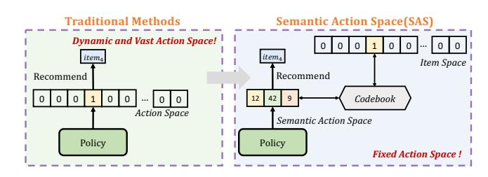
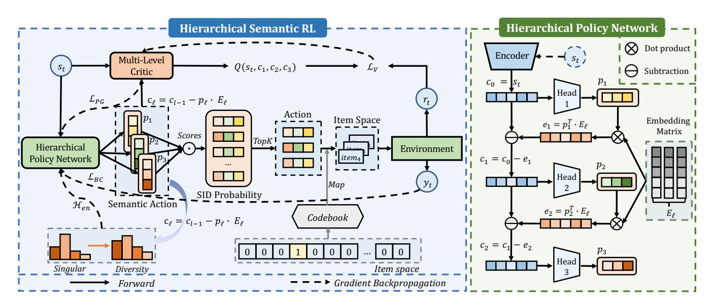
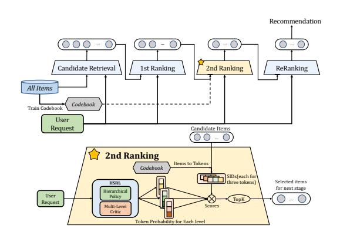
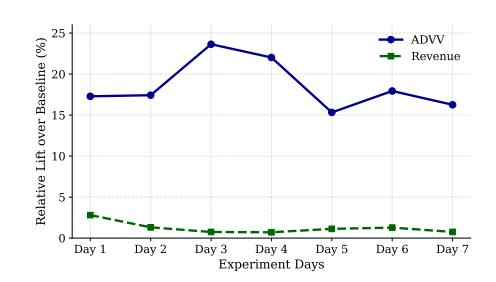
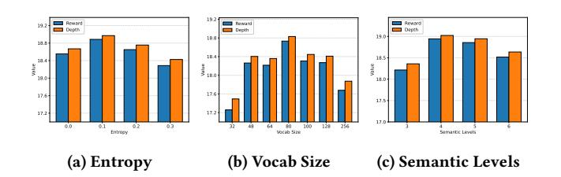
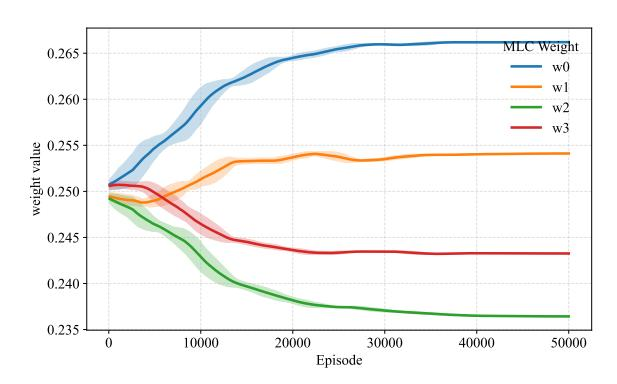

# Hierarchical Semantic RL: Tackling the Problem of Dynamic Action Space for RL-based Recommendations

Minmao Wang∗ Fudan University Shanghai, China mmwang25@m.fudan.edu.cn

Xingchen Liu Kuaishou Technology Beijing, China liuxingchen07@kuaishou.com

Shijie Yi Kuaishou Technology Beijing, China yishijie@kuaishou.com

Likang Wu† Tianjin University Tianjin, China wulk@tju.edu.cn

Hongke Zhao Tianjin University Tianjin, China hongke@tju.edu.cn

Fei Pan Kuaishou Technology Beijing, China panfei05@kuaishou.com

Qingpeng Cai† Kuaishou Technology Beijing, China caiqingpeng@kuaishou.com

Peng Jiang Kuaishou Technology Beijing, China jiangpeng@kuaishou.com

# Abstract

Recommender Systems (RS) are fundamental to modern online services. While most existing approaches optimize for short-term engagement, recent work has begun to explore reinforcement learning (RL) to model long-term user value. However, these efforts face significant challenges due to the vast, dynamic action spaces inherent in RS, which hinder stable policy learning. To resolve this bottleneck, we introduce Hierarchical Semantic RL (HSRL), which reframes RL-based recommendation over a fixed Semantic Action Space (SAS). HSRL encodes items as Semantic IDs (SIDs) for policy learning, and maps SIDs back to their original items via a fixed lookup during execution. To align decision-making with SID generation, the Hierarchical Policy Network (HPN) operates in a coarse-to-fine manner, employing hierarchical residual state modeling to refine each level's context from the previous level's residual, thereby reducing representation–decision mismatch. In parallel, a Multi-level Critic (MLC) provides token-level value estimates, enabling fine-grained credit assignment. Across public benchmarks and a large-scale production dataset from a leading short-video advertising platform, HSRL consistently surpasses state-of-the-art baselines. In online deployment over a 7-day A/B testing, it delivers an 18.421% ADVV lift and a 1.251% increase in Revenue, supporting HSRL as a scalable paradigm for RL-based recommendation.

# CCS Concepts

• Information systems → Recommender systems.

∗This work was done during an internship at Kuaishou Technology. †Corresponding authors.

[This work is licensed under a Creative Commons Attribution 4.0 International License.](https://creativecommons.org/licenses/by/4.0)

WWW '26, Dubai, United Arab Emirates © 2026 Copyright held by the owner/author(s). ACM ISBN 979-8-4007-2307-0/2026/04 <https://doi.org/10.1145/3774904.3792843>

# Keywords

Reinforcement Learning, Recommender Systems, Semantic Action Space

### ACM Reference Format:

Minmao Wang, Xingchen Liu, Shijie Yi, Likang Wu, Hongke Zhao, Fei Pan, Qingpeng Cai, and Peng Jiang. 2026. Hierarchical Semantic RL: Tackling the Problem of Dynamic Action Space for RL-based Recommendations. In Proceedings of the ACM Web Conference 2026 (WWW '26), April 13–17, 2026, Dubai, United Arab Emirates. ACM, New York, NY, USA, [12](#page-11-0) pages. <https://doi.org/10.1145/3774904.3792843>

# 1 Introduction

Recommender Systems (RS) [\[11,](#page-8-0) [38,](#page-8-1) [42–](#page-9-0)[44,](#page-9-1) [51,](#page-9-2) [52\]](#page-9-3) have become indispensable infrastructure in the modern digital economy, fundamentally driving growth across e-commerce, content distribution, and online advertising platforms. Their core mission is to achieve highly personalized content delivery by deeply profiling user behavior, ultimately maximizing long-term cumulative user utility. However, prevailing recommendation methodologies predominantly rely on the Supervised Learning (SL) paradigm, modeling recommendation as a static prediction task. The objectives are typically confined to optimizing immediate engagement metrics, such as click-through rate (CTR) or conversion rate [\[10,](#page-8-2) [26,](#page-8-3) [27,](#page-8-4) [55\]](#page-9-4). This inherent myopic single-step optimization strategy ignores the sequential nature and long-term dynamic dependencies in usersystem interactions. Consequently, these models often converge to a short-term local optimum, potentially sacrificing overall longterm systemic benefits. In recent years, Reinforcement Learning (RL) [\[16,](#page-8-5) [33\]](#page-8-6), with its capability for sequential decision-making and maximizing cumulative reward, has emerged as a promising paradigm for addressing the long-term optimization challenge in RS. By explicitly modeling user–system interactions as a sequential process, RL enables long-horizon optimization beyond short-term engagement, offering a principled solution where SL falls short.

Nevertheless, as shown in Figure [1,](#page-1-0) applying deep RL policies to industrial-scale recommendation environments encounters a

Figure 1: Action Space in Recommendation.

critical technical bottleneck: a highly dynamic and extremely large action space. Online RS are required to select optimal actions from a candidate item pool that scales into the millions or even billions and is constantly expanding. Within the RL framework, each item corresponds to a unique discrete action, making direct policy optimization infeasible due to the enormous cardinality and dynamic nature of the action set. This problem is the primary barrier preventing the deployment of mainstream RL algorithms in large-scale RS. Prior studies, such as continuous "hyper-actions" [\[4,](#page-8-7) [23\]](#page-8-8), offer a workaround; however, the mapping from continuous policy outputs to discrete items often lacks differentiability and consistency, leading to suboptimal exploration and unstable training.

To effectively address the challenges of dynamic, high-dimensional action spaces, we leverage Semantic IDs (SIDs) [\[31\]](#page-8-9) to represent items in a tokenized, hierarchical semantic space, enabling structured action encoding. Building upon this, we propose the HSRL framework, the first Reinforcement Learning approach to utilize SIDs for establishing the novel Semantic Action Space (SAS) paradigm. Specifically, SAS deterministically projects the dynamic, high-dimensional item-level action space onto a fixed-size, lowdimensional hierarchical discrete space. Under this framework, the native RL policy network is exclusively tasked with exploration and optimization within this fixed-dimension semantic space. This design achieves an effective decoupling of the policy decision space from the item execution space, ensuring that the policy output dimension is no longer constrained by the item catalog size. This effectively resolves the action space dynamism problem, paving a new, scalable pathway for industrial RL recommendation systems.

While the Semantic Action Space offers substantial scalability advantages, adopting structured SIDs as the RL action introduces two new major challenges. First, the SID generation process is a multi-step sequential autoregressive process with an inherent hierarchical dependency: the selection of higher-level tokens dictates the search scope for lower-level tokens, necessitating that the policy precisely captures and models this "coarse-to-fine" dependency, so that decisions for tokens at different levels cannot be treated equally. Second, user interactions in RS typically yield only a sparse, sequence-level reward signal after the entire SID sequence has been generated and executed. This signal setting significantly exacerbates the credit assignment problem. The diluted reward signal across the long decision chain results in unstable policy gradient estimation, severely hindering optimization efficiency and stability.

To effectively address these challenges, we introduce an innovative hierarchical Actor-Critic architecture featuring two core modules. First, the Hierarchical Policy Network (HPN) strictly aligns

with the SID's hierarchical structure, generating tokens autoregressively. We introduce Hierarchical Residual State Modeling, ensuring that each layer's policy input recursively fuses the global context with the residual state information remaining after the preceding token's determination, thus guiding the subsequent fine-grained selection. This progressively refined decision mechanism enhances the policy's structured generalization within the semantic space, improving generalization across semantic paths. Second, the Multilevel Critic (MLC) provides independent, adaptive value estimation for every token decision within the SID generation sequence. This approach enables value decomposition and hierarchical credit assignment based solely on the single sequence-level reward. By efficiently breaking down the global reward into fine-grained local learning signals, the MLC alleviates instability in policy learning and ensures stable convergence across the long decision chains.

Our main contributions are summarized as follows:

- (1) Paradigm Innovation: We propose the HSRL framework, the first Reinforcement Learning approach to utilize SIDs for establishing the novel Semantic Action Space paradigm, resolving the action space explosion and dynamism challenge in RL-based recommender systems.
- (2) Architectural Design: We propose a novel architecture, including the Hierarchical Policy Network and Multi-level Critic, which jointly address the challenges of modeling token dependencies and credit assignment.
- (3) Comprehensive Validation: HSRL outperforms state-ofthe-art baselines across public benchmarks and a large-scale production dataset from a leading Chinese short-video advertising platform. In a seven-day A/B testing, it achieves an 18.421% ADVV lift and a 1.251% increase in Revenue, demonstrating its strong effectiveness.

# 2 Related Work

Session-based recommendation. Session-based recommendation (SBR) is a specialized paradigm within the broader context of sequential recommendation (SR) [\[40\]](#page-9-5). SR predicts the next item from a user's interaction history, whereas SBR focuses on sequences with explicit beginning and termination boundaries, namely selfcontained user sessions [\[22\]](#page-8-10). Departing from myopic next-step accuracy, our goal is to maximize the future reward over the remainder of the session. Methodologically, SBR inherits and adapts the SR toolkit from collaborative filtering [\[17,](#page-8-11) [32\]](#page-8-12) to early deep sequence models such as GRU4Rec [\[13\]](#page-8-13) and NARM [\[20\]](#page-8-14), and further to Transformer-based architectures including SASRec [\[15\]](#page-8-15) and BERT4Rec [\[35\]](#page-8-16). A central challenge in SBR is constructing robust user-state representations under data sparsity and shifting intentions [\[5,](#page-8-17) [54\]](#page-9-6). To enrich structural signals, graph-based methods such as SR-GNN incorporate item–item relations [\[45\]](#page-9-7), and recent foundation-model approaches such as P5 [\[9\]](#page-8-18) and UniRec [\[24\]](#page-8-19) cast recommendation as text generation. Although these methods may encode long-range interaction histories effectively, they do not directly optimize long-term user rewards.

Reinforcement learning in Recommendation. The application of Reinforcement Learning (RL) fundamentally transforms Recommender Systems (RS) by framing the sequential recommendation procedure as a Markov Decision Process (MDP) [\[2,](#page-8-20) [3,](#page-8-21) [8,](#page-8-22) [30,](#page-8-23) [37,](#page-8-24) [41,](#page-9-8) [46,](#page-9-9) [47,](#page-9-10) [49,](#page-9-11) [50,](#page-9-12) [53\]](#page-9-13). This formulation enables RL-based RS to learn an optimal recommendation policy through continuous, dynamic interaction with the user, thereby maximizing the long-term cumulative value or user experience [\[1,](#page-8-25) [34,](#page-8-26) [36\]](#page-8-27). This paradigm offers a crucial advantage: the capacity to dynamically adapt to evolving user preferences, moving beyond static optimization metrics. Despite substantial theoretical and empirical advancements, practical RL-based RS still encounters several critical challenges. Foremost among these is the combinatorial explosion of state and action spaces [\[6,](#page-8-28) [14,](#page-8-29) [25\]](#page-8-30), which severely impedes the convergence and scalability of conventional RL algorithms. Prior work, such as HAC [\[23\]](#page-8-8), attempts to mitigate this complexity by mapping the highdimensional action space into a more tractable, lower-dimensional latent space. However, this dimensional reduction inherently introduces an information loss gap during the mapping process, a deficiency that may compromise recommendation performance. This challenge motivates our work to develop a more robust and information-preserving action representation learning mechanism.

# 3 Methodology

This section presents the HSRL methodology. As illustrated in Figure [2,](#page-3-0) our framework begins by constructing a fixed-dimensional Semantic Action Space (SAS) using SIDs, which decouples policy learning from the dynamic and ever-expanding item catalog and enables optimization in a fixed, low-dimensional space. To align with the intrinsic hierarchical structure of SIDs, the Hierarchical Policy Network (HPN) generates semantic actions autoregressively, refining decisions level-by-level through residual state modeling in a coarse-to-fine manner. To address the challenge of sparse, sequencelevel rewards, the Multi-Level Critic (MLC) decomposes the global return into per-level value estimates, enabling structured credit assignment and enhancing training stability. Finally, a unified Actor–Critic optimization objective jointly trains the HPN and MLC, ensuring efficient and stable policy learning within the hierarchical semantic action space.

### 3.1 Problem Formulation

In this work, we cast the recommendation task as a reinforcement learning (RL) problem to optimize long-term user engagement rather than myopic single-click events. We model the interaction between the user and system as a Markov Decision Process (MDP):

M = (S, ASAS, A, P, R,��), (1)

- State (S). At step ��, the state ���� ∈ S summarizes the user's context (e.g., profile and recent interactions).
- Semantic Action Space (ASAS). The policy acts in a fixed-size hierarchical space induced by SIDs. A semantic action is a slate of �� length-�� token sequences:

Z�� = [z��,1, . . . , z��,�� ], z��,�� = [����,��,1, . . . , ����,��,��], (2)

where ����,��,ℓ ∈ Vℓ for ℓ = 1, . . . , �� and �� = 1, . . . , ��.

- Effect Action Space (A). The environment executes an ordered list of �� items from the catalog I:

A = I �� . (3)

- Policy and action realization (���� ). Given ���� , the policy samples a semantic action Z�� ∼ ���� (· | ���� ), which is mapped to the effect

action via a static lookup table:

���� = Codebook(Z�� ) = [ Codebook(z��,1), . . . , Codebook(z��,�� ) ] ∈ A. (4)

- Transition and Reward (P, R). After executing ���� , the user environment returns feedback and the state evolves as:

P (����+1 | ���� , ���� ), ���� = R (���� , ���� , ����+1). (5)

- Objective (J). For a trajectory �� = (��0, ��0, . . . , ���� −1, ���� −1),

�� ★ ∈ arg max ���� E��∼���� ,P h ��∑︁−1 ��=0 �� �� R (���� , ���� , ����+1) i . (6)

Here �� ∈ (0, 1) is the discount factor that trades off immediate vs. future rewards. An episode terminates when the session ends or a maximum horizon ��max is reached.

# 3.2 Semantic Action Space (SAS)

3.2.1 Reformulating Actions via Semantic IDs. In industrial recommender systems, the item catalog is not only massive but also highly dynamic. New items are continuously introduced, existing ones disappear, and topical clusters evolve over time. Under the conventional item-as-action formulation, the action set A changes accordingly as the catalog updates. This non-stationarity forces the policy head to adapt to an ever-shifting target, causing previously learned logits to misalign with the current set of executable actions. As a result, both training stability and generalization suffer, particularly for newly added or long-tail items.

We address this by reformulating decisions in a Semantic Action Space (SAS) induced by SIDs. Each item is represented by a length-�� token sequence:

z = [��1, . . . , ����], ��ℓ ∈ Vℓ , ℓ = 1, . . . , ��, (7)

where {Vℓ } are fixed, level-specific vocabularies. The policy acts in this stationary semantic space; the environment later realizes the effect action by deterministically decoding the SID to an item or an ordered slate. Crucially, as the catalog grows or churns, new items are indexed into the existing semantic coordinates rather than expanding or reshaping the policy output space. Thus the learned policy remains compatible with the evolving catalog without reparameterizing the action head.

Beyond stationarity, SAS provides structure that promotes robust generalization. The hierarchy induces a meaningful geometry in which semantically related items share long token prefixes. Gradients and value estimates can therefore propagate along shared semantic components, enabling the policy to transfer behavior from head to tail and to adapt to new items as soon as they are assigned SIDs. The same structure naturally supports coarse-to-fine exploration: higher levels commit to broad intent, while lower levels refine towards specific attributes, yielding stable behavior under feedback. In short, SAS decouples policy learning from catalog dynamics while endowing the action space with interpretable, hierarchical semantics that improve stability and long-tail performance.

3.2.2 Semantic ID Construction. To instantiate the stationary Semantic Action Space introduced above, we build Semantic IDs offline and keep the resulting codebooks fixed during RL. Starting from item representations, we learn �� level-wise codebooks using

Table 2: Offline performance comparison.

| Model       | Total Reward | RL4RS Depth | Total Reward | ML1M Depth |
|-------------|--------------|-------------|--------------|------------|
| SL          | 6.721        | 8.163       | 16.666       | 16.953     |
| A2C         | 7.789        | 9.140       | 9.533        | 10.644     |
| DDPG        | 8.337        | 9.588       | 15.773       | 16.154     |
| TD3         | 8.553        | 9.791       | 17.465       | 17.677     |
| DDPG-RA     | 8.561        | 9.728       | 14.032       | 14.601     |
| HG          | 8.573        | 9.865       | 14.682       | 15.417     |
| KGCR        | 9.470        | 10.758      | 17.423       | 17.517     |
| CHIRP       | 9.841        | 10.934      | 17.591       | 17.951     |
| HAC         | 10.595       | 11.582      | 17.587       | 17.787     |
| HSRL (Ours) | 12.013       | 12.841      | 18.773       | 18.839     |

Table 3: Ablation study results.

|     | Model HSRL (Full) | Variant | Total Reward 12.013 | Scores Depth 12.841 | Reward – | Drop Δ | (%) Depth – | Δ |
|-----|-------------------|---------|---------------------|---------------------|----------|--------|-------------|---|
| w/o | Entropy           |         | 9.766               | 10.843              | − 18     | 7      | − 15        | 6 |
| w/o | Hierarchical      | Policy  | 10.175              | 11.204              | − 15     | 3      | − 12        | 7 |
| w/o | BC loss           |         | 11.254              | 12.123              | − 6      | 3      | − 5         | 6 |
| w/o | Multi-Level       | Critic  | 10.734              | 11.756              | − 10     | 6      | − 8         | 4 |

# 4.2 Overall Performance

Table [2](#page-6-0) summarizes the offline performance on RL4RS and MovieLens-1M. HSRL consistently achieves state-of-the-art results across both datasets in terms of Total Reward and Depth, which respectively represent long-term user engagement and interaction persistence. Specifically, on RL4RS, HSRL yields a Total Reward of 12.013 and a Depth of 12.841, outperforming the strongest baseline HAC by 13.4% and 10.9%. On MovieLens-1M, HSRL attains 18.773 in Total Reward and 18.839 in Depth, surpassing the strongest baseline CHIRP by 6.7% and 5.0%. These results indicate that conventional RL approaches operating over flat item-level spaces are fundamentally challenged by large action sets, which results in inefficient exploration. Furthermore, many continuous-action RL baselines relax discrete recommendations into continuous embeddings and project them back to items during execution. This process introduces a significant train-inference discrepancy that leads to sub-optimal long-term behaviors. In contrast, HSRL operates in a Semantic Action Space to reduce decision complexity and narrow the gap between learned actions and executed recommendations, thereby enabling more effective long-term optimization.

### 4.3 Ablation Study

We evaluate the contribution of HSRL's key components on the RL4RS dataset, as summarized in Table [3.](#page-6-1) Removing entropy regularization or the hierarchical policy structure leads to the most substantial performance drops, where Total Reward decreases by 18.7% and 15.3% respectively. This underscores the importance of maintaining exploration pressure and leveraging coarse-to-fine decision making within the Semantic Action Space. Additionally, the degradation caused by disabling the multi-level critic suggests that token-level value estimation is essential for accurate credit assignment. Lastly, the moderate decline observed without the behavioral cloning term indicates its role in stabilizing training dynamics.

Figure 3: Online Deployment.

Figure 4: Online Performance.

Overall, these results confirm that the structural design of HSRL is fundamental to its performance gains.

# 4.4 Online Deployment

4.4.1 Deployment Pipeline. As shown in Figure [3,](#page-6-2) HSRL is integrated into Kuaishou's advertising system and deployed in the second-stage ranking module. Offline, we construct a fixed SID codebook that maps each item in the full catalog to a deterministic 3-token SID. At serving time, the upstream recall module provides a limited candidate set for each request. Given the user request, HSRL performs a single forward pass to generate three level-wise token distributions. Each candidate item is then decoded into its 3-token SID using the precomputed codebook, and its final score is obtained by multiplying the probabilities of its corresponding tokens under the three predicted distributions. Candidates are ranked by this composite score, and the top-ranked items are forwarded to the subsequent stage. This design preserves the semantic structure of the Semantic Action Space and satisfies strict latency requirements in production. Notably, HSRL reuses the exact same backbone and feature interface as the supervised second-stage ranker, so the serving graph is unchanged and the shift is purely from SL to RL, with no added online latency.

4.4.2 Online Performance. As shown in Figure [4,](#page-6-3) the online A/B testing in a live production environment provides stronger evidence than simulator results and further validates the effectiveness of our model. We conducted a 7-day online A/B testing to evaluate the realworld business impact of our HSRL framework. Both the control and experimental groups were allocated 15% of total traffic, ensuring a

fair and large-scale comparison. For the control group, we deployed a supervised learning (SL) baseline. HSRL achieved significant gains on business metrics, improving ADVV by 18.421% and a 1.251% increase in Revenue. This suggests that advertiser value improves with a relatively smaller increase in advertiser spend, validating the model's practical effectiveness. These results show that HSRL offers clear advantages for ad recommendation by optimizing long-term user value rather than short-horizon signals and demonstrate the practical feasibility of reinforcement learning in recommendation.

# 4.5 Analysis of Multi-Level Critic Weights

To validate the design of our Multi-Level Critic (MLC), we analyze the evolution of the learned importance weights {���� } during training. The weights stabilize over time, converging to a consistent distribution that reflects the model's credit assignment strategy. Specifically, we observe the ordering ��0 &gt; ��1 &gt; ��3 &gt; ��2, where ��0 corresponds to the initial context ��0, and ��1,��2,��3 correspond to the contexts after generating the first, second, and third tokens of the 3-token SID, respectively. The dominance of ��0 is expected, as it encodes the global user state and defines the initial feasible semantic subspace. The first token (��1) refines this subspace by committing to a broad category, yielding the largest reduction in action space uncertainty and thus receiving high value attribution. In contrast, the second token (��2) exhibits the lowest weight, suggesting limited incremental information gain. This aligns with the hourglass effect [\[18\]](#page-8-38) in residual-quantized SIDs, where middle layers suffer from codeword concentration and low entropy, reducing their discriminative capacity. The final token (��3), however, recovers discriminative power by specifying fine-grained attributes, resulting in a higher weight than ��2. Together, these findings confirm that the MLC adaptively allocates credit in a manner consistent with the hierarchical information structure of SIDs, enabling accurate and interpretable value decomposition. The full training dynamics of the weights are visualized in Appendix [D.](#page-10-0)

# 4.6 Sensitivity analysis

We conduct a sensitivity analysis on ML1M to assess robustness with respect to three hyperparameters of the semantic actionization: the entropy coefficient ��en, the per-level vocabulary size |V�� |, and the number of semantic levels ��. In each study, we vary a single factor while holding the others fixed.

4.6.1 Entropy Coefficient(��en). First, we fix the vocabulary size at |V�� |=64 and the number of semantic levels at ��=3, and sweep the entropy coefficient. As shown in Figure [5a,](#page-7-0) performance peaks at ��en=0.1; setting ��en=0.2 yields slightly lower scores, no entropy (0.0) is worse, and ��en=0.3 is the lowest. Overall, a small amount of entropy encourages exploration in the low-dimensional, fixed SAS while preserving the HPN's coarse-to-fine refinement, whereas too much entropy injects noise and blurs level-conditioned signals. In practice, ��en ≈ 0.1 offers a robust performance.

4.6.2 Vocabulary Size (|V�� |). Second, we fix the entropy coefficient at ��en=0.1 and the number of levels at ��=3, and vary |V�� |. As shown in Figure [5b,](#page-7-0) the results exhibit a rise–then–fall pattern: performance improves steadily with larger codebooks and peaks around |V�� | ≈ 80, after which further enlarging the vocabulary

Figure 5: Sensitivity Analysis.

yields diminishing returns and eventual degradation. Very small vocabularies under-represent semantics (tokens become overly broad), whereas very large vocabularies inflate the per-level action space and raise optimization difficulty without proportional gains. Overall, a sufficiently large but not overly complex codebook (around 80) balances expressivity and learning efficiency.

4.6.3 Number of Semantic Levels (��). Finally, we fix the vocabulary size at |V�� |=64 and the entropy coefficient at ��en=0.1, and vary ��. As shown in Figure [5c,](#page-7-0) a moderate depth (��=4) achieves the best overall performance, with ��=5 close behind. A shallower hierarchy (��=3) makes the semantic action space too coarse to capture fine-grained preferences, whereas an overly deep hierarchy increases exploration difficulty, complicates credit assignment, and aggravates lower-level data sparsity, which together reduce training stability and final quality. In practice, setting ��≈4 provides a strong trade-off between semantic precision and learnability.

# 5 Conclusion

In this paper, we address a core bottleneck in reinforcement learning based recommender systems: the dynamic, high-dimensional action space. We propose Hierarchical Semantic Reinforcement Learning (HSRL), which introduces a Semantic Action Space (SAS) to decouple policy learning from the ever-changing item catalog by mapping items to fixed-dimensional Semantic IDs (SIDs). To exploit this structure, HSRL comprises two components: a Hierarchical Policy Network (HPN) that generates SIDs in a coarseto-fine manner with residual state modeling to ensure structured decisions and generalization, and a Multi-Level Critic (MLC) that performs token-level value estimation to enable fine-grained credit assignment under sparse, sequence-level rewards. Experiments on public benchmarks and a large-scale industrial dataset show consistent gains on long-term engagement metrics. In a seven-day online A/B testing on a commercial advertising platform, HSRL achieved a 18.421% improvement in ADVV and a 1.251% increase in Revenue, demonstrating strong real-world effectiveness. Overall, HSRL provides a scalable and stable framework for RL-based recommendation and establishes structured semantic action modeling as a practical paradigm for large-scale systems.

# 6 Acknowledgments

This study was partially funded by the National Natural Science Foundation of China (62502340, 72471165), Beijing-Tianjin-Hebei Natural Science Foundation Cooperation Project (25JJJJC0045), and Tianjin University Independent Innovation Fund-Social Impact Project (2025XSC-0048).

### References

[1] M. Mehdi Afsar, Trafford Crump, and Behrouz Far. 2022. Reinforcement Learning based Recommender Systems: A Survey. ACM Comput. Surv. 55, 7, Article 145 (Dec. 2022), 38 pages. [doi:10.1145/3543846](https://doi.org/10.1145/3543846) [2] Qingpeng Cai, Shuchang Liu, Xueliang Wang, Tianyou Zuo, Wentao Xie, Bin Yang, Dong Zheng, Peng Jiang, and Kun Gai. 2023. Reinforcing User Retention in a Billion Scale Short Video Recommender System. In Companion Proceedings of the ACM Web Conference 2023 (Austin, TX, USA) (WWW '23 Companion). Association for Computing Machinery, New York, NY, USA, 421–426. [doi:10.](https://doi.org/10.1145/3543873.3584640) [1145/3543873.3584640](https://doi.org/10.1145/3543873.3584640) [3] Qingpeng Cai, Zhenghai Xue, Chi Zhang, Wanqi Xue, Shuchang Liu, Ruohan Zhan, Xueliang Wang, Tianyou Zuo, Wentao Xie, Dong Zheng, Peng Jiang, and Kun Gai. 2023. Two-Stage Constrained Actor-Critic for Short Video Recommendation. In Proceedings of the ACM Web Conference 2023 (Austin, TX, USA) (WWW '23). Association for Computing Machinery, New York, NY, USA, 865–875. [doi:10.1145/3543507.3583259](https://doi.org/10.1145/3543507.3583259) [4] Yash Chandak, Georgios Theocharous, James Kostas, Scott Jordan, and Philip S. Thomas. 2019. Learning Action Representations for Reinforcement Learning. arXiv[:1902.00183](https://arxiv.org/abs/1902.00183) [cs.LG]<https://arxiv.org/abs/1902.00183> [5] Xinshi Chen, Shuang Li, Hui Li, Shaohua Jiang, Yuan Qi, and Le Song. 2020. Generative Adversarial User Model for Reinforcement Learning Based Recommendation System. arXiv[:1812.10613](https://arxiv.org/abs/1812.10613) [cs.LG]<https://arxiv.org/abs/1812.10613> [6] Guillaume Dulac-Arnold, Richard Evans, Hado van Hasselt, Peter Sunehag, Tim Lillicrap, Jonathan Hunt, Timothy Mann, Theophane Weber, Thomas Degris, and Ben Coppin. 2015. Deep Reinforcement Learning in Large Discrete Action Spaces. In Proceedings of the 32nd International Conference on Machine Learning (ICML). 173–182. [7] Scott Fujimoto, Herke van Hoof, and David Meger. 2018. Addressing Function Approximation Error in Actor-Critic Methods. arXiv[:1802.09477](https://arxiv.org/abs/1802.09477) [cs.AI] [https:](https://arxiv.org/abs/1802.09477) [//arxiv.org/abs/1802.09477](https://arxiv.org/abs/1802.09477) [8] Chongming Gao, Kexin Huang, Jiawei Chen, Yuan Zhang, Biao Li, Peng Jiang, Shiqi Wang, Zhong Zhang, and Xiangnan He. 2023. Alleviating Matthew Effect of Offline Reinforcement Learning in Interactive Recommendation. In Proceedings of the 46th International ACM SIGIR Conference on Research and Development in Information Retrieval. ACM, 238–248. [doi:10.1145/3539618.3591636](https://doi.org/10.1145/3539618.3591636) [9] Shijie Geng, Shuchang Liu, Zuohui Fu, Yingqiang Ge, and Yongfeng Zhang. 2022. Recommendation as Language Processing (RLP): A Unified Pretrain, Personalized Prompt & Predict Paradigm (P5). In Proceedings of the 16th ACM Conference on Recommender Systems (Seattle, WA, USA) (RecSys '22). Association for Computing Machinery, New York, NY, USA, 299–315. [doi:10.1145/3523227.3546767](https://doi.org/10.1145/3523227.3546767) [10] Huifeng Guo, Ruiming Tang, Yunming Ye, Zhenguo Li, and Xiuqiang He. 2017. DeepFM: A Factorization-Machine based Neural Network for CTR Prediction. arXiv[:1703.04247](https://arxiv.org/abs/1703.04247) [cs.IR]<https://arxiv.org/abs/1703.04247> [11] Yongqiang Han, Hao Wang, Kefan Wang, Likang Wu, Zhi Li, Wei Guo, Yong Liu, Defu Lian, and Enhong Chen. 2024. Efficient Noise-Decoupling for Multi-Behavior Sequential Recommendation. In Proceedings of the ACM Web Conference 2024 (Singapore, Singapore) (WWW '24). Association for Computing Machinery, New York, NY, USA, 3297–3306. [doi:10.1145/3589334.3645380](https://doi.org/10.1145/3589334.3645380) [12] F. Maxwell Harper and Joseph A. Konstan. 2015. The MovieLens Datasets: History and Context. ACM Trans. Interact. Intell. Syst. 5, 4, Article 19 (Dec. 2015), 19 pages. [doi:10.1145/2827872](https://doi.org/10.1145/2827872) [13] Balázs Hidasi, Alexandros Karatzoglou, Linas Baltrunas, and Domonkos Tikk. 2016. Session-based Recommendations with Recurrent Neural Networks. arXiv[:1511.06939](https://arxiv.org/abs/1511.06939) [cs.LG]<https://arxiv.org/abs/1511.06939> [14] Eugene Ie, Chih wei Hsu, Martin Mladenov, Vihan Jain, Sanmit Narvekar, Rui Wu, Honglei Zhuang, Xinyang Yi, Lichan Hong, Ed H. Chi, and Craig Boutilier. 2019. SlateQ: A Tractable Decomposition for Reinforcement Learning with Recommendation Sets. In Proceedings of the 28th International Joint Conference on Artificial Intelligence (IJCAI). [15] Wang-Cheng Kang and Julian McAuley. 2018. Self-Attentive Sequential Recommendation. In Proceedings of the 2018 IEEE International Conference on Data Mining (ICDM). 197–206. [16] Vijay Konda and John Tsitsiklis. 1999. Actor-critic algorithms. Advances in neural information processing systems 12 (1999). [17] Yehuda Koren, Robert Bell, and Chris Volinsky. 2009. Matrix Factorization Techniques for Recommender Systems. Computer 42, 8 (2009), 30–37. [18] Zhirui Kuai, Zuxu Chen, Huimu Wang, Mingming Li, Dadong Miao, Binbin Wang, Xusong Chen, Li Kuang, Yuxing Han, Jiaxing Wang, Guoyu Tang, Lin Liu, Songlin Wang, and Jingwei Zhuo. 2024. Breaking the Hourglass Phenomenon of Residual Quantization: Enhancing the Upper Bound of Generative Retrieval. arXiv[:2407.21488](https://arxiv.org/abs/2407.21488) [cs.IR]<https://arxiv.org/abs/2407.21488> [19] Hoang M. Le, Nan Jiang, Alekh Agarwal, Miroslav Dudík, Yisong Yue, and Hal Daumé III. 2018. Hierarchical Imitation and Reinforcement Learning. arXiv[:1803.00590](https://arxiv.org/abs/1803.00590) [cs.LG]<https://arxiv.org/abs/1803.00590> [20] Jing Li, Pengjie Ren, Zhumin Chen, Zhaochun Ren, Jun Ma, and Maarten de Rijke. 2017. Neural Attentive Session-based Recommendation. In Proceedings of the 26th International Joint Conference on Artificial Intelligence (IJCAI). 3576–3582. [21] Timothy P Lillicrap, Jonathan J Hunt, Alexander Pritzel, Nicolas Heess, Tom Erez, Yuval Tassa, David Silver, and Daan Wierstra. 2015. Continuous control with deep reinforcement learning. arXiv preprint arXiv:1509.02971 (2015). [22] Qiao Liu, Yifu Zeng, Runze Wu, Zhiqiang Zhang, Peng Cui, and Shuai Wang. 2018. STAMP: Short-Term Attention/Memory Priority Model for Session-based Recommendation. In Proceedings of the 24th ACM SIGKDD International Conference on Knowledge Discovery & Data Mining (KDD). 1831–1839. [23] Shuchang Liu, Qingpeng Cai, Bowen Sun, Yuhao Wang, Ji Jiang, Dong Zheng, Peng Jiang, Kun Gai, Xiangyu Zhao, and Yongfeng Zhang. 2023. Exploration and Regularization of the Latent Action Space in Recommendation. In Proceedings of the ACM Web Conference 2023 (Austin, TX, USA) (WWW '23). Association for Computing Machinery, New York, NY, USA, 833–844. [doi:10.1145/3543507.](https://doi.org/10.1145/3543507.3583244) [3583244](https://doi.org/10.1145/3543507.3583244) [24] Yang Liu, Yitong Wang, and Chenyue Feng. 2024. UniRec: A Dual Enhancement of Uniformity and Frequency in Sequential Recommendations. arXiv[:2406.18470](https://arxiv.org/abs/2406.18470) [cs.IR]<https://arxiv.org/abs/2406.18470> [25] Ying Liu, Xiangyu Zhao, Jiliang Tang, and Dawei Yin. 2020. State Representation Learning for Reinforcement Learning based Recommender Systems. In Proceedings of the 43rd International ACM SIGIR Conference. [26] Jiaqi Ma, Zhe Zhao, Xinyang Yi, Jilin Chen, Lichan Hong, and Ed H. Chi. 2018. Modeling Task Relationships in Multi-task Learning with Multi-gate Mixtureof-Experts. In Proceedings of the 24th ACM SIGKDD International Conference on Knowledge Discovery & Data Mining (London, United Kingdom) (KDD '18). Association for Computing Machinery, New York, NY, USA, 1930–1939. [doi:10.](https://doi.org/10.1145/3219819.3220007) [1145/3219819.3220007](https://doi.org/10.1145/3219819.3220007) [27] Xiao Ma, Liqin Zhao, Guan Huang, Zhi Wang, Zelin Hu, Xiaoqiang Zhu, and Kun Gai. 2018. Entire Space Multi-Task Model: An Effective Approach for Estimating Post-Click Conversion Rate. In The 41st International ACM SIGIR Conference on Research & Development in Information Retrieval (Ann Arbor, MI, USA) (SIGIR '18). Association for Computing Machinery, New York, NY, USA, 1137–1140. [doi:10.1145/3209978.3210104](https://doi.org/10.1145/3209978.3210104) [28] Volodymyr Mnih, Adrià Puigdomènech Badia, Mehdi Mirza, Alex Graves, Tim Harley, Timothy P. Lillicrap, David Silver, and Koray Kavukcuoglu. 2016. Asynchronous methods for deep reinforcement learning. In Proceedings of the 33rd International Conference on International Conference on Machine Learning - Volume 48 (New York, NY, USA) (ICML'16). JMLR.org, 1928–1937. [29] Rashmeet Kaur Nayyar and Siddharth Srivastava. 2024. Autonomous Option Invention for Continual Hierarchical Reinforcement Learning and Planning. arXiv[:2412.16395](https://arxiv.org/abs/2412.16395) [cs.AI]<https://arxiv.org/abs/2412.16395> [30] Changhua Pei, Yi Zhang, Wei Guo, Bo Zhang, Xiangnan He, Yong Li, and Bo Long. 2019. Value-aware recommendation based on reinforcement profit maximization. In Proceedings of the 13th ACM Conference on Recommender Systems (RecSys). 60–68. [31] Shashank Rajput, Nikhil Mehta, Anima Singh, Raghunandan Keshavan, Trung Vu, Lukasz Heidt, Lichan Hong, Yi Tay, Vinh Q. Tran, Jonah Samost, Maciej Kula, Ed H. Chi, and Maheswaran Sathiamoorthy. 2023. Recommender systems with generative retrieval. In Proceedings of the 37th International Conference on Neural Information Processing Systems (New Orleans, LA, USA) (NIPS '23). Curran Associates Inc., Red Hook, NY, USA, Article 452, 17 pages. [32] Steffen Rendle. 2010. Factorization Machines. In Proceedings of the 2010 IEEE International Conference on Data Mining (ICDM). 995–1000. [33] John Schulman, Filip Wolski, Prafulla Dhariwal, Alec Radford, and Oleg Klimov. 2017. Proximal Policy Optimization Algorithms. arXiv[:1707.06347](https://arxiv.org/abs/1707.06347) [cs.LG] [https:](https://arxiv.org/abs/1707.06347) [//arxiv.org/abs/1707.06347](https://arxiv.org/abs/1707.06347) [34] Guy Shani, David Heckerman, and Ronen I. Brafman. 2005. An MDP-Based Recommender System. J. Mach. Learn. Res. 6 (Dec. 2005), 1265–1295. [35] Fei Sun, Jun Liu, Jian Wu, Changhua Pei, Xiao Lin, Wenwu Ou, and Peng Jiang. 2019. BERT4Rec: Sequential Recommendation with Bidirectional Encoder Representations from Transformer. In Proceedings of the 28th ACM International Conference on Information and Knowledge Management (Beijing, China) (CIKM '19). Association for Computing Machinery, New York, NY, USA, 1441–1450. [doi:10.1145/3357384.3357895](https://doi.org/10.1145/3357384.3357895) [36] R.S. Sutton and A.G. Barto. 1998. Reinforcement Learning: An Introduction. IEEE Transactions on Neural Networks 9, 5 (1998), 1054–1054. [doi:10.1109/TNN.1998.](https://doi.org/10.1109/TNN.1998.712192) [37] Nima Taghipour, Ahmad Kardan, and Saeed Shiry Ghidary. 2007. Usage-based Web Recommendation on the Next Page by Reinforcement Learning. In Proceedings of the 2007 International Conference on Web Intelligence. 223–230. [38] Bohao Wang, Jiawei Chen, Changdong Li, Sheng Zhou, Qihao Shi, Yang Gao, Yan Feng, Chun Chen, and Can Wang. 2024. Distributionally Robust Graphbased Recommendation System. In Proceedings of the ACM Web Conference 2024 (Singapore, Singapore) (WWW '24). Association for Computing Machinery, New York, NY, USA, 3777–3788. [doi:10.1145/3589334.3645598](https://doi.org/10.1145/3589334.3645598) [39] Kai Wang, Zhene Zou, Minghao Zhao, Qilin Deng, Yue Shang, Yile Liang, Runze Wu, Xudong Shen, Tangjie Lyu, and Changjie Fan. 2023. RL4RS: A Real-World Dataset for Reinforcement Learning based Recommender System. In Proceedings of the 46th International ACM SIGIR Conference on Research and Development in Information Retrieval (Taipei, Taiwan) (SIGIR '23). Association for Computing

- Machinery, New York, NY, USA, 2935–2944. [doi:10.1145/3539618.3591899](https://doi.org/10.1145/3539618.3591899) [40] Shoujin Wang, Longbing Cao, Yan Wang, Quan Z. Sheng, Mehmet A. Orgun, and Defu Lian. 2021. A Survey on Session-based Recommender Systems. ACM Comput. Surv. 54, 7, Article 154 (July 2021), 38 pages. [doi:10.1145/3465401](https://doi.org/10.1145/3465401) [41] Xiaobei Wang, Shuchang Liu, Xueliang Wang, Qingpeng Cai, Lantao Hu, Han Li, Peng Jiang, Kun Gai, and Guangming Xie. 2024. Future Impact Decomposition in Request-level Recommendations. In Proceedings of the 30th ACM SIGKDD Conference on Knowledge Discovery and Data Mining (Barcelona, Spain) (KDD '24). Association for Computing Machinery, New York, NY, USA, 5905–5916. [doi:10.1145/3637528.3671506](https://doi.org/10.1145/3637528.3671506) [42] Likang Wu, Zhi Li, Hongke Zhao, Zhenya Huang, Yongqiang Han, Junji Jiang, and Enhong Chen. 2024. Supporting Your Idea Reasonably: A Knowledge-Aware Topic Reasoning Strategy for Citation Recommendation. IEEE Trans. on Knowl. and Data Eng. 36, 8 (Aug. 2024), 4275–4289. [doi:10.1109/TKDE.2024.3365508](https://doi.org/10.1109/TKDE.2024.3365508) [43] Likang Wu, Zhaopeng Qiu, Zhi Zheng, Hengshu Zhu, and Enhong Chen. 2024. Exploring large language model for graph data understanding in online job recommendations. In Proceedings of the Thirty-Eighth AAAI Conference on Artificial Intelligence and Thirty-Sixth Conference on Innovative Applications of Artificial Intelligence and Fourteenth Symposium on Educational Advances in Artificial Intelligence (AAAI'24/IAAI'24/EAAI'24). AAAI Press, Article 1021, 9 pages. [doi:10.1609/aaai.v38i8.28769](https://doi.org/10.1609/aaai.v38i8.28769) [44] Likang Wu, Zhi Zheng, Zhaopeng Qiu, Hao Wang, Hongchao Gu, Tingjia Shen, Chuan Qin, Chen Zhu, Hengshu Zhu, Qi Liu, Hui Xiong, and Enhong Chen. 2024. A survey on large language models for recommendation. World Wide Web 27, 5 (Aug. 2024), 31 pages. [doi:10.1007/s11280-024-01291-2](https://doi.org/10.1007/s11280-024-01291-2) [45] Shu Wu, Yuyuan Tang, Yanqiao Zhu, Liang Wang, Xing Xie, and Tieniu Tan. 2019. Session-based recommendation with graph neural networks. In Proceedings of the Thirty-Third AAAI Conference on Artificial Intelligence and Thirty-First Innovative Applications of Artificial Intelligence Conference and Ninth AAAI Symposium on Educational Advances in Artificial Intelligence (Honolulu, Hawaii, USA) (AAAI'19/IAAI'19/EAAI'19). AAAI Press, Article 43, 8 pages. [doi:10.1609/aaai.](https://doi.org/10.1609/aaai.v33i01.3301346) [v33i01.3301346](https://doi.org/10.1609/aaai.v33i01.3301346) [46] Wanqi Xue, Qingpeng Cai, Zhenghai Xue, Shuo Sun, Shuchang Liu, Dong Zheng, Peng Jiang, Kun Gai, and Bo An. 2023. PrefRec: Recommender Systems with Human Preferences for Reinforcing Long-term User Engagement. In Proceedings of the 29th ACM SIGKDD Conference on Knowledge Discovery and Data Mining (Long Beach, CA, USA) (KDD '23). Association for Computing Machinery, New York, NY, USA, 2874–2884. [doi:10.1145/3580305.3599473](https://doi.org/10.1145/3580305.3599473) [47] Wanqi Xue, Qingpeng Cai, Ruohan Zhan, Dong Zheng, Peng Jiang, Kun Gai, and Bo An. 2023. ResAct: Reinforcing Long-term Engagement in Sequential Recommendation with Residual Actor. arXiv[:2206.02620](https://arxiv.org/abs/2206.02620) [cs.IR] [https://arxiv.](https://arxiv.org/abs/2206.02620) [org/abs/2206.02620](https://arxiv.org/abs/2206.02620) [48] Yao-Chun Yang, Chiao-Ting Chen, Tzu-Yu Lu, and Szu-Hao Huang. 2023. Hierarchical Reinforcement Learning for Conversational Recommendation With Knowledge Graph Reasoning and Heterogeneous Questions. IEEE Transactions on Services Computing 16, 5 (2023), 3439–3452. [doi:10.1109/TSC.2023.3269396](https://doi.org/10.1109/TSC.2023.3269396) [49] Gengrui Zhang, Yao Wang, Xiaoshuang Chen, Hongyi Qian, Kaiqiao Zhan, and Ben Wang. 2024. UNEX-RL: reinforcing long-term rewards in multi-stage recommender systems with unidirectional execution. In Proceedings of the Thirty-Eighth AAAI Conference on Artificial Intelligence and Thirty-Sixth Conference on Innovative Applications of Artificial Intelligence and Fourteenth Symposium on Educational Advances in Artificial Intelligence (AAAI'24/IAAI'24/EAAI'24). AAAI Press, Article 1035, 9 pages. [doi:10.1609/aaai.v38i8.28783](https://doi.org/10.1609/aaai.v38i8.28783) [50] Zijian Zhang, Shuchang Liu, Ziru Liu, Rui Zhong, Qingpeng Cai, Xiangyu Zhao, Chunxu Zhang, Qidong Liu, and Peng Jiang. 2025. LLM-powered user simulator for recommender system. In Proceedings of the Thirty-Ninth AAAI Conference on Artificial Intelligence and Thirty-Seventh Conference on Innovative Applications of Artificial Intelligence and Fifteenth Symposium on Educational Advances in Artificial Intelligence (AAAI'25/IAAI'25/EAAI'25). AAAI Press, Article 1483, 9 pages. [doi:10.1609/aaai.v39i12.33456](https://doi.org/10.1609/aaai.v39i12.33456) [51] Chuang Zhao, Hongke Zhao, Ming HE, Jian Zhang, and Jianping Fan. 2023. Crossdomain recommendation via user interest alignment. In Proceedings of the ACM Web Conference 2023 (Austin, TX, USA) (WWW '23). Association for Computing Machinery, New York, NY, USA, 887–896. [doi:10.1145/3543507.3583263](https://doi.org/10.1145/3543507.3583263) [52] Chuang Zhao, Hongke Zhao, Xiaomeng Li, Ming He, Jiahui Wang, and Jianping Fan. 2024. Cross-Domain Recommendation via Progressive Structural Alignment. IEEE Trans. on Knowl. and Data Eng. 36, 6 (June 2024), 2401–2415. [doi:10.1109/](https://doi.org/10.1109/TKDE.2023.3324912) [TKDE.2023.3324912](https://doi.org/10.1109/TKDE.2023.3324912) [53] Kesen Zhao, Shuchang Liu, Qingpeng Cai, Xiangyu Zhao, Ziru Liu, Dong Zheng, Peng Jiang, and Kun Gai. 2023. KuaiSim: a comprehensive simulator for recommender systems. In Proceedings of the 37th International Conference on Neural Information Processing Systems (New Orleans, LA, USA) (NIPS '23). Curran Associates Inc., Red Hook, NY, USA, Article 1945, 18 pages. [54] Xiangyu Zhao, Long Xia, Liang Zhang, Zhuoye Ding, Dawei Yin, and Jiliang Tang. 2018. Deep reinforcement learning for page-wise recommendations. In Proceedings of the 12th ACM Conference on Recommender Systems (Vancouver, British Columbia, Canada) (RecSys '18). Association for Computing Machinery, New York, NY, USA, 95–103. [doi:10.1145/3240323.3240374](https://doi.org/10.1145/3240323.3240374) [55] Guorui Zhou, Xiaoqiang Zhu, Chenru Song, Ying Fan, Han Zhu, Xiao Ma, Yanghui Yan, Junqi Jin, Han Li, and Kun Gai. 2018. Deep Interest Network for Click-Through Rate Prediction. In Proceedings of the 24th ACM SIGKDD International Conference on Knowledge Discovery & Data Mining (London, United Kingdom) (KDD '18). Association for Computing Machinery, New York, NY, USA, 1059–1068. [doi:10.1145/3219819.3219823](https://doi.org/10.1145/3219819.3219823) A Dataset Processing For the ML-1M dataset, we treat movies with user ratings higher than 3 as positive samples (indicating a "like") and all others as negative samples. Each user's interaction sequence is segmented chronologically into subsequences of length 10. For each such subsequence, only the positive interactions that occurred prior to it are included in the historical behavior. The final dataset consists of records in the format: (user ID, historical behavior sequence, current item list, label list), which aligns with the RL4RS dataset schema. B Implementation Details. The interactive environment follows the same construction: for each dataset we train a user response model Ψ : S × A → R �� that maps a state (built from static user features and dynamic histories) and a recommended slate to click-through probabilities, from which binary feedback ���� ∈ {0, 1} �� is sampled. Rewards are defined as the average item-wise signal, bounded in [−0.2, 1.0]. Our actor backbone is SASRec[\[15\]](#page-8-15), as in the prior setup. We train one user-response simulator Ψ on the training split (used during policy learning) and a second simulator pretrained on the entire dataset (used only for evaluation). Policies are optimized in the first simulator and assessed in the second. Unless noted, we fix the discount at �� = 0.9 and cap the interaction horizon at 20 steps; in practice, RL methods stabilize within ∼ 50,000 iterations. Our code is released at [https://github.com/MinmaoWang/HSRL.](https://github.com/MinmaoWang/HSRL) C RQ-��-means for SID Tokenization We use residual-quantization ��-means (RQ-��-means) to build levelwise codebooks and assign SIDs in a coarse-to-fine manner. Let ���� ∈ R �� be the embedding of item �� ∈ I. We construct �� levels with vocabulary sizes ��ℓ = |Vℓ |. Initialization. Set the initial residuals as the item embeddings: ��
  - (1) := �� =
  - -�� ⊤ ; . . . ; �� ⊤ | I | ∈ R | I |×�� , r := ���� . (27) Level ℓ = 1, . . . , ��: codebook learning and assignment. Cluster current residuals to obtain the level-ℓ codebook (centroids): �� (ℓ) = k-means �� (ℓ) , ��ℓ , ��(ℓ) = {c (ℓ) �� ∈ R �� | �� = 1, . . . ,��ℓ }.
  - (28) Assign item �� to its nearest centroid (the token index ��ℓ (��) ∈ Vℓ = {1, . . . ,��ℓ }): ��ℓ (��) = arg min �� ∈ {1,...,��ℓ } r (ℓ) �� − c (ℓ) �� . (29) Update the residual for the next level: r (ℓ+1) = r (ℓ) − c (ℓ) ��ℓ (��) . (30) Output. After �� levels, the Semantic ID of item �� is z(��) = [ ��1 (��), ��2 (��), . . . , ���� (��) ], ��ℓ (��) ∈ Vℓ . (31)

### D Multi-Level Critic Weight Dynamics

Figure [6](#page-10-1) shows the evolution of the learned importance weights {���� } during training on the RL4RS dataset. The weights converge to a stable ordering ��0 &gt; ��1 &gt; ��3 &gt; ��2, consistent with the analysis in Section 4.5.

Figure 6: Training dynamics of MLC importance weights.

### E Deterministic SAS-to-Item Mapping

Given a policy output z in the fixed Semantic Action Space, we directly decode it via a static codebook Codebook(z) to the item set �� (z) = { �� | z(��) = z }, without any similarity computation or NN retrieval. We minimize SID collisions offline; when rare collisions remain (|�� (z)| &gt; 1), we treat them as equivalent candidates under the same semantic intent: include all if capacity allows, or apply lightweight business priors (e.g., recency/quality/freqcapping) to select or diversify when capacity is constrained. Thus the SAS→Item mapping is a deterministic lookup rather than a similarity-based approximation.

### F Theoretical Analysis: Structural Alignment of HPN with the SID Generation Process

In this section, we provide a principled justification for the hierarchical design of our policy network (HPN). Rather than asserting strict equivalence, we demonstrate that HPN is structurally aligned with the residual quantization process that underlies Semantic ID (SID) generation. This alignment provides a theoretical basis for the hierarchical, residual architecture adopted in our policy design.

# F.1 Preliminaries: Hierarchical Structure of SID Generation

The Semantic ID (SID) of an item is generated through a residual quantization process over �� levels. Let ���� ∈ R �� denote the embedding of item ��. At each level ℓ ∈ {1, . . . , ��}, a fixed codebook C (ℓ) = {c (ℓ) , . . . , c (ℓ) ��ℓ } is learned offline via ��-means. Given the residual vector r (ℓ) , the token is selected as:

�� ★ ℓ = arg min �� ∈ {1,...,��ℓ } ∥r (ℓ) − c (ℓ) �� . (32)

The residual for the next level is updated as:

r (ℓ+1) = r (ℓ) − c (ℓ) ★ . (33)

This defines a hierarchical, autoregressive mapping with conditional dependencies: ��(��1, . . . , ����) = Î�� ℓ=1 ��(��ℓ | ��<ℓ).

### F.2 HPN as a Continuous, Differentiable Approximation

The Hierarchical Policy Network (HPN) models the same autoregressive dependency structure in a continuous and differentiable manner. At level ℓ, HPN predicts a token distribution:

���� (��ℓ | cℓ−1) = softmax(��ℓ cℓ−1), (34)

and computes an expected semantic embedding using a learnable embedding matrix ��ℓ = [eℓ,1, . . . , eℓ,��ℓ ] ⊤, where the ��-th row eℓ,�� corresponds to the semantic token �� ∈ Vℓ defined by the SID generation process:

eℓ = ∑︁ ��∈Vℓ ���� (��ℓ = �� | cℓ−1) eℓ,�� . (35)

The context is updated as:

cℓ = LayerNorm cℓ−1 − eℓ . (36)

Comparing Eq. [\(33\)](#page-10-2) and Eq. [\(36\)](#page-10-3), we observe that both processes follow the same residual refinement principle: the current state is updated by subtracting a representation of the chosen semantic component. In SID, this component is the discrete centroid c (ℓ) ★ ; in HPN, it is the continuous expectation eℓ , which can be viewed as a soft relaxation of the discrete choice.

# F.3 Structural Alignment Argument

Proposition F.1 (Structural Alignment). The HPN update rule (Eq. [36\)](#page-10-3) implements a continuous, differentiable approximation of the SID residual update (Eq. [33\)](#page-10-2), preserving the coarse-to-fine autoregressive dependency structure. Specifically:

- (i) Both processes are autoregressive: the decision at level ℓ depends on the state refined by levels 1 to ℓ − 1;
- (ii) Both use a residual mechanism: the next-level state is derived by subtracting the semantic contribution of the current level;
- (iii) When the policy distribution ���� (��ℓ | cℓ−1) becomes concentrated around the optimal token �� ★ , the expected embedding eℓ aligns with the semantic role of c (ℓ) ★ , and the HPN update approximates the SID update up to normalization.

Proof. The first two points follow directly from Eq. [\(33\)](#page-10-2) and Eq. [\(36\)](#page-10-3). For (iii), when ���� (��ℓ = �� ★ | cℓ−1) → 1, the expected embedding becomes eℓ → eℓ,��★ . Although eℓ,��★ is not necessarily equal to c (ℓ) ★ , both correspond to the same semantic token �� ★ in the shared token-ID space Vℓ . Thus, the direction of the residual update cℓ−1−eℓ remains semantically consistent with r (ℓ)−c (ℓ) ★ . Substituting into Eq. [\(36\)](#page-10-3) yields cℓ ≈ LayerNorm(cℓ−1 − eℓ,��★ ). While LayerNorm introduces non-linear normalization, it preserves the directional semantics of the residual update and stabilizes magnitude during training. Furthermore, under typical training conditions, LayerNorm acts as an approximately non-expansive transformation, helping to bound gradient norms and reinforce stability. □

# F.4 Practical Implications

This analysis shows that the HPN architecture is not heuristic but a principled design choice that mirrors the generative process of SIDs. The hierarchical residual structure ensures that:

- (i) Policy decisions are made in a semantically coherent order (coarse → fine);
- (ii) The state representation at each level reflects the remaining decision space;
- (iii) Gradient signals propagate through a stable, approximately non-expanding residual path (empirically supported by Table [3\)](#page-6-1).

We emphasize that the alignment is structural rather than numerical: the goal is not to replicate the SID generation path exactly, but to impose an inductive bias that faithfully reflects the semantics of the action space through shared token indexing, thereby enhancing learning stability and generalization.

# G Additional Variance Analysis

Table 4: Detailed performance with variance analysis.

| Method |       | Reward | RL4RS | Depth  |       | Reward | ML1M  | Depth  |
|--------|-------|--------|-------|--------|-------|--------|-------|--------|
| HG     | 8.57  | ± 0.15 | 9.87  | ± 0.10 | 14.68 | ± 0.09 | 15.42 | ± 0.15 |
| KGCR   | 9.47  | ± 0.13 | 10.76 | ± 0.12 | 17.42 | ± 0.22 | 17.52 | ± 0.28 |
| CHIRP  | 9.84  | ± 0.28 | 10.93 | ± 0.40 | 17.59 | ± 0.22 | 17.95 | ± 0.06 |
| HAC    | 10.59 | ± 0.18 | 11.58 | ± 0.16 | 17.59 | ± 0.26 | 17.79 | ± 0.24 |
| Ours   | 12.01 | ± 0.22 | 12.84 | ± 0.29 | 18.77 | ± 0.14 | 18.84 | ± 0.17 |

To validate the stability of our experimental findings, we report the mean performance and standard deviations for HSRL and representative competitive baselines in Table [4.](#page-11-1) This analysis demonstrates that the performance improvements achieved by HSRL are statistically significant rather than being artifacts of stochastic variation. While all reinforcement learning methods exhibit inherent variance, the performance margin between HSRL and the strongest baselines consistently and substantially exceeds the corresponding standard deviations. For instance, on the RL4RS dataset, the lower bound of HSRL's performance (mean minus standard deviation) remains well above the upper bound of the best baseline. These results confirm that the superior performance stems from our architectural design rather than advantageous initializations, which underscores the consistent reliability of our approach across different trials.

# H LLM Usage Statement

In the preparation of this manuscript, a large language model (LLM), such as ChatGPT, was only used to assist with text editing and refinement. All writing, experimental design, analysis, and final interpretation of results were independently conducted by the author team, who bear full responsibility for the content and conclusions of the paper. All authors take full responsibility for the integrity and accuracy of the manuscript.