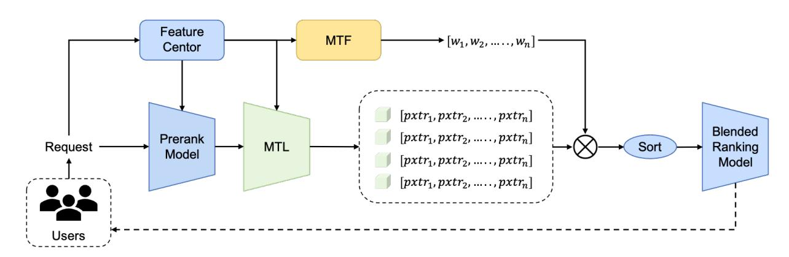
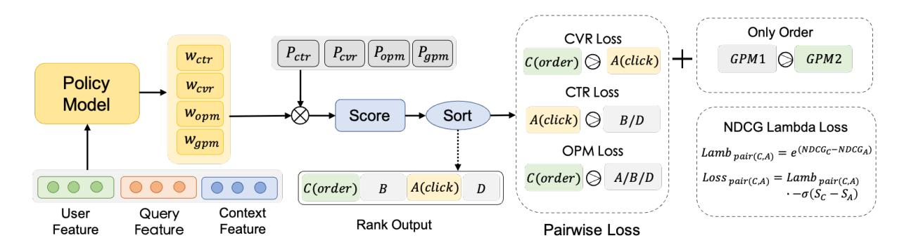
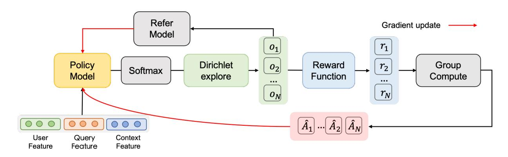

# GRADE: Personalized Multi-Task Fusion via Group-relative Reinforcement Learning with Adaptive Dirichlet Exploration

[Tingfeng Hong](https://orcid.org/0009-0009-7721-5716)∗ Kuaishou Technology Beijing, China hongtingfeng03@kuaishou.com

[Pingye Ren](https://orcid.org/0009-0001-9766-8140)∗ Kuaishou Technology Beijing, China 23210720232@m.fudan.edu.cn

[Xinlong Xiao](https://orcid.org/0009-0006-5225-6237) Kuaishou Technology Beijing, China xiaoxinlong@kuaishou.com

[Chao Wang](https://orcid.org/0009-0000-5516-0771) Kuaishou Technology Beijing, China wang\_chao@alumni.sjtu.edu.cn

[Chenyi Lei](https://orcid.org/0000-0001-6287-3673) Kuaishou Technology Beijing, China leichy@mail.ustc.edu.cn

Wenwu Ou Kuaishou Technology Beijing, China ouwenweu@gmail.com

Han Li Kuaishou Technology Beijing, China lihan08@kuaishou.com

## Abstract

Balancing multiple objectives is critical for user satisfaction in modern recommender and search systems, yet current Multi-Task Fusion (MTF) methods rely on static, manually-tuned weights that fail to capture individual user intent. While Reinforcement Learning (RL) offers a path to personalization, traditional approaches often falter due to training instability and the sparse rewards inherent in these large-scale systems. To address these limitations, we propose Group-relative Reinforcement learning with Adaptive Dirichlet Exploration (GRADE), a novel and robust framework for personalized multi-task fusion. GRADE leverages a critic-free, Group Relative Policy Optimization (GRPO) paradigm, enabling stable and efficient policy learning by evaluating the relative performance of candidate weight groups. Its core innovations include employing the Dirichlet distribution for principled and structured exploration of the weight space, and a composite reward function that combines sparse user feedback with dense model priors and rule-based constraints to guide the search effectively. Deployed in the in-app marketplace of an application with over hundreds of millions daily active users, GRADE significantly outperforms established baselines, achieving substantial gains in rigorous large-scale A/B tests: +0.595% in CTR, +1.193% in CVR, +1.788% in OPM, and +1.568% in total order volume. Following its strong performance, GRADE has been fully deployed in the marketplace search scenario of Kuaishou, serving hundreds of millions of users.

∗Both authors contributed equally to this research.

Permission to make digital or hard copies of all or part of this work for personal or classroom use is granted without fee provided that copies are not made or distributed for profit or commercial advantage and that copies bear this notice and the full citation on the first page. Copyrights for components of this work owned by others than the author(s) must be honored. Abstracting with credit is permitted. To copy otherwise, or republish, to post on servers or to redistribute to lists, requires prior specific permission and/or a fee. Request permissions from permissions@acm.org.

## CCS Concepts

• Information systems → Recommender systems.

## Keywords

Recommender Systems, Multi-Task Fusion, Reinforcement Learning, Personalized Ranking

## ACM Reference Format:

Tingfeng Hong, Pingye Ren, Xinlong Xiao, Chao Wang, Chenyi Lei, Wenwu Ou, and Han Li. 2025. GRADE: Personalized Multi-Task Fusion via Grouprelative Reinforcement Learning with Adaptive Dirichlet Exploration. In . ACM, New York, NY, USA, [9](#page-8-0) pages. [https://doi.org/10.1145/nnnnnnn.](https://doi.org/10.1145/nnnnnnn.nnnnnnn) [nnnnnnn](https://doi.org/10.1145/nnnnnnn.nnnnnnn)

## 1 Introduction

A central challenge for modern large-scale internet platforms is to effectively harness diverse user feedback signals across various domains, including video [\[2,](#page-8-1) [8,](#page-8-2) [13\]](#page-8-3), live streaming [\[15,](#page-8-4) [34\]](#page-8-5), e-commerce [\[20,](#page-8-6) [23,](#page-8-7) [33\]](#page-8-8), and news dissemination [\[30\]](#page-8-9). Within the e-commerce service of a content platform, for instance, a user's journey generates a multitude of behavioral signals—such as clicks, purchases, and transaction amounts. Enhancing overall user satisfaction is paramount for the vitality of the platform's ecosystem and its commercial viability. Consequently, it is imperative for recommendation systems to balance these multiple, often conflicting, objectives, rather than optimizing for any single metric in isolation.

To achieve this, a two-stage architecture is commonly employed as shown in Figur[e1.](#page-1-0) The first stage utilizes a Multi-Task Learning (MTL) model to simultaneously predict user responses across a spectrum of key performance indicators[\[14,](#page-8-10) [29\]](#page-8-11), such as Click-Through Rate (CTR), Conversion Rate (CVR), Orders Per Mille (OPM), and Gross Merchandise value Per Mille (GPM). Subsequently, a Multi-Task Fusion (MTF) module synthesizes these disparate predictions, computing a single, coherent score for each item that ultimately determines the final ranking presented to the user.

While this modular design is effective, the performance of the entire recommendation pipeline often hinges on the intelligence

Conference'17, Washington, DC, USA © 2025 Copyright held by the owner/author(s). Publication rights licensed to ACM. ACM ISBN 978-x-xxxx-xxxx-x/YYYY/MM <https://doi.org/10.1145/nnnnnnn.nnnnnnn>

Figure 1: Overall architecture of the personalized multi-objective ranking system. It comprises: (1) a Feature Center and Prerank Model for initial feature processing and candidate generation; (2) a Multi-Task Learning (MTL) model predicting various user feedback signals; (3) a Multi-Task Fusion (MTF) module (our proposed GRADE framework) that learns personalized weights (��1, . . . ,����); these weights are then applied to calculate final scores and sorted to generate a blended ranking by the Blended Ranking Model, which ultimately delivers results to users.

of the MTF module. The prevailing industry practice is to implement this fusion logic using pre-defined, static formulas, typically a weighted sum or product of the MTL outputs. This legacy approach, however, presents significant obstacles to further progress. Operationally, it locks engineers into a slow and laborious cycle of manual weight tuning, followed by extensive A/B testing to validate changes. More fundamentally, this undifferentiated approach is conceptually flawed for personalization. A single, global weighting scheme cannot dynamically adapt to the unique intentions of each user, which can shift even within a single session. In e–commerce, for instance, a user often transitions from a broad exploration phase to a focused purchasing phase, each warranting a different balance of objectives (e.g., maximizing clicks versus conversions). A static model is incapable of capturing this nuance, leading to a suboptimal and generic user experience.

To overcome the limitations of static fusion, Reinforcement Learning (RL) has emerged as a promising paradigm for developing dynamic and personalized weighting strategies [\[1,](#page-8-12) [7,](#page-8-13) [18,](#page-8-14) [19,](#page-8-15) [22,](#page-8-16) [32\]](#page-8-17). Conceptually, RL is well-suited for this task, as it enables a recommendation system to continuously adapt to evolving user preferences by maximizing an overall reward from environmental feedback. However, its application to large-scale industrial scenarios is fraught with challenges. The most prevalent approaches, based on Policy Gradient and Actor-Critic architectures, introduce significant hurdles for deployment: the complex structure presents challenges for stable training with sparse production rewards, and the exploration mechanisms are often inefficient for the high-dimensional, continuous space of fusion weights. These intertwined challenges of complexity, instability, and inefficient exploration motivate our search for a simpler, more direct, and robust optimization framework.

To address the challenges of model complexity, reward sparsity, and inefficient exploration, our approach draws inspiration from Group Relative Policy Optimization (GRPO) [\[24\]](#page-8-18). The core of GRPO is that it learns from the relative preferences within a group of candidate outputs, rather than relying on a critic's estimate of absolute

value. This paradigm has proven highly effective for fine-tuning large language models (LLMs), particularly in complex reasoning tasks such as mathematics. We pos it a strong parallel to our fusion task: from a post-hoc perspective, a user's explicit feedback (e.g., a click or purchase) reveals a "ground-truth" preference, indicating which combination of objective weights would have been optimal. This insight makes a relative preference-based learning framework like GRPO an ideal choice.

Based on this foundation, we propose GRADE (Group-relative Reinforcement learning with Adaptive Dirichlet Exploration), a novel framework that operationalizes these ideas. To ensure a stable and effective learning process, GRADE is trained in a two-stage paradigm: an initial supervised learning-to-rank phase provides a robust baseline policy, which is then fine-tuned using our GRPObased framework centered on three core innovations. First, it adapts the critic-free GRPO paradigm, directly addressing the instability of conventional Actor-Critic methods. By learning from the relative quality of multiple candidate weight vectors simultaneously, it obviates the need for an unstable critic network while also providing powerful, inherent exploration capabilities through its intragroup comparison. Second, for policy exploration in the continuous weight space, we employ the Dirichlet distribution. Unlike unconstrained distributions like the Gaussian which require a subsequent normalization step, the Dirichlet distribution inherently generates samples that satisfy the non-negative and sum-to-one constraints of fusion weights. This property, combined with its efficiency in high dimensions and controllable stochasticity, makes it a superior choice for this task. Third, we design a composite reward function to provide a rich and stable learning signal, combining posterior rewards from user feedback, dense prior rewards from model predictions to mitigate sparsity, and rule-based format rewards that incorporate human heuristics to prevent weight polarization and resolve reward homogenization.

The primary contributions of this work are as follows:

Figure 2: The architecture of the Stage 1 supervised Learning-to-Rank (LTR) model, which is pre-trained to provide a robust baseline policy. The model learns to generate fusion weights using a multi-objective pairwise loss based on the LambdaLoss framework. In the depicted LambdaLoss formula, ���� and ���� represent the fusion scores of two items, and �� denotes the sigmoid function.

- We adapt the critic-free Group Relative Policy Optimization (GRPO) paradigm to enable stable and efficient policy learning for personalized multi-task fusion.
- We propose a principled exploration strategy using the Dirichlet distribution, which is uniquely suited for the constrained, high-dimensional space of fusion weights.
- We design a multi-faceted composite reward function that combines posterior, prior, and heuristic signals to provide robust policy guidance and prevent reward hacking.

## 2 Related Work

## 2.1 Multi-Task Learning

In contrast to Single-Task Learning (STL), where tasks are modeled in isolation, Multi-Task Learning (MTL) offers a paradigm that jointly trains multiple related tasks within a single model. The foundational assumption is that leveraging shared information across tasks acts as an inductive bias to enhance the model's overall generalization performance. The primary distinction among MTL architectures lies in their parameter sharing strategy. The most common approach is hard parameter sharing, which employs a shared feature encoder across all tasks, with separate task-specific output layers branching off from this common base [\[6\]](#page-8-19). A more flexible alternative is soft parameter sharing, where each task maintains its own parameters, but these are encouraged to be similar through mechanisms like regularization or the dynamic gating found in Mixture-of-Experts (MoE) models [\[21,](#page-8-20) [25\]](#page-8-21). More sophisticated architectures, such as Progressive Layered Extraction (PLE), employ customized sharing mechanisms that use a collection of "expert" networks, some of which are shared to learn common patterns while others are dedicated to specific tasks to capture unique features [\[26,](#page-8-22) [27\]](#page-8-23).

## 2.2 Multi-task Fusion

Multi-Task Fusion (MTF) constitutes the critical final stage in a multi-objective recommendation pipeline, where various predicted scores are integrated into a single value for item ranking. The core challenge of MTF is to enhance a user's overall satisfaction—a latent and composite construct. Unlike MTL tasks that often have

discrete labels, this holistic satisfaction is an unlabeled objective that must be inferred from multiple behavioral signals within a session, such as clicks, conversions, and transaction amounts. Conventional approaches typically rely on a predefined fusion formula (e.g., a weighted sum) and employ black-box optimization techniques like grid search[\[16\]](#page-8-24) or Bayesian optimization[\[10,](#page-8-25) [28\]](#page-8-26) to find a single, globally optimal set of coefficients. Furthermore, to address challenges with offline-online consistency, methods like Evolution Strategies (ES)[\[11\]](#page-8-27) have been employed for direct online exploration of fusion weights. However, these methods are inherently non-personalized, applying a uniform strategy to all users and thus failing to capture individual preferences.

To address this lack of personalization, the field has increasingly turned to Reinforcement Learning (RL) to dynamically optimize the fusion weights. In this formulation, the problem is modeled by treating the set of fusion weights as actions taken by the agent. The recommender system, along with each user's personalized context, constitutes the environment, and the subsequent user feedback (e.g., clicks, conversions) serves as the reward signal. By learning a policy that maps the environment state to optimal actions, this approach aims to find personalized fusion weights that maximize the expected reward for each user, ultimately maximizing business value.

For safe deployment in large-scale systems, RL-based MTF is often implemented in an offline (batch) setting, learning from historical logs. The primary challenge in this setting is the distributional shift between the learned policy and the logged data, which can lead to significant extrapolation errors. To mitigate this, many approaches adapt foundational offline RL algorithms designed to constrain the policy against out-of-distribution actions. Notable examples of this paradigm include Batch-Constrained Deep Q-Learning (BCQ) [\[9\]](#page-8-28), Conservative Q-Learning (CQL) [\[12\]](#page-8-29), and specific MTF applications like BatchRL-MTF [\[32\]](#page-8-17).

Another prevalent branch of research within this domain utilizes Policy Gradient and Actor-Critic methods. Foundational algorithms like the Deep Deterministic Policy Gradient (DDPG)[\[17\]](#page-8-30) established a robust actor-critic framework for the continuous action spaces inherent in MTF. Building on this paradigm, subsequent works have tailored it for specific recommendation scenarios. For instance, RLUR[\[5\]](#page-8-31) prioritizes user retention as its primary modeling objective based on long-term value considerations. UNEX-RL[\[31\]](#page-8-32) is proposed to solve the observation dependency and cascading effect problems in multi-stage recommender systems. UnifiedRL[\[19\]](#page-8-15) attempts to improve exploration efficiency by implementing a multi-round strategy of online exploration using clipped Gaussian perturbations, followed by offline training. Despite its sophistication, this approach is limited as it explores only a single weight combination at a time, restricting the breadth of the search.

While this Actor-Critic paradigm has proven powerful, it comes with fundamental limitations. These frameworks rely on complex architectures that are notoriously difficult to train and tune stably, particularly with the sparse reward signals in e-commerce. Furthermore, their exploration strategies are often inefficient at searching the high-dimensional, continuous space of fusion weights, leading to slow convergence and suboptimal policies. These critical challenges—the inherent complexity and instability of mainstream RL models, coupled with inefficient exploration—underscore the need for a simpler, more robust framework. This motivates the design of our proposed GRADE framework, which circumvents these issues by a more direct and efficient approach to personalized parameter optimization.

## 2.3 The GRPO Paradigm

Group Relative Policy Optimization (GRPO) is an advanced reinforcement learning algorithm originating from the fine-tuning of large language models (LLMs) [\[24\]](#page-8-18). It enhances traditional policy gradient methods by shifting the learning paradigm from estimating the absolute value of a single action to learning from the relative preferences among a group of candidate actions. This approach is particularly effective in tasks where an optimal output exists but is hard to discover directly.

The GRPO objective function, which the policy network ���� aims to maximize, is typically formulated as follows:

J�������� (��) = E��∼D,{���� } ��=1 ∼���� (�� ) "∑︁ �� ��=1 ���� (���� |��) ���������� (���� |��) ��ˆ �� . (1)

Here, for a given state �� (e.g., a user request), the policy ���� generates a group of �� actions {���� } �� ��=1 (e.g., candidate weight vectors). ���������� is the policy from the previous iteration, used for importance sampling. The core of the method lies in the calculation of the normalized relative advantage, ��ˆ , for each action ���� . This is typically computed by first obtaining a reward ���� for each action from a reward model, and then normalizing these rewards within the group:

��ˆ �� = (���� − ����)/(���� + ��), (2)

where ���� and ���� are the mean and standard deviation of rewards in the group. The policy is then updated to increase the probability of actions with a positive relative advantage.

This group-wise comparison mechanism endows GRPO with several key advantages:

- Avoidance of a Critic Network: Its most notable advantage is bypassing the need for a separate Critic network to estimate a state-value function. This makes the framework simpler and more stable, especially in scenarios with sparse or noisy rewards.

- Enhanced Data Efficiency: By learning from a ranked set of �� outputs simultaneously, GRPO extracts a much richer learning signal from a single state transition compared to methods that learn from a single action feedback.
- Improved Training Stability: The normalization of rewards into a relative advantage reduces the sensitivity of the training process to the absolute scale and variance of the reward function, leading to smoother and more reliable convergence.

The application of GRPO to our MTF task is well-justified by drawing a strong parallel to its successful use in LLM reasoning tasks. In mathematical reasoning, an LLM must find the correct reasoning path among many possibilities. Similarly, in MTF, for any user request, a post-hoc "correct answer" exists in the form of an optimal weight combination that best aligns with the user's subsequent feedback (e.g., click, purchase). GRPO is uniquely suited to find this "answer" by efficiently exploring and comparing groups of candidate weights. Furthermore, it directly addresses the identified weaknesses of traditional RL methods in the MTF context: its Criticfree architecture provides robustness against the sparse rewards common in e-commerce, and its structured, group-wise learning offers a more efficient and stable alternative to prior exploration techniques.

### 3 GRADE Framework

This section elaborates on the architecture and training methodology of the GRADE framework. We begin by describing its two-stage training paradigm, which is designed to ensure both a stable initialization and effective policy exploration. We then delve into the core optimization techniques that power the reinforcement learning (RL) fine-tuning stage. These methods collectively enable GRADE to perform an automated parameter search, learning a policy that dynamically adapts fusion weights to maximize the overall reward.

## 3.1 Training Paradigm of GRADE

The training of the GRADE framework is structured as a two-stage paradigm, a design choice intended to strike a balance between stable convergence and effective policy exploration. The objective is to first establish a robust, generalized policy through supervised learning before fine-tuning it for personalized parameter search via reinforcement learning.

The policy model maintains a consistent architecture across both stages. It processes a comprehensive set of input features, including the user's profile and historical behaviors, the query's categorical and semantic attributes, and other contextual signals. Notably, the policy model is item-agnostic; it does not receive any item-side features. The model's output constitutes the agent's action: a vector of fusion weights, �� = [��1,��2, . . . ,����], which are then applied to the corresponding predicted scores (pCTR, pCVR, etc.) of each candidate item. For the final fusion, we employ a weighted additive formula, and a softmax function is applied to the model's output layer to ensure the generated weights are normalized and stable.

It is important to clarify that while we use a weighted additive formula for its straightforward interpretability, the GRADE framework itself is agnostic to the specific fusion function. It is broadly

### 3.2 Policy Optimization of GRADE

While the core GRPO paradigm is effective, its practical application required further optimization to address two key challenges observed during development. First, we found that naive exploration strategies for the continuous weight space, such as grid sampling, were computationally inefficient. Second, relying on a simple performance metric as the reward signal led to "reward hacking." This phenomenon, where the policy over-optimizes for the training data, often results in out-of-distribution (OOD). To overcome these issues, we introduce two critical enhancements to the GRADE framework: 1) a principled exploration mechanism using Dirichlet distribution sampling, and 2) a composite, rule-based reward function to guide the policy towards more robust solutions.

3.2.1 Dirichlet Distribution for Structured Exploration. In the RL fine-tuning stage, a critical challenge is designing an effective exploration strategy for the continuous action space of fusion weights. This requires a probability distribution that can intelligently sample new weight candidates. While the Gaussian distribution is a standard choice for continuous spaces, we posit that it is suboptimal for this task. Instead, we propose the use of the Dirichlet distribution as a more principled and efficient exploration mechanism for several key reasons.

First, the Dirichlet distribution inherently respects the structural constraints of fusion weights. These weights must be non-negative and sum to one (i.e., lie on the probability simplex). The Dirichlet distribution naturally generates samples that meet these criteria in a single step, whereas a Gaussian distribution would require a cumbersome two-step process: sampling from an unconstrained space and then projecting the samples onto the simplex using a potentially distorting function like Softmax.

Second, it offers intuitive control over the exploration-exploitation trade-off via a single concentration parameter, ��ˆ. A smaller ��ˆ yields a more uniform (exploratory) distribution, while a larger ��ˆ leads to samples highly concentrated around the mean (exploitative). This parameter can be easily annealed during training to gradually transition the policy from exploration to exploitation.

Finally, it enables targeted exploration centered around the learned policy. We construct the Dirichlet's parameters, ��, by scaling the policy network's deterministic output, ���� (��), with the total concentration ��ˆ:

�� = ��ˆ · ���� (��). (8)

A key property of the Dirichlet distribution is that the expected value of a sampled vector is identical to the normalized parameter vector. This ensures that our exploration is not random but is intelligently centered around the policy's current recommendation:

E[p] = �� Í ���� = ��ˆ · ���� (��) ��ˆ Í ���� = ���� (��), (9)

which leads to a significantly more efficient search process.

The probability density function (PDF) for the Dirichlet distribution is given by:

Dir(p | ��) = Γ Í�� ��=1 ���� Î�� ��=1 Γ(����) Ö �� ��=1 �� ���� −1 �� , (10)

where Γ(��) is the gamma function:

Γ(��) = ∫ ∞ 0 �� ��−1 �� −�� ���� . (11)

Collectively, these properties make the Dirichlet distribution a superior and highly suitable choice for the exploration mechanism within our GRADE framework.

3.2.2 Composite Reward Function. To effectively guide the RL agent towards an optimal policy, we design a composite reward function that balances three objectives: direct performance optimization, mitigation of signal sparsity, and the incorporation of human priors. The total reward, ��total, for a given weight vector is a weighted sum of three distinct components:

��total = ��1��post + ��2��prior + ��3��format, (12)

where ��1, ��2, ��3 are hyperparameters that control the contribution of each component.

Posterior Reward (��post). This primary reward component directly measures policy performance based on actual user feedback. For a given ranked list, we calculate the Normalized Discounted Cumulative Gain (NDCG). It is defined as the ratio of the Discounted Cumulative Gain (DCG) of the ranked list to the Ideal DCG (IDCG), which is the DCG of a perfectly sorted list:

NDCG = DCG IDCG , (13)

where the DCG is calculated by summing the relevance scores of items, logarithmically discounted by their rank ��:

DCG = ∑︁�� ��=1 2 �������� − 1 log2 (�� + 1) , (14)

where �� is the number of items in the list, �������� is the ground-truth relevance score of the item at rank ��, and IDCG is the DCG score of the ideal ranking. We compute this metric for multiple key objectives. For objectives like CTR, CVR, and OPM, the relevance score �������� is a binary value (e.g., 1 for a click or purchase, 0 otherwise). For Gross Merchandise Value (GPM), we use the predicted score (pGPM) as a graded relevance signal, allowing the policy to optimize for expected value. The total posterior reward is the weighted sum of these individual NDCG scores.

Prior Knowledge Reward (��prior). A key challenge in our domain is the extreme sparsity of posterior signals like conversions, which can impede learning. To provide a denser learning signal, we introduce a reward based on the prior knowledge captured in the MTL model's dense predictions (e.g., pCTR, pCVR). The underlying principle is that ranking items with high predicted scores higher should correlate with better online performance. This reward is also formulated as an NDCG, using the predicted scores as the relevance signals.

Weight Format Reward (��format). Weight Format Reward acts as a conditional regularization mechanism to guide the search process and incorporate domain knowledge. It is only triggered when the sum of the primary rewards (��post + ��prior) is positive, ensuring it refines already promising candidates, which is implemented via a gating function, ���� (·), that evaluates the relative magnitudes of the weights. The input to this function is the difference between a target

| Method  | CTR   | CVR   | CTCVR | GPM   |
|---------|-------|-------|-------|-------|
| Formula | 0.607 | 0.772 | 0.686 | 0.892 |
| SP      | 0.632 | 0.774 | 0.689 | 0.886 |
| BCQ     | 0.620 | 0.777 | 0.691 | 0.894 |
| DDPG    | 0.624 | 0.779 | 0.693 | 0.893 |
| GRADE   | 0.625 | 0.782 | 0.697 | 0.895 |

Table 2: Online A/B Test Results

| Method | CTR    | CVR    | OPM    | GPM    |
|--------|--------|--------|--------|--------|
| SP     | +0.73% | +0.03% | +0.56% | +0.08% |
| GRADE  | +0.60% | +1.19% | +1.78% | +0.52% |

Table 3: Ablation study on exploration intensity (NDCG scores)

contrast, GRADE delivered substantial improvements across all key business metrics, achieving significant gains in CVR (+1.19%) and OPM (+1.78%). The improvements for CTR, CVR, and OPM were all statistically significant (p < 0.05). The superior and more balanced performance on critical conversion and revenue-related metrics validated the effectiveness of the GRADE framework. Consequently, GRADE has been fully deployed in the marketplace search scenario of Kuaishou.

Table 4: Ablation Study on Reward Components

### 4.5 Ablation Study

The performance of GRADE is highly sensitive to the exploration strategy, in which the exploration intensity is mainly governed by the group size �� for sampling and the Dirichlet distribution's concentration parameter ��ˆ. Table [3](#page-7-1) presents our ablation study on these parameters, where �� denotes the cosine annealing strategy for ��ˆ as described in [4.2.](#page-6-1)

The results show that as the group size �� increases, the performance on key business metrics improves, reaching its maximum at �� = 20. Performance does not monotonically increase with group size; we hypothesize this is because excessively large groups can lead to reward homogenization, diminishing the quality of the relative advantage signal. The experiments on a fixed concentration ��ˆ (with �� = 20) further reveal that lower, more explorative values are preferable. Crucially, the cosine annealing strategy, which dynamically balances exploration and exploitation, achieves the best overall performance on the most critical business metrics. This

underscores that a well-calibrated, dynamic exploration strategy is paramount for GRADE's success, rather than simply maximizing the quantity of exploration.

To validate our composite reward function, we conducted an online A/B test comparing the full GRADE model against an ablated version that uses only the posterior reward (���������� ), with results presented in Table [4.](#page-7-2) The ablated model achieved a slightly higher CTR but performed significantly worse on all other business metrics, even causing a negative impact on GPM. In contrast, the full GRADE model, while trading a minor amount of CTR, delivered substantial gains across all conversion and revenue-related metrics. This result confirms that the prior and format rewards are critical components that regularize the policy, preventing it from overfitting to sparse, direct-engagement signals (i.e., reward hacking) and guiding it towards a more robust, balanced strategy that aligns with overall business objectives.

## 5 Conclusion

In this work, we first identify the critical limitations of conventional RL methods for multi-task fusion, namely the instability of Actor-Critic architectures with sparse rewards and inefficient exploration. In response, we propose GRADE, a robust and efficient framework for personalized fusion in large-scale recommender systems. GRADE adapts the critic-free Group Relative Policy Optimization (GRPO) paradigm, enabling stable policy learning by evaluating relative preferences among candidate actions, thereby obviating the need for an unstable critic. The framework is further enhanced by a principled exploration strategy using the Dirichlet distribution and a composite reward function that mitigates sparsity and prevents reward hacking. Extensive offline and online experiments have demonstrated its effectiveness. Given its strong performance and stability, GRADE has been fully deployed in our production environment, serving hundreds of millions of users daily.

### References

[1] M. Mehdi Afsar, Trafford Crump, and Behrouz Far. 2022. Reinforcement Learning based Recommender Systems: A Survey. ACM Comput. Surv. 55, Article 145 (2022). [doi:10.1145/3543846](https://doi.org/10.1145/3543846) [2] Shumeet Baluja, Rohan Seth, D. Sivakumar, Yushi Jing, Jay Yagnik, Shankar Kumar, Deepak Ravichandran, and Mohamed Aly. 2008. Video suggestion and discovery for youtube: taking random walks through the view graph. In International Conference on World Wide Web. 895–904. [doi:10.1145/1367497.1367618](https://doi.org/10.1145/1367497.1367618) [3] Christopher Burges, Robert Ragno, and Quoc Le. 2006. Learning to rank with nonsmooth cost functions. Advances in neural information processing systems 19 (2006). [4] Christopher JC Burges. 2010. From ranknet to lambdarank to lambdamart: An overview. Learning 11, 23-581 (2010), 81. [5] Qingpeng Cai, Shuchang Liu, Xueliang Wang, Tianyou Zuo, Wentao Xie, Bin Yang, Dong Zheng, Peng Jiang, and Kun Gai. 2023. Reinforcing User Retention in a Billion Scale Short Video Recommender System. arXiv[:2302.01724](https://arxiv.org/abs/2302.01724) [cs.LG] <https://arxiv.org/abs/2302.01724> [6] Rich Caruana. 1998. Multitask learning. Kluwer Academic Publishers, 95–133. [7] Xiaoshuang Chen, Gengrui Zhang, Yao Wang, Yulin Wu, Shuo Su, Kaiqiao Zhan, and Ben Wang. 2024. Cache-Aware Reinforcement Learning in Large-Scale Recommender Systems. arXiv[:2404.14961](https://arxiv.org/abs/2404.14961) [cs.LG] [https://arxiv.org/abs/2404.](https://arxiv.org/abs/2404.14961) [14961](https://arxiv.org/abs/2404.14961) [8] Paul Covington, Jay Adams, and Emre Sargin. 2016. Deep Neural Networks for YouTube Recommendations. In ACM Conference on Recommender Systems. 191–198. [doi:10.1145/2959100.2959190](https://doi.org/10.1145/2959100.2959190) [9] Scott Fujimoto, David Meger, and Doina Precup. 2019. Off-Policy Deep Reinforcement Learning without Exploration. arXiv[:1812.02900](https://arxiv.org/abs/1812.02900) [cs.LG] [https:](https://arxiv.org/abs/1812.02900) [//arxiv.org/abs/1812.02900](https://arxiv.org/abs/1812.02900) [10] Bruno G Galuzzi, Ilaria Giordani, Antonio Candelieri, Riccardo Perego, and Francesco Archetti. 2020. Hyperparameter optimization for recommender systems through Bayesian optimization. Computational Management Science 17, 4 (2020), 495–515. [11] Nikolaus Hansen. 2016. The CMA Evolution Strategy: A Tutorial. CoRR abs/1604.00772 (2016). arXiv[:1604.00772](https://arxiv.org/abs/1604.00772)<http://arxiv.org/abs/1604.00772> [12] Aviral Kumar, Aurick Zhou, George Tucker, and Sergey Levine. 2020. Conservative Q-Learning for Offline Reinforcement Learning. arXiv[:2006.04779](https://arxiv.org/abs/2006.04779) [cs.LG] <https://arxiv.org/abs/2006.04779> [13] Weijiang Lai, Beihong Jin, Beibei Li, Yiyuan Zheng, and Rui Zhao. 2023. A Vlogger-augmented Graph Neural Network Model for Micro-video Recommendation. In Machine Learning and Knowledge Discovery in Databases: Applied Data Science and Demo Track. 684–699. [doi:10.1007/978-3-031-43427-3\\_41](https://doi.org/10.1007/978-3-031-43427-3_41) [14] Taeho Lee and Junhee Seok. 2023. Multi Task Learning: A Survey and Future Directions. In 2023 International Conference on Artificial Intelligence in Information and Communication (ICAIIC). 232–235. [doi:10.1109/ICAIIC57133.2023.10067098](https://doi.org/10.1109/ICAIIC57133.2023.10067098) [15] Fengqi Liang, Baigong Zheng, Liqin Zhao, Guorui Zhou, Qian Wang, and Yanan Niu. 2024. Ensure Timeliness and Accuracy: A Novel Sliding Window Data Stream Paradigm for Live Streaming Recommendation. arXiv[:2402.14399](https://arxiv.org/abs/2402.14399) [cs.IR] <https://arxiv.org/abs/2402.14399> [16] Petro Liashchynskyi and Pavlo Liashchynskyi. 2019. Grid Search, Random Search, Genetic Algorithm: A Big Comparison for NAS. CoRR abs/1912.06059 (2019). arXiv[:1912.06059](https://arxiv.org/abs/1912.06059)<http://arxiv.org/abs/1912.06059> [17] Timothy P Lillicrap, Jonathan J Hunt, Alexander Pritzel, Nicolas Heess, Tom Erez, Yuval Tassa, David Silver, and Daan Wierstra. 2015. Continuous control with deep reinforcement learning. arXiv preprint arXiv:1509.02971 (2015). [18] Yuanguo Lin, Yong Liu, Fan Lin, Lixin Zou, Pengcheng Wu, Wenhua Zeng, Huanhuan Chen, and Chunyan Miao. 2024. A Survey on Reinforcement Learning for Recommender Systems. IEEE Transactions on Neural Networks and Learning Systems 35 (2024), 13164–13184. [doi:10.1109/TNNLS.2023.3280161](https://doi.org/10.1109/TNNLS.2023.3280161) [19] Peng Liu, Cong Xu, Ming Zhao, Jiawei Zhu, Bin Wang, and Yi Ren. 2025. UnifiedRL: A Reinforcement Learning Algorithm Tailored for Multi-Task Fusion in Large-Scale Recommender Systems. arXiv[:2404.17589](https://arxiv.org/abs/2404.17589) [cs.IR] [https:](https://arxiv.org/abs/2404.17589) [//arxiv.org/abs/2404.17589](https://arxiv.org/abs/2404.17589) [20] Xinchen Luo, Jiangxia Cao, Tianyu Sun, Jinkai Yu, Rui Huang, Wei Yuan, Hezheng Lin, Yichen Zheng, Shiyao Wang, Qigen Hu, Changqing Qiu, Jiaqi Zhang, Xu Zhang, Zhiheng Yan, Jingming Zhang, Simin Zhang, Mingxing Wen, Zhaojie Liu, Kun Gai, and Guorui Zhou. 2024. QARM: Quantitative Alignment Multi-Modal Recommendation at Kuaishou. arXiv[:2411.11739](https://arxiv.org/abs/2411.11739) [cs.IR] [https://arxiv.org/abs/](https://arxiv.org/abs/2411.11739) [2411.11739](https://arxiv.org/abs/2411.11739) [21] Jiaqi Ma, Zhe Zhao, Xinyang Yi, Jilin Chen, Lichan Hong, and Ed H. Chi. 2018. Modeling Task Relationships in Multi-task Learning with Multi-gate Mixtureof-Experts. In ACM SIGKDD International Conference on Knowledge Discovery & Data Mining. 1930–1939. [doi:10.1145/3219819.3220007](https://doi.org/10.1145/3219819.3220007) [22] Changhua Pei, Xinru Yang, Qing Cui, Xiao Lin, Fei Sun, Peng Jiang, Wenwu Ou, and Yongfeng Zhang. 2019. Value-aware Recommendation based on Reinforced Profit Maximization in E-commerce Systems. arXiv[:1902.00851](https://arxiv.org/abs/1902.00851) [cs.IR] [https:](https://arxiv.org/abs/1902.00851) [//arxiv.org/abs/1902.00851](https://arxiv.org/abs/1902.00851) [23] Qi Pi, Guorui Zhou, Yujing Zhang, Zhe Wang, Lejian Ren, Ying Fan, Xiaoqiang Zhu, and Kun Gai. 2020. Search-based User Interest Modeling with Lifelong Sequential Behavior Data for Click-Through Rate Prediction. In ACM International Conference on Information & Knowledge Management. 2685–2692. [doi:10.1145/](https://doi.org/10.1145/3340531.3412744) [3340531.3412744](https://doi.org/10.1145/3340531.3412744) [24] Zhihong Shao, Peiyi Wang, Qihao Zhu, Runxin Xu, Junxiao Song, Xiao Bi, Haowei Zhang, Mingchuan Zhang, Y. K. Li, Y. Wu, and Daya Guo. 2024. DeepSeek-Math: Pushing the Limits of Mathematical Reasoning in Open Language Models. arXiv[:2402.03300](https://arxiv.org/abs/2402.03300) [cs.CL]<https://arxiv.org/abs/2402.03300> [25] Noam Shazeer, Azalia Mirhoseini, Krzysztof Maziarz, Andy Davis, Quoc Le, Geoffrey Hinton, and Jeff Dean. 2017. Outrageously large neural networks: The sparsely-gated mixture-of-experts layer. arXiv preprint arXiv:1701.06538 (2017). [26] Xiang-Rong Sheng, Liqin Zhao, Guorui Zhou, Xinyao Ding, Binding Dai, Qiang Luo, Siran Yang, Jingshan Lv, Chi Zhang, Hongbo Deng, and Xiaoqiang Zhu. 2021. One Model to Serve All: Star Topology Adaptive Recommender for Multi-Domain CTR Prediction. In ACM International Conference on Information & Knowledge Management. 4104–4113. [doi:10.1145/3459637.3481941](https://doi.org/10.1145/3459637.3481941) [27] Hongyan Tang, Junning Liu, Ming Zhao, and Xudong Gong. 2020. Progressive Layered Extraction (PLE): A Novel Multi-Task Learning (MTL) Model for Personalized Recommendations. In ACM Conference on Recommender Systems. 269–278. [doi:10.1145/3383313.3412236](https://doi.org/10.1145/3383313.3412236) [28] Hongxu Wang, Zhu Sun, Yingpeng Du, Lu Zhang, Tiantian He, and Yew-Soon Ong. 2025. Uncertain Multi-Objective Recommendation via Orthogonal Meta-Learning Enhanced Bayesian Optimization. arXiv[:2502.13180](https://arxiv.org/abs/2502.13180) [cs.LG] [https:](https://arxiv.org/abs/2502.13180) [//arxiv.org/abs/2502.13180](https://arxiv.org/abs/2502.13180) [29] Yuhao Wang, Ha Tsz Lam, Yi Wong, Ziru Liu, Xiangyu Zhao, Yichao Wang, Bo Chen, Huifeng Guo, and Ruiming Tang. 2023. Multi-Task Deep Recommender Systems: A Survey. arXiv[:2302.03525](https://arxiv.org/abs/2302.03525) [cs.IR]<https://arxiv.org/abs/2302.03525> [30] Chuhan Wu, Fangzhao Wu, Mingxiao An, Jianqiang Huang, Yongfeng Huang, and Xing Xie. 2019. NPA: Neural News Recommendation with Personalized Attention. ACM SIGKDD International Conference on Knowledge Discovery & Data Mining (2019).<https://api.semanticscholar.org/CorpusID:196181724> [31] Gengrui Zhang, Yao Wang, Xiaoshuang Chen, Hongyi Qian, Kaiqiao Zhan, and Ben Wang. 2024. UNEX-RL: Reinforcing Long-Term Rewards in Multi-Stage Recommender Systems with UNidirectional EXecution. arXiv[:2401.06470](https://arxiv.org/abs/2401.06470) [cs.IR] <https://arxiv.org/abs/2401.06470> [32] Qihua Zhang, Junning Liu, Yuzhuo Dai, Yiyan Qi, Yifan Yuan, Kunlun Zheng, Fan Huang, and Xianfeng Tan. 2022. Multi-Task Fusion via Reinforcement Learning for Long-Term User Satisfaction in Recommender Systems. In Proceedings of the 28th ACM SIGKDD Conference on Knowledge Discovery and Data Mining. ACM, 4510–4520. [doi:10.1145/3534678.3539040](https://doi.org/10.1145/3534678.3539040) [33] Guorui Zhou, Xiaoqiang Zhu, Chenru Song, Ying Fan, Han Zhu, Xiao Ma, Yanghui Yan, Junqi Jin, Han Li, and Kun Gai. 2018. Deep Interest Network for Click-Through Rate Prediction. In ACM SIGKDD International Conference on Knowledge Discovery & Data Mining. New York, NY, USA, 1059–1068. [doi:10.1145/3219819.](https://doi.org/10.1145/3219819.3219823) [3219823](https://doi.org/10.1145/3219819.3219823) [34] Mengxiao Zhu, Qi Shu, Shuanghong Shen, Li Feng, Jiancan Wu, and Zhenya Huang. 2025. Live streaming recommendation based on multiple types of repeated behaviors. Expert Systems with Applications 288 (2025), 128217. [doi:10.1016/j.](https://doi.org/10.1016/j.eswa.2025.128217) [eswa.2025.128217](https://doi.org/10.1016/j.eswa.2025.128217)