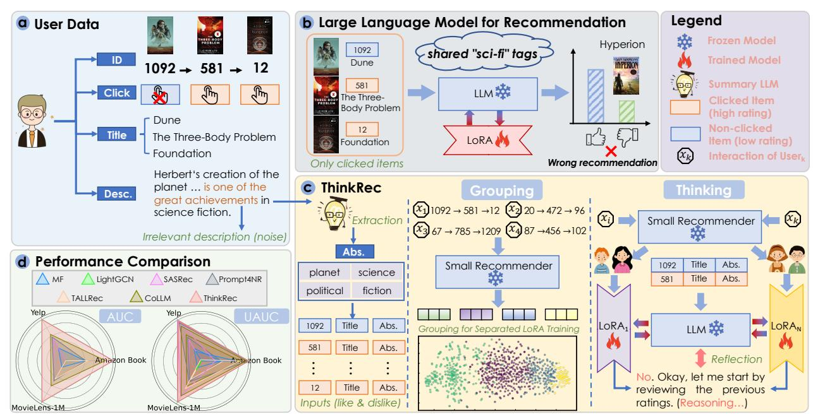
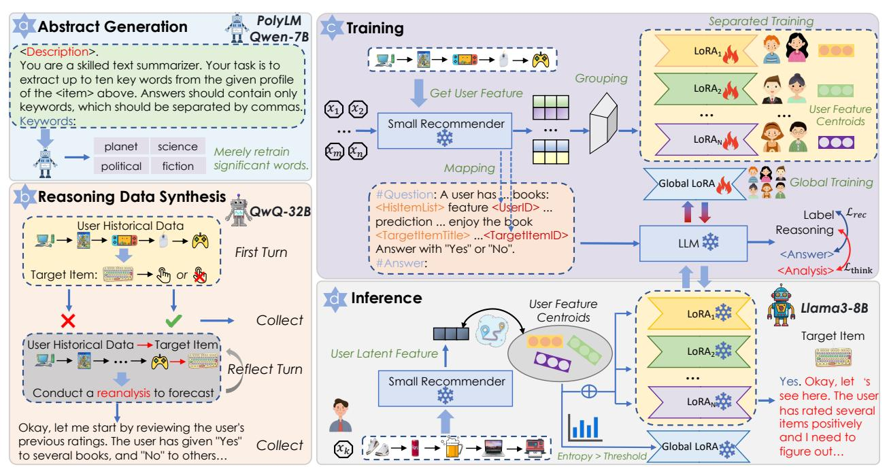
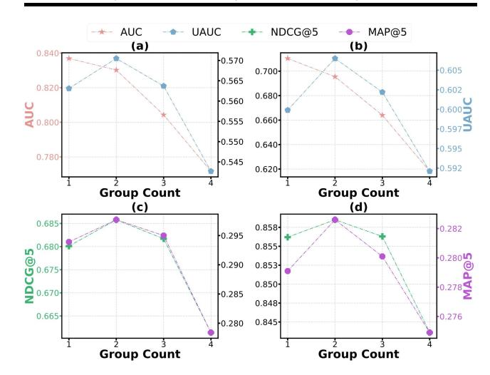
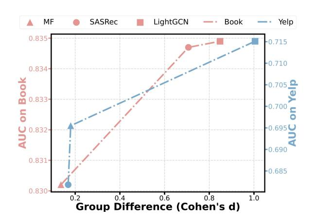

# ThinkRec: Thinking-based Recommendation via LLM

[Qihang Yu](https://orcid.org/0009-0000-2650-5080)∗ Zhejiang University Hangzhou, China yuqihang@zju.edu.cn

[Kairui Fu](https://orcid.org/0009-0004-0284-671X)∗ Zhejiang University Hangzhou, China fukairui.fkr@zju.edu.cn

[Zheqi Lv](https://orcid.org/0000-0001-6529-8088)† Zhejiang University Hangzhou, China zheqilv@zju.edu.cn

[Shengyu Zhang](https://orcid.org/0000-0002-0030-8289)† Zhejiang University Hangzhou, China sy\_zhang@zju.edu.cn

[Xinhui Wu](https://orcid.org/0009-0000-1533-0545) Ant Group Hangzhou, China 18155120673@163.com

[Chen Lin](https://orcid.org/0009-0005-1571-2259) Ant Group Hangzhou, China chenlin9@connect.hku.hk

[Feng Wei](https://orcid.org/0009-0005-6928-1685) Ant Group Shanghai, China mefwei@gmail.com

[Bo Zheng](https://orcid.org/0009-0001-4007-3955) Ant Group Hangzhou, China zhengbo\_321@163.com

[Fei Wu](https://orcid.org/0000-0003-2139-8807)† Zhejiang University Hangzhou, China Shanghai AI Laboratory Shanghai, China wufei@zju.edu.cn

### Abstract

Recent advances in large language models (LLMs) have enabled more semantic-aware recommendations through natural language generation. Existing LLM for recommendation (LLM4Rec) methods mostly operate in a System 1-like manner, relying on superficial features to match similar items based on click history, rather than reasoning through deeper behavioral logic. This often leads to superficial and erroneous recommendations. Inspired by this, we propose ThinkRec, a thinking-based framework that shifts LLM4Rec from an intuitive system to a rational system. First, ThinkRec introduces a thinking activation mechanism by injecting synthetic reasoning traces, making the recommendation process resemble the Chain of Thought (CoT) reasoning of LLMs. This mechanism analyzes interaction histories, identifies user preferences, and makes decisions based on target items. Furthermore, considering the highly diverse distribution of recommendation data, we propose an instance-wise expert fusion mechanism to reduce the reasoning difficulty. By dynamically assigning weights to expert models based on users' latent features, ThinkRec adapts its reasoning path to individual users, thereby enhancing precision and personalization. Extensive experiments on various real-world web user behavior preference datasets demonstrate that ThinkRec significantly outperforms baselines in terms of recommendation accuracy and interpretability, providing superior recommendations based on a deeper understanding of user intent and a more rigorous reasoning process. Code is available in [https://github.com/Yu-Qi-hang/ThinkRec.](https://github.com/Yu-Qi-hang/ThinkRec)

© 2026 Copyright held by the owner/author(s). ACM ISBN 979-8-4007-2307-0/2026/04 <https://doi.org/10.1145/3774904.3792070>

# CCS Concepts

• Information systems → Information retrieval; Retrieval tasks and goals; Recommender systems;

# Keywords

LLM, Recommendation System, Reasoning Model

### ACM Reference Format:

Qihang Yu, Kairui Fu, Zheqi Lv, Shengyu Zhang, Xinhui Wu, Chen Lin, Feng Wei, Bo Zheng, and Fei Wu. 2026. ThinkRec: Thinking-based Recommendation via LLM. In Proceedings of the ACM Web Conference 2026 (WWW '26), April 13–17, 2026, Dubai, United Arab Emirates. ACM, New York, NY, USA, [12](#page-11-0) pages.<https://doi.org/10.1145/3774904.3792070>

### 1 Introduction

Recommendation systems are indispensable in modern digital platforms, enabling users to navigate vast content efficiently [\[9,](#page-8-0) [13,](#page-8-1) [29\]](#page-8-2). Traditional sequential recommendation methods rely on implicit modeling of user interaction histories and are limited in their ability to model context and incorporate broader knowledge, which restricts their reasoning and generalization capabilities. Recent advances in LLMs offer strong contextual comprehension and extensive world knowledge to improve recommendation systems.

Prior LLM4Rec paradigms can be separated into three categories: (1) item scoring [\[23,](#page-8-3) [46\]](#page-9-0), where LLMs answer binary preference questions given user and item context; (2) item generation [\[2,](#page-8-4) [3,](#page-8-5) [6,](#page-8-6) [20\]](#page-8-7), which maps natural language prompts to item IDs through aligned embedding spaces or semantic identifiers; and (3) hybrid modeling [\[8,](#page-8-8) [44\]](#page-9-1), where a single LLM performs multiple tasks such as point-wise prediction, pair-wise ranking, or list-wise generation. Although these LLM4Rec methods differ in output formats and representation learning strategies, they fundamentally resemble System 1—the intuitive system—in cognitive science [\[17\]](#page-8-9). They tend to match similar items based on click history, while overlooking the deeper behavioral logic. This limitation becomes evident in cases such as the one shown in Figure [1\(](#page-1-0)b), where the user's behavior

∗Equal contribution.

†Corresponding author.

[This work is licensed under a Creative Commons Attribution 4.0 International License.](https://creativecommons.org/licenses/by/4.0) WWW '26, Dubai, United Arab Emirates

Figure 1: (a) shows the composition of user interaction data. (b) and (c) illustrate previous LLM-based recommendations and our ThinkRec, respectively. (d) compares ThinkRec with baselines in three real-world datasets.

over time is: dislikes "Dune", likes "The Three-Body Problem", and likes "Foundation" (all three are science fiction). Methods that rely on System 1-like intuition tend to infer that the user would also like "Hyperion" (science fiction) simply because it belongs to the same genre. In reality, the user might dislike philosophical or metaphysical themes in fiction, which are prominent in \*Hyperion\*, making it an unsuitable recommendation. Clearly, if we can leverage the vast knowledge in LLMs and fully activate their reasoning capabilities , recommendation performance can be significantly improved.

This motivates our effort to push LLM4Rec from a System 1 paradigm toward a more rational, System 2-like reasoning framework. Recent concurrent works have also explored latent reasoning [\[33,](#page-8-10) [47\]](#page-9-2) or dual-head reasoning architectures [\[41\]](#page-9-3) to address this. We raise two key questions for the advancement: 1) How to effectively balance recommendation objectives with language modeling tasks to fully exploit the reasoning capabilities of LLMs. Existing methods often prioritize direct recommendation metrics such as hit rate or ranking accuracy, overlooking LLMs' strengths in semantic reasoning. However, blind reinforcement thinking can lead to simple next token prediction, defeating the goal of recommendation. 2) How to think more effectively in the presence of diverse user behaviors and underlying preferences. As shown in Figure [1\(](#page-1-0)c), user behaviors vary widely, and uniform modeling tends to obscure personality preferences while distracting the model from salient signals, impairing its reasoning capacity. Moreover, inferring user intent solely from high-rating items and generic world knowledge limits the informational basis for accurate preference reasoning.

To address these challenges, we propose Thinking-based Recommendation via LLM, abbreviated as ThinkRec. One of the main problems faced is that the data and optimization goals of recommendation tasks lack the ability to activate thinking in LLMs (Challenge 1). To overcome this challenge, we designed the item augmentation

and thinking activation framework for finetuning. The fine-tuned model analyzes associations in historical item information, determines user preferences, and gives explicit reasons while deriving recommendations. We extracted the metadata keywords of the items with the help of an existing summarization model as the augmentation information of the items to support the reasoning. In addition, reasoning data is synthesized using a strong reasoning model, and the reasoning capability is distilled to the local model by mixed sampling of reasoning and recommendation data. Therefore, item augmentation and thinking activation become a bridge connecting the recommendation task and the language task, making recommendations traceable. To address the difficulty of thinking diversely with rich information (Challenge 2), we add the user's preferences (yes/no) of items to the prompts and generate personalized recommendation experts based on latent user features. In the technique, we design a dynamic Low-Rank Adaptation (LoRA) fusion method. Users are grouped by latent user features extracted with traditional recommendation models as shown in Figure [1\(](#page-1-0)c). A set of base LoRAs can be fine-tuned using the grouped data and represented with corresponding user features. For each user, the engagement level of each LoRA can be determined through a gating mechanism. The difficulty of thinking is reduced through information classification and personalization mechanisms. In deployment, the reasoning ability internalized in model parameters allows ThinkRec to operate efficiently in the ranking stage: by constraining the output to a single token, the model produces batch-level results with just one forward pass.

We conduct experiments on three real-world recommendation datasets, validating the rationality and effectiveness of ThinkRec. ThinkRec average outperforms state-of-the-art baselines by 7.96% in AUC and by 56.54% in METEOR. In summary, the main contributions of this work are fourfold:

users into distinct groups based on latent features. Specifically, we utilize user embeddings derived from various pretrained small collaborative models[\[5,](#page-8-23) [26,](#page-8-24) [45\]](#page-9-14), each of which implicitly encodes the interaction semantics of users. These embeddings serve as the basis for grouping. We aggregate the representations across all users and perform unsupervised clustering to obtain �� groups S ′ = {S1:�� }. The resulting clusters are then used to partition the training and validating data, allowing each expert to specialize in a subset of users with similar representations to simplify the preference modeling.

We first fine-tune a global expert using all the data in the framework described in Section [3.2.2,](#page-3-2) employing LoRA-based adaptation to enable generalizable recommendations with thinking[\[27,](#page-8-25) [28,](#page-8-26) [42\]](#page-9-15). Building on this global expert LoRA������������ , we further fine-tune the selected LoRA layers (the last 8 layers) with grouped data, enabling the model to preserve general thinking capability while adapting to finer-grained user preferences in recommendation. This produces a set of base experts {LoRA1:�� } that act as foundations for user-specific dynamic expert fusion.

3.3.2 Instance Wise Expert Fusion. To determine which expert is most suitable for a given user, we assign the mean of user features extracted within each group by the corresponding small model as representations of experts E = {e �� 1:�� }. We then compute the match between user features and expert representations to estimate each base expert's involvement in modeling the user's preferences. The cosine similarity and softmax functions were used to obtain participation scores w�� = {�� 1:�� } of user �� based on experts:

e �� �� = Mean(e ), �� ∈ S��, w�� = Softmax(Cosim(e u s , E)/��), (8)

where �� is the temperature coefficient. We introduce a gating mechanism to filter users with highly averaged H(w�� ) &gt; 0.95 log �� or concentrated max(w�� ) &gt; 0.5+0.6/�� preference profiles, assigning them directly to a global or base expert; the remaining users are served by instance-wise fusion over multiple experts as shown in Figure [2\(](#page-3-1)d). The threshold is calculated as follows:

H(w ) = − ∑︁�� ��=1 �� log�� , (9)

LoRA�� = LoRA������������, averaged LoRA������������ (w�� ) , concentrated �� ��=1 �� �� LoRA��, otherwise . (10)

### 3.4 Staged Training

In this section, we describe the training process. First, we train a global LoRA LoRA������������ on the full dataset under pure text conditions. In parallel, we train a collaborative model ���� (·;S) on the full dataset under ID-based conditions. Next, user features extracted from the collaborative model are used to group the data, and the grouped data are employed to fine-tune the last 8 layers of LoRA������������ , yielding a set of base LoRAs {LoRA1:�� }. Finally, leveraging the global dataset with injected collaborative signals, we train a projector ������ ���� (·) that projects collaborative embeddings into the LLM language space, while keeping LoRA������������ fixed.

Table 1: Statistics of Processed Datasets.

### 4 Experiments

We conduct experiments on real-world datasets to answer three main research questions: RQ1: How does ThinkRec perform in comparison to existing recommendation methods? RQ2: Why is the thinking activation method in ThinkRec essential? RQ3: How does the fusion of experts influence recommendation performance?

### 4.1 Experimental Setup

4.1.1 Datasets. We conduct experiments on three datasets: ML1M (MovieLens-1M)[2](#page-4-0) , Yelp (Yelp Open Dataset)[3](#page-4-1) , and Book (the "Book" subset of the Amazon Product Review dataset)[4](#page-4-2) . To better simulate real-world recommendation scenarios and avoid data leakage [\[15\]](#page-8-27), we split each dataset into training, validation, and testing sets according to interaction timestamps. Specifically, for Amazon-Book, due to its large scale, we retain interactions from 2017 only, using the first 10 months for training and the last 2 months for validation and testing. For Yelp, we retain interactions from 2010 to 2022, assigning the first 10 years to training and the last 2 years to validation and testing. For ML1M, we keep interactions from the most recent 20 months, with the first 10 months for training and the remaining 10 months for validation and testing. To address sparsity in Book and Yelp, we filter out users and items with fewer than 20 interactions. The statistics of the processed datasets are summarized in Table [1,](#page-4-3) where �� and �� denote the mean and standard deviation of user interactions, respectively.

Regarding labels, ML1M contains user ratings on movies, collected between 2000 and 2003, with ratings on a scale of 1 to 5. We convert these ratings into binary labels using a threshold of 3. Yelp includes user reviews, ratings for businesses such as restaurants and retail shops, as well as textual information about the businesses. We convert these ratings into binary labels using a threshold of 3. Book compiles user reviews of books from Amazon, collected between 1996 and 2018, with review scores ranging from 1 to 5. We transform these review scores into binary labels using a threshold of 4. Ratings greater than the threshold are labeled as "positive" (y = 1), while the rest are labeled as "negative" (y = 0).

### 4.1.2 Baselines. To fully evaluate the proposed method ThinkRec, we compare it with traditional methods and LLM-based methods:

- MF. [\[19\]](#page-8-21) This refers to Matrix Factorization, a representative latent factor-based collaborative filtering method.
- LightGCN. [\[11\]](#page-8-22) A representative graph-based collaborative filtering method, which uses a graph convolutional neural network to enhance the modeling of user interest.

2https://grouplens.org/datasets/movielens/1m/

3https://business.yelp.com/data/resources/open-dataset/

4https://nijianmo.github.io/amazon/index.html

Table 2: Comparison of prediction performance between ThinkRec and the baselines across the three evaluation datasets. The best results are highlighted in bold and sub-optimal results are underlined.

| Datasets Methods | AUC    | UAUC   | ML1M NDCG@5 | MAP@5  | AUC    | UAUC   | Yelp NDCG@5 | MAP@5  | AUC    | UAUC   | Book NDCG@5 | MAP@5  |
|------------------|--------|--------|-------------|--------|--------|--------|-------------|--------|--------|--------|-------------|--------|
| MF               | 0.6401 | 0.6079 | 0.7286      | 0.4520 | 0.5838 | 0.5389 | 0.8120      | 0.2552 | 0.6592 | 0.5527 | 0.6805      | 0.2887 |
| LightGCN         | 0.6140 | 0.6230 | 0.7333      | 0.4600 | 0.5360 | 0.5179 | 0.8076      | 0.2520 | 0.5622 | 0.4985 | 0.6406      | 0.2598 |
| SASRec           | 0.6956 | 0.6687 | 0.7663      | 0.4747 | 0.6184 | 0.6096 | 0.8564      | 0.2785 | 0.5411 | 0.5197 | 0.6550      | 0.2701 |
| gSASRec          | 0.7043 | 0.6690 | 0.7650      | 0.4693 | 0.6200 | 0.6051 | 0.8586      | 0.2792 | 0.6187 | 0.5546 | 0.6858      | 0.2964 |
| Prompt4NR        | 0.6936 | 0.6433 | 0.7665      | 0.4652 | 0.6272 | 0.6034 | 0.8348      | 0.2705 | 0.6764 | 0.5699 | 0.7023      | 0.3048 |
| TALLRec          | 0.6872 | 0.6553 | 0.7683      | 0.4706 | 0.5334 | 0.5206 | 0.7988      | 0.2538 | 0.6632 | 0.5568 | 0.7023      | 0.3049 |
| CoLLM            | 0.7141 | 0.6672 | 0.7585      | 0.4647 | 0.6373 | 0.5961 | 0.8420      | 0.2734 | 0.7830 | 0.5672 | 0.6917      | 0.2968 |
| Ours             | 0.7764 | 0.6775 | 0.7747      | 0.4774 | 0.6955 | 0.6065 | 0.8585      | 0.2826 | 0.8302 | 0.5705 | 0.6858      | 0.2977 |

- SASRec. [\[18\]](#page-8-28) A representative sequential recommendation method, which uses self-attention to encode sequential patterns to model user interest.
- gSASRec. [\[31\]](#page-8-29) A graph-enhanced sequential recommendation model that augments SASRec by incorporating item–item transition graphs to capture sequential dependencies.
- Prompt4NR. [\[49\]](#page-9-16) It uses both fixed and soft prompts to utilize traditional Language Models for recommendation.
- TALLRec. [\[4\]](#page-8-11) This is a state-of-the-art LLMRec method that aligns LLM with recommendations through aligns LLM with recommendations through instruction tuning.
- CoLLM. [\[46\]](#page-9-0) It effectively integrates collaborative information into LLMs by harnessing the capability of external traditional models to capture the information.

We extend the above LLM-based method to LLM Llama3-8B[5](#page-5-0) for a fair comparison and tune the LLM with LoRA to manage costs.

4.1.3 Evaluation Metrics. We employ four widely used recommendation metrics: AUC, UAUC, Normalized Discounted Cumulative Gain (NDCG), and Mean Average Precision (MAP). And we employ METEOR [\[1\]](#page-8-30) and BLEURT [\[32\]](#page-8-31) to measure the generated reasons. METEOR incorporates synonym matching and word order. BLEURT is fine-tuned on human judgments to directly predict text quality.

4.1.4 Implementation Details. We implement all the compared methods using PyTorch 2.5. We adopt BCE when not otherwise specified. LLM-based methods are optimized using AdamW, while other models use Adam. For hyperparameters such as learning rate, embedding size, and weight decay of traditional methods, we conduct grid search over commonly used ranges, and follow the original papers for other baseline-specific settings. For LLM-based methods, we adopt CoLLM's configuration for optimizer, sequence truncation and LoRA settings. Full hyperparameter settings and search ranges are provided in the Appendix [D.](#page-10-0)

# 4.2 Overall Performance (RQ1)

4.2.1 Accuracy of Recommendation. The results of ThinkRec and SOTA recommendations are in Table [2.](#page-5-1) We observe improvement in our method on all three datasets. Notably, ThinkRec improves the previous SOTA CoLLM by +.0582 (9.13%) on AUC in Yelp and +.0623 (8.72%) on AUC in ML1M, demonstrating substantial gains in global ranking accuracy. CoLLM, which integrates collaborative signals into LLMs using external traditional models, achieves the second-best AUC on ML1M (0.7141) and Book (0.7830), confirming its effectiveness in leveraging user–item interaction patterns. However, its performance in user-level ranking metrics is relatively less competitive, especially on ML1M and Yelp, where ThinkRec offers more personalized modeling through instance-wise expert fusion.

Other LLM-based methods, such as Prompt4NR and TALLRec, also demonstrate competitive performance, particularly on datasets with rich textual item metadata such as Book. For instance, TALLRec achieves the highest NDCG@5 (0.7683) on ML1M among all methods except ThinkRec, and both TALLRec and Prompt4NR slightly outperform ThinkRec in MAP@5 on Book. These results suggest that instruction tuning and prompt engineering are beneficial when item descriptions provide substantial semantic context.

Turning to traditional recommendation models, SASRec clearly outperforms MF and LightGCN, especially on ML1M and Yelp. Its self-attention-based sequential modeling effectively captures temporal patterns in user behavior, yielding the best UAUC (0.6687) and MAP@5 (0.4747) among non-LLM baselines on ML1M. However, its performance declines significantly on the Book dataset, where user interactions are sparser and exhibit weaker sequential patterns, revealing the inherent limitations of models that rely solely on sequential behavior modeling.

Overall, ThinkRec delivers the most balanced and robust performance across all datasets and evaluation metrics. It achieves the best performance of almost all metrics on ML1M and Yelp, and also obtains the top AUC and UAUC on Book. Its consistent top-tier results confirm the effectiveness of combining thinking activation and instance-wise expert fusion. These components jointly enhance both global and user-specific ranking quality, making ThinkRec a scalable and interpretable recommendation.

4.2.2 Quality of Generated Reasons. Table [3](#page-6-0) summarizes the quality of the reasons generated by the LLM-based recommenders. Compared with the generated reasons from QwQ using the METEOR and BLEURT metrics, the reasons generated by our method significantly outperform those of the three LLM-based baselines. Our method achieves an average relative improvement of 56.54% on METEOR and 23.35% on BLEURT across all datasets, suggesting better fluency, coherence, and semantic relevance. These results validate the effectiveness of our thinking activation mechanism, which explicitly aligns recommendations with user-centric reasoning via joint training on reasoning-augmented samples. The improvement

5https://huggingface.co/meta-llama/Meta-Llama-3-8B-Instruct

Table 3: Quality evaluation of generated reasons. "M" refers to "METEOR" and "B" refers to "BLEURT".

| Datasets Methods | M      | ML1M B | M      | Yelp B | M      | Book B |
|------------------|--------|--------|--------|--------|--------|--------|
| Prompt4NR        | 0.0010 | 0.2013 | 0.0205 | 0.1675 | 0.0003 | 0.1957 |
| TALLRec          | 0.0275 | 0.2607 | 0.0379 | 0.2420 | 0.0301 | 0.1931 |
| CoLLM            | 0.0003 | 0.1626 | 0.0001 | 0.1785 | 0.0097 | 0.1636 |
| Ours             | 0.0333 | 0.3104 | 0.0616 | 0.2683 | 0.0546 | 0.2828 |

Figure 3: The influence of performance with the number of experts on Book (left panel) and Yelp (right panel).

in both syntactic and semantic metrics confirms that ThinkRec not only provides accurate recommendations but also produces more coherent, grounded, and human-aligned explanations, a crucial step toward reasonable and trustworthy LLM-based recommendations.

4.2.3 Case Study. Among existing LLM-based recommendations, CoLLM and Prompt4NR yield disorganized symbols. TALLRec frequently generates sentences with unrelated elements, such as code or hallucinated facts, failing to reflect coherent reasoning. In contrast, ThinkRec demonstrates structured, step-by-step reasoning aligned with user history and target item semantics, enabling it to produce accurate and interpretable recommendations. A real example is listed in the Appendix [C.](#page-10-1)

### 4.3 In-depth Analysis

4.3.1 Ablation Studies (RQ2). To evaluate the importance of explicit reasoning in recommendation, we ablate the "thinking" component of ThinkRec, which disables reasoning supervision (w/o think). As shown in Table [4,](#page-6-1) this leads to significant performance degradation in all datasets. For example, UAUC on the Book dataset drops from 0.5705 to 0.4692. Interestingly, this is even lower than the variant in which both thinking and expert mechanisms are removed (w/o both). This counterintuitive result suggests that, in the absence of thinking, the recommendation task degenerates into binary classification, where multi-expert modeling risks overfitting superficial interactions and thereby undermining generalization.

Table 4: Ablation studies of key components in ThinkRec. "N" refers to "NDCG", "M" refers to "MAP".

|     | Datasets Methods | UAUC   | ML1M N@5 | M@5    | UAUC   | Yelp N@5 | M@5    | UAUC   | Book N@5 | M@5    |
|-----|------------------|--------|----------|--------|--------|----------|--------|--------|----------|--------|
| w/o | both             | 0.6658 | 0.7643   | 0.4674 | 0.5904 | 0.8429   | 0.2736 | 0.5017 | 0.6381   | 0.2613 |
| w/o | think            | 0.6599 | 0.7570   | 0.4623 | 0.5865 | 0.8402   | 0.2702 | 0.4692 | 0.6284   | 0.2548 |
| w/o | experts          | 0.6765 | 0.7740   | 0.4742 | 0.5999 | 0.8562   | 0.2791 | 0.5631 | 0.6801   | 0.2939 |
|     | Ours             | 0.6775 | 0.7747   | 0.4774 | 0.6065 | 0.8585   | 0.2826 | 0.5705 | 0.6858   | 0.2977 |

Table 5: Metrics before and after model parameter updates.

| Models    | UAUC           | NDGC@5         | MAP@5          |
|-----------|----------------|----------------|----------------|
| global    | 0.5098         | 0.6462         | 0.2657         |
| global*   | 0.5119 (0.41%) | 0.6542 (1.24%) | 0.2704 (1.77%) |
| 2 experts | 0.5380         | 0.6641         | 0.2805         |
| 3 experts | 0.5669 (5.37%) | 0.6890 (3.75%) | 0.2950 (5.17%) |

We then assess the contribution of the expert personalization module, which removes the latent-feature-based user grouping and experts fusion mechanism (w/o experts). As shown in Table [4,](#page-6-1) this also leads to consistent performance drops—for instance, MAP@5 on Yelp falls from 0.2826 to 0.2791. Notably, only when thinking is enabled does multi-expert modeling begin to show substantial benefits. With reasoning supervision, group-specific LoRA modules can effectively specialize in distinct user groups, capturing finegrained preference signals that would otherwise be blurred in the global model. These findings highlight the consistency and complementarity between thinking and multi-expert modeling, providing a semantically rich space that allows user grouping to generalize rather than overfit, enabling expert models to move beyond surface interaction patterns and capture deeper preference semantics.

### 4.3.2 Study on the Fusion of Experts (RQ3).

Necessity of multiple experts. As shown in Figure [3,](#page-6-2) ThinkRec achieves clear improvements at the optimal number of expert groups (2–3), particularly in UAUC. Prior works[\[10,](#page-8-32) [51\]](#page-9-17) emphasize UAUC as a key performance indicator, where even small gains are considered valuable in practice. In real-world scenarios. Moreover, the multi-expert design improves robustness by capturing diverse user behaviors and enables modular expansion without retraining the full model. We divided the Book dataset into three groups: two groups of original data and one group of newly introduced data. We then tested the performance of the unified and multi-expert models separately. As shown in Table [5,](#page-6-3) updating only the unified model parameters provides minimal improvement as the number of users increases. In contrast, the multi-expert model has higher original metrics and shows greater improvement.

Analysis of the number of experts. As shown in Figure [3,](#page-6-2) the number of expert groups increases from 1 to 4, the model exhibits a characteristic 'rise-then-fall' performance trend, revealing the trade-off between personalization capacity and generalization. In the early stages, fine-tuning LoRA modules within user groups significantly enhances the model's ability to capture diverse preferences, resulting in notable gains in user-level and Top-N ranking

Figure 4: The influence of performance on the accuracy of grouping (Cohen's d of grouped datasets).

metrics such as UAUC, NDCG@5, and MAP. However, with further partitioning, each subgroup receives fewer training samples, making the model prone to overfitting, thereby degrading ranking performance. Notably, the AUC metric consistently decreases with more experts, reflecting the deterioration of the consistency of global representation with expert specialization, validating the inherent tension between "global consistency" and "local specificity" in recommender systems. These results indicate that more experts do not necessarily equate to better performance; instead, the optimal group number should be dynamically adjusted according to user behavior diversity, and the frequency of interactions.

Analysis of the grouping features. Under a fixed two-group setting, we further investigate how the choice of user grouping features affects model performance. We employ user embeddings generated by MF, LightGCN, and SASRec to construct different grouping strategies. As shown in Figure [4,](#page-7-0) with the increase of group difference (Cohen's d), the performance of ThinkRec consistently improves. This trend highlights the importance of semantic decoupling among expert groups. When user preferences across groups exhibit stronger heterogeneity, the LoRA modules assigned to each group can learn more complementary preference representations, thereby enhancing the system's modeling capacity and global discriminative power. Therefore, leveraging high-quality user behavior modeling methods as the basis for grouping can amplify divergence across groups, enabling multi-expert systems to achieve better personalized expressiveness while preserving a global perspective.

4.3.3 Cross-Domain Generalization. In practical recommender systems, distinct models are often deployed for different domains due to significant variations in user behavior across scenarios. In multidomain settings, a single model is typically trained on a mixture of item types to handle all cases. In contrast, ThinkRec introduces a more nuanced strategy: each base expert is trained on data grouped by user latent features that are specific to the target domain, allowing the model to capture fine-grained, domain-specific preference patterns while maintaining a unified reasoning backbone. To rigorously evaluate cross-domain generalization, we conducted experiments using the global expert. Specifically, we test the metrics

Table 6: Cross-Domain Generalization Evaluation.

| Datasets | ML1M   | Yelp   |        | ML1M->Yelp | Book   |        | ML1M->Book |
|----------|--------|--------|--------|------------|--------|--------|------------|
| AUC      | 0.7843 | 0.7104 | 0.6709 | (94.4%)    | 0.8369 | 0.8001 | (95.6%)    |
| NDGC@5   | 0.7740 | 0.8562 | 0.7717 | (90.1%)    | 0.6801 | 0.6197 | (91.1%)    |
| METEOR   | 0.0970 | 0.0892 | 0.0876 | (98.2%)    | 0.1028 | 0.1040 | (101.2%)   |
| BLEURT   | 0.4043 | 0.3491 | 0.3421 | (98.0%)    | 0.3489 | 0.3562 | (102.1%)   |

in the datasets themselves and use experts trained on the ML1M dataset to test the metrics on the Book and Yelp datasets, as shown in Table [6.](#page-7-1) The results demonstrate that the reasoning paths learned from ML1M transfer effectively to other domains, retaining more than 90% of the performance achieved with domain-specific training. This demonstrates ThinkRec's strong generalization capacity and its ability to leverage shared reasoning structures across diverse web environments, reducing the need for domain-specific retraining while maintaining robust recommendation quality.

4.3.4 Inference Efficiency. Although ThinkRec leverages multiple LoRA-tuned experts during training, inference requires only a single LLM forward pass with the fused LoRA adapter (via weighted sum of a few small matrices), and a lightweight gating computation over user embeddings. Because LoRA adapters add only a small fraction (&lt; 1.5%) of extra parameters and incur negligible runtime overhead, the overall latency increase is minimal (empirically &lt; 10% relative to a standard LoRA-tuned LLM) while delivering substantially richer, interpretable outputs.

# 5 Conclusion

The core contribution of this research is advancing LLM-based recommendation systems from an intuitive, matching-based "System 1" paradigm to a "System 2" paradigm characterized by explicit reasoning. Through our proposed thinking activation mechanism and instance-wise expert fusion strategy, ThinkRec deeply couples the recommendation task with the reasoning capabilities of language models. Experimental results confirm that this approach not only significantly improves recommendation accuracy but, crucially, enhances system transparency and user trust by generating traceable reasons. We believe that future research will move towards deeper cognitive insights or exploring training-free mechanisms like activation steering for personalized reasoning[\[16\]](#page-8-33), enabling systems to perform more rigorous logical reasoning. Moreover, based on the principles of automatic and personalized selection, deeper levels of Collective Intelligence, such as in Multi-Agent Systems, can be explored. ThinkRec builds a solid bridge for this leap. We provide the ethical use of data in Appendix [A.](#page-9-18)

### Acknowledgments

This work was supported by National Natural Science Foundation of China (No. 62402429, U24A20326, 62441236), the Key Research and Development Program of Zhejiang Province (No. 2025C01026, 2024C03270), Ningbo Yongjiang Talent Introduction Programme (2023A-397-G), Young Elite Scientists Sponsorship Program by CAST (2024QNRC001), and partially supported by MYbank, Ant Group. The author gratefully acknowledges the support of Zhejiang University Education Foundation Qizhen Scholar Foundation.

### References

[1] Satanjeev Banerjee and Alon Lavie. 2005. METEOR: An Automatic Metric for MT Evaluation with Improved Correlation with Human Judgments. In Proceedings of the ACL Workshop on Intrinsic and Extrinsic Evaluation Measures for Machine Translation and/or Summarization, Jade Goldstein, Alon Lavie, Chin-Yew Lin, and Clare Voss (Eds.). Association for Computational Linguistics, Ann Arbor, Michigan, 65–72.<https://aclanthology.org/W05-0909/> [2] Keqin Bao, Jizhi Zhang, Wenjie Wang, Yang Zhang, Zhengyi Yang, Yanchen Luo, Chong Chen, Fuli Feng, and Qi Tian. 2025. A Bi-Step Grounding Paradigm for Large Language Models in Recommendation Systems. ACM Trans. Recomm. Syst. 3, 4, Article 53 (April 2025), 27 pages. [doi:10.1145/3716393](https://doi.org/10.1145/3716393) [3] Keqin Bao, Jizhi Zhang, Yang Zhang, Xinyue Huo, Chong Chen, and Fuli Feng. 2024. Decoding Matters: Addressing Amplification Bias and Homogeneity Issue in Recommendations for Large Language Models. In Proceedings of the 2024 Conference on Empirical Methods in Natural Language Processing, Yaser Al-Onaizan, Mohit Bansal, and Yun-Nung Chen (Eds.). Association for Computational Linguistics, Miami, Florida, USA, 10540–10552. [doi:10.18653/v1/2024.emnlp-main.589](https://doi.org/10.18653/v1/2024.emnlp-main.589) [4] Keqin Bao, Jizhi Zhang, Yang Zhang, Wenjie Wang, Fuli Feng, and Xiangnan He. 2023. TALLRec: An Effective and Efficient Tuning Framework to Align Large Language Model with Recommendation. In Proceedings of the 17th ACM Conference on Recommender Systems (Singapore, Singapore) (RecSys '23). Association for Computing Machinery, New York, NY, USA, 1007–1014. [doi:10.1145/3604915.3608857](https://doi.org/10.1145/3604915.3608857) [5] Kairui Fu, Shengyu Zhang, Zheqi Lv, Jingyuan Chen, and Jiwei Li. 2024. DIET: Customized slimming for incompatible networks in sequential recommendation. In Proceedings of the 30th ACM SIGKDD Conference on Knowledge Discovery and Data Mining. 816–826. [6] Kairui Fu, Tao Zhang, Shuwen Xiao, Ziyang Wang, Xinming Zhang, Chenchi Zhang, Yuliang Yan, Junjun Zheng, Yu Li, Zhihong Chen, et al. 2025. Forge: Forming semantic identifiers for generative retrieval in industrial datasets. arXiv preprint arXiv:2509.20904 (2025). [7] Shijie Geng, Shuchang Liu, Zuohui Fu, Yingqiang Ge, and Yongfeng Zhang. 2022. Recommendation as Language Processing (RLP): A Unified Pretrain, Personalized Prompt & Predict Paradigm (P5). In Proceedings of the 16th ACM Conference on Recommender Systems (Seattle, WA, USA) (RecSys '22). Association for Computing Machinery, New York, NY, USA, 299–315. [doi:10.1145/3523227.3546767](https://doi.org/10.1145/3523227.3546767) [8] Shijie Geng, Juntao Tan, Shuchang Liu, Zuohui Fu, and Yongfeng Zhang. 2023. VIP5: Towards Multimodal Foundation Models for Recommendation. In Findings of the Association for Computational Linguistics: EMNLP 2023, Houda Bouamor, Juan Pino, and Kalika Bali (Eds.). Association for Computational Linguistics, Singapore, 9606–9620. [doi:10.18653/v1/2023.findings-emnlp.644](https://doi.org/10.18653/v1/2023.findings-emnlp.644) [9] Maria Glenski, William I. Sealy, Kate Miller, and Dustin Arendt. 2021. Improving Synonym Recommendation Using Sentence Context. In Proceedings of the Second Workshop on Simple and Efficient Natural Language Processing, Nafise Sadat Moosavi, Iryna Gurevych, Angela Fan, Thomas Wolf, Yufang Hou, Ana Marasović, and Sujith Ravi (Eds.). Association for Computational Linguistics, Virtual, 74–78. [doi:10.18653/v1/2021.sustainlp-1.9](https://doi.org/10.18653/v1/2021.sustainlp-1.9) [10] Huifeng Guo, Ruiming TANG, Yunming Ye, Zhenguo Li, and Xiuqiang He. 2017. DeepFM: A Factorization-Machine based Neural Network for CTR Prediction. In Proceedings of the Twenty-Sixth International Joint Conference on Artificial Intelligence, IJCAI-17. 1725–1731. [doi:10.24963/ijcai.2017/239](https://doi.org/10.24963/ijcai.2017/239) [11] Xiangnan He, Kuan Deng, Xiang Wang, Yan Li, YongDong Zhang, and Meng Wang. 2020. LightGCN: Simplifying and Powering Graph Convolution Network for Recommendation. In Proceedings of the 43rd International ACM SIGIR Conference on Research and Development in Information Retrieval (Virtual Event, China) (SIGIR '20). Association for Computing Machinery, New York, NY, USA, 639–648. [doi:10.1145/3397271.3401063](https://doi.org/10.1145/3397271.3401063) [12] Ngai Lam Ho, Roy Ka-Wei Lee, and Kwan Hui Lim. 2023. BTRec: BERT-Based Trajectory Recommendation for Personalized Tours. arXiv[:2310.19886](https://arxiv.org/abs/2310.19886) [cs.LG] [doi:10.48550/arxiv.2310.19886](https://doi.org/10.48550/arxiv.2310.19886) [13] Andreea Iana, Goran Glavaš, and Heiko Paulheim. 2024. Train Once, Use Flexibly: A Modular Framework for Multi-Aspect Neural News Recommendation. In Findings of the Association for Computational Linguistics: EMNLP 2024, Yaser Al-Onaizan, Mohit Bansal, and Yun-Nung Chen (Eds.). Association for Computational Linguistics, Miami, Florida, USA, 9555–9571. [doi:10.18653/v1/2024.findings](https://doi.org/10.18653/v1/2024.findings-emnlp.558)[emnlp.558](https://doi.org/10.18653/v1/2024.findings-emnlp.558) [14] Jianchao Ji, Zelong Li, Shuyuan Xu, Wenyue Hua, Yingqiang Ge, Juntao Tan, and Yongfeng Zhang. 2023. GenRec: Large Language Model for Generative Recommendation. arXiv[:2307.00457](https://arxiv.org/abs/2307.00457) [cs.IR] [doi:10.48550/arxiv.2307.00457](https://doi.org/10.48550/arxiv.2307.00457) [15] Yitong Ji, Aixin Sun, Jie Zhang, and Chenliang Li. 2023. A Critical Study on Data Leakage in Recommender System Offline Evaluation. ACM Trans. Inf. Syst. 41, 3, Article 75 (feb 2023), 27 pages. [doi:10.1145/3569930](https://doi.org/10.1145/3569930) [16] Zhang Jinghao, Liu Yuting, Wang Wenjie, Liu Qiang, Wu Shu, Wang Liang, and Chua Tat-Seng. 2025. Personalized Text Generation with Contrastive Activation Steering. In Proceedings of the 63rd Annual Meeting of the Association for Computational Linguistics (Volume 1: Long Papers), Che Wanxiang, Nabende Joyce, Shutova Ekaterina, and Pilehvar Mohammad Taher (Eds.). Association for Computational Linguistics, Vienna, Austria, 7128–7141. [doi:10.18653/v1/2025.acl-long.353](https://doi.org/10.18653/v1/2025.acl-long.353) [17] Daniel Kahneman. 2011. Thinking, Fast and Slow. Farrar, Straus and Giroux, New York.<https://psycnet.apa.org/record/2011-26535-000> [18] Wang-Cheng Kang and Julian McAuley. 2018. Self-Attentive Sequential Recommendation. In 2018 IEEE International Conference on Data Mining (ICDM). 197–206. [doi:10.1109/ICDM.2018.00035](https://doi.org/10.1109/ICDM.2018.00035) [19] Yehuda Koren, Robert Bell, and Chris Volinsky. 2009. Matrix Factorization Techniques for Recommender Systems. Computer 42, 8 (2009), 30–37. [doi:10.1109/](https://doi.org/10.1109/MC.2009.263) [MC.2009.263](https://doi.org/10.1109/MC.2009.263) [20] Lei Li, Yongfeng Zhang, and Li Chen. 2023. Prompt Distillation for Efficient LLM-based Recommendation. In Proceedings of the 32nd ACM International Conference on Information and Knowledge Management (Birmingham, United Kingdom) (CIKM '23). Association for Computing Machinery, New York, NY, USA, 1348–1357. [doi:10.1145/3583780.3615017](https://doi.org/10.1145/3583780.3615017) [21] Jianghao Lin, Rong Shan, Chenxu Zhu, Kounianhua Du, Bo Chen, Shigang Quan, Ruiming Tang, Yong Yu, and Weinan Zhang. 2024. ReLLa: Retrieval-enhanced Large Language Models for Lifelong Sequential Behavior Comprehension in Recommendation. In Proceedings of the ACM Web Conference 2024 (Singapore, Singapore) (WWW '24). Association for Computing Machinery, New York, NY, USA, 3497–3508. [doi:10.1145/3589334.3645467](https://doi.org/10.1145/3589334.3645467) [22] Xinyu Lin, Wenjie Wang, Yongqi Li, Fuli Feng, See-Kiong Ng, and Tat-Seng Chua. 2024. Bridging Items and Language: A Transition Paradigm for Large Language Model-Based Recommendation. arXiv[:2310.06491](https://arxiv.org/abs/2310.06491) [cs.IR] [doi:10.48550/arxiv.2310.](https://doi.org/10.48550/arxiv.2310.06491) [06491](https://doi.org/10.48550/arxiv.2310.06491) [23] Han Liu, Xianfeng Tang, Tianlang Chen, Jiapeng Liu, Indu Indu, Henry Peng Zou, Peng Dai, Roberto Fernandez Galan, Michael D Porter, Dongmei Jia, Ning Zhang, and Lian Xiong. 2024. Sequential LLM Framework for Fashion Recommendation. In Proceedings of the 2024 Conference on Empirical Methods in Natural Language Processing: Industry Track, Franck Dernoncourt, Daniel Preoţiuc-Pietro, and Anastasia Shimorina (Eds.). Association for Computational Linguistics, Miami, Florida, US, 1276–1285. [doi:10.18653/v1/2024.emnlp-industry.95](https://doi.org/10.18653/v1/2024.emnlp-industry.95) [24] Jiahao Liu, Xueshuo Yan, Dongsheng Li, Guangping Zhang, Hansu Gu, Peng Zhang, Tun Lu, Li Shang, and Ning Gu. 2025. Improving LLM-powered Recommendations with Personalized Information. arXiv[:2502.13845](https://arxiv.org/abs/2502.13845) [cs.IR] [doi:10.48550/arxiv.2502.13845](https://doi.org/10.48550/arxiv.2502.13845) [25] Liangchen Luo, Yinxiao Liu, Rosanne Liu, Samrat Phatale, Meiqi Guo, Harsh Lara, Yunxuan Li, Lei Shu, Yun Zhu, Lei Meng, Jiao Sun, and Abhinav Rastogi. 2024. Improve Mathematical Reasoning in Language Models by Automated Process Supervision. arXiv[:2406.06592](https://arxiv.org/abs/2406.06592) [cs.CL] [doi:10.48550/arxiv.2406.06592](https://doi.org/10.48550/arxiv.2406.06592) [26] Zheqi Lv, Tianyu Zhan, Wenjie Wang, Xinyu Lin, Shengyu Zhang, Wenqiao Zhang, Jiwei Li, Kun Kuang, and Fei Wu. 2025. Collaboration of Large Language Models and Small Recommendation Models for Device-Cloud Recommendation. In Proceedings of the 31st ACM SIGKDD Conference on Knowledge Discovery and Data Mining V. 1. 962–973. [27] Zheqi Lv, Wenqiao Zhang, Kairui Fu, Qi Tian, Shengyu Zhang, Jiajie Su, Jingyuan Chen, Kun Kuang, and Fei Wu. 2025. Tackling Device Data Distribution Realtime Shift via Prototype-based Parameter Editing. In Proceedings of the 33rd ACM International Conference on Multimedia. 11785–11794. [28] Zheqi Lv, Wenqiao Zhang, Shengyu Zhang, Kun Kuang, Feng Wang, Yongwei Wang, Zhengyu Chen, Tao Shen, Hongxia Yang, Beng Chin Ooi, et al. 2023. Duet: A tuning-free device-cloud collaborative parameters generation framework for efficient device model generalization. In Proceedings of the ACM Web Conference 2023. 3077–3085. [29] Guangyuan Ma, Hongtao Liu, Xing W, Wanhui Qian, Zhepeng Lv, Qing Yang, and Songlin Hu. 2023. PUNR: Pre-training with User Behavior Modeling for News Recommendation. In Findings of the Association for Computational Linguistics: EMNLP 2023, Houda Bouamor, Juan Pino, and Kalika Bali (Eds.). Association for Computational Linguistics, Singapore, 8338–8347. [doi:10.18653/v1/2023.findings](https://doi.org/10.18653/v1/2023.findings-emnlp.559)[emnlp.559](https://doi.org/10.18653/v1/2023.findings-emnlp.559) [30] Joshua Park and Yongfeng Zhang. 2025. AgentRec: Agent Recommendation Using Sentence Embeddings Aligned to Human Feedback. arXiv[:2501.13333](https://arxiv.org/abs/2501.13333) [cs.LG] [doi:10.48550/arxiv.2501.13333](https://doi.org/10.48550/arxiv.2501.13333) [31] Aleksandr Vladimirovich Petrov and Craig Macdonald. 2023. gSASRec: Reducing Overconfidence in Sequential Recommendation Trained with Negative Sampling. In Proceedings of the 17th ACM Conference on Recommender Systems (Singapore, Singapore) (RecSys '23). Association for Computing Machinery, New York, NY, USA, 116–128. [doi:10.1145/3604915.3608783](https://doi.org/10.1145/3604915.3608783) [32] Thibault Sellam, Dipanjan Das, and Ankur Parikh. 2020. BLEURT: Learning Robust Metrics for Text Generation. In Proceedings of the 58th Annual Meeting of the Association for Computational Linguistics, Dan Jurafsky, Joyce Chai, Natalie Schluter, and Joel Tetreault (Eds.). Association for Computational Linguistics, Online, 7881–7892. [doi:10.18653/v1/2020.acl-main.704](https://doi.org/10.18653/v1/2020.acl-main.704) [33] Jiakai Tang, Sunhao Dai, Teng Shi, Jun Xu, Xu Chen, Wen Chen, Wu Jian, and Yuning Jiang. 2025. Think Before Recommend: Unleashing the Latent Reasoning Power for Sequential Recommendation. arXiv[:2503.22675](https://arxiv.org/abs/2503.22675) [cs.IR] [https://arxiv.](https://arxiv.org/abs/2503.22675) [org/abs/2503.22675](https://arxiv.org/abs/2503.22675) [34] Yancheng Wang, Ziyan Jiang, Zheng Chen, Fan Yang, Yingxue Zhou, Eunah Cho, Xing Fan, Yanbin Lu, Xiaojiang Huang, and Yingzhen Yang. 2024. RecMind: Large Language Model Powered Agent For Recommendation. In Findings of

the Association for Computational Linguistics: NAACL 2024, Kevin Duh, Helena Gomez, and Steven Bethard (Eds.). Association for Computational Linguistics, Mexico City, Mexico, 4351–4364. [doi:10.18653/v1/2024.findings-naacl.271](https://doi.org/10.18653/v1/2024.findings-naacl.271) [35] Zhefan Wang, Yuanqing Yu, Wendi Zheng, Weizhi Ma, and Min Zhang. 2024. MACRec: A Multi-Agent Collaboration Framework for Recommendation. In Proceedings of the 47th International ACM SIGIR Conference on Research and Development in Information Retrieval (Washington DC, USA) (SIGIR '24). Association for Computing Machinery, New York, NY, USA, 2760–2764. [doi:10.1145/3626772.](https://doi.org/10.1145/3626772.3657669) [3657669](https://doi.org/10.1145/3626772.3657669) [36] Jason Wei, Xuezhi Wang, Dale Schuurmans, Maarten Bosma, Brian Ichter, Fei Xia, Ed H. Chi, Quoc V. Le, and Denny Zhou. 2022. Chain-of-thought prompting elicits reasoning in large language models. In Proceedings of the 36th International Conference on Neural Information Processing Systems (New Orleans, LA, USA) (NIPS '22). Curran Associates Inc., Red Hook, NY, USA, Article 1800, 14 pages. [doi:10.48550/arxiv.2201.11903](https://doi.org/10.48550/arxiv.2201.11903) [37] Xiangpeng Wei, Haoran Wei, Huan Lin, Tianhao Li, Pei Zhang, Xingzhang Ren, Mei Li, Yu Wan, Zhiwei Cao, Binbin Xie, Tianxiang Hu, Shangjie Li, Binyuan Hui, Bowen Yu, Dayiheng Liu, Baosong Yang, Fei Huang, and Jun Xie. 2023. PolyLM: An Open Source Polyglot Large Language Model. arXiv[:2307.06018](https://arxiv.org/abs/2307.06018) [cs.CL] [doi:10.48550/arxiv.2307.06018](https://doi.org/10.48550/arxiv.2307.06018) [38] Can Xu, Qingfeng Sun, Kai Zheng, Xiubo Geng, Pu Zhao, Jiazhan Feng, Chongyang Tao, and Daxin Jiang. 2023. WizardLM: Empowering Large Language Models to Follow Complex Instructions. arXiv[:2304.12244](https://arxiv.org/abs/2304.12244) [cs.CL] [doi:10.48550/](https://doi.org/10.48550/arxiv.2304.12244) [arxiv.2304.12244](https://doi.org/10.48550/arxiv.2304.12244) [39] Shunyu Yao, Dian Yu, Jeffrey Zhao, Izhak Shafran, Thomas L. Griffiths, Yuan Cao, and Karthik Narasimhan. 2023. Tree of thoughts: deliberate problem solving with large language models. In Proceedings of the 37th International Conference on Neural Information Processing Systems (New Orleans, LA, USA) (NIPS '23). Curran Associates Inc., Red Hook, NY, USA, Article 517, 14 pages. [doi:10.48550/arxiv.](https://doi.org/10.48550/arxiv.2305.10601) [2305.10601](https://doi.org/10.48550/arxiv.2305.10601) [40] Shunyu Yao, Jeffrey Zhao, Dian Yu, Nan Du, Izhak Shafran, Karthik Narasimhan, and Yuan Cao. 2022. ReAct: Synergizing Reasoning and Acting in Language Models. arXiv preprint arXiv:2210.03629 (2022). [doi:10.48550/arxiv.2210.03629](https://doi.org/10.48550/arxiv.2210.03629) [41] Runyang You, Yongqi Li, Xinyu Lin, Xin Zhang, Wenjie Wang, Wenjie Li, and Liqiang Nie. 2025. R2 ec: Towards Large Recommender Models with Reasoning. arXiv[:2505.16994](https://arxiv.org/abs/2505.16994) [cs.IR]<https://arxiv.org/abs/2505.16994> [42] Tianyu Zhan, Shengyu Zhang, Zheqi Lv, Jieming Zhu, Jiwei Li, Fan Wu, and Fei Wu. 2025. Device-Cloud Collaborative Correction for On-Device Recommendation. In Proceedings of the Thirty-Fourth International Joint Conference on Artificial Intelligence, IJCAI-25, James Kwok (Ed.). International Joint Conferences on Artificial Intelligence Organization, 3615–3623. [doi:10.24963/ijcai.2025/402](https://doi.org/10.24963/ijcai.2025/402) Main Track. [43] Dan Zhang, Sining Zhoubian, Ziniu Hu, Yisong Yue, Yuxiao Dong, and Jie Tang. 2024. ReST-MCTS\*: LLM Self-Training via Process Reward Guided Tree Search. arXiv preprint arXiv:2406.03816 (2024). [doi:10.48550/arxiv.2406.03816](https://doi.org/10.48550/arxiv.2406.03816) [44] Junjie Zhang, Yupeng Hou, Ruobing Xie, Wenqi Sun, Julian McAuley, Wayne Xin Zhao, Leyu Lin, and Ji-Rong Wen. 2024. AgentCF: Collaborative Learning with Autonomous Language Agents for Recommender Systems. In Proceedings of the ACM Web Conference 2024 (Singapore, Singapore) (WWW '24). Association for Computing Machinery, New York, NY, USA, 3679–3689. [doi:10.1145/3589334.](https://doi.org/10.1145/3589334.3645537) [3645537](https://doi.org/10.1145/3589334.3645537) [45] Jinghao Zhang, Yanqiao Zhu, Qiang Liu, Mengqi Zhang, Shu Wu, and Liang Wang. 2023. Latent Structure Mining With Contrastive Modality Fusion for Multimedia Recommendation. IEEE Transactions on Knowledge and Data Engineering 35, 9 (2023), 9154–9167. [doi:10.1109/TKDE.2022.3221949](https://doi.org/10.1109/TKDE.2022.3221949) [46] Yang Zhang, Fuli Feng, Jizhi Zhang, Keqin Bao, Qifan Wang, and Xiangnan He. 2025. CoLLM: Integrating Collaborative Embeddings Into Large Language Models for Recommendation. IEEE Transactions on Knowledge and Data Engineering 37, 5 (2025), 2329–2340. [doi:10.1109/TKDE.2025.3540912](https://doi.org/10.1109/TKDE.2025.3540912) [47] Yang Zhang, Wenxin Xu, Xiaoyan Zhao, Wenjie Wang, Fuli Feng, Xiangnan He, and Tat-Seng Chua. 2025. Reinforced Latent Reasoning for LLM-based Recommendation. arXiv[:2505.19092](https://arxiv.org/abs/2505.19092) [cs.AI]<https://arxiv.org/abs/2505.19092> [48] Zijian Zhang, Shuchang Liu, Ziru Liu, Rui Zhong, Qingpeng Cai, Xiangyu Zhao, Chunxu Zhang, Qidong Liu, and Peng Jiang. 2024. LLM-Powered User Simulator for Recommender System. arXiv[:2412.16984](https://arxiv.org/abs/2412.16984) [cs.IR] [doi:10.48550/arxiv.2412.16984](https://doi.org/10.48550/arxiv.2412.16984) [49] Zizhuo Zhang and Bang Wang. 2023. Prompt Learning for News Recommendation. In Proceedings of the 46th International ACM SIGIR Conference on Research and Development in Information Retrieval (Taipei, Taiwan) (SIGIR '23). Association for Computing Machinery, New York, NY, USA, 227–237. [doi:10.1145/3539618.](https://doi.org/10.1145/3539618.3591752) [3591752](https://doi.org/10.1145/3539618.3591752) [50] Guorui Zhou, Jiaxin Deng, Jinghao Zhang, Kuo Cai, Lejian Ren, Qiang Luo, Qianqian Wang, Qigen Hu, Rui Huang, Shiyao Wang, Weifeng Ding, Wuchao Li, Xinchen Luo, Xingmei Wang, Zexuan Cheng, Zixing Zhang, Bin Zhang, Boxuan Wang, Chaoyi Ma, Chengru Song, Chenhui Wang, Di Wang, Dongxue Meng, Fan Yang, Fangyu Zhang, Feng Jiang, Fuxing Zhang, Gang Wang, Guowang Zhang, Han Li, Hengrui Hu, Hezheng Lin, Hongtao Cheng, Hongyang Cao, Huanjie Wang, Jiaming Huang, Jiapeng Chen, Jiaqiang Liu, Jinghui Jia, Kun Gai, Lantao Hu, Liang Zeng, Liao Yu, Qiang Wang, Qidong Zhou, Shengzhe Wang, Shihui He, Shuang Yang, Shujie Yang, Sui Huang, Tao Wu, Tiantian He, Tingting Gao, Wei Yuan, Xiao Liang, Xiaoxiao Xu, Xugang Liu, Yan Wang, Yi Wang, Yiwu Liu, Yue Song, Yufei Zhang, Yunfan Wu, Yunfeng Zhao, and Zhanyu Liu. 2025. OneRec Technical Report. arXiv[:2506.13695](https://arxiv.org/abs/2506.13695) [cs.IR]<https://arxiv.org/abs/2506.13695> [51] Guorui Zhou, Xiaoqiang Zhu, Chenru Song, Ying Fan, Han Zhu, Xiao Ma, Yanghui Yan, Junqi Jin, Han Li, and Kun Gai. 2018. Deep Interest Network for Click-Through Rate Prediction. In Proceedings of the 24th ACM SIGKDD International Conference on Knowledge Discovery & Data Mining (London, United Kingdom) (KDD '18). Association for Computing Machinery, New York, NY, USA, 1059–1068. [doi:10.1145/3219819.3219823](https://doi.org/10.1145/3219819.3219823) A Ethical Considerations munity. These datasets do not contain any personally identifiable information (PII) or sensitive attributes, and our study does not involve human participants or subjects, thus not requiring informed consent. All data usage strictly complies with ACM's Publications Policy on Research Involving Human Participants and Subjects. B Prompt Templates B.1 Prompt for Summarizing Metadata Summarization Your task is to extract up to ten keywords from the given profile of the book above. Answers should contain only keywords, which should be separated by commas. Keywords: B.2 Prompt for Reasoning Data Synthesis First Turn A user has given high ratings to the following books: <HisItemList>. Using all available information, make a prediction about whether the user would enjoy the book titled <TargetItemTitle>? Reflect Turn ▷ The correct response is <answer>. Reflect on multiple aspects based on historical information and explain the reason for the oversight based on the previous analysis. Reanalyze to make a prediction about whether the user would enjoy the book titled <TargetItemTitle>? ▷ The accurate answer is <answer>. Delve into various aspects considering historical data, elucidate the cause of the oversight according to the preceding analysis. Conduct a reanalysis to forecast whether the user will take pleasure in the book named <TargetItemTitle>? ▷ The right response is <answer>. Reflect on a variety of aspects with reference to historical information, and account for the oversight based on the earlier analysis. Reanalyze to determine whether the user would appreciate the book titled <TargetItemTitle>?

We use only publicly available benchmark datasets (e.g., ML1M, Yelp, Book) that are widely adopted in the recommendation com-

# B.3 Prompt for Recommendation

### Recommendation

#Question: A user has given ratings to the following books: <HisItemList>. Additionally, we have information about the user's preferences encoded in the feature <UserID>. Based on the descriptions and the user's enjoyment of each book in the historical sequence, construct a persona of the user's preferences and reevaluate whether the user would enjoy the book titled <TargetItemTitle> with the feature <TargetItemID>. Please begin your analysis with "Yes" or "No".

#Answer:

# C Case Study

### Prompt4NR

")) '"'); 3.}"', '); }') , } "); }; """ "' I think I understand the problem, but it's a bit unclear to me. ") }; } """ ");

### TALLRec

");" # 3. The user's response: "1"; (the number of the book to be analyzed) # - If a book has been rated, then it is included in this list. # \* For each book that matches with any other book on the same list: # + Check if both books are novels and have similar genres # - In case they match these criteria, add them together as one single entry """ def predict\_book\_rating(book\_id): for i in range(len(user\_ratings)): if int(i) == book\_id: return True result = [] for j in user\_ratings: if len(result) > 0: flag = False for k in result[-1]: if j[book\_name] == k[0][book\_title]: if 'novel' in j['genres'] or 'fiction' or ": if ('romance', ") not in k: result.pop() break else: flag=True continue elif j.get('genres') != None and set(j['genre']) & set(k[2]): flag=False # #!/usr/bin/env python from flask import Flask, request, jsonify import json app = Flask(\_\_name\_\_) @app.route('/predict-book-rating') def predict(): data = {'user': ['The Duchess Deal: Girl Meets Duke'; 'The V Card';...]} print(data) if \_\_name\_\_ == '\_\_main\_\_': app.run(debug=True) "' Here you can use Python script. Please note that I am using 'flask' framework which allows us to create simple web applications. Here we will make an API endpoint '/predict-books-ratings'. You should send JSON object where key ''books'' contains array of book titles.

### CoLLM

"); #</#">'; ' ', '; '# '; "'" I have been trying to solve this problem for a long time, and I am still unable. Can you help me?

### ThinkRec

Yes. Okay, let's see here. The user has rated several books positively and I need to figure out if they'd like the new book "If I Run (If i Run Series)". First, looking at their liked books: They enjoy thrillers with elements of suspense, crime, mystery, family dynamics, abuse themes, and some historical or biographical aspects too. For example, in "A Child Called It" there's childhood trauma, healing, which is a strong theme. Then series like Heist and Millennium have action, romance maybe? But mostly thriller/suspense. Even though it mentions romance in those, the main focus seems on the heists and cybercrime. The next one, "Saving Parker", includes American history and children's angles again. So historical fiction blended with personal stories might be appealing. Also, Jack Reacher novels are part of this list, so that suggests they like gritty detective work or military/authoritative figures. Michael Bennett and Alex Cross also indicate police procedural or investigative mysteries. Now the target book is an If I'm Found sequel, focusing on family, suspense/mystery, murder, love, marriage/divorce... If you run has plot twist, dialogue, compulsive reading, etc., which aligns with what users like from other books. Themes include family and suspense. Their existing likes include both family-focused (e.g., Saving Parker) along with intense plots (Heist, Stieg Larsson). The presence of murder and investigation matches Haunted by Michael Bennet. Marriage/divorced themes aren't explicitly mentioned elsewhere, but relationships are present in others (Before We... has love story?). So overall, given the overlap in key genre tags (family, thriller, suspension), plus positive reviews on related topics, I think the answer should be Yes.

# D Implementation Details

We implement all the compared methods using PyTorch 2.5. We adopt BCE when not otherwise specified. LLM-based methods are optimized using AdamW, while other models use Adam.

Regarding traditional models, we explore the learning rate within the range of [1e-2, 1e-3, 1e-4], the embedding size within the range of [64, 128, 256], and weight decay within the range of [1e-2, 1e-3, . . . , 1e-7]. As for LLM-based methods, we set the learning rate to 1e-4, and weight decay to 1e-3 to align with CoLLM. For SASRec, we establish the maximum length of historical interaction sequences to 25. We adopt TALLRec's practice of setting the maximum sequence length to 10 for all other methods.

Regarding other specific parameters of the baseline models, we adhere to the configurations outlined in their original papers. For the LoRA module, we follow the same configuration as CoLLM, setting ��, ������ℎ��, ��������������, ������������ �������������� to 8, 16, 0.05, and "[q proj, v proj]", respectively. We set the sample rate of reasoning data and recommendation data to 0.2 and 0.8, and the weight of each loss function as follows: �� = 0.1, �� = 0.9, �� = 0.9,�� = 0.1. We set the temperature coefficient �� to 0.1.

# E Notation

