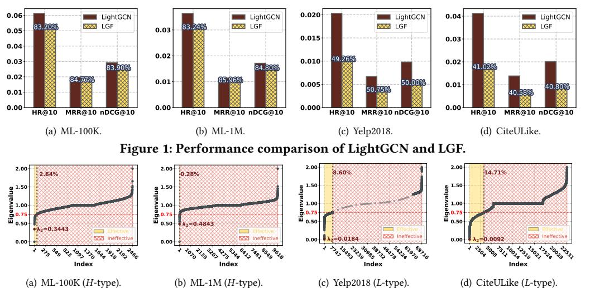
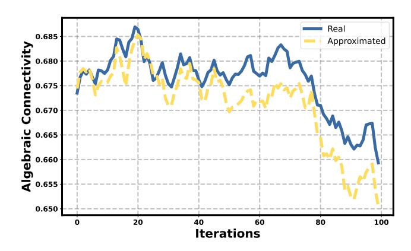
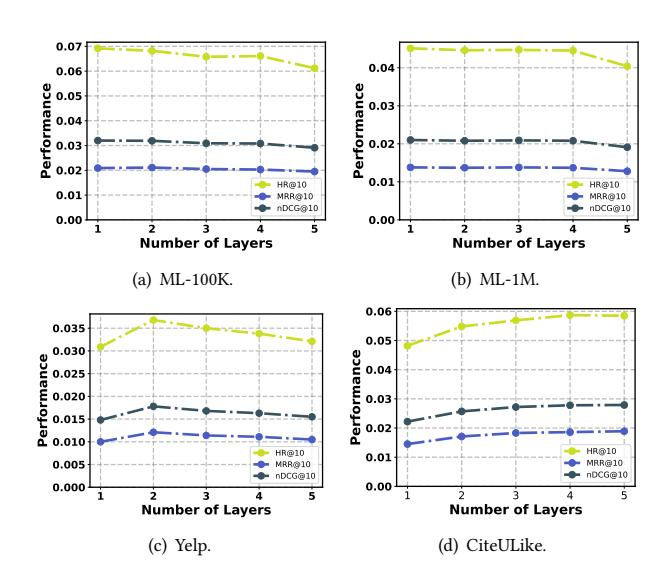

# Adaptive Graph Reweighting for Collaborative Filtering

Yijun Sheng University of Macau Macau SAR, China yc17419@um.edu.mo

Ximing Chen University of Macau Macau SAR, China yc37921@um.edu.mo

Pui Ieng Lei University of Macau Macau SAR, China yc37460@um.edu.mo

Yanyan Liu University of Macau Macau SAR, China yc07402@um.edu.mo

Zhiguo Gong∗ University of Macau Macau SAR, China fstzgg@um.edu.mo

# Abstract

Despite their success in Collaborative Filtering (CF), Graph Convolutional Networks (GCNs) are often viewed as Low-pass Graph Filters (LGFs) with task-specific supervision, while the influence of the underlying graph's spectral properties on LGF performance remains underexplored. Our analysis reveals that the performance of LGFs is strongly affected by algebraic connectivity. When connectivity is strong, LGFs tend to perform well; when it is weak, their effectiveness diminishes noticeably. This spectral sensitivity highlights an important limitation of existing models. To address this limitation, we propose Graph Booster, a learnable module that adaptively improves graph connectivity by reweighting edges. Unlike heuristic preprocessing, Graph Booster identifies bottleneck edges via spectral embeddings and adjusts their weights with a monotonic network guided by a lightweight graph connectivity regularizer. Integrated into LightGCN framework, our model BoostGCN achieves improvements over state-of-the-art methods, underscoring the significance of algebraic connectivity for graph-based CF.

# CCS Concepts

• Information systems → Recommender systems.

# Keywords

Collaborative Filtering; Graph Reweighting; Matrix Perturbation Theory

### ACM Reference Format:

Yijun Sheng, Ximing Chen, Pui Ieng Lei, Yanyan Liu, and Zhiguo Gong. 2026. Adaptive Graph Reweighting for Collaborative Filtering. In Proceedings of the ACM Web Conference 2026 (WWW '26), April 13–17, 2026, Dubai, United Arab Emirates. ACM, New York, NY, USA, [12](#page-11-0) pages. [https://doi.org/10.1145/](https://doi.org/10.1145/3774904.3792081) [3774904.3792081](https://doi.org/10.1145/3774904.3792081)

# 1 Introduction

Collaborative Filtering (CF) [\[34,](#page-8-0) [35\]](#page-8-1) is a widely adopted paradigm in recommender systems that infers users' preferences based on

∗Corresponding author.

© 2026 Copyright held by the owner/author(s). ACM ISBN 979-8-4007-2307-0/2026/04 <https://doi.org/10.1145/3774904.3792081>

their historical interactions with items. These user-item interactions can be naturally represented as bipartite graphs, enabling the effective use of Graph Convolutional Networks (GCNs) as powerful computational tools for recommendation tasks in recent years [\[2,](#page-8-2) [4,](#page-8-3) [18,](#page-8-4) [22,](#page-8-5) [26,](#page-8-6) [28,](#page-8-7) [43,](#page-8-8) [47,](#page-9-0) [49,](#page-9-1) [53–](#page-9-2)[56\]](#page-9-3). Despite differences among these algorithms, they share a common technique: capturing highorder relationships through Low-pass Graph Filters (LGFs), which are crucial to their performance.

LightGCN [\[18\]](#page-8-4) is widely regarded as a representative model among LGF-based approaches, offering both high performance and computational efficiency. Operating over the bipartite graph of user-item interactions, it applies multiple lightweight propagation layers, followed by optimization using the Bayesian Personalized Ranking (BPR) loss [\[33\]](#page-8-9). This mechanism embodies two key effects: (i) local smoothness via LGFs, where neighboring nodes become more similar through low-pass filtering [\[46,](#page-9-4) [57\]](#page-9-5); and (ii) preference alignment, where the BPR loss encourages interacting user-item pairs to be close in the embedding space. While the supervision mechanism via BPR has been extensively studied, the role of the graph's spectral structure in shaping LGFs performance remains comparatively underexplored. This raises a fundamental question: Which factors in the graph spectrum influence the effectiveness of LGFs for collaborative filtering?

We study this question through the lens of algebraic connectivity of the bipartite graph, which is measured as the second smallest eigenvalue ��2 of the graph Laplacian. Intuitively, a larger ��2 indicates fewer structural bottlenecks and stronger global connectivity of the graph, which facilitates information propagation. Our empirical experiments reveal that the LGF in LightGCN performs comparably to the vanilla LightGCN baseline on datasets with high algebraic connectivity, but degrades when connectivity is low. This observation aligns with prior findings that sharper spectral distribution benefits graph filtering [\[31\]](#page-8-10). These results highlight the potential of explicitly enhancing algebraic connectivity to improve the performance of LGF-driven collaborative filtering.

How can we increase ��2 in a way that generalizes across datasets and remains efficient during training? Prior graph rewiring approaches [\[1,](#page-8-11) [21\]](#page-8-12) typically rely on handcrafted heuristics applied as preprocessing steps. While computationally convenient, these manually defined heuristics lack adaptability to diverse graph topologies and to the evolving embedding geometry during learning. To overcome this limitation, we aim to integrate graph reweighting directly into the learning process, allowing the graph structure to be dynamically updated.

[This work is licensed under a Creative Commons Attribution 4.0 International License.](https://creativecommons.org/licenses/by/4.0) WWW '26, Dubai, United Arab Emirates

However, graph reweighting learning in the presence of noisy edges and outliers can be unstable. To stabilize optimization and ensure that graph reweighting effectively increases ��2, the model requires a regularization mechanism. Although the change in ��2 induced by reweighting could serve this role, computing it exactly at every training step is prohibitively expensive. Thus, an efficient estimator is needed.

This leads to two key challenges: (1) How to design a principled and trainable reweighting mechanism that explicitly increases algebraic connectivity? (2) How to efficiently estimate changes in algebraic connectivity during training to serve as a lightweight regularizer for stabilization?

Addressing Challenge (1). We propose a spectral reweighting scheme designed to increase algebraic connectivity by identifying and reinforcing structural bottlenecks. Specifically, we compute Laplacian eigenmap embeddings for each node and assign additional weight to each observed edge proportional to the spectral distance between its endpoints. This augmentation is symmetric and globally informed, as eigenmap coordinates are derived from the Laplacian spectrum. Our design is grounded in Spectral Graph Theory and Effective Resistance [\[5,](#page-8-13) [10,](#page-8-14) [11\]](#page-8-15), which suggest that edges bridging regions with large spectral separation tend to be bottlenecks, and strengthening them increases ��2. To enable flexible topology adjustment, we allow reweights to be either positive or negative, thereby strengthening or weakening edges as needed. Importantly, we constrain the magnitude of these reweights to remain below 1, ensuring the weighted adjacency matrix remains positive semidefinite throughout training.

Addressing Challenge (2). To address the high cost of repeatedly calculating algebraic connectivity, we introduce a matrixperturbation-based estimator of the change in algebraic connectivity. Using Matrix Perturbation Theory [\[38\]](#page-8-16), we approximate the first-order variation of ��2 from sparse matrix-vector operations with the current Fiedler vector, avoiding repeated calls to expensive eigensolvers. Compared with the complexity of a normal eigensolver such as the scipy.sparse.linalg.eigsh cost of O (�� · ��) per update, our estimator runs in O (�� + ��) time[1](#page-1-0) , enabling regularization without prohibitive overhead.

Putting these components together, we introduce Graph Booster, a learnable graph reweighting module that increases algebraic connectivity to improve LGFs performance. During training, we (i) learn additional per-edge weights from spectral distances and combine them with the original edge weights to form a weighted graph that evolves dynamically during training; (ii) incorporate the estimated increase in ��2 as a regularization term in the training objective, encouraging reweighting steps that break through bottlenecks; and (iii) after each structural update, apply the standard LightGCN pipeline to extract collaborative signals. Although instantiated with LightGCN, the mechanism is model-agnostic for CF methods whose propagation acts as an LGF. To the best of our knowledge, explicitly targeting algebraic connectivity within an end-to-end learning framework remains largely unexplored in collaborative filtering. Our contributions can be summarized in three key aspects:

• We are the first to provide comprehensive theoretical and empirical analysis of algebraic connectivity in LGFs, establishing that increased algebraic connectivity leads to improved performance.

• We propose Graph Booster, a lightweight graph reweighting module that enhances LGFs by dynamically modifying the graph structure. The design integrates a reweighting mechanism grounded in spectral graph theory with a reweighting regularizer informed by matrix perturbation theory, enabling effective algebraic connectivity improvement.

• We conduct comprehensive experiments on four benchmark datasets, demonstrating that our method outperforms state-of-theart CF models across multiple evaluation metrics.

# 2 Preliminary

# 2.1 Recall LightGCN

LightGCN [\[18\]](#page-8-4), a representative GCN-based CF model that follows a LGF paradigm, serves as the foundation of our study. It focuses on embedding propagation over the user-item bipartite graph, where the neighbor aggregation process is as follows:

 e (��+1) �� = Í ��∈N�� √ 1 |N�� | |N�� e (��) , e (��+1) �� = Í ��∈N�� √ 1 |N�� | |N�� e (��) �� , (1)

where e�� and e�� denote the embedding of the user and item, N�� and N�� represent the neighbor set of node �� and �� respectively.

The final embeddings are computed as the average of the outputs from all layers:

( e˜�� = Í�� ��=0 ���� e (��) �� , e˜�� = Í�� ��=0 ���� e (��) , (2)

where �� is the number of layers and ���� = 1 ��+1 . These two processes can be simplified into the following matrix form:

E˜ = 1 �� + 1 (I + A˜ + . . . + A˜ �� )E, (3)

where A˜ is the adjacent matrix of the bipartite graph. This implies that these two processes can essentially be viewed as a polynomialweighted summation.

Given a training set T, LightGCN is trained with the BPR loss and L2 regularization. For each triplet (��,��+ ,��− ) ∈ T where �� + and �� − denote the positive and negative items associated with ��, respectively, the predicted score is the inner product of embeddings, ��ˆ���� = e˜�� · e˜�� , and the training objective is as follows:

L = − ∑︁ (��,��+,��− ) ∈ T ln ��(��ˆ����+ − ��ˆ����− ) +�� ∥Θ∥2, (4)

where ��(·) is the sigmoid function and �� is the regularization coefficient. Intuitively, Eq. [\(1\)](#page-1-1) aims to bring embeddings of connecting user and item closer, aligning with the objective in Eq. [\(4\)](#page-1-2).

# 2.2 Graph Convolution in LightGCN Behaves as a Low-Pass Graph Filter

To identify key factors affecting graph convolution in LightGCN (Eqs. [\(1\)](#page-1-1)-[\(2\)](#page-1-3)), we begin our analysis within the Graph Signal Processing (GSP) [\[30\]](#page-8-17) framework. Let L˜ = I − D −1/2AD−1/2 be the

1�� nodes, �� edges,�� modified edges per update, and �� eigensolver iterations (typically in the hundreds).

Figure 2: Eigenvalue distributions of different datasets. The yellow-shaded region highlights the range of effective signals (�� ∗ = 0.75, results under other �� ∗ ∈ (0, 1) settings lead to consistent conclusions). For the large-scale Yelp dataset, only top 6,000 smallest and 6,000 largest eigenvalues are shown. The solid and dashed lines represent the observed and fitted data, respectively.

normalized Laplacian of a bipartite graph G, where D is the degree matrix and A is the adjacency matrix. The eigenvalues 0 = ��1 ≤ ��2 ≤ · · · ≤ ���� = 2 of L˜ constitute the spectrum of the Laplacian; together with their eigenvectors they define the graph spectral modes. The magnitude of ���� equals the Dirichlet energy of the corresponding mode, so smaller ���� indicate smoother, lower-frequency modes while larger ���� indicate more oscillatory, higher-frequency modes. The normalized adjacency matrix A˜ = D −1/2AD−1/2 has eigenvalues ���� ∈ [−1, 1], with frequency defined as ���� = 1 − ����

Then, we employ GSP to analyze the forward propagation of LightGCN as defined in Eq. [\(3\)](#page-1-4). We perform the eigendecomposition of A˜ and substitute the result into Eq. [\(3\)](#page-1-4), yielding this expression:

A˜ = V˜ diag(1 − ��1, . . . , 1 − ���� )V˜ ⊤ , V˜ ⊤V˜ = I, (5)

E˜ = V˜ 1 . . . 0 . . . . . ��+1 Í�� ��=0 (1 − ���� ) �� = 1− (1−���� ) ��+1 ���� (��+1) V˜ ⊤E. (6)

Given a fixed value of �� ∈ Z+, we observe that the monotonicity of the spectral filter coefficients �� (��) = 1− (1−��) ��+1 ��(��+1) with respect to �� is characterized as follows (see Appendix [7.1](#page-9-6) for details):

- �� is odd: The function �� (��) is strictly decreasing over (0, 2).
- �� is even: The function �� (��) is strictly decreasing on (0, ��∗ ) and strictly increasing on (�� ∗ , 2), where �� ∗ ∈ (1, 2) is the unique point satisfying �� ′ (�� ∗ ) = 0.

This observation suggests that the forward propagation of Light-GCN behave as a Low-pass Graph Filter (LGF) over the spectral domain �� ∈ [0, 1]. Furthermore, as the number of layers �� increases, the passband becomes progressively narrower. The low-pass characteristic of the graph convolution module adopted by LightGCN is not exclusive; in fact, many GCN-based models like LCFN [\[55\]](#page-9-7) and LGCN [\[56\]](#page-9-3), among others [\[28,](#page-8-7) [36\]](#page-8-18) can be regarded as LGFs.

# 2.3 Algebraic Connectivity Is the Key

To understand the structural factors influencing the effectiveness of graph convolution, we compare the standard LightGCN model with its variant LGF across multiple benchmark datasets. LGF removes the training procedure, retaining only the forward propagation component of LightGCN (Eqs. [\(1\)](#page-1-1)-[\(2\)](#page-1-3)). Specifically, it applies multiple layers of light graph convolution to randomly initialized embeddings. This comparing design allows us to investigate impact of the low-pass graph filtering operation itself, and through this comparison, uncover the structural properties of the graph that influence the effectiveness LGFs.

2.3.1 Empirical Observations. By conducting some preliminary experiments, we make the following empirical observations:

(1) Performance of LGF varies significantly across datasets. As shown in Figure [1,](#page-2-0) LGF achieves performance comparable to LightGCN on ML-100K and ML-1M. However, on Yelp and CiteU-Like, it suffers a substantial performance drop.

(2) Spectral characteristics align with performance patterns. As shown in Figure [2,](#page-2-1) the ML-100K and ML-1M datasets exhibit steeper eigenvalue growth, reflecting high spectral concentration, which we denote as H-type. This characteristic is associated with stronger LGF performance. In contrast, Yelp and CiteULike display flatter spectral curves with lower spectrum growth (L-type), corresponding to notably weaker performance of LGF.

(3) Algebraic connectivity is indicative of spectral type. We further observe that the algebraic connectivity (i.e., the second smallest eigenvalue of the normalized Laplacian) correlates strongly with the H/L-type classification. Datasets with higher connectivity (e.g., ML-100K and ML-1M) exhibit H-type behavior, whereas those with lower connectivity (e.g., Yelp and CiteULike) fall into the Ltype category.

2.3.2 Theoretical Discussion. We present a theoretical analysis to show how algebraic connectivity correlates with the performance of LGF. This analysis is based on two main insights:

We initialize �� to 0.5 and treat it as a trainable parameter. A smaller �� typically concentrates the spectrum [\[31\]](#page-8-10). The coefficient ��1 ∈ (0, 1] controls the augmentation strength and is constrained to preserve the positive semi-definiteness of the updated adjacency matrix.

3.2.3 Lightweight Regularizer. The reweighting process yields an enhanced adjacency matrix A˜ . During the graph reweighting process, the presence of noisy edges and outliers can be unstable. To systematically address this, we introduce a principled method to ensure the effectiveness of graph reweighting and stabilizes optimization. Leveraging Matrix Perturbation Theory [\[38\]](#page-8-16), we develop a generalized first-order eigenvalue perturbation approximation that extends existing single-edge modifications approximation [\[3,](#page-8-19) [21\]](#page-8-12) to handle changes in multiple edge weights.

Δ��2 ≈ (1 − ��2)v˜ ⊤ 2 D −1ΔDv˜ 2 − v˜ ⊤ 2 D − 2 ΔAD − 2 v˜ 2, (16)

ΔA = A ′ − A, (17)

ΔD = diag( ∑︁ ΔA[0, :], . . . ,∑︁ ΔA[��, :]), (18)

where v˜ 2 denotes the corresponding eigenvector of ��2. The detailed deduction can be found in Appendix [7.4.](#page-10-1) Since each reweighting may involve both the increase and decrease of edge weights simultaneously, we simply assume that the changes in ΔD are sufficiently small (ΔD ≈ 0) to reduce computational complexity. Based on this assumption, we propose the following estimation formula:

Δ��2 ≈ −v˜ ⊤ 2 D − 2 ΔAD − 2 v˜ 2. (19)

By simultaneously accounting for changes in multiple edge weights, our approach provides a more comprehensive assessment of their impact on the graph's algebraic connectivity during reweighting. Computing eigenvalue via eigsh requires O (��·��) time, whereas our approximation can be obtained in O (�� + ��) time, yielding substantial computational savings. This low-cost approximation further enables the change in Δ��2 to be seamlessly incorporated as an lightweight regularizer.

### 3.3 Low-pass Graph Filtering

After obtaining the reweighted graph with adjacency A˜ ′ , we directly apply existing LGFs as the downstream model.:

E˜ = LGF(A˜ , E), (20)

where E are initial node embeddings. In practice, LGF(·) can correspond to well-established architectures such as LightGCN [\[18\]](#page-8-4) or NGCF [\[43\]](#page-8-8). In our BoostGCN model, we use LightGCN as the LGF(·). This formulation allows our reweighted graph to seamlessly integrate with existing collaborative filtering models.

### 3.4 Prediction and Loss

To predict user-item interactions, we first extract the user embedding e˜�� and item embedding e˜�� from the embedding matrix E˜ . The interaction score is calculated by taking the inner product of these two embeddings:

��ˆ(��,��) = e˜�� · e˜ ⊤ . (21)

To optimize the parameters of BoostGCN, we adopt the Bayesian Personalized Ranking (BPR) loss [\[33\]](#page-8-9), supplemented by the ��2

regularizer to stabilize learning and ��2 regularization loss to prevent overfitting. Given the training data T, the overall objective is defined as:

LBPR = ∑︁ (��,��+,��− ) ∈ T − ln(��(��ˆ����+ − ��ˆ����− )), L = LBPR −��2Δ��2 +��3��2, (22)

where �� + denotes an item interacted with by user�� and �� − represents an item not interacted with by ��. The hyperparameters {��2,��3} control the balance between the three loss components.

### 3.5 Discussion

In contrast to attention-based models such as GAT [\[40\]](#page-8-23), which learn neighborhood-specific weights via an attention mechanism followed by softmax normalization, our Graph Booster derives edges' bottleneck scores from a global eigenmap of the graph Laplacian. This yields several fundamental distinctions. (i) locality vs. globality: GAT attention is locally normalized and thus relative within each neighborhood; bottleneck scores are absolute, capturing global structural information into every edge. (ii) symmetry vs. asymmetry: bottleneck scores based on |U[��, :] − U[��, :] | are inherently symmetric, naturally reflecting edge importance in graphs; GAT attention is asymmetric, hindering a globally consistent bottleneck ranking. (iii) normalization and competition: softmax(·) enforces neighbor-wise competition, making attention values inherently relative; bottleneck scores quantify intrinsic structural significance independent of local normalization. (iv) interpretability and theoretical guarantees: spectral reweighting aligns with algebraic connectivity via the Spectral Graph Theory [\[10\]](#page-8-14) and Effective Resistance [\[5,](#page-8-13) [11\]](#page-8-15), providing a provable basis for identifying structural bottlenecks; GAT attention lacks explicit spectral guarantees. (v) prior bias and robustness: Our design enforces monotonic, dimension-wise decreasing weights, explicitly encoding a prior that emphasizes lower-order eigenvectors, whereas GAT must implicitly learn such an inductive bias from data.

### 4 Experiments

# 4.1 Experimental Settings

4.1.1 Datasets. We evaluate our model on four widely used realworld benchmark datasets: MovieLens-100K[2](#page-5-0) (ML-100K), MovieLens-1M[2](#page-5-0) (ML-1M) [\[16\]](#page-8-24), Yelp2018[3](#page-5-1) , and CiteULike[4](#page-5-2) [\[41\]](#page-8-25). Table [1](#page-5-3) summarizes their key statistics, where ��2 denotes the algebraic connectivity of the corresponding user-item bipartite graph.

Table 1: Statistics of datasets after preprocessing.

|             | Dataset | ML-100K | ML-1M   | Yelp2018  | CiteULike |
|-------------|---------|---------|---------|-----------|-----------|
| Interaction | #       | 82,460  | 836,421 | 1,561,406 | 210,537   |
| User        | #       | 943     | 6,038   | 31,668    | 5,551     |
| Item        | #       | 1,523   | 3,580   | 38,048    | 16,980    |
| Density     |         | 0.0574  | 0.0387  | 0.0013    | 0.0022    |
| ��          | 2       | 0.3442  | 0.4843  | 0.0184    | 0.0092 ‡  |

��2 ≈ 0 suggests near-disconnectedness of the graph.

2https://grouplens.org/datasets/movielens/

3https://www.yelp.com/dataset

4https://github.com/js05212/citeulike-a

Table 2: Overall recommendation performance comparison. The Avg. Rank represents the ranking of the average ranking of individual metrics across all models. Except for Avg. Rank, all other metrics indicate better performance with higher values.

| Dataset Model | HR@10    | ML-100K MRR@10 | nDCG@10 | HR@10  | ML-1M MRR@10 | nDCG@10 | HR@10  | Yelp2018 MRR@10 | nDCG@10 | HR@10    | CiteULike MRR@10 | nDCG@10  | Avg. Rank |
|---------------|----------|----------------|---------|--------|--------------|---------|--------|-----------------|---------|----------|------------------|----------|-----------|
| NGCF          | 0.0594   | 0.0178         | 0.0273  | 0.0395 | 0.0120       | 0.0183  | 0.0263 | 0.0087          | 0.0128  | 0.0337   | 0.0104           | 0.0157   | 6.6       |
| LightGCN      | 0.0613   | 0.0197         | 0.0292  | 0.0364 | 0.0114       | 0.0171  | 0.0203 | 0.0067          | 0.0098  | 0.0412   | 0.0138           | 0.0201   | 6.3       |
| UltraGCN      | 0.0500   | 0.0155         | 0.0234  | 0.0317 | 0.0090       | 0.0142  | 0.0069 | 0.0021          | 0.0032  | 0.0171   | 0.0056           | 0.0082   | 12.4      |
| IMP-GCN       | 0.0498   | 0.0151         | 0.0231  | 0.0316 | 0.0092       | 0.0144  | 0.0348 | 0.0106          | 0.0162  | 0.0541   | 0.0162           | 0.0249   | 7.25      |
| LCFN          | 0.0484   | 0.0147         | 0.0225  | 0.0318 | 0.0099       | 0.0150  | 0.0068 | 0.0023          | 0.0033  | 0.0163   | 0.0054           | 0.0079   | 12.9      |
| GDE           | 0.0544   | 0.0178         | 0.0262  | 0.0320 | 0.0101       | 0.0152  | 0.0230 | 0.0075          | 0.0111  | 0.0301   | 0.0105           | 0.0150   | 8.4       |
| LGCN          | 0.0656   | 0.0197         | 0.0302  | 0.0379 | 0.0123       | 0.0182  | 0.0160 | 0.0053          | 0.0078  | 0.0329   | 0.0109           | 0.0159   | 7.0       |
| PGSP          | 0.0090   | 0.0022         | 0.0038  | 0.0246 | 0.0064       | 0.0106  | OOM    | OOM             | OOM     | 0.0415   | 0.0107           | 0.0177   | 14.0      |
| SGFCF         | 0.0291   | 0.0066         | 0.0117  | 0.0236 | 0.0049       | 0.0091  | 0.0043 | 0.0008          | 0.0015  | 0.0103   | 0.0015           | 0.0034   | 16.0      |
| SGL           | 0.0434   | 0.0122         | 0.0193  | 0.0304 | 0.0090       | 0.0139  | 0.0177 | 0.0051          | 0.0080  | 0.0476   | 0.0119           | 0.0199   | 11.1      |
| SSL4Rec       | 0.0184   | 0.0051         | 0.0081  | 0.0254 | 0.0076       | 0.0117  | 0.0161 | 0.0048          | 0.0074  | 0.0287   | 0.0120           | 0.0120   | 13.8      |
| SimGCL        | 0.0542   | 0.0158         | 0.0245  | 0.0294 | 0.0082       | 0.0130  | 0.0360 | 0.0114          | 0.0170  | 0.0483   | 0.0122           | 0.0203   | 7.4       |
| XSimGCL       | 0.0211   | 0.0053         | 0.0089  | 0.0369 | 0.0105       | 0.0165  | 0.0374 | 0.0114          | 0.0174  | 0.0513   | 0.0141           | 0.0226   | 6.8       |
| LT-OCF        | 0.0489   | 0.0151         | 0.0229  | 0.0343 | 0.0122       | 0.0172  | 0.0343 | 0.0113          | 0.0166  | 0.0574   | 0.0183           | 0.0272   | 5.6       |
| BSPM          | 0.0535   | 0.0172         | 0.0255  | 0.0323 | 0.0102       | 0.0152  | 0.0209 | 0.0070          | 0.0102  | 0.0165 ‡ | 0.0038 ‡         | 0.0066 ‡ | 7.8       |
| CDE-CF        | 0.0510   | 0.0166         | 0.0245  | 0.0403 | 0.0128       | 0.0191  | 0.0297 | 0.0097          | 0.0143  | 0.0409   | 0.0135           | 0.0198   | 5.8       |
| BoostGCN      | 0.0692   | 0.0212         | 0.0320  | 0.0451 | 0.0138       | 0.0210  | 0.0368 | 0.0121          | 0.0178  | 0.0587   | 0.0186           | 0.0278   | 1.1       |
| Improve       | (%) 5.49 | 7.61           | 6.62    | 11.91  | 7.81         | 9.95    | -1.68  | 5.74            | 2.29    | 2.26     | 1.64             | 2.21     |           |

Original setting gave invalid results; we report scores under our settings and exclude this metric from ranking.

4.1.2 Evaluation Metrics. We adopt three commonly used evaluation metrics to assess recommendation performance: Hit Ratio at k (HR@k), Mean Reciprocal Rank at k (MRR@k), and normalized Discounted Cumulative Gain at k (nDCG@k). The HR metric quantifies the binary accuracy by determining whether recommended items have been interacted with by users. Both MRR and nDCG measure the quality of the ranking, reflecting how well the relevant items are positioned within the recommendation list. In our experiments, all metrics are calculated using the top-10 recommended items (k = 10), with higher scores indicating superior model effectiveness.

4.1.3 Baselines. To validate the effectiveness of our proposed model, we conduct comparisons with several state-of-the-art approaches categorized as follows: Spatial-domain graph-based models that exploit the spatial relationships among nodes, including NGCF [\[43\]](#page-8-8), LightGCN [\[18\]](#page-8-4), UltraGCN [\[28\]](#page-8-7), and IMP-GCN [\[26\]](#page-8-6); Spectraldomain graph-based models which utilize graph signal processing techniques to better analyze graph-structured data, such as LCFN [\[55\]](#page-9-7), GDE [\[32\]](#page-8-26), LGCN [\[56\]](#page-9-3), PGSP [\[27\]](#page-8-27), and SGFCF [\[31\]](#page-8-10); Contrastive learning-based models that learn robust representations by distinguishing positive from negative samples, including SGL [\[47\]](#page-9-0), SSL4Rec [\[51\]](#page-9-9), SimGCL [\[54\]](#page-9-10), and XSimGCL [\[53\]](#page-9-2); and ODE-based models which leverage continuous dynamics of ordinary differential equations for flexible and stable information propagation, exemplified by LT-OCF [\[8\]](#page-8-28), BSPM [\[7\]](#page-8-29), and CDE-CF [\[50\]](#page-9-11).

4.1.4 Settings. BoostGCN[5](#page-6-0) is developed with TensorFlow. We adopt the Nadam optimizer uniformly across all experiments and keep hyperparameters fixed unless otherwise specified in their codes. The default settings include an embedding dimension of 64, an initial learning rate of 1 × 10−3 , and a batch size of 2,048. For the MovieLens datasets, rating matrices are binarized using a threshold of 2. To facilitate rigorous evaluation, data splits follow a 7:1:2 ratio for training, validation, and testing, respectively. Each experiment is repeated at least five times, and the reported results represent the average metrics. Consistent with prior studies [\[18,](#page-8-4) [43\]](#page-8-8), we adopt a training scheme that pairs one positive item with one negative

item and apply an all-ranking protocol for testing, focusing primarily on ranking performance. Early stopping[6](#page-6-1) is employed to avoid overfitting and reduce the complexity of hyperparameter tuning.

# 4.2 Overall Performance

Table [2](#page-6-2) reports the overall results, where the best-performing model is highlighted in bold and the second-best is underlined; reported improvements are relative to the second best. BoostGCN yields consistent gains across datasets, with average relative gains of 6.75%, 9.89%, 2.12%, and 2.04% on ML-100K, ML-1M, Yelp2018, and CiteULike, respectively. These improvements can be attributed to its adaptive graph reweighting mechanism guided by algebraic connectivity: by dynamically evaluating and adjusting adjacency weights during training, BoostGCN effectively mitigates noise, adapts to distributional shifts, and preserves structural semantics, thereby enhancing information propagation and representation quality. Notably, models grounded in Ordinary Differential Equations (ODEs)—including LT-OCF, BSPM, and CDE-CF—also demonstrate strong performance. By modeling message passing as continuous dynamics, these approaches enable finer-grained control over information flow and alleviate oversmoothing, which collectively improves both expressiveness and empirical performance.

# 4.3 Study on Graph Booster

4.3.1 Can We Use Simple Preprocessing? We compare our end-toend learning strategy with a static variant termed EA+LightGCN, where 5,000 edges are added in preprocessing according to Eq. [\(16\)](#page-5-4) to increase algebraic connectivity, and standard LightGCN training is subsequently applied. As shown in Table [3,](#page-7-0) this preprocessing improves connectivity but often degrades recommendation accuracy, indicating that optimizing connectivity in isolation may distort structural semantics. In contrast, our graph reweighting module adaptively enhances connectivity during training, consistently yielding larger algebraic connectivity, particularly on sparsely connected graphs, and translating these gains into improved downstream performance.

5The source code is accessible at<https://github.com/jaxyijunsheng/BoostGCN>

6Early stopping is based on validation loss monitoring.

Table 3: Performance of three models on four benchmark datasets. Underlined values denote the baseline results. Values in parentheses indicate the relative change (%) with respect to the corresponding baseline.

| Datasets Metrics HR@10 MRR@10 ML-100K nDCG@10 | 0.0692 0.0322 | 0.0212 BoostGCN ( ( ( | 12.89% ) 7.61% ) 10.27% ) LightGCN 0.0613 0.0197 0.0292 | 0.0515 0.0166 0.0246 | ( ( (      | EA+LightGCN -17.46% -15.74% -16.44% | ) ) ) |
|-----------------------------------------------|---------------|-----------------------|---------------------------------------------------------|----------------------|------------|-------------------------------------|-------|
| �� 2                                          | 0.3461        | ( 0.55%               | ) 0.3442                                                | 0.4921               | (          | 42.96%                              | )     |
| HR@10                                         | 0.0451        | ( 23.90%              | ) 0.0364                                                | 0.0365               |            | ( 0.27%                             | )     |
| MRR@10 ML-1M                                  | 0.0138        | ( 21.05%              | ) 0.0114                                                | 0.0114               |            | ( 0.00%                             | )     |
| nDCG@10                                       | 0.0210        | ( 22.81%              | ) 0.0171                                                | 0.0171               |            | ( 0.00%                             | )     |
| �� 2                                          | 0.4851        | ( 0.17%               | ) 0.4843                                                | 0.5080               |            | ( 4.90%                             | )     |
| HR@10                                         | 0.0368        | ( 81.28%              | ) 0.0203                                                | 0.0196               | (          | -3.45%                              | )     |
| MRR@10 Yelp2018                               | 0.0121        | ( 80.60%              | ) 0.0067                                                | 0.0064               | (          | -4.48%                              | )     |
| nDCG@10                                       | 0.0178        | ( 81.63%              | ) 0.0098                                                | 0.0094               | (          | -4.08%                              | )     |
| �� 2                                          | 0.0189        | ( 2.72%               | ) 0.0184                                                | 0.0252               | (          | 36.96%                              | )     |
| HR@10                                         | 0.0587        | ( 42.48%              | ) 0.0412                                                | 0.0379               | (          | -8.01%                              | )     |
| MRR@10 CiteULike                              | 0.0186        | ( 34.78%              | ) 0.0138                                                | 0.0133               | (          | -3.62%                              | )     |
| nDCG@10                                       | 0.0278        | ( 38.31%              | ) 0.0201                                                | 0.0190               | (          | -5.47%                              | )     |
| �� 2                                          | 0.0097        | ( 5.43%               | ) 0.0092                                                | 0.1082               | ( 1076.09% |                                     | )     |

4.3.2 Experiments on other LGFs. To examine the applicability of our approach beyond LightGCN, we further conduct experiments on NGCF [\[43\]](#page-8-8), another representative low-pass graph filter. As shown in Table [4,](#page-7-1) integrating the graph booster into NGCF leads to consistent performance gains. Together with the results on Light-GCN, these findings suggest that the graph booster is generally effective for models built upon low-pass filtering.

Table 4: Performance of NGCF with and without Graph Booster (GB).

| Datasets Metrics | Vanilla | W/ GB  | Improve (%) |
|------------------|---------|--------|-------------|
| HR@10            | 0.0594  | 0.0650 | 9.43        |
| MRR@10 ML-100K   | 0.0178  | 0.0197 | 10.67       |
| nDCG@10          | 0.0273  | 0.0301 | 10.26       |
| HR@10            | 0.0395  | 0.0411 | 4.05        |
| MRR@10 ML-1M     | 0.0120  | 0.0125 | 5.83        |
| nDCG@10          | 0.0183  | 0.0190 | 4.37        |
| HR@10            | 0.0263  | 0.0304 | 15.59       |
| MRR@10 Yelp2018  | 0.0087  | 0.0099 | 13.79       |
| nDCG@10          | 0.0128  | 0.0146 | 14.06       |
| HR@10            | 0.0337  | 0.0420 | 24.63       |
| MRR@10 CiteULike | 0.0104  | 0.0134 | 28.85       |
| nDCG@10          | 0.0157  | 0.0200 | 27.39       |

# 5 Related Work

# 5.1 Collaborative Filtering

Recommender systems are designed to identify items that users are likely to prefer based on historical user-item interactions. A widely adopted approach in this domain is Collaborative Filtering (CF), which generates recommendations by leveraging similarities among users or items [\[34,](#page-8-0) [35\]](#page-8-1). Typically, CF models parameterize users and items by learning latent representations directly from interaction data. In particular, Matrix Factorization (MF) has emerged as an effective CF-based technique, as it encodes dense latent representations in a low-dimensional space, thereby capturing intrinsic similarities between users and items [\[24,](#page-8-30) [33\]](#page-8-9). Concurrently, the success of deep neural networks has spurred significant efforts to enhance the interaction functions used for recommendation prediction [\[17,](#page-8-31) [20,](#page-8-32) [39,](#page-8-33) [48\]](#page-9-12). For example, NCF [\[20\]](#page-8-32) synergistically combines MF with multi-layer perceptrons to introduce nonlinearity and flexibility into the interaction function. Additionally, methods such as

SVD++ [\[23\]](#page-8-34), NAIS [\[19\]](#page-8-35), and ACF [\[6\]](#page-8-36) incorporate users' interaction histories through various pooling strategies, further advancing the learning of user and item representations.

### 5.2 Graph-based Collaborative Filtering

Recent years have witnessed a surge in the application of graph neural networks (GNNs) across various fields due to their strong expressive power [\[15,](#page-8-37) [22,](#page-8-5) [40,](#page-8-23) [49\]](#page-9-1). In recommender systems, useritem interactions naturally form a graph structure, where GNNs propagate information across edges so that connected nodes learn similar representations—capturing user preferences for different items [\[2,](#page-8-2) [12,](#page-8-38) [52\]](#page-9-13). Numerous models [\[18,](#page-8-4) [26,](#page-8-6) [28,](#page-8-7) [43\]](#page-8-8) have been proposed to capture high-order connectivity on the user–item bipartite graph. Building on the insight that GCNs can be viewed as lowpass filters [\[46\]](#page-9-4), researchers have leveraged graph signal processing (GSP) to design spectral-based models. For example, LCFN [\[55\]](#page-9-7) and its subsequent refinement LGCN [\[56\]](#page-9-3) apply spectral filtering to reduce high-frequency noise and better integrate user and item features, while methods like GDE [\[32\]](#page-8-26) and SGFCF [\[31\]](#page-8-10) further enhance the extraction of key graph features and address challenges related to data density and expressive power. Additionally, recent work has integrated self-supervised learning to improve robustness by enforcing consistency between representations and their augmented views [\[4,](#page-8-3) [47,](#page-9-0) [51,](#page-9-9) [53,](#page-9-2) [54\]](#page-9-10). More recently, ODE-based models [\[7,](#page-8-29) [8,](#page-8-28) [50\]](#page-9-11) have been introduced to capture the continuous dynamics of node representations by formulating the propagation process as an ordinary differential equation. These Neural ODE-based GNNs offer adaptive computation and greater flexibility in controlling information diffusion, thereby mitigating over-smoothing and further boosting performance. However, existing methods have yet to explore the impact of increasing a graph's algebraic connectivity on the indirect enhancement of graph convolutional module performance. Furthermore, there is no proposed method for estimating algebraic connectivity subject to multi-element perturbation.

### 6 Conclusion

In this paper, we introduce BoostGCN, a novel model that enhances graph convolution capabilities for collaborative filtering. Unlike traditional models, which focus on designing complex graph convolution modules, BoostGCN reweights graph structures to enhance the classic graph convolution operation. Our experiments show that LGF in LightGCN perform well on graphs with high algebraic connectivity but struggles with low-connectivity graphs. Based on this, we propose a graph booster module that uses graph reweighting techniques, guided by an algebraic connectivity estimation method based on matrix perturbation theory, to improve connectivity. Extensive experiments on four benchmark datasets demonstrate that BoostGCN outperforms state-of-the-art methods, offering substantial gains in recommendation accuracy.

# Acknowledgments

This work was supported by the Science and Technology Development Fund, Macau SAR ( 0126/2024/RIA2, 001/2024/SKL), CG-2026, GDST (2020B1212030003, 2023A0505030013), Nansha District (2023ZD001), MYRG-GRG2023-00186-FST-UMDF, MYRG-GRG2025- 00234-FST.

- References [1] Adrián Arnaiz-Rodríguez, Ahmed Begga, Francisco Escolano, and Nuria Oliver. 2022. DiffWire: Inductive Graph Rewiring via the Lovász Bound. In Learning on Graphs Conference, LoG 2022, 9-12 December 2022, Virtual Event, Vol. 198. PMLR,
- 15.<https://proceedings.mlr.press/v198/arnaiz-rodri-guez22a.html> [2] Rianne van den Berg, Thomas N Kipf, and Max Welling. 2017. Graph convolutional matrix completion. arXiv preprint arXiv:1706.02263 (2017). [3] Aleksandar Bojchevski and Stephan Günnemann. 2019. Adversarial Attacks on Node Embeddings via Graph Poisoning. In Proceedings of the 36th International Conference on Machine Learning, ICML 2019, 9-15 June 2019, Long Beach, California, USA (Proceedings of Machine Learning Research, Vol. 97), Kamalika Chaudhuri and Ruslan Salakhutdinov (Eds.). PMLR, 695–704. [http://proceedings.mlr.press/](http://proceedings.mlr.press/v97/bojchevski19a.html) [v97/bojchevski19a.html](http://proceedings.mlr.press/v97/bojchevski19a.html) [4] Xuheng Cai, Chao Huang, Lianghao Xia, and Xubin Ren. 2023. LightGCL: Simple Yet Effective Graph Contrastive Learning for Recommendation. In The Eleventh International Conference on Learning Representations, ICLR 2023, Kigali, Rwanda, May 1-5, 2023. OpenReview.net. [https://openreview.net/forum?id=](https://openreview.net/forum?id=FKXVK9dyMM) [FKXVK9dyMM](https://openreview.net/forum?id=FKXVK9dyMM) [5] Ashok K. Chandra, Prabhakar Raghavan, Walter L. Ruzzo, Roman Smolensky, and Prasoon Tiwari. 1989. The Electrical Resistance of a Graph Captures its Commute and Cover Times (Detailed Abstract). In Proceedings of the 21st Annual ACM Symposium on Theory of Computing, May 14-17, 1989, Seattle, Washington, USA, David S. Johnson (Ed.). ACM, 574–586. [doi:10.1145/73007.73062](https://doi.org/10.1145/73007.73062) [6] Jingyuan Chen, Hanwang Zhang, Xiangnan He, Liqiang Nie, Wei Liu, and Tat-Seng Chua. 2017. Attentive Collaborative Filtering: Multimedia Recommendation with Item- and Component-Level Attention. In Proceedings of the 40th International ACM SIGIR Conference on Research and Development in Information Retrieval (Shinjuku, Tokyo, Japan) (SIGIR '17). Association for Computing Machinery, New York, NY, USA, 335–344. [doi:10.1145/3077136.3080797](https://doi.org/10.1145/3077136.3080797) [7] Jeongwhan Choi, Seoyoung Hong, Noseong Park, and Sung-Bae Cho. 2023. Blurring-Sharpening Process Models for Collaborative Filtering. In Proceedings of the 46th International ACM SIGIR Conference on Research and Development in Information Retrieval (Taipei, Taiwan) (SIGIR '23). Association for Computing Machinery, New York, NY, USA, 1096–1106. [doi:10.1145/3539618.3591645](https://doi.org/10.1145/3539618.3591645) [8] Jeongwhan Choi, Jinsung Jeon, and Noseong Park. 2021. LT-OCF: Learnable-Time ODE-based Collaborative Filtering. In Proceedings of the 30th ACM International Conference on Information & Knowledge Management (Virtual Event, Queensland, Australia) (CIKM '21). Association for Computing Machinery, New York, NY, USA, 251–260. [doi:10.1145/3459637.3482449](https://doi.org/10.1145/3459637.3482449) [9] Fan Chung, Linyuan Lu, and Van Vu. 2003. Spectra of random graphs with given expected degrees. Proceedings of the National Academy of Sciences 100, 11 (2003), 6313–6318. [doi:10.1073/pnas.0937490100](https://doi.org/10.1073/pnas.0937490100) [10] Fan RK Chung. 1997. Spectral graph theory. Vol. 92. American Mathematical Soc. [11] Peter G Doyle and J Laurie Snell. 1984. Random walks and electric networks. Vol. 22. American Mathematical Soc. [12] Wenqi Fan, Yao Ma, Qing Li, Yuan He, Eric Zhao, Jiliang Tang, and Dawei Yin. 2019. Graph Neural Networks for Social Recommendation. In The World Wide Web Conference (WWW '19). Association for Computing Machinery, New York, NY, USA, 417–426. [doi:10.1145/3308558.3313488](https://doi.org/10.1145/3308558.3313488) [13] Miroslav Fiedler. 1973. Algebraic connectivity of graphs. Czechoslovak mathematical journal 23, 2 (1973), 298–305. [14] Aric Hagberg, Pieter J Swart, and Daniel A Schult. 2007. Exploring network structure, dynamics, and function using NetworkX. Technical Report. Los Alamos National Laboratory (LANL). [15] William L. Hamilton, Rex Ying, and Jure Leskovec. 2017. Inductive representation learning on large graphs. In Proceedings of the 31st International Conference on Neural Information Processing Systems (Long Beach, California, USA) (NIPS'17). Curran Associates Inc., Red Hook, NY, USA, 1025–1035. [16] F. Maxwell Harper and Joseph A. Konstan. 2015. The MovieLens Datasets: History and Context. ACM Trans. Interact. Intell. Syst. 5, 4, Article 19 (Dec. 2015), 19 pages. [doi:10.1145/2827872](https://doi.org/10.1145/2827872) [17] Xiangnan He and Tat-Seng Chua. 2017. Neural Factorization Machines for Sparse Predictive Analytics. In Proceedings of the 40th International ACM SIGIR Conference on Research and Development in Information Retrieval (Shinjuku, Tokyo, Japan) (SIGIR '17). Association for Computing Machinery, New York, NY, USA, 355–364. [doi:10.1145/3077136.3080777](https://doi.org/10.1145/3077136.3080777) [18] Xiangnan He, Kuan Deng, Xiang Wang, Yan Li, YongDong Zhang, and Meng Wang. 2020. LightGCN: Simplifying and Powering Graph Convolution Network for Recommendation. In Proceedings of the 43rd International ACM SIGIR Conference on Research and Development in Information Retrieval (Virtual Event, China) (SIGIR '20). Association for Computing Machinery, New York, NY, USA, 639–648. [doi:10.1145/3397271.3401063](https://doi.org/10.1145/3397271.3401063) [19] Xiangnan He, Zhankui He, Jingkuan Song, Zhenguang Liu, Yu-Gang Jiang, and Tat-Seng Chua. 2018. NAIS: Neural Attentive Item Similarity Model for Recommendation. IEEE Trans. on Knowl. and Data Eng. 30, 12 (Dec. 2018), 2354–2366. [doi:10.1109/TKDE.2018.2831682](https://doi.org/10.1109/TKDE.2018.2831682) [20] Xiangnan He, Lizi Liao, Hanwang Zhang, Liqiang Nie, Xia Hu, and Tat-Seng Chua. 2017. Neural collaborative filtering. In Proceedings of the 26th international conference on world wide web. 173–182. [21] Adarsh Jamadandi, Celia Rubio-Madrigal, and Rebekka Burkholz. 2024. Spectral graph pruning against over-squashing and over-smoothing. In Proceedings of the 38th International Conference on Neural Information Processing Systems (Vancouver, BC, Canada) (NIPS '24). Curran Associates Inc., Article 331, 32 pages. [22] Thomas N. Kipf and Max Welling. 2017. Semi-Supervised Classification with Graph Convolutional Networks. In International Conference on Learning Representations.<https://openreview.net/forum?id=SJU4ayYgl> [23] Yehuda Koren. 2008. Factorization meets the neighborhood: a multifaceted collaborative filtering model. In Proceedings of the 14th ACM SIGKDD international conference on Knowledge discovery and data mining. 426–434. [24] Yehuda Koren, Robert Bell, and Chris Volinsky. 2009. Matrix Factorization Techniques for Recommender Systems. Computer 42, 8 (2009), 30–37. [doi:10.1109/](https://doi.org/10.1109/MC.2009.263) [MC.2009.263](https://doi.org/10.1109/MC.2009.263) [25] James R. Lee, Shayan Oveis Gharan, and Luca Trevisan. 2014. Multiway Spectral Partitioning and Higher-Order Cheeger Inequalities. J. ACM 61, 6, Article 37 (Dec. 2014), 30 pages. [doi:10.1145/2665063](https://doi.org/10.1145/2665063) [26] Fan Liu, Zhiyong Cheng, Lei Zhu, Zan Gao, and Liqiang Nie. 2021. Interest-aware message-passing GCN for recommendation. In Proceedings of the web conference 2021. 1296–1305. [27] Jiahao Liu, Dongsheng Li, Hansu Gu, Tun Lu, Peng Zhang, Li Shang, and Ning Gu. 2023. Personalized graph signal processing for collaborative filtering. In Proceedings of the ACM Web Conference 2023. 1264–1272. [28] Kelong Mao, Jieming Zhu, Xi Xiao, Biao Lu, Zhaowei Wang, and Xiuqiang He. 2021. UltraGCN: ultra simplification of graph convolutional networks for recommendation. In Proceedings of the 30th ACM international conference on information & knowledge management. 1253–1262. [29] Maximillian Nickel and Douwe Kiela. 2017. Poincaré embeddings for learning hierarchical representations. Advances in neural information processing systems 30 (2017). [30] Antonio Ortega, Pascal Frossard, Jelena Kovačević, José MF Moura, and Pierre Vandergheynst. 2018. Graph signal processing: Overview, challenges, and applications. Proc. IEEE 106, 5 (2018), 808–828. [31] Shaowen Peng, Xin Liu, Kazunari Sugiyama, and Tsunenori Mine. 2024. How powerful is graph filtering for recommendation. In Proceedings of the 30th ACM SIGKDD conference on knowledge discovery and data mining. 2388–2399. [32] Shaowen Peng, Kazunari Sugiyama, and Tsunenori Mine. 2022. Less is more: Reweighting important spectral graph features for recommendation. In Proceedings of the 45th international ACM SIGIR conference on research and development in information retrieval. 1273–1282. [33] Steffen Rendle, Christoph Freudenthaler, Zeno Gantner, and Lars Schmidt-Thieme. 2009. BPR: Bayesian personalized ranking from implicit feedback. In Proceedings of the Twenty-Fifth Conference on Uncertainty in Artificial Intelligence. 452–461. [34] Paul Resnick, Neophytos Iacovou, Mitesh Suchak, Peter Bergstrom, and John Riedl. 1994. Grouplens: An open architecture for collaborative filtering of netnews. In Proceedings of the 1994 ACM conference on Computer supported cooperative work. 175–186. [35] Badrul Sarwar, George Karypis, Joseph Konstan, and John Riedl. 2001. Item-based collaborative filtering recommendation algorithms. In Proceedings of the 10th international conference on World Wide Web. 285–295. [36] Yifei Shen, Yongji Wu, Yao Zhang, Caihua Shan, Jun Zhang, B. Khaled Letaief, and Dongsheng Li. 2021. How Powerful is Graph Convolution for Recommendation?. In Proceedings of the 30th ACM International Conference on Information & Knowledge Management (Virtual Event, Queensland, Australia) (CIKM '21). Association for Computing Machinery, New York, NY, USA, 1619–1629. [doi:10.1145/3459637.3482264](https://doi.org/10.1145/3459637.3482264) [37] Joseph Sill. 1997. Monotonic networks. In Proceedings of the 11th International Conference on Neural Information Processing Systems (Denver, CO) (NIPS'97). MIT Press, Cambridge, MA, USA, 661–667. [38] G.W. Stewart and J. Sun. 1990. Matrix Perturbation Theory. Elsevier Science. <https://books.google.com/books?id=bIYEogEACAAJ> [39] Yi Tay, Luu Anh Tuan, and Siu Cheung Hui. 2018. Latent relational metric learning via memory-based attention for collaborative ranking. In Proceedings of the 2018 world wide web conference. 729–739. [40] Petar Veličković, Guillem Cucurull, Arantxa Casanova, Adriana Romero, Pietro Liò, and Yoshua Bengio. 2018. Graph Attention Networks. In International Conference on Learning Representations.<https://openreview.net/forum?id=rJXMpikCZ> [41] Hao Wang, Binyi Chen, and Wu-Jun Li. 2013. Collaborative topic regression with social regularization for tag recommendation.. In IJCAI, Vol. 13. 2719–2725. [42] Hao Wang, Defu Lian, Hanghang Tong, Qi Liu, Zhenya Huang, and Enhong Chen. 2021. Hypersorec: Exploiting hyperbolic user and item representations with multiple aspects for social-aware recommendation. ACM Transactions on Information Systems (TOIS) 40, 2 (2021), 1–28. [43] Xiang Wang, Xiangnan He, Meng Wang, Fuli Feng, and Tat-Seng Chua. 2019. Neural Graph Collaborative Filtering. In Proceedings of the 42nd International ACM SIGIR Conference on Research and Development in Information Retrieval

Explanation of steps: (i) Substitutes the definition of the perturbed Laplacian and expands the difference with the original Laplacian. (ii) Uses the first-order Taylor expansion of (D + ΔD) − 2 = D − 2 − 2D − 2 ΔD +O (||ΔD||2 ) to isolate perturbation terms. (iii) Applies the identity A = D 1/2 (I − L˜)D 1/2 to simplify. (iv) Uses the eigenrelation L˜v˜�� = ����v˜�� to compute the final expression.

Finally, by expanding the matrix form into element-wise notation and using the Kronecker delta ������ and the definition of ΔD, we arrive at:

Δ���� ≈ ∑︁ ��,�� v˜�� [��]v˜�� [��] √︁ D�� ��D���� − ���� v˜�� [��] D�� �� ������ ! ΔA���� . (41)

The final expression quantifies the sensitivity of eigenvalues to local structural changes, capturing both the direct influence of perturbations in adjacency and the indirect adjustments via degree variation, each modulated by the spectral profile of L˜

# 7.5 Does the ��2 Regularizer Really Work?

We conducted ablation studies to validate the effectiveness of the proposed regularization term ��2 and assess its impact on model performance. In these experiments, we set the coefficient ��2 to 0, eliminating its influence on graph reweighting. This setup examined whether the absence of regularization guidance impacted performance. Table [5](#page-11-1) presents the results, summarizing performance metrics across different conditions. Generally, removing the regularizer led to a performance decline, highlighting its role in guiding the reweighting process toward optimal solutions.

Table 5: Ablation study on ��2 penalty. W/o ��2 refers to the variant where ��2 is removed from the vanilla model.

| Datasets Metrics | Vanilla | W/o Δ �� | 2 Drop (%) |
|------------------|---------|----------|------------|
| HR@10            | 0.0692  | 0.0676   | -2.31      |
| MRR@10 ML-100K   | 0.0212  | 0.0211   | -0.47      |
| nDCG@10          | 0.0322  | 0.0318   | -1.24      |
| HR@10            | 0.0451  | 0.0450   | -0.22      |
| MRR@10 ML-1M     | 0.0138  | 0.0137   | -0.72      |
| nDCG@10          | 0.0210  | 0.0207   | -1.43      |
| HR@10            | 0.0368  | 0.0357   | -2.99      |
| MRR@10 Yelp2018  | 0.0121  | 0.0117   | -3.31      |
| nDCG@10          | 0.0178  | 0.0172   | -3.37      |
| HR@10            | 0.0587  | 0.0586   | -0.17      |
| MRR@10 CiteULike | 0.0186  | 0.0186   | 0.00       |
| nDCG@10          | 0.0278  | 0.0278   | 0.00       |

### 7.6 Does the Approximation Formula for ��2 Accurately Estimate the Change in ��2?

To assess the effectiveness of the proposed approximation equation for estimating algebraic connectivity, we conducted experiments on an Erdős-Rényi (ER) graph with parameters (|V |, |E |) = (30, 211) , as illustrated in Figure [3.](#page-11-3) At each iteration, we introduced random perturbations to the adjacency matrix and used the true algebraic connectivity (computed via eigen-decomposition) as a reference to assess the accuracy of the proposed approximation. The results

demonstrate that the approximation equation in Eq. [16](#page-5-4) consistently provides a reliable estimate of algebraic connectivity.

Figure 3: The variations in true algebraic connectivity of a random ER graph with 30 nodes and 211 edges alongside the corresponding changes estimated using our approximation method. The results suggest that the discrepancy between the approximated and true algebraic connectivity remains within an acceptable range.

# 7.7 Hyperparameter Analysis

We investigate the impact of varying the number of convolutional layers in our graph model. Specifically, we assess performance across configurations with 1 to 5 layers, as depicted in Figure [4.](#page-11-4) The results indicate that performance peaks at 2 or 3 layers for ML series and Yelp2018 datasets, while the CiteULike datasets exhibit consistent improvement, reaching their optimal performance at 4 or 5 layers. These findings align with our expectations, as the CiteULike dataset is highly sparse, implying that additional layers effectively capture meaningful multi-hop information.

Figure 4: BoostGCN performance with different number of layers ��.

7We used the NetworkX [\[14\]](#page-8-42) package to generate an ER graph with 30 nodes, setting the edge creation probability to 0.5.