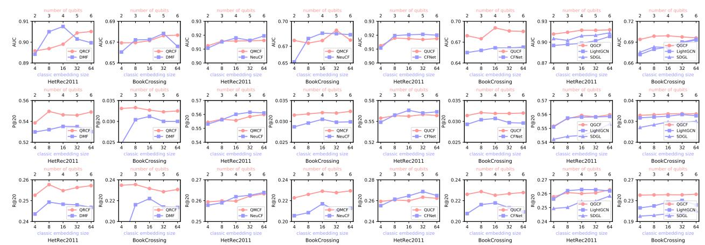
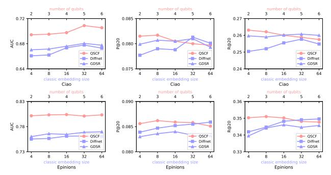
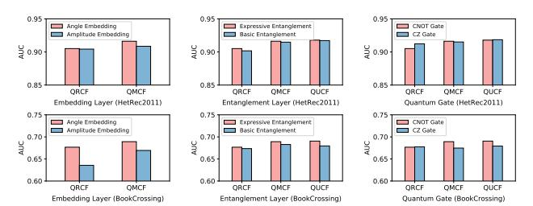
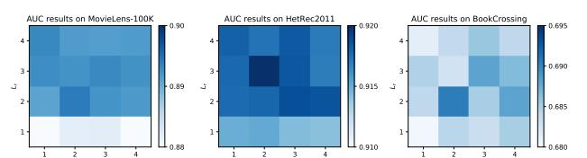
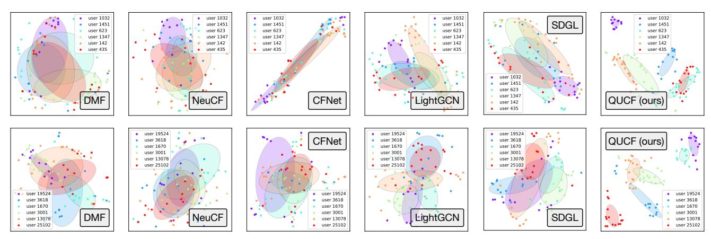

# Quantum-enhanced Representation Learning and Matching Learning for Recommendation

Anchen Li∗

Department of Computer Science, Aalto University Espoo, Finland anchen.li@aalto.fi

Elena Casiraghi†

Dipartimento di Informatica, University of Milan Milan, Italy elena.casiraghi@unimi.it

# Abstract

Quantum computing is an emerging research area. This paper investigates why and how quantum computing can be integrated into recommender systems. Although some existing recommendation methods explore quantum concepts, they either remain theoretical without empirical validation or provide limited insight into the use of quantum computing for designing core functions in recommendation. To fill these gaps, we first analyze the potential advantages of quantum computing for two key components (i.e., representation learning and matching learning) in recommender algorithms and formulate corresponding hypotheses. Then, based on our analysis and the quantum computing operations, we propose three quantumenhanced recommendation paradigms. To show the extensibility of our paradigms, we further apply them to the graph-based and social recommendation scenarios. We conduct extensive experiments on the six real-world datasets, comparing our methods with various baselines. Experimental results not only validate our hypotheses but also show the strong performance of our proposed methods.

# CCS Concepts

### • Information systems → Recommender systems.

## Keywords

Quantum Computing; Recommendation; Collaborative Filtering; Representation Learning; Matching Learning; Graph Learning.

#### ACM Reference Format:

Anchen Li and Elena Casiraghi. 2026. Quantum-enhanced Representation Learning and Matching Learning for Recommendation. In Proceedings of the ACM Web Conference 2026 (WWW '26), April 13–17, 2026, Dubai, United Arab Emirates. ACM, New York, NY, USA, [9](#page-8-0) pages. [https://doi.org/10.1145/](https://doi.org/10.1145/3774904.3792086) [3774904.3792086](https://doi.org/10.1145/3774904.3792086)

# 1 Introduction

In the era of information and content overload, users often face the overchoice problem on the Web. To address this challenge, recommender systems (RSs) have emerged with the goal of providing and

© 2026 Copyright held by the owner/author(s). ACM ISBN 979-8-4007-2307-0/2026/04 <https://doi.org/10.1145/3774904.3792086>

suggesting the most suitable options for users. At present, various online platforms and web applications (e.g., YouTube, Facebook, and TikTok) offer recommendation services to improve user experience.

Collaborative filtering (CF) is one of the most widely used recommendation strategies due to its effectiveness [\[31\]](#page-8-1). Traditional CF methods are generally based on the user historical interactions [\[11,](#page-8-2) [53\]](#page-8-3). In follow-on studies, researchers further enhance CF by using the interaction graph structure [\[10,](#page-8-4) [46\]](#page-8-5) and side information [\[26,](#page-8-6) [35,](#page-8-7) [40,](#page-8-8) [50\]](#page-8-9). CF methods typically contains two key components [\[46\]](#page-8-5). One is representation learning (RL), which generates embeddings for users and items. The other is matching learning (ML), which models user-item interactions based on the learned representations. This division has led to two CF paradigms [\[5,](#page-8-10) [52\]](#page-8-11), RL-based CF and ML-based CF, each placing emphasis on either RL or ML.

A key observation is that most CF methods are designed based on classical computing. Recently, quantum computing has been applied to multiple learning and optimization tasks [\[3,](#page-8-12) [6\]](#page-8-13), showing its capability in complex data modeling. We believe that quantum computing offers advantages and novel design insights for recommendation, particularly in modeling RL and ML for CF tasks. First, quantum state vectors offer greater expressive power compared to vectors in classical computing. For example, a classical bit can exist in only one of two states (i.e., either 0 or 1). In contrast, a quantum bit (i.e., qubit) can represent a superposition of basis states |0⟩ and |1⟩ (i.e., α |0⟩ +β |1⟩). In general, an n-qubit system is represented by a superposition state vector in a 2 n -dimensional space [\[36,](#page-8-14) [49\]](#page-8-15). This high-dimensional representation has the potential to enhance user and item modeling. Second, the unique entanglement mechanism in quantum computing captures correlations between two or multiple quantum states, where individual states cannot be described independently [\[12,](#page-8-16) [13\]](#page-8-17). This mechanism provides a new perspective for matching user-item interactions by suggesting that the user or item does not solely determine an interaction in isolation but is jointly defined by both and forms a collaborative state.

Inspired by the characteristics of quantum computing, this paper explores its application in RSs. Although several recommendation algorithms based on quantum concepts have been proposed [\[20,](#page-8-18) [33,](#page-8-19) [43,](#page-8-20) [45,](#page-8-21) [47\]](#page-8-22), we argue that they still face two notable limitations. First, most existing methods remain at the theoretical design stage. They only present algorithm-level frameworks without actual implementation or performance evaluation, which is insufficient for the practice-oriented nature of RSs. Second, most existing methods overlook how quantum computing can be applied to the two core components (i.e., RL and ML) of CF in RSs and their corresponding empirical analysis. Furthermore, the impact of different quantum computing designs (e.g., quantum embedding and entanglement strategies) on RSs has not been fully investigated and explored.

∗Corresponding author.

†Elena Casiraghi is also affiliated with Environmental Genomics and Systems Biology Division, Lawrence Berkeley National Laboratory, United States; ELLIS, European Laboratory for Learning and Intelligent Systems, Milan Unit, Italy; and Department of Computer Science, Aalto University, Finland.

[This work is licensed under a Creative Commons Attribution 4.0 International License.](https://creativecommons.org/licenses/by/4.0) WWW '26, Dubai, United Arab Emirates

In this paper, we aim to address the above research gaps and provide a comprehensive analysis on quantum computing for RSs. We begin by introducing basic background on quantum computing. Then, we propose two hypotheses on utilizing quantum computing to model RL and ML in the CF task. Meanwhile, based on our hypotheses and quantum computing operations, we present three quantum-based CF paradigms (i.e., quantum representation learning paradigm, quantum matching learning paradigm, and quantum unified learning paradigm) and further extend these paradigms to graph-based and social recommendation tasks. Finally, we conduct experiments on six public datasets to compare our methods with multiple baselines across three CF scenarios. The experimental results validate our hypotheses and show the strong performance of our proposed methods. Our main contributions are as follows:

- We provide both theoretical analysis and empirical results to validate our two hypotheses: (1) quantum embeddings generally outperform classical ones in the low-dimensional setting, while their performance becomes similar as the dimension increases; (2) quantum entanglement offers advantages in modeling user-item interactions compared to classical computing methods.
- We introduce three novel quantum-based CF learning paradigms and demonstrate their extensibility by applying them to graphbased and social recommendation tasks.
- We evaluate our methods on six datasets in three recommendation scenarios and provide a detailed result analysis. Based on the findings, we offer comments and suggestions on when and where quantum computing can be beneficial for recommendation.

#### 2 Preliminary

In this section, we introduce some background and concepts of CF recommendation and quantum computing. The key notations used in this paper are summarized in Table [1.](#page-1-0)

Table 1: Summary of the key notations.

| Symbol |      |           | Explanation    |             |          |          |     |
|--------|------|-----------|----------------|-------------|----------|----------|-----|
| U      | , V  |           | User           | and         | item     | set      |     |
| Y      |      | User-item |                | interaction |          | matrix   |     |
| u      | a    | Initial   | representation |             | for      | user u a | ∈ U |
| v      | b    |           |                |             |          |          |     |
|        |      | Initial   | representation |             | for      | item v b | ∈ V |
| ψ ( u  | a )⟩ | Quantum   |                | state       | for user | u a ∈    | U   |
| ψ ( v  | b    |           |                |             |          |          |     |
|        | )⟩   | Quantum   |                | state       | for item | v b ∈    | V   |
| QE(    | )    | Quantum   |                | embedding   |          | function |     |
| QRL(   | )    | Quantum   | representation |             | learning | function |     |
| QML(   | )    | Quantum   | matching       |             | learning | function |     |
| MEA(   | )    |           | Measurement    |             | function |          |     |
| L      | r    | Layer     | number         | in          | function | QRL(     | )   |
| L      | m    | Layer     | number         | in          | function | QML(     | )   |

## 2.1 Collaborative Filtering

We first introduce the notations and definitions utilized in CF, and then present two learning paradigms of CF.

2.1.1 Notation and Definition. Given a user set U and an item set V, their interaction matrix can be represented as Y ∈ R |U |× |V | , in which an entry yab = 1 indicates that user ua ∈ U engaged with item vb ∈ V, otherwise 0. The goal of CF is to predict user

ua's preference for item vb that ua has not previously interacted with, or more formally, to estimate their interaction likelihood yˆab .

2.1.2 Learning Paradigm of CF. As mentioned in the Introduction section, two CF learning paradigms are widely utilized [\[5,](#page-8-10) [52\]](#page-8-11). One is RL-based CF, and the other is ML-based CF, with each focusing on different core components of CF. The former emphasizes user and item embedding learning and often adopts a dual-tower structure for this purpose [\[53\]](#page-8-3). In contrast, the latter focuses on joint modeling of user and item embeddings and typically utilizes or designs deep learning components to match user-item interactions [\[11\]](#page-8-2). Both types of CF paradigms have their own advantages [\[5\]](#page-8-10). In this work, we extend them to the quantum computing setting.

## 2.2 Quantum Computation

This section introduces some quantum concepts. For a more comprehensive understanding, we refer readers to the textbook [\[36\]](#page-8-14).

2.2.1 Quantum State. Quantum computing is built on a Hilbert space [\[36\]](#page-8-14). The simplest quantum system is a qubit, or quantum bit [\[34\]](#page-8-23). Unlike a classical bit, which is 0 or 1, a qubit can exist in a superposition of two basis states |0⟩ and |1⟩, where |·⟩ is the Dirac notation. A quantum state u is written as a ket |u⟩, and its transpose is written as a bra ⟨u|. Specifically, ket |u⟩ can be written as a linear combination of basis states as |u⟩ = α |0⟩ + β |1⟩, where α, β ∈ C are the complex coefficients (i.e., amplitudes) of two states. The square of each amplitude gives the probability of measuring the qubit in the corresponding basis state, satisfying |α | 2 + |β | 2 = 1. From a geometric perspective, a qubit state can be visualized using the Bloch sphere [\[36\]](#page-8-14). A quantum system can consist of multiple qubits, and an n-qubit system can be written as |Ψ⟩ = Í2 n i=1 αi |ei⟩, where αi ∈ C is the amplitude of basis state |ei⟩, satisfying Í2 i=1 |αi 2 = 1.

2.2.2 Quantum Gate. To manipulate the quantum state of a qubit system, the quantum gate (a unitary operation) is commonly used. First, we introduce three single-qubit rotation gates [\[36\]](#page-8-14), as:

RX(θ )= cos θ 2 −isin θ 2 −isin θ 2 cos θ 2 , RY(θ )= cos θ − sin θ sin θ cos θ , RZ(θ )= e −iθ /2 0 0 e iθ /2 , (1)

which are used to rotate the quantum state around the respective axes by the angle θ on the Bloch sphere [\[36,](#page-8-14) [55\]](#page-8-24).

To entangle qubits, commonly used two-qubit gates, Controlled-NOT (CNOT) and Controlled-Z (CZ) gates, are defined as follows:

CNOT = 1 0 0 0 0 1 0 0 0 0 0 1 0 0 1 0 , CZ = 1 0 0 0 0 1 0 0 0 0 1 0 0 0 0 −1 , (2)

 where CNOT gate flips the target qubit when the control qubit is

|1⟩, and CZ gate applies a phase flip to the amplitude of state |11⟩.

A set of gates forms a quantum circuit, which manipulates quantum states to achieve superposition and entanglement. We will use these gates to construct quantum circuits for designing our method.

# 3 Hypotheses for Quantum Recommendation

Based on the characteristics of quantum computing, we introduce two hypotheses about its advantages when applied to CF recommenders, specifically in the RL and ML components of CF.

Hypothesis 1. Quantum embeddings outperform classical embeddings when the latent size is small. As the latent size increases, their performances become comparable. Accurately modeling user and item representations is key to CF. As previously mentioned, an n-bit classical representation holds one of 2 n possible values, while a quantum representation encodes a superposition of all 2 n states. Thus, quantum representations provide higher expressiveness than classical ones. On the other hand, both classical and quantum representations exhibit a performance upper bound when the latent size becomes sufficiently large. Their upper bounds tend to be similar, as both representations are capable of user and item embedding with arbitrarily low distortion given a large latent space.

Hypothesis 2. Quantum entanglement is more suited for useritem interaction learning than classical computing methods. Quantum entanglement describes a correlation between two or more qubits, where quantum states of qubits cannot be described independently [\[34,](#page-8-23) [36,](#page-8-14) [55\]](#page-8-24). By analogy to the ML component in CF, quantum entanglement allows us to represent the composite user-item system as an entangled quantum state (e.g., |ψ(ua,vb ) ⟩), which cannot be decomposed into the tensor product of individual user and item states (e.g., |ψ(ua,vb ) ⟩ , |ψua ⟩ ⊗ |ψvb ⟩) [\[55\]](#page-8-24). This non-separability offers an advantage in capturing joint user-item interaction learning state, which is difficult to achieve with classical methods that rely on inner product-based interaction modeling. In addition, the inherent high-order modeling capability of quantum entanglement [\[4,](#page-8-25) [36\]](#page-8-14) further contributes to capturing complex interaction matching.

#### 4 Methodology

We first introduce our quantum-enhanced CF recommenders, then explain how to incorporate graph and social information into our method, and finally describe the model optimization process.

#### 4.1 Quantum CF Learning Paradigm

Following the two paradigms of CF, we design the quantum representation learning paradigm and quantum matching learning paradigm. In addition, we integrate both ideas into a unified framework called the quantum unified learning paradigm. These three CF paradigms are shown in Figure [1.](#page-2-0) Before introducing them, we first present the quantum embedding operation, quantum entanglement architecture, and measurement layer in all three frameworks.

| entanglement layer 1 entanglement layer      | 1                                      |                                       |
|----------------------------------------------|----------------------------------------|---------------------------------------|
| measurement                                  | measurement                            | measurement                           |
|                                              | entanglement layer 1                   |                                       |
| prediction                                   | prediction                             | prediction                            |
| user   ψ (ua) ⟩ item   ψ (vb)                | ⟩ user   ψ (ua) ⟩ item   ψ (vb) ⟩      | user   ψ (ua) ⟩ item   ψ (vb) ⟩       |
| (a) Quantum Representation Learning Paradigm | (b) Quantum Matching Learning Paradigm | (c) Quantum Unified Learning Paradigm |

Figure 1: The architecture of three quantum CF paradigms.

4.1.1 Quantum Embedding. Such an embedding operation is used to transform classical data features into quantum state vectors. Without loss of generality, we assume the classical data feature is

- x = [x1, · · · , xK ] ∈ R K and consider two embedding methods:
- In angle embedding [\[18,](#page-8-26) [37,](#page-8-27) [41\]](#page-8-28), classical data x is encoded into a K-qubit quantum state through rotational gates, as follows:

|ψ(x)⟩ = EANG(x) = ÌK k=1 Rρ (xk )|ψ0⟩, (3)

where ρ ∈ {X, Y, Z} denotes the rotation axis, |ψ0⟩ is the initial quantum state set to |0⟩, and ⊗ represents the tensor product.

- In amplitude embedding [\[18,](#page-8-26) [48\]](#page-8-29), classical data x is encoded into the amplitudes of a K-qubit quantum state, as follows:

|ψ(x)⟩ = EAMP(x) = ÕK k=1 xk C |k⟩, C 2 = ÕK k=1 |xk 2 , (4)

where |k⟩ is the basis state of the quantum system.

4.1.2 Quantum Entanglement Layer. To apply entanglement operations that establish qubit correlations, we introduce an entanglement layer in our model. Specifically, given a K-qubit quantum state |ψ⟩, an entanglement layer U with parameters Θ is applied to the quantum state as U(Θ) |ψ⟩. As shown in Figure [2,](#page-2-1) we consider the following two types of entanglement layers:

- The basic entanglement layer contains single-qubit rotations Rρ on each qubit, followed by CX gates between adjacent qubits:

UB(Θ) = ÌK k=1 Rρ (θk ) ÖK k=1 CX k, (k+1)%K , (5)

where θk ∈ Θ and Θ ∈ R K and CX = CNOT or CZ. The product symbol Î indicates that the CX gates are applied in sequence. • The expressive entanglement layer [\[39,](#page-8-30) [54\]](#page-8-31) performs single-qubit rotations using three parameterized gates, and then applies quantum entanglement via a series of CNOT or CZ operations, as:

UE(Θ) = ÌK k=1 Rot θ 1 k , θ 2 k , θ 3 k ÖK k=1 CX k, (k+1)%K , (6)

where θ 1 k , θ 2 k , θ 3 k ∈ Θ and Θ ∈ R K×3 . Function Rot is defined as:

Rot(θ 1 k , θ 2 k , θ 3 k ) = Rρ(1) (θ 1 k ) · Rρ(2) (θ 2 k ) · Rρ(3) (θ 3 k ). (7)

The difference between the basic and expressive entanglement layers is that the latter utilizes multiple single-qubit rotations before performing entanglement. In this paper, we set Rρ(1) , Rρ(2) , and Rρ(3) to be RZ, RY, and RZ, respectively, because this combination provides strong expressive power [\[1,](#page-8-32) [39,](#page-8-30) [54\]](#page-8-31). In the future work, we will explore more advanced entanglement layers.

| R ( ρ θ K)   |    |  |  |            |
|--------------|----|--|--|------------|
| R ( ρ θ 1)   |    |  |  |            |
| R ( ρ θ 2)   |    |  |  |            |
| R ( ρ θ 3)   |    |  |  |            |
| R Z ( θ K)   |    |  |  |            |
|              |    |  |  | R Z ( θ 2) |
| R Y ( θ      | 2) |  |  | 3          |
| R Y ( θ      | K) |  |  |            |
| R Z ( θ 2)   |    |  |  |            |
|              |    |  |  | R Z ( θ K) |
|              |    |  |  | R Z ( θ 1) |
| R Y ( θ      | 1) |  |  | 3          |
| 2 R Z ( θ 1) |    |  |  |            |
|              |    |  |  | R Z ( θ 3) |
| R Y ( θ      | 3) |  |  | 3          |
| R Z ( θ 3)   |    |  |  |            |

Figure 2: Structures of two quantum entanglement layers.

4.1.3 Measurement Layer. The measurement operation converts the quantum state into classical bits to retrieve information from quantum computations. Specifically, given a K-qubit state |ψ⟩, we apply Pauli-Z measurement [\[36,](#page-8-14) [54\]](#page-8-31) to each qubit, as follows:

z ψ = MEA(|ψ⟩) = [z ψ 1 , z ψ 2 , . . . , z ψ K ], z ψ j = ⟨ψ |Hj |ψ⟩, (8)

where z ψ j ∈ R is the measurement of the j-th qubit, that is, the j-th element of the vector z ψ ∈ R K . Hamiltonian Hj is defined as:

Hj = Ìj−1 k=1 Ì 1 0 0 −1 ÌÌK k=j+1 , (9)

where we apply the Pauli-Z operator at the j-th position, and apply the identity matrix I to all other positions.

4.1.4 Quantum Representation Learning Paradigm. As shown in Figure [1\(](#page-2-0)a), this paradigm mainly focuses on modeling and refining quantum representations of users and items.

To be specific, given the indices (i.e., IDs) of a user ua and an itemvb , we can first obtain their classical embeddings ua ∈ R d and vb ∈ R d . Then, the two classical embeddings are converted into a d-qubit quantum state through the quantum embedding layer:

|ψ(ua)⟩ = QE(ua), |ψ(vb )⟩ = QE(vb ), (10)

where, from now on, QE refers to EANG in Eq.[\(3\)](#page-2-2) or EAMP in Eq.[\(4\)](#page-2-3).

Next, we apply two quantum representation learning (QRL) functions to refine the user and item states, and obtain states |ψ ∗ (ua)⟩ and |ψ ∗ (vb )⟩. For example, the process of computing |ψ ∗ (ua)⟩ is:

|ψ ∗ (ua)⟩ = QRL |ψ(ua)⟩ = ÖLr l=1 U(Θ l r (u) ) |ψ(ua)⟩, (11)

where we implement QRL using entanglement layers. From now on, U(Θ) can be set as either basic entanglement layer UB(Θ) in Eq.[\(5\)](#page-2-4) or the expressive one UE(Θ) in Eq.[\(6\)](#page-2-5), and Lr is the layer number.

To model user preferences for items, we use measurement layer MEA in Eq.[\(8\)](#page-2-6) to convert user and item quantum states into classical vectors, and then model their interaction, as follows:

yˆab = MEA |ψ ∗ (ua)⟩⊤MEA |ψ ∗ (vb )⟩ . (12)

4.1.5 Quantum Matching Learning Paradigm. Unlike the previous strategy, this paradigm focuses on modeling the quantum state of user-item matching interactions, as shown in Figure [1\(](#page-2-0)b).

We first encode user and item states jointly, as follows:

|ψ(eab )⟩ = QE [ua ∥vb , (13)

where ∥ denotes the vector concatenation operation.

Then, we use a quantum matching learning (QML) function to model the user-item interaction, as follows:

|ψ ∗ (eab )⟩ = QML |ψ(eab )⟩ = ÖLm l=1 U(Θ l m) |ψ(eab )⟩, (14)

where Lm denotes the entanglement layer number in QML.

Finally, we obtain the classical embedding of the user-item interaction through the measurement layer MEA and a learnable weight vector w ∈ R d for prediction, as follows:

yˆab = w ⊤MEA |ψ ∗ (eab )⟩ . (15)

4.1.6 Quantum Unified Learning Paradigm. To leverage the strengths of the previous two CF learning strategies, this paradigm effectively combines them, as shown in Figure [1\(](#page-2-0)c).

We first encode users and items as quantum states using quantum embedding, then apply QRL to refine their representations, and finally use QML to model user-item interactions, as follows:

|ψ ∗ (eab )⟩ = QML QRL QE(ua) ÌQRL QE(vb ) . (16)

After obtaining user-item interaction state |ψ ∗ (eab )⟩, we can compute final preference prediction yˆab utilizing Eq.[\(15\)](#page-3-0).

# 4.2 Quantum Graph-based CF Learning

Graph-based methods, which consider neighborhoods in the interaction graph [\[10\]](#page-8-4), have proven effective in classical CF. To this end, based on our previous paradigms, we propose a quantum graphbased CF. Given user set U and item set V, and their interaction

matrix Y, we define a bipartite graph G = (U ∪V, Y). Then, we can encode the neighborhood in G using existing methods (e.g., Light-GCN [\[10\]](#page-8-4)), or use the method we propose below. Specifically, given node up in G, we define its neighborhood set N (up, Lд), whose element (uq,lp ) represents node uq is the lp -hop neighbor of node up (lp ≤ Lд). Then, based on this neighborhood information, we model the neighborhood representation u N p of node up , as:

u N p = Õ (uq,lp )∈N(up,Lд) 1 lp · |N (up, Lд)| uq, (17)

where uq is the embedding of neighbor uq. Here, we weight each neighbor by its hop count. To reduce computation, we set Lд to 2.

Then, for user u and item i, we first obtain their neighbor embeddings u N a and v N b using Eq.[\(17\)](#page-3-1), and combine them with their own representations ua and vb as input to our quantum CF framework:

|ψ ∗ (eab )⟩=QML QRL QE(ua +u N a ) ÌQRL QE(vb +v N b ) .(18) Finally, we obtain preference prediction yˆab based on Eq.[\(15\)](#page-3-0).

#### 4.3 Quantum Social-based CF Learning

To alleviate the data sparsity problem, researchers often introduce the side information [\[8,](#page-8-33) [50\]](#page-8-9). Here, based on our CF paradigms, we further incorporate the user social network as side information.

Specifically, the user social network can be defined as a matrix S ∈ R |U |× |U |, where each element sij ∈ S is 1 if there is a social connection between user i and j, and 0 otherwise.

For user ua, we can define her social-enhanced embedding u S a :

u S a = ua + u SO a , u SO a = Õ a ′∈Sa 1 |Sa | ua ′, (19)

where Sa denotes the set of social neighbors of user ua.

Then, we can feed this representation and the item vb representation into our quantum CF paradigm to model the interaction:

|ψ ∗ (eab )⟩ = QML QRL QE u S a ÌQRL QE vb . (20)

Finally, we use Eq.[\(15\)](#page-3-0) to obtain the preference prediction yˆab .

## 4.4 Model Optimization

Given the model predictionyˆab from user ua and itemvb , we utilize the sigmoid function σ (i.e., σ(x) = 1/1+e −x ) and the cross-entropy loss function to train our methods, as follows:

L = Õ (ua,vb )∈Y − yab log σ(yˆab )+(1−yab ) log (1−σ(yˆab )) . (21)

## 5 Experiment

In this section, we first describe the experimental setup. Then, we conduct various experiments to validate our method.

## 5.1 Experimental Setup

This subsection includes descriptions of the datasets, baseline algorithms, implementation configuration, and evaluation metrics.

5.1.1 Datasets. We first introduce four real-world datasets for CF tasks, including MovieLens-100K[1](#page-0-0) , MovieLens-1M[2](#page-0-0) , HetRec2011[3](#page-0-0) ,

1https://grouplens.org/datasets/movielens/100k/

2https://grouplens.org/datasets/movielens/1m/

3https://grouplens.org/datasets/hetrec-2011/

and BookCrossing[4](#page-0-0) . The statistics of these datasets are shown in Table [2.](#page-4-0) Each dataset contains user-item rating information, and we convert these ratings into implicit feedback. In addition, we introduce two commonly used datasets, Ciao[5](#page-0-0) and Epinions[6](#page-0-0) , for social recommendation. Each dataset contains user-item interactions and user social links. The statistics of them are shown in Table [3.](#page-4-1)

Table 2: Statistics of the datasets for CF recommendation.

| Datasets       | # users | # items | # interactions | density |
|----------------|---------|---------|----------------|---------|
| MovieLens-100K | 936     | 1,574   | 82,456         | 5.597%  |
| MovieLens-1M   | 6,032   | 3,628   | 836,424        | 3.822%  |
| HetRec2011     | 2,108   | 9,919   | 745,028        | 3.563%  |
| BookCrossing   | 26,611  | 46,603  | 221,076        | 0.018%  |

Table 3: Statistics of the datasets for social recommendation.

5.1.2 Baselines. We first propose and implement three quantum CF paradigms (as illustrated in Figure [1\)](#page-2-0) for traditional CF tasks. We name these three models QRCF, QMCF, and QUCF. To validate their effectiveness, we use DMF [\[53\]](#page-8-3), NeuCF [\[11\]](#page-8-2), and CFNet [\[5\]](#page-8-10) as baselines, which can be seen as their counterparts under classical computing. We then further propose a quantum graph-based CF framework (QGCF) and a quantum social-based CF (QSCF) framework. To evaluate their performance, we use graph-based baselines (i.e., LightGCN [\[10\]](#page-8-4) and SDGL [\[32\]](#page-8-34)) and social-based baselines (i.e., Diffnet [\[50\]](#page-8-9) and GDSR [\[27\]](#page-8-35)). In addition, we add three quantum baselines (i.e., QKER [\[15\]](#page-8-36), QTN [\[16\]](#page-8-37), and QITN [\[41\]](#page-8-28)) for CF tasks.

5.1.3 Implementation Configuration. For each dataset, we split the user-item interactions into training, evaluation, and test sets with a ratio of 6:2:2. For all models, we utilize the Adam optimizer with the learning rate selected from {10−5 , 10−4 , 10−3 , 10−2 , 10−1 }. The hyperparameter search spaces for the baselines are as follows: for classical computing models, we search the embedding size d in {4, 8, 16, 32, 64}, while for quantum computing models, we search the qubit size q in {2, 3, 4, 5, 6}. The layer sizes of neural networks (e.g., the multi-layer perceptron in DMF, NeuCF, and CFNet, and GNN in LightGCN, SDGL, Diffnet, and GDSR) are selected from the set {1, 2, 3, 4}. Other hyper-parameter settings of baselines are researched by empirical study or following original papers. Our models are implemented using PennyLane[7](#page-0-0) as the quantum simulator. For all methods (QRCF, QMCF, QUCF, QGCF, and QSCF), by default, we utilize the angle embedding as the embedding layer and the expressive entanglement layer with CNOT gate as the entanglement operations. For QUCF, on MovieLens-100K and HetRec2011 datasets, we leverage LightGCN as the graph encoder, while on the MovieLens-1M and BookCrossing datasets, we use our proposed encoder. The search space for the qubit size is {2, 3, 4, 5, 6}. Also, our proposed methods include two important hyper-parameters, the layer number in functions QRL and QML (i.e., Lr and Lm), and the search space is {1, 2, 3, 4}. We will provide a detailed analysis of model components and hyper-parameters in Sections [5.4](#page-5-0) and [5.5.](#page-6-0)

5.1.4 Evaluation Metrics. We evaluate our model on the clickthrough rate (CTR) prediction and top-K recommendation. For the former, we use the area under curve (AUC) as the metric. For the latter, we use precision@K (P@K) and recall@K (R@K), with K set to 20. These metrics are widely used in recommendation [\[10,](#page-8-4) [27,](#page-8-35) [30\]](#page-8-38).

#### 5.2 Comparison with Classical Models

In this subsection, we compare our model with classical computing baselines in three recommendation scenarios.

5.2.1 Comparison in Traditional CF Tasks. The results are shown in the upper part of Table [4.](#page-5-1) We find that: (1) our three quantum computing models, QRCF, QMCF, and QUCF, achieve the best performance on 3 out of 4 datasets. Our methods achieve clear advantages on the sparse BookCrossing dataset. On the denser MovieLens-100K and MovieLens-1M, our method achieves performance comparable to classical computing ones. (2) The performance of QRCF, QMCF, QUCF varies across datasets, but the overall trend is that QUCF performs best, followed by QMCF, and then QRCF.

To verify the Hypothesis 1 in Section [3,](#page-1-1) we further compare the effect of different latent sizes on our models and baselines. Specifically, we compare QRCF, QMCF, and QUCF with their classical computing counterparts DMF, NeuCF, and CFNet, respectively. For our models, we analyze the impact of the qubit number, ranging from 2 to 6. For the baselines, we examine the effect of embedding sizes, ranging from 4 to 64. The results on the HetRec2011 and BookCrossing datasets are shown in the first six columns of Figure [3.](#page-5-2) We observe that (1) in general, the performance of classical and quantum computing models improves as the latent size increases. However, in some cases, performance may drop when the size becomes too large, possibly due to overfitting or noise; (2) our quantum computing models often achieve strong performance with a small number of qubits (e.g., 2, 3, or 4). In contrast, classical computing models tend to perform worse with small embedding sizes and usually require much larger sizes (e.g., 32 or 64) to match the performance of quantum ones. The performance gap between the classical and quantum models narrows as the latent size increases.

For the Hypothesis 2 in Section [3,](#page-1-1) we make the following observations: (1) the key difference between QUCF and QRCF is that QUCF uses quantum entanglement to model user-item matching, while QRCF relies on classical inner products. QUCF performs better in most cases, suggesting the advantage of quantum entanglement; (2) when the latent size is small, QMCF outperforms its classical counterpart NeuCF, especially on sparse datasets. This shows the potential of quantum entanglement in modeling user-item interactions. Beyond the above analysis, Section [5.6](#page-6-1) provides insights from the perspective of interaction embedding visualization.

5.2.2 Comparison in Graph-Based CF Tasks. To evaluate the proposed QGCF in Section [4.2,](#page-3-2) we compare it with LightGCN and SDGL. The experimental results are shown in the middle part of Table [4](#page-5-1) and in the last two columns of Figure [3.](#page-5-2) Our QGCF achieves the best performance on 3 out of 4 datasets, and the other main findings are similar to those in the traditional CF task. Specifically, on sparse datasets, quantum computing models show superior performance. When the latent size is small, quantum computing models generally outperform classical ones. Also, we find that, compared to QRCF,

4https://grouplens.org/datasets/book-crossing/

5http://www.ciao.co.uk 6http://www.epinions.com/

7https://pennylane.ai/

Table 4: Performance comparison of our method with traditional classic CF baselines, graph-based classic CF baselines, and quantum baselines on the four datasets. Bold values indicate the best performance within each comparison task.

| Datasets Tasks and Methods |        | AUC    | MovieLens-100K P@20 | R@20   | AUC    | MovieLens-1M P@20 | R@20   | AUC    | HetRec2011 P@20 | R@20   | AUC    | BookCrossing P@20 | R@20   |
|----------------------------|--------|--------|---------------------|--------|--------|-------------------|--------|--------|-----------------|--------|--------|-------------------|--------|
| Comparison in              |        |        |                     |        |        |                   |        |        |                 |        |        |                   |        |
| CF Tasks                   |        |        |                     |        |        |                   |        |        |                 |        |        |                   |        |
| DMF                        | [53]   | 0.8922 | 0.1386              | 0.1857 | 0.8536 | 0.2098            | 0.2001 | 0.9075 | 0.5352          | 0.2483 | 0.6783 | 0.0300            | 0.2139 |
| NeuCF                      | [11]   | 0.8855 | 0.1340              | 0.1985 | 0.8847 | 0.2423            | 0.2385 | 0.9195 | 0.5611          | 0.2639 | 0.6857 | 0.0305            | 0.2170 |
| CFNet Traditional          | [5]    | 0.8797 | 0.1259              | 0.1818 | 0.8798 | 0.2365            | 0.2327 | 0.9206 | 0.5620          | 0.2687 | 0.6628 | 0.0296            | 0.2092 |
| QRCF                       | (ours) | 0.8790 | 0.1338              | 0.1789 | 0.8814 | 0.2336            | 0.2251 | 0.9051 | 0.5490          | 0.2572 | 0.6767 | 0.0325            | 0.2307 |
| QMCF                       | (ours) | 0.8816 | 0.1376              | 0.1947 | 0.8984 | 0.2558            | 0.2474 | 0.9162 | 0.5599          | 0.2633 | 0.6892 | 0.0320            | 0.2277 |
| QUCF                       | (ours) | 0.8941 | 0.1428              | 0.1994 | 0.9003 | 0.2589            | 0.2533 | 0.9179 | 0.5583          | 0.2607 | 0.6905 | 0.0319            | 0.2252 |
| Comparison in              |        |        |                     |        |        |                   |        |        |                 |        |        |                   |        |
| CF Tasks                   |        |        |                     |        |        |                   |        |        |                 |        |        |                   |        |
| LightGCN                   | [10]   | 0.9034 | 0.1583              | 0.2359 | 0.8643 | 0.2362            | 0.2310 | 0.9082 | 0.5585          | 0.2620 | 0.6942 | 0.0327            | 0.2219 |
| SDGL Graph-based           | [32]   | 0.8928 | 0.1556              | 0.2282 | 0.8782 | 0.2409            | 0.2348 | 0.9134 | 0.5532          | 0.2584 | 0.6931 | 0.0301            | 0.2108 |
| QGCF                       | (ours) | 0.8910 | 0.1452              | 0.2248 | 0.9001 | 0.2587            | 0.2488 | 0.9177 | 0.5598          | 0.2628 | 0.6991 | 0.0336            | 0.2414 |
| with Quantum               |        |        |                     |        |        |                   |        |        |                 |        |        |                   |        |
| QKER Comparison            | [15]   | 0.8678 | 0.1350              | 0.1925 | 0.8617 | 0.2212            | 0.2175 | 0.9120 | 0.5197          | 0.2413 | 0.6899 | 0.0297            | 0.2141 |
| QTN                        | [16]   | 0.8502 | 0.1151              | 0.1453 | 0.8741 | 0.2347            | 0.2273 | 0.9004 | 0.5491          | 0.2557 | 0.6616 | 0.0304            | 0.2158 |
| QITN Baselines             | [41]   | 0.8531 | 0.1183              | 0.1641 | 0.8675 | 0.2238            | 0.2191 | 0.8983 | 0.5462          | 0.2550 | 0.6645 | 0.0315            | 0.2245 |

Figure 3: Performance comparisons w.r.t latent size on the HetRec2011 and BookCrossing datasets. Our methods (red line) use a varying number of qubits from 2 to 6, while baselines (blue line) use varying embedding dimensions from 4 to 64.

QMCF, and QUCF, the performance gain of QGCF, which utilizes user-item interaction graph structure, is limited and sometimes even lower. One possible reason is that neighborhood aggregation is not performed under quantum computation, which may cause compatibility issues with the following quantum representation and matching operations. In future work (i.e., Section [8\)](#page-7-0), we will discuss the design of a quantum-based graph learning method.

Table 5: Comparisons in the social recommendation task.

|         | Methods | AUC    | Ciao P@20 | R@20   | AUC    | Epinions P@20 | R@20   |
|---------|---------|--------|-----------|--------|--------|---------------|--------|
| Diffnet | [50]    | 0.6779 | 0.0813    | 0.2577 | 0.7614 | 0.0855        | 0.3491 |
| GDSR    | [27]    | 0.6805 | 0.0810    | 0.2607 | 0.7698 | 0.0832        | 0.3457 |
| QSCF    | (ours)  | 0.6951 | 0.0817    | 0.2621 | 0.8034 | 0.0862        | 0.3510 |

5.2.3 Comparison in Social Recommender Tasks. In this subsection, we evaluate the proposed QSCF in Section [4.3](#page-3-3) and introduce Diffnet and GDSR as baselines. The results on the Ciao and Epinions datasets are shown in Table [5.](#page-5-3) The findings are similar to earlier results. Both datasets are sparse, and our QSCF shows a clear advantage. Figure [4](#page-6-2) further presents the performance with different latent sizes, which is consistent with the previous analysis.

## 5.3 Comparison with Quantum Models

This subsection introduces several quantum baselines, including QKER, QTN, and QITN. The results are shown in the lower part of Table [4.](#page-5-1) We find that our models show a remarkable performance, with QUCF and QGCF outperforming these baselines. These results highlight the effectiveness of our design for recommendation.

#### 5.4 Model Component Analysis

We analyze our model components in three aspects, focusing on quantum embedding, entanglement layers, and quantum gates. We use the proposed QRCF, QMCF, and QUCF models to analyze these design choices. The results on HetRec2011 and BookCrossing datasets are shown in Figure [5.](#page-6-3) Similar trends are observed in other datasets. Specifically, our analysis is as follows: (1) For quantum embedding layers, we consider angle and amplitude embeddings (cf. Section [4.1.1\)](#page-2-7). Due to the specific limitation of amplitude embedding on dimensions, it is difficult to apply it to QUCF. Thus, we analyze it only in QRCF and QMCF. The results show that angle embedding performs better in recommendation, especially on the sparse BookCrossing dataset. (2) For the quantum entanglement, we consider basic and expressive entanglement layers (cf.

Figure 4: Performance comparisons in social recommendation scenarios on Ciao and Epinions. Our method (red line) uses a varying number of qubits from 2 to 6, while baselines (blue line) use varying embedding dimensions from 4 to 64.

Section [4.1.2\)](#page-2-8). The results show that the expressive entanglement layer generally outperforms the basic entanglement layer, showing that it provides stronger expressive power and better performance. (3) For quantum gates, we consider two options: CNOT and CZ (cf. Eq.[\(2\)](#page-1-2)). The results show that both gates provide effective quantum entanglement and lead to similar performance.

Figure 5: Ablation study on HetRec2011 and BookCrossing.

### 5.5 Hyper-parameter Sensitivity Analysis

We analyze key hyperparameters in our model, including the layer number Lr in the quantum representation learning function and Lm in the quantum matching learning function. The results of our QUCF model are shown in Figure [6.](#page-6-4) We find that the performance is best when Lr and Lm are set to 2 or 3. In addition, increasing Lr brings a more noticeable improvement compared to increasing Lm.

Lm Lm Lm Figure 6: Hyper-parameter sensitivity on the three datasets.

## 5.6 User-Item Interaction Learning Analysis

In this subsection, we analyze the advantages of our method for modeling user-item interaction behavior from the perspective of embedding visualization. To this end, we randomly select 6 users from each dataset and, for each user, choose their interacted items from the test set to form user-item interaction pairs. Using our quantum unified learning paradigm (in Section [4.1.6\)](#page-3-4) as an example, we take the output of the measurement layer (i.e., function MEA) as the embedding for each interaction pair. Finally, we apply t-SNE [\[44\]](#page-8-39) to project the embeddings into a two-dimensional space for visualization. In addition, we select DMF, NeuCF, CFNet, LightGCN, and SDGL for comparison. To be specific, for NeuCF, CFNet, and SDGL, we take the representations before the prediction layer as the embedding for each user-item interaction pair. For DMF and LightGCN, we use the element-wise product of the final user and item representations as the embedding for each user-item interaction pair. The visualization experimental results on the HetRec2011 and BookCrossing datasets are shown in Figure [7,](#page-7-1) where points with the same color in each plot represent the user-item interaction representations of the same user. The ellipses in the figure are computed based on the mean and covariance of the 2D embeddings for each user interaction group, which provides a geometric summary of the user group distribution. From the results, we can observe that our method QUCF achieves better separation of user interaction groups compared to classical computing baselines. We attribute this to the unique quantum entanglement operations, which help the model better capture patterns in the user interaction behavior. This also provides indirect visual evidence supporting our Hypothesis 2, which proposes that quantum entanglement is effective in modeling and reflecting user-item interaction states.

#### 6 Comments on Using Quantum Computing

Based on the experimental results, we provide some comments and suggestions on using quantum computing for recommendation.

- Quantum and classical models each have their advantages. There is no single best option, as performance depends on multiple factors (e.g., embedding size, dataset, and evaluation metric).
- It is important to choose a suitable embedding size. In most cases, quantum models achieve good performance with relatively small latent dimensions, which helps save computational resources.
- Quantum models work well on sparse datasets, particularly in terms of ranking metrics for top-K recommendation. However, for dense datasets, classical methods may perform as well or better, and they avoid the need for quantum hardware or simulation.

## 7 Related Work

In this section, we introduce the related work from two aspects.

#### 7.1 Collaborative Filtering

Collaborative filtering (CF) is a common approach in RSs [\[22,](#page-8-40) [28\]](#page-8-41), which is based on the assumption that users with similar interaction or purchase histories may have similar preferences in the future. CF has two main components [\[46\]](#page-8-5): representation learning (RL) and matching learning (ML). RL builds embeddings for users and items. Early studies leverage methods such as the MLPs [\[53\]](#page-8-3) and memory networks [\[17\]](#page-8-42), whereas recent work often adopts GNNs [\[10,](#page-8-4) [29\]](#page-8-43). Matching learning captures the interaction between user and item embeddings, and typical choices include the inner product [\[21\]](#page-8-44), MLP [\[11\]](#page-8-2), and factorization machines [\[9\]](#page-8-45). Therefore, these two components give rise to two types of CF paradigms that focus on either RL or ML. In this work, we explore how to extend classical computing-based CF to the quantum computing setting and

Figure 7: Visualization of interaction embeddings on the HetRec2011 (top row) and BookCrossing (bottom row) datasets.

propose three quantum CF learning paradigms from the perspective of RL and ML designs. In addition, we further incorporate side information (i.e., social network) into our CF models. To the best of our knowledge, this is the first study that effectively integrates quantum computing with the key components of CF in RSs.

## 7.2 Quantum Machine Learning

Quantum computing has recently emerged as a promising research direction [\[14\]](#page-8-46) and has shown great performance in various machine learning areas, e.g., computer vision [\[38\]](#page-8-47), natural language processing [\[19\]](#page-8-48), and graph representation learning [\[7\]](#page-8-49). By using unique operations (e.g., superposition and entanglement), quantum computing offers a new way to understand and process information [\[2,](#page-8-50) [36\]](#page-8-14). Also, advances in quantum hardware (e.g., quantum computers [\[23\]](#page-8-51)) and simulation technologies further pave the way for applying quantum computing to real-world tasks [\[42\]](#page-8-52).

In this work, we focus on applying quantum computing to RSs. Although some recommendation algorithms inspired by quantum principles have been proposed [\[20,](#page-8-18) [33,](#page-8-19) [43,](#page-8-20) [45,](#page-8-21) [47\]](#page-8-22), most of them remain at the theoretical design stage and lack implementation and validation on real-world datasets. Moreover, there is a lack of effective analysis and discussion on how core quantum concepts (e.g., superposition and entanglement) can be applied to recommendation models. To address these gaps, this work presents a comprehensive study on the use of quantum computing in recommendation. We begin by analyzing its potential advantages for CF tasks and design several frameworks based on quantum operations. Extensive experiments on six datasets provide a comprehensive evaluation of the proposed methods, showing the practical value of quantum techniques in real-world recommendation scenarios.

# 8 Conclusion and Future Work

In this paper, we explore the application of quantum computing in the field of RSs. We begin by analyzing the characteristics of quantum computing and its potential advantages for recommendation tasks, with a particular focus on the two key components, namely RL and ML. Based on our analysis, we then propose three quantum-enhanced CF paradigms that effectively combine quantum computing with the modeling of RL and ML. We further extend

the proposed paradigms to graph-based and social-enhanced recommendation settings to show their extensibility. To evaluate our analysis and methods, we conduct experiments on six datasets across three recommendation tasks. The results show the strong representational power of our methods. In addition, based on the experimental findings, we provide comments on when and where quantum computing can be suitable for recommendation. We believe that our method design and experimental analysis presented in this work will contribute to future research on quantum recommender systems by providing insights and empirical evidence.

Our study serves as an initial exploration of applying quantum computing to the modeling of RL and ML components in recommendation. However, there are several limitations and potential areas for improvement that should be considered in future work. First, our current methods are implemented on a quantum simulator, which introduces some time overhead. In future, we plan to evaluate our models on real quantum devices. Second, in the graph-based and social recommendation settings, the neighborhood aggregation operations do not fully incorporate quantum computing techniques. Future research plans to implement these structures using quantum operations. Third, this work proposes several hypotheses regarding the advantages of utilizing quantum computing in recommendation and validates them through empirical experiments. In future work, we plan to provide more theoretical analysis and further explain these findings. Finally, we will explore applying our quantum representation approach to other domains (e.g., bioinformatics [\[24,](#page-8-53) [25\]](#page-8-54), graph learning [\[51\]](#page-8-55), and neuro-symbolic systems [\[56,](#page-8-56) [57\]](#page-8-57)).

## Acknowledgments

The authors thank Juho Rousu for his guidance and support throughout this work. The authors also thank the anonymous reviewers for their helpful comments. This research has in part been funded by the Research Council of Finland (grant 339421) and Technology Industries of Finland Centennial Foundation (Aalto University House of AI). Part of this work was also funded by the National Plan for NRRP Complementary Investments (PNC) in the call for the funding of research initiatives for technologies and innovative trajectories in the health-project n. PNC0000003-AdvaNced Technologies for Human-centrEd Medicine (project acronym: ANTHEM).

### References

[1] Adriano Barenco, Charles H Bennett, Richard Cleve, David P DiVincenzo, Norman Margolus, Peter Shor, Tycho Sleator, John A Smolin, and Harald Weinfurter. 1995. Elementary gates for quantum computation. Physical review A 52, 5 (1995), 3457. [2] Jacob Biamonte, Peter Wittek, Nicola Pancotti, Patrick Rebentrost, Nathan Wiebe, and Seth Lloyd. 2017. Quantum machine learning. Nature 549, 7671 (2017), 195–202. [3] Nick S Blunt, Joan Camps, Ophelia Crawford, Róbert Izsák, Sebastian Leontica, Arjun Mirani, Alexandra E Moylett, Sam A Scivier, Christoph Sunderhauf, Patrick Schopf, et al. 2022. Perspective on the current state-of-the-art of quantum computing for drug discovery applications. Journal of Chemical Theory and Computation 18, 12 (2022), 7001–7023. [4] Julio I de Vicente and Marcus Huber. 2011. Multipartite entanglement detection from correlation tensors. Physical Review A—Atomic, Molecular, and Optical Physics 84, 6 (2011), 062306. [5] Zhi-Hong Deng, Ling Huang, Chang-Dong Wang, Jian-Huang Lai, and Philip S Yu. 2019. Deepcf: A unified framework of representation learning and matching function learning in recommender system. In AAAI, Vol. 33. 61–68. [6] Yuxuan Du, Min-Hsiu Hsieh, Tongliang Liu, Dacheng Tao, and Nana Liu. 2021. Quantum noise protects quantum classifiers against adversaries. Physical Review Research 3, 2 (2021), 023153. [7] Jose Falla, Quinn Langfitt, Yuri Alexeev, and Ilya Safro. 2024. Graph representation learning for parameter transferability in quantum approximate optimization algorithm. Quantum Machine Intelligence 6, 2 (2024), 46. [8] Wenqi Fan, Yao Ma, Qing Li, Yuan He, Eric Zhao, Jiliang Tang, and Dawei Yin. 2019. Graph neural networks for social recommendation. In WWW. 417–426. [9] Huifeng Guo, Ruiming Tang, Yunming Ye, Zhenguo Li, and Xiuqiang He. 2017. DeepFM: a factorization-machine based neural network for CTR prediction. arXiv preprint arXiv:1703.04247 (2017). [10] Xiangnan He, Kuan Deng, Xiang Wang, Yan Li, Yongdong Zhang, and Meng Wang. 2020. Lightgcn: Simplifying and powering graph convolution network for recommendation. In SIGIR. 639–648. [11] Xiangnan He, Lizi Liao, Hanwang Zhang, Liqiang Nie, Xia Hu, and Tat-Seng Chua. 2017. Neural collaborative filtering. In WWW. 173–182. [12] Holger F Hofmann and Shigeki Takeuchi. 2003. Violation of local uncertainty relations as a signature of entanglement. Physical Review A 68, 3 (2003), 032103. [13] Ryszard Horodecki, Paweł Horodecki, Michał Horodecki, and Karol Horodecki. 2009. Quantum entanglement. Reviews of modern physics 81, 2 (2009), 865–942. [14] Mark Horowitz and Emily Grumbling. 2019. Quantum computing: progress and prospects. (2019). [15] Hsin-Yuan Huang, Michael Broughton, Masoud Mohseni, Ryan Babbush, Sergio Boixo, Hartmut Neven, and Jarrod R McClean. 2021. Power of data in quantum machine learning. Nature communications 12, 1 (2021), 2631. [16] William Huggins, Piyush Patil, Bradley Mitchell, K Birgitta Whaley, and E Miles Stoudenmire. 2019. Towards quantum machine learning with tensor networks. Quantum Science and technology 4, 2 (2019), 024001. [17] Xunqiang Jiang, Binbin Hu, Yuan Fang, and Chuan Shi. 2020. Multiplex memory network for collaborative filtering. In SDM. SIAM, 91–99. [18] Adam Kadi, Aymene Selamnia, Zakaria Abou El Houda, Hajar Moudoud, Bouziane Brik, and Lyes Khoukhi. 2025. An In-Depth Comparative Study of Quantum-Classical Encoding Methods for Network Intrusion Detection. IEEE Open Journal of the Communications Society (2025). [19] Dimitri Kartsaklis, Ian Fan, Richie Yeung, Anna Pearson, Robin Lorenz, Alexis Toumi, Giovanni de Felice, Konstantinos Meichanetzidis, Stephen Clark, and Bob Coecke. 2021. lambeq: An efficient high-level python library for quantum NLP. arXiv preprint arXiv:2110.04236 (2021). [20] Iordanis Kerenidis and Anupam Prakash. 2016. Quantum recommendation systems. arXiv preprint arXiv:1603.08675 (2016). [21] Yehuda Koren, Robert Bell, and Chris Volinsky. 2009. Matrix factorization techniques for recommender systems. Computer 42, 8 (2009), 30–37. [22] Yehuda Koren, Steffen Rendle, and Robert Bell. 2021. Advances in collaborative filtering. Recommender systems handbook (2021), 91–142. [23] Thaddeus D Ladd, Fedor Jelezko, Raymond Laflamme, Yasunobu Nakamura, Christopher Monroe, and Jeremy Lloyd O'Brien. 2010. Quantum computers. nature 464, 7285 (2010), 45–53. [24] Anchen Li, Elena Casiraghi, and Juho Rousu. 2024. Chemical reaction enhanced graph learning for molecule representation. Bioinformatics 40, 10 (2024), btae558. [25] Anchen Li, Elena Casiraghi, and Juho Rousu. 2025. CSGL: chemical synthesis graph learning for molecule representation. Bioinformatics 41, 7 (2025), btaf355. [26] Anchen Li, Jinglong Ji, Riting Xia, and Bo Yang. 2025. Diffusion Multi-behavior Recommender Model. In DASFAA. Springer, 202–217. [27] Anchen Li and Bo Yang. 2025. Dual Graph Denoising Model for Social Recommendation. In WWW. 347–356. [28] Anchen Li, Bo Yang, Huan Huo, Hongxu Chen, Guandong Xu, and Zhen Wang. 2022. Hyperbolic neural collaborative recommender. TKDE 35, 9 (2022), 9114– 9127. [29] Anchen Li, Bo Yang, Huan Huo, and Farookh Hussain. 2022. Hypercomplex graph collaborative filtering. In WWW. 1914–1922. [30] Anchen Li, Bo Yang, Huan Huo, Farookh Hussain, and Guandong Xu. 2025. Hypercomplex knowledge graph-aware recommendation. In Proceedings of the 48th international ACM SIGIR conference on research and development in information retrieval. 2017–2026. [31] Anchen Li, Bo Yang, Huan Huo, and Farookh Khadeer Hussain. 2021. Leveraging implicit relations for recommender systems. Information Sciences 579 (2021), 55–71. [32] Anchen Li, Bo Yang, Huan Huo, Farookh Khadeer Hussain, and Guandong Xu. 2025. Self-supervised dual graph learning for recommendation. Knowledge-Based Systems 310 (2025), 112967. [33] Jiaye Li, Jinjing Shi, Jian Zhang, Yuhu Lu, Qin Li, Chunlin Yu, and Shichao Zhang. 2024. Quantum nearest neighbor collaborative filtering algorithm for recommendation system. TKDD 18, 8 (2024), 1–28. [34] Yaochen Liu, Qiuchi Li, Benyou Wang, Yazhou Zhang, and Dawei Song. 2023. A survey of quantum-cognitively inspired sentiment analysis models. Comput. Surveys 56, 1 (2023), 1–37. [35] Hang Miao, Anchen Li, and Bo Yang. 2022. Meta-path enhanced lightweight graph neural network for social recommendation. In International Conference on Database Systems for Advanced Applications. Springer, 134–149. [36] Michael A Nielsen and Isaac L Chuang. 2010. Quantum computation and quantum information. Cambridge university press. [37] Emmanuel Ovalle-Magallanes, Dora E Alvarado-Carrillo, Juan Gabriel Avina-Cervantes, Ivan Cruz-Aceves, and Jose Ruiz-Pinales. 2023. Quantum angle encoding with learnable rotation applied to quantum–classical convolutional neural networks. Applied Soft Computing 141 (2023), 110307. [38] Varadi Rajesh, Umesh Parameshwar Naik, et al. 2021. Quantum convolutional neural networks (QCNN) using deep learning for computer vision applications. In 2021 International conference on recent trends on electronics, information, communication & technology (RTEICT). IEEE, 728–734. [39] Maria Schuld, Alex Bocharov, Krysta M Svore, and Nathan Wiebe. 2020. Circuitcentric quantum classifiers. Physical Review A 101, 3 (2020), 032308. [40] Linrui Shen, Anchen Li, Xueyan Liu, Riting Xia, and Bo Yang. 2026. Groupingenhanced personalization for federated recommendation. Information Processing & Management 63, 4 (2026), 104599. [41] Edwin Stoudenmire and David J Schwab. 2016. Supervised learning with tensor networks. NIPS 29 (2016). [42] Kazem Taghandiki. 2024. Quantum Machine Learning Unveiled: A Comprehensive Review. Journal of Engineering and Applied Research 1, 2 (2024), 29–48. [43] Ewin Tang. 2019. A quantum-inspired classical algorithm for recommendation systems. In SIGACT. 217–228. [44] Laurens Van der Maaten and Geoffrey Hinton. 2008. Visualizing data using t-SNE. Journal of machine learning research 9, 11 (2008). [45] Panpan Wang, Zhao Li, Yazhou Zhang, Yuexian Hou, and Liangzhu Ge. 2019. QPIN: a quantum-inspired preference interactive network for E-commerce recommendation. In CIKM. 2329–2332. [46] Xiang Wang, Xiangnan He, Meng Wang, Fuli Feng, and Tat-Seng Chua. 2019. Neural graph collaborative filtering. In SIGIR. 165–174. [47] Xiong Wang, Ruijin Wang, Dongfen Li, Daniel Adu-Gyamfi, and Yixin Zhu. 2019. QCF: quantum collaborative filtering recommendation algorithm. International Journal of Theoretical Physics 58 (2019), 2235–2243. [48] Xin Wang, Yabo Wang, Bo Qi, and Rebing Wu. 2025. Limitations of amplitude encoding on quantum classification. arXiv preprint arXiv:2503.01545 (2025). [49] Peter Wittek. 2014. Quantum machine learning: what quantum computing means to data mining. Academic Press. [50] Le Wu, Peijie Sun, Yanjie Fu, Richang Hong, Xiting Wang, and Meng Wang. 2019. A neural influence diffusion model for social recommendation. In SIGIR. 235–244. [51] Riting Xia, Rucong Wang, Yulin Liu, Anchen Li, Xueyan Liu, and Yan Zhang. 2025. When Noisy Labels Meet Class Imbalance on Graphs: A Graph Augmentation Method with LLM and Pseudo Label. arXiv preprint arXiv:2507.18153 (2025). [52] Jun Xu, Xiangnan He, and Hang Li. 2018. Deep learning for matching in search and recommendation. In SIGIR. 1365–1368. [53] Hong-Jian Xue, Xinyu Dai, Jianbing Zhang, Shujian Huang, and Jiajun Chen. 2017. Deep matrix factorization models for recommender systems. In IJCAI, Vol. 17. Melbourne, Australia, 3203–3209. [54] Ge Yan, Huaijin Wu, and Junchi Yan. 2023. Quantum 3D graph learning with applications to molecule embedding. In ICML. PMLR, 39126–39137. [55] Ben Yao, Prayag Tiwari, and Qiuchi Li. 2025. Self-supervised pre-trained neural network for quantum natural language processing. Neural Networks 184 (2025), 107004. [56] Dongran Yu, Xueyan Liu, Shirui Pan, Anchen Li, and Bo Yang. 2023. A novel neural-symbolic system under statistical relational learning. arXiv preprint arXiv:2309.08931 (2023). [57] Dongran Yu, Bo Yang, Qianhao Wei, Anchen Li, and Shirui Pan. 2022. A probabilistic graphical model based on neural-symbolic reasoning for visual relationship detection. In CVPR. 10609–10618.