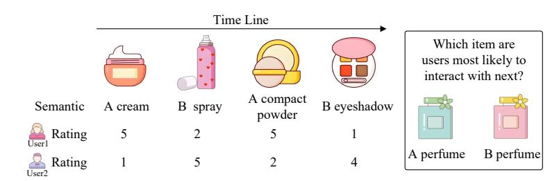
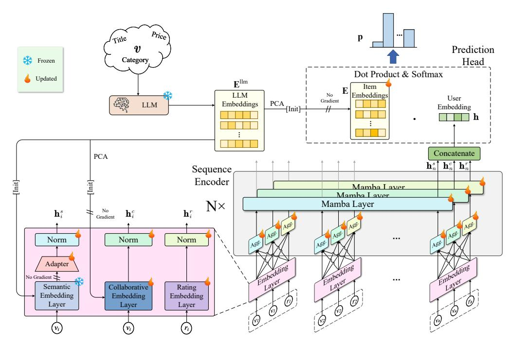
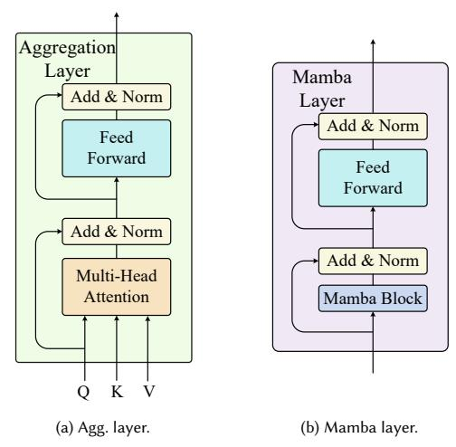
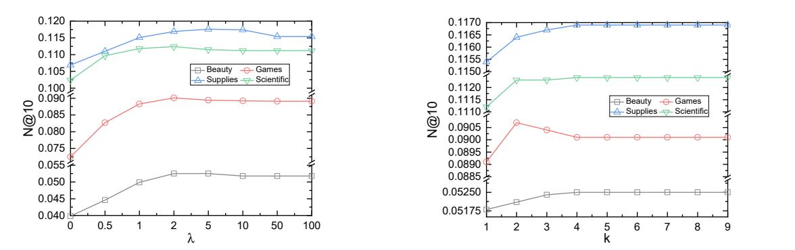
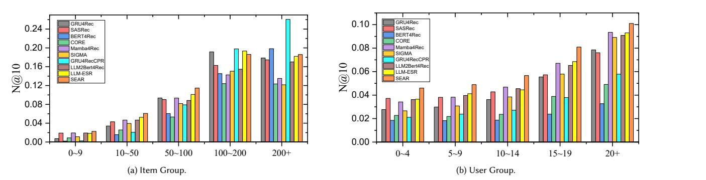

# SEAR: LLM-Powered Sequential Recommendation via Fusion of Collaborative, Semantic, and Rating Information

[Wei Guan](https://orcid.org/0000-0002-8979-6847) Shanghai Jiao Tong University Shanghai, China National University of Singapore Singapore, Singapore guan-wei@sjtu.edu.cn

[Jian Cao](https://orcid.org/0000-0002-0036-9436)∗ Shanghai Jiao Tong University Shanghai, China cao-jian@sjtu.edu.cn

[Qiqi Cai](https://orcid.org/0009-0008-9860-2259) Shanghai Jiao Tong University Shanghai, China cai\_qiqi@sjtu.edu.cn

[Jianqi Gao](https://orcid.org/0000-0002-9840-7866) Shanghai Jiao Tong University Shanghai, China 193139@sjtu.edu.cn

[Jinyu Cai](https://orcid.org/0000-0003-2241-2754) National University of Singapore Singapore, Singapore jinyucai@nus.edu.sg

[See-Kiong Ng](https://orcid.org/0000-0001-6565-7511) National University of Singapore Singapore, Singapore seekiong@nus.edu.sg

### Abstract

As users' preferences evolve over time, personalized online services increasingly rely on sequential recommender systems to predict future interactions by modeling patterns in historical user behavior. However, existing methods for sequential recommendation (SR) face two key challenges: they struggle to simultaneously leverage collaborative, semantic, and rating information, and the use of hard labels during training provides limited supervision. In this paper, we introduce SEAR, an LLM-powered Sequential recommEndation framework via fusion of collAborative, semantic, and Rating information. The proposed deep model comprises an embedding layer and a sequence encoder. The embedding layer transforms user-item interactions into three types of embeddings: collaborative, semantic, and rating. The sequence encoder then integrates these embeddings and identifies sequential patterns to model user representations. To enhance the utilization of item semantics, we integrate a large language model (LLM) to extract LLM embeddings. These embeddings are then employed to initialize the semantic embedding layer, collaborative embedding layer, and item embeddings. To capture more nuanced user behavior patterns, we generate preference-weighted soft labels based on the next �� interactions. Extensive experiments validate the effectiveness of SEAR, and ablation studies further highlight the distinct contributions of the collaborative, semantic, and rating information. The source code is publicly available at [https://github.com/guanwei49/SEAR.](https://github.com/guanwei49/SEAR)

### CCS Concepts

• Information systems → Recommender systems.

### Keywords

Sequential recommendation; Large language model; Mamba

∗Corresponding author.

[This work is licensed under a Creative Commons Attribution 4.0 International License.](https://creativecommons.org/licenses/by/4.0) WWW '26, Dubai, United Arab Emirates. © 2026 Copyright held by the owner/author(s). ACM ISBN 979-8-4007-2307-0/2026/04 <https://doi.org/10.1145/3774904.3792092>

### ACM Reference Format:

Wei Guan, Jian Cao, Qiqi Cai, Jianqi Gao, Jinyu Cai, and See-Kiong Ng. 2026. SEAR: LLM-Powered Sequential Recommendation via Fusion of Collaborative, Semantic, and Rating Information. In Proceedings of the ACM Web Conference 2026 (WWW '26), April 13–17, 2026, Dubai, United Arab Emirates. ACM, New York, NY, USA, [10](#page-9-0) pages[. https://doi.org/10.1145/3774904.3792092](https://doi.org/10.1145/3774904.3792092)

### 1 Introduction

Personalized online services increasingly depend on sequential recommender systems to capture users' evolving preferences [\[29\]](#page-8-0). These systems are designed to predict future user interactions by modeling the sequential patterns in their past behaviors [\[25\]](#page-8-1). Given the pivotal role of sequential recommendation (SR), a wide range of methods have been developed to improve its performance. Typically, three types of information can be utilized during SR: collaborative, semantic, and rating.

Most existing approaches [\[28,](#page-8-2) [50,](#page-9-1) [52\]](#page-9-2), which treat items as categorical IDs, only adopt collaborative information. Although these methods achieve acceptable performance and demonstrate the effectiveness of collaborative information, semantic and rating information are crucial for accurately capturing users' true preferences. As illustrated in Fig. [1,](#page-1-0) although 'User1' and 'User2' exhibit identical sequences of interacted items, their rating patterns differ, which suggests differing user preferences: 'User1' consistently assigns higher ratings to items with modifier 'A', whereas 'User2' assigns higher ratings to items with modifier 'B'. This disparity suggests differing user preferences, with 'User1' likely to favor items with modifier 'A' in the future, while 'User2' is more inclined to prefer those with modifier 'B'. To leverage semantic information within items, some methods [\[22,](#page-8-3) [33,](#page-8-4) [54\]](#page-9-3) treat item attributes as IDs and incorporate them into the modeling of user preferences. More recent studies [\[12,](#page-8-5) [18,](#page-8-6) [21,](#page-8-7) [26,](#page-8-8) [35,](#page-8-9) [51\]](#page-9-4) embed item attributes into prompts, utilizing either self-designed semantic extractors [\[18,](#page-8-6) [51\]](#page-9-4) or LLMs [\[12,](#page-8-5) [21,](#page-8-7) [26,](#page-8-8) [35\]](#page-8-9) to enhance SR performance. Additionally, a few methods [\[20,](#page-8-10) [23\]](#page-8-11) integrate rating information to complement collaborative signals.

However, existing methods face two key challenges. First, while three types of information are beneficial for enhancing SR, most approaches utilize only a single type, typically collaborative [\[28,](#page-8-2) [50,](#page-9-1) [52\]](#page-9-2) or semantic [\[12,](#page-8-5) [21,](#page-8-7) [42\]](#page-8-12), resulting in suboptimal performance.

Figure 1: Integrating semantic and rating information can enhance sequential recommendation.

Although some methods attempt to integrate multiple information types, they often struggle to fuse them effectively. For example, Liu et al. [\[26\]](#page-8-8) combine semantic and collaborative information using cross-attention and feed the result into a single sequence encoder. However, different types of information often have distinct patterns, so using a single encoder can result in poor user representations. In contrast, Zhang et al. [\[51\]](#page-9-4) encode semantic and collaborative information separately, without any interaction between them. Other studies [\[20,](#page-8-10) [23,](#page-8-11) [54\]](#page-9-3) primarily focus on collaborative information and merely use additional signals to guide the encoding process. Second, during training, most existing methods adopt hard labels, considering only the immediate next interacted item as the target. However, a user may also prefer items within the next �� interactions. Although Huang et al. [\[15\]](#page-8-13) propose a time-dependent soft label for SR, focusing on items from the near future, they overlook the fact that rating scores also reflect the user's degree of preference.

To tackle the aforementioned challenges, we propose SEAR, an LLM-powered Sequential recommEndation framework that fully leverages collAborative, semantic, and Rating information. SEAR utilizes an LLM to encode the semantic information of items, generating LLM embeddings. The model architecture includes an embedding layer and a sequence encoder for deriving user representations. The embedding layer encodes user-item interactions into three types of embeddings: semantic, collaborative, and rating. The semantic embedding is adapted from LLM embeddings via a trainable adapter, while the collaborative embedding is initialized using principal component analysis (PCA) [\[34\]](#page-8-14) applied to the LLM embeddings. These embeddings are then passed through the sequence encoder, which consists of a stack of �� identical layers. Each layer contains three instances of both the aggregation layer and the Mamba layer—one for each embedding type. The aggregation layer integrates cross-embedding information, while the Mamba layer captures sequential patterns within each type. The user embedding is formed by concatenating the sequence encoder's outputs corresponding to the final item in the sequence. Finally, next-item prediction is performed by computing the dot product between the user embedding and the item embeddings (also initialized via PCA on LLM embeddings). To enhance model training, we construct preference-weighted soft labels, that take into account the next �� interactions. These soft labels are designed based on the assumption that users prefer items they have rated highly and interacted with more recently. Therefore, higher probabilities are assigned to more recent items and those with higher rating scores, enabling the model to capture finer-grained insights into user behavior.

The main contributions of this work are as follows:

- We propose SEAR, a framework that fuses collaborative, semantic, and rating information to model user representations. To leverage item semantics, we incorporate an LLM.
- To enhance the training process, we construct preferenceweighted soft labels based on the next �� interactions, enabling the model to capture finer-grained insights.
- Extensive experiments demonstrate the effectiveness of SEAR. Ablation studies validate the individual contributions of collaborative, semantic, and rating embeddings.

### 2 Related Work

In this section, we explore related work in the field of sequential recommendation and the soft label for recommendation systems.

### 2.1 Sequential Recommendation

Existing SR methods can be broadly categorized into three groups: i) collaborative information-based methods, ii) semantic information-

involved methods, and iii) rating information-enhanced methods. Collaborative information-based methods, which treat items purely as categorical IDs, rely solely on collaborative information. Most approaches focus on designing effective model architectures to capture sequential dependencies. For instance, GRUs are employed in [\[40,](#page-8-15) [49,](#page-9-5) [50\]](#page-9-1). Caser [\[41\]](#page-8-16) utilizes horizontal and vertical convolutional filters to learn sequential patterns, while RCNN [\[45\]](#page-8-17) and ADNNet [\[47\]](#page-9-6) combine RNNs and CNNs for sequential feature extraction. Additionally, methods such as [\[3,](#page-8-18) [17,](#page-8-19) [27,](#page-8-20) [31,](#page-8-21) [32\]](#page-8-22) leverage GNNs to model user representations. Self-attention mechanisms are utilized in [\[16,](#page-8-23) [19,](#page-8-24) [37,](#page-8-25) [39,](#page-8-26) [44,](#page-8-27) [52\]](#page-9-2) to capture long-range dependencies, with BERT4Rec [\[39\]](#page-8-26) directly utilizing the open-source BERT [\[6\]](#page-8-28) architecture. Mamba4Rec [\[24\]](#page-8-29) and SIGMA [\[28\]](#page-8-2) explore the use of Mamba blocks [\[9\]](#page-8-30) for efficient sequential modeling. Recent advances include CORE [\[13\]](#page-8-31), which introduces a representationconsistent encoder to align user and item embeddings in the same representation space and a robust distance measuring method to prevent overfitting of embeddings in the consistent representation space, thereby enhancing item representation learning. CPR [\[2\]](#page-8-32) proposes novel softmax architectures to more effectively leverage the neural encoder's ability to learn when to copy and when to exclude items from the input sequence.

Semantic information-involved methods incorporate various item attributes, such as description text, brand, and price, to better capture user preferences. Some methods [\[7,](#page-8-33) [22,](#page-8-3) [23,](#page-8-11) [33,](#page-8-4) [54\]](#page-9-3) treat item attributes as discrete IDs. For example, TransFM [\[33\]](#page-8-4) learns an embedding and translation space for each attribute dimension, replacing the inner product with squared Euclidean distance to

measure the interaction strength between attributes. DETAIN [\[22\]](#page-8-3) proposes a 2D attention mechanism to simultaneously capture the importance of items and their attributes within sequences. �� 3 -Rec [\[54\]](#page-9-3) introduces a pre-training framework that leverages mutual information maximization to extract correlations from multiple views (e.g., item-attribute, attribute-context).

Recently, researchers have begun to incorporate item attributes into prompts to leverage items' semantic embedding. Recformer [\[18\]](#page-8-6) and FDSA [\[51\]](#page-9-4) convert item attributes into sentences, utilizing self-designed semantic extractors for representation learning. Recformer [\[18\]](#page-8-6) transforms key-value attribute pairs into descriptive sentences, processed by a transformer encoder to model user preferences, while FDSA [\[51\]](#page-9-4) extracts topical keywords from items' description text, encodes them with Word2Vec [\[30\]](#page-8-34), and employs feature- and item-based self-attention blocks to process semantic embeddings and collaborative embeddings, respectively. With the rise of LLMs, it has become feasible to exploit their deep semantic understanding [\[10,](#page-8-35) [11,](#page-8-36) [38,](#page-8-37) [48\]](#page-9-7). LLMSeqSim [\[12\]](#page-8-5) uses LLMs to create embeddings from item names, averages these to get user embeddings, and makes recommendations based on the similarity between user and item embeddings. LLM2BERT4Rec [\[12\]](#page-8-5) initializes the item embedding layer of BERT4Rec with PCA on LLM-derived item embeddings. SAID [\[14\]](#page-8-38) maps item IDs into embeddings via a projector, feeding them into the LLM to elicit textual tokens, and uses the resulting semantically enriched embeddings within sequential recommenders. LLM-ESR [\[26\]](#page-8-8) and EIMF [\[35\]](#page-8-9) integrate semantic embeddings extracted from LLMs with collaborative embeddings to enhance SR. Specifically, LLM-ESR [\[26\]](#page-8-8) introduces a dual-level fusion strategy: sequence-level fusion via cross-attention and logit-level fusion via concatenation, while EIMF [\[35\]](#page-8-9) adopts a multi-task learning framework to combine the two types of embeddings. LLMSeqPrompt [\[12\]](#page-8-5), MLLM4Rec [\[42\]](#page-8-12), and PatchRec [\[21\]](#page-8-7) directly leverage LLMs to generate recommendations by incorporating item sequences into prompts and fine-tuning the models for next-item prediction. Specifically, PatchRec [\[21\]](#page-8-7) proposes a multigranularity compression framework, which first pre-trains the LLM to understand compressed item patches and then fine-tunes it on time-aware compressed sequences.

Note that although some methods, such as LLM-ESR [\[26\]](#page-8-8) and LLM2BERT4Rec [\[12\]](#page-8-5), incorporate item ratings into prompts to obtain item embeddings—thus seemingly considering rating information—they in fact only use the item's average rating score. They do not take into account the specific ratings given by users during interactions. Therefore, we do not regard these methods as truly utilizing rating information.

Rating information-enhanced methods. Li et al. [\[20\]](#page-8-10) and Liu et al. [\[23\]](#page-8-11) take into account the rating information, they integrate rating information into self-attention calculation process, to generate better attention distribution. Nevertheless, existing methods fall short in simultaneously exploiting three types of information. In contrast, each layer of our sequence encoder contains three instances of aggregation layers and Mamba layers. The aggregation layers are designed to integrate the three types of information, while the Mamba layer captures sequential patterns within each type, resulting in a more accurate representation of user preferences.

### 2.2 Soft Label for Recommendation Systems

Recommendation systems often rely on one-hot labels [\[1,](#page-8-39) [5,](#page-8-40) [46\]](#page-9-8), which overlook the inherent uncertainty in user feedback and may hinder model generalization. To mitigate this, recent studies [\[4,](#page-8-41) [43,](#page-8-42) [55\]](#page-9-9) have explored the use of soft labels to provide more informative supervision signals. Most existing methods [\[4,](#page-8-41) [43,](#page-8-42) [53\]](#page-9-10) generate soft labels with the assistance of auxiliary models. For example, SoftRec [\[4\]](#page-8-41) and CSRec [\[43\]](#page-8-42) introduce teacher models to guide the student model during training. Specifically, SoftRec [\[4\]](#page-8-41) synthesizes soft labels from item popularity, user interests, and model predictions, while CSRec [\[43\]](#page-8-42) extends this idea by leveraging model-, data-, and training-level teacher models. MVS [\[53\]](#page-9-10) employs a complementary model to construct smoothed interaction contexts for soft label generation. However, the quality of soft labels depends on the performance of auxiliary models and introduces additional time costs. SCLRec [\[55\]](#page-9-9) utilizes entropy optimal transport to find user-item matches as soft labels for contrastive learning. FENRec [\[15\]](#page-8-13) proposes time-dependent soft labels that consider items the user will interact with soon as items of interest and assigns higher probabilities to items closer to the next interaction. However, existing methods do not incorporate rating scores, which reflect the intensity of user preferences, when constructing soft labels. We propose preference-weighted soft labels, which take into account the next �� interactions, assigning higher probabilities to more recent items and those with higher rating scores.

### 3 Methodology

The goal of sequential recommendation is to predict the next item a user is likely to interact with, based on their historical interaction records. In this section, we denote the set of users and items as U = {��1, ��2, . . . , ��|U | } and V = {��1, ��2, . . . , ��|V | }, where |U| and |V | are the total numbers of users and items, respectively. Each user �� has an interaction sequence S�� = ⟨�� 1 , ���� 2 , . . . , ���� ���� ⟩, where each interaction �� �� = (�� , ���� ) is a tuple consisting of the item �� the user interacted with and the corresponding rating score �� . Here, ���� denotes the number of interactions for user ��. For simplicity, we omit the script �� in the subsequent sections.

### 3.1 Framework Overview

The architecture of SEAR is illustrated in Fig. [2.](#page-3-0) An LLM is employed to encode the semantic information of items, resulting in LLM embeddings. These embeddings are then used to initialize the semantic embedding layer, the collaborative embedding layer, and the item embeddings. The embedding layer encodes user-item interactions into three types of embeddings: semantic, collaborative, and rating. These embeddings are then fed into the sequence encoder, which comprises a stack of �� identical layers, each of which includes three instances of both the aggregation layer and the Mamba layer—one for each type of embedding. The aggregation layer integrates information across the embedding type, while the Mamba layer captures sequential dependencies within each embedding type. The user embedding is obtained by concatenating the sequence encoder's outputs corresponding to the last item. Finally, the next-item prediction is obtained by computing the dot product between the user embedding and the item embeddings, followed by applying a softmax function.

Table 1: The statistics of datasets. 'Avg. Iter�� ' denotes the average number of iterations for each ��.

Table 2: Performance comparison of different methods on five datasets. The best results are in boldface and the second-best results are underlined. '\*' indicates the statistically significant improvements (i.e., two-sided t-test with p < 0.05) over the best baseline. 'Improv.' indicates the relative improvement against the best baseline.

| Datasets Metrics | GRU4Rec | SASRec | BERT4Rec | CORE   | Mamba4Rec | SIGMA  | CPR    | FENRec | LLM2BERT4Rec | LLM-ESR |        | SEAR Improv. |
|------------------|---------|--------|----------|--------|-----------|--------|--------|--------|--------------|---------|--------|--------------|
| H@10             | 0.0567  | 0.0733 | 0.0377   | 0.0610 | 0.0675    | 0.0602 | 0.0482 | 0.0623 | 0.0621       | 0.0813  | 0.0863 | * 6.15%      |
| N@10 Beauty      | 0.0332  | 0.0409 | 0.0193   | 0.0243 | 0.0417    | 0.0342 | 0.0255 | 0.0361 | 0.0419       | 0.0483  | 0.0525 | * 8.70%      |
| M@10             | 0.0260  | 0.0278 | 0.0137   | 0.0134 | 0.0338    | 0.0263 | 0.0187 | 0.0324 | 0.0318       | 0.0396  | 0.0423 | * 6.82%      |
| H@10             | 0.1176  | 0.1328 | 0.0979   | 0.1108 | 0.1269    | 0.1269 | 0.1024 | 0.1092 | 0.1171       | 0.1266  | 0.1335 | 0.53%        |
| N@10 Games       | 0.0787  | 0.0806 | 0.0644   | 0.0599 | 0.0850    | 0.0843 | 0.0697 | 0.0812 | 0.0793       | 0.0869  | 0.0901 | * 3.68%      |
| M@10             | 0.0669  | 0.0647 | 0.0543   | 0.0444 | 0.0723    | 0.0714 | 0.0598 | 0.0612 | 0.0668       | 0.0746  | 0.0770 | * 3.22%      |
| H@10             | 0.1373  | 0.1309 | 0.1172   | 0.1321 | 0.1368    | 0.1361 | 0.1228 | 0.1219 | 0.1256       | 0.1326  | 0.1393 | * 1.46%      |
| N@10 Supplies    | 0.1144  | 0.1053 | 0.0955   | 0.0834 | 0.1149    | 0.1146 | 0.1050 | 0.1023 | 0.1084       | 0.1096  | 0.1169 | * 1.74%      |
| M@10             | 0.1024  | 0.0974 | 0.0887   | 0.0677 | 0.1082    | 0.1080 | 0.0995 | 0.0971 | 0.1000       | 0.1035  | 0.1100 | * 1.66%      |
| H@10             | 0.1029  | 0.1415 | 0.0975   | 0.1320 | 0.1229    | 0.1226 | 0.0724 | 0.1321 | 0.1235       | 0.1373  | 0.1447 | * 2.26%      |
| N@10 Scientific  | 0.0862  | 0.0985 | 0.0677   | 0.0718 | 0.0994    | 0.0977 | 0.0600 | 0.0976 | 0.1070       | 0.0984  | 0.1124 | * 5.05%      |
| M@10             | 0.0811  | 0.0849 | 0.0583   | 0.0530 | 0.0922    | 0.0900 | 0.0562 | 0.0864 | 0.0957       | 0.0926  | 0.1025 | * 7.11%      |
| H@10             | 0.2712  | 0.2432 | 0.2725   | 0.1452 | 0.2911    | 0.3114 | 0.3134 | 0.2916 | 0.2998       | 0.3193  | 0.3338 | * 4.54%      |
| N@10 ML-1M       | 0.1531  | 0.1248 | 0.1500   | 0.0621 | 0.1656    | 0.1807 | 0.1779 | 0.1723 | 0.1688       | 0.1924  | 0.1985 | * 3.17%      |
| M@10             | 0.1171  | 0.0888 | 0.1128   | 0.0374 | 0.1273    | 0.1406 | 0.1476 | 0.1452 | 0.1351       | 0.1529  | 0.1569 | * 2.62%      |

### 4.1 Experimental Setup

Datasets. We conduct comprehensive experiments on five representative real-world datasets: four subsets of Amazon[1](#page-5-0) (Beauty, Games, Supplies and Scientific) and MovieLens-1M[2](#page-5-1) (ML-1M). Amazon is a large-scale e-commerce dataset that contains user reviews of various products. MovieLens, on the other hand, is a dataset comprising user ratings for a wide range of movies. We follow the same preprocessing procedure as described in [\[16\]](#page-8-23), discarding users and items with fewer than five interactions. The statistics of the datasets after preprocessing are summarized in Table [1.](#page-5-2) Regarding the data split, the last item ������ and the penultimate item ������ −1 in each interaction sequence are used as the test and validation sets, respectively.

Compared Methods. We compare our method with state-of-theart SR approaches, which can be broadly categorized into three groups: i) Traditional collaborative information-based methods, including GRU4Rec [\[40\]](#page-8-15), SASRec [\[16\]](#page-8-23), BERT4Rec [\[39\]](#page-8-26), CORE [\[13\]](#page-8-31), Mamba4Rec [\[24\]](#page-8-29), SIGMA [\[28\]](#page-8-2), and CPR [\[2\]](#page-8-32) with GRU4Rec as its backbone; ii) Soft label-enhanced methods, represented by FENRec [\[15\]](#page-8-13); iii) LLM-enhanced methods, including LLM2BERT4Rec [\[12\]](#page-8-5) and LLM-ESR [\[26\]](#page-8-8) with GRU4Rec as its backbone.

Implementation Details. We conduct all experiments on a server equipped with an Intel Xeon Gold 6330 CPU (38 cores), 256GB of memory, and an NVIDIA A40 GPU with 48 GB of memory. In our experiments, we employ the all-mpnet-base-v2 model[3](#page-5-3) to extract LLM embeddings. The hyperparameters �� and ��, described in Section [3.6,](#page-4-2) are set to 4 and 2, respectively. The embedding dimension ��ℎ is set to 64, and ��, which is the number of layers in the sequence encoder, is set to 2. We employ the AdamW optimizer with a mini-batch size of 2048, an initial learning rate of 1e-3, and an exponential learning rate scheduler with a decay factor of 0.96. The number of training epochs is set to 200. To prevent overfitting, we employ an early stopping strategy with a patience of 4 epochs, terminating training when no improvement in loss is observed.

Evaluation Metrics. We adopt widely used evaluation metrics, including the top-10 hit rate (H@10), top-10 normalized discounted cumulative gain (N@10), and top-10 mean reciprocal rank (M@10). All experimental results reported are the averages of five independent runs of each method.

## 4.2 Benchmarking Results (RQ1)

Table [2](#page-5-4) presents the performance comparison across five benchmark datasets. From the results, we observe that the proposed SEAR consistently outperforms all competing methods across various evaluation metrics, demonstrating the effectiveness and robustness of our approach. Although LLM2BERT4Rec and LLM-ESR also leverage LLMs to incorporate semantic information into the recommendation process, they overlook two important aspects. First, while both methods consider the item sequences with which users have interacted to infer preferences, they ignore the valuable insights contained in users' explicit ratings on interacted items. Ratings provide an additional, often more direct, signal of user preference that complements behavioral sequences. Second, both methods lack a well-designed mechanism to effectively integrate multiple types of user information (i.e., collaborative and semantic information).

1https://cseweb.ucsd.edu/~jmcauley/datasets.html#amazon\_reviews

2https://grouplens.org/datasets/movielens/

3https://huggingface.co/sentence-transformers/all-mpnet-base-v2

Table 3: Time consumption averaged over all five datasets.

Table 4: Ablation studies on three types of embeddings. The best results are in boldface. 'Drop' indicates the average performance drop compared to SEAR across five datasets. 'w/o' and 'w/' denote 'without' and 'with', respectively.

|      |    | H@10   | Beauty N@10 | H@10   | Games N@10 | H@10   | Supplies N@10 | H@10   | Scientific N@10 | H@10   | ML-1M N@10 | H@10   | Drop N@10 |
|------|----|--------|-------------|--------|------------|--------|---------------|--------|-----------------|--------|------------|--------|-----------|
| w/   | SE | 0.0600 | 0.0337      | 0.1066 | 0.0689     | 0.1267 | 0.1053        | 0.1193 | 0.0849          | 0.2975 | 0.1739     | 17.63% | 21.23%    |
| w/   | CE | 0.0734 | 0.0464      | 0.1299 | 0.0894     | 0.1356 | 0.1154        | 0.1284 | 0.1052          | 0.3227 | 0.1917     | 6.98%  | 4.70%     |
| w/   | RE | 0.0123 | 0.0062      | 0.0096 | 0.0048     | 0.0225 | 0.0157        | 0.0389 | 0.0175          | 0.0349 | 0.0173     | 85.01% | 89.03%    |
| w/o  | CE | 0.0612 | 0.0341      | 0.1065 | 0.0701     | 0.1271 | 0.1057        | 0.1201 | 0.0851          | 0.2994 | 0.1749     | 17.07% | 20.60%    |
| w/o  | SE | 0.0743 | 0.0472      | 0.1269 | 0.0879     | 0.1359 | 0.1154        | 0.1312 | 0.1077          | 0.3253 | 0.1918     | 6.63%  | 4.28%     |
| w/o  | RE | 0.0853 | 0.0519      | 0.1294 | 0.0883     | 0.1376 | 0.1141        | 0.1413 | 0.1104          | 0.3312 | 0.1958     | 1.72%  | 1.74%     |
| SEAR |    | 0.0863 | 0.0525      | 0.1335 | 0.0901     | 0.1393 | 0.1169        | 0.1447 | 0.1124          | 0.3338 | 0.1985     |        |           |

Table 5: Ablation studies on PCA. The best results are in boldface.

In contrast, traditional collaborative SR methods and soft label enhanced SR methods that treat items merely as categorical IDs tend to underperform. This is mainly because they rely solely on the statistical co-occurrence patterns within the dataset, failing to exploit the rich semantic information embedded in the items. Semantic information is often more generalizable and enables the model to better understand and capture user preferences. Moreover, these methods typically ignore the valuable insights provided by users' explicit ratings.

Efficiency Comparison. We evaluate the efficiency of SEAR by comparing its training and testing time with that of other baseline methods. The results, summarized in Table [3,](#page-6-0) yield several key insights. First, BERT-based methods such as BERT4Rec and LLM2Bert4Rec typically incur the highest time consumption, primarily due to the computational complexity of the BERT architecture. Compared to other Mamba-based methods such as Mamba4Rec and SIGMA, SEAR achieves superior performance but incurs a higher computational cost. This is due to its integration of three types of information, resulting in a more complex model architecture, whereas Mamba4Rec and SIGMA rely solely on collaborative signals. Notably, for LLM-involved methods such as LLM2Bert4Rec, LLM-ESR, and SEAR, the LLM is only used to generate item embeddings prior to training. During training and inference, the LLM is not involved, so the overall time cost does not increase significantly. By comparison, SEAR achieves the best performance while maintaining acceptable training and testing time.

### 4.3 Ablation Studies

Ablation Studies on Three Types of Embeddings (RQ2). We investigate how each type of embedding affects SEAR's performance, with the results presented in Table [4.](#page-6-1) Removing semantic

embeddings (SE) is equivalent to excluding the LLM component from our deep model, thereby discarding rich semantic information derived from item attributes. As expected, removing any type of embedding leads to a performance drop. Relying solely on rating embeddings (RE) results in unacceptable performance. These findings highlight the distinct roles of the three types of embeddings and emphasize the importance of their combination. Collaborative embeddings (CE), derived from historical interactions, capture implicit user preferences and behavioral patterns, while semantic embeddings provide external knowledge that helps disambiguate item meaning and improve generalization, especially for long-tail or cold-start items. Rating embeddings act as a complementary component, helping refine the model's understanding of user preferences by explicitly modeling users' sentiment or satisfaction levels with respect to items.

Ablation Studies on PCA-based initialization (RQ3). The item embeddings and collaborative embedding layers are initialized by reducing LLM embeddings using PCA. We investigate the effectiveness of this PCA-based initialization strategy, with the results presented in Table [5.](#page-6-2) The results show that initializing either the item embeddings (IE) or the collaborative embedding (CE) layer using PCA leads to improved performance. Furthermore, initializing both of them with PCA yields the best overall performance. This is due to the fact that the semantic knowledge encoded in LLM embeddings, when appropriately compressed, provides a strong prior for user-item interaction modeling.

### 4.4 Hyperparameter Analysis (RQ4)

We present the performance trends corresponding to variations in the hyperparameters �� and �� in Fig. [4.](#page-7-0) �� controls the distribution of

Figure 4: Effect of hyperparameters �� and �� across four datasets.

Figure 5: Performance of methods on sub-test sets of the Beauty dataset, categorized by distinct user and item groups.

preference-weighted soft labels: a higher �� results in lower probabilities for items further away in the sequence. As �� increases from 0 to 100, the N@10 score first increases and then decreases. This trend occurs because a lower value of �� encourages the model to focus more on distant future items, which may not align with the user's current preferences, while a higher value of �� shifts the focus toward the immediate next item. �� determines the number of future interactions considered when constructing the preference-weighted soft label. Setting �� = 1 corresponds to training with hard labels and can be regarded as an ablation study of our soft label approach. As expected, training with preference-weighted soft labels outperforms training with hard labels, demonstrating the effectiveness of our soft label approach. Increasing �� initially improves the N@10 score, indicating enhanced model performance. However, for the Games dataset, the N@10 score decreases when �� exceeds 2. This may be due to the intrinsic characteristics of the dataset—items beyond the second future interaction may not accurately reflect the user's current preferences. Across all datasets, when �� is larger than 5, the N@10 stabilizes. This is likely because, with �� set to 2 and without considering the rating score, the probabilities assigned to items beyond the fifth position are negligible, contributing little to the training process.

### 4.5 Group Analysis (RQ5)

For a more detailed analysis, we divided the Beauty dataset's test set into five subsets. For item grouping, we categorized items based on their frequency of appearance in the training dataset and split the test dataset according to the target item. For user grouping, we divided the test dataset based on the number of interactions within each user's interaction sequence. The results are presented in Fig. [5.](#page-7-1) Regarding item groups, SEAR achieves better and more balanced performance across different groups, and notably avoids a strong bias toward recommending popular items (i.e., 200+ item group). Furthermore, in user groups, SEAR consistently achieves the best performance across all groups. This indicates that even for users with few interactions, SEAR can effectively capture their preferences and recommend items of genuine interest.

### 5 Conclusion

In this paper, we propose SEAR, a novel framework that integrates collaborative, semantic, and rating information to enhance SR. The proposed deep model consists of an embedding layer and a sequence encoder. The embedding layer maps user-item interactions into collaborative, semantic, and rating embeddings. The sequence encoder then fuses these three types of embeddings and captures sequential patterns to model user representations. To better utilize item semantics, we incorporate an LLM. To enable the model to learn more fine-grained user behavior patterns, we construct a preference-weighted soft label based on the next �� interactions. Extensive experiments demonstrate the effectiveness of SEAR.

### Acknowledgments

This work is supported by the Interdisciplinary Program of Shanghai Jiao Tong University (Project number YG2024QNB05)

References [1] Keqin Bao, Jizhi Zhang, Wenjie Wang, Yang Zhang, Zhengyi Yang, Yanchen Luo, Chong Chen, Fuli Feng, and Qi Tian. 2025. A bi-step grounding paradigm for large language models in recommendation systems. ACM Transactions on Recommender Systems 3, 4 (2025), 1–27. [2] Haw-Shiuan Chang, Nikhil Agarwal, and Andrew McCallum. 2024. To copy, or not to copy; that is a critical issue of the output softmax layer in neural sequential recommenders. In Proceedings of the 17th ACM International Conference on Web Search and Data Mining. 67–76. [3] Jianxin Chang, Chen Gao, Yu Zheng, Yiqun Hui, Yanan Niu, Yang Song, Depeng Jin, and Yong Li. 2021. Sequential recommendation with graph neural networks. In Proceedings of the 44th international ACM SIGIR conference on research and development in information retrieval. 378–387. [4] Mingyue Cheng, Fajie Yuan, Qi Liu, Shenyang Ge, Zhi Li, Runlong Yu, Defu Lian, Senchao Yuan, and Enhong Chen. 2021. Learning recommender systems with implicit feedback via soft target enhancement. In Proceedings of the 44th International ACM SIGIR Conference on Research and Development in Information Retrieval. 575–584. [5] Yashar Deldjoo and Tommaso Di Noia. 2025. Cfairllm: Consumer fairness evaluation in large-language model recommender system. ACM Transactions on Intelligent Systems and Technology 16, 6 (2025), 1–31. [6] Jacob Devlin, Ming-Wei Chang, Kenton Lee, and Kristina Toutanova. 2019. Bert: Pre-training of deep bidirectional transformers for language understanding. In Proceedings of the 2019 conference of the North American chapter of the association for computational linguistics: human language technologies, volume 1 (long and short papers). 4171–4186. [7] Yongrui Duan, Peng Liu, and Yusheng Lu. 2023. MhSa-GRU: combining user's dynamic preferences and items' correlation to augment sequence recommendation. Journal of Intelligent Information Systems 61, 1 (2023), 225–248. [8] Abhimanyu Dubey, Abhinav Jauhri, Abhinav Pandey, Abhishek Kadian, Ahmad Al-Dahle, Aiesha Letman, Akhil Mathur, Alan Schelten, Amy Yang, Angela Fan, et al. 2024. The llama 3 herd of models. arXiv preprint arXiv:2407.21783 (2024). [9] Albert Gu and Tri Dao. 2023. Mamba: Linear-time sequence modeling with selective state spaces. arXiv preprint arXiv:2312.00752 (2023). [10] Wei Guan, Jian Cao, Jianqi Gao, Haiyan Zhao, and Shiyou Qian. 2025. Dabl: Detecting semantic anomalies in business processes using large language models. In Proceedings of the AAAI Conference on Artificial Intelligence, Vol. 39. 11735– 11744. [11] Wei Guan, Jian Cao, Shiyou Qian, Jianqi Gao, and Chun Ouyang. 2024. Logllm: Log-based anomaly detection using large language models. arXiv preprint arXiv:2411.08561 (2024). [12] Jesse Harte, Wouter Zorgdrager, Panos Louridas, Asterios Katsifodimos, Dietmar Jannach, and Marios Fragkoulis. 2023. Leveraging large language models for sequential recommendation. In Proceedings of the 17th ACM Conference on Recommender Systems. 1096–1102. [13] Yupeng Hou, Binbin Hu, Zhiqiang Zhang, and Wayne Xin Zhao. 2022. Core: simple and effective session-based recommendation within consistent representation space. In Proceedings of the 45th international ACM SIGIR conference on research and development in information retrieval. 1796–1801. [14] Jun Hu, Wenwen Xia, Xiaolu Zhang, Chilin Fu, Weichang Wu, Zhaoxin Huan, Ang Li, Zuoli Tang, and Jun Zhou. 2024. Enhancing sequential recommendation via llm-based semantic embedding learning. In Companion Proceedings of the ACM Web Conference 2024. 103–111. [15] Yu-Hsuan Huang, Ling Lo, Hongxia Xie, Hong-Han Shuai, and Wen-Huang Cheng. 2025. Future Sight and Tough Fights: Revolutionizing Sequential Recommendation with FENRec. In Proceedings of the AAAI Conference on Artificial Intelligence, Vol. 39. 11826–11834. [16] Wang-Cheng Kang and Julian McAuley. 2018. Self-attentive sequential recommendation. In 2018 IEEE international conference on data mining (ICDM). IEEE, 197–206. [17] Chhotelal Kumar, Md Abuzar, and Mukesh Kumar. 2023. Mgu-gnn: Minimal gated unit based graph neural network for session-based recommendation. Applied Intelligence 53, 20 (2023), 23147–23165. [18] Jiacheng Li, Ming Wang, Jin Li, Jinmiao Fu, Xin Shen, Jingbo Shang, and Julian McAuley. 2023. Text is all you need: Learning language representations for sequential recommendation. In Proceedings of the 29th ACM SIGKDD Conference on Knowledge Discovery and Data Mining. 1258–1267. [19] Wuchao Li, Rui Huang, Haijun Zhao, Chi Liu, Kai Zheng, Qi Liu, Na Mou, Guorui Zhou, Defu Lian, Yang Song, et al. 2025. DimeRec: A Unified Framework for Enhanced Sequential Recommendation via Generative Diffusion Models. In Proceedings of the Eighteenth ACM International Conference on Web Search and Data Mining. 726–734. [20] Yang Li, Qianmu Li, Shunmei Meng, and Jun Hou. 2021. Transformer-based ratingaware sequential recommendation. In International Conference on Algorithms and Architectures for Parallel Processing. Springer, 759–774. [21] Jiayi Liao, Ruobing Xie, Sihang Li, Xiang Wang, Xingwu Sun, Zhanhui Kang, and Xiangnan He. 2025. PatchRec: Multi-Grained Patching for Efficient LLM-based Sequential Recommendation. arXiv preprint arXiv:2501.15087 (2025). [22] Kun Lin, Zhenlei Wang, Shiqi Shen, Zhipeng Wang, Bo Chen, and Xu Chen. 2022. Sequential recommendation with decomposed item feature routing. In Proceedings of the ACM Web Conference 2022. 2288–2297. [23] Chang Liu, Xiaoguang Li, Guohao Cai, Zhenhua Dong, Hong Zhu, and Lifeng Shang. 2021. Noninvasive self-attention for side information fusion in sequential recommendation. In Proceedings of the AAAI conference on artificial intelligence, Vol. 35. 4249–4256. [24] Chengkai Liu, Jianghao Lin, Jianling Wang, Hanzhou Liu, and James Caverlee. 2024. Mamba4rec: Towards efficient sequential recommendation with selective state space models. arXiv preprint arXiv:2403.03900 (2024). [25] Qiang Liu, Shu Wu, Diyi Wang, Zhaokang Li, and Liang Wang. 2016. Contextaware sequential recommendation. In 2016 IEEE 16th International Conference on Data Mining (ICDM). IEEE, 1053–1058. [26] Qidong Liu, Xian Wu, Yejing Wang, Zijian Zhang, Feng Tian, Yefeng Zheng, and Xiangyu Zhao. 2024. Llm-esr: Large language models enhancement for longtailed sequential recommendation. Advances in Neural Information Processing Systems 37 (2024), 26701–26727. [27] Yuxi Liu, Lianghao Xia, and Chao Huang. 2024. Selfgnn: Self-supervised graph neural networks for sequential recommendation. In Proceedings of the 47th International ACM SIGIR Conference on Research and Development in Information Retrieval. 1609–1618. [28] Ziwei Liu, Qidong Liu, Yejing Wang, Wanyu Wang, Pengyue Jia, Maolin Wang, Zitao Liu, Yi Chang, and Xiangyu Zhao. 2025. SIGMA: Selective Gated Mamba for Sequential Recommendation. In Proceedings of the AAAI Conference on Artificial Intelligence, Vol. 39. 12264–12272. [29] Jie Lu, Dianshuang Wu, Mingsong Mao, Wei Wang, and Guangquan Zhang. 2015. Recommender system application developments: a survey. Decision support systems 74 (2015), 12–32. [30] Tomas Mikolov, Ilya Sutskever, Kai Chen, Greg S Corrado, and Jeff Dean. 2013. Distributed representations of words and phrases and their compositionality. Advances in neural information processing systems 26 (2013), 3111–3119. [31] Zhonghong Ou, Xiao Zhang, Yifan Zhu, Shuai Lyu, Jiahao Liu, and Tu Ao. 2025. LS-TGNN: Long and Short-Term Temporal Graph Neural Network for Session-Based Recommendation. In Proceedings of the AAAI Conference on Artificial Intelligence, Vol. 39. 12426–12434. [32] Deepanshu Pandey, Arindam Sarkar, and Prakash Mandayam Comar. 2024. GLAD: Graph-based long-term attentive dynamic memory for sequential recommendation. In European Conference on Information Retrieval. Springer, 72–88. [33] Rajiv Pasricha and Julian McAuley. 2018. Translation-based factorization machines for sequential recommendation. In Proceedings of the 12th ACM Conference on Recommender Systems. 63–71. [34] Karl Pearson. 1901. LIII. On lines and planes of closest fit to systems of points in space. The London, Edinburgh, and Dublin philosophical magazine and journal of science 2, 11 (1901), 559–572. [35] Shutong Qiao, Chen Gao, Yong Li, and Hongzhi Yin. 2024. LLM-assisted Explicit and Implicit Multi-interest Learning Framework for Sequential Recommendation. arXiv preprint arXiv:2411.09410 (2024). [36] Nils Reimers and Iryna Gurevych. 2019. Sentence-bert: Sentence embeddings using siamese bert-networks. arXiv preprint arXiv:1908.10084 (2019). [37] Yehjin Shin, Jeongwhan Choi, Hyowon Wi, and Noseong Park. 2024. An attentive inductive bias for sequential recommendation beyond the self-attention. In Proceedings of the AAAI Conference on Artificial Intelligence, Vol. 38. 8984–8992. [38] Yongchao Song, Junhao Zhang, Zhaowei Liu, Yang Xu, Siwen Quan, Lijun Sun, Jiping Bi, and Xuan Wang. 2025. Deep learning for hyperspectral image classification: A comprehensive review and future predictions. Information Fusion 123 (2025), 103285. [39] Fei Sun, Jun Liu, Jian Wu, Changhua Pei, Xiao Lin, Wenwu Ou, and Peng Jiang. 2019. BERT4Rec: Sequential recommendation with bidirectional encoder representations from transformer. In Proceedings of the 28th ACM international conference on information and knowledge management. 1441–1450. [40] Yong Kiam Tan, Xinxing Xu, and Yong Liu. 2016. Improved recurrent neural networks for session-based recommendations. In Proceedings of the 1st workshop on deep learning for recommender systems. 17–22. [41] Jiaxi Tang and Ke Wang. 2018. Personalized top-n sequential recommendation via convolutional sequence embedding. In Proceedings of the eleventh ACM international conference on web search and data mining. 565–573. [42] Yuxiang Wang, Xin Shi, and Xueqing Zhao. 2025. MLLM4Rec: multimodal information enhancing LLM for sequential recommendation. Journal of Intelligent Information Systems 63 (2025), 745–761. [43] Shiguang Wu, Xin Xin, Pengjie Ren, Zhumin Chen, Jun Ma, Maarten de Rijke, and Zhaochun Ren. 2024. Learning Robust Sequential Recommenders through Confident Soft Labels. ACM Transactions on Information Systems 43, 1 (2024), 1–27. [44] Chengfeng Xu, Jian Feng, Pengpeng Zhao, Fuzhen Zhuang, Deqing Wang, Yanchi Liu, and Victor S Sheng. 2021. Long-and short-term self-attention network for sequential recommendation. Neurocomputing 423 (2021), 580–589. [45] Chengfeng Xu, Pengpeng Zhao, Yanchi Liu, Jiajie Xu, Victor S Sheng S. Sheng, Zhiming Cui, Xiaofang Zhou, and Hui Xiong. 2019. Recurrent convolutional

neural network for sequential recommendation. In The world wide web conference. 3398–3404. [46] Xiaochuan Xu, Zeqiu Xu, Peiyang Yu, and Jiani Wang. 2025. Enhancing user intent for recommendation systems via large language models. arXiv preprint arXiv:2501.10871 (2025). [47] Cairong Yan, Yiwei Wang, Yanting Zhang, Zijian Wang, and Pengwei Wang. 2021. Modeling long-and short-term user behaviors for sequential recommendation with deep neural networks. In 2021 International Joint Conference on Neural Networks (IJCNN). IEEE, 1–8. [48] Yifan Yao, Jinhao Duan, Kaidi Xu, Yuanfang Cai, Zhibo Sun, and Yue Zhang. 2024. A survey on large language model (llm) security and privacy: The good, the bad, and the ugly. High-Confidence Computing 4, 2 (2024), 100211. [49] Xiaoxin Ye, Yun Li, and Lina Yao. 2023. Dream: Decoupled representation via extraction attention module and supervised contrastive learning for cross-domain sequential recommender. In Proceedings of the 17th ACM Conference on Recommender Systems. 479–490. [50] Sheng Zhang, Maolin Wang, Wanyu Wang, Jingtong Gao, Xiangyu Zhao, Yu Yang, Xuetao Wei, Zitao Liu, and Tong Xu. 2024. Glint-ru: Gated lightweight intelligent recurrent units for sequential recommender systems. arXiv preprint arXiv:2406.10244 (2024). [51] Tingting Zhang, Pengpeng Zhao, Yanchi Liu, Victor S Sheng, Jiajie Xu, Deqing Wang, Guanfeng Liu, Xiaofang Zhou, et al. 2019. Feature-level deeper selfattention network for sequential recommendation.. In IJCAI. 4320–4326. [52] Xiaoyao Zheng, Xingwang Li, Zhenghua Chen, Liping Sun, Qingying Yu, Liangmin Guo, and Yonglong Luo. 2024. Enhanced self-attention mechanism for long and short term sequential recommendation models. IEEE Transactions on Emerging Topics in Computational Intelligence 8, 3 (2024), 2457–2466. [53] Kun Zhou, Hui Wang, Ji-rong Wen, and Wayne Xin Zhao. 2023. Enhancing multiview smoothness for sequential recommendation models. ACM Transactions on Information Systems 41, 4 (2023), 1–27. [54] Kun Zhou, Hui Wang, Wayne Xin Zhao, Yutao Zhu, Sirui Wang, Fuzheng Zhang, Zhongyuan Wang, and Ji-Rong Wen. 2020. S3-rec: Self-supervised learning for sequential recommendation with mutual information maximization. In Proceedings of the 29th ACM international conference on information & knowledge management. 1893–1902. [55] Zhen-Hua Zhuang and Lijun Zhang. 2024. Soft Contrastive Learning for Implicit Feedback Recommendations. In Pacific-Asia Conference on Knowledge Discovery and Data Mining. Springer, 219–230.