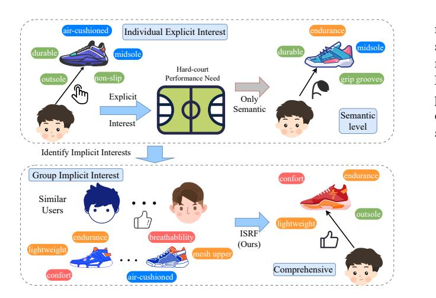
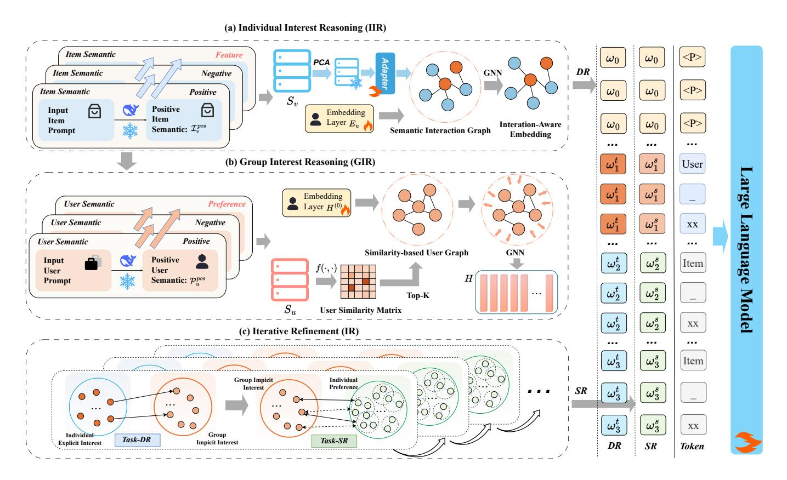
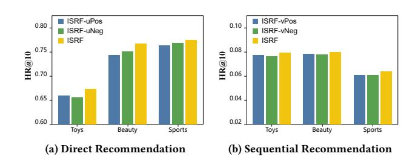
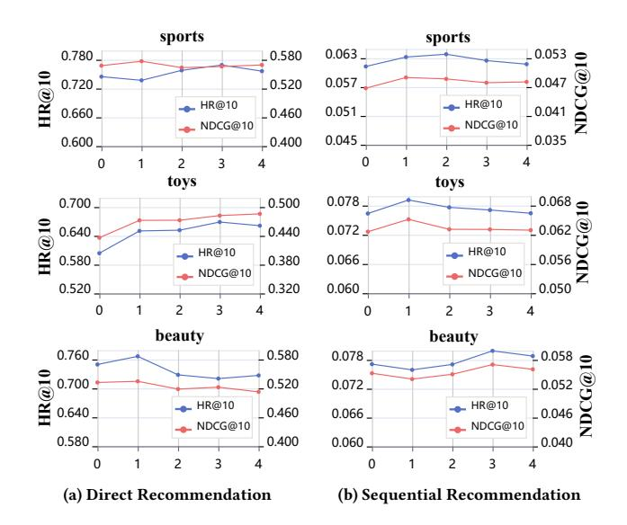
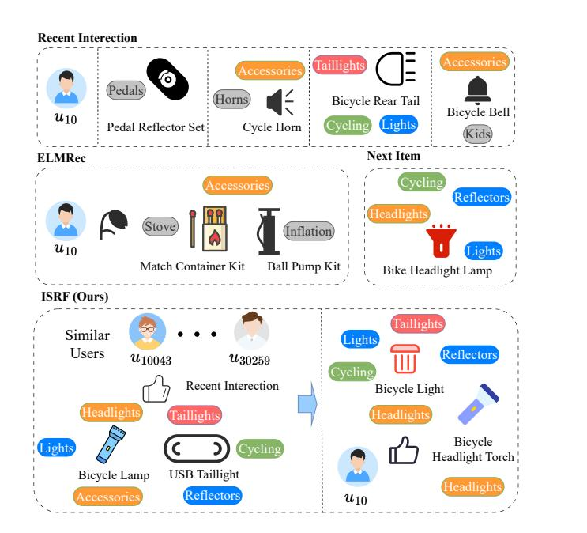
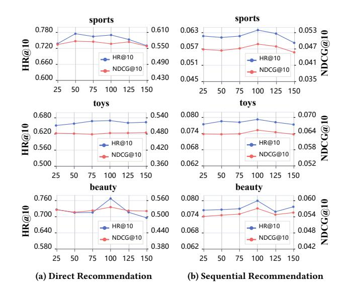

# Iterative Semantic Reasoning from Individual to Group Interests for Generative Recommendation with LLMs

Xiaofei Zhu Chongqing University of Technology College of Computer Science and Engineering Chongqing, China zxf@cqut.edu.cn

Jinfei Chen Chongqing University of Technology College of Computer Science and Engineering Chongqing, China htired@stu.cqut.edu.cn

Feiyang Yuan Chongqing University of Technology College of Computer Science and Engineering Chongqing, China pipi77@stu.cqut.edu.cn

Zhou Yang∗ Chongqing Normal University College of Computer and Information Science Chongqing, China yangzhou@cqnu.edu.cn

### Abstract

Recommendation systems aim to learn user interests from historical behaviors and deliver relevant items. Recent methods leverage large language models (LLMs) to construct and integrate semantic representations of users and items for capturing user interests. However, user behavior theories suggest that truly understanding user interests requires not only semantic integration but also semantic reasoning from explicit individual interests to implicit group interests. To this end, we propose an Iterative Semantic Reasoning Framework (ISRF) for generative recommendation. ISRF leverages LLMs to bridge explicit individual interests and implicit group interests in three steps. First, we perform multi-step bidirectional reasoning over item attributes to infer semantic item features and build a semantic interaction graph capturing users' explicit interests. Second, we generate semantic user features based on the semantic item features and construct a similarity-based user graph to infer the implicit interests of similar user groups. Third, we adopt an iterative batch optimization strategy, where individual explicit interests directly guide the refinement of group implicit interests, while group implicit interests indirectly enhance individual modeling. This iterative process ensures consistent and progressive interest reasoning, enabling more accurate and comprehensive user interest learning. Extensive experiments on the Sports, Beauty, and Toys datasets demonstrate that ISRF outperforms state-of-the-art baselines. The code is available at https://github.com/htired/ISRF.

### CCS Concepts

• Information systems → Recommender systems.

#### Keywords

Semantic Reasoning, User Interests, LLMs, Generative Recommendation

#### ACM Reference Format:

Xiaofei Zhu, Jinfei Chen, Feiyang Yuan, and Zhou Yang. 2026. Iterative Semantic Reasoning from Individual to Group Interests for Generative Recommendation with LLMs. In Proceedings of the ACM Web Conference

∗Zhou Yang is the Corresponding Author.

© 2026 Copyright held by the owner/author(s). ACM ISBN 979-8-4007-2307-0/2026/04 <https://doi.org/10.1145/3774904.3792123>

2026 (WWW '26), April 13–17, 2026, Dubai, United Arab Emirates. ACM, New York, NY, USA, [11](#page-10-0) pages.<https://doi.org/10.1145/3774904.3792123>

#### 1 Introduction

Recommendation systems [\[4,](#page-8-0) [16,](#page-8-1) [24,](#page-8-2) [35\]](#page-8-3) aim to learn user interests from historical behaviors and recommend the relevant next item. Early studies [\[7,](#page-8-4) [29,](#page-8-5) [34\]](#page-8-6) focus on learning sequences of clicked item IDs to capture user interests. Relying solely on item IDs while ignoring item semantics limits their ability to accurately understand user interests [\[19,](#page-8-7) [23\]](#page-8-8).

Recent studies incorporate semantic features by leveraging side information (such as brand and price) to better understand user interests. One line of research [\[9,](#page-8-9) [26,](#page-8-10) [39,](#page-8-11) [40\]](#page-8-12) designs specialized components within small-scale models to integrate semantic features. MoRec [\[39\]](#page-8-11) employs a pre-trained encoder to convert raw item features into embeddings, mitigating the semantic degradation caused by relying solely on ID information. LSMRec [\[40\]](#page-8-12) uses locality-sensitive hashing to map enhanced item semantic vectors into recommendation representations, enabling semantic integration. CaFe [\[9\]](#page-8-9) employs a coarse-to-fine self-attention framework to fuse user intent with side information. ESIF [\[26\]](#page-8-10) introduces attention and gated fusion mechanisms to jointly update item and side information representations, combined with a denoising module to enhance the utilization of semantic information. Despite achieving promising results, the limited parameters and knowledge of small-scale models constrain their semantic representation ability [\[10,](#page-8-13) [36\]](#page-8-14).

To address this issue, another line of research [\[10,](#page-8-13) [13,](#page-8-15) [32,](#page-8-16) [33,](#page-8-17) [36\]](#page-8-14) introduces large language models (LLMs) with strong representation capabilities. These methods employ LLMs to encode user and item semantics and combine them with ID features to represent user interests. LLMEmb [\[13\]](#page-8-15) fine-tunes LLMs to generate enriched item semantic representations for capturing user interests. SLMRec [\[36\]](#page-8-14) distills knowledge from LLM into smaller one, significantly reducing model size while preserving recommendation performance. POD [\[10\]](#page-8-13) builds upon P5 [\[4\]](#page-8-0) by distilling discrete prompts into continuous prompt vectors, thereby enhancing both the expressiveness and efficiency of prompt representations. ELMRec [\[32\]](#page-8-16) incorporates whole-word embeddings and random feature propagation to enhance semantic representations of users and items, enabling a more precise characterization of user–item interactions and more accurate interest learning. These methods leverage the strong semantic representation capabilities of LLMs to effectively

[This work is licensed under a Creative Commons Attribution 4.0 International License.](https://creativecommons.org/licenses/by/4.0) WWW '26, Dubai, United Arab Emirates.

Figure 1: An illustrative comparison between semantic integration approach and our proposed ISRF (Semantic Reasoning).

construct and integrate semantic information, achieving promising results.

According to user behavior theories [\[5,](#page-8-18) [20,](#page-8-19) [25\]](#page-8-20), relying solely on semantic representations is often insufficient to reveal users' true interests, as uncovering deeper preferences typically requires stepwise reasoning grounded in semantic understanding. As shown in Figure [1,](#page-1-0) when a user clicks on a pair of basketball shoes with features such as an air-cushioned midsole and a durable, non-slip outsole, their explicit interest can be inferred as a need for highimpact performance on hard courts. However, this alone may not reveal the user's deeper interests. Among users with similar behavior, many prioritize breathability and lightweight design during extended games or training sessions to maintain comfort and endurance. By identifying such group-level implicit interests, the model can recommend more suitable items with greater precision. This step-wise reasoning process infers explicit interests from item attributes and then uncovers implicit needs through similar user groups, leading to a more comprehensive understanding of user interests. Nevertheless, effectively simulating this reasoning process to progressively uncover user interests remains a significant challenge.

To address this issue, we propose an Iterative Semantic Reasoning Framework (ISRF) for generative recommendation. ISRF leverages LLMs to bridge explicit individual interests and implicit group interests through three coordinated modules: (i) Individual Interest Reasoning Module. We perform multi-step bidirectional reasoning over item attributes to infer semantic item features and build a semantic interaction graph that captures users' explicit interests. (ii) Group Interest Reasoning Module. We generate semantic user features from these item features and construct a similarity-based user graph to infer the implicit interests of similar user groups. (iii) Iterative Refinement Module. We adopt an iterative batch optimization strategy in which individual explicit interests directly guide the refinement of group implicit interests, and the refined group interests in turn enhance individual preference

modeling. This three-stage process ensures consistent, progressive semantic reasoning from explicit to implicit interests, yielding more accurate and comprehensive user-interest representations. Extensive results demonstrate that our approach significantly outperforms state-of-the-art baselines. Further analysis shows that each module contributes to stable interest reasoning, leading to the strong overall performance of the proposed framework.

Overall, our main contributions are summarized as follows:

- (1) We introduce a novel semantic reasoning perspective for generative recommendation by inferring explicit individual and implicit group interests, effectively enhancing recommendation performance.
- (2) The proposed method performs semantic reasoning from explicit individual interests to implicit group interests and progressively optimizes the reasoning process through an iterative refinement module.
- (3) Extensive experiments demonstrate that our model consistently outperforms existing SOTA methods.

#### 2 RELATED WORK

### 2.1 Recommendation with Side Information

Early recommendation methods [\[7,](#page-8-4) [17,](#page-8-21) [29,](#page-8-5) [34\]](#page-8-6) primarily rely on user and item IDs to capture user interests, making it difficult to capture rich semantic information. To address this limitation, researchers have explored side information fusion strategies by incorporating auxiliary attributes such as item titles and categories to enhance recommendation performance. MoRec [\[39\]](#page-8-11) leverages modality encoders to replace traditional item embeddings. CaFe [\[9\]](#page-8-9) jointly models user intents and item features via coarse-to-fine self-attention. GCORec [\[30\]](#page-8-22) integrates short- and long-term user preferences using various attention mechanisms. LSMRec [\[40\]](#page-8-12) employs hash-enhanced mapping to improve the effectiveness of pretrained semantic representations. And ESIF [\[26\]](#page-8-10) optimizes attention fusion and denoising strategies to better utilize side information and improve accuracy. However, due to the limitations of smallscale models in semantic modeling and parameter capacity, these methods still struggle to capture complex user interest patterns effectively.

### 2.2 LLMs for Recommendation

In recent years, large language models (LLMs) have shown great potential in recommender systems (RSs) [\[1,](#page-8-23) [11,](#page-8-24) [23,](#page-8-8) [28,](#page-8-25) [31](#page-8-26)[–33\]](#page-8-17). A major research direction focuses on enhancing RSs with LLM-generated semantic embeddings [\[13,](#page-8-15) [14,](#page-8-27) [19,](#page-8-7) [23,](#page-8-8) [37\]](#page-8-28). For example, RLMRec [\[23\]](#page-8-8) aligns LLM and recommendation models via auxiliary loss, and LLM-ESR [\[14\]](#page-8-27) combines dual-view modeling with self-distillation to improve performance. Recently, generative recommendation has gained attention [\[4,](#page-8-0) [10,](#page-8-13) [32,](#page-8-16) [33\]](#page-8-17), where LLMs directly generate personalized recommendations. POD [\[10\]](#page-8-13) distills discrete prompts into continuous vectors for better prompt representation. RDRec [\[33\]](#page-8-17) distills LLM-generated rationales and integrates user-item reviews to enhance reasoning. ELMRec [\[32\]](#page-8-16) enhances LLM reasoning via random feature propagation and re-ranking. However, these methods primarily focus on shallow semantic modeling and struggle to capture the deep representation and reasoning of user interests. In

Figure 2: The overall architecture of our proposed Iterative Semantic Reasoning Framework (ISRF), which includes: (a) Individual Interest Reasoning; (b) Group Interest Reasoning; (c) Iterative Refinement.

contrast, ISRF introduces a novel semantic reasoning perspective and an iterative refinement mechanism to progressively unify user interests.

#### 3 Problem Definitions

Following prior research [\[32\]](#page-8-16), ISRF focuses on two core recommendation tasks: Sequential Recommendation and Direct Recommendation. We denote the user and item sets as U and V, respectively, where �� ∈ U refers to a user and �� ∈ V denotes an item.

- Sequential Recommendation: Given a user �� and their historical interaction sequence V�� = {��1, ��2, · · · , ���� }, the goal is to predict the next item ����+1 that the user is likely to interact with.
- Direct Recommendation: A candidate set is formed by randomly sampling a positive item �� + ∈ V�� and several negative items �� − ∈ V \ V��. The LLM is required to identify the positive item from the candidate set based on user preferences.

To handle both tasks within a unified framework, we define the input and output token sequences as �� = [��1, . . . , ��|�� |] and �� = [��1, . . . ��|�� |], respectively. Each input token ���� is associated with an index ���� , forming the index sequence �� = [��1, . . . , ��|�� |]. Let P = [p1, . . . , p|P|] denotes the learnable prompt embeddings, and X = [x1, . . . , x|X|] the embedded input tokens. We concatenate input embeddings with prompts to form the final token input: X�� = [x1, . . . , x|X| , p1, . . . , p|P|]. The final input fed into the LLM is computed as: X˜ = X�� + ��X�� (��), where �� is a scaling factor that controls the contribution of the X�� (��), and X�� is defined as:

X�� = ( [��0, ���� 1 , . . . , ���� |V |+1 ] if task is SR, [��0, ���� 1 , . . . , ���� |U |+|V |] if task is DR, (1)

where ��0 is a shared embedding for non-ID tokens (e.g., prompts), ���� denotes the whole-word embedding of user or item.

#### 4 METHODOLOGY

In this section, we introduce the overall architecture of the proposed ISRF framework, as illustrated in Figure [2.](#page-2-0) ISRF comprises three key components: (a) Individual Interest Reasoning, which models item semantics through multi-step bidirectional reasoning and captures explicit user interests via a graph neural network (GNN); (b) Group Interest Reasoning, which constructs user semantic preferences based on LLM-enhanced item representations and captures grouplevel implicit interests using a user semantic graph; (c) Iterative Refinement, which employs an iterative batch optimization strategy to unify explicit and implicit interests, thereby enhancing the modeling of individual preferences.

normalize the connections between nodes, and H (0) denotes the initial user representations obtained by random initialization.

#### 4.3 Iterative Refinement (IR)

Although the IIR and GIR stages capture user interests from different perspectives, modeling them independently may result in inconsistent representations and limit their potential complementarity. To address this issue, we introduce an iterative refinement mechanism that facilitates coordinated integration between the two stages. Specifically, in the direct-to-sequential representation alignment phase, the individual explicit interest representation e˜�� (Section [4.1\)](#page-3-0) is employed as a supervision signal to guide the optimization of the group implicit interest representation h�� (Section [4.2\)](#page-3-1). Conversely, in the sequential alignment phase, h�� is leveraged to enhance the modeling of individual preference e �� �� by maximizing the mutual information between them. This iterative refinement process progressively aligns explicit and implicit interest representations, thereby improving both the consistency and generalizability of user modeling.

4.3.1 Direct-to-Sequential Representation Alignment. In direct recommendation task, we utilize h�� as the teacher mediator to guide the optimization of the sequence-based student mediator e˜��, thereby enhancing explicit user interest modeling. To achieve effective alignment, we employ a contrastive distillation loss function that preserves user discriminability while enhancing representation consistency, defined as:

L��→�� = − 1 ∑︁ ��∈�� log ���� (sg[h��], e˜��) Í ′ ∈�� ���� (sg[h�� ′ ], e˜�� ′ ) , (8)

where ���� (·, ·) = exp(sim(·, ·)/��) denotes the temperature-scaled cosine similarity.

4.3.2 Sequential Representation Alignment. We maximize the mutual information between the h�� and the user preference e �� �� to enhance the expressiveness of e �� �� in interest modeling. To this end, we introduce a contrastive loss to align the embedding spaces of h �� and e �� , thereby achieving more consistent and discriminative semantic representations. The objective function is defined as follows:

L�� = − 1 �� ∑︁ ��∈�� log ���� (h��, e��) Í ′ ∈�� ���� (h��, e�� ′ ) , (9)

where e�� denotes the interest representation of user ��, obtained by averaging the full-word embeddings of items in their interaction sequence: e�� = V�� ÍV�� ��=1 �� �� �� .

#### 4.4 Optimization and Inference

In this section, we elaborate on the training and optimization procedures of the ISRF. The corresponding algorithm is presented in Appendix [A.2.](#page-9-0)

4.4.1 Optimization. To optimize the training process, we adopt a joint loss function that combines the text generation loss and the alignment loss. The overall loss function is defined as:

L = ( L������ + L��→�� if task is DR , L������ + L�� if task is SR, (10)

where Lgen denotes the text generation loss, defined as follows:

Lgen = 1 |��| ∑︁ (��,�� ) ∈�� 1 |�� | ∑︁ |�� | ��=1 − log ��(���� |��<�� , ��), (11)

where �� represents the training dataset containing all input-output pairs, |��| is the total number of samples. These two components work together to jointly optimize the model parameters.

4.4.2 Inference. Following the approach of ELMRec [\[32\]](#page-8-16), during inference, we employ a beam search algorithm to generate results by selecting the word with the highest likelihood from the vocabulary. This ensures efficient and accurate prediction while maintaining consistency with the training objectives.

#### 5 EXPERIMENT

To comprehensively evaluate the effectiveness of the proposed ISRF, we investigate the following six key research questions:

- RQ1: How does ISRF perform compared to existing state-of-theart baselines across different recommendation tasks?
- RQ2: What is the impact of individual module designs in ISRF on recommendation performance for distinct tasks?
- RQ3: How do different types of semantic information influence recommendation effectiveness?
- RQ4: How do key hyperparameters affect the recommendation performance of ISRF?
- RQ5: How efficient is ISRF in terms of computational complexity?
- RQ6: Does ISRF demonstrate the capability to identify users' implicit interests?

#### 5.1 Experiment Settings

5.1.1 Datasets. In our experiments, we evaluate the proposed method on three widely-used benchmark datasets: Sports & Outdoors, Beauty, and Toys & Games[1](#page-4-0) . We adopt the same preprocessing and data splitting protocols as in previous studies [\[32,](#page-8-16) [42\]](#page-8-34). Further details of the datasets are provided in Appendix [A.3.](#page-9-1)

5.1.2 Baselines. To evaluate the effectiveness of the proposed ISRF in both direct and sequential recommendation tasks, we compare it with 14 mainstream baselines across four categories.

#### (1) Traditional Recommendation Methods:

- SimpleX [\[17\]](#page-8-21) enhances representation learning through cosine contrastive loss with large negative sampling.
- Caser [\[29\]](#page-8-5) embeds user sequences as pseudo-images and extracts sequential patterns via convolutional operations.
- GRU4Rec [\[7\]](#page-8-4) replaces traditional item-to-item recommendation by modeling full session sequences.
- HGN [\[15\]](#page-8-35) captures users' long- and short-term interests through feature- and instance-level gating mechanisms.

#### (2) Attention-Based Methods:

- SASRec [\[8\]](#page-8-36) models user behavior sequences using self-attention mechanisms.
- BERT4Rec [\[27\]](#page-8-37) constructs sequence representations via bidirectional self-attention and masked prediction.
- FDSA [\[41\]](#page-8-38) jointly models item-level and feature-level sequential patterns to improve recommendation performance.

1<https://www.amazon.com>

| Models Metrics | H@5    | N@5    | Sports H@10 | N@10   | H@5    | N@5    | Beauty H@10 | N@10   | H@5    | N@5    | Toys H@10 | N@10   |
|----------------|--------|--------|-------------|--------|--------|--------|-------------|--------|--------|--------|-----------|--------|
| Caser          | 0.0116 | 0.0072 | 0.0194      | 0.0097 | 0.0131 | 0.0087 | 0.0176      | 0.0101 | 0.0166 | 0.0107 | 0.0270    | 0.0141 |
| GRU4Rec        | 0.0129 | 0.0086 | 0.0204      | 0.0099 | 0.0200 | 0.0283 | 0.0137      | 0.0200 | 0.0099 | 0.0059 | 0.0176    | 0.0084 |
| HGN            | 0.0189 | 0.0120 | 0.0313      | 0.0163 | 0.0512 | 0.0266 | 0.0263      | 0.0455 | 0.0201 | 0.0141 | 0.0170    | 0.0300 |
| SASRec         | 0.0233 | 0.0154 | 0.0350      | 0.0192 | 0.0500 | 0.0347 | 0.0170      | 0.0650 | 0.0463 | 0.0306 | 0.0675    | 0.0374 |
| BERT4Rec       | 0.0115 | 0.0075 | 0.0191      | 0.0099 | 0.0203 | 0.0124 | 0.0347      | 0.0170 | 0.0116 | 0.0071 | 0.0203    | 0.0099 |
| FDSA           | 0.0182 | 0.0122 | 0.0288      | 0.0156 | 0.0267 | 0.0163 | 0.0407      | 0.0208 | 0.0228 | 0.0140 | 0.0381    | 0.0189 |
| P5             | 0.0387 | 0.0312 | 0.0460      | 0.0336 | 0.0508 | 0.0379 | 0.0644      | 0.0429 | 0.0648 | 0.0567 | 0.0709    | 0.0587 |
| RSL            | 0.0392 | 0.0330 | 0.0512      | 0.0375 | 0.0508 | 0.0381 | 0.0667      | 0.0446 | 0.0676 | 0.0583 | 0.0712    | 0.0596 |
| POD            | 0.0497 | 0.0399 | 0.0585      | 0.0422 | 0.0559 | 0.0420 | 0.0696      | 0.0471 | 0.0692 | 0.0589 | 0.0744    | 0.0601 |
| ELMRec         | 0.0538 | 0.0453 | 0.0616      | 0.0471 | 0.0609 | 0.0486 | 0.0750      | 0.0529 | 0.0713 | 0.0608 | 0.0764    | 0.0618 |
| Ours           | 0.0564 | 0.0468 | 0.0648      | 0.0493 | 0.0658 | 0.0526 | 0.0800      | 0.0571 | 0.0741 | 0.0641 | 0.0792    | 0.0652 |
| Improvement.   | 4.88%  |        |             |        |        |        |             |        |        |        |           |        |

Table 1: Performance comparison on the sequential recommendation task, where "\*" indicates that the improvement is statistically significant (��-value &lt; 0.05) under a 5-trial ��-test.

| Models Metrics | H@5    | N@5    | Sports H@10 | N@10   | H@5    | N@5    | Beauty H@10 | N@10   | H@5    | N@5    | Toys H@10 | N@10   |
|----------------|--------|--------|-------------|--------|--------|--------|-------------|--------|--------|--------|-----------|--------|
| SampleX        | 0.2362 | 0.1505 | 0.3290      | 0.1800 | 0.2247 | 0.1441 | 0.3090      | 0.1711 | 0.1958 | 0.1244 | 0.2662    | 0.1469 |
| LightGCN       | 0.4150 | 0.3002 | 0.5436      | 0.3418 | 0.4205 | 0.3067 | 0.5383      | 0.3451 | 0.3879 | 0.2874 | 0.5106    | 0.3272 |
| NCL            | 0.4292 | 0.3131 | 0.5592      | 0.3551 | 0.4378 | 0.3228 | 0.5542      | 0.3607 | 0.3975 | 0.2925 | 0.5120    | 0.3325 |
| XSimGCL        | 0.3547 | 0.2689 | 0.4486      | 0.2992 | 0.3530 | 0.2734 | 0.4392      | 0.3012 | 0.3351 | 0.2614 | 0.4186    | 0.2885 |
| P5             | 0.1955 | 0.1355 | 0.2802      | 0.1627 | 0.1564 | 0.1096 | 0.2300      | 0.1332 | 0.1322 | 0.0889 | 0.2023    | 0.1114 |
| RSL            | 0.2092 | 0.1502 | 0.3001      | 0.1703 | 0.1564 | 0.1096 | 0.2300      | 0.1332 | 0.1423 | 0.0825 | 0.1926    | 0.1028 |
| POD            | 0.2105 | 0.1539 | 0.2889      | 0.1782 | 0.1931 | 0.1404 | 0.2677      | 0.1639 | 0.1461 | 0.1029 | 0.2119    | 0.1244 |
| ELMRec         | 0.5782 | 0.4792 | 0.6479      | 0.4852 | 0.6052 | 0.4852 | 0.6794      | 0.4973 | 0.5178 | 0.4051 | 0.6045    | 0.4141 |
| Ours           | 0.6766 | 0.5535 | 0.7697      | 0.5666 | 0.6773 | 0.5217 | 0.7673      | 0.5352 | 0.5893 | 0.4737 | 0.6733    | 0.4857 |
| Improvement.   | 23.08% |        |             |        |        |        |             |        |        |        |           |        |

Table 2: Performance comparison on direct recommendation task.

#### (3) GNN-Based Methods:

- LightGCN [\[6\]](#page-8-33) streamlines the traditional GCN architecture by removing redundant components, thereby tailoring it specifically for recommendation tasks.
- NCL [\[12\]](#page-8-39) constructs contrastive pairs between users (or items) and their respective structural neighbors to improve the quality of learned embeddings through contrastive learning.
- XSimGCL [\[38\]](#page-8-40) improves the robustness of user and item representations by generating contrastive views via perturbation with uniform noise.

#### (4) LLM-Based Methods:

- P5 [\[4\]](#page-8-0) proposes a unified text-to-text paradigm that formulates diverse recommendation tasks as language modeling problems, enabling multi-task generalization and zero-shot prediction through pretraining and personalized prompts.
- RSL [\[3\]](#page-8-41) integrates LLM reasoning with recommendation knowledge for personalized suggestions.
- POD [\[10\]](#page-8-13) enhances recommendation efficiency by distilling discrete prompts into continuous vectors through cyclic training.

- ELMRec [\[32\]](#page-8-16) enhances LLMs' recommendation capability by introducing random feature propagation and re-ranking mechanisms.

5.1.3 Implementation and Metrics. For semantic reasoning and embedding extraction in user–item interactions, we adopt DeepSeek-R1-14B[2](#page-5-0) as the backbone large language model to perform multistep semantic reasoning, and employ EasyRec[3](#page-5-1) [\[22\]](#page-8-31) as the semantic embedding extraction module, denoted as Temb. Following existing works [\[32\]](#page-8-16), for direct recommendation, the number of negative items is set to 99 for both training and evaluation. The batch size is set to 64 for training all three tasks. We apply early stopping with a patience of 5 epochs. P5, POD, ELMRec, and ISRF adopt T5 small [\[21\]](#page-8-42) as their backbone large language model. We evaluate all methods using Top-�� Hit Rate (H@��) and Normalized Discounted Cumulative Gain (NDCG@��), where �� ∈ {5, 10}. All experiments are implemented using the PyTorch framework and conducted on a single NVIDIA GeForce RTX 4090 GPU with 24 GB of VRAM.

2<https://ollama.com/library/deepseek-r1:14b>

3<https://huggingface.co/hkuds/easyrec-roberta-large>

Table 3: Ablation studies on Direct Recommendation and Sequential Recommendation tasks across different components of ISRF, evaluated using Hit Rate@10 (H@10) and NDCG@10 (N@10).

Figure 3: The performance of ISRF and its semantic variants.

#### 5.2 Overall Performance (RQ1)

To validate the effectiveness of the proposed ISRF model, we report its performance on sequential and direct recommendation tasks in Tables [1](#page-5-2) and [2.](#page-5-3)

- Sequential recommendation: ISRF also consistently surpasses all baselines on all datasets, with improvements of 3.71% to 10.37% over ELMRec. These gains can be attributed to the group interest reasoning module for modeling implicit user interests, as well as the Iterative Refinement mechanism, which effectively optimizes user representations across different granularities.
- Direct recommendation: ISRF consistently outperforms all baselines across the three datasets. Compared to the strongest baseline, ELMRec, it achieves performance gains ranging from 7.52% to 24.57%, primarily due to the individual interest reasoning module's ability to capture item semantics and fine-grained explicit interests. Moreover, ISRF shows stronger performance on direct recommendation tasks, likely because they rely more heavily on understanding unseen items, highlighting the importance of semantic modeling.

Overall, ISRF demonstrates strong generalization and significant performance gains in both sequential and direct recommendation tasks by jointly modeling explicit and implicit interests with iterative refinement.

Figure 4: The hyper-parameter study focuses on the �� ′ .

#### 5.3 Ablation study (RQ2)

To further validate the effectiveness of key components in ISRF, we conduct ablation studies on two recommendation tasks, with results shown in Table [3.](#page-6-0) We compare the following variants:

- ��/�� L��→�� : Removes the contrastive distillation loss L��→�� used to optimize the sequence-based user representation ��˜�� in the direct recommendation task, where temporal preference modeling relies solely on implicit group interests.
- ��/�� L�� : Removes the contrastive loss, relying solely on user and sequential item ID information for optimization.
- ��/�� I���� : Replaces the enhanced item semantic representation I���� with randomly initialized embeddings for the item embedding layer.
- ��/�� ��������������: Removes the trainable adapter module, directly using the frozen semantic embeddings S˜ �� .

In the sequential recommendation, removing L��→�� leads to a notable performance drop, highlighting the importance of explicit interests in guiding group implicit interests learning. Removing L�� also degrades performance, as the LLM then relies only on user and item IDs without semantic enhancement. For direct recommendation, incorporating item semantics I���� improves item understanding, while removing the trainable adapter significantly weakens performance, underscoring its role in aligning semantic and recommendation spaces.

### 5.4 Impact of Semantic Variants (RQ3)

To investigate the impact of different semantic components on performance across tasks, we design several semantic variants of the ISRF inference process:

- ISRF-uPos: Uses only the user's positive semantic reasoning result P ������ ���� as the final user preference.
- ISRF-uNeg: Replaces the final user representation with the negatively inferred user semantics P ������ ���� .

| Datsets | Models | Train Time   | GPU   | Memory | Infer  | DR Infer SR |
|---------|--------|--------------|-------|--------|--------|-------------|
| Sports  | ELMRec | 10m10s/epoch | 23.58 | GB     | 24m07s | 13m30s      |
|         | ISRF   | 15m01s/epoch | 24.19 | GB     | 20m23s | 13m42s      |
| Beauty  | ELMRec | 6m13s/epoch  | 21.93 | GB     | 12m44s | 8m19s       |
|         | ISRF   | 8m04s/epoch  | 22.12 | GB     | 12m34s | 8m22s       |
| Toys    | ELMRec | 5m07s/epoch  | 21.15 | GB     | 9m59s  | 7m29s       |
|         | ISRF   | 5m42s/epoch  | 21.78 | GB     | 9m52s  | 7m23s       |

Table 4: Computational Cost Comparison. Infer DR and Infer SR denote the inference time of Direct Recommendation and Sequential Recommendation, respectively.

- ISRF-vPos: Adopts the positively inferred item semantics I ������ as the item feature.
- ISRF-vNeg: Utilizes the negatively inferred item semantics I ������ to represent the item.

The experimental results are illustrated in Figure [3.](#page-6-1) In both direct recommendation and sequential recommendation tasks, the full model ISRF consistently outperforms all semantic variants, validating the importance of integrating multi-perspective semantic reasoning encompassing both positive and negative views. Furthermore, we observe that the negative semantic variants (ISRFuNeg and ISRF-vNeg) exhibit similar performance to the positive ones (ISRF-uPos and ISRF-vPos), suggesting that both positive and negative semantic perspectives make comparable contributions to modeling user interests and act as effective semantic complements.

#### 5.5 Hyperparameter Sensitivity (RQ4)

We systematically evaluate the impact of the number of LightGCN layers �� ′ in ISRF. As shown in Figure [4,](#page-6-2) increasing �� ′ initially improves performance on both sequential and direct recommendation tasks, but the performance plateaus or slightly declines beyond a certain point. This suggests that while a moderate propagation depth helps capture implicit user interests, excessive layers may lead to over-smoothing or noise accumulation. The analysis of the number of top-�� similar users �� is deferred to Appendix [A.4.](#page-10-1)

#### 5.6 Computational Complexity Analysis (RQ5)

The computational complexity of ISRF mainly stems from the Transformer (��2 ) and LightGCN (�� 2 ), where �� denotes the average number of input tokens and �� represents the total number of user and items. Since �� ≪ ��, the overall computational complexity of ISRF is dominated by ��(�� 2 ), which is identical to that of ELMRec. As shown in Table [4,](#page-7-0) we further report the empirical runtime analysis. ISRF consumes computational resources comparable to ELMRec while achieving better performance.

### 5.7 Case Study (RQ6)

To further verify ISRF's ability to capture group implicit interests, we present a case study of ��10 in Figure [5.](#page-7-1) While ELMRec mainly recommends items related to the Accessories category (e.g., Match Container Kit, Ball Pump Kit), ISRF identifies the user's interest in categories like Cycling, Lights, and Headlights. By leveraging

Figure 5: Case study on identifying users' implicit interests.

the behaviors of semantically similar users (e.g., ��10043 and ��30259), who interacted with items in Taillights, Cycling, and Headlights, ISRF infers the user's implicit Interest for Headlights. As a result, it recommends more relevant items such as Bicycle Light and Bicycle Headlight Torch, demonstrating its advantage in modeling grouplevel semantic preferences.

#### 6 Conclusion

In this paper, we have proposed an Iterative Interest Reasoning Framework (ISRF) for recommendation, which leverages LLMs to perform semantic reasoning from individual explicit interests to group implicit interests by three coordinated modules. First, the individual interest reasoning module infers semantic item features and builds a semantic interaction graph to learn individual explicit interests. Second, the group interest reasoning module constructs a similarity-based user graph to capture the implicit interests of similar user groups. Third, the iterative refinement module alternately optimizes both interests to ensure consistent and progressive reasoning. Extensive experiments on three real-world datasets demonstrate that ISRF consistently outperforms state-of-the-art baselines. In future work, we will further enhance the reasoning capabilities of LLMs by incorporating diverse reasoning strategies.

### Acknowledgments

This work was supported by the National Natural Science Foundation of China (62472059), the Chongqing Talent Plan Project, China (CSTC2024YCJH-BGZXM0022), the Science and Technology Innovation Key R&D Program of Chongqing (CSTB2024TIAD-STX0027), the Open Research Fund of Key Laboratory of Cyberspace Big Data Intelligent Security (Chongqing University of Posts and Telecommunications), Ministry of Education (CBDIS202403).

References [1] Keqin Bao, Jizhi Zhang, Xinyu Lin, Yang Zhang, Wenjie Wang, and Fuli Feng. 2024. Large language models for recommendation: Past, present, and future. In SIGIR. 2993–2996. [2] Zheng Chu, Jingchang Chen, Qianglong Chen, Weijiang Yu, Tao He, Haotian Wang, Weihua Peng, Ming Liu, Bing Qin, and Ting Liu. 2023. Navigate through enigmatic labyrinth a survey of chain of thought reasoning: Advances, frontiers and future. arXiv preprint arXiv:2309.15402 (2023). [3] Zhixuan Chu, Hongyan Hao, Xin Ouyang, Simeng Wang, Yan Wang, Yue Shen, Jinjie Gu, Qing Cui, Longfei Li, Siqiao Xue, et al. 2023. Leveraging large language models for pre-trained recommender systems. arXiv preprint arXiv:2308.10837 (2023). [4] Shijie Geng, Shuchang Liu, Zuohui Fu, Yingqiang Ge, and Yongfeng Zhang. 2022. Recommendation as language processing (rlp): A unified pretrain, personalized prompt & predict paradigm (p5). In RecSys. 299–315. [5] Jonathan Gutman. 1982. A means-end chain model based on consumer categorization processes. Journal of marketing (1982), 60–72. [6] Xiangnan He, Kuan Deng, Xiang Wang, Yan Li, Yongdong Zhang, and Meng Wang. 2020. Lightgcn: Simplifying and powering graph convolution network for recommendation. In SIGIR. 639–648. [7] Balázs Hidasi, Alexandros Karatzoglou, Linas Baltrunas, and Domonkos Tikk. 2015. Session-based recommendations with recurrent neural networks. arXiv preprint arXiv:1511.06939 (2015). [8] Wang-Cheng Kang and Julian McAuley. 2018. Self-attentive sequential recommendation. In ICDM. 197–206. [9] Jiacheng Li, Tong Zhao, Jin Li, Jim Chan, Christos Faloutsos, George Karypis, Soo-Min Pantel, and Julian McAuley. 2022. Coarse-to-fine sparse sequential recommendation. In SIGIR. 2082–2086. [10] Lei Li, Yongfeng Zhang, and Li Chen. 2023. Prompt distillation for efficient llm-based recommendation. In CIKM. 1348–1357. [11] Jianghao Lin, Xinyi Dai, Yunjia Xi, Weiwen Liu, Bo Chen, Hao Zhang, Yong Liu, Chuhan Wu, Xiangyang Li, Chenxu Zhu, et al. 2025. How can recommender systems benefit from large language models: A survey. ACM Transactions on Information Systems (2025), 1–47. [12] Zihan Lin, Changxin Tian, Yupeng Hou, and Wayne Xin Zhao. 2022. Improving graph collaborative filtering with neighborhood-enriched contrastive learning. In WWW. 2320–2329. [13] Qidong Liu, Xian Wu, Wanyu Wang, Yejing Wang, Yuanshao Zhu, Xiangyu Zhao, Feng Tian, and Yefeng Zheng. 2025. LLMEmb: Large Language Model Can Be a Good Embedding Generator for Sequential Recommendation. In AAAI. 12183–12191. [14] Qidong Liu, Xian Wu, Yejing Wang, Zijian Zhang, Feng Tian, Yefeng Zheng, and Xiangyu Zhao. 2024. LLM-ESR: Large Language Models Enhancement for Long-tailed Sequential Recommendation. In NIPS. [15] Chen Ma, Peng Kang, and Xue Liu. 2019. Hierarchical gating networks for sequential recommendation. In SIGKDD. 825–833. [16] Qiyao Ma, Xubin Ren, and Chao Huang. 2024. XRec: Large Language Models for Explainable Recommendation. In EMNLP. 391–402. [17] Kelong Mao, Jieming Zhu, Jinpeng Wang, Quanyu Dai, Zhenhua Dong, Xi Xiao, and Xiuqiang He. 2021. SimpleX: A simple and strong baseline for collaborative filtering. In CIKM. 1243–1252. [18] Karl Pearson. 1901. LIII. On lines and planes of closest fit to systems of points in space. The London, Edinburgh, and Dublin philosophical magazine and journal of science (1901), 559–572. [19] Yingtao Peng, Chen Gao, Yu Zhang, Tangpeng Dan, Xiaoyi Du, Hengliang Luo, Yong Li, and Xiaofeng Meng. 2025. Denoising alignment with large language model for recommendation. ACM Transactions on Information Systems 43 (2025), 1–35. [20] J Paul Peter and Jerry C Olson. 2010. Consumer behavior & marketing strategy. McGraw-hill. [21] Colin Raffel, Noam Shazeer, Adam Roberts, Katherine Lee, Sharan Narang, Michael Matena, Yanqi Zhou, Wei Li, and Peter J Liu. 2020. Exploring the limits of transfer learning with a unified text-to-text transformer. Journal of machine learning research (2020), 1–67. [22] Xubin Ren and Chao Huang. 2024. EasyRec: Simple yet effective language models for recommendation. arXiv preprint arXiv:2408.08821 (2024). [23] Xubin Ren, Wei Wei, Lianghao Xia, Lixin Su, Suqi Cheng, Junfeng Wang, Dawei Yin, and Chao Huang. 2024. Representation learning with large language models for recommendation. In WWW. 3464–3475. [24] Steffen Rendle, Christoph Freudenthaler, and Lars Schmidt-Thieme. 2010. Factorizing personalized markov chains for next-basket recommendation. In WWW. 811–820. [25] Thomas J Reynolds and Jonathan Gutman. 2001. Laddering theory, method, analysis, and interpretation. In Understanding consumer decision making. Psychology Press, 40–79. [26] Zheng-Ang Su, Juan Zhang, Zhijun Fang, and Yongbin Gao. 2025. Enhanced side information fusion framework for sequential recommendation. International Journal of Machine Learning and Cybernetics (2025), 1157–1173. [27] Fei Sun, Jun Liu, Jian Wu, Changhua Pei, Xiao Lin, Wenwu Ou, and Peng Jiang. 2019. BERT4Rec: Sequential recommendation with bidirectional encoder representations from transformer. In CIKM. 1441–1450. [28] Fei Tang, Yongliang Shen, Hang Zhang, Zeqi Tan, Wenqi Zhang, Zhibiao Huang, Kaitao Song, Weiming Lu, and Yueting Zhuang. 2024. GaVaMoE: Gaussian-Variational Gated Mixture of Experts for Explainable Recommendation. arXiv preprint arXiv:2410.11841 (2024). [29] Jiaxi Tang and Ke Wang. 2018. Personalized top-n sequential recommendation via convolutional sequence embedding. In WSDM. 565–573. [30] Hadise Vaghari, Mehdi Hosseinzadeh Aghdam, and Hojjat Emami. 2025. Group attention for collaborative filtering with sequential feedback and context aware attributes. Scientific Reports (2025), 10050. [31] Qi Wang, Jindong Li, Shiqi Wang, Qianli Xing, Runliang Niu, He Kong, Rui Li, Guodong Long, Yi Chang, and Chengqi Zhang. 2024. Towards nextgeneration llm-based recommender systems: A survey and beyond. arXiv preprint arXiv:2410.19744 (2024). [32] Xinfeng Wang, Jin Cui, Fumiyo Fukumoto, and Yoshimi Suzuki. 2024. Enhancing High-order Interaction Awareness in LLM-based Recommender Model. In EMNLP. [33] Xinfeng Wang, Jin Cui, Yoshimi Suzuki, and Fumiyo Fukumoto. 2024. RDRec: Rationale Distillation for LLM-based Recommendation. In ACL (Volume 2: Short Papers). 65–74. [34] Xiang Wang, Xiangnan He, Meng Wang, Fuli Feng, and Tat-Seng Chua. 2019. Neural graph collaborative filtering. In SIGIR. 165–174. [35] Lianghao Xia, Chao Huang, Chunzhen Huang, Kangyi Lin, Tao Yu, and Ben Kao. 2023. Automated self-supervised learning for recommendation. In WWW. 992–1002. [36] Wujiang Xu, Qitian Wu, Zujie Liang, Jiaojiao Han, Xuying Ning, Yunxiao Shi, Wenfang Lin, and Yongfeng Zhang. 2025. SLMRec: Distilling Large Language Models into Small for Sequential Recommendation. In ICLR. [37] Xihong Yang, Heming Jing, Zixing Zhang, Jindong Wang, Huakang Niu, Shuaiqiang Wang, Yu Lu, Junfeng Wang, Dawei Yin, Xinwang Liu, et al. 2024. Darec: A disentangled alignment framework for large language model and recommender system. arXiv preprint arXiv:2408.08231 (2024). [38] Junliang Yu, Xin Xia, Tong Chen, Lizhen Cui, Nguyen Quoc Viet Hung, and Hongzhi Yin. 2023. XSimGCL: Towards extremely simple graph contrastive learning for recommendation. IEEE Transactions on Knowledge and Data Engineering (2023), 913–926. [39] Zheng Yuan, Fajie Yuan, Yu Song, Youhua Li, Junchen Fu, Fei Yang, Yunzhu Pan, and Yongxin Ni. 2023. Where to go next for recommender systems? id-vs. modality-based recommender models revisited. In SIGIR. 2639–2649. [40] Haoyu Zhang and Wenfang Li. 2024. LSMRec: Leveraging Hash-Enhanced Semantic Mapping for Superior Sequential Recommendations. In ICTAI. 166–173. [41] Tingting Zhang, Pengpeng Zhao, Yanchi Liu, Victor S Sheng, Jiajie Xu, Deqing Wang, Guanfeng Liu, Xiaofang Zhou, et al. 2019. Feature-level deeper selfattention network for sequential recommendation.. In IJCAI. 4320–4326. [42] Xin Zhou. 2023. Mmrec: Simplifying multimodal recommendation. In MMAsia. 1–2. A SUPPLEMENTARY MATERIAL In the supplementary materials, we provide a detailed description of the ISRF algorithmic process and the construction of prompts for both items and users. In addition, we include detailed dataset statistics and additional hyperparameter analyses. A.1 Prompt Construction In this section, we present concrete examples of prompt construction for the Sports dataset. We employ a chain-of-thought strategy to guide the large language model through multi-step reasoning Dataset Toys Beauty Sports #Users 19,412 22,363 35,598 #Items 11,924 12,101 18,357 #Reviews 167,597 198,502 296,337 #Density (%) 0.0724 0.0734 0.0453 Table 5: Statistics of the experimental datasets.

| Dataset  | Toys       | Beauty  | Sports  |
|----------|------------|---------|---------|
| #Users   | 19,412     | 22,363  | 35,598  |
| #Items   | 11,924     | 12,101  | 18,357  |
| #Reviews | 167,597    | 198,502 | 296,337 |
| #Density | (%) 0.0724 | 0.0734  | 0.0453  |

#### *Instruction*

*Positive*: Based on the provided [ATTRIBUTES], assist me in summarizing which types of users might enjoy a specific sports product

[POSITIVE]: Users who enjoy staying hydrated and adding flavor to their *Negtive*: Based on the provided [ATTRIBUTES], [POSITIVE], assist me in and semantic embeddings for users and items are obtained from the pre-trained LLM (lines 1–3). During optimization, the user relation matrix is constructed, item embeddings are reduced via PCA and frozen, and user representations are initialized (lines 4–6). Then, LightGCN is applied iteratively until convergence (lines 7–8). For direct recommendation, item embeddings are mapped into the recommendation space and optimized with user embeddings using contrastive distillation (lines 9–12), while for sequential recommendation, a contrastive loss is adopted (lines 13–14). In both tasks, the generation loss and total loss are computed to update parameters (lines 16–17). Finally, during inference, the trained embeddings and parameters are loaded, and the final recommendation list is generated using beam search (lines 19).

water would appreciate this infusion...

#### [NEGATIVE]: Users who prefer durable, stainless steel or glass bottles A.3 Dataset Details

might dislike this product due to its plastic construction....

*Response*

[FEATURE]: Portable and convenient for sports activities.

[ATTRIBUTES]: <Title>, <Discription> <Brand>, <Categories>...

#### *Information*

*Feature*: Based on the provided [ATTRIBUTES], [POSITIVE], [NEGATIVE], assist me in identifying the possible features of a specific sports product.

summarizing which types of users might dislike a specific sports product

Figure 6: Item Semantic reasoning (Sports)

#### *Instruction*

[POSITIVE\_USER] : The user prefers durable, practical outdoor and

watersport gear for activities like camping...

[NEGATIVE\_USER]: The user is likely to dislike sports such as team

sports and high-intensity fitness activities...

#### *Response* ]

[PREFERENCE]: The user is likely to enjoy a variety of sports

products geared towards outdoor activities...

[HISTORY]: [

Item\_2: [ATTRIBUTES], [FEATURE], Item\_3: [ATTRIBUTES], [FEATURE],...

*Information*

*Feature*: Based on the provided

[HISTORY], [POSITIVE\_USER], [NEGATIVE\_USER], you will help

identify the core interests and preferences of the user.

*Negtive*: Based on the provided

[HISTORY], [POSITIVE\_USER], you will help identify the types of

sports the user is likely to dislike.

*Positive*: Based on the provided

[HISTORY], you will help identify which types of sports a specific user

is likely to enjoy.

Figure 7: User Semantic reasoning (Sports)

for both items and users, enabling the extraction of comprehensive item features and user preferences, as illustrated in Figure [6](#page-9-2) and Figure [7.](#page-9-3)

## A.2 Algorithm for ISRF

In this section, we present the algorithmic description of ISRF, as shown in Algorithm [1.](#page-9-4) First, the LLM is initialized as the recommendation model, the intermediate embedding dimension is specified, In this section, we evaluate the proposed method on three widelyused benchmark datasets: Sports & Outdoors, Beauty, and Toys. These datasets are collected from Amazon and span different product domains with diverse user–item interaction patterns. Following

#### Algorithm 1 Optimization and Inference Process of ISRF

1: Indicate LLM as the recommendation model.

2: Indicate intermediate dimension ���� for LLM-enhanced user

and item embeddings.

3: Obtain semantic embeddings S�� and S�� for users and items via

pre-trained text encoder.

Optimization

4: Construct the user relation matrix R by Equation [6.](#page-3-2)

5: Apply PCA to obtain the dimensionality-reduced item semantic

embeddings S˜

�� . Freeze S˜

�� .

6: Randomly initialize user embeddings E��, H

(0) .

7: while not converged do

8: Using LightGCN, the initial user representations H

(0) are

modeled based on the semantic relation matrix R, and the final group interest representations H are optimized through

Equation [\(7\)](#page-3-3).

9: if Task is direct Recommendation then 10: Map the item semantic representation S˜

�� to the recom-

mendation space to obtain the item embedding E�� via Equation

[\(2\)](#page-3-4).

11: Use LightGCN to model ��˜

�� and E�� via Equation [\(3\)](#page-3-5),

obtaining the explicit user interest representations E˜

�� and con-

textual item semantic representations E˜

�� .

12: Calculate the contrastive distillation loss L��→�� via

Equation [\(8\)](#page-4-1).

13: else if Task is Sequential Recommendation then 14: Calculate the contrastive loss L�� via Equation [\(9\)](#page-4-2).

15: end if

16: Calculate generation loss Lgen via Equation [\(11\)](#page-4-3). 17: Calculate the total loss L according to Equation [\(10\)](#page-4-4), and

update the parameters.

18: end while Inference

19: Generate final recommendation list using beam search by selecting the word with the highest likelihood from the vocabulary.

Figure 8: The hyper-parameter study focuses on the ��.

prior works [\[32,](#page-8-16) [42\]](#page-8-34), we process item attribute information using the same strategy and adopt the same data splitting protocol. Specifically, for direct and sequential recommendation tasks, we use the last interaction of each user for testing, the second-to-last interaction for validation, and the remaining interactions for training. Detailed statistics of the datasets are provided in Table [5.](#page-8-43)

#### A.4 Hyperparameter Sensitivity

Figure [8](#page-10-2) illustrates the effect of the hyperparameter Top-�� similar users. Performance first improves and then degrades as �� increases. For sequential recommendation, the best results on all three datasets are achieved at �� = 100. For direct recommendation, the optimal �� is 100 on the Beauty and Toys datasets and 50 on the Sports dataset. These results indicate that incorporating a larger set of similar users benefits preference modeling, while an excessively large �� may introduce noise and degrade accuracy.