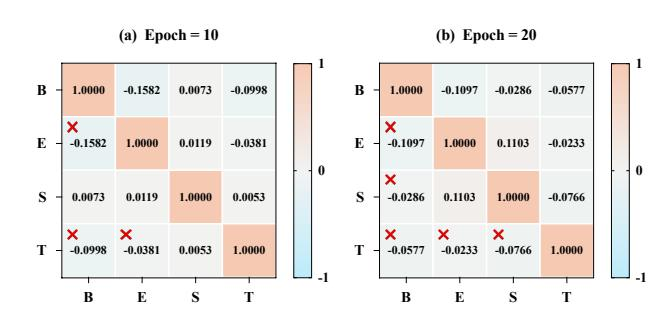
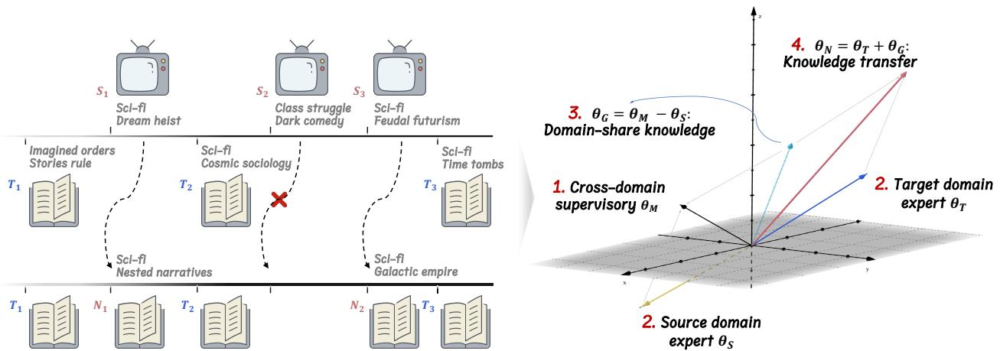
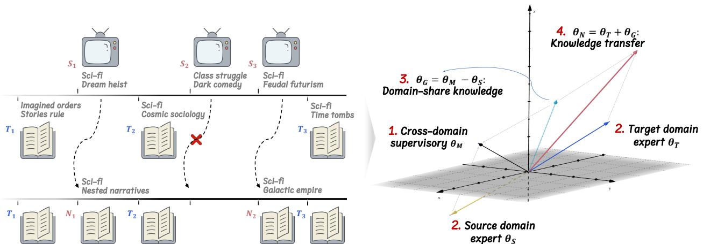
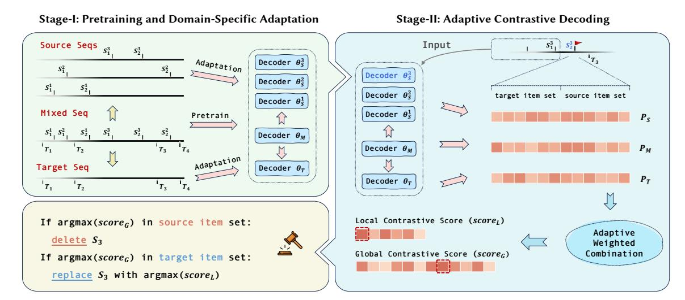
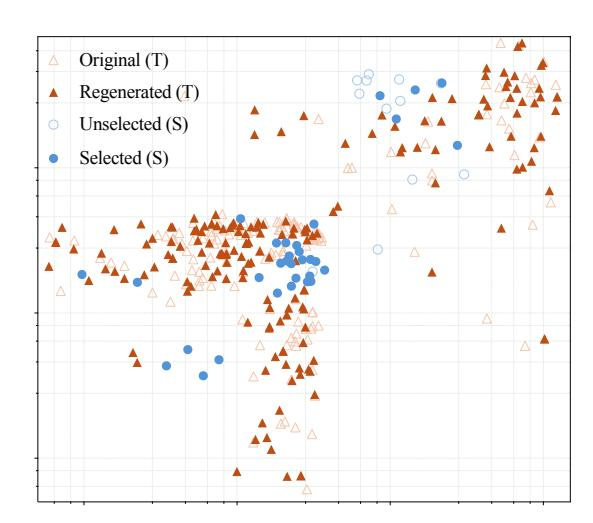
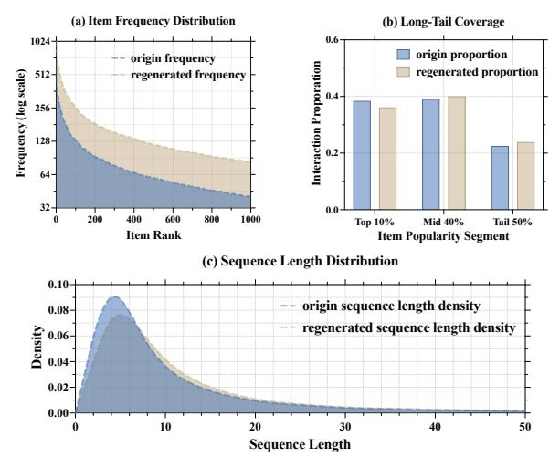

# Generative Data Transformation: From Mixed to Unified Data

[Jiaqing Zhang](https://orcid.org/0009-0001-1039-9735) jiaqing.zhang@mail.ustc.edu.cn University of Science and Technology of China, Hefei, China

[Mingjia Yin](https://orcid.org/0009-0005-0853-1089) mingjia-yin@mail.ustc.edu.cn University of Science and Technology of China, Hefei, China

[Hao Wang](https://orcid.org/0000-0001-9921-2078)∗ wanghao3@ustc.edu.cn University of Science and Technology of China, Hefei, China

[Yuxin Tian](https://orcid.org/0009-0008-6141-6284) tyx682@mail.ustc.edu.cn University of Science and Technology of China, Hefei, China

[Yuyang Ye](https://orcid.org/0000-0002-1513-7814) yeyuyang@mail.ustc.edu.cn University of Science and Technology of China, Hefei, China

[Yawen Li](https://orcid.org/0000-0003-2662-3444) warmly0716@126.com Beijing University of Posts and Telecommunications, Beijing, China ❌ ❌

[Wei Guo](https://orcid.org/0000-0001-8616-0221) guowei67@huawei.com Huawei Noah's Ark Lab Shenzhen, China

[Yong Liu](https://orcid.org/0000-0001-9031-9696) liu.yong6@huawei.com Huawei Noah's Ark Lab Shenzhen, China

[Enhong Chen](https://orcid.org/0000-0002-4835-4102)† cheneh@ustc.edu.cn University of Science and Technology of China, Hefei, China

# Abstract

Recommendation model performance is intrinsically tied to the quality, volume, and relevance of their training data. To address common challenges like data sparsity and cold start, recent researchs have leveraged data from multiple auxiliary domains to enrich information within the target domain. However, inherent domain gaps can degrade the quality of mixed-domain data, leading to negative transfer and diminished model performance. Existing prevailing model-centric paradigm – which relies on complex, customized architectures – struggles to capture the subtle, non-structural sequence dependencies across domains, leading to poor generalization and high demands on computational resources. To address these shortcomings, we propose Taesar, a data-centric framework for target-aligned sequential regeneration, which employs a contrastive decoding mechanism to adaptively encode cross-domain context into target-domain sequences. It employs contrastive decoding to encode cross-domain context into target sequences, enabling standard models to learn intricate dependencies without complex fusion architectures. Experiments show Taesar outperforms model-centric solutions and generalizes to various sequential models. By generating enriched datasets, Taesar effectively combines the strengths of data- and modelcentric paradigms. The code accompanying this paper is available at [https://github.com/USTC-StarTeam/Taesar.](https://github.com/USTC-StarTeam/Taesar)

# CCS Concepts

- Information systems → Recommender systems.

# Keywords

Sequential Recommendation, Data-Centric, Data Regeneration

∗Corresponding author.

†Corresponding author.

[This work is licensed under a Creative Commons Attribution 4.0 International License.](https://creativecommons.org/licenses/by/4.0) WWW '26, Dubai, United Arab Emirates © 2026 Copyright held by the owner/author(s). ACM ISBN 979-8-4007-2307-0/2026/04 <https://doi.org/10.1145/3774904.3792124>

Figure 1: Cosine similarity heatmap of gradient directions across four domains in multi-domain sequential recommendation. Naïvely combining data from multiple domains for training induces gradient conflicts and inconsistencies.

### ACM Reference Format:

Jiaqing Zhang, Mingjia Yin, Hao Wang, Yuxin Tian, Yuyang Ye, Yawen Li, Wei Guo, Yong Liu, and Enhong Chen. 2026. Generative Data Transformation: From Mixed to Unified Data. In Proceedings of the ACM Web Conference 2026 (WWW '26), April 13–17, 2026, Dubai, United Arab Emirates. ACM, New York, NY, USA, [10](#page-9-0) pages.<https://doi.org/10.1145/3774904.3792124>

# 1 Introduction

Sequential recommendation seeks to model the temporal dynamics of user preferences based on chronological interaction sequences, thereby facilitating the prediction of users' subsequent interactions, and enhancing personalized online experiences [\[5,](#page-8-0) [7,](#page-8-1) [32,](#page-8-2) [35,](#page-8-3) [40,](#page-8-4) [43,](#page-9-1) [46\]](#page-9-2). Although considerable progress has been achieved in this field, real-world user behaviors are frequently dispersed across diverse platforms and domains. This fragmentation introduces two principal challenges: (i) exacerbated data sparsity within individual domains [\[1,](#page-8-5) [17,](#page-8-6) [22,](#page-8-7) [38,](#page-8-8) [39,](#page-8-9) [45,](#page-9-3) [48,](#page-9-4) [51,](#page-9-5) [58](#page-9-6)? ? ], which fundamentally limits the modeling capacity of single-domain recommenders, and (ii) significant distributional heterogeneity across domains [\[3,](#page-8-10) [6,](#page-8-11) [31,](#page-8-12) [49,](#page-9-7) [54,](#page-9-8) [55\]](#page-9-9), wherein domain-specific user interests consequently impede effective knowledge transfer, as shown in Figure [1.](#page-0-0) These challenges collectively prompt a critical research question: How can dispersed cross-domain user activities be effectively harnessed to

Figure 2: Motivation of Taesar. We aim to eliminate the domain semantic gap at the source level, prior to model training, thereby transforming cross-domain mixed data into unified target-domain data. Left: Source items with high transferability are mapped to semantically closest target items, while others are discarded. Right: Regenerated data aligns cross-domain behavioral patterns with target-domain relevance, improving model gradients and target-domain performance.

reliably enhance target-domain recommendation while mitigating the risk of negative transfer ?

A growing body of research has sought to address this challenge through cross-domain sequential recommendation (CDSR). The dominant paradigm involves jointly learning heterogeneous interaction data from multiple domains within a unified representation space. To mitigate negative transfer, several approaches [\[13,](#page-8-13) [29,](#page-8-14) [44,](#page-9-10) [57\]](#page-9-11) incorporate auxiliary multimodal information—such as textual or visual content—as bridging signals across domains. For purely ID-based sequences, existing studies typically adopt a model-centric paradigm, developing sophisticated cross-domain knowledge transfer and fusion modules, often in conjunction with complex multitask training strategies [\[2,](#page-8-15) [3,](#page-8-10) [31\]](#page-8-12). Despite their effectiveness, these approaches entail several inherent limitations. On one hand, unified multi-domain modeling incurs substantial optimization complexity: balancing multiple domains within a shared representation space increases model intricacy and training costs, often compromising domain-specific accuracy relative to single-domain counterparts. On the other hand, such methods exhibit limited generality and scalability: their cross-domain fusion modules are typically model-dependent, and multi-task learning setups require extensive hyperparameter tuning, hindering practical deployment.

To address the limitations of the model-centric paradigm, we propose a novel data-centric approach for cross-domain sequential recommendation. Instead of designing complex transfer architectures, we focus on refining the data itself by eliminating detrimental inter-domain information and regenerating sequences using only target-domain items (Figure [2\)](#page-1-0). Consequently, the challenge of multi-domain modeling is transformed into a precise singledomain problem. Building on this concept, we propose Taesar – target-aligned sequential regeneration. The core insight is that a target-domain model can effectively refine mixed-domain sequences by contrasting its predictions with those from specialized

source-domain models, thereby enforcing a closer alignment between the regenerated sequences and target-domain semantics. To operationalize this idea, Taesar first trains a base model on the mixed-domain sequences to capture transferable, global crossdomain patterns. Subsequently, domain-specific expert models are derived by adapting the base model to each domain's individual sequences by Domain-Specific Prediction strategy, allowing them to specialize in domain-specific behaviors. Guided by these models, Taesar employs Adaptative Contrastive Decoding: for every non-target-domain item within a mixed sequence, it dynamically contrasts the predictions of the corresponding source-domain expert, the target-domain expert, and the base model to determine whether and how to replace the item with a plausible target-domain item. Replacement probabilities are computed using both global and local contrastive scores alongside adaptive weights derived from information theory, yielding refined sequences that preserve the temporal order while containing only target-domain items, consequently enhancing recommendation performance. We highlight four key contributions as follows:

- To the best of our knowledge, we present the first data-centric paradigm for CDSR, shifting the focus from model-level adaptation to semantic alignment at the data level. By regenerating sequences through contrastive decoding, our approach proactively mitigates negative transfer before model training.
- We develop a unified generative framework comprising a pretraining and domain-adaptation module and a adaptive contrastive decoding module, which collectively address two fundamental challenges in CDSR: identifying translatable crossdomain items and preserving inherent behavioral patterns.
- Taesar generates domain-purified sequences while retaining the original item ID structure, enabling seamless integration with existing sequential recommenders without any architectural or training modifications—thereby ensuring high practical compatibility and ease of deployment in CDSR systems.

### 2 Related works

Cross-Domain Sequential Recommendation (CDSR). CDSR enhances recommendation systems by modeling user behaviors across domains for richer user understanding [\[25\]](#page-8-16). The mainstream research trajectory has been dominated by model-centric paradigm. Early efforts, such as Pi-Net [\[27\]](#page-8-17) and PSJNet [\[36\]](#page-8-18), employed shared filters and transfer units to exchange information between domains, yet their performance was often constrained by domain similarity and susceptibility to behavioral noise. Subsequent works introduced more advanced transfer mechanisms, including graphbased propagation frameworks (e.g., MIFN [\[26\]](#page-8-19), DA-GCN [\[11\]](#page-8-20)) and attention-enhanced representation models (e.g., C2DSR [\[3\]](#page-8-10), DREAM [\[50\]](#page-9-12), MAN [\[21\]](#page-8-21)) that jointly capture intra- and interdomain dependencies. To improve generalization and scalability, several studies have explored domain-invariant and text-driven representations. UniCDR [\[14\]](#page-8-22) and UniSRec [\[13\]](#page-8-13) leveraged masking and contrastive pretraining to learn transferable user semantics, while RecGURU [\[19\]](#page-8-23) incorporated adversarial learning to derive domain-agnostic embeddings. More recent approaches have addressed specific challenges, such as mitigating negative transfer via gradient regularization [\[31\]](#page-8-12), aligning semantic spaces for disjointuser scenarios [\[23\]](#page-8-24), and enhancing task consistency through invariant LoRA modules [\[2\]](#page-8-15). Despite progress, model-centric methods remain plagued by architectural complexity and optimization instability, limiting their adaptability. Therefore, to overcome these hurdles, Taesar aims to shift the paradigm to a data-centric view.

Data Regeneration (DR). Machine learning is fundamentally framed as learning a mapping �� : X → Y, where X denotes inputs (e.g., interaction history) and Y denotes targets (e.g., items) [\[52\]](#page-9-13). However, the significant semantic gap between the noisy X and the concise Y makes direct optimization difficult. DR addresses this by introducing a latent transition: X → X′ → Y. In this framework, X′ acts as a distilled intermediate representation, simplifying the learning process and enhancing model convergence. This strategy differs fundamentally from existing paradigms such as data distillation [\[33,](#page-8-25) [34,](#page-8-26) [37,](#page-8-27) [42,](#page-9-14) [56\]](#page-9-15), which compresses real data into compact synthetic representations; data generation [\[17,](#page-8-6) [24,](#page-8-28) [53\]](#page-9-16), which synthesizes new samples from learned distributions; and other data augmentation approaches [\[8,](#page-8-29) [9,](#page-8-30) [22,](#page-8-7) [24\]](#page-8-28), which expand existing datasets through stochastic or semantic transformations. Building on the success of dataset regeneration methods like DR4SR [\[52\]](#page-9-13) in capturing transition patterns, we propose to regenerate mixeddomain sequences into target-exclusive formats, a process designed to distill information from multi-domain and boost transferability.

Contrastive Decoding (CD). It enhances language model generation by contrasting expert and amateur outputs to optimize fluency, diversity, and coherence [\[20\]](#page-8-31). Recent advances demonstrate contrastive decoding's versatility across diverse applications: it enhances reasoning in LLMs [\[28\]](#page-8-32) (despite persistent factual recall challenges), enables universal detoxification without model-specific tuning [\[15\]](#page-8-33), improves factual generation through APD's asymptotic probability extrapolation [\[4\]](#page-8-34), and suppresses hallucinations in multimodal models via ECD [\[10\]](#page-8-35). While effective for text generation, CD's potential for data regeneration—especially in sequential recommendation—remains unexplored. Our tri-model CD framework addresses this gap for cross-domain sequential data regeneration.

### 3 Preliminaries

Cross-Domain Sequential Recommendation. A domain D is formally defined as a structured tuple D = (U, V, E), where U denotes the set of users, V represents the set of items, and E captures the set of observed interactions. The interaction set E comprises a collection of sequences {x�� } | E | ��=1 , with each sequence x�� = [������ ∈ V]|x�� ��=1 corresponding to an ordered list of items from V, thereby reflecting a user's historical engagement.

In the multi-domain paradigm, we consider �� source domains {S1, S2, ..., S�� } and a singular target domain T. To facilitate domain differentiation, we denote the interaction sequences for a user �� as x S�� �� = (�� S�� 1 , �� S�� 2 , ..., �� S�� ) for the ��-th source domain, and x T �� = (�� T 1 , �� T 2 , ..., �� T ) for the target domain. To enable cross-domain knowledge transfer, we construct a unified, or merged, interaction sequence xM by chronologically interleaving interactions from all source and target domains:

x M �� = Interleave(x S1 �� , x S2 �� , ..., x S�� �� , x T ), (1)

where the Interleave(·) operator maintains the inherent temporal ordering while consolidating interactions across domains.

Given the observed sequences {(x S1 , ..., x S�� , x T, xM)�� }, the crossdomain sequential recommendation task leverages the merged sequence xM to improve predictive performance, calculating probabilities based on the integrated interaction history:

����+1 = arg max ����+1 ∈VT �� T (����+1 |x M 1:�� ), (2)

thereby facilitating the vital knowledge transfer from the multiple source domains {S�� } ��=1 to the target domain T.

Cross-Domain Data Regeneration. Given an input dataset x where each sequence xM comprises items originating from multiple source domains and the target domain, data regeneration constructs a novel dataset x N consisting exclusively of T-domain items. For a given sequence xM , the transformation is defined as:

x M �� = (�� ��1 1 , �� ��2 2 , ..., �� �� |xM�� | |xM�� | ), ���� ∈ {S1, ..., S��, T }, (3) x N �� = (�� T 1 , ��T 2 , ..., ��T |xM�� | ) = Regenerate(x M ), s.t. ∀ ���� ∈ VT . (4)

The regeneration operator Regenerate(·) is implemented as:

���� = ( ���� if ���� ∈ VT, ���� (���� ) if ���� ∈ VS�� , �� = 1, ..., ��, (5)

where each function ���� (·) : S�� → T ∪ {∅} either maps (transforms) or discards (replaces with a null item) the item from the��-th source domain into the target-domain item space. The composite dataset is subsequently generated as:

N = x N ∪ x T , (6)

where x T retains the original target-domain sequences, while x N contains the regenerated target-domain sequences, together constituting an enriched collection of user interaction sequences.

# 4.2 Adaptive Contrastive Decoding

This process is designed to address two key challenges: (1) determining whether an item from a mixed-domain sequence should be converted into a target-domain item, and (2) if transformation is appropriate, deciding which target-domain item it should be transformed into. After obtaining the cross-domain decoder and the domain-specific decoder in the previous stage, we draw inspiration from the conventional "Expert-Amateur" contrastive decoding paradigm. In this setup, the target-domain expert �� ∗ T serves as a strong supervisor, providing high-quality domain knowledge. The sourcedomain experts function as Amateurs relative to the target domain, providing guidance on filtering potentially harmful cross-domain biases. Meanwhile, a third-party base model �� ∗ M is employed to quantify knowledge that is transferable across domains.

4.2.1 Contrastive Score Calculation. When ����+1 originates from the source domain �� within a mixed sequence, the historical sequence x1:�� is fed in parallel to the source-domain expert P S�� , the target-domain expert P T, and the base model PM, yielding unnormalized prediction scores. To balance cross-domain transferability and target-domain specificity, we first compute the Global Contrastive Score over the entire item space V:

Global-score��+1 = ���� · PT − ���� · PS�� , (12)

where ���� and ���� are the domain confidence and transfer reward coefficients, respectively. A source-domain item whose global score is maximized for a target-domain item indicates that the targetdomain expert is highly confident about the transformation, and that the item also possesses transferable patterns across domains. Otherwise, the item is unlikely to require transformation. For items deemed convertible, we further compute the Local Contrastive Score restricted to the target-domain item set VT:

Local-score��+1 = ���� · PT VT − ���� · PS�� VT . (13)

By focusing exclusively on target-domain candidates, the local score precisely identifies the most suitable item for transformation, effectively combining domain-specific confidence and cross-domain transferability. This two-level contrastive design enables the model to distill transferable patterns while retaining domain-specialized discriminative power.

4.2.2 Adaptive Weight Decision. To enhance the adaptivity of knowledge integration, we define the domain confidence coefficient �� and the transfer reward coefficient �� from an information-theoretic perspective, leveraging entropy and divergence principles. Specifically, �� quantifies the informational certainty of the target-domain expert using the Shannon entropy of its output distribution. Lower entropy indicates a peaked, confident distribution, where the expert assigns high probability to specific items. Accordingly, positions with lower entropy should contribute more during decoding. To normalize �� into [0, 1], we define:

���� = 1 − ��(PT (�� | x1:��))) 1 − max��∈V ��(PT (�� | x1:��)) . (14)

From this viewpoint, �� serves as an information-certainty weight, amplifying the target expert's influence in confident regions while reducing its effect in uncertain areas.

Meanwhile, �� captures the transferability of cross-domain knowledge via the Jensen–Shannon Divergence (JSD) between the base model and the source-domain expert. As a symmetrized and bounded measure, lower JSD indicates stronger alignment and hence higher transferability, whereas higher divergence highlights domain-specific conflicts. For the prediction distributions PM and P S�� at the current position, ���� is defined as following:

���� = 1 2 h KL P M ∥ PM + PS�� 2 + KL P S�� ∥ PM + PS�� 2 . (15)

Thus, �� serves as a transfer-alignment weight, reinforcing knowledge in regions where the base model and source expert are strongly aligned while attenuating contributions from positions with high cross-domain conflict. The same principles are applied locally to ���� and ���� , computed are restricted over the target-domain vocabulary.

# 5 Experiment

In this section, we empirically evaluate Taesar in terms of its effectiveness compared with mode-centric methods, generalizability across different architectures, and the rationality of its design.

# 5.1 Experimental Settings

Table 1: Statistics of experimental datasets.

| Dataset     | # user # item (  U  ) (  V | # inter Í   ) ( x �� | Avg. x ) length | sparsity(%) |
|-------------|----------------------------|----------------------|-----------------|-------------|
| Books       | 70,672                     | 526,955              | 13.12           | 99.98       |
| Electronics | 44,278                     | 501,759              | 12.49           | 99.97       |
| Sports      | 38,030                     | 355,807              | 8.86            | 99.98       |
| Tools       | 31,880                     | 331,230              | 8.25            | 99.97       |

5.1.1 Datasets. Publicly available Amazon review datasets were employed in our experiments[1](#page-4-0) . We randomly selected four domains: Books, Electronics, Sports and Outdoors, and Tools and Home Improvement. For clarity, these are referred to as Books, Electronics, Sports, and Tools, respectively and follow the preprocessing in [\[2,](#page-8-15) [31\]](#page-8-12) to guarantee a minimum of 3 interactions associated with each user and item, then, retain only the 128 most recent interactions for longer sequences. Finally, user interactions are formatted chronologically. Table [1](#page-4-1) summarizes the statistics of the resulting datasets.

5.1.2 Baselines and Target Models. To fully demonstrate the crossarchitecture generalizability of Taesar, we select target models from various model architecture categories:

- RNN-Based: GRU4Rec[\[12\]](#page-8-36) models user interaction sequences with item embeddings processed by GRUs and optimizes rankingbased objectives to improve next-item prediction accuracy.
- GNN-Based: GCE-GNN[\[41\]](#page-8-37) learns item embeddings from both the current session and all global sessions then uses GNN on each graph and combines them with a soft attention mechanism.

1http://snap.stanford.edu/data/amazon/productGraph/categoryFiles/

Table 2: Overall performance of Taesar compared with state-of-the-art multi-domain sequential recommendation methods, and its generalization across single-domain models with different architectures. Best results are in bold, second-best underlined.

| Method           | HR@10  | HR@20  | NG@10  | BEST: Books NG@20 | Books, MRR@10 | Electronics, MRR@20 | Sports, HR@10 | Tools HR@20 | NG@10  | Electronics NG@20 | MRR@10 | MRR@20 |
|------------------|--------|--------|--------|-------------------|---------------|---------------------|---------------|-------------|--------|-------------------|--------|--------|
| SASRec           | 0.0563 | 0.0660 | 0.0371 | 0.0395            | 0.0311        | 0.0317              | 0.0350        | 0.0430      | 0.0257 | 0.0277            | 0.0228 | 0.0234 |
| GRU4Rec          | 0.0384 | 0.0450 | 0.0283 | 0.0300            | 0.0253        | 0.0257              | 0.0247        | 0.0325      | 0.0184 | 0.0204            | 0.0165 | 0.0170 |
| GCE-GNN          | 0.0598 | 0.0733 | 0.0447 | 0.0481            | 0.0400        | 0.0409              | 0.0353        | 0.0424      | 0.0286 | 0.0304            | 0.0266 | 0.0271 |
| CL4SRec          | 0.0585 | 0.0708 | 0.0442 | 0.0473            | 0.0398        | 0.0406              | 0.0347        | 0.0424      | 0.0278 | 0.0298            | 0.0257 | 0.0262 |
| SASRec 4         | 0.0504 | 0.0575 | 0.0342 | 0.0359            | 0.0291        | 0.0295              | 0.0311        | 0.0389      | 0.0240 | 0.0260            | 0.0218 | 0.0224 |
| ABXI             | 0.0489 | 0.0549 | 0.0341 | 0.0356            | 0.0369        | 0.0370              | 0.0352        | 0.0423      | 0.0290 | 0.0308            | 0.0246 | 0.0248 |
| SyNCRec          | 0.0455 | 0.0564 | 0.0337 | 0.0367            | 0.0259        | 0.0262              | 0.0314        | 0.0402      | 0.0252 | 0.0273            | 0.0193 | 0.0197 |
| CGRec            | 0.0413 | 0.0596 | 0.0316 | 0.0348            | 0.0218        | 0.0221              | 0.0338        | 0.0429      | 0.0203 | 0.0247            | 0.0190 | 0.0194 |
| SASRec+Taesar    | 0.0613 | 0.0738 | 0.0406 | 0.0438            | 0.0342        | 0.0351              | 0.0441        | 0.0527      | 0.0291 | 0.0312            | 0.0243 | 0.0249 |
| GRU4Rec + Taesar | 0.0407 | 0.0487 | 0.0307 | 0.0328            | 0.0277        | 0.0282              | 0.0288        | 0.0346      | 0.0233 | 0.0248            | 0.0216 | 0.0220 |
| GCE-GNN+Taesar   | 0.0774 | 0.0945 | 0.0566 | 0.0609            | 0.0502        | 0.0514              | 0.0404        | 0.0499      | 0.0319 | 0.0343            | 0.0293 | 0.0300 |
| CL4SRec + Taesar | 0.0772 | 0.0912 | 0.0567 | 0.0603            | 0.0504        | 0.0514              | 0.0408        | 0.0506      | 0.0317 | 0.0342            | 0.0289 | 0.0296 |
| Method           |        |        |        | Sports            |               |                     |               |             |        | Tools             |        |        |
|                  | HR@10  | HR@20  | NG@10  | NG@20             | MRR@10        | MRR@20              | HR@10         | HR@20       | NG@10  | NG@20             | MRR@10 | MRR@20 |
| SASRec           | 0.0399 | 0.0472 | 0.0295 | 0.0314            | 0.0262        | 0.0267              | 0.0333        | 0.0408      | 0.0249 | 0.0268            | 0.0222 | 0.0227 |
| GRU4Rec          | 0.0262 | 0.0319 | 0.0202 | 0.0216            | 0.0183        | 0.0187              | 0.0237        | 0.0286      | 0.0188 | 0.0201            | 0.0173 | 0.0177 |
| GCE-GNN          | 0.0379 | 0.0460 | 0.0318 | 0.0339            | 0.0300        | 0.0305              | 0.0332        | 0.0389      | 0.0270 | 0.0285            | 0.0251 | 0.0255 |
| CL4SRec          | 0.0413 | 0.0471 | 0.0335 | 0.0350            | 0.0311        | 0.0315              | 0.0325        | 0.0391      | 0.0268 | 0.0285            | 0.0251 | 0.0255 |
| SASRec 4         | 0.0373 | 0.0419 | 0.0281 | 0.0292            | 0.0251        | 0.0254              | 0.0319        | 0.0362      | 0.0236 | 0.0247            | 0.0210 | 0.0213 |
| ABXI             | 0.0386 | 0.0438 | 0.0306 | 0.0320            | 0.0254        | 0.0255              | 0.0309        | 0.0357      | 0.0271 | 0.0283            | 0.0232 | 0.0234 |
| SyNCRec          | 0.0368 | 0.0395 | 0.0306 | 0.0343            | 0.0244        | 0.0247              | 0.0371        | 0.0431      | 0.0307 | 0.0329            | 0.0206 | 0.0230 |
| CGRec            | 0.0344 | 0.0384 | 0.0299 | 0.0316            | 0.0224        | 0.0228              | 0.0344        | 0.0399      | 0.0202 | 0.0237            | 0.0215 | 0.0228 |
| SASRec+Taesar    | 0.0568 | 0.0667 | 0.0354 | 0.0379            | 0.0287        | 0.0294              | 0.0465        | 0.0573      | 0.0288 | 0.0315            | 0.0232 | 0.0240 |
| GRU4Rec + Taesar | 0.0322 | 0.0379 | 0.0252 | 0.0266            | 0.0231        | 0.0235              | 0.0267        | 0.0326      | 0.0217 | 0.0231            | 0.0201 | 0.0205 |
| GCE-GNN+Taesar   | 0.0582 | 0.0676 | 0.0445 | 0.0469            | 0.0403        | 0.0409              | 0.0482        | 0.0568      | 0.0377 | 0.0398            | 0.0344 | 0.0350 |
| CL4SRec + Taesar | 0.0602 | 0.0698 | 0.0464 | 0.0488            | 0.0421        | 0.0428              | 0.0491        | 0.0568      | 0.0385 | 0.0405            | 0.0352 | 0.0358 |

- Attention-Based: SASRec[\[16\]](#page-8-38) models user sequences with selfattention to capture long-term dependencies.
- Contrastive-Learning-Based: CL4SRec[\[47\]](#page-9-17) stands out as a powerful contrastive sequential recommender by introducing three effective unique sequence-level augmentation strategies.

To verify the Taesar's superiority compared with cross-domain methods, we select the following representative baselines:

- SASRec�� is a directly variant using SASRec [\[16\]](#page-8-38) trained on naive mixing data to revealing performance degradation.
- ABXI[\[2\]](#page-8-15) introduces a task-guided alignment mechanism to address the prediction mismatches and employs two types of LoRA to adaptively integrates domain-invariant interests.
- CGRec[\[30\]](#page-8-39) reweights domain loss via hierarchical contrastive learning to capture cross-domain correlations.
- SyNCRec[\[31\]](#page-8-12) uses single-domain and multi-domain contrastive learning to control negative transfer and an auxiliary mutual information loss to enhance representation transfer across tasks.

5.1.3 Evaluation Protocols. We rigorously evaluate the next-item prediction performance using the widely adopted leave-one-out split strategy. Specifically, for each sequence, the most recent interaction is reserved for testing, the second-to-last for validation, and the remainder for training. Consistent with standard crossdomain practices, we construct domain-specific validation and test sets based on the domain of the last item in each sequence. Performance is assessed using three established ranking metrics: Hit Rate (HR@��), Normalized Discounted Cumulative Gain (NG@��), and Mean Reciprocal Rank (MRR@��), with �� ∈ {10, 20}. Moreover, to address the observation by Krichene [\[18\]](#page-8-40) that "sampled metrics" (metrics computed using sampled negative items) can yield results inconsistent with full metrics, meaning the relative performance ranking between different algorithms may not remain stable, we adopt the entire item set as the candidate item set during evaluation.

5.1.4 Implementation Details. We implemented Taesar using Py-Torch and developed single-domain sequential recommendation

models based on the Recbole library. For the multi-domain baselines, we utilized their publicly available source code. Crucially, we replaced the sampled metrics with full metrics to ensure alignment with our evaluation methodology, as discussed previously. Notably, although ABXI was initially demonstrated in a two-domain setting, the original work established its straightforward scalability to multiple domains. Consequently, we adapted and extended both methods to effectively operate in our multi-domain environment.

To ensure a fair comparison, all single-domain models were uniformly configured across all datasets (including the Taesarregenerated dataset) with the following fixed hyperparameters: 2 attention heads and layers, hidden and inner sizes of 128, and dropout rates of 0.2. Conversely, the multi-domain models were subjected to hyperparameter search over the following space: attention heads ∈ {1, 2, 3}, layers ∈ {1, 2, 3}, hidden size ∈ {64, 128, 256}, and inner size ∈ {64, 128, 256}. Specifically for ABXI, the LoRA rank ∈ {8, 16, 32}, and for SyNCRec, the number of experts ∈ {4, 6, 8}. All models utilize the Adam optimizer with a learning rate ∈ {10−3 , 3 × 10−4 , 10−4 }. The training process runs for a maximum of 300 epochs, and early stopping is employed if the NG@10 on the validation data fails to improve for 30 consecutive epochs.

## 5.2 Overall Performance

5.2.1 How superior is Taesar to model-centric methods? Experimental results reveal that cross-domain recommendation performance is highly sensitive to data processing strategies. As shown in Table [2:](#page-5-0) (1) Naïve multi-domain merging leads to negative transfer. The performance of SASRec4 falls short of the singledomain baseline SASRec, indicating that simply merging data from multiple domains—without any adaptation—induces severe negative transfer due to distributional heterogeneity, thereby compromising the target domain's performance. (2) Model-centric improvements are limited under weak inter-domain semantics. Traditional model-centric approaches occasionally outperform both SASRec4 and single-domain baselines on specific metrics; however, their overall performance tends to degrade. This suggests that when semantic correlations across domains are weak, architectural enhancements alone cannot effectively bridge inter-domain discrepancies. (3) Taesar effectively mitigates inter-domain interference. In contrast, our data-centric framework Taesar achieves consistent and significant improvements over both SASRec4 and single-domain models. This demonstrates that Taesar alleviates inter-domain interference through data-level refinement, enabling precise and domain-specific modeling without being hindered by heterogeneous knowledge. Collectively, these findings underscore that as model-level optimizations approach diminishing returns, structured data regeneration—the core of Taesar—offers a more robust and interpretable solution for cross-domain recommendation.

5.2.2 How versatile is regenerated data from Taesar? Although Taesar employs a decoder-based architecture to perform contrastive data regeneration, the regenerated data itself remains model-agnostic. To assess its generality, we train multiple models with distinct architectural designs on the regenerated dataset. As shown in Table [2,](#page-5-0) (1) Regenerated data generalizes across architectures. Models with diverse architectures trained on Taesar's regenerated data exhibit consistent and substantial performance improvements, confirming

Table 3: Ablation results of Taesar on different designs of Pretraining, Domain-Specific Adaptation, and Adaptive Contrastive Decoding strategies.

|        | Variants |      | HR@10  | HR@20  | Electronics NG@10 | NG@20  | MRR@10 | MRR@20 |
|--------|----------|------|--------|--------|-------------------|--------|--------|--------|
| w/o    | DSA      |      | 0.0352 | 0.0434 | 0.0237            | 0.0258 | 0.0202 | 0.0207 |
| DSA    | w/o      | DSP  | 0.0350 | 0.0450 | 0.0241            | 0.0266 | 0.0208 | 0.0215 |
| DSP    | w/o      | SDE  | 0.0398 | 0.0472 | 0.0282            | 0.0300 | 0.0239 | 0.0247 |
| DSP    | w/o      | GCS  | 0.0439 | 0.0523 | 0.0289            | 0.0310 | 0.0242 | 0.0247 |
| DSP    | w/o      | LCS  | 0.0431 | 0.0512 | 0.0278            | 0.0299 | 0.0231 | 0.0236 |
| Taesar |          | Full | 0.0441 | 0.0527 | 0.0291            | 0.0312 | 0.0243 | 0.0249 |

the model-agnostic generalization capability of the regenerated dataset. (2) More expressive architectures yield greater improvements. When trained on the regenerated data, models with stronger representational capacity exhibit more pronounced performance gains. This observation suggests that the high-quality, semantically consistent data produced by Taesar allows expressive architectures to more effectively leverage their modeling capacity, thereby amplifying their advantage in capturing subtle user–item interactions. (3) Data-centric regeneration complements model-centric design. The consistent cross-architecture gains underscore the inherent complementarity between paradigms: model-centric approaches enhance structural expressiveness, whereas Taesar's data-centric paradigm fundamentally strengthens the learning signal, providing a more robust basis for future advancing recommender systems.

# 5.3 Further Analysis

5.3.1 How indispensable is the architecture of Taesar ? Table [3](#page-6-0) presents a comprehensive ablation study evaluating the design choices of Taesar. For the first stage, Pretraining and Domain-Specific Adaptation, we investigate the necessity of domain-specific adaptation (DSA) and the effectiveness of domain-specific prediction (DSP) within DSA. Specifically, 'w/o DSA' refers to training the domain-specific experts directly using DSP without adapting from the base model, whereas 'DSA w/o DSP' denotes adapting from the base model using only single-domain sequence data without employing DSP. The results indicate that DSA coupled with DSP consistently yields the best performance, highlighting the critical role of this combination. For the second stage, Adaptive Contrastive Decoding, we examine the contributions of source-domain experts (Amateur) and the two-level contrastive design. Here, 'w/o SDE' removes the source-domain experts during decoding, relying solely on the target-domain expert's prediction distribution for cross-domain item transformation. 'w/o GCS' and 'w/o LCS' correspond to using only the local or global contrastive scores, respectively. Across all these variants, performance consistently drops compared to the full Taesar model, demonstrating the importance of both the source-domain knowledge and the two-level contrastive mechanism. Overall, these ablation results clearly illustrate that each architectural component of Taesar—from DSA with

Figure 4: Schematic illustration of the adaptive contrastive decoding phase: (a) selection of transferable items from source domain S (Electronics), and (b) distribution-level mapping to target domain T (Books).

DSP to adaptive contrastive decoding—is essential for achieving optimal cross-domain sequential recommendation performance.

5.3.2 Is domain-shared information successfully detected and effectively transferred? To assess whether Taesar effectively identifies and transfers domain-shared information, we analyze the item-level mappings produced during adaptive contrastive decoding. Specifically, we extract the mapping dictionary from source items to their corresponding target items and visualize the learned item embeddings from both domains. As shown in Figure [4,](#page-7-0) blue points represent source-domain items, with solid blue dots indicating items selected for transformation into target-domain counterparts, corresponding to solid red dots. The visualization reveals that these selected source items have embeddings closely aligned with those of the target items, suggesting that they capture transferable, domain-shared semantics. This alignment demonstrates that Taesar successfully identifies and transforms transferable items, highlighting its effectiveness in utilizing cross-domain knowledge.

5.3.3 How regenerated dataset enhances diversity and context? Analysis of the regenerated dataset in the Books domain reveals that our data-centric regeneration substantially improves target-domain distributions and sequence context, explaining the observed performance gains. Compared with the original dataset, regenerated dataset exhibits a flatter item frequency curve (Figure [5](#page-7-1) (a)), activating more low-frequency items and mitigating head dominance. Long-tail coverage is also enhanced (Figure [5](#page-7-1) (b)), with reduced Top 10% and increased Mid 40% and Tail 50% proportions, indicating the injection of diverse, previously underrepresented interactions. Moreover, user sequences in the regenerated dataset are longer and denser (Figure [5](#page-7-1) (c)), providing richer temporal context and enabling models to capture extended sequential patterns. Collectively,

Figure 5: Comparison of data statistics between the original and regenerated Books domain dataset: (a) item frequency, (b) long-tail coverage, and (c) sequence length distribution.

these improvements in item-level diversity and sequence-level context highlight how data-centric regeneration enables robust and interpretable performance gains.

### 6 Conclusion

In this work, we present Taesar, a novel data-centric framework for cross-domain sequential recommendation. By prioritizing data transformation over complex transfer architecture designs, Taesar effectively mitigates negative transfer through target-aligned sequence regeneration. Specifically, it leverages adaptive contrastive decoding to identify transferable items from source domains and transform them into semantically aligned target-domain items, preserving temporal dynamics while eliminating potentially detrimental inter-domain information. Extensive experiments across multiple datasets and model architectures demonstrate that Taesar not only attains SOTA performance in cross-domain recommendation but also generalizes seamlessly to existing single-domain sequential recommenders without requiring modifications to their architectures. These findings highlight the synergy between data-centric and model-centric paradigms, providing a practical, theoretically grounded framework for cross-domain knowledge transfer.

Despite these advances, important limitation remain. A deeper theoretical understanding of the limits of information preservation during the regeneration process is needed. Future work will focus on addressing above challenge, advancing both the theoretical foundations and practical applicability of data-centric recommendation.

### References

- [1] Keqin Bao, Jizhi Zhang, Wenjie Wang, Yang Zhang, Zhengyi Yang, Yanchen Luo, Chong Chen, Fuli Feng, and Qi Tian. 2025. A bi-step grounding paradigm for large language models in recommendation systems. ACM Transactions on Recommender Systems 3, 4 (2025), 1–27. [2] Qingtian Bian, Marcus de Carvalho, Tieying Li, Jiaxing Xu, Hui Fang, and Yiping Ke. 2025. ABXI: Invariant Interest Adaptation for Task-Guided Cross-Domain Sequential Recommendation. In Proceedings of the ACM on Web Conference 2025. 3183–3192. [3] Jiangxia Cao, Xin Cong, Jiawei Sheng, Tingwen Liu, and Bin Wang. 2022. Contrastive cross-domain sequential recommendation. In Proceedings of the 31st ACM international conference on information & knowledge management. 138–147. [4] Haw-Shiuan Chang, Nanyun Peng, Mohit Bansal, Anil Ramakrishna, and Tagyoung Chung. 2024. Explaining and Improving Contrastive Decoding by Extrapolating the Probabilities of a Huge and Hypothetical LM. arXiv preprint arXiv:2411.01610 (2024). [5] Shu Chen, Zitao Xu, Weike Pan, Qiang Yang, and Zhong Ming. 2024. A survey on cross-domain sequential recommendation. arXiv preprint arXiv:2401.04971 (2024). [6] Shu Chen, Zitao Xu, Weike Pan, Qiang Yang, and Zhong Ming. 2024. A survey on cross-domain sequential recommendation. arXiv preprint arXiv:2401.04971 (2024). [7] Liu Chong, Xiaoyang Liu, Rongqin Zheng, Lixin Zhang, Xiaobo Liang, Juntao Li, Lijun Wu, Min Zhang, and Leyu Lin. 2023. Ct4rec: simple yet effective consistency training for sequential recommendation. In Proceedings of the 29th ACM SIGKDD Conference on Knowledge Discovery and Data Mining. 3901–3913. [8] Yizhou Dang, Yuting Liu, Enneng Yang, Guibing Guo, Linying Jiang, Xingwei Wang, and Jianzhe Zhao. 2024. Repeated Padding for Sequential Recommendation. In Proceedings of the 18th ACM Conference on Recommender Systems. 497–506. [9] Yizhou Dang, Yuting Liu, Enneng Yang, Guibing Guo, Linying Jiang, Xingwei Wang, and Jianzhe Zhao. 2024. Repeated Padding for Sequential Recommendation. In Proceedings of the 18th ACM Conference on Recommender Systems. 497–506. [10] Laura Fieback, Nishilkumar Balar, Jakob Spiegelberg, and Hanno Gottschalk. 2025. Efficient Contrastive Decoding with Probabilistic Hallucination Detection-Mitigating Hallucinations in Large Vision Language Models. arXiv preprint arXiv:2504.12137 (2025). [11] Lei Guo, Li Tang, Tong Chen, Lei Zhu, Quoc Viet Hung Nguyen, and Hongzhi Yin. 2021. DA-GCN: A domain-aware attentive graph convolution network for shared-account cross-domain sequential recommendation. arXiv preprint arXiv:2105.03300 (2021). [12] Balázs Hidasi, Alexandros Karatzoglou, Linas Baltrunas, and Domonkos Tikk. 2015. Session-based recommendations with recurrent neural networks. arXiv preprint arXiv:1511.06939 (2015). [13] Yupeng Hou, Shanlei Mu, Wayne Xin Zhao, Yaliang Li, Bolin Ding, and Ji-Rong Wen. 2022. Towards universal sequence representation learning for recommender systems. In Proceedings of the 28th ACM SIGKDD Conference on Knowledge Discovery and Data Mining. 585–593. [14] Yupeng Hou, Shanlei Mu, Wayne Xin Zhao, Yaliang Li, Bolin Ding, and Ji-Rong Wen. 2022. Towards universal sequence representation learning for recommender systems. In Proceedings of the 28th ACM SIGKDD Conference on Knowledge Discovery and Data Mining. 585–593. [15] LU Huimin, Masaru Isonuma, Junichiro Mori, and Ichiro Sakata. 2025. Unidetox: Universal detoxification of large language models via dataset distillation. In The Thirteenth International Conference on Learning Representations. [16] Wang-Cheng Kang and Julian McAuley. 2018. Self-attentive sequential recommendation. In 2018 IEEE international conference on data mining (ICDM). IEEE, 197–206. [17] Kibum Kim, Dongmin Hyun, Sukwon Yun, and Chanyoung Park. 2023. Melt: Mutual enhancement of long-tailed user and item for sequential recommendation. In Proceedings of the 46th international ACM SIGIR conference on Research and development in information retrieval. 68–77. [18] Walid Krichene and Steffen Rendle. 2020. On sampled metrics for item recommendation. In Proceedings of the 26th ACM SIGKDD international conference on knowledge discovery & data mining. 1748–1757. [19] Chenglin Li, Mingjun Zhao, Huanming Zhang, Chenyun Yu, Lei Cheng, Guoqiang Shu, Beibei Kong, and Di Niu. 2022. RecGURU: Adversarial learning of generalized user representations for cross-domain recommendation. In Proceedings of the fifteenth ACM international conference on web search and data mining. 571–581. [20] Xiang Lisa Li, Ari Holtzman, Daniel Fried, Percy Liang, Jason Eisner, Tatsunori Hashimoto, Luke Zettlemoyer, and Mike Lewis. 2022. Contrastive decoding: Open-ended text generation as optimization. arXiv preprint arXiv:2210.15097 (2022). [21] Guanyu Lin, Chen Gao, Yu Zheng, Jianxin Chang, Yanan Niu, Yang Song, Kun Gai, Zhiheng Li, Depeng Jin, Yong Li, et al. 2024. Mixed attention network for cross-domain sequential recommendation. In Proceedings of the 17th ACM international conference on web search and data mining. 405–413. [22] Qidong Liu, Fan Yan, Xiangyu Zhao, Zhaocheng Du, Huifeng Guo, Ruiming Tang, and Feng Tian. 2023. Diffusion augmentation for sequential recommendation. In Proceedings of the 32nd ACM International Conference on Information and Knowledge Management. 1576–1586. [23] Weiming Liu, Xiaolin Zheng, Chaochao Chen, Jiajie Su, Xinting Liao, Mengling Hu, and Yanchao Tan. 2023. Joint internal multi-interest exploration and external domain alignment for cross domain sequential recommendation. In Proceedings of the ACM web conference 2023. 383–394. [24] Zhiwei Liu, Ziwei Fan, Yu Wang, and Philip S Yu. 2021. Augmenting sequential recommendation with pseudo-prior items via reversely pre-training transformer. In Proceedings of the 44th international ACM SIGIR conference on Research and development in information retrieval. 1608–1612. [25] Haokai Ma, Ruobing Xie, Lei Meng, Xin Chen, Xu Zhang, Leyu Lin, and Jie Zhou. 2024. Triple sequence learning for cross-domain recommendation. ACM Transactions on Information Systems 42, 4 (2024), 1–29. [26] Muyang Ma, Pengjie Ren, Zhumin Chen, Zhaochun Ren, Lifan Zhao, Peiyu Liu, Jun Ma, and Maarten de Rijke. 2022. Mixed information flow for cross-domain sequential recommendations. ACM Transactions on Knowledge Discovery from Data (TKDD) 16, 4 (2022), 1–32. [27] Muyang Ma, Pengjie Ren, Yujie Lin, Zhumin Chen, Jun Ma, and Maarten de Rijke. 2019. ��-net: A parallel information-sharing network for shared-account crossdomain sequential recommendations. In Proceedings of the 42nd international ACM SIGIR conference on research and development in information retrieval. 685–
  - 694. [28] Sean O'Brien and Mike Lewis. 2023. Contrastive decoding improves reasoning in large language models. arXiv preprint arXiv:2309.09117 (2023). [29] Chung Park, Taesan Kim, Taekyoon Choi, Junui Hong, Yelim Yu, Mincheol Cho, Kyunam Lee, Sungil Ryu, Hyungjun Yoon, Minsung Choi, et al. 2023. Cracking the code of negative transfer: A cooperative game theoretic approach for crossdomain sequential recommendation. In Proceedings of the 32nd ACM international conference on information and knowledge management. 2024–2033. [30] Chung Park, Taesan Kim, Taekyoon Choi, Junui Hong, Yelim Yu, Mincheol Cho, Kyunam Lee, Sungil Ryu, Hyungjun Yoon, Minsung Choi, et al. 2023. Cracking the code of negative transfer: A cooperative game theoretic approach for crossdomain sequential recommendation. In Proceedings of the 32nd ACM international conference on information and knowledge management. 2024–2033. [31] Chung Park, Taesan Kim, Hyungjun Yoon, Junui Hong, Yelim Yu, Mincheol Cho, Minsung Choi, and Jaegul Choo. 2024. Pacer and Runner: Cooperative Learning Framework between Single-and Cross-Domain Sequential Recommendation. In Proceedings of the 47th International ACM SIGIR Conference on Research and Development in Information Retrieval. 2071–2080. [32] Aleksandr Petrov and Craig Macdonald. 2024. RSS: effective and efficient training for sequential recommendation using recency sampling. ACM Transactions on Recommender Systems 3, 1 (2024), 1–32. [33] Noveen Sachdeva, Mehak Dhaliwal, Carole-Jean Wu, and Julian McAuley. 2022. Infinite recommendation networks: A data-centric approach. Advances in Neural Information Processing Systems 35 (2022), 31292–31305. [34] Noveen Sachdeva, Zexue He, Wang-Cheng Kang, Jianmo Ni, Derek Zhiyuan Cheng, and Julian McAuley. 2023. Farzi data: Autoregressive data distillation. arXiv preprint arXiv:2310.09983 (2023). [35] Tingjia Shen, Hao Wang, Chuhan Wu, Jin Yao Chin, Wei Guo, Yong Liu, Huifeng Guo, Defu Lian, Ruiming Tang, and Enhong Chen. [n. d.]. P-Law: Predicting Quantitative Scaling Law with Entropy Guidance in Large Recommendation Models. In The Thirty-ninth Annual Conference on Neural Information Processing Systems. [36] Wenchao Sun, Muyang Ma, Pengjie Ren, Yujie Lin, Zhumin Chen, Zhaochun Ren, Jun Ma, and Maarten De Rijke. 2021. Parallel split-join networks for shared account cross-domain sequential recommendations. IEEE Transactions on Knowledge and Data Engineering 35, 4 (2021), 4106–4123. [37] Cheng Wang, Jiacheng Sun, Zhenhua Dong, Ruixuan Li, and Rui Zhang. 2023. Gradient matching for categorical data distillation in ctr prediction. In Proceedings of the 17th ACM Conference on Recommender Systems. 161–170. [38] Hao Wang, Wei Guo, Luankang Zhang, Jin Yao Chin, Yufei Ye, Huifeng Guo, Yong Liu, Defu Lian, Ruiming Tang, and Enhong Chen. 2025. Generative large recommendation models: emerging trends in llms for recommendation. In Companion Proceedings of the ACM on Web Conference 2025. 49–52. [39] Kefan Wang, Hao Wang, Kenan Song, Wei Guo, Kai Cheng, Zhi Li, Yong Liu, Defu Lian, and Enhong Chen. 2025. A universal framework for compressing embeddings in ctr prediction. In International Conference on Database Systems for Advanced Applications. Springer, 84–100. [40] Shoujin Wang, Qi Zhang, Liang Hu, Xiuzhen Zhang, Yan Wang, and Charu Aggarwal. 2022. Sequential/Session-based Recommendations: Challenges, Approaches, Applications and Opportunities. In Proceedings of the 45th International ACM SIGIR Conference on Research and Development in Information Retrieval. 3425–3428. [41] Ziyang Wang, Wei Wei, Gao Cong, Xiao-Li Li, Xian-Ling Mao, and Minghui Qiu. 2020. Global context enhanced graph neural networks for session-based recommendation. In Proceedings of the 43rd international ACM SIGIR conference

- on research and development in information retrieval. 169–178. [42] Jiahao Wu, Qijiong Liu, Hengchang Hu, Wenqi Fan, Shengcai Liu, Qing Li, Xiao-Ming Wu, and Ke Tang. 2023. TF-DCon: Leveraging Large Language Models (LLMs) to Empower Training-Free Dataset Condensation for Content-Based Recommendation. arXiv preprint arXiv:2310.09874 (2023). [43] Likang Wu, Zhi Zheng, Zhaopeng Qiu, Hao Wang, Hongchao Gu, Tingjia Shen, Chuan Qin, Chen Zhu, Hengshu Zhu, Qi Liu, et al. 2024. A survey on large language models for recommendation. World Wide Web 27, 5 (2024), 60. [44] Wangyu Wu, Zhenhong Chen, Xianglin Qiu, Siqi Song, Xiaowei Huang, Fei Ma, and Jimin Xiao. 2025. LLM-Enhanced Multimodal Fusion for Cross-Domain Sequential Recommendation. arXiv preprint arXiv:2506.17966 (2025). [45] Wenjia Xie, Hao Wang, Minghao Fang, Ruize Yu, Wei Guo, Yong Liu, Defu Lian, and Enhong Chen. 2025. Breaking the Bottleneck: User-Specific Optimization and Real-Time Inference Integration for Sequential Recommendation. In Proceedings of the 31st ACM SIGKDD Conference on Knowledge Discovery and Data Mining V.
- 2. 3333–3343. [46] Wenjia Xie, Hao Wang, Luankang Zhang, Rui Zhou, Defu Lian, and Enhong Chen. 2024. Breaking Determinism: Fuzzy Modeling of Sequential Recommendation Using Discrete State Space Diffusion Model. arXiv preprint arXiv:2410.23994 (2024). [47] Xu Xie, Fei Sun, Zhaoyang Liu, Shiwen Wu, Jinyang Gao, Jiandong Zhang, Bolin Ding, and Bin Cui. 2022. Contrastive learning for sequential recommendation. In 2022 IEEE 38th international conference on data engineering (ICDE). IEEE, 1259– 1273. [48] Xiang Xu, Hao Wang, Wei Guo, Luankang Zhang, Wanshan Yang, Runlong Yu, Yong Liu, Defu Lian, and Enhong Chen. 2025. Multi-granularity interest retrieval and refinement network for long-term user behavior modeling in ctr prediction. In Proceedings of the 31st ACM SIGKDD Conference on Knowledge Discovery and Data Mining V. 1. 2745–2755. [49] Zitao Xu, Xiaoqing Chen, Weike Pan, and Zhong Ming. 2025. Heterogeneous Graph Transfer Learning for Category-aware Cross-Domain Sequential Recommendation. In Proceedings of the ACM on Web Conference 2025. 1951–1962. [50] Xiaoxin Ye, Yun Li, and Lina Yao. 2023. Dream: Decoupled representation via extraction attention module and supervised contrastive learning for cross-domain sequential recommender. In Proceedings of the 17th ACM Conference on Recommender Systems. 479–490. [51] Mingjia Yin, Junwei Pan, Hao Wang, Ximei Wang, Shangyu Zhang, Jie Jiang, Defu Lian, and Enhong Chen. 2025. From Feature Interaction to Feature Generation: A Generative Paradigm of CTR Prediction Models. arXiv preprint arXiv:2512.14041 (2025). [52] Mingjia Yin, Hao Wang, Wei Guo, Yong Liu, Suojuan Zhang, Sirui Zhao, Defu Lian, and Enhong Chen. 2024. Dataset regeneration for sequential recommendation. In Proceedings of the 30th ACM SIGKDD Conference on Knowledge Discovery and Data Mining. 3954–3965. [53] Haocheng Yu, Yaxiong Wu, Hao Wang, Wei Guo, Yong Liu, Yawen Li, Yuyang Ye, Junping Du, and Enhong Chen. 2025. Thought-Augmented Planning for LLM-Powered Interactive Recommender Agent. arXiv preprint arXiv:2506.23485 (2025). [54] Tianzi Zang, Yanmin Zhu, Haobing Liu, Ruohan Zhang, and Jiadi Yu. 2022. A survey on cross-domain recommendation: taxonomies, methods, and future directions. ACM Transactions on Information Systems 41, 2 (2022), 1–39. [55] Hao Zhang, Mingyue Cheng, Qi Liu, Junzhe Jiang, Xianquan Wang, Rujiao Zhang, Chenyi Lei, and Enhong Chen. 2025. A comprehensive survey on crossdomain recommendation: Taxonomy, progress, and prospects. arXiv preprint arXiv:2503.14110 (2025). [56] Jiaqing Zhang, Mingjia Yin, Hao Wang, Yawen Li, Yuyang Ye, Xingyu Lou, Junping Du, and Enhong Chen. 2025. Td3: Tucker decomposition based dataset distillation method for sequential recommendation. In Proceedings of the ACM on Web Conference 2025. 3994–4003. [57] Donglin Zhou, Xinbei Cai, and Weike Pan. 2025. Contrastive Text-enhanced Transformer for Cross-Domain Sequential Recommendation. In Proceedings of the 31st ACM SIGKDD Conference on Knowledge Discovery and Data Mining V. 2. 4110–4119. [58] Rui Zhou, Hao Wang, Wei Guo, Qinglin Jia, Wenjia Xie, Xiang Xu, Yong Liu, Defu Lian, and Enhong Chen. 2025. MIT: A Multi-Tower Information Transfer Framework Based on Hierarchical Task Relationship Modeling. In Companion Proceedings of the ACM on Web Conference 2025. 651–660.