# From Entity Reliability to Clean Feedback: An Entity-Aware Denoising Framework Beyond Interaction-Level Signals

Ze Liu, Xianquan Wang, Shuochen Liu, Jie Ma, Huibo Xu, Yupeng Han, Kai Zhang∗ University of Science and Technology of China & State Key Laboratory of Cognitive Intelligence China {liuze2120,kkzhang08}@mail.ustc.edu.cn

Jun Zhou Ant Group China jun.zhoujun@antfin.com

### Abstract

Implicit feedback is central to modern recommender systems but is inherently noisy, often impairing model training and degrading user experience. At scale, such noise can mislead learning processes, reducing both recommendation accuracy and platform value. Existing denoising strategies typically overlook the entity-specific nature of noise while introducing high computational costs and complex hyperparameter tuning. To address these challenges, we propose EARD (Entity-Aware Reliability-Driven Denoising), a lightweight framework that shifts the focus from interaction-level signals to entity-level reliability. Motivated by the empirical observation that training loss correlates with noise, EARD quantifies user and item reliability via their average training losses as a proxy for reputation, and integrates these entity-level factors with interaction-level confidence. The framework is model-agnostic, computationally efficient, and requires only two intuitive hyperparameters. Extensive experiments across multiple datasets and backbone models demonstrate that EARD yields substantial improvements over stateof-the-art baselines (e.g., up to 27.01% gain in NDCG@50), while incurring negligible additional computational cost. Comprehensive ablation studies and mechanism analyses further confirm EARD's robustness to hyperparameter choices and its practical scalability. These results highlight the importance of entity-aware reliability modeling for denoising implicit feedback and pave the way for more robust recommendation research.

### CCS Concepts

- Information systems → Recommender systems.

### Keywords

Recommender systems, Implicit feedback, Denoising methods

# 1 Introduction

Recommender systems are essential to modern information platforms, supporting personalized content delivery in e-commerce and social media. These systems increasingly rely on large-scale implicit feedback, such as clicks and viewing histories, to model user preferences. Implicit signals are abundant and require no explicit input, making them well-suited for industrial-scale deployment.

However, implicit feedback is inherently noisy, containing both false positives (e.g., accidental clicks or clickbait-induced interactions) and false negatives (non-interactions that do not imply disinterest, often due to exposure bias). Such noise can misguide model

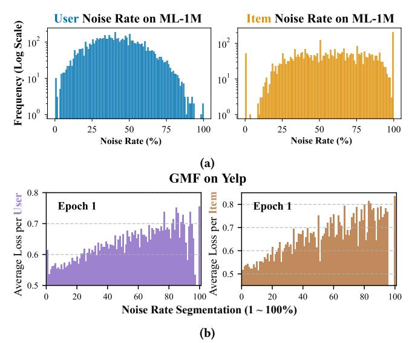

Figure 1: (a) User (blue) and item (yellow) noise rate distributions on ML-1M. As in ADT [\[16\]](#page-8-0), ratings ≤ 3 are labeled as noise. The broad spread shows that entity reliability varies widely. (b) Average loss of user (purple) and item (brown) groups with different noise levels on Yelp using GMF. Average loss tends to increase with noise rate.

training and degrade recommendation accuracy. To mitigate this, numerous denoising methods have been proposed to address the noise inherent in implicit feedback for recommendation systems. Prevailing strategies typically involve re-weighting training instances based on their loss values [\[16\]](#page-8-0), pruning noisy edges from the user-item interaction graph [\[14\]](#page-8-1), or leveraging more complex mechanisms like cross-model disagreement [\[5,](#page-8-2) [17\]](#page-8-3). Recommendation systems rely on massive amounts of data and incur substantial training costs, so any additional denoising mechanism must be lightweight, efficient, and compatible with the main training pipeline without interfering with or slowing down the original process. This raises a fundamental and critical research question: How can we design a denoising framework that is not only effective at identifying noise sources but also practical for large-scale, real-world deployment? Answering this question requires overcoming three major, interrelated challenges that plague existing methods:

Lack of Entity-Aware Modeling. Most existing methods address noise within the vast and sparse user–item interaction space, yet they typically analyze it only at the interaction level. A critical

∗Corresponding author.

oversight in these approaches is the failure to decouple the origins of noise by attributing it distinctly to the user or the item. For instance, noise can stem from the user side, such as from users who are merely 'wandering' and whose clicks do not reflect genuine preference. Conversely, it can originate from the item side, where certain items act as 'clickbait,' engineered to attract interactions that are not indicative of true interest. The necessity of this decoupled perspective is substantiated by our analysis of user and item noise rates across the ML-1M, Yelp, and AmazonBook datasets. As shown in Figure [1a,](#page-0-0) noise rates for both entities span the full 0–100% range with substantial variability, a pattern confirmed in other datasets (Appendix Figure [6\)](#page-9-0). These findings clearly invalidate the implicit assumption that all entities are equally reliable and underscore the urgent need for entity-aware denoising approaches. By modeling user and item reliability independently, we can more accurately assess interaction quality and improve the identification and suppression of noisy signals.

High Computational Overhead. To improve denoising effectiveness, several methods, including SGDL [\[5\]](#page-8-2), DeCA [\[17\]](#page-8-3), and BOD [\[18\]](#page-8-4), adopt complex optimization strategies such as metalearning frameworks, second-order gradient computations, and multi-path auxiliary networks. While these approaches can achieve strong performance in small- or medium-scale experiments, they introduce substantial training and inference costs. This overhead becomes prohibitive in industrial-scale scenarios with tens of millions of interactions, limiting their practicality for real-time recommendation systems that demand both efficiency and scalability.

Excessive Hyperparameter Complexity. Many existing methods require multiple hyperparameters to manage loss weighting, sample selection, or optimization. For example, DeCA, UDT, and SGDL introduce three to five core hyperparameters. This increases tuning costs and reduces stability across datasets, hindering generalization. Extensive hyperparameter search is often impractical in real-world scenarios. Prior work [\[3\]](#page-8-5) shows that simpler models can perform as well as more complex ones under fair evaluation. Effective denoising methods should therefore reduce manual tuning and remain robust under default settings.

To address these challenges, we estimate an entity's noise level using a simple yet effective proxy. Specifically, for each user (or item), we compute its average training loss over all associated interactions in an epoch. This approach is inspired by prior works [\[1,](#page-8-6) [6,](#page-8-7) [11,](#page-8-8) [16\]](#page-8-0), which show that noisy samples tend to incur higher losses. To validate this assumption, we grouped users and items by noise rate bins and computed their average losses during the first epoch of GMF on the Yelp dataset. As shown in Figure [1b,](#page-0-0) the average loss of entities generally increases with their noise rate. Additional evidence in Appendix [F](#page-10-0) (Figures [8a](#page-10-1) and [8b\)](#page-10-1) confirms this trend.

Based on this observation, we propose a lightweight three-stage pipeline to estimate fine-grained confidence scores: (1) compute the average loss for each entity with minimal overhead; (2) weight entity-level scores using interaction-level weights derived from the empirical cumulative distribution function (ECDF) of individual losses; (3) transform losses into reliability scores via a linear mapping parameterized by �� and ��. This design captures both entity reliability and interaction uncertainty, while remaining modelagnostic, efficient, and requiring minimal hyperparameter tuning. Our key contributions are as follows:

1) Entity-Aware denoising. We propose EARD, a novel and effective framework that explicitly incorporates both user and item reliability to better detect noise in implicit feedback.

2) Scalable and efficient design. Our method computes entityand interaction-level weights with negligible overhead, enabling application to large-scale industrial datasets.

3) Minimal hyperparameter requirement. The framework introduces only two intuitive hyperparameters, �� and ��, with a smooth and unimodal performance landscape that supports robust tuning. 4) Comprehensive empirical validation. Experiments across multiple datasets and representative models show consistent and significant improvements over state-of-the-art denoising baselines, with lower computational and memory costs.

# 2 Related Work

Denoising implicit feedback is essential for robust recommendation, as it often includes false positives (e.g., accidental clicks) and false negatives (e.g., unobserved preferences due to exposure bias). Early approaches used heuristic rules and statistical reweighting. WRMF [\[9\]](#page-8-9) separates interactions into binary preferences and confidence scores based on frequency, optimizing with Alternating Least Squares for scalability and interpretability. WBPR [\[4\]](#page-8-10) extends Bayesian Personalized Ranking by assigning popularity-aware sampling to negatives, mitigating sampling bias.

Later work leverages the memory effect in deep learning, where clean samples are learned earlier. ADT [\[16\]](#page-8-0) uses truncated and reweighted losses to suppress high-loss samples. IR [\[19\]](#page-8-11) iteratively refines labels through self-training. SGDL [\[5\]](#page-8-2) adopts a two-phase approach that detects memorized samples, then adjusts loss weights via meta-learning and an LSTM scheduler. DCF [\[8\]](#page-8-12) smooths loss histories and relabels samples to retain informative ones while filtering noise. UDT [\[2\]](#page-8-13) models interactions as a two-stage ("willingness" to "action") Markov process and applies hierarchical loss weighting. PLD [\[23\]](#page-8-14) resamples interactions using user-specific loss distributions that better separate clean from noisy data.

Recent methods address noise using structural signals, multiview learning, and modality-specific features. DRPN [\[10\]](#page-8-15) filters noise by comparing aggregated feedback. DeCA [\[17\]](#page-8-3) detects noisy labels via cross-model disagreement. RGCF [\[14\]](#page-8-1) prunes noisy edges in graph-based models using similarity scores and multi-view mutual information. KRDN [\[26\]](#page-8-16) denoises knowledge graph triples and user-item links through attention masking and graph contrast. RocSE [\[22\]](#page-8-17) improves robustness through structural filtering, embedding noise, and contrastive learning. SLED [\[24\]](#page-8-18) uses local graph patterns in a two-stage unsupervised framework to estimate reliability. DA-MRS [\[21\]](#page-8-19) handles multimodal noise via cross-modal consistency, noise-aware BPR loss, and contrastive objectives.

Beyond structural and loss-based methods, recent work explores advanced paradigms. AutoDenoise [\[13\]](#page-8-20) applies reinforcement learning to select clean samples based on training utility. BOD [\[18\]](#page-8-4) formulates sample weighting as bi-level optimization guided by validation performance. DDRM [\[25\]](#page-8-21) uses diffusion models to generate user and item embeddings from collaborative signals. LLaRD [\[15\]](#page-8-22) employs large language models and side information to infer preferences through chain-of-thought reasoning, enhancing noise detection via information bottleneck regularization.

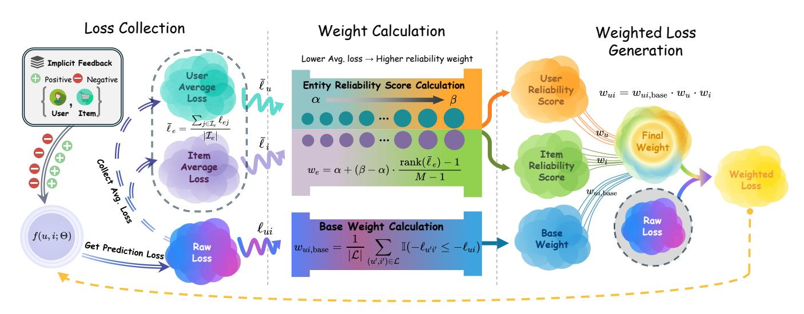

Figure 2: Overview of EARD. At the end of each epoch, the framework performs three steps: (1) Collect Loss: gather losses for all interactions and compute average loss per entity; (2) Entity Reliability and Base Weight Calculation: estimate entity reliability via a linear mapping of average loss from �� to ��, and assign base weights using the ECDF of negative losses; (3) Weight Fusion: combine interaction and entity weights through element-wise multiplication to generate training weights for the next epoch.

3) RQ2 (Ablation Study): How do the entity-level and interactionlevel weights contribute to overall performance?

2) RQ3 (Mechanism Insight): Can EARD effectively distinguish true-positive (clean) and false-positive (noisy) interactions based on the learned interaction and entity weights?

4) RQ4 (Hyperparameter Sensitivity): How sensitive is EARD to its hyperparameters �� and ��, and is it easy to tune?

5) RQ5 (Efficiency): What is the computational overhead of EARD, and is it scalable to large datasets? We report peak memory usage and training epochs until convergence, comparing with vanilla training and other denoising methods.

4.1.1 Datasets. We evaluate our framework on three public datasets: Yelp[1](#page-3-1) , Amazon-Book[2](#page-3-2) , and ML-1M[3](#page-3-3) . Following [\[16\]](#page-8-0), we binarize interactions by treating ratings ≤ 3 as false positives (noisy) and &gt; 3 as true positives. Yelp contains user reviews for local businesses. Amazon-Book consists of user ratings for books. ML-1M includes movie ratings from the GroupLens research group.

Table 1: Dataset statistics. "#False Positives" denotes noisy interactions (ratings ≤ 3) addressed by our framework.

| Dataset     | #Users | #Items | #Interactions | #False  | Positives Sparsity |
|-------------|--------|--------|---------------|---------|--------------------|
| Yelp        | 45,548 | 57,396 | 1,672,520     | 260,581 | 0.0640%            |
| Amazon-book | 80,464 | 98,663 | 2,714,021     | 199,475 | 0.0342%            |
| ML-1M       | 6,040  | 3,953  | 706,391       | 338,746 | 2.959%             |

All datasets are randomly split into training, validation, and test sets in an 8:1:1 ratio. Key statistics are summarized in Table [1.](#page-3-4)

4.1.2 Backbone Models. To demonstrate the model-agnostic nature of EARD, we apply it to three representative collaborative filtering models: GMF [\[7\]](#page-8-23), which uses element-wise multiplication of user and item embeddings; NeuMF [\[7\]](#page-8-23), which combines GMF with multilayer perceptrons to model both linear and non-linear interactions; and CDAE [\[20\]](#page-8-24), an autoencoder that reconstructs user interaction vectors from corrupted inputs.

4.1.3 Evaluation Protocol. We follow standard practice by ranking all non-interacted items for each user. Evaluation focuses on truepositive test set, reflecting the goal of recommending items users genuinely prefer. We report two common top-K ranking metrics: Recall@K and NDCG@K, with K={50, 100}.

4.1.4 Baselines. We compared EARD against backbone models and representative denoising baselines, including WRMF [\[9\]](#page-8-9), R-CE [\[16\]](#page-8-0), T-CE [\[16\]](#page-8-0), model-disagreement approaches like DeCA [\[17\]](#page-8-3), BOD [\[18\]](#page-8-4), UDT [\[2\]](#page-8-13) and PLD [\[23\]](#page-8-14). [4](#page-3-5)

4.1.5 Implementation Details. All experiments were conducted on an NVIDIA 4090 GPU using the Adam optimizer [\[12\]](#page-8-25). The embedding size was set to 32, the learning rate to 10−3 , the batch size to 2048, and the negative sampling rate (��) to 1. For EARD, we tuned the hyperparameters �� and �� within the range [0, 5]. The optimal configurations are reported in Table [6](#page-8-26) in Appendix [A.](#page-8-27) To ensure stability and reliability, all results are averaged over five independent runs.

1<https://www.yelp.com/dataset>

2<https://jmcauley.ucsd.edu/data/amazon/>

3<https://grouplens.org/datasets/movielens/1m/>

4We do not compare with LLaRD [\[15\]](#page-8-22), as it relies on additional side information such as item descriptions, user reviews, and external world knowledge from large language models. These resources are unavailable to other baselines and inconsistent with our experimental setup focused on interaction-only data. We also exclude SGDL [\[5\]](#page-8-2) from comparison, as it fails to complete training within a reasonable time on datasets with over one million interactions.

Table 2: Overall performance of three representative backbone trained using seven awesome different denoising methods. 'Recall@K' and 'NDCG@K' are shortened as 'R@K' and 'N@K'. 'Δ%' refers to the relative improvement of our method compared to the other baselines. '\*' indicates statistically significant improvement by t-test (p &lt; 0.05) to other methods.

| Model Method | R@50    | R@100   | ML-1M N@50 | N@100   | R@50    | R@100   | Yelp N@50 | N@100   | R@50    | R@100   | Amazon-book N@50 | N@100   |
|--------------|---------|---------|------------|---------|---------|---------|-----------|---------|---------|---------|------------------|---------|
| Base         | 0.3967  | 0.5523  | 0.3375     | 0.3970  | 0.1020  | 0.1673  | 0.0406    | 0.0552  | 0.0851  | 0.1347  | 0.0341           | 0.0450  |
| WRMF         | 0.3785  | 0.5278  | 0.3286     | 0.3849  | 0.0875  | 0.1427  | 0.0363    | 0.0487  | 0.0734  | 0.1157  | 0.0301           | 0.0394  |
| R-CE         | 0.3749  | 0.5240  | 0.3277     | 0.3840  | 0.0864  | 0.1365  | 0.0367    | 0.0481  | 0.0657  | 0.1041  | 0.0268           | 0.0353  |
| T-CE GMF     | 0.3686  | 0.5226  | 0.3154     | 0.3739  | 0.0900  | 0.1471  | 0.0363    | 0.0493  | 0.0738  | 0.1147  | 0.0306           | 0.0397  |
| DeCA         | 0.2757  | 0.4007  | 0.2294     | 0.2778  | 0.0466  | 0.0823  | 0.0169    | 0.0248  | 0.0616  | 0.1050  | 0.0220           | 0.0314  |
| BOD          | 0.4030  | 0.5569  | 0.3427     | 0.4014  | 0.0954  | 0.1559  | 0.0387    | 0.0522  | 0.0762  | 0.1223  | 0.0302           | 0.0404  |
| PLD          | 0.4121  | 0.5716  | 0.3517     | 0.4128  | 0.0982  | 0.1610  | 0.0394    | 0.0535  | 0.0779  | 0.1251  | 0.0310           | 0.0414  |
| UDT          | 0.4131  | 0.5585  | 0.3426     | 0.3987  | 0.1352  | 0.2118  | 0.0569    | 0.0741  | 0.1228  | 0.1807  | 0.0524           | 0.0653  |
| Ours         | 0.4342* | 0.5851* | 0.3667*    | 0.4241* | 0.1375* | 0.2169* | 0.0575*   | 0.0753* | 0.1193  | 0.1765  | 0.0506           | 0.0633  |
| Δ %          | 5.11%   | 2.36%   | 4.26%      | 2.74%   | 1.70%   | 2.41%   | 1.05%     | 1.62%   | -2.85%  | -2.32%  | -3.44%           | -3.06%  |
| Base         | 0.3868  | 0.5431  | 0.3171     | 0.3770  | 0.0875  | 0.1516  | 0.0332    | 0.0475  | 0.0844  | 0.1341  | 0.0330           | 0.0439  |
| WRMF         | 0.3959  | 0.5495  | 0.3300     | 0.3889  | 0.0806  | 0.1353  | 0.0318    | 0.0441  | 0.0711  | 0.1141  | 0.0280           | 0.0374  |
| R-CE         | 0.3803  | 0.5367  | 0.3188     | 0.3782  | 0.0803  | 0.1306  | 0.0325    | 0.0438  | 0.0606  | 0.0970  | 0.0244           | 0.0324  |
| T-CE NeuMF   | 0.3943  | 0.5533  | 0.3205     | 0.3820  | 0.0831  | 0.1391  | 0.0321    | 0.0447  | 0.0693  | 0.1106  | 0.0274           | 0.0365  |
| DeCA         | 0.2420  | 0.3510  | 0.2109     | 0.2516  | 0.0464  | 0.0904  | 0.0162    | 0.0258  | 0.0420  | 0.0792  | 0.0144           | 0.0222  |
| BOD          | 0.3782  | 0.5242  | 0.3262     | 0.3816  | 0.0851  | 0.1371  | 0.0349    | 0.0467  | 0.0768  | 0.1262  | 0.0287           | 0.0396  |
| PLD          | 0.3847  | 0.5339  | 0.3345     | 0.3920  | 0.0866  | 0.1398  | 0.0357    | 0.0482  | 0.0791  | 0.1293  | 0.0295           | 0.0406  |
| UDT          | 0.4126  | 0.5649  | 0.3314     | 0.3901  | 0.1085  | 0.1790  | 0.0422    | 0.0580  | 0.1091  | 0.1650  | 0.0459           | 0.0583  |
| Ours         | 0.4257* | 0.5747* | 0.3617*    | 0.4181* | 0.1306* | 0.2057* | 0.0536*   | 0.0704* | 0.1235* | 0.1820* | 0.0530*          | 0.0658* |
| Δ %          | 3.17%   | 1.73%   | 8.13%      | 6.66%   | 20.37%  | 14.92%  | 27.01%    | 21.38%  | 13.20%  | 10.30%  | 15.47%           | 12.86%  |
| Base         | 0.4299  | 0.5802  | 0.3656     | 0.4252  | 0.1165  | 0.1877  | 0.0466    | 0.0625  | 0.1024  | 0.1574  | 0.0417           | 0.0538  |
| WRMF         | 0.4095  | 0.5590  | 0.3505     | 0.4081  | 0.0943  | 0.1534  | 0.0375    | 0.0507  | 0.0896  | 0.1372  | 0.0377           | 0.0438  |
| R-CE         | 0.4114  | 0.5600  | 0.3565     | 0.4135  | 0.1161  | 0.1801  | 0.0488    | 0.0632  | 0.1022  | 0.1560  | 0.0424           | 0.0542  |
| T-CE CDAE    | 0.4033  | 0.5572  | 0.3394     | 0.3994  | 0.1165  | 0.1806  | 0.0504    | 0.0652  | 0.1088  | 0.1645  | 0.0454           | 0.0575  |
| DeCA         | 0.2446  | 0.3293  | 0.1763     | 0.2123  | 0.0767  | 0.1212  | 0.0306    | 0.0409  | 0.0663  | 0.1040  | 0.0265           | 0.0343  |
| BOD          | 0.4161  | 0.5668  | 0.3542     | 0.4125  | 0.1115  | 0.1755  | 0.0457    | 0.0601  | 0.0911  | 0.1409  | 0.0374           | 0.0482  |
| PLD          | 0.4296  | 0.5836  | 0.3620     | 0.4200  | 0.1144  | 0.1804  | 0.0468    | 0.0618  | 0.0932  | 0.1441  | 0.0383           | 0.0492  |
| UDT          | 0.4347  | 0.5818  | 0.3749     | 0.4317  | 0.1321  | 0.2013  | 0.0566    | 0.0722  | 0.1219  | 0.1768  | 0.0525           | 0.0647  |
| Ours         | 0.4500* | 0.5930* | 0.3900*    | 0.4447* | 0.1562* | 0.2346* | 0.0675*   | 0.0850* | 0.1447* | 0.2073* | 0.0633*          | 0.0770* |
| Δ %          | 3.52%   | 1.61%   | 4.03%      | 3.01%   | 18.24%  | 16.54%  | 19.26%    | 17.73%  | 18.70%  | 17.25%  | 20.57%           | 19.01%  |

# 4.2 Performance Comparison (RQ1)

We benchmarked EARD against state-of-the-art baselines across all datasets and backbone models, using their best reported configurations for a fair comparison.

As shown in Table [2,](#page-4-0) EARD consistently outperforms all baselines. Heuristic methods such as R-CE and T-CE yield unstable results and occasionally underperform the backbone, indicating that naively pruning high-loss samples can discard informative but challenging instances. More complex approaches like DeCA also underperform, suggesting that added architectural complexity does not guarantee improved denoising. In contrast, EARD achieves robust gains by leveraging entity-level attribution, with particularly strong improvements on larger datasets where performance gaps are more pronounced. Notably, even on CDAE, which is inherently robust to noise, EARD delivers significant improvements (e.g., +19.26% and +20.57% NDCG@50 on Yelp and Amazon-Book), demonstrating its complementarity to model-based robustness.

Compared to UDT, EARD generally achieves superior performance, especially on advanced models like NeuMF and CDAE. The only exception is GMF on Amazon-Book, where UDT slightly outperforms it. On NeuMF, EARD delivers an average NDCG@50 improvement of up to 27.01% on Yelp. It also requires fewer hyperparameters (Ours: 2 vs. UDT: 4), making it more efficient to tune and better suited for practical deployment. These results highlight the advantage of entity-level modeling for denoising implicit feedback.

## 4.3 Ablation Study (RQ2)

4.3.1 Component Contribution Analysis. We conducted an ablation study (Table [3\)](#page-5-0) to evaluate the contribution of each component in EARD, which comprises three elements: the interaction-specific Base Weight (BW), Item Factor (IF), and User Factor (UF). Each component was selectively disabled, and performance was measured using Recall@50/100 and NDCG@50/100.

Table 3: Ablation results on ML-1M, Yelp, and Amazon-Book for GMF, NeuMF, and CDAE. We evaluate three components: ECDF-based Weight (BW), Item Weight (IF), and User Weight (UF). ✓indicates active, × indicates inactive.

| Model BW | Components IF UF | R@50   | R@100  | ML-1M N@50 | N@100  | R@50   | R@100  | Yelp N@50 | N@100  | R@50   | R@100  | Amazon-book N@50 | N@100  |
|----------|------------------|--------|--------|------------|--------|--------|--------|-----------|--------|--------|--------|------------------|--------|
| ×        | × ×              | 0.3967 | 0.5523 | 0.3375     | 0.3970 | 0.1020 | 0.1673 | 0.0406    | 0.0552 | 0.0851 | 0.1347 | 0.0341           | 0.0450 |
| ✓        | × ×              | 0.4271 | 0.5765 | 0.3593     | 0.4166 | 0.1373 | 0.2158 | 0.0575    | 0.0750 | 0.1143 | 0.1745 | 0.0471           | 0.0604 |
| ✓ GMF    | ✓ ×              | 0.4353 | 0.5821 | 0.3681     | 0.4242 | 0.1373 | 0.2164 | 0.0574    | 0.0751 | 0.1190 | 0.1795 | 0.0498           | 0.0631 |
| ✓        | × ✓              | 0.4286 | 0.5813 | 0.3636     | 0.4218 | 0.1380 | 0.2163 | 0.0577    | 0.0752 | 0.1195 | 0.1806 | 0.0499           | 0.0633 |
| ✓        | ✓ ✓              | 0.4342 | 0.5851 | 0.3667     | 0.4241 | 0.1375 | 0.2169 | 0.0575    | 0.0753 | 0.1193 | 0.1765 | 0.0506           | 0.0633 |
| ×        | × ×              | 0.3868 | 0.5431 | 0.3171     | 0.3770 | 0.0875 | 0.1516 | 0.0332    | 0.0475 | 0.0844 | 0.1341 | 0.0330           | 0.0439 |
| ✓        | × ×              | 0.4226 | 0.5740 | 0.3605     | 0.4176 | 0.1040 | 0.1713 | 0.0410    | 0.0516 | 0.0912 | 0.1445 | 0.0361           | 0.0479 |
| ✓ NeuMF  | ✓ ×              | 0.4252 | 0.5739 | 0.3623     | 0.4184 | 0.1238 | 0.1984 | 0.0494    | 0.0660 | 0.1104 | 0.1677 | 0.0453           | 0.0578 |
| ✓        | × ✓              | 0.4225 | 0.5738 | 0.3595     | 0.4166 | 0.1203 | 0.1959 | 0.0480    | 0.0649 | 0.1086 | 0.1676 | 0.0446           | 0.0576 |
| ✓        | ✓ ✓              | 0.4257 | 0.5747 | 0.3617     | 0.4181 | 0.1306 | 0.2057 | 0.0536    | 0.0704 | 0.1235 | 0.1820 | 0.0530           | 0.0658 |
| ×        | × ×              | 0.4299 | 0.5802 | 0.3656     | 0.4252 | 0.1165 | 0.1877 | 0.0466    | 0.0625 | 0.1024 | 0.1574 | 0.0417           | 0.0538 |
| ✓        | × ×              | 0.4390 | 0.5871 | 0.3794     | 0.4365 | 0.1509 | 0.2299 | 0.0636    | 0.0812 | 0.1389 | 0.2030 | 0.0592           | 0.0731 |
| ✓ CDAE   | ✓ ×              | 0.4405 | 0.5839 | 0.3855     | 0.4404 | 0.1535 | 0.2318 | 0.0652    | 0.0827 | 0.1426 | 0.2055 | 0.0619           | 0.0756 |
| ✓        | × ✓              | 0.4447 | 0.5918 | 0.3820     | 0.4390 | 0.1573 | 0.2371 | 0.0664    | 0.0841 | 0.1458 | 0.2101 | 0.0633           | 0.0773 |
| ✓        | ✓ ✓              | 0.4500 | 0.5930 | 0.3900     | 0.4447 | 0.1562 | 0.2346 | 0.0675    | 0.0850 | 0.1447 | 0.2073 | 0.0633           | 0.0770 |

The Foundational Role of Interaction-level Weighting (BW).. Enabling only BW (✓,×,×) yields a clear and substantial improvement over the vanilla baseline (×,×,×) across all models and datasets. For instance, on NeuMF with the ML-1M dataset, relying solely on BW increases NDCG@50 from 0.3171 to 0.3605, a relative gain of 13.7%. This result strongly substantiates our core hypothesis: an interaction's training loss serves as a powerful and reliable proxy for its underlying quality and can be directly exploited for effective denoising, forming the foundation of our framework.

Complementary and Context-Dependent Effects of Entity Factors (IF & UF).. Introducing either the Item Factor or the User Factor on top of BW almost always brings further performance gains, demonstrating the critical value of entity-aware modeling. The effects of IF and UF appear to be complementary and context-dependent. For example, the User Factor (✓,×,✓) shows a particularly strong impact on the CDAE model with the Amazon-Book dataset, suggesting that when user behaviors are highly diverse and noisy, explicitly modeling user-specific reliability is crucial. Conversely, the Item Factor (✓,✓,×) achieves the best performance on three out of four metrics for GMF on ML-1M, indicating that in scenarios where item-side noise (e.g., clickbait or low-quality items) is dominant, identifying unreliable items is a primary driver of improvement.

Synergy in Full Configuration and Its Implications. The full EARD configuration (✓,✓,✓) generally delivers top-tier performance, highlighting the strong synergy among its components. BW provides a solid foundation for interaction quality, while IF and UF contribute personalized and orthogonal signals that enhance reliability. For instance, on the Yelp dataset with NeuMF, the full model achieves an NDCG@50 of 0.0536, outperforming BW-only by 30.7%, BW+IF by 8.5%, and BW+UF by 11.7%. These results demonstrate that modeling all three factors together enables EARD to generalize effectively in sparse and noisy environments.

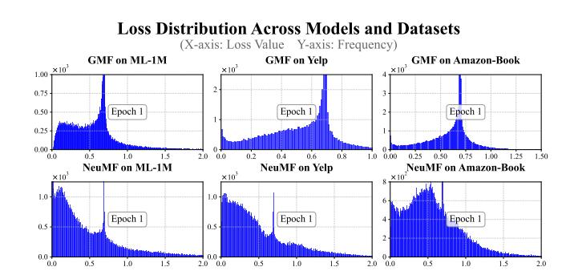

Figure 3: Training loss distributions at the end of the first epoch across different models and datasets.

4.3.2 Exploration of Base Weight Calculation Methods. The interactionspecific Base Weight (BW) plays a critical role in EARD. As shown in Figure [3](#page-5-1) shows that the loss distributions of different models and datasets do not follow the same pattern and often contain long-tail outliers. This highlights the need for a weight calculation method that can adapt to diverse distribution shapes with a nonparametric weight function while enhancing robustness by reducing the influence of extreme values. ECDF is distributionagnostic and resistant to the influence of outliers, since its output depends on relative rank rather than absolute magnitudes. Moreover, it provides smooth weights over the [0, 1] interval, avoiding the information loss caused by hard thresholds and yielding a stable denoising process.

To validate its effectiveness, we compared ECDF against four alternative strategies: (1) Uniform: assigns a constant weight of 1 to all samples; (2) GMM: fits a Gaussian Mixture Model to the loss distribution; (3) Top-�� Selection: retains only the k lowestloss samples per batch; (4) Linear Scaling: applies a direct linear transformation to the losses. Each strategy replaces only the ECDF

Table 4: Full evaluation of different base weighting strategies (Uniform, GMM, Top-�� Selection, Linear Scaling, ECDF) integrated into the EARD framework, across three datasets and three models. Metrics include Recall@50/100 and NDCG@50/100. ECDF consistently achieves the highest performance, validating its effectiveness and robustness.

| Model Method         | R@50   | R@100  | ML-1M N@50 | N@100  | R@50   | R@100  | Yelp N@50 | N@100  | R@50   | R@100  | Amazon-Book N@50 | N@100  |
|----------------------|--------|--------|------------|--------|--------|--------|-----------|--------|--------|--------|------------------|--------|
| Uniform              | 0.3844 | 0.5393 | 0.3219     | 0.3815 | 0.1028 | 0.1679 | 0.0410    | 0.0555 | 0.1136 | 0.1743 | 0.0474           | 0.0608 |
| Top- �� Selection    | 0.4011 | 0.5668 | 0.3161     | 0.3806 | 0.1266 | 0.1995 | 0.0530    | 0.0695 | 0.0980 | 0.1486 | 0.0415           | 0.0529 |
| Linear Scaling GMF   | 0.3873 | 0.5421 | 0.3244     | 0.3889 | 0.1026 | 0.1682 | 0.0409    | 0.0556 | 0.1138 | 0.1742 | 0.0475           | 0.0608 |
| GMM                  | 0.3215 | 0.4501 | 0.2853     | 0.3337 | 0.0879 | 0.1389 | 0.0367    | 0.0481 | 0.0389 | 0.0629 | 0.0157           | 0.0210 |
| ECDF (Ours)          | 0.4342 | 0.5851 | 0.3667     | 0.4241 | 0.1375 | 0.2169 | 0.0575    | 0.0753 | 0.1193 | 0.1765 | 0.0506           | 0.0633 |
| Uniform              | 0.4005 | 0.5510 | 0.3374     | 0.3944 | 0.1173 | 0.1874 | 0.0470    | 0.0626 | 0.1059 | 0.1604 | 0.0440           | 0.0559 |
| Top- �� Selection    | 0.4073 | 0.5629 | 0.3273     | 0.3868 | 0.1230 | 0.1930 | 0.0511    | 0.0669 | 0.1064 | 0.1567 | 0.0460           | 0.0573 |
| Linear Scaling NeuMF | 0.4023 | 0.5541 | 0.3396     | 0.3971 | 0.1190 | 0.1914 | 0.0482    | 0.0644 | 0.1103 | 0.1682 | 0.0459           | 0.0585 |
| GMM                  | 0.3080 | 0.4364 | 0.2669     | 0.3164 | 0.0427 | 0.0701 | 0.0179    | 0.0241 | 0.0374 | 0.0612 | 0.0159           | 0.0213 |
| ECDF (Ours)          | 0.4257 | 0.5747 | 0.3617     | 0.4181 | 0.1306 | 0.2057 | 0.0536    | 0.0704 | 0.1235 | 0.1820 | 0.0530           | 0.0658 |
| Uniform              | 0.4299 | 0.5779 | 0.3719     | 0.4292 | 0.1426 | 0.2190 | 0.0611    | 0.0781 | 0.1256 | 0.1853 | 0.0537           | 0.0667 |
| Top- �� Selection    | 0.4349 | 0.5780 | 0.3682     | 0.4238 | 0.1470 | 0.2213 | 0.0633    | 0.0800 | 0.1290 | 0.1849 | 0.0572           | 0.0696 |
| Linear Scaling CDAE  | 0.4323 | 0.5805 | 0.3736     | 0.4309 | 0.1430 | 0.2192 | 0.0613    | 0.0783 | 0.1249 | 0.1864 | 0.0533           | 0.0667 |
| GMM                  | 0.3319 | 0.4684 | 0.2836     | 0.3371 | 0.1239 | 0.1864 | 0.0541    | 0.0682 | 0.1178 | 0.1687 | 0.0518           | 0.0629 |
| ECDF                 | 0.4500 | 0.5930 | 0.3900     | 0.4447 | 0.1562 | 0.2346 | 0.0675    | 0.0850 | 0.1447 | 0.2073 | 0.0633           | 0.0770 |

component in the EARD framework. Pseudocode for all methods is provided in Appendix [C.](#page-9-1)

As shown in Table [4,](#page-6-0) ECDF consistently outperforms all alternative weighting strategies, confirming its effectiveness and robustness. The GMM-based method performs poorly due to its reliance on Gaussian assumptions, which fail under the diverse and nonstandard loss distributions. Top-�� Selection applies a hard threshold, discarding high-loss samples entirely, which can eliminate informative but difficult interactions and leads to unstable training behavior. Linear Scaling directly maps loss magnitudes to weights, making it highly sensitive to outliers; a few large losses can dominate the weight range and distort the learning dynamics. In contrast, ECDF relies on loss rank rather than magnitude, making it robust to outliers and distribution-agnostic. Its smooth weighting over [0, 1] preserves fine-grained differences without abrupt cutoffs, making it well-suited for denoising implicit feedback.

## 4.4 Denoising Mechanism Analysis (RQ3)

We analyzed training loss and assigned weights for two groups: true positives (TP), representing clean interactions, and false positives (FP), representing noisy ones. As shown in Figure [4a,](#page-7-0) FP samples generally exhibit higher average losses than TP samples, supporting the small-loss assumption and suggesting that noisy interactions are harder to fit. In contrast, the vanilla model eventually reduces both TP and FP losses toward zero, indicating that it overfits the noise in the absence of denoising.

EARD amplifies the separation between true positive (TP) and false positive (FP) samples during training. As shown in Figure [4b,](#page-7-0) models with our framework maintain a clear and stable gap in assigned weights between TP and FP samples across architectures (GMF and NeuMF) and datasets (ML-1M and Yelp). This separation holds across all component settings (e.g., BW, BW & IF, BW & UF), with TP samples generally receiving higher weights, especially

in early training. For example, on GMF with ML-1M, TP weights quickly converge near 10−1 , while FP weights stay around 10−3 . These results confirm that our reweighting mechanism effectively distinguishes clean from noisy data and guides learning accordingly.

## 4.5 Hyperparameter Sensitivity Analysis (RQ4)

We evaluated the sensitivity of EARD to its two key hyperparameters, �� and ��, which define the bounds of entity weights. A robust model should retain strong performance under small hyperparameter variations. As shown in Figure [5,](#page-7-1) the Recall@50 landscape for NeuMF on ML-1M is smooth and unimodal, with a broad region of high performance. This pattern is consistent across all backbones and datasets, as illustrated in Figures [10](#page-11-0) and [9](#page-11-1) in the appendix.

To quantitatively support the visual observation of a smooth, unimodal landscape, we performed a local curvature analysis using a discrete Hessian-based concavity test (Algorithm [3](#page-11-2) in Appendix [G\)](#page-10-2). The results, shown in Figure [5b,](#page-7-1) reveal a strong correlation between mathematically verified concave regions and the high-performance areas of the landscape. This alignment confirms that the objective surface exhibits a favorable and well-structured geometry, devoid of erratic local optima. Such a "hill-shaped" topology is particularly valuable, as it suggests that EARD is robust to hyperparameter selection; small perturbations near the optimum do not lead to significant performance degradation. As a result, the framework remains easy to tune in practice.

## 4.6 Efficiency Analysis (RQ5)

In practical deployment, it is essential to balance model performance and computational efficiency. To answer RQ5, we compare the overhead of EARD with the vanilla training pipeline and other denoising methods. We measure peak GPU memory usage and the number of training epochs to convergence. To ensure fair and consistent evaluation, we report the number of epochs instead of

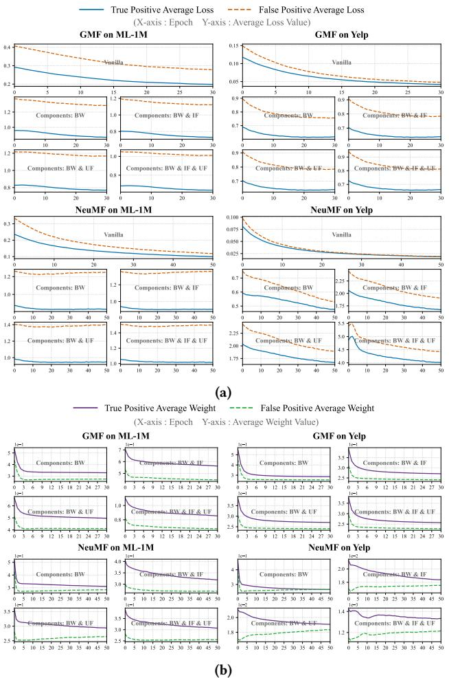

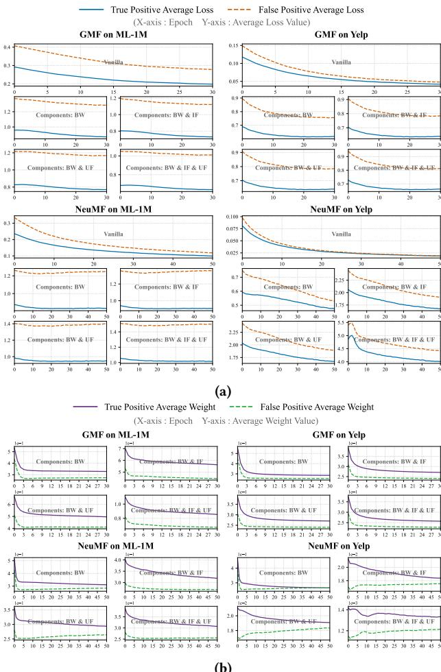

Figure 4: Training dynamics of true positive (TP) and false positive (FP) samples across models and datasets. Base Weight (BW) is interaction-specific, while User Factor (UF) and Item Factor (IF) capture user and item reliability, respectively. (a) TP and FP loss over training epochs. EARD preserves a clear loss gap, with FP samples generally showing higher losses, supporting the small-loss assumption. (b) Assigned weights for TP and FP samples. EARD steadily gives higher weights to TP samples, highlighting its ability to identify clean interactions and suppress noise.

wall-clock time, which can be affected by varying server conditions. Table [5](#page-7-2) presents the results, where validation is conducted after every epoch and early stopping is applied if no improvement is observed for 10 consecutive epochs.

The results demonstrate that EARD offers a clear efficiency advantage. Although it introduces a modest and predictable memory overhead of 5 to 15 percent compared to the vanilla baseline, methods such as DeCA and BOD consume substantially more resources, requiring up to 3x and 2x more memory, respectively. This indicates that EARD achieves performance improvements without incurring the high memory costs typical of co-training auxiliary

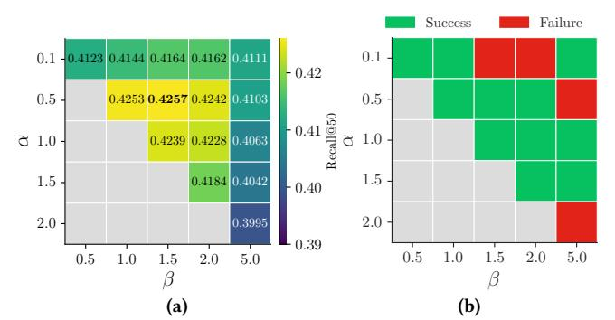

Figure 5: (a) Recall@50 performance landscape over [��, ��] using NeuMF on ML-1M. (b) Hessian-based concavity test at 15 representative points from (a).

models or applying bi-level optimization. Regarding convergence speed, while advanced denoising methods, including ours, DeCA, and BOD, occasionally require more epochs than vanilla training, we attribute this to a more thorough optimization process that avoids premature convergence and yields better final performance.

Table 5: Computational efficiency comparison of denoising methods. Each cell reports peak GPU memory usage (MB, Mem) and training epochs to convergence (Ep). EARD (Ours) generally achieves favorable efficiency with low cost.

| Method  | Mem  | ML-1M Ep | Mem  | GMF Yelp Ep | Mem  | Amazon-Book Ep | Mem  | ML-1M Ep | Mem   | NeuMF Yelp Ep | Mem   | Amazon-Book Ep |
|---------|------|----------|------|-------------|------|----------------|------|----------|-------|---------------|-------|----------------|
| Vanilla | 528  | 46       | 1232 | 172         | 1894 | 131            | 958  | 36       | 6476  | 91            | 10890 | 89             |
| DeCA    | 1510 | 63       | 4050 | 218         | 7346 | 182            | 2972 | 49       | 25347 | 123           | 34325 | 132            |
| BOD     | 1140 | 51       | 2713 | 153         | 4621 | 144            | 2130 | 41       | 14793 | 84            | 28641 | 101            |
| Ours    | 559  | 48       | 1330 | 106         | 2124 | 188            | 1063 | 32       | 7382  | 77            | 11870 | 96             |

In summary, EARD achieves the favorable balance between performance and efficiency. It delivers state-of-the-art results (Table [2\)](#page-4-0) while maintaining a minimal memory footprint compared to other strong baselines. Its lightweight and highly parallelizable design makes it not only effective but also practical for large-scale industrial recommender systems, where the high memory demands of methods such as DeCA and BOD render them impractical.

### 5 Conclusion

We introduced EARD, a lightweight and effective framework for denoising implicit feedback by incorporating both entity- and interactionlevel weight. By leveraging average loss as a proxy for noise, EARD captures user- and item-specific noise patterns and assigns finegrained confidence scores through a nonparametric ECDF-based weighting scheme. Extensive experiments across multiple datasets and backbone models demonstrate consistent improvements over state-of-the-art denoising methods, with lower computational cost and minimal hyperparameter tuning. These results highlight the importance of entity-aware modeling and confirm EARD as a practical and scalable solution for recommendation in noisy environments.

### References

[1] Yoshua Bengio, Jérôme Louradour, Ronan Collobert, and Jason Weston. 2009. Curriculum learning. In Proceedings of the 26th annual international conference on machine learning. 41–48. [2] Haoyan Chua, Yingpeng Du, Zhu Sun, Ziyan Wang, Jie Zhang, and Yew-Soon Ong. 2024. Unified Denoising Training for Recommendation. In Proceedings of the 18th ACM Conference on Recommender Systems. 612–621. [3] Maurizio Ferrari Dacrema, Paolo Cremonesi, and Dietmar Jannach. 2019. Are we really making much progress? A worrying analysis of recent neural recommendation approaches. In Proceedings of the 13th ACM conference on recommender systems. 101–109. [4] Zeno Gantner, Lucas Drumond, Christoph Freudenthaler, and Lars Schmidt-Thieme. 2012. Personalized ranking for non-uniformly sampled items. In Proceedings of KDD cup 2011. PMLR, 231–247. [5] Yunjun Gao, Yuntao Du, Yujia Hu, Lu Chen, Xinjun Zhu, Ziquan Fang, and Baihua Zheng. 2022. Self-guided learning to denoise for robust recommendation. In Proceedings of the 45th international ACM SIGIR conference on research and development in information retrieval. 1412–1422. [6] Bo Han, Quanming Yao, Xingrui Yu, Gang Niu, Miao Xu, Weihua Hu, Ivor Tsang, and Masashi Sugiyama. 2018. Co-teaching: Robust training of deep neural networks with extremely noisy labels. Advances in neural information processing systems 31 (2018). [7] Xiangnan He, Lizi Liao, Hanwang Zhang, Liqiang Nie, Xia Hu, and Tat-Seng Chua. 2017. Neural collaborative filtering. In Proceedings of the 26th international conference on world wide web. 173–182. [8] Zhuangzhuang He, Yifan Wang, Yonghui Yang, Peijie Sun, Le Wu, Haoyue Bai, Jinqi Gong, Richang Hong, and Min Zhang. 2024. Double correction framework for denoising recommendation. In Proceedings of the 30th ACM SIGKDD Conference on Knowledge Discovery and Data Mining. 1062–1072. [9] Yifan Hu, Yehuda Koren, and Chris Volinsky. 2008. Collaborative filtering for implicit feedback datasets. In 2008 Eighth IEEE international conference on data mining. Ieee, 263–272. [10] Yunfan Hu, Zhaopeng Qiu, and Xian Wu. 2022. Denoising neural network for news recommendation with positive and negative implicit feedback. arXiv preprint arXiv:2204.04397 (2022). [11] Lu Jiang, Zhengyuan Zhou, Thomas Leung, Li-Jia Li, and Li Fei-Fei. 2018. Mentornet: Learning data-driven curriculum for very deep neural networks on corrupted labels. In International conference on machine learning. PMLR, 2304–2313. [12] Diederik P. Kingma and Jimmy Ba. 2017. Adam: A Method for Stochastic Optimization. arXiv[:1412.6980](https://arxiv.org/abs/1412.6980) [cs.LG]<https://arxiv.org/abs/1412.6980> [13] Weilin Lin, Xiangyu Zhao, Yejing Wang, Yuanshao Zhu, and Wanyu Wang. 2023. Autodenoise: Automatic data instance denoising for recommendations. In Proceedings of the ACM Web Conference 2023. 1003–1011. [14] Changxin Tian, Yuexiang Xie, Yaliang Li, Nan Yang, and Wayne Xin Zhao. 2022. Learning to denoise unreliable interactions for graph collaborative filtering. In Proceedings of the 45th international ACM SIGIR conference on research and development in information retrieval. 122–132. [15] Shuyao Wang, Zhi Zheng, Yongduo Sui, and Hui Xiong. 2025. Unleashing the Power of Large Language Model for Denoising Recommendation. In Proceedings of the ACM on Web Conference 2025. 252–263. [16] Wenjie Wang, Fuli Feng, Xiangnan He, Liqiang Nie, and Tat-Seng Chua. 2021. Denoising implicit feedback for recommendation. In Proceedings of the 14th ACM international conference on web search and data mining. 373–381. [17] Yu Wang, Xin Xin, Zaiqiao Meng, Joemon M Jose, Fuli Feng, and Xiangnan He. 2022. Learning robust recommenders through cross-model agreement. In Proceedings of the ACM web conference 2022. 2015–2025. [18] Zongwei Wang, Min Gao, Wentao Li, Junliang Yu, Linxin Guo, and Hongzhi Yin. 2023. Efficient bi-level optimization for recommendation denoising. In Proceedings of the 29th ACM SIGKDD conference on knowledge discovery and data mining. 2502–2511. [19] Zitai Wang, Qianqian Xu, Zhiyong Yang, Xiaochun Cao, and Qingming Huang. 2021. Implicit feedbacks are not always favorable: Iterative relabeled one-class collaborative filtering against noisy interactions. In Proceedings of the 29th ACM international conference on multimedia. 3070–3078. [20] Yao Wu, Christopher DuBois, Alice X Zheng, and Martin Ester. 2016. Collaborative denoising auto-encoders for top-n recommender systems. In Proceedings of the ninth ACM international conference on web search and data mining. 153–162. [21] Guipeng Xv, Xinyu Li, Ruobing Xie, Chen Lin, Chong Liu, Feng Xia, Zhanhui Kang, and Leyu Lin. 2024. Improving multi-modal recommender systems by denoising and aligning multi-modal content and user feedback. In Proceedings of the 30th ACM SIGKDD Conference on Knowledge Discovery and Data Mining. 3645–3656. [22] Haibo Ye, Xinjie Li, Yuan Yao, and Hanghang Tong. 2023. Towards robust neural graph collaborative filtering via structure denoising and embedding perturbation. ACM Transactions on Information Systems 41, 3 (2023), 1–28. [23] Kaike Zhang, Qi Cao, Yunfan Wu, Fei Sun, Huawei Shen, and Xueqi Cheng. 2025. Personalized Denoising Implicit Feedback for Robust Recommender System. In Proceedings of the ACM on Web Conference 2025. 4470–4481. [24] Shengyu Zhang, Tan Jiang, Kun Kuang, Fuli Feng, Jin Yu, Jianxin Ma, Zhou Zhao, Jianke Zhu, Hongxia Yang, Tat-Seng Chua, et al. 2023. Sled: Structure learning based denoising for recommendation. ACM Transactions on Information Systems 42, 2 (2023), 1–31. [25] Jujia Zhao, Wang Wenjie, Yiyan Xu, Teng Sun, Fuli Feng, and Tat-Seng Chua. 2024. Denoising diffusion recommender model. In Proceedings of the 47th International ACM SIGIR Conference on Research and Development in Information Retrieval. 1370–1379. [26] Xinjun Zhu, Yuntao Du, Yuren Mao, Lu Chen, Yujia Hu, and Yunjun Gao. 2023. Knowledge-refined denoising network for robust recommendation. In Proceedings of the 46th international ACM SIGIR conference on research and development in information retrieval. 362–371. A Hyperparameter Settings We report the optimal hyperparameter for EARD framework, which is controlled by two key parameters, �� and ��. These were selected via systematic grid search to ensure stable and high-performing results. To account for variations in data characteristics and sparsity, hyperparameters were tuned independently for each model–dataset pair. All results are based on test set performance under the selected settings. Table [6](#page-8-26) summarizes the final [��, ��] values, facilitating reproducibility and fair comparison in future studies. Table 6: Optimal [��, ��] values for EARD across backbone models and datasets, selected via grid search. Model ML-1M Yelp Amazon-book GMF [1.0, 2.0] [0.9, 1.0] [0.14, 0.4] NeuMF [0.5, 1.5] [0.05, 0.1] [0.05, 0.1] CDAE [0.5, 1.5] [0.1, 0.5] [0.1, 0.5] B Comparison of Hyperparameter Design Beyond accuracy, practical usability is critical for deploying denoising frameworks in real-world systems. A key factor is the number and sensitivity of hyperparameters. Many state-of-the-art methods, though theoretically sound, introduce numerous non-intuitive hyperparameters that require extensive tuning, increasing computational cost and complicating deployment. Table 7: Overview of hyperparameter complexity in representative denoising methods. EARD requires only two parameters, offering lower tuning overhead compared to the multi-component designs of DeCA, UDT, and SGDL. Method #Params Hyperparameters and Brief Descriptions DeCA 3 ��: KL-divergence balance weight. ��+: Penalize negatives in positive-denoising. ��−: Penalize positives in negative-denoising. UDT 4 ��, ��: Weight mapping range. ′ , ��′ : Temperature mapping range. SGDL 5 ℎ: Memorization window size. ��2: Weight function learning rate. ���� : Weight function MLP size. ���� : Scheduler LSTM size. ��: Gumbel-Softmax temperature.

|       |     |   |     |   |       |   |    | Yelp |   |     |     |    |     |   |   |   |
|-------|-----|---|-----|---|-------|---|----|------|---|-----|-----|----|-----|---|---|---|
| GMF   | [ 1 | 0 | , 2 | 0 | ] [   | 0 | 9  | , 1  | 0 | ] [ | 0   | 14 | ,   | 0 | 4 | ] |
| NeuMF | [ 0 | 5 | , 1 | 5 | ] [ 0 |   | 05 | , 0  | 1 | ] [ | 0   | 05 | ,   | 0 | 1 | ] |
| CDAE  | [ 0 | 5 | , 1 | 5 | ] [   | 0 | 1  | , 0  | 5 | ]   | [ 0 | 1  | , 0 |   | 5 | ] |

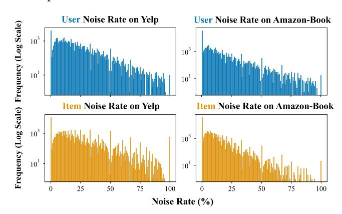

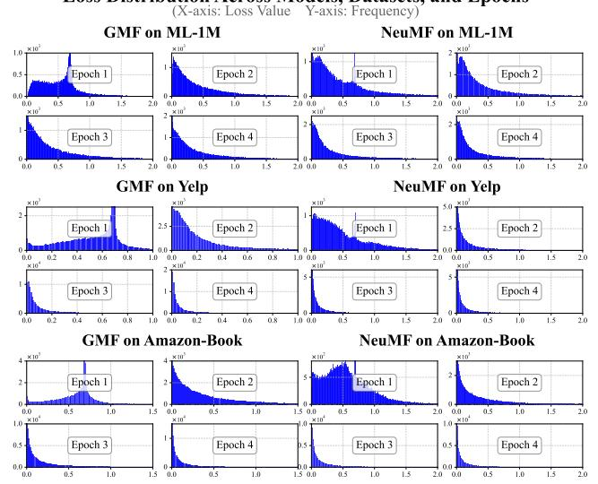

**Loss Distribution Across Models, Datasets, and Epochs**

Figure 7: Histograms of training loss distributions over the first four epochs for GMF and NeuMF on the ML-1M, Yelp, and Amazon-Book datasets.

high degree of variability makes it unrealistic to presuppose any single, fixed distributional form for the losses. Instead, our empirical results show that the distributions for GMF and NeuMF are often complex and non-standard, frequently exhibiting long-tailed and heavily skewed shapes. These distributions also contain numerous

outliers, further complicating any attempt at parametric modeling. These empirical findings highlight the critical need for a base weighting strategy that is both distribution-agnostic and robust to outliers. Parametric methods like Gaussian Mixture Models (GMM) or threshold-based heuristics such as Top-k Selection rely on strong distributional assumptions (e.g., unimodality or Gaussianity), which are clearly violated by the observed diverse and skewed patterns. In contrast, a rank-based approach like ECDF avoids such restrictive assumptions. It naturally resists the influence of extreme values by operating on relative ranks rather than absolute magnitudes, thereby providing stable and consistent weight allocation across diverse training conditions. This strongly motivates our use of ECDF for noise-aware reweighting.

### F Analyzing the Correlation Between Loss Patterns and Noise Rates

Figure [8](#page-10-1) presents a noise-aligned analysis of model behavior from both user and item perspectives. Training instances are grouped by the noise rates of their associated interactions (ranging from 1% to 100%), and average losses are computed within each percentile group over the first four training epochs.

Figure [8a](#page-10-1) illustrates the per-user average loss distributions for GMF and NeuMF across the ML-1M, Yelp, and Amazon-Book datasets. In all cases, a clear and approximately monotonic trend emerges: as user noise rates increase, their corresponding average losses also rise. For example, under GMF on Yelp at Epoch 4, users in the top 20% noise group have losses between 0.6 and 0.8, while those in

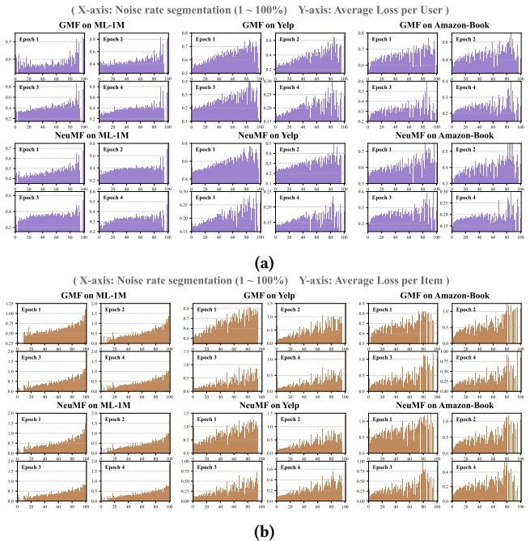

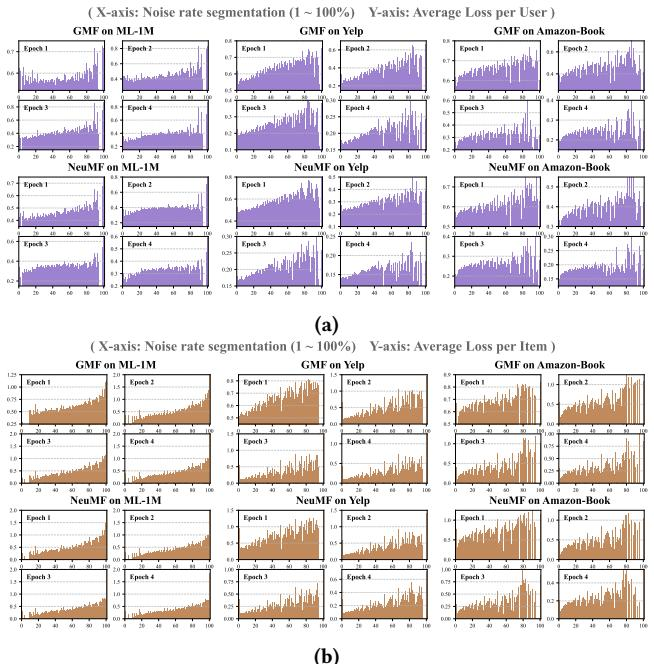

Figure 8: Loss patterns segmented by entity noise rate. (a) Average per-user loss and (b) average per-item loss across 100 noise rate percentiles. A higher entity-level noise rate generally correlates with a higher average training loss, validating its use as a practical reliability proxy.

the bottom 20% remain around 0.2 to 0.3. This trend suggests that user-level loss serves as a meaningful indicator of reliability.

Similarly, Figure [8b](#page-10-1) shows consistent patterns at the item level. Items in higher noise rates tend to incur higher average losses, reinforcing the use of loss as a proxy for identifying noisy interactions.

These results empirically support the core intuition behind EARD: entity-level loss serves as a reliable and quantifiable signal of interaction trustworthiness. The clear alignment between loss and noise across users and items validates loss-based metrics for adaptive reweighting and denoising.

### G Analysis of Hyperparameter Sensitivity

We analyze the impact of the weighting hyperparameters �� and �� on model performance and examine the geometry of the objective surface induced by EARD. Our study spans multiple models and datasets to evaluate both local and global landscape properties.

### G.1 Generalization Across Models and Datasets

To examine whether the approximate concavity of the objective surface generalizes across model architectures and datasets, we plot Recall@50 heatmaps for GMF, NeuMF, and CDAE on three benchmarks: ML-1M, Yelp, and Amazon-Book (Figure [9\)](#page-11-1). Each heatmap visualizes the average Recall@50 over a grid of (��, ��) values.

Across all settings, the heatmaps generally reveal hill-like patterns. This global concavity is observed in both simple (e.g., GMF) and expressive (e.g., NeuMF) models, and remains stable across

datasets with varying levels of sparsity and noise. These results support the hypothesis that the EARD objective surface is approximately concave in practice, with a well-defined local optimum. This property facilitates stable optimization using gradient-based or local search methods, and highlights the generalizability of the proposed hyperparameter design.

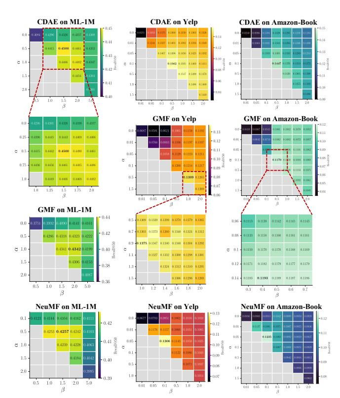

Figure 9: Hyperparameter sensitivity analysis across all models and datasets. The heatmaps of Recall@50 performance for varying �� and �� generally reveal a smooth, approximately concave landscape, validating the framework's robustness to its hyperparameter choices.

### G.2 Concavity Verification via Hessian Matrix

We adopt a second-order approximation method to examine the local curvature of the performance landscape around specific (��, ��) configurations. Specifically, we calculate the discrete Hessian matrix over a 3 × 3 grid of Recall@50 scores centered at each anchor point. As outlined in Algorithm [3,](#page-11-2) the second-order partial derivatives are computed using finite difference methods, and the determinant of the Hessian matrix det(��) is used to assess local curvature. A point is considered locally concave if ��11 &lt; 0 and det(��) &gt; 0, indicating a "hill"-shaped performance landscape.

To assess the smoothness and concavity of the performance surface, we conduct a fine-grained sweep of (��, ��) hyperparameters for the NeuMF model on ML-1M, as shown in Figure [10.](#page-11-0) Sampling around 15 anchor points at a 0.01 resolution reveals a clear unimodal landscape with peak performance at the center and gradual decline

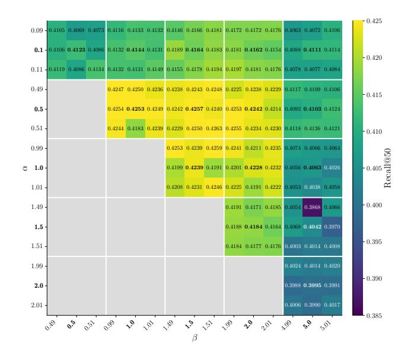

Figure 10: Heatmap of NeuMF performance on ML-1M (Recall@50), generated by finely sampling [��, ��] around 15 anchor points (bolded). Brighter regions indicate better performance and align with Hessian-based analysis, empirically supporting local concavity in high-performance areas.

toward the edges. This pattern aligns with the Hessian-based results in Figure [5b,](#page-7-1) where most points exhibit local concavity. These results further confirm the unimodal geometry of the objective surface and demonstrate that EARD maintains stable performance under small hyperparameter variations.

Definition: The function �� (��, ��) denotes the model's evaluation score (e.g., Recall@50) on the test set, obtained after training with hyperparameters �� = �� and �� = ��.

### Algorithm 3 Verify Local Concavity via Discrete Hessian Test

Require: A 3 × 3 grid of function values F centered at ���� = �� (��, ��), with step sizes ℎ�� , ℎ��.

Ensure: Local curvature: Concave, Convex, Saddle Point, or Indeterminate. 1: {Compute second-order partial derivatives using finite differences from grid F} 2: ��11 ← (����+ℎ,�� − 2���� + ����−ℎ,�� )/ℎ �� 3: ��22 ← (����,��+ℎ − 2���� + ����,��−ℎ )/ℎ 4: ��12 ← (����+ℎ,��+ℎ − ����−ℎ,��+ℎ − ����+ℎ,��−ℎ + ����−ℎ,��−ℎ )/(4ℎ��ℎ�� ) 5: Compute determinant: det(�� ) ← ��11��22 − �� 2 12. 6: if ��11 &lt; 0 and det(�� ) &gt; 0 then 7: return Locally Concave ('hill') 8: else if ��11 &gt; 0 and det(�� ) &gt; 0 then 9: return Locally Convex ('basin') 10: else if det(�� ) &lt; 0 then 11: return Saddle Point 12: else 13: return Indeterminate