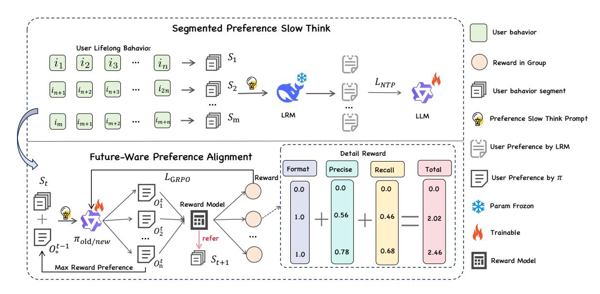
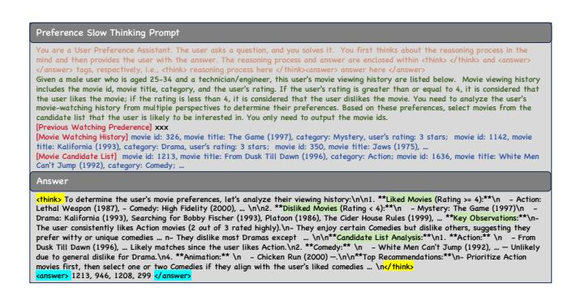
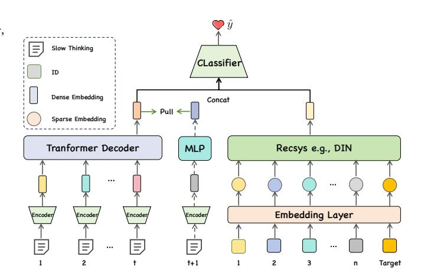
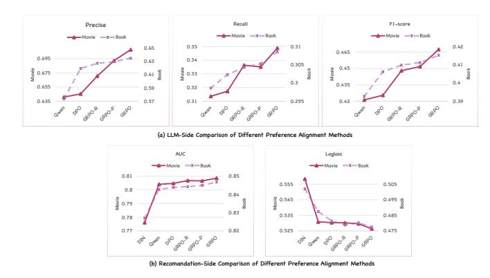
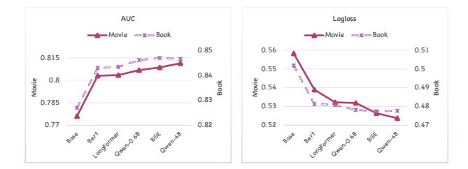

# Reinforcement Learning-Constrained Segmented User Modeling with Large Language Models for Recommendation

[Yu Xia](https://orcid.org/0009-0002-4128-6968)

Institute of Software, Chinese Academy of Sciences University of Chinese Academy of Sciences, Beijing, China xiayu24@mails.ucas.ac.cn

[Qing Tan](https://orcid.org/0009-0008-0552-2840)

Institute of Software, Chinese Academy of Sciences University of Chinese Academy of Sciences, Beijing, China tanqing24@mails.ucas.ac.cn

[He Chen](https://orcid.org/0009-0007-0020-3237)

Institute of Software, Chinese Academy of Sciences Beijing, China chenhe@iscas.ac.cn

[Jingyu Chen](https://orcid.org/0000-0001-7083-0948)

Institute of Software, Chinese Academy of Sciences Beijing, China chenjingyu@iscas.ac.cn

[Qian Dong](https://orcid.org/0009-0005-8711-6069)∗

Institute of Software, Chinese Academy of Sciences Beijing, China dongqian@iscas.ac.cn

# Abstract

Large Language Models (LLMs) with powerful reasoning capabilities, offer new opportunities for recommendation systems (RS) , especially in understanding user preference. However, the direct application of LLMs to this task faces two major challenges: (1) limited context windows struggle to process the extensive user behavior sequences in real-world scenarios; (2) inherent hallucination effect can lead LLMs to infer spurious preferences that contradict true user intent, thereby degrading recommendation quality. To address this, we propose ������2 , a Reinforcement learning-constrained segmented user modeling framework for recommendation. The framework segments lengthy behavior sequences into multiple segments and generates user preferences in a cascaded fashion. To suppress hallucinations and align with user intent, we introduce reinforcement learning, which uses the subsequent behavior segment as a supervisory signal to constrain and reward the preference inference process on the current segment, thereby generating more predictive and high-fidelity user preferences. Finally, the aligned LLMs infer preferences for each behavior segment; these are then processed by a specially-designed dynamic preference learning module to model preference evolution and are ultimately aggregated into a unified, dynamic long-term user preference embedding. This representation can be integrated into any recommendation model to boost its performance. Extensive experiments demonstrate that ������2 significantly enhances recommendation performance by effectively capturing dynamic and authentic user preferences.

# CCS Concepts

### • Information systems → Recommender systems.

∗Corresponding authors. This paper is supported by the Youth Innovation Promotion Association CAS.

[This work is licensed under a Creative Commons Attribution-NonCommercial-](https://creativecommons.org/licenses/by-nc-nd/4.0)[NoDerivatives 4.0 International License.](https://creativecommons.org/licenses/by-nc-nd/4.0)

WWW '26, Dubai, United Arab Emirates © 2026 Copyright held by the owner/author(s). ACM ISBN 979-8-4007-2307-0/2026/04 <https://doi.org/10.1145/3774904.3792130>

# Keywords

Large Language Models; Reinforcement Learning; Recommender Systems; Segmented User Modeling

### ACM Reference Format:

Yu Xia, Qing Tan, He Chen, Jingyu Chen, and Qian Dong. 2026. Reinforcement Learning-Constrained Segmented User Modeling with Large Language Models for Recommendation. In Proceedings of the ACM Web Conference 2026 (WWW '26), April 13–17, 2026, Dubai, United Arab Emirates. ACM, New York, NY, USA, [12](#page-11-0) pages.<https://doi.org/10.1145/3774904.3792130>

# 1 Introduction

Recommendation Systems (RS) are ubiquitous in online services, significantly enhancing user experience across various domains such as e-commerce [\[31\]](#page-8-0), short-form video platforms [\[8\]](#page-8-1), and video and music recommendation [\[6,](#page-8-2) [30\]](#page-8-3). Traditional recommendation models primarily rely on ID embeddings to learn user-item interactions. Although these models have achieved considerable success, they tend to memorize user behaviors rather than genuinely understanding user preference and item attributes, consequently leading to the "information cocoon" or "filter bubble" effect. In recent years, Large Language Models (LLMs) have made remarkable breakthroughs, demonstrating exceptional understanding and reasoning capabilities. Some recent studies attempt to leverage the world knowledge and powerful reasoning abilities of LLMs to infer user preference and uncover more information about items. This approach has shown promise in mitigating the cold-start problem and alleviating the information cocoon issue to some extent.

The continuous interaction between RS and users generates massive volumes of user behaviors. Recently, some ID-based methods [\[17,](#page-8-4) [47\]](#page-9-0) have achieved significant performance improvements by learning from longer user sequences. However, constrained by context length limitations, LLMs cannot directly extract useful information from lengthy raw text of user behavior sequences. Furthermore, several studies [\[16,](#page-8-5) [18,](#page-8-6) [27\]](#page-8-7) have found that even when the context length does not reach the upper limit of LLMs, its attention to the input information is often uneven, with a bias towards the beginning and end portions. This can lead to deviations when using LLMs to model long user behavior sequences. Some work

[\[35\]](#page-8-8) has attempted to guide generation with process scores, but this does not fundamentally solve the problem. Moreover, due to being pre-trained on vast corpora, the outputs of LLMs exhibit diversity and uncertainty, which may lead them to infer spurious preferences contrary to the user's true intent, thereby affecting the final recommendation performance. Therefore, how to align the generative space of LLMs with the objectives of RS remains a critical and unresolved challenge.

To address these issues, we propose ������2 . This framework adopts a "segment-cascade" approach to model user preference, enabling LLMs to incorporate massive user behaviors into the preference modeling process. Specifically, ������2 consists of three core components: (1) Segmented Preference Slow Think, (2) Future-Aware Preference Alignment, and (3) Dynamic Preference Learning.

Given the context length limitations of LLMs, we draw inspiration from the "divide and conquer" strategy. We segment the lengthy user behavior sequence into multiple behavior segments and employ a cascading approach for slow thinking preference generation. However, cascading methods are often susceptible to error accumulation or a decline in modeling quality [\[12\]](#page-8-9). To mitigate this issue, while also suppressing hallucinations and enhancing the accuracy of user modeling, we innovatively introduce reinforcement learning (RL) for user intent alignment. We utilize the user's actual behavior in the subsequent behavior segment as a supervisory signal to constrain and reward the LLM's preference inference process in the current behavior segment. This guides the LLM to generate preferences that are more forward-looking and have higher fidelity. Finally, we leverage the aligned LLM to perform preference inference on each user behavior segment. Subsequently, through a specially designed dynamic preference learning module, we model the evolution of user interests by aggregating these discrete preferences into a unified, dynamic, and future-aware user preference embedding. This representation can be integrated into any recommendation model to boost its performance. Our code are available at https://github.com/xiayu-cell/Rec-2.

Our contributions can be summarized as follows:

- We propose ������2 , a Reinforcement learning-constrained segmented user modeling framework for recommendation. The framework adopts a "segment-cascade" approach to model user preferences, enabling LLMs to incorporate massive user behaviors into the preference modeling process.
- The proposed ������2 framework consists of three core components:
  - (1) Segmented Preference Slow Think, (2) Future-Aware Preference Alignment, and (3) Dynamic Preference Learning. Within a cascading paradigm, ������2 utilizes future segmented user behaviors as rewards for reinforcement learning to achieve user intent alignment. Dynamic Preference Learning module can model the evolution of user preferences and aggregate all the segmented preference representations. This representation can be integrated into any traditional recommendation model to enhance its performance.
- We conduct extensive experiments on two public datasets to validate the effectiveness of ������2 . Furthermore, a series of ablation studies confirm that ������2 can effectively address the limitations imposed on LLMs by long behavior sequences and align with user intent, thereby better assisting the recommendation task.

### 2 Related Work

### 2.1 LLM for Recommendation

In recent years, leveraging LLMs to build RS has garnered significant attention [\[9,](#page-8-10) [22,](#page-8-11) [28,](#page-8-12) [39\]](#page-8-13). Generally, based on the different roles LLMs play in the recommendation process, current LLM-based recommendation systems can be primarily divided into two major research directions [\[21,](#page-8-14) [33\]](#page-8-15). (1) LLM as a Ranker. This paradigm typically involves using LLMs to predict the probability of a user converting on an item or to rank a list of candidate items. However, due to the inherent gap between the pre-training objectives of LLMs and the tasks in recommendation, their ranking capabilities are somewhat limited. Consequently, recent studies [\[1,](#page-8-16) [40,](#page-8-17) [41\]](#page-8-18) focus on enhancing the recommendation abilities of LLMs through methods such as instruction tuning and the injection of collaborative information. For instance, TallRec [\[6\]](#page-8-2) employs the parameter-efficient LoRA [\[13\]](#page-8-19) technique for fine-tuning on recommendation data. CoLLM and BinLLM [\[40,](#page-8-17) [41\]](#page-8-18) improve the recommendation performance of LLMs by incorporating ID features during the fine-tuning process. DMPO [\[1\]](#page-8-16) fine-tunes the model by constructing ranking preference data and applying DPO [\[26\]](#page-8-20) technology to enhance the ranking capabilities of LLMs. (2) LLM as a Knowledge Augmenter. This approach mainly utilizes LLMs to generate auxiliary information to boost the performance of recommendation models. For example, KAR [\[34\]](#page-8-21) uses a portion of the user behavior sequence and the target item to extract user preferences and item knowledge via GPT-3.5[\[23\]](#page-8-22), providing semantic information for the recommendation task. TrackRec [\[36\]](#page-8-23) further improves recommendation effectiveness by aligning user preferences through iterative alternating feedback learning. HiT-LBM [\[35\]](#page-8-8) adopts a partitioning strategy to generate multiple user summaries, which are subsequently aggregated into a unified user representation to improve recommendation accuracy.

# 2.2 Slow Think in Large Reasoner Model

Slow thinking [\[10\]](#page-8-24), where a Large Reasoner Model (LRM) engages in a longer duration of thought (i.e., generating longer reasoning chains) before providing a final answer, has shown exceptional capabilities in complex reasoning tasks. Recent research focus on enhancing the deep thinking abilities of LLMs through methods such as long chain-of-thought [\[4\]](#page-8-25), multi-policy reasoning [\[37\]](#page-8-26), and self-improvement [\[5\]](#page-8-27). For example, BOLT [\[24\]](#page-8-28) elicits the long-chain reasoning capabilities of LLMs of various sizes through a three-stage process of data bootstrapping, supervised fine-tuning, and online training. Mento [\[37\]](#page-8-26) enhances LLM performance using iterative preference optimization augmented with Monte Carlo Tree Search. R-Zero [\[14\]](#page-8-29) employs the self-play technique [\[5\]](#page-8-27) to achieve selfevolution, continuously improving the reasoning abilities of LLMs. Therefore, introducing slow thinking into user preference modeling is a highly promising direction. However, due to issues such as closed-source models and data security concerns, the exploration of slow thinking in the recommendation domain has been limited.

# 3 Methodology

To eliminate the biases and hallucinations of LLMs and overcome context length limitations, we propose ������2 , as shown in Figure

model. By learning the collaborative relationships of sequential IDs and their association with the target item, the recommendation model produces a representation of the final user collaboration, �������������� . We feed the dynamically learned user preference embedding and the user collaboration embedding together into the final decision-making layer to jointly learn the user's behavior. The specifics are as follows:

��dense = Aggr(ℎ), ��collab = Recsys(��,�� ) ��ˆ = �� (rcollab, rdense; ��) (14)

Here, Aggr represents an aggregation function, �� and �� represent the user ID sequence and the Target ID, respectively. In this step, we use the binary cross-entropy loss for optimization:

L������ = − 1 �� ∑︁�� ��=1 �� log��ˆ + (1 − ��) log(1 − ��ˆ) (15)

Therefore, our final total loss function is:

L = L������ + ��L�� ���� (16)

Here, �� is a balancing hyperparameter.

# 4 Experiments

Table 1: Statistics of datasets used in this paper

In this section, we conduct extensive experiments on public datasets to answer the following research questions:

- RQ1: What improvements can ������2 bring to traditional models in Click-Through Rate (CTR) tasks?
- RQ2: How does ������2 perform compared to other baseline models for user behavior modeling?
- RQ3: What is the impact of the different components within ������2 on recommendation performance?
- RQ4: What is the impact of different preference alignment mechanisms on Rec2 ?
- RQ5: How do different preference encoders affect the performance of ������2 ?

### 4.1 Experimental Setup

4.1.1 Datasets. Experiments are conducted based on the following two public datasets. MovieLens-1M[1](#page-5-0) is a movie rating dataset. Following the methodology of previous studies [\[34,](#page-8-21) [35\]](#page-8-8), we mark samples with ratings higher than 3 as positive instances and the rest as negative instances. We also filter out users with fewer than 30 ratings. For recommendation model, the dataset is split into training and testing sets at a 9:1 ratio based on the global timestamps. For the LLM, we divide the data based on the number of user behavior segments into a cold-start dataset, a preference alignment dataset, and a test set at a 2:6:2 ratio. Amazon Book[2](#page-5-1) is derived from the

Books category of the Amazon Review Dataset. Its preprocessing procedure is consistent with that of MovieLens-1M. Additionally, we consider samples with a rating of 5 as positive instances and all others as negative instances. The statistics of each dataset after processing are shown in Table [1.](#page-5-2)

4.1.2 Backbone Models. Due to the model-agnostic nature of ������2 , we select several classic CTR and CVR models to validate its effectiveness. AutoInt [\[29\]](#page-8-30) adopts a self-attentive neural network with residual connections to model the interactions explicitly. DeepFM [\[11\]](#page-8-31) use factorization machine to capture low-order and high-order feature interactions. xDeepFM [\[20\]](#page-8-32) propose a novel Compressed Interaction Network, which aims to generate feature interactions in an explicit fashion and at the vector-wise level. FiGNN [\[19\]](#page-8-33) design a novel model Feature Interaction Graph Neural Networks to take advantage of the strong representative power of graphs. FiBiNet [\[15\]](#page-8-34) is an abbreviation for Feature Importance and Bilinear feature Interaction NETwork is proposed to dynamically learn the feature importance and fine-grained feature interactions. DCN [\[32\]](#page-8-35) incorporates cross-network architecture to learn the bounded-degree feature interactions. DIN [\[45\]](#page-9-1) utilizes attention to model user interests dynamically with respect to a certain item. DIEN [\[44\]](#page-9-2) introduces an interest evolving mechanism to capture the dynamic evolution of user interests over time.

4.1.3 Competitors. We compare our method with other user behavior modeling approaches, including: (1) Traditional sequential recommendation models: DIN [\[45\]](#page-9-1) and SIM [\[25\]](#page-8-36); and (2) LLMenhanced recommendation models: KAR [\[34\]](#page-8-21), TRSR [\[43\]](#page-9-3), LIBER [\[46\]](#page-9-4), TrackRec [\[36\]](#page-8-23), and HiT-LBM [\[35\]](#page-8-8). To ensure a fair comparison, we standardized the data and features for all methods. The following are brief introductions to these methods: SIM Conducts a similarity search over all of the user's historical behaviors to select the Top-K behaviors, which are then used for user modeling. KAR Utilizes a portion of the user's behavior sequence and the target item to extract user preferences and item knowledge via GPT-3.5, providing auxiliary information for the recommendation task. LIBER Employs a partitioning strategy to extract multiple user summaries and subsequently fuses them into a unified user representation to enhance recommendation performance. TRSR Generates user preference summaries through a progressive method and uses the user's most recent interests as augmented information for recommendations. TrackRec Performs user preference alignment through self-play, and the resulting aligned preferences are then used in the recommendation model. HiT-LBM Building on a partitioning strategy, it incorporates a process-scoring model to search for the user's optimal preference path.

4.1.4 Parameter Configuration. We set the LLM context length to �� = 2000. We use DeepSeek-R1 [\[10\]](#page-8-24) as LRM to construct the "slow thinking" dataset and use Qwen2.5-7B [\[38\]](#page-8-37) for preference generation and alignment. For RL-based preference alignment, the number of in-group preference samples is set to �� = 8. The training employs the AdamW optimizer with a learning rate of 1 × 10−6 . In dynamic preference learning module, we set balancing hyperparameter �� = 1.0; BGE [\[3\]](#page-8-38) is used as the encoder. Other parameters for the recommendation model, such as batch size and learning rate, are determined via grid search to achieve optimal performance. To

1<https://movielens.org/>

2<https://nijianmo.github.io/amazon/index.html>

Table 2: Effectiveness Analysis of ������2 Across Different Backbone CTR Models on MovieLens and Amazon-books Datasets.

| Models  | Base   |        | AUC Our | Rel.Impr. | MovieLens-1M Base |        | LogLoss Our | Rel.Impr. | Base   |        | AUC Our | Rel.Impr. | Amazon-Book Base |        | LogLoss Our | Rel.Impr. |
|---------|--------|--------|---------|-----------|-------------------|--------|-------------|-----------|--------|--------|---------|-----------|------------------|--------|-------------|-----------|
| DIN     | 0.7779 | 0.8083 | * ↑     | 3.91%     | 0.5577            | 0.5296 | * ↓         | 5.04%     | 0.8323 | 0.8469 | * ↑     | 1.75%     | 0.4946           | 0.4775 | * ↓         | 3.46%     |
| DIEN    | 0.7762 | 0.8094 | * ↑     | 4.28%     | 0.5580            | 0.5297 | * ↓         | 5.07%     | 0.8310 | 0.8470 | * ↑     | 1.93%     | 0.4953           | 0.4729 | * ↓         | 4.52%     |
| DCNv2   | 0.7749 | 0.8119 | * ↑     | 4.77%     | 0.5597            | 0.5354 | * ↓         | 4.34%     | 0.8311 | 0.8458 | * ↑     | 1.77%     | 0.4951           | 0.4750 | * ↓         | 4.06%     |
| DeepFM  | 0.7748 | 0.8096 | * ↑     | 4.49%     | 0.5602            | 0.5270 | * ↓         | 5.93%     | 0.8306 | 0.8463 | * ↑     | 1.89%     | 0.4962           | 0.4752 | * ↓         | 4.23%     |
| xDeepFM | 0.7752 | 0.8077 | * ↑     | 4.19%     | 0.5596            | 0.5307 | * ↓         | 5.16%     | 0.8305 | 0.8465 | * ↑     | 1.93%     | 0.4957           | 0.4767 | * ↓         | 3.83%     |
| AutoInt | 0.7746 | 0.8117 | * ↑     | 4.79%     | 0.5603            | 0.5295 | * ↓         | 5.49%     | 0.8299 | 0.8481 | * ↑     | 2.19%     | 0.4972           | 0.4795 | * ↓         | 3.56%     |
| FiBiNet | 0.7748 | 0.8117 | * ↑     | 4.76%     | 0.5599            | 0.5284 | * ↓         | 5.63%     | 0.8309 | 0.8460 | * ↑     | 1.82%     | 0.4950           | 0.4751 | * ↓         | 4.02%     |
| FiGNN   | 0.7748 | 0.8108 | * ↑     | 4.64%     | 0.5598            | 0.5238 | * ↓         | 6.43%     | 0.8302 | 0.8485 | * ↑     | 2.20%     | 0.4972           | 0.4751 | * ↓         | 4.44%     |

ensure a fair comparison, the parameters of the backbone model and the baselines were also fine-tuned to reach their optimal performance. More implementation details are described in Appendix [A.](#page-9-5)

4.1.5 Evaluation Metrics. On the LLM side, we use Precision, Recall, and F1-score of the <answer> tag to evaluate the precision and comprehensiveness of the LLM's recall based on user preferences. Higher values are indicative of a better alignment of the LLM with the user's intent. On the recommendation model side, We use AUC and LogLoss (binary cross entropy loss) to evaluate the performance. A higher AUC value or a lower Logloss value, even by a small margin can be viewed as a significant improvement in CTR and CVR prediction performance.

### 4.2 Overall Performance

4.2.1 Improvement over different traditional Models (RQ1). We implement ������2 on several representative Click-Through Rate (CTR) and Conversion Rate (CVR) prediction models. Specifically, we replace the Recsys model in the dynamic preference learning module with various CTR/CVR models to observe the impact of ������2 on them. As shown in Table [2,](#page-6-0) the experimental results indicate that as a model-agnostic framework, the application of ������2 leads to significant performance improvement across all models, with an average increase of 4.48% on the MovieLens-1M dataset and 1.93% on the Amazon Book dataset. Notably, the overall performance of Rec2 on the MovieLens dataset is superior to its performance on the Amazon Book dataset. This is primarily attributed to the former containing richer user profile information (such as occupation, age, etc.). This demonstrates that Rec2 can not only precisely and comprehensively analyze user preferences and align with user intent, but also effectively mitigates the limitations imposed by long sequences on LLMs, thereby further enhancing the performance of the recommendation model.

4.2.2 Superiority: Improvement over Baselines (RQ2). Next, we compare ������2 with several mainstream baseline methods for user behavior modeling from recent years. These baselines are divided into two categories: one is traditional sequential recommendation models, such as DIN and SIM; the other is LLM-enhanced recommendation models, such as KAR, TRSR, LIBER, TrackRec, and HiT-LBM. In the

Table 3: Performance Comparison with baselines on MovieLens-1M and Amazon-book Datasets. The best results are highlighted in bold, while the second-best results are indicated with underlining.

| Method   | AUC    | MovieLens-1M LogLoss | AUC    | Amazon-Book LogLoss |
|----------|--------|----------------------|--------|---------------------|
| DIN      | 0.7761 | 0.5583               | 0.8270 | 0.5019              |
| SIM      | 0.7853 | 0.5504               | 0.8314 | 0.4963              |
| KAR      | 0.7935 | 0.5435               | 0.8316 | 0.4959              |
| TRSR     | 0.7818 | 0.5547               | 0.8339 | 0.4915              |
| LiBer    | 0.7952 | 0.5419               | 0.8343 | 0.4918              |
| TrackRec | 0.8048 | 0.5303               | 0.8439 | 0.4814              |
| HiT-LBM  | 0.8063 | 0.5301               | 0.8385 | 0.4886              |
| Ours     | 0.8083 | 0.5296               | 0.8469 | 0.4775              |

comparative experiments involving the LLM-enhanced recommendation models, we uniformly use DIN as the base recommendation model. The experimental results are shown in Table [3,](#page-6-1) from which we can draw the following findings: (i) Leveraging their excellent slow thinking capabilities, LLMs outperform ID-based recommendation models in user behavior modeling tasks. (ii) Compared to other LLM-enhanced recommendation methods, ������2 also achieves the best performance. This demonstrates that the future-aware preference alignment can fully unleash slow thinking capabilities of LLM, ensuring that even within a cascading paradigm, the preferences derived from each user behavior segment align with the user's intent, thereby maximizing the LLM's potential.

### 4.3 Ablation Study

4.3.1 effect of different modules in ������2 (RQ3). In this subsection, we conduct ablation studies on the proposed Rec2 framework to analyze the effectiveness of its various components. Using DIN as the backbone, we sequentially introduce Slow Thinking(ST) preferences, Future-Aware Preference Alignment(FPA), and Dynamic Preference Learning (DPL). Within the dynamic preference learning module, we also conduct an ablation study on Next Segment Preference (NSP). As shown in Table [4,](#page-7-0) w/Text denotes the use of the native Qwen for parallel segmented preference extraction;

Table 4: The impact of different modules in ������2 .

|     | Method       | AUC         | MovieLens-1M LogLoss | AUC    | Amazon-Book LogLoss |
|-----|--------------|-------------|----------------------|--------|---------------------|
| DIN |              | 0.7761      | 0.5583               | 0.8270 | 0.5019              |
| w/  | Text         | 0.7860      | 0.5491               | 0.8320 | 0.4935              |
| w/  | ST           | 0.7941      | 0.5414               | 0.8409 | 0.4816              |
| w/  | FPA          | 0.7988      | 0.5351               | 0.8444 | 0.4796              |
| w/  | DPL (w/o     | NSP) 0.8056 | 0.5313               | 0.8455 | 0.4792              |
| w/  | DPL (w/ NSP) | 0.8083      | 0.5296               | 0.8469 | 0.4775              |

w/ NSP and w/o NSP represent with and without using the NSP auxiliary loss function, respectively. When the DPL module is not used, we employ simple average pooling for preference aggregation. With the sequential introduction of the ST, FPA, and DPL, the recommendation performance progressively improves. The experiments reveal the following: (1) Segmented preference extraction can mitigate the limitations imposed by long sequences on LLMs, thereby improving model performance. (2) Compared to simple CoT (Chain-of-Thought) reasoning, slow thinking can mine user preferences more deeply, leading to greater information gain. (3) Future-aware preference alignment, while leveraging slow thinking to analyze user preferences, can more precisely and comprehensively align with user intent, further enhancing recommendation performance. (4) Dynamic preference learning is a powerful tool that can fully leverage the user preferences mined by the LLM to serve the recommendation model, wherein the Next Segment Preference learning component dynamically learns the evolution of user preferences to maximize information gain.

Figure 4: Comparison of Different Preference Alignment Methods.

4.3.2 Analysis of Future-Aware Preference Alignment (RQ4). In this section, we analyze the effect of future-aware preference alignment. We conduct a specific analysis of preference alignment on both the LLM side and the recommendation model side, as shown in Figure [4.](#page-7-1) Qwen represents the slow think model after being cold-started with the slow thinking preference dataset; GRPO-R/P denotes reinforcement learning using only ��recall or ��precise; and GRPO is the complete implementation of ������2 . We conduct experiments with

different preference alignment methods and find that, on both the LLM side and the recommendation model side, the GRPO-based approach can significantly improve recommendation performance, far exceeding the results of only cold-starting or the offline preference alignment method DPO. Notably, we find that the scheme combining both ��recall and ��precise achieves the best results. Using a single reward does not yield good performance, possibly because a singular reward makes the model's learning direction too simplistic, leading to reward hacking. In contrast, a comprehensive reward can motivate the LLM to explore in a more optimal direction, thereby learning user preferences more comprehensively.

Figure 5: The impact of different interest encoder.

4.3.3 Impact of different interest encoders RQ(5). In this section, we investigate the impact of the preference encoder during the dynamic preference learning. On both the MovieLens-1M and Amazon-Book datasets, we respectively use Bert [\[7\]](#page-8-39), Longformer [\[2\]](#page-8-40), BGE [\[3\]](#page-8-38), and Qwen3-Embedding [\[42\]](#page-8-41) as encoders to observe their impact on the performance of the DIN model. As shown in Figure [5,](#page-7-2) Base represents the scenario without a preference encoder. The experimental results show that Longformer and BGE outperform Bert, which may be because Bert has a limited context processing capability, able to handle a maximum of only 512 tokens. BGE and Qwen3- Embedding-4B achieve the best performance, indicating that they are highly suitable for creating encoded representations of user preferences in recommendation models.

4.3.4 More Analysis. Due to space limitations, we provide a detailed analysis of efficiency in Appendix [B](#page-9-6) and further analysis for the case study in Appendix [C.](#page-9-7)

### 5 Conclusions

We propose ������2 , a novel framework that, by introducing segmented user modeling constrained by reinforcement learning, effectively addresses two major challenges faced by Large Language Models in recommendation systems: long-sequence processing and hallucination suppression. Specifically, Rec2 first segments the user behavior sequence and performs cascaded inference. It then innovatively employs a reinforcement learning mechanism, using future behavior segments as supervisory signals to align with user intent, thereby generating preference representations that are both forward-looking and high-fidelity. Finally, these representations are aggregated into a unified long-term user embedding via a dynamic preference learning module. Extensive experiments demonstrate that ������2 significantly surpasses existing baseline methods on multiple public datasets, validating its effectiveness and superiority in capturing dynamic and authentic user preferences.

### References

- [1] Zhuoxi Bai, Ning Wu, Fengyu Cai, Xinyi Zhu, and Yun Xiong. 2024. Aligning large language model with direct multi-preference optimization for recommendation. In Proceedings of the 33rd ACM International Conference on Information and Knowledge Management. 76–86. [2] Iz Beltagy, Matthew E Peters, and Arman Cohan. 2020. Longformer: The longdocument transformer. arXiv preprint arXiv:2004.05150 (2020). [3] Jianlv Chen, Shitao Xiao, Peitian Zhang, Kun Luo, Defu Lian, and Zheng Liu. 2024. Bge m3-embedding: Multi-lingual, multi-functionality, multi-granularity text embeddings through self-knowledge distillation. arXiv preprint arXiv:2402.03216 (2024). [4] Qiguang Chen, Libo Qin, Jinhao Liu, Dengyun Peng, Jiannan Guan, Peng Wang, Mengkang Hu, Yuhang Zhou, Te Gao, and Wanxiang Che. 2025. Towards reasoning era: A survey of long chain-of-thought for reasoning large language models. arXiv preprint arXiv:2503.09567 (2025). [5] Zixiang Chen, Yihe Deng, Huizhuo Yuan, Kaixuan Ji, and Quanquan Gu. 2024. Self-play fine-tuning converts weak language models to strong language models. arXiv preprint arXiv:2401.01335 (2024). [6] James Davidson, Benjamin Liebald, Junning Liu, Palash Nandy, Taylor Van Vleet, Ullas Gargi, Sujoy Gupta, Yu He, Mike Lambert, Blake Livingston, et al. 2010. The YouTube video recommendation system. In Proceedings of the fourth ACM conference on Recommender systems. 293–296. [7] Jacob Devlin, Ming-Wei Chang, Kenton Lee, and Kristina Toutanova. 2019. Bert: Pre-training of deep bidirectional transformers for language understanding. In Proceedings of the 2019 conference of the North American chapter of the association for computational linguistics: human language technologies, volume 1 (long and short papers). 4171–4186. [8] Xudong Gong, Qinlin Feng, Yuan Zhang, Jiangling Qin, Weijie Ding, Biao Li, Peng Jiang, and Kun Gai. 2022. Real-time short video recommendation on mobile devices. In Proceedings of the 31st ACM international conference on information & knowledge management. 3103–3112. [9] Hao Gu, Rui Zhong, Yu Xia, Wei Yang, Chi Lu, Peng Jiang, and Kun Gai. 2025. R 4ec: A reasoning, reflection, and refinement framework for recommendation systems. In Proceedings of the Nineteenth ACM Conference on Recommender Systems. 411–421. [10] Daya Guo, Dejian Yang, Haowei Zhang, Junxiao Song, Peiyi Wang, Qihao Zhu, Runxin Xu, Ruoyu Zhang, Shirong Ma, Xiao Bi, et al. 2025. DeepSeek-R1 incentivizes reasoning in LLMs through reinforcement learning. Nature 645, 8081 (2025), 633–638. [11] Huifeng Guo, Ruiming Tang, Yunming Ye, Zhenguo Li, and Xiuqiang He. 2017. DeepFM: a factorization-machine based neural network for CTR prediction. arXiv preprint arXiv:1703.04247 (2017). [12] Jonathan Ho, Chitwan Saharia, William Chan, David J Fleet, Mohammad Norouzi, and Tim Salimans. 2022. Cascaded diffusion models for high fidelity image generation. Journal of Machine Learning Research 23, 47 (2022), 1–33. [13] Edward J Hu, Yelong Shen, Phillip Wallis, Zeyuan Allen-Zhu, Yuanzhi Li, Shean Wang, Lu Wang, Weizhu Chen, et al. 2022. Lora: Low-rank adaptation of large language models. ICLR 1, 2 (2022), 3. [14] Chengsong Huang, Wenhao Yu, Xiaoyang Wang, Hongming Zhang, Zongxia Li, Ruosen Li, Jiaxin Huang, Haitao Mi, and Dong Yu. 2025. R-Zero: Self-Evolving Reasoning LLM from Zero Data. arXiv preprint arXiv:2508.05004 (2025). [15] Tongwen Huang, Zhiqi Zhang, and Junlin Zhang. 2019. FiBiNET: combining feature importance and bilinear feature interaction for click-through rate prediction. In Proceedings of the 13th ACM conference on recommender systems. 169–177. [16] Sein Kim, Hongseok Kang, Kibum Kim, Jiwan Kim, Donghyun Kim, Minchul Yang, Kwangjin Oh, Julian McAuley, and Chanyoung Park. 2025. Lost in Sequence: Do Large Language Models Understand Sequential Recommendation?. In Proceedings of the 31st ACM SIGKDD Conference on Knowledge Discovery and Data Mining V.
- 2. 1160–1171. [17] Honghao Li, Yiwen Zhang, Yi Zhang, Lei Sang, and Jieming Zhu. 2025. Revisiting Feature Interactions from the Perspective of Quadratic Neural Networks for Click-through Rate Prediction. In Proceedings of the 31st ACM SIGKDD Conference on Knowledge Discovery and Data Mining V. 2. 1365–1375. [18] Jiaqi Li, Mengmeng Wang, Zilong Zheng, and Muhan Zhang. 2023. Loogle: Can long-context language models understand long contexts? arXiv preprint arXiv:2311.04939 (2023). [19] Zekun Li, Zeyu Cui, Shu Wu, Xiaoyu Zhang, and Liang Wang. 2019. Fi-gnn: Modeling feature interactions via graph neural networks for ctr prediction. In Proceedings of the 28th ACM international conference on information and knowledge management. 539–548. [20] Jianxun Lian, Xiaohuan Zhou, Fuzheng Zhang, Zhongxia Chen, Xing Xie, and Guangzhong Sun. 2018. xdeepfm: Combining explicit and implicit feature interactions for recommender systems. In Proceedings of the 24th ACM SIGKDD international conference on knowledge discovery & data mining. 1754–1763. [21] Jianghao Lin, Xinyi Dai, Yunjia Xi, Weiwen Liu, Bo Chen, Hao Zhang, Yong Liu, Chuhan Wu, Xiangyang Li, Chenxu Zhu, et al. 2025. How can recommender systems benefit from large language models: A survey. ACM Transactions on Information Systems 43, 2 (2025), 1–47. [22] Xinyu Lin, Wenjie Wang, Yongqi Li, Fuli Feng, See-Kiong Ng, and Tat-Seng Chua. 2024. Bridging items and language: A transition paradigm for large language model-based recommendation. In Proceedings of the 30th ACM SIGKDD Conference on Knowledge Discovery and Data Mining. 1816–1826. [23] Long Ouyang, Jeffrey Wu, Xu Jiang, Diogo Almeida, Carroll Wainwright, Pamela Mishkin, Chong Zhang, Sandhini Agarwal, Katarina Slama, Alex Ray, et al. 2022. Training language models to follow instructions with human feedback. Advances in neural information processing systems 35 (2022), 27730–27744. [24] Bo Pang, Hanze Dong, Jiacheng Xu, Silvio Savarese, Yingbo Zhou, and Caiming Xiong. 2025. Bolt: Bootstrap long chain-of-thought in language models without distillation. arXiv preprint arXiv:2502.03860 (2025). [25] Qi Pi, Guorui Zhou, Yujing Zhang, Zhe Wang, Lejian Ren, Ying Fan, Xiaoqiang Zhu, and Kun Gai. 2020. Search-based user interest modeling with lifelong sequential behavior data for click-through rate prediction. In Proceedings of the 29th ACM International Conference on Information & Knowledge Management. 2685–2692. [26] Rafael Rafailov, Archit Sharma, Eric Mitchell, Christopher D Manning, Stefano Ermon, and Chelsea Finn. 2023. Direct preference optimization: Your language model is secretly a reward model. Advances in neural information processing systems 36 (2023), 53728–53741. [27] Mathieu Ravaut, Aixin Sun, Nancy F Chen, and Shafiq Joty. 2023. On context utilization in summarization with large language models. arXiv preprint arXiv:2310.10570 (2023). [28] Yankun Ren, Zhongde Chen, Xinxing Yang, Longfei Li, Cong Jiang, Lei Cheng, Bo Zhang, Linjian Mo, and Jun Zhou. 2024. Enhancing sequential recommenders with augmented knowledge from aligned large language models. In Proceedings of the 47th International ACM SIGIR Conference on Research and Development in Information Retrieval. 345–354. [29] Weiping Song, Chence Shi, Zhiping Xiao, Zhijian Duan, Yewen Xu, Ming Zhang, and Jian Tang. 2019. Autoint: Automatic feature interaction learning via selfattentive neural networks. In Proceedings of the 28th ACM international conference on information and knowledge management. 1161–1170. [30] Aaron Van den Oord, Sander Dieleman, and Benjamin Schrauwen. 2013. Deep content-based music recommendation. Advances in neural information processing systems 26 (2013). [31] Jizhe Wang, Pipei Huang, Huan Zhao, Zhibo Zhang, Binqiang Zhao, and Dik Lun Lee. 2018. Billion-scale commodity embedding for e-commerce recommendation in alibaba. In Proceedings of the 24th ACM SIGKDD international conference on knowledge discovery & data mining. 839–848. [32] Ruoxi Wang, Rakesh Shivanna, Derek Cheng, Sagar Jain, Dong Lin, Lichan Hong, and Ed Chi. 2021. Dcn v2: Improved deep & cross network and practical lessons for web-scale learning to rank systems. In Proceedings of the web conference 2021. 1785–1797. [33] Likang Wu, Zhi Zheng, Zhaopeng Qiu, Hao Wang, Hongchao Gu, Tingjia Shen, Chuan Qin, Chen Zhu, Hengshu Zhu, Qi Liu, et al. 2024. A survey on large language models for recommendation. World Wide Web 27, 5 (2024), 60. [34] Yunjia Xi, Weiwen Liu, Jianghao Lin, Xiaoling Cai, Hong Zhu, Jieming Zhu, Bo Chen, Ruiming Tang, Weinan Zhang, and Yong Yu. 2024. Towards open-world recommendation with knowledge augmentation from large language models. In Proceedings of the 18th ACM Conference on Recommender Systems. 12–22. [35] Yu Xia, Rui Zhong, Hao Gu, Wei Yang, Chi Lu, Peng Jiang, and Kun Gai. 2025. Hierarchical Tree Search-based User Lifelong Behavior Modeling on Large Language Model. In Proceedings of the 48th International ACM SIGIR Conference on Research and Development in Information Retrieval. 1758–1767. [36] Yu Xia, Rui Zhong, Zeyu Song, Wei Yang, Junchen Wan, Qingpeng Cai, Chi Lu, and Peng Jiang. 2025. TrackRec: Iterative Alternating Feedback with Chainof-Thought via Preference Alignment for Recommendation. arXiv preprint arXiv:2508.15388 (2025). [37] Yuxi Xie, Anirudh Goyal, Wenyue Zheng, Min-Yen Kan, Timothy P Lillicrap, Kenji Kawaguchi, and Michael Shieh. 2024. Monte carlo tree search boosts reasoning via iterative preference learning. arXiv preprint arXiv:2405.00451 (2024). [38] An Yang, Anfeng Li, Baosong Yang, Beichen Zhang, Binyuan Hui, Bo Zheng, Bowen Yu, Chang Gao, Chengen Huang, Chenxu Lv, et al. 2025. Qwen3 technical report. arXiv preprint arXiv:2505.09388 (2025). [39] Runyang You, Yongqi Li, Xinyu Lin, Xin Zhang, Wenjie Wang, Wenjie Li, and Liqiang Nie. 2025. Towards Large Recommender Models with Reasoning. arXiv preprint arXiv:2505.16994 (2025). [40] Yang Zhang, Keqin Bao, Ming Yan, Wenjie Wang, Fuli Feng, and Xiangnan He. 2024. Text-like encoding of collaborative information in large language models for recommendation. arXiv preprint arXiv:2406.03210 (2024). [41] Yang Zhang, Fuli Feng, Jizhi Zhang, Keqin Bao, Qifan Wang, and Xiangnan He. 2025. Collm: Integrating collaborative embeddings into large language models for recommendation. IEEE Transactions on Knowledge and Data Engineering (2025). [42] Yanzhao Zhang, Mingxin Li, Dingkun Long, Xin Zhang, Huan Lin, Baosong Yang, Pengjun Xie, An Yang, Dayiheng Liu, Junyang Lin, et al. 2025. Qwen3 Embedding: Advancing Text Embedding and Reranking Through Foundation Models. arXiv preprint arXiv:2506.05176 (2025).

[43] Zhi Zheng, Wenshuo Chao, Zhaopeng Qiu, Hengshu Zhu, and Hui Xiong. 2024. Harnessing large language models for text-rich sequential recommendation. In Proceedings of the ACM Web Conference 2024. 3207–3216. [44] Guorui Zhou, Na Mou, Ying Fan, Qi Pi, Weijie Bian, Chang Zhou, Xiaoqiang Zhu, and Kun Gai. 2019. Deep interest evolution network for click-through rate prediction. In Proceedings of the AAAI conference on artificial intelligence, Vol. 33. 5941–5948. [45] Guorui Zhou, Xiaoqiang Zhu, Chenru Song, Ying Fan, Han Zhu, Xiao Ma, Yanghui Yan, Junqi Jin, Han Li, and Kun Gai. 2018. Deep interest network for click-through rate prediction. In Proceedings of the 24th ACM SIGKDD international conference on knowledge discovery & data mining. 1059–1068. [46] Chenxu Zhu, Shigang Quan, Bo Chen, Jianghao Lin, Xiaoling Cai, Hong Zhu, Xiangyang Li, Yunjia Xi, Weinan Zhang, and Ruiming Tang. 2024. LIBER: Lifelong User Behavior Modeling Based on Large Language Models. arXiv preprint arXiv:2411.14713 (2024). [47] Jie Zhu, Zhifang Fan, Xiaoxie Zhu, Yuchen Jiang, Hangyu Wang, Xintian Han, Haoran Ding, Xinmin Wang, Wenlin Zhao, Zhen Gong, et al. 2025. RankMixer: Scaling Up Ranking Models in Industrial Recommenders. arXiv preprint arXiv:2507.15551 (2025).

### A Implementation Details

- Hardware: 8 x NVIDIA A100 (80GB) GPUs
- Framework: PyTorch 2.7.0, Transformers 4.52.4, VLLM 0.9.2, DeepSpeed 0.17.2

Traditional Recommenders. We train all non-LLM baseline models using the Cross-Entropy loss and the AdamW optimizer with a learning rate of 1 × 10−4 . The training parameters are determined using a grid search, with the search space defined as follows: batch size in {128, 256, 512, 1024, 2048} and learning rate (lr) in {1 × 10−4 , 5 × 10−4 , 1 × 10−3 }.

LLM-based Methods. For all LLMs, we choose Qwen2.5-7B-Instruct for fine-tuning. The training lasts for a maximum of 3 epochs and employs an early stopping strategy (patience = 1). The maximum length for generated text is set to 8096 tokens. If a public implementation of a model is available, its original hyperparameters are retained. If not, a grid search is performed over the learning rates {5 × 10−4 , 1 × 10−4 } to determine the optimal value.

������2 Optimization. The learning rate is set to 1e-6 (i.e., 1×10−6 ), the batch size is 48, and a linear warm-up strategy is applied for the first 5% of the training steps. In the GRPO reinforcement training phase, we set the group size n to 8 and use VLLM (with a tensor parallelism of 1 and a target GPU utilisation of 95%) for efficient generation. VLLM reserves 1 GPU for inference, with the remaining 7 used for training. During the sampling process, the temperature parameter is set to 0.9. Policy optimization follows a clipping ratio of �� = 0.2 and omits KL regularization.

# B Analysis on Inference Efficiency

As shown in Table [5](#page-9-8) (a), to evaluate the training and inference efficiency of Rec2 , we conducted comparative experiments on an A100 80G GPU server for the LLM-side training and inference stages. For each ��������������ℎ������ involved in training, Rec2 requires only 1536ms for single-GPU training, which is entirely acceptable on the LLM training side. Furthermore, compared to the base Qwen-7B model, Rec2 injects slow thinking capabilities, allowing it to output richer and more specific user preferences for the same prompt, while only increasing the time cost by a mere 0.2s.

As shown in Table [5](#page-9-8) (b), in the recommendation model inference stage, we measure the inference times per 1000 samples for DIN, KAR, and our proposed Rec2 model. It can be observed that because

methods like TALLRec directly call a LLM to evaluate user preference for each target item, their inference latency is typically at an unacceptable level. Similar to KAR, Rec2 can pre-compute and cache the representations of each user behavior segment preference, thus avoiding calls to the LLM during the inference stage. Therefore, Rec2 surpasses baseline methods like DIN and KAR in terms of recommendation performance, while also being able to meet the strict latency requirements of real-world application scenarios.

Table 5: Comparison of training/inference efficiency.

(a) Training and Inference Time per Sample of LLM

### C Case Study

To illustrate the effectiveness of deep slow thinking and futureaware preference alignment, we select representative cases from the MovieLens-1M movie dataset for analysis. As shown in Figure [6](#page-10-0) and [7,](#page-11-1) we present a case comparison of different methods. These include Rec2 with the GRPO algorithm using different reward functions (i.e., GRPO, GRPO-R, and GRPO-P), DPO, the slow thinking LLM (�������������� ), and the base Qwen2.5-7B.

The slow thinking-based methods are significantly better than the base Qwen2.5-7B and conduct a deep "slow thinking" process to analyze user preferences before providing recommendation results. Meanwhile, GRPO, which uses diverse reward functions, achieved the best results in the case study. It can precisely and comprehensively analyze user preferences and align with user intent, subsequently providing the most comprehensive and complete recommendation results.

### D Future Directions

While ������2 have achieved promising results, this work can be extended in several directions. First, the current future-aware preference alignment is performed offline using subsequent behavioral segments as supervisory signals. A highly promising direction is to extend ������2 into an online interactive reinforcement learning framework, which can directly leverage real-time user feedback to optimize both preference inference and recommendation policies, forming a closed-loop adaptive system. Second, we will explore more fine-grained and semantically-aware reward modeling, such as preference consistency, reasoning faithfulness, and explanationbehavior alignment, to further mitigate hallucination and enhance model interpretability. Finally, we will investigate lightweight deployment strategies, including distillation, caching and selective reasoning, to improve the efficiency and scalability of this framework in real-world applications.

| Case Study 1                                                                                                                                                            |                                                                                                                             |
|-------------------------------------------------------------------------------------------------------------------------------------------------------------------------|-----------------------------------------------------------------------------------------------------------------------------|
| title, category, and the user's rating. If the user's rating is greater than or equal to 4, it is considered that the user likes                                        | the movie; if the rating is less than 4, it                                                                                 |
| is considered that the user dislikes the movie. You need to analyze the user's movie-watching history from multiple perspectives                                        | to determine their preferences.                                                                                             |
| [Previous Watching Prederence] <think>\nTo                                                                                                                              | determine the user‘s preferences, let’s analyze the movie-watching history:\n\n1. **Liked Movies (Rating >= 4):**\n -       |
| Drama: Lovers of the Arctic Circle (4), A Man for All Seasons (5)\n -                                                                                                   | Comedy: Love and Death on Long Island (5), Election (4), The American President (5), Dick (4)\n                             |
| Action: Clear and Present Danger (4)\n -                                                                                                                                | Animation: The Iron Giant (5)\n\n2. **Disliked Movies (Rating < 4):**\n - Comedy: As Good As It Gets (2), Mallrats (2)\n -  |
| Children‘s: The Santa Clause (1), ...                                                                                                                                   | \n4. **The Big Kahuna (2000) - Comedy**: The user likes Comedy, especially those with depth (Election, The American         |
| President). This is a comedy, so it could work.\n5. **The Adventures of Sebastian Cole (1998) -                                                                         | Comedy**: Another Comedy option. The user likes comedies, so this is                                                        |
| a strong candidate.\n6. **Metropolitan (1990) -                                                                                                                         | Comedy**: Another Comedy. The user likes comedies,</think>                                                                  |
| [Movie Watching History] \nmovie id: 347, movie title: Babe (1995), category: Children‘s, user’s rating: 4 stars; movie id: 348, movie title: Dead Man Walking (1995),  |                                                                                                                             |
| category: Drama, user‘s rating: 3 stars; movie id: 672, movie title: Bowfinger                                                                                          | (1999), category: Comedy, user’s rating: 4 stars; movie id: 133, movie title: Die Hard                                      |
| [Movie Candidate List] \nmovie id: 1026, movie title: Titan A.E. (2000), category: Adventure; movie id: 138, movie title: Lawrence of Arabia (1962), category:          |                                                                                                                             |
| Chicken Run (2000), category: Animation; movie id: 21, movie title: Star Wars: Episode VI - Ground Truth Answer By GRPO                                                 | Return of the Jedi (1983), category: Action; movie id: 991, movie title:                                                    |
| <think>\nTo determine the user's movie preferences, let's analyze their viewing history:\n\n1. **Liked Movies (Rating >= 4)**:\n -                                      | Children's: Babe (1995)\n - Comedy:                                                                                         |
| Bowfinger (1999), The Mask (1994)\n -                                                                                                                                   | Action: A Perfect World (1993)\n - Drama: Richard III (1995), Mrs. Parker and the Vicious Circle (1994), The Remains of the |
| Day (1993), The Postman (1994), Searching for Bobby Fischer (1993)\n -                                                                                                  | Adventure: The Indian in the Cupboard (1995)\n\n2. **Disliked Movies (Rating < 4)**:\n -                                    |
| Drama: Dead Man Walking (1995), Orlando (1993), Philadelphia (1993), Home for the Holidays (1995), Center Stage (2000)\n -                                              | Action: Die Hard (1988), Big Trouble in                                                                                     |
| Little China (1986)\n - Comedy: That Thing You Do! (1996), Reality Bites (1994)\n -                                                                                     | Animation: The Lion King (1994)\n\n**Key Observations**:\n- The user likes                                                  |
| **Drama** (5 liked, 5 disliked, but higher ratings for liked ones).\n-                                                                                                  | They enjoy **Comedy** (2 liked, 2 disliked, but liked more recent ones like The Mask).\n- They                              |
| like **Adventure** (1 liked, none disliked).\n-                                                                                                                         | They dislike **Action** (1 liked, 2 disliked).\n- They have mixed feelings about **Children's** and **Animation** (only     |
| Likely matches since the user liked The Indian in the Cupboard.\n2. **Drama**: Jesus' Son (1999), Shadowlands (1993) –                                                  | Possible matches, especially Shadowlands as                                                                                 |
| it's a classic.\n3. **Comedy**: Swingers (1996) –                                                                                                                       | Likely match as the user likes some comedies.\n4. **Action**: Star Wars: Episode VI - Return of the Jedi (1983),            |
| The Patriot (2000) – Unlikely as the user dislikes action.\n5. **Animation**: Chicken Run (2000) –                                                                      | Unlikely as the user has mixed feelings about animation.\n6.                                                                |
| **Mystery**: The Third Man (1949) –                                                                                                                                     | No clear preference for mystery, so skip.\n\n**Top Recommendations**:\n- Adventure: 138 (Lawrence of Arabia), 2728 (The     |
| Secret Adventures of Tom Thumb)\n- <answer>138, 980, 1883, 1026, 1893</answer> Answer By GRPO-R                                                                         | Drama: 1883 (Shadowlands)\n- Comedy: 980 (Swingers)\n</think>\n\n                                                           |
| <think>\nTo determine the user's movie preferences, let's analyze the movie-watching history:\n\n1. **Liked Movies (Rating >= 4)**:\n -                                 | Children's: Babe (1995)\n -                                                                                                 |
| Comedy: Bowfinger (1999), The Mask (1994)\n -                                                                                                                           | Action: A Perfect World (1993)\n - Drama: Richard III (1995), Mrs. Parker and the Vicious Circle (1994), The Remains        |
| of the Day (1993), Postino, Il (1994), Searching for Bobby Fischer (1993)\n -                                                                                           | Adventure: The Indian in the Cupboard (1995)\n\n2. **Disliked Movies (Rating < 4)**:\n -                                    |
| Drama: Dead Man Walking (1995), Orlando (1993), Philadelphia (1993), Home for the Holidays (1995), Center Stage (2000)\n -                                              | Action: Die Hard (1988), Big Trouble in                                                                                     |
| Little China (1986)\n - Comedy: That Thing You Do! (1996), Reality Bites (1994)\n -                                                                                     | Animation: The Lion King (1994)\n\n**Key Observations**:\n- The user likes Drama                                            |
| Remains of the Day).\n- The user likes Comedy (2 out of 5 liked movies are Comedy), but dislikes others. The liked Comedies are more lighthearted or quirky (e.g.,      |                                                                                                                             |
| Bowfinger, The Mask).\n- The user likes Action (1 out of 3 liked movies is Action), but dislikes others. The liked Action movie is A Perfect World, which has a lighter |                                                                                                                             |
| tone.\n- The user likes Adventure (1 out of 1 liked movie is Adventure).\n-                                                                                             | The user dislikes Animation (The Lion King).\n\n**Candidate Movie Analysis**:\n1.                                           |
| **Adventure**: \n - Titan A.E. (2000): Likely a good fit since the user liked The Indian in the Cupboard (Adventure).\n -                                               | Lawrence of Arabia (1962): Classic adventure,                                                                               |
| might appeal.\n - The Secret Adventures of Tom Thumb (1993): Could be a fit.\n\n2. **Drama**: \n -                                                                      | Jesus' Son (1999): Serious drama, might appeal given the user's                                                             |
| liking for serious Dramas.\n - Shadowlands (1993): Biographical drama, could be a fit.\n\n3. **Comedy**: \n -                                                           | Swingers (1996): Lighthearted comedy, similar to liked                                                                      |
| comedies.\n \n4. **Action**: \n - Star Wars: Episode VI -                                                                                                               | Return of the Jedi (1983): Might not appeal due to the user's mixed feelings about Action.\n - The Patriot                  |
| (2000): War drama/action, might not appeal.\n\n5. **Animation**: \n -                                                                                                   | Chicken Run (2000): Unlikely to appeal due to dislike for Animation.\n\n6. **Mystery**: \n -                                |
| The Third Man (1949): Classic film, but no clear preference data for Mystery.\n\n**Top Recommendations**:\n-                                                            | Titan A.E. (Adventure)\n- Lawrence of Arabia                                                                                |
| (Adventure)\n- The Secret Adventures of Tom Thumb (Adventure)\n- <answer>1026, 138, 2728, 1224, 1883, 980</answer>" Answer By GRPO-P                                    | Jesus' Son (Drama)\n- Shadowlands (Drama)\n- Swingers (Comedy)\n</think>\n\n                                                |
| <think>\nTo determine the user's preferences, let's analyze the movie-watching history:\n\n1. **Liked Movies (Rating                                                    | ≥ 4)**:\n - Children's: Babe (1995)\n - Comedy:                                                                             |
| Bowfinger (1999), The Mask (1994)\n -                                                                                                                                   | Action: A Perfect World (1993)\n - Drama: Richard III (1995), Mrs. Parker and the Vicious Circle (1994), The Remains of the |
| Day (1993), Postino, Il (1994), Searching for Bobby Fischer (1993)\n -                                                                                                  | Adventure: The Indian in the Cupboard (1995)\n\n2. **Disliked Movies (Rating < 4)**:\n -                                    |
| Drama: Dead Man Walking (1995), Orlando (1993), Philadelphia (1993), Home for the Holidays (1995), Center Stage (2000)\n -                                              | Action: Die Hard (1988), Big Trouble in                                                                                     |
| Little China (1986)\n - Comedy: That Thing You Do! (1996), Reality Bites (1994)\n -                                                                                     | Animation: The Lion King (1994)\n\n**Key Observations**:\n- The user likes                                                  |
| **Drama**, especially serious or thought-provoking dramas (e.g., The Remains of the Day, Mrs. Parker and the Vicious Circle).\n-                                        | The user also enjoys **Comedy**,                                                                                            |
| but prefers lighthearted or quirky comedies (e.g., Bowfinger, The Mask).\n-                                                                                             | The user likes **Adventure** (The Indian in the Cupboard) but not all action movies                                         |
| (disliked Die Hard, liked A Perfect World).\n-                                                                                                                          | The user dislikes most **Animation** (The Lion King) and some **Drama** (Dead Man Walking, Orlando).\n\n**Candidate         |
| List Analysis**:\n1. **Titan A.E. (2000) -                                                                                                                              | Adventure**: Likely a good fit, as the user liked The Indian in the Cupboard.\n2. **Lawrence of Arabia (1962) -             |
| Adventure**: Classic adventure, might appeal.\n3. **Jesus' Son (1999) -                                                                                                 | Drama**: Risky, as it's a drama, but the title suggests a serious tone.\n4. **Swingers (1996)                               |
| Comedy**: Quirky comedy, similar to Bowfinger.\n5. **Shadowlands (1993) -                                                                                               | Drama**: Serious drama, potential fit.\n6. **The Secret Adventures of Tom Thumb                                             |
| (1993) - Adventure**: Animation, unlikely to appeal.\n7. **Chicken Run (2000) -                                                                                         | Animation**: Animation, unlikely to appeal.\n8. **Star Wars: Episode VI - Return of                                         |
| the Jedi (1983) - Action**: Action, but the user is selective about action.\n9. **The Patriot (2000) -                                                                  | Action**: Action, but the user disliked Die Hard.\n10. **The                                                                |
| Third Man (1949) - Mystery**: Not enough data, but mystery is a wildcard.\n\n**Top Recommendations**:\n-                                                                | Swingers (1996) - Comedy, similar to liked comedies.\n                                                                     |
| Shadowlands (1993) - Drama, serious tone.\n- <answer>980, 1883, 1026</answer>                                                                                           | Titan A.E. (2000) - Adventure, aligns with liked adventure.\n</think>\n\n\                                                  |

Figure 6: Case Study on MovieLens-1M on ������2 with GRPO, GRPO-R, GRPO-P.

| Case Study 2                                                                                                                                                  |                                                                                                                                            |
|---------------------------------------------------------------------------------------------------------------------------------------------------------------|--------------------------------------------------------------------------------------------------------------------------------------------|
| title, category, and the user's rating. If the user's rating is greater than or equal to 4, it is considered that the user likes                              | the movie; if the rating is less than 4, it                                                                                                |
| is considered that the user dislikes the movie. You need to analyze the user's movie-watching history from multiple perspectives                              | to determine their preferences.                                                                                                            |
| [Previous Watching Prederence]                                                                                                                                | <think>\nTo determine the user‘s preferences, let’s analyze the movie-watching history:\n\n1. **Liked Movies (Rating >= 4):**\n -          |
| Drama: Lovers of the Arctic Circle (4), A Man for All Seasons (5)\n -                                                                                         | Comedy: Love and Death on Long Island (5), Election (4), The American President (5), Dick (4)\n                                            |
| Action: Clear and Present Danger (4)\n -                                                                                                                      | Animation: The Iron Giant (5)\n\n2. **Disliked Movies (Rating < 4):**\n - Comedy: As Good As It Gets (2), Mallrats (2)\n -                 |
| Children‘s: The Santa Clause (1), ...                                                                                                                         | \n4. **The Big Kahuna (2000) - Comedy**: The user likes Comedy, especially those with depth (Election, The American                        |
| President). This is a comedy, so it could work.\n5. **The Adventures of Sebastian Cole (1998) -                                                               | Comedy**: Another Comedy option. The user likes comedies, so this is                                                                       |
| a strong candidate.\n6. **Metropolitan (1990) -                                                                                                               | Comedy**: Another Comedy. The user likes comedies,</think>                                                                                 |
| [Movie Watching History] \nmovie                                                                                                                              | id: 347, movie title: Babe (1995), category: Children‘s, user’s rating: 4 stars; movie id: 348, movie title: Dead Man Walking (1995),      |
| category: Drama, user‘s rating: 3 stars; movie id: 672, movie title: Bowfinger                                                                                | (1999), category: Comedy, user’s rating: 4 stars; movie id: 133, movie title: Die Hard                                                     |
| [Movie Candidate List] \nmovie                                                                                                                                | id: 1026, movie title: Titan A.E. (2000), category: Adventure; movie id: 138, movie title: Lawrence of Arabia (1962), category:            |
| Chicken Run (2000), category: Animation; movie id: 21, movie title: Star Wars: Episode VI - Ground Truth Answer By DPO                                        | Return of the Jedi (1983), category: Action; movie id: 991, movie title:                                                                   |
| <think>\nTo determine the user's movie preferences, let's analyze their viewing history:\n\n1. **Liked Movies (Rating >= 4)**:\n -                            | Babe (1995) - Children's\n -                                                                                                               |
| Bowfinger (1999) - Comedy\n -                                                                                                                                 | A Perfect World (1993) - Action\n - Richard III (1995) - Drama\n - The Mask (1994) - Comedy\n - Mrs. Parker and the Vicious Circle         |
| (1994) - Drama\n - The Remains of the Day (1993) -                                                                                                            | Drama\n - Postino, Il (1994) - Drama\n - Searching for Bobby Fischer (1993) - Drama\n - The Indian in the                                  |
| Cupboard (1995) - Adventure\n\n2. **Disliked Movies (Rating < 4)**:\n -                                                                                       | Mostly in Drama, Action, Comedy, and Animation categories.\n\n3. **Category                                                                |
| Preferences**:\n - **Liked Categories**: Drama (5/6 liked), Comedy (2/4 liked), Action (1/3 liked), Children's (1/1 liked), Adventure (1/1 liked).\n -        | **Disliked                                                                                                                                 |
| Categories**: Action (2/3 disliked), Comedy (2/4 disliked), Drama (4/6 disliked), Animation (1/1 disliked), Adventure (1/1 disliked).\n\n4. **Patterns**:\n - | The user                                                                                                                                   |
| strongly prefers Drama (5 likes vs. 4 dislikes), but also enjoys Comedy and Action (but selectively, as some are disliked).\n -                               | They dislike most Action movies except \"A                                                                                                 |
| Perfect World.\"\n - They liked one Adventure movie (\"The Indian in the Cupboard\") but disliked another (\"Die Hard\").\n -                                 | They liked one Comedy movie                                                                                                                |
| (\"Bowfinger\") but disliked others, suggesting they are selective about comedies.\n\n5. **Candidate List Analysis**:\n -                                     | **Adventure**: \n - \"Titan A.E.\" (2000) -                                                                                                |
| Likely, as the user liked \"The Indian in the Cupboard\".\n -                                                                                                 | \"Lawrence of Arabia\" (1962) - Likely, same as above.\n - \"The Secret Adventures of Tom Thumb\"                                          |
| (1993) - Possible, but the user is picky about Adventure.\n -                                                                                                 | **Drama**: \n - \"Jesus' Son\" (1999) - Likely, as the user enjoys Drama.\n - \"Shadowlands\" (1993) -                                     |
| Likely, same as above.\n -                                                                                                                                    | **Comedy**: \n - \"Swingers\" (1996) - Possible, but the user is selective about comedies.\n - **Action**: \n - \"Star Wars: Episode VI\"  |
| (1983) - Unlikely, as the user generally dislikes Action.\n -                                                                                                 | \"The Patriot\" (2000) - Unlikely, same as above.\n\n6. **Final Recommendations**:\n Prioritize Drama and                                  |
| Comedy, and cautiously consider Adventure and Action. Avoid recommending Action and Animation.\n\nRecommended                                                 | movie ids: 1224 (Drama), 138 (Adventure), 1883                                                                                             |
| (Drama), 980 (Comedy), 2728 (Adventure).\n</think>\n <answer>1224, 138, 1883, 980, 2728 </answer> Answer By Qwen-Think                                        |                                                                                                                                            |
| <think>\nTo determine the user's preferences, let's analyze the movie-watching history from multiple perspectives:\n\n1. **Liked Movies (Rating >= 4)**:\n -  |                                                                                                                                            |
| Children's: Babe (1995)\n -                                                                                                                                   | Comedy: Bowfinger (1999), The Mask (1994)\n - Action: A Perfect World (1993)\n - Drama: Richard III (1995), Mrs. Parker and the            |
| Vicious Circle (1994), The Remains of the Day (1993), Postino, Il (1994), Searching for Bobby Fischer (1993)\n -                                              | Adventure: The Indian in the Cupboard (1995)\n\n2.                                                                                         |
| **Disliked Movies (Rating < 4)**:\n -                                                                                                                         | Drama: Dead Man Walking (1995), Orlando (1993), Philadelphia (1993), Home for the Holidays (1995), Center Stage (2000)\n -                 |
| Action: Die Hard (1988), Big Trouble in Little China (1986)\n -                                                                                               | Comedy: That Thing You Do! (1996), Reality Bites (1994)\n - Animation: The Lion King (1994)\n\n3.                                          |
| **Category Preferences**:\n -                                                                                                                                 | The user likes Drama (5 liked, 5 disliked), but the liked dramas tend to be more serious or thought-provoking (e.g., Mrs. Parker and       |
| the Vicious Circle, The Remains of the Day).\n -                                                                                                              | The user likes Comedy (2 liked, 2 disliked), but the liked comedies are more lighthearted or quirky (e.g., Bowfinger,                      |
| The Mask).\n - The user likes Action (1 liked, 2 disliked), but the liked action movie is A Perfect World, which has a dramatic twist.\n -                    | The user likes Adventure (1                                                                                                                |
| liked, 0 disliked).\n - The user likes Children's (1 liked, 0 disliked).\n\n4. **Candidate Movie Analysis**:\n -                                              | **Adventure**: Titan A.E. (2000), The Secret Adventures                                                                                    |
| of Tom Thumb (1993) – Likely matches the user's preference for adventure.\n -                                                                                 | **Drama**: Jesus' Son (1999), Shadowlands (1993) – The user likes some dramas, but                                                         |
| these might be too niche.\n -                                                                                                                                 | **Comedy**: Swingers (1996) – The user likes some comedies, so this could work.\n - **Action**: Star Wars: Episode VI - Return of          |
| the Jedi (1983), The Patriot (2000) –                                                                                                                         | The user is mixed on action, but Star Wars is a classic and might appeal.\n - **Animation**: Chicken Run (2000) – The user                 |
| disliked The Lion King, so this is unlikely.\n -                                                                                                              | **Mystery**: The Third Man (1949) – No clear preference for mystery.\n\n5. **Top Recommendations**:\n - Titan A.E.                         |
| (Adventure) – Strong match.\n -                                                                                                                               | The Secret Adventures of Tom Thumb (Adventure) – Strong match.\n - Swingers (Comedy) – Moderate match.\n - Star Wars:                      |
| Episode VI (Action) – Moderate match.\n</think>                                                                                                               |                                                                                                                                            |
| <answer> 1026, 2728, 980 Answer By Qwen2.5-7B-Instruct                                                                                                        | </answer>                                                                                                                                  |
| <think>First, let's analyze the user's movie preferences based on their ratings:\n-                                                                           | The user prefers movies rated 4 or 5 stars.\n- They like action movies (Die Hard,                                                          |
| Home for the Holidays).\n-                                                                                                                                    | They enjoy drama and thriller films (Babe, Orlando, Philadelphia, Richard III, The Remains of the Day, Mrs. Parker and the Vicious Circle, |
| Searching for Bobby Fischer).\n-                                                                                                                              | They appreciate comedy (Bowfinger, A Perfect World, That Thing You Do!, Postino, The Secret Adventures of Tom Thumb, The Indian in         |
| the Cupboard).\n- They also like children's and adventure movies (Babe, The Indian in the Cupboard).\n\nNow these preferences.</think>                        | we can look at the candidate list and find movies that fit                                                                                 |
| <answer> 1883, 991, 1026                                                                                                                                      | </answer>                                                                                                                                  |

Figure 7: Case Study on MovieLens-1M with DPO, Qwen-Think(�������������� ) and Base-Qwen.