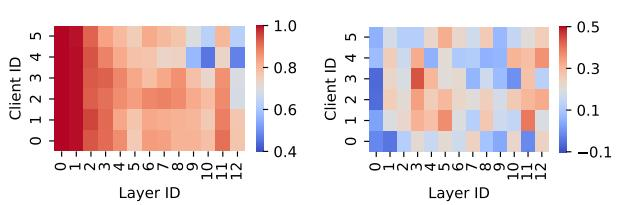
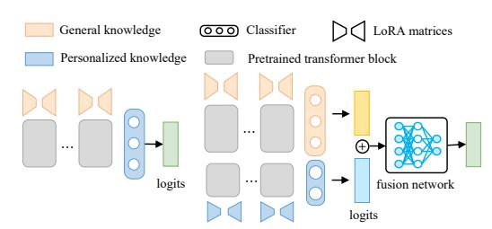
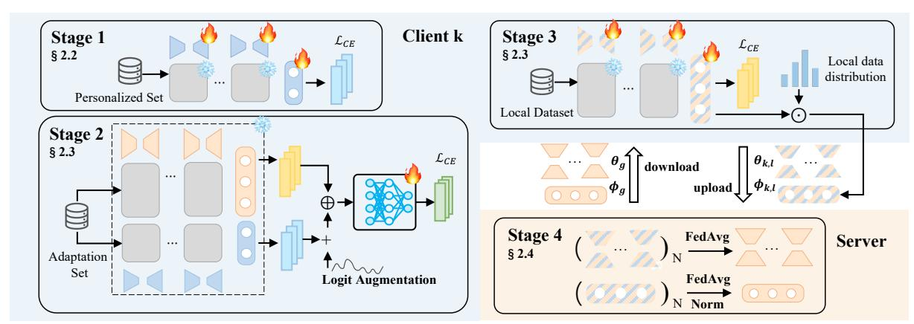
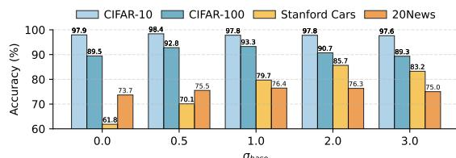
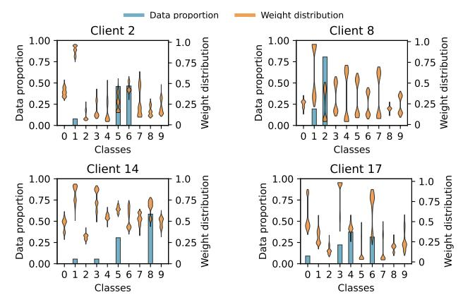
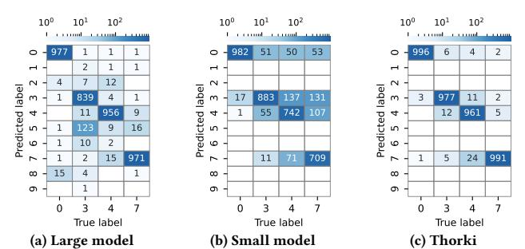
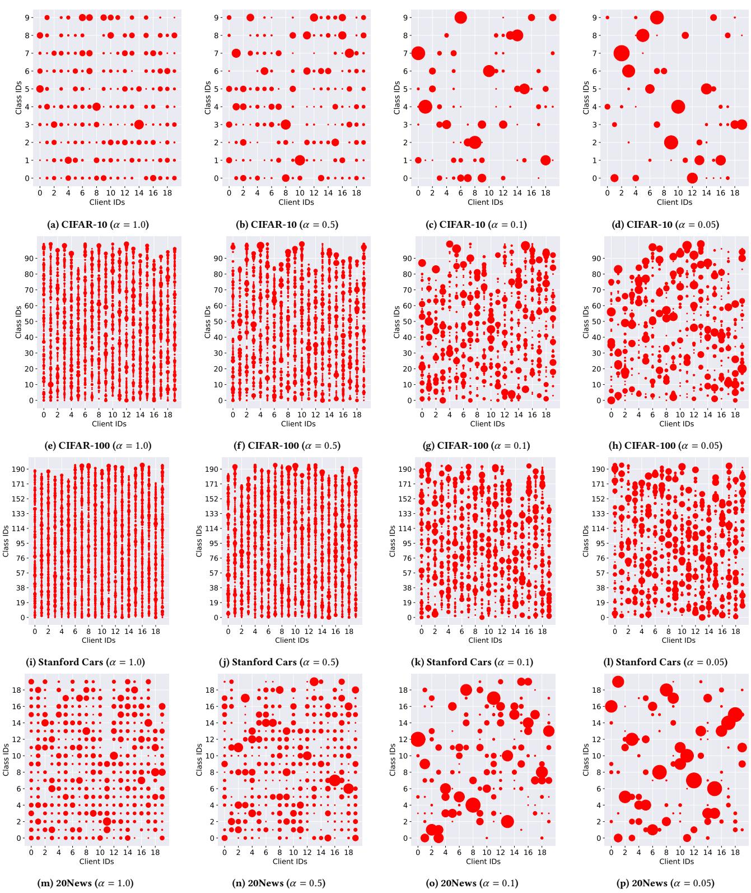

# Thorki: Decoupling General and Personalized Knowledge with Collaborative Fusion for Personalized Federated Learning

Qiang He Huazhong University of Science and Technology Wuhan, China Swinburne University of Technology Melbourne, Australia hqiang@hust.edu.cn

[Rui Chen](https://orcid.org/0009-0009-8188-340X) Huazhong University of Science and Technology Wuhan, China rruichen@hust.edu.cn

[Yicheng Liu](https://orcid.org/0009-0006-6877-2471) Huazhong University of Science and Technology Wuhan, China liuyicheng@hust.edu.cn

[Sheng Zhong](https://orcid.org/0009-0000-5040-1468) Huazhong University of Science and Technology Wuhan, China shengzhong@hust.edu.cn

[Haipeng Dai](https://orcid.org/0000-0003-0545-8187) Nanjing University Wuhan, China haipengdai@nju.edu.cn

[Feifei Chen](https://orcid.org/0000-0001-5455-3792)∗ Deakin University Melbourne, Australia feifei.chen@deakin.edu.au

[Hai Jin](https://orcid.org/0000-0002-3934-7605) Huazhong University of Science and Technology Wuhan, China hjin@hust.edu.cn

[Yun Yang](https://orcid.org/0000-0002-7868-5471) Swinburne University of Technology Melbourne, Australia yyang@swin.edu.au

# Abstract

Federated Learning (FL) enables knowledge sharing across client models with privacy preservation. A key challenge in FL is to aggregate general knowledge across clients while preserving personalized knowledge for each client. We discover that this challenge primarily stems from the coupling of general and personalized knowledge across different model layers. Existing methods either fail to fully decouple these two types of knowledge or do not leverage them effectively for inference, leading to suboptimal performance. This paper presents Thorki, a new FL system that decouples general and personalized knowledge throughout all model layers. In Thorki, instead of one model, each client stores its personalized knowledge in a small model and general knowledge in a large model. When making an inference, it employs a fusion network to combine the outputs of the two models, leveraging both types of knowledge adaptively. This new model collaboration paradigm allows clients to share their general knowledge in a federated manner without compromising their personalized inference capabilities. Extensive experiments with three models on four datasets demonstrate that Thorki outperforms state-of-the-art FL systems by 0.16%-19.14%

∗ Feifei Chen is the corresponding author of this paper.

Qiang He, Rui Chen, Yicheng Liu, Sheng Zhong and Hai Jin are also with the National Engineering Research Center for Big Data Technology and System, Services Computing Technology and System Lab, Cluster and Grid Computing Lab, School of Computer Science and Technology, Huazhong University of Science and Technology, Wuhan, 430074, China.

[This work is licensed under a Creative Commons Attribution 4.0 International License.](https://creativecommons.org/licenses/by/4.0) WWW '26, Dubai, United Arab Emirates.

© 2026 Copyright held by the owner/author(s). ACM ISBN 979-8-4007-2307-0/2026/04 <https://doi.org/10.1145/3774904.3792140>

in model accuracy and improves time-to-accuracy performance by 2.00x-10.00x.

# CCS Concepts

- Computing methodologies→Machine learning; Distributed artificial intelligence.

# Keywords

Personalized federated learning, data heterogeneity, knowledge decoupling

#### ACM Reference Format:

Qiang He, Rui Chen, Yicheng Liu, Sheng Zhong, Haipeng Dai, Feifei Chen, Hai Jin, and Yun Yang. 2026. Thorki: Decoupling General and Personalized Knowledge with Collaborative Fusion for Personalized Federated Learning. In Proceedings of the ACM Web Conference 2026 (WWW '26), April 13–17, 2026, Dubai, United Arab Emirates. ACM, New York, NY, USA, [12](#page-11-0) pages. <https://doi.org/10.1145/3774904.3792140>

#### Resource Availability:

Code is available at<https://github.com/CGCL-codes/Thorki> (DOI: [https:](https://doi.org/10.5281/zenodo.18333280) [//doi.org/10.5281/zenodo.18333280\)](https://doi.org/10.5281/zenodo.18333280).

# 1 Introduction

Web-of-Things (WoT) devices, such as mobile, wearable and surveillance devices, account for a significant portion of the world's web traffic and produce massive and diverse data that fuel a wide range of AI applications [\[10,](#page-8-0) [35,](#page-8-1) [43,](#page-8-2) [44\]](#page-8-3). Meanwhile, the demand for personalized intelligence [\[11,](#page-8-4) [18\]](#page-8-5) has driven an increasing number of these applications to run directly on WoT devices, leveraging collected private data for training. However, uploading such data to the cloud for model training raises serious privacy concerns [\[41,](#page-8-6) [45,](#page-8-7) [49,](#page-9-0) [57\]](#page-9-1). Data protection regulations such as GDPR [\[39\]](#page-8-8)

(a) Cosine similarity of activations (b) Cosine similarity of model updates Figure 1: Impact of personalization on general knowledge. (a) Layerwise cosine similarity of activations between global and local models, averaged over all test samples. (b) Layer-wise cosine similarity of updates between the anchor and local models. Results are shown for ViT-Small layers 0–11, with the final classifier denoted as layer 12.

prohibit centralizing user data to the cloud in many cases. In this context, federated learning (FL) has emerged as a machine learning paradigm that enables multiple clients (i.e., WoT devices) to collaboratively train a shared global model with privacy preservation [\[33\]](#page-8-9).

A typical FL framework proceeds in iterative communication rounds. In each round, clients train local models on private data to capture general and personalized knowledge, and upload them to the fed server for merging. The fed server fuses the knowledge stored in received client models to update the global model. However, prior studies have shown that fusing knowledge in this manner averages out clients' personalized knowledge and compromises the performance of the global model on individual clients [\[4,](#page-8-10) [5,](#page-8-11) [16,](#page-8-12) [54\]](#page-9-2). This issue becomes especially pronounced in the presence of data heterogeneity [\[4,](#page-8-10) [17,](#page-8-13) [22\]](#page-8-14), which is common in real-world scenarios. To address this issue, personalized federated learning (pFL) [\[4,](#page-8-10) [38,](#page-8-15) [40,](#page-8-16) [42,](#page-8-17) [46,](#page-8-18) [54,](#page-9-2) [55\]](#page-9-3) aims to fuse general knowledge across client models without compromising their personalized knowledge. Meta-learning [\[3,](#page-8-19) [9,](#page-8-20) [15\]](#page-8-21), regularization [\[23,](#page-8-22) [38\]](#page-8-15), personalized aggregation [\[14,](#page-8-23) [55,](#page-9-3) [59\]](#page-9-4) and parameter decoupling [\[4,](#page-8-10) [31,](#page-8-24) [37,](#page-8-25) [50,](#page-9-5) [54\]](#page-9-2) are four main categories of methods in pFL. Among these, parameter decoupling is gaining significant attention as it can effectively handle data heterogeneity and preserve personalized knowledge. Nevertheless, it still faces challenges in balancing model generalization and personalization, leading to suboptimal performance.

Our investigation revealed that the core issue lies in the coupling of general and personalized knowledge across model layers. We conducted an experiment to illustrate this issue on CIFAR-10 with six clients using FedAvg. Additional details are provided in § [3.](#page-3-0) The global model is fine-tuned on each client's data to generate personalized local models, and both global and local models are evaluated on a global test set. As shown in Fig. [1a,](#page-1-0) the activation values of local models differ significantly from those of the global model after local training, starting from the shallow layers and extending through to the final layer. This suggests that personalized learning impairs the model's retention of general knowledge, and these two types of knowledge couple across all model layers. Furthermore, we fine-tuned the global model on the union of all clients' local data to generate an anchor model, which reinforces general knowledge. The results presented in Fig. [1b](#page-1-0) demonstrate a significant divergence in model updates between the anchor model and the local models, exhibiting varying degrees of difference across different layers. This discrepancy explains the observed shifts in activation values, which differ markedly from those of the global model. Existing parameter decoupling methods either fail to fully decouple

Figure 2: Comparison of traditional parameter-decoupling methods and Thorki. Left: general and personalized knowledge coupled in a single model, widely adopted in pFL methods. Right: general and personalized knowledge decoupled into two models, with a fusion network adaptively combining them for inference.

general and personalized knowledge across all model layers or do not leverage them effectively for inference.

This paper introduces Thorki, a new FL system that decouples general and personalized knowledge throughout all model layers for personalized FL. Thorki decouples a single model into two distinct models. A small model is pretrained locally on client data to preserve personalized knowledge, whereas a large model is trained collaboratively across clients to fuse general knowledge. During inference, it employs a fusion network to dynamically synthesize the outputs of the two models, leveraging the general and personalized knowledge. To mitigate aggregation conflicts and enhance the general knowledge of the large model, Thorki employs a simple yet effective classifier aggregation strategy named FedClassAvg, which takes into account each client's contribution at the class level, rather than relying on total data size as in traditional methods. Our main contributions are as follows:

- We explore, from a new perspective, the coupling of general and personalized knowledge across model layers, which makes striking a balance between these two difficult.
- We propose Thorki, a new FL system that decouples general and personalized knowledge into two models, trained individually in FL and used collectively for inference.
- We propose a class-wise classifier aggregation strategy, Fed-ClassAvg, enabling aggregation conflict alleviation and general knowledge improvement in Thorki.
- Extensive experiments with three models and four datasets demonstrate that Thorki consistently outperforms state-of-the-art FL systems, achieving up to 19.14% improvement in model accuracy and 10.00x speedup in time-to-accuracy.

#### 2 Method

### 2.1 Overview of Thorki

As discussed in § [1,](#page-0-0) coupling general and personalized knowledge in a single model can lead to suboptimal performance. This issue is analyzed in more detail in § [4.](#page-6-0) To address it, Thorki decouples a client model into a small model and a large model, the former for personalization and the latter for generalization. Fig. [2](#page-1-1) illustrates the decoupling process. The small model ���� (·;���� ) is parameterized by ���� = {���� , ���� }, where ���� denotes the encoder parameters and ���� the classifier parameters. It is trained locally on client data before FL training. The large model ���� (·;����) participates in FL training, acquiring general knowledge via cross-client aggregation, with parameters ���� = {���� , ���� } defined analogously to the small model.

[22\]](#page-8-14). As revealed in [\[26,](#page-8-27) [29,](#page-8-28) [30\]](#page-8-29), compared to other layers, the classifier of a model is usually more sensitive to data heterogeneity and often leads to greater bias. Existing classifier debias methods [\[6,](#page-8-30) [29,](#page-8-28) [30\]](#page-8-29) overlook the fact that clients have varying data distributions and contribute differently to each class.

Based on this intuition, we reformulate the classifier aggregation process, focusing on each client's contribution to the global classifier from a class-level perspective. Each client �� uploads its classifier parameters ����,�� ∈ R ��×�� to the server, where �� denotes the encoder output dimension and ����,�� [��] ∈ R �� represents the class vector for class��. Inspired by [\[34\]](#page-8-31), which highlights the connection between class vectors and class prototypes (average features per class), we regard class vectors as class prototypes reflecting the data quality and quantity of each class on the client. The classifier aggregation process can be reformulated as:

���� [��] = ∑︁�� ��=1 ����,�� · ����,�� [��], �� ∈ [1,��], (3)

where �� denotes the number of clients, and ����,�� is the weight assigned to client �� for class��. FedAvg [\[33\]](#page-8-9) applies uniform weights to all class vectors within each client, i.e., ����,�� = |���� |/Í�� ��=1 |���� |, �� ∈ [1,��]. Consequently, even if two clients exhibit large disparities in the number of samples for the same class, FedAvg still assigns nearly identical contributions to the aggregated class vector, provided that their total dataset sizes are comparable.

To ensure that each client's contribution to the aggregated class vector accurately captures both the class size and the overall dataset size, the aggregation weights are defined as:

����,�� = |����,�� | Í�� ��=1 |����,�� | · |���� | Í�� ��=1 |���� | , �� ∈ [1,��], (4)

where |����,�� | denotes the number of samples of class �� in ���� . However, this strategy may pose privacy risks, as the federated server requires |����,�� | from clients to compute the weights. To address this issue and further improve the generalization of the global classifier, we propose FedClassAvg, which reformulates Eq. [3](#page-3-1) as:

���� [��] = norm( ∑︁�� ��=1 |���� | Í�� ��=1 |���� | · ˜����,�� [��]), �� ∈ [1,��]. (5)

Here, ˜����,�� [��] = |����,�� | · ����,�� [��] is the rescaled class vector computed on the client side, which the fed server can aggregate using standard FedAvg. norm(·) normalizes the class vectors to unit length, mitigating class bias and improving the generalization of the global model. To further enhance FedClassAvg with stronger privacy preservation, secure aggregation [\[1,](#page-8-32) [32\]](#page-8-33) can be employed for efficient and low-cost merging of lightweight classifiers. For aggregating encoder parameters, Thorki employs the standard FedAvg [\[33\]](#page-8-9).

# 3 Experiments

The experiments are designed to demonstrate: 1) Thorki consistently shows superior accuracy over the baselines across datasets with different levels of data heterogeneity; 2) Thorki is capable of accommodating various models; 3) the effectiveness and necessity of all components proposed in Thorki; 4) Thorki does not incur significant additional overhead in terms of training and inference

time, as well as memory footprint; 5) the fusion network can effectively and adaptively fuse personalized and general knowledge; 6) Thorki improves time-to-accuracy performance; and 7) decoupling general and personalized knowledge enables Thorki to retain general knowledge while enhancing personalized knowledge with newly incoming client data. Due to space limitations, we detail the last two items in § [B.1](#page-10-0) and § [B.2,](#page-10-1) respectively.

#### 3.1 Experiment Setup

Datasets and Models. Our experiments are conducted on four public datasets, which are widely used in previous literature [\[2,](#page-8-34) [4,](#page-8-10) [37,](#page-8-25) [54\]](#page-9-2). For CV tasks, we use three datasets. CIFAR-10 and CIFAR-100 [\[20\]](#page-8-35) are image classification datasets with 10 and 100 classes, respectively. Stanford Cars [\[19\]](#page-8-36) is a fine-grained image classification dataset with 196 car classes. For the NLP task, we use 20News [\[21\]](#page-8-37), which is a text classification dataset with 20 classes. Before partitioning the data to simulate Non-IID distributions, we selected subsets of 100, 300, and 200 images per client from CIFAR-10, CIFAR-100, and 20News, respectively. For Stanford Cars, the full dataset was used. Selecting subsets rather than using the entire dataset better reflects real-world scenarios, where each client typically has limited data. To introduce data heterogeneity, we employ Dirichlet distribution sampling [\[12\]](#page-8-38), a widely used approach in federated learning [\[4,](#page-8-10) [6,](#page-8-30) [37,](#page-8-25) [54\]](#page-9-2). The concentration parameter �� controls the degree of data heterogeneity: smaller values of �� result in greater heterogeneity between clients, while larger values reduce it.

Unless otherwise specified, we use the pre-trained ViT-Small [\[8\]](#page-8-39) for CV tasks and the pre-trained BERT-Medium [\[7\]](#page-8-40) for the NLP task. All models adopt a linear classifier, while the backbone is trained using LoRA [\[13\]](#page-8-26). Following the recommended setup [\[13\]](#page-8-26), LoRA is applied to all query and value matrices, with rank set to 4. For the small model in Thorki, we adopt the pre-trained ViT-Tiny for CV tasks and the BERT-Small for the NLP tasks, also trained with LoRA. The fusion network is a lightweight two-layer MLP with a hidden size of 2C. As described in § [2.2,](#page-2-2) Thorki builds the adaptation set by randomly selecting up to two samples per class from local client data, with the remaining samples forming the personalized set.

Performance Metric. Mainstream pFL methods evaluate each client's personalized model on the local test set, which reflects the imbalanced training data distribution [\[4,](#page-8-10) [26,](#page-8-27) [37,](#page-8-25) [54\]](#page-9-2). This can lead to biased results, as dominant classes are given higher weight, skewing the performance evaluation due to overfitting. To address this, we follow the evaluation protocol in [\[6\]](#page-8-30) and assess each client's model on a balanced local test set containing only local classes. We present the best average performance of the global model and the locally fine-tuned global model for traditional FL methods, and the best average performance across personalized models for pFL methods.

Baselines. We take three lines of methods as baselines. 1) Classical FL methods: FedAvg [\[33\]](#page-8-9), FedProx [\[24\]](#page-8-41); 2) Parameter decoupling methods that personalize specific layers: GPFL [\[54\]](#page-9-2), FedAS [\[50\]](#page-9-5), pFedCS [\[46\]](#page-8-18); 3) pFL methods that decouple general and personalized knowledge: FedRod [\[4\]](#page-8-10), DualFed [\[61\]](#page-9-6), FedAPEN [\[37\]](#page-8-25).

Implementation Details. Following previous studies [\[4,](#page-8-10) [26,](#page-8-27) [54\]](#page-9-2), unless otherwise specified, we consider 20 clients with a participation ratio of �� = 1, and employ Dirichlet distribution sampling

Table 1: Accuracy (%) of the global model or personalized models on four datasets under different levels of data heterogeneity. Bold and underline denote the best method and best baseline, respectively; "Gains" indicate Thorki's improvement over the best baseline.

| Dataset              |       |       | CIFAR-10 |       |       |       | CIFAR-100 |       |       | Stanford | Cars  |       |       |       | 20News |       |
|----------------------|-------|-------|----------|-------|-------|-------|-----------|-------|-------|----------|-------|-------|-------|-------|--------|-------|
| Methods/NonIID( �� ) | 1.0   | 0.5   | 0.1      | 0.05  | 1.0   | 0.5   | 0.1       | 0.05  | 1.0   | 0.5      | 0.1   | 0.05  | 1.0   | 0.5   | 0.1    | 0.05  |
| FedAvg               | 97.34 | 97.70 | 91.57    | 89.00 | 86.65 | 85.77 | 84.22     | 78.59 | 75.51 | 73.11    | 61.28 | 54.78 | 67.02 | 64.75 | 59.20  | 57.60 |
| FedProx              | 97.33 | 97.15 | 92.02    | 86.35 | 86.51 | 86.56 | 84.71     | 79.23 | 74.41 | 73.85    | 66.51 | 60.77 | 65.96 | 64.59 | 60.79  | 59.18 |
| FedClassAvg          | 97.26 | 97.80 | 96.15    | 94.72 | 86.56 | 86.90 | 87.93     | 85.30 | 77.66 | 77.65    | 75.80 | 75.11 | 66.51 | 65.89 | 63.66  | 59.07 |
| FedAvg-ft            | 95.17 | 94.90 | 89.70    | 87.51 | 83.94 | 83.86 | 85.62     | 82.93 | 67.02 | 64.94    | 62.02 | 64.96 | 59.25 | 58.59 | 66.05  | 68.48 |
| FedProx-ft           | 95.84 | 95.10 | 89.27    | 86.51 | 85.05 | 85.64 | 86.70     | 83.87 | 70.71 | 69.53    | 65.99 | 66.48 | 60.82 | 60.70 | 67.25  | 69.10 |
| FedClassAvg-ft       | 95.43 | 95.96 | 93.84    | 92.11 | 84.42 | 84.90 | 88.86     | 87.90 | 71.41 | 72.91    | 76.35 | 78.65 | 59.61 | 58.85 | 66.74  | 69.63 |
| GPFL                 | 96.62 | 95.93 | 91.21    | 84.94 | 74.96 | 75.45 | 80.58     | 79.98 | 26.81 | 30.99    | 45.28 | 54.49 | 55.95 | 56.02 | 67.39  | 66.75 |
| FedAS                | 95.36 | 94.82 | 92.85    | 96.21 | 72.11 | 72.56 | 81.12     | 79.89 | 22.17 | 26.20    | 41.26 | 50.37 | 49.29 | 48.96 | 63.04  | 66.22 |
| pFedCS               | 95.81 | 95.80 | 91.62    | 86.43 | 75.52 | 75.50 | 79.94     | 78.36 | 27.91 | 30.93    | 43.63 | 52.32 | 51.18 | 50.85 | 63.56  | 64.75 |
| FedRod               | 96.85 | 97.23 | 93.99    | 94.05 | 84.77 | 84.80 | 88.46     | 87.90 | 61.36 | 61.46    | 65.36 | 70.21 | 59.59 | 60.08 | 69.41  | 69.59 |
| DualFed              | 93.88 | 92.96 | 92.16    | 89.82 | 79.37 | 79.70 | 84.41     | 83.23 | 28.78 | 31.39    | 43.71 | 53.26 | 52.34 | 52.60 | 68.74  | 68.80 |
| FedAPEN              | 95.15 | 92.28 | 81.16    | 79.08 | 86.78 | 86.34 | 80.69     | 66.35 | 74.59 | 72.91    | 47.43 | 44.98 | 63.21 | 60.19 | 63.82  | 62.72 |
| Thorki               | 97.50 | 98.07 | 98.40    | 98.87 | 87.20 | 88.91 | 93.28     | 93.72 | 77.92 | 80.05    | 85.65 | 88.68 | 67.83 | 68.96 | 76.44  | 80.29 |
| Gains                | 0.16  | 0.37  | 4.41     | 2.66  | 0.42  | 2.35  | 4.82      | 5.82  | 2.41  | 6.20     | 19.14 | 18.47 | 0.81  | 4.21  | 7.03   | 10.70 |

with a concentration parameter �� = 0.1 to simulate high data heterogeneity. Local training is performed for 5 epochs with a batch size of 32 for all datasets. We conduct 20 communication rounds for all datasets, except for Stanford Cars, which uses 25 rounds. For further implementation details, please refer to § [A.](#page-9-7)

# 3.2 Comparison with SOTA Methods

Tab. [1](#page-4-0) summarizes the results across four datasets, demonstrating the robustness of Thorki in handling varying degrees of data heterogeneity and its superior ability to balance general and personalized knowledge. Specifically, on CIFAR-10 and CIFAR-100, Thorki achieves moderate gains under mild Non-IID settings (�� ∈ {1.0, 0.5}), surpassing FedAvg, FedProx and FedAPEN by up to 2.35%. When the data distribution becomes highly skewed (�� ∈ 0.1, 0.05), it outperforms FedRod by 4.41-5.82%. On Stanford Cars, the improvements are more pronounced, reaching 19.14% over FedRod at �� = 0.1. On 20News, Thorki maintains the best performance across all ��, outperforming FedAvg by up to 4.21% and FedRod by 10.70%. Overall, Thorki's advantage over the best baseline increases with greater data heterogeneity and task complexity. Beyond overall performance, we identify several key findings that further highlight the importance of decoupling personalized and general knowledge into two separate models.

First, classical FL methods (FedAvg, FedProx) perform well under mild data heterogeneity but suffer up to a 20% accuracy drop on Stanford Cars as heterogeneity increases, due to weakened global generalization and the absence of mechanisms to retain clients' personalized knowledge. Fine-tuning variants (FedAvg-ft, FedProx-ft) mitigate this via local adaptation, but their gains remain inconsistent across different Non-IID settings. Under severe Non-IID settings, local fine-tuning boosts personalization, yielding up to 10.88% gains for FedAvg-ft and 9.92% for FedProx-ft. Conversely, under mild Non-IID settings, personalized adaptation induces global knowledge forgetting, resulting in 1.91–8.17% and 0.92–4.32% accuracy drops, respectively. This underscores the limitations of using a single model to capture both general and personalized knowledge (as discussed in § [1\)](#page-0-0) and highlights the effectiveness of decoupling these two types of knowledge into separate models.

Second, the fine-tuning variants (FedAvg-ft, FedProx-ft) and pFL methods (GPFL, FedAS, pFedCS, FedRod, DualFed) exhibit different patterns across datasets as data heterogeneity varies. Increasing data heterogeneity introduces two opposing effects. It simplifies local tasks by reducing the number of classes available to each client, yet intensifies aggregation conflicts among clients. The former reduces local task difficulty, making it easier for clients to learn from their own data, while the latter undermines the generalization of the shared model. On simple datasets such as CIFAR-10, the latter effect dominates. As a result, fine-tuning variants and pFL methods degrade as data heterogeneity increases, as shown in Tab. [1.](#page-4-0) On moderately complex datasets like CIFAR-100 and 20News, these two effects counteract each other, yielding a non-monotonic performance trend. On highly complex datasets such as Stanford Cars, the balance shifts again: for fine-tuning variants, the latter effect prevails, leading to degraded accuracy. For pFL methods, they decouple specific layers for personalization and mitigate aggregation conflicts to some extent, allowing the former effect to dominate and improve performance under higher data heterogeneity. FedAPEN exhibits a different trend compared to other pFL methods, as its personalization performance generally degrades with increasing heterogeneity. This arises from its strategy of balancing general and personalized knowledge through a weighting factor trained on a random subset of local data. It becomes less effective when local distributions are highly imbalanced.

Third, Thorki consistently achieves higher personalization performance as data heterogeneity increases, as shown in Table Tab. [1.](#page-4-0) It achieves this by separating general and personalized knowledge into large and small models, with a fusion network that balances them during inference. FedClassAvg further alleviates aggregation conflicts and improves global generalization, showing more stable performance across different data heterogeneity levels than FedAvg and FedProx, thereby improving Thorki's performance.

Tab. [2](#page-5-0) reports the results of all baselines on four datasets and different encoders with Non-IID �� = 0.1. Thorki consistently outperforms them across datasets and models, demonstrating its ability to accommodate various models. Specifically, Thorki outperforms the best baseline FedRod by 4.41%, 1.72% on CIFAR-10, and 4.82%, 7.89% on CIFAR-100, with different models, respectively. On Stanford Cars, Thorki outperforms the best baseline FedProx by 19.14% and 18.58% on ViT and Swin, respectively. On 20News, Thorki outperforms the best baseline FedRod by 7.03%.

Table 2: Accuracy (%) of global model or personalized models on four datasets with different encoders. Bold and underline denote the best method and best baseline, respectively. "Gains" indicate Thorki's improvement over the best baseline.

| Dataset Methods/Models | ViT   | CIFAR-10 Swin | ViT   | CIFAR-100 Swin | ViT   | Stanford Cars Swin | 20News BERT |
|------------------------|-------|---------------|-------|----------------|-------|--------------------|-------------|
| FedAvg                 | 91.57 | 92.32         | 84.22 | 74.67          | 61.28 | 64.89              | 59.20       |
| FedProx                | 92.02 | 88.14         | 84.71 | 72.43          | 66.51 | 69.17              | 60.79       |
| FedClassAvg            | 96.15 | 94.32         | 87.93 | 79.62          | 75.80 | 78.69              | 63.66       |
| FedAvg-ft              | 89.70 | 89.92         | 85.62 | 79.60          | 62.02 | 66.24              | 66.05       |
| FedProx-ft             | 89.27 | 89.66         | 86.70 | 78.05          | 66.00 | 65.59              | 67.25       |
| FedClassAvg-ft         | 93.84 | 91.10         | 88.86 | 82.17          | 76.35 | 78.18              | 66.74       |
| GPFL                   | 91.21 | 93.55         | 80.58 | 72.07          | 45.28 | 51.00              | 67.39       |
| FedAS                  | 92.85 | 92.44         | 81.12 | 64.99          | 41.26 | 39.11              | 63.04       |
| pFedCS                 | 91.62 | 86.32         | 79.94 | 67.90          | 43.63 | 41.50              | 63.56       |
| FedRod                 | 93.99 | 94.64         | 88.46 | 80.41          | 65.36 | 66.91              | 69.41       |
| DualFed                | 92.16 | 92.28         | 84.41 | 72.35          | 43.71 | 43.45              | 68.74       |
| FedAPEN                | 81.16 | 86.78         | 80.69 | 69.82          | 47.43 | 50.30              | 63.82       |
| Thorki                 | 98.40 | 96.36         | 93.28 | 88.30          | 85.65 | 87.75              | 76.44       |
| Gains                  | 4.41  | 1.72          | 4.82  | 7.89           | 19.14 | 18.58              | 7.03        |

#### 3.3 Ablation Study

We conduct an ablation study on four datasets with Non-IID �� = 0.1 to evaluate the contribution of each component. Specifically, we replace FedClassAvg with FedAvg, exclude the logit augmentation for training the fusion network, replace the fusion network with simple output averaging, and remove personalized knowledge provided by the small model and fusion network, reducing to FedClassAvg. Results in Tab. [3](#page-5-1) show that each module plays a crucial role, and their combined effect is required to achieve superior performance. Removing any module leads to a significant decline in accuracy. The fusion network is the most critical, with its removal causing a 53.57% drop on Stanford Cars, highlighting its role in balancing general and personalized knowledge. The logit augmentation is also important, as excluding it reduces performance by up to 23.81%, underscoring its function in diversifying small model logits and mitigating overfitting. Finally, FedClassAvg significantly enhances general knowledge and alleviates aggregation conflicts, with its removal resulting in a 22.32% drop on Stanford Cars.

Table 3: Ablation study of Thorki. Parentheses show the accuracy drop (%) relative to Thorki, with the largest drop highlighted in bold.

#### 3.4 Hyperparameter Sensitivity

Thorki introduces a hyperparameter ��base to control noise variance in logit augmentation. We evaluate its impact by varying ��base ∈ {0, 0.5, 1.0, 2.0, 3.0}, with results shown in Fig. [4.](#page-5-2) When ��base is too small, logit augmentation fails to diversify the logits of the small model, leading to overfitting. Conversely, when ��base is overly large, excessive noise hinders the fusion network from fusing general and personalized knowledge effectively. For simpler tasks such as CIFAR-10, CIFAR-100, and 20News, a smaller ��base is optimal, and Thorki shows little sensitivity to ��base. Simple tasks are easier for the small model to learn locally, resulting in more confidence predictions. Thus, a smaller ��base is sufficient. For more complex tasks

base Figure 4: Effect of hyperparameter ��base.

such as Stanford Cars, a larger value yields better performance, and ��base has a greater impact on Thorki. The predictions of the small model are more uncertain in complex tasks, necessitating a larger ��base to effectively augment its logits and reflect this uncertainty. The choice of ��base should be task-dependent and can be adjusted according to task complexity.

#### 3.5 Overhead Analysis

Training and Inference Time. To evaluate the efficiency of these approaches, we compare their training and inference time on CIFAR-10 under the default setting. The experiments are conducted on an NVIDIA Jetson Orin NX, a widely used embedded platform for WoT devices supporting real-time AI training and inference [\[28,](#page-8-42) [51,](#page-9-8) [58,](#page-9-9) [60\]](#page-9-10), and an RTX 4090 for comparison. Tab. [4](#page-5-3) illustrates the results. The reported training time includes data loading and processing, since different methods load and process different batches of data, which should be considered for a fair comparison. For inference, we measure the forward pass time, excluding data loading and processing, as the latter is identical across all methods.

Table 4: Computational efficiency, including the average local training time across clients and the average inference time per sample. Values in parentheses denote the slowdown relative to FedAvg.

| Methods     |       | Orin  | NX Training | (s)  | RTX   | 4090 |       | Orin  | NX Inference |      | (ms) RTX | 4090 |
|-------------|-------|-------|-------------|------|-------|------|-------|-------|--------------|------|----------|------|
| FedAvg      |       | 15.84 |             |      | 1.73  |      |       | 34.27 |              |      | 3.04     |      |
| FedProx     | 15.93 | (1.01 | × )         | 1.82 | (1.05 | × )  | 34.27 | (1.00 | × )          | 3.04 | (1.00    | × )  |
| FedClassAvg | 15.84 | (1.00 | × )         | 1.73 | (1.00 | × )  | 34.27 | (1.00 | × )          | 3.04 | (1.00    | × )  |
| GPFL        | 16.18 | (1.02 | × )         | 1.86 | (1.08 | × )  | 34.88 | (1.02 | × )          | 3.15 | (1.04    | × )  |
| FedAS       | 23.40 | (1.48 | × )         | 2.76 | (1.60 | × )  | 34.27 | (1.00 | × )          | 3.04 | (1.00    | × )  |
| pFedCS      | 17.33 | (1.09 | × )         | 2.14 | (1.24 | × )  | 34.27 | (1.00 | × )          | 3.04 | (1.00    | × )  |
| FedRod      | 15.94 | (1.01 | × )         | 1.82 | (1.05 | × )  | 34.37 | (1.00 | × )          | 3.09 | (1.02    | × )  |
| DualFed     | 23.32 | (1.47 | × )         | 3.49 | (2.02 | × )  | 34.83 | (1.02 | × )          | 3.13 | (1.03    | × )  |
| FedAPEN     | 21.65 | (1.37 | × )         | 2.07 | (1.20 | × )  | 53.31 | (1.56 | × )          | 6.03 | (1.98    | × )  |
| Thorki      | 16.28 | (1.03 | × )         | 1.97 | (1.14 | × )  | 54.21 | (1.58 | × )          | 6.10 | (2.01    | × )  |

Training Time. FedClassAvg and FedAvg share identical training procedures and achieve the lowest training times. Hereafter, all comparisons are made relative to FedAvg. FedProx computes the proximal term, incurring a minimal overhead of 0.09s (1% more). GPFL and FedRod introduce additional parameters, resulting in training time increases of 0.34s (2% more) and 0.10s (1% more), respectively. FedAS, pFedCS, and DualFed rely on the full dataset for additional training. FedAPEN trains a lightweight module on a small data subset before jointly training the small and large models. These four methods incur the highest overheads due to data loading, processing, and additional computations: 7.56s for FedAS (48% more), 1.49s for pFedCS (9% more), 7.48s for DualFed (47% more), and 5.81s for FedAPEN (37% more). In contrast, Thorki additionally trains a lightweight module on a small data subset, incurring a moderate overhead of 0.44s (3% more) on Jetson Orin NX and 0.26s (14% more) on RTX 4090.

Table 5: Memory footprint during training and inference. Values in parentheses denote the change relative to FedAvg.

| Methods     |         | Training (MB) |        | Inference (MB) |
|-------------|---------|---------------|--------|----------------|
| FedAvg      | 1580.70 |               |        | 98.55          |
| FedProx     | 1581.00 | (+0.30)       | 98.55  | (+0.00)        |
| FedClassAvg | 1580.70 | (+0.00)       | 98.55  | (+0.00)        |
| GPFL        | 1585.38 | (+4.68)       | 99.78  | (+1.23)        |
| FedAS       | 1580.70 | (+0.00)       | 98.55  | (+0.00)        |
| pFedCS      | 1590.00 | (+9.30)       | 98.55  | (+0.00)        |
| FedRod      | 1580.78 | (+0.08)       | 98.57  | (+0.02)        |
| DualFed     | 1583.04 | (+2.34)       | 99.10  | (+0.55)        |
| FedAPEN     | 2384.51 | (+803.81)     | 119.80 | (+21.25)       |
| Thorki      | 1580.70 | (+0.00)       | 119.81 | (+21.26)       |

Inference Time. FedAvg, FedProx, FedClassAvg, FedAS and pFedCS achieve the shortest inference times, as they do not introduce additional parameters during inference. Compared to FedAvg, GPFL, FedRod, and DualFed incorporate a small number of extra parameters, resulting in slightly longer inference times of 0.61ms (2% more), 0.10ms (0.3% more), and 0.56ms (2% more), respectively. In contrast, FedAPEN and Thorki introduce additional models, leading to higher overheads of 19.04ms (56% more) and 19.94ms (58% more), respectively. On the RTX 4090, similar conclusions can be drawn, although the absolute times are generally lower.

Memory Consumption. To evaluate the memory efficiency of Thorki, we measure its memory footprint during training and inference on CIFAR-10 under the default setting. As shown in Tab. [5,](#page-6-1) Thorki does not incur additional memory cost during training. Its two-stage procedure first trains the lightweight fusion network with the small model and the large model frozen, then trains the large model as in standard FedAvg. Since most memory is used for activations and optimizer states, the first stage consumes much less memory than the second, keeping Thorki's overall memory footprint comparable to FedAvg. In contrast, FedAPEN trains the small and large models jointly, and suffers a 50.8% memory footprint increase, i.e., 804 MB in total. During inference, Thorki employs a fusion network to integrate the outputs of the small and large models. Fortunately, the overhead is minimal since the fusion network is lightweight and the small model is substantially smaller than the large model. The overall memory overhead incurred is 21 MB, only 21.6% of FedAvg's extra memory usage.

Considering that Thorki delivers superior accuracy and achieves faster time-to-target accuracy, and given the rapid growth of computing power in modern Web-of-Things devices, its extra overhead is insignificant in practice.

#### 3.6 Fusion Network Analysis

Section [3.2](#page-4-1) demonstrates that Thorki achieves significant accuracy improvements over state-of-the-art methods, and Section [3.3](#page-5-4) highlights the key role of the fusion network. To gain a deeper understanding of the working mechanism of the fusion network, Fig. [5](#page-6-2) visualizes the class-wise weight distributions along with the proportions of training data of four randomly selected clients. From these results, three key insights can be drawn.

First, the class-wise weights generated by the fusion network vary considerably across clients and classes, rather than being dominated by the large model. This underscores the necessity of Thorki's

Figure 5: Class-wise weight distributions and data proportions for four randomly selected clients. Orange violin plots show fusionnetwork outputs per class over test samples, while blue bars denote the relative proportion of training data per class.

Figure 6: Confusion matrices of the large model, the small model, and Thorki on Client 3's test set. Under Dirichlet partitioning, only classes 0, 3, 4, and 7 are present; zero rows are omitted for clarity.

design, in which the fusion network adaptively combines the outputs of the two models using class-wise weights.

Second, the weights show a strong correlation with data proportions. For classes with scarce local data, the fusion network favors the large model to exploit its stronger generalization, as the small model struggles to learn from limited samples. Conversely, for classes with abundant local data, the small model receives higher weights, allowing it to contribute more to the final prediction.

Third, the small model still receives non-negligible weights for classes absent locally. This stems from the behavior of the large model, as shown in Fig. [6a.](#page-6-3) Although the large model captures general knowledge across clients, it frequently misclassifies local classes into absent ones due to insufficient client-specific adaptation. By contrast, as shown in Fig. [6b,](#page-6-3) the small model exhibits stronger discrimination among local classes and reduces such misclassifications even with limited training data. Consequently, the fusion network assigns significant weights to the small model for locally absent classes, leveraging its complementary strengths to correct errors made by the large model, as shown in Fig. [6c.](#page-6-3)

### 4 Related Work

### 4.1 Personalized Federated Learning

Personalized federated learning (pFL) aims to fuse general knowledge across client models without compromising their personalized

knowledge [\[4,](#page-8-10) [23,](#page-8-22) [38,](#page-8-15) [55\]](#page-9-3). Most existing pFL methods, based on their strategies to retain personalized knowledge, can be grouped into four primary categories, including meta-learning [\[3,](#page-8-19) [9,](#page-8-20) [15\]](#page-8-21), regularization [\[23,](#page-8-22) [38\]](#page-8-15), personalized aggregation [\[14,](#page-8-23) [55,](#page-9-3) [59\]](#page-9-4), and parameter decoupling [\[4,](#page-8-10) [31,](#page-8-24) [37,](#page-8-25) [50,](#page-9-5) [54\]](#page-9-2). Among these, parameter decoupling has gained significant attention because it effectively handles data heterogeneity by decoupling and localizing a subset of client model parameters. This helps preserve personalized knowledge while mitigating aggregation conflicts across client models. Such properties are particularly important in real-world applications, where clients' data distributions often differ significantly.

# 4.2 Parameter Decoupling

Parameter decoupling splits a client model into shared and personalized parts, letting the former capture general knowledge across clients and the latter preserve personalized knowledge. Existing methods fall into two main categories: selection-based parameter decoupling and extension-based parameter decoupling.

Selection-based Parameter Decoupling. This strategy selects specific layers as the personalized part. For example, FedRep [\[5\]](#page-8-11) and FedAS [\[50\]](#page-9-5) personalize the classifier; LG-FedAvg [\[27\]](#page-8-43), Align-Fed [\[62\]](#page-9-11), and FedGH [\[52\]](#page-9-12) personalize the encoder; FedBN [\[25\]](#page-8-44) personalizes batch normalization (BN) layers. The authors of [\[48\]](#page-9-13) argue that layer-level selection is too conservative and hinders knowledge sharing. They propose a method named FedCAC to select specific parameters for personalization. However, in this line of work, the shared and personalized parts are coupled within a single model, which poses three main limitations. First, determining an appropriate number of parameters for the personalized part is crucial yet challenging. If the personalized part has too few parameters, it may fail to capture the unique aspects of local data, while too many parameters may hinder the sharing of general knowledge [\[48\]](#page-9-13). Second, since the shared part is not personalized to clients' data, a mismatch occurs between the general knowledge in the shared part and client-specific characteristics. This prevents proper alignment with the personalized part [\[50\]](#page-9-5). Third, further local training to adapt the shared part to personalized data often causes forgetting of general knowledge due to the coupled nature of general and personalized knowledge, as identified by our findings presented in § [1.](#page-0-0) This results in a dilemma: without further training, the model may fail to capture the unique aspects of each client's data, but additional training risks erasing the general knowledge.

Extension-based Parameter Decoupling. This approach incorporates an additional personalized part into the original model. FedRod [\[4\]](#page-8-10) adds an additional personalized classifier, while DualFed [\[61\]](#page-9-6) incorporates both a classifier and a projection network, aiming to isolate general and personalized knowledge. The authors of [\[36,](#page-8-45) [47\]](#page-9-14) augment the original model with low-rank modules for personalization, using full-rank parameters to capture general knowledge. GPFL [\[54\]](#page-9-2) and FedCP [\[56\]](#page-9-15) incorporate a shared transformation module that separates the base features into general and personalized features. GPFL feeds the personalized features into a personalized classifier, while FedCP feeds both types of features into their respective classifiers and averages the outputs for inference. DFL [\[31\]](#page-8-24) and pFedMoE [\[53\]](#page-9-16) employ an additional personalized encoder to capture client-specific features, while the shared encoder

extracts general features. The two types of features are then fused and passed to a personalized classifier. However, these methods still face challenges similar to selection-based strategies, as they couple general and personalized knowledge within a single model. When the aggregated parameters are downloaded from the server to update the general knowledge, a mismatch arises between the shared and personalized parts, and further training risks erasing the general knowledge. FedAPEN [\[37\]](#page-8-25) introduces a complete additional model as the personalized part, and trains both models during local training, allowing them to learn from each other via mutual distillation. As these extension-based methods introduce additional parameters to the original model, they need to strategically fuse the outputs of the personalized and shared parts for inference. Many use simple averaging [\[4,](#page-8-10) [61\]](#page-9-6), which fails to strike a balance between general and personalized knowledge. FedAPEN [\[37\]](#page-8-25) uses a trainable parameter to weight the outputs of the personalized model and the shared model. pFedMoE [\[53\]](#page-9-16) employs a gating network that outputs a coefficient to weight the two types of features in an MoE manner, yielding an equivalent weighted average at the classifier output. However, both approaches provide only coarse-grained weighting, lacking fine-grained fusion of the outputs of the two models.

In contrast, Thorki decouples personalized and general knowledge in two dimensions: across different model layers at the parameter level and throughout federated learning at the training level. Existing methods, by comparison, either couple these two types of knowledge within a single model (e.g., FedRod, DualFed, DFL, pFedMoE) or enforce mutual learning between the personalized and general models (e.g., FedAPEN). Complete decoupling allows Thorki to deliver superior performance with minimal additional overhead by freezing the small model during federated learning, whereas approaches like DFL, pFedMoE, and FedAPEN incur substantial memory costs when training multiple models jointly. Thorki employs a fusion network to adaptively combine the outputs of the large model and the small model in a class-wise manner. It enables more flexible and fine-grained integration of both types of knowledge than simple averaging (FedRod, DualFed, FedCP), fixed-weight averaging (FedAPEN), and gating networks that rely on a single coefficient to merge outputs.

# 5 Conclusion

In this paper, we identify that balancing general and personalized knowledge in pFL is challenging due to their coupling across different model layers. To address this, we propose Thorki, a new FL system that effectively decouples general and personalized knowledge into two distinct models: a large model for general knowledge and a small model for personalized knowledge. Extensive experiments demonstrate that Thorki significantly outperforms state-of-the-art pFL methods.

# Acknowledgments

This research was supported by the National Key R&D Program of China under Grant No. 2023YFB4502400 and Hubei Provincial Science and Technology Innovation Base (Platform) Program Project under Grant No. 2025CSA112.

References [1] Keith Bonawitz, Vladimir Ivanov, Ben Kreuter, Antonio Marcedone, H Brendan McMahan, Sarvar Patel, Daniel Ramage, Aaron Segal, and Karn Seth. 2017. Practical secure aggregation for privacy-preserving machine learning. In proceedings of the 2017 ACM SIGSAC Conference on Computer and Communications Security. 1175–1191. [2] Dongqi Cai, Yaozong Wu, Shangguang Wang, Felix Xiaozhu Lin, and Mengwei Xu. 2023. Efficient federated learning for modern nlp. In Proceedings of the 29th annual international conference on mobile computing and networking. 1–16. [3] Fei Chen, Mi Luo, Zhenhua Dong, Zhenguo Li, and Xiuqiang He. 2018. Federated meta-learning with fast convergence and efficient communication. arXiv preprint arXiv:1802.07876 (2018). [4] Hong-You Chen and Wei-Lun Chao. 2021. On Bridging Generic and Personalized Federated Learning for Image Classification. In International Conference on Learning Representations. [5] Liam Collins, Hamed Hassani, Aryan Mokhtari, and Sanjay Shakkottai. 2021. Exploiting shared representations for personalized federated learning. In International conference on machine learning. PMLR, 2089–2099. [6] Yutong Dai, Zeyuan Chen, Junnan Li, Shelby Heinecke, Lichao Sun, and Ran Xu. 2023. Tackling data heterogeneity in federated learning with class prototypes. In Proceedings of the AAAI Conference on Artificial Intelligence, Vol. 37. 7314–7322. [7] Jacob Devlin, Ming-Wei Chang, Kenton Lee, and Kristina Toutanova. 2019. Bert: Pre-training of deep bidirectional transformers for language understanding. In Proceedings of the 2019 conference of the North American chapter of the association for computational linguistics: human language technologies, volume 1 (long and short papers). 4171–4186. [8] Alexey Dosovitskiy, Lucas Beyer, Alexander Kolesnikov, Dirk Weissenborn, Xiaohua Zhai, Thomas Unterthiner, Mostafa Dehghani, Matthias Minderer, Georg Heigold, Sylvain Gelly, et al. 2020. An image is worth 16x16 words: Transformers for image recognition at scale. arXiv preprint arXiv:2010.11929 (2020). [9] Alireza Fallah, Aryan Mokhtari, and Asuman Ozdaglar. 2020. Personalized federated learning with theoretical guarantees: A model-agnostic meta-learning approach. Advances in neural information processing systems 33 (2020), 3557–3568. [10] Yong Ge, Hui Xiong, Alexander Tuzhilin, Keli Xiao, Marco Gruteser, and Michael Pazzani. 2010. An energy-efficient mobile recommender system. In Proceedings of the 16th ACM SIGKDD international conference on Knowledge discovery and data mining. 899–908. [11] Peizhen Guo, Bo Hu, and Wenjun Hu. 2021. Mistify: Automating {DNN} model porting for {On-Device} inference at the edge. In 18th USENIX Symposium on Networked Systems Design and Implementation (NSDI 21). 705–719. [12] Tzu-Ming Harry Hsu, Hang Qi, and Matthew Brown. 2019. Measuring the effects of non-identical data distribution for federated visual classification. arXiv preprint arXiv:1909.06335 (2019). [13] Edward J Hu, Yelong Shen, Phillip Wallis, Zeyuan Allen-Zhu, Yuanzhi Li, Shean Wang, Lu Wang, Weizhu Chen, et al. 2022. Lora: Low-rank adaptation of large language models. ICLR 1, 2 (2022), 3. [14] Yutao Huang, Lingyang Chu, Zirui Zhou, Lanjun Wang, Jiangchuan Liu, Jian Pei, and Yong Zhang. 2021. Personalized cross-silo federated learning on non-iid data. In Proceedings of the AAAI conference on artificial intelligence, Vol. 35. 7865–7873. [15] Yihan Jiang, Jakub Konečny, Keith Rush, and Sreeram Kannan. 2019. Improving ` federated learning personalization via model agnostic meta learning. arXiv preprint arXiv:1909.12488 (2019). [16] Hai Jin, Dongshan Bai, Dezhong Yao, Yutong Dai, Lin Gu, Chen Yu, and Lichao Sun. 2022. Personalized edge intelligence via federated self-knowledge distillation. IEEE Transactions on Parallel and Distributed Systems 34, 2 (2022), 567–580. [17] Sai Praneeth Karimireddy, Satyen Kale, Mehryar Mohri, Sashank Reddi, Sebastian Stich, and Ananda Theertha Suresh. 2020. Scaffold: Stochastic controlled averaging for federated learning. In International conference on machine learning. PMLR, 5132–5143. [18] Young Geun Kim and Carole-Jean Wu. 2020. Autoscale: Energy efficiency optimization for stochastic edge inference using reinforcement learning. In 2020 53rd Annual IEEE/ACM international symposium on microarchitecture (MICRO). IEEE, 1082–1096. [19] Jonathan Krause, Michael Stark, Jia Deng, and Li Fei-Fei. 2013. 3d object representations for fine-grained categorization. In Proceedings of the IEEE international conference on computer vision workshops. 554–561. [20] Alex Krizhevsky, Geoffrey Hinton, et al. 2009. Learning multiple layers of features from tiny images. (2009). [21] Ken Lang. 1995. Newsweeder: Learning to filter netnews. In Machine learning proceedings 1995. Elsevier, 331–339. [22] Qinbin Li, Bingsheng He, and Dawn Song. 2021. Model-contrastive federated learning. In Proceedings of the IEEE/CVF conference on computer vision and pattern recognition. 10713–10722. [23] Tian Li, Shengyuan Hu, Ahmad Beirami, and Virginia Smith. 2021. Ditto: Fair and robust federated learning through personalization. In International conference on machine learning. PMLR, 6357–6368. [24] Tian Li, Anit Kumar Sahu, Manzil Zaheer, Maziar Sanjabi, Ameet Talwalkar, and Virginia Smith. 2020. Federated optimization in heterogeneous networks. Proceedings of Machine learning and systems 2 (2020), 429–450. [25] Xiaoxiao Li, Meirui Jiang, Xiaofei Zhang, Michael Kamp, and Qi Dou. 2021. Fedbn: Federated learning on non-iid features via local batch normalization. arXiv preprint arXiv:2102.07623 (2021). [26] Zexi Li, Xinyi Shang, Rui He, Tao Lin, and Chao Wu. 2023. No fear of classifier biases: Neural collapse inspired federated learning with synthetic and fixed classifier. In Proceedings of the IEEE/CVF International Conference on Computer Vision. 5319–5329. [27] Paul Pu Liang, Terrance Liu, Liu Ziyin, Nicholas B Allen, Randy P Auerbach, David Brent, Ruslan Salakhutdinov, and Louis-Philippe Morency. 2020. Think locally, act globally: Federated learning with local and global representations. arXiv preprint arXiv:2001.01523 (2020). [28] Yunming Liao, Yang Xu, Hongli Xu, Zhiwei Yao, Lun Wang, and Chunming Qiao. 2023. Accelerating federated learning with data and model parallelism in edge computing. IEEE/ACM Transactions on Networking 32, 1 (2023), 904–918. [29] Yunfei Long, Zhe Xue, Lingyang Chu, Tianlong Zhang, Junjiang Wu, Yu Zang, and Junping Du. 2023. Fedcd: A classifier debiased federated learning framework for non-iid data. In Proceedings of the 31st ACM International Conference on Multimedia. 8994–9002. [30] Mi Luo, Fei Chen, Dapeng Hu, Yifan Zhang, Jian Liang, and Jiashi Feng. 2021. No fear of heterogeneity: Classifier calibration for federated learning with non-iid data. Advances in Neural Information Processing Systems 34 (2021), 5972–5984. [31] Zhengquan Luo, Yunlong Wang, Zilei Wang, Zhenan Sun, and Tieniu Tan. 2022. Disentangled federated learning for tackling attributes skew via invariant aggregation and diversity transferring. arXiv preprint arXiv:2206.06818 (2022). [32] Kalikinkar Mandal, Guang Gong, and Chuyi Liu. 2018. Nike-based fast privacypreserving highdimensional data aggregation for mobile devices. IEEE T Depend Secure (2018), 142–149. [33] Brendan McMahan, Eider Moore, Daniel Ramage, Seth Hampson, and Blaise Aguera y Arcas. 2017. Communication-efficient learning of deep networks from decentralized data. In Artificial intelligence and statistics. PMLR, 1273–1282. [34] Vardan Papyan, XY Han, and David L Donoho. 2020. Prevalence of neural collapse during the terminal phase of deep learning training. Proceedings of the National Academy of Sciences 117, 40 (2020), 24652–24663. [35] Jinhwan Park, Yoonho Boo, Iksoo Choi, Sungho Shin, and Wonyong Sung. 2018. Fully neural network based speech recognition on mobile and embedded devices. Advances in neural information processing systems 31 (2018). [36] Krishna Pillutla, Kshitiz Malik, Abdel-Rahman Mohamed, Mike Rabbat, Maziar Sanjabi, and Lin Xiao. 2022. Federated learning with partial model personalization. In International Conference on Machine Learning. PMLR, 17716–17758. [37] Zhen Qin, Shuiguang Deng, Mingyu Zhao, and Xueqiang Yan. 2023. Fedapen: Personalized cross-silo federated learning with adaptability to statistical heterogeneity. In Proceedings of the 29th ACM SIGKDD conference on knowledge discovery and data mining. 1954–1964. [38] Canh T Dinh, Nguyen Tran, and Josh Nguyen. 2020. Personalized federated learning with moreau envelopes. Advances in neural information processing systems 33 (2020), 21394–21405. [39] Paul Voigt and Axel Von dem Bussche. 2017. The eu general data protection regulation (gdpr). A practical guide, 1st ed., Cham: Springer International Publishing 10, 3152676 (2017), 10–5555. [40] Kaibin Wang, Qiang He, Feifei Chen, Chunyang Chen, Faliang Huang, Hai Jin, and Yun Yang. 2023. Flexifed: Personalized federated learning for edge clients with heterogeneous model architectures. In Proceedings of the ACM Web Conference 2023. 2979–2990. [41] Kaibin Wang, Qiang He, Feifei Chen, Hai Jin, and Yun Yang. 2023. Fededge: Accelerating edge-assisted federated learning. In Proceedings of the ACM Web Conference 2023. 2895–2904. [42] Kaibin Wang, Qiang He, Zeqian Dong, Rui Chen, Chuan He, Caslon Chua, Feifei Chen, and Yun Yang. 2025. Maverick: Personalized Edge-Assisted Federated Learning with Contrastive Training. In Proceedings of the ACM on Web Conference 2025. 817–828. [43] Robert J Wang, Xiang Li, and Charles X Ling. 2018. Pelee: A real-time object detection system on mobile devices. Advances in neural information processing systems 31 (2018). [44] Shangshang Wang, Ziyu Shao, and John CS Lui. 2023. Next-word prediction: A perspective of energy-aware distributed inference. IEEE Transactions on Mobile Computing 23, 5 (2023), 5695–5708. [45] Jinze Wu, Qi Liu, Zhenya Huang, Yuting Ning, Hao Wang, Enhong Chen, Jinfeng Yi, and Bowen Zhou. 2021. Hierarchical personalized federated learning for user modeling. In Proceedings of the Web Conference 2021. 957–968. [46] Siyuan Wu, Yongzhe Jia, Bowen Liu, Haolong Xiang, Xiaolong Xu, and Wanchun Dou. 2025. PFedCS: A Personalized Federated Learning Method for Enhancing Collaboration among Similar Classifiers. In Proceedings of the AAAI Conference on Artificial Intelligence, Vol. 39. 21572–21580.

[47] Xinghao Wu, Xuefeng Liu, Jianwei Niu, Haolin Wang, Shaojie Tang, Guogang Zhu, and Hao Su. 2024. Decoupling general and personalized knowledge in federated learning via additive and low-rank decomposition. In Proceedings of the 32nd ACM International Conference on Multimedia. 7172–7181. [48] Xinghao Wu, Xuefeng Liu, Jianwei Niu, Guogang Zhu, and Shaojie Tang. 2023. Bold but cautious: Unlocking the potential of personalized federated learning through cautiously aggressive collaboration. In Proceedings of the IEEE/CVF international conference on computer vision. 19375–19384. [49] Chengxu Yang, Qipeng Wang, Mengwei Xu, Zhenpeng Chen, Kaigui Bian, Yunxin Liu, and Xuanzhe Liu. 2021. Characterizing impacts of heterogeneity in federated learning upon large-scale smartphone data. In Proceedings of the Web Conference 2021. 935–946. [50] Xiyuan Yang, Wenke Huang, and Mang Ye. 2024. Fedas: Bridging inconsistency in personalized federated learning. In Proceedings of the IEEE/CVF Conference on Computer Vision and Pattern Recognition. 11986–11995. [51] Shengyuan Ye, Liekang Zeng, Xiaowen Chu, Guoliang Xing, and Xu Chen. 2024. Asteroid: Resource-efficient hybrid pipeline parallelism for collaborative dnn training on heterogeneous edge devices. In Proceedings of the 30th Annual International Conference on Mobile Computing and Networking. 312–326. [52] Liping Yi, Gang Wang, Xiaoguang Liu, Zhuan Shi, and Han Yu. 2023. Fedgh: Heterogeneous federated learning with generalized global header. In Proceedings of the 31st ACM International Conference on Multimedia. 8686–8696. [53] Liping Yi, Han Yu, Chao Ren, Heng Zhang, Gang Wang, Xiaoguang Liu, and Xiaoxiao Li. 2024. pFedMoE: Data-level personalization with mixture of experts for model-heterogeneous personalized federated learning. arXiv preprint arXiv:2402.01350 (2024). [54] Jianqing Zhang, Yang Hua, Hao Wang, Tao Song, Zhengui Xue, Ruhui Ma, Jian Cao, and Haibing Guan. 2023. Gpfl: Simultaneously learning global and personalized feature information for personalized federated learning. In Proceedings of the IEEE/CVF International Conference on Computer Vision. 5041–5051. [55] Jianqing Zhang, Yang Hua, Hao Wang, Tao Song, Zhengui Xue, Ruhui Ma, and Haibing Guan. 2023. Fedala: Adaptive local aggregation for personalized federated learning. In Proceedings of the AAAI conference on artificial intelligence, Vol. 37. 11237–11244. [56] Jianqing Zhang, Yang Hua, Hao Wang, Tao Song, Zhengui Xue, Ruhui Ma, and Haibing Guan. 2023. Fedcp: Separating feature information for personalized federated learning via conditional policy. In Proceedings of the 29th ACM SIGKDD conference on knowledge discovery and data mining. 3249–3261. [57] Jiayun Zhang, Shuheng Li, Haiyu Huang, Zihan Wang, Xiaohan Fu, Dezhi Hong, Rajesh K Gupta, and Jingbo Shang. 2024. How few davids improve one goliath: Federated learning in resource-skewed edge computing environments. In Proceedings of the ACM Web Conference 2024. 2976–2985. [58] Letian Zhang, Lixing Chen, and Jie Xu. 2021. Autodidactic neurosurgeon: Collaborative deep inference for mobile edge intelligence via online learning. In Proceedings of the Web Conference 2021. 3111–3123. [59] Michael Zhang, Karan Sapra, Sanja Fidler, Serena Yeung, and Jose M. Alvarez. 2021. Personalized Federated Learning with First Order Model Optimization. In International Conference on Learning Representations. [https://openreview.net/](https://openreview.net/forum?id=ehJqJQk9cw) [forum?id=ehJqJQk9cw](https://openreview.net/forum?id=ehJqJQk9cw) [60] Sifan Zhao, Tongtong Liu, Hai Jin, and Dezhong Yao. 2025. SPViT: Accelerate Vision Transformer Inference on Mobile Devices via Adaptive Splitting and Offloading. IEEE Transactions on Mobile Computing (2025). [61] Guogang Zhu, Xuefeng Liu, Jianwei Niu, Shaojie Tang, Xinghao Wu, and Jiayuan Zhang. 2024. Dualfed: enjoying both generalization and personalization in federated learning via hierachical representations. In Proceedings of the 32nd ACM International Conference on Multimedia. 11060–11069. [62] Guogang Zhu, Xuefeng Liu, Shaojie Tang, and Jianwei Niu. 2023. Aligning before aggregating: Enabling communication efficient cross-domain federated learning via consistent feature extraction. IEEE Transactions on Mobile Computing 23, 5 (2023), 5880–5896.

# A Implementation Details

# A.1 Environment

The experiments were conducted on a machine running Ubuntu 22.04.3 LTS with 8 NVIDIA GeForce RTX 4090 GPUs and an Intel Xeon Platinum 8352V CPU (2.10 GHz). The deep learning framework used was PyTorch 2.6.0+cu124 with CUDA 12.4, and Python 3.12.9 was used for baseline implementation.

# A.2 Datasets

Tab. [6](#page-9-17) shows the statistics of the datasets used in the experiments. Before partitioning the data to simulate Non-IID distributions, we

selected subsets of 100, 300, and 200 images per client from CIFAR-10, CIFAR-100, and 20News, respectively. For Stanford Cars, the full dataset was used.

To simulate Non-IID data distributions, we used Dirichlet distribution sampling. By default, we set the concentration parameter �� to 0.1 for all datasets, resulting in a more realistic Non-IID data distribution across clients. Fig. [7](#page-11-1) shows the partition results for the four datasets, with �� ∈ {1.0, 0.5, 0.1, 0.05}.

For CV tasks, we applied the following transformations to the training data: resizing, random cropping with padding, and normalization. Specifically, we used a padding of 4 pixels and a crop size of 224x224. For 20News, we tokenized the text data using the BERT tokenizer and applied padding to a length of 256 to ensure uniform input size. For the test data, we resized it to 224x224 and applied the same normalization transformation as in the training data, but without any data augmentation.

Table 6: Statistics of the datasets used in experiments.

| Dataset       | Classes | Clients | Total Train | Selected | Train Test |
|---------------|---------|---------|-------------|----------|------------|
| CIFAR-10      | 10      | 20      | 50,000      | 2,000    | 10,000     |
| CIFAR-100     | 100     | 20      | 50,000      | 6,000    | 10,000     |
| Stanford Cars | 196     | 20      | 8144        | 8144     | 8,041      |
| 20News        | 20      | 20      | 11314       | 4000     | 7532       |

# A.3 Models

Unless otherwise specified, we use the pre-trained ViT-Small for CV tasks and the pre-trained BERT-medium for the NLP task. To verify that Thorki can accommodate various models, we also conducted experiments using the pre-trained Swin-Small. All models adopt a linear classifier, while the backbone is trained using LoRA [\[13\]](#page-8-26). Following the recommended setup [\[13\]](#page-8-26), LoRA is applied to all query and value matrices, with rank set to 4, alpha set to 32, and dropout rate set to 0.1.

For the small models in Thorki and FedAPEN, we use the pretrained ViT-Tiny for CV tasks and the BERT-Small for the NLP task, with LoRA applied during training. When Swin-Small is used as the large model, Swin-Tiny is adopted as the corresponding small model to ensure architectural consistency. For the small model, LoRA is applied to all query, key, and value matrices, while all other hyperparameters are kept identical to those of the large model. The fusion network is a lightweight two-layer MLP consisting of Linear(2C, 2C), ReLU, Dropout(0.5), LayerNorm, and Linear(2C, C), followed by a Sigmoid activation, where C denotes the number of classes.

# A.4 Training

We used the AdamW optimizer for all settings, with other details provided in Tab. [7.](#page-10-2) For all baselines, we set the hyperparameters as recommended in the original papers. For Thorki, we set the hyperparameter ��base = 0.5 for CIFAR-10, ��base = 1.0 for CIFAR-100, and 20News, and ��base = 2.0 for Stanford Cars. The fusion network was trained for 10 epochs with a batch size equal to the adaptation set. A single forward pass of both models was performed on the adaptation set, and the logits were stored for fusion network training, using a learning rate of 1e-3 and weight decay of 1e-3 across all datasets. The small model was trained locally for 50 epochs with the same hyperparameter settings as the large model prior to federated learning.

Table 7: Training details of all methods on four datasets and three models.

|               | Dataset Hyperparams/Models Learning rate Weight decay | ViT 2e-4 5e-3 | CIFAR-10 Swin 5e-4 1e-3 | ViT 5e-4 5e-3 | CIFAR-100 Swin 5e-4 5e-3 | Stanford ViT 1e-3 5e-3 | cars Swin 1e-3 5e-3 | 20News BERT 2e-3 1e-3 |
|---------------|-------------------------------------------------------|---------------|-------------------------|---------------|--------------------------|------------------------|---------------------|-----------------------|
| Batch         | size                                                  | 32            | 32                      | 32            | 32                       | 32                     | 32                  | 32                    |
| Local         | epochs                                                | 5             | 5                       | 5             | 5                        | 5                      | 5                   | 5                     |
| Communication | rounds                                                | 20            | 20                      | 20            | 20                       | 25                     | 25                  | 20                    |

#### B Additional Experiments

We first present the results and analysis of the time-to-accuracy speedup across datasets and models. Then, we verify that the decoupling of general and personalized knowledge allows Thorki to retain general knowledge while enhancing personalized knowledge with newly incoming data.

# B.1 Time-to-accuracy Speedup

Table 8: Speedup of global/personalized models in terms of time-totarget accuracy. The best-performing method is highlighted in bold, while "–" indicates that the target accuracy could not be reached.

| Dataset Methods/Models | ViT   | CIFAR-10 Swin | CIFAR-100 ViT | Swin  | Stanford ViT | Cars Swin | 20News BERT |
|------------------------|-------|---------------|---------------|-------|--------------|-----------|-------------|
| Target Accuracy        |       | 90.00         | 80.00         | 70.00 |              | 60.00     | 65.00       |
| FedAvg                 | 1.00x | 1.00x         | 1.00x         | 1.00x | 1.00x        | 1.00x     |             |
| FedProx                | 1.07x |               | 1.00x         | 0.82x | 1.41x        | 1.18x     |             |
| FedClassAvg            | 1.78x | 1.50x         | 2.20x         | 2.33x | 3.43x        | 2.50x     |             |
| FedAvg-ft              |       |               | 1.38x         | 1.75x | 1.20x        | 1.33x     | 1.00x       |
| FedProx-ft             |       |               | 1.38x         | 1.27x | 1.33x        | 1.11x     | 2.22x       |
| FedClassAvg-ft         | 1.78x | 1.00x         | 3.67x         | 3.50x | 4.00x        | 2.86x     | 3.33x       |
| GPFL                   |       | 1.29x         | 0.61x         | 1.00x |              |           | 1.67x       |
| FedAS                  | 1.33x | 1.20x         | 0.69x         |       |              |           |             |
| pFedCS                 | 1.23x |               |               |       |              |           |             |
| FedRod                 | 1.45x | 2.25x         | 2.20x         | 2.33x | 2.00x        | 1.43x     | 4.00x       |
| DualFed                | 1.33x | 1.80x         | 1.22x         | 1.75x |              |           | 3.33x       |
| FedAPEN                |       |               | 0.55x         |       |              |           |             |
| Thorki                 | 2.00x | 2.57x         | 2.75x         | 3.50x | 6.00x        | 4.00x     | 10.00x      |

Tab. [8](#page-10-3) summarizes the speedup gains across four datasets using different models, with Non-IID �� = 0.1. Thorki consistently outperforms all the baselines across all datasets.

On CIFAR-10, Thorki achieves 2.00x speedup with ViT and 2.57x with Swin, outperforming FedRod by 37.93% and 14.22%, respectively. On CIFAR-100, Thorki surpasses FedRod by 25.00% with ViT and 50.21% with Swin, with speedups of 2.75x and 3.50x. For Stanford Cars, Thorki delivers 6.00x speedup with ViT and 4.00x with Swin, outperforming FedRod by 200.00% and 179.71%, respectively. Finally, on 20News, Thorki achieves a 10.00x speedup with BERT, outperforming FedRod by 150.00%. These results highlight Thorki's exceptional ability to accelerate time-to-accuracy, demonstrating its robustness and efficiency across various datasets and models.

The speedup improvements can be attributed to two key design innovations. First, Thorki employs the class-wise classifier aggregation strategy, FedClassAvg, to alleviate aggregation conflicts, boosting performance and enhancing the general knowledge of the large model. As shown in Tab. [8,](#page-10-3) FedClassAvg outperforms many baselines in several cases. Second, Thorki extracts personalized knowledge locally and stores it in a small model, making it independent of the FL process. This ensures that model merging does

not compromise the personalized knowledge in the small model, unlike previous methods, which undermine it during merging and slow down time-to-accuracy.

Table 9: Accuracy (%) of personalized models over post-FL training on CIFAR-100. The table summarizes initial, maximum, minimum accuracies and gains across 20 epochs under the default settings.

| Methods        | Init  | Max   | Min   | Gain |
|----------------|-------|-------|-------|------|
| FedAvg-ft      | 85.79 | 85.79 | 84.79 | 0    |
| FedProx-ft     | 86.56 | 86.56 | 85.64 | 0    |
| FedClassAvg-ft | 88.79 | 88.79 | 88.23 | 0    |
| GPFL           | 80.95 | 80.95 | 74.97 | 0    |
| FedAS          | 84.51 | 84.51 | 82.32 | 0    |
| pFedCS         | 79.58 | 79.58 | 78.40 | 0    |
| FedRod         | 88.50 | 88.50 | 86.61 | 0    |
| DualFed        | 84.26 | 84.26 | 80.92 | 0    |
| FedAPEN        | 81.27 | 84.73 | 81.27 | 3.46 |
| Thorki         | 93.10 | 93.37 | 93.06 | 0.27 |

### B.2 Further Personalization with New Personalized Data

In personalized intelligence scenarios, clients can acquire new data that can be used for further local training to personalize their models. However, as highlighted in our previous findings presented in § [1,](#page-0-0) personalizing a model often compromises its general knowledge and leads to undesirable performance degradation. To explore this further, we evaluated the performance of Thorki against the baselines when clients' small models are updated with new data. To simulate the addition of new data, we randomly sampled from CIFAR-100 according to the distribution of each client's data, ensuring consistency across all methods. For Thorki, we partitioned the new dataset into a personalized set and an adaptation set, which are then added to the original personalized and adaptation sets, respectively. We alternately trained the small model on the personalized set and the fusion network on the adaptation set, while keeping the large model frozen to preserve general knowledge. For the baselines, we follow the training procedure specified in the original paper, using the union of the previous local dataset and the new data. Tab. [9](#page-10-4) presents the results.

The results show that traditional FL and pFL methods do not benefit from new personalized data, as they couple general and personalized knowledge across model layers. This coupling causes the enhancement of model personalization to undermine general knowledge, resulting in performance degradation. In contrast, Thorki successfully retains general knowledge by keeping the large model frozen while enhancing personalized knowledge through training the small model and the fusion network, achieving a 0.27% gain on average across clients. This demonstrates that the decoupling of general and personalized knowledge enables Thorki to effectively leverage new personalized data to enhance personalization without compromising generalization. Although the gain achieved by Thorki is smaller than that of FedAPEN, it is important to note that the performance of Thorki is already very high, and further personalization may not always yield significant improvement.

Figure 7: Data distribution on each client under different levels of data heterogeneity. The size of red circles means the number of samples.