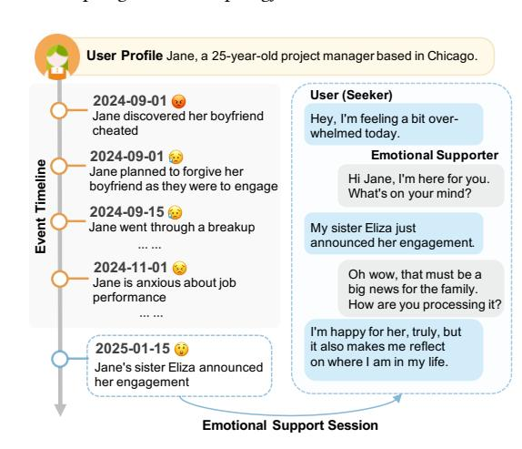
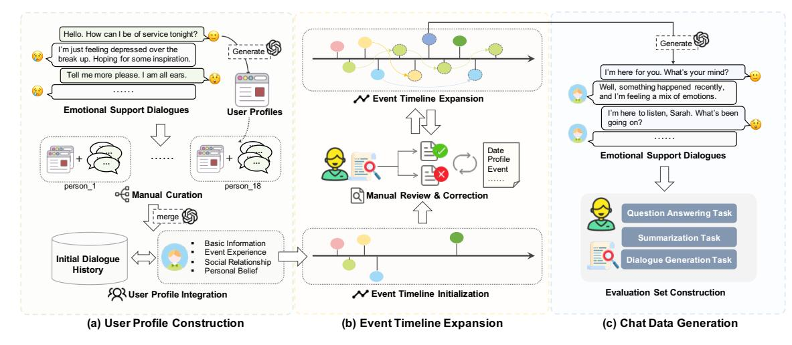
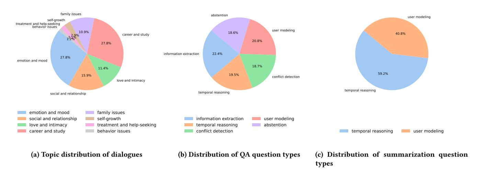
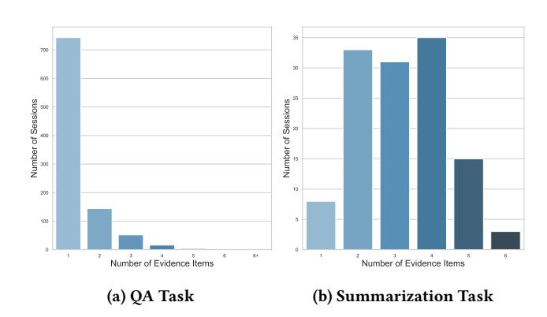
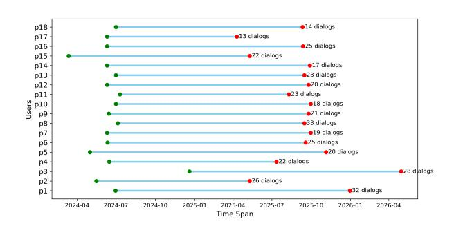

# ES-MemEval: Benchmarking Conversational Agents on Personalized Long-Term Emotional Support

[Tiantian Chen](https://orcid.org/0000-0001-7346-7670) 2111287@tongji.edu.cn Tongji University Shanghai, China

[Jiaqi Lu](https://orcid.org/0009-0006-9236-4531) 2512091@tongji.edu.cn Tongji University Shanghai, China

[Ying Shen](https://orcid.org/0000-0002-2966-7955)∗ yingshen@tongji.edu.cn Tongji University Shanghai, China

[Lin Zhang](https://orcid.org/0000-0002-4360-5523) cslinzhang@tongji.edu.cn Tongji University Shanghai, China

## Abstract

Large Language Models (LLMs) have shown strong potential as conversational agents. Yet, their effectiveness remains limited by deficiencies in robust long-term memory—particularly in complex, long-term Web-based services such as online emotional support. However, existing long-term dialogue benchmarks primarily focus on static and explicit fact retrieval, failing to evaluate agents in these critical scenarios where user information is dispersed, implicit, and continuously evolving. To address this gap, we introduce ES-MemEval, a comprehensive benchmark that systematically evaluates five core memory capabilities—information extraction, temporal reasoning, conflict detection, abstention, and user modeling—in long-term emotional support scenarios, covering question answering, summarization, and dialogue generation tasks. To support the benchmark, we also propose EvoEmo, the first multi-session dataset for personalized long-term emotional support scenarios, capturing fragmented, implicit user disclosures and evolving user states. Extensive experiments on open-source long-context, commercial, and retrieval-augmented (RAG) LLMs reveal that explicit long-term memory is essential to reduce hallucinations and enable effective personalization. At the same time, RAG enhances factual consistency but struggles with temporal dynamics and evolving user states. These findings highlight both the potential and limitations of current paradigms, encouraging the development of more robust memory–retrieval integration in long-term personalized dialogue systems.

## CCS Concepts

• Information systems → Personalization; • Human-centered computing → User models; • Computing methodologies → Natural language generation.

## Keywords

long-term dialogue; emotional support; personalization; conversational agents; large language models; user modeling

#### ACM Reference Format:

Tiantian Chen, Jiaqi Lu, Ying Shen, and Lin Zhang. 2026. ES-MemEval: Benchmarking Conversational Agents on Personalized Long-Term Emotional Support. In Proceedings of the ACM Web Conference 2026 (WWW '26),

∗Ying Shen is the corresponding author.

© 2026 Copyright held by the owner/author(s). ACM ISBN 979-8-4007-2307-0/2026/04 <https://doi.org/10.1145/3774904.3792143>

April 13–17, 2026, Dubai, United Arab Emirates. ACM, New York, NY, USA, [12](#page-11-0) pages.<https://doi.org/10.1145/3774904.3792143>

#### Resource Availability:

The benchmark dataset and source code for this paper are publicly available via Zenodo at [https://doi.org/10.5281/zenodo.18338564,](https://doi.org/10.5281/zenodo.18338564) with the source code hosted at [https://github.com/slptongji/ES-MemEval.](https://github.com/slptongji/ES-MemEval)

Figure 1: Excerpt from the EvoEmo dataset, illustrating fragmented disclosures over months. Comprehending why the sister's engagement evokes overwhelm requires recalling the earlier breakup, emphasizing the importance of robust longterm memory in emotional support dialogues.

## 1 Introduction

Large language models (LLMs) have demonstrated remarkable potential as conversational agents, enabling widespread deployment across Web platforms for applications such as customer support and mental health services [\[27,](#page-8-0) [30,](#page-8-1) [31\]](#page-8-2). While they excel in shortterm exchanges, their effectiveness remains limited in complex, long-term scenarios such as online emotional support (ES), which require agents to track evolving user states and integrate implicit, fragmented user disclosures across multiple sessions [\[21,](#page-8-3) [41,](#page-9-0) [49\]](#page-9-1). As illustrated in Figure [1,](#page-0-0) robust long-term memory is therefore essential—not only to generate personalized and coherent responses, but also to mitigate hallucinations that could undermine user trust in these sensitive Web-based services [\[4,](#page-8-4) [12\]](#page-8-5).

However, existing dialogue benchmarks inadequately evaluate LLMs' long-term memory ability in such implicit, fragmented, and evolving contexts [\[5,](#page-8-6) [24,](#page-8-7) [47\]](#page-9-2). Most current benchmarks narrowly

[This work is licensed under a Creative Commons Attribution 4.0 International License.](https://creativecommons.org/licenses/by/4.0) WWW '26, Dubai, United Arab Emirates

Table 1: Comparison of long-term dialogue benchmarks by dataset scale, coverage of core memory abilities, and evaluation objectives. Statistics include total long-term conversations (Tot. Conv.), average sessions per conversation (Avg. Sess.), and average turns per session (Avg. Turn.). Core memory abilities are abbreviated as IE (Information Extraction), TR (Temporal Reasoning), CD (Conflict Detection), Abs (Abstention), and UM (User Modeling).

| Benchmark    |                 |            | Statistics |            | Core | Memory |    | Abilities |                |                 | Overall Goal   |              |
|--------------|-----------------|------------|------------|------------|------|--------|----|-----------|----------------|-----------------|----------------|--------------|
|              |                 | Tot. Conv. | Avg. Sess. | Avg. Turn. | IE   | TR     | CD | Abs       | UM             |                 |                |              |
| MSC          | [43]            | 5K         | 3.4        | 12.6       | ✗    | ✗      | ✗  | ✗         | ✗              | Open-domain     | dyadic         | chit-chat    |
| Conversation | Chronicles [13] | 200K       | 5          | 11.7       | ✗    | ✗      | ✗  | ✗         | ✗              | Open-domain     | dyadic         | chit-chat    |
| DuLeMon      | [44]            |            | 24.5K      | 16.3       | ✗    | ✗      | ✗  | ✗         | ✓              | Personalized    | open-domain    | conversation |
| MemoryBank   | [49]            | 10         | 15         | 7.6        | ✓    | ✓      | ✗  | ✗         | ✗              | Personalized    | conversational | QA           |
| PerLTQA      | [10]            | 141        | 21.3       | 8.4        | ✓    | ✓      | ✗  | ✗         | ✓              | Personalized    | conversational | QA           |
| LOCOMO       | [25]            | 10         | 27.2       | 21.6       | ✓    | ✓      | ✗  | ✓         | ✗              | Open-domain     | dyadic         | chit-chat    |
| LongMemEval  | [42]            |            | 50K        |            | ✓    | ✓      | ✗  | ✓         | ✗              | Factual and     | behavioral     | assistant QA |
| MADial-Bench | [11]            | 2          | 80         | 9.2        | ✓    | ✗      | ✗  | ✗         | ✗              | Child–assistant | emotional      | dialogue     |
| DialSim      | [17]            | 3          | 1.3K       |            | ✓    | ✓      | ✗  | ✓         | ✗              | TV-script-based | multi-party    | chit-chat    |
| ES-MemEval   |                 | 18         | 22.3       | 23.4       | ✓    | ✓      | ✓  | ✓         | ✓ Personalized | emotional       | support        | conversation |

**Information Extraction**

**Temporal Reasoning**

**Conflict Detection**

**Abstention**

**User Modeling**

…I just hate the idea of disappointing her or my daughter Emily. **Q:** Who is Charles' daughter?

…I finally told my colleague … and we decided to start dating. **Q:** The user is single. True or false?

[2024-6-30] ..I am not able to get sleep like 6 months now. **Q:** Since when has Sarah been struggling with sleep issues?

**Q:** What is the name of the user's

partner?

**[2025-03-01]** ..We argued again, and this time it got ugly.

**Q:** How does Nick's relationship with his best friend evolve over time?

**[2025-03-25]** ... But we both apologized and missed each other.

**(1) Question Answering (2) Summarization**

**Q:** How did the user's academic journey and stress evolve over time?

**[2025-01-25]** Nick lost interest in Physics **[2025-05-30]** Nick was overwhelmed

**[2025-07-05]** Nick decided to switch his major **[2025-09-5]** The changes were mostly positive

> **Seeker:** Hi, it's been really challenging. Seeing Emily in the hospital is something no parent wants.

**(3) Dialogue Generation**

**[2025-10-01]** Charles' daughter suffered from a cold and asthma

**[2025-02-10]** Charles' has a daughter named Emily who relies on him

**User Name:** Charles Smith

**Summary:** Initially, the user was very stressed due to poor teaching quality in his physics course…

**A:** Emily.

**A:** Since at least January 30, 2024

**A:** Unknown.

**A:** False. The user was previously single, but is now in a relationship

with a colleague.

**A:** Nick initially had a heated argument with his best friend but later

reconciled.

**Supporter:** Hey Charles, I'm here for you. How are you hold up after everything with Emily?

Figure 2: Overview of ES-MemEval, comprising three tasks—QA, summarization, and dialogue generation—designed to evaluate five core capabilities critical for long-term personalized dialogue agents.

focus on static and explicit fact retrieval—for instance, recalling named entities and event details in QA-style tasks—where relevant information is explicit and largely stable over time [\[10,](#page-8-9) [42,](#page-9-5) [49\]](#page-9-1). Consequently, they capture only a limited facet of long-term memory, overlooking the reasoning and abstraction processes essential for emotional support dialogues. In these scenarios, agents must not only extract and comprehend dispersed user information but also summarize over evolving user states and ultimately generate personalized, contextually grounded responses across sessions. Yet, current benchmarks lack systematic means to evaluate how models integrate, abstract, and apply user information throughout extended, emotionally complex interactions.

To bridge this gap, we introduce ES-MemEval, the first comprehensive benchmark tailored to long-term emotional support scenarios. Unlike prior benchmarks centered on static, explicit factual recall, ES-MemEval systematically evaluates LLMs' ability to integrate, abstract, and apply evolving, implicit, and fragmented user information across multiple sessions. As illustrated in Figure [2,](#page-1-0) the benchmark comprises three complementary tasks: question

answering, summarization, and dialogue generation. The question answering task examines models' ability to retrieve and comprehend information scattered across extended interactions. The summarization task assesses their capacity to abstract and synthesize user state dynamics over time. The dialogue generation task directly measures models' proficiency in effectively leveraging long-term memory to deliver personalized emotional support. Together, these tasks provide a rigorous evaluation of five key long-term memory capabilities—information extraction, temporal reasoning, conflict detection, abstention, and user modeling—that underpin trustworthy and personalized conversational agents.

To support the proposed benchmark, we construct EvoEmo, the first multi-session dataset for long-term emotional support scenarios featuring evolving user states. It contains multi-session conversations involving 18 virtual users seeking emotional support, averaging 510 turns (≈13.3k tokens) across up to 33 sessions per user. EvoEmo combines sessions drawn from real emotional support data with sessions generated from detailed user profiles and

temporally and causally structured event timelines, thereby realistically capturing the fragmented user disclosures and longitudinal evolution of user states. This dataset offers a reliable foundation for studying longitudinal personalization and complex user modeling in emotionally sensitive contexts.

We further conduct systematic experiments on ES-MemEval with open-source long-context, commercial, and retrieval-augmented (RAG) [\[19\]](#page-8-13) LLMs across the aforementioned tasks. Experimental results yield several insights into long-term personalized emotional support. First, without explicit histories, models tend to hallucinate user experiences, undermining reliability and personalization. Second, while RAG enhances factual consistency and alignment with user experiences, it struggles with temporal dynamics and evolving user states, highlighting the necessity for retrieval-aware calibration. Third, personalization strongly correlates with long-term memory, whereas emotional support proves less memory-sensitive and often relies on general strategies. Fourth, session-level retrieval best captures evolving user information but may introduce redundancy. Fifth, smaller long-context models degrade with extra-long inputs, underscoring the need to integrate retrieval with external memory mechanisms. Finally, RAG narrows the gap between open-source and commercial systems by enhancing the personalization and memory alignment of generated responses. Collectively, these findings highlight the strengths and limitations of existing paradigms, suggesting promising directions for future research.

Our contributions can be summarized as follows: (1) We present EvoEmo, the first multi-session dataset specifically designed for personalized long-term emotional support scenarios, capturing evolving user states and implicit, fragmented disclosures. It provides a valuable foundation for studying longitudinal user modeling and personalization in emotionally sensitive contexts. (2) We introduce ES-MemEval, a novel and comprehensive benchmark that evaluates five essential long-term memory capabilities of dialogue agents across three tasks in complex, long-term emotional support scenarios. (3) We conduct extensive experiments across major LLM paradigms, yielding empirical insights into the strengths and limitations of existing paradigms and informing future research directions in long-term personalized emotional support.

## 2 Related Work

## 2.1 Long-Term Dialogue Benchmarks

Effective long-term memory and support for multi-session interactions pose fundamental challenges in conversational AI [\[25,](#page-8-10) [43\]](#page-9-3). To evaluate these abilities, recent benchmarks have shifted from open-ended dialogue generation tasks to QA-style evaluations that more directly test retrieval and reasoning [\[36,](#page-8-14) [45\]](#page-9-6). Zhong et al. [\[49\]](#page-9-1) offered multi-day dialogues with 15 virtual users and 194 QA samples for cross-session retrieval. Maharana et al. [\[25\]](#page-8-10) provided 10 extended dialogues with questions spanning single-hop, multihop, temporal, commonsense, and adversarial reasoning. Du et al. [\[10\]](#page-8-9) contributed a large-scale QA benchmark of 3,409 dialogues and 8,593 questions covering world knowledge, personal profiles, social relations, and dialogue events. Wu et al. [\[42\]](#page-9-5) targeted chat assistants with 500 questions testing five memory-related skills: information extraction, multi-session reasoning, temporal reasoning, knowledge updating, and abstention. He et al. [\[11\]](#page-8-11) constructed

160 simulated child–assistant dialogues and introduces a humancentered evaluation framework for proactive and passive recall.

Despite these advances, many benchmarks remain largely confined to fact-centric QA, where information is explicit and tasks are clearly defined [\[10,](#page-8-9) [42,](#page-9-5) [49\]](#page-9-1). They fail to capture the complexities of real interactions, specifically implicit expressions, fragmented information, and evolving user states. Moreover, their reliance on narrow evaluation formats (e.g., QA or retrieval) constrains the assessment of cross-session reasoning and personalized response generation. To address these gaps, we introduce ES-MemEval, a benchmark for long-term emotional support dialogues that includes QA, summarization, and dialogue generation tasks, enabling systematic evaluation of memory utilization and personalized adaptation. Table [1](#page-1-1) presents a comparative analysis of existing long-term dialogue benchmarks and datasets against ES-MemEval.

## 2.2 Emotional Support Conversation

Emotional support aims to alleviate emotional distress and help individuals cope with life challenges [\[24\]](#page-8-7). With increasing demand for mental health care and companionship, ES dialogue has become a growing research focus. Rashkin et al. [\[35\]](#page-8-15) collected ~25k short empathetic dialogues grounded in emotional scenarios. Liu et al. [\[24\]](#page-8-7) introduced ESConv, a crowdsourced dataset of 1,035 multi-turn ES dialogues annotated with support strategies. Li et al. [\[20\]](#page-8-16) harvested large-scale counseling dialogues from an online platform to model real consultation processes, while Qiu and Lan [\[33\]](#page-8-17) released PsyDial, a de-identified and publicly available version. Beyond datasets, other works [\[8,](#page-8-18) [20,](#page-8-16) [50\]](#page-9-7) proposed diverse ES generation methods, such as positive guidance, reflection understanding, and self-disclosure, to improve supportiveness and interaction quality.

Despite these advances, most efforts focus on limited-turn or single-session dialogues, with limited modeling of long-term user trajectories and evolving states. In practice, emotional support often spans days or weeks, posing higher demands on long-term memory utilization and personalized adaptation. To bridge this gap, we introduce EvoEmo, a dataset of long-term emotional support dialogues capturing the evolution of user states, and ES-MemEval, a benchmark for evaluating models' ability to maintain and leverage long-term memory to support personalized adaptation.

## 3 EvoEmo Dataset

To facilitate the evaluation of personalized conversational agents in complex long-term scenarios, we propose EvoEmo, a long-term emotional support dialogue dataset that captures the dynamic evolution of user states. The data generation pipeline consists of three stages: user profile construction, event timeline expansion, and chat data generation, as shown in Figure [3.](#page-3-0)

## 3.1 User Profile Construction

To model the longitudinal evolution of user states while preserving privacy, we created 18 virtual users with meticulously designed, diverse personality traits. Each user profile was manually curated based on multiple seed dialogues sampled from the ESConv dataset [\[24\]](#page-8-7), a real-world collection of short-term emotional support conversations. The profiles were carefully expanded to include demographic information, social relationships, and core beliefs, thereby

Figure 3: The data generation pipeline of EvoEmo, consisting of three stages: (a) user profile construction, (b) event timeline expansion, and (c) chat data generation, aiming to simulate realistic long-term emotional support conversations.

providing rich and realistic representations of users' thoughts and behavior patterns. In addition, each user's initial dialogue history consists of these seed dialogues, which inherently reflect implicit, fragmented user disclosures and evolving user states, forming a solid foundation for subsequent multi-session dialogue generation.

## 3.2 Event Timeline Expansion

The initial sessions of each virtual user were derived from shortterm ESConv dialogues of different emotional seekers, lacking longterm continuity and causal structure. Therefore, we constructed an event timeline for each user to simulate the longitudinal evolution of user states. The initial events were first generated by GPT-4o based on the initial sessions and refined by human annotators, including timestamps and event descriptions. After initialization, we employed GPT-4o to iteratively expand each event timeline in two rounds, where new events were generated conditioned on the existing event sequences and user profiles. Human annotators reviewed and adjusted each round to ensure temporal and causal consistency. By extending prior events and modeling user state evolution, the resulting timelines capture both causal and experiential variation, averaging 24.8 events per user. This iterative construction enables dynamic and causally coherent user trajectories, advancing beyond prior static user profile settings [\[10,](#page-8-9) [49\]](#page-9-1).

## 3.3 Chat Data Generation

Based on the constructed user profiles and event timelines, we prompted GPT-4o to generate multi-turn emotional support sessions for each user. GPT-4o was conditioned on structured inputs, including the current event, user profile, and summaries of relevant prior sessions, aiming to produce sessions that reflect the evolving user states and the implicit and fragmented user disclosures. The generated sessions were then enriched with auxiliary annotations, including emotion category, topic, summary, and turn-level user observations to facilitate downstream analyses. Six annotators

subsequently reviewed each session for consistency with the corresponding user profile and across sessions, ensuring high data quality. Through this pipeline, we developed EvoEmo, a dataset simulating 18 virtual users with evolving states and event trajectories, providing a structured and curated testbed for research on long-term emotional support and longitudinal user modeling.

## 4 ES-MemEval Benchmark

## 4.1 Task Formulation

To systematically assess dialogue agents' long-term memory capabilities, we introduce ES-MemEval, a benchmark comprising question answering, summarization, and dialogue generation tasks, as illustrated in Figure [2.](#page-1-0)

4.1.1 Long-Term Memory Capabilities. ES-MemEval defines five core long-term memory capabilities: (1) Information Extraction identifying key facts within and across sessions; (2) Temporal Reasoning—inferring temporal order and causal dependencies among events to track evolving user trajectories; (3) Conflict Detection—detecting and resolving contradictions in long-term memory units to maintain alignment with the user's current state; (4) Abstention—withholding responses when available information is insufficient to ensure reliability; and (5) User Modeling—inferring and updating user traits, preferences, and states over time to enable personalized support.

4.1.2 Evaluation Task Formats. ES-MemEval evaluates these capabilities via three complementary tasks: (1) Question Answering—assessing information retrieval and integration across sessions, spanning all five core capabilities; (2) Summarization—analyzing cross-session information and user state dynamics, which focuses on temporal reasoning and user modeling; (3) Dialogue Generation—simulating realistic interactions to evaluate context understanding, user modeling, and ES response generation, reflecting the holistic integration of multiple capabilities.

### 4.2 Evaluation Sets

To operationalize the evaluation tasks, we construct three taskspecific evaluation sets, with data statistics reported in Table [2.](#page-4-0)

4.2.1 Question Answering. QA samples were generated using GPT-4o based on each virtual user's multiple sessions and event timeline, designed to span all five core capabilities. Each sample includes a question type label, question text, reference answer, and supporting evidence passage. To ensure quality, each sample was reviewed and corrected by one of six annotators, addressing issues such as type mismatches, incorrect or incomplete answers, and missing evidence. Following the rigorous quality assurance process, we constructed a final QA evaluation set of 1,209 high-quality samples.

4.2.2 Summarization. Summarization cases were constructed to evaluate agents' ability to abstract information and perform reasoning across multiple sessions. Specifically, GPT-4o first grouped sessions into thematic groups based on users' event timelines. For each group, GPT-4o generated complex cross-session summarization questions and candidate answers, which were subsequently reviewed and refined by two annotators. The final evaluation set consists of 125 high-quality cases, each requiring models to extract, integrate, and summarize user states, temporal event sequences, and behavioral logic across multiple sessions.

4.2.3 Dialogue Generation. Dialogue scenarios were constructed to evaluate personalized dialogue generation under realistic conditions. GPT-4o generated candidate topics grounded in each user's timeline and dialogue summaries. Each topic specification included an overview, specific details, the physical and psychological state of the user, and relevant prior sessions. After manual review and refinement, we obtained 34 topics designed to support extended conversations about users' evolving experiences.

## 4.3 Dataset Statistics and Analysis

Table [2](#page-4-0) summarizes key statistics of EvoEmo and ES-MemEval. EvoEmo exhibits substantial length and complexity, with an average of 27.2 sessions and 13.3K tokens per conversation, reflecting the challenges of long-term emotional support interactions. The QA benchmark in ES-MemEval includes 1,209 questions evenly distributed across information extraction, temporal reasoning, user modeling, conflict detection, and abstention, enabling systematic evaluation of these essential competencies. The summarization benchmark comprises 125 cases, with 59.2% focused on temporal reasoning and 40.8% on user modeling, emphasizing the challenge of cross-session integration and evolving user state tracking. The dialogue generation benchmark contains 34 scenarios, designed to assess models' ability to generate personalized, long-term ES responses while coordinating the five memory abilities across multiple sessions. Overall, these statistics highlight both the scale and balanced task design of ES-MemEval, providing a robust foundation for studying personalized long-term dialogue. Additional analyses of the dataset are provided in Appendix [C.2.](#page-9-8)

## 4.4 Evaluation Protocols

We design the following protocols to evaluate model performance across the three task formats.

Table 2: Statistics of the EvoEmo dataset and the derived ES-MemEval benchmark.

| Conversation  | Statistics                        |            | # Count  |
|---------------|-----------------------------------|------------|----------|
| Avg.          | time span (months) / conversation |            | 14.9     |
| Avg.          | sessions / conversation           |            | 22.3     |
| Avg.          | turns / session                   |            | 23.4     |
| Avg.          | tokens / conversation             |            | 13,291.6 |
| Avg.          | tokens / session                  |            | 596.6    |
| Total         | conversations                     |            | 18       |
| Total         | sessions                          |            | 401      |
| QA Benchmark  | Statistics                        |            |          |
| Information   | extraction                        | 271        | (22.4%)  |
| Temporal      | reasoning                         | 236        | (19.5%)  |
| Conflict      | detection                         | 226        | (18.7%)  |
| User          | modeling                          | 251        | (20.8%)  |
| Abstention    |                                   | 225        | (18.6%)  |
| Total         | questions                         |            | 1,209    |
| Summarization | Benchmark                         | Statistics |          |
| Temporal      | reasoning                         | 74         | (59.2%)  |
| User          | modeling                          | 51         | (40.8%)  |
| Total         | summaries                         |            | 125      |
| Dialogue      | Generation Benchmark              | Statistics |          |
| Avg.          | turns / session                   |            | 20       |
| Total         | scenarios                         |            | 34       |

4.4.1 Question Answering. Answer quality is assessed using F1- Score [\[34\]](#page-8-19), BERTScore [\[46\]](#page-9-9), and LLM-as-Judge [\[48\]](#page-9-10). F1-Score measures token-level overlap with the reference answer, while BERTScore computes semantic similarity through contextual embeddings. In addition, LLM-as-Judge enables flexible evaluation of model responses: GPT-4o receives the question, reference answer, and model response, and assigns a score of 0, 1, or 2 reflecting semantic consistency. The detailed prompt design is described in Appendix [D.1.](#page-10-0) To further evaluate memory recall, we also report Recall@k [\[26\]](#page-8-20) and nDCG@k [\[14\]](#page-8-21) for retrieval accuracy.

4.4.2 Summarization. Summarization quality is evaluated using ROUGE [\[22\]](#page-8-22), LLM-as-Judge, and event-based metrics inspired by FActScore [\[28\]](#page-8-23). ROUGE-1, ROUGE-2, and ROUGE-L measure lexical overlap with reference summaries at unigram, bigram, and longest common subsequence levels. LLM-as-Judge enables semantic evaluation of summary quality: GPT-4o is prompted with the reference summary and the model-generated summary, and assigns a score from 0 to 5 evaluating semantic consistency and faithfulness (see Appendix [D.1](#page-10-0) for details). To further assess factual coverage, we design event-based metrics. GPT-4o extracts discrete events from both the reference and generated summaries, and Recall, Precision, and F1 are computed to assess alignment between these event sets.

4.4.3 Dialogue Generation. During evaluation, GPT-4o acted as the simulated user and generated coherent inputs from predefined scenarios to drive interactive sessions. To assess models under these open-ended and personalized conditions, we employed two LLM-based protocols: observation-based metrics and LLM rating metrics. The former assesses whether system responses accurately reflect user states and experiences, as captured by observation annotations from scenario-related sessions, and reports recall and weighted accuracy scores (details in Appendix [D.1\)](#page-10-0). The latter uses GPT-4o to rate overall dialogue quality on a 5-point scale across long-term memory, personalization, and emotional support, with the abbreviated prompt provided in Appendix [D.1.](#page-10-0) Together, these protocols provide a rigorous assessment of a model's ability to integrate long-term memory with user information.

#### 5 Experimental Setup

Experiments on ES-MemEval evaluate three LLM paradigms: opensource long-context models, commercial models, and their retrievalaugmented variants. For open-source long-context models, we select three widely adopted representatives, each supporting a 128K-token context length: Ministral-8B-Instruct-2410 [\[2\]](#page-8-24), Phi-3- Medium-128k-Instruct [\[1\]](#page-8-25), and Mistral-Small-3.1-24B-Instruct-2503 [\[3\]](#page-8-26). For commercial models, we include gpt-3.5-turbo [\[6\]](#page-8-27) with a 4K context window and gpt-4o [\[29\]](#page-8-28) with a 16K context window to provide mid-range closed-source baselines. In addition, we set up retrieval-augmented configurations for all five models, in which a dense retriever (bge-m3 [\[7\]](#page-8-29)) retrieves the top-4 most relevant fullsession contexts from a FAISS index [\[15\]](#page-8-30) to supply user information. These setups enable a systematic comparison of open-source long-context, commercial, and retrieval-augmented paradigms with the unified ES-MemEval framework, highlighting their relative strengths and limitations in long-term personalized emotional support. All experiments were conducted on an A100 GPU equipped with 80GB of memory.

## 6 Experimental Results

We conduct a comprehensive evaluation of baseline methods on ES-MemEval to assess their ability to maintain and leverage long-term memory in personalized emotional support conversations.

### 6.1 Analysis of QA Performance

We conducted three QA experiments on ES-MemEval: (1) benchmarking models across five core memory abilities, (2) analyzing the impact of RAG configurations on answer quality and retrieval accuracy, and (3) evaluating the performance of Mistral models under varying context lengths.

6.1.1 Comparison Across Models. As shown in Table [3,](#page-6-0) RAG consistently drives performance gains across both open-source and commercial models. For instance, Mistral-24B with RAG exhibits notable improvement, with its overall F1 score rising from 15.5 to 18.8, BERTScore from 47.4 to 50.4, and LLM-as-Judge Score from 1.01 to 1.27, indicating that RAG enhances model robustness and effectiveness in ultra-long dialogues. The gains are particularly pronounced for smaller models such as Mistral-8B, whose LLM Score increased by 0.43, highlighting that RAG is especially beneficial for models with limited capacity. Despite these improvements, RAG performance remains uneven across different capabilities. Specifically, model performance in user modeling and temporal reasoning remains suboptimal, as F1 scores seldom exceed 20.0 even under RAG augmentation. Abstention varies sharply—RAG improves performance for open-source models, but reduces it for commercial ones. GPT-4o is most affected, with its LLM Score declining from 1.67 to 1.30, suggesting that the added retrieved content may encourage overconfident responses. Overall, RAG enhances factual

recall but does not uniformly benefit all capabilities, underscoring the persistent difficulty of long-term user modeling.

6.1.2 Impact of Retrieval Configurations. We further investigate RAG configurations by varying both memory granularity and retrieval size ��, as shown in Table [4.](#page-6-1) Table [4](#page-6-1) presents the performance of Mistral-24B under three retrieval granularities: turn-level, roundlevel, and session-level. Among these, the session-level configuration, which retrieves entire sessions as memory units, achieves the highest performance, with an LLM-as-Judge score of 1.27 at �� = 4, surpassing the best round-level (1.20) and turn-level (1.15) settings. This finding indicates that session-level retrieval is more effective for long-term emotional support scenarios, where relevant information is sparsely distributed and only becomes meaningful when aggregated across multiple conversational turns. Regarding retrieval accuracy, Recall@k consistently improves as �� increases, with values exceeding 75% across all granularities. However, NDCG@k remains moderate, with peak values ranging from 59% to 63%. These results suggest that while the retrieved units cover the majority of relevant content, their ranking quality is suboptimal, which may limit the effectiveness of downstream reasoning.

6.1.3 Effect of Context Length. Table [5](#page-6-2) evaluates Mistral-8B and Mistral-24B under varying context lengths. In the benchmark, each user's full dialogue history spans 11K–19K tokens, meaning that context windows shorter than 20K require truncation. Without RAG, Mistral-8B achieves optimal performance at 2K tokens, while Mistral-24B peaks at 8K. These results indicate that although both models nominally support up to 128K tokens, their effective performance substantially deteriorates as input context length increases. This degradation is particularly pronounced for the smaller 8B model, whose performance improves markedly when the context window is reduced, whereas Mistral-24B remains more robust, sustaining good performance at 20K tokens. Consistent downward trends across F1, BERTScore, and LLM-as-Judge further validate these findings. These results highlight the limitations of longcontext processing for small- to medium-scale models. Based on the findings in Table [3,](#page-6-0) RAG can be considered as an effective approach to mitigate these limitations in dialogue system design.

## 6.2 Analysis of Summarization

As shown in Table [6,](#page-7-0) RAG substantially improves summarization performance for both open-source and commercial models. Among open-source systems, Mistral-24B + RAG achieves the highest performance, with ROUGE-L increasing from 10.9 to 21.0, event-level F1 rising from 26.8 to 48.1, and the LLM Score improving from 1.45 to 2.79. These gains not only narrow the gap with commercial systems but also enable Mistral-24B + RAG to surpass GPT-3.5-turbo + RAG in event-level evaluations. Similar trends are observed in smaller open-source models such as Mistral-8B and Phi-3-Medium, although the improvements are less pronounced than those of Mistral-24B. On the commercial side, GPT-3.5-turbo + RAG and GPT-4o + RAG deliver the strongest overall performance, both attaining an LLM Score of 2.93, with GPT-4o + RAG achieving the highest event-level F1 (49.4). Overall, these results demonstrate that RAG markedly enhances models' user modeling and temporal

Table 3: Performance on ES-MemEval QA task across key capabilities: Information Extraction (IE), Temporal Reasoning (TR), Conflict Detection (CD), Abstention (Abs), and User Modeling (UM). Higher scores indicate better performance.

| Category       | Model              | IE   | TR   | F1 Score CD | (%) Abs | ↑ UM | All  | IE   | TR   | BERTScore CD | (%) Abs | ↑ UM | All  | IE   | TR   | LLM-as-Judge CD | Abs  | (0-2) ↑ UM | All  |
|----------------|--------------------|------|------|-------------|---------|------|------|------|------|--------------|---------|------|------|------|------|-----------------|------|------------|------|
| Base (128K)    |                    |      |      |             |         |      |      |      |      |              |         |      |      |      |      |                 |      |            |      |
|                | Mistral-8B         | 3.2  | 9.3  | 6.3         | 0.4     | 10.6 | 5.7  | 32.7 | 43.8 | 42.8         | 26.4    | 49.0 | 38.4 | 0.33 | 0.40 | 0.36            | 0.43 | 0.59       | 0.42 |
|                | Phi-3-Medium       | 11.0 | 12.8 | 14.0        | 0.0     | 11.5 | 9.7  | 42.2 | 53.1 | 51.2         | 26.3    | 55.0 | 45.0 | 0.94 | 0.68 | 0.89            | 0.63 | 0.78       | 0.79 |
|                | Mistral-24B        | 13.4 | 18.0 | 20.1        | 15.6    | 10.9 | 15.5 | 42.3 | 53.4 | 54.2         | 37.0    | 52.7 | 47.4 | 1.03 | 0.84 | 0.96            | 1.20 | 0.96       | 1.01 |
| Base + RAG     |                    |      |      |             |         |      |      |      |      |              |         |      |      |      |      |                 |      |            |      |
|                | Mistral-8B + RAG   | 8.4  | 13.3 | 18.4        | 0.2     | 12.6 | 10.3 | 39.7 | 50.1 | 52.3         | 28.1    | 51.5 | 43.8 | 0.94 | 0.76 | 1.11            | 0.63 | 0.78       | 0.85 |
|                | Phi-3-Medium + RAG | 13.2 | 16.8 | 18.7        | 0.0     | 13.4 | 12.2 | 43.3 | 54.9 | 55.1         | 27.0    | 56.1 | 46.6 | 1.21 | 0.68 | 1.25            | 0.73 | 1.04       | 0.99 |
|                | Mistral-24B + RAG  | 26.7 | 18.4 | 20.4        | 11.1    | 16.4 | 18.8 | 50.4 | 53.9 | 55.5         | 36.2    | 57.5 | 50.4 | 1.42 | 1.04 | 1.32            | 1.43 | 1.07       | 1.27 |
| Commercial     | GPT-3.5-turbo(4K)  | 10.6 | 22.4 | 21.4        | 1.1     | 17.2 | 14.0 | 41.9 | 56.4 | 54.1         | 30.1    | 58.0 | 47.4 | 0.58 | 0.60 | 0.89            | 0.80 | 0.82       | 0.73 |
|                | GPT-4o(16K)        | 20.2 | 19.6 | 12.1        | 66.7    | 21.7 | 26.6 | 48.3 | 57.1 | 49.9         | 57.0    | 60.4 | 54.2 | 1.22 | 1.13 | 1.00            | 1.67 | 1.13       | 1.25 |
| Commercial+RAG | GPT-3.5 + RAG      | 20.4 | 26.5 | 27.2        | 3.5     | 22.0 | 19.6 | 48.9 | 59.9 | 60.2         | 30.4    | 60.3 | 51.3 | 1.42 | 0.88 | 1.07            | 0.77 | 1.04       | 1.05 |
|                | GPT-4o + RAG       | 29.3 | 27.6 | 28.9        | 12.7    | 21.2 | 23.9 | 52.2 | 60.7 | 61.9         | 37.1    | 61.5 | 54.2 | 1.46 | 1.20 | 1.46            | 1.30 | 1.19       | 1.33 |

Table 4: Performance of Mistral-24B under different RAG configurations. Answer prediction includes F1 Score, BERTScore, and LLM-as-Judge; retrieval accuracy includes R@k and NDCG@k.

| Retrieval Granularity Top-k | F1 Score (%) ↑ | Answer Prediction BERTScore (%) ↑ | LLM-as-Judge (0-2) | Retrieval ↑ R@k (%) ↑ | Accuracy NDCG@k (%) ↑ |
|-----------------------------|----------------|-----------------------------------|--------------------|-----------------------|-----------------------|
| 10                          | 16.8           | 47.8                              | 1.06               | 72.1                  | 55.7                  |
| 20                          | 20.3           | 50.1                              | 1.08               | 86.4                  | 60.7                  |
| 30                          | 18.7           | 49.5                              | 1.15               | 94.2                  | 63.1                  |
| 5                           | 19.4           | 49.6                              | 1.06               | 57.6                  | 51.7                  |
| 10                          | 20.4           | 50.1                              | 1.15               | 70.8                  | 56.6                  |
| 15                          | 19.0           | 50.5                              | 1.20               | 77.7                  | 59.1                  |
| 2                           | 20.2           | 51.1                              | 1.23               | 49.9                  | 49.1                  |
| 4                           | 18.8           | 50.4                              | 1.27               | 65.0                  | 55.9                  |
| 8                           | 16.7           | 49.6                              | 1.25               | 81.7                  | 62.4                  |

Table 5: Overall QA performance of Mistral models under different input context lengths.

| Model Context  | F1 Score ↑ | BERTScore ↑ | LLM-as-Judge ↑ |
|----------------|------------|-------------|----------------|
| 2K             | 9.8        | 42.1        | 0.56           |
| 4K Mistral-8B  | 7.5        | 40.3        | 0.55           |
| 8K             | 7.7        | 38.9        | 0.55           |
| 20K            | 5.7        | 38.4        | 0.42           |
| 2K             | 16.2       | 47.2        | 0.80           |
| 4K Mistral-24B | 14.4       | 46.9        | 0.82           |
| 8K             | 17.4       | 48.6        | 1.04           |
| 20K            | 15.5       | 47.4        | 1.01           |

reasoning capabilities, enabling both open-source and commercial models to generate more coherent and information-rich summaries.

## 6.3 Analysis of Dialogue Generation

6.3.1 Observation-based Metrics. As shown in Table [7,](#page-7-1) under the No-Mem condition, scores remain low and any higher values in this setting largely reflect hallucinated user experiences rather than genuine memory use. By contrast, introducing Full-Hist or RAG substantially improved Recall and Weighted Score across all models—for example, Mistral-24B increased from 0.20 to 0.33—demonstrating that explicit histories provide more reliable representations of user states and enhance alignment with user observations. Moreover, RAG variants consistently outperformed Full-Hist (e.g., Mistral-24B achieved 0.41 in Weighted Score versus 0.33 for Full-Hist), suggesting that external retrieval mechanisms help models explicitly leverage user-relevant information, thereby improving personalization and factual consistency.

6.3.2 LLM Ratings. Table [8](#page-7-2) presents GPT-4o's ratings of overall dialogue quality. Under No-Mem conditions, some models (e.g., GPT-3.5-turbo, Phi-3-Medium) still scored relatively high on LT-Mem., a result largely driven by their tendency to hallucinate plausible user experiences when lacking explicit memory access. These results highlight the necessity of explicit long-term history: without it, models risk inconsistent personalization and compromised credibility. Compared to the No-Mem condition, access to long-term history markedly boosted long-term memory, personalization, and emotional support scores. Full-Hist and RAG achieved comparable performance, with RAG slightly better in some cases, indicating that retrieval can provide support comparable to full history while reducing context length. A key finding is the strong correlation between Pers. and LT-Mem., indicating that effective personalization depends on accurate memory recall. In contrast, ES scores are less sensitive to memory, suggesting that emotional support can partly rely on general strategies.

## 7 Discussion and Future Directions

Our ES-MemEval experiments reveal six key insights into long-term personalized emotional support dialogues. (1) Long-term memory

Table 6: Evaluation results on the summarization task of ES-MemEval.

| Category       | Model               | ROUGE-1 | ROUGE (%) ROUGE-2 | ↑ ROUGE-L | Event-based Precision | Metrics Recall | (%) ↑ F1 | LLM Score (0-5) ↑ |
|----------------|---------------------|---------|-------------------|-----------|-----------------------|----------------|----------|-------------------|
| Base           | Mistral-8B          | 21.6    | 3.5               | 12.0      | 20.1                  | 25.5           | 21.7     | 1.23              |
|                | Phi-3-Medium        | 25.1    | 5.7               | 13.9      | 27.6                  | 45.2           | 33.2     | 1.91              |
|                | Mistral-24B         | 19.8    | 5.1               | 10.9      | 24.1                  | 32.0           | 26.8     | 1.45              |
| Base+RAG       | Mistral-8B + RAG    | 32.6    | 6.7               | 17.8      | 39.2                  | 44.1           | 40.6     | 2.34              |
|                | Phi-3-Medium + RAG  | 28.0    | 6.3               | 15.2      | 34.0                  | 50.2           | 39.6     | 2.34              |
|                | Mistral-24B + RAG   | 37.4    | 8.7               | 21.0      | 45.6                  | 53.0           | 48.1     | 2.79              |
| Commercial     | GPT-3.5-turbo       | 35.3    | 6.8               | 19.3      | 23.3                  | 29.1           | 24.7     | 1.75              |
|                | GPT-4o              | 35.0    | 8.6               | 19.1      | 34.0                  | 48.5           | 38.8     | 2.36              |
| Commercial+RAG | GPT-3.5-turbo + RAG | 39.3    | 9.3               | 21.7      | 44.3                  | 50.0           | 46.2     | 2.93              |
|                | GPT-4o + RAG        | 40.5    | 11.1              | 22.2      | 46.0                  | 54.3           | 49.4     | 2.93              |

Table 7: Observation-based evaluation results on the dialogue generation task of ES-MemEval. Metrics measure alignment with seeker observations.

| Memory Setting Model   | Recall ↑ | Weighted Score ↑ |
|------------------------|----------|------------------|
| Mistral-8B             | 0.28     | 0.28             |
| Phi-3-Medium           | 0.25     | 0.26             |
| Mistral-24B No-Mem.    | 0.20     | 0.20             |
| GPT-3.5-turbo          | 0.26     | 0.30             |
| GPT-4o                 | 0.23     | 0.29             |
| Mistral-8B             | 0.31     | 0.35             |
| Phi-3-Medium           | 0.27     | 0.27             |
| Mistral-24B Full-Hist. | 0.33     | 0.33             |
| GPT-3.5-turbo          | 0.31     | 0.34             |
| GPT-4o                 | 0.35     | 0.36             |
| Mistral-8B             | 0.34     | 0.40             |
| Phi-3-Medium           | 0.29     | 0.32             |
| Mistral-24B RAG        | 0.35     | 0.41             |
| GPT-3.5-turbo          | 0.37     | 0.44             |
| GPT-4o                 | 0.38     | 0.45             |

Table 8: LLM-as-Judge evaluation results on the dialogue generation task of ES-MemEval. Scores (1–5) are rated by GPT-4o on long-term memory (LT-Mem.), personalization (Pers.), and emotional support (ES).

| Memory Setting Model   | LT-Mem. | ↑ Pers. | ↑ ES ↑ |
|------------------------|---------|---------|--------|
| Mistral-8B             | 2.42    | 2.79    | 3.26   |
| Phi-3-Medium           | 2.90    | 3.53    | 3.21   |
| Mistral-24B No-Mem.    | 1.42    | 2.84    | 2.53   |
| GPT-3.5-turbo          | 2.95    | 3.79    | 3.32   |
| GPT-4o                 | 1.84    | 3.32    | 2.79   |
| Mistral-8B             | 4.53    | 4.58    | 4.58   |
| Phi-3-Medium           | 3.68    | 4.05    | 3.90   |
| Mistral-24B Full-Hist. | 4.37    | 4.42    | 4.32   |
| GPT-3.5-turbo          | 4.68    | 4.74    | 4.68   |
| GPT-4o                 | 5.00    | 5.00    | 5.00   |
| Mistral-8B             | 4.63    | 4.74    | 4.74   |
| Phi-3-Medium           | 4.37    | 4.58    | 4.42   |
| Mistral-24B RAG        | 4.90    | 4.90    | 4.90   |
| GPT-3.5-turbo          | 4.63    | 4.74    | 4.68   |
| GPT-4o                 | 5.00    | 5.00    | 5.00   |

is essential: without explicit histories, models may hallucinate user experiences, undermining reliability and personalization. (2) RAG is effective but limited: retrieval improves factual consistency and alignment with user observations, yet modeling nuanced temporal dynamics remains challenging, motivating retrieval-aware calibration. (3) Memory drives personalization: personalization strongly depends on long-term memory, whereas emotional support can partly rely on general strategies with limited memory. (4) Retrieval configuration matters: session-level retrieval better captures sparse and evolving user signals, though redundancy remains a concern. (5) Long-context limits persist: smaller models degrade with extended contexts, highlighting the need for memory–retrieval integration. (6) RAG bridges system gaps: RAG narrows the performance gap between open-source and commercial models by improving personalization and memory alignment. Together, these findings point to retrieval-aware calibration, adaptive memory granularity, and hybrid memory–retrieval designs for sustained personalized dialogue.

## 8 Conclusion

This paper presents the first benchmark study of long-term memory in personalized emotional support scenarios, a gap overlooked by prior long-term dialogue evaluations. We introduce EvoEmo, a dataset comprising 18 user trajectories with evolving user states across multiple sessions. Building on this resource, we propose ES-MemEval, a benchmark designed to systematically evaluate personalized dialogue agents' memory capabilities—including information extraction, temporal reasoning, conflict detection, abstention, and user modeling—through question answering, summarization, and dialogue generation tasks. Extensive experiments on open-source long-context, commercial, and retrieval-augmented models provide empirical insights into their ability to maintain and leverage long-term memory for personalization, highlighting the impact of factors such as memory granularity and retrieval strategies. Collectively, these contributions establish a high-quality, empirically grounded benchmark that facilitates the development of reliable, user-centered dialogue systems in complex, long-term settings.

## Acknowledgments

This work was supported in part by the New Generation Artificial Intelligence-National Science and Technology Major Project under Grant 2025ZD0123701, in part by the National Natural Science Foundation of China under Grant 62476202 and 62272343, and in part by the Fundamental Research Funds for the Central Universities.

References [1] Marah Abdin et al. 2024. Phi-3 Technical Report: A Highly Capable Language Model Locally on Your Phone. arXiv[:2404.14219](https://arxiv.org/abs/2404.14219) [cs.CL] [https://arxiv.org/abs/](https://arxiv.org/abs/2404.14219) [2404.14219](https://arxiv.org/abs/2404.14219) [2] Mistral AI. 2024. Ministral-8B-Instruct-2410. [https://huggingface.co/mistralai/](https://huggingface.co/mistralai/Ministral-8B-Instruct-2410) [Ministral-8B-Instruct-2410.](https://huggingface.co/mistralai/Ministral-8B-Instruct-2410) Model card; version 24.10. [3] Mistral AI. 2025. Mistral-Small-3.1-24B-Instruct-2503. [https://huggingface.co/](https://huggingface.co/mistralai/Mistral-Small-3.1-24B-Instruct-2503) [mistralai/Mistral-Small-3.1-24B-Instruct-2503.](https://huggingface.co/mistralai/Mistral-Small-3.1-24B-Instruct-2503) Model card. [4] Orlando Ayala and Patrice Bechard. 2024. Reducing hallucination in structured outputs via Retrieval-Augmented Generation. In Proc. Conf. North Amer. Chapter Assoc. Comput. Linguist.: Human Lang. Tech., Yi Yang, Aida Davani, Avi Sil, and Anoop Kumar (Eds.). Association for Computational Linguistics, Mexico City, Mexico, 228–238. [doi:10.18653/v1/2024.naacl-industry.19](https://doi.org/10.18653/v1/2024.naacl-industry.19) [5] Lisa J. Barney and Kathleen M. Griffiths. 2011. Explicit and Implicit Information Needs of People with Depression: A Qualitative Investigation of Problems Reported on an Online Depression Support Forum. BMC Health Services Research 11, 1 (2011), 30. [doi:10.1186/1472-6963-11-30](https://doi.org/10.1186/1472-6963-11-30) [6] Tom B. Brown, Benjamin Mann, Nick Ryder, Melanie Subbiah, Jared Kaplan, Prafulla Dhariwal, Arvind Neelakantan, Pranav Shyam, Girish Sastry, Amanda Askell, Sandhini Agarwal, Ariel Herbert-Voss, Gretchen Krueger, Tom Henighan, Rewon Child, Aditya Ramesh, Daniel M. Ziegler, Jeffrey Wu, Clemens Winter, Christopher Hesse, Mark Chen, Eric Sigler, Mateusz Litwin, Scott Gray, Benjamin Chess, Jack Clark, Christopher Berner, Sam McCandlish, Alec Radford, Ilya Sutskever, and Dario Amodei. 2020. Language Models are Few-Shot Learners. arXiv[:2005.14165](https://arxiv.org/abs/2005.14165) [cs.CL]<https://arxiv.org/abs/2005.14165> [7] Jianlyu Chen, Shitao Xiao, Peitian Zhang, Kun Luo, Defu Lian, and Zheng Liu. 2024. M3-Embedding: Multi-Linguality, Multi-Functionality, Multi-Granularity Text Embeddings Through Self-Knowledge Distillation. In Proc. Findings Assoc. Comput. Linguist.: ACL. Association for Computational Linguistics, Bangkok, Thailand, 2318–2335. [doi:10.18653/v1/2024.findings-acl.137](https://doi.org/10.18653/v1/2024.findings-acl.137) [8] Zhuang Chen, Yaru Cao, Guanqun Bi, Jincenzi Wu, Jinfeng Zhou, Xiyao Xiao, Si Chen, Hongning Wang, and Minlie Huang. 2025. SocialSim: towards socialized simulation of emotional support conversation. In Proc. AAAI Conf. Artif. Intell., Conf. Innov. Appl. Artif. Intell., and Symp. Educ. Adv. Artif. Intell. AAAI Press, Philadelphia, PA, Article 143, 9 pages. [doi:10.1609/aaai.v39i2.32116](https://doi.org/10.1609/aaai.v39i2.32116) [9] Jacob Cohen. 1968. Weighted kappa: Nominal scale agreement provision for scaled disagreement or partial credit. Psychological bulletin 70, 4 (1968), 213. [10] Yiming Du, Hongru Wang, Zhengyi Zhao, Bin Liang, Baojun Wang, Wanjun Zhong, Zezhong Wang, and Kam-Fai Wong. 2024. PerLTQA: A Personal Long-Term Memory Dataset for Memory Classification, Retrieval, and Fusion in Question Answering. In Proc. SIGHAN Workshop Chin. Lang. Process. Association for Computational Linguistics, Bangkok, Thailand, 152–164. [11] Junqing He, Liang Zhu, Rui Wang, Xi Wang, Gholamreza Haffari, and Jiaxing Zhang. 2025. MADial-Bench: Towards Real-world Evaluation of Memory-Augmented Dialogue Generation. In Proc. Conf. North Amer. Chapter Assoc. Comput. Linguistics: Human Lang. Technol. Association for Computational Linguistics, Albuquerque, New Mexico, 9902–9921. [doi:10.18653/v1/2025.naacl-long.499](https://doi.org/10.18653/v1/2025.naacl-long.499) [12] Tianyu He, Guanghui Fu, Yijing Yu, Fan Wang, Jianqiang Li, Qing Zhao, Changwei Song, Hongzhi Qi, Dan Luo, Huijing Zou, and Bing Xiang Yang. 2023. Towards a Psychological Generalist AI: A Survey of Current Applications of Large Language Models and Future Prospects. arXiv[:2312.04578](https://arxiv.org/abs/2312.04578) [cs.AI] [https://arxiv.org/abs/](https://arxiv.org/abs/2312.04578) [2312.04578](https://arxiv.org/abs/2312.04578) [13] Jihyoung Jang, Minseong Boo, and Hyounghun Kim. 2023. Conversation Chronicles: Towards Diverse Temporal and Relational Dynamics in Multi-Session Conversations. In Proc. Conf. Empirical Methods Nat. Lang. Process. Association for Computational Linguistics, Singapore, 13584–13606. [doi:10.18653/v1/2023.emnlp](https://doi.org/10.18653/v1/2023.emnlp-main.838)[main.838](https://doi.org/10.18653/v1/2023.emnlp-main.838) [14] Kalervo Järvelin and Jaana Kekäläinen. 2002. Cumulated Gain-based Evaluation of IR Techniques. ACM Trans. Info. Syst. 20, 4 (2002), 422–446. [doi:10.1145/582415.](https://doi.org/10.1145/582415.582418) [582418](https://doi.org/10.1145/582415.582418) [15] Jeff Johnson, Matthijs Douze, and Hervé Jégou. 2021. Billion-scale similarity search with GPUs. IEEE Trans. Big Data 7, 3 (2021), 535–547. [16] Hyunwoo Kim, Jack Hessel, Liwei Jiang, Peter West, Ximing Lu, Youngjae Yu, Pei Zhou, Ronan Bras, Malihe Alikhani, Gunhee Kim, Maarten Sap, and Yejin Choi. 2023. SODA: Million-scale Dialogue Distillation with Social Commonsense Contextualization. In Proc. Conf. Empirical Methods Nat. Lang. Process. Association for Computational Linguistics, Singapore, 12930–12949. [doi:10.18653/v1/2023.](https://doi.org/10.18653/v1/2023.emnlp-main.799) [emnlp-main.799](https://doi.org/10.18653/v1/2023.emnlp-main.799) [17] Jiho Kim, Woosog Chay, Hyeonji Hwang, Daeun Kyung, Hyunseung Chung, Eunbyeol Cho, Yohan Jo, and Edward Choi. 2025. DialSim: A Real-Time Simulator for Evaluating Long-Term Multi-Party Dialogue Understanding of Conversation Systems. arXiv[:2406.13144](https://arxiv.org/abs/2406.13144) [cs.CL]<https://arxiv.org/abs/2406.13144> [18] Dong-Ho Lee, Jay Pujara, Mohit Sewak, Ryen White, and Sujay Jauhar. 2023. Making Large Language Models Better Data Creators. In Proc. Conf. Empirical Methods Nat. Lang. Process. Association for Computational Linguistics, Singapore, 15349–15360. [doi:10.18653/v1/2023.emnlp-main.948](https://doi.org/10.18653/v1/2023.emnlp-main.948) [19] Patrick Lewis, Ethan Perez, Aleksandra Piktus, Fabio Petroni, Vladimir Karpukhin, Naman Goyal, Heinrich Küttler, Mike Lewis, Wen-tau Yih, Tim Rocktäschel, Sebastian Riedel, and Douwe Kiela. 2020. Retrieval-augmented generation for knowledge-intensive NLP tasks. In Proc. Int. Conf. Neural Info. Process. Syst. Curran Associates Inc., Red Hook, NY, USA, Article 793, 16 pages. [20] Anqi Li, Lizhi Ma, Yaling Mei, Hongliang He, Shuai Zhang, Huachuan Qiu, and Zhenzhong Lan. 2023. Understanding Client Reactions in Online Mental Health Counseling. In Proc. Annu. Meeting Assoc. Comput. Linguist. Association for Computational Linguistics, Toronto, Canada, 10358–10376. [doi:10.18653/v1/2023.](https://doi.org/10.18653/v1/2023.acl-long.577) [acl-long.577](https://doi.org/10.18653/v1/2023.acl-long.577) [21] Hao Li, Chenghao Yang, An Zhang, Yang Deng, Xiang Wang, and Tat-Seng Chua. 2025. Hello Again! LLM-powered Personalized Agent for Long-term Dialogue. In Proc. Conf. North Amer. Chapter Assoc. Comput. Linguistics: Human Lang. Technol. Association for Computational Linguistics, Albuquerque, New Mexico, 5259–5276. [doi:10.18653/v1/2025.naacl-long.272](https://doi.org/10.18653/v1/2025.naacl-long.272) [22] Chin-Yew Lin. 2004. ROUGE: A Package for Automatic Evaluation of Summaries. In Proc. Workshop Text Summarization Branches Out. Association for Computational Linguistics, Barcelona, Spain, 74–81.<https://aclanthology.org/W04-1013> [23] Sheng-Chieh Lin, Akari Asai, Minghan Li, Barlas Oguz, Jimmy Lin, Yashar Mehdad, Wen-tau Yih, and Xilun Chen. 2023. How to Train Your Dragon: Diverse Augmentation Towards Generalizable Dense Retrieval. In Proc. Findings Assoc. Comput. Linguist.: EMNLP. Association for Computational Linguistics, Singapore, 6385–6400. [doi:10.18653/v1/2023.findings-emnlp.423](https://doi.org/10.18653/v1/2023.findings-emnlp.423) [24] Siyang Liu, Chujie Zheng, Orianna Demasi, Sahand Sabour, Yu Li, Zhou Yu, Yong Jiang, and Minlie Huang. 2021. Towards Emotional Support Dialog Systems. In Proc. Annu. Meeting Assoc. Comput. Linguist. and Int. Joint Conf. Natural Lang. Process. Association for Computational Linguistics, Online, 3469–3483. [doi:10.18653/v1/2021.acl-long.269](https://doi.org/10.18653/v1/2021.acl-long.269) [25] Adyasha Maharana, Dong-Ho Lee, Sergey Tulyakov, Mohit Bansal, Francesco Barbieri, and Yuwei Fang. 2024. Evaluating Very Long-Term Conversational Memory of LLM Agents. In Proc. Annu. Meeting Assoc. Comput. Linguist. Association for Computational Linguistics, Bangkok, Thailand, 13851–13870. [doi:10.](https://doi.org/10.18653/v1/2024.acl-long.747) [18653/v1/2024.acl-long.747](https://doi.org/10.18653/v1/2024.acl-long.747) [26] Christopher D. Manning, Prabhakar Raghavan, and Hinrich Schütze. 2008. Introduction to Information Retrieval. Cambridge University Press, Cambridge, UK. <https://nlp.stanford.edu/IR-book/> [27] Microsoft. 2023. Announcing Microsoft Copilot, Your Everyday AI Companion. [https://blogs.microsoft.com/blog/2023/09/21/announcing-microsoft-copilot](https://blogs.microsoft.com/blog/2023/09/21/announcing-microsoft-copilot-your-everyday-ai-companion/)[your-everyday-ai-companion/.](https://blogs.microsoft.com/blog/2023/09/21/announcing-microsoft-copilot-your-everyday-ai-companion/) Accessed: October 15, 2025. [28] Sewon Min, Kalpesh Krishna, Xinxi Lyu, Mike Lewis, Wen-tau Yih, Hannaneh Hajishirzi, and Luke Zettlemoyer. 2023. FactScore: Fine-grained Atomic Evaluation of Factual Precision in Long Form Text Generation. In Proc. Conf. Empirical Methods Nat. Lang. Process. Association for Computational Linguistics, Singapore, 11164–11183. [doi:10.18653/v1/2023.emnlp-main.690](https://doi.org/10.18653/v1/2023.emnlp-main.690) [29] OpenAI. 2024. GPT-4 Technical Report. arXiv[:2303.08774](https://arxiv.org/abs/2303.08774) [cs.CL] [https://arxiv.](https://arxiv.org/abs/2303.08774) [org/abs/2303.08774](https://arxiv.org/abs/2303.08774) [30] OpenAI. 2024. Memory and New Controls for ChatGPT. [https://openai.com/](https://openai.com/index/memory-and-new-controls-for-chatgpt/) [index/memory-and-new-controls-for-chatgpt/.](https://openai.com/index/memory-and-new-controls-for-chatgpt/) Accessed: October 15, 2025. [31] Long Ouyang et al. 2022. Training language models to follow instructions with human feedback. In Proc. Adv. Neural Inf. Process. Syst. Curran Associates, Inc., New Orleans, LA, USA, 27730–27744. [doi:10.48550/arXiv.2203.02155](https://doi.org/10.48550/arXiv.2203.02155) [32] Zhuoshi Pan, Qianhui Wu, Huiqiang Jiang, Xufang Luo, Hao Cheng, Dongsheng Li, Yuqing Yang, Chin-Yew Lin, H. Vicky Zhao, Lili Qiu, and Jianfeng Gao. 2025. SeCom: On Memory Construction and Retrieval for Personalized Conversational Agents. In Proc. Int. Conf. Learn. Represent. http://OpenReview.net, Singapore. <https://openreview.net/forum?id=xKDZAW0He3> [33] Huachuan Qiu and Zhenzhong Lan. 2025. PsyDial: A Large-scale Long-term Conversational Dataset for Mental Health Support. In Proc. Annu. Meeting Assoc. Comput. Linguist. Association for Computational Linguistics, Vienna, Austria, 21624–21655. [doi:10.18653/v1/2025.acl-long.1049](https://doi.org/10.18653/v1/2025.acl-long.1049) [34] Pranav Rajpurkar, Jian Zhang, Konstantin Lopyrev, and Percy Liang. 2016. SQuAD: 100,000+ Questions for Machine Comprehension of Text. In Proc. Conf. Empirical Methods Nat. Lang. Process. Association for Computational Linguistics, Austin, Texas, 2383–2392. [doi:10.18653/v1/D16-1264](https://doi.org/10.18653/v1/D16-1264) [35] Hannah Rashkin, Eric Michael Smith, Margaret Li, and Y-Lan Boureau. 2019. Towards Empathetic Open-domain Conversation Models: A New Benchmark and Dataset. In Proc. Annu. Meeting Assoc. Comput. Linguist. Association for Computational Linguistics, Florence, Italy, 5370–5381. [doi:10.18653/v1/P19-1534](https://doi.org/10.18653/v1/P19-1534) [36] Siva Reddy, Danqi Chen, and Christopher D. Manning. 2019. CoQA: A Conversational Question Answering Challenge. Trans. Assoc. Comput. Linguist. 7 (2019), 249–266. [doi:10.1162/tacl\\_a\\_00266](https://doi.org/10.1162/tacl_a_00266) [37] Alireza Rezazadeh, Zichao Li, Wei Wei, and Yujia Bao. 2025. From Isolated Conversations to Hierarchical Schemas: Dynamic Tree Memory Representation for LLMs. In Proc. Int. Conf. Learn. Represent. http://OpenReview.net, Singapore. <https://openreview.net/forum?id=moXtEmCleY> [38] Stephen Robertson and Hugo Zaragoza. 2009. The probabilistic relevance framework: BM25 and beyond. Foundations and Trends in Information Retrieval 3, 4 (2009), 333–389.

[39] Charles Spearman. 1904. The proof and measurement of association between two things. The American Journal of Psychology 15, 1 (1904), 72–101. [doi:10.2307/](https://doi.org/10.2307/1412159) [1412159](https://doi.org/10.2307/1412159) [40] Sophie Vanbelle, Christina Hernandez Engelhart, and Ellen Blix. 2024. A comprehensive guide to study the agreement and reliability of multi-observer ordinal data. BMC Medical Research Methodology 24, 1 (2024), 310. [41] Ming Wang, Peidong Wang, Lin Wu, Xiaocui Yang, Daling Wang, Shi Feng, Yuxin Chen, Bixuan Wang, and Yifei Zhang. 2025. AnnaAgent: Dynamic Evolution Agent System with Multi-Session Memory for Realistic Seeker Simulation. In Proc. Findings Assoc. Comput. Linguist.: ACL. Association for Computational Linguistics, Vienna, Austria, 23221–23235. [doi:10.18653/v1/2025.findings-acl.1192](https://doi.org/10.18653/v1/2025.findings-acl.1192) [42] Di Wu, Hongwei Wang, Wenhao Yu, Yuwei Zhang, Kai-Wei Chang, and Dong Yu. 2025. LongMemEval: Benchmarking Chat Assistants on Long-Term Interactive Memory. In Proc. Int. Conf. Learn. Represent. ICLR, Singapore. [https://openreview.](https://openreview.net/forum?id=UBvm2bIyxz) [net/forum?id=UBvm2bIyxz](https://openreview.net/forum?id=UBvm2bIyxz) [43] Jing Xu, Arthur Szlam, and Jason Weston. 2022. Beyond Goldfish Memory: Long-Term Open-Domain Conversation. In Proc. Annu. Meeting Assoc. Comput. Linguist. Association for Computational Linguistics, Dublin, Ireland, 5180–5197. [doi:10.18653/v1/2022.acl-long.356](https://doi.org/10.18653/v1/2022.acl-long.356) [44] Xinchao Xu, Zhibin Gou, Wenquan Wu, Zheng-Yu Niu, Hua Wu, Haifeng Wang, and Shihang Wang. 2022. Long Time No See! Open-Domain Conversation with Long-Term Persona Memory. In Proc. Findings Assoc. Comput. Linguist.: ACL. Association for Computational Linguistics, Dublin, Ireland, 2639–2650. [doi:10.18653/v1/2022.findings-acl.207](https://doi.org/10.18653/v1/2022.findings-acl.207) [45] Michael Zhang and Eunsol Choi. 2021. SituatedQA: Incorporating Extra-Linguistic Contexts into QA. In Proceedings of the 2021 Conference on Empirical Methods in Natural Language Processing. Association for Computational Linguistics, Online and Punta Cana, Dominican Republic, 7371–7387. [doi:10.18653/v1/](https://doi.org/10.18653/v1/2021.emnlp-main.586) [2021.emnlp-main.586](https://doi.org/10.18653/v1/2021.emnlp-main.586) [46] Tianyi Zhang, Varsha Kishore, Felix Wu, Kilian Q. Weinberger, and Yoav Artzi. 2020. BERTScore: Evaluating Text Generation with BERT. In Proc. Int. Conf. Learn. Represent. OpenReview.net, Addis Ababa, Ethiopia. [https://openreview.](https://openreview.net/forum?id=SkeHuCVFDr) [net/forum?id=SkeHuCVFDr](https://openreview.net/forum?id=SkeHuCVFDr) [47] Xinjie Zhang, Wenxuan Wang, and Qin Jin. 2025. IntentionESC: An Intention-Centered Framework for Enhancing Emotional Support in Dialogue Systems. In Proc. Findings Assoc. Comput. Linguist.: ACL. Association for Computational Linguistics, Vienna, Austria, 26494–26516. [doi:10.18653/v1/2025.findings-acl.1358](https://doi.org/10.18653/v1/2025.findings-acl.1358) [48] Lianmin Zheng, Wei-Lin Chiang, Ying Sheng, Siyuan Zhang, Zhuohan Li, Eric Wallace, Hao Chen, Joseph E. Gonzalez, Eric P. Xing, and Ion Stoica. 2023. Judging LLM-as-a-Judge with MT-Bench and Chatbot Arena. In Proc. NeurIPS Datasets and Benchmarks Track. Curran Associates, Inc., New Orleans, United States. <https://arxiv.org/abs/2306.05685> [49] Wanjun Zhong, Lianghong Guo, Qiqi Gao, He Ye, and Yanlin Wang. 2024. MemoryBank: Enhancing Large Language Models with Long-Term Memory. Proc. AAAI Conf. Artif. Intell. 38, 17 (2024), 19724–19731. [doi:10.1609/aaai.v38i17.29946](https://doi.org/10.1609/aaai.v38i17.29946) [50] Jinfeng Zhou, Zhuang Chen, Bo Wang, and Minlie Huang. 2023. Facilitating Multi-turn Emotional Support Conversation with Positive Emotion Elicitation: A Reinforcement Learning Approach. In Proc. Annu. Meeting Assoc. Comput. Linguist. Association for Computational Linguistics, Toronto, Canada, 1714–1729. [doi:10.18653/v1/2023.acl-long.96](https://doi.org/10.18653/v1/2023.acl-long.96)

## A Limitations

While this work introduces a novel benchmark and dataset for longterm emotional support conversations, several limitations remain.

First, the EvoEmo dataset is synthetic, generated with GPT assistance and refined through human review. This approach was chosen to mitigate ethical concerns and the substantial time cost of collecting large-scale, real-world long-term emotional support dialogues. Similar methods have been increasingly adopted as practical alternatives to labor-intensive manual curation [\[13,](#page-8-8) [16,](#page-8-31) [18,](#page-8-32) [25\]](#page-8-10). Although user profiles and timelines were derived from real data and session consistency was manually verified, the dataset may still diverge from real-world conversational dynamics.

Second, while EvoEmo represents a substantial effort to model longitudinal user states, its overall size remains relatively small compared to large-scale general dialogue corpora. Nevertheless, due to its focus on long-term, multi-session interactions, the dataset's scale is comparable to, or even surpasses, that of existing domain benchmarks, such as LOCOMO (272 sessions) and MemoryBank

(150 sessions with an average of 7.6 turns). Future work will prioritize increasing the number of users and sessions to enhance the dataset's representativeness and complexity.

Third, as shown in Figure [4,](#page-10-1) the dataset encompasses a diverse set of eight dialogue topic categories; however, the distribution is imbalanced and does not account for cross-cultural diversity. Categories such as self-growth remain underrepresented, reflecting the skewed composition of the source dataset ESConv [\[24\]](#page-8-7). Expanding the dataset with additional sources is a key direction for improving scenario coverage and cultural representativeness.

Finally, our experiments primarily adopt common benchmark configurations and do not explore alternative retrieval algorithms (e.g., BM25 [\[38\]](#page-8-33), DRAGON [\[23\]](#page-8-34)) or finer-grained memory units (e.g., user observations [\[25\]](#page-8-10), dialogue summaries [\[21,](#page-8-3) [37\]](#page-8-35), or compressed contexts [\[32\]](#page-8-36)). While these remain promising directions, the primary goal of this work is to establish a benchmark rather than to optimize specific dialogue models or retrieval strategies. Future research can build on this foundation by exploring tailored solutions in these areas.

## B Ethics Statement

This work introduces the EvoEmo dataset and the derived ES-MemEval benchmark, designed to evaluate conversational agents in long-term emotional support settings. To avoid the ethical and privacy risks of using real counseling or mental health data, we employed a synthetic pipeline in which GPT-generated dialogues were refined through multi-stage human review by trained annotators, who were fairly compensated. The dataset contains no real user conversations, eliminating risks of disclosing personal information, and was carefully audited for coherence, plausibility, and safety.

As ES-MemEval simulates sensitive scenarios, we caution that models—especially under memory-free conditions—may hallucinate user experiences or fabricate inconsistent histories. Such risks highlight the need for professional oversight, and ES-MemEval is released strictly for research purposes, not for real-world counseling or clinical deployment. We aim to advance research on long-term personalization while maintaining rigorous ethical standards of privacy, safety, and responsible use.

## C Dataset

## C.1 Annotator Details

We recruited ten volunteers to assist with dataset construction. Two focused on refining and verifying event timeline expansions. Six were responsible for reviewing and correcting QA test samples and chat data. The remaining two contributed to the review of summarization and dialogue generation test samples. All volunteers were graduate students proficient in English, fully briefed on the task objectives and dataset annotation standards. They were compensated at a rate of 8 USD per hour.

## C.2 More Dataset Statistics

Figure [4\(](#page-10-1)a) shows the topic distribution of EvoEmo, where dialogues mainly focus on emotion and mood and career and study, followed by social and relationship and love and intimacy. Additional categories, including family issues, self-growth, treatment and help-seeking, and behavior issues, are also covered, indicating diverse user states and

Figure 4: Distributions of dialogue topics in EvoEmo and task types in ES-MemEval, covering QA and summarization.

Figure 5: Distribution of the number of evidence sessions in the QA and summarization tasks of ES-MemEval.

Figure 6: User-level timelines showing the span of dialogue histories from the first to the last recorded interaction.

interaction contexts despite varying frequencies. Figures [4\(](#page-10-1)b) and [4\(](#page-10-1)c) present the distribution of question types in the QA and summarization tasks of ES-MemEval. The QA benchmark covers five types in a relatively balanced manner, including information extraction, temporal reasoning, conflict detection, user modeling, and abstention). In contrast, the summarization task focuses more heavily on temporal reasoning and user modeling, thereby emphasizing these two more complex and challenging capabilities.

Figures [5\(](#page-10-2)a) and [5\(](#page-10-2)b) further analyze the evidence requirements. QA answers primarily rely on multiple utterances within a single session, highlighting the difficulty of within-session reasoning, whereas summarization often requires aggregating information across multiple sessions, strengthening the evaluation of crosssession integration and user trajectory modeling. Overall, these statistics indicate that the benchmark balances intra-session reasoning and cross-session user modeling.

In addition, EvoEmo demonstrates long-term engagement, as user dialogue histories last an average of 448 days (median 458, ranging from 304 to 553 days) with approximately 22 sessions per user. Figure [6](#page-10-3) illustrates these spans with user-level timelines, indicating that the corpus captures extended emotional support interactions over several months to years.

## D Experimental Setup

## D.1 Evaluation Metrics

We developed a suite of LLM-as-judge prompts to systematically evaluate three tasks: question answering, summarization, and dialogue generation. Each task is paired with a dedicated evaluation prompt tailored to its specific requirements. For brevity, condensed versions of the summarization and dialogue generation prompts are presented in Figure [7,](#page-11-1) while the full set of prompts will be released in our code repository to ensure transparency, reproducibility, and future benchmarking.

For the observation-based protocol in the dialogue generation task, we designed an evaluation method that directly measures whether system responses utilize user information. First, we constructed a candidate set of user observations, defined as objective descriptions of user states, experiences, or contextual facts, extracted from scenario-related conversations. For each dialogue turn,

|                  |                        |                  | QA             | Evaluation       | Prompt               |                 |               |
|------------------|------------------------|------------------|----------------|------------------|----------------------|-----------------|---------------|
| Task             | Description:           | You              | are            | an impartial     | evaluator.           | Your            | task is to    |
| score            | a model’s              | answer           | to             | a given          | question             | against a       | gold (refer  |
| ence)            | answer.                |                  |                |                  |                      |                 |               |
| Scoring          | Criteria:              | 2:               | Completely     |                  | correct and          | contextually    | accu         |
| rate;            | 1: Partially           | correct          |                | but incomplete,  | vague,               | or              | missing key   |
| information;     | 0:                     | Completely       |                | wrong            | or irrelevant.       |                 |               |
| Input            | Format:                | Question:        |                | {question}       | , Gold               | Answer:         | {gold} ,      |
| Model            | Answer:                | {pred}           |                |                  |                      |                 |               |
| Output           | Instructions:          |                  | Output         | only             | one line             | in the format:  | Score:        |
| X , where        | X is 0,                | 1, or            | 2. No          | other            | text or explanations |                 | should be     |
|                  | Summarization          |                  | Evaluation     |                  | Prompt (Compressed)  |                 |               |
| Evaluate         | a model-generated      |                  |                | summary          | against              | a human-written |               |
| reference        | in long-term           |                  | emotional      |                  | support dialogues.   |                 |               |
| Event            | Definition:            | An               | event          | is a distinct    | state                | change,         | emotional     |
| shift,           | or decision            | explicitly       |                | mentioned        | in the summary,      |                 | for example,  |
| “ considered     | quitting               | a                | job ”.         |                  |                      |                 |               |
| Evaluation       | Steps:                 | 1.               | Extract        | reference        | events               | and             | generated     |
| events           | 2. Identify            |                  | recalled       | events           | , i.e.,              | the semantic    | inter        |
| section          | of reference           |                  | events         | and              | generated            | events          | 3. Count      |
| events:          | #reference             | ( reference      |                | events           | ), #generated        |                 | ( generated   |
| events           | ), and #recalled       |                  | (semantic      | overlaps).       |                      |                 |               |
| Scoring          | (0–5):                 | Score            | based          | on event         | recall,              | hallucinations, | and           |
| consistency;     | lower                  | scores           |                | for omissions    | or inconsistencies.  |                 |               |
| Output           | Format:                | JSON             | with           | score            | (0–5), event         | lists           | and counts,   |
| plus             | a brief justification. |                  |                |                  |                      |                 |               |
|                  | Dialogue               |                  | Evaluation     | Prompt           | (Compressed)         |                 |               |
| Evaluate         | the supporter          |                  | in             | long-term        | emotional            | support         | dialogues     |
| on a             | 1–5 scale:             |                  |                |                  |                      |                 |               |
| Memory:          | Accurately             |                  | recall         | and integrate    | the                  | Seeker’s        | past experi  |
| ences.           | Lower scores           |                  | for omissions, |                  | incomplete           | references,     | inaccu       |
| racies,          | or vague               | mentions.        |                |                  |                      |                 |               |
| Personalization: |                        | Responses        |                | should           | be tailored          | to              | the Seeker’s  |
| experiences,     | personality,           |                  |                | and preferences, | offering             | concrete        | guid         |
| ance.            | Generic                | or templated     |                | responses        | must not             | exceed          | 3.            |
| Emotional        | Support:               |                  | Provide        | empathy,         | reassurance,         | or              | encourage    |
| ment             | explicitly             | grounded         | in             | the Seeker’s     | experiences          | and             | emotions.     |
| Limited,         | generic,               | or               | cold responses |                  | lower the            | score.          |               |
| Scoring          | Instructions:          |                  | Provide        | an               | integer 1–5          | for each        | criterion     |
| based            | on accurate            | memory,          |                | tailored         | personalization,     | and             | grounded      |
| emotional        | support;               | generic/template |                |                  | responses            | must            | not exceed 3. |

Figure 7: Compressed LLM-as-Judge Prompts in ES-MemEval.

Mistral-24B performed two tasks: (i) scoring the relevance of each observation to the user's current input on a discrete scale of 0, 0.5, 1, and (ii) assessing whether the system's response explicitly or implicitly leveraged any observations deemed relevant (i.e., with a score of 0.5 or 1). From these annotations, we computed two metrics: (1) Observation Recall – the proportion of fully relevant observations (score = 1) that were reflected in the system's responses across the test scenarios. (2) Weighted Accuracy – an aggregate score that

Table 9: Consistency between human annotators and LLM-as-Judge across QA, summarization (Sum.), and dialogue generation (DG) tasks. Reported metrics include Weighted Cohen's Kappa (��), Spearman correlation (��), and Mean Absolute Difference (MAD). For DG, human ratings are heavily skewed toward the maximum, producing artificially low �� and ��; MAD and exact agreement better reflect alignment.

Note. Despite moderate or low Kappa and Spearman values for DG due to ceiling effects, MAD (0.40 for Mistral-24B+full, 0.17 for Mistral-24B+RAG) and exact agreement rates (70% and 86.7%) indicate that LLM-as-Judge captures meaningful distinctions and overall alignment with human judgments.

accounts for both fully and partially relevant observations, providing a finer-grained measure of how well the system incorporated available user information.

## D.2 Reliability Analysis of LLM-as-Judge Evaluations

To assess the reliability of the LLM-as-Judge protocol, we sampled 50 QA, 40 summarization, and 30 dialogue examples, comparing human evaluations of Mistral-24B+Full and Mistral-24B+RAG using Weighted Cohen's Kappa [\[9\]](#page-8-37), Spearman's rank correlation [\[39\]](#page-9-11), and Mean Absolute Difference (MAD) [\[40\]](#page-9-12). As shown in Table [9,](#page-11-2) QA and summarization exhibit strong agreement with human judgments (Kappa > 0.6, Spearman > 0.6, MAD < 0.5), indicating that LLM-as-Judge reliably captures both overall trends and fine-grained distinctions for these tasks. For dialogue generation, agreement is moderate for the full model (Kappa 0.57, Spearman 0.61) and lower for the RAG variant (Kappa 0.19, Spearman 0.20), primarily due to ceiling effects in human ratings resulting from highly positive general model quality. However, MAD (0.40 and 0.17) and exact agreement (70% and 86.7%) suggest that LLM-as-Judge still aligns reasonably with human assessments, capturing meaningful distinctions even in open-ended, personalized dialogue settings. These results support the general reliability of the protocol while highlighting task-dependent variations in agreement.