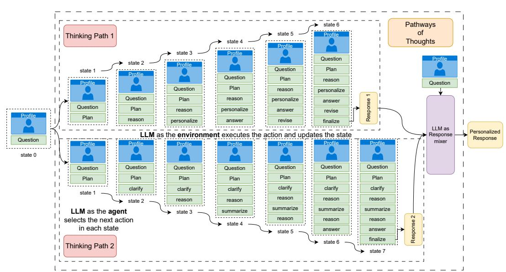
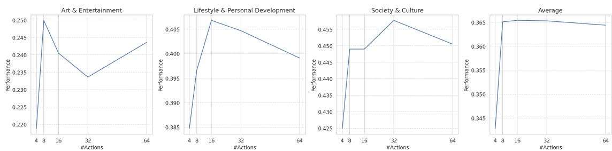
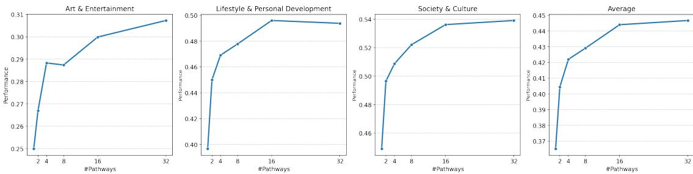
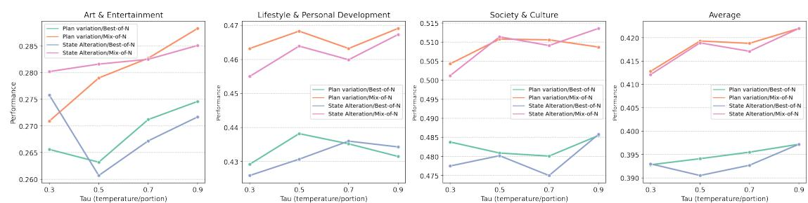
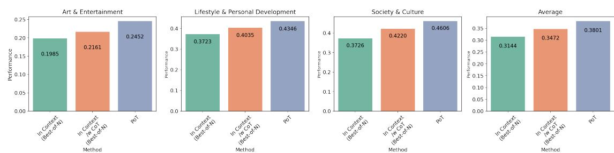

# **Pathways of Thoughts: Multi-Directional Thinking for Long-form Personalized Question Answering**

Alireza Salemi University of Massachusetts Amherst Amherst, MA, USA asalemi@cs.umass.edu

Cheng Li Google DeepMind Mountain View, CA, USA chgli@google.com

Mingyang Zhang Google DeepMind Mountain View, CA, USA mingyang@google.com

Qiaozhu Mei University of Michigan Ann Arbor, MI, USA qmei@umich.edu

Zhuowan Li Google DeepMind Mountain View, CA, USA zhuowan@google.com

Spurthi Amba Hombaiah Google DeepMind Mountain View, CA, USA spurthiah@google.com

Weize Kong Google DeepMind Mountain View, CA, USA weize@google.com

Tao Chen Google DeepMind Mountain View, CA, USA taochen@google.com

Hamed Zamani University of Massachusetts Amherst Amherst, MA, USA zamani@cs.umass.edu

Michael Bendersky Google DeepMind Mountain View, CA, USA bemike@google.com

# **Abstract**

Personalization is well studied in search and recommendation, but personalized question answering remains underexplored due to challenges in inferring preferences from long, noisy, implicit contexts and generating responses that are both accurate and aligned with user expectations. To address this, we propose *Pathways of Thoughts (PoT)*, an inference-stage method that applies to any large language model (LLM) without task-specific fine-tuning. PoT models the thinking as an iterative decision process, where the model dynamically selects among cognitive operations such as reasoning, revision, personalization, and clarification. This enables exploration of multiple reasoning trajectories, producing diverse candidate responses that capture different perspectives. PoT then aggregates and reweights these candidates according to inferred user preferences, yielding a final personalized response that benefits from the complementary strengths of diverse reasoning paths. Experiments on the LaMP-QA benchmark show that PoT consistently outperforms competitive baselines, achieving up to a 10.8% relative improvement. Human evaluation further validates these improvements, with annotators preferring PoT in 66% of cases compared to the best-performing baseline and reporting ties in 15% of cases.

### **CCS Concepts**

• **Information systems** → **Question answering**; **Personalization**; • **Computing methodologies** → **Markov decision processes**; **Natural language generation**.

> [This work is licensed under a Creative Commons Attribu](https://creativecommons.org/licenses/by/4.0/)[tion International 4.0 License.](https://creativecommons.org/licenses/by/4.0/)

*WWW '26, Dubai, United Arab Emirates* © 2026 Copyright held by the owner/author(s). ACM ISBN 979-8-4007-2307-0/2026/04 <https://doi.org/10.1145/3774904.3792145>

# **Keywords**

Personalization, Test-time compute scaling, Thinking LLMs

#### **ACM Reference Format:**

Alireza Salemi, Cheng Li, Mingyang Zhang, Qiaozhu Mei, Zhuowan Li, Spurthi Amba Hombaiah, Weize Kong, Tao Chen, Hamed Zamani, and Michael Bendersky. 2026. Pathways of Thoughts: Multi-Directional Thinking for Long-form Personalized Question Answering. In *Proceedings of the ACM Web Conference 2026 (WWW '26), April 13–17, 2026, Dubai, United Arab Emirates.* ACM, New York, NY, USA, [14](#page-13-0) pages. [https://doi.org/10.1145/3774904.](https://doi.org/10.1145/3774904.3792145) [3792145](https://doi.org/10.1145/3774904.3792145)

### <span id="page-0-0"></span>**1 Introduction**

Personalizing large language models (LLMs) has become increasingly important due to applications in content generation, writing assistance, education, and recommendation [[16](#page-8-0), [18,](#page-8-1) [22](#page-8-2), [23,](#page-8-3) [29](#page-8-4)]. By conditioning outputs on user preferences, context, and needs, personalization improves engagement, satisfaction, and overall effectiveness [[28](#page-8-5)]. It is particularly valuable in information-seeking systems such as search engines and question answering (QA) [[31](#page-8-6), [32](#page-8-7)], where appropriate responses depend on user-specific factors like background knowledge and learning style. Despite its clear relevance to web search and emerging systems (e.g., AI-powered search modes), personalization in QA remains relatively underexplored.

Augmenting LLM inputs with the user's personalized context have proven effective for personalized generation [\[16](#page-8-0), [18](#page-8-1), [27](#page-8-8), [29](#page-8-4)]. This can be further enhanced by training the LLM to perform reasoning over the personalized context to extract the user's preferences before response generation [\[28\]](#page-8-5). However, in most realworld cases, fine-tuning the LLM is often infeasible for two key reasons. On one hand, many LLMs are black boxes with frozen parameters, offering no control over their internal mechanisms. On the other hand, even with full access to parameters, the fine-tuning


<span id="page-1-0"></span>

**Figure 1: Pathways of Thoughts overview. PoT explores multiple directions of thinking about answering the question, generates a response for each, and mix them into a final response.**

process requires substantial amount of personal data and computational resources for individual users. Consequently, a practical way to influence the model's output is by applying advanced strategies during inference. Recognizing this, our paper focuses on this scenario and proposes an **inference-stage strategy** to achieve better personalization.

Developing effective personalization models presents its own unique challenges. First, the quality of a response in personalized QA is determined by the user who asks the question, which is influenced by their preferences, context, and background. Therefore, even when two answers are factually accurate, one may be preferred by the user. Second, user preferences are often not explicitly stated and must be inferred from personalized context, such as profiles or prior interactions. This context is frequently lengthy and noisy, making it difficult for a model to extract relevant signals. These issues highlight that simply augmenting an LLM's input with user context is often insufficient. Effective personalization requires the model to perform reasoning over noisy, implicit user data to deduce user preferences before generating a response.

To address the aforementioned challenges of personalized QA, this paper introduces *Pathways of Thoughts (PoT)*, demonstrated in Figure [1](#page-1-0). This approach, which is generic and can be applied to any LLM without additional training, enables the model to explore multiple thinking pathways when generating responses, each leading to a distinct response. We formalize each thinking pathway as a Markov Decision Process (MDP), where the LLM serves as both the agent and the environment. At each step, the LLM, acting as the agent, selects the most suitable action from a predefined set of cognitive operations, such as planning, reasoning, personalizing, and revising. The LLM then assumes the role of the environment, executing the chosen action and updating the state with newly acquired knowledge. This iterative process allows the model to refine its understanding of the user's intent, extract key preferences from the user profile, and explore diverse strategies for answering the

question. The process continues until the model determines that no further actions are needed, producing an initial set of responses. To generate the final personalized response, the LLM mixes outputs from different thinking pathways into a single response, aligning them with the user's preferences extracted from their profile. Pathways of Thoughts addresses the challenges of LLMs in personalized question answering by allowing the model to iteratively think about the next step in responding to the question and how the lengthy user context can be effectively utilized. Additionally, it explores different diverse directions and paths, considering a range of possible solutions for answering the question. Finally, generating a response by aggregating all pathways' responses ensures that the output captures the strengths of all explored pathways, resulting in a more personalized and aligned response.

We conduct our experiments on the *LaMP-QA* benchmark [[31](#page-8-6)]– a recent large-scale benchmark designed for evaluating personalized QA in three diverse domains: (1) Art & Entertainment, (2) Lifestyle & Personal Development, and (3) Society & Culture. Our results demonstrate that PoT outperforms competitive baselines across all categories, with up to 10.8% statistically significant improvement on average compared to the best-performing baselines. Additionally, we investigate the impact of pathway length, the number of pathways, and various methods for diversifying pathways and aggregating responses on performance. We show that PoT generalizes to different long-context backbone LLMs without requiring additional training. Finally, human evaluation of comparing outputs side by side shows that *PoT* better satisfies users' information needs in 66% of cases, compared to 19% for the best-performing baseline.

# **2 Related Work**

*LLM Personalization*. Personalization plays a central role in search, recommendation, and text generation applications [[6,](#page-8-9) [23](#page-8-3), [29](#page-8-4), [39](#page-9-0)]. To enable personalization in LLMs, Salemi et al. [[29](#page-8-4)] introduced

a retrieval-augmented generation framework alongside the LaMP benchmark for short-form text, which was later extended to longform content generation with LongLaMP [\[16\]](#page-8-0) and more recently to personalized QA with LaMP-QA [\[31\]](#page-8-6). Personalized assistants have also been studied in several recent works [\[18,](#page-8-1) [21](#page-8-10), [22](#page-8-2), [43\]](#page-9-1). Proposed approaches span a variety of techniques, including training retrieval models with user feedback [\[27\]](#page-8-8), optimizing LLMs with personalized supervision [[13](#page-8-11)], and generating personalized prompts [[17](#page-8-12)]. Parameter-efficient fine-tuning has emerged as another direction [[35\]](#page-8-13), including its integration with retrieval-augmented methods [\[30\]](#page-8-14). Beyond model adaptation, reasoning and self-training strategies have been shown to improve personalization in text generation [[28](#page-8-5)]. More recently, learning from natural language feedback has proven effective for adapting QA systems to individual users [\[32](#page-8-7)]. Nevertheless, strategies for improving personalized QA at test time—without incurring the cost of additional training remain underexplored, which is the focus of this work.

*Reasoners & Agents for Problem Solving*. Reasoning enables models to solve problems with step-by-step processing, known as chain-of-thought (CoT), enhancing performance in complex tasks like mathematical problem-solving, logical reasoning, and commonsense understanding [\[19](#page-8-15), [37](#page-9-2), [42](#page-9-3)]. Training LLMs to perform intermediate reasoning steps before generating responses has been effective, as seen in GPT-o1 [[25](#page-8-16)] and DeepSeek-R1 [\[5](#page-8-17)]. Additionally, agentic and multi-turn or multi-agent systems that interact with external tools [[14](#page-8-18)], code [[8,](#page-8-19) [20,](#page-8-20) [38](#page-9-4)], simulated environments [[10](#page-8-21), [26,](#page-8-22) [36](#page-9-5), [41\]](#page-9-6), or with other agents [\[9](#page-8-23)] have been explored for complex problem-solving. Markov Decision Processes (MDP) have shown promise in reasoning for games and mathematical problems [[10](#page-8-21), [36\]](#page-9-5). However, these methods have not been applied to free-form text generation, particularly personalization which requires user-specific responses rather than objectively correct answers. This study extends these methods to personalized text generation by integrating them with graph-based search in place of traditional tree search in MDPs, enabling the model to produce responses that reflect the aggregated quality of all explored candidate solutions rather than relying on a single path.

*Scaling Inference Compute*. Recent advances in LLM reasoning for logic and mathematics show that increasing compute resources during inference can significantly enhance performance [\[4](#page-8-24), [33](#page-8-25)]. This allows LLMs to explore answer spaces more thoroughly, improving accuracy in logical reasoning, math problem-solving, and code generation [\[2,](#page-8-26) [3,](#page-8-27) [44](#page-9-7)]. While previous research has focused on math, coding, and logic, its potential for free-form text generation, especially personalized question answering, is underexplored. Our work addresses this by using increased inference compute to better navigate response spaces, enhancing personalization.

# **3 Problem Formulation**

We assume a question ���� originates from a user ��, who has a set of ���� personalized information elements, denoted as ���� = {���� } ���� ��=1. Following previous work that utilizes long-term user history as the user profile [\[15](#page-8-28), [29](#page-8-4), [31\]](#page-8-6), ���� consists of the user's previously asked questions along with the their question narrative. The objective is to use this personalized information, along with the question ���� , to

generate a personalized response using an LLM ��, formulated as �� ̂�� = �� (���� , ���� ). To evaluate the personalized response generated for the user ��'s question, following Salemi and Zamani [\[31](#page-8-6)], we assume access to a set of aspects ������ = {���� } |������ ��=1 that user �� expects to be addressed in the response, extracted from a question narrative ������ written by the user. These aspects are used solely for evaluation and are not accessible to the model during response generation. Finally, a metric ��(���� , ̂���� , ������ , ���� ) is used to score the generated response based on the extent to which these aspects are covered.

#### **4 Pathways of Thoughts**

Personalization is inherently user-specific, meaning that a response generation strategy effective for one user may not perform well for another. Consequently, relying on a single solution to generate a response for a user may not always yield the most preferred outcome for each individual user. To address this limitation, as well as those discussed in Section [1,](#page-0-0) we propose *Pathways of Thoughts (PoT)*, illustrated in Figure [1](#page-1-0). In this framework, the LLM explores multiple thinking pathways, each corresponding to a distinct line of thought that leads to a potential response. We model each thinking pathway as an MDP, where the LLM serves as both the agent and the environment. At each step, the LLM (acting as the agent) selects an action from a set of fundamental cognitive operations such as planning, reasoning, clarification, or revising. The same LLM (now acting as the environment) then executes the chosen action, updating the current state with newly acquired information about the question and user. This iterative process continues until convergence, producing a final response for each pathway. To generate a single personalized response, the LLM aggregates the responses obtained from different pathways, integrating their complementary strengths while aligning with the user's preferences inferred from their profile. The complete procedure is detailed in Algorithm [1](#page-4-0), and the next section elaborates on this method.

#### **4.1 Thinking as a Markov Decision Process**

The thinking process in the human brain involves using and integrating a set of fundamental cognitive skills—e.g., reasoning, planning, and revision—that collectively form the foundation of structured thought [\[7,](#page-8-29) [34\]](#page-8-30). Inspired by theories about sequential decision making in the human brain, we model the thinking process of LLMs as an MDP. Given the current thoughts and steps taken to generate a response, the model selects the next fundamental action from a predefined set to enhance its representation of the question, refine its reasoning, and improve the generated response.

An MDP is defined as a quadruple (��, ������ , ������ , ������ ), where �� is the set of states, ������ represents the set of available actions in state ���� , ������ (����+1 ∣ ���� ) defines the probability of transitioning from state ���� to ����+1 given action ���� , and ������ (����+1, ���� ) specifies the reward function, which assigns a reward for taking action ���� in state ���� and transitioning to ����+1. In this setting, the agent �� aims to assign a probability ���� (���� |���� ) to each action based on the current state ���� .

To generate a personalized response for the question ���� from the user ��, we assume the agent �� starts from an initial state ��0 , which consists of the question ���� and the user profile ���� . The agent iteratively selects the most probable action at each step using the prompt shown in Figure [7](#page-9-8) in Appendix [A,](#page-9-9) continuing this process

<span id="page-3-0"></span>

**Figure 2: Initial state and actions definition prompt used in Pathways of Thoughts.**

until it either chooses a halting action (as determined by the LLM) or reaches the maximum number of allowed actions, denoted as �� . Since our task involves text generation and lacks an external environment enforcing termination, the agent itself determines when to stop or continues until the predefined action limit is reached. See = Algorithm [1](#page-4-0) (lines 3-17) for details.The following subsections outlines the definitions of each MDP component in our framework: *Set of States (*��*):* The state is defined as the concatenation of the inputs, outputs, and decisions of the model into a sequence of tokens using a predefined prompt format. This representation captures the full context of the system like a conversation. The initial state of the system consists of the user's question ���� , the user profile ���� , and a set of instructions specifying the actions and the model's expected behavior for each action, as shown in Figure [2.](#page-3-0) Given this setup, the set of all possible states corresponds to the set of all textual sequences that this initial prompt is their prefix. As a result, the state space forms an uncountable discrete set.

<span id="page-4-0"></span>

<span id="page-4-2"></span>

<span id="page-4-1"></span>

<span id="page-5-1"></span>**Table 1: Performance on LaMP-QA.** † **and** ‡ **show statistically significant improvement over the single and multiple inference best baseline, respectively, using t-test (**�� < 0.05**). Gemini 1.5 Pro has been used as the backbone LLM for all the methods.**

|      | Method     |                  |           |                  | Arts & Entertainment Single Inference | Lifestyle & Personal Development | Society Culture | & Average (macro) |
|------|------------|------------------|-----------|------------------|---------------------------------------|----------------------------------|-----------------|-------------------|
| (1)  | No         | Personalization  |           |                  | 0.1741                                | 0.2863                           | 0.2996          | 0.2533            |
| (2)  | In-Context | Personalization  |           |                  | 0.1722                                | 0.3022                           | 0.3482          | 0.2742            |
| (3)  | In-Context | Personalization  | w/        | CoT              | 0.2119                                | 0.3862                           | 0.4230          | 0.3403            |
| (4)  | Pathways   | of Thoughts      | ( ��      | = 1 , �� = 8 )   | 0.2499 †                              | 0.3966                           | 0.4490          | † 0.3651 †        |
|      |            |                  |           |                  | Multiple Inference                    |                                  |                 |                   |
| (5)  | In-Context | Personalization  | w/        | Best-of-32       | 0.2248                                | 0.3753                           | 0.4303          | 0.3434            |
| (6)  | In-Context | Personalization  | w/        | CoT & Best-of-32 | 0.2607                                | 0.4380                           | 0.4789          | 0.3925            |
| (7)  | In-Context | Personalization  | w/        | Mix-of-32        | 0.2310                                | 0.3781                           | 0.4411          | 0.3500            |
| (8)  | In-Context | Personalization  | w/        | CoT & Mix-of-32  | 0.2689                                | 0.4443                           | 0.4891          | 0.4007            |
| (9)  | Tree       | of Thoughts ( �� | = 32 , �� | = 2 )            | 0.2054                                | 0.4178                           | 0.4546          | 0.3592            |
| (10) | Pathways   | of Thoughts      | ( ��      | = 16 , �� = 8 )  | 0.2999 †‡                             | 0.4960 †‡                        | 0.5362          | †‡ 0.4440 †‡      |

there is no definitive right or wrong response. By aggregating the strengths of all responses, it generates a response that aligns with user preferences, ensuring a more personalized output. PoT uses this approach as the primary response aggregation method.

# **5 Experiments**

### **5.1 Experimental Setup**

*Datasets*. We conduct experiments on the LaMP-QA benchmark [[31](#page-8-6)], the only publicly available dataset for long-form personalized QA. LaMP-QA covers three diverse domains: (1) Art & Entertainment (767 questions), (2) Lifestyle & Personal Development (989 questions), and (3) Society & Culture (1074 questions). Each LaMP-QA example contains a user question, the user's question history (serving as the user profile), a user-written narrative that reflects the user's information need and intent, and a set of personalized rubrics specifying the aspects an ideal response should address. For evaluation, we follow the evaluation recipe of Salemi and Zamani [\[31\]](#page-8-6) with Gemini 1.5 Pro as the evaluator language model. For each question, the evaluator checks whether the generated response addresses each personalized aspect, assigning scores in the range [0, 2]. These are normalized to [0, 1], and the final response score is computed as the mean normalized score across all aspects. For details, we refer the reader to Salemi and Zamani [[31](#page-8-6)]. In one experiment, we corroborate our findings through a side-by-side human evaluation comparing PoT to the strongest baseline.

*PoT's Configurations*. We use Gemini 1.5 Pro as the backbone LLM. To show the generalizability of PoT, we also use GPT-4omini[<sup>2</sup>](#page-5-0) [\[24](#page-8-31)] using our most representative experiment configurations. For single pathways, we use Nucleus sampling [\[11](#page-8-32)] with a temperature of �� = 0.1. For multi-directional pathways, we use the same setting, except for the *Planning Action Variation*, where a temperature of �� = 0.9 is used exclusively for the *planning* action. For generating diverse plans, we use *Planning Action Variation* by default and *Mixture-of-N* for response aggregation, unless otherwise specified. We set the context length to 32��, the maximum number of actions per pathway to �� = 8 , and the number of pathways to

�� = 16. In ablations, we reduce the number of pathways to �� = 4 to save costs, unless otherwise specified. For personalized context, we use the 10 recent questions of the user with the same order as they appear in the LaMP-QA [[31](#page-8-6)] dataset.

*Baselines*. We use six baselines: (1) LLM without personalized context that directly answers the question, (2) LLM with access to the same personalized context as PoT, and (3) LLM with access to personalized context that first performs reasoning over the context to extract important aspects relevant to the question before generating the response. The two latter use the prompts shown in Figures [11](#page-10-1) and [12](#page-10-2) in Appendix [B.](#page-10-3) These baselines all use Nucleus sampling with a temperature of �� = 0.1. We extend the latter two baselines by doing multiple inferences and Best-of-N [\[3](#page-8-27), [12\]](#page-8-33) and Mixture-of-N to evaluate their performance when test-time compute scales, to form baselines (5), (6), (7), and (8). Additionally, we include the (9) Tree of Thoughts (ToT) [[40](#page-9-14)] as a baseline, leveraging its test-time compute scaling for comparison with our method. We follow their setup, particularly in the creative writing task, as it is the closest task they studied to personalized question answering. This setup consists of an intermediate planning step, where a set of plans is generated and the best plan is selected, followed by a final response generation step, where a set of responses is generated and the best response is chosen. For planning, we use the prompts shown in Figure [13](#page-10-4), and for response generation, we refer to Figure **⁇**, both in Appendix [B.](#page-10-3) We observed that the baselines generate, on average, half the number of tokens compared to ������ . To ensure a fair comparison, we set the Best-of-N and Mixtureof-N baselines to generate double the number of responses, with �� = 32 and a sampling temperature of �� = 0.9 to ensure diverse responses. For the Best-of-N and Mixture-of-N approach, we use the method introduced in Section [4.2.](#page-4-2) For ToT, following Yao et al. [\[40](#page-9-14)] and their setup for the creative writing task that is the most similar to ours, we set the tree depth to �� = 2. For fair comparison with PoT, we generate �� = 32 plans and responses at each node with a sampling temperature of �� = 0.9. The prompts for selecting the best plan is shown in Figure **⁇** in Appendix [B.](#page-10-3) For selecting the best response, we utilize the method introduced in Section [4.2.](#page-4-2)

<span id="page-5-0"></span><sup>2</sup>Available at: <https://platform.openai.com/docs/models/gpt-4o-mini>

<span id="page-6-0"></span>

**Figure 3: Effect of the maximum number of actions per pathway on the performance.**

<span id="page-6-1"></span>

**Figure 4: Effect of the number of pathways on the performance.**

#### **5.2 Empirical Findings**

*Comparison with baselines*. The results of this experiment are reported in Table [1](#page-5-1). The findings show that PoT outperforms all the baselines across all categories, achieving a **10.8%** relative improvement on average over the best baseline (row 8). The improvements are statistically significant with respect to t-test with 95% confidence. This demonstrates the superiority of PoT compared to the baselines. To compare our thinking-as-an-MDP method with baselines, we also report the results using only a single inference (rows 1-4). The results from this experiment show that our method (row 4) outperforms all single inference baselines (rows 1-3), with statistically significant improvements in two out of three categories and overall performance. Specifically, our method achieves a **7.2%** relative improvement in average performance, suggesting that our thinking approach is significantly more effective than CoT.

*Effect of the maximum number of actions in PoT*. For this, we focus on a single inference (�� = 1) using PoT and vary the maximum number of actions it can perform. The performance across all categories is shown in Figure [3.](#page-6-0) The findings show that increasing the number of actions improves performance up to a certain point (8 actions per pathway), after which performance declines. This occurs because, with too few actions, the LLM cannot construct effective pathways to solve the problem. Conversely, when given too many actions, the LLM may overthink the problem, performing unnecessary actions that degrade performance [\[1](#page-8-34)].

*Effect of the number of pathways in PoT*. We set the maximum number of actions per pathway to �� = 8 and vary the number of pathways. The performance across all categories is shown in Figure [4](#page-6-1). The findings indicate that increasing the number of pathways consistently improves performance; however, as the number grows, the improvements become thinner. This occurs because there is a limited set of different ways for answering the question, and after a certain point, the solutions start to repeat, leading to diminishing returns in performance with additional pathways.

*Effect of different plan diversification and response aggregation in PoT*. We evaluate all possible combinations of the methods introduced in Section [4.2.](#page-4-2) Specifically, we consider four configurations: 1) *Planning Action Variation w/ Best-of-N*, 2) *Planning Action Variation w/ Mixture-of-N*, 3) *Initial State Alteration w/ Bestof-N*, and 4) *Initial State Alteration w/ Mixture-of-N*. Additionally, we explore different values of the hyperparameter �� for both *Planning Action Variation* and *Initial State Alteration*. The results of this experiment are shown in Figure [5](#page-7-0). Our analysis reveals several key observations. Most notably, *Mixture-of-N* consistently outperforms *Best-of-N* regardless of the plan diversification method. This can be attributed to the fact that *Best-of-N* selects only one response from the generated candidates, whereas *Mixture-of-N* enables the combination of strengths from multiple responses, resulting in a more comprehensive and higher-quality output. we observe that increasing the hyperparameter �� improves performance. In *Planning Action Variation*, a higher �� leads to a more diverse set of generated plans due to higher sampling temperature, resulting in more varied thinking pathways that may produce more tailored responses. In *Initial State Alteration*, increasing �� provides each pathway with more user-specific information, enabling more personalized responses. Comparing the two, *Planning Action Variation* generally outperforms *Initial State Alteration* in terms of average performance. However, as �� increases, the performance gap narrows. Overall, *Planning Action Variation w/ Mixture-of-N* achieves the best performance for personalized question answering.

*PoT's generalizability and independence of LLM*. In the same setting as Gemini 1.5 pro, we apply PoT and the best performing baselines to another backbone LLM, GPT-4o-mini, to demonstrate its effectiveness across different LLMs with long context windows.

<span id="page-7-0"></span>

**Figure 5: Effect of planning diversification and response aggregation methods on the performance.**

<span id="page-7-1"></span>

**Figure 6: Performance of Pathways of Thoughts and baselines with GPT-4o-mini as the backbone LLM.**

The average performance across all categories is presented in Figure [6](#page-7-1). The results indicate that, similar to Gemini 1.5 Pro, GPT-4o-mini with PoT outperforms all baselines on all categories. It achieves a statistically significant 9.4% relative improvement on average across all datasets compared to the best baseline. These findings suggest that PoT enhances the performance of LLMs in personalized QA regardless of the underlying backbone LLM.

*Human evaluation.* We randomly sample 100 examples from LaMP-QA and generate outputs using PoT and In-Context Personalization w/ CoT & Best-of-32. Human annotators evaluate the outputs based on their alignment with the the user's question narrative (i.e., a detailed description of user's information need and perspective). Each example is annotated twice, yielding an inter-annotator agreement Cohen's kappa of 0.613. The results indicate that annotators preferred PoT in **66%** of the cases, the baseline in **19%**, and reported tie in **15%** of cases. These results show that PoT achieves considerably higher alignment with human preferences.

#### **5.3 Case Study**

We observe that PoT (�� = 16, �� = 8) generates 1943 unique pathways, defined by distinct action sequences chosen. Specifically, *Art & Entertainment* yields 1109, *Lifestyle & Personal Development* produces 814, and *Society & Culture* results in 1182 unique pathways. On average, each example generates 11.1 unique pathways with on average 7.19 actions. As a case study demonstrating the effectiveness of PoT, we present an example in Figure [16](#page-12-0) in Appendix:

- **Thinking Pathways & Generated Responses:** To conserve space, we present in Figure [16](#page-12-0) only the sequence of steps taken in each pathway, rather than the full generated text, and the response in each pathway. Each pathway corresponds to a distinct reasoning trajectory generated by PoT. For example, in the illustrated case, PoT selects different pathways depending on

whether personalization is required. Some pathways generate a direct response without personalization (e.g., Pathway 7), while others involve multiple rounds of reasoning that integrate various aspects of the query with the user profile before producing an answer (Pathways 1–6, 9–11, 13–15). Certain pathways also involve revision (Pathways 12, 15, and 16) or clarification (Pathway 4). Notably, we observed that for some trajectories PoT omit personalization entirely (Paths 7, 8, and 11). This shows that PoT deliberately explores a diverse range of reasoning strategies, producing responses from multiple perspectives that are subsequently combined into a final answer encompassing the advantages of each. Although responses across pathways share common elements, each retains distinctive characteristics, reflecting the variation in underlying reasoning strategies.

- **Final Response:** Figure [16](#page-12-0) shows the final response to the user's question, produced by aggregating and integrating components from multiple pathway outputs into a single coherent answer. The contributions of different pathways are indicated in brackets ([]). This shows how PoT leverages the complementary strengths of diverse reasonings, combining them into a unified response that aligns with the user's preferences and key information needs.

#### **6 Conclusions**

This paper addresses the critical yet under-explored problem of personalized question answering. we propose *Pathways of Thoughts (PoT)*, a novel approach that models the LLM's thinking process as an MDP during test time. By enabling the exploration of multiple thinking pathways and aggregating diverse responses, *PoT* effectively captures user preferences to generate personalized answers. Our results on *LaMP-QA* demonstrate that *PoT* achieves substantial improvements over baseline methods, with performance gains

<span id="page-8-28"></span><span id="page-8-0"></span>of up to 10.8%. Furthermore, human evaluation confirms the effectiveness of our approach, showing a strong user preference over exfor long-form text generation beyond personalization. **Acknowledgement** This work was supported in part by the Center for Intelligent Information Retrieval, in part by NSF grant #2143434, in part by the Office of Naval Research contract #N000142412612, and with support from by Google.org. Any opinions, findings and conclusions or recommendations expressed in this material are those of the authors and do not necessarily reflect those of the sponsor. **References** [1] Pranjal Aggarwal, Seungone Kim, Jack Lanchantin, Sean Welleck, Jason Weston, Ilia Kulikov, and Swarnadeep Saha. 2025. OptimalThinkingBench: Evaluating Over and Underthinking in LLMs. arXiv:[2508.13141](https://arxiv.org/abs/2508.13141) [cs.CL] [https://arxiv.org/](https://arxiv.org/abs/2508.13141) [abs/2508.13141](https://arxiv.org/abs/2508.13141) [2] Zhenni Bi, Kai Han, Chuanjian Liu, Yehui Tang, and Yunhe Wang. 2024. Forest-of-Thought: Scaling Test-Time Compute for Enhancing LLM Reasoning. arXiv:[2412.09078](https://arxiv.org/abs/2412.09078) [cs.CL] [3] Bradley Brown, Jordan Juravsky, Ryan Ehrlich, Ronald Clark, Quoc V. Le, Christopher Ré, and Azalia Mirhoseini. 2024. Large Language Monkeys: Scaling Inference Compute with Repeated Sampling. arXiv[:2407.21787](https://arxiv.org/abs/2407.21787) [cs.LG] [4] Yanxi Chen, Xuchen Pan, Yaliang Li, Bolin Ding, and Jingren Zhou. 2024. A Simple and Provable Scaling Law for the Test-Time Compute of Large Language Models. arXiv[:2411.19477](https://arxiv.org/abs/2411.19477) [cs.CL] [5] DeepSeek-AI. 2025. DeepSeek-R1: Incentivizing Reasoning Capability in LLMs via Reinforcement Learning. arXiv:[2501.12948](https://arxiv.org/abs/2501.12948) [cs.CL] [6] Andrew Fowler, Kurt Partridge, Ciprian Chelba, Xiaojun Bi, Tom Ouyang, and Shumin Zhai. 2015. Effects of Language Modeling and Its Personalization on Touchscreen Typing Performance. In *Proceedings of the 33rd Annual ACM Conference on Human Factors in Computing Systems* (Seoul, Republic of Korea) *(CHI '15)*. Association for Computing Machinery, New York, NY, USA, 649–658. [doi:10.1145/2702123.2702503](https://doi.org/10.1145/2702123.2702503) [7] Peter Frensch and Joachim Funke. 2002. Thinking and problem solving. *Encyclopedia of Life Support Systems (EOLSS), Developed under the Auspices of the UNESCO, Eolss Publishers, Oxford ,UK* (01 2002). [8] Yao Fu, Dong-Ki Kim, Jaekyeom Kim, Sungryull Sohn, Lajanugen Logeswaran, Kyunghoon Bae, and Honglak Lee. 2024. AutoGuide: Automated Generation and Selection of Context-Aware Guidelines for Large Language Model Agents. In *The Thirty-eighth Annual Conference on Neural Information Processing Systems*. <https://openreview.net/forum?id=mRIQz8Zd6O> [9] Taicheng Guo, Xiuying Chen, Yaqi Wang, Ruidi Chang, Shichao Pei, Nitesh V. Chawla, Olaf Wiest, and Xiangliang Zhang. 2024. Large Language Model Based Multi-agents: A Survey of Progress and Challenges. In *Proceedings of the Thirty-Third International Joint Conference on Artificial Intelligence, IJCAI-24*, Kate Larson (Ed.). International Joint Conferences on Artificial Intelligence Organization, 8048–8057. [doi:10.24963/ijcai.2024/890](https://doi.org/10.24963/ijcai.2024/890) Survey Track. [10] Shibo Hao, Yi Gu, Haodi Ma, Joshua Jiahua Hong, Zhen Wang, Daisy Zhe Wang, and Zhiting Hu. 2023. Reasoning with Language Model is Planning with World Model. In *The 2023 Conference on Empirical Methods in Natural Language Processing*. <https://openreview.net/forum?id=VTWWvYtF1R> [11] Ari Holtzman, Jan Buys, Li Du, Maxwell Forbes, and Yejin Choi. 2020. The Curious Case of Neural Text Degeneration. In *International Conference on Learning Representations*. <https://openreview.net/forum?id=rygGQyrFvH> [12] Yuki Ichihara, Yuu Jinnai, Tetsuro Morimura, Kenshi Abe, Kaito Ariu, Mitsuki Sakamoto, and Eiji Uchibe. 2025. Evaluation of Best-of-N Sampling Strategies for Language Model Alignment. *Transactions on Machine Learning Research* (2025). <https://openreview.net/forum?id=H4S4ETc8c9> [13] Joel Jang, Seungone Kim, Bill Yuchen Lin, Yizhong Wang, Jack Hessel, Luke Zettlemoyer, Hannaneh Hajishirzi, Yejin Choi, and Prithviraj Ammanabrolu. 2023. Personalized Soups: Personalized Large Language Model Alignment via Post-hoc Parameter Merging. arXiv:[2310.11564](https://arxiv.org/abs/2310.11564) [14] Bowen Jin, Hansi Zeng, Zhenrui Yue, Jinsung Yoon, Sercan O Arik, Dong Wang, Hamed Zamani, and Jiawei Han. 2025. Search-R1: Training LLMs to Reason and Leverage Search Engines with Reinforcement Learning. In *Second Conference on Language Modeling*. <https://openreview.net/forum?id=Rwhi91ideu> [15] Pranav Kasela, Marco Braga, Gabriella Pasi, and Raffaele Perego. 2024. SE-PQA: Personalized Community Question Answering. In *Companion Proceedings of the ACM Web Conference 2024* (Singapore, Singapore) *(WWW '24)*. Association for Computing Machinery, New York, NY, USA, 1095–1098. [doi:10.1145/3589335.](https://doi.org/10.1145/3589335.3651445) [3651445](https://doi.org/10.1145/3589335.3651445) [16] Ishita Kumar, Snigdha Viswanathan, Sushrita Yerra, Alireza Salemi, Ryan A. Rossi, Franck Dernoncourt, Hanieh Deilamsalehy, Xiang Chen, Ruiyi Zhang, Shubham Agarwal, Nedim Lipka, and Hamed Zamani. 2024. LongLaMP: A Benchmark for Personalized Long-form Text Generation. arXiv:[2407.11016](https://arxiv.org/abs/2407.11016) [cs.CL] [17] Cheng Li, Mingyang Zhang, Qiaozhu Mei, Weize Kong, and Michael Bendersky. 2024. Learning to Rewrite Prompts for Personalized Text Generation. In *Proceedings of the ACM on Web Conference 2024 (WWW '24)*. ACM. [doi:10.1145/3589334.](https://doi.org/10.1145/3589334.3645408) [3645408](https://doi.org/10.1145/3589334.3645408) [18] Cheng Li, Mingyang Zhang, Qiaozhu Mei, Yaqing Wang, Spurthi Amba Hombaiah, Yi Liang, and Michael Bendersky. 2023. Teach LLMs to Personalize – An Approach inspired by Writing Education. arXiv:[2308.07968](https://arxiv.org/abs/2308.07968) [19] Hanmeng Liu, Zhiyang Teng, Leyang Cui, Chaoli Zhang, Qiji Zhou, and Yue Zhang. 2023. LogiCoT: Logical Chain-of-Thought Instruction Tuning. In *The 2023 Conference on Empirical Methods in Natural Language Processing*. [https:](https://openreview.net/forum?id=qlCtkvgQJH) [//openreview.net/forum?id=qlCtkvgQJH](https://openreview.net/forum?id=qlCtkvgQJH) [20] Yanming Liu, Xinyue Peng, Jiannan Cao, Shi Bo, Yuwei Zhang, Xuhong Zhang, Sheng Cheng, Xun Wang, Jianwei Yin, and Tianyu Du. 2025. Tool-Planner: Task Planning with Clusters across Multiple Tools. In *The Thirteenth International Conference on Learning Representations*. [https://openreview.net/forum?](https://openreview.net/forum?id=dRz3cizftU) [id=dRz3cizftU](https://openreview.net/forum?id=dRz3cizftU) [21] Zhuoran Lu, Sheshera Mysore, Tara Safavi, Jennifer Neville, Longqi Yang, and Mengting Wan. 2024. Corporate Communication Companion (CCC): An LLMempowered Writing Assistant for Workplace Social Media. arXiv[:2405.04656](https://arxiv.org/abs/2405.04656) [22] Sheshera Mysore, Zhuoran Lu, Mengting Wan, Longqi Yang, Steve Menezes, Tina Baghaee, Emmanuel Barajas Gonzalez, Jennifer Neville, and Tara Safavi. 2023. PEARL: Personalizing Large Language Model Writing Assistants with Generation-Calibrated Retrievers. arXiv[:2311.09180](https://arxiv.org/abs/2311.09180) [23] Maxim Naumov, Dheevatsa Mudigere, Hao-Jun Michael Shi, Jianyu Huang, Narayanan Sundaraman, Jongsoo Park, Xiaodong Wang, Udit Gupta, Carole-Jean Wu, Alisson G. Azzolini, Dmytro Dzhulgakov, Andrey Mallevich, Ilia Cherniavskii, Yinghai Lu, Raghuraman Krishnamoorthi, Ansha Yu, Volodymyr Kondratenko, Stephanie Pereira, Xianjie Chen, Wenlin Chen, Vijay Rao, Bill Jia, Liang Xiong, and Misha Smelyanskiy. 2019. Deep Learning Recommendation Model for Personalization and Recommendation Systems. arXiv:[1906.00091](https://arxiv.org/abs/1906.00091) [cs.IR] [24] OpenAI. 2024. GPT-4o System Card. arXiv:[2410.21276](https://arxiv.org/abs/2410.21276) [cs.CL] [25] OpenAI. 2024. OpenAI o1 System Card. [26] Sungjin Park, Xiao Liu, Yeyun Gong, and Edward Choi. 2024. Ensembling Large Language Models with Process Reward-Guided Tree Search for Better Complex Reasoning. arXiv[:2412.15797](https://arxiv.org/abs/2412.15797) [cs.CL] [27] Alireza Salemi, Surya Kallumadi, and Hamed Zamani. 2024. Optimization Methods for Personalizing Large Language Models through Retrieval Augmentation. In *Proceedings of the 47th International ACM SIGIR Conference on Research and Development in Information Retrieval* (Washington DC, USA) *(SI-GIR '24)*. Association for Computing Machinery, New York, NY, USA, 752–762. [doi:10.1145/3626772.3657783](https://doi.org/10.1145/3626772.3657783) [28] Alireza Salemi, Cheng Li, Mingyang Zhang, Qiaozhu Mei, Weize Kong, Tao Chen, Zhuowan Li, Michael Bendersky, and Hamed Zamani. 2025. Reasoning-Enhanced Self-Training for Long-Form Personalized Text Generation. arXiv[:2501.04167](https://arxiv.org/abs/2501.04167) [cs.CL] <https://arxiv.org/abs/2501.04167> [29] Alireza Salemi, Sheshera Mysore, Michael Bendersky, and Hamed Zamani. 2024. LaMP: When Large Language Models Meet Personalization. In *Proceedings of the 62nd Annual Meeting of the Association for Computational Linguistics (Volume 1: Long Papers)*, Lun-Wei Ku, Andre Martins, and Vivek Srikumar (Eds.). Association for Computational Linguistics, Bangkok, Thailand, 7370–7392. [https:](https://aclanthology.org/2024.acl-long.399) [//aclanthology.org/2024.acl-long.399](https://aclanthology.org/2024.acl-long.399) [30] Alireza Salemi and Hamed Zamani. 2024. Comparing Retrieval-Augmentation and Parameter-Efficient Fine-Tuning for Privacy-Preserving Personalization of Large Language Models. arXiv:[2409.09510](https://arxiv.org/abs/2409.09510) [cs.CL] [31] Alireza Salemi and Hamed Zamani. 2025. LaMP-QA: A Benchmark for Personalized Long-form Question Answering. arXiv:[2506.00137](https://arxiv.org/abs/2506.00137) [cs.CL] [32] Alireza Salemi and Hamed Zamani. 2025. Learning from Natural Language Feedback for Personalized Question Answering. arXiv:[2508.10695](https://arxiv.org/abs/2508.10695) [cs.CL] [https:](https://arxiv.org/abs/2508.10695) [//arxiv.org/abs/2508.10695](https://arxiv.org/abs/2508.10695) [33] Charlie Snell, Jaehoon Lee, Kelvin Xu, and Aviral Kumar. 2024. Scaling LLM Test-Time Compute Optimally can be More Effective than Scaling Model Parameters. arXiv:[2408.03314](https://arxiv.org/abs/2408.03314) [cs.LG] [34] Robert J. Sternberg and Talia Ben-Zeev. 2001. Complex Cognition: The Psychology of Human Thought. [35] Zhaoxuan Tan, Zheyuan Liu, and Meng Jiang. 2024. Personalized Pieces: Efficient Personalized Large Language Models through Collaborative Efforts. arXiv:[2406.10471](https://arxiv.org/abs/2406.10471)

<span id="page-8-34"></span><span id="page-8-33"></span><span id="page-8-32"></span><span id="page-8-31"></span><span id="page-8-30"></span><span id="page-8-29"></span><span id="page-8-27"></span><span id="page-8-26"></span><span id="page-8-25"></span><span id="page-8-24"></span><span id="page-8-23"></span><span id="page-8-22"></span><span id="page-8-21"></span><span id="page-8-20"></span><span id="page-8-19"></span><span id="page-8-18"></span><span id="page-8-17"></span><span id="page-8-16"></span><span id="page-8-15"></span><span id="page-8-14"></span><span id="page-8-13"></span><span id="page-8-12"></span><span id="page-8-11"></span><span id="page-8-10"></span><span id="page-8-9"></span><span id="page-8-8"></span><span id="page-8-7"></span><span id="page-8-6"></span><span id="page-8-5"></span><span id="page-8-4"></span><span id="page-8-3"></span><span id="page-8-2"></span><span id="page-8-1"></span>

isting baselines. This paper focuses solely on personalized question answering; however Pathways of Thoughts is a general framework and future work can explore the potential of Pathways of Thoughts

<span id="page-9-8"></span>

**Figure 7: Action selection prompt used in PoT.**

<span id="page-9-10"></span>

output: ``` json **Figure 8: Prompt for extracting important aspects from the user profile used in PoT.**

<span id="page-9-14"></span><span id="page-9-6"></span><span id="page-9-5"></span><span id="page-9-4"></span><span id="page-9-3"></span><span id="page-9-2"></span><span id="page-9-1"></span><span id="page-9-0"></span>[36] Chaojie Wang, Yanchen Deng, Zhiyi Lyu, Liang Zeng, Jujie He, Shuicheng Yan, and Bo An. 2024. Q\*: Improving Multi-step Reasoning for LLMs with Deliberative Planning. arXiv:[2406.14283](https://arxiv.org/abs/2406.14283) [cs.AI] [37] Jason Wei, Xuezhi Wang, Dale Schuurmans, Maarten Bosma, Brian Ichter, Fei Xia, Ed H. Chi, Quoc V. Le, and Denny Zhou. 2022. Chain-of-thought prompting elicits reasoning in large language models. In *Proceedings of the 36th International Conference on Neural Information Processing Systems* (New Orleans, LA, USA) *(NIPS '22)*. Curran Associates Inc., Red Hook, NY, USA, Article 1800, 14 pages. [38] Chengxing Xie and Difan Zou. 2024. A Human-Like Reasoning Framework for Multi-Phases Planning Task with Large Language Models. In *ICML 2024 Workshop on LLMs and Cognition*. <https://openreview.net/forum?id=BX6wC2452j> [39] Gui-Rong Xue, Jie Han, Yong Yu, and Qiang Yang. 2009. User Language Model for Collaborative Personalized Search. *ACM Trans. Inf. Syst.* 27, 2, Article 11 (mar 2009), 28 pages. [doi:10.1145/1462198.1462203](https://doi.org/10.1145/1462198.1462203) [40] Shunyu Yao, Dian Yu, Jeffrey Zhao, Izhak Shafran, Thomas L. Griffiths, Yuan Cao, and Karthik R Narasimhan. 2023. Tree of Thoughts: Deliberate Problem Solving with Large Language Models. In *Thirty-seventh Conference on Neural Information Processing Systems*. <https://openreview.net/forum?id=5Xc1ecxO1h> [41] Shunyu Yao, Jeffrey Zhao, Dian Yu, Nan Du, Izhak Shafran, Karthik Narasimhan, and Yuan Cao. 2022. ReAct: Synergizing Reasoning and Acting in Language Models. *arXiv preprint arXiv:2210.03629* (2022). [42] Han Yin, Jianxing Yu, Miaopei Lin, and Shiqi Wang. 2024. Answering Spatial CommonsenseQuestions Based on Chain-of-Thought Reasoning with Adaptive Complexity. In *Web and Big Data*, Wenjie Zhang, Anthony Tung, Zhonglong Zheng, Zhengyi Yang, Xiaoyang Wang, and Hongjie Guo (Eds.). Springer Nature Singapore, Singapore, 186–200. [43] Kai Zhang, Yangyang Kang, Fubang Zhao, and Xiaozhong Liu. 2024. LLMbased Medical Assistant Personalization with Short- and Long-Term Memory Coordination. In *Proceedings of the 2024 Conference of the North American Chapter of the Association for Computational Linguistics: Human Language Technologies (Volume 1: Long Papers)*, Kevin Duh, Helena Gomez, and Steven Bethard (Eds.). Association for Computational Linguistics, Mexico City, Mexico, 2386– 2398. <https://aclanthology.org/2024.naacl-long.132> [44] Kexun Zhang, Shang Zhou, Danqing Wang, William Yang Wang, and Lei Li. 2024. Scaling LLM Inference with Optimized Sample Compute Allocation. arXiv:[2410.22480](https://arxiv.org/abs/2410.22480) [cs.CL]

<span id="page-9-13"></span>

| # your input: ## your output: # aspects: | Best-of-N You are a personalized search assistant with great rating capabilities. Your task is to select the best answer to the question of the user, considering the aspects that are important for the user. - aspects: a json list of aspects that are important for the user. Aspects are in the following format: - aspect: The aspect that is important for the user. - description: The description of the aspect. - question: The question asked by the user. - responses: a list of responses to the question of the user. Responses are in the following format: - response: The generated response to the question of the user. - index: The index of the response. # Your task: Your task is to select the answer to the question of the user that covers the most of aspects that are important for the user. You should generate a valid JSON object, enclosed in ```json ``` block that contains the best answer to the question of the user, in the following format: - index: The index of the best answer to the question of the user that covers the most number of aspects that are important for the user. - reason: a string that shows the reason for this selection. |
|------------------------------------------|----------------------------------------------------------------------------------------------------------------------------------------------------------------------------------------------------------------------------------------------------------------------------------------------------------------------------------------------------------------------------------------------------------------------------------------------------------------------------------------------------------------------------------------------------------------------------------------------------------------------------------------------------------------------------------------------------------------------------------------------------------------------------------------------------------------------------------------------------------------------------------------------------------------------------------------------------------------------------------------------------------------------------------------------------------------------------------------------------------------------------------------------------------------------------------------------|
| {aspect: aspect 1, description:          | description aspect 1}                                                                                                                                                                                                                                                                                                                                                                                                                                                                                                                                                                                                                                                                                                                                                                                                                                                                                                                                                                                                                                                                                                                                                                        |
| {aspect: aspect 1, description:          | description aspect K}                                                                                                                                                                                                                                                                                                                                                                                                                                                                                                                                                                                                                                                                                                                                                                                                                                                                                                                                                                                                                                                                                                                                                                        |
| # question: {question} # responses:      | {index: 1, response: response 1}                                                                                                                                                                                                                                                                                                                                                                                                                                                                                                                                                                                                                                                                                                                                                                                                                                                                                                                                                                                                                                                                                                                                                             |
| {index: N, response: output: ``` json    | response N}                                                                                                                                                                                                                                                                                                                                                                                                                                                                                                                                                                                                                                                                                                                                                                                                                                                                                                                                                                                                                                                                                                                                                                                  |

**Figure 9: Prompt for selecting the best response out of N generated responses used in PoT.**

<span id="page-9-11"></span>

| # your input: ## your output: # aspects: | Mixture-of-N You are a personalized search assistant with great rating capabilities. Your task is to look at a set of personalized responses to the user's question and combine them into a single personalized response, considering the aspects that are important for the user. - aspects: a json list of aspects that are important for the user. Aspects are in the following format: - aspect: The aspect that is important for the user. - description: The description of the aspect. - question: The question asked by the user. - responses: a list of responses to the question of the user. Responses are in the following format: - response: The generated response to the question of the user. - index: The index of the response. # Your task: Your task is to look at a set of personalized responses to the user's question and combine them into a single personalized response, considering the aspects that are important for the user. You should generate a valid JSON object, enclosed in ```json ``` block that contains the best answer to the question of the user, in the following format: - personalizedAnswer: The final combined personalized response to the user's question considering all the generated responses and the important aspects for the user. |
|------------------------------------------|------------------------------------------------------------------------------------------------------------------------------------------------------------------------------------------------------------------------------------------------------------------------------------------------------------------------------------------------------------------------------------------------------------------------------------------------------------------------------------------------------------------------------------------------------------------------------------------------------------------------------------------------------------------------------------------------------------------------------------------------------------------------------------------------------------------------------------------------------------------------------------------------------------------------------------------------------------------------------------------------------------------------------------------------------------------------------------------------------------------------------------------------------------------------------------------------------------------------------------------------------------------------------------------------|
| {aspect: aspect 1, description:          | description aspect 1}                                                                                                                                                                                                                                                                                                                                                                                                                                                                                                                                                                                                                                                                                                                                                                                                                                                                                                                                                                                                                                                                                                                                                                                                                                                                          |
| {aspect: aspect 1, description:          | description aspect K}                                                                                                                                                                                                                                                                                                                                                                                                                                                                                                                                                                                                                                                                                                                                                                                                                                                                                                                                                                                                                                                                                                                                                                                                                                                                          |
| # question: {question} # responses:      | {index: 1, response: response 1}                                                                                                                                                                                                                                                                                                                                                                                                                                                                                                                                                                                                                                                                                                                                                                                                                                                                                                                                                                                                                                                                                                                                                                                                                                                               |
| {index: N, response: output: ``` json    | response N}                                                                                                                                                                                                                                                                                                                                                                                                                                                                                                                                                                                                                                                                                                                                                                                                                                                                                                                                                                                                                                                                                                                                                                                                                                                                                    |

**Figure 10: Prompt for mixing the N generated responses into a single response used in PoT.**

# <span id="page-9-9"></span>**A PoT's Implementation Details**

# <span id="page-9-12"></span>**A.1 Actions Definition**

We define an action as a means by which the agent interacts with the text generation environment, specifically the LLM, by instructing it to perform a particular operation. Each action is associated with a specific output format that the LLM generates in response to the instruction. In this paper, we consider the following actions as the operations the model can take to respond to a question:

- *answering:* This action instructs the model to generate a personalized response to the question, provided that personalization can enhance the response. It should be selected when the model is prepared to answer the question, ensuring that all necessary information is available and there is no ambiguity.
- *planning:* This action instructs the model to generate a plan of steps required to address all aspects of the question. It should be executed when the question has multiple components, and the model recognizes that planning the next steps is necessary to adequately respond to the user's query.
- <span id="page-9-7"></span>• *personalization:* This action asks the model to evaluate whether the user's question can benefit from personalization. It is useful

<span id="page-10-1"></span>

**Figure 11: Prompt for the In-Context Personalization.**

when determining whether personalizing the response is necessary or if a generic response would suffice.

- *personalizing:* This action asks the model to identify relevant information from the user profile and summarize how it can be used to answer the question. It is executed when personalized information is necessary to enhance the quality of the response.
- *reasoning:* This action prompts the model to break down one aspect of the question and think through it step by step. It is executed when questions involve multiple aspects, and the model needs to focus on and consider how to address a specific aspect.
- *clarifying:* This action prompts the model to assess whether the question is ambiguous and determine how it can be clarified. It is executed when the model identifies that the current information is insufficient or unclear, requiring further elaboration.
- *summarizing:* This action instructs the model to summarize all available information and findings. It should be executed when the model determines that the current information needs to be consolidated or synthesized to ensure a clearer understanding before continuing with the response generation.
- *revising:* This action instructs the model to revise the current response to the question. It should be executed when the model has already generated an initial response but believes the response can be improved or adjusted to better address the user's query or to incorporate additional insights or information.
- *finalizing:* This action finalizes the response. It should be executed when the model believes the response is complete, accurate, and addresses the user's query. No further actions or revisions are necessary, and the response is ready to be presented.

# <span id="page-10-0"></span>**A.2 Details of Response Aggregation Methods**

An essential component of Pathways of Thoughts involves aggregating the candidate responses generated across different thinking pathways into a single output. Each pathway produces a candidate response, collectively forming a set of response proposals, denoted as ��PoT. To generate the final response �� ̂�� �� personalized for the user, it is crucial to select the most suitable candidate. To achieve this, we first employ the LLM �� to extract the key aspects ���� relevant to user �� from their user profile ���� . This extraction process is guided by the prompt illustrated in Figure [8](#page-9-10), acting as an intermediate step to capture the user's individual preferences. Based on this, there are two methods to generate the final response:

<span id="page-10-2"></span>

**Figure 12: Prompt for In-Context Personalization with CoT.**

<span id="page-10-4"></span>

**Figure 13: Prompt for the planning step in ToT.**

- *Best-of-N:* Given the extracted important aspects for the user and the input, the LLM selects the optimal response from the set of candidate responses generated through multi-directional thinking. This is guided by the prompt shown in Figure [9](#page-9-13).
- *Mixture-of-N:* Given the extracted important aspects for the user and the input, the LLM integrates different aspects of the candidate responses from the set of multi-directional thinking outputs, guided by the prompt in Figure [10.](#page-9-11) This method emulates human problem-solving by exploring multiple solutions and synthesizing a new response that leverages the strengths of all candidates.

### <span id="page-10-3"></span>**B Baselines Prompts**

Figures [11](#page-10-1) and [12](#page-10-2) present the prompts used for the personalized baselines without and with chain-of-thought reasoning, respectively. For the Tree of Thoughts baseline, Figure [13](#page-10-4) shows the planning prompt, Figure **⁇** illustrates the response generation prompt, and Figure **⁇** provides the plan selection prompt.

<span id="page-12-0"></span>

| essential in this situation. First, it's important to clarify your                                                                                                               |                                                                                                                                                                                                                              |
|----------------------------------------------------------------------------------------------------------------------------------------------------------------------------------|------------------------------------------------------------------------------------------------------------------------------------------------------------------------------------------------------------------------------|
| the community the business represents. When                                                                                                                                      |                                                                                                                                                                                                                              |
| concerns. Finally, it's important to be aware of relevant                                                                                                                        |                                                                                                                                                                                                                              |
| relevant laws in your jurisdiction. Remember, clear,                                                                                                                             |                                                                                                                                                                                                                              |
| Pathway 1: [plan, personalize, reason, reason, reason,                                                                                                                           |                                                                                                                                                                                                                              |
| constructively. Here are a few ways you could bring up the topic:                                                                                                                | - **Open dialogue with                                                                                                                                                                                                       |
| issue might impact the business or work environment.                                                                                                                             | - **Create a safe space for discussion:**                                                                                                                                                                                    |
| comfortable sharing their thoughts.                                                                                                                                              | - **Written communication:** If you prefer a more formal approach,                                                                                                                                                           |
| **Use respectful language:** Avoid inflammatory language or personal attacks.                                                                                                    | It's important to be                                                                                                                                                                                                         |
| and that's okay. If you encounter resistance or conflict, try to:                                                                                                                | - **Stay calm and respectful:** Avoid                                                                                                                                                                                        |
| getting defensive or engaging in personal attacks.                                                                                                                               | - **Focus on the facts:** Stick to the issue at hand                                                                                                                                                                         |
| and avoid making generalizations or assumptions.                                                                                                                                 | - **Seek common ground:** Even if you disagree                                                                                                                                                                               |
| on the specifics, try to find areas of shared values or goals.                                                                                                                   | - **Know when to disengage:** If the                                                                                                                                                                                         |
| another time. By approaching the conversation with respect and a willingness to listen, you can create                                                                           |                                                                                                                                                                                                                              |
| Pathway 2: [plan, personalize, reason, reason, reason, reason, reason, reason, finalize]                                                                                         |                                                                                                                                                                                                                              |
|                                                                                                                                                                                  | fairness and respect. * **Choose the right time and setting:**                                                                                                                                                               |
|                                                                                                                                                                                  | raising them in a public or informal setting. * **Use respectful                                                                                                                                                             |
|                                                                                                                                                                                  | and understanding theirs. * **Be an active listener:** Listen                                                                                                                                                                |
|                                                                                                                                                                                  | Pathway 3: [plan, check_personalization, personalize, reason,                                                                                                                                                                |
|                                                                                                                                                                                  | sensitivities related to immigration. * **Communication                                                                                                                                                                      |
|                                                                                                                                                                                  | Strategies:** * Start by having informal conversations                                                                                                                                                                       |
|                                                                                                                                                                                  | consensus. * If you decide to approach leadership, do so                                                                                                                                                                     |
|                                                                                                                                                                                  | community ties. * Be prepared to listen to opposing                                                                                                                                                                          |
|                                                                                                                                                                                  | Pathway 4: [plan, check_personalization, personalize,                                                                                                                                                                        |
| **Choose the right time and place:** Avoid bringing up political topics during                                                                                                   |                                                                                                                                                                                                                              |
| Pathway 5: [plan, check_personalization, personalize, reason, reason, reason,                                                                                                    |                                                                                                                                                                                                                              |
| values and the potential vulnerabilities of a minority-led organization.                                                                                                         | Before taking                                                                                                                                                                                                                |
| Understanding your motivation will help you tailor your approach.                                                                                                                | Given your                                                                                                                                                                                                                   |
| conversation. Here's how you can apply those skills:                                                                                                                             | * **Research:** Understand                                                                                                                                                                                                   |
| values.                                                                                                                                                                          | * **Choose the right setting:** Initiate a private conversation, away from                                                                                                                                                   |
| customers or colleagues.                                                                                                                                                         | * **Prepare your points:** Organize your thoughts and                                                                                                                                                                        |
| present them in a clear, concise, and respectful manner.                                                                                                                         | * **Focus on shared                                                                                                                                                                                                          |
| for the business.                                                                                                                                                                | * **Be a good listener:** Engage in active listening and be open                                                                                                                                                             |
| to different perspectives.                                                                                                                                                       | * **Offer solutions:** Instead of just raising concerns,                                                                                                                                                                     |
| propose actionable steps the business could take.                                                                                                                                | Remember, your experience                                                                                                                                                                                                    |
| Pathway 6:                                                                                                                                                                       | [plan, check_personalization, personalize, reason, reason, reason,                                                                                                                                                           |
|                                                                                                                                                                                  | Pathway 7: [plan, check_personalization, answer, finalize]                                                                                                                                                                   |
|                                                                                                                                                                                  | others' beliefs. * **Be Mindful of Context:** While it's                                                                                                                                                                     |
|                                                                                                                                                                                  | certain political issues. Be sensitive to this context. *                                                                                                                                                                    |
|                                                                                                                                                                                  | together. * **Choose the Right Channel:** Consider                                                                                                                                                                           |
|                                                                                                                                                                                  | is more appropriate than a public discussion. * **Stay                                                                                                                                                                       |
|                                                                                                                                                                                  | Professional:** Avoid personal attacks, inflammatory                                                                                                                                                                         |
|                                                                                                                                                                                  | respectfully. Remember, open and honest                                                                                                                                                                                      |
|                                                                                                                                                                                  | Pathway 8: [plan, check_personalization, reason,                                                                                                                                                                             |
| thoughtfulness and awareness. Here are some tips for having a                                                                                                                    |                                                                                                                                                                                                                              |
| we can discuss ways to address it together." * **Listen actively and                                                                                                             |                                                                                                                                                                                                                              |
| try to understand where others are coming from. Finally, it's always a good                                                                                                      |                                                                                                                                                                                                                              |
| Pathway 9: [plan, check_personalization, personalize, reason, reason,                                                                                                            |                                                                                                                                                                                                                              |
| leadership. When bringing up the topic, choose an                                                                                                                                |                                                                                                                                                                                                                              |
| Pathway 10: [plan, check_personalization, personalize,                                                                                                                           |                                                                                                                                                                                                                              |
|                                                                                                                                                                                  | **1. Consider the context:** - **Company culture:** Is your workplace                                                                                                                                                        |
|                                                                                                                                                                                  | conversations separate from work? - **Impact on the business:** Does                                                                                                                                                         |
|                                                                                                                                                                                  | effective.**2. Choose the right time and place:** - Avoid bringing up                                                                                                                                                        |
|                                                                                                                                                                                  | feel uncomfortable. - If you need to discuss it, consider scheduling a                                                                                                                                                       |
|                                                                                                                                                                                  | respectful and inclusive:** - Use respectful language and avoid                                                                                                                                                              |
|                                                                                                                                                                                  | generalizations or stereotypes about any group of people. - Acknowledge                                                                                                                                                      |
|                                                                                                                                                                                  | common ground rather than engaging in heated debates. - In a minority                                                                                                                                                       |
|                                                                                                                                                                                  | colleagues. **4. Focus on solutions:** - Instead of just voicing your                                                                                                                                                        |
|                                                                                                                                                                                  | Pathway 11: [plan, check_personalization, reason, reason, answer,                                                                                                                                                            |
|                                                                                                                                                                                  | commendable. Here's how you can approach this: * **Consider the context:**                                                                                                                                                   |
|                                                                                                                                                                                  | about? * **Choose your moment wisely:** Avoid bringing up politics during                                                                                                                                                    |
|                                                                                                                                                                                  | setting. * **Focus on shared values:** Frame your concerns in a way that                                                                                                                                                     |
|                                                                                                                                                                                  | and shared goals. * **Be mindful of power dynamics:** Remember your                                                                                                                                                          |
|                                                                                                                                                                                  | position within the company and be respectful of those in leadership roles. *                                                                                                                                                |
|                                                                                                                                                                                  | others' perspectives, even if you disagree. * **Be clear and concise:** Just                                                                                                                                                 |
|                                                                                                                                                                                  | effectively, avoiding jargon or overly emotional language. * **Know your                                                                                                                                                     |
|                                                                                                                                                                                  | regarding political discussions. Remember, your past experiences navigating                                                                                                                                                  |
|                                                                                                                                                                                  | Pathway 12: [plan, check_personalization, personalize, reason, answer,                                                                                                                                                       |
| tips: 1) Choose an appropriate time and place for discussion, avoiding sensitive                                                                                                 |                                                                                                                                                                                                                              |
| moments or public settings. 2) Frame your concerns in a way that focuses on                                                                                                      |                                                                                                                                                                                                                              |
| shared values and common goals. 3) Be prepared to listen actively and understand                                                                                                 |                                                                                                                                                                                                                              |
| different perspectives, even if you disagree. 4) Avoid accusatory language or                                                                                                    |                                                                                                                                                                                                                              |
| personal attacks. 5) Be willing to compromise and find common ground.Just as you                                                                                                 |                                                                                                                                                                                                                              |
| Pathway 13: [plan, personalize, reason, reason, reason, reason, reason, reason,                                                                                                  |                                                                                                                                                                                                                              |
| so approach it with empathy and respect.                                                                                                                                         | 2. **Focus on Open Dialogue:** Frame                                                                                                                                                                                         |
| use those skills to foster a productive conversation.                                                                                                                            | 3. **Prepare and Practice:**                                                                                                                                                                                                 |
| communicate effectively and confidently.                                                                                                                                         | 4. **Choose the Right Time and Place:**                                                                                                                                                                                      |
| matter.                                                                                                                                                                          | 5. **Be a Good Listener:** Active listening is crucial. Pay attention to your                                                                                                                                                |
| their input. This approach will help build trust and understanding.                                                                                                              | Remember, your                                                                                                                                                                                                               |
| Pathway 14:                                                                                                                                                                      | [plan, check_personalization, personalize, reason, reason, reason,                                                                                                                                                           |
|                                                                                                                                                                                  | sensitivity. Remember your experience writing petitions                                                                                                                                                                      |
|                                                                                                                                                                                  | highlights shared values? Just like in a grant proposal,                                                                                                                                                                     |
|                                                                                                                                                                                  | issue. Think about the best way to communicate. Would a                                                                                                                                                                      |
|                                                                                                                                                                                  | to-face conversation appropriate? Maintain                                                                                                                                                                                   |
|                                                                                                                                                                                  | Pathway 15: [plan, check_personalization, personalize,                                                                                                                                                                       |
|                                                                                                                                                                                  | concerns. * **Focus on customer impact:** Frame your                                                                                                                                                                         |
|                                                                                                                                                                                  | a purely political argument. * **Provide resources:** Offer links                                                                                                                                                            |
|                                                                                                                                                                                  | consequences. * **Find allies:** Connect with colleagues who                                                                                                                                                                 |
|                                                                                                                                                                                  | impactful. * **Understand company values:** Research the                                                                                                                                                                     |
|                                                                                                                                                                                  | you tailor your approach. Remember, respectful                                                                                                                                                                               |
|                                                                                                                                                                                  | Pathway 16: [plan, check_personalization, personalize, clarify,                                                                                                                                                              |
| writing, advocating for accessibility, and navigating complex situations while traveling have equipped you with valuable skills for this conversation.                           | Here's a combined approach, drawing from the best advice and considering                                                                                                                                                     |
| your emphasis on clear, concise, and respectful communication: **Preparation and Understanding:**                                                                                | * **Clarify your goals:** What do you hope to achieve by bringing up this topic? Are you seeking change, raising                                                                                                             |
| awareness, or simply expressing your concerns? [Response 5]                                                                                                                      | * **Research:** Understand the business's stance on the issue and consider how your views align with their values. [Response 5] * **Contextualize:** Is the                                                                  |
| topic directly relevant to the business's operations, values, or industry? How might it affect employees, customers, or the business's reputation? [Response 1]                  | * **Company Culture:** Is your workplace generally open to                                                                                                                                                                   |
| discussing political matters? [Response 10] **Framing the Conversation:**                                                                                                        | * **Focus on shared values:** Frame your concerns in a way that aligns with the company's mission and values, emphasizing common ground and                                                                                  |
| potential benefits for the business. [Responses 2, 4, 5, 6, 14]                                                                                                                  | * **Use respectful language:** Avoid inflammatory rhetoric, personal attacks, and emotional outbursts. Stick to the facts and present your concerns calmly and                                                               |
| respectfully. [Responses 1, 7, 11, 12]                                                                                                                                           | * **Be a good listener:** Engage in active listening and be open to understanding different perspectives, even if you disagree. [Responses 1, 2, 4, 5, 6, 8, 9, 11, 13] * **Offer solutions:**                               |
| Instead of just raising concerns, propose actionable steps the business could take. [Response 5, 10, 14]                                                                         | **Choosing the Right Approach:** * **Open dialogue with management:** If you feel comfortable, consider having a                                                                                                             |
| private conversation with your manager or a trusted supervisor. [Response 1]                                                                                                     | * **Create a safe space for discussion:** Suggest a facilitated discussion group or an open forum where employees feel comfortable sharing their                                                                             |
| thoughts. [Response 1]                                                                                                                                                           | * **Written communication:** Consider a well-structured letter or email outlining your concerns and suggestions if you prefer a more formal approach. [Response 1] * **Choose the right time and                             |
|                                                                                                                                                                                  | setting:** Avoid bringing up politics during busy work hours or in inappropriate settings. Opt for a private meeting or a time when open dialogue is encouraged. [Responses 2, 6, 9, 10, 11, 13, 14] **Remember:** * **Power |
| dynamics:** Be mindful of your position within the company and the potential impact of your words, especially in a minority-led business. [Responses 3, 6, 8, 11, 12]            | * **Be prepared for different outcomes:** The business                                                                                                                                                                       |
| leadership might be receptive or dismissive. Consider how you will respond in each scenario, maintaining your composure and advocating for your needs respectfully. [Response 2] | * **Know when to disengage:** If the                                                                                                                                                                                         |
| conversation becomes unproductive or heated, it's okay to politely disengage and revisit the topic at another time. [Response 1, 9]                                              | * **Company policies:** Familiarize yourself with any workplace policies regarding political                                                                                                                                 |
| discussions. [Responses 3, 11, 8]                                                                                                                                                | By approaching the conversation with sensitivity, respect, and a willingness to listen, you can create a more productive and positive dialogue, even on potentially sensitive topics. Your                                   |

**Figure 16: A case study of Pathways of Thoughts with** �� = 16 **and** �� = 8 **for question: What's the best way for me to bring up a topic of political concern if the business I work for is minority-led?**