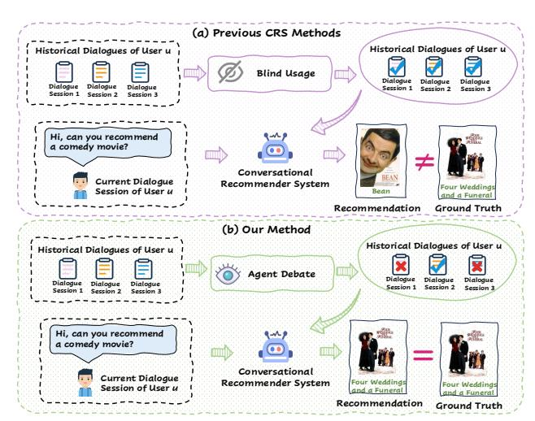
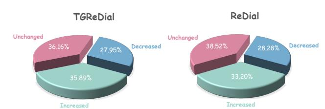
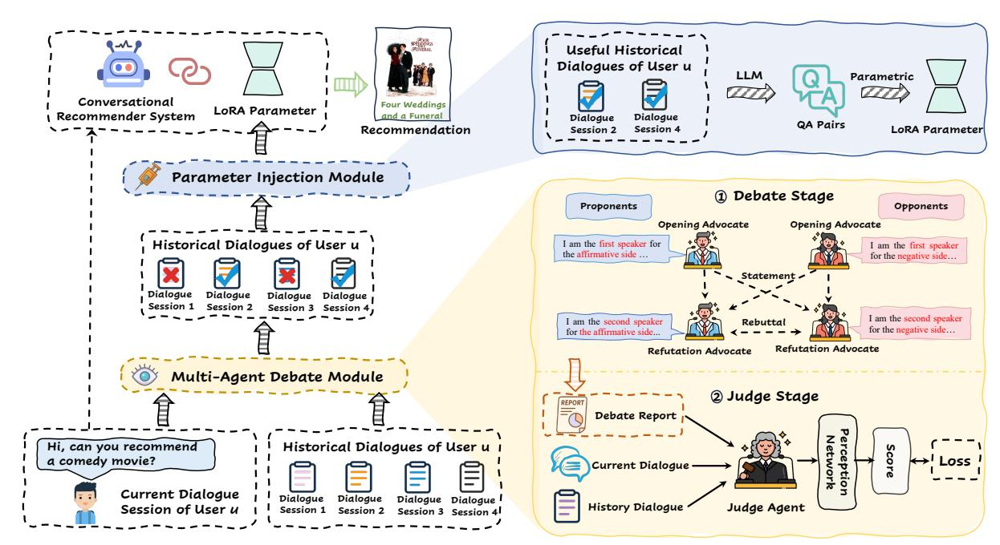
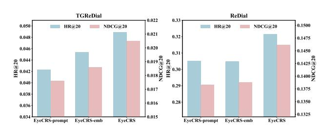
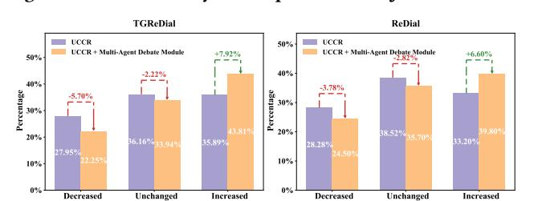
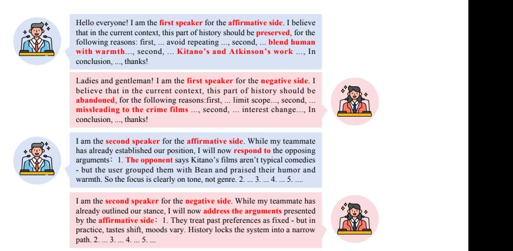

# Not All Information Brings Benefits: Personalization-Driven Agent Debate for Conversational Recommendation

[Pengfei Zhang](https://orcid.org/0009-0005-2665-5747)∗ 202421080437@std.uestc.edu.cn University of Electronic Science and Technology of China Chengdu, China

[Guojia An](https://orcid.org/0009-0002-9940-6627)∗ an\_guojia@163.com University of Electronic Science and Technology of China Chengdu, China

[Jin Huang](https://orcid.org/0000-0001-9273-9037) jh2642@cam.ac.uk University of Cambridge Cambridge, United Kingdom

[Yuhan Yang](https://orcid.org/0009-0002-4946-5813) y.yuhan2000@gmail.com University of Electronic Science and Technology of China Chengdu, China

[Yang Yang](https://orcid.org/0000-0002-5070-4511) yang.yang@uestc.edu.cn University of Electronic Science and Technology of China Chengdu, China

[Jie Zou](https://orcid.org/0000-0002-0181-778X)† jie.zou@uestc.edu.cn University of Electronic Science and Technology of China Chengdu, China

# Abstract

Conversational recommender systems (CRSs) aim to provide realtime recommendations through dynamic interactions between users and the system. Recent studies have revealed the value of personalized information derived from users' historical dialogue records in refining user preferences. However, existing methods often utilize the entire historical dialogue of a user indiscriminately, leading to the issue of cognitive negative transfer, wherein historical dialogue sessions impede rather than facilitate current decisionmaking. This ultimately degrades the performance of conversational recommendations.

To address this issue, inspired by the behavioral decision theory, this paper proposes a novel model, Personalization-Driven Agent Debate for Conversational Recommendation, named EyeCRS. Eye-CRS is comprised of two core components: (i) The Multi-Agent Debate Module employs supporting and opposing agents to simulate a human-like debate process, thereby enabling a rigorous evaluation of whether historical dialogue sessions may introduce cognitive negative transfer into the recommender. (ii) The Parametric Injection Module, subsequently, parameterizes the historical dialogues that are validated as positive and injects them into the intrinsic parameter space of the downstream recommender, thereby effectively enhancing the model's ability to internalize and utilize personalized knowledge. Experimental results on two real-world datasets show that EyeCRS effectively mitigates cognitive negative transfer and achieves superior performance in conversational recommendation.

# CCS Concepts

• Information systems → Recommender systems.

∗Both authors contributed equally to this research. †Corresponding author.

[This work is licensed under a Creative Commons Attribution-NonCommercial-](https://creativecommons.org/licenses/by-nc-nd/4.0)[NoDerivatives 4.0 International License.](https://creativecommons.org/licenses/by-nc-nd/4.0) WWW '26, Dubai, United Arab Emirates © 2026 Copyright held by the owner/author(s). ACM ISBN 979-8-4007-2307-0/2026/04 <https://doi.org/10.1145/3774904.3792152>

### Keywords

Conversational Recommendation, Multi-Agent Debate, Large Language Models

### ACM Reference Format:

Pengfei Zhang, Guojia An, Jin Huang, Yuhan Yang, Yang Yang, and Jie Zou. 2026. Not All Information Brings Benefits: Personalization-Driven Agent Debate for Conversational Recommendation. In Proceedings of the ACM Web Conference 2026 (WWW '26), April 13–17, 2026, Dubai, United Arab Emirates. ACM, New York, NY, USA, [10](#page-9-0) pages[. https://doi.org/10.1145/3774904.3792152](https://doi.org/10.1145/3774904.3792152)

### 1 Introduction

Conversational Recommender Systems (CRSs), recommending items to users through multi-round natural language dialogues, have garnered significant attention in recent years due to their capacity to facilitate dynamic interactions between users and systems [\[18,](#page-8-0) [23,](#page-8-1) [33,](#page-8-2) [55,](#page-9-1) [57\]](#page-9-2). This interaction enables real-time refinement of user needs and feedback, resulting in more personalized and accurate recommendations [\[20,](#page-8-3) [44,](#page-8-4) [54,](#page-9-3) [56,](#page-9-4) [58\]](#page-9-5).

Early CRSs [\[41,](#page-8-5) [52,](#page-9-6) [53\]](#page-9-7) primarily focused on modeling user preferences based solely on the current conversation. Despite the success of early exploration, they often ignore personalized information derived from users' historical dialogues, resulting in the inability to effectively capture and adapt to the evolving nature of user preferences. Fortunately, recent research [\[22,](#page-8-6) [39\]](#page-8-7) has acknowledged this limitation and introduced conversational recommendation methods that integrate personalized information by leveraging users' historical dialogues to refine and enhance recommendations during current interactions.

However, existing conversational recommendation methods generally adopt an 'irrigation strategy' for handling personalized information, in which all past dialogue sessions are indiscriminately incorporated into the recommendation process. This often leads to cognitive negative transfer, a concept from cognitive psychology that describes the erroneous application of prior knowledge or skills in new contexts, thereby impairing learning and performance [\[38\]](#page-8-8). In the context of CRS, cognitive negative transfer refers to the phenomenon where invalid or misleading information from historical dialogues interferes with the system's cognitive processes, thereby undermining its decision-making capabilities.

Figure 1: Previous CRS methods vs. our method.

As illustrated in Figure [1](#page-1-0) (a), if personalized information from historical dialogues is indiscriminately utilized, the system may not only fail to benefit from it but may also introduce the problem of cognitive negative transfer, thereby undermining recommendation performance. To further validate this problem, we conducted empirical experiments and the results are shown in Figure [2.](#page-1-1)[1](#page-1-2) Observe from Figure [2,](#page-1-1) blindly incorporating historical dialogue information yields marginal gains in a small subset of samples (nearly 1/3), but in most cases it results in no improvement or even negative effects. These findings provide strong evidence that cognitive negative transfer indeed exists in conversational recommendation tasks and significantly constrains the improvement of recommendation performance.

To address this issue, we take inspiration from behavioral decision theory, which suggests that humans must assess whether past knowledge remains applicable to the current context [\[28\]](#page-8-9). We argue that CRSs should also possess situational perception and information discrimination to perform better recommendations. As shown in Figure [1](#page-1-0) (b) of the illustration of our method, if the system can distinguish between beneficial and detrimental personalized information from historical dialogues, it can produce recommendations that better align with the user's immediate intent.

Although we highlight the potential of such "human-like" situational awareness in conversational recommendation, there are still two core challenges to address: (i) How to introduce situational awareness to distinguish useful and harmful personalized information in historical sessions? (ii) How to strategically leverage useful historical dialogues so that effective signals benefit current recommendations? To tackle the aforementioned challenges, we propose a novel model of Personalization-Driven Agent Debate for Conversational Recommendation (EyeCRS). The model is equipped with two novel modules, the Multi-Agent Debate Module and the Parametric Injection Module. In the Multi-Agent Debate Module, we draw inspiration from the notion that "the truth becomes clearer

Figure 2: Distribution of cognitive negative transfer phenomena on TGReDial and ReDial datasets.

through debate" [\[24\]](#page-8-10). Specifically, given a user's historical dialogue sessions, the model constructs supporter and opponent agents from opposing perspectives to articulate and challenge the usefulness of the historical information. Subsequently, a judge agent is introduced to synthesize the debate and deliver a more reliable and objective conclusion. In the Parametric Injection Module, we first parameterize the historical dialogues that are validated as positive through the debate stage. These parameterized representations are then injected into the large language model (LLM)-based recommender, transforming personalized information into internalized knowledge and enhancing the model's ability to perceive user interests.

- We summarize the contributions of this work as follows:
- We highlight the issue of cognitive negative transfer and emphasize its importance in conversational recommendation.
- We propose EyeCRS, a novel CRS that integrates the multi-agent debate and the parametric injection to autonomously identify and leverage personalized historical dialogues, thereby alleviating the problem of knowledge negative transfer and improving CRSs.
- Experimental results on two benchmark datasets demonstrate that our proposed model effectively mitigates the issue of cognitive negative transfer and outperforms state-of-the-art CRS methods.

To the best of our knowledge, this paper is the first effort to highlight the issue of cognitive negative transfer in CRS and provide an effective solution to mitigate it.

### 2 Related Work

# 2.1 Conversational Recommender Systems

We first review the key literature on CRSs, categorizing them into two types based on whether user historical dialogue sessions are incorporated: general CRSs [\[6,](#page-8-11) [17,](#page-8-12) [25,](#page-8-13) [27,](#page-8-14) [42\]](#page-8-15) and CRSs with personalized historical dialogues [\[22,](#page-8-6) [39\]](#page-8-7). General CRSs. Early CRSs [\[7,](#page-8-16) [52,](#page-9-6) [59\]](#page-9-8) primarily relied on knowledge graph-based methods to capture semantic relations, enabling the system to generate recommendations. Subsequently, models such as UniCRS [\[34\]](#page-8-17), DCRS [\[8\]](#page-8-18), and DisenCRS [\[3\]](#page-8-19), incorporate the DialoGPT [\[49\]](#page-9-9) language model to better capture conversational context and user intent. Recently, the capabilities of LLMs have gained widespread recognition [\[19,](#page-8-20) [26,](#page-8-21) [40,](#page-8-22) [46\]](#page-9-10), and their application in CRSs has gradually become a research hotspot. Specifically, He et al. [\[13\]](#page-8-23) provide a comprehensive investigation into the capabilities of LLMs for zeroshot conversational recommendation. Yang and Chen [\[43\]](#page-8-24) propose ReFICR, a retrieval-enhanced CRS that jointly optimizes retrieval and generation within LLMs. Wang et al. [\[33\]](#page-8-2) propose an LLMdriven interactive evaluation framework that employs simulated

1Using the UCCR [\[22\]](#page-8-6) model as the backbone, we classify each sample based on the change in similarity to the ground truth after incorporating personalized historical dialogues. Samples with a similarity gain greater than 0.1 are labeled increased, those with a decrease greater than 0.1 are labeled decreased, and the rest are labeled unchanged.

Figure 3: Overview of EyeCRS and its two components: (i) Multi-Agent Debate Module, which filters out unhelpful historical dialogue sessions to mitigate cognitive negative transfer; and (ii) Parametric Injection Module, which injects beneficial historical knowledge into the intrinsic parameter space of the LLM for personalized reasoning.

users to assess dialogue quality. Together, these studies facilitate the rapid evolution of LLM-based CRSs.

CRSs with Personalized Historical Dialogues. CRSs with personalized historical dialogues aim to provide personalized recommendations tailored to each individual by utilizing users' historical dialogue sessions. Research in this area is still in its early stages, with limited studies available. Li et al. [\[22\]](#page-8-6) propose the first work to emphasize the importance of user historical dialogues as a crucial source of information for CRSs. Subsequently, Xi et al. [\[39\]](#page-8-7) introduce a memory-augmented CRS framework, powered by LLMs, to manage users' historical dialogue sessions. However, they suffer from the problem of cognitive negative transfer. In contrast, our proposed EyeCRS model focuses on when to use historical dialogues and which historical dialogues to leverage for recommendations, thus mitigating cognitive negative transfer and integrating personalized historical dialogues.

### 2.2 LLM-Based Multi-Agent Debate

The concept of multi-agent debate originates from Irving et al. [\[16\]](#page-8-25), which introduces adversarial argumentation among multiple agents, with a judge selecting the more persuasive side to improve interpretability and correctness. With the rapid advancement of LLMs, Du et al. [\[10\]](#page-8-26) demonstrate that multi-agent debate can significantly enhance factual accuracy and complex reasoning in LLMs. Building on this idea, Chan et al. [\[5\]](#page-8-27) explore the ChatEval framework, showing that communication strategies and role diversity among agents influence evaluation accuracy. Furthermore, Estornell and Liu [\[12\]](#page-8-28) analyze the dynamics of multi-agent debate, identifying issues such as 'tyranny of the majority' and 'shared misconceptions', and propose debate pruning to improve stability and interpretability. Different from these studies, we are the first, to the best of our

knowledge, to introduce multi-agent debate into the field of CRSs. By leveraging the debate mechanism to distinguish between beneficial and detrimental historical dialogues, our approach effectively alleviates cognitive negative transfer and enhances CRS robustness.

### 3 Method

Problem Definition. Let U and I denote the user set and item set in the system, respectively. For a user �� ∈ U, the current dialogue session �� represents the current dialogue, in which the system provides recommendations. All complete dialogues associated with user �� prior to dialogue �� are denoted as historical dialogue sessions, represented by H�� = {ℎ�� } ���� ��=1 , where ���� denotes the number of historical dialogues associated with user ��. [2](#page-2-0)

Based on the above definitions, CRSs aim to (i) recommend a subset Irec ⊆ I that best matches the user's intent expressed in the current dialogue session �� and (ii) to generate relevant and coherent responses regarding these recommended items.

### 3.1 Overview of EyeCRS

Existing models often treat all historical dialogues as equally useful, which may cause cognitive negative transfer—where irrelevant or outdated preferences distort the understanding of the current intent. To address this issue, we propose a refined CRS framework, EyeCRS, that selectively extracts a beneficial subset Huse �� ⊆ H�� instead of leveraging all past sessions indiscriminately. An overview of our proposed EyeCRS model is presented in Figure [3.](#page-2-1) Specifically, we introduce two sequential modules to achieve our goal:

Following previous work [\[22,](#page-8-6) [39\]](#page-8-7), we distinguish historical dialogue sessions from the commonly used term dialogue history in most CRSs [\[7,](#page-8-16) [8,](#page-8-18) [34,](#page-8-17) [52\]](#page-9-6). The latter refers to preceding utterances within the same session (turn-level), whereas the former denotes complete past sessions occurring before the current one.

Multi-Agent Debate Module assesses the relevance of each historical dialogue to the current conversation and preserves the helpful historical dialogue sessions through a structured multi-agent debate (see Section [3.2\)](#page-3-0).

Parametric Injection Module transforms beneficial historical dialogue sessions into the intrinsic parameter space, and aligns them with the downstream LLM to perform recommendations (see Section [3.3\)](#page-4-0).

For recommendation, the current dialogue session is fed into an LLM-based recommender that incorporates user-specific parameters from the Parametric Injection Module, enabling personalized item prediction based on the injected user preferences. For response generation, the system invokes an external LLM conditioned on the current dialogue session, the recommended items, and the selected historical dialogues identified by the Multi-Agent Debate Module to generate contextually appropriate and personalized responses.

### 3.2 Multi-Agent Debate Module

Building on the overall framework, the Multi-Agent Debate Module aims to identify which historical dialogue sessions are truly relevant to the current context. It achieves this through structured debates among multiple LLM-based agents, whose contrasting views provide evidence for evaluating the usefulness of each historical session. The following describes how the debate process is organized and how relevance is quantified.

3.2.1 Debate Organization. For each historical session ℎ�� from the user's dialogue historical sessions H��, a debate is organized together with the current session �� to assess whether ℎ�� provides beneficial cognitive cues or causes cognitive interference. There are two opposing teams:

- Proponent(Stancepro): argues thatℎ�� offers valuable prior knowledge that helps interpret the user's current intent.
- Opponent (Stanceopp): contends that ℎ�� may induce cognitive negative transfer.

These two teams engage in a two-stage debate—Statement and Rebuttal—on the above motion,[3](#page-3-1) as illustrated below.

In the Statement stage, each agent independently generates an initial argument based on the current session ��, the historical session ℎ�� , and its assigned stance. Let �� ∈ {pro, opp} index the two agents. The statement text from the ��-th agent is defined as:

�� (1) = ��stmt(��, ℎ�� , Stance��), (1)

where ��stmt(·) denotes a text-generation function implemented via an LLM call with a structured prompt.[4](#page-3-2)

In the Rebuttal stage, each agent reviews the opponent's statement and generates counterarguments accordingly. The rebuttal from the ��-th agent is defined as:

�� (2) �� = ��reb (��, ℎ�� , ��(1) , Stance��), (2)

where ��reb (·) denotes an LLM-based text generation function for rebuttal,[5](#page-3-3) and �� (1) represents the collection of statements produced in the previous stage.

The complete debate record for a historical session ℎ�� is:

D�� = {�� (1) �� , ��(2) �� }, (3)

which captures the full exchange between the two agents. These debate traces D�� serve as input for relevance qualification described in the next subsection.

3.2.2 Relevance Qualification. To quantitatively evaluate the outcomes of the debate, we introduce a lightweight judge model that scores the relevance of each historical dialogue session with respect to the current context. The judge is built upon a fixed LLM encoder, Qwen3-Embedding—a variant of the Qwen3 model fine-tuned for dense representation learning [\[31,](#page-8-31) [35,](#page-8-32) [48\]](#page-9-13).

Given a current dialogue session ��, a historical dialogue ℎ�� , and its debate log D�� , we construct a natural language prompt P judge by concatenating them using a predefined textual template. The prompt P judge is then fed into the encoder, and we obtain the dense representation z�� ∈ R �� from the hidden state corresponding to the end-of-sequence token:

z�� = ��������������judge (Pjudge ) -[EOS] . (4)

To transform this representation into a scalar relevance estimate, z�� is passed through a multilayer perception (MLP) scoring head to compute a relevance score ���� :

���� = �� w ⊤ 2 ReLU (W1z�� + b1) + ��2 . (5)

The score ���� quantifies the cognitive influence of each historical session ℎ�� on the current dialogue ��, reflecting how beneficial or interfering the session is to the current recommendation context. For each user ��, the judge is applied to all historical sessions in H��, and those with scores higher than a threshold �� are retained to form the cognitive-guided subset Huse .

As explicit annotations of cognitive influence are unavailable, we train the judge model using weak supervision signals [\[36\]](#page-8-33) derived from recommendation outcomes. For each current dialogue �� and its historical candidates H�� = {ℎ�� } ���� ��=1 , we measure how incorporating each ℎ�� affects the model's similarity between the dialogue representation and the ground-truth item embedding v��, where v�� is encoded by the recommender model's item encoder. Let sim(·, ·) denote the cosine similarity, and define the relative gain of ℎ�� as:

Δ�� = sim Encoderrec (��, ℎ��), v�� − sim Encoderrec (��), v�� , (6)

where Encoderrec (·) denotes the session encoder built upon a pretrained LLM with frozen base parameters ��. Sessions with Δ�� &gt; 0 (i.e., improving item similarity) are treated as positive examples ℎ + , while those with Δ�� &lt; 0 are treated as negative examples ℎ − . These pseudo-labels provide weak supervision for optimizing the judge.

Given the corresponding debate-informed prompts P judge + and P judge − , the judge produces scores �� + and �� − according to Eq. (5). The model is then optimized with a pairwise contrastive loss that encourages higher scores for cognitively helpful histories:

Ljudge = − log ��(�� + − �� − ). (7)

During training, the encoder parameters remain frozen, and only the scoring head is updated. This enables the judge to learn to identify cognitively beneficial sessions from weak supervision without requiring manual labels.

3 Inspired by the Lincoln–Douglas debate format and recent advances in multi-agent prompting [\[9,](#page-8-29) [11,](#page-8-30) [24\]](#page-8-10).

4The detailed prompt used in this stage is provided in Appendix [A.1.](#page-9-11)

5The detailed prompt used in this stage is provided in Appendix [A.2.](#page-9-12)

Table 1: Performance comparison of different models on the recommendation task. The best results are boldface, while the second-best results are underlined. The symbol \* denotes statistically significant improvements over the best baseline at �� &lt; 0.05.

| Model    | @5     | HR @10   | @20      | @5       | TGReDial MRR @10 | @20      | @5       | NDCG @10 | @20      | @5       | HR @10   | @20      | @5       | ReDial MRR @10 | @20      | @5       | NDCG @10 | @20        |
|----------|--------|----------|----------|----------|------------------|----------|----------|----------|----------|----------|----------|----------|----------|----------------|----------|----------|----------|------------|
| ReDial   | 0.0030 | 0.0055   | 0.0102   | 0.0015   | 0.0018           | 0.0021   | 0.0018   | 0.0027   | 0.0038   | 0.0293   | 0.0413   | 0.0882   | 0.0174   | 0.0190         | 0.0223   | 0.0203   | 0.0242   | 0.0361     |
| KBRD     | 0.0050 | 0.0112   | 0.0174   | 0.0026   | 0.0035           | 0.0040   | 0.0032   | 0.0053   | 0.0069   | 0.0824   | 0.1395   | 0.2185   | 0.0337   | 0.0418         | 0.0470   | 0.0457   | 0.0646   | 0.0842     |
| KGSF     | 0.0112 | 0.0149   | 0.0249   | 0.0039   | 0.0044           | 0.0051   | 0.0057   | 0.0068   | 0.0094   | 0.0908   | 0.1378   | 0.2319   | 0.0385   | 0.0445         | 0.0508   | 0.0514   | 0.0663   | 0.0898     |
| TGReDial | 0.0075 | 0.0174   | 0.0236   | 0.0055   | 0.0068           | 0.0072   | 0.0059   | 0.0091   | 0.0107   | 0.0874   | 0.1395   | 0.2336   | 0.0433   | 0.0502         | 0.0567   | 0.0543   | 0.0710   | 0.0948     |
| UCCR     | 0.0087 | 0.0174   | 0.0286   | 0.0071   | 0.0082           | 0.0090   | 0.0075   | 0.0103   | 0.0131   | 0.1059   | 0.1782   | 0.2672   | 0.0443   | 0.0538         | 0.0596   | 0.0594   | 0.0826   | 0.1047     |
| UniCRS   | 0.0050 | 0.0124   | 0.0236   | 0.0024   | 0.0035           | 0.0042   | 0.0031   | 0.0055   | 0.0083   | 0.1005   | 0.1605   | 0.2480   | 0.0392   | 0.0467         | 0.0528   | 0.0542   | 0.0731   | 0.0952     |
| ZSCRS    | 0.0025 | 0.0087   | 0.0100   | 0.0007   | 0.0016           | 0.0017   | 0.0012   | 0.0032   | 0.0035   | 0.1261   | 0.1882   | 0.2353   | 0.0511   | 0.0594         | 0.0629   | 0.0695   | 0.0896   | 0.1018     |
| MemoCRS  | 0.0162 | 0.0261   | 0.0323   | 0.0095   | 0.0108           | 0.0112   | 0.0111   | 0.0143   | 0.0158   | 0.1361   | 0.2151   | 0.2857   | 0.0718   | 0.0821         | 0.0871   | 0.0875   | 0.1128   | 0.1308     |
| EyeCRS   | 0.0191 | * 0.0282 | * 0.0489 | * 0.0097 | * 0.0111         | * 0.0123 | * 0.0120 | * 0.0151 | * 0.0205 | * 0.1510 | * 0.2273 | * 0.3215 | * 0.0806 | * 0.0906       | * 0.0970 | * 0.0980 | * 0.1225 | * 0.1461 * |

4.1.3 Baselines. We apply the following representative baselines for comparison: (1) ReDial [\[21\]](#page-8-36) proposes a dialogue module based on HRED [\[29\]](#page-8-41) and a recommendation module based on an autoencoder. (2) KBRD [\[7\]](#page-8-16) integrates knowledge graphs into CRSs, linking recommendation and dialogue systems through knowledge propagation. (3) KGSF [\[52\]](#page-9-6) combines word-oriented and entityoriented knowledge graphs to improve data representation in CRSs. (4) TGReDial [\[53\]](#page-9-7) is proposed with the TGReDial dataset and incorporates a topic prediction task [\[60\]](#page-9-15) to enhance performance. (5) UCCR [\[22\]](#page-8-6) jointly models current dialogue sessions, historical dialogue sessions, and similar users in a user-centric manner. (6) UniCRS [\[34\]](#page-8-17) pioneers the unification of recommendation and dialogue tasks within the prompt learning paradigm. (7) Zero-Shot CRS [\[13\]](#page-8-23), abbreviated as ZSCRS, is the first to employ LLMs as zero-shot conversational recommenders. (8) MemoCRS [\[39\]](#page-8-7) introduces a memory-augmented CRS framework, powered by LLMs, to manage users' historical dialogues.

4.1.4 Implementation Details. We follow the experimental setup of MemoCRS [\[39\]](#page-8-7). Apart from LLM-based methods, all other baselines are implemented using the open-source toolkit CRSLab [\[51\]](#page-9-16). Methods based on closed-source LLMs, including Zero-shot LLM [\[13\]](#page-8-23) and MemoCRS [\[39\]](#page-8-7), utilize GPT-4 [\[1\]](#page-8-42) as the backbone for recommendation generation. Our model also adopts GPT-4 for debate and QA generation, while using open-source LLMs for other components: Qwen3-Embedding-4B for the judger and Qwen3-Embedding-8B for the recommender. In data processing, we follow Xi et al. [\[39\]](#page-8-7) and re-split the datasets into training, validation, and test sets in chronological order. A random subset of users is selected, with their most recent conversations used for validation and test sets and the remaining ones for training. To avoid shortcuts caused by repeated entries [\[13\]](#page-8-23), we filter out dialogues where recommended items have appeared earlier.

### 4.2 Overall Performance

To validate the effectiveness of our proposed EyeCRS, we conduct comprehensive comparisons with several competitive state-of-theart baselines in CRSs, evaluating performance on both recommendation tasks and response generation tasks.

Evaluation on Recommendation Task. The comparison of recommendation performance between our model and the baselines, is shown in Table [1.](#page-5-0) We have the following observations:

- (1) Our proposed EyeCRS significantly outperforms existing baselines, fully demonstrating its superior recommendation performance. Specifically, on the TGReDial and ReDial datasets,

EyeCRS achieves substantial improvements in the average values of HR, MRR, and NDCG at ranking list lengths of @5, @10, and @20. Together, these results consistently validate the effectiveness and superiority of the EyeCRS model in CRSs.

(2) Methods that incorporate personalized information (e.g., UCCR, MemoCRS) generally outperform general conventional methods. This observation underscores the pivotal value of personalized information contained in users' historical dialogues for modeling user interests and highlights its crucial role in enhancing the effectiveness of CRSs.

(3) EyeCRS significantly outperforms existing methods that leverage personalized information from historical dialogues, such as UCCR and MemoCRS, across multiple key evaluation metrics. This highlights the superiority of EyeCRS in equipping CRSs with self-perception and discriminative capabilities, in contrast to traditional methods that blindly use historical dialogues. By employing a multi-agent debate mechanism to selectively filter historical information and integrating it through parametric injection, EyeCRS effectively mitigates the adverse effects of cognitive negative transfer, thereby achieving substantial im-

provements in recommendation performance.

Evaluation on Response Generation Task. To evaluate the performance of our proposed method in response generation, we follow the evaluation settings of Zhang et al. [\[47\]](#page-9-17) and Xi et al. [\[39\]](#page-8-7), conducting both automatic evaluation using GPT-4 and human annotation from two aspects: Fluency and Informativeness.

As shown in Table [2,](#page-6-0) the traditional conversational recommendation models such as KBRD, KGSF, and UniCRS perform significantly worse than LLM-based methods such as ZSCRS and MemoCRS on both Fluency and Informativeness. This result indicates that the prior advantages of LLMs in language generation and knowledge integration can be directly translated into more natural, coherent, and informative responses. Secondly, models that incorporate personalized historical dialogues (e.g., UCCR and MemoCRS) achieve notably higher Informativeness than those without historical context. This demonstrates that users' past conversations contain contextual cues that are highly relevant to their current intent, providing specific and semantically rich information that enhances the relevance and interpretability of generated responses. Finally, EyeCRS achieves the best performance on both Fluency and Informativeness, under both human annotation and GPT-4-based automatic evaluation. Unlike models that indiscriminately utilize all historical dialogues, EyeCRS distinguishes and retains personalized information that is strongly aligned with the current context while filtering

Table 2: Subjective evaluation of LLM-based scorer and human annotators for response generation. \* denotes statistically significant improvements over best baseline at �� &lt; 0.05.

| Model scorer     | Fluency | TGReDial Informativeness | Fluency | ReDial Informativeness |
|------------------|---------|--------------------------|---------|------------------------|
| KBRD             | 1.84    | 1.80                     | 1.78    | 1.75                   |
| KGSF             | 2.05    | 2.00                     | 1.98    | 1.95                   |
| UCCR LLM-based   | 2.30    | 2.38                     | 2.30    | 2.35                   |
| UniCRS           | 2.28    | 2.25                     | 2.30    | 2.19                   |
| ZSCRS            | 2.60    | 2.43                     | 2.55    | 2.40                   |
| MemoCRS          | 2.70    | 2.75                     | 2.68    | 2.72                   |
| EyeCRS annotator | 2.80 *  | 2.85 *                   | 2.78 *  | 2.82 *                 |
| KBRD             | 1.94    | 1.89                     | 1.87    | 1.81                   |
| KGSF             | 2.02    | 1.98                     | 1.99    | 1.95                   |
| UCCR             | 2.35    | 2.56                     | 2.28    | 2.55                   |
| UniCRS Human     | 2.22    | 2.18                     | 2.19    | 2.09                   |
| ZSCRS            | 2.42    | 2.23                     | 2.39    | 2.18                   |
| MemoCRS          | 2.56    | 2.62                     | 2.49    | 2.61                   |
| EyeCRS           | 2.71 *  | 2.82 *                   | 2.67 *  | 2.84 *                 |

Table 3: Ablation study on the multi-agent debate module.

|        | Method | HR@10   | HR@20   | TGReDial NDCG@10 | NDCG@20 | HR@10   | HR@20   | ReDial NDCG@10 | NDCG@20 |
|--------|--------|---------|---------|------------------|---------|---------|---------|----------------|---------|
| w/o    | debate | 0.0253  | 0.0473  | 0.0134           | 0.0189  | 0.2133  | 0.3036  | 0.1158         | 0.1387  |
| w/o    | judge  | 0.0268  | 0.0471  | 0.0144           | 0.0199  | 0.2167  | 0.3028  | 0.1162         | 0.1381  |
| w/o    | select | 0.0245  | 0.0456  | 0.0129           | 0.0182  | 0.2023  | 0.2880  | 0.1089         | 0.1356  |
| EyeCRS |        | 0.0282* | 0.0489* | 0.0151*          | 0.0205* | 0.2273* | 0.3215* | 0.1225*        | 0.1461* |

out noisy or irrelevant content. This mechanism enables it to focus more precisely on valuable personalized information, resulting in responses with more reasonable reasoning, smoother expression, and richer informational content.

### 4.3 Ablation Study

Impact of Multi-Agent Debate Module. To evaluate the effectiveness of the multi-agent debate module, we design the following three variants: 'w/o debate', which removes the multi-agent debate process and directly relies on the judge role for decision-making. 'w/o judge', which replaces the fine-tuned judge role with GPT-4 as the decision maker. 'w/o select', which removes both the debate and judge mechanisms, and directly utilizes the user's entire personalized information from the historical dialogue.

From the results in Table [3,](#page-6-1) we observe the following: (1) The 'w/o debate' variant exhibits a clear performance decline compared with EyeCRS, confirming the effectiveness of the proposed debate mechanism. By engaging supportive and opposing agents in open statements and rebuttals, the model simulates a human-like debate process that facilitates more accurate identification of valuable historical dialogues. (2) The 'w/o judge' variant also performs worse than EyeCRS, indicating that our fine-tuned judge, when provided with the same debate reports, exhibits superior decision-making capability compared to a general LLM such as GPT-4. This result suggests that the fine-tuned LLM is better suited to serve as a domain-specific judge, as it more effectively captures task-specific relevance criteria. (3) The 'w/o select' variant achieves the lowest performance across both datasets, indicating that indiscriminately utilizing all historical dialogue sessions introduces cognitive negative transfer. This interference disrupts the model's cognitive learning and decision-making processes, thereby preventing the potential of historical dialogues from being fully leveraged.

Figure 4: Ablation study on the parametric injection module.

Figure 5: Quantitative analysis of the multi-agent debate module in mitigating cognitive negative transfer.

Overall, both the debate and judge mechanisms in the multiagent debate module have been proven effective, facilitating the model in accurately discerning historical dialogue sessions based on the current conversational context.

Impact of Parametric Injection Module. To evaluate the effectiveness of the parametric injection module, we conduct experiments with two variants: (i) 'EyeCRS-prompt', which incorporates the useful historical dialogues selected by the multi-agent debate module via prompt-based injection to directly guide the LLM recommender; (ii) 'EyeCRS-emb', which encodes these useful historical dialogues into embeddings that are aggregated with the current conversation embeddings before being fed into the recommender.

As shown in Figure [4,](#page-6-2) both variants underperform compared with EyeCRS. Firstly, 'EyeCRS-prompt' suffers from longer input sequences that hinder the model's ability to process personalized information effectively. More importantly, as previously noted Su et al. [\[30\]](#page-8-43), Yu and Ananiadou [\[45\]](#page-9-18), LLMs process external contextual information in a fundamentally different way from their internalized parameter knowledge. This structural difference means that they are less capable of integrating contextual knowledge than parameter information. Consequently, prompt-based injection leads to limited and unstable utilization of historical conversation information. Furthermore, 'EyeCRS-emb' also performs worse than our EyeCRS. This variant adopts a static form of information injection, in which the useful historical dialogues are encoded into fixed embeddings and fused with the representations of the current conversation. Such a design limits the model's capacity for dynamic context reasoning and reduces its flexibility in attending to relevant historical cues across different conversational scenarios.

In contrast, the parametric injection module in EyeCRS internalizes the debate-selected historical information directly into the model's parameter space, avoiding input expansion and static fusion. This design integrates personalized knowledge as part of the model's intrinsic decision process, enabling more stable and adaptive use of user-specific information.

Table 4: A sampled case from TGReDial illustrating how historical dialogue impacts recommendation. Green boxes show effective transfer of relevant context, whereas yellow boxes exemplify negative transfer, where misuse of historical dialogue leads to incorrect recommendations.

|          |            | Recommender: |               | Hello there. |            |           |               |              |              |               |             |
|----------|------------|--------------|---------------|--------------|------------|-----------|---------------|--------------|--------------|---------------|-------------|
|          | User:      | recommend    |               | me a         | comedy     |           |               |              |              |               |             |
|          | Session    | 1:           | Recommender   |              |            | suggested | Joey          | Wong’s       | Hong         | Kong          | films       |
|          | Painted    | Skin:        | The Yin       | Yang         | Master     | and       | A             | Chinese      | Ghost        | Story,        | also men   |
|          | tioning    | Tsui         | Hark and      | Wicked       |            | City.     | Seeker        | found        | these        | films         | impressive, |
|          | especially |              | Painted       | Skin.        |            |           |               |              |              |               |             |
|          | Session    | 2:           | Recommender   |              | mentioned  |           | several       | of           | Takeshi      | Kitano’s      | come       |
| dies     | —          | Boiling      | Point,        | Getting      | Any?,      | and       | Violent       | Cop          | —            | along         | with Bean:  |
| The      |            | Ultimate     | Disaster      | Movie.       |            | Seeker    | said they’d   | seen         | them         | all           | and found   |
| both     |            | Kitano’s     | and           | Bean’s       | blend      | of        | humor and     | warmth       |              | impressive.   |             |
|          | Session    | 3:           | Recommender   |              |            | suggested | several       |              | heartwarming |               | Japanese    |
| films    | —          | The          | Recipe        | for Life     | After      | 49        | Days,         | Our          | Family,      | and A         | Farewell    |
| to       | Jinu.      | Seeker       | said          | they’d       | watch      | them      | all,          | appreciating |              | their         | warmth,     |
|          | sincerity, | and          | gentle        | reflections  |            | on life   | and           | loss.        |              |               |             |
| Response | Standard   |              | response:     | Let          | me         | recommend | a             | hilarious    |              | comedy        | — Rat       |
|          | Without    |              | historical    |              | dialogue   |           | sessions: I   | highly       |              | recommend     | The         |
| Wolf     | of         | Wall         | Street        | — a          | wild,      |           | high-energy   | black        | comedy       |               | that dives  |
| deep     | into       | the          | outrageous    |              | excesses   | of        | Wall          | Street. It’s | both         | hilarious     | and         |
|          | scathing,  | with         |               | Leonardo     | DiCaprio   |           | delivering    | one          | of his       | most          | electri    |
| fying    |            |              | performances. | The          | film’s     | sharp     | dialogue,     |              | bold         | storytelling, | and         |
|          | relentless |              | momentum      | make         | it an      |           | unforgettable | and          | brutally     |               | funny look  |
| at       | ambition,  |              | greed,        | and moral    |            | chaos.    |               |              |              |               |             |
|          | With all   |              | historical    | dialogue     |            | sessions: | If            | you          | enjoy        | fantasy       | comedy,     |
| I        | highly     |              | recommend     | watching     |            | A         | Chinese       | Odyssey      |              | Part          | One: Pan   |
|          | dora’s     | Box          | It’s a        | hilarious    | yet        | touching  | tale          | that         | mixes        | Stephen       | Chow’s      |
|          | trademark  |              | nonsense      | humor        | with       | time      | travel,       | romance,     |              | and           | destiny — a |
|          | perfect    | pick         | if you        | enjoy        | Hong       | Kong      | films.        |              |              |               |             |
|          | With       | selected     |               | historical   |            | dialogue  | sessions:     |              | You’ve       | got           | to check    |
| out      | Rat        | Race         | — a           | wild,        | fast-paced |           | ensemble      |              | comedy       | where         | a group     |
| of       | strangers  |              | races         | across the   |            | country   | for a         | hidden       | fortune.     | The           | cast is     |
|          | stacked,   | with         | Rowan         |              | Atkinson   | (Mr.      | Bean          | himself!)    | and          | other         | heavy       |
|          | hitters    | delivering   |               | nonstop      | absurdity  |           | and           | slapstick    | chaos.       | What          | makes       |
| it       | a blast    | is           | how it        | captures     | that       | same      | darkly        |              | ironic,      | offbeat       | energy      |
| you      | loved      | in           | Kitano’s      | Boiling      |            | Point.    | With          | Atkinson     | at the       | center        | of the      |
|          | madness,   | it’s         | gleeful       | mayhem       |            | from      | start to      | finish       | — an         | anarchic      | ride        |
| that     |            | perfectly    | fits          | your taste.  |            |           |               |              |              |               |             |

### 4.4 Further Analysis

We further validate the effectiveness of EyeCRS in mitigating the negative transfer issue via a quantification analysis and a case study.

Quantification Analysis. To verify the existence of the cognitive negative transfer problem and to evaluate whether our multi-agent debate module can mitigate it, we conduct a quantitative comparative analysis using two model variants: the original UCCR [\[22\]](#page-8-6) model, which incorporates all historical dialogue sessions, and the extended UCCR with our proposed multi-agent debate module.

As shown in Figure [5,](#page-6-3)[1](#page-0-0) results on the TGReDial dataset reveal that under the original UCCR model, 27.95% of samples are labeled as decreased and 36.16% as unchanged, indicating that incorporating all historical dialogues often introduces irrelevant information and causes cognitive negative transfer. A similar pattern is observed on the ReDial dataset. After integrating the proposed multi-agent debate module into UCCR, the proportion of decreased samples drops by 5.7%, unchanged samples by 2.22%, and increased samples rise by 7.92%. Consistent improvements on both datasets demonstrate that the module effectively filters out distracting dialogue sessions, mitigates negative transfer, and enhances overall accuracy.

Figure 6: A real debate case study, associated with the current dialogue and the historical dialogue session 2 in Table [4,](#page-7-0) provides insight into avoiding cognitive negative transfer.

Case Study. To illustrate the impact of historical dialogues on recommendation outcomes, we analyze a representative case from TGReDial (Table [4\)](#page-7-0). The results show that ignoring historical dialogues leads to generic, mismatched recommendations that fail to capture the seeker's humor preference, while indiscriminately using all past sessions introduces irrelevant cues and causes negative transfer, deviating from the seeker's intent. In contrast, selectively retaining only semantically relevant sessions captures fine-grained preferences and yields recommendations better aligned with the seeker's taste. Figure [6](#page-7-1) further illustrates how the model distinguishes helpful from harmful historical cues through a debate process, in which explicit reasoning about contextual relevance allows the model to retain the most informative session and avoid negative transfer, leading to more accurate and context-aware recommendations.

### 5 Conclusion

Inspired by cognitive science, in this work, we identify the issue of cognitive negative transfer in conversational recommendations and propose a novel model, named EyeCRS, to address it. EyeCRS consists of two key modules: a Multi-Agent Debate Module that employs debate among agents to identify and retain beneficial personalized information from historical dialogues and a Parametric Injection Module that parameterizes useful historical dialogue and injects it into an LLM-based recommender, improving its understanding of user interests and recommendation ability. Experiments on two public datasets show that EyeCRS effectively mitigates cognitive negative transfer and achieves superior performance over existing methods. In this paper, we demonstrate the effectiveness of response generation through experiments. However, our work mainly focuses on the recommendation module. Future work will refine the dialogue module to produce more natural, context-aware responses.

# Acknowledgments

This research was supported by the National Natural Science Foundation of China under grants 62220106008 and 62402093, the Sichuan Science and Technology Program (2025ZNSFSC0479), and the Sichuan Science and Technology Program under Grant 2024NSFTD0034.

- References [1] Josh Achiam, Steven Adler, Sandhini Agarwal, Lama Ahmad, Ilge Akkaya, Florencia Leoni Aleman, Diogo Almeida, Janko Altenschmidt, Sam Altman, Shyamal Anadkat, et al. 2023. Gpt-4 technical report. arXiv preprint arXiv:2303.08774 (2023). [2] Guojia An, Jing Sun, Yuhan Yang, and Fuming Sun. 2024. Enhancing collaborative information with contrastive learning for session-based recommendation. Information Processing & Management 61, 4 (2024), 103738. [3] Guojia An, Jie Zou, Jiwei Wei, Chaoning Zhang, Fuming Sun, and Yang Yang. 2025. Beyond whole dialogue modeling: Contextual disentanglement for conversational recommendation. In Proceedings of the 48th International ACM SIGIR Conference on Research and Development in Information Retrieval. 31–41. [4] Xiao Ao, Shuxi Han, Yeming Li, Heli Ma, Pengfei Zhang, and Jie Zou. 2025. Retrieval Augmented Multi-agent Recommender. In Companion Proceedings of the ACM on Web Conference 2025. 2968–2972. [5] Chi-Min Chan, Weize Chen, Yusheng Su, Jianxuan Yu, Wei Xue, Shanghang Zhang, Jie Fu, and Zhiyuan Liu. 2023. Chateval: Towards better llm-based evaluators through multi-agent debate. arXiv preprint arXiv:2308.07201 (2023). [6] Luyu Chen, Quanyu Dai, Zeyu Zhang, Xueyang Feng, Mingyu Zhang, Pengcheng Tang, Xu Chen, Yue Zhu, and Zhenhua Dong. 2025. RecUserSim: A Realistic and Diverse User Simulator for Evaluating Conversational Recommender Systems. In Companion Proceedings of the ACM on Web Conference 2025. 133–142. [7] Qibin Chen, Junyang Lin, Yichang Zhang, Ming Ding, Yukuo Cen, Hongxia Yang, and Jie Tang. 2019. Towards knowledge-based recommender dialog system. arXiv preprint arXiv:1908.05391 (2019). [8] Huy Dao, Yang Deng, Dung D Le, and Lizi Liao. 2024. Broadening the view: Demonstration-augmented prompt learning for conversational recommendation. In Proceedings of the 47th International ACM SIGIR Conference on Research and Development in Information Retrieval. 785–795. [9] Marko Djuranovic. 2003. The Ultimate Lincoln-Douglas Debate Handbook. Retrieved Sep 16 (2003), 2008. [10] Yilun Du, Shuang Li, Antonio Torralba, Joshua B Tenenbaum, and Igor Mordatch. 2023. Improving factuality and reasoning in language models through multiagent debate. In Proceedings of the 41st International Conference on Machine Learning. [11] Yilun Du, Shuang Li, Antonio Torralba, Joshua B Tenenbaum, and Igor Mordatch. 2023. Improving factuality and reasoning in language models through multiagent debate. In proceedings of the 41st International Conference on Machine Learning. [12] Andrew Estornell and Yang Liu. 2024. Multi-LLM debate: Framework, principals, and interventions. In Proceedings of the Neural Information Processing Systems, Vol. 37. 28938–28964. [13] Zhankui He, Zhouhang Xie, Rahul Jha, Harald Steck, Dawen Liang, Yesu Feng, Bodhisattwa Prasad Majumder, Nathan Kallus, and Julian McAuley. 2023. Large language models as zero-shot conversational recommenders. In Proceedings of the 32nd ACM international conference on information and knowledge management. 720–730. [14] Zhankui He, Zhouhang Xie, Harald Steck, Dawen Liang, Rahul Jha, Nathan Kallus, and Julian McAuley. 2025. Reindex-then-adapt: Improving large language models for conversational recommendation. In Proceedings of the 18th ACM International Conference on Web Search and Data Mining. 866–875. [15] Edward J Hu, Yelong Shen, Phillip Wallis, Zeyuan Allen-Zhu, Yuanzhi Li, Shean Wang, Lu Wang, Weizhu Chen, et al. 2022. Lora: Low-rank adaptation of large language models. In proceedings of the 10th International Conference on Learning Representations, Vol. 1. 3. [16] Geoffrey Irving, Paul Christiano, and Dario Amodei. 2018. AI safety via debate. arXiv preprint arXiv:1805.00899 (2018). [17] Hyunsik Jeon, Satoshi Koide, Yu Wang, Zhankui He, and Julian McAuley. 2025. LaViC: Adapting Large Vision-Language Models to Visually-Aware Conversational Recommendation. arXiv preprint arXiv:2503.23312 (2025). [18] Nikolaos Kondylidis, Jie Zou, and Evangelos Kanoulas. 2021. Category aware explainable conversational recommendation. arXiv preprint arXiv:2103.08733 (2021). [19] Chuang Li, Yang Deng, Hengchang Hu, See-Kiong Ng, Min-Yen Kan, and Haizhou
- Li. 2025. CARE: Contextual Adaptation of Recommenders for LLM-based Conversational Recommendation. arXiv preprint arXiv:2508.13889 (2025). [20] Kaibei Li, Yihao Zhang, Xiaokang Li, Meng Yuan, and Wei Zhou. 2025. Mask diffusion-based contrastive learning for knowledge-aware recommendation. IEEE Transactions on Knowledge and Data Engineering (2025). [21] Raymond Li, Samira Ebrahimi Kahou, Hannes Schulz, Vincent Michalski, Laurent Charlin, and Chris Pal. 2018. Towards deep conversational recommendations. In Proceedings of the Neural Information Processing Systems, Vol. 31. [22] Shuokai Li, Ruobing Xie, Yongchun Zhu, Xiang Ao, Fuzhen Zhuang, and Qing He. 2022. User-centric conversational recommendation with multi-aspect user modeling. In Proceedings of the 45th International ACM SIGIR Conference on Research and Development in Information Retrieval. 223–233. [23] Zhuohua Li, Maoli Liu, Xiangxiang Dai, and John CS Lui. 2025. Towards Efficient Conversational Recommendations: Expected Value of Information Meets Bandit Learning. In Proceedings of the ACM on Web Conference. 4226–4238. [24] Yuhan Liu, Yuxuan Liu, Xiaoqing Zhang, Xiuying Chen, and Rui Yan. 2025. The truth becomes clearer through debate! multi-agent systems with large language models unmask fake news. In Proceedings of the 48th International ACM SIGIR Conference on Research and Development in Information Retrieval. 504–514. [25] Xuhui Ren, Tong Chen, Quoc Viet Hung Nguyen, Lizhen Cui, Zi Huang, and Hongzhi Yin. 2024. Explicit knowledge graph reasoning for conversational recommendation. ACM Transactions on Intelligent Systems and Technology 15, 4 (2024), 1–21. [26] Renting Rui, Yunjia Xi, Weiwen Liu, Jianghao Lin, Bo Chen, Ruiming Tang, Weinan Zhang, and Yong Yu. 2025. Action First: Leveraging Preference-Aware Actions for More Effective Decision-Making in Interactive Recommender Systems. In Proceedings of the 48th International ACM SIGIR Conference on Research and Development in Information Retrieval. 53–63. [27] Krishna Sayana, Raghavendra Vasudeva, Yuri Vasilevski, Kun Su, Liam Hebert, James Pine, Hubert Pham, Ambarish Jash, and Sukhdeep Sodhi. 2025. Beyond Retrieval: Generating Narratives in Conversational Recommender Systems. In Companion Proceedings of the ACM on Web Conference 2025. 2411–2420. [28] Herbert A Simon. 1955. A behavioral model of rational choice. The quarterly journal of economics (1955), 99–118. [29] Alessandro Sordoni, Yoshua Bengio, Hossein Vahabi, Christina Lioma, Jakob Grue Simonsen, and Jian-Yun Nie. 2015. A hierarchical recurrent encoder-decoder for generative context-aware query suggestion. In proceedings of the 24th ACM international on conference on information and knowledge management. 553–562. [30] Weihang Su, Yichen Tang, Qingyao Ai, Junxi Yan, Changyue Wang, Hongning Wang, Ziyi Ye, Yujia Zhou, and Yiqun Liu. 2025. Parametric retrieval augmented generation. In Proceedings of the 48th International ACM SIGIR Conference on Research and Development in Information Retrieval. 1240–1250. [31] Bokun Wang, Yang Yang, Xing Xu, Alan Hanjalic, and Heng Tao Shen. 2017. Adversarial cross-modal retrieval. In Proceedings of the 25th ACM international conference on Multimedia. 154–162. [32] Xi Wang, Hossein A Rahmani, Jiqun Liu, and Emine Yilmaz. 2023. Improving conversational recommendation systems via bias analysis and language-modelenhanced data augmentation. arXiv preprint arXiv:2310.16738 (2023). [33] Xiaolei Wang, Xinyu Tang, Wayne Xin Zhao, Jingyuan Wang, and Ji-Rong Wen. 2023. Rethinking the evaluation for conversational recommendation in the era of large language models. arXiv preprint arXiv:2305.13112 (2023). [34] Xiaolei Wang, Kun Zhou, Ji-Rong Wen, and Wayne Xin Zhao. 2022. Towards unified conversational recommender systems via knowledge-enhanced prompt learning. In Proceedings of the 28th ACM SIGKDD conference on knowledge dis covery and data mining. 1929–1937. [35] Zheng Wang, Zhenwei Gao, Yang Yang, Guoqing Wang, Chengbo Jiao, and Heng Tao Shen. 2024. Geometric matching for cross-modal retrieval. IEEE Transactions on Neural Networks and Learning Systems 36, 3 (2024), 5509–5521. [36] Yibiao Wei, Yang Xu, Lei Zhu, Jingwei Ma, and Jiangping Huang. 2024. FUMMER: A fine-grained self-supervised momentum distillation framework for multimodal recommendation. Information Processing & Management 61, 5 (2024), 103776. [37] Yibiao Wei, Jie Zou, Weikang Guo, Guoqing Wang, Xing Xu, and Yang Yang. 2025. MSCRS: Multi-modal Semantic Graph Prompt Learning Framework for Conversational Recommender Systems. In Proceedings of the 48th International ACM SIGIR Conference on Research and Development in Information Retrieval. 42–52. [38] Dan J Woltz, Michael K Gardner, and Brian G Bell. 2000. Negative transfer errors in sequential cognitive skills: strong-but-wrong sequence application. Journal of Experimental Psychology: Learning, Memory, and Cognition 26, 3 (2000), 601. [39] Yunjia Xi, Weiwen Liu, Jianghao Lin, Bo Chen, Ruiming Tang, Weinan Zhang, and Yong Yu. 2024. Memocrs: Memory-enhanced sequential conversational recommender systems with large language models. In Proceedings of the 33rd ACM International Conference on Information and Knowledge Management. 2585– 2595. [40] Yunjia Xi, Muyan Weng, Wen Chen, Chao Yi, Dian Chen, Gaoyang Guo, Mao Zhang, Jian Wu, Yuning Jiang, Qingwen Liu, et al. 2025. Bursting filter bubble: Enhancing serendipity recommendations with aligned large language models. In Proceedings of the 31st ACM SIGKDD Conference on Knowledge Discovery and Data Mining. 5059–5070. [41] Zhouhang Xie, Junda Wu, Hyunsik Jeon, Zhankui He, Harald Steck, Rahul Jha, Dawen Liang, Nathan Kallus, and Julian McAuley. 2024. Neighborhood-based collaborative filtering for conversational recommendation. In Proceedings of the 18th ACM Conference on Recommender Systems. 1045–1050. [42] Dayu Yang, Fumian Chen, and Hui Fang. 2024. Behavior alignment: A new perspective of evaluating llm-based conversational recommendation systems. In Proceedings of the 47th International ACM SIGIR Conference on Research and Development in Information Retrieval. 2286–2290. [43] Ting Yang and Li Chen. 2024. Unleashing the retrieval potential of large language models in conversational recommender systems. In Proceedings of the 18th ACM Conference on Recommender Systems. 43–52. [44] Yuhan Yang, Jie Zou, Guojia An, Jiwei Wei, Yang Yang, and Heng Tao Shen. 2026. Unleashing the Potential of Neighbors: Diffusion-based Latent Neighbor Generation for Session-based Recommendation. arXiv preprint arXiv:2601.03903

(2026). [45] Zeping Yu and Sophia Ananiadou. 2024. Neuron-Level Knowledge Attribution in Large Language Models. In Proceedings of the 2024 Conference on Empirical Methods in Natural Language Processing. 3267–3280. [46] Sojeong Yun and Youn-kyung Lim. 2025. User Experience with LLM-powered Conversational Recommendation Systems: A Case of Music Recommendation. In Proceedings of the CHI Conference on Human Factors in Computing Systems. 1–15. [47] Xiaoyu Zhang, Ruobing Xie, Yougang Lyu, Xin Xin, Pengjie Ren, Mingfei Liang, Bo Zhang, Zhanhui Kang, Maarten de Rijke, and Zhaochun Ren. 2024. Towards empathetic conversational recommender systems. In Proceedings of the 18th ACM Conference on Recommender Systems. 84–93. [48] Yanzhao Zhang, Mingxin Li, Dingkun Long, Xin Zhang, Huan Lin, Baosong Yang, Pengjun Xie, An Yang, Dayiheng Liu, Junyang Lin, et al. 2025. Qwen3 Embedding: Advancing Text Embedding and Reranking Through Foundation Models. arXiv preprint arXiv:2506.05176 (2025). [49] Yizhe Zhang, Siqi Sun, Michel Galley, Yen-Chun Chen, Chris Brockett, Xiang Gao, Jianfeng Gao, Jingjing Liu, and Bill Dolan. 2019. Dialogpt: Large-scale generative pre-training for conversational response generation. arXiv preprint arXiv:1911.00536 (2019). [50] Yongsen Zheng, Ruilin Xu, Guohua Wang, Liang Lin, and Kwok-Yan Lam. 2024. Mitigating Matthew Effect: Multi-Hypergraph Boosted Multi-Interest Self-Supervised Learning for Conversational Recommendation. In Proceedings of the 2024 Conference on Empirical Methods in Natural Language Processing. 1455–1466. [51] Kun Zhou, Xiaolei Wang, Yuanhang Zhou, Chenzhan Shang, Yuan Cheng, Wayne Xin Zhao, Yaliang Li, and Ji-Rong Wen. 2021. Crslab: An opensource toolkit for building conversational recommender system. arXiv preprint arXiv:2101.00939 (2021). [52] Kun Zhou, Wayne Xin Zhao, Shuqing Bian, Yuanhang Zhou, Ji-Rong Wen, and Jingsong Yu. 2020. Improving conversational recommender systems via knowledge graph based semantic fusion. In Proceedings of the 26th ACM SIGKDD international conference on knowledge discovery & data mining. 1006–1014. [53] Kun Zhou, Yuanhang Zhou, Wayne Xin Zhao, Xiaoke Wang, and Ji-Rong Wen. 2020. Towards topic-guided conversational recommender system. arXiv preprint arXiv:2010.04125 (2020). [54] Lixi Zhu, Xiaowen Huang, and Jitao Sang. 2025. A llm-based controllable, scalable, human-involved user simulator framework for conversational recommender systems. In Proceedings of the ACM on Web Conference. 4653–4661. [55] Yaochen Zhu, Chao Wan, Harald Steck, Dawen Liang, Yesu Feng, Nathan Kallus, and Jundong Li. 2025. Collaborative Retrieval for Large Language Model-based Conversational Recommender Systems. In Proceedings of the ACM on Web Conference. 3323–3334. [56] Jie Zou, Yifan Chen, and Evangelos Kanoulas. 2020. Towards question-based recommender systems. In Proceedings of the 43rd international ACM SIGIR conference on research and development in information retrieval. 881–890. [57] Jie Zou, Evangelos Kanoulas, Pengjie Ren, Zhaochun Ren, Aixin Sun, and Cheng Long. 2022. Improving conversational recommender systems via transformerbased sequential modelling. In Proceedings of the 45th international ACM SIGIR conference on research and development in information retrieval. 2319–2324. [58] Jie Zou, Cheng Lin, Weikang Guo, Zheng Wang, Jiwei Wei, Yang Yang, and Heng Tao Shen. 2025. Multi-type context-aware conversational recommender systems via mixture-of-experts. Information Fusion (2025), 103638. [59] Jie Zou, Aixin Sun, Cheng Long, and Evangelos Kanoulas. 2024. Knowledgeenhanced conversational recommendation via transformer-based sequential modeling. ACM Transactions on Information Systems 42, 6 (2024), 1–27. [60] Jie Zou, Ling Xu, Mengning Yang, Meng Yan, Dan Yang, and Xiaohong Zhang. 2016. Duplication detection for software bug reports based on topic model. In 2016 9th International Conference on Service Science (ICSS). IEEE, 60–65.

# A Prompts in the Main Paper

In this section, we detail the prompts utilized in the multi-agent debate module.

# A.1 Statement Stage in the Debate

Task Description: You are to operate as a debate-style intelligent agent who is acting in the specific role of the first speaker. It is your task to present a concise and structured argument regarding the question of whether the given historical dialogue should ultimately be preserved, while explicitly assessing its cognitive impact—namely, by

determining whether it risks negative transfer or whether it provides useful cues for the process of interpreting the user's current intent.

Evaluation Rules: The evaluation of each historical dialogue considers three key perspectives: semantic continuity, cognitive coherence, and interference controllability. Specifically, we examine whether the historical dialogue remains consistent with the current request in terms of topic, context, or conceptual focus, thereby reducing semantic drift; whether it complements or reinforces the user's underlying preferences rather than confusing their true interests; and whether it avoids introducing irrelevant or misleading information that could cause cognitive negative transfer.

Response Rules: 1. Follow a debate-style statement consistent with your assigned stance. 2. Reference key phrases from either the historical or current dialogue, enclosed in quotation marks (" "). 3. Keep the response concise (within 100 words), logically coherent, and persuasive.

Input: Stance: {}, Current Conversation: {}, Historical Dialogue: {}.

### A.2 Rebuttal Stage in the Debate

Task Description: You are to operate as a debate-style intelligent agent who is acting in the specific capacity of the second speaker. It is your assigned task to deliver a rebuttal that is both concise and structured in response to the prior argument, critically evaluating the claims made by the opponent while simultaneously defending the validity of your own position, with explicit attention devoted to determining whether the historical dialogue causes cognitive negative transfer or whether it offers beneficial cues for the purpose of interpretation.

Evaluation Rules: The evaluation of each rebuttal focuses on the same three key perspectives as in the first stage: semantic continuity, cognitive coherence, and interference controllability. Specifically, we assess whether the rebuttal effectively clarifies semantic alignment with the current request, reinforces consistent user preferences without confusion, and identifies or mitigates possible interference that could cause cognitive negative transfer.

Response Rules: 1. Follow a debate-style rebuttal consistent with your assigned stance. 2. Directly respond to the opponent's main claims, providing clear counterarguments or refinements. 3. Reference key phrases from either the historical or current dialogue, as well as the previous statements, enclosed in quotation marks (" "). 4. Keep the response concise (within 100 words), logically coherent, and persuasive.

Input: Stance: {}, Current Conversation: {}, Historical Dialogue: {}, Previous Debate Statements: {}