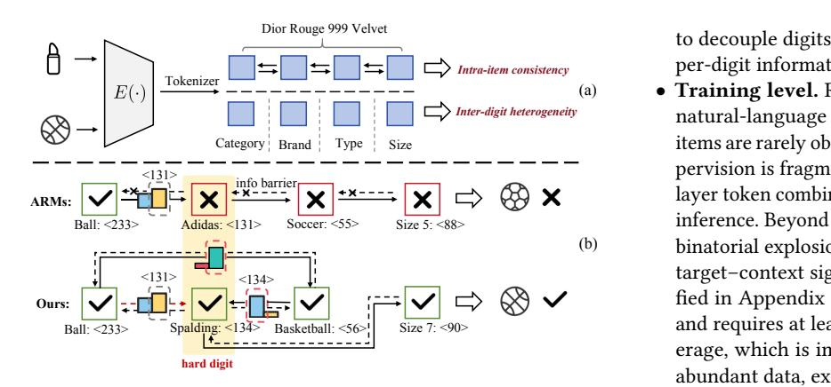
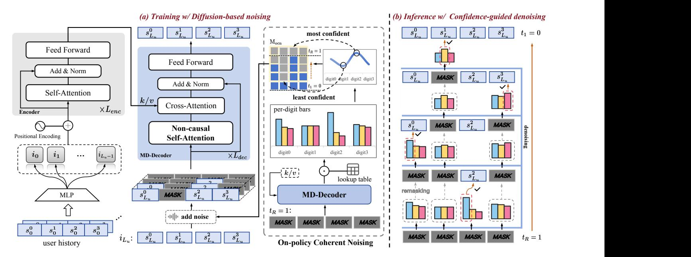
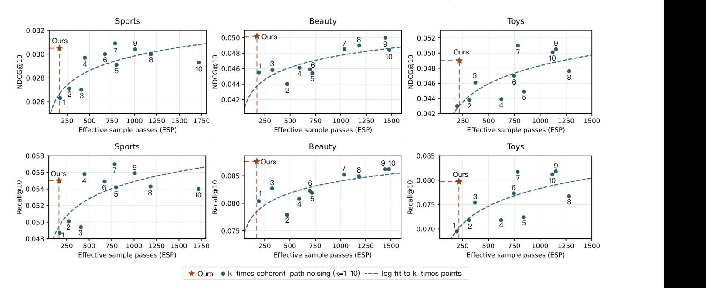
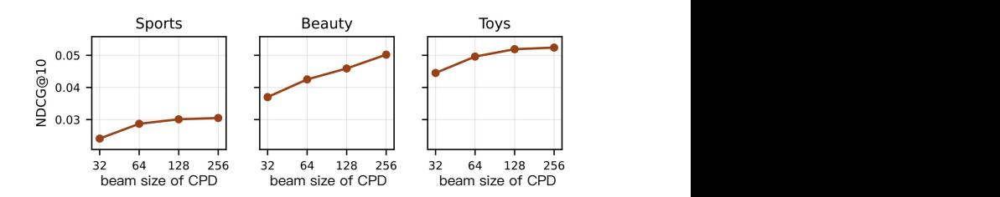
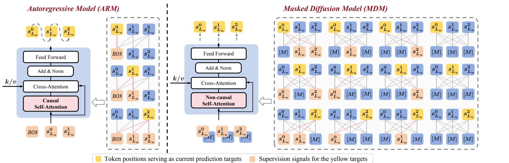
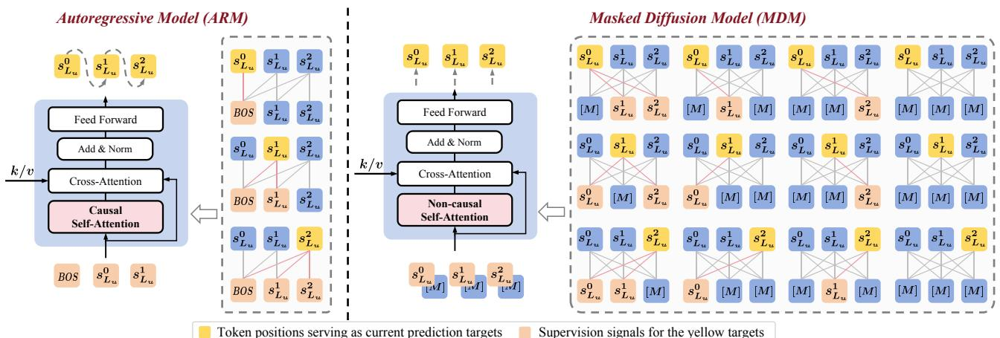
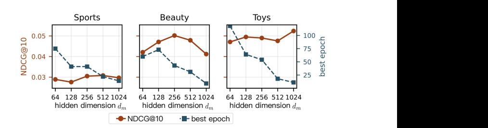

# DiffGRM: Diffusion-based Generative Recommendation Model

Zhao Liu∗ Kuaishou Technology Beijing, China liuzhao09@kuaishou.com

Yichen Zhu∗‡ Kuaishou Technology Beijing, China zhuyichen03@kuaishou.com

Yiqing Yang∗ Kuaishou Technology Beijing, China yangyiqing06@kuaishou.com

Xiao Lv† Kuaishou Technology Beijing, China lvxiao03@kuaishou.com

Guoping Tang Kuaishou Technology Beijing, China tangguoping@kuaishou.com

Rui Huang Kuaishou Technology Beijing, China huangrui06@kuaishou.com

Qiang Luo† Kuaishou Technology Beijing, China luoqiang@kuaishou.com

Ruiming Tang Kuaishou Technology Beijing, China tangruiming@kuaishou.com

Kun Gai Independent Beijing, China gai.kun@qq.com

Guorui Zhou† Kuaishou Technology Beijing, China zhouguorui@kuaishou.com

### Abstract

Generative recommendation (GR) is an emerging paradigm that represents each item via a tokenizer as an ��-digit semantic ID (SID) and predicts the next item by autoregressively generating its SID conditioned on the user's history. However, two structural properties of SIDs make ARMs ill-suited. First, intra-item consistency: the �� digits jointly specify one item, yet the left-to-right causality trains each digit only under its prefix and blocks bidirectional cross-digit evidence, collapsing supervision to a single causal path. Second, inter-digit heterogeneity: digits differ in semantic granularity and predictability, while the uniform next-token objective assigns equal weight to all digits, overtraining easy digits and undertraining hard digits. To address these two issues, we propose DiffGRM, a diffusionbased GR model that replaces the autoregressive decoder with a masked discrete diffusion model (MDM), thereby enabling bidirectional context and any-order parallel generation of SID digits for recommendation. Specifically, we tailor DiffGRM in three aspects: (1) tokenization with Parallel Semantic Encoding (PSE) to decouple digits and balance per-digit information; (2) training with On-policy Coherent Noising (OCN) that prioritizes uncertain digits via coherent masking to concentrate supervision on high-value signals; and (3) inference with Confidence-guided Parallel Denoising (CPD) that fills higher-confidence digits first and generates diverse Top-�� candidates. Experiments show consistent gains over strong generative and discriminative recommendation baselines on multiple datasets, improving NDCG@10 by 6.9%–15.5%. Code is available at: https://github.com/liuzhao09/DiffGRM.

### CCS Concepts

#### • Information systems → Recommender systems.

∗Equal contribution.

†Corresponding author. ‡Work done during internship at Kuaishou.

[This work is licensed under a Creative Commons Attribution 4.0 International License.](https://creativecommons.org/licenses/by/4.0) WWW '26, Dubai, United Arab Emirates. © 2026 Copyright held by the owner/author(s). ACM ISBN 979-8-4007-2307-0/2026/04 <https://doi.org/10.1145/3774904.3792156>

# Keywords

Generative recommendation; Discrete diffusion; Semantic IDs

#### ACM Reference Format:

Zhao Liu, Yichen Zhu, Yiqing Yang, Xiao Lv, Guoping Tang, Rui Huang, Qiang Luo, Ruiming Tang, Kun Gai, and Guorui Zhou. 2026. DiffGRM: Diffusion-based Generative Recommendation Model. In Proceedings of the ACM Web Conference 2026 (WWW '26), April 13–17, 2026, Dubai, United Arab Emirates. ACM, New York, NY, USA, [12](#page-11-0) pages. [https://doi.org/10.1145/](https://doi.org/10.1145/3774904.3792156) [3774904.3792156](https://doi.org/10.1145/3774904.3792156)

# 1 Introduction

Generative Recommendation (GR) frameworks have emerged as a promising direction in recommendation systems [\[30\]](#page-8-0). The core idea is to directly generate the token sequence of target item to complete the recommendation task. A typical GR framework is composed of two key modules: (1) Tokenization Module, which leverages pretrained language models [\[41,](#page-8-1) [62,](#page-9-0) [68\]](#page-9-1) to encode item content into dense vectors, then discretizes them into a fixed-length ��-digit sequence of semantic IDs (SIDs), where each digit is a token selected from a codebook via vector quantization [\[48,](#page-8-2) [55\]](#page-9-2); and (2) Generation Module, inspired by GPT-style Transformers [\[60\]](#page-9-3), which employs autoregressive models (ARMs) to sequentially predict the token for each digit of the target item's SID.

Unlike typical language modeling, in the GR framework each item is represented by an ��-digit SID produced by an ��-layer codebook, with one token assigned to each digit. This design induces two salient structural properties, as shown in Figure [1\(](#page-1-0)a). Intraitem consistency: the �� SID digits of an item jointly specify a single item; for example, together they resolve to Dior Rouge 999 Velvet. Inter-digit heterogeneity: the digits encode different semantic granularities, such as Category, Brand, Type, and Size, and therefore differ in predictability and difficulty, yielding easy digits and hard digits[1](#page-0-0) .

These structural characteristics pose significant challenges for ARMs. First, the inherent sequential dependency of ARMs creates information barriers and reduces supervision to a single causal path.

1Hard digits are SID positions with lower conditional predictability given the available context, whereas easy digits have higher predictability. Here, "digit" means a position in the SID, and a "token" is a codeword assigned to that position.

- (b)
- (a)
  - Training level. Recommendation catalogs are far larger than natural-language vocabularies and highly long-tailed, so most items are rarely observed. With random masking, the available supervision is fragmented, which makes it difficult to learn valid �� layer token combinations and increases the risk of invalid SIDs at inference. Beyond sparsity, the supervision space exhibits a combinatorial explosion: the number of masking patterns—and thus target–context signals—grows exponentially with ��. As quantified in Appendix [D,](#page-10-0) an ��-layer codebook yields �� 2 ��−1 signals and requires at least 2 �� − 1 masking configurations for full coverage, which is impractical under realistic budgets. Even with abundant data, exhaustive coverage is infeasible, so the central challenge is to select high-quality supervision signals from this vast candidate space rather than attempting to enumerate it. We therefore propose On-policy Coherent Noising (OCN), which adds noise to the hardest digits according to the model's on-policy selection while keeping the unmasked context coherent, thereby focusing the training budget on informative signals and avoiding the exponential scatter of fully random masking.
  - Inference level. In natural language applications, MDMs often rely on greedy decoding to produce a single high-quality response. By contrast, recommendation tasks demand a diverse candidate set of items, so simple greedy decoding is inadequate and calls for decoding strategies tailored to recommendation. To meet this need, we design Confidence-guided Parallel Denoising (CPD), which fills high-confidence digits first and then completes the remainder via a global parallel beam search, yielding accurate and diverse Top-�� SID candidates. Our main contributions are summarized as follows:
  - We present DiffGRM, the first diffusion-based generative recommendation framework that replaces the autoregressive decoder with a masked discrete diffusion model over SID digits, removing left-to-right constraints and exploiting bidirectional cross-digit context.
  - At the training level, we propose OCN to curb the combinatorial explosion of supervision in masked diffusion by coherently masking uncertainty-ranked hard digits, focusing the budget on high-value signals; at the inference level, we introduce CPD, a confidence-guided global parallel beam search that yields diverse Top-�� SID candidates.
  - We achieve state-of-the-art results across multiple public datasets, improving NDCG@10 by 6.9%–15.5% over strong generative and discriminative recommendation baselines, demonstrating the accuracy and generalization strength of DiffGRM.

Figure 1: Overview of SID structure and ARM limitations. (a) Intra-item consistency means that the �� SID digits jointly specify one item. Inter-digit heterogeneity means that digits encode different semantic granularity and have different prediction difficulty. (b) ARMs decode causally from left to right, which prevents cross-digit verification and can cause errors on hard digits to propagate. Our method updates digits by confidence under bidirectional context.

Causal attention enforces left-to-right dependencies, so each digit is trained only under its prefix context, which makes it hard to exploit intra-item consistency via bidirectional intra-item semantics and cross-digit mutual verification. As a result, the learnable supervision signal is forced to collapse into a single causal path [\[11,](#page-8-3) [63\]](#page-9-4). Second, prediction difficulty and supervision allocation are imbalanced. Inter-digit heterogeneity means that different SID digits carry unequal semantic load and exhibit very different predictability, yet the next-token objective allocates equal supervision to every digit. This mismatch yields training imbalance: hard digits receive too little signal while easy digits are overtrained. For example, in Figure [1\(](#page-1-0)b) the second digit (Brand) is the hard digit in this instance, while the third digit (Ball Type) is relatively easier, highlighting positional imbalance. Yet the next-token objective gives equal supervision to all digits, undertraining harder digits while overemphasizing easier ones, which hinders accurate SID generation [\[13,](#page-8-4) [53\]](#page-9-5).

To address these limitations, we draw inspiration from the rapid progress in discrete diffusion modeling [\[1,](#page-8-5) [12\]](#page-8-6) and replace the ARM in GR with a masked diffusion model (MDM). MDMs naturally leverage bidirectional context, support parallel generation, and provide richer supervision signals through random noising, making them better aligned with the structural characteristics of item representations. Nevertheless, effective use of MDMs in recommendation necessitates task-specific tailoring. We therefore introduce the Diffusion-based Generative Recommendation Model (DiffGRM), which provides three targeted adaptations across tokenization, training, and inference:

- Tokenization level. Mainstream GR tokenizers often rely on residual quantization (RQ), which induces a strict left-to-right residual dependency between digits. This coupling amplifies positional difficulty imbalance and weakens bidirectional interaction across digits. We adopt Parallel Semantic Encoding (PSE)

to decouple digits, enable fully parallel prediction, and balance per-digit information.

### 2 Background

### 2.1 SID Generation for Recommendation

Given a user's interaction history, we predict the next item by generating its ��-digit SID. Let U be the user set and I the item set. For�� ∈ U, the history is ���� = [�� 1 , . . . ,���� ���� ]. Each item �� ∈ I has content features f�� . A semantic encoder ��(·) maps them to an embedding h�� = ��(f��) ∈ R �� . We discretize h�� into an ��-digit SID�� = [�� 0 , . . . , ����−1 with per-digit codebooks of size ��, so �� �� �� ∈ {0, . . . , �� −1}. The user history in SID space is ���� = [SID�� 1 , . . . , SID�� ���� ]. Let the target SID

Figure 2: Overall framework of DiffGRM. (a) Training: an encoder summarizes the user history, and a masked-diffusion decoder predicts missing digits in parallel under masks scheduled by On-policy Coherent Noising (OCN), which concentrates corruption on harder digits. (b) Inference: Confidence-guided Parallel Denoising (CPD) performs a global parallel beam search from a fully masked input, filling higher-confidence digits first to recover complete SIDs.

be y ∗ = SID�� ����+1 . We learn a conditional generator ���� (y | ����) and optimize the conditional log-likelihood as:

max E��∈U log ���� (y ∗ | ����) , (1)

where ���� models the joint distribution over the �� digits given ����, y ∗ is the SID of the next item for user ��, and the expectation is over users in U. In our system ���� is instantiated by a masked-diffusion decoder trained with digit-wise supervision on masked digits.

#### 2.2 Masked Diffusion for Parallel Token Prediction

We adopt masked diffusion [\[1,](#page-8-5) [42,](#page-8-7) [64\]](#page-9-6) to generate the ��-digit SID. The forward process applies an absorbing-state mask corruption that replaces a subset of digits with [MASK] under a time-dependent schedule [\[4,](#page-8-8) [51,](#page-9-7) [54\]](#page-9-8). The reverse process predicts all masked digits in parallel from the corrupted sequence.

We train the decoder with a masked-digit cross-entropy as:

L (��) = − Ex0, ��, x�� ∼���� |0 (· |x0 ) 1 |M�� | ∑︁ �� ∈M�� log ���� �� �� 0 | x�� , �� , (2)

where x0 is the clean SID sequence, x�� is its corrupted version with mask ratio �� ∈ [0, 1), and M�� is the masked index set. This objective upper-bounds the negative log-likelihood [\[43,](#page-8-9) [54\]](#page-9-8), removes causal constraints, and yields richer supervision signals via discrete masking during training, enabling parallel generation.

#### 3 Method

# 3.1 Overview

Figure [2](#page-2-0) illustrates DiffGRM, which predicts the next item's SID in parallel via masked diffusion. We describe parallel semantic encoding (PSE) for SID tokenization (Section [3.2\)](#page-3-0), introduce on-policy coherent noising (OCN) for difficulty-aware masking (Section [3.3\)](#page-3-1), and present confidence-guided parallel denoising (CPD) for inference (Section [3.4\)](#page-3-2). Finally, we discuss design choices and analyze training and inference complexity (Section [3.5\)](#page-4-0).

We adopt an encoder–decoder architecture, where the encoder summarizes the user history and the masked-diffusion decoder (MD-Decoder) predicts SID digits in parallel under non-causal attention, and the workflow that connects these components is as follows. Items are first tokenized into SIDs via PSE (Section [3.2\)](#page-3-0), which converts each user's interaction history into a sequence of SIDs. We embed the �� digits of each item, concatenate and project them into an item vector, add positional embeddings, and feed the sequence to a Transformer encoder to obtain H�� ∈R ��input×���� , where ��input is the encoder input length and ���� the model hidden size. The MD-Decoder then takes a partially masked ��-digit input y and applies non-causal (bidirectional) self-attention across digits. Unlike autoregressive causal attention, each digit attends to all others, enabling bidirectional intra-item semantics and cross-digit mutual verification. The MD-Decoder then cross-attends to H�� (encoderside ��/�� are derived from H��) and predicts all masked digits in parallel. During multi-view training, we compute H�� once per sample and cache encoder-side ��/�� for reuse across views and CPD steps, which amortizes cross-attention cost since only the decoder queries are recomputed. For decoding, we adopt confidence-guided

| Dataset | #Users | #Items | #Interactions | Avg. �� |
|---------|--------|--------|---------------|---------|
| Sports  | 35,598 | 18,357 | 260,739       | 8.32    |
| Beauty  | 22,363 | 12,101 | 176,139       | 8.87    |
| Toys    | 19,412 | 11,924 | 148,185       | 8.63    |

Table 3: Overall performance on Amazon Reviews (Sports, Beauty, Toys) by Recall@K and NDCG@K (�� ∈ {5, 10}). Best results are in bold; second-best are underlined. DiffGRM significantly outperforms the strongest baseline (paired t-test, �� &lt; 0.05). "—" denotes results not reported by the original paper, and other baseline numbers are taken from prior publications [\[20,](#page-8-18) [21,](#page-8-22) [48\]](#page-8-2).

| Methods     | Recall @5 | Sports NDCG @5 | and Outdoors Recall @10 | NDCG @10 | Recall @5 Item    | NDCG @5 ID-based | Beauty Recall @10 (Discriminative) | NDCG @10 | Recall @5 | Toys NDCG @5 | and Games Recall @10 | NDCG @10 |
|-------------|-----------|----------------|-------------------------|----------|-------------------|------------------|------------------------------------|----------|-----------|--------------|----------------------|----------|
| GRU4Rec     | 0.0129    | 0.0086         | 0.0204                  | 0.0110   | 0.0164            | 0.0099           | 0.0283                             | 0.0137   | 0.0097    | 0.0059       | 0.0176               | 0.0084   |
| HGN         | 0.0189    | 0.0120         | 0.0313                  | 0.0159   | 0.0325            | 0.0206           | 0.0512                             | 0.0266   | 0.0321    | 0.0221       | 0.0497               | 0.0277   |
| SASRec      | 0.0233    | 0.0154         | 0.0350                  | 0.0192   | 0.0387            | 0.0249           | 0.0605                             | 0.0318   | 0.0463    | 0.0306       | 0.0675               | 0.0374   |
| BERT4Rec    | 0.0115    | 0.0075         | 0.0191                  | 0.0099   | 0.0203            | 0.0124           | 0.0347                             | 0.0170   | 0.0116    | 0.0071       | 0.0203               | 0.0099   |
|             |           |                |                         |          | Semantic-enhanced |                  | (Discriminative)                   |          |           |              |                      |          |
| FDSA        | 0.0182    | 0.0122         | 0.0288                  | 0.0156   | 0.0267            | 0.0163           | 0.0407                             | 0.0208   | 0.0228    | 0.0140       | 0.0381               | 0.0189   |
| -Rec S      | 0.0251    | 0.0161         | 0.0385                  | 0.0204   | 0.0387            | 0.0244           | 0.0647                             | 0.0327   | 0.0443    | 0.0294       | 0.0700               | 0.0376   |
| VQ-Rec      | 0.0208    | 0.0144         | 0.0300                  | 0.0173   | 0.0457            | 0.0317           | 0.0664                             | 0.0383   | 0.0497    | 0.0346       | 0.0737               | 0.0423   |
| RecJPQ      | 0.0141    | 0.0076         | 0.0220                  | 0.0102   | 0.0311            | 0.0167           | 0.0482                             | 0.0222   | 0.0331    | 0.0182       | 0.0484               | 0.0231   |
|             |           |                |                         |          | Semantic          | ID-based         | (Generative)                       |          |           |              |                      |          |
| TIGER       | 0.0264    | 0.0181         | 0.0400                  | 0.0225   | 0.0454            | 0.0321           | 0.0648                             | 0.0384   | 0.0521    | 0.0371       | 0.0712               | 0.0432   |
| HSTU        | 0.0258    | 0.0165         | 0.0414                  | 0.0215   | 0.0469            | 0.0314           | 0.0704                             | 0.0389   | 0.0433    | 0.0281       | 0.0669               | 0.0357   |
| ActionPiece | 0.0316    | 0.0205         | 0.0500                  | 0.0264   | 0.0511            | 0.0340           | 0.0775                             | 0.0424   | —         | —            | —                    | —        |
| RPG         | 0.0314    | 0.0216         | 0.0463                  | 0.0263   | 0.0550            | 0.0381           | 0.0809                             | 0.0464   | 0.0592    | 0.0401       | 0.0869               | 0.0490   |
| DiffGRM     | 0.0363    | 0.0245         | 0.0550                  | 0.0305   | 0.0603            | 0.0414           | 0.0876                             | 0.0502   | 0.0618    | 0.0455       | 0.0834               | 0.0524   |
| Improv.     | +14.87%   | +13.43%        | +10.00%                 | +15.53%  | +9.64%            | +8.66%           | +8.28%                             | +8.19%   | +4.39%    | +13.47%      | -4.03%               | 6.94%    |

# 4.1 Experimental Setup

Datasets. We evaluate on three Amazon Reviews categories [\[38\]](#page-8-23): "Sports and Outdoors" (Sports), "Beauty" (Beauty), and "Toys and Games" (Toys), which are standard benchmarks for semantic ID– based generative recommendation [\[23,](#page-8-24) [24,](#page-8-25) [48\]](#page-8-2). Following prior work [\[18,](#page-8-26) [48,](#page-8-2) [74\]](#page-9-11), we treat each user's historical reviews as interactions and sort them chronologically to form sequences. We adopt the standard leave-last-out evaluation [\[27,](#page-8-27) [48,](#page-8-2) [69\]](#page-9-12): the last item in each sequence is used for testing, the second-to-last for validation, and the remaining interactions for training. Table [2](#page-4-3) summarizes dataset statistics.

Baselines. We compare DiffGRM with the following baselines, grouped into three families: (i) Item ID-based discriminative models, (ii) Semantic-enhanced discriminative models, and (iii) Semantic ID-based generative models.

- GRU4Rec [\[15\]](#page-8-28): an RNN-based session recommender that models sequential dynamics.
- HGN [\[36\]](#page-8-29): gating improves RNN-based sequence modeling.
- SASRec [\[27\]](#page-8-27): self-attentive Transformer decoder with binary cross-entropy for next-item prediction.
- BERT4Rec [\[58\]](#page-9-13): bidirectional Transformer encoder trained with a Cloze-style objective on item IDs.
- FDSA [\[67\]](#page-9-14): models and fuses item-ID and feature sequences with self-attention.
- S 3 -Rec [\[74\]](#page-9-11): self-supervised pretraining on features and IDs, then fine-tuning for next-item prediction.
- VQ-Rec [\[18\]](#page-8-26): product-quantizes text features into semantic IDs and pools them as item representations.

- RecJPQ [\[47\]](#page-8-30): replaces item embeddings with concatenated jointly product-quantized sub-embeddings.
- TIGER [\[48\]](#page-8-2): RQ-VAE tokenization and autoregressive generation of the next SID token.
- HSTU [\[65\]](#page-9-15): discretizes raw item features as tokens for generative recommendation; for consistency with prior setups [\[20\]](#page-8-18), we adopt 4-digit OPQ-tokenized SIDs as item tokens.
- ActionPiece [\[21\]](#page-8-22): context-aware tokenization that represents each action as an unordered set of item features.
- RPG [\[20\]](#page-8-18): predicts unordered SID tokens in parallel via a multitoken objective with graph-guided decoding.

Evaluation settings. We use Recall@�� and NDCG@�� as metrics to evaluate the methods, where �� ∈ {5, 10}, following Rajput et al. [\[48\]](#page-8-2). Model checkpoints with the best performance on the validation set are used for evaluation on the test set.

Implementation details. Please refer to Appendix [B](#page-9-16) for detailed implementation and hyperparameter settings.

# 4.2 Overall Performance (RQ1)

We compare DiffGRM with both discriminative and generative baselines on three benchmarks using SID-based evaluation, as summarized in Table [3.](#page-5-0) Methods that leverage semantic information consistently outperform ID-only discriminative models, and within the semantic family, semantic ID-based generative models generally surpass semantic-enhanced discriminative ones.

DiffGRM achieves the best overall results, ranking first on 11 of the 12 metrics. Relative to the strongest baseline, NDCG at K=10 improves by 15.53% on Sports, 8.19% on Beauty, and 6.94% on Toys.

Figure 3: Analysis of performance (NDCG@10/Recall@10) w.r.t. effective sample passes (ESP). DiffGRM matches or surpasses the ��-times coherent-path noising settings under lower ESP, indicating higher sample efficiency. For fairness, on Toys we fix ��model=256, while the optimal ��model=1024 runs out of memory for ��>3.

Recall at K=10 improves by 10.00% on Sports and 8.28% on Beauty, and is slightly lower on Toys by 4.03%, while DiffGRM still attains higher NDCG at both K=5 and K=10. These gains stem from masked-diffusion training over SIDs that supplies dense per-digit supervision and bidirectional context among SID digits, together with OCN that allocates more supervision to difficult digits and CPD that enables parallel Top-�� SID generation. We report results with alternative semantic encoders in Appendix [C.](#page-10-1)

### 4.3 Effectiveness of OCN (RQ2)

This section evaluates whether On-policy Coherent Noising (OCN) achieves a more balanced supervision allocation under a smaller training budget. Analysis of supervision-signal differences between the ARM and the MDM is provided in Appendix [D.](#page-10-0)

We introduce a unified measure, effective sample passes (ESP): ESP = best\_epoch× (training views per sample per epoch). Training views come from coherent-path noising: with one path, each sample yields �� views per epoch, equal to the number of codebook layers (�� = 4). To test whether more supervision helps, we expand the coherent paths from 1 to ��, so views become �� × �� and ESP = best\_epoch × �� × �� (for fairness, we apply the same view expansion to ARM; see Appendix [E\)](#page-10-2). ESP is independent of the number of training samples (per-dataset numbers of training samples and sliding-window augmentation details are in Appendix [F\)](#page-10-3).

As shown in Figure [3,](#page-6-0) increasing �� raises performance but also raises ESP. The dashed line is a logarithmic least-squares fit over the ��-times coherent-path points, summarizing how performance scales with ESP. In contrast, On-policy Coherent Noising (OCN) achieves better results at the same or lower ESP by using the current model to

Table 4: Ablation analysis of DiffGRM. The recommendation performance is measured using NDCG@10. The best performance is denoted in bold fonts.

select the most uncertain positions along coherent paths, focusing training on high-value signals and improving sample efficiency.

### 4.4 Ablation Study (RQ3)

We conduct ablation analyses in Table [4](#page-6-1) to quantify each module's contribution to DiffGRM's overall performance.

(1) To assess Parallel Semantic Encoding, we compare two variants. (1.1) Replacing PSE with RQ-KMeans degrades performance because the residual hierarchy in RQ introduces dependencies across digits that conflict with masked diffusion's bidirectional and parallel denoising. (1.2) Replacing PSE with random tokens

Table 5: OCN variants on Beauty and Toys (NDCG@10). Improv.: (w/o CPD−CPD)/CPD. Abbreviations: L-S (least, static), L-R (least, refresh), M-S (most, static), M-R (most, refresh).

| Dataset Metric | L-S (Ours) | L-R     | M-S     | M-R      |
|----------------|------------|---------|---------|----------|
| CPD            | 0.0502     | 0.0484  | 0.0476  | 0.0382   |
| w/o CPD Beauty | 0.0496     | 0.0470  | 0.0444  | 0.0309   |
| Improv.        | − 1 20%    | − 2 89% | − 6 72% | − 19 11% |
| CPD            | 0.0524     | 0.0481  | 0.0516  | 0.0421   |
| w/o CPD Toys   | 0.0499     | 0.0455  | 0.0506  | 0.0318   |
| Improv.        | − 4 71%    | − 5 41% | − 1 94% | − 24 47% |

further hurts by discarding semantic structure. This confirms that PSE is necessary for MDM.

(2) Then, to assess On-policy Coherent Noising, we compare two variants. (2.1) w/o OCN adopts DDMs-style random masking [\[42\]](#page-8-7), removing coherent noising and on-policy selection, which disperses supervision and leaves infrequent long-tail samples insufficiently trained. (2.2) w/o on-policy keeps coherent noising but removes on-policy selection, performing better than (2.1) yet still below DiffGRM. This shows that on-policy further focuses supervision on weak positions.

(3) Finally, to assess Confidence-guided Parallel Denoising, w/o CPD replaces confidence-guided parallel denoising with random fixed-order beam search, which decodes digits in a fixed random permutation without confidence feedback and reduces performance across all three datasets.

#### 4.5 Further Analysis

4.5.1 OCN Strategy Analysis. We compare four OCN variants along two dimensions. Selection policy decides which digits are noised earlier: "least" selects the lowest-confidence digits under the current model, while "most" selects the highest-confidence digits. Refresh frequency specifies how the order is obtained: "static" runs the MD-Decoder once to estimate uncertainties and then keeps the order fixed for the whole example, while "refresh" re-estimates uncertainties after each denoising step and updates the order at every step, which invokes the decoder n times for n codebook layers. Results are shown in Table [5.](#page-7-0)

Findings. (1) Selection policy: least-based scheduling outperforms most-based under the same refresh setting. (2) Refresh frequency: static outperforms refresh; re-estimating the order at each step changes the plan and degrades performance. (3) Order sensitivity: largest degradation occurs in M-R when replacing CPD with w/o CPD. Prioritizing the most confident digits with stepwise refresh makes the model rely on an easy-first order; once the order changes, hard digits are undertrained and performance drops sharply.

4.5.2 CPD Beam-Size Analysis. We vary the CPD beam size {32, 64, 128, 256} and report results in Figure [4.](#page-7-1) As in classic beam search, larger beams improve NDCG@10 by mitigating local optima.

4.5.3 Hidden Dimension Analysis. Please refer to Appendix [G](#page-11-1) for analysis of the impact of the hidden dimension ����. In short, ���� = 256 suits Sports and Beauty; Toys benefits from ���� = 1024. We use these settings in the main experiments.

Figure 4: Analysis of DiffGRM performance (NDCG@10) w.r.t. beam size in CPD.

#### 5 Related Work

Generative Recommendation Models. Autoregressive (AR) generation casts recommendation as sequence generation [\[22,](#page-8-31) [31,](#page-8-19) [50\]](#page-9-17): items are discretized into semantic IDs and a Transformer predicts the target SID token by token [\[25,](#page-8-32) [27,](#page-8-27) [29,](#page-8-33) [48\]](#page-8-2). Representative models include TIGER [\[48\]](#page-8-2) mapping items via RQ-VAE and decoding autoregressively; HSTU [\[65\]](#page-9-15) framing recommendation as sequence transduction at scale; GenNewsRec [\[9\]](#page-8-34) integrating LLM reasoning with item generation; MTGRec [\[72\]](#page-9-18) and ETEGRec [\[32\]](#page-8-35) enhancing quantization for higher-quality tokens; ActionPiece [\[21\]](#page-8-22) performing context-aware tokenization; and RPG [\[20\]](#page-8-18) predicting unordered semantic IDs in parallel. AR generative recommenders unify representation and prediction, benefit from large-scale language-modeling techniques for stronger sequence modeling [\[59,](#page-9-19) [71\]](#page-9-20), and support open-vocabulary recommendation [\[21,](#page-8-22) [52\]](#page-9-21). In summary, left-toright decoding introduces mismatch and imbalance, motivating diffusion-based alternatives.

Discrete Diffusion Language Models. Diffusion models originated for continuous data [\[16,](#page-8-36) [37,](#page-8-37) [56,](#page-9-22) [57\]](#page-9-23), and were later extended to discrete spaces [\[3,](#page-8-38) [17\]](#page-8-39). A continuous-time view models discrete diffusion as a CTMC [\[5\]](#page-8-40), and concrete-score/score-matching objectives enable effective training [\[34,](#page-8-41) [39\]](#page-8-42). Large-scale discrete diffusion language models (DDMs) now approach autoregressive performance on some tasks [\[64\]](#page-9-6), with further gains from improved reverse-sampling strategies [\[35,](#page-8-43) [44,](#page-8-44) [46\]](#page-8-45). However, these advances target free-form, single-output text, whereas GR requires structured ��-digit SIDs and a Top-�� set. We therefore adapt DDMs to GR with task-specific tokenization, training, and inference.

#### 6 Conclusion

In this work, we analyze the structure of semantic ID sequences and reveal the mismatch between autoregressive generation and crossdigit semantics. We present DiffGRM, a diffusion-based generative recommendation framework using discrete masked diffusion. The design combines three components: PSE with OPQ subspace quantization to eliminate cross-digit dependence and balance information; OCN for on-policy coherent noising that allocates supervision by uncertainty and emphasizes difficult digits; and CPD for confidenceguided parallel beam search that produces diverse Top-�� candidates. Overall, DiffGRM reconciles cross-digit semantics with parallel generation, yielding state-of-the-art results—improving NDCG@10 by 6.9%–15.5% over strong baselines—and producing robust Top-�� recommendations. In the future, we will further investigate inference efficiency and scalability.

#### References

[1] Jacob Austin, Daniel D. Johnson, Jonathan Ho, Daniel Tarlow, and Rianne van den Berg. 2021. Structured Denoising Diffusion Models in Discrete State-Spaces. In NeurIPS. 17981–17993. [2] Jacob Austin, Daniel D. Johnson, Jonathan Ho, Daniel Tarlow, and Rianne van den Berg. 2021. Structured Denoising Diffusion Models in Discrete State-Spaces. In NeurIPS. 17981–17993. [3] Jacob Austin, Daniel D Johnson, Jonathan Ho, Daniel Tarlow, and Rianne Van Den Berg. 2021. Structured denoising diffusion models in discrete state-spaces. Advances in Neural Information Processing Systems 34 (2021), 17981–17993. [4] Andrew Campbell, Joe Benton, Valentin De Bortoli, Thomas Rainforth, George Deligiannidis, and Arnaud Doucet. 2022. A Continuous Time Framework for Discrete Denoising Models. In NeurIPS. [5] Andrew Campbell, Joe Benton, Valentin De Bortoli, Thomas Rainforth, George Deligiannidis, and Arnaud Doucet. 2022. A continuous time framework for discrete denoising models. Advances in Neural Information Processing Systems 35 (2022), 28266–28279. [6] Jiaxin Deng, Shiyao Wang, Kuo Cai, Lejian Ren, Qigen Hu, Weifeng Ding, Qiang Luo, and Guorui Zhou. 2025. OneRec: Unifying Retrieve and Rank with Generative Recommender and Iterative Preference Alignment. CoRR abs/2502.18965 (2025). [7] Jacob Devlin, Ming-Wei Chang, Kenton Lee, and Kristina Toutanova. 2019. BERT: Pre-training of Deep Bidirectional Transformers for Language Understanding. In NAACL-HLT (1). Association for Computational Linguistics, 4171–4186. [8] Matthijs Douze, Alexandr Guzhva, Chengqi Deng, Jeff Johnson, Gergely Szilvasy, Pierre-Emmanuel Mazaré, Maria Lomeli, Lucas Hosseini, and Hervé Jégou. 2024. The Faiss library. CoRR abs/2401.08281 (2024). [9] Shen Gao, Jiabao Fang, Quan Tu, Zhitao Yao, Zhumin Chen, Pengjie Ren, and Zhaochun Ren. 2024. Generative News Recommendation. In WWW. ACM, 3444– 3453. [10] Tiezheng Ge, Kaiming He, Qifa Ke, and Jian Sun. 2014. Optimized Product Quantization. IEEE Trans. Pattern Anal. Mach. Intell. 36, 4 (2014), 744–755. [11] Marjan Ghazvininejad, Omer Levy, Yinhan Liu, and Luke Zettlemoyer. 2019. Mask-Predict: Parallel Decoding of Conditional Masked Language Models. In EMNLP/IJCNLP (1). Association for Computational Linguistics, 6111–6120. [12] Shansan Gong, Mukai Li, Jiangtao Feng, Zhiyong Wu, and Lingpeng Kong. 2023. DiffuSeq: Sequence to Sequence Text Generation with Diffusion Models. In ICLR. OpenReview.net. [13] Anirudh Goyal, Alex Lamb, Ying Zhang, Saizheng Zhang, Aaron C. Courville, and Yoshua Bengio. 2016. Professor Forcing: A New Algorithm for Training Recurrent Networks. In NIPS. 4601–4609. [14] Yingzhi He, Xiaohao Liu, An Zhang, Yunshan Ma, and Tat-Seng Chua. 2025. LLM2Rec: Large Language Models Are Powerful Embedding Models for Sequential Recommendation. CoRR abs/2506.21579 (2025). [15] Balázs Hidasi, Alexandros Karatzoglou, Linas Baltrunas, and Domonkos Tikk. 2016. Session-based Recommendations with Recurrent Neural Networks. In ICLR (Poster). [16] Jonathan Ho, Ajay Jain, and Pieter Abbeel. 2020. Denoising diffusion probabilistic models. Advances in neural information processing systems 33 (2020), 6840–6851. [17] Emiel Hoogeboom, Alexey A Gritsenko, Jasmijn Bastings, Ben Poole, Rianne van den Berg, and Tim Salimans. 2021. Autoregressive diffusion models. arXiv preprint arXiv:2110.02037 (2021). [18] Yupeng Hou, Zhankui He, Julian J. McAuley, and Wayne Xin Zhao. 2023. Learning Vector-Quantized Item Representation for Transferable Sequential Recommenders. In WWW. ACM, 1162–1171. [19] Yupeng Hou, Jiacheng Li, Zhankui He, An Yan, Xiusi Chen, and Julian McAuley. 2024. Bridging Language and Items for Retrieval and Recommendation. arXiv preprint arXiv:2403.03952 (2024). [20] Yupeng Hou, Jiacheng Li, Ashley Shin, Jinsung Jeon, Abhishek Santhanam, Wei Shao, Kaveh Hassani, Ning Yao, and Julian J. McAuley. 2025. Generating Long Semantic IDs in Parallel for Recommendation. CoRR abs/2506.05781 (2025). [21] Yupeng Hou, Jianmo Ni, Zhankui He, Noveen Sachdeva, Wang-Cheng Kang, Ed H. Chi, Julian J. McAuley, and Derek Zhiyuan Cheng. 2025. ActionPiece: Contextually Tokenizing Action Sequences for Generative Recommendation. CoRR abs/2502.13581 (2025). [22] Yupeng Hou, An Zhang, Leheng Sheng, Zhengyi Yang, Xiang Wang, Tat-Seng Chua, and Julian J. McAuley. 2025. Generative Recommendation Models: Progress and Directions. In WWW (Companion Volume). ACM, 13–16. [23] Wenyue Hua, Shuyuan Xu, Yingqiang Ge, and Yongfeng Zhang. 2023. How to Index Item IDs for Recommendation Foundation Models. In SIGIR-AP. ACM, 195–204. [24] Bowen Jin, Hansi Zeng, Guoyin Wang, Xiusi Chen, Tianxin Wei, Ruirui Li, Zhengyang Wang, Zheng Li, Yang Li, Hanqing Lu, Suhang Wang, Jiawei Han, and Xianfeng Tang. 2024. Language Models as Semantic Indexers. In ICML. OpenReview.net. [25] Bowen Jin, Hansi Zeng, Guoyin Wang, Xiusi Chen, Tianxin Wei, Ruirui Li, Zhengyang Wang, Zheng Li, Yang Li, Hanqing Lu, Suhang Wang, Jiawei Han, and Xianfeng Tang. 2024. Language Models as Semantic Indexers. In ICML. OpenReview.net. [26] Clark Mingxuan Ju, Liam Collins, Leonardo Neves, Bhuvesh Kumar, Louis Yufeng Wang, Tong Zhao, and Neil Shah. 2025. Generative Recommendation with Semantic IDs: A Practitioner's Handbook. CoRR abs/2507.22224 (2025). [27] Wang-Cheng Kang and Julian J. McAuley. 2018. Self-Attentive Sequential Recommendation. In ICDM. IEEE Computer Society, 197–206. [28] Geon Lee, Bhuvesh Kumar, Clark Mingxuan Ju, Tong Zhao, Kijung Shin, Neil Shah, and Liam Collins. 2025. Sequential Data Augmentation for Generative Recommendation. arXiv[:2509.13648](https://arxiv.org/abs/2509.13648) [cs.LG]<https://arxiv.org/abs/2509.13648> [29] Guanghan Li, Xun Zhang, Yufei Zhang, Yifan Yin, Guojun Yin, and Wei Lin. 2025. Semantic Convergence: Harmonizing Recommender Systems via Two-Stage Alignment and Behavioral Semantic Tokenization. In AAAI. AAAI Press, 12040–12048. [30] Yongqi Li, Xinyu Lin, Wenjie Wang, Fuli Feng, Liang Pang, Wenjie Li, Liqiang Nie, Xiangnan He, and Tat-Seng Chua. 2024. A Survey of Generative Search and Recommendation in the Era of Large Language Models. CoRR abs/2404.16924 (2024). [31] Xinyu Lin, Haihan Shi, Wenjie Wang, Fuli Feng, Qifan Wang, See-Kiong Ng, and Tat-Seng Chua. 2025. Order-agnostic Identifier for Large Language Model-based Generative Recommendation. In SIGIR. ACM, 1923–1933. [32] Enze Liu, Bowen Zheng, Wayne Xin Zhao, and Ji-Rong Wen. 2025. Bridging Textual-Collaborative Gap through Semantic Codes for Sequential Recommendation. CoRR abs/2503.12183 (2025). [33] Qidong Liu, Xian Wu, Wanyu Wang, Yejing Wang, Yuanshao Zhu, Xiangyu Zhao, Feng Tian, and Yefeng Zheng. 2024. Large Language Model Empowered Embedding Generator for Sequential Recommendation. arXiv preprint arXiv:2409.19925 (2024). [34] Aaron Lou, Chenlin Meng, and Stefano Ermon. 2023. Discrete diffusion language modeling by estimating the ratios of the data distribution. (2023). [35] Omer Luxembourg, Haim H. Permuter, and Eliya Nachmani. 2025. Plan for Speed - Dilated Scheduling for Masked Diffusion Language Models. CoRR abs/2506.19037 (2025). [36] Chen Ma, Peng Kang, and Xue Liu. 2019. Hierarchical Gating Networks for Sequential Recommendation. In KDD. ACM, 825–833. [37] Wenyu Mao, Shuchang Liu, Haoyang Liu, Haozhe Liu, Xiang Li, and Lantao Hu. 2025. Distinguished Quantized Guidance for Diffusion-based Sequence Recommendation. In WWW. ACM, 425–435. [38] Julian J. McAuley, Christopher Targett, Qinfeng Shi, and Anton van den Hengel. 2015. Image-Based Recommendations on Styles and Substitutes. In SIGIR. ACM, 43–52. [39] Chenlin Meng, Kristy Choi, Jiaming Song, and Stefano Ermon. 2022. Concrete score matching: Generalized score matching for discrete data. Advances in Neural Information Processing Systems 35 (2022), 34532–34545. [40] Fabian Mentzer, David Minnen, Eirikur Agustsson, and Michael Tschannen. 2023. Finite Scalar Quantization: VQ-VAE Made Simple. arXiv[:2309.15505](https://arxiv.org/abs/2309.15505) [cs.CV] <https://arxiv.org/abs/2309.15505> [41] Jianmo Ni, Gustavo Hernández Ábrego, Noah Constant, Ji Ma, Keith B. Hall, Daniel Cer, and Yinfei Yang. 2022. Sentence-T5: Scalable Sentence Encoders from Pre-trained Text-to-Text Models. In ACL (Findings). Association for Computational Linguistics, 1864–1874. [42] Shen Nie, Fengqi Zhu, Zebin You, Xiaolu Zhang, Jingyang Ou, Jun Hu, Jun Zhou, Yankai Lin, Ji-Rong Wen, and Chongxuan Li. 2025. Large Language Diffusion Models. CoRR abs/2502.09992 (2025). [43] Jingyang Ou, Shen Nie, Kaiwen Xue, Fengqi Zhu, Jiacheng Sun, Zhenguo Li, and Chongxuan Li. 2025. Your Absorbing Discrete Diffusion Secretly Models the Conditional Distributions of Clean Data. In ICLR. OpenReview.net. [44] Yong-Hyun Park, Chieh-Hsin Lai, Satoshi Hayakawa, Yuhta Takida, and Yuki Mitsufuji. 2025. Jump Your Steps: Optimizing Sampling Schedule of Discrete Diffusion Models. In ICLR. OpenReview.net. [45] Adam Paszke, Sam Gross, Francisco Massa, Adam Lerer, James Bradbury, Gregory Chanan, Trevor Killeen, Zeming Lin, Natalia Gimelshein, Luca Antiga, Alban Desmaison, Andreas Köpf, Edward Z. Yang, Zachary DeVito, Martin Raison, Alykhan Tejani, Sasank Chilamkurthy, Benoit Steiner, Lu Fang, Junjie Bai, and Soumith Chintala. 2019. PyTorch: An Imperative Style, High-Performance Deep Learning Library. In NeurIPS. 8024–8035. [46] Zhangzhi Peng, Zachary Bezemek, Sawan Patel, Jarrid Rector-Brooks, Sherwood Yao, Alexander Tong, and Pranam Chatterjee. 2025. Path Planning for Masked Diffusion Model Sampling. CoRR abs/2502.03540 (2025). [47] Aleksandr V. Petrov and Craig Macdonald. 2024. RecJPQ: Training Large-Catalogue Sequential Recommenders. In WSDM. ACM, 538–547. [48] Shashank Rajput, Nikhil Mehta, Anima Singh, Raghunandan Hulikal Keshavan, Trung Vu, Lukasz Heldt, Lichan Hong, Yi Tay, Vinh Q. Tran, Jonah Samost, Maciej Kula, Ed H. Chi, and Mahesh Sathiamoorthy. 2023. Recommender Systems with Generative Retrieval. In NeurIPS. [49] Xubin Ren and Chao Huang. 2024. EasyRec: Simple yet Effective Language Models for Recommendation. CoRR abs/2408.08821 (2024).

[50] Steffen Rendle, Christoph Freudenthaler, and Lars Schmidt-Thieme. 2010. Factorizing personalized Markov chains for next-basket recommendation. In WWW. ACM, 811–820. [51] Subham S. Sahoo, Marianne Arriola, Yair Schiff, Aaron Gokaslan, Edgar Marroquin, Justin T. Chiu, Alexander Rush, and Volodymyr Kuleshov. 2024. Simple and Effective Masked Diffusion Language Models. In NeurIPS. [52] Craig W. Schmidt, Varshini Reddy, Haoran Zhang, Alec Alameddine, Omri Uzan, Yuval Pinter, and Chris Tanner. 2024. Tokenization Is More Than Compression. In EMNLP. Association for Computational Linguistics, 678–702. [53] Shiqi Shen, Yong Cheng, Zhongjun He, Wei He, Hua Wu, Maosong Sun, and Yang Liu. 2016. Minimum Risk Training for Neural Machine Translation. In ACL (1). The Association for Computer Linguistics. [54] Jiaxin Shi, Kehang Han, Zhe Wang, Arnaud Doucet, and Michalis K. Titsias. 2024. Simplified and Generalized Masked Diffusion for Discrete Data. In NeurIPS. [55] Anima Singh, Trung Vu, Nikhil Mehta, Raghunandan H. Keshavan, Maheswaran Sathiamoorthy, Yilin Zheng, Lichan Hong, Lukasz Heldt, Li Wei, Devansh Tandon, Ed H. Chi, and Xinyang Yi. 2024. Better Generalization with Semantic IDs: A Case Study in Ranking for Recommendations. In RecSys. ACM, 1039–1044. [56] Jascha Sohl-Dickstein, Eric Weiss, Niru Maheswaranathan, and Surya Ganguli. 2015. Deep unsupervised learning using nonequilibrium thermodynamics. In International conference on machine learning. PMLR, 2256–2265. [57] Yang Song and Stefano Ermon. 2019. Generative modeling by estimating gradients of the data distribution. Advances in neural information processing systems 32 (2019). [58] Fei Sun, Jun Liu, Jian Wu, Changhua Pei, Xiao Lin, Wenwu Ou, and Peng Jiang. 2019. BERT4Rec: Sequential Recommendation with Bidirectional Encoder Representations from Transformer. In CIKM. ACM, 1441–1450. [59] Jiaxi Tang and Ke Wang. 2018. Personalized Top-N Sequential Recommendation via Convolutional Sequence Embedding. In WSDM. ACM, 565–573. [60] Ashish Vaswani, Noam Shazeer, Niki Parmar, Jakob Uszkoreit, Llion Jones, Aidan N. Gomez, Lukasz Kaiser, and Illia Polosukhin. 2017. Attention is All you Need. In NIPS. 5998–6008. [61] Ashish Vaswani, Noam Shazeer, Niki Parmar, Jakob Uszkoreit, Llion Jones, Aidan N. Gomez, Lukasz Kaiser, and Illia Polosukhin. 2017. Attention is All you Need. In NIPS. 5998–6008. [62] Shitao Xiao, Zheng Liu, Peitian Zhang, and Niklas Muennighoff. 2023. C-Pack: Packaged Resources To Advance General Chinese Embedding. CoRR abs/2309.07597 (2023). [63] Shuchen Xue, Tianyu Xie, Tianyang Hu, Zijin Feng, Jiacheng Sun, Kenji Kawaguchi, Zhenguo Li, and Zhi-Ming Ma. 2025. Any-Order GPT as Masked Diffusion Model: Decoupling Formulation and Architecture. arXiv[:2506.19935](https://arxiv.org/abs/2506.19935) [cs.LG]<https://arxiv.org/abs/2506.19935> [64] Jiacheng Ye, Zhihui Xie, Lin Zheng, Jiahui Gao, Zirui Wu, Xin Jiang, Zhenguo Li, and Lingpeng Kong. 2025. Dream 7B: Diffusion Large Language Models. arXiv preprint arXiv:2508.15487 (2025). [65] Jiaqi Zhai, Lucy Liao, Xing Liu, Yueming Wang, Rui Li, Xuan Cao, Leon Gao, Zhaojie Gong, Fangda Gu, Jiayuan He, Yinghai Lu, and Yu Shi. 2024. Actions Speak Louder than Words: Trillion-Parameter Sequential Transducers for Generative Recommendations. In ICML. OpenReview.net. [66] Taolin Zhang, Junwei Pan, Jinpeng Wang, Yaohua Zha, Tao Dai, Bin Chen, Ruisheng Luo, Xiaoxiang Deng, Yuan Wang, Ming Yue, Jie Jiang, and Shu-Tao Xia. 2024. Towards Scalable Semantic Representation for Recommendation. CoRR abs/2410.09560 (2024). [67] Tingting Zhang, Pengpeng Zhao, Yanchi Liu, Victor S. Sheng, Jiajie Xu, Deqing Wang, Guanfeng Liu, and Xiaofang Zhou. 2019. Feature-level Deeper Self-Attention Network for Sequential Recommendation. In IJCAI. ijcai.org, 4320– 4326. [68] Xin Zhang, Yanzhao Zhang, Dingkun Long, Wen Xie, Ziqi Dai, Jialong Tang, Huan Lin, Baosong Yang, Pengjun Xie, Fei Huang, Meishan Zhang, Wenjie Li, and Min Zhang. 2024. mGTE: Generalized Long-Context Text Representation and Reranking Models for Multilingual Text Retrieval. In EMNLP (Industry Track). Association for Computational Linguistics, 1393–1412. [69] Wayne Xin Zhao, Zihan Lin, Zhichao Feng, Pengfei Wang, and Ji-Rong Wen. 2023. A Revisiting Study of Appropriate Offline Evaluation for Top-N Recommendation Algorithms. ACM Trans. Inf. Syst. 41, 2 (2023), 32:1–32:41. [70] Wayne Xin Zhao, Shanlei Mu, Yupeng Hou, Zihan Lin, Yushuo Chen, Xingyu Pan, Kaiyuan Li, Yujie Lu, Hui Wang, Changxin Tian, Yingqian Min, Zhichao Feng, Xinyan Fan, Xu Chen, Pengfei Wang, Wendi Ji, Yaliang Li, Xiaoling Wang, and Ji-Rong Wen. 2021. RecBole: Towards a Unified, Comprehensive and Efficient Framework for Recommendation Algorithms. In CIKM. ACM, 4653–4664. [71] Bowen Zheng, Yupeng Hou, Hongyu Lu, Yu Chen, Wayne Xin Zhao, Ming Chen, and Ji-Rong Wen. 2024. Adapting Large Language Models by Integrating Collaborative Semantics for Recommendation. In ICDE. IEEE, 1435–1448. [72] Bowen Zheng, Enze Liu, Zhongfu Chen, Zhongrui Ma, Yue Wang, Wayne Xin Zhao, and Ji-Rong Wen. 2025. Pre-training Generative Recommender with Multi-Identifier Item Tokenization. CoRR abs/2504.04400 (2025). [73] Guorui Zhou, Jiaxin Deng, Jinghao Zhang, Kuo Cai, Lejian Ren, Qiang Luo, Qianqian Wang, Qigen Hu, Rui Huang, Shiyao Wang, Weifeng Ding, Wuchao Li, Xinchen Luo, Xingmei Wang, Zexuan Cheng, Zixing Zhang, Bin Zhang, Boxuan Wang, Chaoyi Ma, Chengru Song, Chenhui Wang, Di Wang, Dongxue Meng, Fan Yang, Fangyu Zhang, Feng Jiang, Fuxing Zhang, Gang Wang, Guowang Zhang, Han Li, Hengrui Hu, Hezheng Lin, Hongtao Cheng, Hongyang Cao, Huanjie Wang, Jiaming Huang, Jiapeng Chen, Jiaqiang Liu, Jinghui Jia, Kun Gai, Lantao Hu, Liang Zeng, Liao Yu, Qiang Wang, Qidong Zhou, Shengzhe Wang, Shihui He, Shuang Yang, Shujie Yang, Sui Huang, Tao Wu, Tiantian He, Tingting Gao, Wei Yuan, Xiao Liang, Xiaoxiao Xu, Xugang Liu, Yan Wang, Yi Wang, Yiwu Liu, Yue Song, Yufei Zhang, Yunfan Wu, Yunfeng Zhao, and Zhanyu Liu. 2025. OneRec Technical Report. arXiv[:2506.13695](https://arxiv.org/abs/2506.13695) [cs.IR]<https://arxiv.org/abs/2506.13695> [74] Kun Zhou, Hui Wang, Wayne Xin Zhao, Yutao Zhu, Sirui Wang, Fuzheng Zhang, Zhongyuan Wang, and Ji-Rong Wen. 2020. S3-Rec: Self-Supervised Learning for Sequential Recommendation with Mutual Information Maximization. In CIKM. ACM, 1893–1902. [75] Peilin Zhou, You-Liang Huang, Yueqi Xie, Jingqi Gao, Shoujin Wang, Jae Boum Kim, and Sunghun Kim. 2024. Is Contrastive Learning Necessary? A Study of Data Augmentation vs Contrastive Learning in Sequential Recommendation. In WWW. ACM, 3854–3863. A Notations We summarize the notations used in this paper in Table [6.](#page-9-24) B Implementation Details Baselines. We use most of the baseline results reported on the same Amazon splits in prior work [\[20,](#page-8-18) [21,](#page-8-22) [24,](#page-8-25) [48\]](#page-8-2). For the remaining methods, we reproduce them using public implementations—primarily RecBole [\[70\]](#page-9-25) or authors' official code—and tune hyperparameters following the original papers. DiffGRM. We implement our method in PyTorch [\[45\]](#page-8-46) and use FAISS [\[8\]](#page-8-47) to OPQ-quantize text-derived item embeddings into SIDs. The backbone is a Transformer encoder [\[61\]](#page-9-26) with an MD-Decoder. We adopt dataset-specific hyperparameters summarized in Table [7.](#page-10-4) Unless otherwise specified, we use sentence-t5-base [\[41\]](#page-8-1) as the Table 6: Notations and explanations. Notation Explanation SID�� Item's semantic ID code. �� �� ��-th SID digit. �� # codebook layers. �� Per-digit codebook size. ���� Model hidden dimension. �� Label-smoothing coefficient. E (��) sid SID embedding table (digit–��). Emask Mask embedding vector. H�� Contextual user-history representation. ��input Fixed encoder input length. y, y (��) Partially masked input / view-�� sequence. �� Mask ratio (time step). (x0, x�� ) Clean / corrupted SID sequence. M�� Masked index set at ��. �� # coherent views (OCN). M(��) Masked indices in view ��. (���� , ����) Mask count / ratio in view ��. �� Difficulty order (hard→easy). (�� (��) max, �� (��) ) Confidence / difficulty score. B�� Active beam set (CPD). ��act Per-step beam width (CPD). �� Top-�� decoded outputs.

Table 7: Hyperparameters of DiffGRM for each dataset.

semantic encoder for fairness with prior work, and we report variants with bge-large-en-v1.5 [\[62\]](#page-9-0) and gte-large-en-v1.5 [\[68\]](#page-9-1) to probe DiffGRM's ability to capture semantics. We train for at most 100 epochs with AdamW, linear warmup of 10,000 steps, dropout 0.1, and label smoothing, and we use early stopping with patience 15 based on the validation score 0.8NDCG@10 + 0.2 Recall@10. The best checkpoint is used for testing. We decode SID sequences via stepwise masked-diffusion denoising and apply beam search to generate candidates,

## C Expressive Ability Analysis

To verify DiffGRM's ability to extract semantics, we vary the semantic encoder across three pre-trained language models of different sizes. Their model sizes and output dimensions are listed in Table [8.](#page-10-5)

We fix the input text to the same fields for all models: "Title", "Price", "Brand", "Category", and "Description", and keep all other configurations fixed. Table [9](#page-10-6) reports NDCG@10 on the three benchmarks and shows that performance rises with the semantic encoder's size and capacity, with DiffGRM benefiting the most.

# D Supervision Signals for ARM and MDM

We visualize the learnable supervision signals for the autoregressive model and the masked diffusion model in Figure [5.](#page-11-2) A learnable supervision signal refers to predicting a target digit �� under a specific visible–masked configuration of the other ��−1 digits.

ARM. Under teacher forcing with causal masking, each digit �� is supervised once with the visible set being its strict prefix. Hence one sample contributes exactly �� signals. All �� digit–context pairs are covered by a single sample, so the minimum number of samples is 1.

MDM. Masked diffusion considers non-empty masked sets �� ⊆ {0, . . . , ��−1}. For each such ��, every �� ∈ �� yields one signal under the corresponding visible set. The total number of distinct target–context pairs is Í�� ��=1 �� = �� 2 ��−1 . To cover all signals when each sample provides one masking pattern, the minimum number of samples is 2 �� − 1. In practice we do not enumerate all patterns, but prioritize high-value masked sets, which yields broad coverage with fewer samples.

## E ARM Sample Expansion

To compare the effect of sample expansion across paradigms, we note that under teacher forcing an autoregressive model supervises all ��-digits SID of an item in a single pass, so duplicating the same training instance does not introduce new supervision signals. In contrast, a masked diffusion model supervises only the masked digits per view, and increasing coherent paths exposes more distinct supervision signals for the same training instance.

To verify this, we reimplemented an ARM-style generative recommender with the open-source GRID framework [\[26\]](#page-8-17), using the same encoder–decoder backbone as our main system and RQ-KMeans quantization. On the Toys dataset we compare two data settings: 1x uses the original training set, and 4x duplicates each training instance four times without changing targets or token order. All other hyperparameters and early stopping remain unchanged.

The results in Table [11](#page-11-3) show negligible differences, indicating that expanding samples that carry the same supervision does not improve the ARM, and supporting that the gains of the MDM come from exposing additional supervision signals rather than adding more copies of identical supervision.

# F Sliding Window Data Augmentation

Training samples denotes the number of sequence instances actually used for optimization after sequence splitting/augmentation. Following prior work, we adopt sliding-window augmentation, where a user interaction sequence is expanded into all possible contiguous sub-sequences [\[28,](#page-8-48) [75\]](#page-9-27). Concretely, each subsequence forms a training instance whose target is the next item, which passes its item SIDs through our masked diffusion decoder. This exposes more item–SID correspondences and richer contexts, helping the model learn more generalizable patterns, mitigate overfitting, and remain

Table 8: Semantic encoders used in the analysis.

| Encoder           | Model size | Output dim. |
|-------------------|------------|-------------|
| sentence-t5-base  | 110M       | 768         |
| bge-large-en-v1.5 | 335M       | 1024        |
| gte-large-en-v1.5 | 434M       | 1024        |

Table 9: NDCG@10 with different semantic encoders.

| Model semantic            | encoder Sports | Beauty | Toys   |
|---------------------------|----------------|--------|--------|
| sentence-t5-base          | 0.0238         | 0.0429 | 0.0460 |
| bge-large-en-v1.5 RPG     | 0.0248         | 0.0408 | 0.0421 |
| gte-large-en-v1.5         | 0.0229         | 0.0423 | 0.0469 |
| sentence-t5-base          | 0.0305         | 0.0502 | 0.0524 |
| bge-large-en-v1.5 DiffGRM | 0.0327         | 0.0564 | 0.0508 |
| gte-large-en-v1.5         | 0.0342         | 0.0549 | 0.0510 |

Figure 5: Example with a 3-layer codebook (��=3) and semantic ID (�� 0 ���� , ��1 ���� , ��2 ���� ). Left: all learnable supervision signals for the autoregressive model (ARM). Right: all learnable supervision signals for the masked diffusion model (MDM).

Table 10: Counts with an ��-layer codebook. signals: total learnable supervision signals. samples: minimum training samples to cover all signals when each sample provides one masking pattern.

Table 11: Effect of duplicating training instances for the ARM on Toys. 1x is the original set. 4x duplicates each instance four times with identical supervision. Expanding samples with the same supervision does not improve performance.

Table 12: Effect of sliding-window augmentation on trainingsample count and performance.

| Dataset Setting   |        | NDCG@10 | samples |
|-------------------|--------|---------|---------|
| Sports No sliding | window | 0.0237  | 35,598  |
| Sliding           | window | 0.0305  | 152,346 |
| Beauty No sliding | window | 0.0350  | 22,363  |
| Sliding           | window | 0.0502  | 105,668 |
| Toys No sliding   | window | 0.0396  | 19,412  |
| Sliding           | window | 0.0524  | 87,180  |

Figure 6: Analysis of DiffGRM performance (NDCG@10) and best epoch w.r.t. hidden dimension ����.

### G Hidden Dimension Analysis

Figure [6](#page-11-5) varies ���� ∈ {64, 128, 256, 512, 1024} with all other settings fixed. The performance knee appears near ���� = 256 on Sports and Beauty, whereas Toys continues to improve up to ���� = 1024. Increasing ���� also enlarges the parameter count and the associated memory and compute cost. As ���� grows, the best epoch becomes smaller, indicating faster convergence. Balancing accuracy and efficiency, we set ���� = 256 for Sports and Beauty and ���� = 1024 for Toys, and use these settings in the main experiments.