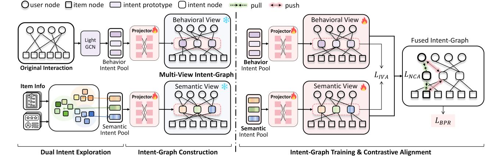
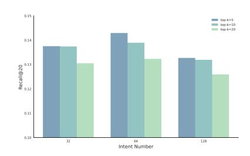
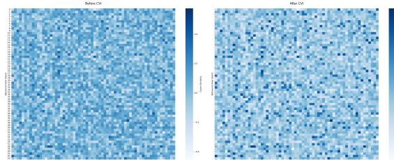
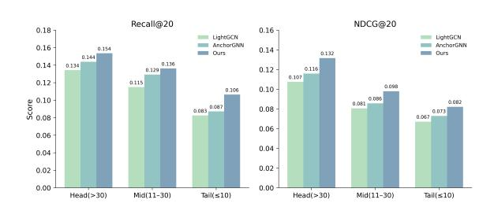

# IACLR: Intention Alignment via Contrastive Learning for Bipartite Graph Recommendation

[Huiying Hu](https://orcid.org/0009-0004-0990-1232) hhy2024@pku.edu.cn Wangxuan Institute of Computer Technology, Peking University Beijing, China

[Tuo Wang](https://orcid.org/0009-0004-2111-6173) tuowang25@stu.pku.edu.cn Wangxuan Institute of Computer Technology, Peking University Beijing, China

[Yixiao Zhou](https://orcid.org/0000-0002-6142-5956) chnzyx@pku.edu.cn Wangxuan Institute of Computer Technology, Peking University Beijing, China

[Xiaoqing Lyu](https://orcid.org/0000-0003-2354-7749) lvxiaoqing@pku.edu.cn Wangxuan Institute of Computer Technology, Peking University Beijing, China

# Abstract

Despite the success of Graph Neural Networks (GNNs) in modeling recommender systems as bipartite graphs, their ability to capture diverse user-item relations remains limited by the sparsity of observed interactions, which fails to reveal the underlying latent intents. We propose IACLR (Intention Alignment via Contrastive Learning for bipartite graph Recommendation), a framework that constructs an Intent-Graph by augmenting the bipartite recommendation graphs with an implicit intent layer. Instead of relying solely on observed edges, IACLR introduces a set of intent nodes that bridge users and items through shared semantic and behavioral patterns. These nodes are used to construct an Intent-Graph, where they act as both intermediaries that enrich structural connectivity and global anchors that summarize latent user interests. Within this graph, IACLR performs contrastive alignment across multiple data views and enforces consistency among users, intents, and items, thereby enhancing robustness under data sparsity. Experiments on benchmark datasets (e.g., Amazon-books and Yelp) demonstrate that IACLR consistently outperforms strong graph-based, revealing its effectiveness in capturing fine-grained user–item relationships and integrating multi-faceted signals. The framework is applicable to various recommendation scenarios, including academic paper recommendations, e-commerce, and content platforms.

# CCS Concepts

• Information systems → Recommender systems; Collaborative filtering; • Computing methodologies → Learning latent representations; Learning to rank.

# Keywords

Bipartite Graphs Recommendation; Intent-Based Recommendation; Graph Contrastive Learning

[This work is licensed under a Creative Commons Attribution 4.0 International License.](https://creativecommons.org/licenses/by/4.0) WWW '26, Dubai, United Arab Emirates. © 2026 Copyright held by the owner/author(s). ACM ISBN 979-8-4007-2307-0/2026/04 <https://doi.org/10.1145/3774904.3792160>

#### ACM Reference Format:

Huiying Hu, Tuo Wang, Yixiao Zhou, and Xiaoqing Lyu. 2026. IACLR: Intention Alignment via Contrastive Learning for Bipartite Graph Recommendation. In Proceedings of the ACM Web Conference 2026 (WWW '26), April 13–17, 2026, Dubai, United Arab Emirates. ACM, New York, NY, USA, [10](#page-9-0) pages.<https://doi.org/10.1145/3774904.3792160>

# 1 Introduction

Bipartite graphs are the foundation of modern recommender systems, where users and items form two disjoint node sets connected by observed interactions. Graph neural networks (GNNs) have become the dominant paradigm for this setting, as they propagate information along edges to refine representations of users and items. Despite their success, bipartite recommendation graphs are intrinsically sparse: each user typically interacts with only a tiny fraction of items, and each item is exposed to only a limited audience. This sparsity restricts the ability to capture diverse user–item relations, especially in long-tail or cold-start scenarios. A more underlying reason for this limitation is that information flow in bipartite graphs is locked within two partitions (users and items) and cannot fully expose the latent preference factors and relationships that underlie interactions.

Recent works attempt to alleviate these challenges by introducing global representations. For example, memory-augmented GNNs inject global matrices as shortcuts for information sharing [\[11\]](#page-8-0), but often assume a small set of static interests, oversimplifying real user intent. Prototype-based contrastive learning methods model intent through cluster assignments [\[4,](#page-8-1) [18\]](#page-8-2), yet typically bind each user to a single prototype, underestimating the multi-faceted nature of preferences. More recently, LLM-based recommenders [\[5,](#page-8-3) [16\]](#page-8-4) explicitly generate intent descriptions from text. While they offer semantic richness, they are expensive to run at scale, rely on handcrafted prompts, and risk producing inconsistent or redundant intent spaces.

To fundamentally address the sparsity challenge and capture multi-faceted latent intents, we propose IACLR (Intention-ALignment via Contrastive Learning for Bipartite Graph Recommendation), a framework that transforms the bipartite graph into a new Intent-Graph by integrating an implicit intent space. This approach is designed to uncover the latent relational structures between users,

items, and implicitly inferred intents, and to integrate evidence from both behavioral interactions and semantic content within a unified graph-based learning paradigm. Our framework is broadly applicable to recommendation tasks across domains, such as academic paper recommendations, e-commerce, and so on.

To implement the proposed framework, IACLR consists of three modules: (1) Dual Intent Exploration derives latent intent prototypes from behavioral and semantic signals, revealing diverse intent factors beyond direct interactions; (2) Multi-View Intent-Graph Construction and Propagation builds on these prototypes to reconstruct the bipartite topology, linking users and items through latent intents and performing gated message passing to improve representations under sparse conditions; (3) Contrastive Alignment aligns heterogeneous intent views and enforces semantic consistency among users, intents, and items, yielding coherent and robust representations.

Our contributions are three-fold:

- We propose IACLR, a novel intent-aware contrastive learning framework that augments the user–item bipartite graph with an implicit intent layer, enabling richer connectivity and multi-faceted preference modeling.
- We design a principled multi-view Intent-Graph that integrates behavioral and semantic prototypes through adaptive sparse connections, supported by gated propagation and adapter pretraining.
- We introduce contrastive alignment mechanism that harmonizes cross-view intents and enforces user–intent–item coherence, leading to consistent improvements in recommendation accuracy and robustness under sparse, long-tail, and cold-start conditions.

Experiments on benchmark datasets (e.g., Amazon and Yelp) demonstrate that IACLR consistently outperforms state-of-the-art graphbased recommenders, achieving significant gains in both accuracy and robustness. Analyses also reveal that IACLR brings substantial improvements for users with sparse interactions and for long-tail items, validating the effectiveness of our intent-aware approach in tackling the fundamental sparsity challenge.

# 2 Related Works

# 2.1 Graph based Recommendation

Graph neural networks (GNNs) have become the dominant paradigm for collaborative filtering by treating user–item interactions as a bipartite graph. Representative methods such as NGCF [\[15\]](#page-8-5) and LightGCN [\[7\]](#page-8-6) refine node representations by propagating embeddings along high-order neighbors, with LightGCN streamlining the architecture for efficiency. Subsequent works extend this line by injecting additional structures or signals: GraphPro [\[20\]](#page-8-7) incorporates prompt-based modules to adapt pre-trained GNNs, PUP [\[27\]](#page-8-8) and IRGPR [\[10\]](#page-8-9) design heterogeneous graphs to integrate side information such as prices or item relations. These methods demonstrate the flexibility of graph-based recommendation, yet they all remain bound to the two-partition structure of bipartite graphs, where information can only be propagated through observed or featureaugmented user–item edges.

Beyond these standard designs, a growing body of work explores augmenting recommendation graphs with a set of global representations, often referred to as memory slots, anchor nodes, or prototypes. These vectors serve as shared abstractions that capture recurring preference patterns beyond individual interactions. For example, Memory-augmented MA-GNN [\[11\]](#page-8-0) maintain key–value memory units to capture long-term user interests from sequences, while ICLRec [\[4\]](#page-8-1) represents users through intent embeddings derived from clustering behavioral sequences. AnchorGNN [\[19\]](#page-8-10) leverage a small set of anchor nodes to induce global–local embeddings. CGSL [\[18\]](#page-8-2) learns semantic prototypes via Bayesian non-parametric clustering to mitigate sampling bias in contrastive learning, while IRLLRec [\[16\]](#page-8-4) leverage LLMs to introduce textual and interactionbased intent vectors in addition to the base embedding of each node. Despite their differences, these approaches typically assume a fixed or single-intent assignment, which restricts their ability to capture the multi-faceted nature of user preferences. Moreover, they seldom leverage semantic side information, leaving their learned prototypes vulnerable to noise and less interpretable.

# 2.2 Graph Contrastive Learning

Inspired by advances in self-supervised representation learning, Graph contrastive learning (GCL) has recently been shown to be highly effective in recommendation and beyond [\[21,](#page-8-11) [28\]](#page-8-12). The core idea is to maximize agreement between embeddings of augmented graph views, thereby improving robustness and alleviating data sparsity. For example, GRACE [\[28\]](#page-8-12) enforces node-level consistency across random perturbations, while BGRL [\[14\]](#page-8-13) eliminates explicit negatives for scalability, and SimGCL [\[22\]](#page-8-14) discards graph augmentations and instead adds uniform noises to embeddings, achieving superior performance with higher efficiency.

However, the majority of GCL methods above have been developed for general graphs, with relatively limited work tailored to the bipartite structures that underlie recommender systems. A few specialized designs have been proposed to address this gap. BiGI [\[2\]](#page-8-15) introduced a mutual-information–driven objective that explicitly leverages the bipartite nature of recommendation graphs. More recently, SBGCL [\[26\]](#page-8-16) enhances robustness by contrasting across both inter-set and intra-set relations, while RecDCL [\[23\]](#page-8-17) proposes a dual contrastive learning framework that jointly augments users and items. Despite these advances, existing methods largely focus on refining user–item embeddings within the observed two-partition structure, without introducing an additional layer of abstraction such as shared intent representations. This leaves open the opportunity to complement bipartite graphs with latent prototypes that serve as implicit mediators of preference signals.

# 2.3 LLM-enhanced Graph Recommendation

Another emerging research direction leverages large language models (LLMs) to enhance recommender systems. Some works directly align recommendation tasks with natural language and leverage LLMs to generate results based on candidate sets provided by graphbased recommenders. [\[5\]](#page-8-3) reformulates user profiles and historical interactions into textual prompts, allowing LLMs to produce conversational recommendations, while [\[9\]](#page-8-18) integrates in-context examples into interaction sequences for improved ranking. [\[24,](#page-8-19) [25\]](#page-8-20) fine-tune LLMs with recommendation data to better adapt them to graph-structured input. For instance, P5 [\[6\]](#page-8-21) transforms user–item interaction graphs into text sequences for pre-training, whereas

InstructRec [\[24\]](#page-8-19) employs task-specific instructions to guide LLMbased recommendation generation.

In addition to directly generating recommendations, another line of work leverages LLMs for graph-level data augmentation. RLMRec [\[12\]](#page-8-22) and CORONA [\[3\]](#page-8-23) enriches graph recommenders with synthetic user profiles generated by LLMs, and LLMRec [\[17\]](#page-8-24) incorporates multi-modal content (e.g., text and images) into the interaction graph for improved representation learning.

From the perspective of intent-based modeling, existing approaches can be broadly grouped into two categories. The first is global intent modeling, where a small number of shared prototypes or memory slots serve as universal anchors for information propagation. The second is finer-grained, personalized intent modeling, which assigns user- or item-specific intent information. Viewed through this lens, some recent LLM-based recommenders can also be regarded as personalized intent models, which explicitly extend each user or item with natural-language descriptions to discover potential interests.

While the aforementioned approaches have made significant progress in intent-aware recommendation, they are subject to several common limitations. Some model intents in an overly shallow manner (e.g., binding each user to a single intent) without fully capturing the structural relations among users, items, and intents, some neglect semantic signals and rely only on sparse interaction patterns. Although LLM-based recommenders are semantically expressive, they are costly to scale and may produce redundant or noisy spaces. Hence, one of the key challenge is to model latent intents in a way that both uncovers their relations with users and items for effective message passing, and flexibly integrates structural and semantic information without excessive manual intervention.

### 3 Method

IACLR aims to address the restricted two-partition flow of information and the difficulty of capturing multi-faceted latent intents in recommendation tasks. We build on the standard paradigm of bipartite graph-based recommendation, which considers a user–item graph G = (U, V, E), where U and V denote the sets of users and items, and each edge (��, ��) ∈ E indicates an observed interaction. The goal is to predict unobserved interactions by learning user and item embeddings through message passing along observed edges, typically optimized with ranking-based objectives.

IACLR augments the traditional user–item bipartite graph framework with an implicit intent layer and a contrastive alignment mechanism. Specifically, our framework introduces three key modules on top of the traditional pipeline, as shown in Figure [1:](#page-3-0) (1) Dual Intent Exploration (Sec. [3.1\)](#page-2-0), which constructs a pool of latent intent prototypes from both behavioral interactions and semantic side information; (2) Multi-View Intent-Graph Construction and Propagation (Sec. [3.2-](#page-2-1) [3.3\)](#page-3-1), which integrates these prototypes as adaptive intent nodes and connects them to users and items via sparse attention-based edges, and enables gated message passing between users, items, and intents, with an adapter pretraining step to stabilize optimization; (3) Contrastive Alignment (Sec. [3.4\)](#page-4-0), which harmonizes heterogeneous intent views and enforces coherent user–intent–item relations through contrastive objectives. Empirical results show that these designs significantly enhance model robustness under long-tail and cold-start conditions.

### 3.1 Dual Intent Exploration

Motivated by the perspective that users select items under different intents, we construct a dual-perspective intent pool from two complementary sources of item-related information. The pool contains latent intent prototypes that uncover and categorize latent itemrelated characteristics, later serving as candidates from which users may "select" during interaction.

Behavioral Intent. The behavioral intent pool derive latent intents from interaction patterns. We first train LightGCN on the vanilla user–item bipartite graph for ���� iterations (i.e., without the intent layer) to obtain stabilized behavioral embeddings:

h (��) �� = e (���� ) �� , h (��) �� = e (���� ) (1)

These embeddings are clustered to {C(��) 1 , C (��) , ..., C (��) �� } using kmeans [\[1\]](#page-8-25), and each centroid C (��) �� is stored as a behavioral prototype :

p (��) �� = 1 |C(��) �� ∑︁ �� ∈ C(��) h (��) �� . (2)

Semantic Intent. The semantic intent pool derives intents from textual side information associated with items. For each item ��, we collect its textual materials such as title, category, and description, and encode them using a pretrained language model (e.g., Sentence-BERT), resulting in semantic embeddings. Note that we utilize only the raw textual fields already provided by the datasets and the encoding is without any fine-tuning. Thus, IACLR operates under the same assumption as common GNN baselines that incorporate side information. We then cluster these embeddings into �� clusters {C(�� ) 1 , C (�� ) 2 , . . . , C (�� ) �� } using k-means. Each semantic intent prototype ���� is initialized as the centroid of its cluster C (�� ) �� :

p (�� ) �� = 1 |C(�� ) �� ∑︁ ��∈ C(��) �� ��T(text(��)) . (3)

where ��T(·) denotes the text encoder that converts item/user textual descriptions into semantic embeddings.

Together, the behavioral and semantic prototypes form the dualperspective intent pool Z.

#### 3.2 Multi-View Intent-Graph Construction

Building upon the dual intent above, we construct the Intent-Graph via augmenting the original user–item graph G with behavioral and semantic intent nodes.

3.2.1 Intent-Graph Formation. To make the intent pool usable in downstream propagation, we introduce an adapter that maps the prototypes into graph-compatible nodes. The adapter �� is a lightweight linear transformation: z�� = �� (p�� ). The adapter converts the dual-perspective intent pool into two corresponding sets of intent nodes, which are respectively integrated into the graph to form two parallel structures collectively referred to as the multiview Intent-Graph. Each view instantiates an intent-graph Gˆ = (U, V, Z, E��,��, E��,�� ). Here, the intent pool {p�� } serves as a set of

Table 1: Overall performance comparison on three datasets. Best results in bold.

| Model        | Recall@20 | Amazon-Book NDCG@20 | Recall@20 | Yelp2018 NDCG@20 | Recall@20 | Steam NDCG@20 |
|--------------|-----------|---------------------|-----------|------------------|-----------|---------------|
| NGCF         | 0.1040    | 0.0887              | 0.0884    | 0.0700           | 0.1039    | 0.0799        |
| LightGCN     | 0.1259    | 0.0914              | 0.0964    | 0.0768           | 0.1129    | 0.0848        |
| SimGCL       | 0.1304    | 0.0974              | 0.1043    | 0.0829           | 0.1205    | 0.0924        |
| RecDCL       | 0.1373    | 0.0997              | 0.1125    | 0.0854           | 0.1256    | 0.0959        |
| ICLRec       | 0.1057    | 0.0757              | 0.0848    | 0.0679           | 0.0975    | 0.0694        |
| AnchorGNN    | 0.1316    | 0.0965              | 0.1078    | 0.0849           | 0.1218    | 0.0929        |
| CGSL         | 0.1343    | 0.0995              | 0.1073    | 0.0859           | 0.1228    | 0.0932        |
| IACLR (ours) | 0.1429    | 0.1072              | 0.1185    | 0.0873           | 0.1275    | 0.0982        |

### 4 Experiments

We conduct extensive experiments to answer the following research questions: RQ1: How does IACLR perform compared with state-ofthe-art baselines on standard top-�� recommendation metrics? RQ2: What is the contribution of each component (2 views of intent pool, gated mechanism, IVA, NCA) in IACLR? RQ3: How does IACLR perform under different key hyperparameter settings (e.g., intent pool size, number of views, or IVA regularization strength)? RQ4: How does IACLR perform under varying degrees of data sparsity? RQ5: How does IVA shape the alignment between behavioral and semantic intents?

# 4.1 Experimental Settings

4.1.1 Datasets. We evaluate IACLR on widely used public benchmarks, and the statistics overview are summarized in Table [2.](#page-5-0)

Table 2: Statistics of the datasets.

| Dataset      | #Users | #Items | #Interactions |   |    | Density |     |
|--------------|--------|--------|---------------|---|----|---------|-----|
| Amazon-Books | 11,000 | 9,332  | 200,860       | 1 | 96 | × 10    | − 3 |
| Yelp2018     | 11,091 | 11,010 | 277,535       | 2 | 27 | × 10    | − 3 |
| Steam        | 22,310 | 5,237  | 525,922       | 4 | 31 | × 10    | − 3 |

- Yelp2018: a user–business interaction dataset widely used in graph recommendation works.
- Amazon-Book: a popular subset of the Amazon review corpus, containing book review records.
- Steam: a dataset of electronic games consisting textual feedbacks of users on the Steam Platform.

Each dataset is randomly split into training/validation/test with a ratio of 80/10/10. We adopt the standard metrics: Recall@K and NDCG@K and we set �� = 20. All results are averaged over 5 runs with different random seeds.

4.1.2 Baselines. We compare IACLR with representative baselines from three perspectives: classical graph collaborative filtering models, graph contrastive learning methods, and intent/prototypebased approaches. This ensures coverage of both foundational paradigms and recent advances.

- Traditional GCN-based Recommenders:NGCF and Light-GCN are representative GNN-based collaborative filtering models that leverage high-order neighbor propagation on the user–item graph, without external signals.
- Graph Contrastive Learning (GCL): SimGCL is widely recognized representatives that perform contrastive learning with graph augmentations. RecDCL is a recent dynamic contrastive method specifically designed for bipartite graphs, which jointly augments users and items to improve recommendation accuracy.
- Intent/Prototype-based Models: Among the intent-aware models discussed in Section [2,](#page-1-0) we compare against ICLRec, AnchorGNN and CGSL. To ensure a fair comparison between mothods leveraging only the raw textual information in the dataset, we exclude methods like IRLLRec and other LLMenhanced approaches, which typically yields higher accuracy at a higher inference cost.

Since these graph-based baselines do not natively leverage textual information, we augment their node features with text encodings derived from the same textual data as in our model to ensure a fair comparison, by using the same SBERT model (consistent with IACLR).

# 4.2 Overall Performance (RQ1)

To answer RQ1, we conduct experiments with results shown in Table [1.](#page-5-1) IACLR ranks first on all metrics. On Yelp, IACLR improves Recall@20 by 5.3% compared with the strongest baseline, while on Amazon it achieves the highest NDCG@20 with an 7.5% gain. Compared with traditional graph approaches and GCL methods, the gains can be attributed to the intent mediated structure that alleviates data sparsity. Compared with prototype or intent-based methods, IACLR benefits from multi-view pooling that captures complementary semantics beyond a single representation. These results demonstrate that augmenting bipartite graphs with intent nodes provides consistent improvements across domains, confirming the effectiveness of the proposed framework.

# 4.3 Ablation Study (RQ2)

Table [3](#page-6-0) reports ablation results by incrementally removing or replacing key modules in IACLR.

Table 3: Ablation study on Amazon-Book.

| Variant |             | Recall@20 NDCG@20                |
|---------|-------------|----------------------------------|
| (a)     | Intent      | Views                            |
| IACLR   | w/o         | Semantic View 0.13067 0.09612    |
| IACLR   | w/o         | Behavioral View 0.13294 0.10081  |
| (b)     | Training    | Mechanisms                       |
| IACLR   | w/o         | Adapter Pretrain 0.13039 0.10045 |
| IACLR   | w/o         | Gated Mechanism 0.13743 0.10139  |
| (c)     | Contrastive | Modules                          |
| IACLR   | w/o         | IVA & NCA 0.13520 0.10188        |
| IACLR   | w/o         | IVA 0.13821 0.10245              |
| IACLR   | w/o         | NCA 0.13794 0.10281              |
| IACLR   | (full)      | 0.14286 0.10722                  |

Each component contributes to the final performance. Removing any of the intents views leads to a drop around 7% in Recall@20, indicating that different views provide complementary information. Without gated mechanism in propagation and adapter training, results of average fusion degrade on both Recall and NDCG, suggesting that adaptively controlling the user–intent–item interaction is essential for stable training. Finally, removing the contrastive alignment term leads to a consistent decline across datasets, confirming that cross-view consistency enhances representation robustness. These results verify that each design choice plays an important role, and removing any of them leads to notable performance degradation.

# 4.4 Hyper-parameter Sensitivity Analysis (RQ3)

To examine the performance of IACLR with respect to key hyperparameters, we further conduct a sensitivity analysis on two major design factors: the number of selected top-�� intents for each user and the total number of intent nodes (per view), denoted by ��. The results on the Amazon-Book dataset are summarized in Figure [2.](#page-6-1) We observe that the optimal configuration occurs at top-M = 5 and �� = 64, under which IACLR achieves the best overall Recall@20. As �� increases, performance gradually declines, suggesting that introducing too many candidate intents per user (or item) may inject noise and lead to over-fragmented representations of intent distributions. This aligns with the intuition that each user typically exhibits a limited number of dominant preferences in practice, and excessive intent partitions dilute these signals. Similarly, a moderate total number of intent nodes per view (�� = 64) strikes a balance between representation expressiveness and the risk of over-fragmentation or overfitting, while overly large �� (e.g., 128) brings limited gains or even slight degradation. These findings confirm that IACLR is relatively stable across a reasonable parameter range, and that a compact intent representation with a small number of dominant intent clusters per user and a moderate number of intent nodes per view is sufficient to capture meaningful user–item relationships.

# 4.5 Effectiveness under User-side Sparsity (RQ4)

We investigate how IACLR addresses the data sparsity challenge, a fundamental limitation of bipartite recommendation graphs. Users

Figure 2: Sensitivity analysis on top-�� intents and intent pool size (��).

in the training set are partitioned into five groups according to their node degree (i.e., number of observed interactions):

- B1: Users with exactly 1 interaction (��train = 1)
- B2: Users with 2–5 interactions (2 ≤ ��train ≤ 5)
- B3: Users with 6–10 interactions (6 ≤ ��train ≤ 10)
- B4: Users with 11–20 interactions (11 ≤ ��train ≤ 20)
- B5: Users with more than 20 interactions (��train &gt; 20)

This stratification enables us to assess model performance across the full sparsity spectrum, from near cold-start (B1) to highly active users (B5). We report Recall@20 and NDCG@20 for each bucket on Amazon-Book. Table [4](#page-6-2) reveals three key observations. First, IACLR achieves the highest Recall@20 for users with 2–5 interactions (B2), exceeding the overall average of 0.1429 and demonstrating strong generalization under mild sparsity. This value also outperforms the best baseline method on B2 (CGSL or RecDCL), whose Recall@20 ranges from about 0.128 to 0.135, by approximately 11%. Second, even users with only a single interaction (B1) attain 0.1431 Recall@20, surpassing the strongest baseline (CGSL and AnchorGNN) on B1 – which achieves a Recall@20 between approximately 0.115 and 0.120 – by over 19%. highlighting that the intent pool effectively serves as a latent bridge between sparse users and relevant items. As user interaction density increases, the performance gap between IACLR and baselines narrows. Nevertheless, IACLR maintains a consistent lead across all buckets, including high-activity users in B5. These results suggests that implicit intents contribute most when direct behavioral evidence is limited, while dense historical signals already provide sufficient information for recommendation.

Table 4: Performance analysis by user interaction density in training set.

|    | Degree | #Users | Recall@20 | NDCG@20 |
|----|--------|--------|-----------|---------|
| B1 | 1      | 145    | 0.1431    | 0.1044  |
| B2 | 2–5    | 3,486  | 0.1486    | 0.0978  |
| B3 | 6–10   | 4,261  | 0.1417    | 0.1047  |
| B4 | 11–20  | 1,954  | 0.1376    | 0.0842  |
| B5 | 21+    | 1,154  | 0.1351    | 0.0935  |

This trend can be attributed to the role of the intent pool: for sparse users, it introduces additional links to relevant items that are otherwise inaccessible in the bipartite graph, whereas dense users already possess rich interaction histories, leaving less room for further improvement.

Overall, these results confirm that IACLR particularly benefits sparse and near cold-start users, mitigating the limitations of bipartite graphs and underscoring its practical value for cold-start recommendation scenarios.

### 4.6 Effectiveness under Item-side Sparsity (RQ4)

Beyond user-side sparsity, we further examine how IACLR performs across different levels of item popularity to assess its robustness under the long-tail distribution.

Items are divided into three buckets based on their interaction frequency in the training data: Head (��item &gt; 30), Mid (11 ≤ ��item ≤ 30), and Tail (��item ≤ 10). As illustrated in Figure [3,](#page-7-0) IACLR consistently surpasses baselines across all popularity levels, with the largest gains observed in the Tail region where data sparsity is most severe. These improvements highlight IACLR's ability to recover relevant yet infrequent items that are easily overlooked by traditional bipartite models.

The performance mainly stems from two factors. First, by introducing an intent-graph propagation pathway, IACLR enables information flow between semantically related items even when direct user feedback is scarce. Second, the contrastive alignment modules encourage generalization toward rarely interacted items. In contrast, baselines that rely purely on observed co-occurrence signals suffer from limited exposure bias, leading to performance degradation in the long-tail region.

Figure 3: Performance comparison under item-side sparsity.

Overall, the item-side sparsity analysis complements the userside findings: IACLR is not only robust to users with few interactions but also effective at improving the visibility of long-tail items, thereby achieving a better balance between accuracy and coverage in recommendation.

### 4.7 IVA Alignment Visualization (RQ5)

Figure [4](#page-7-1) visualizes the cross-view intent similarity matrices before and after applying IVA. Before alignment, most entries take moderate values, and each row exhibits little variation across intents, suggesting that behavioral intents lack clear correspondence to semantic intents.

After applying IVA, the similarity distribution becomes sparse and structured. Each behavioral intent aligns with a small number of semantic intents with high similarity, while the rest show consistently lower values. This indicates that IVA promotes sharper and more selective cross-view associations. These observations confirm the effect of the IVA loss: by regularizing similarity distributions

rather than enforcing rigid prototype matching, it harmonizes behavioral and semantic intents and facilitates consistent cross-view correspondence.

Figure 4: Cross-view intent similarity matrices before and after applying IVA.

### 5 Conclusion

In this paper, we proposed IACLR, a framework that enhances bipartite recommendation graphs by introducing an implicit intent space via a multi-view Intent-Graph. This design enriches structural connectivity and enables effective information propagation beyond sparse interactions, jointly capturing diverse yet coherent user intents. The approach shows strong potential across various domains, such as e-commerce, content platforms, and academic paper recommendation systems. Comprehensive experiments demonstrate that IACLR consistently outperforms the baselines and excels under sparse and cold-start conditions. For example, in paper recommendation scenarios, IACLR can be applied to effectively connect researchers to relevant papers even with limited reading history by leveraging latent research intents derived from textual and behavioral signals.

Looking forward, several challenging directions warrant further investigation in intent-aware recommendation systems. First, the dynamic evolution of user intents over time remains largely unexplored—developing incremental intent discovery mechanisms that adapt to changing preferences could significantly enhance long-term recommendation quality. Second, as real-world platforms increasingly feature multi-modal content (videos, images, audio), extending the intent paradigm to effectively fuse heterogeneous signals while maintaining computational efficiency presents both an opportunity and challenge. Finally, bridging the semantic gap between implicit intent representations and explicit userunderstandable concepts could unlock new possibilities for explainable recommendation, enabling systems to not only predict but also meaningfully justify their suggestions to end users.

# Acknowledgments

This work is supported by the projects of Beijing Nova Interdisciplinary Program (20240484647) and National Natural Science Foundation of China (No. 62376012), which is also a research achievement of Key Laboratory of Science, Technology and Standard in Press Industry (Key Laboratory of Intelligent Press Media Technology).

### References

[1] David Arthur and Sergei Vassilvitskii. 2006. k-means++: The advantages of careful seeding. Technical Report. Stanford. [2] Jiangxia Cao, Xixun Lin, Shu Guo, Luchen Liu, Tingwen Liu, and Bin Wang. 2021. Bipartite graph embedding via mutual information maximization. In Proceedings of the 14th ACM international conference on web search and data mining. 635–643. [3] Junze Chen, Xinjie Yang, Cheng Yang, Junfei Bao, Zeyuan Guo, Yawen Li, and Chuan Shi. 2025. CORONA: A Coarse-to-Fine Framework for Graph-based Recommendation with Large Language Models. In Proceedings of the 48th International ACM SIGIR Conference on Research and Development in Information Retrieval. 2048–2058. [4] Yongjun Chen, Zhiwei Liu, Jia Li, Julian McAuley, and Caiming Xiong. 2022. Intent contrastive learning for sequential recommendation. In Proceedings of the ACM web conference 2022. 2172–2182. [5] Yunfan Gao, Tao Sheng, Youlin Xiang, Yun Xiong, Haofen Wang, and Jiawei Zhang. 2023. Chat-rec: Towards interactive and explainable llms-augmented recommender system. arXiv preprint arXiv:2303.14524 (2023). [6] Shijie Geng, Shuchang Liu, Zuohui Fu, Yingqiang Ge, and Yongfeng Zhang. 2022. Recommendation as language processing (rlp): A unified pretrain, personalized prompt & predict paradigm (p5). In Proceedings of the 16th ACM conference on recommender systems. 299–315. [7] Xiangnan He, Kuan Deng, Xiang Wang, Yan Li, Yongdong Zhang, and Meng Wang. 2020. Lightgcn: Simplifying and powering graph convolution network for recommendation. In Proceedings of the 43rd International ACM SIGIR conference on research and development in Information Retrieval. 639–648. [8] Geoffrey Hinton, Oriol Vinyals, and Jeff Dean. 2015. Distilling the knowledge in a neural network. arXiv preprint arXiv:1503.02531 (2015). [9] Yupeng Hou, Junjie Zhang, Zihan Lin, Hongyu Lu, Ruobing Xie, Julian McAuley, and Wayne Xin Zhao. 2024. Large language models are zero-shot rankers for recommender systems. In European Conference on Information Retrieval. Springer, 364–381. [10] Weiwen Liu, Qing Liu, Ruiming Tang, Junyang Chen, Xiuqiang He, and Pheng Ann Heng. 2020. Personalized Re-ranking with Item Relationships for Ecommerce. In Proceedings of the 29th ACM International Conference on Information & Knowledge Management. 925–934. [11] Chen Ma, Liheng Ma, Yingxue Zhang, Jianing Sun, Xue Liu, and Mark Coates. 2020. Memory augmented graph neural networks for sequential recommendation. In Proceedings of the AAAI conference on artificial intelligence, Vol. 34. 5045–5052. [12] Xubin Ren, Wei Wei, Lianghao Xia, Lixin Su, Suqi Cheng, Junfeng Wang, Dawei Yin, and Chao Huang. 2024. Representation learning with large language models for recommendation. In Proceedings of the ACM web conference 2024. 3464–3475. [13] Steffen Rendle, Christoph Freudenthaler, Zeno Gantner, and Lars Schmidt-Thieme. 2012. BPR: Bayesian personalized ranking from implicit feedback. arXiv preprint arXiv:1205.2618 (2012). [14] Shantanu Thakoor, Corentin Tallec, Mohammad Gheshlaghi Azar, Rémi Munos, Petar Veličković, and Michal Valko. 2021. Bootstrapped representation learning on graphs. In ICLR 2021 workshop on geometrical and topological representation learning. [15] Xiang Wang, Xiangnan He, Meng Wang, Fuli Feng, and Tat-Seng Chua. 2019. Neural graph collaborative filtering. In Proceedings of the 42nd international ACM SIGIR conference on Research and development in Information Retrieval. 165–174. [16] Yu Wang, Lei Sang, Yi Zhang, and Yiwen Zhang. 2025. Intent representation learning with large language model for recommendation. In Proceedings of the 48th International ACM SIGIR Conference on Research and Development in Information Retrieval. 1870–1879. [17] Wei Wei, Xubin Ren, Jiabin Tang, Qinyong Wang, Lixin Su, Suqi Cheng, Junfeng Wang, Dawei Yin, and Chao Huang. 2024. Llmrec: Large language models with graph augmentation for recommendation. In Proceedings of the 17th ACM international conference on web search and data mining. 806–815. [18] Mi Wen, Hongwei Wang, Weiwei Li, Zizhu Fan, and Xiaoqing Yu. 2025. Contrastive Graph Semantic Learning via prototype for recommendation. Information Sciences 699 (2025), 121799. [19] Xueyi Wu, Yuanyuan Xu, Wenjie Zhang, and Ying Zhang. 2023. Billion-scale bipartite graph embedding: A global-local induced approach. Proceedings of the VLDB Endowment 17, 2 (2023), 175–183. [20] Yuhao Yang, Lianghao Xia, Da Luo, Kangyi Lin, and Chao Huang. 2024. Graphpro: Graph pre-training and prompt learning for recommendation. In Proceedings of the ACM Web Conference 2024. 3690–3699. [21] Yuning You, Tianlong Chen, Yongduo Sui, Ting Chen, Zhangyang Wang, and Yang Shen. 2020. Graph contrastive learning with augmentations. NeurIPS 33 (2020), 5812–5823. [22] Junliang Yu, Hongzhi Yin, Xin Xia, Tong Chen, Lizhen Cui, and Quoc Viet Hung Nguyen. 2022. Are graph augmentations necessary? simple graph contrastive learning for recommendation. In Proceedings of the 45th international ACM SIGIR conference on research and development in information retrieval. 1294–1303. [23] Dan Zhang, Yangliao Geng, Wenwen Gong, Zhongang Qi, Zhiyu Chen, Xing Tang, Ying Shan, Yuxiao Dong, and Jie Tang. 2024. Recdcl: Dual contrastive learning for recommendation. In Proceedings of the ACM Web Conference 2024. 3655–3666. [24] Junjie Zhang, Ruobing Xie, Yupeng Hou, Xin Zhao, Leyu Lin, and Ji-Rong Wen. 2025. Recommendation as instruction following: A large language model empowered recommendation approach. ACM Transactions on Information Systems 43, 5 (2025), 1–37. [25] Yang Zhang, Keqin Bao, Ming Yan, Wenjie Wang, Fuli Feng, and Xiangnan He. 2024. Text-like encoding of collaborative information in large language models for recommendation. arXiv preprint arXiv:2406.03210 (2024). [26] Zeyu Zhang, Jiamou Liu, Kaiqi Zhao, Song Yang, Xianda Zheng, and Yifei Wang. 2023. Contrastive learning for signed bipartite graphs. In Proceedings of the 46th International ACM SIGIR Conference on Research and Development in Information Retrieval. 1629–1638. [27] Yu Zheng, Chen Gao, Xiangnan He, Yong Li, and Depeng Jin. 2020. Price-aware recommendation with graph convolutional networks. In 2020 IEEE 36th International Conference on Data Engineering (ICDE). IEEE, 133–144. [28] Yanqiao Zhu, Yichen Xu, Feng Yu, Qiang Liu, Shu Wu, and Liang Wang. 2020. Deep graph contrastive representation learning. arXiv preprint arXiv:2006.04131 (2020). A Appendix A.1 Implementation Details We implement IACLR in PyTorch and optimize all models using the Adam optimizer with a learning rate of 10−3 . The embedding dimension is set to 64, the number of GCN propagation layers �� = 3, and the batch size to 4096. The raw textual fields are encoded using SBERT model ("all-MiniLM-L6-v2"). For intent modeling, we vary the intent dimension and the top-�� selection across {32, 64, 128} and {5, 10, 20} respectively, and analyze their impact on model performance in Section [4.4.](#page-6-3) The LightGCN backbone is first pretrained for ���� = 50 epochs to obtain stable behavioral embeddings, followed by 10 epochs of adapter pretraining. The adapter pretraining uses �� = 0.1 to balance the intent-enhanced reconstruction term. In the contrastive objectives, we set ��1 = 0.001 and ��2 = 0.005 to balance the IVA and NCA losses. The InfoNCE temperature in the NCA loss is ���� = 0.05, while the IVA loss adopts teacher and student temperatures ���� = 0.1 and ���� = 0.07, respectively. Early stopping is applied based on the validation recall. All hyperparameters above are determined through grid search on the validation set. All experiments are conducted on NVIDIA GeForce RTX 4090 GPUs. The code is available at [https://github.com/hhhhhhhhhhhy/IACLR.git.](https://github.com/hhhhhhhhhhhy/IACLR.git) A.2 Complexity Analysis We analyze the computational complexity of IACLR from both time and space perspectives. Let |U|, |V |, and |E | denote the number of users, items, and observed interactions in the original bipartite graph, respectively; �� the number of intent prototypes per view; �� the embedding dimension; and �� the number of propagation layers. Time Complexity. The overall complexity of IACLR can be decomposed into four major components: (1) LightGCN pretraining, which requires O (���� |E |��) operations, identical to standard LightGCN. (2) Intent construction, where clustering introduces an additional O (���� (|U| + |V |)) cost that is incurred only once offline. (3) Intent-graph propagation, the main online computation, where each propagation layer aggregates over user–intent and item–intent edges. Since the sparse Top-�� selection restricts each node to at most �� intent neighbors, the message passing cost is O (��(|U| + |V |)����), which scales linearly with both the graph size and embedding dimension. (4) Contrastive alignment, including IVA and NCA, mainly involves pairwise similarity computations among intents and between users/items and intents. This yields an

additional O (�� 2�� + (|U| + |V |)����) complexity per epoch, which remains tractable given that �� ≪ |V | and �� is small (e.g., �� ≤ 20).

In real training, IACLR is trained in three stages: LightGCN warm-up for 50 epochs, adapter pre-training for 10 epochs, and the main training stage controlled by early stopping. The overall wall-clock training time is approximately 5.6 hours on Amazon-Book (early-stopped at 700 epochs), 2.5 hours on Yelp2018 ( 400 epochs), and 3.1 hours on Steam ( 200 epochs). During the main training stage, the average per-epoch time is around 40–60 seconds on Amazon-Book, 50–80 seconds on Yelp2018, and 100–150 seconds on Steam, depending on evaluation frequency and GPU kernel behavior. Despite introducing additional intent-aware modules, the training efficiency of IACLR remains comparable to baseline methods, with its per-epoch time typically being 2–3 times that of LightGCN yet still falling within the same order of magnitude. Specifically, IACLR's runtime is comparable to or even lower than that of other intent-aware models such as ICLRec, which requires iterative clustering in each epoch, and only about 1.5–2 times that of competitive graph contrastive models such as SimGCL or RecDCL. This efficiency is achieved through sparse Top-M intent selection and lightweight adapter pretraining, which help control the overhead of the multi-view intent graph propagation.

Space Complexity. IACLR maintains user, item, and intent embeddings, along with lightweight adapter parameters, leading to O ( (|U| + |V | + 2��)��) memory usage. No dense pairwise storage is required since all attention operations are computed on-the-fly over sparse intent connections.

Discussion. Overall, IACLR introduces only linear-time overhead with respect to the base LightGCN model. The additional cost arises primarily from the sparse user–intent and item–intent attention, whose sparsity is explicitly controlled by ��. In practice, we observe

that IACLR achieves training efficiency comparable to LightGCN, while significantly improving recommendation quality through intent-level augmentation and contrastive alignment.

### A.3 Performance Comparison with LLM-based methods

It is important to note that while IACLR does not itself incorporate large language models, our approach is not incompatible with LLM-based enhancements. Rather, we specifically focus on investigating the intrinsic value of raw, unprocessed textual data available within the dataset, establishing a distinct and valuable baseline. IACLR relies on the raw textual fields provided by the datasets. In contrast, methods such as IRLLRec and LLMRec rely on enhanced or rewritten text, which introduces extra semantic signals that do not exist in the original data. Directly comparing IACLR with such models would therefore inherently place it at a disadvantage due to the unmatched information access and the larger computational budgets required by LLM-driven pipelines. We conduct comparison experiments for clarifying our position and the trade-offs

IRLLRec and LLMRec require 9-18 hours of training and 10–18 GB GPU memory on the same datasets, because they must first generate or rewrite textual descriptions for every item using large LLMs (∼6-14h) and then train an additional GNN backbone (∼1.5- 6h). Moreover, when using locally deployed smaller LLMs, the text-generation stage generally requires additional computation time and higher memory consumption, which further increases the overall resource cost. In contrast, IACLR only uses the raw textual fields and completes training in 2–6 hours (as shown in Part [A.2\)](#page-8-28) with modest GPU memory usage (5–8 GB), without any LLM-generated signals. We will include these results in the appendix to clearly illustrate both the accuracy differences and the substantial computational trade-offs.