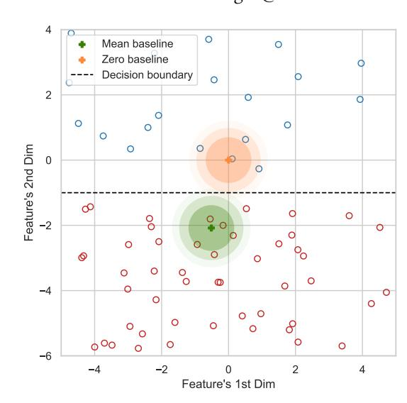
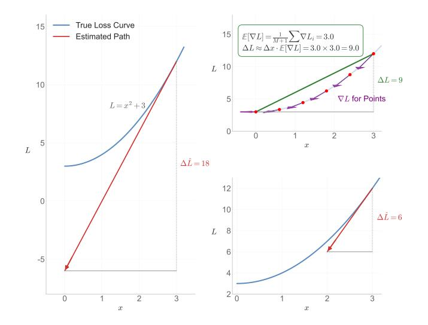
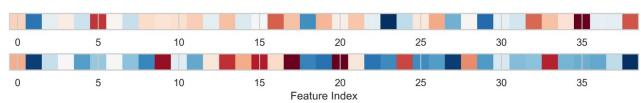
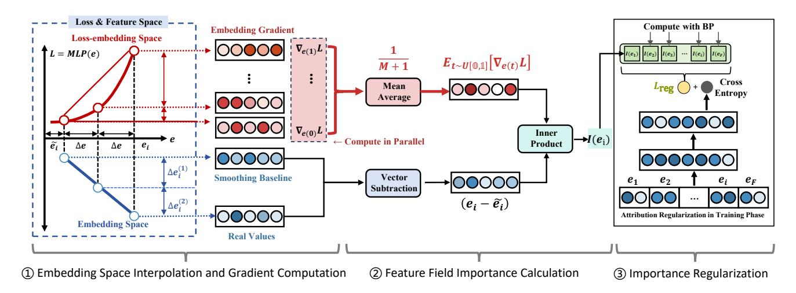
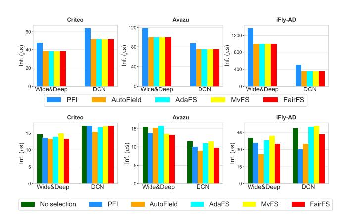
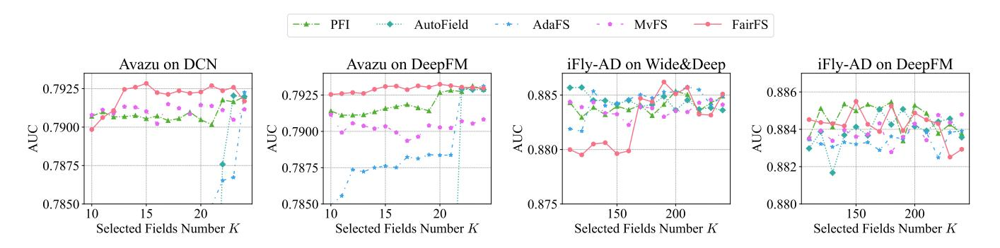
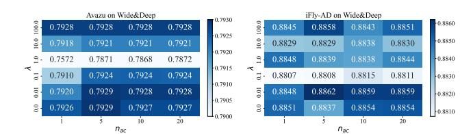
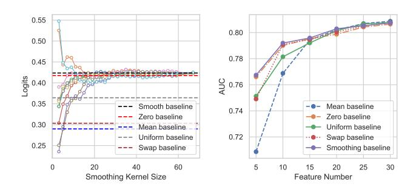

# FairFS: Addressing Deep Feature Selection Biases for Recommender System

Xianquan Wang∗ University of Science and Technology of China Hefei, China wxqcn@mail.ustc.edu.cn

Zhaocheng Du∗ Huawei Noah's Ark Lab Shenzhen, China zhaochengdu@huawei.com

Jieming Zhu Huawei Noah's Ark Lab Shenzhen, China jamie.zhu@huawei.com

Qinglin Jia Huawei Noah's Ark Lab Beijing, China jiaqinglin2@huawei.com

Zhenhua Dong Huawei Noah's Ark Lab Shenzhen, China dongzhenhua@huawei.com

Kai Zhang† University of Science and Technology of China Hefei, China kkzhang08@ustc.edu.cn

# Abstract

Large-scale online marketplaces and recommender systems serve as critical technological support for e-commerce development. In industrial recommender systems, features play vital roles as they carry information for downstream models. Accurate feature importance estimation is critical as it helps find the most useful feature subsets from thousands of feature candidates for online services. With such a selection, optimizing online performance while reducing computation burden is possible. To solve the feature selection problems of deep learning, trainable gate-based and sensitivitybased methods are proposed and proven effective in the industry. Nevertheless, by analyzing real-world examples, we identified three bias issues that make feature importance estimation rely on partial model layers, samples, or gradients to make decisions, ultimately leading to an inaccurate feature importance estimation. We call these biases layer bias, baseline bias, and approximation bias. To mitigate these three biases, we propose FairFS, a fair and accurate feature selection algorithm. On one hand, FairFS directly regularizes feature importance estimated across all non-linear transformational layers to avoid layer bias. On the other hand, it utilizes a smooth baseline feature that is close to the classifier's decision boundary and an aggregated approximation method to mitigate bias issues. Extensive experiments show how FairFS mitigates these three biases and achieves SOTA feature selection results.

### CCS Concepts

• Information systems → Web applications.

### Keywords

Feature Field Selection; CTR Prediction; Online Advertising

# 1 Introduction

Deep neural networks [\[24,](#page-8-0) [35\]](#page-8-1) have become the fundamental backbones of the entire pipeline for recommender systems [\[8,](#page-8-2) [25,](#page-8-3) [26,](#page-8-4) [29,](#page-8-5) [38,](#page-9-0) [48\]](#page-9-1). To provide the input information for the neural network, engineers have to manually construct features that can represent users' and items' characteristics [\[52](#page-9-2)[–54,](#page-9-3) [56\]](#page-9-4). In industry, thousands

Figure 1: Baseline Bias: In imbalanced binary classification, both mean and zero baselines are biased—zero skews toward positive samples, and mean toward negative ones—causing biased feature importance estimates.

of features [\[55\]](#page-9-5) might be built in order to improve their comprehensiveness. Nevertheless, due to two practical issues, these feature columns (a.k.a. feature field, explained in Sec. [A.1\)](#page-9-6) cannot be haphazardly packed into neural networks for online service. One is that the noisy information present in these features will waste the expressive power of neural networks and deteriorate model performance [\[16,](#page-8-6) [32,](#page-8-7) [33\]](#page-8-8). The other is that redundant features lead to higher serving latency [\[2,](#page-8-9) [27,](#page-8-10) [28\]](#page-8-11). Consequently, feature selection turns into a necessary procedure for industrial recommendations.

To perform feature field selection, it is essential to estimate field importance [\[9,](#page-8-12) [10,](#page-8-13) [19,](#page-8-14) [44,](#page-9-7) [45\]](#page-9-8), which measures each feature's contribution to model accuracy [\[18\]](#page-8-15). Traditional methods can be broadly categorized as filter-based (e.g., Person Correlation [\[36\]](#page-9-9), MRMR [\[40\]](#page-9-10)), wrapper-based (RFE [\[5\]](#page-8-16)), and embedded-based (e.g., Lasso [\[12\]](#page-8-17), Xgboost [\[4\]](#page-8-18)) approaches. While filter-based methods rely on statistical measures and wrapper-based methods involve

∗Equal Contribution.

†Corresponding Author.

recursive optimization, embedded-based methods integrate feature selection directly into model training, making them more suitable for capturing complex non-linear relationships in deep learning tasks. In recent years, embedded-based methods have become the dominant approach in deep feature selection research. Detailed classifications and methodologies are discussed in the Related Work section. Based on definitions of feature importance, embeddedbased methods can be further divided into the following two types.

The first is Trainable Gate-based Methods ([\[9,](#page-8-12) [23,](#page-8-19) [47,](#page-9-11) [49\]](#page-9-12)): These methods define feature importance using the absolute values of regularized feature gate parameters, where larger gate values amplify feature signals, highlighting their role in predictions. However, non-linear transformations in subsequent layers can distort this correlation, favoring features with larger initial gate values while neglecting downstream influences. We call it ○1 Layer Bias.

The second is Sensitivity-based Methods ([\[1,](#page-8-20) [31,](#page-8-21) [46,](#page-9-13) [51\]](#page-9-14)): These methods quantify feature importance by measuring the difference in model loss when a feature is informative versus non-informative (baseline feature). The magnitude of this loss difference reflects the feature's contribution to optimization. However, defining the baseline feature remains debated—some use zero embeddings [\[21\]](#page-8-22), while others prefer mean embeddings [\[11\]](#page-8-23). Poor baseline choices can lead to ○2 Baseline Bias, where samples near the baseline are misclassified as non-informative, skewing feature importance estimates (see Figure [1\)](#page-0-0).

Furthermore, in consideration of efficiency in industrial scenarios, modern sensitivity-based methods approximate loss sensitivity with 1 ���� order Taylor approximation. This approximation relies on the assumption of linearity in the loss curve between the baseline feature and the target feature, an assumption that is inherently incorrect. We call this bias as ○3 Approximation Bias.

These three biases—layer bias, baseline bias, and approximation bias—affect the accuracy of feature importance estimation. To address them, we introduce a simple, model-agnostic framework called FairFS (unbiased Feature Importance Regularization). To alleviate the ○1 layer bias, we directly sparsify sensitivity-based feature importance as a loss term, leveraging the loss sensitivity to account for all non-linearities. For the ○2 baseline bias, we establish two principles that non-informative baseline features should meet, from which we derive a closed-form solution and a simplified substitute. Regarding the ○3 approximation bias, we adopt an aggregated approximation strategy, dividing the original approximation into multiple equidistant points, calculating gradient for each one individually, and then combining the results to achieve a more accurate estimation of loss sensitivity. As the number of points approaches infinity, the approximation bias approaches zero. These strategies mitigate the biases inherent in current feature importance estimation algorithms, and FairFS demonstrates state-of-the-art performance in feature selection for recommender systems.

To summarize, our main contributions can be listed as follows:

- We identify and illustrate three kinds of biases (○1 ○2 ○3 ) in current feature importance estimation methods with examples.
- We design a simple and model agnostic framework to mitigate three bias issues mentioned above with theoretical support.
- We have formulated two mathematical principles that a baseline feature should adhere to.

Figure 2: Approximation bias: We examine feature ��'s importance to loss �� = �� 2+3 by measure loss change when switching �� from informative to non-informative (zero). SHARK (left) and SFS (right bottom) have larger approximation error than our aggregated approximation method (right top).

- Extensive experiments on public datasets and one A/B test on industry ads platform have verified the superiority of our method.

The code is available at<https://github.com/xqwustc/FairFS/> for ease of reproduction.

### 2 Related Work

# 2.1 Feature selection for shallow models

Feature selection methods based on interaction paradigms with ML models are categorized into filter-based, wrapper-based, and embedded-based approaches: Filter-based methods determine feature subsets using statistical measures like Pearson Correlation [\[36\]](#page-9-9), MRMR [\[40\]](#page-9-10), or VIF [\[7\]](#page-8-24), without interacting with ML models. They are unsuitable for deep learning tasks due to their inability to capture non-linear relationships. Wrapper-based methods iteratively include or eliminate features using ML models, as seen in RFE [\[5\]](#page-8-16). However, their computational complexity limits their scalability to large datasets. Embedded-based methods, such as Lasso [\[12\]](#page-8-17) and XGBoost [\[4\]](#page-8-18), integrate feature importance estimation into model training. These approaches are well-suited to neural networks, addressing non-linearity despite computational costs. Notably, about 70% of deep feature selection algorithms proposed in the past five years fall into this category. The following subsections detail two subtypes of embedded-based deep feature selection methods.

# 2.2 Trainable Gate-Based Method

These methods assign a trainable gate to each feature field, using the absolute value of the trained gate parameter to determine feature importance—larger values indicate greater importance. Early approaches like LassoNet [\[23\]](#page-8-19) regularized the first weight matrix following the feature and eliminated sparse weights. Later methods, such as Droprank [\[3\]](#page-8-25), STG [\[49\]](#page-9-12), LPFS [\[15\]](#page-8-26), AutoField [\[47\]](#page-9-11),

key advantages over prior works: 1) Non-linear Sensitivity: Unlike AutoField [\[47\]](#page-9-11) and MvFS [\[22\]](#page-8-30), our regularization is based on gradients from the deep network, allowing it to capture feature importance through complex non-linear transformations and mitigate layer bias. 2) Field-level Sparsity: Unlike I-Razor [\[50\]](#page-9-18) which operates on individual embedding dimensions, our approach aggregates importance at the feature field level, promoting sparsity for entire features collectively:

��reg (��) = �� ∑︁�� ��=1 ||��(����)||2. (9)

The full pseudocode for calculating aggregated feature importance is detailed in Appendix Algorithm [2.](#page-9-19)

#### 3.4 Smoothing Baseline Feature

The baseline feature ��˜�� plays a pivotal role in gradient-based feature importance methods, serving as a fundamental assumption by identifying which type of feature is non-informative. Previous approaches such as Permutation, SHARK, and SFS have proposed fixed baseline features based on intuitive concepts like swap baseline, mean baseline, and zero baseline. However, these methods do not adequately articulate the Principle a baseline feature must meet or how their chosen baselines adhere to these Principles.

In our research, we delineate two essential principles that a baseline feature should satisfy: (1) Non-informative Principle: This principle dictates that the feature should not possess information favoring any particular class in a binary classification task and should ideally be positioned exactly on the decision boundary between two classes. (2) Proximal Principle: Given that the decision boundary is conceptualized as a hyper-manifold, any sample on this manifold satisfies the non-informative principle. To minimize the error from the first Taylor expansion, the baseline feature should be as proximal to the target sample as feasible.

Consequently, the problem of selecting an appropriate baseline can be expressed as the following optimization challenge:

min (�� − ��˜ ) , ��.�� . ���� (��˜ ) = ����, (10)

where the constraint term delineates the decision boundary manifold. In a typical binary classification problem with balanced positive and negative samples, this value should be 0 (before applying the Sigmoid function). However, in recommendation tasks, where negative samples outnumber positive ones, the decision boundary tends to be biased towards negative samples. This bias presents challenges in accurately measuring the baseline feature.

To compute the baseline feature, we made two simplifications. One is a two layer ReLU network assumption where ���� (��˜ ) = ��1�������� (��2��˜ ) +�� and the second is a balanced dataset assumption where ���� = 0. Consequently, the above optimization problem can be reformulated as shown below with a Lagrange multiplier ��:

������ (�� − ��˜ ) 2 + �� ���� (��˜ ) 2 . (11)

When ��2��˜ is greater than zero and ReLU is activated, by setting the first derivative of the objective function w.r.t. ��˜ as zero, we get:

��˜ = �� − (��1��2) �� , (12)

2 which tells us each sample should have its unique baseline feature and the sample's original information should be smoothed out by

#### Algorithm 1 FairFS

Input: Feature fields embedding ��, surrogate model ���� , interpolation hyper-parameter �� = 0 and ������ (�� &lt; ������ ), loss combination hyper-parameter ��. Output: Feature importance score Training Phase: while Sample B in Training Dataset do Conduct feed-forward computation ��(��, ���� (��)) Compute feature importance as Algorithm [2](#page-9-19) with �� Compute importance regularization loss with Equation [9](#page-4-1) Combined with cross-entropy loss and conduct optimization end while Validation Phase: while Sample B in the Validation Dataset do Compute feature importance as Algorithm [2](#page-9-19) with ������ Aggregate feature importance for each batch samples end while

the inverse direction of neural network parameter. By iterating this gradient descent formula until ���� (��˜ ) = 0, the most proximal baseline feature ��˜ can be grabbed from sample ��.

For simplicity, to efficiently surrogate the iterative optimization, we introduce a sample-wise Smoothing operator. We interpret the input embedding �� as a concatenation of �� distinct field representations, denoted as {���� } �� ��=1 . The smoothing baseline is derived by computing the expectation of these sub-representations over different fields within the same sample, denoted as E�� [���� ]. This expectation captures the sample's intrinsic intensity while neutralizing field-specific semantics. The final baseline ��˜ is constructed by concatenating �� replicas of this expectation vector:

��˜ = E�� [���� ], E�� [���� ], . . . , E�� [���� ] �� replicas i . (13)

| {z } By universally replacing individual field representations with unique statistical properties of each sample, we effectively approximate the goal shown in Equation [11](#page-4-2) and make the baseline feature (embedding) of each sample different.

# 3.5 FairFS Algorithm

FairFS directly specifies feature importance during training and delivers a final feature importance score in the evaluation phase to avoid overfitting on the training dataset. The final feature selection procedure is described in the Algorithm [1.](#page-4-3)

#### 4 Experiments

In this section, we will describe the performance assessment of FairFS. We use different feature selection methods from various perspectives to conduct this evaluation. Our study focuses on the following four questions:

- RQ1: Can FairFS perform better than existing methods?
- RQ2: Is FairFS efficient enough in practical usage?
- RQ3: How do hyper-parameters affect FairFS?
- RQ4: How does each module contribute to the final performance?
- RQ5: Does FairFS's online performance align with the offline?

Table 1: Performance comparison between FairFS and other feature selection methods.

| Dataset         | Model Method No Selection | PFI     | AutoField | Wide&Deep AdaFS | MvFS    | FairFS  | No Selection | PFI     | AutoField | DCN AdaFS | MvFS    | FairFS   |
|-----------------|---------------------------|---------|-----------|-----------------|---------|---------|--------------|---------|-----------|-----------|---------|----------|
| AUC             | ↑ 0.8090                  | 0.8093  | 0.8093    | 0.8116          | 0.8120  | 0.8094  | 0.8095       | 0.8098  | 0.8096    | 0.8095    | 0.8097  | 0.8097   |
| Logloss Criteo  | ↓ 0.4425                  | 0.4424  | 0.4423    | 0.4402          | 0.4398  | 0.4422  | 0.4423       | 0.4419  | 0.4432    | 0.4421    | 0.4420  | 0.4420   |
| Ratio           | ↓ 100.00%                 | 97.44%  | 94.87%    | 97.44%          | 84.61%  | 92.31%  | 100.00%      | 92.31%  | 97.44%    | 97.44%    | 92.31%  | 92.31%   |
| AUC             | ↑ 0.7922                  | 0.7923  | 0.7719    | 0.7877          | 0.7910  | 0.7929* | 0.7920       | 0.7918  | 0.7920    | 0.7867    | 0.7915  | 0.7928*  |
| Logloss Avazu   | ↓ 0.3726                  | 0.3723  | 0.3840    | 0.3725          | 0.3735  | 0.3721  | 0.3726       | 0.3727  | 0.3732    | 0.3757    | 0.3732  | 0.3722*  |
| Ratio           | ↓ 100.00%                 | 95.83%  | 54.17%    | 95.83%          | 58.33%  | 66.67%  | 100.00%      | 91.67%  | 95.83%    | 95.83%    | 70.83%  | 62.50%   |
| AUC             | ↑ 0.8840                  | 0.8854  | 0.8859    | 0.8857          | 0.8846  | 0.8862  | 0.8849       | 0.8852  | 0.8860    | 0.8859    | 0.8855  | 0.8852   |
| Logloss iFly-AD | ↓ 0.04086                 | 0.04077 | 0.04070   | 0.04074         | 0.04078 | 0.04067 | 0.04074      | 0.04071 | 0.04063   | 0.04071   | 0.04071 | 0.04073  |
| Ratio           | ↓ 100.00%                 | 81.63%  | 32.65%    | 85.71%          | 93.88%  | 77.55%  | 100.00%      | 24.49%  | 28.57%    | 77.55%    | 20.41%  | 81.63%   |
| Model Dataset   |                           |         | DeepFM    |                 |         |         |              |         | FM        |           |         |          |
| Method          | No Selection              | PFI     | AutoField | AdaFS           | MvFS    | FairFS  | No Selection | PFI     | AutoField | AdaFS     | MvFS    | FairFS   |
| AUC             | ↑ 0.8076                  | 0.8072  | 0.8075    | 0.8071          | 0.8076  | 0.8086* | 0.8010       | 0.8011  | 0.8006    | 0.8000    | 0.8007  | 0.8018*  |
| Logloss Criteo  | ↓ 0.4444                  | 0.4445  | 0.4445    | 0.4445          | 0.4441  | 0.4431* | 0.4502       | 0.4502  | 0.4507    | 0.4510    | 0.4507  | 0.4497   |
| Ratio           | ↓ 100.00%                 | 97.44%  | 89.74%    | 97.44%          | 97.44%  | 92.31%  | 100.00%      | 94.87%  | 92.31%    | 87.18%    | 94.87%  | 92.31%   |
| AUC             | ↑ 0.7929                  | 0.7931  | 0.7929    | 0.7917          | 0.7921  | 0.7932* | 0.7828       | 0.7832  | 0.7830    | 0.7829    | 0.7830  | 0.7835   |
| Logloss Avazu   | ↓ 0.3722                  | 0.3719  | 0.3721    | 0.3729          | 0.3727  | 0.3718  | 0.3784       | 0.3781  | 0.3783    | 0.3782    | 0.3781  | 0.3779   |
| Ratio           | ↓ 100.00%                 | 95.83%  | 95.93%    | 95.83%          | 91.67%  | 83.33%  | 100.00%      | 95.83%  | 95.83%    | 95.83%    | 91.67%  | 70.83%   |
| AUC             | ↑ 0.8849                  | 0.8855  | 0.8851    | 0.8846          | 0.8848  | 0.8855  | 0.8820       | 0.8845  | 0.8854    | 0.8855    | 0.8858  | 0.8843   |
| Logloss iFly-AD | ↓ 0.04081                 | 0.04074 | 0.04080   | 0.04084         | 0.04081 | 0.04073 | 0.04098      | 0.04082 | 0.04084   | 0.04096   | 0.04092 | 0.04078* |
| Ratio           | ↓ 100.00%                 | 73.47%  | 20.40%    | 32.65%          | 97.96%  | 61.22%  | 100.00%      | 77.55%  | 8.16%     | 4.08%     | 53.06%  | 69.39%   |

The symbol \* denotes the significance level with �� ≤ 0.05. Bold font indicates the best-performing method.

# 4.1 Experimental Setup

In this section, we provide a detailed introduction to the implementation details. We conducted our experiments using the publicly available FuxiCTR repository[2](#page-5-0) , which offers recommended default parameters for all backbone models. To ensure a fair comparison, all feature selection methods were evaluated under the same backbone model parameters. Specifically:

- General hyper-parameters: For three datasets, the training batch size was set to 10,000. For Wide&Deep [\[6\]](#page-8-31), DCN [\[43\]](#page-9-20), DeepFM [\[14\]](#page-8-32), and FM [\[41\]](#page-9-21) models, we adopt the default configuration from the repository, with embedding sizes of 40, 32, 40, and 10, respectively. To ensure that each model was adequately trained, we employ the same early stopping strategy and set the maximum training epochs to 100. Additionally, Adam optimizer [\[20\]](#page-8-33) and Xavier initialization [\[13\]](#page-8-34) are utilized.
- FairFS hyper-parameters: Our method introduces two hyperparameters, �� and ������ , which control the sparsity of the gradient and the number of anchor points, respectively. For ��, our search range is {1��2, 1��1, 1, 1�� − 1, 1�� − 2, 0}; for ������ , the search range is {1, 5, 10, 20}. The feature importance estimated is conducted on validation set to avoid overfitting.

4.1.1 Comparative Methods. We compared our FairFS method to baselines from following categories [\[19\]](#page-8-14): Sensitivity based methods (PFI [\[1\]](#page-8-20), SHARK[\[51\]](#page-9-14)) and Gating-based methods (AutoField [\[47\]](#page-9-11), AdaFS [\[30\]](#page-8-29), and MvFS [\[22\]](#page-8-30)).

4.1.2 Datasets. We experimented with three public datasets, including Criteo, Avazu, and iFly-AD. The data statistics are shown in Table [2.](#page-5-1) We divide the training, validation, and test data sets in

an 8:1:1 ratio. The model with the best performance in the validation set will be evaluated on the test set as performance results. Early stopping is also determined based on the performance on the validation set.

Table 2: Detailed statistics of the three datasets.

| Dataset | #Fields | #Training  | #Validation | #Test     |
|---------|---------|------------|-------------|-----------|
| Criteo  | 39      | 36,672,493 | 4,584,062   | 4,584,062 |
| Avazu   | 24      | 32,343,172 | 4,042,897   | 4,042,898 |
| iFly-AD | 245     | 1,775,629  | 221,954     | 221,954   |

4.1.3 Base Models. The backbone models we employ include: (i) Wide&Deep [\[6\]](#page-8-31): it combines linear models and deep neural networks to capture both direct relationships among sparse features and high-order combinations of complex features; (ii) DCN [\[43\]](#page-9-20): it integrates deep neural networks with explicit cross-network layers to capture high-order feature interactions and enhance predictive performance; (iii) DeepFM [\[14\]](#page-8-32): it uses factorization machines and deep neural networks to explore interaction signals; (iv) FM [\[41\]](#page-9-21): it adopts matrix factorization techniques to efficiently handle highdimensional sparse data.

4.1.4 Evaluation Metrics. Following the previous work [\[14,](#page-8-32) [41\]](#page-9-21), we assess the results of feature selection using AUC, Logloss, and the ratio. Specifically, AUC is the area under the ROC curve, Logloss is the cross-entropy loss between projected outcomes and true labels, and the ratio is the percentage of selected fields number to total feature fields. A higher AUC value indicates a more effective selection procedure, while lower Logloss and ratio values indicate

Figure 5: Efficiency comparison: feature selection time (Top) and inference time (Bottom) per sample

improved selection efficacy. It should be noted that in the task of CTR prediction, an improvement of 0.001 on AUC or logloss is considered significant [\[14,](#page-8-32) [39\]](#page-9-22).

#### 4.2 RQ1: Overall Performance

We provide a detailed comparison between FairFS and other feature selection methods, as shown in Table [1.](#page-5-2) From the table, we can draw the following conclusions:

First, FairFS consistently improves the CTR model accuracy by eliminating redundant fields. On three datasets, FairFS significantly outperforms other methods, achieving relative improvements (RI) of up to 0.20%, 0.22%, and 0.35% across the three datasets. Notably, on the iFly-AD dataset, although FairFS uses more feature fields than other baseline methods, it outperforms other methods on both Wide&Deep and DeepFM models, demonstrating its ability to identify truly relevant features. Second, FairFS effectively removes noisy fields, reducing training costs without sacrificing accuracy. For example, it eliminates about 30% of redundant fields on the Avazu and iFly-AD datasets. In contrast, methods like MvFS, while removing more fields, also discard some informative ones, leading to accuracy drops. On the Avazu dataset, other methods achieve similar accuracy but require more fields, highlighting their inability to distinguish between redundant and informative features. Finally, FairFS demonstrates stable selection performance. On the Criteo dataset, its accuracy remains optimal even when the field ratio reaches 90%, and on both the Avazu and iFly-AD datasets, its performance fluctuations across backbone models are smaller than those of other methods. This stability indicates that, regardless of the backbone model, FairFS can overcome bias and consistently identify effective fields.

### 4.3 RQ2: Efficiency Analysis

For recommender systems, feature selection is an offline task triggered periodically when new features accumulate. Thus, an ideal algorithm should minimize serving latency (by selecting smaller feature subsets) while can tolerating longer offline selection times. We evaluate efficiency from both selection and serving perspectives. 4.3.1 Selection efficiency. Figure [5](#page-6-1) shows the selection time per sample for different algorithms. FairFS is significantly faster than iterative methods like RFE and PFI but slightly slower than gatingbased approaches. This minor overhead arises from the anchor embedding interpolation during validation. However, given that selected features are used long-term in online serving, this additional time is a reasonable trade-off for improved accuracy.

4.3.2 Inference efficiency. Inference efficiency is directly related to the size of the selected feature subset, reflecting the latency of using these features in online services. Figure [5](#page-6-1) shows that FairFS achieves great inference efficiency across all datasets compared to no selection. In contrast, AdaFS and MvFS introduce additional controllers to assess feature importance for each record, which may increase inference costs. For instance, when using DCN on the iFly-AD dataset, these methods extend inference time. In summary, FairFS effectively selects a smaller but highly relevant feature subset, resulting in faster and more efficient inference while maintaining high prediction accuracy.

#### 4.4 RQ3: Hyperparameter Analysis

We analyze three crucial hyper-parameters that influence model performance: the selected fields number ��, the number of anchor points ������ , and ��, which controls the sparsity of the gradient

Firstly, Figure [6](#page-7-0) shows how varying �� affects AUC for Avazu and iFly-AD using DCN and DeepFM. On the Avazu dataset, FairFS consistently outperforms other methods when �� &gt; 13. For DCN, the best performance is achieved when �� &lt; 20, and for DeepFM, �� = 20 provides optimal results. This demonstrates that FairFS can effectively select useful features from a smaller subset of fields. Other methods, like AdaFS, require a larger �� to perform well, while PFI does not perform as well as FairFS at the same ��, indicating it struggles to identify the most useful features. On the iFly-AD dataset, FairFS also achieves good selection performance.

Secondly, we analyze how ������ and �� influence feature selection by varying them during training, while fixing �� based on the values in Table [1.](#page-5-2) The AUC results are shown in Figure [7.](#page-7-1) As ������ increases, the selection performance of FairFS generally improves, likely due to denser anchor points enabling finer and more accurate differentiation of feature fields. Meanwhile, �� performs best at lower values, indicating that excessively large regularization terms can lead to overlooking important feature fields.

In industrial systems, practitioners can choose the maximum values for these parameters within computational limits. However, �� should be carefully adjusted to balance sparsity and accuracy, with values between 0 and 0.01 providing the best results based on our study.

### 4.5 RQ4: Ablation Analysis

4.5.1 Ablation Study on Aggregated Importance. The ablation study on the aggregated feature importance module is conducted by setting the number of anchor points ������ and regularization coefficient �� to zero, which reduces the feature importance calculation to a simple gradient-based selection with a smoothing baseline. As shown in Figure [7,](#page-7-1) increasing ������ from 0 to 40 results in a nearly monotonic improvement in feature importance estimation accuracy.

Figure 6: Parameter analysis for selected fields number ��.

Figure 7: AUC under different hyper-parameter settings.

4.5.2 Ablation Study on Smooth Baseline. We conducted two experiments to assess the effectiveness of the smooth baseline. In the first, we removed the aggregated importance module by setting ������ and �� to zero and compared the smooth baseline's proximity to the decision boundary with other baseline methods. The second experiment evaluates how different baseline features affect feature selection accuracy. Baseline features we compare include:

- Zero. Feature embedding with all zero entries. (SNIP [\[21\]](#page-8-22) ).
- Mean. The mean of all samples' feature embeddings. (SHARK [\[51\]](#page-9-14)).
- Swap. Randomly swaps feature embeddings across samples to break original feature relationships (PFI [\[1\]](#page-8-20)).
- Uniform Baseline. Randomly samples noisy feature embeddings from a uniform distribution between the maximum and minimum values of the embedding. (MASK [\[11\]](#page-8-23)).

4.5.3 Baseline bias analysis. We analyzed the feature selection performance with different baseline settings by fixing ������ = 1 and �� = 0, and compared the accuracy on Criteo. The results, shown in Figure [8,](#page-7-2) indicate that when the feature subset is large, the smooth baseline performs similarly to other baseline methods. However, with smaller feature sets, the smooth baseline exhibits more robust performance. This is because when the feature set is large, the removal of features due to data bias can be mitigated by the remaining features providing co-linear information. In contrast, for small feature sets, each feature is crucial, and the smooth baseline proves essential. Additionally, we performed a case study on the bias of each baseline by feeding the baseline features into a trained DCN model on Criteo. The output logits, representing the decision boundary positioning, revealed that both the smooth and zero baselines are closer to the decision boundary, with the smooth baseline having a shorter theoretical distance to the target feature embedding. Other baselines were more likely to be biased towards the negative side.

Figure 8: (Left) Case study on the baseline feature's informativeness. (Right) Model performance with different baselines. More biased baseline features lead to worse performance.

#### 4.6 RQ5: Online A/B Test

We deployed the feature selection process as an automatic pipeline. Once the number of newly engineered feature accumulated to 30 or the inference time of the current feature set exceed the maximum serving latency, the feature selection service will be invoked. Candidate features will be combined with the essence feature set (indispensable user and item features) as the input of feature selection algorithms. Then these features will be ranked and selected by their estimated feature importance for online serving.

We conducted one week's A/B online test on our industry ads platform, which can create tens of millions of daily income with over a hundred million users. We conducted two experiments to verify the effectiveness of FairFS on CTR and CVR scenarios respectively. For each experiment, we utilized FairFS to eliminate 23% and 40% noisy features respectively. The elimination ratio is determined by the feature selection curve. The selected feature subset is used as the experimental group while the feature subset selected by AutoField is used as the control group. For each group, we assign 5% traffic. After deploying for one week, we observed a 1.35% increase in ECPM and a 20% decrease in online latency in the CTR scenario. In the CVR scenario, ECPM remained unchanged, while online latency decreased by 5.4%. These results prove FairFS's capability in eliminating noisy features. These two experiment groups' feature sets served the main traffic before new useful features were added. Due to the unbiased property of FairFS, it has already become the feature selection baseline method in our platform.

### 5 Conclusion

Noisy and redundant feature fields can increase the inference latency of recommender systems and may even lead to lower prediction accuracy. To more precisely eliminate noisy features from deep recommender systems, in this work, we identified three bias issues, layer bias, baseline bias, and approximation bias, of current feature selection methods with demonstration of real-world examples. To avoid or mitigate these issues, we propose to directly regularize the aggregated feature importance during the training process with a smooth feature baseline. We also give theoretical and experimental verification on how these methods can mitigate three bias issues. Finally, extensive offline and online experiments show that the proposed FairFS method achieves robust and stateof-the-art performance in feature importance estimation, which highlight its potential practical value and applicability in real-world recommendation scenarios. Acknowledgement This research was partially supported by the National Natural Science Foundation of China (Grants No.62406303, No.U25B2072) and Anhui Province Science and Technology Innovation Project (No.202423k09020010). References [1] André Altmann, Laura Toloşi, Oliver Sander, and Thomas Lengauer. 2010. Permutation importance: a corrected feature importance measure. Bioinformatics 26, 10 (2010), 1340–1347. [2] Paolo Basso, Arturo Benedetti, Nicola Cecere, Alessandro Maranelli, Salvatore Marragony, Samuele Peri, Andrea Riboni, Alessandro Verosimile, Davide Zanutto, and Maurizio Ferrari Dacrema. 2023. Pessimistic Rescaling and Distribution Shift of Boosting Models for Impression-Aware Online Advertising Recommendation. In ACM RecSys Challenge 2023. 33–38. [3] Chun-Hao Chang, Ladislav Rampasek, and Anna Goldenberg. 2017. Dropout feature ranking for deep learning models. arXiv preprint arXiv:1712.08645 (2017). [4] Cheng Chen, Qingmei Zhang, Bin Yu, Zhaomin Yu, Patrick J Lawrence, Qin Ma, and Yan Zhang. 2020. Improving protein-protein interactions prediction accuracy using XGBoost feature selection and stacked ensemble classifier. Computers in biology and medicine 123 (2020), 103899. [5] Xue-wen Chen and Jong Cheol Jeong. 2007. Enhanced recursive feature elimination. In Sixth international conference on machine learning and applications (ICMLA 2007). IEEE, 429–435. [6] Heng-Tze Cheng, Levent Koc, Jeremiah Harmsen, Tal Shaked, Tushar Chandra, Hrishi Aradhye, Glen Anderson, Greg Corrado, Wei Chai, Mustafa Ispir, et al. 2016. Wide & deep learning for recommender systems. In Proceedings of the 1st workshop on deep learning for recommender systems. 7–10. [7] Jiehong Cheng, Jun Sun, Kunshan Yao, Min Xu, and Yan Cao. 2022. A variable selection method based on mutual information and variance inflation factor. Spectrochimica Acta Part A: Molecular and Biomolecular Spectroscopy 268 (2022), 120652. [8] Paul Covington, Jay Adams, and Emre Sargin. 2016. Deep neural networks for youtube recommendations. In Proceedings of the 10th ACM conference on recommender systems. 191–198. [9] Zhaocheng Du, Junhao Chen, Qinglin Jia, Chuhan Wu, Jieming Zhu, Zhenhua Dong, and Ruiming Tang. 2024. LightCS: Selecting Quadratic Feature Crosses in Linear Complexity. In Companion Proceedings of the ACM on Web Conference 2024. 38–46. [10] Zhaocheng Du, Chuhan Wu, Qinglin Jia, Jieming Zhu, and Xu Chen. 2024. A Tutorial on Feature Interpretation in Recommender Systems. In Proceedings of the 18th ACM Conference on Recommender Systems. 1281–1282. [11] Ruth C Fong and Andrea Vedaldi. 2017. Interpretable explanations of black boxes by meaningful perturbation. In Proceedings of the IEEE international conference on computer vision. 3429–3437. [12] Valeria Fonti and Eduard Belitser. 2017. Feature selection using lasso. VU Amsterdam research paper in business analytics 30 (2017), 1–25. [13] Xavier Glorot and Yoshua Bengio. 2010. Understanding the difficulty of training deep feedforward neural networks. In Proceedings of the thirteenth international conference on artificial intelligence and statistics. JMLR Workshop and Conference Proceedings, 249–256. [14] Huifeng Guo, Ruiming Tang, Yunming Ye, Zhenguo Li, and Xiuqiang He. 2017. DeepFM: a factorization-machine based neural network for CTR prediction. arXiv preprint arXiv:1703.04247 (2017). [15] Yi Guo, Zhaocheng Liu, Jianchao Tan, Chao Liao, Daqing Chang, Qiang Liu, Sen Yang, Ji Liu, Dongying Kong, Zhi Chen, et al. 2022. LPFS: Learnable Polarizing Feature Selection for Click-Through Rate Prediction. arXiv preprint arXiv:2206.00267 (2022). [16] Shivani Gupta and Atul Gupta. 2019. Dealing with noise problem in machine learning data-sets: A systematic review. Procedia Computer Science 161 (2019), 466–474. [17] Eric Jang, Shixiang Gu, and Ben Poole. 2016. Categorical reparameterization with gumbel-softmax. arXiv preprint arXiv:1611.01144 (2016). [18] Pengyue Jia, Zhaocheng Du, Yichao Wang, Xiangyu Zhao, Xiaopeng Li, Yuhao Wang, Qidong Liu, Huifeng Guo, and Ruiming Tang. 2025. SELF: Surrogatelight Feature Selection with Large Language Models in Deep Recommender Systems. In Proceedings of the 34th ACM International Conference on Information and Knowledge Management. 1145–1155. [19] Pengyue Jia, Yejing Wang, Zhaocheng Du, Xiangyu Zhao, Yichao Wang, Bo Chen, Wanyu Wang, Huifeng Guo, and Ruiming Tang. 2024. ERASE: Benchmarking Feature Selection Methods for Deep Recommender Systems. arXiv preprint arXiv:2403.12660 (2024). [20] Diederik P Kingma and Jimmy Ba. 2014. Adam: A method for stochastic optimization. arXiv preprint arXiv:1412.6980 (2014). [21] Namhoon Lee, Thalaiyasingam Ajanthan, and Philip HS Torr. 2018. Snip: Single-shot network pruning based on connection sensitivity. arXiv preprint arXiv:1810.02340 (2018). [22] Youngjune Lee, Yeongjong Jeong, Keunchan Park, and SeongKu Kang. 2023. MvFS: Multi-view Feature Selection for Recommender System. In Proceedings of the 32nd ACM International Conference on Information and Knowledge Management. 4048–4052. [23] Ismael Lemhadri, Feng Ruan, Louis Abraham, and Robert Tibshirani. 2021. Lassonet: A neural network with feature sparsity. The Journal of Machine Learning Research 22, 1 (2021), 5633–5661. [24] Honghao Li, Lei Sang, Yi Zhang, Xuyun Zhang, and Yiwen Zhang. 2024. CETN: Contrast-enhanced through network for click-through rate prediction. ACM Transactions on Information Systems 43, 1 (2024), 1–34. [25] Honghao Li, Lei Sang, Yi Zhang, and Yiwen Zhang. 2024. SimCEN: Simple Contrast-enhanced Network for CTR Prediction. In Proceedings of the 32nd ACM International Conference on Multimedia. 2311–2320. [26] Honghao Li, Yiwen Zhang, Yi Zhang, Lei Sang, and Jieming Zhu. 2025. Revisiting Feature Interactions from the Perspective of Quadratic Neural Networks for Clickthrough Rate Prediction. In Proceedings of the 31st ACM SIGKDD Conference on Knowledge Discovery and Data Mining V. 2. 1365–1375. [27] Kunxi Li, Zhonghua Jiang, Zhouzhou Shen, ZhaodeWang ZhaodeWang, Chengfei Lv, Shengyu Zhang, Fan Wu, and Fei Wu. 2025. MadaKV: Adaptive Modality-Perception KV Cache Eviction for Efficient Multimodal Long-Context Inference. In Proceedings of the 63rd Annual Meeting of the Association for Computational Linguistics (Volume 1: Long Papers). 13306–13318. [28] Kunxi Li, Tianyu Zhan, Kairui Fu, Shengyu Zhang, Kun Kuang, Jiwei Li, Zhou Zhao, Fan Wu, and Fei Wu. 2025. Mergenet: Knowledge migration across heterogeneous models, tasks, and modalities. In Proceedings of the AAAI Conference on Artificial Intelligence, Vol. 39. 4824–4832. [29] Jianxun Lian, Xiaohuan Zhou, Fuzheng Zhang, Zhongxia Chen, Xing Xie, and Guangzhong Sun. 2018. xdeepfm: Combining explicit and implicit feature interactions for recommender systems. In Proceedings of the 24th ACM SIGKDD international conference on knowledge discovery & data mining. 1754–1763. [30] Weilin Lin, Xiangyu Zhao, Yejing Wang, Tong Xu, and Xian Wu. 2022. AdaFS: Adaptive feature selection in deep recommender system. In Proceedings of the 28th ACM SIGKDD Conference on Knowledge Discovery and Data Mining. 3309–3317. [31] Jianguo Liu, Neil Danait, Shawn Hu, and Sayon Sengupta. 2013. A leave-onefeature-out wrapper method for feature selection in data classification. In 2013 6th International Conference on Biomedical Engineering and Informatics. IEEE, 656–660. [32] Zirui Liu, Jiatong Li, Yan Zhuang, Qi Liu, Shuanghong Shen, Jie Ouyang, Mingyue Cheng, and Shijin Wang. 2025. am-ELO: A Stable Framework for Arena-based LLM Evaluation. arXiv preprint arXiv:2505.03475 (2025). [33] Zirui Liu, Yan Zhuang, Qi Liu, Jiatong Li, Yuren Zhang, Zhenya Huang, Jinze Wu, and Shijin Wang. 2024. Computerized adaptive testing via collaborative ranking. Advances in Neural Information Processing Systems 37 (2024), 95488–95514. [34] Xu Ma, Pengjie Wang, Hui Zhao, Shaoguo Liu, Chuhan Zhao, Wei Lin, Kuang-Chih Lee, Jian Xu, and Bo Zheng. 2021. Towards a Better Tradeoff between Effectiveness and Efficiency in Pre-Ranking: A Learnable Feature Selection based Approach. In Proceedings of the 44th International ACM SIGIR Conference on Research and Development in Information Retrieval. 2036–2040. [35] Warren S McCulloch and Walter Pitts. 1943. A logical calculus of the ideas immanent in nervous activity. The bulletin of mathematical biophysics 5 (1943), 115–133.

[36] Inzamam Mashood Nasir, Muhammad Attique Khan, Mussarat Yasmin, Jamal Hussain Shah, Marcin Gabryel, Rafał Scherer, and Robertas Damaševičius. 2020. Pearson correlation-based feature selection for document classification using balanced training. Sensors 20, 23 (2020), 6793. [37] Neal Parikh, Stephen Boyd, et al. 2014. Proximal algorithms. Foundations and trends® in Optimization 1, 3 (2014), 127–239. [38] Changhua Pei, Yi Zhang, Yongfeng Zhang, Fei Sun, Xiao Lin, Hanxiao Sun, Jian Wu, Peng Jiang, Junfeng Ge, Wenwu Ou, et al. 2019. Personalized re-ranking for recommendation. In Proceedings of the 13th ACM conference on recommender systems. 3–11. [39] Yanru Qu, Han Cai, Kan Ren, Weinan Zhang, Yong Yu, Ying Wen, and Jun Wang. 2016. Product-based neural networks for user response prediction. In 2016 IEEE 16th international conference on data mining (ICDM). IEEE, 1149–1154. [40] Milos Radovic, Mohamed Ghalwash, Nenad Filipovic, and Zoran Obradovic. 2017. Minimum redundancy maximum relevance feature selection approach for temporal gene expression data. BMC bioinformatics 18 (2017), 1–14. [41] Steffen Rendle. 2010. Factorization machines. In 2010 IEEE International conference on data mining. IEEE, 995–1000. [42] Weiping Song, Chence Shi, Zhiping Xiao, Zhijian Duan, Yewen Xu, Ming Zhang, and Jian Tang. 2019. Autoint: Automatic feature interaction learning via selfattentive neural networks. In Proceedings of the 28th ACM international conference on information and knowledge management. 1161–1170. [43] Ruoxi Wang, Bin Fu, Gang Fu, and Mingliang Wang. 2017. Deep & cross network for ad click predictions. In Proceedings of the ADKDD'17. 1–7. [44] Xianquan Wang, Zhaocheng Du, Jieming Zhu, Chuhan Wu, Qinglin Jia, and Zhenhua Dong. 2025. TayFCS: Towards Light Feature Combination Selection for Deep Recommender Systems. In Proceedings of the 31st ACM SIGKDD Conference on Knowledge Discovery and Data Mining V. 2. 5007–5017. [45] Xianquan Wang, Likang Wu, Zhi Li, Haitao Yuan, Shuanghong Shen, Huibo Xu, Yu Su, and Chenyi Lei. 2025. Mitigating redundancy in deep recommender systems: A field importance distribution perspective. In Proceedings of the 31st ACM SIGKDD Conference on Knowledge Discovery and Data Mining V. 1. 1515– 1526. [46] Yejing Wang, Zhaocheng Du, Xiangyu Zhao, Bo Chen, Huifeng Guo, Ruiming Tang, and Zhenhua Dong. 2023. Single-shot Feature Selection for Multi-task Recommendations. In Proceedings of the 46th International ACM SIGIR Conference on Research and Development in Information Retrieval. 341–351. [47] Yejing Wang, Xiangyu Zhao, Tong Xu, and Xian Wu. 2022. Autofield: Automating feature selection in deep recommender systems. In Proceedings of the ACM Web Conference 2022. 1977–1986. [48] Zhe Wang, Liqin Zhao, Biye Jiang, Guorui Zhou, Xiaoqiang Zhu, and Kun Gai. 2020. Cold: Towards the next generation of pre-ranking system. arXiv preprint arXiv:2007.16122 (2020). [49] Yutaro Yamada, Ofir Lindenbaum, Sahand Negahban, and Yuval Kluger. 2020. Feature selection using stochastic gates. In International Conference on Machine Learning. PMLR, 10648–10659. [50] Yao Yao, Bin Liu, Haoxun He, Dakui Sheng, Ke Wang, Li Xiao, and Huanhuan Cao. 2023. i-Razor: A Differentiable Neural Input Razor for Feature Selection and Dimension Search in DNN-Based Recommender Systems. IEEE Transactions on Knowledge and Data Engineering (2023). [51] Beichuan Zhang, Chenggen Sun, Jianchao Tan, Xinjun Cai, Jun Zhao, Mengqi Miao, Kang Yin, Chengru Song, Na Mou, and Yang Song. 2023. SHARK: A Lightweight Model Compression Approach for Large-scale Recommender Systems. In Proceedings of the 32nd ACM International Conference on Information and Knowledge Management. 4930–4937. [52] Haotian Zhang, Shuanghong Shen, Bihan Xu, Zhenya Huang, Jinze Wu, Jing Sha, and Shijin Wang. 2024. Item-Difficulty-Aware Learning Path Recommendation: From a Real Walking Perspective. In Proceedings of the 30th ACM SIGKDD Conference on Knowledge Discovery and Data Mining (Barcelona, Spain) (KDD '24). Association for Computing Machinery, New York, NY, USA, 4167–4178. [doi:10.1145/3637528.3671947](https://doi.org/10.1145/3637528.3671947) [53] Kai Zhang, Zhihong Pan, Lei Yu, Qi Liu, Hongke Zhao, Chaochao Chen, and Enhong Chen. 2025. SimCDR: Preserving Intra-Domain Similarities of Users for Cross-Domain Recommendation. ACM Transactions on Information Systems 44, 2 (2025), 1–27. [54] Kai Zhang, Hao Qian, Qing Cui, Qi Liu, Longfei Li, Jun Zhou, Jianhui Ma, and Enhong Chen. 2021. Multi-interactive attention network for fine-grained feature learning in ctr prediction. In Proceedings of the 14th ACM international conference on web search and data mining. 984–992. [55] Tianping Zhang, Zheyu Aqa Zhang, Zhiyuan Fan, Haoyan Luo, Fengyuan Liu, Qian Liu, Wei Cao, and Li Jian. 2023. OpenFE: automated feature generation with expert-level performance. In International Conference on Machine Learning. PMLR, 41880–41901. [56] Alice Zheng and Amanda Casari. 2018. Feature engineering for machine learning: principles and techniques for data scientists. " O'Reilly Media, Inc.".

#### Appendices

#### A Notations

### A.1 Feature Field

A feature field refers to a specific column in the data table, representing the collection of values across all samples for a concrete attribute (e.g., City or Device Type). In this paper, our objective is to select a subset of informative fields to achieve superior prediction performance.

#### A.2 Anchor Point Number

The Anchor Point Number, denoted as �� (and ������ ), represents the count of discrete interpolation points used to approximate the gradient expectation. To balance computational efficiency with estimation precision, we adopt a phase-dependent strategy for this parameter: during the training phase, we set �� = 0 to minimize overhead, effectively reducing the operation to a lightweight first-order Taylor expansion regularizer; conversely, during the validation phase, we use ������ to represent it. As a strictly positive hyper-parameter (e.g., ������ = 5), it can help achieve a fine-grained and accurate assessment of feature field importance.

# B Algorithm Pseudocode

The algorithm for the feature field importance calculation.

# C Approximation Bias Analysis

In this section, we analyze the convergence rate of our estimator. Recall from Equation [6](#page-3-5) that our theoretical target is the expected gradient height, which, by the Mean Value Theorem, corresponds to the gradient at a specific point ��:

�� = E��∼�� [0,1] [∇�� (��)��] = ∇�� (�� )��. (14)

Here, we compare the estimation error |��ˆ − ��| for two sampling strategies, where both methods utilize the same computational budget of ���������������� = �� + 1 evaluations. Consider a stochastic strategy