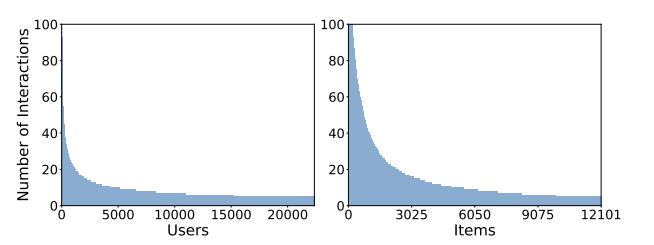
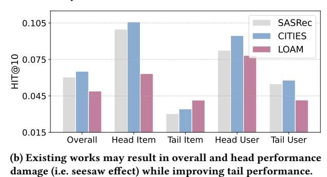
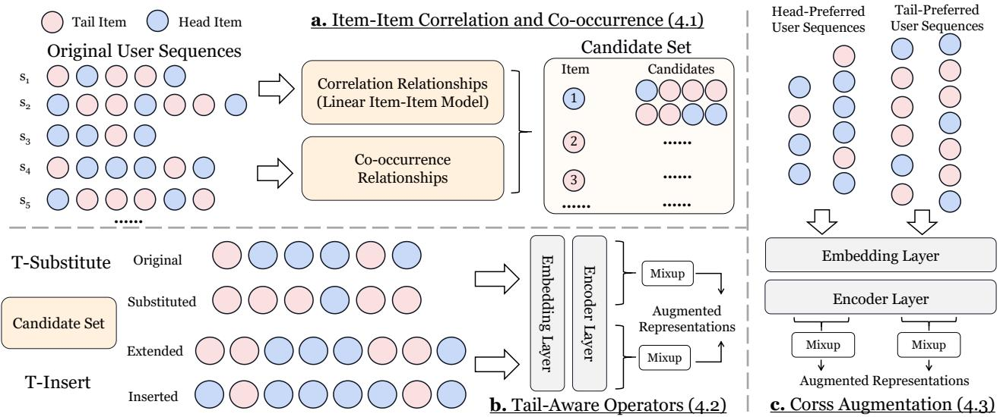
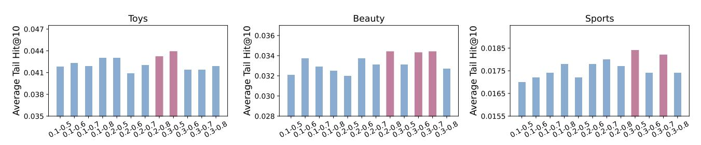
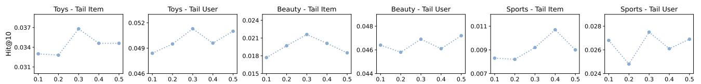

# Tail-Aware Data Augmentation for Long-Tail Sequential Recommendation

Yizhou Dang Software College, Northeastern University Shenyang, China dangyz@mails.neu.edu.cn

Zhifu Wei School of Computer Science and Engineering, Northeastern University Shenyang, China weizf@mails.neu.edu.cn

Minhan Huang Software College, Northeastern University Shenyang, China huangminhan@stumail.neu.edu.cn

Lianbo Ma Software College, Northeastern University Shenyang, China malb@swc.neu.edu.cn

Jianzhe Zhao Software College, Northeastern University Shenyang, China zhaojz@swc.neu.edu.cn

Guibing Guo Software College, Northeastern University Shenyang, China guogb@swc.neu.edu.cn

Xingwei Wang School of Computer Science and Engineering, Northeastern University Shenyang, China wangxw@mail.neu.edu.cn

# ABSTRACT

Sequential recommendation (SR) learns user preferences based on their historical interaction sequences and provides personalized suggestions. In real-world scenarios, most users can only interact with a handful of items, while the majority of items are seldom consumed. This pervasive long-tail challenge limits the model's ability to learn user preferences. Despite previous efforts to enrich tail items/users with knowledge from head parts or improve tail learning through additional contextual information, they still face the following issues: 1) They struggle to improve the situation where interactions of tail users/items are scarce, leading to incomplete preferences learning for the tail parts. 2) Existing methods often degrade overall or head parts performance when improving accuracy for tail users/items, thereby harming the user experience. In this work, we propose Tail-Aware Data Augmentation (TADA) for long-tail sequential recommendation, which enhances the interaction frequency for tail items/users while maintaining head performance, thereby promoting the model's learning capabilities for the tail. Specifically, we first capture the co-occurrence and correlation among low-popularity items by a linear model. Building upon this, we design two tail-aware augmentation operators, T-Substitute and T-Insert. The former replaces the head item with a relevant item, while the latter utilizes co-occurrence relationships to extend the original sequence by incorporating both head and tail items. The augmented and original sequences are mixed at

Permission to make digital or hard copies of all or part of this work for personal or classroom use is granted without fee provided that copies are not made or distributed for profit or commercial advantage and that copies bear this notice and the full citation on the first page. Copyrights for components of this work owned by others than the author(s) must be honored. Abstracting with credit is permitted. To copy otherwise, or republish, to post on servers or to redistribute to lists, requires prior specific permission and/or a fee. Request permissions from permissions@acm.org.

Conference acronym 'XX, June 03–05, 2018, Woodstock, NY © 2018 Copyright held by the owner/author(s). Publication rights licensed to ACM. ACM ISBN 978-1-4503-XXXX-X/18/06

<https://doi.org/XXXXXXX.XXXXXXX>

the representation level to preserve preference knowledge. We further extend the mix operation across different tail-user sequences and augmented sequences to generate richer augmented samples, thereby improving tail performance. Comprehensive experiments demonstrate the superiority of our method. The codes are provided at [https://github.com/KingGugu/TADA.](https://github.com/KingGugu/TADA)

# CCS CONCEPTS

• Information systems → Recommender systems.

# KEYWORDS

Long-Tail Sequential Recommendation; Data Augmentation

#### ACM Reference Format:

Yizhou Dang, Zhifu Wei, Minhan Huang, Lianbo Ma, Jianzhe Zhao, Guibing Guo, and Xingwei Wang. 2018. Tail-Aware Data Augmentation for Long-Tail Sequential Recommendation. In Woodstock '18: ACM Symposium on Neural Gaze Detection, June 03–05, 2018, Woodstock, NY . ACM, New York, NY, USA, [13](#page-12-0) pages.<https://doi.org/XXXXXXX.XXXXXXX>

# 1 INTRODUCTION

As an indispensable component of web services, sequential recommendation has garnered widespread attention due to its high degree of consistency with real-world scenarios [\[13,](#page-8-0) [15,](#page-8-1) [23,](#page-8-2) [60\]](#page-9-0). It models user preferences based on user-item interaction sequences and recommends items that users are likely to interact with next. Numerous SR models based on various architectures have been proposed, achieving significant advancements [\[18,](#page-8-3) [19,](#page-8-4) [23,](#page-8-2) [66\]](#page-9-1). Despite their effectiveness, the widespread long-tail problem limits the practicality of the model [\[21,](#page-8-5) [37\]](#page-9-2). Specifically, due to users' limited purchasing power and interaction capacity, most users can only interact with a tiny portion of items on the platform [\[11\]](#page-8-6). This results in short historical sequences for these users (i.e., long-tail

(a) Visualization of long-tail users (left) and items (right) in Beauty dataset. Existing knowledge transfer-based methods fail to effectively increase the number of interactions for the tail.

0.0 0.2 0.4 0.6 0.8 1.0 0.0 0.2 users), making it difficult for models to learn accurate user behavior patterns from them [\[24\]](#page-8-7). From the perspective of items, only a handful of popular items are viewed or purchased frequently by users, while most items are rarely consumed (i.e., long-tail items), making it challenging for models to learn accurate item representations [\[37\]](#page-9-2). As shown in Figure [1](#page-1-0) (a), the real-world Beauty dataset demonstrates a high proportion of both long-tail users and items.

0.6 Figure 1: The (a) long tail issue and (b) seesaw effect.

0.8

To address the long-tail problem, the primary solution in existing research is knowledge transfer [\[21,](#page-8-5) [24,](#page-8-7) [55\]](#page-9-3). The representative methods, CITIES [\[21\]](#page-8-5), leveraged representations learned from popular items to enrich representations of tail items, thereby compensating for the poor convergence of embeddings caused by limited interactions. On the other hand, some efforts attempted to incorporate additional interactions for long-tail users, enhancing the model's ability to learn and reason about their preferences [\[22,](#page-8-8) [38\]](#page-9-4). For example, ASReP [\[22\]](#page-8-8) employs a reversely pre-trained transformer to generate pseudo-prior items for short sequences. Then, fine-tune the pre-trained transformer to predict the following item.

Despite the progress, we two unresolved issues remain: (1) Interaction Sparsity: Existing methods struggle to increase interaction frequency for long-tail users and items fundamentally. Sparse interactions constrain the model's ability to learn user preferences. Mainstream SR models treat item representations as the primary learnable parameters, while user representations are usually modeled implicitly and embedded in the model's output representation of the interaction sequence [\[23\]](#page-8-2). Consequently, the number of item interactions directly determines the convergence of item embeddings during training, thereby affecting prediction accuracy. Although representations from head items can partially refine tail item embeddings, interaction sparsity significantly constrains the model's learning capacity. It is worth emphasizing that items added

by ASReP are mostly head items, thereby cannot improve the sparseness of tail items [\[37\]](#page-9-2). (2) Seesaw Phenomenon: While improving performance for tail-end users and items, existing methods may result in overall performance degradation and loss of top-tier performance (i.e., the seesaw problem), thereby compromising the overall user experience. As shown in Figure [1](#page-1-0) (b), although LOAM [\[55\]](#page-9-3) improves the recommendation accuracy for tail users and items, it reduces performance of other parts.

To tackle the above challenges, in this work, we propose Tail-Aware Data Augmentation (TADA) for long-tail sequential recommendation. Our core idea is to leverage crafted augmentation modules to increase interactions of tail items and users, which enhances long-tail performance while avoiding the loss of head and overall performance caused by knowledge transfer. Specifically, we first constructed a linear item-item Similarity model [\[5\]](#page-8-9), utilizing ridge regression to model co-occurrence relationships between items (particularly long-tail unpopular items). Based on this correlation, we designed two tail-aware data augmentation operators, T-Substitute and T-Insert. The T-Substitute prioritizes replacing head items in sequences with relevant long-tail items. T-Insert prioritizes inserting relevant head items before tail items to boost the model's prediction for those tail items. Subsequently, we mix the replaced sequences with their original sequences at the representation level, while mixing the inserted sequences with their extended original sequences, thereby generating novel yet semantically relevant samples [\[12\]](#page-8-10). Subsequently, we extended the mixing operation within the cross-sequence augmentation module to encompass different long-tail sequences and their augmented counterparts. It enables the model to optimize representations from diverse augment samples for both head and tail sequences in a differentiated manner, thereby achieving a consistent improvement in overall performance. Extensive experiments on various datasets and backbones to validate the superiority of our proposed method.

In summary, our work makes the following contributions:

- We highlight the interaction sparsity and seesaw phenomenon of existing long-tail SR methods and propose a Tail-Aware Data Augmentation (TADA) method to enhance the interaction frequency for tail items/users while maintaining head performance.
- We design several key modules. Two tail-aware operators, T-Substitute and T-Insert, perform augmentation on the tail items and generate augmented samples through fusion at the representation level. Cross-sequence mixing further provides diverse samples by utilizing different original and augmented sequences.
- We conduct comprehensive experiments on real-world datasets with representative backbone SR models and different baselines to demonstrate the effectiveness and generalizability of TADA.

### 2 RELATED WORK

General SR. Sequential Recommendation (SR) is a key task to predict the next accessed item based on users' interaction sequences [\[8,](#page-8-11) [63,](#page-9-5) [64\]](#page-9-6). Early works used Markov Chains [\[18\]](#page-8-3) to model user behaviors, focusing on correlations between the next item and recent interactions. Later, CNNs [\[57\]](#page-9-7) and RNNs [\[47\]](#page-9-8) were adopted: GRU4Rec [\[19\]](#page-8-4) used GRU to model interest evolution, while Caser [\[50\]](#page-9-9) mapped items to temporal/latent spaces and learned patterns via convolutional filters. With the success of self-attention [\[52\]](#page-9-10), Transformer-based SR models emerged. SASRec [\[23\]](#page-8-2) used Transformer layers to learn item importance and characterize transition correlations. STOSA [\[17\]](#page-8-12) represented items as Gaussian distributions and designed Wasserstein Self-Attention for item relationships. Beyond Transformers, studies found filtering algorithms reduce noise [\[66\]](#page-9-1), leading to the proposal of an all-MLP architecture with learnable filters. LRURec [\[58\]](#page-9-11) designed a linear recurrence with matrix diagonalization to capture transition patterns and a recursive parallelization framework that accelerates training.

Long-Tail SR. To mitigate the long-tail problem, existing research primarily focuses on transferring knowledge from head users and items to the tail to enrich representations of tail users and items [\[21,](#page-8-5) [25,](#page-8-13) [36\]](#page-8-14). The representative work, CITIES [\[21\]](#page-8-5), enhanced the quality of the tail-item embeddings by training an embeddinginference function using multiple contextual head items. Following this idea, MELT [\[24\]](#page-8-7) designed a mutually reinforced dual-branch framework to enhance performance for both tail users and items. MASR [\[20\]](#page-8-15) proposed centroid-wise and cluster-wise memory banks to store historical samples. It searched similar sequences and copied information to enhance the tail items. The above ideas are also used in session-based recommendation [\[39,](#page-9-12) [55\]](#page-9-3). With the rise of large language models (LLMs), some efforts have also explored leveraging textual semantic information and multimodal data to enrich and enhance long-tail users and items [\[31,](#page-8-16) [32,](#page-8-17) [37\]](#page-9-2). For example, LLM-ESR [\[37\]](#page-9-2) combined semantics from LLMs and collaborative signals from conventional SR for tail items, and proposed a retrieval augmented self-distillation method to enhance tail users. Unlike the above efforts, our proposed TADA with tail-aware augmentation modules are tailored from a data perspective, directly addressing the interaction sparsity of tail users and items.

Data Augmentation for SR. Given widespread data sparsity in SR, numerous data augmentation methods have been proposed with notable progress [\[11,](#page-8-6) [14,](#page-8-18) [54\]](#page-9-13), mainly categorized into heuristicbased and model-based approaches. Heuristic methods generate new samples by perturbing the original sequences. Early ones include Sliding Window [\[50\]](#page-9-9) (splitting sequences into sub-sequences) and Deletion [\[49\]](#page-9-14). With contrastive learning's application in SR, operators like Crop, Mask, Reorder, Insert, and Substitute emerged [\[42,](#page-9-15) [54\]](#page-9-13), later improved by incorporating time intervals [\[9\]](#page-8-19), user intents [\[3\]](#page-8-20), behavior periodicity [\[51\]](#page-9-16), and relevance/diversity [\[12\]](#page-8-10). Due to the low controllability of heuristic-based methods, modelbased methods have emerged with learnable generative modules. DiffASR [\[38\]](#page-9-4) adopted diffusion models with guidance for sequence generation. ASReP [\[43\]](#page-9-17) used a reverse-pre-trained Transformer to generate pseudo-prior items for short sequences. A recent work, DR4SR [\[56\]](#page-9-18) proposed a data-level framework to refine sequences for better informativeness and generalization. However, these methods lack specialized augmentation strategies tailored for long-tail items and users, failing to increase interaction volumes at the tail end effectively. Consequently, the long-tail problem remains unresolved.

### 3 PRELIMINARIES

Problem Formulation of SR. We use U and V to denote the user set and the item set, respectively. Each user �� ∈ U is associated with a sequence of interacted items in chronological order ���� =

[��1, . . . , ���� , . . . , ��|���� |], where ���� ∈ V indicate the item that user �� has interacted with at time step �� and |���� | is the sequence length. Given the interaction sequence ����, sequential recommendation aims to predict the most possible item �� ∗ that user �� will interact with at time step |���� | + 1, which can be formulated as:

arg max ∗ ∈V �� ��|���� |+1 = �� ∗ | ���� . (1)

Head/Tail Splitting. Following the previous on long-tail SR, we split the users and items into tail and head groups [\[21,](#page-8-5) [37\]](#page-9-2). Firstly, we sort the users and items by the sequence length |���� | and the popularity of the item �� (i.e., the total interaction number). Then, take out the top 20% users and items as head user and head item according to the Pareto principle [\[2\]](#page-8-21), denoted as Uhead and Vhead. The rest of the users and items are the tail user and tail item, i.e., Utail = U − Uhead and Vtail = V − Vhead [\[37\]](#page-9-2). For long-tail issues in SR, we aim to enhance the performance for Utail and Vtail. Embeddings and Representations. The standard SR paradigm [\[8,](#page-8-11) [23\]](#page-8-2) maintains an item embedding matrix MV ∈ R |V |×�� . The matrix projects the high-dimensional one-hot representation of an item to a low-dimensional, dense representation. Given an original user sequence ���� = [��1, ��2, . . . , ��|���� |], the embedding Look-up operation will be applied for MV to get a sequence of item representation, i.e., ���� = [����1 , ����2 , . . . , ����|���� | ]. We omit the padding for short sequences and the interception for long sequences. By feeding the sequence representation ���� into the Encoder, we can obtain the output representation of the sequence ����. In sequential recommendation, user representations are usually modeled implicitly, so ���� can also be interpreted as user representations [\[23\]](#page-8-2).

#### 4 OURS: TADA

The overall framework of our proposed TADA is illustrated in Figure [2.](#page-3-0) It first constructs an augmentation candidate set based on correlation and co-occurrence relationships. Subsequently, two tail-aware augmentation operators augment long-tail interactions based on this candidate set. cross augmentation further extends this augmentation across different tail and augmented sequences. All augmented samples are utilized for model training. The comprehensive overview of the notations is given in Table [1.](#page-3-1)

#### 4.1 Item-Item Correlation and Co-occurrence

To provide suitable candidate augmentation items for our operators, we construct candidate item sets based on item-item correlation relationships and co-occurrence relationships.

Correlation Relationships. Previous work primarily relied on cosine similarity to search and select the similar candidate items, which not only resulted in ��(|V |2 ) computational complexity but also required performing calculations during each screening alongside model training [\[42\]](#page-9-15). Here, we employ a linear model to compute similarity scores in advance before model training begins [\[5\]](#page-8-9). Furthermore, some research has demonstrated that linear models can better capture co-occurrence among less popular items (long-tail items), aligning perfectly with our requirements.

The linear model takes the user-item interaction matrix MD ∈ |U |× |V | (������ = 1 represents observed interactions in user sequences, and ������ = 0 represents unobserved interactions) as input and finally output an item-item similarity matrix MS ∈ R |V |× |V | .

Following the previous work [\[44,](#page-9-22) [46\]](#page-9-23), we adopt a two-stage training strategy to avoid the noise augmented samples produced by mixing unoptimized embeddings. In the first stage, we follow the standard SR model training process, with the primary objective of facilitating the learning of high-quality item embeddings from original data. We use Equation [\(14\)](#page-4-1) as the sole objective function. In the second stage, we employ the two augmentation operators and cross augmentation:

L = L�������� + L���������������� + L���������� . (17)

We do not set additional loss weights for L���������������� and L���������� since we treat all augmented samples equally with the original samples. Adaptive weights for different samples are reserved for future work.

### 4.5 Discussion

Compared to existing long-tail SR methods and data augmentation methods, our approach has the following advantages:

- Mitigating tail data sparsity: Existing long-tail methods primarily rely on knowledge transfer from the head, struggling to effectively increase interaction counts in the tail, which results in limited performance gains or seesaw issues. Our TADA approach tailored augmentation methods for tail users and items, effectively improving the model's learning of tail representations while maintaining overall and head performance.
- Low computational complexity: Since we pre-construct the candidate set by linear models before augmentation begins, there is no need to select items based on similarity during augmentation, which would introduce ��(|V |2 ) complexity [\[42\]](#page-9-15). During the augmentation process, item selection, weight sampling, and representation mixing all exhibit linear complexity.
- High generalization ability: Some augmentation methods leveraged bidirectional Transformers [\[43\]](#page-9-17) or diffusion models [\[38\]](#page-9-4), which have limitations on the type of backbone network. Some long-tail methods also require the introduction of additional learnable modules [\[24\]](#page-8-7). In contrast, our method is model agnostic with no additional learnable parameters during training.

# 5 EXPERIMENTS

# 5.1 Experimental Setup

Baselines. (1) Backbone SR models: To validate the generalizability of our proposed TADA, we first selected three representative backbone SR models: GRU4Rec [\[19\]](#page-8-4), SASRec [\[23\]](#page-8-2), and FMLP-Rec [\[66\]](#page-9-1). These three models are based on recurrent neural networks (RNNs), attention mechanisms [\[52\]](#page-9-10), and multilayer perceptrons (MLPs), respectively. (2) Data augmentation methods: CMR [\[54\]](#page-9-13), CMRSI [\[42\]](#page-9-15), and RepPad [\[7\]](#page-8-25). We do not select augmentation methods based on contrastive learning [\[51,](#page-9-16) [54\]](#page-9-13), as these introduce additional learning objectives. In contrast, all augmentation data generated by our TADA is utilized for the main recommendation task. DiffASR [\[38\]](#page-9-4) and ASReP [\[43\]](#page-9-17) are not involved since they have limitations on the type of backbone models. Meanwhile, RepPad has reported better performance than them [\[7\]](#page-8-25). Therefore, we chose RepPad as the baseline. (3) Long-tail SR methods: CITIES [\[21\]](#page-8-5), LOAM [\[55\]](#page-9-3), and MELT [\[24\]](#page-8-7). To ensure a fair comparison, we do not include LLM-ESR [\[37\]](#page-9-2) and R2REC [\[31\]](#page-8-16), as they use additional modal information, such as text and images, while our TADA only takes the item ID as input. Details about baselines are provided in the Appendix.

Datasets. Following previous works [\[7,](#page-8-25) [31\]](#page-8-16), we select three datasets, Toys, Beauty, and Sports [\[45\]](#page-9-24). We reduce the data by extracting the 5-core [\[10,](#page-8-26) [42,](#page-9-15) [51\]](#page-9-16). The maximum sequence length is set to 50.

Evaluation Settings. We adopt the leave-one-out strategy to partition sequences into training, validation, and test sets. Following previous practice [\[17,](#page-8-12) [54,](#page-9-13) [58,](#page-9-11) [66\]](#page-9-1), we rank the prediction over the whole item set rather than negative sampling, otherwise leading to biased discoveries [\[27\]](#page-8-27). The evaluation metrics include Hit Ratio@K (H@K) and Normalized Discounted Cumulative Gain@K (N@K). We report results with K ∈ {5, 10, 20}.

Implementation Details. For all baselines, we adopt the implementation provided by the authors. We set the embedding size to 64 and the batch size to 256. To ensure fair comparisons, we carefully set and tune all other hyperparameters of each method as reported and suggested in the original papers. We use the Adam [\[26\]](#page-8-28) optimizer with the learning rate 0.001, ��1 = 0.9, ��2 = 0.999. For TADA, we tune the ��, ��, ��, �� in the range of {0.1, 0.2, 0.3, 0.4, 0.5}, {0.1, 0.2, 0.3}, {0.5, 0.6, 0.7, 0.8}, {0.4, 0.5, 0.6}, respectively. The �� for correlation candidate set is tuned in the range of {10, 20, 30, 40, 50}. We conduct five runs and report the average results for all methods.

# 5.2 Overall Comparison

The experimental results of our TADA and different baseline methods with various backbone SR models are presented in Table [2](#page-6-0) [1](#page-5-0) . We have the following observations and conclusions:

- Among the three backbone models, SASRec demonstrated the best overall performance, further validating the powerful capabilities of transformers in modeling sequences. Among the baseline methods based on data augmentation, CMRSI and RepPad achieved competitive results in some cases. The former generates augmented data through multiple heuristic operators, while the latter fills idle input spaces by leveraging the original sequence. However, these approaches lack augmentation methods specifically designed for tail data, potentially failing to improve tail performance effectively and even exacerbating head-tail imbalance. Consequently, data augmentation-based methods often underperform on tail items and tail users in many cases.
- For long-tail SR methods, we observe that they struggle to achieve advantages in overall and head performance. In some cases, their performance even falls short of the original model. This phenomenon further validates the seesaw effect we highlighted: these methods compromise overall and head performance while transferring knowledge to the tail, thereby degrading user experience. Although they achieve competitive results for some tail users and tail items, their overall performance still lags behind data augmentation-based approaches. This indicates that the sparsity of tail data severely constrains the model's learning capacity.
- For our proposed TADA, it achieves the best or the second-best performance in nearly all cases. Specifically, for long-tail items and long-tail users, it achieves optimal performance across all

1 For MELT [\[24\]](#page-8-7), although we reproduced it by strictly adhering to the code provided by the authors and the parameter settings & adjustment ranges reported in the original paper, the performance consistently exhibits anomalies, with low performance in certain cases. We also observe this in other published papers [\[31,](#page-8-16) [37\]](#page-9-2).

Table 2: Performance comparison. The best performance is bolded and the second-best is underlined.

| Dataset Method | H@10   | N@10   | Overall H@20 | N@20   | H@10   | Head Item N@10 | H@10   | N@10   | Tail Item H@20 | N@20   | H@10   | Head User N@10 | H@10   | N@10   | Tail User H@20 | N@20   |
|----------------|--------|--------|--------------|--------|--------|----------------|--------|--------|----------------|--------|--------|----------------|--------|--------|----------------|--------|
| GRU4Rec        | 0.0364 | 0.0192 | 0.0580       | 0.0246 | 0.0581 | 0.0311         | 0.0230 | 0.0119 | 0.0355         | 0.0150 | 0.0456 | 0.0210         | 0.0341 | 0.0188 | 0.0531         | 0.0235 |
| CMR            | 0.0415 | 0.0214 | 0.0662       | 0.0276 | 0.0633 | 0.0320         | 0.0281 | 0.0150 | 0.0419         | 0.0184 | 0.0428 | 0.0208         | 0.0412 | 0.0216 | 0.0651         | 0.0276 |
| CMRSI          | 0.0405 | 0.0202 | 0.0647       | 0.0286 | 0.0669 | 0.0345         | 0.0273 | 0.0156 | 0.0425         | 0.0194 | 0.0411 | 0.0197         | 0.0399 | 0.0207 | 0.0630         | 0.0269 |
| RepPad         | 0.0442 | 0.0243 | 0.0641       | 0.0293 | 0.0692 | 0.0368         | 0.0288 | 0.0166 | 0.0406         | 0.0196 | 0.0368 | 0.0182         | 0.0460 | 0.0258 | 0.0657         | 0.0308 |
| CITIES         | 0.0393 | 0.0211 | 0.0617       | 0.0268 | 0.0636 | 0.0339         | 0.0244 | 0.0132 | 0.0380         | 0.0167 | 0.0404 | 0.0211         | 0.0390 | 0.0211 | 0.0590         | 0.0262 |
| LOAM           | 0.0223 | 0.0116 | 0.0363       | 0.0151 | 0.0158 | 0.0076         | 0.0263 | 0.0141 | 0.0389         | 0.0172 | 0.0350 | 0.0178         | 0.0191 | 0.0101 | 0.0299         | 0.0128 |
| MELT           | 0.0330 | 0.0174 | 0.0525       | 0.0223 | 0.0819 | 0.0432         | 0.0029 | 0.0016 | 0.0046         | 0.0020 | 0.0265 | 0.0127         | 0.0346 | 0.0186 | 0.0539         | 0.0234 |
| TADA           | 0.0512 | 0.0280 | 0.0749       | 0.0340 | 0.0746 | 0.0412         | 0.0368 | 0.0200 | 0.0513         | 0.0236 | 0.0515 | 0.0265         | 0.0511 | 0.0284 | 0.0722         | 0.0337 |
| SASRec         | 0.0716 | 0.0396 | 0.1015       | 0.0471 | 0.0892 | 0.0485         | 0.0607 | 0.0341 | 0.0821         | 0.0395 | 0.0675 | 0.0345         | 0.0726 | 0.0408 | 0.1009         | 0.0480 |
| CMR            | 0.0652 | 0.0361 | 0.0959       | 0.0438 | 0.0994 | 0.0557         | 0.0414 | 0.0241 | 0.0639         | 0.0290 | 0.0608 | 0.0350         | 0.0663 | 0.0364 | 0.0985         | 0.0438 |
| CMRSI          | 0.0683 | 0.0380 | 0.0984       | 0.0452 | 0.1013 | 0.0579         | 0.0455 | 0.0260 | 0.0694         | 0.0308 | 0.0657 | 0.0374         | 0.0716 | 0.0385 | 0.1024         | 0.0459 |
| RepPad Toys    | 0.0805 | 0.0476 | 0.1089       | 0.0547 | 0.1030 | 0.0599         | 0.0667 | 0.0399 | 0.0855         | 0.0447 | 0.0726 | 0.0408         | 0.0825 | 0.0479 | 0.1064         | 0.0548 |
| CITIES         | 0.0723 | 0.0392 | 0.1024       | 0.0468 | 0.0971 | 0.0525         | 0.0570 | 0.0310 | 0.0805         | 0.0370 | 0.0711 | 0.0353         | 0.0726 | 0.0402 | 0.1015         | 0.0475 |
| LOAM           | 0.0569 | 0.0321 | 0.0815       | 0.0383 | 0.0458 | 0.0225         | 0.0637 | 0.0380 | 0.0827         | 0.0428 | 0.0626 | 0.0333         | 0.0554 | 0.0318 | 0.0774         | 0.0374 |
| MELT           | 0.0432 | 0.0216 | 0.0707       | 0.0286 | 0.0940 | 0.0474         | 0.0119 | 0.0058 | 0.0218         | 0.0082 | 0.0309 | 0.0133         | 0.0462 | 0.0237 | 0.0742         | 0.0308 |
| TADA           | 0.0846 | 0.0491 | 0.1142       | 0.0566 | 0.1059 | 0.0597         | 0.0716 | 0.0427 | 0.0927         | 0.0480 | 0.0824 | 0.0459         | 0.0852 | 0.0500 | 0.1115         | 0.0565 |
| FMLP-Rec       | 0.0555 | 0.0325 | 0.0745       | 0.0373 | 0.0719 | 0.0400         | 0.0454 | 0.0279 | 0.0553         | 0.0304 | 0.0546 | 0.0308         | 0.0557 | 0.0330 | 0.0728         | 0.0373 |
| CMR            | 0.0601 | 0.0342 | 0.0770       | 0.0380 | 0.0792 | 0.0441         | 0.0459 | 0.0283 | 0.0572         | 0.0306 | 0.0587 | 0.0326         | 0.0555 | 0.0339 | 0.0763         | 0.0366 |
| CMRSI          | 0.0623 | 0.0360 | 0.0814       | 0.0405 | 0.0825 | 0.0463         | 0.0489 | 0.0295 | 0.0590         | 0.0322 | 0.0603 | 0.0347         | 0.0587 | 0.0355 | 0.0796         | 0.0387 |
| RepPad         | 0.0562 | 0.0352 | 0.0778       | 0.0385 | 0.0861 | 0.0515         | 0.0410 | 0.0242 | 0.0542         | 0.0275 | 0.0556 | 0.0311         | 0.0575 | 0.0362 | 0.0774         | 0.0389 |
| CITIES         | 0.0586 | 0.0334 | 0.0832       | 0.0396 | 0.0883 | 0.0511         | 0.0403 | 0.0225 | 0.0560         | 0.0265 | 0.0546 | 0.0279         | 0.0596 | 0.0347 | 0.0840         | 0.0409 |
| LOAM           | 0.0468 | 0.0266 | 0.0651       | 0.0312 | 0.0460 | 0.0211         | 0.0473 | 0.0299 | 0.0596         | 0.0330 | 0.0513 | 0.0273         | 0.0457 | 0.0264 | 0.0621         | 0.0305 |
| MELT           | 0.0351 | 0.0185 | 0.0549       | 0.0235 | 0.0890 | 0.0475         | 0.0020 | 0.0007 | 0.0048         | 0.0014 | 0.0309 | 0.0155         | 0.0362 | 0.0192 | 0.0563         | 0.0243 |
| TADA           | 0.0664 | 0.0399 | 0.0869       | 0.0451 | 0.0883 | 0.0502         | 0.0528 | 0.0335 | 0.0653         | 0.0367 | 0.0649 | 0.0379         | 0.0667 | 0.0404 | 0.0853         | 0.0451 |
| GRU4Rec        | 0.0383 | 0.0194 | 0.0639       | 0.0258 | 0.0730 | 0.0364         | 0.0119 | 0.0064 | 0.0204         | 0.0086 | 0.0604 | 0.0306         | 0.0328 | 0.0165 | 0.0544         | 0.0220 |
| CMR            | 0.0449 | 0.0230 | 0.0750       | 0.0305 | 0.0813 | 0.0408         | 0.0173 | 0.0086 | 0.0263         | 0.0109 | 0.0711 | 0.0374         | 0.0384 | 0.0193 | 0.0641         | 0.0258 |
| CMRSI          | 0.0503 | 0.0254 | 0.0797       | 0.0329 | 0.0932 | 0.0469         | 0.0176 | 0.0091 | 0.0278         | 0.0111 | 0.0756 | 0.0382         | 0.0437 | 0.0220 | 0.0702         | 0.0287 |
| RepPad         | 0.0466 | 0.0243 | 0.0729       | 0.0309 | 0.0861 | 0.0449         | 0.0165 | 0.0083 | 0.0266         | 0.0110 | 0.0635 | 0.0318         | 0.0424 | 0.0214 | 0.0665         | 0.0281 |
| CITIES         | 0.0394 | 0.0199 | 0.0655       | 0.0264 | 0.0741 | 0.0375         | 0.0130 | 0.0064 | 0.0220         | 0.0086 | 0.0613 | 0.0316         | 0.0340 | 0.0169 | 0.0561         | 0.0225 |
| LOAM           | 0.0283 | 0.0135 | 0.0465       | 0.0180 | 0.0411 | 0.0188         | 0.0184 | 0.0094 | 0.0293         | 0.0121 | 0.0543 | 0.0253         | 0.0217 | 0.0105 | 0.0369         | 0.0143 |
| MELT           | 0.0398 | 0.0191 | 0.0670       | 0.0259 | 0.0912 | 0.0434         | 0.0006 | 0.0005 | 0.0019         | 0.0008 | 0.0470 | 0.0220         | 0.0380 | 0.0184 | 0.0636         | 0.0247 |
| TADA           | 0.0555 | 0.0279 | 0.0836       | 0.0350 | 0.1027 | 0.0515         | 0.0195 | 0.0100 | 0.0321         | 0.0131 | 0.0823 | 0.0409         | 0.0488 | 0.0247 | 0.0720         | 0.0305 |
| SASRec         | 0.0605 | 0.0318 | 0.0918       | 0.0397 | 0.0999 | 0.0507         | 0.0304 | 0.0174 | 0.0452         | 0.0211 | 0.0825 | 0.0420         | 0.0549 | 0.0292 | 0.0842         | 0.0366 |
| CMR            | 0.0580 | 0.0306 | 0.0916       | 0.0391 | 0.1067 | 0.0559         | 0.0210 | 0.0114 | 0.0343         | 0.0147 | 0.0774 | 0.0396         | 0.0532 | 0.0284 | 0.0856         | 0.0367 |
| CMRSI          | 0.0594 | 0.0315 | 0.0936       | 0.0401 | 0.1079 | 0.0561         | 0.0224 | 0.0127 | 0.0358         | 0.0161 | 0.0704 | 0.0383         | 0.0566 | 0.0298 | 0.0888         | 0.0379 |
| RepPad Beauty  | 0.0715 | 0.0391 | 0.1002       | 0.0479 | 0.1205 | 0.0652         | 0.0363 | 0.0210 | 0.0542         | 0.0258 | 0.1004 | 0.0541         | 0.0648 | 0.0355 | 0.0958         | 0.0432 |
| CITIES         | 0.0652 | 0.0342 | 0.0941       | 0.0415 | 0.1059 | 0.0554         | 0.0342 | 0.0181 | 0.0479         | 0.0215 | 0.0946 | 0.0517         | 0.0579 | 0.0299 | 0.0836         | 0.0364 |
| LOAM           | 0.0489 | 0.0266 | 0.0763       | 0.0335 | 0.0633 | 0.0310         | 0.0380 | 0.0232 | 0.0534         | 0.0271 | 0.0783 | 0.0434         | 0.0416 | 0.0224 | 0.0660         | 0.0285 |
| MELT           | 0.0469 | 0.0224 | 0.0772       | 0.0300 | 0.1078 | 0.0516         | 0.0005 | 0.0002 | 0.0020         | 0.0006 | 0.0570 | 0.0278         | 0.0444 | 0.0211 | 0.0733         | 0.0283 |
| TADA           | 0.0732 | 0.0407 | 0.1076       | 0.0493 | 0.1157 | 0.0612         | 0.0409 | 0.0251 | 0.0593         | 0.0297 | 0.0946 | 0.0517         | 0.0679 | 0.0379 | 0.0982         | 0.0455 |
| FMLP-Rec       | 0.0539 | 0.0289 | 0.0774       | 0.0349 | 0.0891 | 0.0465         | 0.0270 | 0.0155 | 0.0338         | 0.0173 | 0.0803 | 0.0440         | 0.0473 | 0.0251 | 0.0677         | 0.0303 |
| CMR            | 0.0594 | 0.0324 | 0.0803       | 0.0386 | 0.1061 | 0.0552         | 0.0211 | 0.0111 | 0.0363         | 0.0149 | 0.0758 | 0.0407         | 0.0534 | 0.0199 | 0.0628         | 0.0227 |
| CMRSI          | 0.0612 | 0.0335 | 0.0825       | 0.0409 | 0.1023 | 0.0586         | 0.0219 | 0.0115 | 0.0354         | 0.0147 | 0.0770 | 0.0405         | 0.0542 | 0.0209 | 0.0640         | 0.0234 |
| RepPad         | 0.0604 | 0.0344 | 0.0838       | 0.0403 | 0.1053 | 0.0601         | 0.0262 | 0.0148 | 0.0356         | 0.0172 | 0.0832 | 0.0498         | 0.0547 | 0.0306 | 0.0745         | 0.0357 |
| CITIES         | 0.0556 | 0.0301 | 0.0819       | 0.0367 | 0.1024 | 0.0546         | 0.0200 | 0.0115 | 0.0263         | 0.0130 | 0.0747 | 0.0422         | 0.0509 | 0.0271 | 0.0752         | 0.0332 |
| LOAM           | 0.0396 | 0.0213 | 0.0616       | 0.0268 | 0.0502 | 0.0238         | 0.0314 | 0.0194 | 0.0409         | 0.0217 | 0.0709 | 0.0378         | 0.0317 | 0.0172 | 0.0503         | 0.0218 |
| MELT           | 0.0475 | 0.0258 | 0.0728       | 0.0322 | 0.1061 | 0.0582         | 0.0028 | 0.0012 | 0.0056         | 0.0019 | 0.0586 | 0.0334         | 0.0447 | 0.0239 | 0.0678         | 0.0297 |
| TADA           | 0.0658 | 0.0384 | 0.0917       | 0.0450 | 0.1099 | 0.0609         | 0.0322 | 0.0213 | 0.0429         | 0.0240 | 0.0977 | 0.0563         | 0.0579 | 0.0340 | 0.0812         | 0.0399 |
| GRU4Rec        | 0.0155 | 0.0073 | 0.0285       | 0.0105 | 0.0289 | 0.0135         | 0.0052 | 0.0025 | 0.0092         | 0.0035 | 0.0173 | 0.0081         | 0.0150 | 0.0071 | 0.0279         | 0.0103 |
| CMR            | 0.0220 | 0.0109 | 0.0383       | 0.0150 | 0.0410 | 0.0194         | 0.0080 | 0.0046 | 0.0121         | 0.0054 | 0.0233 | 0.0109         | 0.0221 | 0.0111 | 0.0386         | 0.0152 |
| CMRSI          | 0.0240 | 0.0119 | 0.0414       | 0.0159 | 0.0468 | 0.0233         | 0.0069 | 0.0035 | 0.0115         | 0.0047 | 0.0216 | 0.0105         | 0.0250 | 0.0125 | 0.0412         | 0.0164 |
| RepPad         | 0.0224 | 0.0111 | 0.0364       | 0.0136 | 0.0431 | 0.0212         | 0.0065 | 0.0033 | 0.0109         | 0.0044 | 0.0212 | 0.0103         | 0.0227 | 0.0105 | 0.0368         | 0.0148 |
| CITIES         | 0.0179 | 0.0084 | 0.0313       | 0.0118 | 0.0339 | 0.0159         | 0.0056 | 0.0027 | 0.0089         | 0.0035 | 0.0197 | 0.0087         | 0.0175 | 0.0083 | 0.0310         | 0.0117 |
| LOAM           | 0.0155 | 0.0079 | 0.0258       | 0.0105 | 0.0280 | 0.0144         | 0.0059 | 0.0029 | 0.0097         | 0.0039 | 0.0155 | 0.0074         | 0.0155 | 0.0080 | 0.0256         | 0.0105 |
| MELT           | 0.0246 | 0.0120 | 0.0421       | 0.0164 | 0.0564 | 0.0276         | 0.0001 | 0.0000 | 0.0001         | 0.0000 | 0.0256 | 0.0133         | 0.0243 | 0.0117 | 0.0418         | 0.0161 |
| TADA           | 0.0279 | 0.0140 | 0.0450       | 0.0183 | 0.0519 | 0.0258         | 0.0095 | 0.0049 | 0.0159         | 0.0065 | 0.0306 | 0.0148         | 0.0273 | 0.0138 | 0.0438         | 0.0179 |
| SASRec         | 0.0317 | 0.0177 | 0.0479       | 0.0218 | 0.0488 | 0.0260         | 0.0185 | 0.0113 | 0.0248         | 0.0129 | 0.0301 | 0.0160         | 0.0321 | 0.0181 | 0.0485         | 0.0222 |
| CMR            | 0.0336 | 0.0182 | 0.0550       | 0.0236 | 0.0673 | 0.0367         | 0.0076 | 0.0040 | 0.0151         | 0.0059 | 0.0315 | 0.0175         | 0.0332 | 0.0184 | 0.0554         | 0.0238 |
| CMRSI          | 0.0326 | 0.0180 | 0.0493       | 0.0222 | 0.0655 | 0.0360         | 0.0072 | 0.0042 | 0.0115         | 0.0052 | 0.0310 | 0.0173         | 0.0322 | 0.0172 | 0.0504         | 0.0226 |
| RepPad Sports  | 0.0379 | 0.0205 | 0.0589       | 0.0248 | 0.0732 | 0.0362         | 0.0182 | 0.0099 | 0.0245         | 0.0119 | 0.0370 | 0.0196         | 0.0379 | 0.0215 | 0.0583         | 0.0258 |
| CITIES         | 0.0334 | 0.0187 | 0.0504       | 0.0229 | 0.0555 | 0.0302         | 0.0164 | 0.0098 | 0.0228         | 0.0114 | 0.0309 | 0.0171         | 0.0340 | 0.0190 | 0.0511         | 0.0233 |
| LOAM           | 0.0212 | 0.0111 | 0.0333       | 0.0142 | 0.0222 | 0.0106         | 0.0204 | 0.0116 | 0.0266         | 0.0131 | 0.0192 | 0.0102         | 0.0217 | 0.0114 | 0.0338         | 0.0144 |
| MELT           | 0.0326 | 0.0168 | 0.0513       | 0.0214 | 0.0748 | 0.0385         | 0.0001 | 0.0000 | 0.0002         | 0.0001 | 0.0320 | 0.0171         | 0.0327 | 0.0167 | 0.0512         | 0.0213 |
| TADA           | 0.0402 | 0.0217 | 0.0605       | 0.0267 | 0.0654 | 0.0338         | 0.0208 | 0.0123 | 0.0299         | 0.0146 | 0.0382 | 0.0209         | 0.0407 | 0.0219 | 0.0611         | 0.0270 |
| FMLP-Rec       | 0.0242 | 0.0122 | 0.0365       | 0.0153 | 0.0404 | 0.0186         | 0.0118 | 0.0073 | 0.0149         | 0.0081 | 0.0202 | 0.0095         | 0.0252 | 0.0129 | 0.0372         | 0.0159 |
| CMR            | 0.0257 | 0.0129 | 0.0394       | 0.0163 | 0.0432 | 0.0199         | 0.0112 | 0.0065 | 0.0147         | 0.0078 | 0.0220 | 0.0102         | 0.0259 | 0.0140 | 0.0383         | 0.0164 |
| CMRSI          | 0.0265 | 0.0138 | 0.0419       | 0.0178 | 0.0471 | 0.0224         | 0.0125 | 0.0078 | 0.0160         | 0.0092 | 0.0247 | 0.0118         | 0.0279 | 0.0148 | 0.0419         | 0.0178 |
| RepPad         | 0.0272 | 0.0147 | 0.0415       | 0.0183 | 0.0522 | 0.0281         | 0.0105 | 0.0061 | 0.0147         | 0.0071 | 0.0277 | 0.0147         | 0.0269 | 0.0152 | 0.0401         | 0.0175 |
| CITIES         | 0.0239 | 0.0123 | 0.0353       | 0.0152 | 0.0405 | 0.0208         | 0.0111 | 0.0058 | 0.0154         | 0.0069 | 0.0229 | 0.0114         | 0.0241 | 0.0125 | 0.0353         | 0.0154 |
| LOAM           | 0.0169 | 0.0092 | 0.0259       | 0.0115 | 0.0197 | 0.0094         | 0.0147 | 0.0091 | 0.0183         | 0.0101 | 0.0171 | 0.0088         | 0.0168 | 0.0094 | 0.0255         | 0.0115 |
| MELT           | 0.0278 | 0.0150 | 0.0422       | 0.0186 | 0.0632 | 0.0342         | 0.0005 | 0.0002 | 0.0012         | 0.0003 | 0.0294 | 0.0164         | 0.0274 | 0.0146 | 0.0414         | 0.0181 |
| TADA           | 0.0304 | 0.0161 | 0.0450       | 0.0198 | 0.0483 | 0.0240         | 0.0166 | 0.0100 | 0.0207         | 0.0111 | 0.0298 | 0.0151         | 0.0305 | 0.0164 | 0.0448         | 0.0200 |

cases. TADA effectively mitigates data sparsity in the tail through its crafted tail-aware augmentation operator and cross augmentation, while also avoiding the seesaw effect caused by knowledge transfer. It significantly improves tail performance while simultaneously enhancing overall and head performance.

### 5.3 Generalizing to More Backbones

In order to verify the generalizability of TADA, we added our operators to more SR backbones: NARM [\[28\]](#page-8-29), LightSANs [\[16\]](#page-8-30), and gMLP [\[33\]](#page-8-31). Details about these models are provided in the Appendix. The results are presented in Table [3.](#page-7-0) We can observe that our TADA still effectively improves the accuracy for the overall, head, and tail. Across three datasets, TADA achieved average improvements of 34.0%, 23.7%, and 44.9%, respectively. Specifically, for

Table 3: Results on more backbone sequential recommendation models.

| Dataset Method   | H@10   | N@10   | Overall H@20 | N@20   | H@10   | Head Item N@10 | H@10   | N@10   | Tail Item H@20 | N@20   | H@10   | Head User N@10 | H@10   | N@10   | Tail User H@20 | N@20   |
|------------------|--------|--------|--------------|--------|--------|----------------|--------|--------|----------------|--------|--------|----------------|--------|--------|----------------|--------|
| NARM             | 0.0371 | 0.0205 | 0.0562       | 0.0253 | 0.0583 | 0.0328         | 0.0241 | 0.0130 | 0.0350         | 0.0158 | 0.0160 | 0.0076         | 0.0424 | 0.0238 | 0.0625         | 0.0288 |
| w/ TADA          | 0.0500 | 0.0280 | 0.0725       | 0.0337 | 0.0725 | 0.0403         | 0.0361 | 0.0205 | 0.0496         | 0.0238 | 0.0255 | 0.0122         | 0.0561 | 0.0320 | 0.0801         | 0.0380 |
| LightSANs Toys   | 0.0501 | 0.0297 | 0.0688       | 0.0344 | 0.0632 | 0.0348         | 0.0421 | 0.0266 | 0.0517         | 0.0291 | 0.0482 | 0.0276         | 0.0506 | 0.0303 | 0.0685         | 0.0348 |
| w/ TADA          | 0.0649 | 0.0396 | 0.0833       | 0.0443 | 0.0830 | 0.0479         | 0.0537 | 0.0345 | 0.0653         | 0.0374 | 0.0600 | 0.0354         | 0.0661 | 0.0407 | 0.0822         | 0.0448 |
| gMLP             | 0.0482 | 0.0309 | 0.0619       | 0.0343 | 0.0607 | 0.0351         | 0.0404 | 0.0283 | 0.0483         | 0.0303 | 0.0541 | 0.0318         | 0.0467 | 0.0307 | 0.0593         | 0.0339 |
| w/ TADA          | 0.0660 | 0.0419 | 0.0844       | 0.0465 | 0.0884 | 0.0521         | 0.0522 | 0.0356 | 0.0631         | 0.0383 | 0.0680 | 0.0415         | 0.0655 | 0.0420 | 0.0826         | 0.0463 |
| NARM             | 0.0410 | 0.0206 | 0.0649       | 0.0266 | 0.0803 | 0.0399         | 0.0111 | 0.0059 | 0.0170         | 0.0074 | 0.0403 | 0.0199         | 0.0412 | 0.0208 | 0.0639         | 0.0265 |
| w/ TADA          | 0.0494 | 0.0255 | 0.0768       | 0.0324 | 0.0906 | 0.0457         | 0.0180 | 0.0101 | 0.0284         | 0.0127 | 0.0501 | 0.0263         | 0.0492 | 0.0253 | 0.0765         | 0.0321 |
| LightSANs Beauty | 0.0566 | 0.0307 | 0.0788       | 0.0364 | 0.0964 | 0.0508         | 0.0262 | 0.0155 | 0.0345         | 0.0175 | 0.0872 | 0.0463         | 0.0489 | 0.0269 | 0.0686         | 0.0318 |
| w/ TADA          | 0.0630 | 0.0356 | 0.0884       | 0.0420 | 0.1065 | 0.0579         | 0.0298 | 0.0186 | 0.0418         | 0.0216 | 0.0937 | 0.0544         | 0.0553 | 0.0309 | 0.0771         | 0.0364 |
| gMLP             | 0.0473 | 0.0282 | 0.0657       | 0.0328 | 0.0811 | 0.0449         | 0.0216 | 0.0155 | 0.0268         | 0.0168 | 0.0725 | 0.0435         | 0.0410 | 0.0243 | 0.0562         | 0.0282 |
| w/ TADA          | 0.0658 | 0.0383 | 0.0910       | 0.0446 | 0.1128 | 0.0625         | 0.0299 | 0.0198 | 0.0396         | 0.0222 | 0.0995 | 0.0575         | 0.0573 | 0.0335 | 0.0798         | 0.0391 |
| NARM             | 0.0213 | 0.0105 | 0.0360       | 0.0142 | 0.0442 | 0.0220         | 0.0037 | 0.0017 | 0.0067         | 0.0025 | 0.0209 | 0.0098         | 0.0214 | 0.0107 | 0.0362         | 0.0144 |
| w/ TADA          | 0.0297 | 0.0155 | 0.0455       | 0.0195 | 0.0584 | 0.0306         | 0.0077 | 0.0039 | 0.0110         | 0.0048 | 0.0284 | 0.0157         | 0.0301 | 0.0155 | 0.0463         | 0.0196 |
| LightSANs Sports | 0.0212 | 0.0116 | 0.0319       | 0.0143 | 0.0353 | 0.0184         | 0.0103 | 0.0064 | 0.0129         | 0.0070 | 0.0214 | 0.0112         | 0.0212 | 0.0117 | 0.0320         | 0.0144 |
| w/ TADA          | 0.0293 | 0.0160 | 0.0421       | 0.0192 | 0.0499 | 0.0256         | 0.0134 | 0.0086 | 0.0175         | 0.0097 | 0.0295 | 0.0149         | 0.0292 | 0.0163 | 0.0416         | 0.0194 |
| gMLP             | 0.0217 | 0.0119 | 0.0298       | 0.0139 | 0.0367 | 0.0187         | 0.0101 | 0.0066 | 0.0123         | 0.0072 | 0.0199 | 0.0107         | 0.0221 | 0.0122 | 0.0303         | 0.0142 |
| w/ TADA          | 0.0317 | 0.0181 | 0.0454       | 0.0215 | 0.0567 | 0.0310         | 0.0125 | 0.0082 | 0.0167         | 0.0092 | 0.0324 | 0.0177         | 0.0315 | 0.0182 | 0.0452         | 0.0216 |

Table 4: The ablation study results on the Sports dataset with GRU4Rec as the backbone SR model.

|                   |             | Method        | H@10   | N@10   | Overall H@20 | N@20   | H@10   | Head Item N@10 | H@10   | N@10   | Tail Item H@20 | N@20   | H@10   | Head User N@10 | H@10   | N@10   | Tail User H@20 | N@20   |
|-------------------|-------------|---------------|--------|--------|--------------|--------|--------|----------------|--------|--------|----------------|--------|--------|----------------|--------|--------|----------------|--------|
|                   |             | TADA          | 0.0279 | 0.0140 | 0.0450       | 0.0183 | 0.0519 | 0.0258         | 0.0095 | 0.0049 | 0.0159         | 0.0065 | 0.0306 | 0.0148         | 0.0273 | 0.0138 | 0.0438         | 0.0179 |
| w/o               | Correlation | Relationships | 0.0273 | 0.0139 | 0.0429       | 0.0178 | 0.0505 | 0.0251         | 0.0094 | 0.0052 | 0.0144         | 0.0064 | 0.0303 | 0.0153         | 0.0265 | 0.0135 | 0.0420         | 0.0174 |
| w/o Co-occurrence |             | Relationships | 0.0248 | 0.0123 | 0.0414       | 0.0165 | 0.0448 | 0.0218         | 0.0094 | 0.0050 | 0.0151         | 0.0064 | 0.0268 | 0.0130         | 0.0243 | 0.0121 | 0.0401         | 0.0161 |
| w/o               | Tail-Aware  | Operators     | 0.0231 | 0.0118 | 0.0373       | 0.0153 | 0.0415 | 0.0204         | 0.0089 | 0.0051 | 0.0132         | 0.0062 | 0.0261 | 0.0125         | 0.0224 | 0.0116 | 0.0361         | 0.0150 |
| w/o               | Cross       | Augmentation  | 0.0213 | 0.0102 | 0.0358       | 0.0138 | 0.0403 | 0.0194         | 0.0067 | 0.0031 | 0.0100         | 0.0040 | 0.0206 | 0.0100         | 0.0215 | 0.0102 | 0.0359         | 0.0139 |
|                   | GRU4Rec     |               | 0.0155 | 0.0073 | 0.0285       | 0.0105 | 0.0289 | 0.0135         | 0.0052 | 0.0025 | 0.0092         | 0.0035 | 0.0173 | 0.0081         | 0.0150 | 0.0071 | 0.0279         | 0.0103 |

long-tail recommendations, the average improvements are 34.5%, 30.4%, and 51.5%. These results further demonstrate the effectiveness and generalization capabilities of our approach.

# 5.4 Ablation Study

We conduct an ablation study to verify the effectiveness of various components in our TADA. We compare the following variants: 1) w/o Correlation Relationships: Removing the correlation candidate set. 2) w/o Co-occurrence Relationships: Removing the cooccurrence candidate set. 3) w/o Tail-Aware Operators: Removing the proposed two tail-aware augmentation operators, T-Substitute and T-Insert. 4) w/o Cross Augmentation: Removing the tail-aware cross augmentation. The results are demonstrated in Table [4.](#page-7-1)

We can observe that all modules contribute to performance improvements. For the correlation set and the co-occurrence set, they respectively contribute more to enhancing recommendation accuracy for tail items and tail users. The former provides augmentation candidates based on similarity, while the latter offers candidates based on co-occurrence relationships of items. After removing the two tail-aware augmentation operators and cross augmentation, the model's performance declined significantly. The augmentation operators contributed more to improving performance for tail users, while cross augmentation primarily enhanced the accuracy of tail items. Additionally, both significantly boosted overall performance and head performance, achieving a win-win scenario.

# 5.5 Hyperparameter Investigation

We further investigate the hyperparameters ��, �� of the tail-aware operators and �� of the Beta distribution. The results are presented in Figures [3](#page-8-32) and [4.](#page-8-33) For simplicity, in our TADA, the two operators share the same �� and ��, and all the Beta distributions share the same ��. For �� and ��, we observe optimal and suboptimal values occurring at �� = 0.2, �� = 0.8; �� = 0.3, �� = 0.5; and �� = 0.3, �� = 0.7. Smaller values of �� or larger values of �� lead to performance degradation. In other words, the choice of �� and �� needs to avoid values that are too small and too large, but also allow sufficient room for choice between �� and ��. We believe this optimal range enables augmented data to incorporate richer variations while preserving fundamental preference knowledge from the original sequences. This enables the model to uncover accurate and deep-seated user sequential patterns, thereby enhancing the performance of tail recommendations. For ��, we find that optimal values tend to arise in {0.3, 0.4, 0.5}. When the value of �� is small, the final augment representation is more likely to lean toward one of the representations involved in the mixing (either the original or the augmented) rather than having a balanced contribution from both. This uneven mixing operation reduces the quality of the final augmented representation.

### 6 CONCLUSION

This work introduces TADA, a tail-aware data augmentation for long-tail sequential recommendation. Our core idea is to tailor augmentation modules to increase interactions between tail items and users, thereby enhancing long-tail performance while avoiding the performance penalties caused by knowledge transfer [\[34,](#page-8-34) [35\]](#page-8-35). To achieve that, we first capture the co-occurrence and correlation among low-popularity items by a linear model. Building upon this, we design two tail-aware augmentation operators, T-Substitute and T-Insert. The augmented and original sequences are mixed at the representation level to preserve preference knowledge. The cross augmentation further extends the mix operation across different tail-user sequences and augmented sequences to generate richer augmented samples. Extensive experiments show the effectiveness and generalizability of TADA. Our method can achieve a win-win situation for both head and tail, as well as overall performance. For future work, we hope to incorporate information from different

Figure 3: Sensitivity analysis of hyperparameters �� and ��. The '0.1 − 0.5' represents �� = 0.1 and �� = 0.5. We highlight the best and second-best results with different colors. The backbone is GRU4Rec. We report the average Hit@10 for tail items and users.

Figure 4: Sensitivity analysis of hyperparameter �� for Beta distribution.

modalities [\[30,](#page-8-36) [40,](#page-9-25) [59\]](#page-9-26) or utilize large language models [\[6,](#page-8-37) [41,](#page-9-27) [65\]](#page-9-28)

to further enhance the accuracy and usability of our method. REFERENCES [1] Shuqing Bian, Wayne Xin Zhao, Jinpeng Wang, and Ji-Rong Wen. 2022. A relevant and diverse retrieval-enhanced data augmentation framework for sequential recommendation. In CIKM. 2923–2932. [2] George EP Box and R Daniel Meyer. 1986. An analysis for unreplicated fractional factorials. Technometrics 28, 1 (1986), 11–18. [3] Yongjun Chen, Zhiwei Liu, Jia Li, Julian McAuley, and Caiming Xiong. 2022. Intent contrastive learning for sequential recommendation. In WWW. 2172–2182. [4] Minjin Choi, Jinhong Kim, Joonseok Lee, Hyunjung Shim, and Jongwuk Lee. 2021. Session-aware linear item-item models for session-based recommendation. In WWW. 2186–2197. [5] Minjin Choi, Sunkyung Lee, Seongmin Park, and Jongwuk Lee. 2025. Linear Item-Item Models with Neural Knowledge for Session-based Recommendation. In SIGIR. 1666–1675. [6] Hui Tang Chuang Zhao et al. 2025. Grounded by Experience: Generative Healthcare Prediction Augmented with Hierarchical Agentic Retrieval. arXiv[:2511.13293](https://arxiv.org/abs/2511.13293) [7] Yizhou Dang, Yuting Liu, Enneng Yang, Guibing Guo, Linying Jiang, Xingwei Wang, and Jianzhe Zhao. 2024. Repeated Padding for Sequential Recommendation. In RecSys. 497–506. [8] Yizhou Dang, Yuting Liu, Enneng Yang, Minhan Huang, Guibing Guo, Jianzhe Zhao, and Xingwei Wang. 2025. Data augmentation as free lunch: Exploring the test-time augmentation for sequential recommendation. In SIGIR. 1466–1475. [9] Yizhou Dang, Enneng Yang, Guibing Guo, Linying Jiang, Xingwei Wang, Xiaoxiao Xu, Qinghui Sun, and Hong Liu. 2023. TiCoSeRec: Augmenting data to uniform sequences by time intervals for effective recommendation. TKDE (2023). [10] Yizhou Dang, Enneng Yang, Guibing Guo, Linying Jiang, Xingwei Wang, Xiaoxiao Xu, Qinghui Sun, and Hong Liu. 2023. Uniform sequence better: Time interval aware data augmentation for sequential recommendation. In AAAI. [11] Yizhou Dang, Enneng Yang, Yuting Liu, Guibing Guo, Linying Jiang, Jianzhe Zhao, and Xingwei Wang. 2024. Data Augmentation for Sequential Recommendation: A Survey. arXiv preprint arXiv:2409.13545 (2024). [12] Yizhou Dang, Jiahui Zhang, Yuting Liu, Enneng Yang, Yuliang Liang, Guibing Guo, Jianzhe Zhao, and Xingwei Wang. 2025. Augmenting Sequential Recommendation with Balanced Relevance and Diversity. In AAAI, Vol. 39. 11563–11571. [13] Yicheng Di, Hongjian Shi, Khushal Haider Syed, Ruhui Ma, Haibing Guan, Yuan Liu, and Rajkumar Buyya. 2025. PIFGSR: Pluggable framework for information fusion using generative artificial intelligence (GenAI) in recommender systems. Information Fusion (2025), 104004. [14] Yicheng Di, Hongjian Shi, Xiaoming Wang, Ruhui Ma, and Yuan Liu. 2025. Federated recommender system based on diffusion augmentation and guided denoising. TOIS 43, 2 (2025), 1–36. [15] Yicheng Di, Xiaoming Wang, Hongjian Shi, Chongsheng Fan, Rong Zhou, Ruhui Ma, and Yuan Liu. 2025. Personalized consumer federated recommender system using fine-grained transformation and hybrid information sharing. IEEE Transactions on Consumer Electronics (2025). [16] Xinyan Fan, Zheng Liu, Jianxun Lian, Wayne Xin Zhao, Xing Xie, and Ji-Rong Wen. 2021. Lighter and better: low-rank decomposed self-attention networks for next-item recommendation. In SIGIR. 1733–1737. [17] Ziwei Fan, Zhiwei Liu, Yu Wang, Alice Wang, Zahra Nazari, Lei Zheng, Hao Peng, and Philip S Yu. 2022. Sequential recommendation via stochastic self-attention. In WWW. 2036–2047. [18] Ruining He and Julian McAuley. 2016. Fusing similarity models with markov chains for sparse sequential recommendation. In ICDM. IEEE, 191–200. [19] Balázs Hidasi, Alexandros Karatzoglou, Linas Baltrunas, and Domonkos Tikk. 2015. Session-based recommendations with recurrent neural networks. arXiv preprint arXiv:1511.06939 (2015). [20] Yidan Hu, Yong Liu, Chunyan Miao, and Yuan Miao. 2022. Memory bank augmented long-tail sequential recommendation. In CIKM. 791–801. [21] Seongwon Jang, Hoyeop Lee, Hyunsouk Cho, and Sehee Chung. 2020. Cities: Contextual inference of tail-item embeddings for sequential recommendation. In ICMD. IEEE, 202–211. [22] Juyong Jiang, Yingtao Luo, Jae Boum Kim, Kai Zhang, and Sunghun Kim. 2021. Sequential recommendation with bidirectional chronological augmentation of transformer. arXiv preprint arXiv:2112.06460 90 (2021). [23] Wang-Cheng Kang and Julian McAuley. 2018. Self-attentive sequential recommendation. In ICDM. IEEE, 197–206. [24] Kibum Kim, Dongmin Hyun, Sukwon Yun, and Chanyoung Park. 2023. Melt: Mutual enhancement of long-tailed user and item for sequential recommendation. In SIGIR. 68–77. [25] Yejin Kim, Kwangseob Kim, Chanyoung Park, and Hwanjo Yu. 2019. Sequential and Diverse Recommendation with Long Tail.. In IJCAI, Vol. 19. 2740–2746. [26] Diederik P Kingma and Jimmy Ba. 2014. Adam: A method for stochastic optimization. arXiv preprint arXiv:1412.6980 (2014). [27] Walid Krichene and Steffen Rendle. 2020. On sampled metrics for item recommendation. In KDD. 1748–1757. [28] Jing Li, Pengjie Ren, Zhumin Chen, Zhaochun Ren, Tao Lian, and Jun Ma. 2017. Neural attentive session-based recommendation. In CIKM. 1419–1428. [29] Jiacheng Li, Yujie Wang, and Julian McAuley. 2020. Time interval aware selfattention for sequential recommendation. In WSDM. 322–330. [30] Pengyuan Li, Man Liu, Dongxia Chang, Yiming Wang, Zisen Kong, and Yao Zhao. 2025. AEMVC: Mitigate Imbalanced Embedding Space in Multi-view Clustering. In MM. 6461–6470. [31] Zihao Li, Yakun Chen, Tong Zhang, and Xianzhi Wang. 2025. Reembedding and Reweighting are Needed for Tail Item Sequential Recommendation. In WWW. 4925–4936. [32] Zihao Li, Chao Yang, Tong Zhang, Yakun Chen, Xianzhi Wang, Guandong Xu, and Daoyi Dong. 2025. Listwise Preference Alignment Optimization for Tail Item Recommendation. arXiv preprint arXiv:2507.02255 (2025). [33] Hanxiao Liu, Zihang Dai, David So, and Quoc V Le. 2021. Pay attention to mlps. NIPS 34 (2021), 9204–9215. [34] Junkang Liu, Yuanyuan Liu, Fanhua Shang, Hongying Liu, Jin Liu, and Wei Feng. 2025. Improving Generalization in Federated Learning with Highly Heterogeneous Data via Momentum-Based Stochastic Controlled Weight Averaging. In ICML. [35] Junkang Liu, Fanhua Shang, Yuanyuan Liu, Hongying Liu, Yuangang Li, and YunXiang Gong. 2024. Fedbcgd: Communication-efficient accelerated block coordinate gradient descent for federated learning. In MM. 2955–2963. [36] Junkang Liu, Fanhua Shang, Yuxuan Tian, Hongying Liu, and Yuanyuan Liu. 2025. Consistency of local and global flatness for federated learning. In MM.

- 3875–3883. [37] Qidong Liu, Xian Wu, Yejing Wang, Zijian Zhang, Feng Tian, Yefeng Zheng, and Xiangyu Zhao. 2024. Llm-esr: Large language models enhancement for long-tailed sequential recommendation. NIPS 37 (2024), 26701–26727. [38] Qidong Liu, Fan Yan, Xiangyu Zhao, Zhaocheng Du, Huifeng Guo, Ruiming Tang, and Feng Tian. 2023. Diffusion augmentation for sequential recommendation. In CIKM. 1576–1586. [39] Siyi Liu and Yujia Zheng. 2020. Long-tail session-based recommendation. In RecSys. 509–514. [40] Yuting Liu, Enneng Yang, Yizhou Dang, Guibing Guo, Qiang Liu, Yuliang Liang, Linying Jiang, and Xingwei Wang. 2023. Id embedding as subtle features of content and structure for multimodal recommendation. arXiv preprint arXiv:2311.05956 (2023). [41] Yuting Liu, Jinghao Zhang, Yizhou Dang, Yuliang Liang, Qiang Liu, Guibing Guo, Jianzhe Zhao, and Xingwei Wang. 2025. Cora: Collaborative information perception by large language model's weights for recommendation. In AAAI, Vol. 39. 12246–12254. [42] Zhiwei Liu, Yongjun Chen, Jia Li, Philip S Yu, Julian McAuley, and Caiming Xiong. 2021. Contrastive self-supervised sequential recommendation with robust augmentation. arXiv preprint arXiv:2108.06479 (2021). [43] Zhiwei Liu, Ziwei Fan, Yu Wang, and Philip S Yu. 2021. Augmenting sequential recommendation with pseudo-prior items via reversely pre-training transformer. In SIGIR. 1608–1612. [44] Zhuang Liu, Yunpu Ma, Matthias Schubert, Yuanxin Ouyang, and Zhang Xiong. 2022. Multi-modal contrastive pre-training for recommendation. In ICMR. 99–
- 108. [45] Julian McAuley, Rahul Pandey, and Jure Leskovec. 2015. Inferring networks of substitutable and complementary products. In KDD. 785–794. [46] Zhaopeng Qiu, Xian Wu, Jingyue Gao, and Wei Fan. 2021. U-BERT: Pre-training user representations for improved recommendation. In AAAI, Vol. 35. 4320–4327. [47] Shilin Qu, Fajie Yuan, Guibing Guo, Liguang Zhang, and Wei Wei. 2022. CmnRec: Sequential Recommendations with Chunk-accelerated Memory Network. TKDE (2022). [48] Shiyin Tan, Dongyuan Li, Renhe Jiang, Zhen Wang, Xingtong Yu, and Manabu Okumura. 2025. Taming Recommendation Bias with Causal Intervention on Evolving Personal Popularity. In KDD. 2790–2800. [49] Yong Kiam Tan, Xinxing Xu, and Yong Liu. 2016. Improved recurrent neural networks for session-based recommendations. In DLRS. 17–22. [50] Jiaxi Tang and Ke Wang. 2018. Personalized top-n sequential recommendation via convolutional sequence embedding. In WSDM. 565–573. [51] Changxin Tian, Binbin Hu, Wayne Xin Zhao, Zhiqiang Zhang, and Jun Zhou. 2023. Periodicity may be emanative: Hierarchical contrastive learning for sequential recommendation. In CIKM. 2442–2451. [52] A Vaswani. 2017. Attention is all you need. NIPS (2017). [53] Vikas Verma, Alex Lamb, Christopher Beckham, Amir Najafi, Ioannis Mitliagkas, David Lopez-Paz, and Yoshua Bengio. 2019. Manifold mixup: Better representations by interpolating hidden states. In ICML. PMLR, 6438–6447. [54] Xu Xie, Fei Sun, Zhaoyang Liu, Shiwen Wu, Jinyang Gao, Jiandong Zhang, Bolin Ding, and Bin Cui. 2022. Contrastive learning for sequential recommendation. In ICDE. IEEE, 1259–1273. [55] Heeyoon Yang, YunSeok Choi, Gahyung Kim, and Jee-Hyong Lee. 2023. LOAM: improving long-tail session-based recommendation via niche walk augmentation and tail session mixup. In SIGIR. 527–536. [56] Mingjia Yin, Hao Wang, Wei Guo, Yong Liu, Suojuan Zhang, Sirui Zhao, Defu Lian, and Enhong Chen. 2024. Dataset regeneration for sequential recommendation. In KDD. 3954–3965. [57] Fajie Yuan, Alexandros Karatzoglou, Ioannis Arapakis, Joemon M Jose, and Xiangnan He. 2019. A simple convolutional generative network for next item recommendation. In WSDM. 582–590. [58] Zhenrui Yue, Yueqi Wang, Zhankui He, Huimin Zeng, Julian McAuley, and Dong Wang. 2024. Linear recurrent units for sequential recommendation. In WSDM. 930–938. [59] Chenhao Zhai, Chang Meng, Xueliang Wang, Shuchang Liu, Xiaolong Hu, Shisong Tang, Xiaoqiang Feng, and Xiu Li. 2025. Heterogeneous Multi-treatment Uplift Modeling for Trade-off Optimization in Short-Video Recommendation. arXiv preprint arXiv:2511.18997 (2025). [60] Chenhao Zhai, Chang Meng, Yu Yang, Kexin Zhang, Xuhao Zhao, and Xiu Li. 2025. Combinatorial Optimization Perspective based Framework for Multi-behavior Recommendation. arXiv preprint arXiv:2502.02232 (2025). [61] Hongyi Zhang, Moustapha Cisse, Yann N Dauphin, and David Lopez-Paz. 2017. mixup: Beyond empirical risk minimization. arXiv preprint arXiv:1710.09412 (2017). [62] Jiaqi Zhang, Yu Cheng, Yongxin Ni, Yunzhu Pan, Zheng Yuan, Junchen Fu, Youhua Li, Jie Wang, and Fajie Yuan. 2024. Ninerec: A benchmark dataset suite for evaluating transferable recommendation. TPAMI (2024). [63] Chuang Zhao, Xinyu Li, Ming He, Hongke Zhao, and Jianping Fan. 2023. Sequential Recommendation via an Adaptive Cross-domain Knowledge Decomposition. In CIKM. 3453–3463. [64] Chuang Zhao, Hongke Zhao, Ming He, Jian Zhang, and Jianping Fan. 2023. Crossdomain recommendation via user interest alignment. In WWW. 887–896. [65] Xiaoquan Zhi, Hongke Zhao, Likang Wu, Chuang Zhao, and Hengshu Zhu. 2025. Reinventing Clinical Dialogue: Agentic Paradigms for LLM Enabled Healthcare Communication. arXiv preprint arXiv:2512.01453 (2025). [66] Kun Zhou, Hui Yu, Wayne Xin Zhao, and Ji-Rong Wen. 2022. Filter-enhanced MLP is all you need for sequential recommendation. In WWW. 2388–2399.

### A PSEUDOCODE OF TADA

We provide the pseudocode of TADA in Algorithm [1.](#page-10-0) It first constructs the correlation candidate set ������ and the co-occurrence candidate set ������ . The final candidate set ���� is the union of ������ and ������ . Given an original user sequence ����, we select tail-aware operators based on Equation [\(11\)](#page-4-0). The selected operator augments the sequence based on the corresponding candidate set. Afterwards, we mixup at the representation level to obtain the final augmented representation �� . The cross augmentation further extends this augmentation across different tail and augmented sequences to obtain �� ���� . All augmented samples are utilized for model training.

# B DETAILS OF BASELINES AND DATASETS

Backbone SR Models. To validate the generalizability of our proposed TADA, we first selected three representative backbones. These three models are based on recurrent neural networks (RNNs), Transformers [\[52\]](#page-9-10), and multilayer perceptrons (MLPs), respectively.

- GRU4Rec [\[19\]](#page-8-4): It leverages gated recurrent units to model behavioral patterns. It argues that by modeling the whole session, more accurate recommendations can be provided.
- SASRec [\[23\]](#page-8-2): It is a representative Transformer-based model, which leverages the multi-head self-attention for the next item recommendation task. It models the entire user sequence (without any recurrent or convolutional operations).
- FMLPRec [\[66\]](#page-9-1): It finds that the filtering algorithms used in digital signal processing are effective in removing noise from sequence data. Inspired by this finding, an all-MLP model with learnable filters for SR tasks is proposed.

In Section [5.3,](#page-6-1) We select three additional backbone SR models:

Table 5: Statistics of datasets. The 'AL' denotes average length.

| Dataset | # Users | # Items | # Interactions | # AL | Sparsity |
|---------|---------|---------|----------------|------|----------|
| Toys    | 19,412  | 11,924  | 167,597        | 8.6  | 99.93%   |
| Beauty  | 22,363  | 12,101  | 198,502        | 8.9  | 99.93%   |
| Sports  | 35,598  | 18,357  | 296,337        | 8.3  | 99.95%   |
| Yelp    | 30,431  | 20,033  | 316,354        | 10.4 | 99.95%   |
| Douyin  | 20,398  | 8,299   | 139,834        | 6.9  | 99.92%   |

- NARM [\[28\]](#page-8-29): It incorporates attention mechanism into RNN architectures. It proposes to capture both the user's sequential behavior and main purpose in the current session.
- LightSANs [\[16\]](#page-8-30): It introduces the low-rank decomposed selfattention, which projects the user's historical items into a small constant number of latent interests and leverages item-to-interest interaction to generate the context-aware representation.
- gMLP [\[33\]](#page-8-31): It suggests an alternative to the multi-head selfattention layers. It adopts a cross-token MLP structure named Spatial Gating Unit to capture sequential information.

Data Augmentation SR Methods. Since our approach involves data augmentation, we selected three representative augmentation methods. We do not select methods based on contrastive learning [\[51,](#page-9-16) [54\]](#page-9-13), as these introduce additional learning objectives. In contrast, all augmentation data generated by our TADA is utilized for the main recommendation task. DiffASR [\[38\]](#page-9-4) and ASReP [\[43\]](#page-9-17) are not involved since they have limitations on the type of backbones. Meanwhile, RepPad has reported better performance than them [\[7\]](#page-8-25). Therefore, we chose RepPad as the baseline.

- CMR [\[54\]](#page-9-13): It proposes three augmentation operators with contrastive learning. Here, we only use the three operators, including Crop, Mask, and Reorder.
- CMRSI [\[42\]](#page-9-15): Based on CMR, this work proposes two informative operators. We employ five operators: Crop, Mask, Reorder, Substitute, and Insert.
- RepPad [\[7\]](#page-8-25): discoveries that traditional zero-value padding resulted in significant waste of input space, so it proposes using the original sequence as padding content to enhance model performance and training efficiency.

Long-Tail SR Methods. We selected three representative long-tail SR methods for comparison. To ensure a fair comparison, we do not include LLM-ESR [\[37\]](#page-9-2) and R2REC [\[31\]](#page-8-16), as they utilize additional modalities, such as text and images, whereas our proposed TADA only takes the sequence item ID as input.

- CITIES [\[21\]](#page-8-5): It enhances the quality of the tail-item embeddings by training an embedding-inference function using multiple contextual head items.
- LOAM [\[55\]](#page-9-3): It proposes Niche Walk Augmentation to capture the intrinsic characteristics in sessions with global information, considering long-tail items and Tail Session Mixup to make better tail representations.
- MELT [\[24\]](#page-8-7): It consists of bilateral branches, each of which is responsible for alleviating the long-tailed user and item problems, where the branches mutually enhance each other along with the curriculum learning strategy in an end-to-end manner.

Datasets. In addition to the dataset used in the main text, we add two additional datasets from other scenarios here. Toys, Beauty, and Sports are obtained from the Amazon shopping platform [\[45\]](#page-9-24),

Table 6: Performance comparison on Yelp and Douyin datasets. The best performance is bolded and the second-best is underlined.

| Dataset Method | H@10   | N@10   | Overall H@20 | N@20   | H@10   | Head Item N@10 | H@10   | N@10   | Tail Item H@20 | N@20   | H@10   | Head User N@10 | H@10   | N@10   | Tail User H@20 | N@20   |
|----------------|--------|--------|--------------|--------|--------|----------------|--------|--------|----------------|--------|--------|----------------|--------|--------|----------------|--------|
| GRU4Rec        | 0.0168 | 0.0076 | 0.0328       | 0.0116 | 0.0281 | 0.0124         | 0.0060 | 0.0030 | 0.0117         | 0.0044 | 0.0168 | 0.0083         | 0.0168 | 0.0074 | 0.0330         | 0.0114 |
| CMR            | 0.0189 | 0.0097 | 0.0356       | 0.0133 | 0.0366 | 0.0180         | 0.0063 | 0.0031 | 0.0120         | 0.0045 | 0.0188 | 0.0087         | 0.0190 | 0.0082 | 0.0355         | 0.0121 |
| CMRSI          | 0.0199 | 0.0990 | 0.0374       | 0.0142 | 0.0387 | 0.0196         | 0.0069 | 0.0031 | 0.0131         | 0.0047 | 0.0194 | 0.0092         | 0.0229 | 0.0101 | 0.0411         | 0.0139 |
| RepPad         | 0.0207 | 0.0102 | 0.0394       | 0.0148 | 0.0409 | 0.0203         | 0.0071 | 0.0032 | 0.0135         | 0.0049 | 0.0211 | 0.0105         | 0.0247 | 0.0110 | 0.0447         | 0.0154 |
| CITIES         | 0.0185 | 0.0087 | 0.0346       | 0.0127 | 0.0318 | 0.0148         | 0.0059 | 0.0030 | 0.0101         | 0.0040 | 0.0207 | 0.0097         | 0.0180 | 0.0085 | 0.0343         | 0.0126 |
| LOAM           | 0.0086 | 0.0038 | 0.0167       | 0.0059 | 0.0099 | 0.0044         | 0.0074 | 0.0033 | 0.0132         | 0.0047 | 0.0125 | 0.0057         | 0.0077 | 0.0034 | 0.0153         | 0.0053 |
| MELT           | 0.0251 | 0.0120 | 0.0465       | 0.0173 | 0.0514 | 0.0245         | 0.0000 | 0.0000 | 0.0005         | 0.0001 | 0.0217 | 0.0110         | 0.0259 | 0.0122 | 0.0471         | 0.0175 |
| TADA           | 0.0279 | 0.0135 | 0.0499       | 0.0190 | 0.0492 | 0.0238         | 0.0076 | 0.0037 | 0.0148         | 0.0054 | 0.0294 | 0.0143         | 0.0276 | 0.0133 | 0.0500         | 0.0189 |
| SASRec         | 0.0262 | 0.0129 | 0.0446       | 0.0175 | 0.0474 | 0.0235         | 0.0060 | 0.0027 | 0.0117         | 0.0042 | 0.0199 | 0.0096         | 0.0278 | 0.0137 | 0.0467         | 0.0184 |
| CMR            | 0.0272 | 0.0134 | 0.0474       | 0.0182 | 0.0493 | 0.0267         | 0.0064 | 0.0029 | 0.0129         | 0.0045 | 0.0214 | 0.0101         | 0.0263 | 0.0134 | 0.0450         | 0.0179 |
| CMRSI          | 0.0296 | 0.0148 | 0.0511       | 0.0201 | 0.0528 | 0.0279         | 0.0069 | 0.0032 | 0.0136         | 0.0051 | 0.0237 | 0.0109         | 0.0295 | 0.0144 | 0.0501         | 0.0196 |
| RepPad Yelp    | 0.0320 | 0.0161 | 0.0529       | 0.0208 | 0.0559 | 0.0288         | 0.0093 | 0.0047 | 0.0170         | 0.0065 | 0.0280 | 0.0139         | 0.0323 | 0.0163 | 0.0555         | 0.0212 |
| CITIES         | 0.0261 | 0.0130 | 0.0449       | 0.0177 | 0.0480 | 0.0240         | 0.0051 | 0.0025 | 0.0114         | 0.0040 | 0.0196 | 0.0096         | 0.0277 | 0.0138 | 0.0473         | 0.0187 |
| LOAM           | 0.0136 | 0.0065 | 0.0240       | 0.0091 | 0.0174 | 0.0081         | 0.0099 | 0.0050 | 0.0166         | 0.0066 | 0.0133 | 0.0059         | 0.0136 | 0.0066 | 0.0243         | 0.0093 |
| MELT           | 0.0327 | 0.0163 | 0.0559       | 0.0221 | 0.0669 | 0.0333         | 0.0001 | 0.0000 | 0.0006         | 0.0002 | 0.0271 | 0.0131         | 0.0341 | 0.0171 | 0.0584         | 0.0232 |
| TADA           | 0.0332 | 0.0169 | 0.0563       | 0.0227 | 0.0571 | 0.0292         | 0.0105 | 0.0052 | 0.0176         | 0.0070 | 0.0315 | 0.0164         | 0.0336 | 0.0171 | 0.0567         | 0.0228 |
| FMLP-Rec       | 0.0196 | 0.0091 | 0.0349       | 0.0129 | 0.0345 | 0.0185         | 0.0053 | 0.0028 | 0.0094         | 0.0038 | 0.0191 | 0.0084         | 0.0193 | 0.0093 | 0.0348         | 0.0131 |
| CMR            | 0.0214 | 0.0097 | 0.0376       | 0.0142 | 0.0383 | 0.0203         | 0.0056 | 0.0031 | 0.0099         | 0.0040 | 0.0215 | 0.0097         | 0.0220 | 0.0102 | 0.0383         | 0.0149 |
| CMRSI          | 0.0235 | 0.0116 | 0.0395       | 0.0164 | 0.0426 | 0.0211         | 0.0062 | 0.0036 | 0.0105         | 0.0042 | 0.0237 | 0.0116         | 0.0255 | 0.0116 | 0.0415         | 0.0156 |
| RepPad         | 0.0249 | 0.0127 | 0.0409       | 0.0170 | 0.0487 | 0.0249         | 0.0067 | 0.0039 | 0.0114         | 0.0044 | 0.0256 | 0.0130         | 0.0288 | 0.0137 | 0.0455         | 0.0178 |
| CITIES         | 0.0185 | 0.0089 | 0.0314       | 0.0121 | 0.0320 | 0.0153         | 0.0056 | 0.0027 | 0.0104         | 0.0039 | 0.0168 | 0.0081         | 0.0189 | 0.0091 | 0.0318         | 0.0123 |
| LOAM           | 0.0088 | 0.0042 | 0.0174       | 0.0064 | 0.0114 | 0.0050         | 0.0064 | 0.0035 | 0.0119         | 0.0049 | 0.0097 | 0.0049         | 0.0086 | 0.0041 | 0.0176         | 0.0063 |
| MELT           | 0.0265 | 0.0132 | 0.0448       | 0.0177 | 0.0536 | 0.0267         | 0.0007 | 0.0003 | 0.0012         | 0.0004 | 0.0210 | 0.0103         | 0.0279 | 0.0139 | 0.0467         | 0.0186 |
| TADA           | 0.0305 | 0.0153 | 0.0496       | 0.0201 | 0.0549 | 0.0274         | 0.0071 | 0.0037 | 0.0119         | 0.0049 | 0.0299 | 0.0150         | 0.0306 | 0.0153 | 0.0497         | 0.0201 |
| GRU4Rec        | 0.1023 | 0.0558 | 0.1467       | 0.0670 | 0.4002 | 0.2248         | 0.0639 | 0.0340 | 0.0973         | 0.0424 | 0.1424 | 0.0778         | 0.0923 | 0.0503 | 0.1334         | 0.0607 |
| CMR            | 0.1125 | 0.0627 | 0.1549       | 0.0719 | 0.4235 | 0.2318         | 0.0719 | 0.0387 | 0.0106         | 0.0473 | 0.1514 | 0.0832         | 0.0986 | 0.0560 | 0.1436         | 0.0677 |
| CMRSI          | 0.1204 | 0.0670 | 0.1670       | 0.0787 | 0.4337 | 0.2391         | 0.0789 | 0.0448 | 0.1123         | 0.0516 | 0.1618 | 0.0887         | 0.1087 | 0.0605 | 0.1520         | 0.0719 |
| RepPad         | 0.1216 | 0.0677 | 0.1682       | 0.0795 | 0.4444 | 0.2423         | 0.0800 | 0.0452 | 0.1154         | 0.0532 | 0.1643 | 0.0900         | 0.1109 | 0.0621 | 0.1549         | 0.0733 |
| CITIES         | 0.1064 | 0.0566 | 0.1460       | 0.0666 | 0.4199 | 0.2266         | 0.0660 | 0.0347 | 0.0962         | 0.0423 | 0.1429 | 0.0751         | 0.0973 | 0.0520 | 0.1355         | 0.0617 |
| LOAM           | 0.0865 | 0.0453 | 0.1297       | 0.0562 | 0.2860 | 0.1352         | 0.0608 | 0.0337 | 0.0923         | 0.0416 | 0.1267 | 0.0674         | 0.0764 | 0.0398 | 0.1172         | 0.0500 |
| MELT           | 0.0509 | 0.0250 | 0.0889       | 0.0346 | 0.3839 | 0.1950         | 0.0080 | 0.0031 | 0.0256         | 0.0075 | 0.0635 | 0.0311         | 0.0478 | 0.0235 | 0.0819         | 0.0321 |
| TADA           | 0.1317 | 0.0737 | 0.1768       | 0.0850 | 0.4641 | 0.2572         | 0.0889 | 0.0500 | 0.1234         | 0.0587 | 0.1782 | 0.0972         | 0.1201 | 0.0678 | 0.1630         | 0.0786 |
| SASRec         | 0.1269 | 0.0743 | 0.1699       | 0.0851 | 0.4311 | 0.2478         | 0.0877 | 0.0519 | 0.1210         | 0.0603 | 0.1468 | 0.0809         | 0.1219 | 0.0726 | 0.1620         | 0.0827 |
| CMR            | 0.1305 | 0.0750 | 0.1739       | 0.0862 | 0.4423 | 0.2496         | 0.0886 | 0.0527 | 0.1247         | 0.0615 | 0.1490 | 0.0768         | 0.1241 | 0.0740 | 0.1676         | 0.0844 |
| CMRSI          | 0.1332 | 0.0759 | 0.1806       | 0.0879 | 0.4504 | 0.2432         | 0.0923 | 0.0544 | 0.1283         | 0.0634 | 0.1535 | 0.0787         | 0.1281 | 0.0752 | 0.1730         | 0.0865 |
| RepPad Douyin  | 0.1400 | 0.0816 | 0.1894       | 0.0926 | 0.4564 | 0.2521         | 0.0972 | 0.0582 | 0.1396         | 0.0679 | 0.1617 | 0.0860         | 0.1304 | 0.0795 | 0.1796         | 0.0903 |
| CITIES         | 0.1190 | 0.0688 | 0.1630       | 0.0798 | 0.4088 | 0.2237         | 0.0816 | 0.0488 | 0.1145         | 0.0570 | 0.1412 | 0.0772         | 0.1134 | 0.0667 | 0.1543         | 0.0769 |
| LOAM           | 0.1156 | 0.0681 | 0.1518       | 0.0773 | 0.3233 | 0.1673         | 0.0888 | 0.0553 | 0.1135         | 0.0615 | 0.1351 | 0.0722         | 0.1107 | 0.0670 | 0.1449         | 0.0757 |
| MELT           | 0.0426 | 0.0226 | 0.0681       | 0.0290 | 0.3405 | 0.1851         | 0.0042 | 0.0016 | 0.0121         | 0.0036 | 0.0505 | 0.0272         | 0.0406 | 0.0214 | 0.0650         | 0.0275 |
| TADA           | 0.1500 | 0.0889 | 0.2022       | 0.1021 | 0.4757 | 0.2707         | 0.1080 | 0.0655 | 0.1516         | 0.0764 | 0.1829 | 0.0997         | 0.1418 | 0.0862 | 0.1915         | 0.0987 |
| FMLP-Rec       | 0.1212 | 0.0717 | 0.1579       | 0.0809 | 0.4135 | 0.2372         | 0.0836 | 0.0503 | 0.1120         | 0.0575 | 0.1468 | 0.0799         | 0.1148 | 0.0696 | 0.1485         | 0.0781 |
| CMR            | 0.1259 | 0.0764 | 0.1629       | 0.0876 | 0.4199 | 0.2473         | 0.0879 | 0.0519 | 0.1184         | 0.0620 | 0.1544 | 0.0861         | 0.1154 | 0.0732 | 0.1523         | 0.0844 |
| CMRSI          | 0.1236 | 0.0722 | 0.1603       | 0.0825 | 0.4176 | 0.2402         | 0.0844 | 0.0510 | 0.1146         | 0.0596 | 0.1492 | 0.0827         | 0.1169 | 0.0716 | 0.1492         | 0.0803 |
| RepPad         | 0.1276 | 0.0793 | 0.1634       | 0.0894 | 0.4223 | 0.2529         | 0.0908 | 0.0522 | 0.1197         | 0.0637 | 0.1568 | 0.0872         | 0.1207 | 0.0752 | 0.1517         | 0.0862 |
| CITIES         | 0.1203 | 0.0709 | 0.1627       | 0.0817 | 0.3954 | 0.2271         | 0.0848 | 0.0508 | 0.1164         | 0.0588 | 0.1461 | 0.0786         | 0.1138 | 0.0690 | 0.1533         | 0.0790 |
| LOAM           | 0.1119 | 0.0671 | 0.1443       | 0.0753 | 0.3091 | 0.1598         | 0.0864 | 0.0551 | 0.1085         | 0.0607 | 0.1319 | 0.0745         | 0.1069 | 0.0653 | 0.1360         | 0.0726 |
| MELT           | 0.0562 | 0.0299 | 0.0846       | 0.0370 | 0.3886 | 0.2150         | 0.0134 | 0.0061 | 0.0288         | 0.0099 | 0.0677 | 0.0373         | 0.0534 | 0.0281 | 0.0808         | 0.0350 |
| TADA           | 0.1343 | 0.0824 | 0.1745       | 0.0925 | 0.4315 | 0.2574         | 0.0960 | 0.0598 | 0.1283         | 0.0680 | 0.1652 | 0.0899         | 0.1266 | 0.0805 | 0.1636         | 0.0898 |

Table 7: Performance comparison of different methods for item cold start scenarios. The best performance is bolded.

| Method | Toys H@10 | (3030/11924,25.4%) N@10 | Beauty H@10 | (2962/12101,24.5%) N@10 | Sports H@10 | (4667/18357,25.4%) N@10 |
|--------|-----------|-------------------------|-------------|-------------------------|-------------|-------------------------|
| SASRec | 0.0435    | 0.0268                  | 0.0211      | 0.0128                  | 0.0149      | 0.0091                  |
| CMR    | 0.0479    | 0.0293                  | 0.0237      | 0.0139                  | 0.0156      | 0.0094                  |
| CMRSI  | 0.0503    | 0.0309                  | 0.0269      | 0.0193                  | 0.0162      | 0.0096                  |
| RepPad | 0.0547    | 0.0325                  | 0.0318      | 0.0236                  | 0.0165      | 0.0097                  |
| CITIES | 0.0136    | 0.0056                  | 0.0200      | 0.0095                  | 0.0060      | 0.0028                  |
| LOAM   | 0.0420    | 0.0277                  | 0.0296      | 0.0192                  | 0.0121      | 0.0062                  |
| MELT   | 0.0119    | 0.0055                  | 0.0011      | 0.0005                  | 0.0001      | 0.0000                  |
| TADA   | 0.0628    | 0.0404                  | 0.0353      | 0.0252                  | 0.0181      | 0.0114                  |

corresponding to the "Toys and Games", "Beauty", and "Sports and Outdoors" categories. Douyin [\[62\]](#page-9-29) includes short-video watching records. Yelp[2](#page-11-0) is a business dataset. We use the transaction records after January 1st, 2019. We reduce the data by extracting the 5 core [\[10,](#page-8-26) [42,](#page-9-15) [51\]](#page-9-16). The maximum sequence length is set to 50. The statistics are summarized in Table [5.](#page-10-1)

# C MORE RESULTS AND ANALYSIS

# C.1 Results on Yelp and Douyin

The experimental results of our TADA and different baseline methods with various backbone SR models on Yelp and Douyin datasets are presented in Table [6.](#page-11-1) Our approach continues to demonstrate effectiveness and generalizability.

# C.2 Cold-Start Performance

We conducted experiments in both user and item cold-start scenarios to validate TADA's effectiveness. Although we employed a

2https://www.yelp.com/dataset

Table 8: Performance comparison of different methods for user cold start scenarios. The best performance is bolded.

| Method | H@10   | K=1 N@10 | Toys H@10 | K=2 N@10 | H@10   | K=1 N@10 | Beauty H@10 | K=2 N@10 | H@10   | K=1 N@10 | Sports H@10 | K=2 N@10 |
|--------|--------|----------|-----------|----------|--------|----------|-------------|----------|--------|----------|-------------|----------|
| SASRec | 0.0482 | 0.0257   | 0.0358    | 0.0191   | 0.0443 | 0.0221   | 0.0349      | 0.0177   | 0.0235 | 0.0125   | 0.0178      | 0.0092   |
| CMR    | 0.0503 | 0.0264   | 0.0367    | 0.0196   | 0.0465 | 0.0229   | 0.0362      | 0.0186   | 0.0246 | 0.0129   | 0.0186      | 0.0095   |
| CMRSI  | 0.0523 | 0.0280   | 0.0386    | 0.0210   | 0.0480 | 0.0238   | 0.0357      | 0.0182   | 0.0255 | 0.0132   | 0.0183      | 0.0093   |
| RepPad | 0.0547 | 0.0294   | 0.0395    | 0.0215   | 0.0510 | 0.0256   | 0.0376      | 0.0192   | 0.0270 | 0.0138   | 0.0196      | 0.0099   |
| CITIES | 0.0436 | 0.0229   | 0.0329    | 0.0171   | 0.0429 | 0.0218   | 0.0346      | 0.0171   | 0.0219 | 0.0115   | 0.0174      | 0.0088   |
| LOAM   | 0.0365 | 0.0204   | 0.0275    | 0.0147   | 0.0365 | 0.0204   | 0.0275      | 0.0147   | 0.0145 | 0.0076   | 0.0132      | 0.0066   |
| MELT   | 0.0345 | 0.0172   | 0.0274    | 0.0137   | 0.0347 | 0.0168   | 0.0277      | 0.0140   | 0.0242 | 0.0122   | 0.0193      | 0.0094   |
| TADA   | 0.0567 | 0.0329   | 0.0429    | 0.0247   | 0.0530 | 0.0283   | 0.0394      | 0.0207   | 0.0287 | 0.0149   | 0.0211      | 0.0107   |

Table 9: Diversity comparison of different methods. The best performance is bolded.

| Method  | TCov@5 | Method  | TCov@5 |
|---------|--------|---------|--------|
| GRU4Rec | 0.5719 | FMLPRec | 0.6432 |
| CMR     | 0.5333 | CMR     | 0.5726 |
| CMRSI   | 0.5529 | CMRSI   | 0.6215 |
| RepPad  | 0.5805 | RepPad  | 0.6627 |
| CITIES  | 0.4504 | CITIES  | 0.2168 |
| LOAM    | 0.4227 | LOAM    | 0.6483 |
| MELT    | 0.0053 | MELT    | 0.0872 |
| TADA    | 0.5871 | TADA    | 0.6777 |
| GRU4Rec | 0.5381 | FMLPRec | 0.6916 |
| CMR     | 0.4732 | CMR     | 0.6533 |
| CMRSI   | 0.5005 | CMRSI   | 0.6208 |
| RepPad  | 0.5597 | RepPad  | 0.7025 |
| CITIES  | 0.4287 | CITIES  | 0.5917 |
| LOAM    | 0.4588 | LOAM    | 0.6666 |
| MELT    | 0.0010 | MELT    | 0.0319 |
| TADA    | 0.5772 | TADA    | 0.7189 |

5-core, the leave-one-out strategy results in a significant number of items within the training set having extremely low interaction counts. For item cold starts, we selected items whose interaction frequency falls in the 1 ≤ �� ≤ 4. We also provided the proportion of these items within the item set. The results are provided in Table [7.](#page-11-2) For user cold starts, we randomly removed K interactions (K=1 or 2) from each user during training to simulate cold-start scenarios. The results are provided in Table [8.](#page-12-1) Our TADA continues to demonstrate superior performance in cold-start scenarios.

# C.3 Other Metrics

We added TCov@5 (Tail Coverage@K from LOAM [\[55\]](#page-9-3)) to measure how many tail-items are in recommendation lists, which can evaluate the diversity of TADA's recommendations. Its definition is as follows:

Tail\_Coverage@K = Ð ��∈U �� tail �� (��) |Vtail| (18)

where ���� (��) denotes the top-K recommendation list generated for user ��. Specifically, �� tail �� (��) represents the subset of ���� (��) that contains items belonging to the long-tail item set Vtail. The results

Table 10: Efficiency Comparison. We have provided the time required for training. Time required for candidate set construction of TADA is provided in parentheses.

| Method  | Minutes    | Method   | Minutes     |
|---------|------------|----------|-------------|
| GRU4Rec | 12.3       | FMLP-Rec | 21.3        |
| CMR     | 23.3       | CMR      | 39.7        |
| CMRSI   | 242.5      | CMRSI    | 279.4       |
| RepPad  | 19.4       | RepPad   | 44.5        |
| CITIES  | 18.1       | CITIES   | 23.2        |
| LOAM    | 17.5       | LOAM     | 30.7        |
| MELT    | 17.6       | MELT     | 36.5        |
| TADA    | 18.0 (0.7) | TADA     | 25.9 (0.7)  |
| GRU4Rec | 19.9       | FMLP-Rec | 37.6        |
| CMR     | 29.8       | CMR      | 58.2        |
| CMRSI   | 372.3      | CMRSI    | 442.3       |
| RepPad  | 24.6       | RepPad   | 69.7        |
| CITIES  | 30.8       | CITIES   | 36.2        |
| LOAM    | 33.5       | LOAM     | 48.6        |
| MELT    | 34.0       | MELT     | 61.8        |
| TADA    | 29.1 (1.7) | TADA     | 35.35 (1.7) |

are presented in Table [9.](#page-12-2) We can observe that TADA enhances performance while increasing the frequency of tail-items. Although other methods can improve the performance, their contribution to recommendation diversity remains limited.

# C.4 Efficiency Comparison

We provide the time required for different baselines and our proposed TADA in Table [10](#page-12-3) (Time required for candidate set construction is provided in parentheses). TADA demonstrates advantages in efficiency. Given the performance gains delivered by TADA, it offers significant practical value.