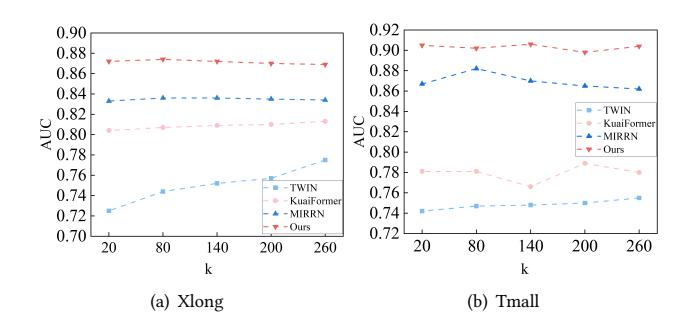
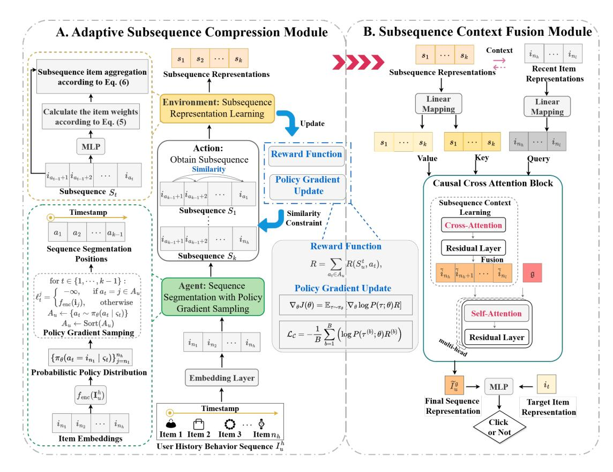
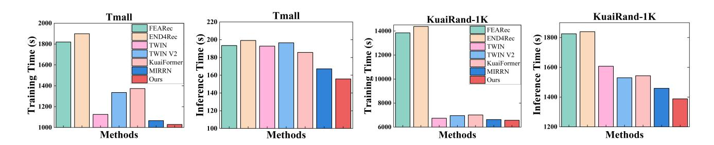
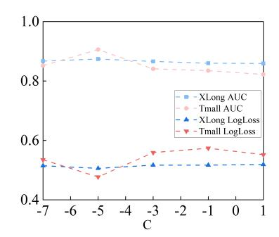

# Lifelong Sequential Recommendation with Adaptive Subsequence Compression and Contextual Fusion

[Fei Li](https://orcid.org/0000-0003-1372-3999)∗ Software College, Northeastern University Shenyang, China neulifei@stumail.neu.edu.cn

Xiaoming Liu∗ Software College, Northeastern University Shenyang, China 2471370@stu.neu.edu.cn

Jiayi Luo Software College, Northeastern University Shenyang, China 2471374@stu.neu.edu.cn

Guibing Guo† Software College, Northeastern University Shenyang, China guogb@swc.neu.edu.cn

Jianzhe Zhao† Software College, Northeastern University Shenyang, China zhaojz@swc.neu.edu.cn

Xingwei Wang School of Computer Science and Engineering, Northeastern University Shenyang, China wangxw@mail.neu.edu.cn

# Abstract

Lifelong sequential recommendation aims to model users' longterm interests by leveraging their entire interaction history, but the high computational overhead caused by ultra-long sequences poses a core challenge. To address this, existing methods generally adopt the subsequence learning strategies to shorten the input sequence, which can be divided into two categories: (1) Sequence compression methods compress long sequences into multiple subsequence representations through strategies such as uniform segmentation and clustering; (2) Top-k retrieval methods filter the subsequence related to the target item from long sequences via target attention mechanisms or retrieval mechanisms and learn its representation. However, these two types of methods still face challenges in subsequence representation learning: (1) Sequence compression methods struggle to simultaneously balance the high similarity of items within subsequences and smooth temporal continuity (i.e., small temporal intervals between adjacent items), resulting in incorrect learning of subsequence representations; (2) Top-k retrieval methods lose a large amount of effective context information when the length of the retrieved subsequence is much smaller than the original sequence, resulting in incomplete sequence representations. To overcome these challenges, we propose a novel lifelong sequential recommendation method with adaptive subsequence compression and contextual fusion. Specifically, an adaptive subsequence compression module is first designed: it utilizes gradient policy sampling to achieve adaptive segmentation of subsequences, thereby retaining their temporal continuity, and introduces a reward function to enhance the similarity of items within subsequences. Second, a subsequence context fusion module is

WWW '26, Dubai, United Arab Emirates © 2026 Copyright held by the owner/author(s). ACM ISBN 979-8-4007-2307-0/2026/04 <https://doi.org/10.1145/3774904.3792176>

constructed: it leverages causal cross-attention to fuse recent interactions with their subsequence context and to capture correlations among recent items, thereby learning more complete and accurate sequence representations. We conduct extensive experiments on three public long-sequence recommendation datasets. Experimental results demonstrate that our proposed method consistently outperforms a variety of strong baselines in both predictive accuracy and computational efficiency. We provide the anonymous code at [https://github.com/muzi1998/AdaSCOF.](https://github.com/muzi1998/AdaSCOF)

# CCS Concepts

### • Information systems → Recommender systems.

## Keywords

Lifelong Sequential Recommendation, Lifelong User Behavior Modeling, Adaptive Subsequence Compression, Click-Through Rate Prediction

### ACM Reference Format:

Fei Li, Xiaoming Liu, Jiayi Luo, Guibing Guo, Jianzhe Zhao, and Xingwei Wang. 2026. Lifelong Sequential Recommendation with Adaptive Subsequence Compression and Contextual Fusion. In Proceedings of the ACM Web Conference 2026 (WWW '26), April 13–17, 2026, Dubai, United Arab Emirates. ACM, New York, NY, USA, [10](#page-9-0) pages[. https://doi.org/10.1145/3774904.3792176](https://doi.org/10.1145/3774904.3792176)

# 1 Introduction

Sequential recommendation generates personalized recommendations by modeling users' historical behaviors. It has been widely applied in practical scenarios such as e-commerce, food delivery, and short video platforms, supporting core tasks like Click-Through Rate (CTR) prediction. Existing works have shown that in these scenarios, the number of user interactions often exceeds 1,000 [\[12,](#page-8-0) [30,](#page-8-1) [33,](#page-8-2) [37\]](#page-8-3). However, traditional sequential recommendation methods are constrained by inherent model limitations: Recurrent Neural Networks [\[24\]](#page-8-4) struggle to preserve long-term memory, while the self-attention mechanism [\[16\]](#page-8-5) incurs high computational costs. These limitations make it difficult for traditional methods to model users' complete interaction sequences effectively. To tackle this problem, lifelong sequential recommendation methods have been proposed, aiming to capture users' long-term interests through

∗These authors contributed equally.

†Corresponding authors.

[This work is licensed under a Creative Commons Attribution-NonCommercial-](https://creativecommons.org/licenses/by-nc-nd/4.0)[NoDerivatives 4.0 International License.](https://creativecommons.org/licenses/by-nc-nd/4.0)

their complete interaction sequences. Consequently, efficiently processing ultra-long user sequences has become a key challenge.

Existing lifelong sequential recommendation methods reduce the input sequence length through subsequence learning strategies, which can be roughly categorized into two classes: (1) Sequence compression methods compress ultra-long sequences into a set of subsequence representations via uniform segmentation or clustering. For example, KuaiFormer [\[20\]](#page-8-6) and LONGER [\[2\]](#page-8-7) uniformly split the input sequence by timestamp into subsequences containing an equal number of interactions and employ a Transformer to learn each subsequence representation. In contrast, GLSM [\[34\]](#page-8-8), TWIN-V2 [\[33\]](#page-8-2), and MIRRN [\[37\]](#page-8-3) apply the clustering methods in the embedding space to group similar items into interest clusters, and use cluster centroids or within-cluster aggregated representations as the representations of subsequences. (2) Unlike subsequence compression methods that learn multiple subsequence representations, Top-k retrieval methods adopt a two-stage retrieval strategy to learn the subsequence relevant to the target item: First, the General Search Unit (GSU) performs coarse-grained filtering on the ultra-long sequence to select the candidate subsequence; Second, the Exact Search Unit (ESU) conducts fine-grained processing on the retrieval subsequence based on target attention to extract the user's long-term interests (e.g., SIM [\[30\]](#page-8-1)). Some methods, including ETA [\[5\]](#page-8-9), SDIM [\[1\]](#page-8-10), TWIN [\[3\]](#page-8-11), and DARE [\[11\]](#page-8-12), propose enhanced

GSU architectures tailored for more accurate subsequence selection. However, our experimental analysis reveals that the above two types of methods still face the following issues in subsequence representation learning. (i) Existing works have demonstrated that noiseless sequences exhibit two core characteristics: high inter-item similarity and smooth temporal continuity [\[38\]](#page-8-13). However, existing compression strategies struggle to simultaneously maintain these two core characteristics of subsequences, ultimately making it difficult to learn subsequence representations accurately. Specifically, the uniform segmentation strategy divides subsequences solely based on temporal information while ignoring item similarity, which results in significant disparities among items within the same subsequence. When items in a subsequence exhibit significant differences in the feature space, the model's ability to capture inter-item correlations is weakened [\[38\]](#page-8-13). In contrast, the clusteringbased strategy constructs interest clusters purely based on item similarity, while neglecting temporal information, resulting in significant temporal intervals between items within the same cluster. Significant temporal intervals in sequences can easily trigger user preference drift [\[8\]](#page-8-14). (ii) Existing works have demonstrated that leveraging subsequence context information in complete sequences facilitates more complete and accurate modeling of user interests [\[17,](#page-8-15) [20,](#page-8-6) [34,](#page-8-8) [37\]](#page-8-3). However, Top-k retrieval methods typically retain only a single subsequence relevant to the target item during the GSU stage. When the retrieved subsequence is significantly shortened compared to the original sequence, a large amount of context information valuable for user interest modeling is lost—including correlations between recent items and subsequences. During the ESU stage, these methods ignore the mining of intra-subsequence item context, ultimately resulting in incomplete learned subsequence representations.

To address the above, we propose a novel lifelong sequential recommendation method that incorporates adaptive subsequence compression and contextual fusion. Specifically, we first present an Adaptive Subsequence Compression module that aims to generate subsequences with both smooth temporal continuity and high inter-item similarity. Under the reinforcement learning framework, this module performs sampling based on policy gradient to dynamically determine the segmentation positions of the sequence. It sorts the segmentation positions in ascending order according to their corresponding interaction timestamps, ensuring that the divided subsequences maintain their temporal order. Meanwhile, a reward function is designed to encourage high similarity among items within each generated subsequence—i.e., to make the learned subsequence representation as close as possible to the representations of its constituent items. Based on the calculated reward signals, the policy gradient algorithm is adopted to iteratively and dynamically update the segmentation decision, thereby optimizing the sequence segmentation positions. Secondly, a Subsequence Context Fusion module is constructed to learn complete and accurate subsequence representations. This module first learns the correlation between recently interacted items and subsequences through a cross-attention mechanism, and fuses the relevant subsequence information into the recent item representations, producing item representations enriched with subsequence context. Subsequently, a global representation is introduced, and a causal attention mechanism is applied to the global representation and the fused recent item representations to model the sequential correlation between subsequent interacted items and previous interacted items. In summary, the contributions of this paper can be presented as follows:

1) We conducted an empirical study to verify that existing lifelong sequential recommendation methods ignore the temporal continuity of subsequences, the similarity of items within sequences, and subsequence context information when learning subsequence representations, leading to a decline in recommendation accuracy. 2) To address this issue, we design an adaptive subsequence compression module aimed at generating subsequences with both smooth temporal continuity and high inter-item similarity, and propose a subsequence context fusion module to learn more complete and accurate subsequence representations.

3) Extensive experimental results show that compared with existing lifelong sequential recommendation methods, our method exhibits better efficiency and higher recommendation accuracy.

# 2 Assumption Validation

In this section, we systematically evaluate the effects of three factors on the performance of lifelong sequence recommendation methods: the context number (i.e., the number of intra-subsequence items or compressed subsequence representations), inter-item similarity, and temporal continuity. Specifically, we compare the recommendation accuracy of a classic Top-k retrieval method (TWIN [\[3\]](#page-8-11)) and three sequence-compression methods (KuaiFormer [\[20\]](#page-8-6), MIRRN [\[37\]](#page-8-3), and our proposed method), by varying the context number �� on the public datasets XLong and TMall. Dataset configurations are detailed in Section [6.1.](#page-5-0) In all experiments, the sequence length of user behavior is set to 1000. To ensure comparability, the number �� of contexts for all four methods is fixed to the same values.

As shown in Fig. [1,](#page-2-0) when the number of contexts decreases from 260 to 20, the accuracy of the Top-k retrieval method Twin drops

| ��       | Model        | AUC           | ↑ ICS  | ↑ ITI ↓    |
|----------|--------------|---------------|--------|------------|
| Uniform  | Segmentation | 0.8675        | 0.6334 | 34.3376    |
| K-means  | Clustering   | 0.8443        | 0.7799 | 1,611.7325 |
| Adaptive | Segmentation | (Ours) 0.8977 | 0.8090 | 2.2102     |
| Uniform  | Segmentation | 0.8584        | 0.6979 | 48.6124    |
| K-means  | Clustering   | 0.8537        | 0.7756 | 2,179.3079 |
| Adaptive | Segmentation | (Ours) 0.9059 | 0.7604 | 2.9253     |
| Uniform  | Segmentation | 0.8474        | 0.7139 | 83.3451    |
| K-means  | Clustering   | 0.8314        | 0.7636 | 2,397.4502 |
| Adaptive | Segmentation | (Ours) 0.9020 | 0.7699 | 5.9953     |

minimizes the information loss between the compressed subsequence representation and the item representations within the subsequence. Formally, it is defined as:

L�� = mean − ∑︁ ��=1 log �� (�� (��) ; ��)�� (��) ! , (6)

where �� denotes the number of training batches, �� (��) represents the trajectory sampled in the ( b )-th batch, �� (�� (��) ; ��) is the probability of trajectory �� (��) generated by the policy network parameterized by ��, and �� (��) denotes the corresponding reward value.

The prediction loss L�� measures the discrepancy between the predicted probability ��ˆ���� of the target item and its ground-truth label ������ . Here, we adopt the commonly used binary cross-entropy loss to optimize the recommendation model:

L�� = mean © « − ∑︁ ���� ∈D ������ log(��ˆ���� ) + (1 − ������ ) log(1 − ��ˆ���� ) ª ® ¬ , (7)

where D = {(����,����)|�� ∈ U, ����,���� ∈ I} denotes the training set. Combining the subsequence compression loss L�� and the prediction loss L��, the final optimization objective is defined as:

L���������� = L�� + ����L��, (8)

where ���� is a hyperparameter controlling the trade-off between prediction accuracy and subsequence representation learning.

# 4.4 Complexity Analysis

Our method consists of two modules, and its overall time complexity can be expressed as O ��ℎ�� + ��ℎ�� + �������� + �� 2 �� �� , where ��ℎ denotes the number of items in the historical sequence, �� denotes the number of subsequences, �� denotes the dimensionality of the item embeddings, and ���� is the number of recent items. In long-sequence recommendation tasks, it typically holds that ��, ���� ≪ ��ℎ; therefore, the above complexity may be approximated as O ��ℎ�� + ��ℎ�� .

## 5 Discussion

Compared to existing lifelong sequential recommendation methods, our approach offers the following advantages:

(1) Previous studies have shown that noise-free sequences typically exhibit smooth temporal continuity and high item similarity [\[38\]](#page-8-13). However, existing sequence compression methods often consider only item similarity or temporal information independently. In contrast, our method explicitly incorporates both item temporal continuity and inter-item similarity as optimization objectives in the policy network for adaptive sub-sequence partitioning. As demonstrated in Section [2,](#page-1-0) subsequences generated by existing methods capture only one of these properties. In contrast, our method produces subsequences that simultaneously satisfy both, enabling more accurate learning of subsequence representations.

(2) During inference, top-k retrieval methods such as TWIN[\[3\]](#page-8-11) typically need to retrieve subsequences that are relevant to the target item, which introduces an additional per-query retrieval cost on the order of O (��ℎ�� + ����). By contrast, our subsequence representations are computed independently of the target item, so no expensive target-dependent retrieval is required; the only extra per-query cost associated with recent-item processing is O (������). Since ���� ≪ ��ℎ, this design substantially reduces the per-query computational overhead compared with top-k retrieval methods.

(3) The subsequence context fusion module injects global contextual information into the learned sequence representations, improving robustness when the number of available contexts is limited.

### 6 Experiments

### 6.1 Experimental Settings

Dataset Description. We conduct extensive experiments on three real-world and large-scale datasets (XLong[1](#page-5-1) , Tmall [\[35\]](#page-8-22), and KuaiRand-1K [\[13\]](#page-8-23) to compare the recommendation accuracy of six methods. The statistics of these three datasets are presented in Table [2.](#page-5-2)

Table 2: The statistics of three datasets.

| Dataset     | #User  | #Item     | #AvgLen |
|-------------|--------|-----------|---------|
| XLong       | 49,692 | 3,267,007 | 1,000   |
| Tmall       | 6,982  | 1,743,898 | 1,278   |
| KuaiRand-1K | 516    | 3,981,963 | 18,742  |

Baselines. We conduct a comprehensive comparison with six baseline methods. These baselines include two traditional sequential recommendation methods, FEARec [\[10\]](#page-8-24) and END4Rec [\[14\]](#page-8-25), as well as four lifelong sequential recommendation methods: the Top-k retrieval method TWIN [\[3\]](#page-8-11), and the subsequence compression methods TWIN V2 [\[33\]](#page-8-2), KuaiFormer [\[20\]](#page-8-6), and MIRRN [\[37\]](#page-8-3).

Evaluation Settings. During the data preprocessing stage, we selected users with historical interaction lengths exceeding 1000, 1000, and 8000 in the XLong, Tmall, and KuaiRand-1k datasets, respectively, to construct the training dataset. Following previous practice [\[29,](#page-8-26) [37\]](#page-8-3), 80% of the user interactions are used for the training set, 10% for the validation set, and the remaining 10% for the test set. Negative samples are generated by randomly selecting items that users have not interacted with. To assess the effectiveness of our method, we adopt two widely used evaluation metrics: AUC (Area Under the ROC Curve) and LogLoss [\[2,](#page-8-7) [17,](#page-8-15) [41\]](#page-8-27).

Implementation Details. Model parameters are optimized using the AdamW optimizer [\[26\]](#page-8-28) with a weight decay of 10−4 , a learning rate of 10−3 , and a batch size of 64. All models are trained for 5 epochs on each dataset. To ensure fair comparison, the embedding dimensions are set to 16 for the XLong dataset and 64 for the Tmall and KuaiRand-1K datasets. For our method and the four lifelong sequential recommendation baselines, the number �� of contexts is set to {20, 80, 140, 200, 260}, and the number of recent items is fixed at 20. The hyperparameter ���� in Eq. [\(8\)](#page-5-3) is selected from {10−7 , 10−5 , 10−3 , 10−1 , 10}. All hyperparameters for the six baselines are kept consistent with those specified in their papers.

### 6.2 Performance Comparison

In this section, we compare the recommendation accuracy of the proposed method with six baseline methods on three datasets. For lifelong sequential recommendation methods, the number of contexts is set to 80. The experimental results are shown in Table [3,](#page-6-0) from

1Alibaba XLong Dataset:<https://tianchi.aliyun.com/dataset/22482>

Figure 3: Comparison of training and inference times for seven methods on two long-sequence datasets.

Table 3: Experimental results of our methods and six baselines in terms of AUC and LogLoss. The best result is highlighted in bold, and the best result among the five baselines is underlined. The symbol † indicates that our method significantly outperforms the optimal baseline at the 0.05 level based on the paired t-test.

| Dataset Method | AUC ↑   | XLong LogLoss | ↓ AUC ↑ | Tmall LogLoss | ↓ AUC ↑ | Kuairand-1K LogLoss ↓ |
|----------------|---------|---------------|---------|---------------|---------|-----------------------|
| FEARec         | 0.729   | 0.661         | 0.718   | 0.621         | 0.888   | 0.502                 |
| END4Rec        | 0.732   | 0.677         | 0.721   | 0.620         | 0.886   | 0.509                 |
| TWIN           | 0.774   | 0.614         | 0.742   | 0.627         | 0.905   | 0.484                 |
| TWIN V2        | 0.766   | 0.608         | 0.775   | 0.601         | 0.916   | 0.480                 |
| KuaiFormer     | 0.807   | 0.585         | 0.781   | 0.610         | 0.920   | 0.478                 |
| MIRRN          | 0.836   | 0.540         | 0.882   | 0.497         | 0.955   | 0.443                 |
| Ours           | 0.863 † | 0.534 †       | 0.905 † | 0.471 †       | 0.986 † | 0.415 †               |
| Imp. (%)       | 3.23%   | 1.11%         | 2.61%   | 5.23%         | 3.25%   | 6.32%                 |

which we can draw the following conclusions: (1) Our AdaSCOF significantly outperforms all baseline methods. On the three public datasets, compared with the strongest baseline method MIRRN, AdaSCOF achieves an average improvement of 3.03% in the AUC metric and 4.22% in the LogLoss metric, verifying its effectiveness. Different from sequence compression methods that perform subsequence partitioning only based on item-user interest similarity (e.g., TWIN V2 and MIRRN) or item temporal information (e.g., KuaiFormer), AdaSCOF simultaneously considers the temporal dependencies and similarity of items during the policy gradientbased sampling and partitioning process, thereby generating subsequences that are temporally smooth and semantically highly relevant. (2) Sequence compression methods are generally superior to Top-k based retrieval methods. All four sequence compression methods utilize subsequence context information from the complete interaction sequence to model users' long-term interests, which effectively alleviates the problem of incomplete interest representation caused by insufficient context information. Thus, their overall recommendation performance is better than that of TWIN based on Top-k retrieval. (3) Compared with the two traditional sequential recommendation methods (FEARec and END4Rec), the five lifelong sequential recommendation methods can model users' long-term preferences more comprehensively, thereby demonstrating obvious advantages in recommendation accuracy.

### 6.3 Computational Efficiency Analysis

We evaluate the computational efficiency of seven methods on two long-sequence datasets. The results in the Fig. [3](#page-6-1) reveal the following observations: (1) Our proposed method significantly outperforms the six baselines in both training and inference efficiency while achieving the best overall recommendation performance. Compared to the strongest baseline MIRRN, our method reduces the average training time by 2.14% and the inference time by 5.83%, while improving the AUC and LogLoss metrics by 2.92% and 5.66% on average, respectively. (2) The five lifelong sequential recommendation methods adopt subsequence learning strategies that effectively reduce the computational complexity of model training, resulting in substantially lower training times compared to the two traditional sequential recommendation methods.

Table 4: Ablation study results. ���� denotes the training time.

### 6.4 Ablation Study

We conduct ablation experiments to investigate the effectiveness of each component in our method. "w/o ASC" denotes removing the Adaptive Subsequence Compression (ASC) module from our AdaSCOF, where the subsequence compression representations learned by ASC are replaced with the original item representations from the historical sequence �� ℎ . "w/o SCF" denotes removing the Subsequence Context Fusion (SCF) module, where the subsequence compression representations are concatenated with recent item representations for predicting the target item. "w/o ASC and SCF" directly uses the complete interaction sequence for target prediction. Table [4](#page-6-2) presents the results of the ablation study. From these results, we draw the following observations: (1) Our AdaS-COF outperforms all three variants on both datasets, indicating that both the ASC and SCF modules contribute to improving recommendation accuracy and computational efficiency. (2) The "w/o SCF" variant achieves higher accuracy than the other two variants, demonstrating that leveraging rich contextual information from

preceding interactions helps learn more precise sequence representations. However, its computational efficiency is lower than that of 'w/o ASC" and our AdaSCOF, suggesting that the ASC module effectively reduces model time complexity by learning a compact set of subsequence compression representations. (3) The "w/o ASC and SCF" variant performs the worst, indicating that directly using the complete interaction sequence ���� for target prediction incurs high computational cost and results in lower accuracy.

Figure 4: Sensitivity analysis of hyperparameter L�� = 10��.

### 6.5 Hyperparameter Analysis

This section systematically examines the impact of varying the parameter L�� on model performance across two datasets, with the results presented in Fig. [4.](#page-7-0) As L�� increases from 10−7 to 101 , the model will overemphasize learning more accurate subsequence representations, thereby impairing the optimization of recommendation performance. Conversely, when L�� is too low (e.g., 10−7 ), the resulting subsequence compression representations are inaccurate. Overall, when L�� = 10−5 , the model achieves an effective balance between generating information-rich subsequence compression representations and maintaining high predictive accuracy.

# 7 Related Work

Sequential Recommendation. Sequential recommendation has emerged as a prominent research hotspot in the field of recommendation systems, focusing on modeling dynamic user behavior sequences to predict future interaction preferences [\[7,](#page-8-29) [19\]](#page-8-30). A key challenge in this area lies in the efficiency bottleneck caused by the quadratic time complexity of the self-attention mechanism, which becomes prohibitive for long user behavior sequences [\[16\]](#page-8-5). To tackle this issue, several linear-time sequential modeling methods have been proposed in recent years. LinRec [\[23\]](#page-8-31), leveraging linear attention mechanisms, transforms the traditional dot-product attention matrix into a feature-mapping form, thereby achieving linear time complexity during inference. Inspired by the state-space model Mamba [\[9\]](#page-8-32), Mamba4Rec [\[22\]](#page-8-33), and SIGMA [\[25\]](#page-8-34), this work replaces conventional attention modules with efficient Mamba blocks to achieve linear-time sequential modeling. RecBLR [\[21\]](#page-8-35) substitutes computationally costly attention modules with Behavior-Dependent Linear Recurrent Units and incorporates a hardwareaware parallel acceleration algorithm to enhance efficiency. GLINT-RU [\[40\]](#page-8-36) employs a dense selective Gated Recurrent Unit (GRU) [\[6\]](#page-8-37)

module instead of attention, enabling the capture of long- and shortterm dependencies at linear computational cost. However, a critical limitation of these methods is their neglect of the adverse impact of interest drift on the effectiveness of learning user representations. Lifelong Sequential Recommendation. Unlike efficient sequential recommendation methods, lifelong sequential recommendation focuses on designing subsequence learning strategies to shorten the input sequence length. Existing subsequence learning strategies can be broadly classified into two categories. (i) SIM [\[30\]](#page-8-1) is a typical Top-�� retrieval method. It first uses a General Search Unit (GSU) to perform coarse retrieval from long-term behaviors, selecting items related to the target item to form a subsequence. Then, an Exact Search Unit (ESU) further refines user-interest modeling on this subsequence. Some scholars have proposed different search strategies for GSU: for example, UBR4CTR [\[31\]](#page-8-38) uses the BM25 algorithm [\[32\]](#page-8-39) to search for relevant behaviors; ETA [\[5\]](#page-8-9) proposes an end-to-end model, which encodes item embeddings using locality-sensitive hashing [\[4\]](#page-8-40) and retrieves relevant items through Hamming distance; SDIM [\[1\]](#page-8-10) directly collects behavior items sharing the same hash signature with candidate items and performs linear aggregation on them; TWIN [\[3\]](#page-8-11) designs a consistency-preserving GSU through behavior feature decomposition and adopts the same target behavior relevance measurement method as ESU. To address the challenge of a single embedding space being unable to effectively learn both attention and representation information simultaneously, DARE [\[11\]](#page-8-12) achieves complete decoupling of attention and representation by introducing and independently training two sets of embedding representations. (ii) Subsequence compression methods divide the user behavior sequence into multiple subsequences and learn their representations. For example, ADFM [\[18\]](#page-8-41) and TWIN V2 [\[33\]](#page-8-2) adopt a hierarchical clustering method to aggregate items with similar features into clusters, using cluster centers as subsequent representations; MIRRN [\[37\]](#page-8-3) divides subsequences based on an interest clustering strategy; KuaiFormer [\[20\]](#page-8-6) generates subsequences using a uniform division method.

## 8 Conclusions

This paper presents experiments that verify existing lifelong sequential recommendation methods overlook temporal continuity and item similarity within sequences, and suffer from the loss of subsequence context information when learning subsequence representations, ultimately leading to a decline in recommendation accuracy. To address the above issues, we propose a lifelong sequential recommendation method named AdaSOCF. Specifically, the adaptive subsequence compression module first realizes adaptive subsequence segmentation by designing a gradient strategy that simultaneously considers temporal continuity and item similarity. Second, the subsequence context fusion module fuses recently interacted items with their related subsequence contexts, thereby learning more complete and accurate sequence representations.

# Acknowledgments

This work is partially supported by the National Natural Science Foundation of China under Grant (No. 62576083, No. 62432003), and the Natural Science Foundation of Liaoning Province (No. 2024- MSBA-49).

References [1] Yue Cao, Xiaojiang Zhou, Jiaqi Feng, Peihao Huang, Yao Xiao, Dayao Chen, and Sheng Chen. 2022. Sampling Is All You Need on Modeling Long-Term User Behaviors for CTR Prediction. In CIKM. 2974–2983. [2] Zheng Chai, Qin Ren, Xijun Xiao, Huizhi Yang, Bo Han, Sijun Zhang, Di Chen, Hui Lu, Wenlin Zhao, Lele Yu, Xionghang Xie, Shiru Ren, Xiang Sun, Yaocheng Tan, Peng Xu, Yuchao Zheng, and Di Wu. 2025. LONGER: Scaling Up Long Sequence Modeling in Industrial Recommenders. In RecSys. 247–256. [3] Jianxin Chang, Chenbin Zhang, Zhiyi Fu, Xiaoxue Zang, Lin Guan, Jing Lu, Yiqun Hui, Dewei Leng, Yanan Niu, Yang Song, and Kun Gai. 2023. TWIN: TWo-stage Interest Network for Lifelong User Behavior Modeling in CTR Prediction at Kuaishou. In KDD. 3785–3794. [4] Moses S. Charikar. 2002. Similarity estimation techniques from rounding algorithms. In STOC. 380–388. [5] Qiwei Chen, Changhua Pei, Shanshan Lv, Chao Li, Junfeng Ge, and Wenwu Ou. 2021. End-to-End User Behavior Retrieval in Click-Through Rate Prediction Model. arXiv[:2108.04468](https://arxiv.org/abs/2108.04468) [doi:10.48550/arXiv.2108.04468](https://doi.org/10.48550/arXiv.2108.04468) [6] Junyoung Chung, Çaglar Gülçehre, KyungHyun Cho, and Yoshua Bengio. 2014. Empirical evaluation of gated recurrent neural networks on sequence modeling. arXiv[:1412.3555](https://arxiv.org/abs/1412.3555) [doi:10.48550/arXiv.1412.3555](https://doi.org/10.48550/arXiv.1412.3555) [7] Yizhou Dang, Yuting Liu, Enneng Yang, Guibing Guo, Linying Jiang, Xingwei Wang, and Jianzhe Zhao. 2024. Repeated Padding for Sequential Recommendation. In RecSys. 497–506. [8] Yizhou Dang, Enneng Yang, Guibing Guo, Linying Jiang, Xingwei Wang, Xiaoxiao Xu, Qinghui Sun, and Hong Liu. 2024. TiCoSeRec: Augmenting Data to Uniform Sequences by Time Intervals for Effective Recommendation. IEEE Transactions on Knowledge and Data Engineering 36, 6 (2024), 2686–2700. [9] Tri Dao and Albert Gu. 2024. Transformers are SSMs: generalized models and efficient algorithms through structured state space duality. In ICML. 31 pages. [10] Xinyu Du, Huanhuan Yuan, Pengpeng Zhao, Jianfeng Qu, Fuzhen Zhuang, Guanfeng Liu, Yanchi Liu, and Victor S. Sheng. 2023. Frequency Enhanced Hybrid Attention Network for Sequential Recommendation. In SIGIR. 78–88. [11] Ningya Feng, Junwei Pan, Jialong Wu, Baixu Chen, Ximei Wang, QianLi, Xian Hu, Jie Jiang, and Mingsheng Long. 2025. Long-Sequence Recommendation Models Need Decoupled Embeddings. In ICLR, Y. Yue, A. Garg, N. Peng, F. Sha, and R. Yu (Eds.). 20123–20144. [12] Zhichao Feng, JunJie Xie, Kaiyuan Li, Yu Qin, Pengfei Wang, Qianzhong Li, Bin Yin, Xiang Li, Wei Lin, and Shangguang Wang. 2024. Context-based Fast Recommendation Strategy for Long User Behavior Sequence in Meituan Waimai. In WWW. 355–363. [13] Chongming Gao, Shijun Li, Yuan Zhang, Jiawei Chen, Biao Li, Wenqiang Lei, Peng Jiang, and Xiangnan He. 2022. KuaiRand: An Unbiased Sequential Recommendation Dataset with Randomly Exposed Videos. In CIKM. 3953–3957. [doi:10.1145/3511808.3557624](https://doi.org/10.1145/3511808.3557624) [14] Yongqiang Han, Hao Wang, Kefan Wang, Likang Wu, Zhi Li, Wei Guo, Yong Liu, Defu Lian, and Enhong Chen. 2024. Efficient Noise-Decoupling for Multi-Behavior Sequential Recommendation. In WWW. 3297–3306. [15] Sham M. Kakade. 2001. A Natural Policy Gradient. In NeurIPS, Thomas G. Dietterich, Suzanna Becker, and Zoubin Ghahramani (Eds.). 1531–1538. [16] Wang-Cheng Kang and Julian McAuley. 2018. Self-attentive sequential recommendation. In ICDM. 197–206. [17] Kaiyuan Li, Yongxiang Tang, Yanhua Cheng, Yong Bai, Yanxiang Zeng, Chao Wang, Xialong Liu, and Peng Jiang. 2025. VQL: An End-to-End Context-Aware Vector Quantization Attention for Ultra-Long User Behavior Modeling. arXiv[:2508.17125](https://arxiv.org/abs/2508.17125) [doi:10.48550/arXiv.2508.17125](https://doi.org/10.48550/arXiv.2508.17125) [18] Xiaochen Li, Jian Liang, Xialong Liu, and Yu Zhang. 2022. Adversarial Filtering Modeling on Long-term User Behavior Sequences for Click-Through Rate Prediction. In SIGIR. 1969–1973. [19] Zihao Li, Chao Yang, Yakun Chen, Xianzhi Wang, Hongxu Chen, Guandong Xu, Lina Yao, and Michael Sheng. 2024. Graph and sequential neural networks in session-based recommendation: A Survey. Comput. Surveys 57, 2 (2024). [20] Chi Liu, Jiangxia Cao, Rui Huang, Kai Zheng, Qiang Luo, Kun Gai, and Guorui Zhou. 2024. KuaiFormer: Transformer-Based Retrieval at Kuaishou. arXiv[:2411.10057](https://arxiv.org/abs/2411.10057) [doi:10.48550/arXiv.2411.10057](https://doi.org/10.48550/arXiv.2411.10057) [21] Chengkai Liu, Jianghao Lin, Hanzhou Liu, Jianling Wang, and James Caverlee. 2024. Behavior-dependent linear recurrent units for efficient sequential recommendation. In CIKM. 1430–1440. [22] Chengkai Liu, Jianghao Lin, Jianling Wang, Hanzhou Liu, and James Caverlee. 2024. Mamba4rec: Towards efficient sequential recommendation with selective state space models. arXiv[:2403.03900](https://arxiv.org/abs/2403.03900) [doi:10.48550/arXiv.2403.03900](https://doi.org/10.48550/arXiv.2403.03900) [23] Langming Liu, Liu Cai, Chi Zhang, Xiangyu Zhao, Jingtong Gao, Wanyu Wang, Yifu Lv, Wenqi Fan, Yiqi Wang, Ming He, Zitao Liu, and Qing Li. 2023. LinRec: linear attention mechanism for long-term sequential recommender Systems. In SIGIR. 289–299. [24] Qiang Liu, Shu Wu, Diyi Wang, Zhaokang Li, and Liang Wang. 2016. Contextaware sequential recommendation. In ICDM. 1053–1058. [25] Ziwei Liu, Qidong Liu, Yejing Wang, Wanyu Wang, Pengyue Jia, Maolin Wang, Zitao Liu, Yi Chang, and Xiangyu Zhao. 2025. SIGMA: selective gated mamba for sequential recommendation. In AAAI. 12264–12272. [26] Ilya Loshchilov and Frank Hutter. 2019. Decoupled Weight Decay Regularization. In ICLR. [27] Jincheng Mei, Wesley Chung, Valentin Thomas, Bo Dai, Csaba Szepesvári, and Dale Schuurmans. 2022. The role of baselines in policy gradient optimization. In NeurIPS. Article 1295, 13 pages. [28] Jincheng Mei, Chenjun Xiao, Csaba Szepesvári, and Dale Schuurmans. 2020. On the Global Convergence Rates of Softmax Policy Gradient Methods. In ICML, Vol. 119. 6820–6829. [29] Qi Pi, Weijie Bian, Guorui Zhou, Xiaoqiang Zhu, and Kun Gai. 2019. Practice on Long Sequential User Behavior Modeling for Click-Through Rate Prediction. In KDD. 2671–2679. [30] Qi Pi, Guorui Zhou, Yujing Zhang, Zhe Wang, Lejian Ren, Ying Fan, Xiaoqiang Zhu, and Kun Gai. 2020. Search-based User Interest Modeling with Lifelong Sequential Behavior Data for Click-Through Rate Prediction. In CIKM. 2685–2692. [31] Jiarui Qin, Weinan Zhang, Xin Wu, Jiarui Jin, Yuchen Fang, and Yong Yu. 2020. User Behavior Retrieval for Click-Through Rate Prediction. In SIGIR. 2347–2356. [32] Stephen Robertson, S. Walker, S. Jones, M. M. Hancock-Beaulieu, and M. Gatford. 1995. Okapi at TREC-3. In Overview of the Third Text REtrieval Conference (TREC-3). 109–126. [33] Zihua Si, Lin Guan, Zhongxiang Sun, Xiaoxue Zang, Jing Lu, Yiqun Hui, Xingchao Cao, Zeyu Yang, Yichen Zheng, Dewei Leng, Kai Zheng, Chenbin Zhang, Yanan Niu, Yang Song, and Kun Gai. 2024. TWIN V2: Scaling Ultra-Long User Behavior Sequence Modeling for Enhanced CTR Prediction at Kuaishou. In CIKM. 4890–4897. [34] Huinan Sun, Guangliang Yu, Pengye Zhang, Bo Zhang, Xingxing Wang, and Dong Wang. 2022. Graph Based Long-Term And Short-Term Interest Model for Click-Through Rate Prediction. In CIKM. 1818–1826. [35] Tianchi. 2018. IJCAI-15 Repeat Buyers Prediction Dataset. [https://tianchi.aliyun.](https://tianchi.aliyun.com/dataset/dataDetail?dataId=42) [com/dataset/dataDetail?dataId=42](https://tianchi.aliyun.com/dataset/dataDetail?dataId=42) [36] Guangxuan Xiao, Yuandong Tian, Beidi Chen, Song Han, and Mike Lewis. 2024. Efficient Streaming Language Models with Attention Sinks. In ICLR. [37] Xiang Xu, Hao Wang, Wei Guo, Luankang Zhang, Wanshan Yang, Runlong Yu, Yong Liu, Defu Lian, and Enhong Chen. 2025. Multi-granularity Interest Retrieval and Refinement Network for Long-Term User Behavior Modeling in CTR Prediction. In KDD. 2745–2755. [38] Chi Zhang, Qilong Han, Rui Chen, Xiangyu Zhao, Peng Tang, and Hongtao Song. 2024. SSDRec: Self-Augmented Sequence Denoising for Sequential Recommendation. In ICDE. 803–815. [39] Junyu Zhang, Chengzhuo Ni, Zheng Yu, Csaba Szepesvari, and Mengdi Wang. 2021. On the Convergence and Sample Efficiency of Variance-Reduced Policy Gradient Method. In NeurIPS. Article 171, 13 pages. [40] Sheng Zhang, Maolin Wang, Wanyu Wang, Jingtong Gao, Xiangyu Zhao, Yu Yang, Xuetao Wei, Zitao Liu, and Tong Xu. 2025. GLINT-RU: gated lightweight intelligent recurrent units for sequential recommender systems. In KDD. 1948– 1959. [41] Jiachen Zhu, Jianghao Lin, Xinyi Dai, Bo Chen, Rong Shan, Jieming Zhu, Ruiming Tang, Yong Yu, and Weinan Zhang. 2024. Lifelong Personalized Low-Rank Adaptation of Large Language Models for Recommendation. arXiv[:2408.03533](https://arxiv.org/abs/2408.03533) [doi:10.48550/arXiv.2408.03533](https://doi.org/10.48550/arXiv.2408.03533) A Further Validation Analysis A.1 Effect of the Context Number ��. In this section, we investigate the impact of context number on the performance of four lifelong sequential recommendation methods. The number of contexts is set to {20, 80, 140, 200, 260}, and the LogLoss metric is used to evaluate the recommendation performance. The experimental results are presented in Table [5,](#page-9-1) from which we draw the following conclusions: (1) Our method consistently outperforms the other three baseline methods under all context settings. (2) When the number of available contexts is small, TWIN tends to miss a large amount of historical behavior that is crucial for modeling user interests, leading to a significant performance decline. Specifically, when the number of contexts decreases from 260 to 20, the average performance of TWIN decreases by 5.78% across both datasets. (3) Under limited context conditions, the

three sequence compression methods learn multiple subsequence representations from the historical sequence, effectively avoiding

Table 6: Performance comparison of three subsequence compression strategies.

| ��       | Model               | LogLoss | ↓ ICS  | ↑ ITI ↓    |
|----------|---------------------|---------|--------|------------|
| Uniform  | Segmentation        | 0.5118  | 0.6334 | 34.3376    |
| K-means  | Clustering          | 0.5396  | 0.7799 | 1,611.7325 |
| Adaptive | Segmentation (Ours) | 0.4790  | 0.8090 | 2.2102     |
| Uniform  | Segmentation        | 0.5178  | 0.6979 | 48.6124    |
| K-means  | Clustering          | 0.5292  | 0.7756 | 2,179.3079 |
| Adaptive | Segmentation (Ours) | 0.4753  | 0.7604 | 2.9253     |
| Uniform  | Segmentation        | 0.5452  | 0.7139 | 83.3451    |
| K-means  | Clustering          | 0.5448  | 0.7636 | 2,397.4502 |
| Adaptive | Segmentation (Ours) | 0.4771  | 0.7699 | 5.9953     |

the loss of important contextual information and improving the stability of model performance.

Table 5: Effect of �� on the performance of four methods.

| Dataset �� | TWIN  | KuaiFormer | LogLoss ↓ MIRRN |       | Ours |
|------------|-------|------------|-----------------|-------|------|
| 260        | 0.608 | 0.586      | 0.543           | 0.528 | †    |
| 200        | 0.623 | 0.585      | 0.541           | 0.506 | †    |
| 140        | 0.629 | 0.585      | 0.541           | 0.512 | †    |
| 80         | 0.644 | 0.585      | 0.540           | 0.506 | †    |
| 20         | 0.649 | 0.585      | 0.542           | 0.508 | †    |
| 260        | 0.622 | 0.611      | 0.516           | 0.478 |      |
| 200        | 0.631 | 0.607      | 0.514           | 0.479 | †    |
| 140        | 0.643 | 0.619      | 0.509           | 0.475 | †    |
| 80         | 0.645 | 0.610      | 0.497           | 0.477 | †    |
| 20         | 0.652 | 0.612      | 0.511           | 0.471 | †    |

### A.2 Effects of Inter-item Similarity and Temporal Continuity.

In this section, we provide a more detailed experimental analysis and results regarding the effects of intra-sequence item similarity and temporal continuity on subsequence representation learning. To ensure a fair comparison of the three subsequence segmentation strategies, we use our proposed method as the backbone and replace its adaptive subsequence compression module with uniform segmentation and k-means clustering, respectively. For both uniform segmentation and k-means clustering, the compressed representation of each subsequence is obtained by averaging the item

embeddings within the subsequence. We evaluate the performance of the three methods using AUC and LogLoss metrics. Here, ICS denotes the average cosine similarity of items within subsequences, while ITI measures the temporal interval between adjacent items within subsequences. The experimental results are shown in Tables [1](#page-2-1) and [6,](#page-9-2) from which we draw the following conclusions:

(1) Our method consistently outperforms the other two subsequence compression strategies under different context settings. (2) The subsequences generated by our method exhibit significantly higher ICS and markedly lower ITI compared with the other two methods, which indicates that our approach produces more accurate subsequence representations characterized by higher inter-item similarity and smoother temporal continuity. (3) The subsequences generated by uniform segmentation show weaker ICS than those produced by our method and k-means clustering, and their ITI is only slightly better than k-means but still inferior to ours. In contrast, k-means clustering yields subsequences with much higher ITI and lower ICS than our method. These results suggest that both uniform segmentation and k-means clustering struggle to simultaneously capture the temporal information of items and item similarity, leading to less accurate subsequence representations.

# B Description of Baselines

The six baselines are categorized into three groups: traditional sequential recommendation methods, top-k retrieval methods, and sequence compression methods. The latter two categories belong to the family of lifelong sequential recommendation methods.

(1) Traditional Sequential Recommendation Methods. FEARec [\[10\]](#page-8-24): It proposes a frequency-enhanced hybrid attention network for sequential recommendation. END4Rec [\[14\]](#page-8-25): It develops an efficient behavior sequence miner and designs both hard and soft denoising modules to decouple noise signals, effectively addressing the noise issue in user interest modeling.

(2) Top-k Retrieval Methods. TWIN [\[3\]](#page-8-11): It introduces an efficient target attention mechanism for both the GSU and ESU stages.

(3) Sequence Compression Methods. TWIN [\[3\]](#page-8-11): It introduces an efficient target attention mechanism for both the GSU and ESU stages. TWIN V2: It utilizes hierarchical clustering to compress lifelong behavioral sequences, enabling the discovery of more accurate and diverse user interests. KuaiFormer [\[20\]](#page-8-6): It compresses user interaction sequences through uniform segmentation and adopts a Transformer-driven next-token prediction paradigm to capture users' multidimensional interests. MIRRN [\[37\]](#page-8-3): It divides subsequences based on an interest clustering strategy and obtains multiple interest representations through weighted aggregation.