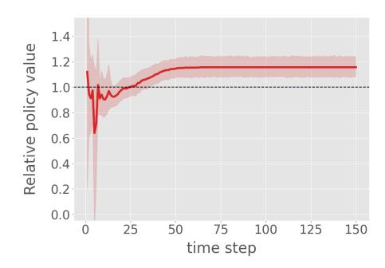
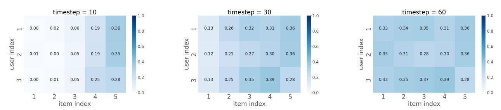
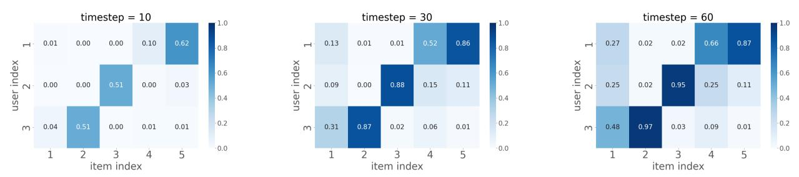
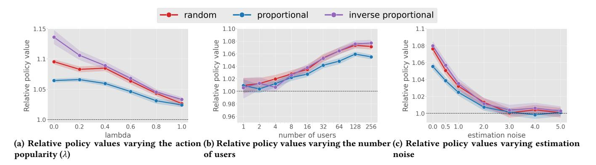
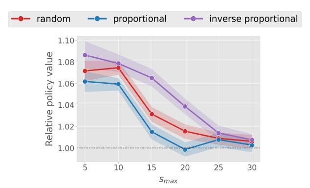
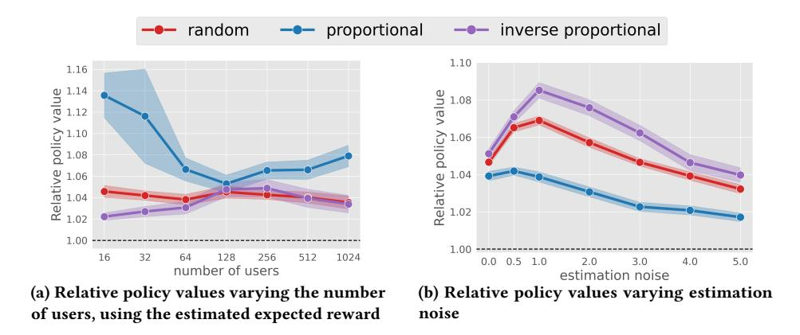
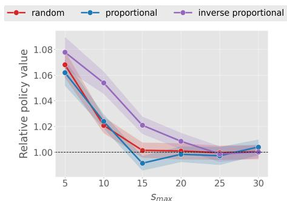
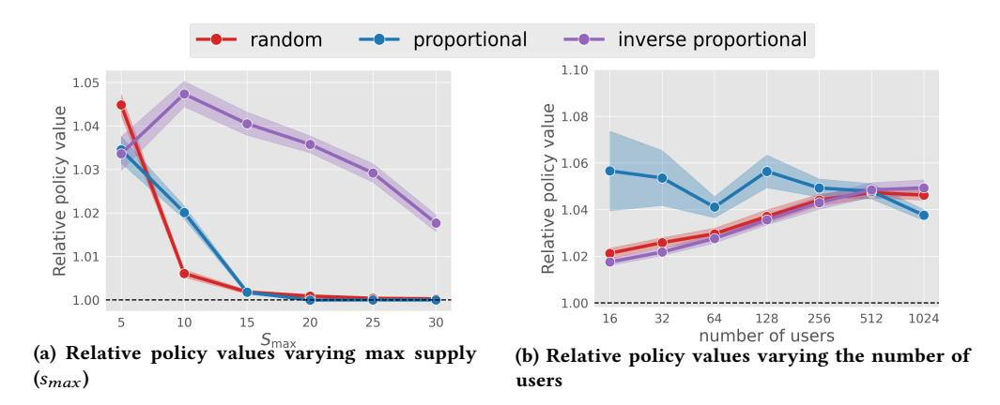

# Off-Policy Learning with Limited Supply

Koichi Tanaka∗ Keio University Tokyo, Japan kouichi\_1207@keio.jp

Ren Kishimoto∗ Institute of Science Tokyo Tokyo, Japan kishimoto.r.ab@m.titech.ac.jp Bushun Kawagishi Meiji University Tokyo, Japan ee227051@meiji.ac.jp

Yusuke Narita Yale University New Haven, CT, USA yusuke.narita@yale.edu

Yasuo Yamamoto LY Corporation Tokyo, Japan yasyamam@lycorp.co.jp

Nobuyuki Shimizu LY Corporation Tokyo, Japan nobushim@lycorp.co.jp

Yuta Saito Hanjuku-kaso, Co., Ltd. Tokyo, Japan saito@hanjuku-kaso.com

### Abstract

We study off-policy learning (OPL) in contextual bandits, which plays a key role in a wide range of real-world applications such as recommendation systems and online advertising. Typical OPL in contextual bandits assumes an unconstrained environment where a policy can select the same item infinitely. However, in many practical applications, including coupon allocation and e-commerce, limited supply constrains items through budget limits on distributed coupons or inventory restrictions on products. In these settings, greedily selecting the item with the highest expected reward for the current user may lead to early depletion of that item, making it unavailable for future users who could potentially generate higher expected rewards. As a result, OPL methods that are optimal in unconstrained settings may become suboptimal in limited supply settings. To address the issue, we provide a theoretical analysis showing that conventional greedy OPL approaches may fail to maximize the policy performance, and demonstrate that policies with superior performance must exist in limited supply settings. Based on this insight, we introduce a novel method called Off-Policy learning with Limited Supply (OPLS). Rather than simply selecting the item with the highest expected reward, OPLS focuses on items with relatively higher expected rewards compared to the other users, enabling more efficient allocation of items with limited supply. Our empirical results on both synthetic and real-world datasets show that OPLS outperforms existing OPL methods in contextual bandit problems with limited supply.

### CCS Concepts

• Information systems → Recommender systems; Personalization.

∗Equal contribution.

[This work is licensed under a Creative Commons Attribution 4.0 International License.](https://creativecommons.org/licenses/by/4.0/legalcode) WWW '26, April 13–17, 2026, Dubai, United Arab Emirates. © 2026 Copyright held by the owner/author(s). ACM ISBN 979-8-4007-2307-0/2026/04 <https://doi.org/10.1145/3774904.3792181>

### Keywords

Off-Policy Learning, Contextual Bandits, Limited Supply.

### ACM Reference Format:

Koichi Tanaka, Ren Kishimoto, Bushun Kawagishi, Yusuke Narita, Yasuo Yamamoto, Nobuyuki Shimizu, and Yuta Saito. 2026. Off-Policy Learning with Limited Supply. In Proceedings of the ACM Web Conference 2026 (WWW '26), April 13–17, 2026, Dubai, United Arab Emirates. ACM, New York, NY, USA, [12](#page-11-0) pages.<https://doi.org/10.1145/3774904.3792181>

## 1 Introduction

Decision-making problems play a crucial role in various application domains such as recommender systems [\[8,](#page-8-0) [10,](#page-8-1) [21,](#page-8-2) [22,](#page-8-3) [25\]](#page-8-4), online advertising [\[4\]](#page-8-5), and search [\[16\]](#page-8-6), where the use of data-driven algorithms has become increasingly important in recent years. These are often formulated as contextual bandit problems, where policies select an action (e.g., products, movies) based on the observed context (e.g., user feature) and receive a reward (e.g., click, conversion). The goal of the contextual bandit problem is to learn a policy that maximizes the expected reward. Off-policy learning (OPL) [\[18,](#page-8-7) [20,](#page-8-8) [29,](#page-8-9) [32\]](#page-8-10) enables policy learning solely from logged data, without deploying new policies online. This is particularly valuable because it allows for policy improvement without risking user experience or incurring the high cost of online experiments [\[12,](#page-8-11) [22\]](#page-8-3). Typical OPL methods in contextual bandits assume an unconstrained environment where a policy can select each item infinitely. However, in many real-world applications, such as coupon allocation or e-commerce, popular or scarce items may run out over time or become unavailable because of limited supply [\[5,](#page-8-12) [37\]](#page-8-13). Although conventional approaches that greedily aim to maximize the expected reward for each incoming user are optimal under typical OPL settings, they can become suboptimal with limited supply. This is because selecting an item that maximizes expected reward for a user at each time step may deplete its inventory, preventing it from being allocated to another user in the future who would generate a higher expected reward.

To illustrate this issue, we present a simple coupon allocation example in Table [1.](#page-1-0) There is exactly one coupon available for each discount type: "30% OFF," "50% OFF," and "70% OFF." We assume

Figure 4: Comparisons of relative policy values with varying (a)action popularity, (b)the number of users, and (c)estimation noise. The period �� is sufficiently large, and all items are sold out.

Figure 5: Relative policy values varying max supply (�������� )

set to |A| = 100, the popularity of actions is �� = 0.5 and ��max = 20. Except for Figure [5,](#page-6-1) the period �� is sufficiently large, and all items are sold out.

How does OPLS choose actions compared to the conventional greedy method? To demonstrate the behavior of OPLS, we conduct a small-scale experiment where the number of users is set to 3, the number of actions is |A| = 5, the initial supply is random and �� = 0.0. Table [3](#page-5-0) reports the expected reward in this experiment. The actions with larger indices have higher expected rewards because of �� = 0.0. Figure [1](#page-5-0) shows the relative policy values between OPLS and the conventional greedy method �� (��OPLS)/�� (��greedy) at each step. Note that the periods where the values remain constant indicate that the supply of all actions is zero. From Figure [1,](#page-5-0) we can see that OPLS improves the final policy value compared to the conventional greedy method. Figure [2](#page-5-1) and [3](#page-5-2) illustrate how each method selects an action for a user. The value in each grid cell represents the proportion of the supply allocated to a specific user for a particular action at that time. From Figure [2,](#page-5-1) we observe that the conventional greedy method recommends actions with the highest expected rewards in the early time steps. This is why the conventional greedy method outperforms OPLS at the initial time step in Figure [1.](#page-5-0) Eventually, the conventional greedy method recommends all actions evenly across all users. On the other hand, OPLS selectively recommends a specific action to a specific user. For example, approximately 80% of ��5 is recommended to ��1. From Table [3,](#page-5-0) ��1 has the highest expected reward for ��5 among users, so

OPLS achieves effective recommendations in limited supply settings. It is also the case for the other user-action pairs. Thus, OPLS achieves a high policy value by selectively recommending actions to users with higher expected rewards.

How does OPLS perform varying the action popularity? Figure [4a](#page-6-0) reports the relative policy values varying the action popularity (��). The small values of �� mean that all users likely prefer the actions in the same order. The results demonstrate that OPLS outperforms the conventional greedy method across all values of ��. Specifically, OPLS significantly improves policy values when �� is small. This is because the more aligned the preferences are, the more crucial it is to recommend actions to the optimal users. In this situation, all users prefer the same action, so the conventional greedy method recommends actions evenly to all users. In contrast, OPLS selectively recommends the popular action to users with a high expected reward. Therefore, OPLS demonstrates a clear advantage in scenarios where many users favor a specific action.

Moreover, compared across the initial supply, OPLS improves policy values in the inverse proportional setting. This suggests that OPLS achieves superior performance when actions with high expected rewards are rare. This is because, in such situations, it is necessary to recommend the few valuable actions effectively.

How does OPLS perform varying the the number of users? Figure [4b](#page-6-0) varies the number of users, while the number of actions is set to |A| = 100. We observe that the relative policy values gradually increase as the number of users increases. This is because, as the number of users increases, items with the high expected reward become more scarce, making it more necessary to consider limited supply.

How does OPLS perform varying estimation noises? In Figure [4c,](#page-6-0) we use an estimated expected reward ��ˆ(��, ��) = ��(��, ��) + N (0, ��) for both OPLS and the conventional greedy method. Figure [4c](#page-6-0) reports the relative policy value varying estimation noises ��. We observe that OPLS outperforms the conventional greedy method across various estimation noises, although its improvement gradually decreases as the estimation noise becomes larger. This result suggests that OPLS provides substantial improvements with a reasonably accurate estimate of the expected reward.

Figure 6: Comparisons of relative policy values with varying (a)the number of users and (b)estimation noise. The period �� is sufficiently large, and all items are sold out.

How does OPLS perform varying the max supply �������� ? Figure [5](#page-6-1) varies the max supply �������� from 5 to 30. As the max supply �������� increases, the limited supply setting gradually reduces to the NO limited supply setting. When the maximum supply is varied from 5 to 30, the proportion of unsold actions changes to approximately 0%, 5%, 30%, 40%, and 50%. We observe that OPLS improves the policy value across various max supplies. Specifically, OPLS provides substantial improvements when the max supply is small. This result is consistent with the results of Figure [4.](#page-6-0) Moreover, OPLS exhibits performance equivalent to that of the conventional greedy method even when sufficient items are available. This suggests that OPLS provides substantial performance in both limited and no limited supply settings.

### 6 Real-World Experiments

This section demonstrates the effectiveness of OPLS in the limited supply setting on a subset of the real-world recommendation dataset called KuaiRec [\[9\]](#page-8-33), which contains recommendation logs of the video-sharing app, Kuaishou. In our experiments, we use a subset of KuaiRec that contains 1,411 users and 3,327 items, for which useritem interactions are nearly fully observed (close to 100% density). This property allows us to directly access the reward function. By leveraging this unique property, we can perform an OPL experiment on this dataset with a minimal synthetic component [\[9\]](#page-8-33). Since KuaiRec does not contain inventory information, we assign artificial inventory to each video, using the same method as in our synthetic data experiments. This allows us to evaluate OPLS's performance under limited supply. While this setup is purely a simulation for research purposes, introducing certain exposure constraints can also be relevant to real-world video recommendation systems. For example, constraints may be applied to limit the over-exposure of popular videos, ensure diversity across categories, or provide initial exposure guarantees for new items to address cold-start issues.

To perform an OPL experiment on this dataset, we sample 1,000 users and 1,000 items, and treat their interactions as the action value ���� (��, ��). We set the click probability ���� (��, ��) = 1 for every user–item pair. We then define the logging policy following Eq. [\(11\)](#page-4-4), where we set �� = 1.0. We obtain an estimated expected reward ��ˆ(��, ��) using a 3-layer neural network and the logged data D.

Results. In figure [6a,](#page-7-1) we vary the number of users. We fixed the number of actions |A| = 1000. We observe that OPLS improves the policy value across various numbers of users. The results suggest that OPLS provides substantial improvements in more realistic situations where we have no access to the true expected reward.

Figure [6b,](#page-7-1) we use estimated expected reward ��ˆ(��, ��) = ��(��, ��) + N (0, ��) for both OPLS and the conventional greedy method. We observe that OPLS outperforms the conventional greedy method across various estimation noises. Unlike Figure [4c,](#page-6-0) the relative policy value increases when estimation noises are small. This shows that OPLS could be more robust against estimation noise than the conventional greedy method.

### 7 Conclusion and Future Work

In this paper, we addressed the problem of off-policy learning (OPL) with limited supply. Existing OPL methods do not account for inventory constraints, which can lead to suboptimal allocations since selecting the item that maximizes the expected reward for one user may forgo the opportunity to obtain a higher expected reward in the future. To overcome this limitation, we proposed Off-Policy Learning with Limited Supply (OPLS), which selects items by maximizing the relative expected reward across users. Moreover, OPLS can incorporate supply prediction, enabling it to adaptively choose items according to supply conditions. Through experiments on both synthetic and real-world datasets, we demonstrated that OPLS consistently outperforms existing methods with limited supply.

While this paper establishes the effectiveness of OPLS under limited supply, several directions remain open for future research. In this work, we addressed the case where each item has an individual supply constraint. A natural extension is to consider global constraints that apply to the entire set of items, which would capture more complex allocation scenarios. Moreover, since inventory is limited, future work may need to incorporate fairness-aware objectives into OPLS to balance efficiency with equity among users, rather than focusing solely on revenue maximization.

### References

[1] Shipra Agrawal and Nikhil Devanur. 2016. Linear contextual bandits with knapsacks. Advances in neural information processing systems 29 (2016).

[2] Ashwinkumar Badanidiyuru, Robert Kleinberg, and Aleksandrs Slivkins. 2018. Bandits with knapsacks. Journal of the ACM (JACM) 65, 3 (2018), 1–55. [3] Ashwinkumar Badanidiyuru, John Langford, and Aleksandrs Slivkins. 2014. Resourceful contextual bandits. In Conference on Learning Theory. PMLR, 1109–1134. [4] Léon Bottou, Jonas Peters, Joaquin Quiñonero-Candela, Denis X Charles, D Max Chickering, Elon Portugaly, Dipankar Ray, Patrice Simard, and Ed Snelson. 2013. Counterfactual Reasoning and Learning Systems: The Example of Computational Advertising. Journal of Machine Learning Research 14, 11 (2013). [5] Konstantina Christakopoulou, Jaya Kawale, and Arindam Banerjee. 2017. Recommendation with capacity constraints. In Proceedings of the 2017 ACM on Conference on Information and Knowledge Management. 1439–1448. [6] Miroslav Dudík, Dumitru Erhan, John Langford, and Lihong Li. 2014. Doubly Robust Policy Evaluation and Optimization. Statist. Sci. 29, 4 (2014), 485–511. [7] Mehrdad Farajtabar, Yinlam Chow, and Mohammad Ghavamzadeh. 2018. More Robust Doubly Robust Off-Policy Evaluation. In Proceedings of the 35th International Conference on Machine Learning, Vol. 80. PMLR, 1447–1456. [8] Nicolo Felicioni, Maurizio Ferrari Dacrema, Marcello Restelli, and Paolo Cremonesi. 2022. Off-Policy Evaluation with Deficient Support Using Side Information. Advances in Neural Information Processing Systems 35 (2022). [9] Chongming Gao, Shijun Li, Wenqiang Lei, Jiawei Chen, Biao Li, Peng Jiang, Xiangnan He, Jiaxin Mao, and Tat-Seng Chua. 2022. KuaiRec: A fully-observed dataset and insights for evaluating recommender systems. In Proceedings of the 31st ACM International Conference on Information & Knowledge Management. 540–550. [10] Alexandre Gilotte, Clément Calauzènes, Thomas Nedelec, Alexandre Abraham, and Simon Dollé. 2018. Offline A/B Testing for Recommender Systems. In Proceedings of the 11th ACM International Conference on Web Search and Data Mining. 198–206. [11] Nathan Kallus, Yuta Saito, and Masatoshi Uehara. 2021. Optimal Off-Policy Evaluation from Multiple Logging Policies. In Proceedings of the 38th International Conference on Machine Learning, Vol. 139. PMLR, 5247–5256. [12] Haruka Kiyohara, Ren Kishimoto, Kosuke Kawakami, Ken Kobayashi, Kazuhide Nakata, and Yuta Saito. 2024. Towards Assessing and Benchmarking Risk-Return Tradeoff of Off-Policy Evaluation. In International Conference on Learning Representations. [13] Haruka Kiyohara, Masahiro Nomura, and Yuta Saito. 2024. Off-policy evaluation of slate bandit policies via optimizing abstraction. In Proceedings of the ACM on Web Conference 2024. 3150–3161. [14] Haruka Kiyohara, Yuta Saito, Tatsuya Matsuhiro, Yusuke Narita, Nobuyuki Shimizu, and Yasuo Yamamoto. 2022. Doubly Robust Off-Policy Evaluation for Ranking Policies under the Cascade Behavior Model. In Proceedings of the 15th International Conference on Web Search and Data Mining. [15] Haruka Kiyohara, Masatoshi Uehara, Yusuke Narita, Nobuyuki Shimizu, Yasuo Yamamoto, and Yuta Saito. 2023. Off-Policy Evaluation of Ranking Policies under Diverse User Behavior. In Proceedings of the 29th ACM SIGKDD Conference on Knowledge Discovery and Data Mining. 1154–1163. [16] Lihong Li, Shunbao Chen, Jim Kleban, and Ankur Gupta. 2015. Counterfactual estimation and optimization of click metrics in search engines: A case study. In Proceedings of the 24th International Conference on World Wide Web. 929–934. [17] Qiang Liu, Lihong Li, Ziyang Tang, and Dengyong Zhou. 2018. Breaking the curse of horizon: infinite-horizon off-policy estimation. In Proceedings of the 32nd International Conference on Neural Information Processing Systems. 5361–5371. [18] Alberto Maria Metelli, Alessio Russo, and Marcello Restelli. 2021. Subgaussian and Differentiable Importance Sampling for Off-Policy Evaluation and Learning. Advances in Neural Information Processing Systems 34 (2021). [19] Fabian Pedregosa, Gaël Varoquaux, Alexandre Gramfort, Vincent Michel, Bertrand Thirion, Olivier Grisel, Mathieu Blondel, Peter Prettenhofer, Ron Weiss, Vincent Dubourg, Jake Vanderplas, Alexandre Passos, David Cournapeau, Matthieu Brucher, Matthieu Perrot, and Édouard Duchesnay. 2011. Scikit-learn: Machine learning in Python. Journal of Machine Learning Research 12 (2011), 2825–2830. [20] Yuta Saito, Himan Abdollahpouri, Jesse Anderton, Ben Carterette, and Mounia Lalmas. 2024. Long-term Off-Policy Evaluation and Learning. In Proceedings of the ACM on Web Conference 2024. 3432–3443. [21] Yuta Saito, Shunsuke Aihara, Megumi Matsutani, and Yusuke Narita. 2021. Open Bandit Dataset and Pipeline: Towards Realistic and Reproducible Off-Policy Evaluation. In Thirty-fifth Conference on Neural Information Processing Systems Datasets and Benchmarks Track. [22] Yuta Saito and Thorsten Joachims. 2021. Counterfactual Learning and Evaluation for Recommender Systems: Foundations, Implementations, and Recent Advances. In Proceedings of the 15th ACM Conference on Recommender Systems. 828–830. [23] Yuta Saito and Thorsten Joachims. 2022. Off-Policy Evaluation for Large Action Spaces via Embeddings. In International Conference on Machine Learning. PMLR, 19089–19122. [24] Yuta Saito, Qingyang Ren, and Thorsten Joachims. 2023. Off-Policy Evaluation for Large Action Spaces via Conjunct Effect Modeling. arXiv preprint arXiv:2305.08062 (2023). [25] Yuta Saito, Takuma Udagawa, Haruka Kiyohara, Kazuki Mogi, Yusuke Narita, and Kei Tateno. 2021. Evaluating the Robustness of Off-Policy Evaluation. In Proceedings of the 15th ACM Conference on Recommender Systems. 114–123. [26] Yuta Saito, Jihan Yao, and Thorsten Joachims. 2024. POTEC: Off-Policy Learning for Large Action Spaces via Two-Stage Policy Decomposition. arXiv preprint arXiv:2402.06151 (2024). [27] Yi Su, Maria Dimakopoulou, Akshay Krishnamurthy, and Miroslav Dudík. 2020. Doubly Robust Off-Policy Evaluation with Shrinkage. In Proceedings of the 37th International Conference on Machine Learning, Vol. 119. PMLR, 9167–9176. [28] Yi Su, Lequn Wang, Michele Santacatterina, and Thorsten Joachims. 2019. Cab: Continuous adaptive blending for policy evaluation and learning. In International Conference on Machine Learning, Vol. 84. 6005–6014. [29] Adith Swaminathan and Thorsten Joachims. 2015. Batch learning from logged bandit feedback through counterfactual risk minimization. The Journal of Machine Learning Research 16, 1 (2015), 1731–1755. [30] Adith Swaminathan and Thorsten Joachims. 2015. Counterfactual risk minimization: Learning from logged bandit feedback. In International Conference on Machine Learning. PMLR, 814–823. [31] Adith Swaminathan and Thorsten Joachims. 2015. The Self-Normalized Estimator for Counterfactual Learning. Advances in Neural Information Processing Systems 28 (2015). [32] Adith Swaminathan, Akshay Krishnamurthy, Alekh Agarwal, Miro Dudik, John Langford, Damien Jose, and Imed Zitouni. 2017. Off-Policy Evaluation for Slate Recommendation. In Advances in Neural Information Processing Systems, Vol. 30. 3632–3642. [33] Masatoshi Uehara, Chengchun Shi, and Nathan Kallus. 2022. A review of offpolicy evaluation in reinforcement learning. arXiv preprint arXiv:2212.06355 (2022). [34] Yu-Xiang Wang, Alekh Agarwal, and Miroslav Dudık. 2017. Optimal and adaptive off-policy evaluation in contextual bandits. In International Conference on Machine Learning. PMLR, 3589–3597. [35] Huasen Wu, Rayadurgam Srikant, Xin Liu, and Chong Jiang. 2015. Algorithms with logarithmic or sublinear regret for constrained contextual bandits. Advances in Neural Information Processing Systems 28 (2015). [36] Yafei Zhao and Long Yang. 2024. Constrained contextual bandit algorithm for limited-budget recommendation system. Engineering Applications of Artificial Intelligence 128 (2024), 107558. [37] Wenliang Zhong, Rong Jin, Cheng Yang, Xiaowei Yan, Qi Zhang, and Qiang Li. 2015. Stock constrained recommendation in tmall. In Proceedings of the 21th ACM SIGKDD International Conference on Knowledge Discovery and Data Mining. 2287–2296.

