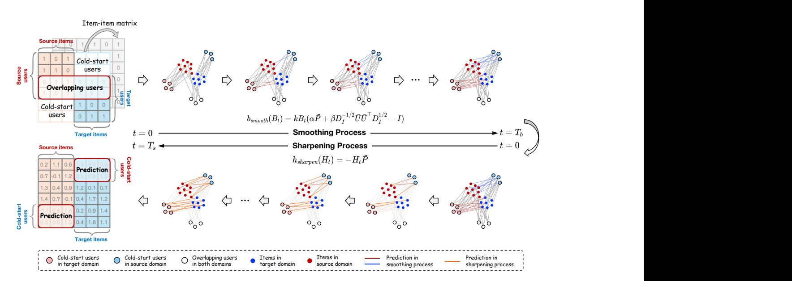
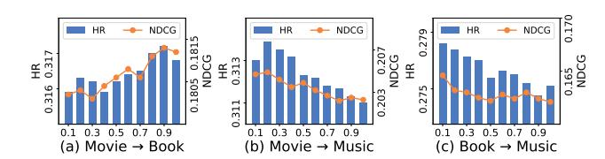
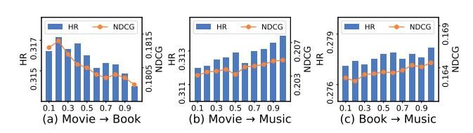
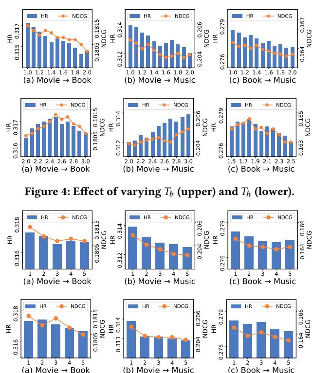

### S 2CDR: Smoothing-Sharpening Process Model for Cross-Domain Recommendation

Xiaodong Li Institute of Information Engineering, Chinese Academy of Sciences School of Cyber Security, UCAS† Beijing, China lixiaodong@iie.ac.cn

Juwei Yue Institute of Information Engineering, Chinese Academy of Sciences School of Cyber Security, UCAS Beijing, China yuejuwei@iie.ac.cn

Xinghua Zhang Alibaba Group Beijing, China zxh.zhangxinghua@gmail.com

Jiawei Sheng Institute of Information Engineering, Chinese Academy of Sciences Beijing, China shengjiawei@iie.ac.cn

Wenyuan Zhang Institute of Information Engineering, Chinese Academy of Sciences School of Cyber Security, UCAS Beijing, China zhangwenyuan@iie.ac.cn

Taoyu Su Institute of Information Engineering, Chinese Academy of Sciences Beijing, China sutaoyu@iie.ac.cn

Zefeng Zhang Institute of Information Engineering, Chinese Academy of Sciences School of Cyber Security, UCAS Beijing, China zhangzefeng@iie.ac.cn

Tingwen Liu∗ Institute of Information Engineering, Chinese Academy of Sciences School of Cyber Security, UCAS Beijing, China liutingwen@iie.ac.cn

# Abstract

User cold-start problem is a long-standing challenge in recommendation systems. Fortunately, cross-domain recommendation (CDR) has emerged as a highly effective remedy for the user cold-start challenge, with recently developed diffusion models (DMs) demonstrating exceptional performance. However, these DMs-based CDR methods focus on dealing with user-item interactions, overlooking correlations between items across the source and target domains. Meanwhile, the Gaussian noise added in the forward process of diffusion models would hurt user's personalized preference, leading to the difficulty in transferring user preference across domains. To this end, we propose a novel paradigm of Smoothing-Sharpening Process Model for CDR to cold-start users, termed as S 2CDR which features a corruption-recovery architecture and is solved with respect to ordinary differential equations (ODEs). Specifically, the smoothing process gradually corrupts the original user-item/item-item interaction matrices derived from both domains into smoothed preference signals in a noise-free manner, and the sharpening process iteratively sharpens the preference signals to recover the unknown interactions for cold-start users. Wherein, for the smoothing process, we introduce the heat equation on the item-item similarity graph to better capture the correlations between items across domains, and

[This work is licensed under a Creative Commons Attribution 4.0 International License.](https://creativecommons.org/licenses/by/4.0) WWW '26, Dubai, United Arab Emirates

© 2026 Copyright held by the owner/author(s). ACM ISBN 979-8-4007-2307-0/2026/04 <https://doi.org/10.1145/3774904.3792189>

further build the tailor-designed low-pass filter to filter out the high-frequency noise information for capturing user's intrinsic preference, in accordance with the graph signal processing (GSP) theory. Extensive experiments on three real-world CDR scenarios confirm that our S2CDR significantly outperforms previous SOTA methods in a training-free manner.

# CCS Concepts

• Information systems → Recommender systems.

# Keywords

Cross-Domain Recommendation, Cold-Start Recommendation, Collaborative Filtering

### ACM Reference Format:

Xiaodong Li, Juwei Yue, Xinghua Zhang, Jiawei Sheng, Wenyuan Zhang, Taoyu Su, Zefeng Zhang, and Tingwen Liu. 2026. S2CDR: Smoothing-Sharpening Process Model for Cross-Domain Recommendation. In Proceedings of the ACM Web Conference 2026 (WWW '26), April 13–17, 2026, Dubai, United Arab Emirates. ACM, New York, NY, USA, [11](#page-10-0) pages. [https://doi.org/10.1145/](https://doi.org/10.1145/3774904.3792189) [3774904.3792189](https://doi.org/10.1145/3774904.3792189)

# 1 Introduction

Recommendation systems (RS) [\[9,](#page-8-0) [26,](#page-8-1) [35\]](#page-8-2) have been extensively applied in various online platforms, such as Alibaba (e-commerce) and TikTok (online video), leading to multiple user interactions in different categories on e-commerce websites and different media forms in online video. Consequently, developing effective strategies for providing recommendations to newly arrived (cold-start) users in various domains has emerged as a critical challenge in RS.

∗Corresponding author.

†University of Chinese Academy of Sciences.

To alleviate the cold-start problem [\[32,](#page-8-3) [39\]](#page-8-4), cross-domain recommendation (CDR) [\[17,](#page-8-5) [19,](#page-8-6) [20,](#page-8-7) [23\]](#page-8-8) has received considerable attention in recent years, which aims to explore and exploit meaningful knowledge in related domains for achieving promising recommendation performance for cold-start users in another domain. A common idea of CDR methods is to utilize the overlapping users to bridge the source and target domains, and thus make recommendation for cold-start (non-overlapping) users who only have interactions in one domain. Following the above idea, traditional CDR methods [\[14,](#page-8-9) [23,](#page-8-8) [25\]](#page-8-10) mostly adhere to the mapping-based paradigm, which encodes user/item representations in both domains separately, and then learns a mapping function to transfer user preference across domains. In addition, some meta-based methods [\[17,](#page-8-5) [31,](#page-8-11) [45\]](#page-8-12) further adopt the meta-learning paradigm, treating each user's CDR as an individual task and learning mapping functions for each user to achieve personalized preference transfer.

Diffusion models (DMs) [\[10\]](#page-8-13) have achieved remarkable success in the field of RS [\[13,](#page-8-14) [24,](#page-8-15) [34,](#page-8-16) [40,](#page-8-17) [41\]](#page-8-18) due to their representation reconstruction ability. More recently, DMCDR [\[19\]](#page-8-6) pioneers the application of diffusion models to CDR, which gradually corrupts the user representation by adding Gaussian noise in the forward process, and then iteratively generates personalized user representation in the target domain under the guidance of user preference derived from user-item interactions in the source domain. However, the DMs-based paradigm has the following two limitations for CDR task: (1) Lack of Item Correlation: the diffusion model emphasizes the user-item interactions, neglecting to capture the correlation between items across the source and target domains, which also serves as a crucial bridge for preference transfer. (2) Detriment of External Noise: the Gaussian noise added in the forward process would hurt user's intrinsic personalized preference,

leading to transfer the sub-optimal user preference across domains. To address the above issues, this paper proposes S 2CDR, a novel Smoothing-Sharpening Process Model for CDR to cold-start users, which possesses a corruption-recovery architecture. Specifically, the smoothing process gradually smooths the user/item information including both user-item and item-item interaction signals from both domains in a noise-free manner with tailor-designed graph filters, supported by graph signal processing (GSP) [\[21,](#page-8-19) [29,](#page-8-20) [36,](#page-8-21) [38\]](#page-8-22). Wherein, we calculate the heat equation on the item-item similarity graph to capture the correlations between items across domains, and further build the effective low-pass filter to filter out the highfrequency information which is typically noise [\[21,](#page-8-19) [29\]](#page-8-20). Afterwards, the sharpening process iteratively refines and sharpens preference signals to describe user's personalized preference, thus recovering the underlying interactions for cold-start users.

To run our smoothing-sharpening process model, we further introduce ordinary differential equations (ODEs) [\[3,](#page-8-23) [5\]](#page-8-24) for more effective and efficient cross-domain preference transfer via solving our smoothing and sharpening functions in a continuous manner, naturally characterizing the user's intrinsic preference for transfer and contributing to our training-free method. Extensive experiments demonstrate that our S2CDR outperforms previous SOTA methods in three real-world CDR scenarios. Meanwhile, as a non-parametric method, our S2CDR shows high computational efficiency. Our main contributions can be summarized as follows:

- We inspire a corruption-recovery paradigm for CDR, which fulfills the bridging effect of item correlations in cross-domain preference transfer and retains user's intrinsic preference features.
- We propose a novel Smoothing-Sharpening Process Model S2CDR for CDR to cold-start users, where the smoothing process smooths the user-item/item-item interaction signals for capturing the user preference based on tailor-designed graph filters, and the sharpening process sharpens the preference signals to recover unknown interactions for cold-start users.
- We conduct extensive experiments in three real-world CDR scenarios to demonstrate the effectiveness and efficiency of our S 2CDR over previous SOTA methods. Despite the fact that S2CDR does not require any training, we still achieve an average relative improvement of 7.07%, 7.42% with respect to HR and NDCG metrics over six cross-domain pairs.

## 2 Preliminary

In this section, we review the background knowledge of graph signal processing (GSP), ordinary differential equations (ODEs), and defines our CDR problem settings. We also review diffusion models (DMs) and give a formal comparison between DMCDR and our S2CDR in Appendix [A.1](#page-9-0).

## 2.1 Graph Signal Processing

In this subsection, we introduce basic concepts of graph signal processing (GSP) [\[6,](#page-8-25) [27\]](#page-8-26), including graph signal, graph filter, and graph convolution.

2.1.1 Graph signal. Given a weighted undirected graph G = (V, E), where V = {��1, ��2, . . . , ���� } represents the vertex set with �� nodes (e.g., users or items), and E is the set of edges (e.g., user-item interactions). The graph G induces an adjacency matrix �� ∈ R ��×�� , and if there is an edge between node ���� and node ���� , then ����,�� = 1, otherwise ����,�� = 0. The graph signal is essentially a mapping �� : V → R, and it can be denoted as �� = [��1, ��2, . . . , ����] ⊤, where ���� represents the signal strength on node ���� .

Graph Laplacian matrix is the core concept in spectral graph theory [\[30\]](#page-8-27) and it can be defined as �� = ��−��, where �� = diag(��·1) is the degree matrix with ����,�� = Í �� ����,�� . In addition, the normalized graph Laplacian matrix can be defined as ��˜ = �� −��˜ , where �� denotes the identity matrix and ��˜ = �� −1/2����−1/2 .

2.1.2 Graph Filter and Graph Convolution. As the graph Laplacian matrix is real symmetric, it can be decomposed into �� = ������ ⊤, where �� = diag(��1, ��2, . . . , ����) is the eigenvalue matrix with ��1 ≤ ��2 ≤ · · · ≤ ����, and �� = (��1, ��2, . . . , ����) is the eigenvector matrix with ���� ∈ R �� being the eigenvector for eigenvalue ���� .

We can treat the eigenvector matrix �� as the bases in Graph Fourier Transform (GFT). Specifically, given the graph signal �� ∈ R��, the GFT is defined as ��ˆ = �� ⊤��, and the inverse transform is given by �� = ����ˆ. Thus, the graph filter H(��) is defined as:

H(��) = ��diag(ℎ(��1), ℎ(��2), . . . , ℎ(����))�� ⊤ , (1)

where ℎ(·) is the filter defined on the eigenvalues. Given the input signal �� and the filter H(��), the graph convolution is defined as:

�� = H(��)�� = ��diag(ℎ(��1), ℎ(��2), . . . , ℎ(����))�� ⊤ ��, (2)

Figure 1: The overall framework of S2CDR. The smoothing process aims to gradually corrupt the original user-item/item-item interaction signals into smoothed preference signals in a noise-free manner, while the sharpening process iteratively refines and sharpens the preference signals to recover the unknown interactions for cold-start users.

Analysis of the sharpening process. The sharpening process is used to refine and sharpen the preference signals obtained by the smoothing process. Taking one step further, the sharpening process is designed to describe user's personalized preference. Similar to the reverse process of DMs [\[10\]](#page-8-13), unknown user-item interactions are predicted for cold-start users after this process.

We also further emphasize that our S2CDR is a non-parametric approach with high computational efficiency. During the smoothingsharpening process, our model can be obtained in a closed-form solution instead of expensive back-propagation training, as our S 2CDR directly handles the user-item/item-item interaction matrix and there's no need for neural networks or user/item embeddings.

### 3.2 Smoothing Process

In the context of CDR, our goal is to predict the potential items that the cold-start users may interact with in both domains, which is only relevant to user-item/item-item interaction matrix �� ���� /��˜ . Therefore, we argue that it is neither efficient nor necessary to add Gaussian noise to corrupt the interaction matrix, as is done in the forward process of DMs. In addition, adding too much noise to interaction matrix would also destroy user's personalized preference modeling. To this end, we introduce a noise-free manner dedicated to graph signals, which repeats the smoothing operation until the interaction matrix reaches a steady state.

3.2.1 ODE-based Smoothing Process. The general idea of smoothing process is to solve the Riemann integral problem to derive the smoothed preference signals of cold-start users, which can be formulated as follows:

������ = ��0 + ∫ ���� 0 ��(���� )����, (8)

where the input ��0 is user-item interaction matrix �� ���� , ���� is the terminal time, and�� : R ������(��) → R ������(��) is the smoothing function which describes the time-derivative of �� , i.e., ������ ���� .

The key to the smoothing process lies in the definition of the smoothing function ��, which we will describe shortly.

3.2.2 Smoothing with Heat Equation. The heat equation describes the law of thermal diffusive processes, i.e., Newton's Law of Cooling. This concept has been used in image synthesis [\[11,](#page-8-31) [28\]](#page-8-32) for blurring images with blurring filters. Inspired by this, we leverage the heat equation to capture the correlation between items from ��˜ as follows:

��heat(���� ) = ������ (��˜ − ��), (9)

where �� ∈ R is a hyper-parameter in our model, called the heat capacity. The definition of the smoothing function ��heat is similar to the linear filters in GSP-based CF methods [\[21,](#page-8-19) [29,](#page-8-20) [38\]](#page-8-22), which can capture the item-item similarity across the source and target domains and serve as a crucial bridge for preference transfer.

3.2.3 Smoothing with Ideal Low-pass Filter. The smoothing function ��heat aims to capture the low-order information of the graph. Inspired by the graph convolutions, we strengthen the expressiveness of the smoothing function with the ideal low-pass filter to obtain the high-order information in �� ���� as follows:

��ideal(���� ) = ���� (�� −1/2 �� ��¯ ��¯ ⊤�� 1/2 − ��), (10)

where ��¯ is the top-K singular vectors of �� ���� . The smoothing function ��heat filters out the noise signals dominated by high-frequency information and preserves the user's intrinsic preference signals dominated by low-frequency information.

Table 1: Overall performance comparison between the baselines and our S2CDR in three CDR scenarios. The bold results highlight the best results, while the second-best results are underlined. % Improve represents the relative improvements of our S 2CDR over the best baseline.

| Methods   | Book HR | Douban: → Movie NDCG | Movie & Book Movie HR | → Book NDCG | Music HR | Amazon: → Movie NDCG | Movie & Music Movie HR | → Music NDCG | Music HR | Amazon: → Book NDCG | Book & Music Book HR | → Music NDCG |
|-----------|---------|----------------------|-----------------------|-------------|----------|----------------------|------------------------|--------------|----------|---------------------|----------------------|--------------|
| NeuMF     | 0.2390  | 0.1441               | 0.2276                | 0.1105      | 0.1530   | 0.0929               | 0.1581                 | 0.0883       | 0.1395   | 0.0707              | 0.1518               | 0.0781       |
| EMCDR     | 0.2477  | 0.1525               | 0.2342                | 0.1193      | 0.1569   | 0.0993               | 0.1662                 | 0.0978       | 0.1481   | 0.0860              | 0.1621               | 0.0898       |
| DCDCSR    | 0.2519  | 0.1560               | 0.2409                | 0.1221      | 0.1613   | 0.1028               | 0.1688                 | 0.1026       | 0.1513   | 0.0889              | 0.1634               | 0.0935       |
| SSCDR     | 0.2558  | 0.1547               | 0.2462                | 0.1264      | 0.1639   | 0.1051               | 0.1726                 | 0.1012       | 0.1544   | 0.0920              | 0.1673               | 0.0972       |
| TMCDR     | 0.2602  | 0.1596               | 0.2514                | 0.1285      | 0.1672   | 0.1089               | 0.1763                 | 0.1041       | 0.1576   | 0.0916              | 0.1696               | 0.1009       |
| LACDR     | 0.2643  | 0.1615               | 0.2527                | 0.1298      | 0.1683   | 0.1104               | 0.1775                 | 0.1060       | 0.1594   | 0.0935              | 0.1710               | 0.1022       |
| DOML      | 0.2667  | 0.1642               | 0.2553                | 0.1320      | 0.1714   | 0.1122               | 0.1795                 | 0.1087       | 0.1608   | 0.0952              | 0.1715               | 0.1036       |
| BiTGCF    | 0.2703  | 0.1631               | 0.2578                | 0.1349      | 0.1693   | 0.1107               | 0.1792                 | 0.1076       | 0.1637   | 0.0978              | 0.1743               | 0.1055       |
| PTUPCDR   | 0.2736  | 0.1634               | 0.2590                | 0.1356      | 0.1709   | 0.1145               | 0.1810                 | 0.1094       | 0.1622   | 0.0975              | 0.1749               | 0.1067       |
| CDRIB     | 0.2761  | 0.1662               | 0.2628                | 0.1375      | 0.1718   | 0.1140               | 0.1832                 | 0.1123       | 0.1646   | 0.0989              | 0.1758               | 0.1069       |
| UDMCF     | 0.2914  | 0.1792               | 0.2778                | 0.1543      | 0.1887   | 0.1304               | 0.1952                 | 0.1236       | 0.1756   | 0.1112              | 0.1863               | 0.1174       |
| GF-CF     | 0.4171  | 0.2168               | 0.2580                | 0.1566      | 0.2677   | 0.1813               | 0.2097                 | 0.1486       | 0.0961   | 0.0481              | 0.1700               | 0.0859       |
| PGSP      | 0.4301  | 0.2470               | 0.2956                | 0.1734      | 0.2710   | 0.1851               | 0.2163                 | 0.1516       | 0.1003   | 0.0500              | 0.1736               | 0.0881       |
| DMCDR     | 0.4925  | 0.3046               | 0.2825                | 0.1624      | 0.3515   | 0.2169               | 0.2968                 | 0.1920       | 0.1662   | 0.1070              | 0.2643               | 0.1510       |
| 2 CDR S   | 0.5430  | 0.3302               | 0.3172                | 0.1813      | 0.3703   | 0.2420               | 0.3139                 | 0.2049       | 0.1905   | 0.1159              | 0.2782               | 0.1646       |
| % Improve | 10.25%  | 8.40%                | 7.31%                 | 4.56%       | 5.35%    | 11.57%               | 5.76%                  | 6.72%        | 8.49%    | 4.23%               | 5.26%                | 9.01%        |

Following previous works [\[17,](#page-8-5) [19,](#page-8-6) [45\]](#page-8-12), we randomly select about 20% overlapping users as cold-start users (e.g., 10% from Movie to make recommendation in Book, and the residual 10% from Book to make recommendation in Movie), while the samples of other overlapping users are used to bridge the source and target domains.

# 4.2 Overall Performance (RQ1)

We compare our S2CDR with other state-of-the-art baselines in three CDR scenarios. From the results shown in Table [1,](#page-5-0) we can summarize the following observations.

Compared to the single-domain method (e.g., NeuMF), crossdomain methods show a superior performance, highlighting the importance of transferring valuable user preference across domains. Moreover, we also observe that our S2CDR consistently outperforms the CF-based methods (e.g., PGSP). Such an observation suggests that S2CDR is capable of describing user's personalized preference by employing the sharpening process to refine and sharpen the smoothed preference signals, as these CF-based methods can be considered to be based on the smoothing process only. Besides, while the mapping-based methods (e.g., EMCDR) and the meta-based methods (e.g., PTUPCDR) utilize mapping functions to transfer user preference across domains, we propose a novel smoothingsharpening paradigm to directly handle the user-item/item-item interaction matrix, which outperforms these methods by a large margin, indicating the superiority of our methods in solving the cold-start issue. Furthermore, we find that S2CDR can effectively improve the recommendation performance compared to the DMsbased method (e.g., DMCDR). Such improvements are attributed to the graph filters we designed in the smoothing process, which enable our model to capture the correlations between items and filter out the high-frequency noise information. Overall, S2CDR consistently outperforms all the baselines in all CDR scenarios, which can be attributed to the following reasons: (1) the smoothing process to smooth the preference signals in a noise-free manner, (2) the sharpening process to refine and sharpen the preference

Table 2: Ablation Study in three CDR scenarios.

|       | Scenarios | Metric | w / o �� heat | w / o �� ideal | w / o �� smooth | w / o ℎ sharpen | 2 CDR S |
|-------|-----------|--------|---------------|----------------|-----------------|-----------------|---------|
| Book  | → Movie   | HR     | 0.3387        | 0.4995         | 0.1935          | 0.4892          | 0.5430  |
|       |           | NDCG   | 0.1959        | 0.2979         | 0.0920          | 0.2741          | 0.3302  |
| Movie | → Book    | HR     | 0.2043        | 0.3010         | 0.0645          | 0.3010          | 0.3172  |
|       |           | NDCG   | 0.1446        | 0.1759         | 0.0205          | 0.1755          | 0.1813  |
| Music | → Movie   | HR     | 0.3424        | 0.2983         | 0.1444          | 0.3441          | 0.3703  |
|       |           | NDCG   | 0.2069        | 0.1953         | 0.0767          | 0.2245          | 0.2420  |
| Movie | → Music   | HR     | 0.2855        | 0.2230         | 0.1115          | 0.2973          | 0.3139  |
|       |           | NDCG   | 0.1748        | 0.1568         | 0.0583          | 0.1913          | 0.2049  |
| Music | → Book    | HR     | 0.1668        | 0.1099         | 0.0823          | 0.1729          | 0.1905  |
|       |           | NDCG   | 0.0943        | 0.0529         | 0.0412          | 0.1056          | 0.1159  |
| Book  | → Music   | HR     | 0.2370        | 0.1616         | 0.1370          | 0.2684          | 0.2782  |
|       |           | NDCG   | 0.1337        | 0.0940         | 0.0798          | 0.1591          | 0.1646  |

signals, and (3) the ODE solvers to solve the smoothing and sharpening functions in a continuous-time manner. We will analyze the effectiveness of each component in later sections.

# 4.3 Ablation Study (RQ2)

To evaluate how does each component of S2CDR contributes to the final performance, we conduct an ablation study in three CDR scenarios to compare our S2CDR with four distinct variants as:

- w/o ��heat : This variant removes the heat equation ��heat.
- w/o ��ideal : This variant excludes the ideal low-pass filter ��ideal.
- w/o ��smooth : We remove the smoothing function ��smooth in our model, which is equivalent to removing both ��heat and ��ideal.
- w/o ��sharpen : This variant indicates the removal of the sharpening function ��sharpen.

The comparison results are shown in Table [2.](#page-5-1) We observe that S 2CDR performs significantly outperforms w/o ��heat variant, verifying the effectiveness of the heat equation ��heat, which aims to capture correlations between items across domains. Meanwhile, we also find that the removal of ��ideal leads to performance degradation. This observation demonstrate the importance of using the

Table 3: Item-item similarity analysis in three CDR scenarios.

| Scenarios Metric Book → Movie HR | w / �� ˜ source 0.2526 | w / �� ˜ target 0.3064 | 2 CDR S 0.5430 |
|----------------------------------|------------------------|------------------------|----------------|
| NDCG                             | 0.1583                 | 0.1806                 | 0.3302         |
| Movie → Book HR                  | 0.2580                 | 0.2634                 | 0.3172         |
| NDCG                             | 0.1601                 | 0.1595                 | 0.1813         |
| Music → Movie HR                 | 0.1645                 | 0.3535                 | 0.3703         |
| NDCG                             | 0.0911                 | 0.2174                 | 0.2420         |
| Movie → Music HR                 | 0.3100                 | 0.1260                 | 0.3139         |
| NDCG                             | 0.1924                 | 0.0685                 | 0.2049         |
| Music → Book HR                  | 0.0510                 | 0.1829                 | 0.1905         |
| NDCG                             | 0.0330                 | 0.1056                 | 0.1159         |
| Book → Music HR                  | 0.2648                 | 0.1382                 | 0.2782         |
| NDCG                             | 0.1606                 | 0.0763                 | 0.1646         |

Figure 2: Effect of changing the strength (��) of ��heat.

Figure 3: Effect of changing the strength (��) of ��ideal.

ideal low-pass filter to filter out the high-frequency noise information. Another observation is that the performance decreases the most when ��smooth is removed, indicating the effectiveness of the customized graph filters we designed in the smoothing process, and we should combine ��heat and ��ideal for better recommendation performance. Lastly, compared with ��sharpen variant, S2CDR further improves the performance. This finding validates that the sharpening process is indispensable in our model to describe user's personalized preference.

### 4.4 Item-Item Similarity Analysis (RQ3)

To better understand the ability of the heat equation ��heat to capture the correlations between items across domains, we construct itemitem similarity graph in single domain (i.e., ��˜ source in the source domain, ��˜ target in the target domain) to compare with the item-item similarity graph ��˜ across domains (refer to Section [2.3\)](#page-2-3) in Table [3:](#page-6-0)

- w/ ��˜ source: This variant replaces ��˜ in Eq. [\(9\)](#page-3-2) and [\(14\)](#page-4-3) with ��˜ source.
- w/ ��˜ target: This variant replaces ��˜ in Eq. [\(9\)](#page-3-2) and [\(14\)](#page-4-3) with ��˜ target.

From the results shown in Table [3,](#page-6-0) we find that S2CDR consistently exhibits the best performance compared with w/ ��˜ source variant and w/ ��˜ target variant in all three CDR scenarios, which demonstrate the effectiveness of the ��˜ we designed to capture the correlations between items across domains. Another observation is that for cold-start users in the target domain, such as Music domain in Scenario 2, ��˜ source variant outperforms ��˜ target variant by a large margin, suggesting that transfer item-item similarity across domains can benefit preference modeling for cold-start users.

We further explore how changing the strength (i.e., �� in Eq.[\(11\)](#page-4-0)) of heat equation ��heat affects the model's ability to capture the correlations between items across domains in Figure [2.](#page-6-1) For Movie → Book, we find the performance of S2CDR improves as the value of �� increases. The reason might be that the correlations between items in CDR scenario with fewer interactions is limited, which should be captured by a large ��. In contrast, for the other two CDR scenarios with richer interactions, a smaller �� is enough to capture the correlations between items across domains.

### 4.5 Noise Filtering Analysis (RQ4)

To verify the effectiveness of the ideal low-pass filter ��ideal to filter out the high-frequency noise information, we change the strength (i.e., �� in Eq. [\(11\)](#page-4-0)) of ��ideal in Figure [3.](#page-6-2) We find that a smaller �� can achieve good performance in Movie → Book. This observation can be attributed to the CDR scenarios with fewer interactions has less noise information, which can be filtered out by a smaller ��. Another observation is that, since the CDR scenarios (e.g., Movie → Music and Book → Music) with richer interactions have more noise information, which should be filtered out by a larger ��.

We also conduct a case study to compare the noise filtering ability of w/o ��ideal variant and S2CDR in Table [4.](#page-7-0) Specifically, we randomly select a user from Book domain to Movie domain in Douban. The interaction history of this user is given in the dataset. Fortunately, the Book domain in Douban dataset provides book label, which makes it easy for us to obtain user preference in Book domain. Thus, we observe that the user's preference in Book domain can be roughly divided into three types, including Adventure (five books), Fantasy (one book) and Romantic (one book), represented by red, orange and blue respectively. We also find that this user only watches adventure movies in Movie domain, which means that the user's fantasy and romantic preferences in Book domain are noise information. We treat this user as a cold-start user to predict potential interactions in Movie domain, where the ground truth is indicated by a red box. From the results shown in Table [4,](#page-7-0) we find that w/o ��ideal variant can not discriminate noise preferences (i.e., Fantasy preference in orange box and Romantic preference in blue box). In contrast, our S2CDR successfully filters out the noise information, further demonstrating the effectiveness of ��ideal.

### 4.6 Computational Efficiency Analysis (RQ5)

We conduct a comprehensive evaluation of the computational efficiency for our S2CDR and the DMs-based methods DMCDR, including the trainable parameters, training time and inference time in Table [5.](#page-7-1) As a non-parametric method, there's nothing to train in our S2CDR. In contrast, DMCDR requires high trainable parameters as shown in Table [5.](#page-7-1) In our method, we need a pre-processing step to calculate �� , ��˜ and so on, thus we use the pre-processing time to compare with the training time of DMCDR. From the results shown in Table [5,](#page-7-1) we also observe that the training and inference time costs of our method are lower than DMCDR, demonstrating the high computational efficiency of S2CDR.

Table 4: A case study of a cold-start user from Book domain to Movie domain in Douban.

Table 5: Analysis on the number of parameters and the training/inference time of DMCDR and our S2CDR. Since our method does not have any training phase, we compare the pre-processing time of S2CDR with the training time of DMCDR.

| 2 CDR           | Movie & Book              | Movie & Music               | Book & Music                |
|-----------------|---------------------------|-----------------------------|-----------------------------|
|                 | Book → Movie Movie → Book | Music → Movie Movie → Music | Music → Book Book → Music   |
| #Parameters     | 71.52M/0                  | 21.17M/0                    | 72.30M/0                    |
| #Training time  | 8.2s/4.3s 12.0s/4.8s      | 55.9s/32.2s 58.7s/27.0s     | 55.3s/51.5s 49.6s/36.9s     |
| #Inference time | 13.1s/11.4s 11.3s/6.7s    | 126.4s/109.3s 115.2s/92.6s  | 174.8s/150.6s 168.5s/135.2s |

### 5 Related Work

Traditional cross-domain recommendation (CDR) aims to tackle the data sparsity problem [\[1,](#page-8-39) [12,](#page-8-40) [42\]](#page-8-41) for overlapping users in the target domain. These CDR methods utilize the auxiliary information in the source domain to improve the recommendation performance in the sparse target domain. However, they cannot make recommendation for cold-start users with no interactions in the target domain.

As a more challenging problem, using cross-domain recommendation to solve the cold-start issue [\[14,](#page-8-9) [17](#page-8-5)[–19,](#page-8-6) [23,](#page-8-8) [25,](#page-8-10) [45\]](#page-8-12) has attracted the attention of many researchers. Classical CDR works on this can be roughly divided into two types, i.e., mapping-based methods and meta-based methods. Mapping-based methods [\[14,](#page-8-9) [23,](#page-8-8) [25\]](#page-8-10) aims to align and transform the user/item representations across domains. Specifically, EMCDR [\[25\]](#page-8-10) is the most popular mapping-based method, which first pre-trains user/item representations in both domains, and then learns a mapping function to transfer user preference across domains. SSCDR [\[14\]](#page-8-9) further extends EMCDR by mapping user/item representations with deep metric learning in a semisupervised learning. UDMCF [\[23\]](#page-8-8) proposes unbalance distribution optimal transport with typical subgroup discovering algorithm for user distribution mapping. Meta-based methods [\[17,](#page-8-5) [31,](#page-8-11) [44,](#page-8-33) [45\]](#page-8-12) adopt meta-learning paradigm to map features across domains. TM-CDR [\[44\]](#page-8-33) and PTUPCDR [\[45\]](#page-8-12) propose mapping functions for each user to transfer their personalized preference with meta networks. CDRNP [\[17\]](#page-8-5) introduces neural process to capture the preference correlations among the overlapping and cold-start users. In addition to the above two paradigms, DMCDR [\[19\]](#page-8-6) adopts diffusion models to generate personalized user representation in the target domain under the guidance of user preference in the source domain.

GSP-based collaborative filtering has attracted significant attention in recommendation systems [\[4,](#page-8-42) [15,](#page-8-30) [21,](#page-8-19) [29,](#page-8-20) [36–](#page-8-21)[38,](#page-8-22) [46\]](#page-8-43) due to its outstanding performance and high computational efficiency. Specifically, GF-CF [\[29\]](#page-8-20) proposes a unified graph convolution-based framework and integrates a linear filter and an ideal low-pass filter for recommendation. PGSP [\[21\]](#page-8-19) adopts a mixed-frequency graph

filter to smooth signals globally and locally for user preference modeling. FIRE [\[36\]](#page-8-21) improves the computational efficiency and captures the temporal dynamics of user/item by designing temporal information and side information filters. BSPM [\[4\]](#page-8-42) introduces a blurring-sharpening process to improve recommendation performance. CGSP [\[15\]](#page-8-30) employs a cross-domain similarity graph to mitigate the intrinsic discrepancy between source and target domains. FaGSP [\[37\]](#page-8-44) designs two filter modules to capture both unique and common user/item features and high-order neighborhood information. HiGSP [\[38\]](#page-8-22) recognize user-matched interaction patterns with the linearly combining of cluster-wise and globally-aware filters.

Different from prior methods, we propose the smoothing-sharpening process model, a novel training-free framework which innovatively adapts the graph signal processing (GSP) theory into CDR to capture the item correlation and intrinsic user preference for transfer. Although no training is required, S2CDR still achieves SOTA, confirming the efficiency and effectiveness of corruption-recovery paradigm supported by GSP and inspiring a new perspective.

## 6 Conclusion and Future Work

This paper proposes a novel smoothing-sharpening process model (S2CDR) for CDR to cold-start users, which applies a corruptionrecovery architecture and can be solved by the ODEs in a continuous manner. The smoothing process gradually corrupts the user-item/item-item interaction matrices derived from both domains into smoothed preference signals in a noise-free manner with tailor-designed graph filters, and the sharpening process iteratively sharpens the preference signals to recover potential interactions for cold-start users. As a non-parametric method, our S2CDR has significant advantages in both effectiveness and efficiency. In the future, we will explore the smoothing and sharpening process for more challenging tasks, e.g., multi-domain recommendation.

# Acknowledgement

This work was supported by the National Natural Science Foundation of China (No.62406319).

References [1] Jiangxia Cao, Xixun Lin, Xin Cong, Jing Ya, Tingwen Liu, and Bin Wang. 2022. Disencdr: Learning disentangled representations for cross-domain recommendation. In Proceedings of the 45th International ACM SIGIR Conference on Research and Development in Information Retrieval. 267–277. [2] Jiangxia Cao, Jiawei Sheng, Xin Cong, Tingwen Liu, and Bin Wang. 2022. Crossdomain recommendation to cold-start users via variational information bottleneck. In 2022 IEEE 38th International Conference on Data Engineering (ICDE). IEEE, 2209–2223. [3] Ricky TQ Chen, Yulia Rubanova, Jesse Bettencourt, and David K Duvenaud. 2018. Neural ordinary differential equations. Advances in neural information processing systems 31 (2018). [4] Jeongwhan Choi, Seoyoung Hong, Noseong Park, and Sung-Bae Cho. 2023. Blurring-sharpening process models for collaborative filtering. In Proceedings of the 46th International ACM SIGIR Conference on Research and Development in Information Retrieval. 1096–1106. [5] Jeongwhan Choi, Jinsung Jeon, and Noseong Park. 2021. LT-OCF: Learnable-time ode-based collaborative filtering. In Proceedings of the 30th ACM International Conference on Information & Knowledge Management. 251–260. [6] Xiaowen Dong, Dorina Thanou, Laura Toni, Michael Bronstein, and Pascal Frossard. 2020. Graph signal processing for machine learning: A review and new perspectives. IEEE Signal processing magazine 37, 6 (2020), 117–127. [7] John R Dormand and Peter J Prince. 1980. A family of embedded Runge-Kutta formulae. Journal of computational and applied mathematics 6, 1 (1980), 19–26. [8] Xiangnan He, Kuan Deng, Xiang Wang, Yan Li, Yongdong Zhang, and Meng Wang. 2020. Lightgcn: Simplifying and powering graph convolution network for recommendation. In Proceedings of the 43rd International ACM SIGIR conference on research and development in Information Retrieval. 639–648. [9] Xiangnan He, Lizi Liao, Hanwang Zhang, Liqiang Nie, Xia Hu, and Tat-Seng Chua. 2017. Neural collaborative filtering. In Proceedings of the 26th international conference on world wide web. 173–182. [10] Jonathan Ho, Ajay Jain, and Pieter Abbeel. 2020. Denoising diffusion probabilistic models. Advances in neural information processing systems 33 (2020), 6840–6851. [11] Emiel Hoogeboom and Tim Salimans. 2022. Blurring diffusion models. arXiv preprint arXiv:2209.05557 (2022). [12] Guangneng Hu, Yu Zhang, and Qiang Yang. 2018. Conet: Collaborative cross networks for cross-domain recommendation. In Proceedings of the 27th ACM international conference on information and knowledge management. 667–676. [13] Yangqin Jiang, Yuhao Yang, Lianghao Xia, and Chao Huang. 2024. Diffkg: Knowledge graph diffusion model for recommendation. In Proceedings of the 17th ACM International Conference on Web Search and Data Mining. 313–321. [14] SeongKu Kang, Junyoung Hwang, Dongha Lee, and Hwanjo Yu. 2019. Semisupervised learning for cross-domain recommendation to cold-start users. In Proceedings of the 28th ACM International Conference on Information and Knowledge Management. 1563–1572. [15] Jeongeun Lee, Seongku Kang, Won-Yong Shin, Jeongwhan Choi, Noseong Park, and Dongha Lee. 2024. Graph Signal Processing for Cross-Domain Recommendation. arXiv preprint arXiv:2407.12374 (2024). [16] Pan Li and Alexander Tuzhilin. 2021. Dual metric learning for effective and efficient cross-domain recommendations. IEEE Transactions on Knowledge and Data Engineering 35, 1 (2021), 321–334. [17] Xiaodong Li, Jiawei Sheng, Jiangxia Cao, Wenyuan Zhang, Quangang Li, and Tingwen Liu. 2024. CDRNP: Cross-Domain Recommendation to Cold-Start Users via Neural Process. In Proceedings of the 17th ACM International Conference on Web Search and Data Mining. 378–386. [18] Xiaodong Li, Jiawei Sheng, Jiangxia Cao, Xinghua Zhang, Wenyuan Zhang, Yong Sun, Shirui Pan, Zhihong Tian, and Tingwen Liu. 2025. Personalized Multi-Interest Modeling for Cross-Domain Recommendation to Cold-Start Users. In 2025 IEEE 41st International Conference on Data Engineering (ICDE). IEEE, 4092– 4105. [19] Xiaodong Li, Hengzhu Tang, Jiawei Sheng, Xinghua Zhang, Li Gao, Suqi Cheng, Dawei Yin, and Tingwen Liu. 2025. Exploring Preference-Guided Diffusion Model for Cross-Domain Recommendation. In Proceedings of the 31th ACM SIGKDD Conference on Knowledge Discovery and Data Mining. [20] Xiaodong Li, Ruochen Yang, Shuang Wen, Shen Wang, Yueyang Liu, Guoquan Wang, Weisong Hu, Qiang Luo, Jiawei Sheng, Tingwen Liu, et al. 2025. FARM: Frequency-Aware Model for Cross-Domain Live-Streaming Recommendation. arXiv preprint arXiv:2502.09375 (2025). [21] Jiahao Liu, Dongsheng Li, Hansu Gu, Tun Lu, Peng Zhang, Li Shang, and Ning Gu. 2023. Personalized graph signal processing for collaborative filtering. In Proceedings of the ACM Web Conference 2023. 1264–1272. [22] Meng Liu, Jianjun Li, Guohui Li, and Peng Pan. 2020. Cross domain recommendation via bi-directional transfer graph collaborative filtering networks. In Proceedings of the 29th ACM international conference on information & knowledge management. 885–894. [23] Weiming Liu, Chaochao Chen, Xinting Liao, Mengling Hu, Jiajie Su, Yanchao Tan, and Fan Wang. 2024. User Distribution Mapping Modelling with Collaborative Filtering for Cross Domain Recommendation. In Proceedings of the ACM on Web Conference 2024. 334–343. [24] Haokai Ma, Yimeng Yang, Lei Meng, Ruobing Xie, and Xiangxu Meng. 2024. Multimodal Conditioned Diffusion Model for Recommendation. In Companion Proceedings of the ACM on Web Conference 2024. 1733–1740. [25] Tong Man, Huawei Shen, Xiaolong Jin, and Xueqi Cheng. 2017. Cross-domain recommendation: An embedding and mapping approach.. In IJCAI. [26] Andriy Mnih and Russ R Salakhutdinov. 2007. Probabilistic matrix factorization. Advances in neural information processing systems 20 (2007). [27] Antonio Ortega, Pascal Frossard, Jelena Kovačević, José MF Moura, and Pierre Vandergheynst. 2018. Graph signal processing: Overview, challenges, and applications. Proc. IEEE 106, 5 (2018), 808–828. [28] Severi Rissanen, Markus Heinonen, and Arno Solin. 2022. Generative modelling with inverse heat dissipation. arXiv preprint arXiv:2206.13397 (2022). [29] Yifei Shen, Yongji Wu, Yao Zhang, Caihua Shan, Jun Zhang, B Khaled Letaief, and Dongsheng Li. 2021. How powerful is graph convolution for recommendation?. In Proceedings of the 30th ACM international conference on information & knowledge management. 1619–1629. [30] Daniel A Spielman. 2007. Spectral graph theory and its applications. In 48th Annual IEEE Symposium on Foundations of Computer Science (FOCS'07). [31] Caiqi Sun, Jiewei Gu, BinBin Hu, Xin Dong, Hai Li, Lei Cheng, and Linjian Mo. 2023. REMIT: reinforced multi-interest transfer for cross-domain recommendation. In Proceedings of the AAAI Conference on Artificial Intelligence. [32] Chunyang Wang, Yanmin Zhu, Aixin Sun, Zhaobo Wang, and Ke Wang. 2023. A Preference Learning Decoupling Framework for User Cold-Start Recommendation. In Proceedings of the 46th International ACM SIGIR Conference on Research and Development in Information Retrieval. 1168–1177. [33] Tianxin Wang, Fuzhen Zhuang, Zhiqiang Zhang, Daixin Wang, Jun Zhou, and Qing He. 2021. Low-dimensional alignment for cross-domain recommendation. In Proceedings of the 30th ACM international conference on information & knowledge management. 3508–3512. [34] Wenjie Wang, Yiyan Xu, Fuli Feng, Xinyu Lin, Xiangnan He, and Tat-Seng Chua. 2023. Diffusion recommender model. In Proceedings of the 46th International ACM SIGIR Conference on Research and Development in Information Retrieval. [35] Xiang Wang, Xiangnan He, Meng Wang, Fuli Feng, and Tat-Seng Chua. 2019. Neural graph collaborative filtering. In Proceedings of the 42nd international ACM SIGIR conference on Research and development in Information Retrieval. 165–174. [36] Jiafeng Xia, Dongsheng Li, Hansu Gu, Jiahao Liu, Tun Lu, and Ning Gu. 2022. FIRE: Fast incremental recommendation with graph signal processing. In Proceedings of the ACM Web Conference 2022. 2360–2369. [37] Jiafeng Xia, Dongsheng Li, Hansu Gu, Tun Lu, Peng Zhang, Li Shang, and Ning Gu. 2024. Frequency-aware Graph Signal Processing for Collaborative Filtering. arXiv preprint arXiv:2402.08426 (2024). [38] Jiafeng Xia, Dongsheng Li, Hansu Gu, Tun Lu, Peng Zhang, Li Shang, and Ning Gu. 2024. Hierarchical Graph Signal Processing for Collaborative Filtering. In Proceedings of the ACM on Web Conference 2024. 3229–3240. [39] Xiaolong Xu, Hongsheng Dong, Lianyong Qi, Xuyun Zhang, Haolong Xiang, Xiaoyu Xia, Yanwei Xu, and Wanchun Dou. 2024. Cmclrec: Cross-modal contrastive learning for user cold-start sequential recommendation. In Proceedings of the 47th International ACM SIGIR Conference on Research and Development in Information Retrieval. 1589–1598. [40] Yiyan Xu, Wenjie Wang, Fuli Feng, Yunshan Ma, Jizhi Zhang, and Xiangnan He. 2024. Diffusion Models for Generative Outfit Recommendation. In Proceedings of the 47th International ACM SIGIR Conference on Research and Development in Information Retrieval. 1350–1359. [41] Zhengyi Yang, Jiancan Wu, Zhicai Wang, Xiang Wang, Yancheng Yuan, and Xiangnan He. 2024. Generate What You Prefer: Reshaping Sequential Recommendation via Guided Diffusion. Advances in Neural Information Processing Systems 36 (2024). [42] Wenhui Yu, Xiao Lin, Junfeng Ge, Wenwu Ou, and Zheng Qin. 2020. Semisupervised collaborative filtering by text-enhanced domain adaptation. In Proceedings of the 26th ACM SIGKDD international conference on knowledge discovery & data mining. 2136–2144. [43] Feng Zhu, Yan Wang, Chaochao Chen, Guanfeng Liu, Mehmet Orgun, and Jia Wu. 2018. A deep framework for cross-domain and cross-system recommendations. In Proceedings of the 27th International Joint Conference on Artificial Intelligence. [44] Yongchun Zhu, Kaikai Ge, Fuzhen Zhuang, Ruobing Xie, Dongbo Xi, Xu Zhang, Leyu Lin, and Qing He. 2021. Transfer-meta framework for cross-domain recommendation to cold-start users. In Proceedings of the 44th International ACM SIGIR Conference on Research and Development in Information Retrieval. 1813–1817. [45] Yongchun Zhu, Zhenwei Tang, Yudan Liu, Fuzhen Zhuang, Ruobing Xie, Xu Zhang, Leyu Lin, and Qing He. 2022. Personalized transfer of user preferences for cross-domain recommendation. In Proceedings of the Fifteenth ACM International Conference on Web Search and Data Mining. 1507–1515. [46] Yunqin Zhu, Chao Wang, Qi Zhang, and Hui Xiong. 2024. Graph signal diffusion model for collaborative filtering. In Proceedings of the 47th International ACM SIGIR Conference on Research and Development in Information Retrieval.

| Scenarios Douban: Movie & Book | Domain Movie | Users 2,712 | Overlap 2,209 | Items 34,893 | Ratings 1,278,401 |
|--------------------------------|--------------|-------------|---------------|--------------|-------------------|
|                                | Book         | 2,212       |               | 95,872       | 227,251           |
| Amazon: Movie & Music          | Movie        | 123,960     | 18,031        | 50,052       | 1,697,533         |
|                                | Music        | 75,258      |               | 64,443       | 1,097,592         |
| Amazon: Book & Music           | Book         | 603,668     | 16,738        | 367,982      | 8,898,041         |
|                                | Music        | 75,258      |               | 64,443       | 1,097,592         |

