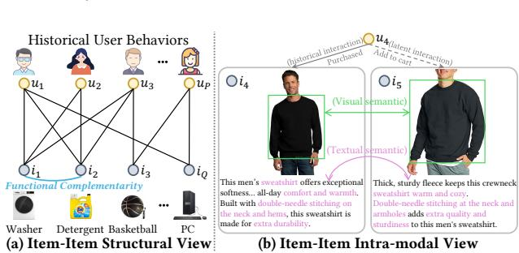
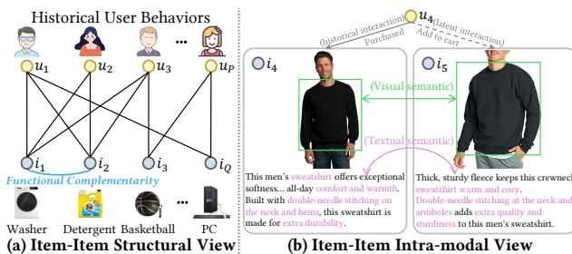
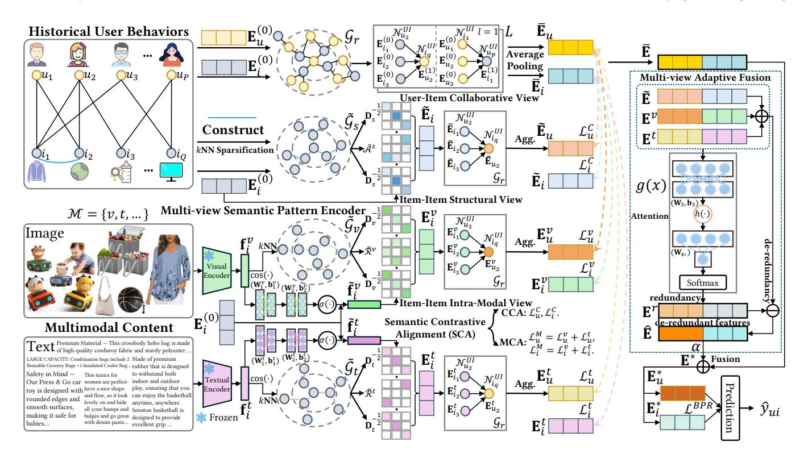
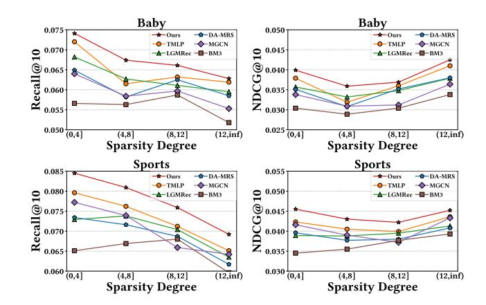
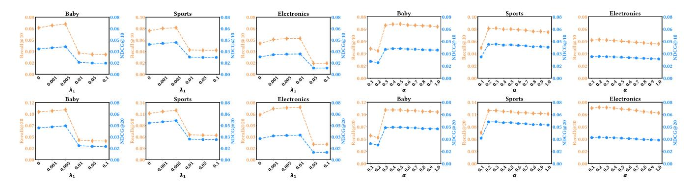
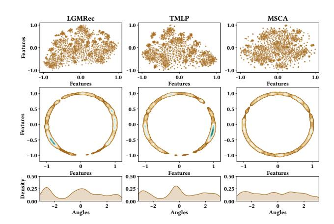
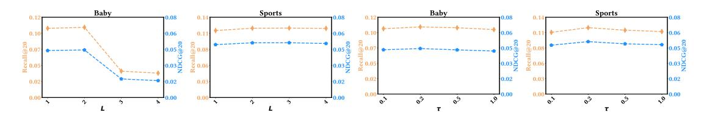

# Multi-view Semantic Contrastive Alignment for Multimodal Recommendation

Jiuqiang Li

School of Computing and Artificial Intelligence, Southwest Jiaotong University Engineering Research Center of Sustainable Urban Intelligent Transportation, Ministry of Education Chengdu, China jiuqiangli@outlook.com

Hongjun Wang∗

School of Computing and Artificial Intelligence, Southwest Jiaotong University Engineering Research Center of Sustainable Urban Intelligent Transportation, Ministry of Education Chengdu, China wanghongjun@swjtu.edu.cn

# Abstract

Multimodal recommendation advocates integrating the multimodal features of items with historical user behaviors to enhance recommendation accuracy across various online media platforms. The majority of existing methods concentrate on leveraging cross-modal learning over multimodal features to augment node representations. However, these approaches are confronted with two key challenges: i) augmented representations offer limited information gain for interactive prediction in the collaborative view, and ii) semantic discrepancy between the collaborative view and modality-augmented features remains inadequately addressed. To overcome these obstacles, we present a new Multi-view Semantic Contrastive Alignment (MSCA) approach for multimodal recommendation, which models and aligns node representations from multiple views. Specifically, we introduce a multi-view semantic pattern encoder that learns basic embeddings from the collaborative view and independently captures augmented semantic patterns from the item-item structural view and intra-modal view. Furthermore, a semantic contrastive alignment task is designed to mitigate the semantic divergence between collaborative embeddings and augmented representations by maximizing the mutual consistency between them, thereby facilitating an effective integration of both. Comprehensive experiments on three benchmark datasets confirm that the proposed MSCA consistently excels over diverse state-of-the-art baselines.

# CCS Concepts

• Information systems → Recommender systems.

### Keywords

Multimodal Recommendation, Contrastive Learning, Graph Neural Network

#### ACM Reference Format:

Jiuqiang Li and Hongjun Wang. 2026. Multi-view Semantic Contrastive Alignment for Multimodal Recommendation. In Proceedings of the ACM Web Conference 2026 (WWW '26), April 13–17, 2026, Dubai, United Arab Emirates. ACM, New York, NY, USA, [12](#page-11-0) pages.<https://doi.org/10.1145/3774904.3792192>

∗Corresponding author

© 2026 Copyright held by the owner/author(s). ACM ISBN 979-8-4007-2307-0/2026/04 <https://doi.org/10.1145/3774904.3792192>

# 1 Introduction

Multimodal recommendation attempts to incorporate multimodal content (e.g., video, image, text) into the general ID-based collaborative filtering (CF) paradigm to improve the quality of recommendations [\[21,](#page-8-0) [61\]](#page-9-0), which is widely used on web multimedia platforms (e.g., Amazon, TikTok) involving e-commerce and content sharing [\[2,](#page-8-1) [50\]](#page-9-1). While a few studies [\[56\]](#page-9-2) have explored learning modality embeddings for recommendation without relying on item ID embeddings, the more prevalent approach combines pre-extracted modal features (e.g., visual, textual) with user-item interaction behaviors to jointly learn item representations and user preferences [\[51,](#page-9-3) [64\]](#page-9-4).

In the early stages of multimodal recommendation, a series of studies improve recommendation performance by integrating multimodal features into collaborative filtering frameworks using matrix factorization [\[12,](#page-8-2) [16\]](#page-8-3) and attention mechanisms [\[5,](#page-8-4) [22\]](#page-8-5). With the impressive performance of graph neural networks (GNNs) in modeling high-level relationships [\[18,](#page-8-6) [48\]](#page-9-5), recent research [\[38,](#page-8-7) [43,](#page-8-8) [44\]](#page-8-9) explores the usage of GNNs on user-item bipartite graphs containing multimodal features to capture higher-order multimodalenhanced representations. Subsequent efforts [\[55,](#page-9-6) [57,](#page-9-7) [63\]](#page-9-8) seek to leverage auxiliary graphs constructed from multimodal content as mediators for message propagation to directly learn more nuanced user interests. However, faced with the inherent interaction sparsity issue [\[13,](#page-8-10) [40\]](#page-8-11) in recommendation scenarios, GNNs that rely predominantly on substantial labeled supervision may exhibit performance constraints attributed to inadequate training signals. Leveraging the capability of self-supervised learning (SSL) to mitigate supervision scarcity [\[7,](#page-8-12) [45\]](#page-8-13), recent collaborative filtering methods [\[45,](#page-8-13) [54,](#page-9-9) [59\]](#page-9-10) propose to capture self-supervised signals to address the insufficient supervision caused by sparse interaction data. Building on this, a variety of SSL-based multimodal recommendation methods [\[11,](#page-8-14) [42\]](#page-8-15) employ cross-modal self-supervised learning to augment node representations by aligning inter-modal feature spaces.

Despite the commendable performance achievement, extant advanced multimodal recommenders still face two critical challenges. (1) While cross-modal self-supervised learning facilitates effective inter-modal representation alignment, the resultant augmented node representations may offer limited benefit or even introduce detrimental noise to the primary task within the collaborative view. (2) Previous methods inadequately address the semantic gap between collaborative representations and multimodal features, consequently encumbering performance during feature fusion and joint optimization. To handle these two constraints, we introduce a new Multi-view Semantic Contrastive Alignment (MSCA) paradigm for

[This work is licensed under a Creative Commons Attribution 4.0 International License.](https://creativecommons.org/licenses/by/4.0) WWW '26, Dubai, United Arab Emirates.

Figure 1: Illustrations of the item-item structural view and intra-modal view. (a) Items ��1 and ��2, both interacted with by users ��1, ��2, and ��3, exhibit functional complementarity. (b) Item ��5 is considered by user ��4 as a latent interaction target due to its latent semantic relevance with item ��4 (previously interacted by ��4) in visual and textual modalities.

multimodal recommendation, which explores modeling node embeddings from diverse semantic perspectives and employs semantic contrastive alignment to potentiate representation fusion. Specifically, to overcome the first limitation, we propose the multi-view semantic pattern encoder that concurrently extracts foundational collaborative semantics from user-item interaction view while learning augmented node representations through item-item structural relations and intra-modal correlations. As illustrated in Figure [1](#page-1-0) (a), items with higher co-interaction frequency (e.g., items ��1 and ��2, both of which are co-interacted with by users ��1, ��2, ��3) typically manifest more pronounced structural semantic patterns (e.g., functional complementarity). Furthermore, Figure [1](#page-1-0) (b) shows that items sharing intra-modal similarities are frequently folded into the interest scope of users with analogous interaction histories (e.g., after purchasing item ��4, user ��4 adds item ��5 to cart, an item that possesses latent intra-modal semantic affinity to ��4). Consequently, dual inter-item graphs (structural and intra-modal) are constructed to model semantically augmented item embeddings. The learned item embeddings propagate through collaborative interactions to derive augmented user representations, effectively achieving greater information gain in the augmented representations for interactive prediction. Regarding the second issue, the semantic contrastive alignment task is introduced to reduce the semantic divergence between collaborative embeddings and augmented representations. Building upon multi-view modeling, MSCA promotes synergistic representation fusion from both collaborative and modality-aware view by respectively maximizing the semantic consistency between basic collaborative embeddings and augmented structural representations as well as intra-modal representations.

To encapsulate, the primary contributions of our research are highlighted below:

- We present a multi-view semantic pattern encoder that learns augmented node representations from various semantic patterns observed across multiple views.
- We introduce a semantic contrastive alignment component to alleviate the semantic discrepancy between multi-view representations and facilitate their effective fusion.
- Empirical evaluations on benchmark datasets confirm that MSCA substantially surpasses compared baselines by effectively leveraging multi-view semantic modeling and alignment.

### 2 Related Work

### 2.1 Graph-based Recommender Systems

Graph neural networks (GNNs) [\[18,](#page-8-6) [35\]](#page-8-16) have emerged as a powerful paradigm for modeling intricate relationships between users and items from historical interactions [\[6,](#page-8-17) [20,](#page-8-18) [24\]](#page-8-19). In particular, NGCF [\[40\]](#page-8-11) and LightGCN [\[13\]](#page-8-10) explicitly encode high-order collaborative signals in user–item interactions through GNNs-based embedding propagation layers. To leverage rich information beyond historical interactions, GNNs have been extensively utilized in graph-based recommendation to capture diverse relations within various recommendation contexts [\[1,](#page-8-20) [9,](#page-8-21) [47\]](#page-9-11). For instance, DiffNet [\[46\]](#page-8-22), GraphRec [\[8\]](#page-8-23), and DGNN [\[49\]](#page-9-12) employ GNNs over social relation graphs to capture social influence and enhance user representations. In bundle recommendation, models such as BGCN [\[3\]](#page-8-24), MIDGN [\[60\]](#page-9-13), and MultiCBR [\[23\]](#page-8-25) perform representation learning on multiple relational views. For knowledge graph-enhanced recommendation, KGCN [\[37\]](#page-8-26), KGNN-LS [\[36\]](#page-8-27), and KGAT [\[39\]](#page-8-28) exploit semantic associations among items in knowledge graphs. In multimodal recommendation, approaches like MMGCN [\[44\]](#page-8-9), GRCN [\[43\]](#page-8-8), and DualGNN [\[38\]](#page-8-7) propagate multimodal features over user–item interaction graphs to model latent information. Inspired by these, our MSCA leverages GNNs to model high-order collaborative relationships and capture contextual semantics from multiple views.

# 2.2 Contrastive Learning for Recommendation

To mitigate the inherent issue of label sparsity in recommender systems, contrastive learning (CL) is widely adopted in collaborative filtering methods by introducing auxiliary tasks [\[15,](#page-8-29) [29\]](#page-8-30). SGL [\[45\]](#page-8-13) employs various graph augmentation operations to generate contrastive views and constructs self-supervised tasks to alleviate long-tail problems. SimGCL [\[54\]](#page-9-9) and XSimGCL [\[53\]](#page-9-14) improve upon SGL by replacing graph augmentation with the addition of uniform noise to learned embeddings to construct contrastive views. BIGCF [\[58\]](#page-9-15) designs graph contrastive regularization by constructing dual intents (personal and collective) to enhance model robustness. MixRec [\[59\]](#page-9-10) utilizes a dual mixing strategy across individual and collective scales to build contrastive learning tasks to improve efficiency. In multimodal recommendation, SLMRec [\[32\]](#page-8-31) leverages diverse data augmentation operations on multimodal features to construct contrastive tasks and explore latent cross-modal correlations. BM3 [\[64\]](#page-9-4) generates contrastive views through simple message missing and employs contrastive learning under both inter-modal and intra-modal settings to achieve efficient enhancement. LGMRec [\[11\]](#page-8-14) refines global interests across multiple modalities via cross-modal hypergraph contrastive learning. However, cross-modal contrastive learning methods that refine distinct modal representations may introduce inevitable noise due to the semantic gap between collaborative embeddings and modality-specific representations. In contrast, we introduce a semantic contrastive alignment task to bridge this semantic discrepancy across multiview representations and enable coherent integration.

# 2.3 Multimodal Recommendation

Multimodal recommendation integrates features from pre-trained encoders into collaborative filtering paradigm to boost performance.

| Dataset     | # Users | # Items | # Interactions | Sparsity |
|-------------|---------|---------|----------------|----------|
| Baby        | 19,445  | 7,050   | 160,792        | 99.8827% |
| Sports      | 35,598  | 18,357  | 296,337        | 99.9547% |
| Electronics | 192,403 | 63,001  | 1,689,188      | 99.9861% |

Table 2: Overall performance of MSCA and different baselines in terms of Recall@�� (R@��) and NDCG@�� (N@��). The best result is bold and the second best is underlined. Improvement percentage (Improv.) denotes the ratio of performance increment from the suboptimal method to MSCA. 'OOM' indicates that the model exceeds the memory limit of the experimental device.

| Model    | R@10   | N@10   | Baby R@20 | N@20   | R@10   | N@10   | Sports R@20 | N@20   | R@10   | N@10   | Electronics R@20 | N@20   |
|----------|--------|--------|-----------|--------|--------|--------|-------------|--------|--------|--------|------------------|--------|
| MF-BPR   | 0.0357 | 0.0192 | 0.0575    | 0.0249 | 0.0432 | 0.0241 | 0.0653      | 0.0298 | 0.0235 | 0.0127 | 0.0367           | 0.0161 |
| LightGCN | 0.0479 | 0.0257 | 0.0754    | 0.0328 | 0.0569 | 0.0311 | 0.0864      | 0.0387 | 0.0363 | 0.0204 | 0.0540           | 0.0250 |
| BUIR     | 0.0506 | 0.0269 | 0.0788    | 0.0342 | 0.0467 | 0.0260 | 0.0733      | 0.0329 | 0.0332 | 0.0185 | 0.0514           | 0.0232 |
| SGL      | 0.0543 | 0.0294 | 0.0858    | 0.0375 | 0.0650 | 0.0364 | 0.0977      | 0.0448 | 0.0420 | 0.0240 | 0.0610           | 0.0289 |
| SimGCL   | 0.0557 | 0.0303 | 0.0866    | 0.0382 | 0.0669 | 0.0372 | 0.1011      | 0.0461 | 0.0445 | 0.0253 | 0.0653           | 0.0307 |
| XSimGCL  | 0.0564 | 0.0314 | 0.0887    | 0.0397 | 0.0666 | 0.0369 | 0.1011      | 0.0458 | 0.0465 | 0.0265 | 0.0675           | 0.0320 |
| BIGCF    | 0.0546 | 0.0295 | 0.0866    | 0.0377 | 0.0650 | 0.0362 | 0.0982      | 0.0448 | 0.0438 | 0.0249 | 0.0642           | 0.0302 |
| MixRec   | 0.0577 | 0.0318 | 0.0875    | 0.0395 | 0.0674 | 0.0373 | 0.1029      | 0.0464 | 0.0448 | 0.0254 | 0.0658           | 0.0308 |
| MSCA     | 0.0703 | 0.0385 | 0.1049    | 0.0474 | 0.0814 | 0.0444 | 0.1210      | 0.0546 | 0.0502 | 0.0284 | 0.0734           | 0.0344 |
| Improv.  | 21.84% | 21.07% | 18.26%    | 19.40% | 20.77% | 19.03% | 17.59%      | 17.67% | 7.96%  | 7.17%  | 8.74%            | 7.50%  |
| VBPR     | 0.0423 | 0.0223 | 0.0663    | 0.0284 | 0.0558 | 0.0307 | 0.0856      | 0.0384 | 0.0293 | 0.0159 | 0.0458           | 0.0202 |
| MMGCN    | 0.0378 | 0.0200 | 0.0615    | 0.0261 | 0.0370 | 0.0193 | 0.0605      | 0.0254 | 0.0207 | 0.0109 | 0.0331           | 0.0141 |
| GRCN     | 0.0532 | 0.0282 | 0.0824    | 0.0358 | 0.0559 | 0.0306 | 0.0877      | 0.0389 | 0.0349 | 0.0195 | 0.0529           | 0.0241 |
| DualGNN  | 0.0448 | 0.0240 | 0.0716    | 0.0309 | 0.0568 | 0.0310 | 0.0859      | 0.0385 | 0.0363 | 0.0202 | 0.0541           | 0.0248 |
| LATTICE  | 0.0544 | 0.0291 | 0.0848    | 0.0369 | 0.0618 | 0.0337 | 0.0947      | 0.0422 | OOM    | OOM    | OOM              | OOM    |
| SLMRec   | 0.0524 | 0.0289 | 0.0785    | 0.0356 | 0.0676 | 0.0374 | 0.1018      | 0.0462 | 0.0444 | 0.0250 | 0.0660           | 0.0306 |
| BM3      | 0.0564 | 0.0301 | 0.0883    | 0.0383 | 0.0656 | 0.0355 | 0.0980      | 0.0438 | 0.0437 | 0.0247 | 0.0648           | 0.0302 |
| FREEDOM  | 0.0627 | 0.0330 | 0.0992    | 0.0424 | 0.0717 | 0.0385 | 0.1089      | 0.0481 | 0.0397 | 0.0218 | 0.0602           | 0.0272 |
| MGCN     | 0.0620 | 0.0339 | 0.0964    | 0.0427 | 0.0729 | 0.0397 | 0.1106      | 0.0496 | 0.0441 | 0.0247 | 0.0658           | 0.0303 |
| DA-MRS   | 0.0621 | 0.0339 | 0.0971    | 0.0429 | 0.0715 | 0.0390 | 0.1083      | 0.0485 | 0.0429 | 0.0242 | 0.0635           | 0.0295 |
| LGMRec   | 0.0652 | 0.0350 | 0.1001    | 0.0440 | 0.0722 | 0.0391 | 0.1091      | 0.0486 | 0.0424 | 0.0236 | 0.0632           | 0.0289 |
| TMLP     | 0.0680 | 0.0366 | 0.1018    | 0.0453 | 0.0769 | 0.0417 | 0.1163      | 0.0519 | 0.0464 | 0.0259 | 0.0687           | 0.0316 |
| MSCA     | 0.0703 | 0.0385 | 0.1049    | 0.0474 | 0.0814 | 0.0444 | 0.1210      | 0.0546 | 0.0502 | 0.0284 | 0.0734           | 0.0344 |
| Improv.  | 3.38%  | 5.19%  | 3.05%     | 4.64%  | 5.85%  | 6.47%  | 4.04%       | 5.20%  | 8.19%  | 9.65%  | 6.84%            | 8.86%  |

4.1.2 Evaluation Metrics and Protocols. In accordance with previous settings [\[14,](#page-8-32) [57,](#page-9-7) [64\]](#page-9-4), we utilize two commonly used evaluation metrics for top-�� (�� = 10, 20) recommendation: Recall and Normalized Discounted Cumulative Gain (NDCG). Following MMRec [\[62\]](#page-9-17), we randomly split the training, validation, and testing data in 8:1:1 ratio and select the best model using Recall@20 on the validation set. To mitigate sampling bias, we evaluate predictions via the allranking protocol and employ negative sampling during training, pairing each observed interaction with an unobserved item.

4.1.3 Baselines. We compare proposed MSCA with a series of general collaborative filtering (CF) models: MF-BPR [\[30\]](#page-8-36), Light-GCN [\[13\]](#page-8-10), BUIR [\[19\]](#page-8-39), SGL [\[45\]](#page-8-13), SimGCL [\[54\]](#page-9-9), XSimGCL [\[53\]](#page-9-14), BIGCF [\[58\]](#page-9-15), MixRec [\[59\]](#page-9-10), and various multimodal recommendation approaches: VBPR [\[12\]](#page-8-2), MMGCN [\[44\]](#page-8-9), GRCN [\[43\]](#page-8-8), DualGNN [\[38\]](#page-8-7), LATTICE [\[57\]](#page-9-7), SLMRec [\[32\]](#page-8-31), BM3 [\[64\]](#page-9-4), FREE-DOM [\[63\]](#page-9-8), MGCN [\[55\]](#page-9-6), DA-MRS [\[52\]](#page-9-16), LGMRec [\[11\]](#page-8-14), TMLP [\[14\]](#page-8-32).

4.1.4 Implementation Details. In order to conduct a fair comparison, we develop the proposed MSCA and all baseline models by PyTorch [\[27\]](#page-8-40) with a unified multimodal recommendation framework MMRec [\[62\]](#page-9-17) and utilize a dimensional size of 64 to embed

users and items for all models. We initialize the embedding parameters with Xavier initialization [\[10\]](#page-8-41), optimize our model using Adam optimizer [\[17\]](#page-8-42) with an initial learning rate of 1�� −3 and fix the mini-batch size at 2048. All experiments are evaluated on an NVIDIA RTX 4090 GPU card with 24 GB memory. Partial results are sourced from the MMRec framework or its respective paper. For the remaining baselines, we adhered to their original publications and perform grid search to identify the optimal hyperparameters. To ensure convergence, we set the early stopping patience and the maximum number of epochs at 20 and 1000, respectively. For our MSCA, the hyperparameters �� and �� are set to 10 and 0.2, respectively. The number of graph propagation layers �� is set to 2, 3 and 4 for the Baby, Sports, and Electronics datasets, respectively. The regularization weight ��2 is configured as 3�� −7 for Baby, 5�� −8 for Sports, and 5�� −10 for the Electronics dataset. The fusion coefficient �� and the contrastive loss weight ��1 are tuned from {0.1, 0.2, · · · , 1.0} and {0.001, 0.005, 0.01, 0.05, 0.1}, respectively.

### 4.2 Performance Comparison (RQ1)

Table [2](#page-5-0) shows the comparative performance of MSCA and various baseline approaches across all datasets. Based on the evaluation results, we draw the following conclusions:

Table 3: Ablation study on core components of MSCA.

| Datasets   | Variants | R@10   | N@10   | R@20   | N@20   |
|------------|----------|--------|--------|--------|--------|
| w/o        | S        | 0.0669 | 0.0360 | 0.1025 | 0.0452 |
| w/o        | V        | 0.0641 | 0.0346 | 0.0964 | 0.0428 |
| w/o Baby   | T        | 0.0596 | 0.0332 | 0.0904 | 0.0412 |
| w/o        | MAF      | 0.0675 | 0.0366 | 0.1031 | 0.0458 |
| w/o        | SCA      | 0.0650 | 0.0354 | 0.1004 | 0.0445 |
| MSCA       |          | 0.0703 | 0.0385 | 0.1049 | 0.0474 |
| w/o        | S        | 0.0764 | 0.0417 | 0.1149 | 0.0516 |
| w/o        | V        | 0.0762 | 0.0420 | 0.1118 | 0.0512 |
| w/o Sports | T        | 0.0726 | 0.0398 | 0.1074 | 0.0488 |
| w/o        | MAF      | 0.0793 | 0.0430 | 0.1186 | 0.0532 |
| w/o        | SCA      | 0.0761 | 0.0418 | 0.1132 | 0.0513 |
| MSCA       |          | 0.0814 | 0.0444 | 0.1210 | 0.0546 |
| w/o        | S        | 0.0460 | 0.0259 | 0.0682 | 0.0317 |
| w/o        | V        | 0.0498 | 0.0281 | 0.0721 | 0.0339 |
| w/o Elec.  | T        | 0.0473 | 0.0266 | 0.0695 | 0.0324 |
| w/o        | MAF      | 0.0495 | 0.0279 | 0.0723 | 0.0338 |
| w/o        | SCA      | 0.0431 | 0.0243 | 0.0629 | 0.0295 |
| MSCA       |          | 0.0502 | 0.0284 | 0.0734 | 0.0344 |

- Compared to all evaluated general CF models and multimodal recommendation approaches, MSCA consistently demonstrates superior performance across different datasets, validating the significant effectiveness of our proposed multi-view semantic contrastive alignment framework. For instance, on the Baby, Sports, and Electronics datasets, MSCA improves NDCG@10 by 5.19%, 6.47%, and 9.65%, respectively, over the best baseline methods. We attribute this improvement to MSCA's ability to model latent relational semantics from multiple perspectives, thereby augmenting the representations of both users and items. Specifically, beyond encoding effective and refined collaborative semantics from user–item interactions, MSCA separately captures structural semantics from historical user records and intra-modal latent associative semantics from modal features.
- MSCA exhibits notable performance gains when compared to general CF methods (e.g., LightGCN, XSimGCL, and MixRec), indicating that modeling and integrating multi-view semantic patterns is both necessary and beneficial. It is worth noting that CL-based general methods (e.g., XSimGCL) even outperform CLbased multimodal recommendation models (e.g., MGCN, LGM-Rec) on the Electronics dataset. This suggests that multimodal recommendation systems may suffer from adverse effects due to semantic discrepancy when integrating multimodal information into the collaborative view. In contrast, MSCA first adaptively fuses the structural semantics learned from user–item interactions with intra-modal semantics, thereby mitigating potential noise contamination during the integration of modal features into collaborative representations.
- MSCA achieves the largest improvement over the strongest baseline on the Electronics dataset, which is the sparsest among the experimental datasets, highlighting its robustness in handling sparse interaction scenarios. Concretely, the semantic contrastive alignment is introduced to maximize the mutual correlation between collaborative semantics and their corresponding latent semantics from the collaborative view and the modality-aware

Figure 3: Performance w.r.t different user interaction sparsity degree on Baby and Sports datasets.

view, respectively. This facilitates multi-view semantic fusion and supplies rich semantic contrastive signals to the main recommendation task, mitigating the issue of insufficient supervision.

### 4.3 Ablation Study (RQ2)

To examine the impact of diverse factors, we conduct ablation experiments on the core components of MSCA. Specifically, we construct a series of variants: w/o S, w/o V, and w/o T denote removing the item-item structural view, and the visual and textual modality within the item-item intra-modal view, respectively. w/o MAF represents replacing the multi-view adaptive fusion module with a direct summation of the multi-view representations. w/o SCA indicates removing the semantic contrastive alignment module, i.e., setting ��1 = 0. The experimental results of MSCA and its variants on the three datasets are shown in Table [3,](#page-6-0) and we obtain the following observations: (1) The performance of MSCA experiences a significant drop when any of the three views (S, V, T) for semantic modeling are removed. Furthermore, MSCA without the MAF module exhibits a consistent decrease in performance across all metrics. This indicates that the multi-view semantic pattern encoder effectively captures augmented representations from diverse views and achieves adaptive fusion to enhance personalized recommendation. (2) Removal of the semantic contrastive alignment module leads to substantial performance degradation. This validates the effectiveness and the necessity of the semantic contrastive alignment for multi-view features, which facilitates the fusion of multi-view semantics by narrowing the semantic gap between the augmented representations and the collaborative embeddings.

### 4.4 Performance against Sparsity (RQ3)

To investigate the performance of MSCA in alleviating data sparsity, we divide users into four groups (i.e., (0, 4], (4, 8], (8, 12], (12, inf)) based on their interaction frequency in the training set and calculate Recall@10 of MSCA and five representative baselines (i.e., TMLP, LGMRec, DA-MRS, MGCN, BM3) on the Baby and Sports datasets within each group. As shown in Figure [3,](#page-6-1) TMLP may outperform or trail LGMRec at varying sparsity levels on the Baby dataset, while our MSCA consistently surpasses all baselines in various

Figure 4: Hyperparameter analysis of the contrastive weight ��1 and fusion coefficient �� in MSCA on all the dataset.

scenarios. Furthermore, MSCA achieves even higher Recall@10 on the extremely sparse user group ((0, 4]) than on the entire dataset. This demonstrates that MSCA effectively compensates for insufficient supervision due to sparsity through its multi-view semantic modeling and semantic contrastive alignment signals.

### 4.5 Hyperparameter Investigation (RQ4)

In this part, we investigate the sensitivity of MSCA to two main hyperparameters: the contrastive weight ��1 and the fusion coefficient ��, as illustrated in Figure [4.](#page-7-0) Our observations are as follows:

- Impact of ��1. MSCA achieves optimal performance on the Baby, Sports, and Electronics datasets when ��1 is set to 0.005, 0.005 and 0.01, respectively. It can be observed that an excessively small ��1 leads to insufficient self-supervised signals provided by the semantic contrastive alignment task, thereby failing to achieve the best results; whereas an excessively large ��1 may cause the contrastive auxiliary task to mislead the main recommendation task, resulting in early stopping and suboptimal performance.
- Selection of ��. When �� is configured to 0.4, 0.3, and 0.2, MSCA attains its peak performance on the Baby, Sports, and Electronics datasets, respectively. The experimental results across the three datasets exhibit a similar trend: as the value of �� increases, the performance of MSCA first improves to an optimum and then gradually declines. Notably, an excessively small �� on the Baby and Sports datasets causes the performance of MSCA to fall significantly outside the normal range. This indicates that selecting an appropriate �� helps to effectively integrate the augmented multi-view semantic representations into the collaborative view, thereby improving interaction prediction.

### 4.6 Visualization Analysis (RQ5)

Previous research [\[54\]](#page-9-9) suggests that uniform representations can mitigate popularity bias to enhance recommendation performance. To visually demonstrate the effectiveness of our MSCA, Figure [5](#page-7-1) illustrates the uniformity of the final item representations learned by MSCA, compared to LGMRec and TMLP. Specifically, we randomly sample 2, 000 items from the Sports dataset, utilize t-SNE [\[34\]](#page-8-43) to embed their final item representations into a 2D space, and further employ Gaussian kernel density estimation [\[33\]](#page-8-44) to map representations onto a unit hypersphere S . We then visualize the angular density estimation for each point on S 1 . We observe that

Figure 5: The distribution of final item representations from LGMRec, TMLP and MSCA on the Sports dataset.

item representations learned by LGMRec and TMLP exhibit more community-like clustering and distributional inhomogeneity (unimodality), whereas MSCA effectively integrates multi-view semantics through semantic contrastive alignment, thereby learning more uniform item representations and alleviating item popularity bias.

#### 5 Conclusion

In this work, we introduce a new multi-view semantic contrastive alignment framework to effectively capture multi-faceted semantics for multimodal recommendation. Specifically, we employ a multi-view semantic pattern encoder to separately model basic collaborative embeddings and augmented semantic representations from multiple views. Subsequently, a tailored semantic contrastive alignment task is designed to mitigate the semantic discrepancy between these representations and foster their fusion. Comprehensive experiments across three benchmarks demonstrate the significant superiority of our MSCA over state-of-the-art baselines while exhibiting exceptional robustness in sparse interaction scenarios.

### Acknowledgments

This work is supported by the National Natural Science Foundation of China under Grant (No. 62276216) and Natural Science Foundation of Sichuan Province under Grant (No. 2024NSFSC0501).

References [1] Vineeta Anand and Ashish Kumar Maurya. 2025. A survey on recommender systems using graph neural network. ACM Transactions on Information Systems 43, 1 (2025), 1–49. [2] Haoyue Bai, Le Wu, Min Hou, Miaomiao Cai, Zhuangzhuang He, Yuyang Zhou, Richang Hong, and Meng Wang. 2024. Multimodality invariant learning for multimedia-based new item recommendation. In Proceedings of the 47th International ACM SIGIR Conference on Research and Development in Information Retrieval. 677–686. [3] Jianxin Chang, Chen Gao, Xiangnan He, Depeng Jin, and Yong Li. 2020. Bundle recommendation with graph convolutional networks. In Proceedings of the 43rd International ACM SIGIR Conference on Research and Development in Information Retrieval. 1673–1676. [4] Jie Chen, Haw-ren Fang, and Yousef Saad. 2009. Fast Approximate kNN Graph Construction for High Dimensional Data via Recursive Lanczos Bisection. Journal of Machine Learning Research 10 (2009), 1989–2012. [5] Jingyuan Chen, Hanwang Zhang, Xiangnan He, Liqiang Nie, Wei Liu, and Tat-Seng Chua. 2017. Attentive collaborative filtering: Multimedia recommendation with item-and component-level attention. In Proceedings of the 40th International ACM SIGIR Conference on Research and Development in Information Retrieval. 335–344. [6] Lei Chen, Le Wu, Richang Hong, Kun Zhang, and Meng Wang. 2020. Revisiting graph based collaborative filtering: A linear residual graph convolutional network approach. In Proceedings of the AAAI Conference on Artificial Intelligence, Vol. 34. 27–34. [7] Ting Chen, Simon Kornblith, Mohammad Norouzi, and Geoffrey Hinton. 2020. A simple framework for contrastive learning of visual representations. In Proceedings of the International Conference on Machine Learning. PMLR, 1597–1607. [8] Wenqi Fan, Yao Ma, Qing Li, Yuan He, Eric Zhao, Jiliang Tang, and Dawei Yin. 2019. Graph neural networks for social recommendation. In Proceedings of the World Wide Web Conference. 417–426. [9] Chen Gao, Yu Zheng, Nian Li, Yinfeng Li, Yingrong Qin, Jinghua Piao, Yuhan Quan, Jianxin Chang, Depeng Jin, Xiangnan He, et al. 2023. A survey of graph neural networks for recommender systems: Challenges, methods, and directions. ACM Transactions on Recommender Systems 1, 1 (2023), 1–51. [10] Xavier Glorot and Yoshua Bengio. 2010. Understanding the difficulty of training deep feedforward neural networks. In Proceedings of the thirteenth International Conference on Artificial Intelligence and Statistics. JMLR Workshop and Conference Proceedings, 249–256. [11] Zhiqiang Guo, Jianjun Li, Guohui Li, Chaoyang Wang, Si Shi, and Bin Ruan. 2024. LGMRec: Local and Global Graph Learning for Multimodal Recommendation. In Proceedings of the AAAI Conference on Artificial Intelligence, Vol. 38. 8454–8462. [12] Ruining He and Julian McAuley. 2016. VBPR: visual bayesian personalized ranking from implicit feedback. In Proceedings of the AAAI Conference on Artificial Intelligence, Vol. 30. 144–150. [13] Xiangnan He, Kuan Deng, Xiang Wang, et al. 2020. Lightgcn: Simplifying and powering graph convolution network for recommendation. In Proceedings of the 43rd International ACM SIGIR Conference on Research and Development in Information Retrieval. 639–648. [14] Junjie Huang, Jiarui Qin, Yong Yu, and Weinan Zhang. 2025. Beyond graph convolution: Multimodal recommendation with topology-aware mlps. In Proceedings of the AAAI Conference on Artificial Intelligence, Vol. 39. 11808–11816. [15] Mengyuan Jing, Yanmin Zhu, Tianzi Zang, and Ke Wang. 2023. Contrastive self-supervised learning in recommender systems: A survey. ACM Transactions on Information Systems 42, 2 (2023), 1–39. [16] Wang-Cheng Kang, Chen Fang, Zhaowen Wang, and Julian McAuley. 2017. Visually-aware fashion recommendation and design with generative image models. In Proceedings of the IEEE International Conference on Data Mining. IEEE, 207–216. [17] Diederik P. Kingma and Jimmy Ba. 2015. Adam: A Method for Stochastic Optimization. In Proceedings of the 3rd International Conference on Learning Representations. [18] Thomas N. Kipf and Max Welling. 2017. Semi-Supervised Classification with Graph Convolutional Networks. In Proceedings of the 5th International Conference on Learning Representations. [19] Dongha Lee, SeongKu Kang, Hyunjun Ju, Chanyoung Park, and Hwanjo Yu. 2021. Bootstrapping user and item representations for one-class collaborative filtering. In Proceedings of the 44th International ACM SIGIR Conference on Research and Development in Information Retrieval. 317–326. [20] Fan Liu, Zhiyong Cheng, Lei Zhu, Zan Gao, and Liqiang Nie. 2021. Interestaware message-passing GCN for recommendation. In Proceedings of the ACM Web Conference. 1296–1305. [21] Qidong Liu, Jiaxi Hu, Yutian Xiao, Xiangyu Zhao, Jingtong Gao, Wanyu Wang, Qing Li, and Jiliang Tang. 2024. Multimodal recommender systems: A survey. Comput. Surveys 57, 2 (2024), 1–17. [22] Shang Liu, Zhenzhong Chen, Hongyi Liu, and Xinghai Hu. 2019. User-video coattention network for personalized micro-video recommendation. In Proceedings of the World Wide Web Conference. 3020–3026. [23] Yunshan Ma, Yingzhi He, Xiang Wang, Yinwei Wei, Xiaoyu Du, Yuyangzi Fu, and Tat-Seng Chua. 2024. Multicbr: Multi-view contrastive learning for bundle recommendation. ACM Transactions on Information Systems 42, 4 (2024), 1–23. [24] Kelong Mao, Jieming Zhu, Xi Xiao, Biao Lu, Zhaowei Wang, and Xiuqiang He. 2021. UltraGCN: ultra simplification of graph convolutional networks for recommendation. In Proceedings of the 30th ACM International Conference on Information & Knowledge Management. 1253–1262. [25] Yongxin Ni, Yu Cheng, Xiangyan Liu, Junchen Fu, Youhua Li, Xiangnan He, Yongfeng Zhang, and Fajie Yuan. 2025. A content-driven micro-video recommendation dataset at scale. In Proceedings of the 34th ACM International Conference on Information and Knowledge Management. 6486–6491. [26] Aaron van den Oord, Yazhe Li, and Oriol Vinyals. 2018. Representation learning with contrastive predictive coding. arXiv preprint arXiv:1807.03748 (2018). [27] Adam Paszke, Sam Gross, Francisco Massa, Adam Lerer, James Bradbury, Gregory Chanan, Trevor Killeen, Zeming Lin, Natalia Gimelshein, Luca Antiga, et al. 2019. Pytorch: An imperative style, high-performance deep learning library. In Proceedings of the Neural Information Processing Systems Conference, Vol. 32. 8024–8035. [28] Nils Reimers and Iryna Gurevych. 2019. Sentence-BERT: Sentence Embeddings using Siamese BERT-Networks. In Proceedings of the Conference on Empirical Methods in Natural Language Processing. 3982–3992. [29] Xubin Ren, Wei Wei, Lianghao Xia, and Chao Huang. 2025. A comprehensive survey on self-supervised learning for recommendation. Comput. Surveys 58, 1 (2025), 1–38. [30] Steffen Rendle, Christoph Freudenthaler, Zeno Gantner, and Lars Schmidt-Thieme. 2009. BPR: Bayesian personalized ranking from implicit feedback. In Proceedings of the Conference on Uncertainty in Artificial Intelligence. 452–461. [31] Karen Simonyan and Andrew Zisserman. 2015. Very Deep Convolutional Networks for Large-Scale Image Recognition. In Proceedings of the 3rd International Conference on Learning Representations. [32] Zhulin Tao, Xiaohao Liu, Yewei Xia, Xiang Wang, Lifang Yang, Xianglin Huang, and Tat-Seng Chua. 2022. Self-supervised learning for multimedia recommendation. IEEE Transactions on Multimedia 25 (2022), 5107–5116. [33] George R Terrell and David W Scott. 1992. Variable kernel density estimation. The Annals of Statistics (1992), 1236–1265. [34] Laurens Van der Maaten and Geoffrey Hinton. 2008. Visualizing data using t-SNE. Journal of Machine Learning Research 9 (2008), 2579–2605. [35] Petar Veličković, Guillem Cucurull, Arantxa Casanova, Adriana Romero, Pietro Lio, and Yoshua Bengio. 2018. Graph Attention Networks. In Proceedings of the 6th International Conference on Learning Representations. [36] Hongwei Wang, Fuzheng Zhang, Mengdi Zhang, Jure Leskovec, Miao Zhao, Wenjie Li, et al. 2019. Knowledge-aware graph neural networks with label smoothness regularization for recommender systems. In Proceedings of the ACM SIGKDD Conference on Knowledge Discovery and Data Mining. 968–977. [37] Hongwei Wang, Miao Zhao, Xing Xie, Wenjie Li, and Minyi Guo. 2019. Knowledge graph convolutional networks for recommender systems. In Proceedings of the World Wide Web Conference. 3307–3313. [38] Qifan Wang, Yinwei Wei, Jianhua Yin, Jianlong Wu, Xuemeng Song, and Liqiang Nie. 2021. Dualgnn: Dual graph neural network for multimedia recommendation. IEEE Transactions on Multimedia 25 (2021), 1074–1084. [39] Xiang Wang, Xiangnan He, Yixin Cao, Meng Liu, and Tat-Seng Chua. 2019. Kgat: Knowledge graph attention network for recommendation. In Proceedings of the ACM SIGKDD Conference on Knowledge Discovery and Data Mining. 950–958. [40] Xiang Wang, Xiangnan He, Meng Wang, Fuli Feng, and Tat-Seng Chua. 2019. Neural graph collaborative filtering. In Proceedings of the 42nd International ACM SIGIR Conference on Research and Development in Information Retrieval. 165–174. [41] Yanan Wang, Jianming Wu, and Keiichiro Hoashi. 2019. Multi-attention fusion network for video-based emotion recognition. In Proceedings of the International Conference on Multimodal Interaction. 595–601. [42] Wei Wei, Chao Huang, Lianghao Xia, and Chuxu Zhang. 2023. Multi-modal self-supervised learning for recommendation. In Proceedings of the ACM Web Conference. 790–800. [43] Yinwei Wei, Xiang Wang, Liqiang Nie, Xiangnan He, and Tat-Seng Chua. 2020. Graph-refined convolutional network for multimedia recommendation with implicit feedback. In Proceedings of the ACM International Conference on Multimedia. 3541–3549. [44] Yinwei Wei, Xiang Wang, Liqiang Nie, Xiangnan He, Richang Hong, and Tat-Seng Chua. 2019. MMGCN: Multi-modal graph convolution network for personalized recommendation of micro-video. In Proceedings of the ACM International Conference on Multimedia. 1437–1445. [45] Jiancan Wu, Xiang Wang, Fuli Feng, Xiangnan He, Liang Chen, Jianxun Lian, and Xing Xie. 2021. Self-supervised graph learning for recommendation. In Proceedings of the 44th International ACM SIGIR Conference on Research and Development in Information Retrieval. 726–735. [46] Le Wu, Peijie Sun, Yanjie Fu, Richang Hong, et al. 2019. A neural influence diffusion model for social recommendation. In Proceedings of the International ACM SIGIR Conference on Research and Development in Information Retrieval. 235–244.

[47] Shiwen Wu, Fei Sun, Wentao Zhang, Xu Xie, and Bin Cui. 2022. Graph neural networks in recommender systems: a survey. Comput. Surveys 55, 5 (2022), 1–37. [48] Zonghan Wu, Shirui Pan, Fengwen Chen, Guodong Long, Chengqi Zhang, and Philip S Yu. 2020. A comprehensive survey on graph neural networks. IEEE Transactions on Neural Networks and Learning Systems 32, 1 (2020), 4–24. [49] Lianghao Xia, Yizhen Shao, Chao Huang, Yong Xu, Huance Xu, and Jian Pei. 2023. Disentangled Graph Social Recommendation. In Proceedings of the IEEE International Conference on Data Engineering. 2332–2344. [50] Cong Xu, Yunhang He, Jun Wang, and Wei Zhang. 2025. STAIR: Manipulating Collaborative and Multimodal Information for E-Commerce Recommendation. In Proceedings of the AAAI Conference on Artificial Intelligence, Vol. 39. 12899–12907. [51] Jinfeng Xu, Zheyu Chen, Shuo Yang, Jinze Li, Hewei Wang, and Edith CH Ngai. 2025. Mentor: multi-level self-supervised learning for multimodal recommendation. In Proceedings of the AAAI Conference on Artificial Intelligence, Vol. 39. 12908–12917. [52] Guipeng Xv, Xinyu Li, Ruobing Xie, Chen Lin, Chong Liu, Feng Xia, Zhanhui Kang, and Leyu Lin. 2024. Improving Multi-modal Recommender Systems by Denoising and Aligning Multi-modal Content and User Feedback. In Proceedings of the 30th ACM SIGKDD Conference on Knowledge Discovery and Data Mining. 3645–3656. [53] Junliang Yu, Xin Xia, Tong Chen, Lizhen Cui, Nguyen Quoc Viet Hung, and Hongzhi Yin. 2023. XSimGCL: Towards extremely simple graph contrastive learning for recommendation. IEEE Transactions on Knowledge and Data Engineering 36, 2 (2023), 913–926. [54] Junliang Yu, Hongzhi Yin, Xin Xia, Tong Chen, Lizhen Cui, and Quoc Viet Hung Nguyen. 2022. Are graph augmentations necessary? Simple graph contrastive learning for recommendation. In Proceedings of the 45th International ACM SIGIR Conference on Research and Development in Information Retrieval. 1294–1303. [55] Penghang Yu, Zhiyi Tan, Guanming Lu, and Bing-Kun Bao. 2023. Multi-view graph convolutional network for multimedia recommendation. In Proceedings of the 31st ACM International Conference on Multimedia. 6576–6585. [56] Zheng Yuan, Fajie Yuan, Yu Song, Youhua Li, Junchen Fu, Fei Yang, Yunzhu Pan, and Yongxin Ni. 2023. Where to go next for recommender systems? idvs. modality-based recommender models revisited. In Proceedings of the 46th International ACM SIGIR Conference on Research and Development in Information Retrieval. 2639–2649. [57] Jinghao Zhang, Yanqiao Zhu, Qiang Liu, Shu Wu, Shuhui Wang, and Liang Wang. 2021. Mining latent structures for multimedia recommendation. In Proceedings of the ACM International Conference on Multimedia. 3872–3880. [58] Yi Zhang, Lei Sang, and Yiwen Zhang. 2024. Exploring the individuality and collectivity of intents behind interactions for graph collaborative filtering. In Proceedings of the 47th International ACM SIGIR Conference on Research and Development in Information Retrieval. 1253–1262. [59] Yi Zhang and Yiwen Zhang. 2025. MixRec: Individual and Collective Mixing Empowers Data Augmentation for Recommender Systems. In Proceedings of the ACM Web Conference. 2198–2208. [60] Sen Zhao, Wei Wei, Ding Zou, and Xianling Mao. 2022. Multi-view intent disentangle graph networks for bundle recommendation. In Proceedings of the AAAI Conference on Artificial Intelligence, Vol. 36. 4379–4387. [61] Hongyu Zhou, Xin Zhou, Zhiwei Zeng, Lingzi Zhang, and Zhiqi Shen. 2023. A comprehensive survey on multimodal recommender systems: Taxonomy, evaluation, and future directions. arXiv preprint arXiv:2302.04473 (2023). [62] Xin Zhou. 2023. Mmrec: Simplifying multimodal recommendation. In Proceedings of the 5th ACM International Conference on Multimedia in Asia Workshops. 1–2. [63] Xin Zhou and Zhiqi Shen. 2023. A tale of two graphs: Freezing and denoising graph structures for multimodal recommendation. In Proceedings of the 31st ACM International Conference on Multimedia. 935–943. [64] Xin Zhou, Hongyu Zhou, Yong Liu, Zhiwei Zeng, Chunyan Miao, Pengwei Wang, Yuan You, and Feijun Jiang. 2023. Bootstrap Latent Representations for Multi-Modal Recommendation. In Proceedings of the ACM Web Conference. 845–854.

### Algorithm 1: Pseudo-Code of MSCA.

### A Appendix

# A.1 Pseudo-Code of MSCA

The pseudo-code of MSCA is summarized in Algorithm [1.](#page-10-0) Given historical user behaviors and multimodal content, the item–item structural graph and modality-specific item–item graphs are constructed during the initialization phase of MSCA. Our code is publicly available at [https://github.com/recomall/MSCA.](https://github.com/recomall/MSCA)

# A.2 Computational Complexity Analysis

A.2.1 Space Complexity. The primary parameters of our MSCA stem from the user embeddings E (0) �� ∈ R ��×�� , the item embeddings E (0) ∈ R ��×�� , and the raw multimodal features F = {f ∈ ��×���� |�� ∈ M}. This aligns with most multimodal recommendation methods (e.g., LGMRec, DA-MRS, MGCN), incurring a space complexity of O ( (�� + ��)�� + �� Í ��∈M ����). The additional parameters mainly originate from the MLPs in Eq. [\(9\)](#page-3-3) and [\(12\)](#page-3-6), which require the space complexities of O (Í ��∈M (������ +�� )) and O (�� ), respectively. This is negligible compared to the former.

A.2.2 Time Complexity. The computational cost of MSCA primarily arises from the following two components. i) Graph convolution

operations in the multi-view semantic pattern encoder. The useritem collaborative view requires a time complexity of O (2��|E�� |��), which aligns with that of LightGCN as the backbone. The item-item structural view entails a complexity of O ( (|E�� | + |E�� |)��), while the item-item intra-modal view necessitates O (Í ��∈M (|E�� | + |E�� |)��). Here, |E�� |, |E�� |, and |E�� | denote the total edge count in the useritem interaction graph G�� , the item-item structural graph G˜ , and the modality-specific item-item graphs G˜��, respectively. Since the item-item structural and intra-modal views employ merely a single layer of sparse graph propagation and are independent of ��, the additional computational overhead introduced by graph learning does not significantly increase the running time compared to Light-GCN. ii) Loss computations during model optimization. The BPR loss computation has a time complexity of O (2����). The semantic contrastive alignment loss calculation includes the collaborative view and the modality-aware view, which require O (���� + ������) and O (|M | (���� +������)), respectively, in which �� denotes the batch size and �� represents the node count in a batch. Although semantic contrastive alignment across the two views introduces additional computational costs, the simplification enabled by batch training ensures that MSCA remains comparable in efficiency to state-ofthe-art CL-based multimodal recommendation approaches.

# A.3 Baseline Details

#### i) General Collaborative Filtering Models

- MF-BPR [\[30\]](#page-8-36) adopts the Bayesian Personalized Ranking loss into matrix factorization to enhance its performance.
- LightGCN [\[13\]](#page-8-10) removes redundant components from graph convolutional network to enhance recommendation performance.
- BUIR [\[19\]](#page-8-39) employs an asymmetric network architecture to update the parameters of its backbone network, with LightGCN serving as the backbone in BUIR.
- SGL [\[45\]](#page-8-13) designs various graph augmentation to construct selfsupervised tasks to improve the robustness of recommendations.
- SimGCL [\[54\]](#page-9-9) simplifies the construction of contrastive views with the addition of uniform noise to the embeddings.
- XSimGCL [\[53\]](#page-9-14) simplifies the establishment of contrastive views based on SimGCL to reduce computational costs and enhance recommendation performance.
- BIGCF [\[58\]](#page-9-15) explores bidirectional intents in interactions and utilizes contrastive learning for self-supervised intent modeling.
- MixRec [\[59\]](#page-9-10) introduces a dual mixing of individual and collective views to generate new samples in linear time complexity.

#### ii) Multimodal Recommendation approaches

- VBPR [\[12\]](#page-8-2) incorporates visual features within a matrix factorization framework using BPR loss to learn latent user preferences.
- MMGCN [\[44\]](#page-8-9) propagates the multimodal features of items on the user-item graph to learn modality-specific user preferences.
- GRCN [\[43\]](#page-8-8) filters the user-item interaction graph in multimodal recommendation by eliminating false-positive connections.
- DualGNN [\[38\]](#page-8-7) builds a user co-occurrence graph based on historical interactions to augment the user representations.
- LATTICE [\[57\]](#page-9-7) extracts modality-specific item homogeneous graphs from multimodal features for recommendation.
- SLMRec [\[32\]](#page-8-31) designs three data augmentation methods to integrate self-supervised learning into multimodal recommendation.

Figure 6: Performance w.r.t different hyperparameters �� and �� on Baby and Sports datasets.

- BM3 [\[64\]](#page-9-4) employs cosine similarity to simplify the self-supervised learning task generated by feature masking.
- FREEDOM [\[63\]](#page-9-8) keeps the item-item graph fixed and trims the user-item graph in a degree-sensitive manner to filter out noise.
- MGCN [\[55\]](#page-9-6) utilizes item behavior information to purify modality noise and adaptively fuse different modality representations.
- DA-MRS [\[52\]](#page-9-16) denoises user feedback and aligns user feedback and multimodal features guided by user preferences.
- LGMRec [\[11\]](#page-8-14) proposes local graph and global hypergraph embeddings jointly to capture modality-aware user interests.
- TMLP [\[14\]](#page-8-32) combines topological pruning and multi-layer perceptrons to denoise and model relationships between items.

#### A.4 Supplementary Experiments

A.4.1 Empirical Study on Fusion Methods. To further validate the efficacy of multi-view adaptive fusion (MAF), we design the following variants: MSCA (��=0) and MSCA (��=1), which denote excluding multi-view fused representations from the collaborative view and directly incorporating them without using fusion weight, respectively; w/ SUM represents directly summing the multi-view representations, equivalent to the w/o MAF variant; and w/ RE refers to replacing Eˆ with the redundant representations E �� calculated by MAF during the model prediction stage. Table [4](#page-11-1) presents the results of these variants on the Baby and Sports datasets. The performance of the w/ RE variant is even worse than that of w/ SUM, which verifies the effectiveness of the MAF module in eliminating redundant representations among multiple views.

Table 4: Ablation study on fusion methods.

| Variants MSCA ( �� = 0) MSCA ( �� = 1) | R@20 0.0585 0.1008 | Baby N@20 0.0276 0.0453 | Sports R@20 0.0748 0.1132 | N@20 0.0347 0.0503 |
|----------------------------------------|--------------------|-------------------------|---------------------------|--------------------|
| MSCA w/ SUM                            | 0.1031             | 0.0458                  | 0.1186                    | 0.0532             |
| MSCA w/ RE                             | 0.0994             | 0.0443                  | 0.1112                    | 0.0504             |
| MSCA                                   | 0.1049             | 0.0474                  | 0.1210                    | 0.0546             |

A.4.2 Further Hyperparameter Study. We further conduct sensitivity analysis on the number of graph propagation layers �� and the temperature hyperparameter ��, with values taken from {1, 2, 3, 4} and {0.1, 0.2, 0.5, 1.0}, respectively. The results shown in Figure [6](#page-11-2) suggest that as the number of graph propagation layers �� increases, the performance of MSCA gradually rises to its peak, after which excessive graph convolution layers may lead to over-smoothing of representations, potentially resulting in early-stopping or suboptimal outcomes. Regarding ��, setting it to 0.2 yields the best performance for MSCA on both the Baby and Sports datasets.

A.4.3 Efficiency Comparison. To validate the analysis in Section [A.2,](#page-10-1) we report in Table [5](#page-11-3) the efficiency comparison between MSCA and MGCN, DA-MRS, LGMRec and TMLP on the Electronics dataset, in terms of the number of model parameters (in millions) and the training time per epoch. The results show that our MSCA achieves better performance than the strongest baseline, TMLP, with fewer model parameters and shorter per-epoch runtime. Moreover, while delivering significant improvements, MSCA maintains comparable efficiency to CL-based methods (e.g., MGCN, LGMRec).

Table 5: Efficiency comparison between MSCA and baselines on the Electronics dataset.

| Metrics           | MGCN   | DA-MRS | LGMRec | TMLP   | MSCA   |
|-------------------|--------|--------|--------|--------|--------|
| # Param. (M)      | 298.90 | 298.88 | 298.95 | 324.99 | 298.89 |
| Time ( �� /epoch) | 54.51  | 100.55 | 67.17  | 70.51  | 65.55  |
| Recall@20         | 0.0658 | 0.0635 | 0.0632 | 0.0687 | 0.0734 |

A.4.4 Evaluation on the Micro-Video Domain. To further verify the effectiveness and generalization capability of MSCA, we conduct evaluations on the 5-core preprocessed MicroLens dataset [\[25\]](#page-8-45) in the domain of micro-videos (# Users: 98,129, # Items: 17,228, # Interactions: 705,174). As shown in Table [6,](#page-11-4) we present the performance comparison between MSCA and other recommendation methods on the MicroLens dataset. It is observed that our MSCA still significantly outperforms the baseline approaches, demonstrating its strong robustness and adaptability across diverse scenarios.

Table 6: Performance comparison between MSCA and baseline methods on the MicroLens dataset.

| Model    | R@10   | N@10   | R@20   | N@20   |
|----------|--------|--------|--------|--------|
| MF-BPR   | 0.0537 | 0.0271 | 0.0845 | 0.0351 |
| LightGCN | 0.0732 | 0.0384 | 0.1091 | 0.0476 |
| VBPR     | 0.0684 | 0.0355 | 0.1031 | 0.0445 |
| GRCN     | 0.0688 | 0.0356 | 0.1075 | 0.0456 |
| BM3      | 0.0616 | 0.0309 | 0.0992 | 0.0405 |
| FREEDOM  | 0.0656 | 0.0335 | 0.1023 | 0.0430 |
| MGCN     | 0.0777 | 0.0399 | 0.1173 | 0.0501 |
| DA-MRS   | 0.0767 | 0.0399 | 0.1164 | 0.0501 |
| LGMRec   | 0.0746 | 0.0387 | 0.1136 | 0.0487 |
| TMLP     | 0.0742 | 0.0382 | 0.1158 | 0.0489 |
| MSCA     | 0.0868 | 0.0458 | 0.1277 | 0.0563 |