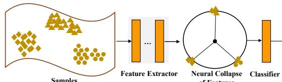
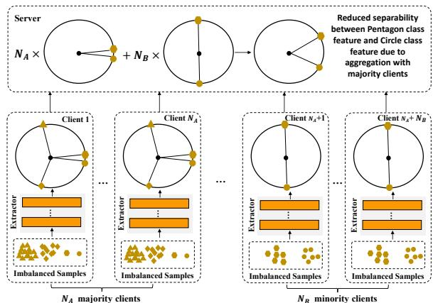
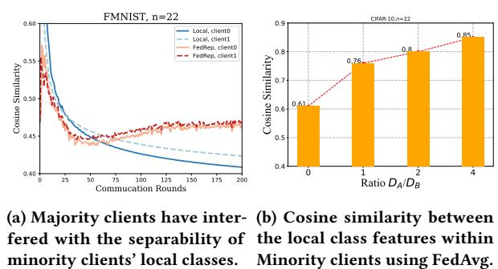
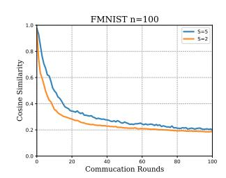
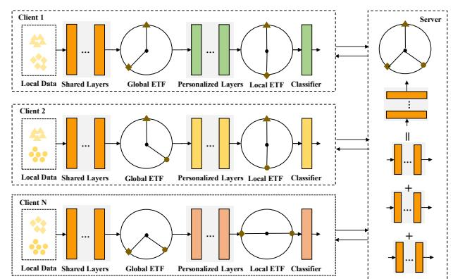
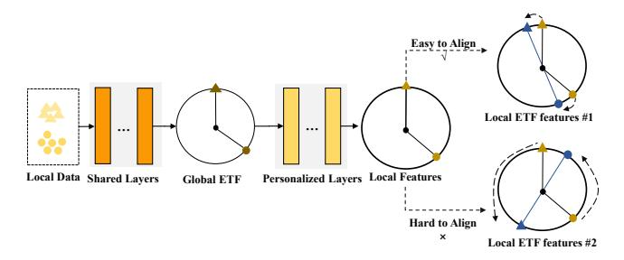
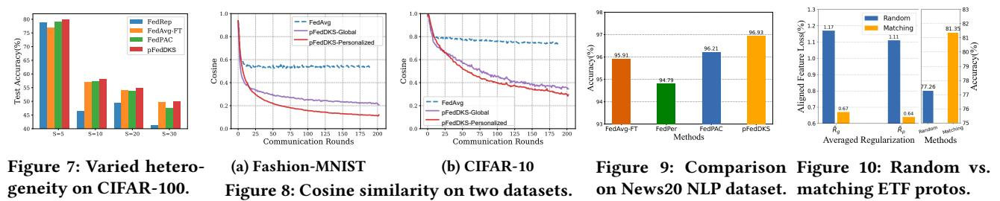
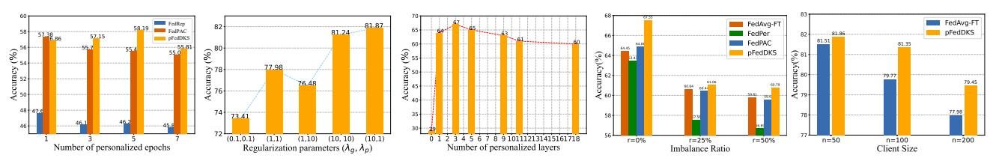
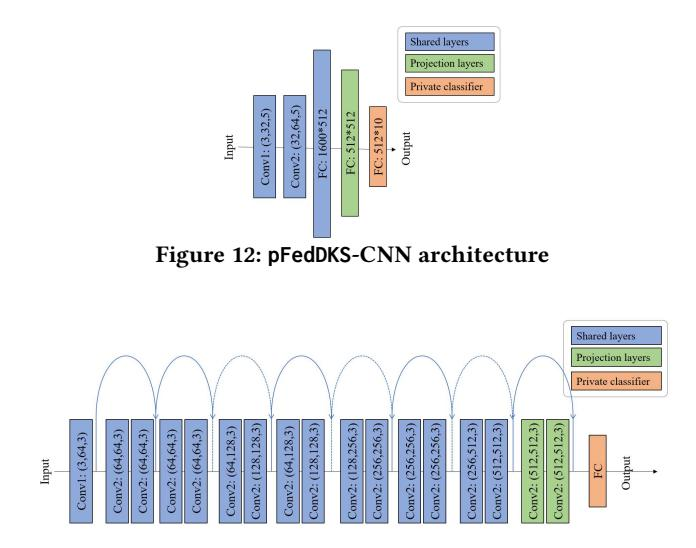

# **pFedDKS**: Detached Knowledge Sharing for Personalized Federated Learning

[Haozhao Wang](https://orcid.org/0000-0002-7591-5315) School of Computer Science and Technology, Huazhong University of Science and Technology Wuhan, China hz\_wang@hust.edu.cn

[Wenchao Xu](https://orcid.org/0000-0003-0983-387X)∗ Division of Integrative Systems and Design, The Hong Kong University of Science and Technology Hong Kong, China wenchaoxu@ust.hk

[Jingzhi Wang](https://orcid.org/0000-0003-0459-884X) School of Electronic Science and Engineering, Nanjing University Nanjing, China jzwang@smail.nju.edu.cn

[Yunfeng Fan](https://orcid.org/0000-0002-2277-5355) Department of Computing, The Hong Kong Polytechnic University Hong Kong, China fan\_yun\_feng@163.com

[Xiaoquan Yi](https://orcid.org/0000-0002-0050-9304) School of Computer Science and Technology, Huazhong University of Science and Technology Wuhan, China boydream123@outlook.com

[Rui Zhang](https://orcid.org/0000-0002-8132-6250) School of Computer Science and Technology, Huazhong University of Science and Technology [\(www.ruizhang.info\)](https://www.ruizhang.info) Wuhan, China rayteam@yeah.net

# Abstract

By allowing each client to refer to the knowledge from other clients while retaining their specific characteristics, partial knowledge sharing has become one of the main approaches to realizing personalized federated learning (pFL). Representative techniques of partial knowledge sharing propose sharing the feature extractor while customizing the classifier head of the neural network. Although such methods achieve great success, the underlying principle behind them remains yet to be comprehensively understood. A fundamental problem is whether it is really appropriate to fully share the feature extractor. Based on the theory of neural collapse, in this paper, we demonstrate both theoretically and empirically that the feature extractor should be partially shared rather than fully shared. More specifically, we identify a substantial inconsistency between the fused global feature representations and expected local feature representations, and thus it is necessary to preserve partially customized layers of the feature extractor for enhancing personalized representations. Based on this discovery, we further propose a novel method called pFedDKS which detaches the shared global knowledge and customized local knowledge by providing detached feature prototypes. Extensive experiments on various datasets and models show that pFedDKS outperforms state-of-the-arts.

### CCS Concepts

• Computer systems organization → Embedded systems.

# Keywords

Federated Learning, Personalization, Knowledge Sharing

∗Corresponding author

[This work is licensed under a Creative Commons Attribution 4.0 International License.](https://creativecommons.org/licenses/by/4.0) WWW '26, Dubai, United Arab Emirates © 2026 Copyright held by the owner/author(s). ACM ISBN 979-8-4007-2307-0/2026/04 <https://doi.org/10.1145/3774904.3792203>

### ACM Reference Format:

Haozhao Wang, Wenchao Xu, Jingzhi Wang, Yunfeng Fan, Xiaoquan Yi, and Rui Zhang. 2026. pFedDKS: Detached Knowledge Sharing for Personalized Federated Learning. In Proceedings of the ACM Web Conference 2026 (WWW '26), April 13–17, 2026, Dubai, United Arab Emirates. ACM, New York, NY, USA, [12](#page-11-0) pages.<https://doi.org/10.1145/3774904.3792203>

# 1 Introduction

By allowing multiple clients to collaboratively train a model without directly accessing their private data, Federated Learning (FL) [\[1–](#page-8-0)[3\]](#page-8-1) recently received much attention and has been widely adopted in various applications such as healthcare [\[4,](#page-8-2) [5\]](#page-8-3), time series data processing [\[6\]](#page-8-4), and recommendation [\[7](#page-8-5)[–9\]](#page-8-6). However, traditional FL suffers from a critical challenge that significantly degrades the learning performance, i.e., the not independently and identically distributed (Non-IID) user data, where the trained global model often cannot be generalized well over each client [\[12–](#page-8-7)[14\]](#page-8-8).

To deal with the above issues, employing personalized models appears to be an effective solution in FL, i.e., personalized federated learning (pFL) [\[15–](#page-8-9)[17\]](#page-8-10). Recently, there have been many works regarding pFL, e.g., regularization-based [\[18,](#page-8-11) [19\]](#page-8-12), meta learning based [\[20\]](#page-8-13), clustering based [\[21,](#page-8-14) [22\]](#page-8-15), and partial knowledge sharing (PKS) based methods [\[23–](#page-8-16)[25\]](#page-8-17). Among all these works, PKS-based pFL methods are gaining growing attention due to their promising success. Some earlier works in this category usually share some specific layers to achieve personalization [\[23,](#page-8-16) [26](#page-8-18)[–28\]](#page-8-19), e.g., only sharing batch normalization layers and keeping the other layers customized [\[23\]](#page-8-16). Recently, more and more works propose sharing the full feature extractor and only keeping the classifier head customized [\[24,](#page-8-20) [25,](#page-8-17) [29–](#page-8-21)[32\]](#page-8-22). These works typically share the feature extractor by computing the average of its parameters while aligning the local features with the global feature prototypes among clients [\[30](#page-8-23)[–32\]](#page-8-22). Despite the significant success achieved by these methods, the underlying principle remains mysterious, i.e., it is still unknown whether sharing the full feature extractor or only part of it is theoretically better.

1 Personalized Federated Learning. Partial sharing has become a key approach for personalized federated learning [\[27,](#page-8-26) [28,](#page-8-19) [36,](#page-8-27) [37\]](#page-8-28). Earlier studies focused on sharing specific layers, such as batch normalization [\[23\]](#page-8-16). Recent works propose sharing the full feature extractor and customizing only the classifier head [\[24,](#page-8-20) [25,](#page-8-17) [31,](#page-8-29) [38,](#page-9-0) [39\]](#page-9-1). Examples include Fed-RoD [\[24\]](#page-8-20), which shares the full feature extractor but uses different softmax functions for global and local learning. FedBABU [\[25\]](#page-8-17) maintains a global classifier while fine-tuning locally. kNN-Per [\[29\]](#page-8-21) combines a global model with local kNN classifiers. LG-FedAvg [\[40\]](#page-9-2) learns the entire network locally but aggregates only top layers. FedRep [\[31\]](#page-8-29) averages feature extractor parameters, while FedProto [\[30\]](#page-8-23) aligns feature representations among clients. FedPAC [\[32\]](#page-8-22) combines both averaging and alignment. Unlike these, we focus on demystifying partial feature extractor sharing and propose a novel harmonized prototype scheme. Some studies apply NC theories to FL [\[41,](#page-9-3) [42\]](#page-9-4), but they mainly aim to train global models without considering prototypes, which is our main contribution. Neural Collapse. Papyan et al. [\[33\]](#page-8-24) first observed the neural collapse phenomenon in balanced dataset training. Though intuitive, its cause is not fully understood. Research shows this can occur under any loss function when treating last layer features/classifiers as independent variables [\[34,](#page-8-30) [43,](#page-9-5) [44\]](#page-9-6). Other studies explore its link to deep network generalization [\[45\]](#page-9-7), and feature variability collapse from shallow to deep layers improves test performance [\[46\]](#page-9-8). Imbalanced data research indicates specific loss functions can induce neural collapse in such settings [\[47,](#page-9-9) [48\]](#page-9-10). This paper proposes using these theories to dive deep into the pFL.

**Samples of Features** Figure 1: The NC phenomenon of features.

**Imbalanced Samples Imbalanced Samples Features of minority classes of**  ���� **majority clients Client** ����**+1** ���� × + ���� × **Features of minority classes of**  ���� **minority clients Reduced distinguishability due to majority clients** To solve this problem, we seek to study the underlying principles of partial knowledge sharing in pFL based upon an intriguing phenomenon that has been recently discovered in terms of the representations, termed Neural Collapse (NC) [\[33](#page-8-24)[–35\]](#page-8-25). As shown in Figure [1,](#page-1-0) NC shows that for classification tasks, the features outputted by the extractor are expected to converge to a specific mathematical structure on the training data, where the intra-class variability of features collapses to zero for each class and the between-class feature means all collapse to the vertices of a Simplex Equiangular Tight Frame (ETF) up to scaling. Motivated by the NC phenomenon, we identify that the above question can be definitely answered by measuring whether the fused global feature representations are consistent with the expected personalized feature representations. Therefore, we leverage NC theories for analyzing feature representations in pFL and reveal an inevitable inconsistency between the fused global and the expected personalized feature representations due to the Non-IID, concluding that sharing the entire feature extractor is not optimal for personalization.

However, even though the partial extractor sharing scheme has more theoretical potential than the full scheme, recent works demonstrated that the full scheme achieves better results [\[32\]](#page-8-22). We identify the key reason these methods are effective lies in their use of global averaging to obtain global feature prototypes with strong discriminative ability, and these prototypes guide the training of local models, thereby fully unleashing global knowledge. However, it is still unclear how to define such a prototype scheme for the partial sharing scheme due to the inconsistency between the objectives of the shared and personalized parts, i.e., sharing knowledge and customizing knowledge. To tackle this challenge, we propose pFedDKS, a novel prototype scheme specifically tailored for the partial extractor sharing scheme. To be more specific, based on a basic partial sharing scheme that employs the shallow layers as the shared part and the remained layers as the personalized part, we utilize the NC theories to predeterminedly generate detached global and local ETF prototypes for guiding the training of the shared part and personalized part respectively. Besides, to ease the alignment between the real features and the ETF prototypes, we propose generating these prototypes in a matching way where the ETF vectors are computed based on the real features. Since the NC-based prototypes conform to the ETF structure, the separability of both global and local features is maximized. Experiments conducted across multiple datasets and experimental setups demonstrate that our proposed method achieves significant improvement over baselines, especially when the tasks are challenging. In particular, the upper bound improvement of our method in TinyImageNet (5.1%) is much higher than that in Fashion-MNIST (0.3%). Our contributions are:

- To the best of our knowledge, this paper is the first to dive into the mystery of partial knowledge sharing in pFL. Based on NC, we show that the feature extractor cannot be fully shared due

to the inconsistency between the learned global representations and expected personalization representations.

- We propose a novel training method, namely, pFedDKS, that leverages NC theories to provide detached feature prototypes tailored for the partial extractor sharing scheme. In this way, the global features are aligned for ease of sharing global knowledge while maximizing the separability of personalized features.
- We propose generating the global and local ETF prototypes in a matching way by calculating the ETF vectors based on the real features obtained in a warmup manner.
- We compare pFedDKS with many advanced partial sharing based methods by conducting extensive experiments over various models and datasets, where the results show that our method can improve the accuracy by up to 5.1%.

## 2 Related Work

### 3 Preliminaries

# 3.1 Problem Formulation

We aim to collaboratively train personalized models for a set of clients in FL. The goal is to learn a function that maps every input data to the correct class out of C possible options. We assume that there are �� clients, and each client �� can only access its private dataset D�� := {����,��, ����,�� }, where ���� is the ��-th input data sample, ����,�� is the corresponding label, and there are total �� classes. The number of data samples in dataset D�� is denoted by ����. D = {D1, D2, · · · , D�� }, �� = Í�� ��=1 ����. In personalized FL, the goal of the learning system is to learn �� personalized models

Figure 3: Separability between classes.

dataset with 22 clients. Clients 2, . . . , 21 are configured as the majority clients and each of them contains 10 classes. The number of samples in class 2 : 9 is much larger than the class 0 : 1. Clients 0 and client 1 are configured as minor clients and each of them only contains two classes, i.e., 0 and 1. Based on this setup, we run two methods to compare their separability: 1) each client only trains the feature extractor using its local data; 2) all clients collaboratively share the full feature extractor and prototypes, i.e., running FedRep [\[31\]](#page-8-29). We measure the separability between features of different classes by computing their cosine similarity. Smaller cosine similarity means larger separability between classes. The results are shown in Figure [3a.](#page-3-0) In this figure, "Local, client 0" denotes the cosine similarity between the features of local classes 0 and 1 in client 0 under the training setting of only using the local data without sharing parameters with other clients, and "FedRep, client 0" denotes the cosine similarity between the features of local classes 0 and 1 under the training setting of using the global data, i.e., sharing parameters and prototypes of client 0 with other clients. As can be seen, the similarity between feature means of local training is smaller than that of shared training, indicating that the separability between local features of different local classes obtained by using only local data is larger than that using global data.

Theoretical analysis. Consider ���� majority clients that contain ���� majority classes, each with �� �� samples such that �� 1 = . . . = �� ���� = �� ��, and ���� = �� − ���� minority classes which have �� samples �� ��+1 = . . . = �� ��+���� = �� . Additionally, the remaining ���� = �� − ���� minority clients each contain the same ���� minority classes where each has �� �� samples. We have the following analysis.

Proposition 1. Consider the number of major-class samples is much larger than that of minor class, i.e., the ratio �� ��/�� �� → ∞. Suppose the total sample size of minor-class samples in majority clients is much larger than that of minority clients, i.e., ������ �������� → ∞. Then, the separability between the minor-class global feature means is approaching zero, i.e., 1 Í�� ��=1 h¯��−1 ��,�� − h¯��−1 �� → 0 for all ���� &lt; �� ≤ ��.

Proof is in Appendix [A.2.](#page-9-13) Proposition [1](#page-3-1) shows global knowledge cannot always promote the learning of personalized representations and may even hinder their improvement in an extreme case. Indeed, Figure [3b](#page-3-0) also verifies this by show that the angle between minority classes is approaching 0 (i.e., the cosine value approaching 1) when the ratio ����/���� becomes higher (from 0 to 4).

**Optimal Global Features**

<

**Ideal Personalized Features**

(a) The maximized separability among global class features is smaller than local ones. The maximized separability among

3 global classes is 2��

but it is ��

between 2 local classes. Figure 4: The limitation of optimal global knowledge.

(b) The separability between the optimal global features is smaller than local features.

## 4.2 Limitation of Optimal Global Knowledge

Indeed, even if data heterogeneity exerts no direct influence on the knowledge fusion process, the optimally aggregated global knowledge still fails to reach the individual performance pinnacle anticipated for each client. We also verify this in three aspects.

Case study. We first show that the separability of converged global features is inferior to that of anticipated personalized features from an intuitive perspective. Consider a case where there are total 3 classes across all clients and 2 classes in each specific client. Assuming that the global features of the total 3 classes are ideally trained, where the separability of different class features is maximized and the between-class means of global features satisfy the ETF condition. Then, the angle between any two global feature means is equivalent to 2�� . However, for expected personalized features, the goal is to maximize the separability of 2 local classes, and the maximum angle is ��. As illustrated in Figure [4a,](#page-3-2) the angle between optimal global feature means is �� less than local feature means.

Empirical demonstration. We then make further verification in an empirical view. We consider there are a total of 5 global classes across all clients and 2 local classesin each client. We train ResNet18 on FMNIST. To ensure the global model remains unaffected by Non-IID characteristics and achieves optimal convergence performance, we aggregate data of five classes of all clients and train the model using a centralized approach, subsequently computing the average of separability (i.e., cosine similarity) between feature means of each two-class pairs, as depicted by the �� = 5 curve in Figure [4b.](#page-3-2) Analogously, we also collect data from the same two classes across all clients, centrally train the model, and compute the separability between class feature means, with the results represented by the �� = 2 curve in the figure. It can be seen that the cosine value of 2-class personalized features is smaller than the 5-class global features, indicating larger separability of 2-class personalized features. Theoretical analysis. Considering there are ���� local classes in the local data of each client �� and �� classes in the global data of all clients, then we have the following formal statement.

Proposition 2. We consider the angle between the feature means of two classes is defined as their separability, then for local classes in a client, the separability between their optimal personalized features is greater than their optimal global features, and the difference between them is at least arccos(− 1 ���� −1 ) − arccos(− 1 ��−1 ).

Table 1: Comparison of test accuracy on the four datasets. The best result is bolded. Each experiment is conducted three times.

| Method     |             | Fashion-MNIST(%) | CIFAR-10    | (%) CIFAR-100 | (%)         | Tiny-ImageNet | (%)         |
|------------|-------------|------------------|-------------|---------------|-------------|---------------|-------------|
| Shards     | ( �� , �� ) | (100, 5)         | (100, 5)    | (20, 10)      | (100, 10)   | (20, 10)      | (100, 10)   |
| FedAvg-FT  |             | 95.12±0.21       | 79.77±0.42  | 64.45±0.45    | 56.59±0.51  | 57.19±0.86    | 44.25±0.71  |
| Ditto      | [51]        | 90.13±1.41       | 63.21±1.03  | 60.32±1.22    | 33.66±1.58  | 53.29±1.33    | 37.42±1.55  |
| FedPer     | [52]        | 94.22±0.62       | 76.86±0.71  | 63.47±0.47    | 47.58±0.63  | 55.94±0.74    | 39.08±0.87  |
| FedBABU    | [25]        | 94.51±2.35       | 69.78±2.46  | 65.11±2.23    | 52.24±1.91  | 58.28±1.56    | 41.62±1.81  |
| FedRep     | [31]        | 94.59±0.91       | 73.39±0.52  | 59.76±0.69    | 46.47±0.78  | 58.82±0.92    | 35.66±1.01  |
| FEDAVG_ETF | [41]        | 86.43±1.14       | 59.37±1.54  | 55.74±1.23    | 32.42±1.72  | 51.09±1.21    | 33.09±1.32  |
| FedETF     | [42]        | 95.85±1.12       | 79.39±1.34  | 65.17±1.64    | 56.98±1.21  | 60.23±1.32    | 49.78±1.04  |
| AlignFed   | [38]        | 92.56±1.25       | 79.80±1.13  | 61.11±1.59    | 55.31±0.64  | 57.64±1.28    | 48.22±1.77  |
| PartialFed | [28]        | 94.62±1.33       | 78.56±1.94  | 58.37±1.62    | 56.24±1.29  | 58.72±1.83    | 41.64±1.37  |
| FedCAC     | [36]        | 95.56±0.36       | 71.73±0.83  | 61.84±1.57    | 54.77±1.98  | 61.57±2.36    | 38.48±1.94  |
| CD2pFed    | [39]        | 95.48±0.83       | 77.28±0.74  | 63.37±0.91    | 54.18±1.43  | 56.28±0.67    | 44.69±0.82  |
| pFedHN     | [37]        | 90.38±1.56       | 79.77±1.76  | 60.08±1.08    | 55.86±1.13  | 55.95±0.71    | 45.81±1.81  |
| FedPAC     | [32]        | 95.76±0.33       | 80.22±0.54  | 64.88±0.59    | 57.35±0.70  | 58.90±0.65    | 50.31±0.83  |
| pFedDKS    |             | 96.02 ±0.46      | 81.35 ±0.39 | 67.55 ±0.66   | 58.23 ±0.82 | 63.19 ±0.77   | 54.09 ±0.61 |
| Dirichlet  | ( �� , �� ) | (100, 0.1)       | (100, 0.1)  | (20, 0.05)    | (100, 0.05) | (20, 0.05)    | (100, 0.05) |
| FedAvg-FT  |             | 97.11±0.65       | 90.06±0.74  | 61.83±1.15    | 62.14±1.31  | 40.99±0.65    | 37.26±0.65  |
| Ditto      | [51]        | 95.46±0.92       | 84.39±0.76  | 57.24±1.54    | 55.81±1.32  | 35.76±1.73    | 33.21±2.01  |
| FedPer     | [52]        | 96.63±0.75       | 89.47±0.99  | 58.35±1.02    | 54.64±0.83  | 39.49±0.97    | 32.21±1.11  |
| FedBABU    | [25]        | 96.53±1.92       | 90.39±1.33  | 61.62±2.35    | 59.98±2.12  | 39.46±2.40    | 32.35±2.27  |
| FedRep     | [31]        | 96.66±0.34       | 88.98±0.27  | 57.57±1.05    | 53.45±0.89  | 39.42±0.88    | 29.98±0.97  |
| FEDAVG_ETF | [41]        | 92.37±1.52       | 82.91±1.42  | 52.91±1.92    | 50.27±1.38  | 34.95±1.74    | 26.35±1.22  |
| FedETF     | [42]        | 96.98±0.80       | 88.46±1.67  | 62.09±1.33    | 60.26±1.61  | 42.93±0.94    | 38.19±1.37  |
| AlignFed   | [38]        | 95.85±0.68       | 89.97±1.46  | 58.12±1.83    | 56.03±0.96  | 40.36±1.76    | 39.92±1.01  |
| PartialFed | [28]        | 94.83±1.42       | 89.83±1.83  | 61.47±1.70    | 58.94±1.28  | 42.77±0.92    | 30.94±1.90  |
| FedCAC     | [36]        | 97.10±0.62       | 88.15±0.24  | 60.05±1.02    | 59.42±1.55  | 42.75±1.36    | 40.37±0.79  |
| CD2pFed    | [39]        | 96.79±1.13       | 89.07±0.68  | 58.79±1.26    | 60.77±1.08  | 41.38±1.47    | 39.68±1.15  |
| pFedHN     | [37]        | 95.39±1.30       | 86.38±1.61  | 60.67±1.79    | 58.81±1.77  | 38.32±1.26    | 37.16±2.82  |
| FedPAC     | [32]        | 97.19±0.32       | 90.40±0.44  | 62.21±1.22    | 61.52±0.87  | 43.27±0.59    | 37.25±0.78  |
| pFedDKS    |             | 97.28 ±0.29      | 91.11 ±0.17 | 62.85 ±0.91   | 62.90 ±0.86 | 46.66 ±0.85   | 42.33 ±0.96 |

### 5.3 Joint Training Loss

pFedDKS is to join [\(1\)](#page-2-1), [\(4\)](#page-4-4), and [\(7\)](#page-4-5) together:

min W L (W):= ∑︁�� ��=1 ���� �� L�� (w��), (8) 1:���� ����+1:��

L�� (w��) =L���� (w��)+����R �� (w )+����R �� (w ),

where w 1:���� �� refers to the 1 to ���� model layers in client ��. Before using the joint training loss, we first conduct a warmup training stage, i.e., running several rounds of FedAvg across clients. Then, we compute the global and local ETF vectors using [\(3\)](#page-4-3) and [\(6\)](#page-4-6) separately, based which the regularizations R and R �� are obtained. After that, we adopt the generally adopted alternative optimization strategy [\[31,](#page-8-29) [32\]](#page-8-22) to solve the joint loss [\(8\)](#page-5-0). The workflow of solving [\(8\)](#page-5-0) is shown in Appendix [A.5.](#page-10-0)

# 5.4 Discussion and Analysis

Privacy. Our method only requires each client to upload the information of features once, specifically the average value of all classes' features, to calculate the global ETF, after which there is no need to upload any further feature-related information. Compared with other methods that require uploading the prototypes of all classes every round, our approach leads to significantly less privacy leakage. Afterwards, our method typically only necessitates

the interaction between client and server for exchanging partial extractor layers, sharing even less information than FedAvg. Theoretical guarantee. We show that pFedDKS's converged features satisfy NC conditions, with maximized local feature separability indicating strong personalization. The proof is in Appendix [A.6.](#page-10-1)

Theorem 1. When the objective [\(8\)](#page-5-0) achieves its optima, the separability among local class features obtained by the personalized models reaches maximized, i.e., satisfying the conditions of NC1 and NC2.

### 6 Evaluations

### 6.1 Experimental Setup

Datasets and model. We consider four popular datasets in experiments: Fashion-MNIST[\[54\]](#page-9-20), CIFAR-10[\[55\]](#page-9-21) , CIFAR-100[\[55\]](#page-9-21) and Tiny-ImageNet [\[56\]](#page-9-22), which contains 10, 10, 100 and 200 classes respectively.A simple CNN and the ResNet-18 [\[57\]](#page-9-23) are adopted. We use CNN in easy tasks such as Fashion-MNIST and CIFAR-10, while ResNet-18 in CIFAR-100 and Tiny-ImageNet. Details about models, decoupled layers, and warmup impacts are shown in Appendix B. Data partition. To evaluate the performance of our work in a heterogeneous scenario, we specify two Non-IID data partition methods called Shards [\[1\]](#page-8-0) and Dirichlet [\[58\]](#page-9-24). In the Shards setting, the sorted samples are shuffled into �� ∗ �� shards, and assigned to ��

clients randomly. Each client owns an equal number of pieces. In the second setting, data distribution over clients satisfies the Dirichlet distribution with �� characterizing the degree of heterogeneity.

Baselines. We compare against various pFL approaches: 1) methods that learn a global model as traditional FL algorithms including FEDAVG\_ETF [\[41\]](#page-9-3); 2) locally fine-tune the global models after training, including FedAvg-FT (fine-tuning), FedBABU [\[25\]](#page-8-17), FedETF [\[42\]](#page-9-4); 3) methods with pre-defined regularization, such as Ditto [\[51\]](#page-9-18); 4) techniques with decoupled parameters, including FedCAC [\[36\]](#page-8-27), Fed-Per [\[52\]](#page-9-19), AlignFed [\[38\]](#page-9-0), FedRep [\[31\]](#page-8-29), CD2pFed [\[39\]](#page-9-1), PartialFed [\[28\]](#page-8-19), and FedPAC [\[32\]](#page-8-22); 5) others including pFedHN [\[37\]](#page-8-28).

Implementation. We implement the whole experiment in a simulation environment based on PyTorch. To ensure the accuracy and repeatability of the experiments, we refer to a pFL benchmark [\[59\]](#page-9-25) from the open-source community. We employ the mini-batch SGD optimizer with learning rate of 0.02 for all methods and datasets. The batch size is set to 32 unless explicitly specified. The number of local training epochs for pFedDKS is set to �� = 5, and the personalized training epochs is ���� = 5 for CIFAR-100 and Tiny-ImageNet, ���� = 3 for Fashion-MNIST and CIFAR-10. The hyper-parameters ���� = ���� = 10 for all the settings. All the clients will join the aggregation for a total of 20 clients and we randomly select 20% clients per round for local training for a total of 100 clients.

### 6.2 Experiment Results

Performance comparison. The comparison results are shown in Table [1.](#page-5-1) In order to demonstrate the generalization of our method, we compare them using two different Non-IID settings, Shards and Dirichlet distribution. We apply different data distributions on different datasets and various numbers of clients. We can see that our proposed pFedDKS achieves the best performance in almost all settings, dominating the other methods on average test accuracy, which demonstrates the effectiveness and benefit of both alignments with pre-defined global ETF and local ETF. In addition, pFedDKS can make more improvements with more total clients. Specifically, pFedDKS is 7.6% better than the second-best baseline FedPAC with Shards and improves the accuracy by 9.2% than the second-best FedAvg-FT with Dirichlet on Tiny-ImageNet with 100 total clients. We can also notice that FedAvg with fine-tuning is a strong baseline for pFL, which is better than many specialized methods.

Table 2: Results on Cifar10 with various Dir(��) values.

| Dir( �� ) | FedAvg-FT | FedPer | FedPAC | pFedDKS |
|-----------|-----------|--------|--------|---------|
| 0.1       | 90.06     | 89.47  | 90.40  | 91.11   |
| 1         | 73.36     | 65.31  | 74.19  | 75.38   |
| 10        | 65.05     | 53.81  | 66.62  | 67.89   |

Performance over various data heterogeneity. We vary the values of Shards(��) and Dir(��) to simulate different Non-IID levels. Smaller values indicate stronger heterogeneity. We assess CIFAR-100 and CIFAR-10 with 100 clients, where Figure [7](#page-6-0) and Table [2](#page-6-1) present the results. pFedDKS consistently outperforms other baselines, evidencing its adaptability and robustness across diverse heterogeneous data settings. Despite increased local class counts and heightened classification complexity causing failure for methods like FedRep, pFedDKS maintains a distinct advantage.

Ablation studies. Our pFedDKS has three key regularization components, partial sharing (PS), partial global ETF alignment (GEA), and local ETF alignment (LEA). As LEA is based on GEA, we conduct ablation studies to verify the effectiveness of PS, GEA and the combination of them. The results on four datasets with 100 clients. As shown in Tab[.3,](#page-6-2) we can find that PS and GEA are essential for performance improvement and the combination of the three components will achieve the most satisfactory model performance.

Table 3: Ablation study. 'w' denotes 'with'.

| Method Shards ( �� , �� ) | FMNIST (100, 5) | CIFAR-10 (100, 5) | CIFAR-100 (100, 10) | Tiny-ImageNet (100, 10) |
|---------------------------|-----------------|-------------------|---------------------|-------------------------|
| FedAvg                    | 89.85           | 63.27             | 23.78               | 9.65                    |
| w PS                      | 92.39           | 72.98             | 45.37               | 28.11                   |
| w PS&GEA                  | 95.71           | 80.42             | 55.63               | 51.14                   |
| pFedDKS                   | 95.98           | 81.25             | 58.19               | 54.11                   |

Feature separabilitiy. In order to further verify the effectiveness of our proposed global and local ETF alignment, we try to illustrate the feature separabilitiy among different classes. As shown in Figure [8,](#page-6-0) we plot the average cosine similarities between the feature centers of all classes during the training process. It can be seen that the feature similarity between classes after GEA is significantly lower than that of FedAvg, indicating that GEA can help the model better learn the difference between classes under the Non-IID setting. Meanwhile, feature discrepancy after personalized layers (deep extractor layers) further declines, meaning efficient adaptation of local data for personalization.

Evaluation over text datasets. To verify the effectiveness of our method on more data types, we compare our methods to baselines on the 20news text dataset with a two-layer LSTM as the model [\[60\]](#page-9-26). As shown in Figure [9,](#page-6-0) our method still performs the best.

Benefits of matching ETF prototypes. To verify the advantage of calculating ETF prototypes by matching real features, we compared them with ETF prototypes generated randomly. We mainly use ��¯ �� = ����/���� and ��¯ �� = ���� /�� which are used to calculate the average norm distance between the real features and the ETF prototypes as the comparison metric. As shown in Figure [10,](#page-6-0) the matching ETF prototypes not only are closer to the real features, i.e., have smaller ��¯ �� and ��¯ �� , but also result in higher accuracy.

(a) Impact of personal ep.s (b) Regularized parameters (c) Impact of split layers (d) Varied imbalance ratios (e) Impact of client size Figure 11: Impact of hyperparameters.

Impact of learning rate. The results with various learning rates are shown in Table [4,](#page-7-0) which are conducted on CIFAR-10 and CIFAR-100 with the number of clients being 20. As can be seen, our algorithm consistently outperforms FedAvg-FT and FedPAC.

Table 4: Comparison of our method to high-performance baselines on different learning rates �� = 0.005, 0.01, 0.02.

| Method    |       | CIFAR-10 |       |       | CIFAR-100 |       |
|-----------|-------|----------|-------|-------|-----------|-------|
|           | 0 005 | 0 01     | 0 02  | 0 005 | 0 01      | 0 02  |
| FedAvg-FT | 75.85 | 78.51    | 78.22 | 64.24 | 64.79     | 65.05 |
| FedPAC    | 76.39 | 78.65    | 79.77 | 64.27 | 64.52     | 65.51 |
| pFedDKS   | 78.06 | 82.30    | 81.25 | 66.65 | 66.57     | 67.55 |

Impact of personalized epoch. The results with various personalized epochs are demonstrated in Figure [11a,](#page-7-1) which were conducted on CIFAR-100. FedRep and FedPAC also need to perform personalized training on unshared classifiers. Obviously, pFedDKS needs more local training epochs because of more customized layers.

Sensitivity analysis. We conduct the sensitivity analysis on the weights of alignment terms, ���� and ���� . As expected, two parameters jointly regulate the global and local feature alignment process throughout the training process. As shown in Figure [11b,](#page-7-1) the two hyper-parameters should be set to a large value so that the global and local ETF alignment can significantly learn global knowledge as well as local personalized features.

Impact of different personalized layers. We conduct evaluations on CIFAR-100 with ResNet-18 by ranging the splitting layers to verify our statement. The results are shown in Figure [11c.](#page-7-1) As can be seen, fully sharing the feature extractor does not achieve the best performance (�� = 0). Customizing 3 layers (i.e., 2 feature extractor layers and 1 classifier layer) receives maximal improvement. The observation also exhibits that even if partially sharing the feature extractor is necessary, sharing how many layers is still important. Impact of different personalized layers. We conduct evaluations on CIFAR-100 with ResNet-18 by ranging the splitting layers to verify our statement. The results are shown in Figure [11c.](#page-7-1) As can be seen, fully sharing the feature extractor does not achieve the best performance (�� = 0). Customizing 3 layers (i.e., 2 feature extractor layers and 1 classifier layer) receives maximal improvement. The observation also exhibits that even if partially sharing the feature extractor is necessary, sharing how many layers is still important. Impact of global data imbalance. We conduct experiments with global class imbalance on the CIFAR-100 (20,10) setting. We remove a proportion �� of the data from the first 50 classes. As shown in Figure [11d,](#page-7-1) our method demonstrates a more significant advantage over the baseline when the class imbalance is severe.

Scalability. We run experiments on CIFAR10 by ranging the client number from 50 to 200. As shown in Figure [11e,](#page-7-1) the accuracy of both methods decreases as the number of clients increases. This is because personalized models depend more on local data, and less local data leads to lower performance. However, our method is less affected by the increase in clients compared to FedAvgFT, and the gap widens as the client number grows beyond 50.

Table 5: Single-round communication cost of different methods. FedPer and **pFedDKS** split at 15-th layer of ResNet18.

| Method Class number | 10    | Communication 30 | 50    | Cost (MB) 100 |         | Comm.     | Components   |
|---------------------|-------|------------------|-------|---------------|---------|-----------|--------------|
| FedAvg-FT/Ditto     | 44.59 | 44.59            | 44.59 | 44.59         |         | Full      | model        |
| FedPer              | 24.63 | 24.63            | 24.63 | 24.63         | Partial | feature   | extractor    |
| FedBABU             | 42.63 | 42.63            | 42.63 | 42.63         | Full    | feature   | extractor    |
| FedRep/FedPAC       | 42.65 | 42.69            | 42.73 | 42.83         | Full    | extractor | & Prototypes |
| pFedDKS             | 24.63 | 24.63            | 24.63 | 24.63         | Partial | feature   | extractor    |

Reduced communication cost. Compared to existing prototypebased methods, our method reduces communication costs by uploading fewer parameters and not uploading prototypes. The communication cost is computed based on the model size, the number of classes in each client, and number of shared layers. We present the single-round communication cost of each client by taking ResNet18 over ImageNet as an example, as shown in Table [5.](#page-7-2) It can be observed that pFedDKS communicates the least which is the same as FedPer but achieves the higher accuracy.

### 7 Conclusion

This paper dives into the principle of partial knowledge sharing in personalized FL. We introduce the theory of neural collapse to show that the feature extractor should not be fully shared to maximize the personalization performance. Specifically, we show that the separability of the optimal global features is smaller than the optimal personalized ones. Based on this finding, we propose a novel method pFedDKSwhich applies a novel detached feature prototype scheme over the partial sharing scheme. Detached global and local prototypes are generated based on the neural collapse conforming to the ETF structure such that the separability of global features and personalized features can be maximized respectively. Extensive experiments demonstrate the effectiveness of our proposed method.

### Acknowledgments

This work is supported by the National Key Research and Development Program of China under grant 2024YFC3307900; the National Natural Science Foundation of China under grants 62302184, 62376103, and 62436003; Major Science and Technology Project of Hubei Province under grants 2025BAB011 and 2024BAA008; and Hubei Science and Technology Talent Service Project under grant 2024DJC078. This work is supported by the Hong Kong Research Grants Council, General Research Fund under Grant No. 15225023.

### References

[1] Brendan McMahan, Eider Moore, Daniel Ramage, Seth Hampson, and Blaise Agüera y Arcas. 2017. Communication-Efficient Learning of Deep Networks from Decentralized Data. In Proceedings of the 20th International Conference on Artificial Intelligence and Statistics, AISTATS. [2] Xinchi Qiu Tong Xia, Abhirup Ghosh and Cecilia Mascolo. 2024. FLea: Addressing Data Scarcity and Label Skew in Federated Learning via Privacy-preserving Feature Augmentation. (2024). [3] Gang Yan, Hao Wang, Xu Yuan, and Jian Li. 2023. CriticalFL: A Critical Learning Periods Augmented Client Selection Framework for Efficient Federated Learning. In Proceedings of the 29th ACM SIGKDD Conference on Knowledge Discovery and Data Mining, KDD 2023, Long Beach, CA, USA, August 6-10, 2023, Ambuj K. Singh, Yizhou Sun, Leman Akoglu, Dimitrios Gunopulos, Xifeng Yan, Ravi Kumar, Fatma Ozcan, and Jieping Ye (Eds.). ACM, 2898–2907. [4] Md. Mahmudur Rahman and Sanjay Purushotham. 2023. FedPseudo: Privacy-Preserving Pseudo Value-Based Deep Learning Models for Federated Survival Analysis. In Proceedings of the 29th ACM SIGKDD Conference on Knowledge Discovery and Data Mining, KDD 2023, Long Beach, CA, USA, August 6-10, 2023, Ambuj K. Singh, Yizhou Sun, Leman Akoglu, Dimitrios Gunopulos, Xifeng Yan, Ravi Kumar, Fatma Ozcan, and Jieping Ye (Eds.). ACM, 1999–2009. [5] Chuang Zhao, Hui Tang, Jiheng Zhang, and Xiaomeng Li. 2025. Unveiling Discrete Clues: Superior Healthcare Predictions for Rare Diseases. In Proceedings of the ACM on Web Conference 2025. 1747–1758. [6] Yudong Zhang, Xu Wang, Xuan Yu, Kuo Yang, Zhengyang Zhou, and Yang Wang. 2025. FedSTG: Breaking through Spatio-Temporal Data Silos with Federated Graph Learning. In Companion Proceedings of the ACM on Web Conference 2025, WWW 2025, Sydney, NSW, Australia, 28 April 2025 - 2 May 2025. ACM, 1534–1538. [7] Jiajie Su, Chaochao Chen, Yihao Wang, Weiming Liu, Yuyuan Li, Tao Wang, Zhigang Li, Xiaolin Zheng, and Jianwei Yin. 2025. DuAda: Adaptive Targeted Model Poisoning Attack Framework via Dummy User Simulation on Federated Recommendation. ACM Trans. Inf. Syst. 43, 6, Article 161 (Sept. 2025), 37 pages. [8] Chuang Zhao, Hongke Zhao, Xiaomeng Li, Ming He, Jiahui Wang, and Jianping Fan. 2023. Cross-domain recommendation via progressive structural alignment. IEEE Transactions on Knowledge and Data Engineering (2023). [9] Zheng Wang, Wanwan Wang, Yimin Huang, Zhaopeng Peng, Ziqi Yang, Ming Yao, Cheng Wang, and Xiaoliang Fan. 2025. P4GCN: Vertical Federated Social Recommendation with Privacy-Preserving Two-Party Graph Convolution Network. In Proceedings of the ACM on Web Conference 2025, WWW 2025, Sydney, NSW, Australia, 28 April 2025- 2 May 2025. ACM, 2924–2934. [10] Chuang Zhao, Hongke Zhao, Ming He, Jian Zhang, and Jianping Fan. 2023. Crossdomain recommendation via user interest alignment. In Proceedings of the ACM Web Conference 2023. 887–896. [11] Xiaoquan Zhi, Hongke Zhao, Likang Wu, Chuang Zhao, and Hengshu Zhu. 2025. Reinventing Clinical Dialogue: Agentic Paradigms for LLM Enabled Healthcare Communication. arXiv preprint arXiv:2512.01453 (2025). [12] Yangyang Wang, Xiao Zhang, Mingyi Li, Tian Lan, Huashan Chen, Hui Xiong, Xiuzhen Cheng, and Dongxiao Yu. 2023. Theoretical Convergence Guaranteed Resource-Adaptive Federated Learning with Mixed Heterogeneity. In Proceedings of the 29th ACM SIGKDD Conference on Knowledge Discovery and Data Mining, KDD 2023, Long Beach, CA, USA, August 6-10, 2023, Ambuj K. Singh, Yizhou Sun, Leman Akoglu, Dimitrios Gunopulos, Xifeng Yan, Ravi Kumar, Fatma Ozcan, and Jieping Ye (Eds.). ACM, 2444–2455. [13] Ming Hu, Yue Cao, Anran Li, Zhiming Li, Chengwei Liu, Tianlin Li, Mingsong Chen, and Yang Liu. 2024. FedMut: Generalized Federated Learning via Stochastic Mutation. In Proceedings of the AAAI Conference on Artificial Intelligence, Vol. 38. 12528–12537. [14] Bingyan Liu Wang, Qiang and Yawen Li. 2024. Traceable Federated Continual Learning. In In Proceedings of the IEEE/CVF Conference on Computer Vision and Pattern Recognition. IEEE, 12872–12881. [15] Zhen Qin, Shuiguang Deng, Mingyu Zhao, and Xueqiang Yan. 2023. FedAPEN: Personalized Cross-silo Federated Learning with Adaptability to Statistical Heterogeneity. In Proceedings of the 29th ACM SIGKDD Conference on Knowledge Discovery and Data Mining, KDD 2023, Long Beach, CA, USA, August 6-10, 2023, Ambuj K. Singh, Yizhou Sun, Leman Akoglu, Dimitrios Gunopulos, Xifeng Yan, Ravi Kumar, Fatma Ozcan, and Jieping Ye (Eds.). ACM, 1954–1964. [16] Jun Wu, Wenxuan Bao, Elizabeth A. Ainsworth, and Jingrui He. 2023. Personalized Federated Learning with Parameter Propagation. In Proceedings of the 29th ACM SIGKDD Conference on Knowledge Discovery and Data Mining, KDD 2023, Long Beach, CA, USA, August 6-10, 2023, Ambuj K. Singh, Yizhou Sun, Leman Akoglu, Dimitrios Gunopulos, Xifeng Yan, Ravi Kumar, Fatma Ozcan, and Jieping Ye (Eds.). ACM, 2594–2605. [17] Bingyan Liu, Yao Guo, and Xiangqun Chen. 2021. PFA: Privacy-preserving Federated Adaptation for Effective Model Personalization. In WWW '21: The Web Conference 2021, Virtual Event / Ljubljana, Slovenia, April 19-23, 2021, Jure Leskovec, Marko Grobelnik, Marc Najork, Jie Tang, and Leila Zia (Eds.). ACM / IW3C2, 923–934. [18] Canh T. Dinh, Nguyen H. Tran, and Tuan Dung Nguyen. 2020. Personalized Federated Learning with Moreau Envelopes. In Proceedings of Advances in Neural Information Processing Systems 33: Annual Conference on Neural Information Processing Systems, NeurIPS. [19] Yutao Huang, Lingyang Chu, Zirui Zhou, Lanjun Wang, Jiangchuan Liu, Jian Pei, and Yong Zhang. 2021. Personalized cross-silo federated learning on non-iid data. In Proceedings of the AAAI Conference on Artificial Intelligence, AAAI. [20] Alireza Fallah, Aryan Mokhtari, and Asuman E. Ozdaglar. 2020. Personalized Federated Learning with Theoretical Guarantees: A Model-Agnostic Meta-Learning Approach. In Proceedings of Advances in Neural Information Processing Systems 33: Annual Conference on Neural Information Processing Systems, NeurIPS. [21] Avishek Ghosh, Jichan Chung, Dong Yin, and Kannan Ramchandran. 2020. An Efficient Framework for Clustered Federated Learning. In Proceedings of Advances in Neural Information Processing Systems 33: Annual Conference on Neural Information Processing Systems, NeurIPS. [22] Yishay Mansour, Mehryar Mohri, Jae Ro, and Ananda Theertha Suresh. 2020. Three approaches for personalization with applications to federated learning. arXiv preprint arXiv:2002.10619 (2020). [23] Xiaoxiao Li, Meirui Jiang, Xiaofei Zhang, Michael Kamp, and Qi Dou. [n. d.]. FedBN: Federated Learning on Non-IID Features via Local Batch Normalization. In 9th International Conference on Learning Representations, ICLR 2021, Virtual Event, Austria, May 3-7, 2021. [24] Hong-You Chen and Wei-Lun Chao. [n. d.]. On Bridging Generic and Personalized Federated Learning for Image Classification. In The Tenth International Conference on Learning Representations, ICLR 2022, Virtual Event, April 25-29, 2022. [25] Jaehoon Oh, Sangmook Kim, and Se-Young Yun. [n. d.]. FedBABU: Toward Enhanced Representation for Federated Image Classification. In The Tenth International Conference on Learning Representations, ICLR 2022, Virtual Event, April 25-29, 2022. [26] Manoj Ghuhan Arivazhagan, Vinay Aggarwal, Aaditya Kumar Singh, and Sunav Choudhary. 2019. Federated Learning with Personalization Layers. CoRR abs/1912.00818 (2019). [27] Mathieu Andreux, Jean Ogier du Terrail, Constance Beguier, and Eric W. Tramel. [n. d.]. Siloed Federated Learning for Multi-centric Histopathology Datasets. In Domain Adaptation and Representation Transfer, and Distributed and Collaborative Learning - Second MICCAI Workshop, DART 2020, and First MICCAI Workshop, DCL 2020, Held in Conjunction with MICCAI 2020, Lima, Peru, October 4-8, 2020, Proceedings. 129–139. [28] Benyuan Sun, Hongxing Huo, Yi Yang, and Bo Bai. [n. d.]. PartialFed: Cross-Domain Personalized Federated Learning via Partial Initialization. In Advances in Neural Information Processing Systems 34: Annual Conference on Neural Information Processing Systems 2021, NeurIPS 2021, December 6-14, 2021, virtual. 23309–23320. [29] Othmane Marfoq, Giovanni Neglia, Richard Vidal, and Laetitia Kameni. [n. d.]. Personalized Federated Learning through Local Memorization. In International Conference on Machine Learning, ICML 2022, 17-23 July 2022, Baltimore, Maryland, USA. 15070–15092. [30] Lu Liu Tianyi Zhou Jing Jiang Yue Tan, Guodong Long. 2022. FedProto: Federated Prototype Learning over Heterogeneous Devices. In Proceedings of the AAAI Conference on Artificial Intelligence, AAAI. [31] Liam Collins, Hamed Hassani, Aryan Mokhtari, and Sanjay Shakkottai. [n. d.]. Exploiting Shared Representations for Personalized Federated Learning. In Proceedings of the 38th International Conference on Machine Learning, ICML 2021, 18-24 July 2021, Virtual Event. 2089–2099. [32] Shao-Lun Huang Jian Xu, Xinyi Tong. [n. d.]. Personalized Federated Learning with Feature Alignment and Classifier Collaboration. In The 11th International Conference on Learning Representations, ICLR 2023. [33] Vardan Papyan, X. Y. Han, and David L. Donoho. 2020. Prevalence of Neural Collapse during the terminal phase of deep learning training. Proceedings of the National Academy of Sciences, vol. 117, no. 40, pp. 24652–24663 (2020). [34] X. Y. Han, Vardan Papyan, and David L. Donoho. 2022. Neural Collapse Under MSE Loss: Proximity to and Dynamics on the Central Path. In The Tenth International Conference on Learning Representations, ICLR 2022, Virtual Event, April 25-29, 2022. [35] Xiao Li, Sheng Liu, Jinxin Zhou, Xinyu Lu, Carlos Fernandez-Granda, Zhihui Zhu, and Qing Qu. 2022. Principled and Efficient Transfer Learning of Deep Models via Neural Collapse. CoRR abs/2212.12206 (2022). [36] Xinghao Wu, Xuefeng Liu, Jianwei Niu, Guogang Zhu, and Shaojie Tang. 2023. Bold but Cautious: Unlocking the Potential of Personalized Federated Learning through Cautiously Aggressive Collaboration. In IEEE/CVF International Conference on Computer Vision, ICCV 2023, Paris, France, October 1-6, 2023. IEEE, 19318–19327. [37] Aviv Shamsian, Aviv Navon, Ethan Fetaya, and Gal Chechik. 2021. Personalized Federated Learning using Hypernetworks. In Proceedings of the 38th International Conference on Machine Learning, ICML 2021, 18-24 July 2021, Virtual Event (Proceedings of Machine Learning Research, Vol. 139), Marina

Meila and Tong Zhang (Eds.). PMLR, 9489–9502. [38] Guogang Zhu, Xuefeng Liu, Shaojie Tang, and Jianwei Niu. 2024. Aligning Before Aggregating: Enabling Communication Efficient Cross-Domain Federated Learning via Consistent Feature Extraction. IEEE Trans. Mob. Comput. 23, 5 (2024), 5880–5896. [39] Yiqing Shen, Yuyin Zhou, and Lequan Yu. 2022. CD2 -pFed: Cyclic Distillationguided Channel Decoupling for Model Personalization in Federated Learning. In IEEE/CVF Conference on Computer Vision and Pattern Recognition, CVPR 2022, New Orleans, LA, USA, June 18-24, 2022. IEEE, 10031–10040. [40] Paul Pu Liang, Terrance Liu, Ziyin Liu, Ruslan Salakhutdinov, and Louis-Philippe Morency. 2020. Think Locally, Act Globally: Federated Learning with Local and Global Representations. CoRR abs/2001.01523 (2020). [41] Chenxi Huang, Liang Xie, Yibo Yang, Wenxiao Wang, Binbin Lin, and Deng Cai. 2023. Neural Collapse Inspired Federated Learning with Non-iid Data. CoRR abs/2303.16066 (2023). [42] Zexi Li, Xinyi Shang, Rui He, Tao Lin, and Chao Wu. 2023. No Fear of Classifier Biases: Neural Collapse Inspired Federated Learning with Synthetic and Fixed Classifier. In IEEE/CVF International Conference on Computer Vision, ICCV 2023, Paris, France, October 1-6, 2023. IEEE, 5296–5306. [43] Zhihui Zhu, Tianyu Ding, Jinxin Zhou, Xiao Li, Chong You, Jeremias Sulam, and Qing Qu. [n. d.]. A Geometric Analysis of Neural Collapse with Unconstrained Features. In Advances in Neural Information Processing Systems 34: Annual Conference on Neural Information Processing Systems 2021, NeurIPS 2021, December 6-14, 2021, virtual. 29820–29834. [44] Florian Graf, Christoph D. Hofer, Marc Niethammer, and Roland Kwitt. [n. d.]. Dissecting Supervised Constrastive Learning. In Proceedings of the 38th International Conference on Machine Learning, ICML 2021, 18-24 July 2021, Virtual Event. 3821–3830. [45] Tomer Galanti, András György, and Marcus Hutter. [n. d.]. On the Role of Neural Collapse in Transfer Learning. In The Tenth International Conference on Learning Representations, ICLR 2022, Virtual Event, April 25-29, 2022. [46] Vardan Papyan. [n. d.]. Traces of Class/Cross-Class Structure Pervade Deep Learning Spectra. Journal of Machine Learning Research, 2020, 252(21):1–64. ([n. d.]). [47] Yibo Yang, Shixiang Chen, Xiangtai Li, Liang Xie, Zhouchen Lin, and Dacheng Tao. 2022. Inducing Neural Collapse in Imbalanced Learning: Do We Really Need a Learnable Classifier at the End of Deep Neural Network?. In NeurIPS. [48] Christos Thrampoulidis, Ganesh Ramachandra Kini, Vala Vakilian, and Tina Behnia. 2022. Imbalance Trouble: Revisiting Neural-Collapse Geometry. In NeurIPS. [49] Cong Fang, Hangfeng He, Qi Long, and Weijie J. Su. 2021. Exploring deep neural networks via layer-peeled model: Minority collapse in imbalanced training. Proceedings of the National Academy of Sciences 118, 43 (2021), e2103091118. [50] Krishna Pillutla, Kshitiz Malik, Abdelrahman Mohamed, Michael G. Rabbat, Maziar Sanjabi, and Lin Xiao. 2022. Federated Learning with Partial Model Personalization. In International Conference on Machine Learning, ICML 2022, 17-23 July 2022, Baltimore, Maryland, USA. 17716–17758. [51] Tian Li, Shengyuan Hu, Ahmad Beirami, and Virginia Smith. 2021. Ditto: Fair and robust federated learning through personalization. In International Conference on Machine Learning. PMLR, 6357–6368. [52] Manoj Ghuhan Arivazhagan, Vinay Aggarwal, Aaditya Kumar Singh, and Sunav Choudhary. 2019. Federated learning with personalization layers. arXiv preprint arXiv:1912.00818 (2019). [53] Zaiwen Wen and Wotao Yin. 2013. A feasible method for optimization with orthogonality constraints. Math. Program. 142, 1-2 (2013), 397–434. [54] Han Xiao, Kashif Rasul, and Roland Vollgraf. 2017. Fashion-MNIST: a Novel Image Dataset for Benchmarking Machine Learning Algorithms. arXiv[:cs.LG/1708.07747](https://arxiv.org/abs/cs.LG/1708.07747) [cs.LG] [55] Alex Krizhevsky, Geoffrey Hinton, et al. 2009. Learning multiple layers of features from tiny images. (2009). [56] Amirhossein Tavanaei. 2020. Embedded Encoder-Decoder in Convolutional Networks Towards Explainable AI. arXiv[:2007.06712](https://arxiv.org/abs/2007.06712) [cs.CV] [57] Kaiming He, Xiangyu Zhang, Shaoqing Ren, and Jian Sun. 2016. Deep residual learning for image recognition. In Proceedings of 2016 IEEE Conference on Computer Vision and Pattern Recognition, CVPR. 770–778. [58] Tao Lin, Lingjing Kong, Sebastian U Stich, and Martin Jaggi. 2020. Ensemble Distillation for Robust Model Fusion in Federated Learning. In Advances in Neural Information Processing Systems, H. Larochelle, M. Ranzato, R. Hadsell, M.F. Balcan, and H. Lin (Eds.), Vol. 33. Curran Associates, Inc., 2351–2363. [https://proceedings.neurips.cc/paper\\_files/paper/2020/file/](https://proceedings.neurips.cc/paper_files/paper/2020/file/18df51b97ccd68128e994804f3eccc87-Paper.pdf) [18df51b97ccd68128e994804f3eccc87-Paper.pdf](https://proceedings.neurips.cc/paper_files/paper/2020/file/18df51b97ccd68128e994804f3eccc87-Paper.pdf) [59] Tsing, Yuwen Yang, NewAlexandria, and youpengl. 2023. TsingZ0/PFL-Non-IID: fix bugs. [doi:10.5281/zenodo.7845493](https://doi.org/10.5281/zenodo.7845493) [60] Bill Yuchen Lin, Chaoyang He, Zihang Ze, Hulin Wang, Yufen Hua, Christophe Dupuy, Rahul Gupta, Mahdi Soltanolkotabi, Xiang Ren, and Salman Avestimehr. 2022. FedNLP: Benchmarking Federated Learning Methods for Natural Language Processing Tasks. In Findings of the Association for Computational Linguistics:

NAACL 2022, Seattle, WA, United States, July 10-15, 2022. Association for Com-

putational Linguistics, 157–175. [61] Xiaoxiao Li, Meirui Jiang, Xiaofei Zhang, Michael Kamp, and Qi Dou. 2021. Fedbn: Federated learning on non-iid features via local batch normalization. arXiv preprint arXiv:2102.07623 (2021).

### A Motivation

### A.1 Average Strategy in Motivation

We adopt a strategy like FedRep. In this context, our motivation involves ���� major clients and ���� minor clients, with the count of each minority class being represented as ����1 and ����2 across two types of clients, respectively. The aggregation of each class �� prototype h¯ �� follows a quantity-aware approach:

h¯ �� = ∑︁���� ��=1 ����1 ��������1 + ��������2 h¯�� �� + ����∑︁+���� ��=����+1 ����2 ��������1 + ��������2 h¯�� �� (9) = 1 ��������1 + ��������2 (��������1h¯1 �� + ��������2h¯2 ) (10)

where we view all major clients as having the identical prototype as h¯1 �� , and the same applies to all minor clients as h¯2 �� . This means that the global prototype approaches the local prototype of major clients h¯ �� → h¯1 as ��������1 /(��������2 ) → ∞, i.e., ����/���� → ∞ as ����1 is close to ����2 . Due to the diminished separability of major clients, the separability of aggregated prototypes becomes smaller than that of local prototypes within minor clients, signaling the presence of interference.

# A.2 Proof of Proposition [1](#page-3-1)

Proof. According to NC1, NC3, and minority collapse, the features of minority classes in each of the ���� majority clients will converge to a single vector denoted as h¯��−1 ��,�� − h¯��−1 �� → 0, for all 1 ≤ �� ≤ ����, ���� &lt; �� ≤ ��, as the ratio �� ��/�� �� → ∞. Meanwhile, the ���� minority clients are expected to learn features h¯��−1 ��,�� that satisfy the ETF condition, which maximize the separability between classes ���� &lt; �� ≤ �� ′ ≤ ��. Because all clients share features, the separability of minority classes will be further reduced due to interference from the majority clients. This means that as ������ �������� → ∞, we have 1 �� Í�� ��=1 h¯��−1 ��,�� − h¯��−1 �� → 0 for all ���� &lt; �� ≤ ��. □

## A.3 Proof of Proposition [2](#page-3-3)

Proof. Consider the global model has achieved optimal, where the feature formulates the ETF structure. Then, based on the definition of ETF vectors in [\(2\)](#page-2-0), the angle between the feature means of two classes is arccos(− 1 ��−1 ). The angle between the mean values of the features output by the locally optimal model for the two local classes is arccos(− 1 ���� −1 ). Therefore, the difference between the angle of the global model and that of the local model is arccos(− 1 ���� −1 ) − arccos(− 1 ��−1 ). □

# A.4 Complexity of solving equation [\(5\)](#page-4-2)

In the following text, we present the key derivations of [\[53\]](#page-9-16) for solving the problem [\(5\)](#page-4-2). Considering an optimization problem with

Figure 13: **pFedDKS** ResNet-18 architecture

decouple the head of CNN during training and aggregating to allow personalized classification. Furthermore, the last linear layer before the classifier in pFedDKS -CNN is split as another private layer for personalized ETF prototype projection. It is worth noting that the dimension of the shared fully connected layer in the figure is based on the result that the input data is CIFAR-10. For Fashion-MNIST, the dimension of the output features of shared backbone layers should be 1024 instead of 1600. The structure of pFedDKS -CNN is shown in Figure [12.](#page-11-1)

For ResNet-18, half layers of the last basic block are split as personalized projection layers, as shown in Figure [13.](#page-11-2) We align the shared layers feature with global ETF vectors and constraint the projection layers features with optimal personalized ETF prototype. The batch normalization layers are not adopted in our experiment because of the potential performance penalty in federated learning settings. One solution is to set batch normalization layers personalized [\[61\]](#page-9-27), which is orthogonal with our method. The rest layers of the network remains unchanged.

### B.3 Implementation Details

We employ the mini-batch SGD optimizer with a learning rate of 0.02 for all methods and datasets. The weight decay is set to 5e-4 and momentum is set to 0.5 for all baselines and pFedDKS. The batch size is set to 32 unless explicitly specified, and the training epoch of backbone layers for all partial learning methods is set to 5. The personalized training epoch is ���� = 5 for CIFAR-100 and Tiny-ImageNet, ���� = 3 for Fashion-MNIST and CIFAR-10. All the clients will join the aggregation for a total of 20 clients and we randomly select 20% clients per round for local training for a total of 100 clients. The hyper-parameters are set to ���� = ���� = 10 for pFedDKS. For FedPAC, we set �� = 1 and ���� = 1 according to the original literature. For Ditto, we set �� = 1 for all settings by searching over {0.1, 1, 10}. For a fair comparison, the personalized training epoch of FedRep and FedPer is set the same as pFedDKS. The fine-tune steps of FedBABU and FedAvg are 5.

Table 6: The grid search results of different methods.

Table 7: The grid search results of different methods.

### B.4 Comparison via experiments with grid-searched hyper-parameters

To compare the best result of each method of different hyperparameters. We range the learning rate of all methods from 0.005, 0.01 to 0.02. The hyper-parameter �� of FedPAC ranges from 0.1, 1 to 10. The hyper-parameter �� of our method remains unchanged, i.e., �� = 10. All methods run 200 rounds and the experimental results are presented in the following Table [6,](#page-11-3) [7,](#page-11-4) [8.](#page-11-5) It can be observed that our method still performs the best. Besides, we also find that a learning rate of 0.02 has little impact over the FedPAC as its haper-parameter �� = 1 which is generally adopted by its original paper. Therefore, we mainly compare with it by running it with configurations �� = 0.02, �� = 1.

Table 8: The grid search result of different methods.

Table 9: Impact of Warmup

### B.5 Impact of Warmup

In fact, the convergence curves of many Federated Learning papers show that convergence is very rapid in the early stages and gradually slows down later. Therefore, in our experiments, we generally run FedRep for the first 10 rounds before starting our method. We compared the use of warmup with no warmup on the Cifar10 dataset, and the results are shown in Table [9](#page-11-6) below. It can be seen that warmup significantly improves the model training accuracy.