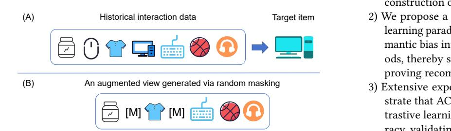
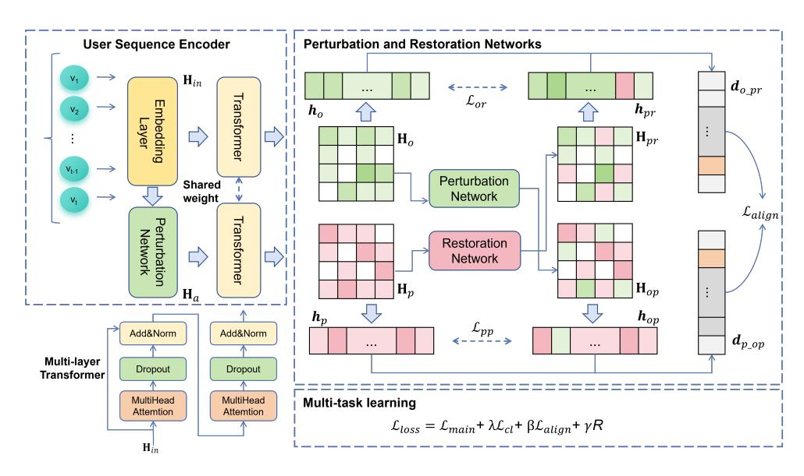
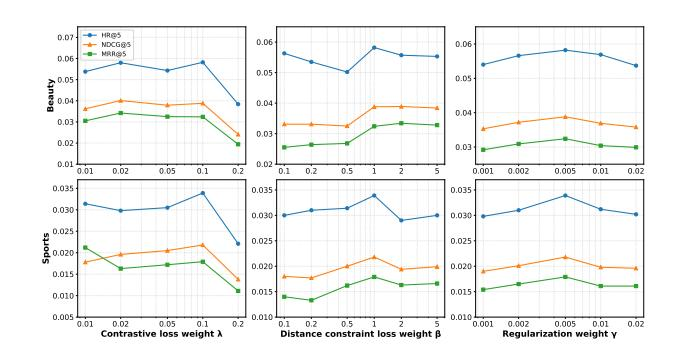
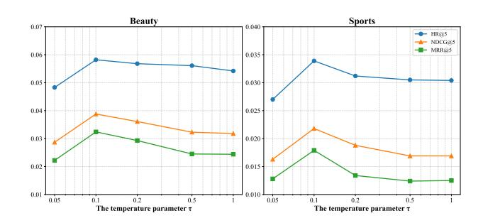
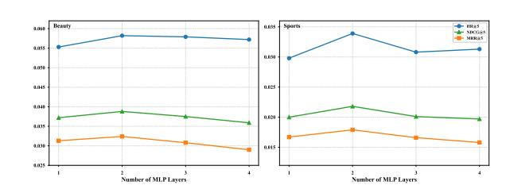

# Adaptive Contrastive Learning in Sequential Recommendation based on Perturbation and Restoration Networks

Yanbo Zhou College of Computer Science and Technology Zhejiang University of Technology Hangzhou, Zhejiang, China Zhejiang Key Laboratory of Visual Information Intelligent Processing Hangzhou, Zhejiang, China zhyb@zjut.edu.cn

Bin Lü College of Computer Science and Technology Zhejiang University of Technology Hangzhou, Zhejiang, China 221123120280@zjut.edu.cn

Xu-Hua Yang∗ College of Computer Science and Technology Zhejiang University of Technology Hangzhou, Zhejiang, China xhyang@zjut.edu.cn

Xin-Li Xu College of Computer Science and Technology Zhejiang University of Technology Hangzhou, Zhejiang, China xxl@zjut.edu.cn

Boling Wang College of Computer Science and Engineering North China Institute of Science and Technology Langfang, Hebei, China wbling@ncist.edu.cn

## Abstract

Sequential recommender systems play a vital role in alleviating the challenge of information overload. Although contrastive learning has been increasingly adopted in sequential recommendation to enhance model performance, most existing approaches rely on predefined data augmentation strategies—such as random noise injection or neuron dropout—to generate contrasting views. These strategies, however, often overlook the inherent semantic similarity between the original sequence and its augmented views, which can inadvertently distort user intent and compromise recommendation accuracy. To address this issue, we propose an Adaptive Contrastive Learning framework for Sequential Recommendation (ACLSRec), which incorporates learnable perturbation and restoration networks for adaptive augmentation. The framework dynamically perturbs and restores user representations, thereby ensuring semantic consistency across augmented views and effectively capturing evolving user interest patterns through contrastive learning. Extensive experiments on real-world datasets demonstrate that ACLSRec achieves superior recommendation accuracy compared to several competitive baselines. This work not only establishes a new baseline for sequential recommendation but also paves the way for developing more robust and adaptive contrastive learning frameworks in recommender systems. The source code is available at https://github.com/xiaomizhou778/ACLSRec.

[This work is licensed under a Creative Commons Attribution 4.0 International License.](https://creativecommons.org/licenses/by/4.0) WWW '26, Dubai, United Arab Emirates © 2026 Copyright held by the owner/author(s). ACM ISBN 979-8-4007-2307-0/2026/04 <https://doi.org/10.1145/3774904.3792207>

## CCS Concepts

### • Information systems → Recommender systems.

## Keywords

Sequential Recommendation, Contrastive Learning, Adaptive augmentation, Perturbation and Restoration Networks

### ACM Reference Format:

Yanbo Zhou, Bin Lü, Xu-Hua Yang, Xin-Li Xu, and Boling Wang. 2026. Adaptive Contrastive Learning in Sequential Recommendation based on Perturbation and Restoration Networks. In Proceedings of the ACM Web Conference 2026 (WWW '26), April 13–17, 2026, Dubai, United Arab Emirates. ACM, New York, NY, USA, [10](#page-9-0) pages.<https://doi.org/10.1145/3774904.3792207>

## 1 Introduction

In today's landscape of information overload, recommender systems have become indispensable tools for helping users discover personalized content efficiently [\[8,](#page-8-0) [18\]](#page-8-1). Among these, sequential recommender systems distinguish themselves by their capacity to model temporal dependencies in user interaction sequences, thereby accurately capturing users' evolving preferences [\[3,](#page-8-2) [26,](#page-8-3) [42\]](#page-8-4). However, modeling user interaction sequences is primarily challenged by two issues. The first is the inherent sparsity of user behavior sequences. Under cold-start conditions, where users have few interactions, the scarcity of interaction data makes it difficult to model complex interest transitions effectively, thus undermining recommendation precision [\[16\]](#page-8-5). The second issue is the presence of implicit noise [\[35,](#page-8-6) [36\]](#page-8-7), which can divert a model from capturing genuine temporal patterns, leading to biased or inaccurate recommendations.

Contrastive learning has emerged as a promising approach to mitigate data sparsity and noise interference by leveraging selfsupervised signals [\[27,](#page-8-8) [40\]](#page-8-9). The core idea of contrastive learning is to learn discriminative representations by constructing positive and

∗Corresponding author.

negative sample pairs, with the objective of maximizing the similarity between positive pairs while minimizing that of negative pairs in the feature space. Inspired by this capability, several studies have introduced contrastive learning into sequential recommendation to alleviate data sparsity and noise-related issues [\[11,](#page-8-10) [29,](#page-8-11) [34\]](#page-8-12). In this context, for a given user, positive samples are typically generated by applying different data augmentation techniques to the user's interaction sequence, while the interaction sequences of other users are treated as negative samples. Ideally, negative samples should be clearly distinguishable from positive samples in the feature space, allowing the model to effectively discriminate between them and enhance sequence representation learning.

- An augmented view generated via random masking Target item
- 1) We construct a dual-path augmentation architecture based on perturbation and restoration networks. This framework enables controllable augmentation and semantic-aware reconstruction of user sequences in the latent space.
  - 2) We propose a semantically consistent adaptive contrastive learning paradigm. This approach effectively mitigates the semantic bias introduced by conventional augmentation methods, thereby strengthening representation learning and improving recommendation accuracy.
  - 3) Extensive experiments on multiple public datasets demonstrate that ACLSRec significantly outperforms existing contrastive learning baselines in overall recommendation accuracy, validating the effectiveness and generalizability of the proposed framework.

Figure 1: An example of augmentation through random perturbation.

However, many contrastive learning-based sequential recommendation methods rely on predefined augmentation strategies, such as random perturbations or dropout, to construct contrastive views [\[20,](#page-8-13) [33\]](#page-8-14). These methods often overlook the semantic consistency between the original sequence and its augmented views [\[6\]](#page-8-15), which can compromise the discriminative power of learned representations [\[13\]](#page-8-16) and ultimately misrepresent genuine user interests. Figure [1](#page-1-0) illustrates the problem caused by random perturbation. Subfigure (A) of Figure [1](#page-1-0) depicts the original user interaction sequence, which comprises items from two core intents: sports and electronics, with the target item being a desktop computer. Subfigure (B) of Figure [1](#page-1-0) illustrates an augmented view generated via random masking. Critically, the masking of key electronic items (e.g., "mouse" and "desktop computer") results in a skewed representation that overemphasizes sports, ultimately leading to a deviation from the user's true intent. Employing dropout to construct augmented views also presents significant challenges. By randomly discarding neurons, this mechanism risks severing essential connections that encode key behavioral features, which can disrupt the learning of temporal dependencies. Consequently, the model may fail to capture rare yet significant patterns, corrupt the semantic integrity of the original sequence, and ultimately misrepresent user interests.

To address the aforementioned limitations, we proposes an Adaptive Contrastive Learning framework for Sequential Recommendation (ACLSRec) in this paper. The framework incorporates learnable perturbation and restoration networks to dynamically perturb and restore user embeddings, thereby ensuring semantic consistency across augmented views while effectively capturing evolving

user interest patterns through contrastive learning. By introducing a closed-loop "original → perturbation → restoration" learning constraint, ACLSRec overcomes the semantic bias inherent in conventional augmentation strategies. This design preserves the intrinsic sequential logic of user behaviors while enhancing robustness to sparsity and noise through self-supervised learning. Extensive experiments on real-world datasets demonstrate that ACLSRec achieves superior recommendation accuracy compared to several competitive baselines.

The main contributions of this paper include:

## 2 Related Work

## 2.1 Sequential Recommendation

The evolution of sequential recommendation research has undergone a significant paradigm shift, moving from early Markov chain frameworks [\[21\]](#page-8-17) to deep learning-driven approaches. GRU4Rec [\[10\]](#page-8-18) innovatively employs Gated Recurrent Units (GRUs) to dynamically model user interaction sequences, providing a novel solution for session-level recommendations. Caser [\[24\]](#page-8-19) pioneered the use of convolutional neural networks, encoding sequences into matrices to extract local features. The rise of graph neural networks further broadened research perspectives, with models like SR-GNN [\[32\]](#page-8-20) learning deep item transition relationships by constructing session graphs. The introduction of the Transformer [\[25\]](#page-8-21) architecture greatly propelled this field, leading to models such as SASRec [\[12\]](#page-8-22), which applied the self-attention mechanism to sequential recommendation. BERT4Rec [\[22\]](#page-8-23) adopted the pre-training paradigm from natural language processing, using bidirectional self-attention and masked prediction tasks to capture comprehensive contextual information. Additionally, SSE-PT [\[31\]](#page-8-24) integrated user embeddings into the Transformer framework, offering a new approach to personalized sequential recommendations.

### 2.2 Contrastive Learning for Sequential Recommendation

As an efficient self-supervised learning paradigm [\[9\]](#page-8-25), contrastive learning has shown significant advantages in fields such as computer vision [\[14\]](#page-8-26) and natural language processing [\[4\]](#page-8-27), and is extensively employed to mitigate data sparsity and noise issues in recommender systems [\[23,](#page-8-28) [34\]](#page-8-12). CL4SRec [\[33\]](#page-8-14) constructs augmented views of user interaction sequences through random cropping, masking, and rearrangement, and simultaneously optimizes the contrastive

that may result from a fixed threshold. The dynamic boundary is established as follows:

�������� = min(min(�� + ), max(�� − )), (29)

�������� = max(min(�� + ), max(�� − )). (30)

Then, we use the dynamic boundary to define the regularization term:

�� = 1 |�� +| ∑︁ ��∈�� + max(�� −��������, 0) + 1 |�� − | ∑︁ ��∈�� max(�������� −��, 0). (31)

### 4.4 Multi-task learning

To leverage contrastive learning to improve the performance of sequential recommendation, we adopt a multi-task strategy to jointly optimize the main sequence prediction task and the additional contrastive learning task.

We use the negative log-likelihood calculated by binary cross entropy as the main loss function for each user �� at each time step ��:

L�������� (����,�� ) = − log exp(�� (���� [�� + ��+1 ] )⊤ ) exp(�� �� (���� [�� ��+1 ] )⊤ )+ ∑︁ ��+1 ∈�� − exp(�� (���� [�� − ��+1 ])⊤ ) , (32)

where ���� is the item embedding matrix, �� is the learned representation of user �� at time step ��, �� + ��+1 represents the item that user �� actually interacts with at time step �� + 1, and �� − ��+1 represents the negative items selected from the negative item set �� − . This loss directly optimizes the model's accuracy in predicting the immediate next item in a user's interaction sequence.

The total loss is a weighted sum of the main task loss, the contrastive loss, the distance constraint loss, and the regularization term:

L�������� = L�������� + ��L���� + ��L���������� +����, (33)

where ��, ��, and �� are hyperparameters balancing the contribution of different loss components.

### 5 Experiment

### 5.1 Experimental Setup

5.1.1 Dataset. We conducted experiments on four commonly used datasets, i.e., Beauty, Sports, Toys, and MovieLens-1M. The statistics of the processed datasets are summarized in Table [1.](#page-5-0) Specifically, Beauty, Sports and Toys are three subcategories of the Amazon review datasets [\[17\]](#page-8-37), and MovieLens-1M consists of movie reviews gathered from MovieLens platform [\[7\]](#page-8-38). During preprocessing, we binarized all user interactions: the presence of a rating or review was encoded as '1', and its absence as '0'. For each user, we removed duplicate interactions and chronologically sorted the remaining ones to construct their interaction sequences. To ensure data quality, we retained only the "5-core" subset by iteratively filtering out users and items with fewer than five interactions.

5.1.2 Evaluation Metrics. This paper employs the leave-one-out [\[30\]](#page-8-39) method to assess the performance of the recommendation model. This evaluation paradigm is widely used in sequential recommendation research. For each user's interaction sequence, the

Table 1: Dataset Statistics (After Preprocessing)

| Dataset | users  | items | actions | avg.len | density |
|---------|--------|-------|---------|---------|---------|
| Beauty  | 22363  | 12101 | 198502  | 8.9     | 0.07%   |
| Sports  | 35598  | 18357 | 296337  | 8.3     | 0.05%   |
| Toys    | 207725 | 78098 | 1825066 | 8.8     | 0.01%   |
| ML-1M   | 6040   | 3416  | 999611  | 165.5   | 4.84%   |

last interaction is designated as the test set, the second-to-last as the validation set, and the remaining interactions form the training set. To ensure an unbiased evaluation, we included every item not in a user's interaction history as a candidate during ranking. This strategy thereby preserves the integrity and comparability of all reported metrics. The experiment utilizes the following three widely recognized evaluation metrics:

Hit Rate (HR@N): Measures whether the target item is present in the Top-N recommendation list. It reflects the model's ability to include relevant items in the shortlist, with higher values indicating better recall performance.

Normalized Discounted Cumulative Gain (NDCG@N): Evaluates the overall ranking quality by considering the position of relevant items. It assigns higher weights to items ranked at the top through a logarithmic discount, providing a normalized score that more comprehensively reflects the recommendation list quality. Higher values indicate better ranking accuracy.

Mean Reciprocal Rank (MRR@N): Focuses on the rank of the target item by calculating the average reciprocal of its position within the Top-N list. This metric emphasizes the importance of placing the user's preferred items at the top, with higher values indicating superior ranking performance.

In this experiment, we set �� ∈ {5, 10} to evaluate the model's performance across recommendation lists of different lengths.

5.1.3 Baseline. To ensure a comprehensive evaluation, We compare ACLSRec with several representative sequential recommendation algorithms, including self-attention based models, contrastivebased models with conventional augmentation, and contrastivebased models with semantics-preserving augmentation.

### (1) Self-attention based Models

SASRec [\[12\]](#page-8-22): A sequential recommendation model based on the self-attention mechanism, which effectively captures the dynamic interest patterns of users.

BERT4Rec [\[22\]](#page-8-23): A sequential recommendation model based on BERT [\[2\]](#page-8-40), which utilizes bidirectional Transformer encoders and a masked sequence modeling objective to capture complex dependencies in user interaction sequences.

(2) Contrastive-based Models with Conventional Augmentation S3Rec [\[41\]](#page-8-29): A self-supervised sequential recommendation framework that designs multiple pre-training tasks, such as masked item prediction, sequence recovery, and next-item prediction, to enhance sequential representation learning.

CL4SRec [\[33\]](#page-8-14): Employs contrastive learning with data augmentations such as item cropping, masking, and reordering to enrich sequential representations.

DuoRec [\[20\]](#page-8-13): A contrastive learning framework designed for the representation degradation problem, which utilizes a Dropoutdriven model-level augmentation and hard positive sampling.

Table 2: The recommendation performance of different models. The bold and underlined scores denote the best and sub-optimal results, respectively.

| Dataset Metric | SASRec | BERT4Rec | S3RecMP | CL4SRec | DuoRec | CFIT4SRec | MCLRec | ECLRec | ACLSRec | Improve |
|----------------|--------|----------|---------|---------|--------|-----------|--------|--------|---------|---------|
| HR@5           | 0.0369 | 0.0364   | 0.0382  | 0.0406  | 0.0547 | 0.0546    | 0.0566 | 0.0505 | 0.0582  | 2.83%   |
| HR@10          | 0.0608 | 0.0583   | 0.0634  | 0.0663  | 0.0843 | 0.0786    | 0.0844 | 0.0723 | 0.0846  | 0.24%   |
| NDCG@5 Beauty  | 0.0213 | 0.0228   | 0.0244  | 0.0228  | 0.0345 | 0.0339    | 0.0341 | 0.0345 | 0.0388  | 12.46%  |
| NDCG@10        | 0.0290 | 0.0307   | 0.0335  | 0.0311  | 0.0440 | 0.0416    | 0.0431 | 0.0415 | 0.0469  | 6.59%   |
| MRR@5          | 0.0162 | 0.0175   | 0.0182  | 0.0169  | 0.0278 | 0.0271    | 0.0267 | 0.0292 | 0.0324  | 10.96%  |
| MRR@10         | 0.0193 | 0.0208   | 0.0215  | 0.0203  | 0.0318 | 0.0303    | 0.0304 | 0.0321 | 0.0357  | 11.21%  |
| HR@5           | 0.0233 | 0.0217   | 0.0209  | 0.0248  | 0.0300 | 0.0298    | 0.0279 | 0.0282 | 0.0339  | 13.00%  |
| HR@10          | 0.0386 | 0.0359   | 0.0322  | 0.0396  | 0.0458 | 0.0459    | 0.0448 | 0.0434 | 0.0497  | 8.28%   |
| NDCG@5 Sports  | 0.0126 | 0.0143   | 0.0137  | 0.0138  | 0.0192 | 0.0172    | 0.0172 | 0.0181 | 0.0218  | 13.54%  |
| NDCG@10        | 0.0176 | 0.0190   | 0.0173  | 0.0186  | 0.0244 | 0.0223    | 0.0227 | 0.0230 | 0.0269  | 10.25%  |
| MRR@5          | 0.0091 | 0.0102   | 0.0098  | 0.0102  | 0.0122 | 0.0130    | 0.0137 | 0.0148 | 0.0179  | 20.95%  |
| MRR@10         | 0.0111 | 0.0123   | 0.0119  | 0.0122  | 0.0143 | 0.0151    | 0.0160 | 0.0160 | 0.0199  | 24.38%  |
| HR@5           | 0.0635 | 0.0371   | 0.0461  | 0.0643  | 0.0722 | 0.0717    | 0.0497 | 0.0589 | 0.0732  | 1.39%   |
| HR@10          | 0.0809 | 0.0524   | 0.0680  | 0.0817  | 0.0910 | 0.0900    | 0.0658 | 0.0834 | 0.0924  | 1.54%   |
| NDCG@5 Toys    | 0.0478 | 0.0259   | 0.0314  | 0.0486  | 0.0538 | 0.0540    | 0.0342 | 0.0402 | 0.0550  | 1.85%   |
| NDCG@10        | 0.0532 | 0.0309   | 0.0385  | 0.0542  | 0.0599 | 0.0599    | 0.0394 | 0.0481 | 0.0612  | 2.17%   |
| MRR@5          | 0.0425 | 0.0275   | 0.0335  | 0.0433  | 0.0477 | 0.0481    | 0.0291 | 0.0341 | 0.0490  | 1.87%   |
| MRR@10         | 0.0446 | 0.0312   | 0.0378  | 0.0456  | 0.0502 | 0.0505    | 0.0313 | 0.0373 | 0.0515  | 1.98%   |
| HR@5           | 0.1285 | 0.1121   | 0.1078  | 0.1258  | 0.1364 | 0.1318    | 0.1399 | 0.1323 | 0.1469  | 5.00%   |
| HR@10          | 0.2030 | 0.1748   | 0.1952  | 0.2079  | 0.2253 | 0.2131    | 0.2227 | 0.2183 | 0.2278  | 1.11%   |
| NDCG@5 ML-1M   | 0.0775 | 0.0701   | 0.0616  | 0.0773  | 0.0857 | 0.0820    | 0.0880 | 0.8573 | 0.0940  | 6.82%   |
| NDCG@10        | 0.1016 | 0.0901   | 0.0917  | 0.1036  | 0.1144 | 0.1079    | 0.1147 | 0.1123 | 0.1198  | 4.45%   |
| MRR@5          | 0.0608 | 0.0565   | 0.0587  | 0.0615  | 0.0692 | 0.0657    | 0.0710 | 0.0704 | 0.0767  | 8.03%   |
| MRR@10         | 0.0708 | 0.0646   | 0.0663  | 0.0723  | 0.0809 | 0.0762    | 0.0820 | 0.0812 | 0.0871  | 6.22%   |

(3)Contrastive-based Models with Semantics-preserving Augmentation

CFIT4Rec [\[38\]](#page-8-35): Applies three augmentation operations in the frequency-domain for contrastive learning, which allows the sequence encoder to accommodate different frequency components and improve its inference ability.

MCLRec [\[19\]](#page-8-31): A meta-optimization contrastive learning framework that adopts a dual-view (data and learnable model) augmentation strategy to improve feature discrimination.

ELCRec [\[15\]](#page-8-33): A novel intent learning method for sequential recommendation. it integrates representation learning into an endto-end learnable clustering framework for effective and efficient recommendation.

5.1.4 Implementation Details. The proposed ACLSRec model was developed within the RecBole framework [\[39\]](#page-8-41). Model configurations were set as follows: the embedding dimension was 64, and the architecture comprised a 2-layer Transformer with 2 attention heads per layer. We employed the Adam optimizer with a learning rate of 0.001 and a batch size of 256 for training. An early stopping strategy was applied, which halted the training if the MRR@10 metric did not improve for 10 consecutive epochs. For hyperparameter tuning, we conducted a grid search over the following candidate sets: �� ∈ {0.01, 0.02, 0.05, 0.1, 0.2}, �� ∈ {0.1, 0.2, 0.5, 1, 2, 5}, �� ∈ {0.001, 0.002, 0.005, 0.01, 0.02}, and �� ∈ {0.05, 0.1, 0.2, 0.5, 1}. All experiments are completed on the NVIDIA GeForce RTX 4060 Ti GPU.

## 5.2 Overall Performance

Experiments were conducted across all four datasets to compare the recommendation performance of ACLSRec against multiple baselines, and the results were obtained using the optimal parameters reported for each respective model. As presented in Table [2,](#page-6-0) the proposed ACLSRec method consistently achieves state-of-theart performance across all four datasets, demonstrating significant advantages over the existing baselines. ACLSRec demonstrates its most substantial gains on the Sports dataset, with remarkable improvements of 24.38% in MRR@10 and 20.95% in MRR@5 over the strongest baselines. Notable improvements are also observed in NDCG@5 (13.54%) and HR@5 (13.00%). Meanwhile, on the Toys dataset, ACLSRec achieves more moderate but consistent improvements, with gains ranging from approximately 1.3% to 2.2% across all metrics.

The performance improvements vary significantly across different metrics. The most dramatic improvements are often seen in MRR, especially on the Sports dataset. MRR is highly sensitive to the position of the first relevant item in the recommendation list, and it rewards models that rank the target item highly. The substantial boost in MRR suggests that ACLSRec's contrastive learning mechanism is particularly effective at learning high-quality user representations that push the single most relevant item to the very top of the list. In contrast, HR@K is a recall-based metric that only checks for the presence of a relevant item within the top-K, regardless of its rank. Thus, a minor enhancement in HR (e.g., 0.24% in Beauty HR@10) coupled with a significant boost in MRR suggests that ACLSRec excels in accurately ranking the most relevant items at the top of the recommendation list. This is a critical advantage in real-world systems where user attention is focused on the first few recommendations.

## 5.3 Ablation Study

In order to systematically verify the effectiveness of each core component in ACLSRec, we conducted comprehensive ablation studies on two datasets, Beauty and Sports. As summarized in Table [3,](#page-7-0) we designed five experimental configurations: (A) the complete ACLSRec model; (B) removing the regularization term (w/o ��);; (C) removing the distance constraint loss (w/o ������������); (D) removing the contrastive loss (w/o ������ and ������); and (E) removing all the key components (equivalent to SASRec baseline).

The experimental results clearly demonstrate that the fullyconfigured ACLSRec model (A) achieves optimal performance across all evaluation metrics and datasets, validating the completeness of our architectural design. Notably, the comparison between configurations (A) and (D) reveals that the contrastive loss contributes substantially to model performance. This significant enhancement demonstrates the effectiveness of the proposed contrastive learning paradigm based on perturbation and restoration networks.

Table 3: Ablation experiments on different comparison items

### 5.4 Parameter Influence

We systematically evaluated the impact of three loss weight: contrastive loss weight ��, distance constraint loss weight ��, and regularization weight �� on three evaluation metrics (HR@5, MRR@5, and NDCG@5). Figure [3](#page-7-1) presents a comprehensive sensitivity analysis of these three hyperparameters on model performance across the Beauty and Sports datasets. Analysis of the contrastive loss weight �� shows a consistent trend for both datasets: performance peaks at �� = 0.1 and falls off with larger values. This confirms that a well-calibrated �� is crucial, as an overly strong contrastive signal drowns out the main learning objective. The distance constraint loss weight �� exhibits more complex effects on model performance. Optimal results are observed at �� = 1 for both datasets, with performance staying robust for values exceeding 1, indicating strong parameter resilience. Regularization weight also demonstrates significant impact on model performance. Optimal results are observed at �� = 0.005 for both datasets. Overly strong regularization leads to underfitting, whereas insufficient regularization may cause overfitting.

Figure [4](#page-7-2) illustrates the impact of the temperature parameter �� on model performance across the Beauty and Sports datasets. Optimal results are observed at �� = 0.1 for both datasets. The results demonstrate a consistent non-monotonic relationship where all three metrics—HR@5, MRR@5, and NDCG@5—initially improve with increasing ��, peak at moderate settings, and then decline with further increases. This pattern confirms that an optimal value effectively sharpens the similarity distribution for contrastive learning, while values that are too low or too high result in suboptimal gradient scaling and diminished recommendation performance.

## 6 Conclusion

Traditional sequential recommendation models often struggle with noisy and sparse interaction data, while existing contrastive learning methods tend to introduce semantic bias during augmentation, limiting their ability to generalize. In this paper, we proposed

Figure 3: Performance of the ACLSRec model with different loss weight ��, ��, ��.

Figure 4: Performance of the ACLSRec model with different temperature parameter ��.

Adaptive Contrastive Learning framework for Sequential Recommendation (ACLSRec), a novel sequential recommendation model designed to more effectively capture users' dynamic and evolving preferences. By integrating a dual-path augmentation architecture and a semantically consistent adaptive contrastive learning paradigm based on perturbation and restoration networks, this model is designed to address the semantic bias issue caused by data augmentation in contrastive learning. Extensive experimental results on multiple real-world datasets (Beauty, Sports, and Toys) demonstrate that ACLSRec consistently and significantly surpasses a wide range of state-of-the-art benchmarks, including both attention-based and contrastive learning methods. The outstanding performance across all evaluation metrics highlights the effectiveness of our adaptive contrastive learning module in improving recommendation performance. This work demonstrates a promising paradigm of conducting contrastive learning with semantic consistency for sequential recommendation.

## Acknowledgments

This work was supported by the Natural Science Foundation of Zhejiang Province (China) under Grant LZ24F030011, the National Natural Science Foundation of China under Grant 62176236, and the "Pioneer and Leading Goose" R&D Program of Zhejiang (China) under Grant 2024C03274.

- References [1] Yongjun Chen, Zhiwei Liu, Jia Li, Julian McAuley, and Caiming Xiong. 2022. Intent contrastive learning for sequential recommendation. In Proceedings of the ACM web conference 2022. 2172–2182. [2] Jacob Devlin, Ming-Wei Chang, Kenton Lee, and Kristina Toutanova. 2019. Bert: Pre-training of deep bidirectional transformers for language understanding. In Proceedings of the 2019 conference of the North American chapter of the association for computational linguistics: human language technologies, volume 1 (long and short papers). 4171–4186. [3] Hui Fang, Danning Zhang, Yiheng Shu, and Guibing Guo. 2020. Deep learning for sequential recommendation: Algorithms, influential factors, and evaluations. ACM Transactions on Information Systems (TOIS) 39, 1 (2020), 1–42. [4] Hao Fu, Shaojun Zhou, Qihong Yang, Junjie Tang, Guiquan Liu, Kaikui Liu, and Xiaolong Li. 2021. LRC-BERT: latent-representation contrastive knowledge distillation for natural language understanding. In Proceedings of the AAAI Conference on Artificial Intelligence, Vol. 35. 12830–12838. [5] Michael Gutmann and Aapo Hyvärinen. 2010. Noise-contrastive estimation: A new estimation principle for unnormalized statistical models. In Proceedings of the thirteenth international conference on artificial intelligence and statistics. JMLR Workshop and Conference Proceedings, 297–304. [6] Yongjing Hao, Pengpeng Zhao, Xuefeng Xian, Guanfeng Liu, Lei Zhao, Yanchi Liu, Victor S Sheng, and Xiaofang Zhou. 2023. Learnable model augmentation contrastive learning for sequential recommendation. IEEE Transactions on Knowledge and Data Engineering 36, 8 (2023), 3963–3976. [7] F Maxwell Harper and Joseph A Konstan. 2015. The movielens datasets: History and context. Acm transactions on interactive intelligent systems (tiis) 5, 4 (2015), 1–19. [8] Folasade Olubusola Isinkaye, Yetunde O Folajimi, and Bolande Adefowoke Ojokoh. 2015. Recommendation systems: Principles, methods and evaluation. Egyptian informatics journal 16, 3 (2015), 261–273. [9] Ashish Jaiswal, Ashwin Ramesh Babu, Mohammad Zaki Zadeh, Debapriya Banerjee, and Fillia Makedon. 2020. A survey on contrastive self-supervised learning. Technologies 9, 1 (2020), 2. [10] Dietmar Jannach and Malte Ludewig. 2017. When recurrent neural networks meet the neighborhood for session-based recommendation. In Proceedings of the eleventh ACM conference on recommender systems. 306–310. [11] Mengyuan Jing, Yanmin Zhu, Tianzi Zang, and Ke Wang. 2023. Contrastive self-supervised learning in recommender systems: A survey. ACM Transactions on Information Systems 42, 2 (2023), 1–39. [12] Wang-Cheng Kang and Julian McAuley. 2018. Self-attentive sequential recommendation. In 2018 IEEE international conference on data mining (ICDM). IEEE, 197–206. [13] Prannay Khosla, Piotr Teterwak, Chen Wang, Aaron Sarna, Yonglong Tian, Phillip Isola, Aaron Maschinot, Ce Liu, and Dilip Krishnan. 2020. Supervised contrastive learning. Advances in neural information processing systems 33 (2020), 18661– 18673. [14] Alex Krizhevsky, Ilya Sutskever, and Geoffrey E Hinton. 2012. Imagenet classification with deep convolutional neural networks. Advances in neural information processing systems 25 (2012). [15] Yue Liu, Shihao Zhu, Jun Xia, Yingwei Ma, Jian Ma, Xinwang Liu, Shengju Yu, Kejun Zhang, and Wenliang Zhong. 2024. End-to-end learnable clustering for intent learning in recommendation. Advances in Neural Information Processing Systems 37 (2024), 5913–5949. [16] Zhiwei Liu, Ziwei Fan, Yu Wang, and Philip S Yu. 2021. Augmenting sequential recommendation with pseudo-prior items via reversely pre-training transformer. In Proceedings of the 44th international ACM SIGIR conference on Research and development in information retrieval. 1608–1612. [17] Julian McAuley, Christopher Targett, Qinfeng Shi, and Anton Van Den Hengel. 2015. Image-based recommendations on styles and substitutes. In Proceedings of the 38th international ACM SIGIR conference on research and development in information retrieval. 43–52. [18] Ruihui Mu. 2018. A survey of recommender systems based on deep learning. Ieee Access 6 (2018), 69009–69022. [19] Xiuyuan Qin, Huanhuan Yuan, Pengpeng Zhao, Junhua Fang, Fuzhen Zhuang, Guanfeng Liu, Yanchi Liu, and Victor Sheng. 2023. Meta-optimized contrastive learning for sequential recommendation. In Proceedings of the 46th international ACM SIGIR conference on Research and Development in information retrieval. 89–
- 98. [20] Ruihong Qiu, Zi Huang, Hongzhi Yin, and Zijian Wang. 2022. Contrastive learning for representation degeneration problem in sequential recommendation. In Proceedings of the fifteenth ACM international conference on web search and data mining. 813–823. [21] Steffen Rendle, Christoph Freudenthaler, and Lars Schmidt-Thieme. 2010. Factorizing personalized markov chains for next-basket recommendation. In Proceedings of the 19th international conference on World wide web. 811–820. [22] Fei Sun, Jun Liu, Jian Wu, Changhua Pei, Xiao Lin, Wenwu Ou, and Peng Jiang. 2019. BERT4Rec: Sequential recommendation with bidirectional encoder representations from transformer. In Proceedings of the 28th ACM international conference on information and knowledge management. 1441–1450. [23] Qiaoyu Tan, Jianwei Zhang, Jiangchao Yao, Ninghao Liu, Jingren Zhou, Hongxia Yang, and Xia Hu. 2021. Sparse-interest network for sequential recommendation. In Proceedings of the 14th ACM international conference on web search and data mining. 598–606. [24] Jiaxi Tang and Ke Wang. 2018. Personalized top-n sequential recommendation via convolutional sequence embedding. In Proceedings of the eleventh ACM international conference on web search and data mining. 565–573. [25] Ashish Vaswani, Noam Shazeer, Niki Parmar, Jakob Uszkoreit, Llion Jones, Aidan N Gomez, Łukasz Kaiser, and Illia Polosukhin. 2017. Attention is all you need. Advances in neural information processing systems 30 (2017). [26] Shoujin Wang, Liang Hu, Yan Wang, Longbing Cao, Quan Z Sheng, and Mehmet Orgun. 2019. Sequential recommender systems: challenges, progress and prospects. arXiv preprint arXiv:2001.04830 (2019). [27] Xinlong Wang, Rufeng Zhang, Chunhua Shen, Tao Kong, and Lei Li. 2021. Dense contrastive learning for self-supervised visual pre-training. In Proceedings of the IEEE/CVF conference on computer vision and pattern recognition. 3024–3033. [28] Zhikai Wang, Yanyan Shen, Zexi Zhang, Li He, Yichun Li, Hao Gu, and Yinghua Zhang. 2024. Relative Contrastive Learning for Sequential Recommendation with Similarity-based Positive Sample Selection. In Proceedings of the 33rd ACM International Conference on Information and Knowledge Management. 2493–2502. [29] Xilin Wen, Xu-Hua Yang, and Hai-Xia Long. 2025. Graph self-supervised long-tail item augmentation for recommendation. Neural Computing and Applications (2025), 1–23. [30] Tzu-Tsung Wong. 2015. Performance evaluation of classification algorithms by k-fold and leave-one-out cross validation. Pattern recognition 48, 9 (2015), 2839–2846. [31] Liwei Wu, Shuqing Li, Cho-Jui Hsieh, and James Sharpnack. 2020. SSE-PT: Sequential recommendation via personalized transformer. In Proceedings of the 14th ACM conference on recommender systems. 328–337. [32] Shu Wu, Yuyuan Tang, Yanqiao Zhu, Liang Wang, Xing Xie, and Tieniu Tan. 2019. Session-based recommendation with graph neural networks. In Proceedings of the AAAI conference on artificial intelligence, Vol. 33. 346–353. [33] Xu Xie, Fei Sun, Zhaoyang Liu, Shiwen Wu, Jinyang Gao, Jiandong Zhang, Bolin Ding, and Bin Cui. 2022. Contrastive learning for sequential recommendation. In 2022 IEEE 38th international conference on data engineering (ICDE). IEEE, 1259– 1273. [34] Junliang Yu, Hongzhi Yin, Xin Xia, Tong Chen, Jundong Li, and Zi Huang. 2023. Self-supervised learning for recommender systems: A survey. IEEE Transactions on Knowledge and Data Engineering 36, 1 (2023), 335–355. [35] Chi Zhang, Rui Chen, Xiangyu Zhao, Qilong Han, and Li Li. 2023. Denoising and prompt-tuning for multi-behavior recommendation. In Proceedings of the ACM web conference 2023. 1355–1363. [36] Chi Zhang, Yantong Du, Xiangyu Zhao, Qilong Han, Rui Chen, and Li Li. 2022. Hierarchical item inconsistency signal learning for sequence denoising in sequential recommendation. In Proceedings of the 31st ACM international conference on information & knowledge management. 2508–2518. [37] Shengzhe Zhang, Liyi Chen, Chao Wang, Shuangli Li, and Hui Xiong. 2024. Temporal graph contrastive learning for sequential recommendation. In Proceedings of the AAAI conference on artificial intelligence, Vol. 38. 9359–9367. [38] Yichi Zhang, Guisheng Yin, and Yuxin Dong. 2023. Contrastive learning with frequency-domain interest trends for sequential recommendation. In Proceedings of the 17th ACM conference on recommender systems. 141–150. [39] Wayne Xin Zhao, Shanlei Mu, Yupeng Hou, Zihan Lin, Yushuo Chen, Xingyu Pan, Kaiyuan Li, Yujie Lu, Hui Wang, Changxin Tian, et al. 2021. Recbole: Towards a unified, comprehensive and efficient framework for recommendation algorithms. In proceedings of the 30th acm international conference on information & knowledge management. 4653–4664. [40] Mingkai Zheng, Fei Wang, Shan You, Chen Qian, Changshui Zhang, Xiaogang Wang, and Chang Xu. 2021. Weakly supervised contrastive learning. In Proceedings of the IEEE/CVF International Conference on Computer Vision. 10042–10051. [41] Kun Zhou, Hui Wang, Wayne Xin Zhao, Yutao Zhu, Sirui Wang, Fuzheng Zhang, Zhongyuan Wang, and Ji-Rong Wen. 2020. S3-rec: Self-supervised learning for sequential recommendation with mutual information maximization. In Proceedings of the 29th ACM international conference on information & knowledge management. 1893–1902. [42] Yanbo Zhou, Gang-Feng Ma, Xilin Wen, Xu-Hua Yang, and Yi-Cheng Zhang. 2026. Sequential recommender systems: A methodological taxonomy and research frontiers. Computer Science Review 59 (2026), 100818.

