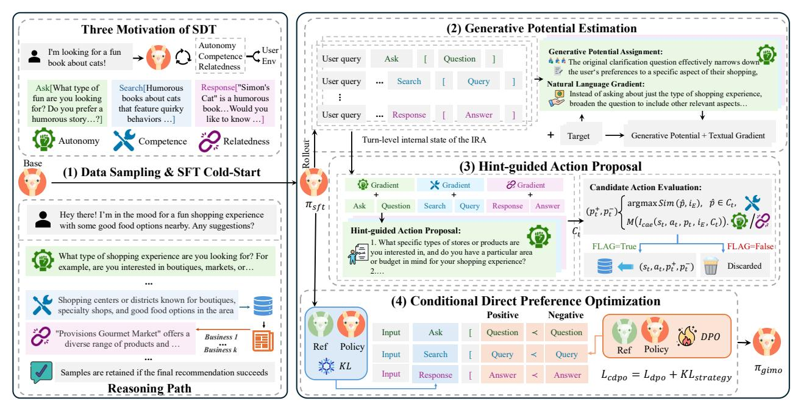
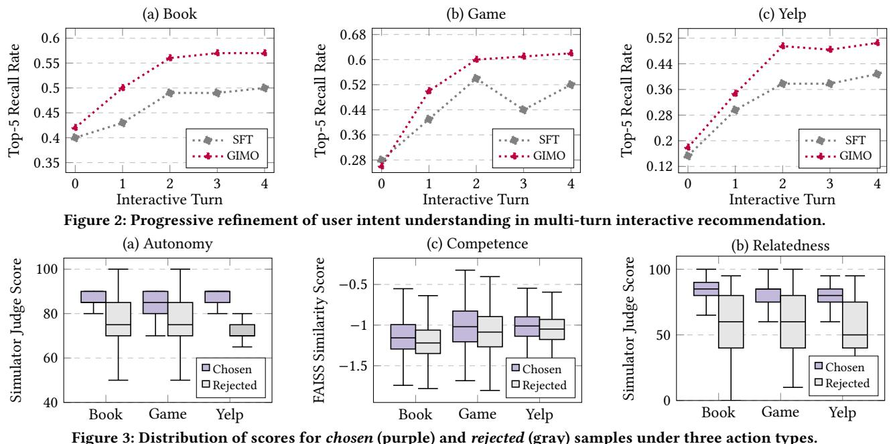
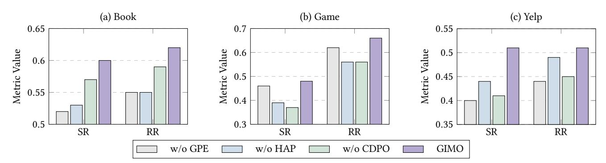

# Optimizing Multi-Turn Interactive Recommendation Agents via Generative Intrinsic Motivation

Xueyang Feng∗ Gaoling School of Artificial Intelligence Renmin University of China Beijing, China xueyangfeng@ruc.edu.cn Jiakai Tang Gaoling School of Artificial Intelligence Renmin University of China Beijing, China tangjiakai5704@ruc.edu.cn Xu Chen† Gaoling School of Artificial Intelligence Renmin University of China Beijing, China xu.chen@ruc.edu.cn

> Quanyu Dai† Huawei Technologies Ltd. Shenzhen, China daiquanyu@huawei.com

Zhenhua Dong Huawei Technologies Ltd. Shenzhen, China dongzhenhua@huawei.com

# Abstract

Large language models have given rise to interactive recommendation agents (IRAs). Through proactive clarification, tool invocation, and dynamic dialogue, IRAs shift recommender systems from passive prediction to interactive, proactive intelligence. For training IRAs, agentic reinforcement learning offers a natural pathway, as it enables models to learn interactive capabilities directly from environmental feedback without requiring costly annotated data. However, this process faces three key challenges: credit assignment in multi-turn interactions, efficient exploration in large action spaces, and coordinated learning of multiple interactive skills.

To tackle this challenge, we present a new preference optimization paradigm, GIMO, which treats the interaction and learning process of IRAs in sparse environments as the continuous fulfillment and stimulation of three intrinsic drives: Autonomy, Competence, and Relatedness. Instead of relying solely on external rewards, GIMO estimates the potential between adjacent states in a generative manner to construct intrinsic rewards. Such a generative motivation structure not only enables fine-grained credit assignment, but also naturally inspires a hint-guided action proposal mechanism that facilitates efficient exploration. Furthermore, during the multi-skill coordination training stage, we introduce an explicit KL regularization into policy orchestration to prevent global policy collapse. Theoretically, we prove that GIMO guarantees global policy consistency, and empirically, experiments in interactive recommendation environments built from three datasets demonstrate that GIMO consistently outperforms existing methods. Our code is anonymously available at [https://github.com/XueyangFeng/GIMO.](https://github.com/XueyangFeng/GIMO)

## CCS Concepts

• Information systems → Recommender systems; • Computing methodologies → Reinforcement learning.

© 2026 Copyright held by the owner/author(s). ACM ISBN 979-8-4007-2307-0/2026/04 <https://doi.org/10.1145/3774904.3792209>

# Keywords

Large language models; interactive recommendation; preference optimization; self-determination theory; dialogue agents

#### ACM Reference Format:

Xueyang Feng, Jiakai Tang, Xu Chen, Quanyu Dai, and Zhenhua Dong. 2026. Optimizing Multi-Turn Interactive Recommendation Agents via Generative Intrinsic Motivation. In Proceedings of the ACM Web Conference 2026 (WWW '26), April 13–17, 2026, Dubai, United Arab Emirates. ACM, New York, NY, USA, [12](#page-11-0) pages.<https://doi.org/10.1145/3774904.3792209>

# 1 Introduction

Recommender systems play a vital role in providing personalized information filtering and decision support across domains such as e-commerce, content distribution [\[30,](#page-8-0) [32\]](#page-8-1). However, traditional recommender systems [\[13,](#page-8-2) [18\]](#page-8-3), which usually interact with users in a passive manner, struggle to explicitly model user interests or proactively guide user needs [\[16,](#page-8-4) [48\]](#page-9-0). The rapid advancement of large language models (LLMs) [\[25\]](#page-8-5) provides a promising pathway to overcoming these limitations. Their extensive knowledge base, robust semantic understanding, and advanced reasoning capabilities enable more holistic modeling of user interests while supporting more interactive and proactive recommendation paradigms [\[9,](#page-8-6) [38\]](#page-8-7).

In this context, researchers have begun to explore LLM-based Interactive Recommendation Agents (IRAs) [\[43\]](#page-8-8), aiming to push the boundaries of LLMs in terms of proactivity, information acquisition, and natural-language recommendation. Existing studies primarily employ prompt engineering [\[6,](#page-8-9) [10,](#page-8-10) [12,](#page-8-11) [20\]](#page-8-12) and supervised fine-tuning (SFT) [\[16\]](#page-8-4) to enhance these interactive skills. However, the effectiveness of prompt engineering is constrained by the backbone LLM's intrinsic capacity and high inference cost. Meanwhile, although SFT can improve interactive skills through annotated interaction data, it lacks mechanisms for exploration and improvement via environment interactions, and fails to capture fine-grained reward signals, resulting in limited performance gains.

Beyond existing approaches, agentic reinforcement learning (ARL) offers a promising pathway for training IRAs [\[35,](#page-8-13) [36,](#page-8-14) [51\]](#page-9-1). By leveraging the inherently interactive nature of these agents, ARL allows them to learn directly from environmental feedback, eliminating the need for annotated data and enabling more fine-grained policy optimization. However, the application of ARL to interactive recommendation is hindered by three fundamental challenges:

∗Work done during internship at Huawei Technologies Ltd.

†Corresponding author

[This work is licensed under a Creative Commons Attribution 4.0 International License.](https://creativecommons.org/licenses/by/4.0) WWW '26, Dubai, United Arab Emirates

(1) Credit Assignment: IRAs operate in a sparse-reward, multiturn environment, where the critical issue for ARL is to accurately attribute the sparse reward to individual interaction turns while preserving global policy consistency. (2) Exploration in Large Action Spaces: IRAs need to navigate complex interactive environments by orchestrating multiple capabilities through natural language. The vast action space induced by natural language leads to extremely sample-inefficient exploration, where agents often have to traverse numerous suboptimal strategies before obtaining high-quality samples for policy improvement. (3) Coordinated Skill Learning : Jointly training multiple interactive skills within a single policy tends to overfit the model to a specific capability, which leads to instability or collapse in global policy orchestration.

To address these challenges, we revisit IRA optimization through the lens of intrinsic motivation. In psychology, Self-Determination Theory [\[33\]](#page-8-15) tells us that humans can sustain exploration and learning even under sparse or delayed rewards by continuously fulfilling their intrinsic motivations. Such motivation arises from their three foundational psychological needs: Autonomy, Competence, and Relatedness, which naturally align with the core capabilities required by IRAs: proactively guiding user preferences, acquiring critical information, and generating natural language recommendations. From a reinforcement learning perspective [\[2,](#page-8-16) [24,](#page-8-17) [42\]](#page-8-18), intrinsic motivation can be viewed as a form of reward shaping that provides more fine-grained and directional feedback for policy learning.

Building on this view, we propose GIMO (Generative Intrinsic Motivation Optimization), a new preference optimization paradigm that treats IRA optimization as the activation and integration of intrinsic motivational needs. Concretely, GIMO consists of three core components: (1) Generative Potential Estimation: To achieve effective credit assignment, we introduce a generative potential function that constructs fine-grained intrinsic rewards. Specifically, this function leverages LLMs to capture the distance differences between adjacent intermediate states and the final dialogue goal across multiple interaction turns, thereby decomposing the overall reward into turn-level generative rewards and improvement suggestions. (2) Hint-conditioned Action Proposal: At each interaction turn, the estimated improvement suggestions naturally serve as driving forces to mitigate the challenge of exploration in large action spaces. Concretely, we treat the generative improvement suggestions as a form of natural language gradient [\[7,](#page-8-19) [21\]](#page-8-20), which guide LLMs in proposing diverse candidate improvements. These candidates are then filtered by a family of potential evaluation functions to build the training samples. (3) Conditional Direct Preference Optimization: To address the challenge of integrating multiple interactive skills, we extend the DPO framework [\[29\]](#page-8-21) by introducing an explicit conditional KL constraint. This constraint operates on the policy orchestration patterns of the IRA, maintains coordination among skill-specific policies, preventing structural collapse in the overall policy. Furthermore, our theoretical analysis proves that the proposed GIMO guarantees global policy consistency. The main contributions of this work are as follows:

- We are the first to revisit the interaction and learning process of IRAs through the lens of intrinsic motivation, which we treat as the continuous fulfillment and stimulation of three core intrinsic drives: Autonomy, Competence, and Relatedness.

- We propose a novel intrinsic motivation driven optimization framework, GIMO, which systematically addresses three fundamental challenges in IRA optimization: credit assignment, exploration in large action spaces, and coordinated skill learning.
- Theoretically, we prove that GIMO ensures global policy consistency, and empirically, extensive experiments in three interactive recommendation environments further demonstrate that GIMO consistently surpasses current IRAs and training methods.

### 2 Preliminary

In this section, we first introduce the theoretical background of intrinsic motivation from the perspectives of psychology and reinforcement learning; then, based on this view, we formalize the capability structure and interaction process of the IRA.

# 2.1 Intrinsic Motivation

Self-Determination Theory (SDT) [\[33\]](#page-8-15) posits that humans can sustain exploration and learning under sparse external rewards because they can satisfy their three psychological needs: Autonomy, the ability to organize and regulate one's own behavior; Competence, the sense of accomplishment gained through gradual improvement; and Relatedness, the connection established by sharing progress with others. Inspired by this view, we map the three psychological needs of SDT to the core capability dimensions of IRAs, which form the structural foundation of their intrinsic motivation (see [§2.2\)](#page-1-0).

In reinforcement learning, intrinsic motivation is formalized as an internal reward complementing external rewards [\[2\]](#page-8-16). Let the agent's state at step �� be ���� ; the intrinsic reward is commonly defined as: ���� = �� Φ(����+1) − Φ(���� ), where Φ(��) denotes a potential function that measures the intrinsic desirability of a state ��. The change in potential during the transition from ���� to ����+1 can be regarded as an internal reward, providing learning signals for the agent in sparsereward environments. Moreover, this difference form theoretically guarantees the invariance of the global policy [\[24\]](#page-8-17). In this paper, we adopt the potential function as the formal foundation for modeling the intrinsic motivation of IRAs (see [§3.2\)](#page-2-0).

# 2.2 Interactive Recommendation Agent

To establish the structural foundation of the IRA's intrinsic motivation, we formalize interactive recommendation [\[38\]](#page-8-7) as a sequential decision-making problem driven by three capability dimensions. Specifically, an IRA is parameterized by a model ��, whose action is a two-stage pair {���� , ���� }: ���� is an action type selected from the action space A, which is designed according to the three need dimensions of SDT: (1) �� aut (Autonomy): the agent proactively clarifies user preference by asking for missing or ambiguous information; (2) �� com (Competence): the agent retrieves relevant candidates by invoking the external tool; (3) �� rel (Relatedness): the agent generates natural-language recommendation responses to maintain a coherent and satisfying interaction. Correspondingly, ���� denotes the specific action parameter, specifying the content of clarification questions, retrieval queries, or natural-language responses.

The IRA interacts with an environment E = (��, I, R), where: (1) User ��: provides the initial query to specify the recommendation intent, and produces user feedback in response to clarification or recommendation actions; (2) Candidate pool I = {��1,��2, . . . ,���� }:

Table 1: Evaluation results on three interactive recommendation environments. The best results are shown in bold, and the second-best results are underlined. We also report the total number of LLM calls when the dialogue length is ��.

### 3.4 Conditional Direct Preference Optimization

In the previous stages, we synthesize high-quality training data across different action types. However, mixing imbalanced samples from heterogeneous abilities for joint training often causes structural drift of the global policy, as empirically validated in Sec. [4.5.](#page-6-0) A similar phenomenon is also observed in hierarchical reinforcement learning, which suggests that high-level policy orchestration benefits from stable priors, while fine-grained low-level execution is best optimized through feedback [\[23,](#page-8-28) [27\]](#page-8-29). This insight motivates us to propose conditional direct preference optimization:

L (���� , ��sft) = E(��,���� ,��+ ,��− )∼Dpre " − log �� �� log ���� (���� , ��+ | ���� ) ��sft(���� , ��+ | ���� ) − �� log ���� (���� , ��− | ���� ) ��sft(���� , ��− | ���� ) ! # + ��E��∼Dpre " KL (���� (���� | ���� ) ∥ ��sft(���� | ���� )) . (7)

Unlike traditional DPO [\[29\]](#page-8-21), which only applies a soft constraint to control policy deviation, CDPO introduces an additional explicit conditional KL regularization imposed on the action selection stage. This regularization preserves the expert-level global policy structure, while leaving room for local policy improvements. The complete training workflow of GIMO is summarized in Algorithm [1.](#page-3-2)

### 3.5 Theoretical Analysis of Policy Consistency

In this section, we extend the proof of policy invariance [\[24\]](#page-8-17) to preference optimization. Specifically, if the constructed turn-level preferences ensure that positive samples have higher potential than negatives, GIMO does not alter the convergence target of policy learning, as formally proven in Appendix [A.](#page-9-2)

Theorem 3.1. Let Φ(���� , ���� , ���� ) denote the potential obtained from the state resulting from taking action {���� , ���� } in state ���� . If the preference samples (���� , ���� , ��+ , ��− ) ∈ Dpre satisfy

-Φ + (���� , ���� , ��+ ) − Φ(���� , ���� , ��− ) &gt; 0

then the convergence objective of preference optimization is equivalent to maximizing the trajectory-level reward ���� .

### 4 Experiments

To comprehensively demonstrate the effectiveness of our proposals, we conduct extensive experiments, which are outlined as follows: ◦ RQ1: Does GIMO outperform existing prompt-based and fine-

- tuning baselines in interactive recommendation? (see [§4.2\)](#page-5-0).
- RQ2: How do GIMO-trained agents continually accumulate intrinsic motivation rewards through multi-turn interactions to improve overall recommendation performance? (see [§4.3\)](#page-5-1).
- RQ3: To what extent can GIMO identify high-quality samples, and how does it discover such samples? (see [§4.4\)](#page-6-1).
- RQ4: How do different dimensions of motivation and policy learning stages influence overall training performance? (see [§4.5\)](#page-6-0)

#### 4.1 Experimental Setup

Datasets. Our evaluation environment employs AILO-Agent [\[8\]](#page-8-30), an interactive recommendation user simulator implemented with an LLM-based agent, which generates realistic and diverse user feedback through persona modeling and policy-based interaction mechanisms. Following ECPO [\[8\]](#page-8-30), we construct user personas in AILO from three real-world recommendation datasets: Amazon-Book, Amazon-Game [\[14\]](#page-8-31), and Yelp [\[1\]](#page-8-32). All other settings are kept consistent with ECPO to ensure comparability of results.

Metrics. We adopt Success Rate (SR), Recall Rate (RR), and User Rating (UR) as our evaluation metrics. The SR denotes the success rate of the IRA in recommending the ground-truth item to the user; a response is considered correct if it contains the name of the ground-truth item. The RR denotes the recall rate of retrieving the ground-truth item ���� from the item database, reflecting whether the IRA can accurately recall the ground-truth item from the candidate pool. The UR denotes the subjective score (0–1) provided by the AILO-simulated user to assess the quality of each response.

Baselines. We compare GIMO with a series of existing promptbased IRAs and agent training approaches, which can be divided into two types: (1) Prompt-based methods. These methods represent

Figure 3: Distribution of scores for chosen (purple) and rejected (gray) samples under three action types.

the mainstream paradigm of current interactive recommendation research, mainly enhancing the capability of IRA through mechanism and framework design. Representative methods include ChatRec [\[10\]](#page-8-10), ReAct [\[47\]](#page-9-3), and MACRS [\[6\]](#page-8-9). In addition, following the preliminary setup, we implement a lightweight prompting framework, ACR-Agent, which adopts a single prompt to first select the action type ���� ∈ A and then generate the corresponding action parameters ���� . (2) Training-based methods. To ensure fair comparison, we implement multiple alignment methods based on ACR-Agent, including trajectory-level approaches (e.g., SFT [\[16\]](#page-8-4), KTO [\[5\]](#page-8-33)) and turn-level preference optimization (e.g., SPO [\[17\]](#page-8-34), ECPO [\[8\]](#page-8-30)). We provide a detailed introduction of the baselines in Appendix [B.](#page-9-4)

### 4.2 Overall Performance Comparison

Table [1](#page-4-2) summarizes the main experimental results across three interactive recommendation environments. For prompt-based methods, we observe clear differences across backbone models. With GPT-4o mini, more advanced prompt frameworks (e.g., ReAct, MACRS), which better integrate the three SDT capabilities, yield modest performance improvements. In contrast, on LLaMA-3.1-8B, such advanced prompts fail to deliver consistent benefits and in some cases even underperform ChatRec. Meanwhile, the #Calls column indicates that achieving performance gains through complex prompt designs incurs considerable inference costs. These findings underscore the necessity of specialized training for IRAs.

For training-based baselines, SFT provides stable initial improvements, yet its overall performance remains weaker than most preference optimization methods based on environmental feedback. In the subsequent preference optimization stage, different baselines exhibit distinct characteristics: ECPO leverages turn-level feedback to strengthen user satisfaction (UR), but its improvements in SR/RR are constrained by the lack of a guarantee on policy consistency; SPO and KTO achieve balanced improvements across metrics, but

their overall gains remain limited due to insufficient exploration mechanisms and the absence of effective credit assignment, respectively. To provide a more comprehensive analysis of the underlying causes of these results, we further present a detailed comparison of their training characteristics in Appendix [C.](#page-10-0)

Beyond all these methods, GIMO is grounded in generative intrinsic motivation, effectively achieving credit assignment, sample exploration in large action space, and coordinated skill learning while preserving policy consistency. As shown in Table [1,](#page-4-2) GIMO consistently surpasses all baselines in terms of average SR and RR across three environments: compared with the best training baseline (SPO), GIMO achieves approximately +6 percentage points in SR (0.47 → 0.53) and +5 points in RR (0.55 → 0.60). Meanwhile, in terms of user satisfaction on UR, it remains essentially on par with the user-satisfaction-oriented ECPO (0.71 → 0.72). Taken together, these results demonstrate that GIMO delivers more comprehensive multi-turn performance while preserving user experience.

### 4.3 Performance Dynamics in Dialogue Turns

To investigate how the GIMO-trained agent progressively narrows down to the target item ���� in multi-turn interactive recommendation, we record its internal state ���� after each user interaction. We then force the agent to generate a search query based on these states. Using these queries, we employ the retrieval tool R to compute the Top-5 recall rate of retrieving the target item ���� from the database I. This metric objectively reflects the evolution of the agent's understanding of user intent throughout the dialogue dynamics.

Figure [2](#page-5-2) compares the agent trained solely with SFT against the one further optimized with GIMO. Across three interactive recommendation environments, the SFT-trained agent exhibits slower improvement, a limited performance ceiling, and noticeable fluctuations in later turns. In contrast, the GIMO-trained agent achieves a steadily increasing recall rate and maintains consistently high

Figure 4: Effectiveness of different training stages of GIMO across three interactive recommendation environments.

Table 2: Effectiveness of different dimensions of motivation across three interactive recommendation environments.

|      |      | Methods     | SR   | Book RR | SR   | Game RR | SR   | Yelp RR |
|------|------|-------------|------|---------|------|---------|------|---------|
|      | GIMO |             | 0.60 | 0.62    | 0.48 | 0.66    | 0.51 | 0.51    |
| GIMO | w/o  | Autonomy    | 0.55 | 0.58    | 0.45 | 0.56    | 0.43 | 0.46    |
| GIMO | w/o  | Competence  | 0.56 | 0.59    | 0.40 | 0.62    | 0.44 | 0.46    |
| GIMO | w/o  | Relatedness | 0.52 | 0.59    | 0.39 | 0.56    | 0.47 | 0.51    |

recall in subsequent dialogue turns. For example, on Yelp, the Top-5 recall of GIMO rises from about 0.18 at turn 0 to 0.49 at turn 2, and then stays above 0.50, whereas SFT plateaus around 0.38 after turn 2. On Game, GIMO steadily climbs from 0.26 to 0.62, while SFT peaks near 0.54 before declining. These findings indicate that, owing to its global policy consistency design, GIMO enables the agent to more effectively focus on and converge toward the final target item during multi-turn interactions, thereby avoiding local optima and policy oscillation. It is worth emphasizing that our credit assignment is naturally built upon the LLM's error attribution capability, which eliminates the need for costly sampling while providing directional guidance to alleviate the difficulty of highdimensional exploration. In the next section, we analyze the effect of such guidance from both statistical and case-based perspectives.

### 4.4 Process Analysis of Action Proposal

In this section, we decompose the process of hint-conditioned action proposal for detailed analysis. From a statistical perspective, we examine the quality and stability of turn-level preference relations generated under three types of motivations. Specifically, when ���� = �� ������, we directly compare the similarity score distributions of chosen and rejected queries with respect to the target item. When ���� ∈ {�� aut, ��rel}, we leverage the user simulator to assign scores to chosen and rejected samples, with all scores normalized.

As shown in Figure [3,](#page-5-3) across all three action types, the scores of chosen samples (purple) are consistently and significantly higher than those of rejected samples (gray), indicating that HAP can reliably generate high-quality preference relations. In particular, when ���� ∈ {�� aut, ��rel}, the distributions of chosen samples are notably more concentrated, suggesting that from the user's perspective, the selected samples are both higher in quality and more stable. Furthermore, to illustrate how these high-quality preference relations are generated, we provide a toy example in the Appendix [E.](#page-11-1)

#### 4.5 Ablation Studies

GIMO constructs intrinsic motivation in a generative manner, based on the three core capability dimensions of IRAs, and drives a novel three stage optimization paradigm. To verify its effectiveness, we conduct systematic ablation studies from two complementary dimensions: training stage and dimensions of motivation.

Effectiveness of Different Training Stages. We present the ablation results of different training stages in Figure [4.](#page-6-2) (1) Effect of GPE. In this setting, we replace the turn-level GPE with a handcrafted static prompt (w/o GPE). The results indicate a significant performance drop after removing GPE, particularly on the Book and Yelp datasets, where the average decreases in SR and RR exceed 0.07. This suggests that static handcrafted prompts fail to capture diverse error patterns, whereas GPE effectively attributes the final reward to each interaction turn, providing fine-grained and interpretable guidance signals that facilitate subsequent action proposal. (2) Effect of HAP. HAP is responsible for generating candidate action proposals and performing action evaluation. Since removing the proposal component would make subsequent training infeasible, we focus on ablating the action evaluation stage. When the evaluation module (w/o HAP) is removed, the IRA exhibits noticeable performance fluctuations across datasets, with performance drops ranging from 0.045 to 0.095. This demonstrates that the evaluation mechanism of HAP plays a crucial role in filtering low-quality samples and ensuring overall training stability and performance. (3) Effect of CDPO. CDPO is designed to achieve stable multiability integration while preserving global policy coordination. To examine its impact, we replace CDPO with the standard DPO objective [\[29\]](#page-8-21) (w/o CDPO). Among all ablated training stages, removing CDPO leads to the largest overall degradation, with an average performance drop of about 0.072 across three datasets. This highlights the indispensable stabilizer role of CDPO in integrating multiple capabilities and preserving the expert-level global policy structure.

Motivation Ablation. To examine the impact of the three capability dimensions of intrinsic motivation on performance, we individually remove each motivational component of GIMO. After removal, the IRA retains only the corresponding foundational capability distilled during the SFT stage. In Table [2,](#page-6-3) the results reveal that removing any of them causes substantial performance degradation, showing their critical importance in interactive recommendation. Specifically, removing Autonomy causes the largest

overall performance drop (average decrease of about 0.058), while removing relatedness leads to the largest decrease in success rate (average drop of about 0.07), indicating that user-related feedback has a more direct impact on the final recommendation outcomes.

# 5 Related Work

This section first reviews existing LLM-based interactive recommendation agents from the perspective of the three capability dimensions inspired by Self-Determination Theory [\[33\]](#page-8-15), followed by a summary of recent advances in agentic reinforcement learning.

# 5.1 An SDT View of IRAs

SDT posits that humans can sustain exploration and learning even under sparse or delayed rewards by continuously fulfilling their three fundamental psychological needs: Autonomy, Competence, and Relatedness. Building upon this insight, we systematically categorize existing studies on IRAs along these three dimensions.

Autonomy. It refers to an agent's capacity to proactively guide conversations, clarify user preferences, and strategically plan the interaction flow. Some studies pursue this goal by incorporating explicit strategy control or structured reasoning to regulate response policies [\[6\]](#page-8-9), while others enhance the proactivity of LLMs through supervised fine-tuning or preference optimization [\[17,](#page-8-34) [28\]](#page-8-35).

Competence. It emphasizes an agent's ability to acquire and leverage information effectively in order to achieve recommendation goals. Early studies primarily relied on the knowledge encoded in model parameters to perform recommendation tasks [\[6,](#page-8-9) [12\]](#page-8-11), but such approaches were unable to access real-world item information. In contrast, another line of work extends the knowledge boundary of LLMs by incorporating external tools such as retrieval and recommendation models [\[10,](#page-8-10) [16,](#page-8-4) [20\]](#page-8-12), thereby improving the usability and adaptability of the system in real-world applications.

Relatedness. It emphasizes the user's experience during the interaction process. One line of research enhances relatedness by generating empathetic or explainable responses to foster trust [\[49,](#page-9-5) [50\]](#page-9-6). Another line of research leverages user feedback or preference signals to train the natural language recommendation ability of LLMs [\[8,](#page-8-30) [39\]](#page-8-36), thereby improving user satisfaction and engagement.

In contrast to prior studies that typically focus on designing methods for a single dimension or training a specific capability, our work adopts a systematic perspective to elucidate that the three types of abilities jointly constitute the intrinsic motivation driving IRAs to accomplish tasks and perform reinforcement learning.

# 5.2 Agentic Reinforcement Learning

Preference Optimization for LLMs. Preference optimization has emerged as a central and powerful paradigm for aligning LLMs. Representative methods include reinforcement learning from human feedback [\[26,](#page-8-27) [34\]](#page-8-37), its offline variants such as DPO [\[29\]](#page-8-21), KTO [\[5\]](#page-8-33), and extensions based on verifiable reward modeling [\[35,](#page-8-13) [51\]](#page-9-1). These methods leverage human or environmental feedback as reward signals, significantly improving LLM performance in dialogue generation and reasoning tasks. However, they are primarily designed

for single-turn, static tasks and fail to generalize effectively to multiturn, interactive, or dynamically evolving alignment scenarios.

Multi-turn Preference Optimization. With the rise of interactive applications, researchers have begun to explore how reinforcement learning can be used to optimize LLMs in multi-turn tasks, where the central challenge lies in credit assignment. Early methods typically treat each turn as equally important [\[37,](#page-8-38) [40\]](#page-8-39), but such methods fail to capture the varying contributions of different turns to the final outcome [\[8\]](#page-8-30). Subsequent studies introduced MCTS or treesearch mechanisms to construct turn-level preference pairs [\[17,](#page-8-34) [46\]](#page-9-7), providing finer-grained reward attribution but at the cost of high sampling overhead and facing exploration challenges. Subsequent research [\[8\]](#page-8-30) explores leveraging per-turn user feedback to refine turn-level samples. Although this strategy improves short-term user satisfaction, it fails to maintain global policy consistency.

Intrinsic motivation in reinforcement learning. In traditional reinforcement learning, intrinsic motivation has been widely used to tackle sparse-reward environments. Its core idea is to design potential-based reward shaping functions by measuring the distance between intermediate states and the final goal [\[2,](#page-8-16) [24,](#page-8-17) [42\]](#page-8-18). However, these methods rely on clearly definable distance functions between states and goals, which are difficult to establish in IRA environments. To address this limitation, we propose a generative potential function based on LLMs, which leverages their attribution capabilities [\[3\]](#page-8-25) to measure the distance between intermediate states and final goals in natural language space. This extends traditional intrinsic motivation methods and facilitates more effective exploration. Furthermore, we generalize the theoretical analysis to the preference optimization setting, proving that the nature of partialorder provides a unique advantage in ensuring policy invariance.

# 6 Conclusion

This paper introduces GIMO, a novel training paradigm based on intrinsic motivation. GIMO constructs IRAs' intrinsic motivation in a generative manner, centered on three core capability dimensions: Autonomy, Competence, and Relatedness. This motivational structure drives a three-stage optimization process: Generative Potential Estimation for fine-grained credit assignment, Hint-conditioned Action Proposal for efficient exploration in large action spaces, and Conditional Direct Preference Optimization for coordinated multi-skill learning. We theoretically prove that GIMO ensures global policy consistency, and empirically demonstrate its superior performance through extensive experiments and analysis.

# Acknowledgments

This work is supported in part by National Natural Science Foundation of China (No. 62422215 and No. 62472427), Major Innovation & Planning Interdisciplinary Platform for the "DoubleFirst Class" Initiative, Renmin University of China, Public Computing Cloud, Renmin University of China, fund for building world-class universities (disciplines) of Renmin University of China, and Huawei Innovation Research Programs. We gratefully acknowledge the support from Mindspore[2](#page-7-0) , CANN and Ascend AI Processor used for this research.

2<https://www.mindspore.cn>

### References

[1] Nabiha Asghar. 2016. Yelp Dataset Challenge: Review Rating Prediction. arXiv[:1605.05362](https://arxiv.org/abs/1605.05362) [cs.CL]<https://arxiv.org/abs/1605.05362> [2] Arthur Aubret, Laetitia Matignon, and Salima Hassas. 2019. A survey on intrinsic motivation in reinforcement learning. arXiv[:1908.06976](https://arxiv.org/abs/1908.06976) [cs.LG] [https://arxiv.](https://arxiv.org/abs/1908.06976) [org/abs/1908.06976](https://arxiv.org/abs/1908.06976) [3] Mert Cemri, Melissa Z. Pan, Shuyi Yang, Lakshya A. Agrawal, Bhavya Chopra, Rishabh Tiwari, Kurt Keutzer, Aditya Parameswaran, Dan Klein, Kannan Ramchandran, Matei Zaharia, Joseph E. Gonzalez, and Ion Stoica. 2025. Why Do Multi-Agent LLM Systems Fail? arXiv[:2503.13657](https://arxiv.org/abs/2503.13657) [cs.AI] [https://arxiv.org/abs/](https://arxiv.org/abs/2503.13657) [2503.13657](https://arxiv.org/abs/2503.13657) [4] Baian Chen, Chang Shu, Ehsan Shareghi, Nigel Collier, Karthik Narasimhan, and Shunyu Yao. 2023. Fireact: Toward language agent fine-tuning. arXiv preprint arXiv:2310.05915 (2023). [5] Kawin Ethayarajh, Winnie Xu, Niklas Muennighoff, Dan Jurafsky, and Douwe Kiela. 2024. KTO: Model Alignment as Prospect Theoretic Optimization. arXiv[:2402.01306](https://arxiv.org/abs/2402.01306) [cs.LG]<https://arxiv.org/abs/2402.01306> [6] Jiabao Fang, Shen Gao, Pengjie Ren, Xiuying Chen, Suzan Verberne, and Zhaochun Ren. 2024. A multi-agent conversational recommender system. arXiv preprint arXiv:2402.01135 (2024). [7] Xueyang Feng, Bo Lan, Quanyu Dai, Lei Wang, Jiakai Tang, Xu Chen, Zhenhua Dong, and Ji-Rong Wen. 2025. Improving Retrospective Language Agents via Joint Policy Gradient Optimization. arXiv[:2503.01490](https://arxiv.org/abs/2503.01490) [cs.CL] [https://arxiv.org/](https://arxiv.org/abs/2503.01490) [abs/2503.01490](https://arxiv.org/abs/2503.01490) [8] Xueyang Feng, Jingsen Zhang, Jiakai Tang, Wei Li, Guohao Cai, Xu Chen, Quanyu Dai, Yue Zhu, and Zhenhua Dong. 2025. Expectation Confirmation Preference Optimization for Multi-Turn Conversational Recommendation Agent. arXiv[:2506.14302](https://arxiv.org/abs/2506.14302) [cs.CL]<https://arxiv.org/abs/2506.14302> [9] Yue Feng, Shuchang Liu, Zhenghai Xue, Qingpeng Cai, Lantao Hu, Peng Jiang, Kun Gai, and Fei Sun. 2023. A large language model enhanced conversational recommender system. arXiv preprint arXiv:2308.06212 (2023). [10] Yunfan Gao, Tao Sheng, Youlin Xiang, Yun Xiong, Haofen Wang, and Jiawei Zhang. 2023. Chat-rec: Towards interactive and explainable llms-augmented recommender system. arXiv preprint arXiv:2303.14524 (2023). [11] Aaron Grattafiori, Abhimanyu Dubey, and et al. 2024. The Llama 3 Herd of Models. arXiv[:2407.21783](https://arxiv.org/abs/2407.21783) [cs.AI]<https://arxiv.org/abs/2407.21783> [12] Zhankui He, Zhouhang Xie, Rahul Jha, Harald Steck, Dawen Liang, Yesu Feng, Bodhisattwa Prasad Majumder, Nathan Kallus, and Julian McAuley. 2023. Large language models as zero-shot conversational recommenders. In Proceedings of the 32nd ACM international conference on information and knowledge management. 720–730. [13] Balázs Hidasi, Alexandros Karatzoglou, Linas Baltrunas, and Domonkos Tikk. 2016. Session-based Recommendations with Recurrent Neural Networks. arXiv[:1511.06939](https://arxiv.org/abs/1511.06939) [cs.LG]<https://arxiv.org/abs/1511.06939> [14] Yupeng Hou, Jiacheng Li, Zhankui He, An Yan, Xiusi Chen, and Julian McAuley. 2024. Bridging Language and Items for Retrieval and Recommendation. arXiv preprint arXiv:2403.03952 (2024). [15] Edward J. Hu, Yelong Shen, Phillip Wallis, Zeyuan Allen-Zhu, Yuanzhi Li, Shean Wang, Lu Wang, and Weizhu Chen. 2021. LoRA: Low-Rank Adaptation of Large Language Models. arXiv[:2106.09685](https://arxiv.org/abs/2106.09685) [cs.CL] [16] Xu Huang, Jianxun Lian, Yuxuan Lei, Jing Yao, Defu Lian, and Xing Xie. 2023. Recommender ai agent: Integrating large language models for interactive recommendations. arXiv preprint arXiv:2308.16505 (2023). [17] Chuhao Jin, Kening Ren, Lingzhen Kong, Xiting Wang, Ruihua Song, and Huan Chen. 2024. Persuading across Diverse Domains: a Dataset and Persuasion Large Language Model. In Proceedings of the 62nd Annual Meeting of the Association for Computational Linguistics (Volume 1: Long Papers). 1678–1706. [18] Yehuda Koren, Robert Bell, and Chris Volinsky. 2009. Matrix Factorization Techniques for Recommender Systems. Computer 42, 8 (Aug. 2009), 30–37. [doi:10.1109/MC.2009.263](https://doi.org/10.1109/MC.2009.263) [19] Woosuk Kwon, Zhuohan Li, Siyuan Zhuang, Ying Sheng, Lianmin Zheng, Cody Hao Yu, Joseph E. Gonzalez, Hao Zhang, and Ion Stoica. 2023. Efficient Memory Management for Large Language Model Serving with PagedAttention. arXiv[:2309.06180](https://arxiv.org/abs/2309.06180) [cs.LG]<https://arxiv.org/abs/2309.06180> [20] Chuang Li, Yang Deng, Hengchang Hu, Min-Yen Kan, and Haizhou Li. 2025. ChatCRS: Incorporating External Knowledge and Goal Guidance for LLM-based Conversational Recommender Systems. In Findings of the Association for Computational Linguistics: NAACL 2025, Luis Chiruzzo, Alan Ritter, and Lu Wang (Eds.). Association for Computational Linguistics, Albuquerque, New Mexico, 295–312. [doi:10.18653/v1/2025.findings-naacl.17](https://doi.org/10.18653/v1/2025.findings-naacl.17) [21] Yafu Li, Xuyang Hu, Xiaoye Qu, Linjie Li, and Yu Cheng. 2025. Test-Time Preference Optimization: On-the-Fly Alignment via Iterative Textual Feedback. arXiv[:2501.12895](https://arxiv.org/abs/2501.12895) [cs.CL]<https://arxiv.org/abs/2501.12895> [22] Shikib Mehri and Maxine Eskenazi. 2020. Unsupervised Evaluation of Interactive Dialog with DialoGPT. arXiv[:2006.12719](https://arxiv.org/abs/2006.12719) [cs.CL]<https://arxiv.org/abs/2006.12719> [23] Ofir Nachum, Shixiang Gu, Honglak Lee, and Sergey Levine. 2018. Data-Efficient Hierarchical Reinforcement Learning. arXiv[:1805.08296](https://arxiv.org/abs/1805.08296) [cs.LG] [https://arxiv.](https://arxiv.org/abs/1805.08296) [org/abs/1805.08296](https://arxiv.org/abs/1805.08296) [24] Andrew Y Ng, Daishi Harada, and Stuart Russell. 1999. Policy invariance under reward transformations: Theory and application to reward shaping. In Icml, Vol. 99. Citeseer, 278–287. [25] OpenAI, Josh Achiam, and et al. 2024. GPT-4 Technical Report. arXiv[:2303.08774](https://arxiv.org/abs/2303.08774) [cs.CL]<https://arxiv.org/abs/2303.08774> [26] Long Ouyang, Jeffrey Wu, Xu Jiang, Diogo Almeida, Carroll Wainwright, Pamela Mishkin, Chong Zhang, Sandhini Agarwal, Katarina Slama, Alex Ray, et al. 2022. Training language models to follow instructions with human feedback. Advances in neural information processing systems 35 (2022), 27730–27744. [27] Shubham Pateria, Budhitama Subagdja, Ah-hwee Tan, and Chai Quek. 2021. Hierarchical Reinforcement Learning: A Comprehensive Survey. ACM Comput. Surv. 54, 5, Article 109 (June 2021), 35 pages. [doi:10.1145/3453160](https://doi.org/10.1145/3453160) [28] Cheng Qian, Bingxiang He, Zhong Zhuang, Jia Deng, Yujia Qin, Xin Cong, Zhong Zhang, Jie Zhou, Yankai Lin, Zhiyuan Liu, and Maosong Sun. 2024. Tell Me More! Towards Implicit User Intention Understanding of Language Model Driven Agents. In Proceedings of the 62nd Annual Meeting of the Association for Computational Linguistics (Volume 1: Long Papers), Lun-Wei Ku, Andre Martins, and Vivek Srikumar (Eds.). Association for Computational Linguistics, Bangkok, Thailand, 1088–1113. [doi:10.18653/v1/2024.acl-long.61](https://doi.org/10.18653/v1/2024.acl-long.61) [29] Rafael Rafailov, Archit Sharma, Eric Mitchell, Stefano Ermon, Christopher D. Manning, and Chelsea Finn. 2024. Direct Preference Optimization: Your Language Model is Secretly a Reward Model. arXiv[:2305.18290](https://arxiv.org/abs/2305.18290) [cs.LG] [https://arxiv.org/](https://arxiv.org/abs/2305.18290) [abs/2305.18290](https://arxiv.org/abs/2305.18290) [30] Shaina Raza, Mizanur Rahman, Safiullah Kamawal, Armin Toroghi, Ananya Raval, Farshad Navah, and Amirmohammad Kazemeini. 2025. A Comprehensive Review of Recommender Systems: Transitioning from Theory to Practice. arXiv[:2407.13699](https://arxiv.org/abs/2407.13699) [cs.IR]<https://arxiv.org/abs/2407.13699> [31] Nils Reimers and Iryna Gurevych. 2019. Sentence-BERT: Sentence Embeddings using Siamese BERT-Networks. arXiv[:1908.10084](https://arxiv.org/abs/1908.10084) [cs.CL] [https://arxiv.org/abs/](https://arxiv.org/abs/1908.10084) [1908.10084](https://arxiv.org/abs/1908.10084) [32] Francesco Ricci, Lior Rokach, Bracha Shapira, and Paul B. Kantor. 2010. Recommender Systems Handbook (1st ed.). Springer-Verlag, Berlin, Heidelberg. [33] Richard M Ryan and Edward L Deci. 2000. Self-determination theory and the facilitation of intrinsic motivation, social development, and well-being. American psychologist 55, 1 (2000), 68. [34] John Schulman, Filip Wolski, Prafulla Dhariwal, Alec Radford, and Oleg Klimov. 2017. Proximal Policy Optimization Algorithms. arXiv[:1707.06347](https://arxiv.org/abs/1707.06347) [cs.LG] [https:](https://arxiv.org/abs/1707.06347) [//arxiv.org/abs/1707.06347](https://arxiv.org/abs/1707.06347) [35] Zhihong Shao, Peiyi Wang, Qihao Zhu, Runxin Xu, Junxiao Song, Xiao Bi, Haowei Zhang, Mingchuan Zhang, Y. K. Li, Y. Wu, and Daya Guo. 2024. DeepSeek-Math: Pushing the Limits of Mathematical Reasoning in Open Language Models. arXiv[:2402.03300](https://arxiv.org/abs/2402.03300) [cs.CL]<https://arxiv.org/abs/2402.03300> [36] Joykirat Singh, Raghav Magazine, Yash Pandya, and Akshay Nambi. 2025. Agentic Reasoning and Tool Integration for LLMs via Reinforcement Learning. arXiv[:2505.01441](https://arxiv.org/abs/2505.01441) [cs.AI]<https://arxiv.org/abs/2505.01441> [37] Yuchong Sun, Che Liu, Kun Zhou, Jinwen Huang, Ruihua Song, Wayne Xin Zhao, Fuzheng Zhang, Di Zhang, and Kun Gai. 2024. Parrot: Enhancing Multi-Turn Instruction Following for Large Language Models. arXiv[:2310.07301](https://arxiv.org/abs/2310.07301) [cs.CL] <https://arxiv.org/abs/2310.07301> [38] Jiakai Tang, Yujie Luo, Xunke Xi, Fei Sun, Xueyang Feng, Sunhao Dai, Chao Yi, Dian Chen, Zhujin Gao, Yang Li, Xu Chen, Wen Chen, Jian Wu, Yuning Jiang, and Bo Zheng. 2025. Interactive Recommendation Agent with Active User Commands. arXiv[:2509.21317](https://arxiv.org/abs/2509.21317) [cs.IR]<https://arxiv.org/abs/2509.21317> [39] Jiakai Tang, Jingsen Zhang, Zihang Tian, Xueyang Feng, Lei Wang, and Xu Chen. 2025. HF4Rec: Human-Like Feedback-Driven Optimization Framework for Explainable Recommendation. ACM Trans. Inf. Syst. (Aug. 2025). [doi:10.1145/](https://doi.org/10.1145/3758091) [3758091](https://doi.org/10.1145/3758091) Just Accepted. [40] Dennis Ulmer, Elman Mansimov, Kaixiang Lin, Justin Sun, Xibin Gao, and Yi Zhang. 2024. Bootstrapping LLM-based Task-Oriented Dialogue Agents via Self-Talk. arXiv[:2401.05033](https://arxiv.org/abs/2401.05033) [cs.CL]<https://arxiv.org/abs/2401.05033> [41] Vladimir Vapnik and Akshay Vashist. 2009. A new learning paradigm: Learning using privileged information. Neural Networks 22, 5-6 (2009), 544–557. [42] Yanming Wan, Jiaxing Wu, Marwa Abdulhai, Lior Shani, and Natasha Jaques. 2025. Enhancing Personalized Multi-Turn Dialogue with Curiosity Reward. arXiv[:2504.03206](https://arxiv.org/abs/2504.03206) [cs.CL]<https://arxiv.org/abs/2504.03206> [43] Lei Wang, Chen Ma, Xueyang Feng, Zeyu Zhang, Hao Yang, Jingsen Zhang, Zhiyuan Chen, Jiakai Tang, Xu Chen, Yankai Lin, Wayne Xin Zhao, Zhewei Wei, and Jirong Wen. 2024. A survey on large language model based autonomous agents. Frontiers of Computer Science 18, 6 (March 2024). [doi:10.1007/s11704-024-](https://doi.org/10.1007/s11704-024-40231-1) [40231-1](https://doi.org/10.1007/s11704-024-40231-1) [44] Xiaolei Wang, Xinyu Tang, Xin Zhao, Jingyuan Wang, and Ji-Rong Wen. 2023. Rethinking the Evaluation for Conversational Recommendation in the Era of Large Language Models. In Proceedings of the 2023 Conference on Empirical Methods in Natural Language Processing. Association for Computational Linguistics. [doi:10.18653/v1/2023.emnlp-main.621](https://doi.org/10.18653/v1/2023.emnlp-main.621) [45] Jason Wei, Yi Tay, Rishi Bommasani, Colin Raffel, Barret Zoph, Sebastian Borgeaud, Dani Yogatama, Maarten Bosma, Denny Zhou, Donald Metzler, Ed H.

Table 3: Capability comparison between recent methods and GIMO across two dimensions: (i) the motivational structure composed of three capability dimensions inspired by SDT, and (ii) training characteristics.

### B.2 Training Methods for Interactive Agents

SFT [\[4,](#page-8-40) [16\]](#page-8-4). Supervised fine-tuning on expert trajectories to distill behavior into the policy. SFT operates at the trajectory level and does not exploit environment feedback at training time.

KTO [\[5\]](#page-8-33). A trajectory-level preference optimization method that, given environment feedback, leverages both positive and negative trajectories to improve the policy.

SPO [\[17\]](#page-8-34). A preference optimization approach that constructs turn-level preference pairs via tree search. Specifically, for each intermediate state, multiple future trajectories are simulated to estimate its reward. While it can provide fine-grained supervision, its exploration efficiency is low and the cost can be high.

ECPO [\[8\]](#page-8-30). An interactive preference optimization method that rewrites low-quality responses by leveraging users' internal states across multiple turns, and then optimizes with the induced preferences. A limitation is that it optimizes only user-perceivable aspects and does not guarantee multi-turn policy consistency.

# C Connections to Related Work

Comparison from the Perspective of Capability Dimensions As summarized in Table [3,](#page-10-1) we first compare GIMO with existing methods based on the three different dimensions of motivation derived from SDT (Autonomy, Competence, and Relatedness):

- SFT (Implementation in InteRecagent [\[16\]](#page-8-4)): Mainly focuses on optimizing the tool invocation ability of recommendation agents, but lacks autonomy and interactive learning.
- KTO [\[5\]](#page-8-33): A preference alignment method that can be easily transferred to multi-turn dialogue without paired preferences, emphasizing the improvement of Relatedness.
- SPO [\[17\]](#page-8-34): Enhances persuasive dialogues in multi-turn settings, with a particular focus on improving Autonomy.
- ECPO [\[8\]](#page-8-30): Aims to align agent responses with user feedback, emphasizing maximum Relatedness within each turn.
- GIMO (Ours): Beyond prior methods that focus on specific dimensions, GIMO systematically constructs intrinsic motivation to jointly enhance the three core capabilities of IRAs.

Comparison from the Perspective of Training Characteristics Except for SFT, all other methods introduce environmental feedback for model alignment to varying degrees, but each has limitations:

- KTO: Relies primarily on trajectory-level feedback signals, lacking fine-grained turn-level credit assignment.
- SPO: Constructs preference pairs via tree-search, which incurs exponential sampling cost.
- ECPO: Utilizes user feedback at the turn level but struggles to ensure global policy consistency.
- GIMO: Based on generative motivation, GIMO achieves turnlevel credit assignment while inducing privileged information enhanced exploration. Through CDPO, it further realizes effective multi-ability integration while ensuring policy consistency.

## D Implementation Details

Backbones. We use LLaMA-3.1-8B [\[11\]](#page-8-41) as the base LLM, and also employ GPT-4o-mini [\[25\]](#page-8-5) as reference in our main experiments. The specific LLM prompts are provided in our code repository. For all prompt-based methods, we design simple in-context examples for each dataset to elicit the instruction-following capability of LLMs. LLaMA is deployed with vLLM [\[19\]](#page-8-42) under the same API interface as OpenAI. We set the temperature to 0.0 when calling the API, and adopt structured output for complex instruction formats to avoid errors caused by format parsing.

Environment Setup. Our environment is defined as E = (��, ��, ��). The user �� is implemented by AILO-Agent, and the maximum dialogue turn is set to �� = 5. The database �� is constructed from item metadata extracted from the recommendation datasets (e.g., Amazon), with around 3,000 items built separately for each dataset. The tool �� is implemented with all-MiniLM-L6-v2 [\[31\]](#page-8-43), which performs dense retrieval over �� and returns the top-�� = 5 most relevant candidate items for each query.

Training Details. For each dataset, we randomly sample 1,000 simulation tasks to construct the dataset ��sft. In the GIMO stage, an additional 1,000 simulation tasks are sampled. We employ Llama-Factory [\[52\]](#page-9-8) to integrate the three capabilities into a unified LoRA adapter [\[15\]](#page-8-44). The training is conducted for 3 epochs with a batch size of 32, and tune the learning rate within {5×10−6 , 1×10−6 , 5×10−7 }. In the HAP stage, we set the number of action proposals �� ∈ {1, 2, 3}, and find that �� = 2 yields the best performance in practice.

Table 4: A toy example of GIMO from the Yelp dataset.

| User’s Query: Hey there!      | I’m       | in the mood for a fun shopping experience with some good food options nearby. Any suggestions  |
|-------------------------------|-----------|------------------------------------------------------------------------------------------------|
| for a place that has a bit of |           | everything?                                                                                    |
| Action Selection: ��          |           |                                                                                                |
| Action Parameter What         |           | type of shopping experience are you looking for? For example, are you interested in boutiques, |
| markets, or a specific type   | of        | store?                                                                                         |
|                               |           | [Generative Potential Estimation]                                                              |
| Ground Truth : The            | Shops     | at Wiregrass is a vibrant shopping center located at 28211                                     |
| Paseo Drive in                |           | Wesley Chapel , Florida                                                                        |
| Generative Potential          |           | Assignment : The original clarification question effectively narrows                           |
| down the user                 | 's        | preferences to a specific aspect of their shopping experience ,                                |
| but it could                  | be        | more comprehensive By focusing solely on the type of shopping                                  |
| experience , it               |           | may overlook other important factors such as location , budget , or                            |
| specific                      | interests |                                                                                                |
| Textual Gradient : 1.         |           | Multi Dimensional Inquiry : Instead of asking about just the type                              |
| of shopping                   |           | experience , broaden the question to include other relevant aspects ,                          |
| such as 'What                 |           | type of stores are you interested in , and do you have a specific                              |
| budget or                     | location  | in mind ? ' This approach encourages the user to provide a more                                |
| detailed                      | response  | , which can lead to better recommendations ; 2.                                                |
|                               |           | [Hint-conditioned Action Proposal]                                                             |
| <Textual Gradient 1>          |           |                                                                                                |
| Action Proposal 1 :           | What      | specific types of stores or products are you interested in , and                               |
| do you have                   | a         | particular area or budget in mind for your shopping experience ?                               |
| <Textual Gradient 2>          |           |                                                                                                |
|                               |           | [Candidate Action Evaluation]                                                                  |
| Ground Truth : The            | Shops     | at Wiregrass is a vibrant shopping center located at 28211                                     |
| Paseo Drive in                |           | Wesley Chapel , Florida                                                                        |
| Whether exist a refinement    |           | output are better than original response : Yes                                                 |
| Best Refinement : What        |           | specific types of stores or products are you interested in , and                               |
| do you have a                 |           | particular area or budget in mind for your shopping experience ?                               |
| Training Sample : ( ��        |           |                                                                                                |
| ������                        | ,         | ��                                                                                             |
|                               |           | ������ , < Original Action Parameter > , < Best Refinement Parameter >)                        |

In the CDPO stage, we set the weight of the explicit KL regularization term �� to 1.0. For all training baselines, we either follow the original implementation settings or adopt the same hyperparameter search space as GIMO.

# E Case Study

To better illustrate the workflow of our GIMO framework, we provide a concise example covering the process of Generative Potential Estimation, Action Proposal, and Candidate Evaluation, complementing the description in Figure [1.](#page-2-1) The example is shown in Table [4.](#page-11-2)

First, the user provides an ambiguous request, seeking a place that combines both shopping and dining. At the action selection stage, the system chooses to perform a clarification step and generates an initial clarification question (focusing only on the shopping

type). Next, in the Generative Potential Estimation module, the expected feedback of this action is assessed: on the positive side, it narrows down the user's preference toward a specific shopping aspect; on the negative side, it overlooks other important factors such as location and budget. Based on this analysis, a natural-language gradient is produced as a refinement hint. Conditioned on these hints, the Action Proposal stage produces a more comprehensive clarification question, for example, simultaneously asking about store types, budget, and location. Finally, in the Candidate Evaluation stage, the system compares the original and refined questions. The potential evaluation function indicates that the refined clarification more effectively drives the dialogue toward the final goal. Therefore, the best refinement, together with the original response, is used to construct a preference pair for subsequent policy learning.