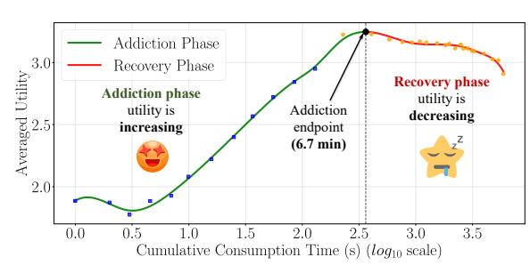
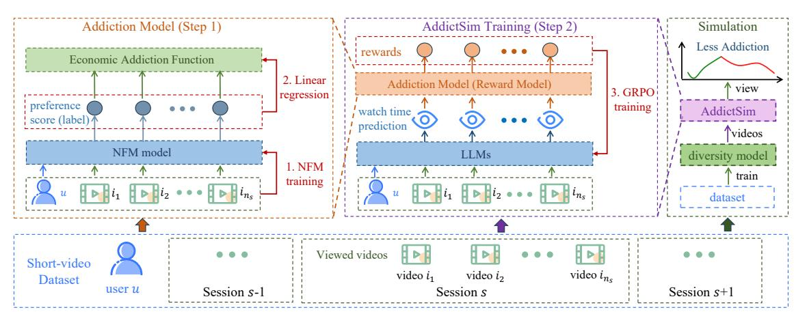
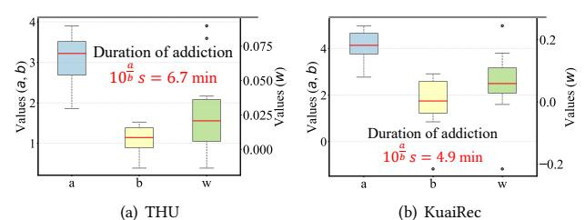
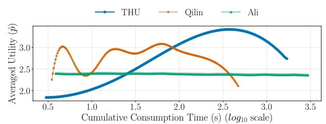
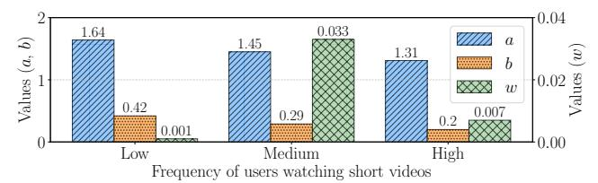
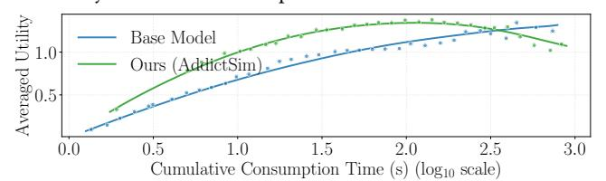
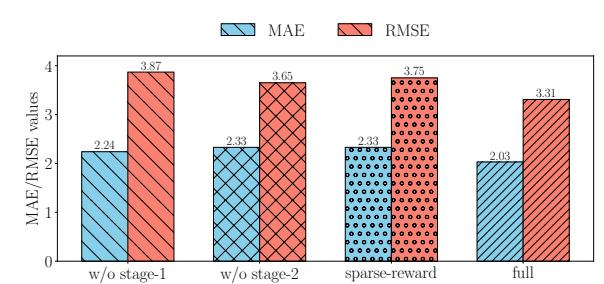
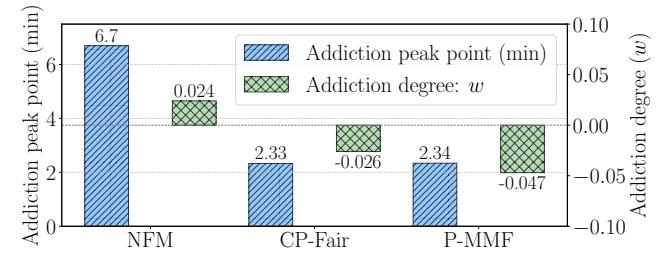
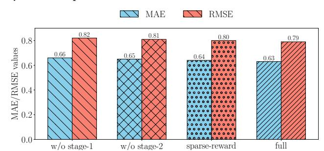
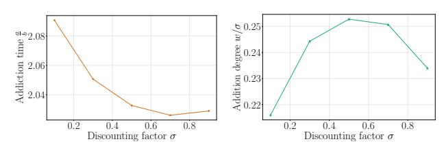

# Unveiling and Simulating Short-Video Addiction Behaviors via Economic Addiction Theory

[Chen Xu](https://orcid.org/0000-0002-3070-9358) Renmin University of China Beijing, China xc\_chen@ruc.edu.cn

[Zhipeng Yi](https://orcid.org/0009-0009-4049-9540) University of Science and Technology of China Hefei, China zhipengyi@mail.ustc.edu.cn

[Ruizi Wang](https://orcid.org/0009-0000-6945-4404) University of Science and Technology of China Hefei, China wangrz\_ustc@mail.ustc.edu.cn

[Wenjie Wang](https://orcid.org/0000-0002-5199-1428)∗ University of Science and Technology of China Hefei, China wenjiewang96@gmail.com

[Jun Xu](https://orcid.org/0000-0001-7170-111X)∗ Renmin University of China Beijing, China junxu@ruc.edu.cn

[Maarten de Rijke](https://orcid.org/0000-0002-1086-0202) University of Amsterdam Amsterdam, The Netherlands m.derijke@uva.nl

### Abstract

Short-video applications have attracted substantial user traffic. However, these platforms also foster problematic usage patterns, commonly referred to as short-video addiction, which pose risks to both user health and the sustainable development of platforms. Prior studies on this issue have primarily relied on questionnaires or volunteer-based data collection, which are often limited by small sample sizes and population biases. In contrast, short-video platforms have large-scale behavioral data, offering a valuable foundation for analyzing addictive behaviors. To examine addictionaware behavior patterns, we combine economic addiction theory with users' implicit behavior captured by recommendation systems. Our analysis shows that short-video addiction follows functional patterns similar to traditional forms of addictive behavior (e.g., substance abuse) and that its intensity is consistent with findings from previous social science studies. To develop a simulator that can learn and model these patterns, we introduce a novel training framework, AddictSim. To consider the personalized addiction patterns, AddictSim uses a mean-to-adapted strategy with group relative policy optimization training. Experiments on two large-scale datasets show that AddictSim consistently outperforms existing training strategies. Our simulation results show that integrating diversity-aware algorithms can mitigate addictive behaviors well.

### CCS Concepts

• Information systems → Retrieval tasks and goals.

### Keywords

Short-video recommendation, Addiction behavior, Economic theory

#### ACM Reference Format:

Chen Xu, Zhipeng Yi, Ruizi Wang, Wenjie Wang, Jun Xu, and Maarten de Rijke. 2026. Unveiling and Simulating Short-Video Addiction Behaviors via

∗ Jun Xu and Wenjie Wang are corresponding authors.

[This work is licensed under a Creative Commons Attribution 4.0 International License.](https://creativecommons.org/licenses/by/4.0)

WWW '26, Dubai, United Arab Emirates © 2026 Copyright held by the owner/author(s). ACM ISBN 979-8-4007-2307-0/2026/04 <https://doi.org/10.1145/3774904.3792216>

Economic Addiction Theory. In Proceedings of the ACM Web Conference 2026 (WWW '26), April 13–17, 2026, Dubai, United Arab Emirates. ACM, New York, NY, USA, [11](#page-10-0) pages. <https://doi.org/10.1145/3774904.3792216>

## 1 Introduction

In recent years, short-video applications, exemplified by platforms such as TikTok and Xiaohongshu, have witnessed a rapid surge in popularity across web ecosystems. While these platforms attract substantial user traffic through rapid content consumption, they also foster problematic usage patterns, often referred to as the short-video addiction problem [\[42,](#page-8-0) [44\]](#page-8-1). Such a problem refers to a compulsive tendency to continuously consume short videos, which impacts both users' cognitive development, psychological health, and even the web ecosystem [\[6,](#page-8-2) [9,](#page-8-3) [42\]](#page-8-0). However, the short-video addiction problem remains underexplored, highlighting the necessity for systematic research and intervention.

Previous studies on short-video addiction have predominantly relied on questionnaires, volunteer-based data collection, and selfreport studies [\[9,](#page-8-3) [41,](#page-8-4) [42,](#page-8-0) [44\]](#page-8-1). Such methods are often limited by small sample sizes and potential biases arising from the characteristics of the target populations. In contrast, web-based short-video platforms generate large-scale behavioral data covering a broad spectrum of users, offering a more comprehensive perspective for analyzing addictive behaviors. To better analyze such behaviors, in this paper, we propose a two-step analysis paradigm: (1) analyzing behaviors with economic theory to define the objective, (2) enabling a simulator to learn this objective.

Step 1: Addiction behavior discovering (Section [4\)](#page-2-0). Firstly, addiction behaviors can be formalized based on the economic theory of addiction [\[36\]](#page-8-5), which posits that past consumption of a good increases current utility, thereby fostering habitual or compulsive behavior. However, directly applying this theory is challenging because real-world datasets in recommendation systems (RS) typically record only implicit interaction (e.g., clicks and watch times) rather than explicit economic utilities. To overcome this limitation, we observe that implicit feedback can still be interpreted as the outcome of a rational economic decision-making process [\[14\]](#page-8-6). Hence, by integrating the economic theory of addiction with users' implicit behavioral data in RS [\[40\]](#page-8-7), we construct an addiction model tailored for short-video platforms. Finally, this model is trained on

Figure 1: Addiction patterns on a popular short-video platform. The x-axis represents cumulative user watch time, and the y-axis represents user utility.

real-world short-video interaction data[1](#page-1-0) to quantify and analyze user addiction behaviors in our experiments.

The primary experimental results are illustrated in Figure [1.](#page-1-1) Our main finding is that users' short-video addictive behavior largely exhibits trends similar to those observed in traditional forms of addiction (e.g., substance abuse). In Figure [1,](#page-1-1) during the initial stage (green line), users' utility increases with longer watch time (addiction phase); after a certain point, addictive behavior reaches its peak (black dot); subsequently (red line), users begin to experience fatigue (recovery phase), eventually ceasing video consumption. Our results align with previous findings from volunteer-based studies [\[13\]](#page-8-8). These findings help us to build a solid simulator.

Step 2: Simulator development and application (Section [5\)](#page-4-0). Based on our analysis of user addiction-aware behavior, we develop a simulator capable of learning and modeling such behavior. This simulator enables large-scale automatic evaluation and facilitates the study of addiction dynamics under different algorithms, thereby supporting the design of a more responsible and healthy web ecosystem. However, directly applying a large language model (LLM)-based simulator to learn the aforementioned addiction-aware objective presents a major challenge, i.e., that of personalized addiction patterns, as different users exhibit distinct addictive behaviors, which complicate the training process. To tackle this challenge, we introduce a training framework, AddictSim, that integrates with a mean-to-adapted (M2A) training strategy to effectively conduct group relative policy optimization (GRPO) training [\[30\]](#page-8-9). In the first stage, AddictSim predicts the average addiction-related rewards to pre-train the LLMs using GRPO. In the second stage, it refines the addiction model to estimate individualized behavioral rewards for each user and then applies these rewards across user groups, thereby improving the realism of simulated user behavior. Experiments on two large-scale datasets verify that AddictSim outperforms other baseline training strategies.

After constructing the simulator, it can be employed to emulate user feedback, thereby enabling automatic evaluation of algorithmic performance. Our simulations indicate that diversity-aware approaches [\[23,](#page-8-10) [39\]](#page-8-11), which enhance item category diversity, effectively redirect user attention and mitigate addictive behavior. This demonstrates the simulator's value in realistically modeling user interactions, facilitating the testing of different recommendation algorithms, and guiding the design of healthier web platforms.

In summary, our key contributions are three-fold:

- (1) We investigate user short-video addiction behavior and formulate addiction objectives based on economic addiction theory using large-scale user data.
- (2) To build addiction-aware simulators, we propose a novel training framework, AddictSim, which incorporates an M2A strategy with GRPO training strategy.
- (3) Our experimental results demonstrate the effectiveness of AddictSim and show that, through its simulations, diversity-aware approaches can effectively mitigate addictive behaviors. To facilitate reproducibility of our work, we share our code at [https://github.com/XuChen0427/AddictSim.](https://github.com/XuChen0427/AddictSim)

### 2 Related Work

Short-video recommendation. Recommender systems (RS) are designed to identify and deliver items that match user preferences from a large corpus of available options [\[27\]](#page-8-12). Traditional RSs tend to focus on domains such as e-commerce [\[45\]](#page-8-13) and news [\[38\]](#page-8-14), where user–item interactions are usually captured by immediate actions, including exposure, clicks, and purchases. Classical user behavior modeling methods [\[8\]](#page-8-15) are built on the assumption that user clicks are strongly influenced by item ranking positions, i.e., user attention decreases as the rank position goes down. With the rapid rise of short-video platforms, however, the nature of items has shifted to short videos, typically lasting less than ten minutes [\[11,](#page-8-16) [22,](#page-8-17) [26\]](#page-8-18). Such concise content promotes rapid consumption and continuous engagement. In this setting, user behavior has evolved: instead of clicks, watch time has become the primary signal, with users often spending extended time on individual items [\[11\]](#page-8-16).

Short-video addiction. Short videos' negative impacts pose significant challenges to the sustainability of the online ecosystem [\[9\]](#page-8-3). Previous studies in psychology and behavioral science have shown that user behavior in short-video consumption differs fundamentally from traditional item interactions, often manifesting addictive tendencies. Such behavior is characterized by excessive and hard-tocontrol usage, where users become immersed in endlessly scrolling through videos to obtain instant entertainment and psychological gratification [\[9,](#page-8-3) [24\]](#page-8-19). Prior research on addictive behavior has primarily relied on survey-based methods, self-reported information from volunteers, or controlled lab studies. In survey-based approaches [\[9,](#page-8-3) [24,](#page-8-19) [42,](#page-8-0) [44\]](#page-8-1), researchers typically design questionnaires to measure self-perceived levels of problematic usage and psychological dependence. Self-report studies [\[41\]](#page-8-4) ask participants to provide retrospective accounts of their short-video usage, motivations, or feelings of loss of control. Volunteer-based experiments [\[6\]](#page-8-2) often recruit small groups of users to monitor their usage under specific conditions. While these methods provide valuable psychological and qualitative insights, they are limited by subjective biases

(e.g., memory errors, underreporting, or social desirability effects). Simulator learning. To model and observe the impact of user behavior, prior research has often employed user simulators as a tool [\[2\]](#page-8-20). Traditional simulators are typically built using statistical approaches, such as modeling user behavior by estimating action frequencies [\[7,](#page-8-21) [8\]](#page-8-15). While simple and interpretable, these methods lack generalizability and fail to capture the complexity of real-world user interactions. With the advent of LLMs and their capabilities in understanding user intent and using broad world knowledge, LLMs have emerged as a promising foundation for building user

1[https://github.com/tsinghua-fib-lab/ShortVideo\\_dataset](https://github.com/tsinghua-fib-lab/ShortVideo_dataset)

From Figure [3,](#page-3-2) we can clearly observe that both datasets exhibit a consistently non-zero addiction degree (�� &gt; 0), indicating the presence of addictive behavior among users. In addition, the average duration of addiction is measured to be 6.7 minutes for the THU dataset and 4.9 minutes for the KuaiRec dataset, suggesting that users on these platforms tend to engage with short videos for a sustained period during each session. Moreover, this result is consistent with previous findings at the Arab Open University, where students were observed to watch short videos for an average of 5.63 minutes per view [\[13\]](#page-8-8). These findings provide empirical support for modeling user behavior with addiction-aware mechanisms.

Addiction degree (RQ2). To answer RQ2, we compare users' addictive behaviors across short-video recommendation scenarios and other recommendation settings. To this end, we use the Qilin hybrid recommendation dataset [\[4\]](#page-8-35), which provides a comprehensive collection of user sessions with heterogeneous content types, including image-text notes, video notes, commercial notes, and direct answers. In addition, we consider the Ali dataset,[2](#page-4-1) which samples 1,140,000 users from Taobao (a traditional e-commerce platform) over eight days of ad display and click logs, resulting in 26 million records that form the original sample skeleton. The experimental setup follows the same protocol as in previous sections.

Figure [4](#page-4-2) shows the results, where the x-axis represents cumulative user watch time and the y-axis represents user utility (same settings as Figure [1\)](#page-1-1). From the figure, we can observe that in the traditional e-commerce recommendation setting (Ali dataset, green line), users exhibit almost no addictive behavior, as their marginal gains remain nearly constant over time. In contrast, the hybrid recommendation scenario (Qilin dataset, orange line) shows varying levels of addiction across different content types: for instance, users display slight addictive behavior toward text-based content in the first 30 seconds, whereas video content induces a longer addictive period of 2–3 minutes. Finally, in the pure short-video scenario (THU dataset, blue curve), users exhibit the most pronounced addictive behavior, with the longest duration.

Figure 4: Comparison of addictive behaviors across different recommendation scenarios, including short-video, hybrid, and traditional e-commerce settings.

These observations indicate that addictive behavior is a newly emerging and severe issue in short-video recommendation settings, highlighting the need to pay particular attention to this problem in such short-video scenarios.

Addiction heterogeneity (RQ3). To answer RQ3, we first categorized users based on their short-video viewing frequency into three groups: Low-Frequency (fewer than 100 views), Medium-Frequency

(100–200 views), and High-Frequency (more than 300 views). We then examined the trends in addictive behaviors across user groups.

Figure [5](#page-4-3) presents the results, where the x-axis represents Low-Frequency, Medium-Frequency, and High-Frequency users, and the y-axis shows the parameters ��, ��, and �� from the addiction model. From the figure, we observe that for the addiction intensity (�� ), users who rarely watch short videos exhibit minimal addictive behavior (�� is close to 0), whereas Medium-Frequency users show the highest addiction intensity, although their continuous addictive duration (��/��) is relatively short. In contrast, High-Frequency users display moderate addiction intensity, but their continuous addictive duration is relatively long (��/�� is larger).

Figure 5: Addictive behaviors among different user groups.

Furthermore, we analyzed users' additional profiles, as shown in Table [2.](#page-4-4) Specifically, we examined the proportion of addictive users (�� &gt; 0) across different attributes, including gender (male, female), age (18–35 as young-aged, 36–55 as middle-aged, and 55+ as old-aged), residence (urban and rural), and income level (mobile phone price <2k as low-income, 2k–4k as middle-income, and 4k+ as high-income).

Table 2: Proportion of addictive users (�� &gt; 0) across different user attributes, including gender, age group, place of residence, and income level.

| Male  | Female | Young-Aged | Middle-Aged   | Old-Aged    |
|-------|--------|------------|---------------|-------------|
| 49.3% | 50.7%  | 35.9%      | 34.1%         | 30.0%       |
| Urban | Rural  | Low-Income | Middle-Income | High-Income |
| 46.4% | 53.6%  | 35.0%      | 32.0%         | 33.0%       |

From Table [2,](#page-4-4) we can observe that addictive behaviors vary across different user attributes. In terms of gender, the differences are minor, though female users exhibit slightly stronger addictive tendencies. Regarding age, younger users display significantly more severe addictive behaviors than older users. For residence and income level, users living in rural areas and those with lower income levels show a stronger propensity for addiction. These findings are consistent with prior research, suggesting that young and low-income users are more susceptible to addictive behaviors, and therefore represent a group that requires greater protection.

These observations indicate that users differ in both the intensity and duration of addictive behaviors, motivating the need for a simulator that can capture such heterogeneity. To this end, we propose a simulator to model user-specific addiction attributes.

#### 5 Simulator: AddictSim

After constructing the economic addiction model in Eq. [\(7\)](#page-3-1), we use it as the reward model to train an LLM-based simulator, termed AddictSim.

2<https://tianchi.aliyun.com/dataset/56>

Table 3: Performance comparison between our simulator AddictSim and other training methods. ∗ indicates that the improvements over the best baseline (marked as underlined) are statistically significant (t-tests and ��-value &lt; 0.05).

|           | MAE  | Session RMSE | THU MAE | Video RMSE | MAE    | Session RMSE | KuaiRec MAE | Video RMSE |
|-----------|------|--------------|---------|------------|--------|--------------|-------------|------------|
| Base      | 6.84 | 9.57         | 0.96    | 1.18       | 2.79   | 3.19         | 0.35        | 0.47       |
| STF       | 3.12 | 4.64         | 0.77    | 1.01       | 2.25   | 2.60         | 0.31        | 0.42       |
| PPO       | 2.28 | 3.70         | 0.65    | 0.81       | 1.96   | 2.40         | 0.30        | 0.42       |
| GRPO      | 2.33 | 3.87         | 0.65    | 0.82       | 2.02   | 2.46         | 0.32        | 0.44       |
| AddictSim | 2.03 | ∗ 3.31       | ∗ 0.63  | ∗ 0.79     | ∗ 1.72 | ∗ 2.35       | ∗ 0.29      | ∗ 0.42     |

#### 5.3 Experimental results

We use the two aforementioned short-video datasets, THU and KuaiRec, to verify the effectiveness of our framework M2A.

5.3.1 Experimental settings. We summarize the settings of the baseline and the implementation details.

Baseline strategies. We choose the following commonly used simulator training strategies: Base Model: The model is not trained, and directly relies on prompts to predict the user's video-watching duration. In the main experiments, we use Qwen3 [\[1\]](#page-8-36) as a base model; SFT [\[25\]](#page-8-37): The model is trained in a supervised manner, where the ground-truth user watch time is used as the label; PPO [\[28\]](#page-8-38): An actor-critic reinforcement learning algorithm that is widely applied during the RL fine-tuning stage of LLMs; GRPO [\[30\]](#page-8-9): An improved variant of PPO that replaces the advantage function with intragroup rewards. Note that the PPO and GRPO's reward is designed as the learned utilities of the addiction model.

Implementation details. As for the hyperparameters in all models, the learning rate was tuned among [2×10−5 , 2×10−6 ] and the LLM parameter ��, �� were set as 0.3 and 0.9, respectively. The batch size is tuned among [4, 64], and the propagation rate is tuned among [0.0, 1.0]. The time discounting factor �� is tuned among [0.1, 0.9]. All the experiments used the Low-Rank Adaptation (LoRA) [\[16\]](#page-8-39) technique to learn the parameters. We implement the training process using the verl [\[31\]](#page-8-40) framework. All experiments were conducted on a Linux platform, with four NVIDIA A800 GPUs.

5.3.2 Evaluation metrics. Since the primary objective of the simulator in this study is to predict users' video-watching duration. Here, we test on both session-level accuracy and video-level accuracy. Follow prior work [\[20\]](#page-8-41) and adopt mean absolute error (MAE) and root mean squared error (RMSE) as evaluation metrics. These metrics measure the discrepancy between the simulator-predicted watch time and the actual user watch time. We will both evaluate the session-level and video-level accuracy:

Session-level. Since we focus on session-level addiction behavior, we evaluate the prediction accuracy as:

MAE = Mean(| Í���� ��=1 ��ˆ�� − Í���� ��=1 ���� |), (15)

RMSE = √︃ Mean[(Í���� ��=1 ��ˆ�� − Í���� ��=1 ����) 2 ]. (16)

Video-level. For the video level, we simply predict the prediction accuracy of individual videos:

MAE = Mean  ��ˆ�� −���� , RMSE = √︁ Mean[(��ˆ�� − ����) 2 ]. (17)

5.3.3 Effectiveness of proposed AddictSim. Next, we present experiments to evaluate the effectiveness of the proposed simulator, AddictSim. The overall results are summarized in Table [3,](#page-6-0) which compares AddictSim with baseline training methods across two datasets, measured by MAE and RMSE at both the session- and video-level. Entries marked with ∗ indicate statistically significant improvements over the best baseline (t-test, �� &lt; 0.05), while underlined values denote the best-performing methods.

The results indicate that AddictSim significantly outperforms all baselines in terms of MAE and RMSE across both datasets. This confirms its effectiveness in improving watch-time prediction accuracy and highlights its advantage as a training framework for short-video scenarios.

5.3.4 Experimental analysis. In this section, we present experimental analyses using the THU dataset as a case study, while noting that similar patterns are observed across the other datasets. For other ablation studies on different LLM backbones and discounting factor ��, please reference Appendix [C](#page-9-1) and [E.](#page-10-1)

Addiction patterns in AddictSim. In this section, we aim to investigate whether the simulator AddictSim successfully captures user addiction behaviors. To this end, we plot the changes in user utility (y-axis) with respect to consumption time (x-axis) based on the simulator's watch time predictions. Figure [6](#page-6-1) presents the results for both the Base model (Qwen-2.5B) and AddictSim predictions.

From Figure [6,](#page-6-1) we can observe that although the Base model prompts LLMs to learn addictive behaviors, the blue line indicates that it fails to exhibit typical addiction patterns (without recovery phases). In contrast, our simulator reproduces addiction patterns similar to those shown in Figure [1,](#page-1-1) demonstrating that our approach effectively enables LLMs to capture user addiction behaviors.

Figure 6: Addiction patterns of the simulator Base Model and AddictSim, with the x-axis representing cumulative user watch time and the y-axis representing user utility.

Ablation study. In this part, we aim to conduct an ablation study for AddictSim. Figure [7](#page-7-0) presents the ablation results, where "w/o stage-1" and "w/o stage-2" correspond to training without stage-1 and stage-2, respectively. "sparse-reward" denotes that we do not involve the discounted reward allocation scheme introduced in Section [5.](#page-4-0) While "full" indicates training with both stages. For video-level, please see the Appendix (Figure [9\)](#page-9-2).

From the results shown in Figure [7,](#page-7-0) we observe that the "full" model, which includes both stage-1 and stage-2, outperforms "w/o stage-1" and "w/o stage-2", demonstrating the effectiveness of both stages. This is because stage-1 captures the average behavior of users, providing stage-2 with a solid initialization to model personalized

Figure 7: Ablation study at the session-level. "w/o stage-1" and "w/o stage-2" denote training without stage-1 and stage-2, respectively. "sparse-reward" denotes that we do not involve the discounted reward allocation scheme introduced in Section [5.](#page-4-0) And "full" indicates training with both stages.

behaviors while mitigating high variance in stage-2. Meanwhile, we also observe that the "full" model outperforms the "sparse-reward" model, indicating that our discounted reward allocation scheme is effective and helps reduce high variance during training.

### 5.4 Simulation for addiction mitigation

In this section, we aim to use our trained simulator, AddictSim, to replicate realistic patterns of user addiction behaviors. The simulator allows us to examine how users' engagement evolves under different recommendation strategies and to assess whether these algorithms exacerbate or alleviate addictive tendencies. By simulating such interactions, we can assess the impact of algorithmic choices on user well-being and provide insights into designing RS that balance effectiveness with responsible usage.

In our simulation, we investigate whether the diversity-aware re-ranking algorithms CP-Fair [\[23\]](#page-8-10) and P-MMF [\[39\]](#page-8-11) affect users' addiction behaviors based on ranking results from NFM [\[15\]](#page-8-30). Both CPFair and P-MMF are designed to enhance provider exposure; in our setting, we define the top-level video categories as providers and aim to balance the exposure across these categories. Notably, in the THU dataset, each video is classified into a three-level categories.

For the re-ranking setup, consider a session �� with the original user watching sequence {��1,��2, . . . ,������ }. We can treat this sequence as a ranked list and apply a diversity-aware re-ranking algorithm that promotes lower-popularity videos to higher positions. As a result, the re-ranked sequence exposed to the user becomes: {�� ′ 1 ,��′ , . . . ,��′ ���� }. Then, AddictSim predicts the watching time �� ′ �� for each ��-th video in the newly generated session sequences. Finally, we use the addiction model introduced in Section [4](#page-2-0) to measure the addiction behaviors under different recommendation strategies.

Simulation results. Figure [8](#page-7-1) presents the results of simulated user addiction behaviors, measured in terms of the addiction peak point (blue bars) and addiction degree (green bars). From the results, we can clearly see that diversity-aware algorithms can substantially reduce addictive behaviors, shifting the addiction peak from 6.7 minutes to around 2.3 minutes and reducing the addiction degree �� from a positive to a negative value. These findings indicate that presenting users with more diverse and less-popular videos can effectively disrupt addictive patterns.

Our findings indicate that users are more susceptible to prolonged engagement when presented with similar video categories, whereas content diversification tends to mitigate such addictive

Figure 8: Addiction peak point and addiction degree for a ranking model (NFM) and two diversity-aware re-ranking models (CP-Fair, and P-MMF).

behaviors. Such results provide practical guidance for platforms or regulatory authorities to adopt diversity-aware recommendation algorithms for teenagers who require protection.

Furthermore, our experiments offer a useful framework for evaluating different algorithms aimed at mitigating addiction effects. We intend to further quantify the longitudinal impact of this diversityengagement trade-off in future work.

#### 6 Conclusion and Discussion

We have examined user short-video addiction behaviors through the lens of economic addiction theory, revealing severe addiction patterns using large-scale user data. We have proposed a novel simulator, AddictSim, which integrates M2A with GRPO training strategies. Extensive experimental results validate the effectiveness of our simulator. Moreover, we provide a practical example demonstrating how simulating user behavior can help identify diversity-aware approaches that effectively mitigate addictive behaviors. Our work offers valuable practical guidance for platforms and regulatory authorities to assess addiction problems in various scenarios and to foster healthier web ecosystems.

While this paper primarily addresses anti-addiction problems, in an industrial context, the same underlying addictive mechanisms can be leveraged to optimize platform growth. For adult users, the focus may shift from total cessation of use to engagement management, particularly in mitigating the negative effects of the Recovery Phase. Our empirical findings suggest that content similarity is a primary driver of user fatigue; by identifying these saturation points, AddictSim can help design scheduling algorithms that maintain long-term retention without reaching the threshold of burnout.

#### Acknowledgments

This work was funded by the National Key R&D Program of China (2023YFA1008704), the National Natural Science Foundation of China (No. 62472426, 62572451). This research was also (partially) supported by the Dutch Research Council (NWO), under project numbers 024.004.022, NWA.1389.20.183, and KICH3.LTP.20.006, and the European Union under grant agreements No. 101070212 (FINDHR) and No. 101201510 (UNITE). All content represents the opinion of the authors, which is not necessarily shared or endorsed by their respective employers and/or sponsors.

#### References

[1] Jinze Bai, Shuai Bai, Yunfei Chu, Zeyu Cui, Kai Dang, Xiaodong Deng, Yang Fan, Wenbin Ge, Yu Han, Fei Huang, et al. 2023. Qwen technical report. arXiv preprint arXiv:2309.16609 (2023). [2] Krisztian Balog, Nolwenn Bernard, Saber Zerhoudi, and ChengXiang Zhai. 2025. Theory and Toolkits for User Simulation in the Era of Generative AI: User Modeling, Synthetic Data Generation, and System Evaluation. In Proceedings of the 48th International ACM SIGIR Conference on Research and Development in Information Retrieval (Padua, Italy) (SIGIR '25). Association for Computing Machinery, New York, NY, USA, 4138–4141. [3] Åke Björck. 1990. Least squares methods. Handbook of numerical analysis 1 (1990), 465–652. [4] Jia Chen, Qian Dong, Haitao Li, Xiaohui He, Yan Gao, Shaosheng Cao, Yi Wu, Ping Yang, Chen Xu, Yao Hu, Qingyao Ai, and Yiqun Liu. 2025. Qilin: A Multimodal Information Retrieval Dataset with APP-level User Sessions. arXiv[:2503.00501](https://arxiv.org/abs/2503.00501) [cs.IR] [5] Luyu Chen, Quanyu Dai, Zeyu Zhang, Xueyang Feng, Mingyu Zhang, Pengcheng Tang, Xu Chen, Yue Zhu, and Zhenhua Dong. 2025. RecUserSim: A Realistic and Diverse User Simulator for Evaluating Conversational Recommender Systems. In Companion Proceedings of the ACM on Web Conference 2025 (Sydney NSW, Australia) (WWW '25). Association for Computing Machinery, New York, NY, USA, 133–142. [6] Yuhan Chen, Mingming Li, Fu Guo, and Xueshuang Wang. 2023. The effect of short-form video addiction on users' attention. Behaviour & Information Technology 42, 16 (2023), 2893–2910. [7] Romain Deffayet, Thibaut Thonet, Dongyoon Hwang, Vassilissa Lehoux, Jean-Michel Renders, and Maarten de Rijke. 2024. SARDINE: Simulator for Automated Recommendation in Dynamic and Interactive Environments. ACM Trans. Recomm. Syst. 2, 3, Article 25 (June 2024), 34 pages. [8] Georges E Dupret and Benjamin Piwowarski. 2008. A user browsing model to predict search engine click data from past observations.. In Proceedings of the 31st annual international ACM SIGIR conference on Research and development in information retrieval. 331–338. [9] Yafei Feng, Lifu Li, and Anqi Zhao. 2024. A cognitive-emotional model from mobile short-form video addiction to intermittent discontinuance: the moderating role of neutralization. International Journal of Human–Computer Interaction 40, 7 (2024), 1505–1517. [10] Chongming Gao, Shijun Li, Wenqiang Lei, Jiawei Chen, Biao Li, Peng Jiang, Xiangnan He, Jiaxin Mao, and Tat-Seng Chua. 2022. KuaiRec: A Fully-observed Dataset and Insights for Evaluating Recommender Systems. In Proceedings of the 31st ACM International Conference on Information & Knowledge Management (Atlanta, GA, USA) (CIKM '22). Association for Computing Machinery, New York, NY, USA, 540–550. [11] Xudong Gong, Qinlin Feng, Yuan Zhang, Jiangling Qin, Weijie Ding, Biao Li, Peng Jiang, and Kun Gai. 2022. Real-time Short Video Recommendation on Mobile Devices. In Proceedings of the 31st ACM International Conference on Information & Knowledge Management (Atlanta, GA, USA) (CIKM '22). Association for Computing Machinery, New York, NY, USA, 3103–3112. [12] Aaron Grattafiori, Abhimanyu Dubey, Abhinav Jauhri, and et al. 2024. The Llama 3 Herd of Models. arXiv[:2407.21783](https://arxiv.org/abs/2407.21783) [cs.AI] [13] Oussama H Hamid and A El Samad. 2015. The blurred line between "long" and "short": How the length of video lectures affects the viewing behavior of e-learners. Computer Engineering and Intelligent Systems 6, 3 (2015), 32–37. [14] F Maxwell Harper, Xin Li, Yan Chen, and Joseph A Konstan. 2005. An economic model of user rating in an online recommender system. In International conference on user modeling. Springer, 307–316. [15] Xiangnan He and Tat-Seng Chua. 2017. Neural factorization machines for sparse predictive analytics. In Proceedings of the 40th International ACM SIGIR conference on Research and Development in Information Retrieval. 355–364. [16] Edward J. Hu, Yelong Shen, Phillip Wallis, Zeyuan Allen-Zhu, Yuanzhi Li, Shean Wang, Lu Wang, and Weizhu Chen. 2021. LoRA: Low-Rank Adaptation of Large Language Models. arXiv[:2106.09685](https://arxiv.org/abs/2106.09685) [cs.CL] <https://arxiv.org/abs/2106.09685> [17] Albert Q. Jiang, Alexandre Sablayrolles, and et al. 2023. Mistral 7B. arXiv[:2310.06825](https://arxiv.org/abs/2310.06825) [cs.CL] [18] Pierre Lebreton and Kazuhisa Yamagishi. 2020. Study on viewing completion ratio of video streaming. In 2020 IEEE 22nd International Workshop on Multimedia Signal Processing (MMSP). IEEE, 1–6. [19] Chengzhi Lin, Shuchang Liu, Chuyuan Wang, and Yongqi Liu. 2024. Conditional quantile estimation for uncertain watch time in short-video recommendation. arXiv preprint arXiv:2407.12223 (2024). [20] Xiao Lin, Xiaokai Chen, Linfeng Song, Jingwei Liu, Biao Li, and Peng Jiang. 2023. Tree based progressive regression model for watch-time prediction in short-video recommendation. In Proceedings of the 29th ACM SIGKDD Conference on Knowledge Discovery and Data Mining. 4497–4506. [21] Fei Liu, Xinyu Lin, Hanchao Yu, Mingyuan Wu, Jianyu Wang, Qiang Zhang, Zhuokai Zhao, Yinglong Xia, Yao Zhang, Weiwei Li, Mingze Gao, Qifan Wang, Lizhu Zhang, Benyu Zhang, and Xiangjun Fan. 2025. RecoWorld: Building Simulated Environments for Agentic Recommender Systems. arXiv[:2509.10397](https://arxiv.org/abs/2509.10397) [cs.IR] [22] Yang Liu, Cheng Lyu, Zhiyuan Liu, and Dacheng Tao. 2019. Building effective short video recommendation. In 2019 IEEE International Conference on Multimedia & Expo Workshops (ICMEW). IEEE, 651–656. [23] Mohammadmehdi Naghiaei, Hossein A Rahmani, and Yashar Deldjoo. 2022. CP-Fair: Personalized Consumer and Producer Fairness Re-ranking for Recommender Systems. arXiv preprint arXiv:2204.08085 (2022). [24] Weiguaju Nong, Zhen He, Jian-Hong Ye, Yu-Feng Wu, Yu-Tai Wu, Jhen-Ni Ye, and Yu Sun. 2023. The relationship between short video flow, addiction, serendipity, and achievement motivation among Chinese vocational school students: the post-epidemic era context. In Healthcare, Vol. 11. MDPI, 462. [25] OpenAI. 2024. GPT-4 Technical Report. arXiv[:2303.08774](https://arxiv.org/abs/2303.08774) [cs.CL] [26] Yunzhu Pan, Chen Gao, Jianxin Chang, Yanan Niu, Yang Song, Kun Gai, Depeng Jin, and Yong Li. 2023. Understanding and modeling passive-negative feedback for short-video sequential recommendation. In Proceedings of the 17th ACM conference on recommender systems. 540–550. [27] Paul Resnick and Hal R Varian. 1997. Recommender systems. Commun. ACM 40, 3 (1997), 56–58. [28] John Schulman, Filip Wolski, Prafulla Dhariwal, Alec Radford, and Oleg Klimov. 2017. Proximal Policy Optimization Algorithms. arXiv[:1707.06347](https://arxiv.org/abs/1707.06347) [cs.LG] [29] Yu Shang, Chen Gao, Nian Li, and Yong Li. 2025. A Large-scale Dataset with Behavior, Attributes, and Content of Mobile Short-video Platform. In Companion Proceedings of the ACM on Web Conference 2025 (Sydney NSW, Australia) (WWW '25). Association for Computing Machinery, New York, NY, USA, 793–796. [30] Zhihong Shao, Peiyi Wang, Qihao Zhu, Runxin Xu, Junxiao Song, Xiao Bi, Haowei Zhang, Mingchuan Zhang, Y. K. Li, Y. Wu, and Daya Guo. 2024. DeepSeek-Math: Pushing the Limits of Mathematical Reasoning in Open Language Models. arXiv[:2402.03300](https://arxiv.org/abs/2402.03300) [cs.CL] [31] Guangming Sheng, Chi Zhang, Zilingfeng Ye, Xibin Wu, Wang Zhang, Ru Zhang, Yanghua Peng, Haibin Lin, and Chuan Wu. 2024. HybridFlow: A Flexible and Efficient RLHF Framework. arXiv preprint arXiv: 2409.19256 (2024). [32] Jie Sun, Zhaoying Ding, Xiaoshuang Chen, Qi Chen, Yincheng Wang, Kaiqiao Zhan, and Ben Wang. 2024. Cread: A classification-restoration framework with error adaptive discretization for watch time prediction in video recommender systems. In Proceedings of the AAAI Conference on Artificial Intelligence, Vol. 38. 9027–9034. [33] Falcon-LLM Team. 2024. The Falcon 3 Family of Open Models. [34] Kuang Wang, Xianfei Li, Shenghao Yang, Li Zhou, Feng Jiang, and Haizhou Li. 2025. Know You First and Be You Better: Modeling Human-Like User Simulators via Implicit Profiles. arXiv preprint arXiv:2502.18968 (2025). [35] Lei Wang, Chen Ma, Xueyang Feng, Zeyu Zhang, Hao Yang, Jingsen Zhang, Zhiyuan Chen, Jiakai Tang, Xu Chen, Yankai Lin, et al. 2024. A survey on large language model based autonomous agents. Frontiers of Computer Science 18, 6 (2024), 186345. [36] Robert West and Jamie Brown. 2013. Theory of addiction. (2013). [37] Tzu-Tsung Wong and Po-Yang Yeh. 2019. Reliable accuracy estimates from k-fold cross validation. IEEE Transactions on Knowledge and Data Engineering 32, 8 (2019), 1586–1594. [38] Fangzhao Wu, Ying Qiao, Jiun-Hung Chen, Chuhan Wu, Tao Qi, Jianxun Lian, Danyang Liu, Xing Xie, Jianfeng Gao, Winnie Wu, et al. 2020. Mind: A large-scale dataset for news recommendation. In Proceedings of the 58th annual meeting of the association for computational linguistics. 3597–3606. [39] Chen Xu, Sirui Chen, Jun Xu, Weiran Shen, Xiao Zhang, Gang Wang, and Zhenhua Dong. 2023. P-MMF: Provider Max-min Fairness Re-ranking in Recommender System. In Proceedings of the ACM Web Conference 2023. 3701–3711. [40] Hong-Jian Xue, Xinyu Dai, Jianbing Zhang, Shujian Huang, and Jiajun Chen. 2017. Deep Matrix Factorization Models for Recommender Systems.. In IJCAI, Vol. 17. Melbourne, Australia, 3203–3209. [41] Jianmei Ye, Weijun Wang, Dawei Huang, Shihao Ma, Shuna Chen, Wanghao Dong, and Xin Zhao. 2025. Short video addiction scale for middle school students: development and initial validation. Scientific Reports 15, 1 (2025), 9903. [42] Jian-Hong Ye, Yu-Tai Wu, Yu-Feng Wu, Mei-Yen Chen, and Jhen-Ni Ye. 2022. Effects of short video addiction on the motivation and well-being of Chinese vocational college students. Frontiers in Public Health 10 (2022), 847672. [43] An Zhang, Yuxin Chen, Leheng Sheng, Xiang Wang, and Tat-Seng Chua. 2024. On generative agents in recommendation. In Proceedings of the 47th international ACM SIGIR conference on research and development in Information Retrieval. 1807– 1817. [44] Xing Zhang, You Wu, and Shan Liu. 2019. Exploring short-form video application addiction: Socio-technical and attachment perspectives. Telematics and informatics 42 (2019), 101243. [45] Jujia Zhao, Yumeng Wang, Zhaochun Ren, and Suzan Verberne. 2025. Model Meets Knowledge: Analyzing Knowledge Types for Conversational Recommender Systems. In Proceedings of the Nineteenth ACM Conference on Recommender Systems. 802–811.

#### Appendix

#### A Prompt Template Used

We design the LLM prompt as follows. It takes the user's viewing history and profile as input, and predicts the watch time of the current video:

#### Prompt

You are a short video user behavior prediction model. Your only goal is to predict the user's consumption for the current video. Only output decimal Arabic numbers (with decimal points allowed), no Chinese numbers or any text. User data (JSON):

1 {

 "viewing\_history": [ 3 { "video\_id": "33286", "completion\_rate": 0.17, "categories": [" car", "say car review", " Automobile Testing"], "duration": 197.6, "watch\_time": 33.0, "consumption\_reward": 1.531 10 }, 11 {...}] "current\_video": { "video\_id": "12575", "categories": ["history"], "duration": 72.4, "author\_fans": 59478 17 }, "addiction\_stock": 3.17

19 }

Please output the following field: consumption reward: Consumption calculated as ���� = ������10 (1+ predicted watch time) (numeric value).

Strict requirements: 1) Only output the JSON below, no explanations or code blocks. 2) The JSON must be immediately followed by a line <END> as the end marker.

3) Do not output placeholders or text like "value", "NaN", "null", "None".

4) You are predicting the user's consumption Ct for the current video, not the watch time.

Correct example (example only, please output real prediction for current sample):

1 {"consumption\_reward": <decimal float>}

<END>

### B Ablation Study at the Video-level

In this section, we present the video-level ablation study for Addict-Sim shown in Figure [9.](#page-9-2) The metrics are measured as the video-level MAE and RMSE.

From the Figure [9,](#page-9-2) we can also observe that the experimental results consistently highlight the superiority of the 'full' model; by integrating both Stage-1 and Stage-2, it achieves significant performance gains over the 'w/o Stage-1' and 'w/o Stage-2' ablations, as well as the 'sparse-reward' baseline. This performance gap underscores the critical contribution of each stage and validates that their combination creates a synergistic effect that cannot be replicated by either component in isolation.

Figure 9: Ablation study on video-level. "w/o stage-1" and "w/o stage-2" denote training without stage-1 and stage-2, respectively. "sparse-reward" denotes that we do not involve the discounted reward allocation scheme introduced in Section [5.](#page-4-0) And "full" indicates training with both stages.

Table 4: Session-level performance comparison with different LLM backbones on THU Dataset. ∗ indicates that the improvements over the best baseline (marked as underlined) are statistically significant (t-tests and ��-value &lt; 0.05).

|            | Base MAE | model RMSE | MAE  | GRPO RMSE | Ours MAE | (AddictSim) RMSE |
|------------|----------|------------|------|-----------|----------|------------------|
| QWEN2.5-7B | 6.84     | 9.57       | 2.33 | 3.87      | 2.03 ∗   | 3.31 ∗           |
| Falcon3-7B | 3.50     | 5.52       | 2.26 | 3.69      | 2.07 ∗   | 3.50 ∗           |
| Llama-3 8B | 7.92     | 9.93       | 2.53 | 3.89      | 2.35 ∗   | 3.75 ∗           |
| Mistral 7B | 4.73     | 7.82       | 2.31 | 3.73      | 2.08 ∗   | 3.44 ∗           |

### C Robustness across Different LLMs

In this section, we present both video-level and session-level performance comparison across different LLM backbones on the THU dataset. To evaluate the robustness of our proposed method, we replace the backbone LLM with several alternatives, including Llama3 [\[12\]](#page-8-42), Mistral [\[17\]](#page-8-43), and Falcon3 [\[33\]](#page-8-44).

Note that, to evaluate the robustness of our method, we focus on comparing it with the well-performing and most relevant baselines, namely GRPO and the base model.

### C.1 Session-level results for different LLMs

From Table [4,](#page-9-3) we can observe that despite the architectural and training differences among these backbone models, AddictSim consistently achieves notable performance improvements in terms of MAE and RSME. This indicates that the effectiveness of AddictSim is not tied to any specific LLM architecture, but rather generalizes well across a diverse set of models. Such robustness suggests that AddictSim can reliably enhance prediction accuracy regardless of the underlying language model, making it widely applicable in different short-video recommendation scenarios.

Table 5: Performance comparison between our simulator AddictSim and GRPO. ∗ indicates that the improvements over the best baseline (marked as underlined) are statistically significant (t-tests and ��-value &lt; 0.05).

#### C.2 Video-level results for different LLMs

Then, we will present the results for the video-level simulation results of different backbone LLMs. Table [6](#page-10-2) presents the video-level performance comparison across different LLM backbones on the THU dataset, while video-level results exhibit similar trends.

The results align with our earlier findings: despite variations in LLMs, our approach consistently yields significant improvements in MAE and RMSE. This demonstrates that the effectiveness of our method is not dependent on a particular LLM architecture.

Table 6: Video-level performance comparison with different LLM backbones on THU Dataset. ∗ indicates that the improvements over the best baseline (marked as underlined) are statistically significant (t-tests and ��-value &lt; 0.05).

|              | Base MAE | model RMSE | MAE  | GRPO RMSE | Ours MAE | (AddictSim) RMSE |
|--------------|----------|------------|------|-----------|----------|------------------|
| QWEN2.5-7B   | 0.96     | 1.18       | 0.65 | 0.82      | 0.63 ∗   | 0.79 ∗           |
| Falcon3-7B   | 0.77     | 0.95       | 0.66 | 0.82      | 0.65 ∗   | 0.82 ∗           |
| Llama 3.1 8B | 1.11     | 1.38       | 0.76 | 0.98      | 0.68 ∗   | 0.86 ∗           |
| Mistral 7B   | 0.72     | 0.89       | 0.65 | 0.82      | 0.64 ∗   | 0.79 ∗           |

### C.3 Discussion

In Table [4](#page-9-3) and [6,](#page-10-2) our model outperforms all baselines across every LLM backbone on both MAE/RMSE. Our model's performance varies by less than 10% across backbones, compared to up to 55% variation in the base models (common range in recommendation task), and the GRPO-based gains remain consistently within 8–12%. These results demonstrate that our approach is both robust and architecture-insensitive.

Figure 10: Addiction time ��/�� and degree ��/�� w.r.t. discounting factor ��.

### D Performances on Different Users

To rigorously assess the generalizability of our model across diverse user groups, we conducted a granular performance evaluation within the "Urban" and "Rural" contexts, as detailed in Section [4.3.2.](#page-3-5) This analysis allows us to determine whether the model maintains consistent efficacy across varying user groups. We present experiments to evaluate the effectiveness of the proposed AddictSim and the best-performing baseline GRPO on THU dataset. The overall results are summarized in Table [5.](#page-10-3)

From the results, we can observe that our model can outperform GRPO at both session-level and video-level on different user groups. when evaluating urban and rural users separately, our model improves session-level MAE by 15.8% and 10.5%, respectively, over the best baseline (without considering personalized rewards). Other metrics also show consistent gains of 4–12%.

These results further substantiate the effectiveness of our personalized reward mechanism, which is specifically designed to account for the inherent heterogeneity across diverse user groups.

### E Ablation Study for Discounting Factor ��

In this section, we investigate the influence of the discounting factor �� on two key metrics: the addiction duration ��/�� and the addiction degree ��/��.

As illustrated in the left panel of Figure [10,](#page-10-4) the addiction time ��/�� remains relatively stable across varying values of ��, exhibiting only a marginal decrease as �� increases. In contrast, the right panel reveals a non-monotonic relationship between the discounting factor and the addiction degree ��/��. Specifically, the addiction degree initially rises with ��, reaching its peak at approximately �� = 0.5, before gradually declining as �� continues to increase.

Intuitively, �� represents the rate at which a user "forgets" or discounts their historical consumption patterns. When �� is low, the user is primarily driven by immediate gratification from the current video, which prevents the accumulation of deep-seated addiction. Conversely, when �� is excessively high, the user becomes less sensitive to the immediate influence of the current video and tires of the content more rapidly. However, the influence of �� is limited, showing the robustness of our method.